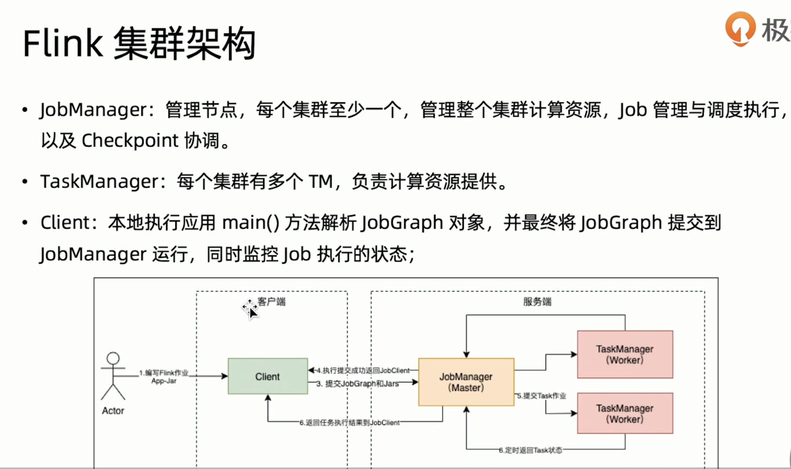
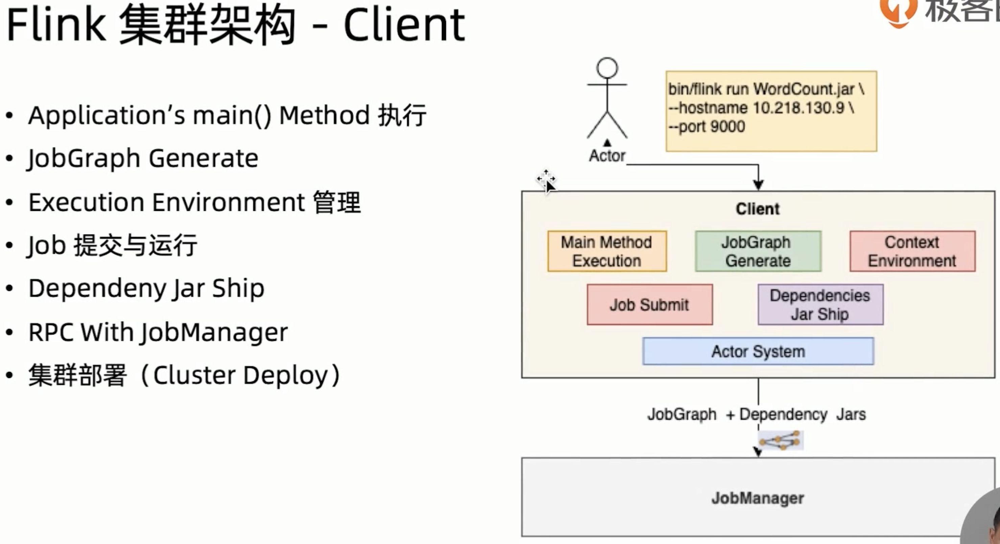

# 综述

目前为应付面试，记录一下介绍性质的文字、一些面试题，以及一些比较好的资料，待之后再整理。

视频资料来自于极客时间《flink核心技术与实战》

> [Flink面试题](https://zhuanlan.zhihu.com/p/138101642)
>
> [Flink面试题大全(建议收藏)](https://blog.csdn.net/weixin_44439549/article/details/109012515)
>
> 

# 核心特性

- 统一数据处理组件栈，streaming dataflow runtime
- 支持事件时间(event time)、接入时间(ingestion time)、处理时间(processing time)
- 基于轻量级分布式快照(snapshot)实现容错，checkpoint，exact once
- 支持有状态计算
- 窗口
- 反压
- 基于jvm实现的独立内存管理

# 集群架构

整体架构图，分为三个部分。

## JobManager

负责整个集群资源的管理以及相应的调度工作，他会负责

1. taskManager之间checkpoint的协调执行。
2. 对于客户端提交的jobGraph（逻辑执行图）生成对应的执行图（物理执行逻辑图）。
3. 等等，对应上图几点

## TaskManager

TaskManager节点之间的数据交互有提供network manager模块，他基于netty来实现网络交互。节点与节点之间进行RPC通信是使用Actor

## Client

### JobGraph

