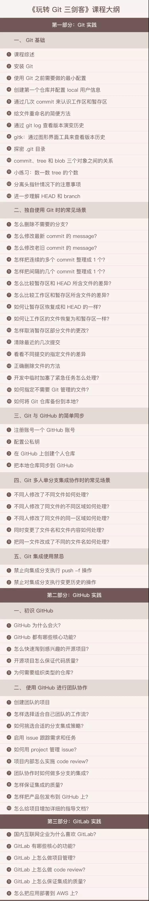
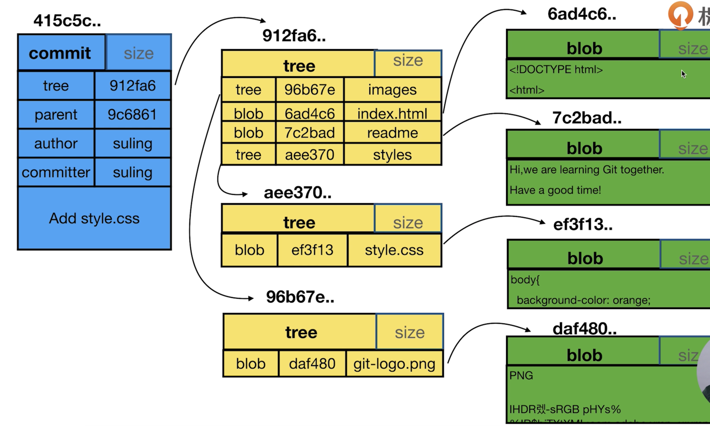
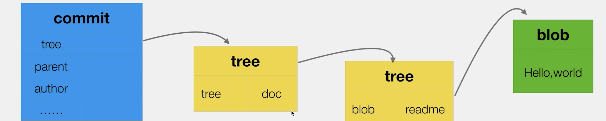
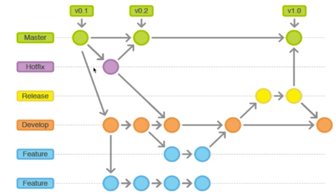

Git

# 综述




git只需要了解基本原理和基本操作，知道每个操作的不同即可，不详细说明内部实现，一般的面试只会考察到是否了解git的基本结构和常用命令，问不到具体实现这么深，也问不到git的差异比较算法（Myers差分算法）。


# 常用命令

**配置**

```shell
git config --global user.name 'your_name'
git config --list --global

# 直接看一下命令手册
usage: git config [<options>]

Config file location
    --global              use global config file
    --system              use system config file
    --local               use repository config file
    --worktree            use per-worktree config file
    -f, --file <file>     use given config file
    --blob <blob-id>      read config from given blob object

Action
    --get                 get value: name [value-regex]
    --get-all             get all values: key [value-regex]
    --get-regexp          get values for regexp: name-regex [value-regex]
    --get-urlmatch        get value specific for the URL: section[.var] URL
    --replace-all         replace all matching variables: name value [value_regex]
    --add                 add a new variable: name value
    --unset               remove a variable: name [value-regex]
    --unset-all           remove all matches: name [value-regex]
    --rename-section      rename section: old-name new-name
    --remove-section      remove a section: name
    -l, --list            list all
    -e, --edit            open an editor
    --get-color           find the color configured: slot [default]
    --get-colorbool       find the color setting: slot [stdout-is-tty]

Type
    -t, --type <>         value is given this type
    --bool                value is "true" or "false"
    --int                 value is decimal number
    --bool-or-int         value is --bool or --int
    --path                value is a path (file or directory name)
    --expiry-date         value is an expiry date

Other
    -z, --null            terminate values with NUL byte
    --name-only           show variable names only
    --includes            respect include directives on lookup
    --show-origin         show origin of config (file, standard input, blob, command line)
    --default <value>     with --get, use default value when missing entry
```


对于任意的git命令，可以后面加--help，查看参数文档


**本地CRUD**

- `git init`

  这个命令把这个目录变成Git可以管理的仓库。在当前文件夹建立一个空的仓库，当前目录下多出了一个`.git`目录，这个目录是Git来跟踪管理版本库的。

- `git status`

  命令用于显示工作目录和暂存区的状态。使用此命令能看到哪些修改被暂存到了, 哪些没有, 哪些文件没有被Git tracked到。

- `git add`

  将修改添加到暂存区。此命令将要提交的文件的信息添加到索引库中，以准备为下一次提交分段的内容。

- `git commit`

  用于将更改记录(提交)到存储库。命令将索引的当前内容与描述更改的用户和日志消息一起存储在新的提交中。

- `git checkout -- file`

  `git checkout -- file`命令中的`--`很重要，没有`--`，就变成了“切换到另一个分支”的命令。

  命令`git checkout -- readme.txt`意思就是，把`readme.txt`文件在工作区的修改全部撤销，这里有两种情况：

  一种是`readme.txt`自修改后还没有被放到暂存区，现在，撤销修改就回到和版本库一模一样的状态；

  一种是`readme.txt`已经添加到暂存区后，又作了修改，现在，撤销修改就回到添加到暂存区后的状态。

- `git rm`

  删除一个文件。之后需要`git commit`把改动提交到仓库。
  
- `git mv sourceName targetName`

  重命名，好处是git帮你完成了，不会生成一个删掉的提交与一个新增的提交，直接帮你合并了


- `git stash`

  令用于将更改储藏在脏工作目录中。

  `git stash list`：查看现有的储藏。

  `git stash apply`：恢复，但是恢复后，stash内容并不删除。

  `git stash drop`：移除储藏的内容。

  `git stash pop`：恢复的同时把stash内容也删了。

- `git diff`

  命令用于显示提交和工作树等之间的更改。此命令比较的是工作目录中当前文件和暂存区域快照之间的差异,也就是修改之后还没有暂存起来的变化内容。（如果是在图形界面里面，是意识不到这个命令的）
  
  ```she
  #当然最常用的是比较两个分支/提交间，某个具体文件的差异
  git diff brach1 brach2 -- fileName
  git diff 9fe71058e29391 989627eaa193ca454 -- fileName
  ```
  
  


- `git tag`

  命令用于创建，列出，删除或验证使用GPG签名的标签对象
  
- `git rebase`

  合并多个提交

- `git reset`

  命令用于将当前`HEAD`复位到指定状态。一般用于撤消之前的一些操作(如：`git add`,`git commit`等)。在Git中，用`HEAD`表示当前版本，上一个版本就是`HEAD^`，上上一个版本就是`HEAD^^`，往上100个版本写成`HEAD~100`。

  常用来回滚，加一个`--hard` 直接强制回滚到指定提交

  也是可以用来操作暂存区，例如干掉暂存区不想要的文件。（干掉工作区不想要的文件是`git checkout -- filename`）

- `git reflog`

  查看命令历史。


**查看日志**

- `git log`

  查看提交历史。后面可以带点参数。

  - `git log -n4 --oneline` ：查看最近的4次提交，一行显示。
  - `git log --all --graph` ：把所有分支的提交打出来并图形化


**分支操作**

- `git branch`

  命令用于列出，创建或删除分支。后面带可选参数。如果无参数，查看当前有哪些分支。

  `$ git branch dev`，创建dev分支。

  `$ git checkout dev`，切换到`dev`分支。

  `$ git branch -d dev`，删除dev分支。

  `git branch -help` ，直接查看参数文档

- `git merge`

  命令用于将两个或两个以上的开发历史加入(合并)一起。


**与远程库交互**

- `git remote add origin git@xxx.git`

  关联一个远程库。

  `git remote`命令管理一组跟踪的远程存储库。远程库的名字就是`origin`，这是Git默认的叫法，也可以改成别的。


- `git push`

  命令用于将本地分支的更新，推送到远程主机。`$ git push <远程主机名> <本地分支名>:<远程分支名>`

  ```shell
  $ git push origin master
  ```

  上面命令表示，将本地的`master`分支推送到`origin`主机的`master`分支。如果`master`不存在，则会被新建。


- `git clone`

  克隆一个仓库


- `git fetch`

  命令用于从另一个存储库下载对象和引用。


# 目录结构

.git文件夹中比较重要的有3个目录HEAD、objects、refs

```shel
-rw-r--r--   1 iven  staff    9 12 11 20:22 COMMIT_EDITMSG
-rw-r--r--   1 iven  staff   23 12 19 16:39 HEAD
drwxr-xr-x   2 iven  staff   64 12 11 19:49 branches/
-rw-r--r--   1 iven  staff  137 12 11 19:49 config
-rw-r--r--   1 iven  staff   73 12 11 19:49 description
drwxr-xr-x  13 iven  staff  416 12 11 19:49 hooks/
-rw-r--r--   1 iven  staff  217 12 19 16:39 index
drwxr-xr-x   3 iven  staff   96 12 11 19:49 info/
drwxr-xr-x   4 iven  staff  128 12 11 19:52 logs/
drwxr-xr-x  18 iven  staff  576 12 11 20:22 objects/
drwxr-xr-x   4 iven  staff  128 12 11 19:49 refs/
```

- HEAD中记录了当前工作的分支。
- objects里面存储commit/tree/blob对象
- refs记录了分支与tag信息


# 常用操作

多人同时修改了一个文件，提交的时候被远端拒绝了，要求你先拉取，但是拉取的时候又要求你把提交先提上去，导致pull下不上也push不上去。

一个branch会在本有有两个对应的分支

```shel
* master                dfba64c rename
  temp                  c886e76 temp add
  remotes/origin/master dfba64c rename
  remotes/origin/temp   c886e76 temp add
```

这种情况下可以先git fetch remotes/origin/temp，把本地的remotes/origin/temp与远端的同步。之后再git merge remotes/origin/temp 解决冲突，最后再push上去。


# 对象结构

git 常用3个对象：commit、tree和blob，他们三个对象之间的关系如下图



- commit是指一次提交。
- tree可以理解位文件夹的一个快照。一次提交必定会挂在某个树下面
- blob映射到一个具体的文件，git认为文件内容相同，就是同一个文件，文件名是无所谓的。

```she
# 可一件使用cat-file命令查看对象的具体内容
git cat-file -p 9fe71058e29391e7
```


在一个空项目中，创建一个文件夹，在文件夹中再新加一个吻文件，提交，会创建4个对象。会给文件夹也创建一个tree对象，同时一个具体的文件会有两个对象，一个指向具体内容的tree与一个存储内容的blob。




# 常见面试题

1. 什么是 Git 复刻（fork）？复刻（fork）、分支（branch）和克隆（clone）之间有什么区别？

   - **复刻（fork）** 是对存储仓库（repository）进行的远程的、服务器端的拷贝，从源头上就有所区别。复刻实际上不是 Git 的范畴。它更像是个政治/社会概念。

   - **克隆（clone）** 不是复刻，克隆是个对某个远程仓库的本地拷贝。克隆时，实际上是拷贝整个源存储仓库，包括所有历史记录和分支。

   - **分支（branch）** 是一种机制，用于处理单一存储仓库中的变更，并最终目的是用于与其他部分代码合并。

2. “拉取请求（pull request）”和“分支（branch）”之间有什么区别？

   - **分支（branch）** 是代码的一个独立版本。

   - **拉取请求（pull request）** 是当有人用仓库，建立了自己的分支，做了些修改并合并到该分支（把自己修改应用到别人的代码仓库）。

3. “git pull”和“git fetch”之间有什么区别？

   简单来说，`git pull` 是 `git fetch` + `git merge`。

   - 当你使用 `pull`，Git 会试着自动为你完成工作。**它是上下文（工作环境）敏感的**，所以 Git 会把所有拉取的提交合并到你当前处理的分支中。`pull` 则是 **自动合并提交而没有让你复查的过程**。如果你没有细心管理你的分支，你可能会频繁遇到冲突。
   - 当你 `fetch`，Git 会收集目标分支中的所有不存在的提交，并**将这些提交存储到本地仓库中**。但**Git 不会把这些提交合并到当前分支中**。这种处理逻辑在当你需要保持仓库更新，在更新文件时又希望处理可能中断的事情时，这将非常实用。而将提交合并到主分支中，则该使用 `merge`。

4. 如在 Git 恢复先前的提交？

   使用`git checkout -- file`，或者`git reset version`直接回滚到指定版本。

5. 如何从 git 中删除文件，而不将其从文件系统中删除？

   如果你在 `git add` 过程中误操作，你最终会添加不想提交的文件。但是，`git rm` 则会把你的文件从你暂存区（索引）和文件系统（工作树）中删除，这可能不是你想要的。换成 `git reset` 操作。

6. git add 和 git stage 有什么区别

   `git add`是把修改提交到暂存区。

   `git stage`是把修改存起来，工作区会恢复与当前版本一致。

7. git reset、git revert 和 git checkout 有什么区别

   `git reset`控制版本回滚至哪个版本，是整个版本回滚。

   `git checkout`可以撤销单个文件的修改，把提交到暂存区的文件撤回到工作区。

   `git revert` 和 `git reset`的区别 

   1. git revert是用一次新的commit来回滚之前的commit，git reset是直接删除指定的commit。 
   2. 在回滚这一操作上看，效果差不多。但是在日后继续merge以前的老版本时有区别。因为git 
       revert是用一次逆向的commit“中和”之前的提交，因此日后合并老的branch时，导致这部分改变不会再次出现，但是git reset是之间把某些commit在某个branch上删除，因而和老的branch再次merge时，这些被回滚的commit应该还会被引入。 
   3. git reset 是把HEAD向后移动了一下，而git revert是HEAD继续前进，只是新的commit的内容和要revert的内容正好相反，能够抵消要被revert的内容。
   4. 不要在公共分支做 git reset 操作。

8. GitFlow 基本流程和你的理解
   - gitflow定义了一个围绕项目发布的严格的分支模型
   - gitflow仍然用中央仓库作为所有开发者的交互中心。

   

   ​	 master: maseter分支，存储正式发布的历史。发布的版本号
   ​	 hotfix：上线分支，bug情急修复分支
   ​	 release：发布分支，发布上线的时候
   ​	 develop：开发分支，作为功能的收集分支。
    	 feature：功能分支，每次开发新功能的时候都会有对应的feature分支


   - feature 分支都是从 develop 分支创建，完成后再合并到 develop 分支上，等待发布。

   - 当需要发布时，我们从 develop 分支创建一个 release 分支

   - 然后这个 release 分支会发布到测试环境进行测试，如果发现问题就在这个分支直接进行修复。在所有问题修复之前，我们会不停的重复**发布->测试->修复->重新发布->重新测试**这个流程。

     发布结束后，这个 release 分支会合并到 develop 和 master 分支，从而保证不会有代码丢失。

   - master 分支只跟踪已经发布的代码，合并到 master 上的 commit 只能来自 release 分支和 hotfix 分支。

   - hotfix 分支的作用是紧急修复一些 Bug

   - 它们都是从 master 分支上的某个 tag 建立，修复结束后再合并到 develop 和 master 分支上。


   GitFlow 的优势有如下几点：

   - 并行开发：GitFlow  可以很方便的实现并行开发：每个新功能都会建立一个新的 feature  分支，从而和已经完成的功能隔离开来，而且只有在新功能完成开发的情况下，其对应的 feature 分支才会合并到主开发分支上（也就是我们经常说的  develop 分支）。另外，如果你正在开发某个功能，同时又有一个新的功能需要开发，你只需要提交当前 feature 的代码，然后创建另外一个  feature 分支并完成新功能开发。然后再切回之前的 feature 分支即可继续完成之前功能的开发。
   - 协作开发：GitFlow 还支持多人协同开发，因为每个 feature 分支上改动的代码都只是为了让某个新的 feature 可以独立运行。同时我们也很容易知道每个人都在干啥。
   - 发布阶段：当一个新  feature 开发完成的时候，它会被合并到 develop 分支，这个分支主要用来暂时保存那些还没有发布的内容，所以如果需要再开发新的  feature，我们只需要从 develop 分支创建新分支，即可包含所有已经完成的 feature 。
   - 支持紧急修复：GitFlow 还包含了 hotfix 分支。这种类型的分支是从某个已经发布的 tag 上创建出来并做一个紧急的修复，而且这个紧急修复只影响这个已经发布的 tag，而不会影响到你正在开发的新 feature。

9. 解释下 PR(Pull Request) 和 MR(Merge Request) 的区别

   PR：提交本地仓库改动到远程仓库。

   MR：在代码完成审核（Code review）之后，把提交合并到分支中。


10. Git是怎样生成diff的：Myers算法

    [Git是怎样生成diff的：Myers算法](https://segmentfault.com/r/1250000009610312?shareId=1210000009610313)


[泪流满面的 11 个 Git 面试题](http://blog.jobbole.com/114297/)

[面试中的那些 Git 问题 - 基础部分](http://www.cocoachina.com/ios/20171023/20873.html)

[Git教程](https://www.liaoxuefeng.com/wiki/0013739516305929606dd18361248578c67b8067c8c017b000)

[从DiffUtil到Myers'差分算法](https://www.jianshu.com/p/7f1473c2e521)

[Gitflow开发流程](https://www.jianshu.com/p/86e370eea416)