  

# 综述

1. 多个JDK版本混合使用，如果没有特别指明，那么本文使用的jdk版本为jdk1.8.0_65。
2. 主要内容是java容器与多线程，面向面试梳理。
4. 文章内大量引用技术博客。


jdk底层大量使用位运算，记录一下基本知识

- <<      :     左移运算符，num << 1,相当于num乘以2
- />>      :     右移运算符，num >> 1,相当于num除以2
- />>>    :     无符号右移，忽略符号位，空位都以0补齐
- ^ ： 亦或运算，不同取1


# 集合类

## 综述

在java.util包下的基本集合类需要掌握

- `ArrayList`

- `LinkedList`

- `HashMap`

- `HashSet`

- `Vector`

  

在面试中，最主要考察的就是以上5种数据结构，其中以HashMap和ArrayList最多。一般是需要能够写出容器底层数据结构，**初始化、动态扩容、插入、删除、查找、遍历**这5个方法的源码。要求能使用自己的语言进行解释说明。ConcurrentHashMap也是考察重点，HashMap与ConcurrentHashMap需要了解jdk8与之前版本的区别。List需要分别写出数组与链表的实现。

HashSet底层使用HashMap。Vector、Stack优先级较低只需要知道实现原理，不要求默写。


```java
* @see     Set
* @see     List
* @see     Map
* @see     SortedSet
* @see     SortedMap
* @see     HashSet
* @see     TreeSet
* @see     ArrayList
* @see     LinkedList
* @see     Vector
* @see     Collections
* @see     Arrays
* @see     AbstractCollection
```


## List 

### Vector

1. Vector 是**矢量队列**，它是JDK1.0版本添加的类。
2. Vector 继承了AbstractList，实现了List；所以，**它是一个队列，支持相关的添加、删除、修改、遍历等功能**。
3.  Vector 实现了RandmoAccess接口，即**提供了随机访问功能**。RandmoAccess是java中用来被List实现，为List提供快速访问功能的。在Vector中，我们即可以通过元素的序号快速获取元素对象；这就是快速随机访问。
4.  Vector 实现了Cloneable接口，即实现clone()函数。它能被克隆。
5.  和ArrayList不同，**Vector中的操作是线程安全的**。同步的实现是在许多方法上增加synchronized关键字。


**问：对于线程安全的集合类（例如Vector）的任何操作是不是都能保证线程安全？**

**答：同步容器中的所有自带方法都是线程安全的，因为方法都使用synchronized关键字标注。但是，对这些集合类的复合操作无法保证其线程安全性。需要客户端通过主动加锁来保证。**

[同步容器（如Vector）并不是所有操作都线程安全！](https://juejin.im/post/5bf4b7876fb9a049d4416cd1)


### Stack

1. java工具包中的Stack是继承于[Vector](http://www.cnblogs.com/skywang12345/p/3308833.html)(矢量队列)，**Stack是通过数组实现的**，**而非链表**。
2. 所以stack也是线程安全的，因为底层使用的是vector进行存储。


2. 源码

   ```java
   public class Stack<E> extends Vector<E> {
       public Stack() {
       }
   
       public E push(E item) {
           addElement(item);
           return item;
       }
   
       public synchronized E pop() {
           E       obj;
           int     len = size();
           obj = peek();
           removeElementAt(len - 1);
   
           return obj;
       }
   
       public synchronized E peek() {
           int     len = size();
           if (len == 0)
               throw new EmptyStackException();
           return elementAt(len - 1);
       }
   
       public boolean empty() {
           return size() == 0;
       }
   
       public synchronized int search(Object o) {
           int i = lastIndexOf(o);
           if (i >= 0) {
               return size() - i;
           }
           return -1;
       }
   
       /** use serialVersionUID from JDK 1.0.2 for interoperability */
       private static final long serialVersionUID = 1224463164541339165L;
   }
   
   ```


### ArrayList

1. ArrayList 是一个**数组队列**，相当于**动态数组**。与Java中的数组相比，它的容量能动态增长。
2. 和Vector不同，**ArrayList中的操作不是线程安全的**！所以，建议在单线程中才使用ArrayList，而在多线程中可以选择Vector或者**CopyOnWriteArrayList**。
3. 无参构造默认大小为10。
4. 扩容的时机 -> 如果是空数组直接扩容，否则就是当大小大过阈值时进行扩容（默认是10）。
5. 扩容的大小为 `int newCapacity = oldCapacity + (oldCapacity >> 1);` 新的大小为旧值 + 旧值的一半。


ArrayList包含了两个重要的对象：**elementData** 和 **size**。

1. elementData 是"Object[]类型的数组"，它保存了添加到ArrayList中的元素。实际上，elementData是个动态数组，我们能通过构造函数  ArrayList(int  initialCapacity)来执行它的初始容量为initialCapacity；如果通过不含参数的构造函数ArrayList()来创建ArrayList，则elementData的容量**默认是10**。elementData数组的大小会根据ArrayList容量的增长而动态的增长，具体的增长方式，请参考源码分析中的ensureCapacity()函数。

2. size 则是动态数组的实际大小。


ArrayList部分源码解析(基于JDK1.8)

```java
package java.util;

public class ArrayList<E> extends AbstractList<E>
        implements List<E>, RandomAccess, Cloneable, java.io.Serializable
{
    // 保存ArrayList中数据的数组
    private transient Object[] elementData;

    // ArrayList中实际数据的数量
    private int size;

    // ArrayList带容量大小的构造函数。
    public ArrayList(int initialCapacity) {
        super();
        if (initialCapacity < 0)
            throw new IllegalArgumentException("Illegal Capacity: "+
                                               initialCapacity);
        // 新建一个数组
        this.elementData = new Object[initialCapacity];
    }

    // ArrayList构造函数。默认容量是10。
    public ArrayList() {
        this(10);
    }

    // 添加元素e
    public boolean add(E e) {
        // 确定ArrayList的容量大小
        ensureCapacity(size + 1);  // Increments modCount!!
        // 添加e到ArrayList中
        elementData[size++] = e;
        return true;
    }
   

    // 确定ArrarList的容量。
    // 若ArrayList的容量不足以容纳当前的全部元素，设置 新的容量=“(原始容量x3)/2 + 1”
    public void ensureCapacity(int minCapacity) {
        int minExpand = (elementData != DEFAULTCAPACITY_EMPTY_ELEMENTDATA)
            // any size if not default element table
            ? 0
            // larger than default for default empty table. It's already
            // supposed to be at default size.
            : DEFAULT_CAPACITY;

        if (minCapacity > minExpand) {
            ensureExplicitCapacity(minCapacity);
        }
    }
    
    private void ensureExplicitCapacity(int minCapacity) {
        modCount++; //用来记录List的更改次数

        // overflow-conscious code
        if (minCapacity - elementData.length > 0)
            grow(minCapacity);
    }
    
    //Arraylist的自动扩展实现
    private void grow(int minCapacity) {
        // overflow-conscious code
        int oldCapacity = elementData.length;
        int newCapacity = oldCapacity + (oldCapacity >> 1);
        if (newCapacity - minCapacity < 0)
            newCapacity = minCapacity;
        if (newCapacity - MAX_ARRAY_SIZE > 0)
            newCapacity = hugeCapacity(minCapacity);
        // minCapacity is usually close to size, so this is a win:
        elementData = Arrays.copyOf(elementData, newCapacity);
    }
    
    private static int hugeCapacity(int minCapacity) {
        if (minCapacity < 0) // overflow
            throw new OutOfMemoryError();
        return (minCapacity > MAX_ARRAY_SIZE) ?
            Integer.MAX_VALUE :
            MAX_ARRAY_SIZE;
    }

    // 获取index位置的元素值
    public E get(int index) {
        RangeCheck(index);
        return (E) elementData[index];
    }

    // 删除ArrayList指定位置的元素
    public E remove(int index) {
        RangeCheck(index);

        modCount++;
        E oldValue = (E) elementData[index];

        int numMoved = size - index - 1;
        if (numMoved > 0)
            System.arraycopy(elementData, index+1, elementData, index,
                 numMoved);
        elementData[--size] = null; // Let gc do its work

        return oldValue;
    } 
}
```


## Map


1.  Map 是**映射接口**，Map中存储的内容是**键值对**(key-value)。
2.  AbstractMap 是**继承于Map的抽象类，它实现了Map中的大部分API**。其它Map的实现类可以通过继承AbstractMap来减少重复编码。
3.  SortedMap 是继承于Map的接口。SortedMap中的内容是**排序的键值对**，排序的方法是通过比较器(Comparator)。
4.  NavigableMap 是继承于SortedMap的接口。相比于SortedMap，NavigableMap有一系列的导航方法；如"获取大于/等于某对象的键值对"、“获取小于/等于某对象的键值对”等等。 
5.  TreeMap 继承于AbstractMap，且实现了NavigableMap接口；因此，TreeMap中的内容是“**有序的键值对**”！
6.  HashMap 继承于AbstractMap，但没实现NavigableMap接口；因此，HashMap的内容是“**键值对，但不保证次序**”！
7.  Hashtable 虽然不是继承于AbstractMap，但它继承于Dictionary(Dictionary也是键值对的接口)，而且也实现Map接口；因此，Hashtable的内容也是“**键值对，也不保证次序**”。但和HashMap相比，Hashtable是线程安全的，而且它支持通过Enumeration去遍历。
8.  WeakHashMap 继承于AbstractMap。它和HashMap的键类型不同，**WeakHashMap的键是“弱键”**。
9.  Map 接口提供三种collection 视图，允许以**键集**、**值集**或**键-值映**射关系集的形式查看某个映射的内容。


**Map.Entry**

Map.Entry是Map中内部的一个**接口**，Map.Entry是**键值对**，Map通过 **entrySet()** 获取Map.Entry的键值对集合，从而通过该集合实现对键值对的操作。

**Map.Entry的API**

```java
abstract boolean     equals(Object object)
abstract K             getKey()
abstract V             getValue()
abstract int         hashCode()
abstract V             setValue(V object)
```


### HashMap

1. HashMap实现了Map接口，Map接口对键值对进行映射。Map中不允许出现重复的键（Key）。

2. HashMap是非线程安全的（非Synchronize），要想实现线程安全，那么需要调用collections类的静态方法synchronizeMap（）实现。或者使用ConcurrentHashMap

3. key、value**都可以为null**。HashMap中的映射不是有序的。

4. 容量是哈希表中桶的数量，初始容量只是哈希表在创建时的容量，**默认大小为16**。

5. 加载因子是哈希表在其容量自动增加之前可以达到多满的一种尺度，**默认为 0.75f**。

6. 当哈希表中的条目数超出了加载因子与当前容量的乘积时（初始为16 * 0.75 = 12），则要对该哈希表进行 `resize()`操作（即重建内部数据结构）。

   6.1. 新的数组大小 = 旧数组大小 * 2。 新的`resize()`阈值大小就是原大小两倍。

   6.2. 如果此节点没有子节点那么直接重新计算在数组中下标位置`newTab[e.hash & (newCap - 1)] = e;`

   6.3. 如果有子节点如果是树的按树的方法重排。

   6.4. 如果是链表的那么原链表按`if ((e.hash & oldCap) == 0) ` 拆成了2个链表。 == 0的链表还是放在原位置。== 1的链表放在了原位置 + 旧数组长度的位置`newTab[j + oldCap] = hiHead;`

7. 当发生 哈希冲突（碰撞）的时候，HashMap 采用 **拉链法** 进行解决。

8. JDK 1.8 以前 HashMap 的实现是 **数组+链表**。JDK 1.8 中引入了 **红黑树**。当链表长度太长（**默认超过8**）时，链表就转换为红黑树，利用红黑树快速增删改查的特点提高HashMap的性能。


源码部分重点在三个地方：

1. 根据key获取哈希桶数组索引位置
2. put方法的详细执行
3. 扩容过程
4. get方法过程


HashMap.put()方法执行流程↓

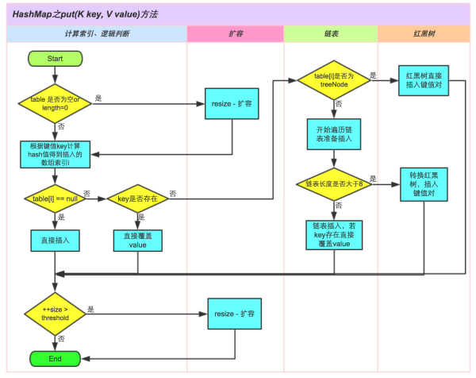


Map

```java
//所有的node都存在这个数组中
transient Node<K,V>[] table;

static class Node<K,V> implements Map.Entry<K,V> {
        final int hash;    //用来定位数组索引位置
        final K key;
        V value;
        Node<K,V> next;   //链表的下一个node

        Node(int hash, K key, V value, Node<K,V> next) { ... }
        public final K getKey(){ ... }
        public final V getValue() { ... }
        public final String toString() { ... }
        public final int hashCode() { ... }
        public final V setValue(V newValue) { ... }
        public final boolean equals(Object o) { ... }
}

方法一：
static final int hash(Object key) {   //jdk1.8 & jdk1.7
     int h;
     // h = key.hashCode() 为第一步 取hashCode值
     // h ^ (h >>> 16)  为第二步 高位参与运算, ^(异或)
     return (key == null) ? 0 : (h = key.hashCode()) ^ (h >>> 16);
}

static int indexFor(int h, int length) {  
	 //jdk1.7的源码，jdk1.8没有这个方法，但是实现原理一样的
     return h & (length-1);  //第三步 取模运算
}

public V put(K key, V value) {
		return putVal(hash(key), key, value, false, true);
}

final V putVal(int hash, K key, V value, boolean onlyIfAbsent,
                   boolean evict) {
        Node<K,V>[] tab; Node<K,V> p; int n, i;
      	// 步骤①：tab为空则创建
        if ((tab = table) == null || (n = tab.length) == 0)
            n = (tab = resize()).length;
    
   			// 步骤②：计算index
        if ((p = tab[i = (n - 1) & hash]) == null)
            tab[i] = newNode(hash, key, value, null);
        else {
            Node<K,V> e; K k;
            
            // 步骤③：节点key存在，直接覆盖value
            if (p.hash == hash &&
                ((k = p.key) == key || (key != null && key.equals(k))))
                e = p;
            
            // 步骤④：判断该链为红黑树
            else if (p instanceof TreeNode)
                e = ((TreeNode<K,V>)p).putTreeVal(this, tab, hash, key, value);
            else {
                // 步骤⑤：该链为链表
                for (int binCount = 0; ; ++binCount) {
                    if ((e = p.next) == null) {
                        p.next = newNode(hash, key, value, null);
                        //链表长度大于8转换为红黑树进行处理
                        if (binCount >= TREEIFY_THRESHOLD - 1) // -1 for 1st
                            treeifyBin(tab, hash);
                        break;
                    }
                    
                     // key已经存在直接覆盖value
                    if (e.hash == hash &&
                        ((k = e.key) == key || (key != null && key.equals(k))))
                        break;
                    p = e;
                }
            }
            if (e != null) { // existing mapping for key
                V oldValue = e.value;
                if (!onlyIfAbsent || oldValue == null)
                    e.value = value;
                afterNodeAccess(e);
                return oldValue;
            }
        }
        ++modCount;
    	  // 步骤⑥：超过最大容量 就扩容
        if (++size > threshold)
            resize();
        afterNodeInsertion(evict);
        return null;
    }

 //JDK1.8融入了红黑树，较复杂，这里是JDK1.7的
 void resize(int newCapacity) {   //传入新的容量
      Entry[] oldTable = table;    //引用扩容前的Entry数组
      int oldCapacity = oldTable.length;         
      if (oldCapacity == MAXIMUM_CAPACITY) {  //扩容前的数组大小如果已经达到最大(2^30)了
          threshold = Integer.MAX_VALUE; //修改阈值为int的最大值(2^31-1)，这样以后就不会扩容了
          return;
      }
  
      Entry[] newTable = new Entry[newCapacity];  //初始化一个新的Entry数组
      transfer(newTable);                         //！！将数据转移到新的Entry数组里
      table = newTable;                           //HashMap的table属性引用新的Entry数组
      threshold = (int)(newCapacity * loadFactor);//修改阈值
 }

 void transfer(Entry[] newTable) {
      Entry[] src = table;                   //src引用了旧的Entry数组
      int newCapacity = newTable.length;
      for (int j = 0; j < src.length; j++) { //遍历旧的Entry数组
          Entry<K,V> e = src[j];             //取得旧Entry数组的每个元素
          if (e != null) {
              src[j] = null;//释放旧Entry数组的对象引用（for循环后，旧的Entry数组不再引用任何对象）
              do {
                 Entry<K,V> next = e.next;
                 int i = indexFor(e.hash, newCapacity); //！！重新计算每个元素在数组中的位置
                 e.next = newTable[i]; //标记[1]
                 newTable[i] = e;      //将元素放在数组上
                 e = next;             //访问下一个Entry链上的元素
             } while (e != null);
         }
     }
 }

 //JDK 11
 final Node<K,V>[] resize() {
     	//计算出数组容量和阈值
        Node<K,V>[] oldTab = table;
        int oldCap = (oldTab == null) ? 0 : oldTab.length;
        int oldThr = threshold;
        int newCap, newThr = 0;
        if (oldCap > 0) {
            if (oldCap >= MAXIMUM_CAPACITY) {
                threshold = Integer.MAX_VALUE;
                return oldTab;
            }
            else if ((newCap = oldCap << 1) < MAXIMUM_CAPACITY &&
                     oldCap >= DEFAULT_INITIAL_CAPACITY)
                newThr = oldThr << 1; // double threshold
        }
        else if (oldThr > 0) // initial capacity was placed in threshold
            newCap = oldThr;
        else {               // zero initial threshold signifies using defaults
            newCap = DEFAULT_INITIAL_CAPACITY;
            newThr = (int)(DEFAULT_LOAD_FACTOR * DEFAULT_INITIAL_CAPACITY);
        }
        if (newThr == 0) {
            float ft = (float)newCap * loadFactor;
            newThr = (newCap < MAXIMUM_CAPACITY && ft < (float)MAXIMUM_CAPACITY ?
                      (int)ft : Integer.MAX_VALUE);
        }
        threshold = newThr;
     
        @SuppressWarnings({"rawtypes","unchecked"})
        Node<K,V>[] newTab = (Node<K,V>[])new Node[newCap];
        table = newTab;
     		//rehash的过程
        if (oldTab != null) {
            for (int j = 0; j < oldCap; ++j) {
                Node<K,V> e;
                if ((e = oldTab[j]) != null) {
                    oldTab[j] = null;
                    if (e.next == null)
                        //如果此节点原本就无碰撞则再次hash计算位置
                        newTab[e.hash & (newCap - 1)] = e;
                    else if (e instanceof TreeNode)
                        ((TreeNode<K,V>)e).split(this, newTab, j, oldCap);
                    else { // preserve order
                        //如果是一个链表
                        Node<K,V> loHead = null, loTail = null;
                        Node<K,V> hiHead = null, hiTail = null;
                        Node<K,V> next;
                        do {
                            next = e.next;
                            //高位为0的
                            if ((e.hash & oldCap) == 0) { 
                                if (loTail == null)
                                    loHead = e; //记录链表的头部，不再动了
                                else
                                    loTail.next = e;
                                loTail = e;//记录链表的尾部
                            }
                            else {
                                //高位为1的
                                if (hiTail == null)
                                    hiHead = e;
                                else
                                    hiTail.next = e;
                                hiTail = e;
                            }
                        } while ((e = next) != null);
                        if (loTail != null) {
                            //释放重复的e
                            loTail.next = null;
                            //这个链表还放在原位置
                            newTab[j] = loHead;
                        }
                        if (hiTail != null) {
                            hiTail.next = null;
                            //这个链表放在离原位置oldCap远的新位置上
                            //假如高位为0和高位为1的个数平均的话那么新链表长度为原链表长度的一半
                            newTab[j + oldCap] = hiHead;
                        }
                    }
                }
            }
        }
        return newTab;
    }


    public V get(Object key) {
        Node<K,V> e;
        return (e = getNode(hash(key), key)) == null ? null : e.value;
    }

    final Node<K,V> getNode(int hash, Object key) {
        Node<K,V>[] tab; Node<K,V> first, e; int n; K k;
        if ((tab = table) != null && (n = tab.length) > 0 &&
            (first = tab[(n - 1) & hash]) != null) {
            //第一步先检查 hash值是否相等。
            //第二步用 == 检查key。如果不是同一个对象，再用equals检查值是否相等
            if (first.hash == hash && // always check first node 第一个放的是空的节点
                ((k = first.key) == key || (key != null && key.equals(k))))
                return first;
            if ((e = first.next) != null) {
                if (first instanceof TreeNode)
                    return ((TreeNode<K,V>)first).getTreeNode(hash, key);
                do {
                    if (e.hash == hash &&
                        ((k = e.key) == key || (key != null && key.equals(k))))
                        return e;
                } while ((e = e.next) != null);
            }
        }
        return null;
    }

```


[HashMap详解](https://www.cnblogs.com/xawei/p/6747660.html)


//todo HashMap 的扩容过程

[谈谈HashMap线程不安全的体现](http://www.importnew.com/22011.html)


### TreeMap

1. TreeMap 是一个**有序的key-value集合**，它是通过**[红黑树](http://www.cnblogs.com/skywang12345/p/3245399.html)**实现的。
2. 该映射根据**其键的自然顺序进行排序**，或者根据**创建映射时提供的 Comparator 进行排序**，具体取决于使用的构造方法。
3. TreeMap的排序是基于对key的排序。
4. TreeMap是**非同步**的


主要3个部分：

1. put进红黑树，并调整平衡
2. get过程。
3. remove并调整平衡。


TreeMap主要部分：

```java
	public TreeMap() {}
 	public TreeMap(Comparator<? super K> comparator) {}
  public TreeMap(Map<? extends K, ? extends V> m) {}
 	public TreeMap(SortedMap<K, ? extends V> m) {}	

	//与HashMap不同
	static final class Entry<K,V> implements Map.Entry<K,V> {
        K key;
        V value;
        Entry<K,V> left;
        Entry<K,V> right;
        Entry<K,V> parent;
        boolean color = BLACK;
    }

		//暴露给了外部函数，此 Entry<K,V>为 new AbstractMap.SimpleImmutableEntry<>(e);只有简单的	//key-value
    public Map.Entry<K,V> firstEntry() {
        return exportEntry(getFirstEntry());
    }

		//方法内部调用 此 Entry<K,V>是有set方法的可以修改值
    final Entry<K,V> getFirstEntry() {
        Entry<K,V> p = root;
        if (p != null)
            while (p.left != null)
                p = p.left;
        return p;
    }

		//查找的过程
   	public V get(Object key) {
        Entry<K,V> p = getEntry(key);
        return (p==null ? null : p.value);
    }

	final Entry<K,V> getEntry(Object key) {
        // Offload comparator-based version for sake of performance
        if (comparator != null)
            return getEntryUsingComparator(key);
        if (key == null)
            throw new NullPointerException();
        @SuppressWarnings("unchecked")
            Comparable<? super K> k = (Comparable<? super K>) key;
        Entry<K,V> p = root;
        while (p != null) {
            int cmp = k.compareTo(p.key);
            if (cmp < 0)
                p = p.left;
            else if (cmp > 0)
                p = p.right;
            else
                return p;
        }
        return null;
    }

    final Entry<K,V> getEntryUsingComparator(Object key) {
        @SuppressWarnings("unchecked")
            K k = (K) key;
        Comparator<? super K> cpr = comparator;
        if (cpr != null) {
            //查找红黑树的过程没有变化,只是这个比较器变了
            Entry<K,V> p = root;
            while (p != null) {
                int cmp = cpr.compare(k, p.key);
                if (cmp < 0)
                    p = p.left;
                else if (cmp > 0)
                    p = p.right;
                else
                    return p;
            }
        }
        return null;
    }

	//put的过程
	public V put(K key, V value) {
        Entry<K,V> t = root;
        if (t == null) {
            compare(key, key); // type (and possibly null) check

            root = new Entry<>(key, value, null);
            size = 1;
            modCount++;
            return null;
        }
        int cmp;
        Entry<K,V> parent;
        // split comparator and comparable paths
        Comparator<? super K> cpr = comparator;
        if (cpr != null) {
            do {
                parent = t;
                cmp = cpr.compare(key, t.key);
                if (cmp < 0)
                    t = t.left;
                else if (cmp > 0)
                    t = t.right;
                else
                    return t.setValue(value);
            } while (t != null);
        }
        else {
            if (key == null)
                throw new NullPointerException();
            @SuppressWarnings("unchecked")
                Comparable<? super K> k = (Comparable<? super K>) key;
            do {
                parent = t;
                cmp = k.compareTo(t.key);
                if (cmp < 0)
                    t = t.left;
                else if (cmp > 0)
                    t = t.right;
                else
                    return t.setValue(value);
            } while (t != null);
        }
        Entry<K,V> e = new Entry<>(key, value, parent);
        if (cmp < 0)
            parent.left = e;
        else
            parent.right = e;
        //红黑树的调平衡
        fixAfterInsertion(e);
        size++;
        modCount++;
        return null;
    }

 	/** From CLR */
    private void fixAfterInsertion(Entry<K,V> x) {
        x.color = RED;

        //todo 待理解
        while (x != null && x != root && x.parent.color == RED) {
            if (parentOf(x) == leftOf(parentOf(parentOf(x)))) {
                Entry<K,V> y = rightOf(parentOf(parentOf(x)));
                if (colorOf(y) == RED) {
                    setColor(parentOf(x), BLACK);
                    setColor(y, BLACK);
                    setColor(parentOf(parentOf(x)), RED);
                    x = parentOf(parentOf(x));
                } else {
                    if (x == rightOf(parentOf(x))) {
                        x = parentOf(x);
                        rotateLeft(x);
                    }
                    setColor(parentOf(x), BLACK);
                    setColor(parentOf(parentOf(x)), RED);
                    rotateRight(parentOf(parentOf(x)));
                }
            } else {
                Entry<K,V> y = leftOf(parentOf(parentOf(x)));
                if (colorOf(y) == RED) {
                    setColor(parentOf(x), BLACK);
                    setColor(y, BLACK);
                    setColor(parentOf(parentOf(x)), RED);
                    x = parentOf(parentOf(x));
                } else {
                    if (x == leftOf(parentOf(x))) {
                        x = parentOf(x);
                        rotateRight(x);
                    }
                    setColor(parentOf(x), BLACK);
                    setColor(parentOf(parentOf(x)), RED);
                    rotateLeft(parentOf(parentOf(x)));
                }
            }
        }
        root.color = BLACK;
    }

	//删除过程
    public V remove(Object key) {
        //先调用一次get方法
        Entry<K,V> p = getEntry(key);
        if (p == null)
            return null;

        V oldValue = p.value;
        deleteEntry(p);
        return oldValue;
    }

	/**
     * Delete node p, and then rebalance the tree.
     */
    private void deleteEntry(Entry<K,V> p) {
        modCount++;
        size--;

        // If strictly internal, copy successor's element to p and then make p
        // point to successor.
        if (p.left != null && p.right != null) {
            Entry<K,V> s = successor(p);
            p.key = s.key;
            p.value = s.value;
            p = s;
        } // p has 2 children

        // Start fixup at replacement node, if it exists.
        Entry<K,V> replacement = (p.left != null ? p.left : p.right);

        if (replacement != null) {
            // Link replacement to parent
            replacement.parent = p.parent;
            if (p.parent == null)
                root = replacement;
            else if (p == p.parent.left)
                p.parent.left  = replacement;
            else
                p.parent.right = replacement;

            // Null out links so they are OK to use by fixAfterDeletion.
            p.left = p.right = p.parent = null;

            // Fix replacement
            if (p.color == BLACK)
                fixAfterDeletion(replacement);
        } else if (p.parent == null) { // return if we are the only node.
            root = null;
        } else { //  No children. Use self as phantom replacement and unlink.
            if (p.color == BLACK)
                fixAfterDeletion(p);

            if (p.parent != null) {
                if (p == p.parent.left)
                    p.parent.left = null;
                else if (p == p.parent.right)
                    p.parent.right = null;
                p.parent = null;
            }
        }
    }

```


[Java 集合系列12之 TreeMap详细介绍(源码解析)和使用示例](https://www.cnblogs.com/skywang12345/p/3310928.html)


### HashTable

1. Hashtable 也一个**散列表**，它存储的内容是**键值对(key-value)映射**。
2. Hashtable **继承于Dictionary**，实现了Map、Cloneable、java.io.Serializable接口。
3. Hashtable 的函数都是**同步的**，这意味着它是**线程安全**的。它的key、value都**不可以为null**
4. Hashtable中的映射不是有序的。

 

与hashMap相比有何不同，为何现在被废弃？

1. HashMap是继承自AbstractMap类，而HashTable是继承自Dictionary类。不过它们都实现了同时实现了map、Cloneable（可复制）、Serializable（可序列化）这三个接口。Dictionary类是一个已经被废弃的类。
2. Hashtable既不支持Null key也不支持Null value。
3. Hashtable是线程安全的，但是效率低，**它的每个方法中都加入了Synchronize方法**。当需要多线程操作的时候可以使用线程安全的ConcurrentHashMap。ConcurrentHashMap虽然也是线程安全的，但是它的效率比Hashtable要高好多倍。因为ConcurrentHashMap使用了分段锁，并不对整个数据进行锁定。
4. 如线程1使用put进行添加元素，线程2不但不能使用put方法添加元素，并且也不能使用get方法来获取元素，所以竞争越激烈效率越低。
5. Hashtable、HashMap都使用了 Iterator。而由于历史原因，Hashtable还使用了Enumeration的方式 。


### ConcurrentHashMap

**在1.7版本中**

1. ConcurrentHashMap的数据结构是由一个**Segment**数组和多个HashEntry组成。ReentrantLock+Segment+HashEntry结构。
2. Segment是一种**可重入锁**ReentrantLock，在ConcurrentHashMap里扮演锁的角色，HashEntry则用于存储键值对数据。
3. Segment的结构和HashMap类似，是一种数**组和链表结构**， 一个Segment里包含一个HashEntry数组，每个HashEntry是一个链表结构的元素， 每个Segment守护者一个HashEntry数组里的元素
4. Segment数组的意义就是将一个大的table分割成多个小的table来进行加锁。
5. Segment的大小size默认为16，每一个Segment元素下的HashEntry的初始化也是按照位于运算来计算，用cap来表示，cap的初始值为1，所以HashEntry最小的容量为2


**put操作**

对于ConcurrentHashMap的数据插入，这里要进行**两次Hash**去定位数据的存储位置

```java
static class Segment<K,V> extends ReentrantLock implements Serializable {...}
```

从上Segment的继承体系可以看出，Segment实现了ReentrantLock,也就带有锁的功能，当执行put操作时，会进行第一次key的hash来定位Segment的位置，如果该Segment还没有初始化，即通过CAS操作进行赋值，然后进行第二次hash操作，找到相应的HashEntry的位置，这里会利用继承过来的锁的特性，在将数据插入指定的HashEntry位置时（链表的**尾端**），会通过继承ReentrantLock的tryLock（）方法尝试去获取锁，如果获取成功就直接插入相应的位置，如果已经有线程获取该Segment的锁，那当前线程会以**自旋**的方式去继续的调用tryLock（）方法去获取锁，**超过指定次数**就**挂起**，等待唤醒

**get操作**

ConcurrentHashMap的get操作跟HashMap类似，只是ConcurrentHashMap第一次需要经过一次hash定位到Segment的位置，然后再hash定位到指定的HashEntry，遍历该HashEntry下的链表进行对比，成功就返回，不成功就返回null

**size操作**

他是并发操作的，就是在你计算size的时候，他还在并发的插入数据，可能会导致你计算出来的size和你实际的size有相差（在你return size的时候，插入了多个数据），要解决这个问题，JDK1.7版本用两种方案。

1. 第一种方案他会使用不加锁的模式去尝试多次计算ConcurrentHashMap的size，最多三次，比较前后两次计算的结果，结果一致就认为当前没有元素加入，计算的结果是准确的
2. 第二种方案是如果第一种方案不符合，他就会给每个Segment加上锁，然后计算ConcurrentHashMap的size返回


**JDK1.8的实现**

1. JDK1.8的实现已经摒弃了Segment的概念。
2. 用Node数组+链表+红黑树的数据结构来实现，并发控制使用Synchronized和CAS来操作。synchronized+CAS+HashEntry+红黑树

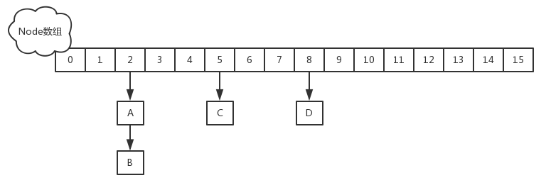

**put操作**

1. 如果没有初始化就先调用initTable（）方法来进行初始化过程
2. 如果没有hash冲突就直接CAS插入
3. 如果还在进行扩容操作就先进行扩容
4. 如果存在hash冲突，就加锁来保证线程安全，这里有两种情况，一种是链表形式就直接遍历到尾端插入，一种是红黑树就按照红黑树结构插入，
5. 最后一个如果该链表的数量大于阈值8，就要先转换成黑红树的结构，break再一次进入循环
6. 如果添加成功就调用addCount方法统计size，并且检查是否需要扩容


JDK8 put操作

```java
static final int HASH_BITS = 0x7fffffff; //32位数，除了最高位0，其余都是1

static final int spread(int h) {
    return (h ^ (h >>> 16)) & HASH_BITS; //取高16位，除了最高位
}

public V put(K key, V value) {
    return putVal(key, value, false);
}

/** Implementation for put and putIfAbsent */
final V putVal(K key, V value, boolean onlyIfAbsent) {
    if (key == null || value == null) throw new NullPointerException();
    int hash = spread(key.hashCode()); //两次hash，减少hash冲突，可以均匀分布
    int binCount = 0;
    for (Node<K,V>[] tab = table;;) { //对这个table进行迭代
        Node<K,V> f; int n, i, fh;
        //这里就是上面构造方法没有进行初始化，在这里进行判断，为null就调用initTable进行初始化，属于懒汉模式初始化
        if (tab == null || (n = tab.length) == 0)
            tab = initTable();
        else if ((f = tabAt(tab, i = (n - 1) & hash)) == null) {//如果i位置没有数据，就直接无锁插入
            if (casTabAt(tab, i, null,
                         new Node<K,V>(hash, key, value, null)))
                break;                   // no lock when adding to empty bin
        }
        else if ((fh = f.hash) == MOVED)//如果在进行扩容，则先进行扩容操作
            tab = helpTransfer(tab, f);
        else {
            V oldVal = null;
            //如果以上条件都不满足，那就要进行加锁操作，也就是存在hash冲突，锁住链表或者红黑树的头结点
            synchronized (f) {
                if (tabAt(tab, i) == f) {
                    if (fh >= 0) { //表示该节点是链表结构
                        binCount = 1;
                        for (Node<K,V> e = f;; ++binCount) {
                            K ek;
                            //这里涉及到相同的key进行put就会覆盖原先的value
                            if (e.hash == hash &&
                                ((ek = e.key) == key ||
                                 (ek != null && key.equals(ek)))) {
                                oldVal = e.val;
                                if (!onlyIfAbsent)
                                    e.val = value;
                                break;
                            }
                            Node<K,V> pred = e;
                            if ((e = e.next) == null) {  //插入链表尾部
                                pred.next = new Node<K,V>(hash, key,
                                                          value, null);
                                break;
                            }
                        }
                    }
                    else if (f instanceof TreeBin) {//红黑树结构
                        Node<K,V> p;
                        binCount = 2;
                        //红黑树结构旋转插入
                        if ((p = ((TreeBin<K,V>)f).putTreeVal(hash, key,
                                                       value)) != null) {
                            oldVal = p.val;
                            if (!onlyIfAbsent)
                                p.val = value;
                        }
                    }
                }
            }
            if (binCount != 0) { //如果链表的长度大于8时就会进行红黑树的转换
                if (binCount >= TREEIFY_THRESHOLD)
                    treeifyBin(tab, i);
                if (oldVal != null)
                    return oldVal;
                break;
            }
        }
    }
    addCount(1L, binCount);//统计size，并且检查是否需要扩容
    return null;
}
```


**get操作**

1. 计算hash值，定位到该table索引位置，如果是首节点符合就返回
2. 如果遇到扩容的时候，会调用标志正在扩容节点ForwardingNode的find方法，查找该节点，匹配就返回
3. 以上都不符合的话，就往下遍历节点，匹配就返回，否则最后就返回null


jdk1.8

```java
public V get(Object key) {
    Node<K,V>[] tab; Node<K,V> e, p; int n, eh; K ek;
    int h = spread(key.hashCode()); //计算两次hash
    if ((tab = table) != null && (n = tab.length) > 0 &&
        (e = tabAt(tab, (n - 1) & h)) != null) {//读取首节点的Node元素
        if ((eh = e.hash) == h) { //如果该节点就是首节点就返回
            if ((ek = e.key) == key || (ek != null && key.equals(ek)))
                return e.val;
        }
        //hash值为负值表示正在扩容，这个时候查的是ForwardingNode的find方法来定位到nextTable来
        //查找，查找到就返回
        else if (eh < 0)
            return (p = e.find(h, key)) != null ? p.val : null;
        while ((e = e.next) != null) {//既不是首节点也不是ForwardingNode，那就往下遍历
            if (e.hash == h &&
                ((ek = e.key) == key || (ek != null && key.equals(ek))))
                return e.val;
        }
    }
    return null;
}
```


JDK11

```java
   public int size() {
        long n = sumCount();
        return ((n < 0L) ? 0 :
                (n > (long)Integer.MAX_VALUE) ? Integer.MAX_VALUE :
                (int)n);
   }
   
   final long sumCount() {
        CounterCell[] cs = counterCells;
        long sum = baseCount;
        if (cs != null) {
            for (CounterCell c : cs)
                if (c != null)
                    sum += c.value;
        }
        return sum;
   }
```


**1.7与1.8的差别**

1. JDK1.8的实现降低锁的粒度，JDK1.7版本锁的粒度是基于Segment的，包含多个HashEntry，而JDK1.8锁的粒度就是HashEntry（首节点）
2. JDK1.8版本的数据结构变得更加简单，使得操作也更加清晰流畅，因为已经使用synchronized来进行同步，所以不需要分段锁的概念，也就不需要Segment这种数据结构了，由于粒度的降低，实现的复杂度也增加了
3. JDK1.8使用红黑树来优化链表，基于长度很长的链表的遍历是一个很漫长的过程，而红黑树的遍历效率是很快的，代替一定阈值的链表，这样形成一个最佳拍档
4. JDK1.8为什么使用内置锁synchronized来代替重入锁ReentrantLock，我觉得有以下几点
   1. 因为粒度降低了，在相对而言的低粒度加锁方式，synchronized并不比ReentrantLock差，在粗粒度加锁中ReentrantLock可能通过Condition来控制各个低粒度的边界，更加的灵活，而在低粒度中，Condition的优势就没有了
   2. JVM的开发团队从来都没有放弃synchronized，而且基于JVM的synchronized优化空间更大，使用内嵌的关键字比使用API更加自然
   3. 在大量的数据操作下，对于JVM的内存压力，基于API的ReentrantLock会开销更多的内存，虽然不是瓶颈，但是也是一个选择依据


这个说的是真的非常好，直接看人家的源码分析即可↓

[ConcurrentHashMap原理分析（1.7与1.8）](https://www.cnblogs.com/study-everyday/p/6430462.html)


### LinkedHashMap 

//todo

> 总结
>
> 1. LinkedHashMap是继承于HashMap，是基于HashMap和双向链表来实现的。
> 2. HashMap无序；LinkedHashMap有序，可分为插入顺序和访问顺序两种。如果是访问顺序，那put和get操作已存在的Entry时，都会把Entry移动到双向链表的表尾(其实是先删除再插入)。
> 3. LinkedHashMap存取数据，还是跟HashMap一样使用的Entry[]的方式，双向链表只是为了保证顺序。
> 4. LinkedHashMap是线程不安全的。
>
> 
>
> 作者：艺旭家
> 链接：https://www.jianshu.com/p/8f4f58b4b8ab
> 来源：简书
> 著作权归作者所有。商业转载请联系作者获得授权，非商业转载请注明出处。


[图解LinkedHashMap原理](https://www.jianshu.com/p/8f4f58b4b8ab)

[Map 综述（二）：彻头彻尾理解 LinkedHashMap](https://blog.csdn.net/justloveyou_/article/details/71713781)


## Set

Set的底层存储都是基于Map。HashSet的实现基于HashMap，TreeSet的实现基于TreeMap。都是只需要Map的key，value使用一个空对象进行填充。


### HashSet 


1. HashSet实现了Set接口，它不允许集合中出现重复元素。
2. 它是由HashMap实现的，**不保证元素的顺序**，而且**HashSet允许使用 null 元素**。
3. 只需要使用hashMap的key部分，value部分使用默认的` private static final Object PRESENT = new Object();`

4. HashSet是**非同步的**，如果需要同步则应该使用 **Collections.synchronizedSet** 方法来“包装” set。最好在创建时完成这一操作，以防止对该 set 进行意外的不同步访问：

5. HashSet与Map关系如下图：

   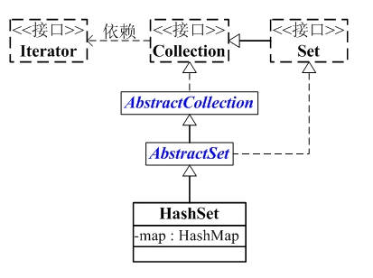

6. 部分初始化源码

   ```java
   package java.util;
   
   public class HashSet<E>
       extends AbstractSet<E>
       implements Set<E>, Cloneable, java.io.Serializable{
       static final long serialVersionUID = -5024744406713321676L;
   
       // HashSet是通过map(HashMap对象)保存内容的
       private transient HashMap<E,Object> map;
   
       // PRESENT是向map中插入key-value对应的value
       // 因为HashSet中只需要用到key，而HashMap是key-value键值对；
       // 所以，向map中添加键值对时，键值对的值固定是PRESENT
       private static final Object PRESENT = new Object();
   
       // 默认构造函数
       public HashSet() {
           // 调用HashMap的默认构造函数，创建map
           map = new HashMap<E,Object>();
       }
   
       // 带集合的构造函数
       public HashSet(Collection<? extends E> c) {
           // 创建map。
           // 为什么要调用Math.max((int) (c.size()/.75f) + 1, 16)，从 (c.size()/.75f) + 1 和 16 中选择一个比较大的树呢？        
           // 首先，说明(c.size()/.75f) + 1
           //   因为从HashMap的效率(时间成本和空间成本)考虑，HashMap的加载因子是0.75。
           //   当HashMap的“阈值”(阈值=HashMap总的大小*加载因子) < “HashMap实际大小”时，
           //   就需要将HashMap的容量翻倍。
           //   所以，(c.size()/.75f) + 1 计算出来的正好是总的空间大小。
           // 接下来，说明为什么是 16 。
           //   HashMap的总的大小，必须是2的指数倍。若创建HashMap时，指定的大小不是2的指数倍；
           //   HashMap的构造函数中也会重新计算，找出比“指定大小”大的最小的2的指数倍的数。
           //   所以，这里指定为16是从性能考虑。避免重复计算。
           map = new HashMap<E,Object>(Math.max((int) (c.size()/.75f) + 1, 16));
           // 将集合(c)中的全部元素添加到HashSet中
           addAll(c);
       }
   
       // 将元素(e)添加到HashSet中
       public boolean add(E e) {
           return map.put(e, PRESENT)==null;
       }
   
       // 删除HashSet中的元素(o)
       public boolean remove(Object o) {
           return map.remove(o)==PRESENT;
       }
   
       // 克隆一个HashSet，并返回Object对象
       public Object clone() {
           try {
               HashSet<E> newSet = (HashSet<E>) super.clone();
               newSet.map = (HashMap<E, Object>) map.clone();
               return newSet;
           } catch (CloneNotSupportedException e) {
               throw new InternalError();
           }
       }
       ..........
   }
   ```

引用: **[Java 集合系列16之 HashSet详细介绍(源码解析)和使用示例](https://www.cnblogs.com/skywang12345/p/3311252.html)**


### TreeSet

1. 它继承于AbstractSet抽象类，实现NavigableSet<E>, Cloneable, java.io.Serializable接口。
   1.1 TreeSet 继承于AbstractSet，所以它是一个Set集合，具有Set的属性和方法。
   1.2 TreeSet 实现了NavigableSet接口，意味着它支持一系列的导航方法。比如查找与指定目标最匹配项。
   1.3 TreeSet 实现了Cloneable接口，意味着它能被克隆。
   1.4 TreeSet 实现了java.io.Serializable接口，意味着它支持序列化。
2. TreeSet是基于**TreeMap**实现的。TreeSet中的元素支持2种排序方式：自然排序 或者 根据创建TreeSet 时提供的 Comparator 进行排序。这取决于使用的构造方法。
3. TreeSet为基本操作（add、remove 和 contains）提供受保证的 **log(n)** 时间开销。
4. TreeSet**是非同步的、非线程安全的**。 它的iterator 方法返回的迭代器是fail-fast的。

**TreeSet与Collection关系**

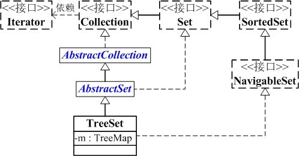


5. 部分初始化源码(**基于JDK1.6.0_45**)

   ```java
   package java.util;
   
   public class TreeSet<E> extends AbstractSet<E>
       implements NavigableSet<E>, Cloneable, java.io.Serializable
   {
       // NavigableMap对象
       private transient NavigableMap<E,Object> m;
   
       // TreeSet是通过TreeMap实现的，
       // PRESENT是键-值对中的值。
       private static final Object PRESENT = new Object();
   
       // 不带参数的构造函数。创建一个空的TreeMap
       public TreeSet() {
           this(new TreeMap<E,Object>());
       }
   
       // 将TreeMap赋值给 "NavigableMap对象m"
       TreeSet(NavigableMap<E,Object> m) {
           this.m = m;
       }
   
       // 带比较器的构造函数。
       public TreeSet(Comparator<? super E> comparator) {
           this(new TreeMap<E,Object>(comparator));
       }
   
       // 创建TreeSet，并将集合c中的全部元素都添加到TreeSet中
       public TreeSet(Collection<? extends E> c) {
           this();
           // 将集合c中的元素全部添加到TreeSet中
           addAll(c);
       }
   
       // 创建TreeSet，并将s中的全部元素都添加到TreeSet中
       public TreeSet(SortedSet<E> s) {
           this(s.comparator());
           addAll(s);
       }
   
       // 添加e到TreeSet中
       public boolean add(E e) {
           return m.put(e, PRESENT)==null;
       }
   
       // 删除TreeSet中的对象o
       public boolean remove(Object o) {
           return m.remove(o)==PRESENT;
       }
   
       // 清空TreeSet
       public void clear() {
           m.clear();
       }
   
       // 将集合c中的全部元素添加到TreeSet中
       public  boolean addAll(Collection<? extends E> c) {
           // Use linear-time version if applicable
           if (m.size()==0 && c.size() > 0 &&
               c instanceof SortedSet &&
               m instanceof TreeMap) {
               SortedSet<? extends E> set = (SortedSet<? extends E>) c;
               TreeMap<E,Object> map = (TreeMap<E, Object>) m;
               Comparator<? super E> cc = (Comparator<? super E>) set.comparator();
               Comparator<? super E> mc = map.comparator();
               if (cc==mc || (cc != null && cc.equals(mc))) {
                   map.addAllForTreeSet(set, PRESENT);
                   return true;
               }
           }
           return super.addAll(c);
       }
   
       // 返回子Set，实际上是通过TreeMap的subMap()实现的。
       public NavigableSet<E> subSet(E fromElement, boolean fromInclusive,
                                     E toElement,   boolean toInclusive) {
           return new TreeSet<E>(m.subMap(fromElement, fromInclusive,
                                          toElement,   toInclusive));
       }
   
       // 返回Set的比较器
       public Comparator<? super E> comparator() {
           return m.comparator();
       }
   
   }
   ```

   [Java 集合系列17之 TreeSet详细介绍(源码解析)和使用示例](https://www.cnblogs.com/skywang12345/p/3311268.html)


## Concurrent包中集合

**堵塞和非堵塞**

阻塞队列与普通队列的区别在于，当队列是空的时，从队列中获取元素的操作将会被阻塞，或者当队列是满时，往队列里添加元素的操作会被阻塞。试图从空的阻塞队列中获取元素的线程将会被阻塞，直到其他的线程往空的队列插入新的元素。同样，试图往已满的阻塞队列中添加新元素的线程同样也会被阻塞，直到其他的线程使队列重新变得空闲起来，如从队列中移除一个或者多个元素，或者完全清空队列。

1. ArrayDeque, （数组双端队列）

2. PriorityQueue, （优先级队列）

3. ConcurrentLinkedQueue, （基于链表的并发队列）

4. DelayQueue, （延期阻塞队列）（阻塞队列实现了BlockingQueue接口）

5. ArrayBlockingQueue, （基于数组的并发阻塞队列）

6. LinkedBlockingQueue, （基于链表的FIFO阻塞队列）

7. LinkedBlockingDeque, （基于链表的FIFO双端阻塞队列）

8. PriorityBlockingQueue, （带优先级的无界阻塞队列）

9. SynchronousQueue （并发同步阻塞队列） 

10. ConcurrentHashMap： 线程安全的HashMap

11. CopyOnWriteArrayList: 线程安全的List，在读多写少的场合性能非常好，远远好于Vector

12. ConcurrentLinkedQueue：高效的并发队列，使用链表实现。可以看做一个线程安全的 LinkedList，这是一个非阻塞队列。

13. BlockingQueue: 这是一个接口，JDK内部通过链表、数组等方式实现了这个接口。表示阻塞队列，非常适合用于作为数据共享的通道。

14. ConcurrentSkipListMap: 跳表的实现。这是一个Map，使用跳表的数据结构进行快速查找


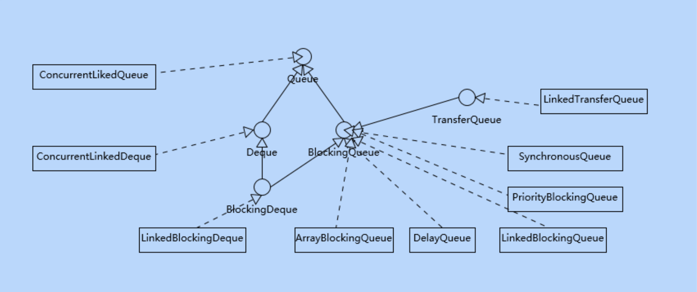


// todo

总结一些常见问题：

1. Deque与Queue的区别？
2. PriorityQueue，底层是一个什么数据结构？优先功能是怎么实现的
3. ConcurrentSkipListMap，跳表是一个怎么样的结构，简述一下跳表的结构特点。他是怎么样实现快速查找的，描述一下插入，查找，删除的流程。
4. 哪些队列是有界的，哪些是无界的?
5. 从源码的角度，常见的线程安全队列是如何实现的，并进行了哪些改进以提高性能表现?


其实里面大多数的内容应该是属于数据结构的范围，此处分析几个与同步相关的集合，其余部分在《数据结构》               中分析。


参考

《第20讲 | 并发包中的ConcurrentLinkedQueue和LinkedBlockingQueue有什么区别?》


### CopyOnWriteArrayList

首先可以知道的是，这个是CopyOnWrite思路的一个实现，此时需要先了解一下概念，cow在很多地方都有具体的应用，例如redis子线程在写日志的时候，等等。

> ## CopyOnWrite 
>
> 写入时复制（CopyOnWrite，简称COW）思想是计算机程序设计领域中的一种通用优化策略。其核心思想是，如果有多个调用者（Callers）同时访问相同的资源（如内存或者是磁盘上的数据存储），他们会共同获取相同的指针指向相同的资源，直到某个调用者修改资源内容时，系统才会真正复制一份专用副本（private  copy）给该调用者，而其他调用者所见到的最初的资源仍然保持不变。这过程对其他的调用者都是透明的（transparently）。此做法主要的优点是如果调用者没有修改资源，就不会有副本（private copy）被创建，因此多个调用者只是读取操作时可以共享同一份资源。
>
> 通俗易懂的讲，写入时复制技术就是不同进程在访问同一资源的时候，只有更新操作，才会去复制一份新的数据并更新替换，否则都是访问同一个资源。


先看一下内部成员变量

```java
public class CopyOnWriteArrayList<E>
    implements List<E>, RandomAccess, Cloneable, java.io.Serializable {
    private static final long serialVersionUID = 8673264195747942595L;

    /** The lock protecting all mutators */
    final transient ReentrantLock lock = new ReentrantLock();

    /** The array, accessed only via getArray/setArray. */
    private transient volatile Object[] array;
……
```

- 使用ReentrantLock来保证线程安全。
- 内部具体存数据的时候还是与list一样，使用一个加了**transient volatile**的数组。
- 除此之外还有3个私有的内部类，`COWIterator`、`COWSubList`、`COWSubListIterator`


当调用`CopyOnWriteArrayList`的subList方法的时候其实是返回了一个新的`COWSubList`对象，这也是这个内部类唯一被使用到的地方了。

```java
public List<E> subList(int fromIndex, int toIndex) {
    final ReentrantLock lock = this.lock;
    lock.lock();
    try {
        Object[] elements = getArray();
        int len = elements.length;
        if (fromIndex < 0 || toIndex > len || fromIndex > toIndex)
            throw new IndexOutOfBoundsException();
        return new COWSubList<E>(this, fromIndex, toIndex);
    } finally {
        lock.unlock();
    }
}
```


先从构造方法入手，一共有3个构造

```java
public CopyOnWriteArrayList() {
    setArray(new Object[0]);
}

/**
 * Creates a list containing the elements of the specified
 * collection, in the order they are returned by the collection's
 * iterator.
 *
 * @param c the collection of initially held elements
 * @throws NullPointerException if the specified collection is null
 */
public CopyOnWriteArrayList(Collection<? extends E> c) {
    Object[] elements;
    if (c.getClass() == CopyOnWriteArrayList.class)
        elements = ((CopyOnWriteArrayList<?>)c).getArray();
    else {
        elements = c.toArray();
        // c.toArray might (incorrectly) not return Object[] (see 6260652)
        if (elements.getClass() != Object[].class)
            elements = Arrays.copyOf(elements, elements.length, Object[].class);
    }
    setArray(elements);
}

/**
 * Creates a list holding a copy of the given array.
 *
 * @param toCopyIn the array (a copy of this array is used as the
 *        internal array)
 * @throws NullPointerException if the specified array is null
 */
public CopyOnWriteArrayList(E[] toCopyIn) {
    setArray(Arrays.copyOf(toCopyIn, toCopyIn.length, Object[].class));
}

/**
     * Sets the array.
     */
final void setArray(Object[] a) {
  array = a;
}
```

1. 如果是无参的，那么直接给一个空数组，这个其实有点奇怪，为什么没有16之类的默认长度？
2. 如果是集合，或者是数组，最后都是进行一个元素拷贝，拿到一个新的数组。


然后是新增方法

```java
public boolean add(E e) {
    final ReentrantLock lock = this.lock;
    lock.lock();
    try {
        Object[] elements = getArray();
        int len = elements.length;
        Object[] newElements = Arrays.copyOf(elements, len + 1);
        newElements[len] = e;
        setArray(newElements);
        return true;
    } finally {
        lock.unlock();
    }
}
```

1. 使用ReentrantLock来保证线程安全。
2. 因为是写时复制，所以每次往里面插数据的时候都是**进行一次原数组的拷贝**。
3. 相比于`ArrayList`，这个东西简单除暴了很多，没有什么预分配与数组的扩容了，相对而言简单了很多。


然后查看删除方法

```java
public E remove(int index) {
    final ReentrantLock lock = this.lock;
    lock.lock();
    try {
        Object[] elements = getArray();
        int len = elements.length;
        E oldValue = get(elements, index);
        int numMoved = len - index - 1;
        if (numMoved == 0)
            setArray(Arrays.copyOf(elements, len - 1));
        else {
            Object[] newElements = new Object[len - 1];
            System.arraycopy(elements, 0, newElements, 0, index);
            System.arraycopy(elements, index + 1, newElements, index,
                             numMoved);
            setArray(newElements);
        }
        return oldValue;
      
    } finally {
        lock.unlock();
    }
}
```

仍然很暴力，删掉一个数据后，直接通过`System.arraycopy`方法进行**拷贝**。


再看看get方法。

```java
private E get(Object[] a, int index) {
    return (E) a[index];
}

/**
 * {@inheritDoc}
 *
 * @throws IndexOutOfBoundsException {@inheritDoc}
 */
public E get(int index) {
    return get(getArray(), index);
}

private E get(Object[] a, int index) {
		return (E) a[index];
}
```


> **总结**

- 这个类整体与想象中的不太一样。在系统中主进程fork创建子进程的时候，会采用写时复制的形式，把自己内存的段页映射表复制一份给子进程。当子进程读的时候，其实还是读的同一份，当主进程或者子进程写的时候，才开始真正进行内容复制。

- 另外这个写时复制，复制的范围是不是太大了，直接全数组复制，明明只是增加了一个元素缺需要复制整个数组。

- CopyOnWrite并发容器用于**读多写少**的**并发**场景。因为写入的成本太高了，而读的时候也不用加锁，只是一个对数组的随机访问。


> **CopyOnWrite的缺点**

CopyOnWrite容器有很多优点，但是同时也存在两个问题，即内存占用问题和数据一致性问题。

- **内存占用问题**。因为CopyOnWrite的写时复制机制，所以在进行写操作的时候，内存里会同时驻扎两个对象的内存，旧的对象和新写入的对象。如果这些对象占用的内存比较大，比如说200M左右，那么再写入100M数据进去，内存就会占用300M，那么这个时候很有可能造成频繁的Yong GC和Full GC。针对内存占用问题，可以通过压缩容器中的元素的方法来减少大对象的内存消耗，比如，如果元素全是10进制的数字，可以考虑把它压缩成36进制或64进制。或者不使用CopyOnWrite容器，而使用其他的并发容器，如ConcurrentHashMap。

- **数据一致性问题**。CopyOnWrite容器只能保证数据的最终一致性，不能保证数据的实时一致性。所以如果你希望写入的的数据，马上能读到，请不要使用CopyOnWrite容器。

  

> **CopyOnWriteArrayList为什么并发安全且性能比Vector好**

Vector增删改查方法都加了synchronized，保证同步，但是每个方法执行的时候都要去获得锁，性能就会大大下降，而CopyOnWriteArrayList 只是在增删改上加锁，但是读不加锁，在读方面的性能就好于Vector，CopyOnWriteArrayList支持读多写少的并发情况。


# Java 多线程

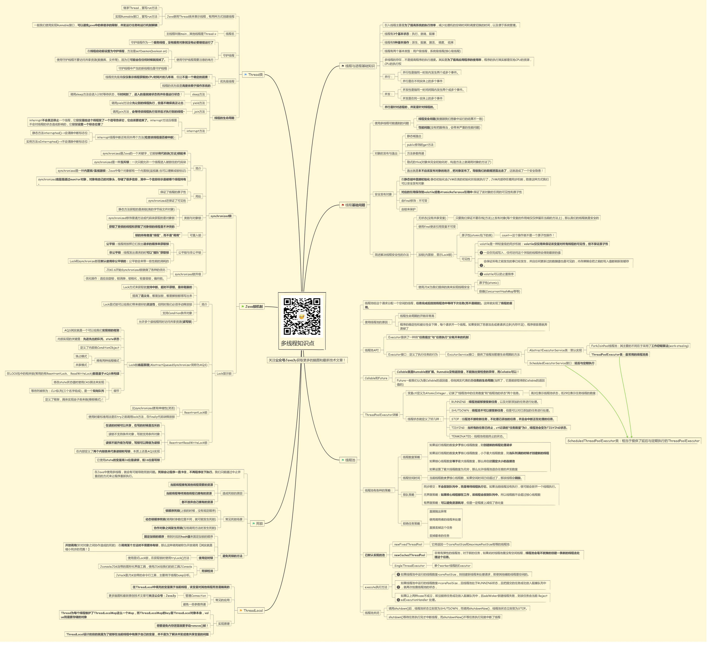


## 综述


//todo 待补充concurrent包下的各个类介绍。基于jdk1.8

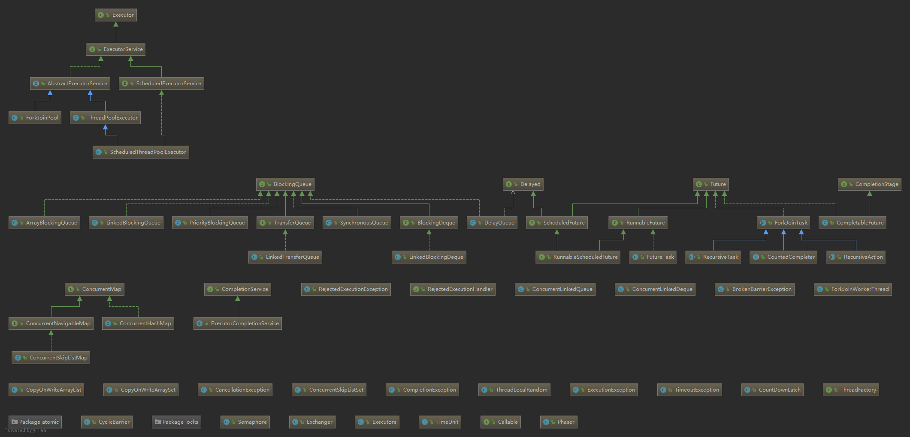


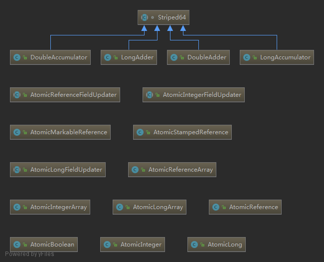


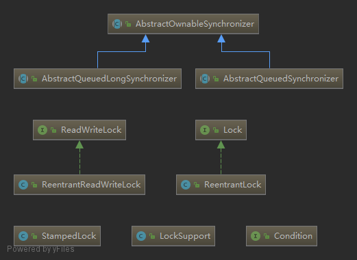


> #### 线程是什么

从操作系统的角度，可以简单认为，线程是系统调度的最小单元，一个进程可以包含多个线程，作为任务的真正运作者，有自己的栈（Stack）、寄存器（Register）、本地存储 （Thread Local）等，但是会和进程内其他线程共享文件描述符、虚拟地址空间等。

在具体实现中，线程还分为内核线程、用户线程，Java的线程实现其实是与虚拟机相关的。对于我们最熟悉的Sun/Oracle JDK，其线程也经历了一个演进过程，基本上在Java 1.2之后，JDK已经抛弃了所谓的Green Thread，也就是用户调度的线程，现在的模型是一对一映射到操作系统内核线程。 如果我们来看Thread的源码，你会发现其基本操作逻辑大都是以JNI形式调用的本地代码。


## Thread 和 Runnable

**Runnable** 是一个接口，该接口中只包含了一个run()方法。它的定义如下：

```java
public interface Runnable {
    public abstract void run();
}
```


**Thread** 是一个类。Thread本身就实现了Runnable接口。它的声明如下：

```java
public class Thread implements Runnable {}
```


**Thread 和 Runnable 的相同点**：都是“多线程的实现方式”。
**Thread 和 Runnable 的不同点**：
Thread 是**类**，而Runnable是**接口**；Thread本身是实现了Runnable接口的类。我们知道“一个类只能有一个父类，但是却能实现多个接口”，因此Runnable具有更好的扩展性。
此外，Runnable还可以用于**“资源的共享”**。即，多个线程都是基于**同一个**Runnable对象建立的，它们会共享Runnable对象上的资源。


Runnable使用

```java
public class A implements Runnable {}

new Thread(new A()).start();
```


Thread使用

```java
public class A extends Thread{}
new A().start();
```


关于**start() 和 run()**

run()只是一个需要重写的方法，如果直接调用就只会在调用线程内运行一次，并不会开启一个新的线程。

start()它的作用是启动一个新线程，新线程会执行相应的run()方法。start()不能被重复调用。在start()中，真正开启新线程的方法是start0()，这是个native方法，具体实现应该是在C写的.dll。

```java
public synchronized void start() {
    // 如果线程不是"就绪状态"，则抛出异常！
    if (threadStatus != 0)
        throw new IllegalThreadStateException();

    // 将线程添加到ThreadGroup中
    group.add(this);

    boolean started = false;
    try {
        // 通过start0()启动线程
        start0();
        // 设置started标记
        started = true;
    } finally {
        try {
            if (!started) {
                group.threadStartFailed(this);
            }
        } catch (Throwable ignore) {
        }
    }
}

 private native void start0();
```


## 线程状态

一般平时说线程从创建、运行到结束总是处于下面五个状态之一：新建状态、就绪状态、运行状态、阻塞状态及死亡状态。这个是从操作系统的角度来看待线程。

在java.lang.Thread.State这个枚举中是定义了6种状态的。java的线程中只有这六种状态。

这完全是从2个不同的角度来看待线程状态。

```java
public enum State {
        NEW,
        RUNNABLE,//(运行)
        BLOCKED,
        WAITING,//(等待)
        TIMED_WAITING,//(定时等待)
        TERMINATED;
    }
```


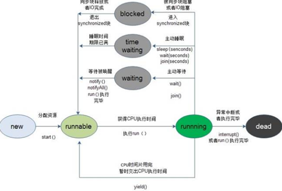

**状态变化与锁的释放**

- 在由运行状态调用sleep()方法变为等待状态时，不释放锁。
- 在由运行状态调用yield()方法变为就绪状态时，不释放锁。
- 在运行状态，其他线程调用该线程suspend()方法将该线程挂起时，不会释放锁。

- 当前线程在同步方法、同步代码块中执行了线程对象的wait()方法，当前线程暂停，并释放锁。


换个角度看，在一个线程正常运行中，只有在运行到同步块的时候才需要进行加锁。运行完了则把锁释放，**只要还在同步块中，无论当前线程时什么状态都不会释放锁**。锁的释放一般是有以下几种情况↓

- 执行完同步代码块。

- 在执行同步代码块的过程中，遇到异常而导致线程终止。

- 在执行同步代码块的过程中，执行了锁所属对象的wait()方法，这个线程会释放锁，进行对象的等待池。

  除了以上情况外，只要持有锁的线程还没有执行完同步代码块，就不会释放锁。因此在以下情况下，线程不会释放锁：

- 在执行同步代码块的过程中，执行了Thread.sleep()方法，当前线程放弃CPU，开始睡眠，在睡眠中不会释放锁。

- 在执行同步代码块的过程中，执行了Thread.yield()方法，当前线程放弃CPU，但不会释放锁。
- 在执行同步代码块的过程中，其他线程执行了当前对象的suspend()方法，当前线程被暂停，但不会释放锁。但Thread类的suspend()方法已经被废弃。

-------------------------------


> #### sleep()方法和wait()方法简单对比

- 两者最主要的区别在于：**sleep方法没有释放锁，而wait方法释放了锁** 。 
- 两者都可以暂停线程的执行。
- Wait通常被用于线程间交互/通信，sleep通常被用于暂停执行。
- wait()方法被调用后，线程不会自动苏醒，需要别的线程调用同一个对象上的notify()或者notifyAll()方法。sleep()方法执行完成后，线程会自动苏醒。


**等待队列与同步队列**

- 当处于等待状态的线程会放在等待队列中。
- 同步队列里面放的都是想争夺同一个对象锁的线程。
- 同步队列是在同步的环境下才有的概念，一个对象对应一个同步队列。
- 线程等待时间到了或被notify/notifyAll唤醒后，会进入同步队列竞争锁，如果获得锁，进入RUNNABLE状态，否则进入BLOCKED状态等待获取锁。


[Java线程的6种状态及切换(透彻讲解)](https://blog.csdn.net/pange1991/article/details/53860651)

[多线程—线程的5种状态](https://www.cnblogs.com/domi22/p/8046851.html)

[Java中一个线程只有六个状态。至于阻塞、可运行、挂起状态都是人们为了便于理解，自己加上去的。](https://www.cnblogs.com/GooPolaris/p/8079490.html)


## Java内存模型

> #### 13 | Java内存模型——《深入拆解 Java 虚拟机》


当程序在运行过程中，会将运算需要的数据从主内存复制一份到CPU的高速缓存当中，那么CPU进行计算时就可以直接从它的高速缓存读取数据和向其中写入数据，当运算结束之后，再将高速缓存中的数据刷新到主存当中。		

在多核CPU中，每条线程可能运行于不同的CPU中，因此每个线程运行时有自己的高速缓存（对单核CPU来说，其实也会出现这种问题，只不过是以线程调度的形式来分别执行的）从而出现缓存一致性问题。

　　为了解决缓存不一致性问题，通常来说有以下2种解决方法：

　　1）通过在总线加LOCK锁的方式

　　2）通过缓存一致性协议

但是上面的加锁方法会有一个问题，由于在锁住总线期间，其他CPU无法访问内存，导致效率低下。

所以就出现了缓存一致性协议。最出名的就是Intel 的MESI协议，MESI协议保证了每个缓存中使用的共享变量的副本是一致的。它核心的思想是：**当CPU写数据时**，如果发现操作的变量是共享变量，即在其他CPU中也存在该变量的副本，会发出信号通知其他CPU将该变量的缓存行置为无效状态，因此当其他CPU需要读取这个变量时，发现自己缓存中缓存该变量的缓存行是无效的，那么它就会从内存重新读取。


**并发编程中三个问题**

1. 原子性：即一个操作或者多个操作 要么全部执行并且执行的过程不会被任何因素打断，要么就都不执行。
2. 可见性：是指当多个线程访问同一个变量时，一个线程修改了这个变量的值，其他线程能够立即看得到修改的值。
3. 有序性：即程序执行的顺序按照代码的先后顺序执行。

难道程序执行的顺序不是按照代码的先后顺序执行吗？并不完全是。一般来说，处理器为了提高程序运行效率，可能会对输入代码进行优化，它不保证程序中各个语句的执行先后顺序同代码中的顺序一致，但是它会保证程序最终执行结果和代码顺序执行的结果是一致的。这叫做JVM的**指令重排序**。

要想并发程序正确地执行，必须要保证原子性、可见性以及有序性。只要有一个没有被保证，就有可能会导致程序运行不正确。


  　　1. 保证了不同线程对这个变量进行操作时的可见性，即一个线程修改了某个变量的值，这新值对其他线程来说是立即可见的。

  　　2. 禁止进行指令重排序。


> #### happens-before

happens-before 关系是用来描述两个操作的内存可见性的。如果操作 X happens-before 操作 Y，那么 X 的结果对于 Y 可见。

在同一个线程中，字节码的先后顺序（program order）也暗含了 happens-before 关系：在程序控制流路径中靠前的字节码  happens-before  靠后的字节码。然而，这并不意味着前者一定在后者之前执行。实际上，如果后者没有观测前者的运行结果，即后者没有数据依赖于前者，那么它们可能会被重排序。

除了线程内的 happens-before 关系之外，Java 内存模型还定义了下述线程间的 happens-before 关系。

1. 解锁操作 happens-before 之后（这里指时钟顺序先后）对同一把锁的加锁操作。
2. volatile 字段的写操作 happens-before 之后（这里指时钟顺序先后）对同一字段的读操作。
3. 线程的启动操作（即 Thread.starts()） happens-before 该线程的第一个操作。
4. 线程的最后一个操作 happens-before 它的终止事件（即其他线程通过 Thread.isAlive() 或 Thread.join() 判断该线程是否中止）。
5. 线程对其他线程的中断操作 happens-before 被中断线程所收到的中断事件（即被中断线程的  InterruptedException 异常，或者第三个线程针对被中断线程的 Thread.interrupted 或者  Thread.isInterrupted 调用）。
6. 构造器中的最后一个操作 happens-before 析构器的第一个操作。

拥有 happens-before 关系的两对赋值操作之间没有数据依赖，因此即时编译器、处理器都可能对其进行重排序。那么如何解决这个问题呢？答案是，将 a 或者 b 设置为 volatile 字段。


### Volatile

volatile的性质

**1. 原子性**：volatile关键字无法保证一个操作的原子性。

**2. 可见性**：

　　当一个共享变量被volatile修饰时，它会保证修改的值会立即被更新到主存，当有其他线程需要读取时，它会去内存中读取新值。这样就保证，任何一个线程修改了变量值，其他线程立马就可以看见了！这就是所谓的volatile保证了可见性的工作原理。

　　而普通的共享变量不能保证可见性，因为普通共享变量被修改之后，什么时候被写入主存是不确定的，当其他线程去读取时，此时内存中可能还是原来的旧值，因此无法保证可见性。

　　另外，通过synchronized和Lock也能够保证可见性，synchronized和Lock能保证同一时刻只有一个线程获取锁然后执行同步代码，并且在释放锁之前会将对变量的修改刷新到主存当中。因此可以保证可见性。


**3.有序性**：

在Java内存模型中，允许编译器和处理器对指令进行重排序，但是重排序过程不会影响到单线程程序的执行，却会影响到多线程并发执行的正确性。

在Java里面，可以通过volatile关键字来保证一定的“有序性”。另外可以通过synchronized和Lock来保证有序性，很显然，synchronized和Lock保证每个时刻是有一个线程执行同步代码，相当于是让线程顺序执行同步代码，自然就保证了有序性。


**4. 实现原理**：

观察加入volatile关键字和没有加入volatile关键字时所生成的汇编代码发现，加入volatile关键字时，会多出一个lock前缀指令lock前缀指令实际上相当于一个内存屏障（也成内存栅栏），内存屏障会提供3个功能：

1. 它确保指令重排序时不会把其后面的指令排到内存屏障之前的位置，也不会把前面的指令排到内存屏障的后面；即在执行到内存屏障这句指令时，在它前面的操作已经全部完成；

     　　2. 它会强制将对缓存的修改操作**立即**写入主存；
  　　3. 如果是**写操作**，它会导致其他CPU中对应的缓存行无效。

具体场景是对于一个volatile变量：

- 对该变量的写操作之后，编译器会插入一个写屏障。 
- 对该变量的读操作之前，编译器会插入一个读屏障。


在 X86_64 架构上，只有 volatile 字段写操作之后的写读内存屏障需要用具体指令来替代。（HotSpot 所选取的具体指令是 lock add DWORD PTR [rsp],0x0，而非 mfence[3]。）

该具体指令的效果，可以简单理解为强制刷新处理器的写缓存。写缓存是处理器用来加速内存存储效率的一项技术。

在碰到内存写操作时，处理器并不会等待该指令结束，而是直接开始下一指令，并且依赖于写缓存将更改的数据同步至主内存（main memory）之中。

强制刷新写缓存，将使得当前线程写入 volatile 字段的值（以及写缓存中已有的其他内存修改），同步至主内存之中。

由于内存写操作同时会无效化其他处理器所持有的、指向同一内存地址的缓存行，因此可以认为其他处理器能够立即见到该 volatile 字段的最新值。


**5.使用场景**：

- 状态标记量
- 双重检查（Double-Check）


[Java并发编程：volatile关键字解析](https://www.cnblogs.com/dolphin0520/p/3920373.html)


## Synchronize

> 14 | Java虚拟机是怎么实现synchronized的？ —— 《深入拆解 Java 虚拟机》

对于每一个对象，**有且仅有一个同步锁**；不同的线程能共同访问该同步锁。但是，在同一个时间点，该同步锁**能且只能被一个线程**获取到。这样，获取到同步锁的线程就能进行CPU调度，从而在CPU上执行；而没有获取到同步锁的线程，必须进行等待，直到获取到同步锁之后才能继续运行。synchronized是在JVM层面实现的，编译后，synchronized关键字会被编译成一组命令包裹住文件块。


**synchronized 原理**

synchronized 关键字编译后会在同步块的前后添加上 montorenter 和 monitorexit 两个字节码指令，这两个字节码指令都需要一个指向锁定和解锁对象的 reference，如果指定了同步的对象reference就指向这个对象，如果修饰的是方法，是类方法就指向Class对象，是实例方法就指向这个实例。 

```java
  public synchronized void foo(Object lock) {
    lock.hashCode();
  }
  // 上面的 Java 代码将编译为下面的字节码
  public synchronized void foo(java.lang.Object);
    descriptor: (Ljava/lang/Object;)V
    flags: (0x0021) ACC_PUBLIC, ACC_SYNCHRONIZED
    Code:
      stack=1, locals=2, args_size=2
         0: aload_1
         1: invokevirtual java/lang/Object.hashCode:()I
         4: pop
         5: return
```

这里 monitorenter 和 monitorexit 操作所对应的锁对象是隐式的。**对于实例方法来说，这两个操作对应的锁对象是 this；对于静态方法来说，这两个操作对应的锁对象则是所在类的 Class 实例。**

关于 monitorenter 和 monitorexit 的作用，我们可以抽象地理解为每个锁对象拥有一个**锁计数器**和一个**指向持有该锁的线程的指针**。

当执行 monitorenter 时，如果目标锁对象的计数器为 0，那么说明它没有被其他线程所持有。在这个情况下，Java 虚拟机会将该锁对象的持有线程设置为当前线程，并且将其计数器加 1。

在目标锁对象的计数器不为 0 的情况下，如果锁对象的持有线程是当前线程，那么 Java 虚拟机可以将其计数器加 1，否则需要等待，直至持有线程释放该锁。

当执行 monitorexit 时，Java 虚拟机则需将锁对象的计数器减 1。当计数器减为 0 时，那便代表该锁已经被释放掉了。


**对象头和锁**

synchronized 使用的锁存在 Java 对象头中。HotSpot 虚拟机的对象头分两部分信息，第一部分用于存储对象自身的运行时数据，如HashCode,GC分代年龄等，这部分数据长度在32位和64位虚拟机中分别为32bit和64bit，它又称为“MarkWord”，它是实现锁的关键。另一部分就是用于存储指向方法区对象类型数据的指针，如果是数组的话，还有一个额外的空间储存数组长度。

对象头是与对象自己数据无关的额外储存成本，因此考虑到空间效率，MarkWord会根据自身的状态进行复用，也就是说在不同的状态下，它的储存结构不一样。在32位的HotSpot虚拟机中对象未锁定的状态下，Mark Word的32bit空间中的25bit用于储存对象的哈希码，4bit用于储存对象分代年龄，2bit用于储存锁标志位，1bit固定为0。


我们将synchronized的基本规则总结为下面3条。

1. 当一个线程访问“某对象”的“synchronized方法”或者“synchronized代码块”时，其他线程对**“该对象”的该“synchronized方法”或者“synchronized代码块”的访问**将被阻塞。
2. 当一个线程访问“某对象”的“synchronized方法”或者“synchronized代码块”时，其他线程仍然**可以访问“该对象”的非同步代码块**。
3. 当一个线程访问“某对象”的“synchronized方法”或者“synchronized代码块”时，其他线程对**“该对象”的其他的“synchronized方法”或者“synchronized代码块”的访问**将被阻塞。


**实例锁** -- 锁在某一个实例对象上。如果该类是单例，那么该锁也具有全局锁的概念。
​                实例锁对应的就是synchronized关键字。
**全局锁** -- 该锁针对的是类，无论实例多少个对象，那么线程都共享该锁。
​                全局锁对应的就是static synchronized（或者是锁在该类的class或者classloader对象上）。


**锁升级**

偏向锁 ->轻量级锁->重量级锁

在Java 6之前，Monitor的实现完全是依靠操作系统内部的互斥锁，因为需要进行用户态到内核态的切换，所以同步操作是一个无差别的重量级操作。 现代的（Oracle）JDK中，JVM对此进行了大刀阔斧地改进，提供了三种不同的Monitor实现，也就是常说的三种不同的锁：偏斜锁（Biased Locking）、轻量级锁和重量级锁，大大改进了其性能。

- 当没有竞争出现时，默认会使用偏斜锁。JVM会利用CAS操作（compare and swap），在对象头上的Mark Word部分设置线程ID，以表示这个对象偏向于当前线程，所以并不涉及真正的互斥锁。这样做的假设是基于在很多应用场景中，大部分对象生命周期中最多会被一个线程锁定，使用偏斜锁可以降低无竞争开销。 
- 如果有另外的线程试图锁定某个已经被偏斜过的对象，JVM就需要撤销（revoke）偏斜锁，并切换到轻量级锁实现。轻量级锁依赖CAS操作Mark Word来试图获取锁，如果重试成功，就使用普通的轻量级锁；否则，进一步升级为重量级锁。 
- 注意到有的观点认为Java不会进行锁降级。实际上锁降级确实是会发生的，当JVM进入安全点（SafePoint）的时候，会检查是否有闲置的Monitor，然后试图进行降级。


> 偏向锁

具体来说，在线程进行加锁时，如果该锁对象支持偏向锁，那么 Java 虚拟机会通过 CAS 操作，将当前线程的地址记录在锁对象的标记字段之中，并且将标记字段的最后三位设置为 101。

在接下来的运行过程中，每当有线程请求这把锁，Java 虚拟机只需判断锁对象标记字段中：最后三位是否为 101，是否包含当前线程的地址，以及 epoch 值是否和锁对象的类的 epoch 值相同。如果都满足，那么当前线程持有该偏向锁，可以直接返回。


偏向锁的核心思想就是锁会偏向第一个获取它的线程，在接下来的执行过程中该锁没有其他的线程获取，则持有偏向锁的线程永远不需要再进行同步。

当一个线程访问同步块并获取锁的时候，会在对象头和栈帧中的锁记录里存储偏向的线程 ID，以后该线程在进入和退出同步块时不需要进行 CAS  操作来加锁和解锁，只需要检查当前 Mark Word 中存储的线程是否为当前线程，如果是，则表示已经获得对象锁；否则，需要测试 Mark  Word 中偏向锁的标志是否为1，如果没有则使用 CAS 操作竞争锁，如果设置了，则尝试使用 CAS 将对象头的偏向锁指向当前线程。

需要注意的是，偏向锁使用一种等待竞争出现才释放锁的机制，所以当有其他线程尝试获得锁时，才会释放锁。偏向锁的撤销，需要等到安全点。它首先会暂停拥有偏向锁的线程，然后检查持有偏向锁的线程是否活着，如果不处于活动状态，则将对象头设置为无锁状态；如果依然活动，拥有偏向锁的栈会被执行，遍历偏向对象的锁记录，栈中的锁记录和对象头的Mark Word要么重新偏向其他线程，要么恢复到无锁或者标记对象不合适作为偏向锁（膨胀为轻量级锁），最后唤醒暂停的线程。


> 轻量级锁

轻量级锁采用 CAS 操作，将锁对象的标记字段替换为一个指针，指向当前线程栈上的一块空间，存储着锁对象原本的标记字段。它针对的是多个线程在不同时间段申请同一把锁的情况。


线程在执行同步块之前，JVM会现在当前线程的栈帧中创建用于储存锁记录的空间（LockRecord），并将对象头的Mark  Word信息复制到锁记录中。然后线程尝试使用 CAS  将对象头的MarkWord替换为指向锁记录的指针。如果成功，当前线程获得锁，并且对象的锁标志位转变为“00”，如果失败，表示其他线程竞争锁，当前线程便会尝试自旋获取锁。如果有两条以上的线程竞争同一个锁，那么轻量级锁就不再有效，要膨胀为重量级锁，锁标志的状态变为“10”，MarkWord中储存的就是指向重量级锁（互斥量）的指针，后面等待的线程也要进入阻塞状态。

轻量级锁解锁时，同样通过CAS操作将对象头换回来。如果成功，则表示没有竞争发生。如果失败，说明有其他线程尝试过获取该锁，锁同样会膨胀为重量级锁。在释放锁的同时，唤醒被挂起的线程。


> 重量级锁

Java 线程的阻塞以及唤醒，都是依靠操作系统来完成的。举例来说，对于符合 posix 接口的操作系统（如 macOS 和绝大部分的  Linux），上述操作是通过 pthread  的互斥锁（mutex）来实现的。此外，这些操作将涉及系统调用，需要从操作系统的用户态切换至内核态，其开销非常之大。

为了尽量避免昂贵的线程阻塞、唤醒操作，Java 虚拟机会在线程进入阻塞状态之前，以及被唤醒后竞争不到锁的情况下，进入自旋状态，在处理器上空跑并且轮询锁是否被释放。如果此时锁恰好被释放了，那么当前线程便无须进入阻塞状态，而是直接获得这把锁。

与线程阻塞相比，自旋状态可能会浪费大量的处理器资源。这是因为当前线程仍处于运行状况，只不过跑的是无用指令。它期望在运行无用指令的过程中，锁能够被释放出来。自旋状态还带来另外一个副作用，那便是不公平的锁机制。处于阻塞状态的线程，并没有办法立刻竞争被释放的锁。然而，处于自旋状态的线程，则很有可能优先获得这把锁。


**偏向锁的撤销**

当请求加锁的线程和锁对象标记字段保持的线程地址不匹配时（而且 epoch  值相等，如若不等，那么当前线程可以将该锁重偏向至自己），Java  虚拟机需要撤销该偏向锁。这个撤销过程非常麻烦，它要求持有偏向锁的线程到达安全点，再将偏向锁替换成轻量级锁。

如果某一类锁对象的总撤销数超过了一个阈值（对应 Java 虚拟机参数 -XX:BiasedLockingBulkRebiasThreshold，默认为 20），那么 Java 虚拟机会宣布这个类的偏向锁失效。

具体的做法便是在每个类中维护一个 epoch 值，你可以理解为第几代偏向锁。当设置偏向锁时，Java 虚拟机需要将该 epoch 值复制到锁对象的标记字段中。

在宣布某个类的偏向锁失效时，Java 虚拟机实则将该类的 epoch 值加 1，表示之前那一代的偏向锁已经失效。而新设置的偏向锁则需要复制新的 epoch 值。

为了保证当前持有偏向锁并且已加锁的线程不至于因此丢锁，Java 虚拟机需要遍历所有线程的 Java 栈，找出该类已加锁的实例，并且将它们标记字段中的 epoch 值加 1。该操作需要所有线程处于安全点状态。

如果总撤销数超过另一个阈值（对应 Java 虚拟机参数 -XX:BiasedLockingBulkRevokeThreshold，默认值为 40），那么 Java 虚拟机会认为这个类已经不再适合偏向锁。此时，Java  虚拟机会撤销该类实例的偏向锁，并且在之后的加锁过程中直接为该类实例设置轻量级锁。

------

对象头中Mark Word的结构，可以参考下图：

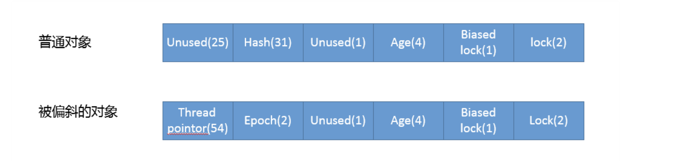


>  具体更细节的问题，例如，多个线程抢一把锁，那么是如何等待的？是不断的轮询加锁，还是有个等待队列，参考JVM文档


> #### 加锁过程

当进行加锁操作时，Java 虚拟机会判断是否已经是重量级锁。如果不是，它会在当前线程的当前栈桢中划出一块空间，作为该锁的锁记录，并且将锁对象的标记字段复制到该锁记录中。

然后，Java 虚拟机会尝试用 CAS（compare-and-swap）操作替换锁对象的标记字段。这里解释一下，CAS 是一个原子操作，它会比较目标地址的值是否和期望值相等，如果相等，则替换为一个新的值。

假设当前锁对象的标记字段为 X…XYZ，Java 虚拟机会比较该字段是否为 X…X01。如果是，则替换为刚才分配的锁记录的地址。由于内存对齐的缘故，它的最后两位为 00。此时，该线程已成功获得这把锁，可以继续执行了。

如果不是 X…X01，那么有两种可能。第一，该线程重复获取同一把锁。此时，Java 虚拟机会将锁记录清零，以代表该锁被重复获取。第二，其他线程持有该锁。此时，Java 虚拟机会将这把锁膨胀为重量级锁，并且阻塞当前线程。

当进行解锁操作时，如果当前锁记录（你可以将一个线程的所有锁记录想象成一个栈结构，每次加锁压入一条锁记录，解锁弹出一条锁记录，当前锁记录指的便是栈顶的锁记录）的值为 0，则代表重复进入同一把锁，直接返回即可。

否则，Java 虚拟机会尝试用 CAS 操作，比较锁对象的标记字段的值是否为当前锁记录的地址。如果是，则替换为锁记录中的值，也就是锁对象原本的标记字段。此时，该线程已经成功释放这把锁。

如果不是，则意味着这把锁已经被膨胀为重量级锁。此时，Java 虚拟机会进入重量级锁的释放过程，唤醒因竞争该锁而被阻塞了的线程。


> #### Java 虚拟机是怎么区分轻量级锁和重量级锁的?

对象头中的标记字段（mark word），它的最后两位便被用来表示该对象的锁状态。其中，00 代表轻量级锁，01 代表无锁（或偏向锁），10 代表重量级锁，11 则跟垃圾回收算法的标记有关。


[重学多线程（十）—— synchronized 原理与锁升级](https://blog.csdn.net/tjreal/article/details/80548662)


> #### 怎么防止死锁？

1. 提供了一个有序的访问，那么问题就会解
2. 定时释放
3. 获取锁前进行检查

[Java线程面试题(02) Java线程中如何避免死锁](https://blog.csdn.net/jinguangliu/article/details/78591477)


## Lock

首先推荐资料

[透彻理解Java并发编程系列](https://segmentfault.com/a/1190000015558984)


### **ReentrantLock**

1. ReentrantLock是一个**可重入的互斥锁**，又被称为“独占锁”。
2. ReentrantLock锁在同一个时间点只能被一个线程锁持有；
3. 而可重入的意思是，ReentrantLock锁，可以被**单个线程**多次获取。
4. 默认是“非公平锁”。
5. 主要利用CAS+AQS队列来实现。

ReentrantLock分为“**公平锁**”和“**非公平锁**”。它们的区别体现在**获取锁**的机制上是否公平。“锁”是为了保护竞争资源，防止多个线程同时操作线程而出错，ReentrantLock在**同一个时间点只能被一个线程获取**(当某线程获取到“锁”时，其它线程就必须等待)；ReentraantLock是通过一个**FIFO的等待队列**来管理获取该锁所有线程的。在“公平锁”的机制下，线程依次排队获取锁；而“非公平锁”在锁是可获取状态时，不管自己是不是在队列的开头都会获取锁。

这里所谓的公平性是指在竞争场景中，当公平性为真时，会倾向于将锁赋予等待时间最久的线程。公平性是减少线程“饥饿”（个别线程长期等待锁，但始终无法获取）情况发生的一 个办法。


看一下底层具体实现。

首先ReentrantLock定义了3个内部类，分别是一个抽象类`Sync`与一个公平锁的实现`FairSync`与`NonfairSync`。其中抽象类`Sync`实现了AQS，ReentrantLock全程通过调用`FairSync`与`NonfairSync`类来实现加锁。

**获取锁的过程**：

1. “当前线程”实际上是通过acquire(1)获取锁的
2.  “当前线程”首先通过tryAcquire()尝试获取锁。获取成功的话，直接返回；尝试失败的话，进入到等待队列排序等待(前面可能还有线程在等待该锁)。
3. “当前线程”尝试失败的情况下，先通过addWaiter(Node.EXCLUSIVE)来将“当前线程”加入到"CLH队列(非阻塞的FIFO队列)"末尾。CLH队列就是线程等待队列。
4.  再执行完addWaiter(Node.EXCLUSIVE)之后，会调用acquireQueued()来获取锁。由于此时ReentrantLock是公平锁，它会**根据公平性原则**来获取锁。
5. “当前线程”在执行acquireQueued()时，会进入到CLH队列中休眠等待，直到获取锁了才返回！如果“当前线程”在休眠等待过程中被中断过，acquireQueued会返回true，此时"当前线程"会调用selfInterrupt()来自己给自己产生一个中断。


**释放锁**：

1. unlock()是解锁函数，它是通过AQS的release()函数来实现的。
2. release()会先调用tryRelease()来尝试释放当前线程锁持有的锁。成功的话，则唤醒后继等待线程，并返回true。否则，直接返回false。
3. tryRelease()的作用是尝试释放锁。
4. 如果“当前线程”不是“锁的持有者”，则抛出异常。
5. 如果“当前线程”在本次释放锁操作之后，对锁的拥有状态是0(即，当前线程彻底释放该“锁”)，则设置“锁”的持有者为null，即锁是可获取状态。同时，更新当前线程的锁的状态为0。
6. 在release()中“当前线程”释放锁成功的话，会唤醒当前线程的后继线程。
   根据CLH队列的FIFO规则，“当前线程”(即已经获取锁的线程)肯定是head；如果CLH队列非空的话，则唤醒锁的下一个等待线程。


ReentrantLock加锁的主要过程：

1. **可重入加锁**。其实每次线程可重入加锁一次，会判断一下当前加锁线程就是自己，那么他自己就可重入多次加锁，每次加锁就是把state的值给累加1，别的没变化。
2. **锁的互斥**。线程2查看state的值不为0，所以CAS操作将state从0变为1的过程会失败，因为state的值当前为1，说明已经有人加锁了！接着线程2会查看，是不是自己加的锁，**“加锁线程”**这个变量明确记录了是线程1占用了这个锁，所以线程2此时就是加锁失败。接着，线程2会将自己放入AQS中的一个等待队列，因为自己尝试加锁失败了，此时就要将自己放入队列中来等待，等待线程1释放锁之后，自己就可以重新尝试加锁了
3. 线程1在执行完自己的业务逻辑代码之后，就会释放锁！将AQS内的state变量的值递减1，如果state值为0，则彻底释放锁，会将“加锁线程”变量也设置为null！接下来，会从**等待队列的队头唤醒线程2重新尝试加锁。**
4. 线程2现在就重新尝试加锁，这时还是用CAS操作将state从0变为1，此时就会成功，成功之后代表加锁成功，就会将state设置为1。此外，还要把**“加锁线程”**设置为线程2自己，同时线程2自己就从等待队列中出队了。


与synchronize相比，可以实现更加精细化的操作，体现在：

- 带超时的获取锁尝试。 
- 可以判断是否有线程，或者某个特定线程，在排队等待获取锁。 
- 可以响应中断请求。


可以参考[ReentrantLock原理](https://blog.csdn.net/fuyuwei2015/article/details/83719444)，文章中详细的分析了源码，需要把4个流程背一下。


### ReentrantReadWriteLock

所谓的读写锁，就是将一个锁拆分为读锁和写锁两个锁。

1. ReadWriteLock，是读写锁。它维护了一对相关的锁 — — “读取锁”和“写入锁”，一个用于读取操作，另一个用于写入操作。
2. “读取锁”用于只读操作，它是“共享锁”，能同时被多个线程获取。
3. “写入锁”用于写入操作，它是“独占锁”，写入锁只能被一个线程锁获取。**注意：不能同时存在读取锁和写入锁！**
4. ReadWriteLock是一个接口。ReentrantReadWriteLock是它的实现类，ReentrantReadWriteLock包括子类ReadLock和WriteLock。

```java
        ReentrantReadWriteLock reentrantReadWriteLock = new ReentrantReadWriteLock();
        
        reentrantReadWriteLock.writeLock().lock();
        reentrantReadWriteLock.writeLock().unlock();

        reentrantReadWriteLock.readLock().lock();
        reentrantReadWriteLock.readLock().unlock();
```


如果有一个线程加了写锁，那么其他线程就不能加写锁了，**同一时间只能允许一个线程加写锁**。因为加了写锁就意味着有人要写一个共享数据，那同时就不能让其他人来写这个数据了。

**同时如果有线程加了写锁，其他线程就不能加读锁了**，因为既然都有人在写数据了，你其他人当然不能来读数据了！

**如果有一个线程加了读锁，别的线程是可以随意同时加读锁的**，因为只是有线程在读数据而已，此时别的线程也是可以来读数据的！

同理，**如果一个线程加了读锁，此时其他线程是不可以加写锁的**，因为既然有人在读数据，那就不能让你随意来写数据了！


**获取锁的过程**：

   	1. 先通过tryAcquireShared()尝试获取共享锁。尝试成功的话，则直接返回；
   	        	2. 尝试失败的话，则通过doAcquireShared()不断的循环并尝试获取锁，若有需要，则阻塞等待。doAcquireShared()在循环中每次尝试获取锁时，都是通过tryAcquireShared()来进行尝试的。


**释放共享锁**：

1. 先通过tryReleaseShared()尝试释放共享锁。
2. 尝试成功的话，则通过doReleaseShared()唤醒“其他等待获取共享锁的线程”，并返回true；否则的话，返回flase。


https://juejin.im/post/5c0c8540e51d451dbe4fdd83

[自旋锁、排队自旋锁、MCS锁、CLH锁](https://coderbee.net/index.php/concurrent/20131115/577/comment-page-1)


### StampedLock

JDK8在后期引入了StampedLock，在提供类似读写锁的同时，还支持优化读模式。

优化读基于假设，大多数情况下读操作并不会和写操作冲突，其逻辑是先试着修改，然后通过validate方法确认是否进入了写模式，如果没有进入，就成功避免了开销；如果进入，则尝试获取读锁。

StampedLock虽然**不像其它锁一样定义了内部类来实现AQS框架**，但是StampedLock的基本实现思路还是利用CLH队列进行线程的管理，通过同步状态值来表示锁的状态和类型。StampedLock内部定义了很多常量，定义这些常量的根本目的还是和ReentrantReadWriteLock一样，对同步状态值按位切分，以通过位运算对State进行操作。


**StampedLock的特点**

StampedLock的主要特点概括一下，有以下几点：

- StampedLock是为了优化可重入读写锁性能的一个锁实现工具，jdk8开始引入
- 相比于普通的ReentranReadWriteLock主要多了一种乐观读的功能
- 在API上增加了stamp的入参和返回值
  - 所有获取锁的方法，都返回一个邮戳（Stamp），Stamp为0表示获取失败，其余都表示成功；
  - 所有释放锁的方法，都需要一个邮戳（Stamp），这个Stamp必须是和成功获取锁时得到的Stamp一致；
- StampedLock**是不可重入的**；（如果一个线程已经持有了写锁，再去获取写锁的话就会造成死锁）
- StampedLock有三种访问模式：
   ①Reading（读模式）：功能和ReentrantReadWriteLock的读锁类似
   ②Writing（写模式）：功能和ReentrantReadWriteLock的写锁类似
   ③Optimistic reading（乐观读模式）：这是一种优化的读模式。
- StampedLock支持读锁和写锁的相互转换
   我们知道RRW中，当线程获取到写锁后，可以降级为读锁，但是读锁是不能直接升级为写锁的。
  StampedLock提供了读锁和写锁相互转换的功能，使得该类支持更多的应用场景。
- 无论写锁还是读锁，都不支持Conditon等待

> 我们知道，在ReentrantReadWriteLock中，当读锁被使用时，如果有线程尝试获取写锁，该写线程会阻塞。
> 但是，在Optimistic reading中，即使读线程获取到了读锁，写线程尝试获取写锁也不会阻塞，这相当于对读模式的优化，但是可能会导致数据不一致的问题。所以，当使用Optimistic reading获取到读锁时，必须对获取结果进行校验。


[Java多线程进阶（十一）—— J.U.C之locks框架：StampedLock](https://segmentfault.com/a/1190000015808032)


### Condition

Condition的作用是对锁进行更精确的控制。Condition中的await()方法相当于Object的wait()方法，Condition中的signal()方法相当于Object的notify()方法，Condition中的signalAll()相当于Object的notifyAll()方法。不同的是，Object中的wait(),notify(),notifyAll()方法是和"同步锁"synchronized关键字捆绑使用的；而Condition是需要与"互斥锁"/"共享锁"捆绑使用的。

这里参考ArrayBlockingQueue类的源码看如何使用

```java
    /** Condition for waiting takes */
    private fnal Condition notEmpty;
    /** Condition for waiting puts */
    private fnal Condition notFull;
    public ArrayBlockingQueue(int capacity, boolean fair) {
        if (capacity <= 0)
            throw new IllegalArgumentException();
        this.items = new Object[capacity];
        lock = new ReentrantLock(fair);
        notEmpty = lock.newCondition();
        notFull =  lock.newCondition();
    }

    public E take() throws InterruptedException {
        final ReentrantLock lock = this.lock;
        lock.lockInterruptibly();
        try {
            while (count == 0)
                notEmpty.await();
            return dequeue();
        } finally {
            lock.unlock();
        }
    }

    private void enqueue(E x) {
        // assert lock.getHoldCount() == 1;
        // assert items[putIndex] == null;
        final Object[] items = this.items;
        items[putIndex] = x;
        if (++putIndex == items.length)
            putIndex = 0;
        count++;
        notEmpty.signal();
    }
```

- 两个条件变量是从同一再入锁创建出来，然后使用在特定操作中，如take方法。
- 当队列为空时，试图take的线程的正确行为应该是等待入队发生，而不是直接返回，这是BlockingQueue的语义，使用条件notEmpty就可以优雅地实现这一逻辑。
- 在enqueue方法中入队，触发后续take操作。


在这三篇文章中非常详细的进行了说明

[J.U.C之locks框架（7）：Condition 原理](https://segmentfault.com/a/1190000015807209)

一份非常详尽的源码分析，看完就懂了


[Java并发之Condition](https://segmentfault.com/a/1190000038273839)

这篇文章中对Condition的等待队列的变化做了详细的描述，画了图，非常好理解。


[java并发编程学习之Condition-分析(二)](https://segmentfault.com/a/1190000019883589)

这篇文章中不仅有代码分析，还有一份流程图，方便背诵。


### LockSupport

LockSupport是用来创建锁和其他同步类的基本线程阻塞原语。 LockSupport中的park() 和 unpark() 的作用分别是阻塞线程和解除阻塞线程，而且park()和unpark()不会遇到“Thread.suspend 和 Thread.resume所可能引发的死锁”问题。因为park() 和 unpark()有许可的存在；调用 park() 的线程和另一个试图将其 unpark() 的线程之间的竞争将保持活性。


[自己动手写把”锁”---LockSupport深入浅出](https://www.cnblogs.com/qingquanzi/p/8228422.html)

[J.U.C之locks框架（4）：LockSupport 工具类](https://segmentfault.com/a/1190000015562456)


### Semaphore 

Java版本的信号量实现


[J.U.C之synchronizer框架（3）：信号量——Semaphore](https://segmentfault.com/a/1190000015918459)

[深入理解Semaphore](https://blog.csdn.net/qq_19431333/article/details/70212663)


### CountDownLatch 

CountDownLatch是一个同步辅助类，在完成一组正在其他线程中执行的操作之前，它允许一个或多个线程一直等待。CountDownLatch 可以实现 join 相同的功能，但是更加的灵活。


使用

```java
private static void countDownLatch() throws Exception{
    int thread = 3 ;
    long start = System.currentTimeMillis();
    final CountDownLatch countDown = new CountDownLatch(thread);
    for (int i= 0 ;i<thread ; i++){
        new Thread(new Runnable() {
            @Override
            public void run() {
                LOGGER.info("thread run");
                try {
                    Thread.sleep(2000);
                    countDown.countDown();
                    LOGGER.info("thread end");
                } catch (InterruptedException e) {
                    e.printStackTrace();
                }
            }
        }).start();
    }
    countDown.await();
    long stop = System.currentTimeMillis();
    LOGGER.info("main over total time={}",stop-start);
}
```

CountDownLatch 也是基于 AQS(AbstractQueuedSynchronizer) 实现的

- 初始化一个 CountDownLatch 时告诉并发的线程，然后在每个线程处理完毕之后调用 countDown() 方法。

- 该方法会将 AQS 内置的一个 state 状态 -1 。

- 最终在主线程调用 await() 方法，它会阻塞直到 `state == 0` 的时候返回。

  

[J.U.C之synchronizer框架（1）：倒数计数器——CountDownLatch](https://segmentfault.com/a/1190000015886497)


### CyclicBarrier（同步屏障）

CyclicBarrier是一个同步辅助类，允许一组线程互相等待，直到到达某个公共屏障点 (common barrier point)。因为该 barrier 在释放等待线程后可以重用，所以称它为循环 的 barrier。


cyclicBarrier可以代替wait/notify的使用，并去掉synchronized

```JAVA
public class CyclicBarrierTest {
  public static void main(String[] args) {
    CyclicBarrier cyclicBarrier = new CyclicBarrier(3);
    new Thread(() -> {
      System.out.println(Thread.currentThread().getName() + ": 准备...");
      try {
        cyclicBarrier.await();
      } catch (InterruptedException e) {
        e.printStackTrace();
      } catch (BrokenBarrierException e) {
        e.printStackTrace();
      }
      System.out.println("全部启动完毕!");
    }, "线程1").start();

    new Thread(() -> {
      System.out.println(Thread.currentThread().getName() + ": 准备...");
      try {
        cyclicBarrier.await();
      } catch (InterruptedException e) {
        e.printStackTrace();
      } catch (BrokenBarrierException e) {
        e.printStackTrace();
      }
      System.out.println("全部启动完毕!");
    }, "线程2").start();

    new Thread(() -> {
      System.out.println(Thread.currentThread().getName() + ": 准备...");
      try {
        cyclicBarrier.await();
      } catch (InterruptedException e) {
        e.printStackTrace();
      } catch (BrokenBarrierException e) {
        e.printStackTrace();
      }
      System.out.println("全部启动完毕!");
    }, "线程3").start();
  }
}


结果
线程3: 准备...
线程2: 准备...
线程1: 准备...
全部启动完毕!
全部启动完毕!
全部启动完毕!
```

该工具可以实现 CountDownLatch 同样的功能，但是要更加灵活。甚至可以调用 `reset()` 方法重置 CyclicBarrier (需要自行捕获 BrokenBarrierException 处理) 然后重新执行。


**CountDownLatch和CyclicBarrier的区别**

1. CountDownLatch的作用是允许1或N个线程等待其他线程完成执行；而CyclicBarrier则是允许N个线程相互等待。
2.  CountDownLatch的计数器无法被重置；CyclicBarrier的计数器可以被重置后使用，因此它被称为是循环的barrier。


[J.U.C之synchronizer框架（2）：循环栅栏——CyclicBarrier](https://segmentfault.com/a/1190000015888316)


文章的后续还提到了`Exchanger`与`Phaser`，讲真这两个东西实在是有点小众了，功能也比较复杂，在实际情况下要实现如此复杂的功能，还需要考虑到分布式的情况，不太可能只单机部署，所以基本上被问的几率不大

[J.U.C之synchronizer框架（4）：数据交换器——Exchanger](https://segmentfault.com/a/1190000015963932)

[J.U.C之synchronizer框架（5）：多阶段栅栏——Phaser](https://segmentfault.com/a/1190000015979879)


## AbstractQueuedSynchronizer(AQS **抽象队列同步器**)

**AQS是一个并发包的基础组件，用来实现各种锁，各种同步组件的。它包含了state同步状态变量、加锁线程、等待队列等并发中的核心组件。** **ReentrantLock、CountDownLatch、CyclicBarrier**底层是基于AQS实现的锁。ReentrantLock这种东西只是一个外层的API，**内核中的锁机制实现都是依赖AQS组件的**。


AQS替用户解决了如下问题

1. 资源是可以被同时访问？还是在同一时间只能被一个线程访问？（共享/独占功能）
2. 访问资源的线程如何进行并发管理？（等待队列）
3. 如果线程等不及资源了，如何从等待队列退出？（超时/中断）


> AQS队列内部维护的是一个FIFO的双向链表，这种结构的特点是每个数据结构都有两个指针，分别指向直接的后继节点和直接前驱节点。所以双向链表可以从任意一个节点开始很方便的访问前驱和后继。每个Node其实是由线程封装，当线程争抢锁失败后会封装成Node加入到ASQ队列中去

这里可以参考[深入分析AQS实现原理](https://segmentfault.com/a/1190000017372067)，里面使用ReentrantLock为例子，说明了AQS是怎么用，同时画出了ReentrantLock的时序图。


[大白话聊聊Java并发面试问题之谈谈你对AQS的理解？【石杉的架构笔记】](https://juejin.im/post/5c07e59cf265da617464a09c)

[Java多线程进阶（六）—— J.U.C之locks框架：AQS综述(1)](https://segmentfault.com/a/1190000015562787)

[Java多线程进阶（七）—— J.U.C之locks框架：AQS独占功能剖析(2)](https://segmentfault.com/a/1190000015804888)

[J.U.C之locks框架（5）：AbstractQueuedSynchronizer 综述](https://segmentfault.com/a/1190000015562787)

[J.U.C之locks框架（6）：AbstractQueuedSynchronizer 的独占功能原理](https://segmentfault.com/a/1190000015804888)

[J.U.C之locks框架（8）：AbstractQueuedSynchronizer 的共享功能原理](https://segmentfault.com/a/1190000015807573)


## wait/notify/join

wait/notify

 ```JAVA
    private static Object lock = new Object();
    private static Integer i = 0;
  
    public void odd() {
      while (i < 10) {
        synchronized (lock) {
          if (i % 2 == 1) {
            System.out.println(Thread.currentThread().getName() + " - " + i);
            try {
              Thread.sleep(1000);
            } catch (InterruptedException e) {
              e.printStackTrace();
            }
            i++;
            lock.notify();
          } else {
            try {
              lock.wait();
            } catch (InterruptedException e) {
              e.printStackTrace();
            }
          }
        }
      }
    }
 ```


join

 ```java
  private static void join() throws InterruptedException {
      Thread t1 = new Thread(new Runnable() {
          @Override
          public void run() {
              LOGGER.info("running");
              try {
                  Thread.sleep(3000);
              } catch (InterruptedException e) {
                  e.printStackTrace();
              }
          }
      }) ;
      Thread t2 = new Thread(new Runnable() {
          @Override
          public void run() {
              LOGGER.info("running2");
              try {
                  Thread.sleep(4000);
              } catch (InterruptedException e) {
                  e.printStackTrace();
              }
          }
      }) ;
      t1.start();
      t2.start();
      //等待线程1终止
      t1.join();
      //等待线程2终止
      t2.join();
      LOGGER.info("main over");
  }
 ```

  在  `t1.join()` 时会一直阻塞到 t1 执行完毕，所以最终主线程会等待 t1 和 t2 线程执行完毕。

  其实从源码可以看出，join() 也是利用的等待通知机制：

  核心逻辑:

  ```
  while (isAlive()) {
      wait(0);
  }
  ```

  在 join 线程完成后会调用 notifyAll() 方法，是在 JVM 实现中调用，所以这里看不出来。


## 死锁

>  #### 什么情况下Java程序会产生死锁？

死锁是一种特定的程序状态，在实体之间，由于循环依赖导致彼此一直处于等待之中，没有任何个体可以继续前进。死锁不仅仅是在线程之间会发生，存在资源独占的进程之间同样 也可能出现死锁。通常来说，我们大多是聚焦在多线程场景中的死锁，指两个或多个线程之间，由于互相持有对方需要的锁，而永久处于阻塞的状态。

```java
public class DeadLockSample extends Thread {
    private String frs;
    private String second;
    public DeadLockSample(String name, String frs, String second) {
        super(name);
        this.frs = frs;
        this.second = second;
    }
    public void run() {
        synchronized (frs) {
            Sysem.out.println(this.getName() + " obtained: " + frs);
            try {
                Thread.sleep(1000L);
                synchronized (second) {
                    Sysem.out.println(this.getName() + " obtained: " + second);
                }
            } catch (InterruptedException e) {
                // Do nothing
            }
        }
    }
    public satic void main(String[] args) throws InterruptedException {
        String lockA = "lockA";
        String lockB = "lockB";
      	// 入参顺序不一样
        DeadLockSample t1 = new DeadLockSample("Thread1", lockA, lockB);
        DeadLockSample t2 = new DeadLockSample("Thread2", lockB, lockA);
        t1.sart();
        t2.sart();
        t1.join();
        t2.join();
    }
}
```


> #### 如何定位、修复？

定位死锁最常见的方式就是利用jstack等工具获取线程栈，然后定位互相之间的依赖关系，进而找到死锁。如果是比较明显的死锁，往往jstack等就能直接定位，类似JConsole甚至可以在图形界面进行有限的死锁检测。 如果程序运行时发生了死锁，绝大多数情况下都是无法在线解决的，只能重启、修正程序本身问题。所以，代码开发阶段互相审查，或者利用工具进行预防性排查，往往也是很重要的。


- 首先，可以使用jps或者系统的ps命令、任务管理器等工具，确定进程ID。 

- 其次，调用jstack获取线程栈：

  ```cmd
  ${JAVA_HOME}\bin\jsack your_pid
  ```

  

- 最后，结合代码分析线程栈信息。

可以考虑使用Java提供的标准管理API，**ThreadMXBean**，其直接就提供 了fndDeadlockedThreads()方法用于定位


> #### 死锁避免

**死锁前提**

- 互斥条件：一个资源每次只能被一个进程使用，即在一段时间内某 资源仅为一个进程所占有。此时若有其他进程请求该资源，则请求进程只能等待。
- 请求与保持条件：进程已经保持了至少一个资源，但又提出了新的资源请求，而该资源 已被其他进程占有，此时请求进程被阻塞，但对自己已获得的资源保持不放。
- 不可剥夺条件:进程所获得的资源在未使用完毕之前，不能被其他进程强行夺走，即只能 由获得该资源的进程自己来释放（只能是主动释放)。
- 循环等待条件: 若干进程间形成首尾相接循环等待资源的关系


**思路**

- 第一种方法 如果可能的话，尽量避免使用多个锁，并且只有需要时才持有锁。
- 第二种方法 如果必须使用多个锁，尽量设计好锁的获取顺序，银行家算法。
- 第三种方法 使用带超时的方法
- 第四种方法 业界也有一些其他方面的尝试，比如通过静态代码分析（如FindBugs）去查找固定的模式，进而定位可能的死锁或者竞争情况。


> 《java核心技术面试精讲-40讲——18什么情况下Java程序会产生死锁？如何定位、修复》


## 线程池


ThreadPoolExecutor是线程池类。对于线程池，可以通俗的将它理解为"存放一定数量线程的一个线程集合“。线程池允许若干个线程同时运行，允许同时运行的线程数量就是线程池的容量；当添加的到线程池中的线程超过它的容量时，会有一部分线程阻塞等待。线程池会通过相应的调度策略和拒绝策略，对添加到线程池中的线程进行管理。

线程池内的线程数的大小相关的概念有两个，一个是核心池大小，还有最大池大小。如果当前的线程个数比核心池个数小，当任务到来，会优先创建一个新的线程并执行任务。当已经到达核心池大小，则把任务放入队列，为了资源不被耗尽，队列的最大容量可能也是有上限的，如果达到队列上限则考虑继续创建新线程执行任务，如果此刻线程的个数已经到达最大池上限，则考虑把任务丢弃。

简单来说就是： 

- 如果运行的线程少于corePoolSize，则 Executor始终首选添加新的线程，而不进行排队。（如果当前运行的线程小于corePoolSize，则任务根本不会存入queue中，而是直接运行） 
- 如果运行的线程大于等于 corePoolSize，则 Executor始终首选将请求加入队列，而不添加新的线程。 
- 如果无法将请求加入队列，则创建新的线程，除非创建此线程超出 maximumPoolSize，在这种情况下，任务将被拒绝。


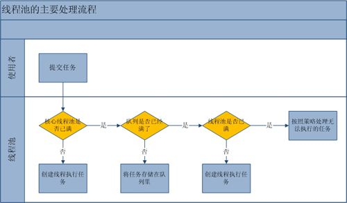


ThreadPoolExecutor.java中主要的成员变量为：

```java
// 阻塞队列。
private final BlockingQueue<Runnable> workQueue;
// 互斥锁
private final ReentrantLock mainLock = new ReentrantLock();
// 线程集合。一个Worker对应一个线程。
private final HashSet<Worker> workers = new HashSet<Worker>();
// “终止条件”，与“mainLock”绑定。
private final Condition termination = mainLock.newCondition();
// 线程池中线程数量曾经达到过的最大值。
private int largestPoolSize;
// 已完成任务数量
private long completedTaskCount;
// ThreadFactory对象，用于创建线程。
private volatile ThreadFactory threadFactory;
// 拒绝策略的处理句柄。
private volatile RejectedExecutionHandler handler;
// 保持线程存活时间。
private volatile long keepAliveTime;

private volatile boolean allowCoreThreadTimeOut;
// 核心池大小
private volatile int corePoolSize;
// 最大池大小
private volatile int maximumPoolSize;
```


**1. workers**
workers是HashSet<Work>类型，即它是一个Worker集合。而一个Worker对应一个线程，也就是说线程池通过workers包含了"一个线程集合"。当Worker对应的线程池启动时，它会执行线程池中的任务；当执行完一个任务后，它会从线程池的阻塞队列中取出一个阻塞的任务来继续运行。
​wokers的作用是，线程池通过它实现了"允许多个线程同时运行"。

**2. workQueue**
​    workQueue是BlockingQueue类型，即它是一个阻塞队列。当线程池中的线程数超过它的容量的时候，线程会进入阻塞队列进行阻塞等待。
​    通过workQueue，线程池实现了阻塞功能。

**3. mainLock**
​    mainLock是互斥锁，通过mainLock实现了对线程池的互斥访问。

**4. corePoolSize和maximumPoolSize**
​    corePoolSize是"核心池大小"，maximumPoolSize是"最大池大小"。它们的作用是调整"线程池中实际运行的线程的数量"。
​    例如，当新任务提交给线程池时(通过execute方法)。
​          -- 如果此时，线程池中**运行的线程数量**< corePoolSize，则创建新线程来处理请求。
​          -- 如果此时，线程池中**运行的线程数量**> corePoolSize，但是却< maximumPoolSize；**则仅当阻塞队列满时**才创建新线程。
​           如果设置的 corePoolSize 和 maximumPoolSize 相同，则创建了固定大小的线程池。如果将  maximumPoolSize 设置为基本的无界值（如  Integer.MAX_VALUE），则允许池适应任意数量的并发任务。在大多数情况下，核心池大小和最大池大小的值是在创建线程池设置的；但是，也可以使用  setCorePoolSize(int) 和 setMaximumPoolSize(int) 进行动态更改。

**5. poolSize**
​    poolSize是当前线程池的实际大小，即线程池中任务的数量。

**6. allowCoreThreadTimeOut和keepAliveTime**
​    allowCoreThreadTimeOut表示是否允许"线程在空闲状态时，仍然能够存活"；而keepAliveTime是当线程池处于空闲状态的时候，超过keepAliveTime时间之后，空闲的线程会被终止。

**7. threadFactory**
​    threadFactory是ThreadFactory对象。它是一个线程工厂类，"线程池通过ThreadFactory创建线程"。

**8. handler**
​    handler是RejectedExecutionHandler类型。它是"线程池拒绝策略"的句柄，也就是说"当某任务添加到线程池中，而线程池拒绝该任务时，线程池会通过handler进行相应的处理"。


综上所说，线程池通过workers来管理"线程集合"，每个线程在启动后，会执行线程池中的任务；当一个任务执行完后，它会从线程池的阻塞队列中取出任务来继续运行。阻塞队列是管理线程池任务的队列，当添加到线程池中的任务超过线程池的容量时，该任务就会进入阻塞队列进行等待。


- **创建线程池：**

  可以通过**Executors**直接运行，也可以通过**ThreadPoolExecutor**来进行创建。

```java
ExecutorService pool = Executors.newFixedThreadPool(2);
```

其实他内部还是调用了**ThreadPoolExecutor**来进行创建。

```java
public static ExecutorService newFixedThreadPool(int nThreads) {
    return new ThreadPoolExecutor(nThreads, nThreads,
                                  0L, TimeUnit.MILLISECONDS,
                                  new LinkedBlockingQueue<Runnable>());
}
```


主要是看看ThreadPoolExecutor类的初始化过程：

```java
public ThreadPoolExecutor(int corePoolSize,
                          int maximumPoolSize,
                          long keepAliveTime,
                          TimeUnit unit,
                          BlockingQueue<Runnable> workQueue) {
    this(corePoolSize, maximumPoolSize, keepAliveTime, unit, workQueue,
         Executors.defaultThreadFactory(), defaultHandler);
}


public ThreadPoolExecutor(int corePoolSize,
                          int maximumPoolSize,
                          long keepAliveTime,
                          TimeUnit unit,
                          BlockingQueue<Runnable> workQueue,
                          ThreadFactory threadFactory,
                          RejectedExecutionHandler handler) {
    if (corePoolSize < 0 ||
        maximumPoolSize <= 0 ||
        maximumPoolSize < corePoolSize ||
        keepAliveTime < 0)
        throw new IllegalArgumentException();
    if (workQueue == null || threadFactory == null || handler == null)
        throw new NullPointerException();
    // 核心池大小
    this.corePoolSize = corePoolSize;
    // 最大池大小
    this.maximumPoolSize = maximumPoolSize;
    // 线程池的等待队列
    this.workQueue = workQueue;
    this.keepAliveTime = unit.toNanos(keepAliveTime);
    // 线程工厂对象
    this.threadFactory = threadFactory;
    // 拒绝策略的句柄
    this.handler = handler;
}
```


**corePoolSize**- 核心池大小，既然如前原理部分所述。需要注意的是在初创建线程池时线程不会立即启动，直到有任务提交才开始启动线程并逐渐时线程数目达到corePoolSize。若想一开始就创建所有核心线程需调用prestartAllCoreThreads方法。  

**maximumPoolSize**-池中允许的最大线程数。需要注意的是当核心线程满且阻塞队列也满时才会判断当前线程数是否小于最大线程数，并决定是否创建新线程。  

**keepAliveTime** - 当线程数大于核心时，多于的**空闲线程**最多存活时间  

**unit** - keepAliveTime 参数的时间单位。  

**workQueue**  -  当线程数目超过核心线程数时用于保存任务的队列。主要有3种类型的BlockingQueue可供选择：**无界队列，有界队列和同步移交**。从参数中可以看到，此队列仅保存实现Runnable接口的任务。别看这个参数位置很靠后，但是真的很重要。

**threadFactory** - 执行程序创建新线程时使用的工厂。  

**handler** - 阻塞队列已满且线程数达到最大值时所采取的饱和策略。java默认提供了4种饱和策略的实现方式：**中止、抛弃、抛弃最旧的、调用者运行。**


- **可选择的阻塞队列BlockingQueue详解**


  主要有3种类型的BlockingQueue：

  **无界队列**

  队列大小无限制，常用的为无界的LinkedBlockingQueue，使用该队列做为阻塞队列时要尤其当心，当任务耗时较长时可能会**导致大量新任务在队列中堆积最终导致OOM**。阅读代码发现，Executors.newFixedThreadPool  采用就是  LinkedBlockingQueue，而楼主踩到的就是这个坑，当QPS很高，发送数据很大，大量的任务被添加到这个无界LinkedBlockingQueue  中，导致cpu和内存飙升服务器挂掉。

  **有界队列**

  常用的有两类，一类是遵循FIFO原则的队列如ArrayBlockingQueue与有界的LinkedBlockingQueue，另一类是优先级队列如PriorityBlockingQueue。PriorityBlockingQueue中的优先级由任务的Comparator决定。
  使用有界队列时队列大小需和线程池大小互相配合，线程池较小有界队列较大时可减少内存消耗，降低cpu使用率和上下文切换，但是可能会限制系统吞吐量。

  在我们的修复方案中，选择的就是这个类型的队列，虽然会有部分任务被丢失，但是我们线上是排序日志搜集任务，所以对部分对丢失是可以容忍的。

  **同步移交队列**

  如果不希望任务在队列中等待而是希望将任务直接移交给工作线程，可使用SynchronousQueue作为等待队列。SynchronousQueue不是一个真正的队列，而是一种线程之间移交的机制。要将一个元素放入SynchronousQueue中，必须有另一个线程正在等待接收这个元素。只有在使用无界线程池或者有饱和策略时才建议使用该队列。


- **可选择的饱和策略RejectedExecutionHandler详解**

  JDK主要提供了4种饱和策略供选择。4种策略都做为静态内部类在ThreadPoolExcutor中进行实现。
  
  

**AbortPolicy中止策略**

该策略是默认饱和策略。

```java
public void rejectedExecution(Runnable r, ThreadPoolExecutor e) {
            throw new RejectedExecutionException("Task " + r.toString() +
                                                 " rejected from " +
                                                 e.toString());
 } 
```

使用该策略时在饱和时会抛出RejectedExecutionException（继承自RuntimeException），调用者可捕获该异常自行处理。


 **DiscardPolicy抛弃策略**

  ```java
  public void rejectedExecution(Runnable r, ThreadPoolExecutor e) {
  }
  ```

如代码所示，不做任何处理直接抛弃任务


 **DiscardOldestPolicy抛弃旧任务策略**

  ```java
  public void rejectedExecution(Runnable r, ThreadPoolExecutor e) {
              if (!e.isShutdown()) {
                  e.getQueue().poll();
                  e.execute(r);
              }
  } 
  ```

如代码，先将阻塞队列中的头元素出队抛弃，再尝试提交任务。如果此时阻塞队列使用PriorityBlockingQueue优先级队列，将会导致优先级最高的任务被抛弃，因此不建议将该种策略配合优先级队列使用。


 **CallerRunsPolicy调用者运行**

  ```java
  public void rejectedExecution(Runnable r, ThreadPoolExecutor e) {
              if (!e.isShutdown()) {
                  r.run();
              }
  } 
  ```

既不抛弃任务也不抛出异常，直接运行任务的run方法，换言之将任务回退给调用者来直接运行。使用该策略时线程池饱和后将由调用线程池的主线程自己来执行任务，因此在执行任务的这段时间里主线程无法再提交新任务，从而使线程池中工作线程有时间将正在处理的任务处理完成。


- **ThreadFactory**

Executors.defaultThreadFactory()，生成了一个默认的线程工厂(DefaultThreadFactory)，线程池里的线程都是由这个工厂来创建的。

```java
static class DefaultThreadFactory implements ThreadFactory {
    private static final AtomicInteger poolNumber = new AtomicInteger(1);
    private final ThreadGroup group;
    private final AtomicInteger threadNumber = new AtomicInteger(1);
    private final String namePrefix;

    DefaultThreadFactory() {
        SecurityManager s = System.getSecurityManager();
        group = (s != null) ? s.getThreadGroup() :
        Thread.currentThread().getThreadGroup();
        namePrefix = "pool-" +
            poolNumber.getAndIncrement() +
            "-thread-";
    }

    // 提供创建线程的API。
    public Thread newThread(Runnable r) {
        // 线程对应的任务是Runnable对象r
        Thread t = new Thread(group, r,
                              namePrefix + threadNumber.getAndIncrement(),
                              0);
        // 设为“非守护线程”
        if (t.isDaemon())
            t.setDaemon(false);
        // 将优先级设为“Thread.NORM_PRIORITY”
        if (t.getPriority() != Thread.NORM_PRIORITY)
            t.setPriority(Thread.NORM_PRIORITY);
        return t;
    }
}
```


在线程池创建了之后，我们需要把任务放到线程池中运行。调用线程池的execute()方法，把任务加入到线程中运行。

```java
import java.util.concurrent.Executors;
import java.util.concurrent.ExecutorService;

public class ThreadPoolDemo1 {

    public static void main(String[] args) {
        // 创建一个可重用固定线程数的线程池
        ExecutorService pool = Executors.newFixedThreadPool(2);
        // 创建实现了Runnable接口对象，Thread对象当然也实现了Runnable接口
        Thread ta = new MyThread();
        Thread tb = new MyThread();
        Thread tc = new MyThread();
        Thread td = new MyThread();
        Thread te = new MyThread();
        // 将线程放入池中进行执行
        pool.execute(ta);
        pool.execute(tb);
        pool.execute(tc);
        pool.execute(td);
        pool.execute(te);
        // 关闭线程池
        pool.shutdown();
    }
}

class MyThread extends Thread {

    @Override
    public void run() {
        System.out.println(Thread.currentThread().getName()+ " is running.");
    }
}
```


execute方法

```java
public void execute(Runnable command) {
    // 如果任务为null，则抛出异常。
    if (command == null)
        throw new NullPointerException();
    // 获取ctl对应的int值。该int值保存了"线程池中任务的数量"和"线程池状态"信息
    int c = ctl.get();
    // 当线程池中的任务数量 < "核心池大小"时，即线程池中少于corePoolSize个任务。
    // 则通过addWorker(command, true)新建一个线程，并将任务(command)添加到该线程中；然后，启动该     // 线程从而执行任务。
    if (workerCountOf(c) < corePoolSize) {
        if (addWorker(command, true))
            return;
        c = ctl.get();
    }
    // 当线程池中的任务数量 >= "核心池大小"时，
    // 而且，"线程池处于允许状态"时，则尝试将任务添加到阻塞队列中。
    if (isRunning(c) && workQueue.offer(command)) {
        // 再次确认“线程池状态”，若线程池异常终止了，则删除任务；然后通过reject()执行相应的拒绝策略的内容。
        int recheck = ctl.get();
        if (! isRunning(recheck) && remove(command))
            reject(command);
        // 否则，如果"线程池中任务数量"为0，则通过addWorker(null, false)尝试新建一个线程，新建线程对应的任务为null。
        else if (workerCountOf(recheck) == 0)
            addWorker(null, false);
    }
    // 通过addWorker(command, false)新建一个线程，并将任务(command)添加到该线程中；然后，启动该线程从而执行任务。
    // 如果addWorker(command, false)执行失败，则通过reject()执行相应的拒绝策略的内容。
    else if (!addWorker(command, false))
        reject(command);
}
```

execute()的作用是将任务添加到线程池中执行。它会分为3种情况进行处理：
​              1.  如果"线程池中任务数量" < "核心池大小"时，即线程池中少于corePoolSize个任务；此时就新建一个线程，并将该任务添加到线程中进行执行。
​              2.   如果"线程池中任务数量" >= "核心池大小"，并且"线程池是允许状态"；此时，则将任务添加到阻塞队列中阻塞等待。在该情况下，会再次确认"线程池的状态"，如果"第2次读到的线程池状态"和"第1次读到的线程池状态"不同，则从阻塞队列中删除该任务。
​              3.  非以上两种情况。在这种情况下，尝试新建一个线程，并将该任务添加到线程中进行执行。如果执行失败，则通过reject()拒绝该任务。


addWorker方法：

```java
private boolean addWorker(Runnable firstTask, boolean core) {
    retry:
    // 更新"线程池状态和计数"标记，即更新ctl。
    for (;;) {
        // 获取ctl对应的int值。该int值保存了"线程池中任务的数量"和"线程池状态"信息
        int c = ctl.get();
        // 获取线程池状态。
        int rs = runStateOf(c);

        // 有效性检查
        if (rs >= SHUTDOWN &&
            ! (rs == SHUTDOWN &&
               firstTask == null &&
               ! workQueue.isEmpty()))
            return false;

        for (;;) {
            // 获取线程池中任务的数量。
            int wc = workerCountOf(c);
            // 如果"线程池中任务的数量"超过限制，则返回false。
            if (wc >= CAPACITY ||
                wc >= (core ? corePoolSize : maximumPoolSize))
                return false;
            // 通过CAS函数将c的值+1。
            if (compareAndIncrementWorkerCount(c))
                break retry;
            c = ctl.get();  // Re-read ctl
            // 检查"线程池状态"，如果与之前的状态不同，则从retry重新开始。
            if (runStateOf(c) != rs)
                continue retry;
            // else CAS failed due to workerCount change; retry inner loop
        }
    }

    boolean workerStarted = false;
    boolean workerAdded = false;
    Worker w = null;
    // 添加任务到线程池，并启动任务所在的线程。
    try {
        final ReentrantLock mainLock = this.mainLock;
        // 新建Worker，并且指定firstTask为Worker的第一个任务。
        w = new Worker(firstTask);
        // 获取Worker对应的线程。
        final Thread t = w.thread;
        if (t != null) {
            // 获取锁
            mainLock.lock();
            try {
                int c = ctl.get();
                int rs = runStateOf(c);

                // 再次确认"线程池状态"
                if (rs < SHUTDOWN ||
                    (rs == SHUTDOWN && firstTask == null)) {
                    if (t.isAlive()) // precheck that t is startable
                        throw new IllegalThreadStateException();
                    // 将Worker对象(w)添加到"线程池的Worker集合(workers)"中
                    workers.add(w);
                    // 更新largestPoolSize
                    int s = workers.size();
                    if (s > largestPoolSize)
                        largestPoolSize = s;
                    workerAdded = true;
                }
            } finally {
                // 释放锁
                mainLock.unlock();
            }
            // 如果"成功将任务添加到线程池"中，则启动任务所在的线程。 
            if (workerAdded) {
                t.start();
                workerStarted = true;
            }
        }
    } finally {
        if (! workerStarted)
            addWorkerFailed(w);
    }
    // 返回任务是否启动。
    return workerStarted;
}
```

**说明**：

1. addWorker(Runnable firstTask, boolean core) 的作用是将任务(firstTask)添加到线程池中，并启动该任务。
2. core为true的话，则以corePoolSize为界限，若"线程池中已有任务数量>=corePoolSize"，则返回false；core为false的话，则以maximumPoolSize为界限，若"线程池中已有任务数量>=maximumPoolSize"，则返回false。
3. addWorker()会先通过for循环不断尝试更新ctl状态，ctl记录了"线程池中任务数量和线程池状态"。更新成功之后，再通过try模块来将任务添加到线程池中，并启动任务所在的线程。
4. 线程池在添加任务时，会创建任务对应的Worker对象；而一个Worker对象包含一个Thread对象。
5. 通过将Worker对象添加到"线程的workers集合"中，从而实现将任务添加到线程池中。
   ad线程，则执行该任务。


- **关闭线程池**

```java
pool.shutdown();

public void shutdown() {
    final ReentrantLock mainLock = this.mainLock;
    // 获取锁
    mainLock.lock();
    try {
        // 检查终止线程池的“线程”是否有权限。
        checkShutdownAccess();
        // 设置线程池的状态为关闭状态。
        advanceRunState(SHUTDOWN);
        // 中断线程池中空闲的线程。
        interruptIdleWorkers();
        // 钩子函数，在ThreadPoolExecutor中没有任何动作。
        onShutdown(); // hook for ScheduledThreadPoolExecutor
    } finally {
        // 释放锁
        mainLock.unlock();
    }
    // 尝试终止线程池
    tryTerminate();
}
```


- **线程池状态**

  1. Running
  2. SHUTDOWN
  3. STOP
  4. TIDYING
  5. TERMINATED


  定义为了常量

  ```java
  private final AtomicInteger ctl = new AtomicInteger(ctlOf(RUNNING, 0));
  private static final int COUNT_BITS = Integer.SIZE - 3;
  private static final int CAPACITY = (1 << COUNT_BITS) - 1;
  
  private static final int RUNNING = -1 << COUNT_BITS;
  private static final int SHUTDOWN = 0 << COUNT_BITS;
  private static final int STOP = 1 << COUNT_BITS;
  private static final int TIDYING = 2 << COUNT_BITS;
  private static final int TERMINATED = 3 << COUNT_BITS;
  private static int ctlOf(int rs, int wc) { return rs | wc; }
  ```

  ctl记录了"线程池中的任务数量"和"线程池状态"2个信息。
  ctl共包括32位。其中，高3位表示"线程池状态"，低29位表示"线程池中的任务数量"。

  ```
  RUNNING    -- 对应的高3位值是111。
  SHUTDOWN   -- 对应的高3位值是000。
  STOP       -- 对应的高3位值是001。
  TIDYING    -- 对应的高3位值是010。
  TERMINATED -- 对应的高3位值是011。
  ```


**1. RUNNING**

状态说明：线程池处在RUNNING状态时，能够接收新任务，以及对已添加的任务进行处理。
状态切换：线程池的初始化状态是RUNNING。换句话说，线程池被一旦被创建，就处于RUNNING状态！
道理很简单，在ctl的初始化代码中，就将它初始化为RUNNING状态，并且"任务数量"初始化为0。


**2. SHUTDOWN**

状态说明：线程池处在SHUTDOWN状态时，**不接收新任务，但能处理已添加的任务**。
状态切换：调用线程池的shutdown()接口时，线程池由RUNNING -> SHUTDOWN。

 

**3. STOP**

状态说明：线程池处在STOP状态时，**不接收**新任务，**不处理**已添加的任务，并且会**中断正在处理的任务**。
状态切换：调用线程池的shutdownNow()接口时，线程池由(RUNNING or SHUTDOWN ) -> STOP。

 

**4. TIDYING**
状态说明：当所有的任务已终止，ctl记录的"任务数量"为0，线程池会变为TIDYING状态。当线程池变为TIDYING	状态时，会执行钩子函数terminated()。terminated()在ThreadPoolExecutor类中是空的，若用户想在线程池变为TIDYING时，进行相应的处理；可以通过重载terminated()函数来实现。
状态切换：当线程池在SHUTDOWN状态下，阻塞队列为空并且线程池中执行的任务也为空时，就会由 SHUTDOWN -> TIDYING。
​              当线程池在STOP状态下，线程池中执行的任务为空时，就会由STOP -> TIDYING。

 

**5. TERMINATED**
状态说明：线程池彻底终止，就变成TERMINATED状态。
状态切换：线程池处在TIDYING状态时，执行完terminated()之后，就会由 TIDYING -> TERMINATED。

 

### Callable 和 Future

**Callable** 是一个接口，它只包含一个call()方法。Callable是一个返回结果并且可能抛出异常的任务。为了便于理解，我们可以将Callable比作一个Runnable接口，而Callable的call()方法则类似于Runnable的run()方法。

Callable的源码如下：

```java
public interface Callable<V> {
    V call() throws Exception;
}
```


**Future** 是一个接口。它用于表示异步计算的结果。提供了检查计算是否完成的方法，以等待计算的完成，并获取计算的结果。它的实现类是FutureTask。


例：

```java
import java.util.concurrent.Callable;
import java.util.concurrent.Future;
import java.util.concurrent.Executors;
import java.util.concurrent.ExecutorService;
import java.util.concurrent.ExecutionException;

class MyCallable implements Callable {

    @Override 
    public Integer call() throws Exception {
        int sum    = 0;
        // 执行任务
        for (int i=0; i<100; i++)
            sum += i;
        //return sum; 
        return Integer.valueOf(sum);
    } 
}

public class CallableTest1 {

    public static void main(String[] args) 
        throws ExecutionException, InterruptedException{
        //创建一个线程池
        ExecutorService pool = Executors.newSingleThreadExecutor();
        //创建有返回值的任务
        Callable c1 = new MyCallable();
        //执行任务并获取Future对象 
        Future f1 = pool.submit(c1);
        // 输出结果
        System.out.println(f1.get()); 
        //关闭线程池 
        pool.shutdown(); 
    }
}
```

感觉就是变成同步了。堵塞在了Future f1处，然后看一下关键方法的实现。


```java
public <T> Future<T> submit(Callable<T> task) {
    if (task == null) throw new NullPointerException();
    // 创建一个RunnableFuture对象
    RunnableFuture<T> ftask = newTaskFor(task);
    // 执行“任务ftask”
    execute(ftask);
    // 返回“ftask”
    return ftask;
}

protected <T> RunnableFuture<T> newTaskFor(Callable<T> callable) {
    return new FutureTask<T>(callable);
}

```

里面还是调用的execute方法运行任务，不过就是返回了一个FutureTask对象，然后执行的也是这个对象，就是调用这个对象的run()方法。


FutureTask

```java
public FutureTask(Callable<V> callable) {
    if (callable == null)
        throw new NullPointerException();
    // callable是一个Callable对象
    this.callable = callable;
    // state记录FutureTask的状态
    this.state = NEW;       // ensure visibility of callable
}

public void run() {
    if (state != NEW ||
        !UNSAFE.compareAndSwapObject(this, runnerOffset,
                                     null, Thread.currentThread()))
        return;
    try {
        // 将callable对象赋值给c。
        Callable<V> c = callable;
        if (c != null && state == NEW) {
            V result;
            boolean ran;
            try {
                // 执行Callable的call()方法，并保存结果到result中。
                result = c.call();
                ran = true;
            } catch (Throwable ex) {
                result = null;
                ran = false;
                setException(ex);
            }
            // 如果运行成功，则将result保存
            if (ran)
                set(result);
        }
    } finally {
        runner = null;
        // 设置“state状态标记”
        int s = state;
        if (s >= INTERRUPTING)
            handlePossibleCancellationInterrupt(s);
    }
}
```


**说明**：run()中会执行Callable对象的call()方法，并且最终将结果保存到result中，并通过set(result)将result保存。
　　    之后调用FutureTask的get()方法，返回的就是通过set(result)保存的值。


**Java提供的四种常用线程池解析**

Executors 工厂方法

- Executors.newCachedThreadPool() 提供了无界线程池，可以进行自动线程回收；
- Executors.newScheduledThreadPool() 提供了定长线程池，支持定时及周期性任务执行；
- Executors.newFixedThreadPool(int) 提供了固定大小线程池，内部使用无界队列；
- Executors.newSingleThreadExecutor() 提供了单个后台线程。


说明：Executors 返回的线程池弊端如下：
1）FixedThreadPool 和 SingleThreadPool:
允许的请求队列长度为 Integer.MAX_VALUE，可能会堆积大量的请求，从而导致 OOM。
2）CachedThreadPool 和 ScheduledThreadPool:
允许的创建线程数量为 Integer.MAX_VALUE 可能会创建大量线程，从而导致 OOM。


可以自己直接调用`ThreadPoolExecutor`的构造函数来自己创建线程池。在创建的同时，给`BlockQueue`指定容量就可以了。

```java
private static ExecutorService executor = new ThreadPoolExecutor(10, 10,
        60L, TimeUnit.SECONDS,
        new ArrayBlockingQueue(10));

```

这种情况下，一旦提交的线程数超过当前可用线程数时，就会抛出`java.util.concurrent.RejectedExecutionException`，这是因为当前线程池使用的队列是有边界队列，队列已经满了便无法继续处理新的请求。但是异常（Exception）总比发生错误（Error）要好。

还可以用开源库apache和guava等，有内置实现。


**newCachedThreadPool**

```text
public static ExecutorService newCachedThreadPool() {
        return new ThreadPoolExecutor(0, Integer.MAX_VALUE,
                                      60L, TimeUnit.SECONDS,
                                      new SynchronousQueue<Runnable>());
} 
```

在newCachedThreadPool中如果线程池长度超过处理需要，可灵活回收空闲线程，若无可回收，则新建线程。 
初看该构造函数时我有这样的疑惑：核心线程池为0，那按照前面所讲的线程池策略新任务来临时无法进入核心线程池，只能进入   SynchronousQueue中进行等待，而SynchronousQueue的大小为1，那岂不是第一个任务到达时只能等待在队列中，直到第二个任务到达发现无法进入队列才能创建第一个线程？  
这个问题的答案在上面讲SynchronousQueue时其实已经给出了，要将一个元素放入SynchronousQueue中，必须有另一个线程正在等待接收这个元素。因此即便SynchronousQueue一开始为空且大小为1，第一个任务也无法放入其中，因为没有线程在等待从SynchronousQueue中取走元素。因此第一个任务到达时便会创建一个新线程执行该任务。  


**newFixedThreadPool**

```text
 public static ExecutorService newFixedThreadPool(int nThreads) {
        return new ThreadPoolExecutor(nThreads, nThreads,
                                      0L, TimeUnit.MILLISECONDS,
                                      new LinkedBlockingQueue<Runnable>());
 }
```

看代码一目了然了，线程数量固定，使用无限大的队列。再次强调，楼主就是踩的这个无限大队列的坑。


**newScheduledThreadPool** 

创建一个定长线程池，支持定时及周期性任务执行。多数情况下可用来替代Timer类。

```text
public static ScheduledExecutorService newScheduledThreadPool(int corePoolSize) {
        return new ScheduledThreadPoolExecutor(corePoolSize);
}
```

在来看看ScheduledThreadPoolExecutor（）的构造函数

```text
 public ScheduledThreadPoolExecutor(int corePoolSize) {
        super(corePoolSize, Integer.MAX_VALUE, 0, NANOSECONDS,
              new DelayedWorkQueue());
    } 
```

ScheduledThreadPoolExecutor的父类即ThreadPoolExecutor，因此这里各参数含义和上面一样。值得关心的是DelayedWorkQueue这个阻塞对列，在上面没有介绍，它作为静态内部类就在ScheduledThreadPoolExecutor中进行了实现。简单的说，DelayedWorkQueue是一个无界队列，它能按一定的顺序对工作队列中的元素进行排列。


**newSingleThreadExecutor** 

创建一个单线程化的线程池，它只会用唯一的工作线程来执行任务，保证所有任务按照指定顺序(FIFO, LIFO, 优先级)执行。

```text
public static ScheduledExecutorService newSingleThreadScheduledExecutor() {
        return new DelegatedScheduledExecutorService
            (new ScheduledThreadPoolExecutor(1));
 } 
```

首先new了一个线程数目为 1 的ScheduledThreadPoolExecutor，再把该对象传入DelegatedScheduledExecutorService中，看看DelegatedScheduledExecutorService的实现代码：

```text
DelegatedScheduledExecutorService(ScheduledExecutorService executor) {
            super(executor);
            e = executor;
} 
```

在看看它的父类

```text
DelegatedExecutorService(ExecutorService executor) { 
           e = executor; 
} 
```

其实就是使用装饰模式增强了ScheduledExecutorService（1）的功能，不仅确保只有一个线程顺序执行任务，也保证线程意外终止后会重新创建一个线程继续执行任务。


[Java多线程系列目录(共43篇)](https://www.cnblogs.com/skywang12345/p/java_threads_category.html) 

[一次Java线程池误用引发的血案和总结](https://zhuanlan.zhihu.com/p/32867181)


> #### 线程池中 submit()和 execute()方法有什么区别？

两个方法都可以向线程池提交任务，

- execute()方法的返回类型是void，它定义在Executor接口中
- submit()方法可以返回持有计算结果的Future对象，它定义在ExecutorService接口中，它扩展了Executor接口，其它线程池类像ThreadPoolExecutor和ScheduledThreadPoolExecutor都有这些方法。

```java
public class RunnableTestMain {
    public static void main(String[] args) {
        ExecutorService pool = Executors.newFixedThreadPool(2);
        
        /**
         * execute(Runnable x) 没有返回值。可以执行任务，但无法判断任务是否成功完成。
         */
        pool.execute(new RunnableTest("Task1")); 
        
        /**
         * submit(Runnable x) 返回一个future。可以用这个future来判断任务是否成功完成。请看下面：
         */
        Future future = pool.submit(new RunnableTest("Task2"));
        
        try {
            if(future.get()==null){//如果Future's get返回null，任务完成
                System.out.println("任务完成");
            }
        } catch (InterruptedException e) {
        } catch (ExecutionException e) {
            //否则我们可以看看任务失败的原因是什么
            System.out.println(e.getCause().getMessage());
        }

    }

}

public class RunnableTest implements Runnable {
    
    private String taskName;
    
    public RunnableTest(final String taskName) {
        this.taskName = taskName;
    }

    @Override
    public void run() {
        System.out.println("Inside "+taskName);
        throw new RuntimeException("RuntimeException from inside " + taskName);
    }

}
```


## ThreadLocal

线程本地变量，ThreadLocal设计的目的是为了能够在当前线程中有属于自己的变量，并不是为了解决并发或者共享变量的问题。一般用在这几个地方：

- 管理数据库的Connection，把创建的Connection存起来，保证同一个线程使用同一个Connection，从而保证了事务。
- 避免一些参数的传递，可以参考一下Cookie和Session：


jdk11

```java
 	//空方法，猜测与HashMap一样都是在put元素的时候进行懒初始化
    public ThreadLocal() {
    }

    public void set(T value) {
        //取当前线程
        Thread t = Thread.currentThread();
        ThreadLocalMap map = getMap(t);
        if (map != null) {
            map.set(this, value);
        } else {
            //如果为null则直接new一个
            createMap(t, value);
        }
    }

	//从Thread中获得ThreadLocalMap对象
    ThreadLocalMap getMap(Thread t) {
        return t.threadLocals;
    }

    void createMap(Thread t, T firstValue) {
        t.threadLocals = new ThreadLocalMap(this, firstValue);
    }

    public T get() {
        //取当前线程
        Thread t = Thread.currentThread();
        ThreadLocalMap map = getMap(t);
        if (map != null) {
            ThreadLocalMap.Entry e = map.getEntry(this);
            if (e != null) {
                @SuppressWarnings("unchecked")
                T result = (T)e.value;
                return result;
            }
        }
        return setInitialValue();
    }

```


主要的内部存储结构是一个内部类ThreadLocalMap，这是一个定制的hash map

```java
 	/**
     * ThreadLocalMap is a customized hash map suitable only for
     * maintaining thread local values. No operations are exported
     * outside of the ThreadLocal class. The class is package private to
     * allow declaration of fields in class Thread.  To help deal with
     * very large and long-lived usages, the hash table entries use
     * WeakReferences for keys. However, since reference queues are not
     * used, stale entries are guaranteed to be removed only when
     * the table starts running out of space.
     */
 	/**
     * ThreadLocalMap 是一个定制的hash map，目的是为了能够适当的维持线程本地值. 
     * 在ThreadLocal类的外面没有暴露任何的方法，这个类是包内私有，为了允许在Thread类中申明
     * 为了帮助处理非常大的和长时间存活的用法，hash table entries使用弱引用为key。
     * 然而，当引用的队列不再使用时，只有当table开始造成使用空间不足时，陈旧的entries
     * 才会保证被移除
     */
    static class ThreadLocalMap {

        /**
         * Map中元素的键为线程对象，而值对应线程的变量副本
         * The entries in this hash map extend WeakReference, using
         * its main ref field as the key (which is always a
         * ThreadLocal object).  Note that null keys (i.e. entry.get()
         * == null) mean that the key is no longer referenced, so the
         * entry can be expunged from table.  Such entries are referred to
         * as "stale entries" in the code that follows.
         */
        static class Entry extends WeakReference<ThreadLocal<?>> {
            /** The value associated with this ThreadLocal. */
            Object value;

            Entry(ThreadLocal<?> k, Object v) {
                super(k);
                value = v;
            }
        }
        
        /**
         * Construct a new map initially containing (firstKey, firstValue).
         * ThreadLocalMaps are constructed lazily, so we only create
         * one when we have at least one entry to put in it.
         */
        ThreadLocalMap(ThreadLocal<?> firstKey, Object firstValue) {
            //初始化HashMap中的数组
            table = new Entry[INITIAL_CAPACITY]; 
            
            //确定当前线程的HashCode在table中的位置
            int i = firstKey.threadLocalHashCode & (INITIAL_CAPACITY - 1);
            
            //new 一个Entry对象放入table数组中
            table[i] = new Entry(firstKey, firstValue);
            size = 1;
            setThreshold(INITIAL_CAPACITY);
        }

        //获得value方法，基本与HashMap一致
        private Entry getEntry(ThreadLocal<?> key) {
            //确定当前线程的HashCode在table中的位置
            int i = key.threadLocalHashCode & (table.length - 1);
            Entry e = table[i];
            //使用 == 来判断key是否相等，这里不同
            if (e != null && e.get() == key)
                return e;
            else
                return getEntryAfterMiss(key, i, e);
        }
        
        //如果不是首节点那么继续往下遍历
        private Entry getEntryAfterMiss(ThreadLocal<?> key, int i, Entry e) {
            Entry[] tab = table;
            int len = tab.length;

            while (e != null) {
                ThreadLocal<?> k = e.get();
                if (k == key)
                    return e;
                if (k == null)
                    //为空说明这个位置上的值被废弃不使用了
                    expungeStaleEntry(i);
                else
                    
                    i = nextIndex(i, len);
                //遍历数组下一个格子，看来这个定制map的hash冲突的处理方式不是使用链表的拉链法了
                //使用开放定址法，往下一个格子堆
                e = tab[i];
            }
            return null;
        }
        
        private static int nextIndex(int i, int len) {
            //i + 1小于数组的最大值就+1返回，否则直接返回0
            return ((i + 1 < len) ? i + 1 : 0);
        }
        
        //初始化Map
        private T setInitialValue() {
            //返回一个null
            T value = initialValue();
            Thread t = Thread.currentThread();
            ThreadLocalMap map = getMap(t);
            if (map != null) {
                //添加一条value为空的数据进map
                map.set(this, value);
            } else {
                createMap(t, value);
            }
            if (this instanceof TerminatingThreadLocal) {
                TerminatingThreadLocal.register((TerminatingThreadLocal<?>) this);
            }
       	 	return value;
        }
        
        protected T initialValue() {
       		return null;
    	}
        ……
    }
```


1. 每个Thread对象维护着一个ThreadLocalMap的引用
2. ThreadLocalMap是ThreadLocal的内部类，用Entry来进行存储，他是一个定制化的HashMap
3. 调用ThreadLocal的set()方法时，实际上就是往ThreadLocalMap设置值，key是ThreadLocal对象（this），值是传递进来的对象
4. 调用ThreadLocal的get()方法时，实际上就是往ThreadLocalMap获取值，key是ThreadLocal对象
5.  **ThreadLocal本身并不存储值**，它只是**作为一个key来让线程从ThreadLocalMap获取value**。
6. ThreadLocalMap，其内部条目是**弱引用**，


[ThreadLocal就是这么简单](https://segmentfault.com/a/1190000014152795)


## 原子类

主要考察`AtomicLong`、`LongAdder`


- **AtomicLong**

  自jdk1.5添加的原子类。


1. 线程一对AtomicLong执行incrementAndGet()操作，他底层就会先获取AtomicLong当前的值，这个值就是0。
2. 直接执行原子的CAS操作，对比底层现在值是否还是0。
3. 如果是，说明没人修改过啊！累加1，设置为1。于是AtomicLong的值变为1！
4. 接着线程2和线程3同时执行，因为底层不是基于锁机制，都是无锁化的CAS机制，所以他们俩可能会并发的同时执行incrementAndGet()操作。
5. 然后俩人都获取到了当前AtomicLong的值，就是1
6. 接着线程2抢先一步发起了原子的CAS操作！**注意，CAS是原子的，此时就他一个线程在执行！**
7. 然后线程2对比底层现在值是否还是1？如果是，说明没人改过，改成2此时AtomicLong的值变为了2。
8. **关键点来了：**现在线程3接着发起了CAS操作，但是他还是之前获取到的那个1。线程3此时对比底层现在值是否还是1。但是此时这个时候的值是2。线程3此处CAS操作失败，进行自旋，再一次尝试获取,于是获取到了最新的值，值为2。
9. 然后再次发起CAS操作，对比底层现在值是否还是2？是的！直接改，此时AtomicLong值变为3！


上述整个过程，就是所谓Atomic原子类的原理，没有基于加锁机制串行化，而是基于CAS机制：先获取一个值，然后发起CAS，比较这个值被人改过没？如果没有，就更改值！这个CAS是原子的，别人不会打断你！


**存在问题：**

大量的线程同时并发修改一个AtomicLong，可能有**很多线程会不停的自旋**，进入一个无限重复的循环中。导致大量线程空循环，自旋转，性能和效率都不是特别好。


jdk 11

```java
    /* 
    * @since 1.5
    * @author Doug Lea
    */
    public class AtomicLong extends Number implements java.io.Serializable {
        private static final jdk.internal.misc.Unsafe U = jdk.internal.misc.Unsafe.getUnsafe();
        
        //值存在这个volatile 变量中
        private volatile long value;
        
        public final void set(long newValue) {
            // See JDK-8180620: Clarify VarHandle mixed-access subtleties
            U.putLongVolatile(this, VALUE, newValue); //原子交换
        }
        
        public final long get() {
            return value;
        }
        
        //自增方法
        public final long incrementAndGet() {
            return U.getAndAddLong(this, VALUE, 1L) + 1L;
        }
        
    }

    public final class Unsafe {
     	@HotSpotIntrinsicCandidate
        public final long getAndAddLong(Object o, long offset, long delta) {
            long v;
            //这里是一个自旋，如果比较的时候发现预期的值与o不符合，那么不断的进行尝试
            do {
                v = getLongVolatile(o, offset);
            } while (!weakCompareAndSetLong(o, offset, v, v + delta));
            return v;
        }
    }

   

  
```


- **LongAdder**

  

  尝试使用**分段**CAS以及自动分段迁移的方式来大幅度提升多线程高并发执行CAS操作的性能！（这是一种基于分治的思想，非常的普遍，比如concurrentHashMap中1.7与1.8的实现，都是将同步的颗粒度进一步细化），使用父类Striped64来实现大部分功能。


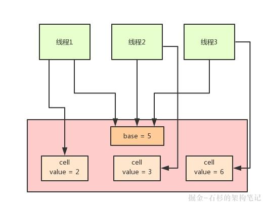


1. 在LongAdder的底层实现中，首先有一个base值，刚开始多线程来不停的累加数值，都是对base进行累加的，比如刚开始累加成了base = 5。

2. 接着如果发现并发更新的线程数量过多，就会开始施行**分段CAS的机制**，也就是内部会搞一个Cell数组，每个数组是一个数值分段。

3. 这时，让大量的线程分别去对不同Cell内部的value值进行CAS累加操作，这样就把CAS计算压力分散到了不同的Cell分段数值中了！

4. 这样就可以大幅度的降低多线程并发更新同一个数值时出现的无限循环的问题，大幅度提升了多线程并发更新数值的性能和效率！

5. 而且他内部实现了**自动分段迁移的机制**，也就是如果某个Cell的value执行CAS失败了，那么就会自动去找另外一个Cell分段内的value值进行CAS操作。

6. 这样也解决了线程空旋转、自旋不停等待执行CAS操作的问题，让一个线程过来执行CAS时可以尽快的完成这个操作。

7. 最后，如果你要从LongAdder中获取当前累加的总值，就会把base值和所有Cell分段数值加起来返回给你。


jdk 11

```java
/* 
 * @since 1.8   
 * @author Doug Lea
 */
public class LongAdder extends Striped64 implements Serializable {
    public LongAdder() {
        
    }
    
    //这个完全就是调用Striped64里的方法
    public void add(long x) {
        Cell[] cs; long b, v; int m; Cell c;
        if ((cs = cells) != null || !casBase(b = base, b + x)) {
            boolean uncontended = true;
            if (cs == null || (m = cs.length - 1) < 0 ||
                (c = cs[getProbe() & m]) == null ||
                !(uncontended = c.cas(v = c.value, v + x)))
                longAccumulate(x, null, uncontended);
        }
    
    }
    
    public long sum() {
        Cell[] cs = cells;
        long sum = base;
        if (cs != null) {
            for (Cell c : cs)
                if (c != null)
                    sum += c.value;
        }
        return sum;
    }
}
```


[大白话聊聊Java并发面试问题之Java 8如何优化CAS性能？【石杉的架构笔记】](https://juejin.im/post/5c062c87e51d451dbc21801b)

[Java 并发计数组件Striped64详解](https://www.jianshu.com/p/30d328e9353b)


### CAS

CAS虽然很高效的解决原子操作，但是CAS仍然存在三大问题。**ABA问题**，**循环时间长开销大**和**只能保证一个共享变量的原子操作**


> #### ABA问题

ABA问题的解决思路就是使用版本号。在变量前面追加上版本号，每次变量更新的时候把版本号加一，那么A－B－A 就会变成1A-2B－3A。从Java1.5开始JDK的atomic包里提供了一个类AtomicStampedReference来解决ABA问题。这个类的`compareAndSet`方法作用是首先检查当前引用是否等于预期引用，并且当前标志是否等于预期标志，如果全部相等，则以原子方式将该引用和该标志的值设置为给定的更新值。


> #### 循环时间长

这里可以参考AQS的做法，超过一定的次数就直接堵塞。或者中断暂停一下，让出CPU资源。


> #### 只能保证一个共享变量的原子操作

CAS操作是针对一个变量的，如果对多个变量操作，1. 可以加锁来解决。2 .封装成对象类解决。思路就是多个合并成一个，例如多个布尔类型的可以合并成一个位运算。


## 面试常见问题

> #### 创建线程有几种方式？

-  继承Thread类
-  实现Runnable接口（可以避免java不能多继承的问题）
-  通过Callable和Future创建线程
-  通过线程池创建线程（其实底层还是通过new Thread对象来创建线程）


> #### 并发注意什么，进程的通信方式，线程实现同步的方式，通信

注意什么？不知道从这3个角度回答对不对。

1.原子性

即一个操作或者多个操作  要么全部执行并且执行的过程不会被任何因素打断，要么就都不执行。Java内存模型只保证了基本读取和赋值是原子性操作，如果要实现更大范围操作的原子性，可以通过synchronized和Lock来实现。由于synchronized和Lock能够保证任一时刻只有一个线程执行该代码块，那么自然就不存在原子性问题了，从而保证了原子性。

2.有序性

可见性是指当多个线程访问同一个变量时，一个线程修改了这个变量的值，其他线程能够立即看得到修改的值。Java提供了volatile关键字来保证可见性。当一个共享变量被volatile修饰时，它会保证修改的值会立即被更新到主存，当有其他线程需要读取时，它会去内存中读取新值。

3.可见性

即程序执行的顺序按照代码的先后顺序执行。一般来说，处理器为了提高程序运行效率，可能会对输入代码进行优化，它不保证程序中各个语句的执行先后顺序同代码中的顺序一致，但是它会保证程序最终执行结果和代码顺序执行的结果是一致的。在Java内存模型中，允许编译器和处理器对指令进行重排序，但是重排序过程不会影响到单线程程序的执行，却会影响到多线程并发执行的正确性。在Java里面，可以通过volatile关键字来保证一定的“有序性”。另外可以通过synchronized和Lock来保证有序性，很显然，synchronized和Lock保证每个时刻是有一个线程执行同步代码，相当于是让线程顺序执行同步代码，自然就保证了有序性。

[并发编程的三大注意事项是什么？](https://www.cnblogs.com/chinaifae/p/10189001.html)


**进程间的几种通信方式**

1. **管道（pipe）**：管道是一种半双工的通信方式，数据只能单向流动，而且只能在具有血缘关系的进程间使用。进程的血缘关系通常指父子进程关系。管道分为pipe（无名管道）和fifo（命名管道）两种，有名管道也是半双工的通信方式，但是它允许无亲缘关系进程间通信。
2. **信号量（semophore）**：信号量是一个计数器，可以用来控制多个进程对共享资源的访问。它通常作为一种锁机制，防止某进程正在访问共享资源时，其他进程也访问该资源。因此，主要作为进程间以及同一进程内不同线程之间的同步手段。
3. **消息队列（message queue）**：消息队列是由消息组成的链表，存放在内核中 并由消息队列标识符标识。消息队列克服了信号传递信息少，管道只能承载无格式字节流以及缓冲区大小受限等缺点。消息队列与管道通信相比，其优势是对每个消息指定特定的消息类型，接收的时候不需要按照队列次序，而是可以根据自定义条件接收特定类型的消息。
4. **信号（signal）**：信号是一种比较复杂的通信方式，用于通知接收进程某一事件已经发生。
5. **共享内存（shared memory）**：共享内存就是映射一段能被其他进程所访问的内存，这段共享内存由一个进程创建，但多个进程都可以访问，共享内存是最快的IPC方式，它是针对其他进程间的通信方式运行效率低而专门设计的。它往往与其他通信机制，如信号量配合使用，来实现进程间的同步和通信。
6. **套接字（socket）**：套接口也是一种进程间的通信机制，与其他通信机制不同的是它可以用于不同及其间的进程通信。


**线程实现同步**

1. 同步方法，即有synchronized关键字修饰的方法。    
2. 同步代码块， 即有synchronized关键字修饰的语句块。    
3. 使用特殊域变量(volatile)实现线程同步
   - volatile关键字为域变量的访问提供了一种免锁机制，
   - 使用volatile修饰域相当于告诉虚拟机该域可能会被其他线程更新，
   - 因此每次使用该域就要重新计算，而不是使用寄存器中的值
   - volatile不会提供任何原子操作，它也不能用来修饰final类型的变量
4. 使用重入锁实现线程同步，ReenreantLock
5. 使用局部变量实现线程同步，ThreadLocal
6. 使用阻塞队列实现线程同步，LinkedBlockingQueue
7. 使用原子变量实现线程同步


[java笔记--关于线程同步（7种同步方式）](https://www.cnblogs.com/XHJT/p/3897440.html)


**通信**

- wait/notify 等待

- join

- Volatile

- CountDownLatch 

- cyclicBarrier


- 线程响应中断

  ```java
  public class StopThread implements Runnable {
      @Override
      public void run() {
          while (!Thread.currentThread().isInterrupted()) {
              // 线程执行具体逻辑
              System.out.println(Thread.currentThread().getName() + "运行中。。");
          }
          System.out.println(Thread.currentThread().getName() + "退出。。");
      }
      public static void main(String[] args) throws InterruptedException {
          Thread thread = new Thread(new StopThread(), "thread A");
          thread.start();
          System.out.println("main 线程正在运行") ;
          TimeUnit.MILLISECONDS.sleep(10) ;
          thread.interrupt();
      }
  }
  ```


[深入理解线程通信](https://crossoverjie.top/2018/03/16/java-senior/thread-communication/)


> #### 悲观锁乐观锁，底层怎么实现的

**乐观锁**

- **CAS**


**悲观锁**

- synchronized
- lock


# Java.lang

## 字符串

String/StringBuilder/StringBuffer


1. String 、StringBuffer、StringBuilder继承于CharSequence接口，CharSequence就是字符序列，String, StringBuilder和StringBuffer本质上都是通过**字符数组**实现的。
2. **String为字符串常量**，StringBuilder和StringBuffer都是**可变的**字符序列。它是典型的Immutable类，被声明成为final class，所有属性也都是final的。也由于它的不可变性，类似拼接、裁剪字符串等动作，都会产生新的String对象。
3. StringBufer本质是一个线程安全的可修改字符序列（char，JDK 9以后是byte）数组，它保证了**线程安全**(synchronized)，也随之带来了额外的性能开销，所以除非有线程安全的需要，不然还是推荐使用它的后继者，也就是StringBuilder。
4. StringBuilder是Java 1.5中新增的，在能力上和StringBufer没有本质区别，但是它去掉了线程安全的部分，有效减小了开销，是绝大部分情况下进行字符串拼接的首选，StringBuilder是**非线程安全**的，
5. 执行速度，**运行速度快慢为：StringBuilder > StringBuffer > String**


- 如果要操作少量的数据用 String； 

- 多线程操作字符串缓冲区下操作大量数据 StringBuffer； 

- 单线程操作字符串缓冲区下操作大量数据 StringBuilder（推荐使用）。


[String详解, String和CharSequence区别, StringBuilder和StringBuffer的区别 (String系列之1)](https://www.cnblogs.com/skywang12345/p/string01.html)


> ### String类和常量池

**String对象的两种创建方式：**

```java
        String str1 = "abcd";
        String str2 = new String("abcd");
        System.out.println(str1==str2);//false

  			String str1 = "abcd";
        String str2 = new String("abcd").intern();
        System.out.println(str1==str2);//true
```

这两种不同的创建方法是有差别的，第一种方式是在常量池中拿对象，第二种方式是直接在堆内存空间创建一个新的对象。只要使用new方法，就需要创建新的对象。


**String类型的常量池比较特殊。它的主要使用方法有两种：**

- 直接使用双引号声明出来的String对象会直接存储在常量池中。
- 如果不是用双引号声明的String对象，可以使用String提供的intern方String.intern()   是一个Native方法，它的作用是：如果运行时常量池中已经包含一个等于此String对象内容的字符串，则返回常量池中该字符串的引用；如果没有，则在常量池中创建与此 String 内容相同的字符串，并返回常量池中创建的字符串的引用。
  - Java 6以后提供了intern()方法，一般使用Java 6这种历史版本，并不推荐大量使用intern，被缓存的字符串是存在所谓PermGen里的，也就是臭名昭著的“永久代”，这个空间是很有限的，也基本不会被FullGC之外的垃圾收集照顾到。所以，如果使用不当，OOM就会光顾。 在后续版本中，这个缓存被放置在堆中，这样就极大避免了永久代占满的问题，甚至永久代在JDK 8中被MetaSpace（元数据区）替代了。而且，默认缓存大小也在不断地扩大中， 从最初的1009，到7u40以后被修改为60013。


> ### String为什么是不可变

简单来说就是String类利用了final修饰的char类型数组存储字符，源码如下图所以：

```java
 	/** The value is used for character storage. */
    private final char value[];
```

从设计上来说

1. **字符串常量池的需要。**

   字符串常量池(String pool, String intern pool, String保留池) 是Java堆内存中一个特殊的存储区域, 当创建一个String对象时,假如此字符串值已经存在于常量池中,则不会创建一个新的对象,而是引用已经存在的对象。假若字符串对象允许改变,那么将会导致各种逻辑错误,比如改变一个对象会影响到另一个独立对象. 严格来说，这种常量池的思想,是一种优化手段.

2. **允许String对象缓存HashCode**
    Java中String对象的哈希码被频繁地使用, 比如在hashMap 等容器中。

   字符串不变性保证了hash码的唯一性,因此可以放心地进行缓存.这也是一种性能优化手段,意味着不必每次都去计算新的哈希码. 

3. **安全性** 
   String被许多的Java类(库)用来当做参数,例如 网络连接地址URL,文件路径path,还有反射机制所需要的String参数等, 假若String不是固定不变的,将会引起各种安全隐患。


如果要变怎么办？

用反射可以访问私有成员， 然后反射出String对象中的value属性， 进而改变通过获得的value引用改变数组的结构。

> ### **String字符串拼接**

```java
    	    String str1 = "str";
          String str2 = "ing";
          String str3 = "str" + "ing";//常量池中的对象
          String str4 = str1 + str2; //在堆上创建的新的对象     
          String str5 = "string";//常量池中的对象
          System.out.println(str3 == str4);//false
          System.out.println(str3 == str5);//true
          System.out.println(str4 == str5);//false
```

尽量避免多个字符串拼接，因为这样会重新创建对象。如果需要改变字符串的花，可以使用 StringBuilder 或者 StringBuffer。不过在java8中已经有了优化，编译后会被写成StringBuilder，而在JDK 9里面为了更加统一字符串操作优化，提供 了StringConcatFactory，作为一个统一的入口。


> ### String s = new String("abc");这句话创建了几个对象？

**创建了两个对象。**

先有字符串"abc"放入常量池，然后 new 了一份字符串"abc"放入Java堆(字符串常量"abc"在编译期就已经确定放入常量池，而 Java 堆上的"abc"是在运行期初始化阶段才确定)，然后 Java 栈的 s 指向Java堆上的"abc"。


[可能是把Java内存区域讲的最清楚的一篇文章](https://mp.weixin.qq.com/s?__biz=MzU4NDQ4MzU5OA==&mid=2247484303&idx=1&sn=af0fd436cef755463f59ee4dd0720cbd&chksm=fd9855eecaefdcf8d94ac581cfda4e16c8a730bda60c3b50bc55c124b92f23b6217f7f8e58d5&token=506869459&lang=zh_CN#rd)


## Object

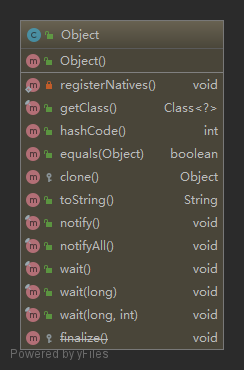

其中大部分都是native方法，记录一下少数方法

```java
  	public boolean equals(Object obj) {
        return (this == obj);
    }

  	public String toString() {
        return getClass().getName() + "@" + Integer.toHexString(hashCode());
    }
```


## Exception和Error

Java 的异常分为 Exception 和 Error 两种，而 Exception 又分为 RuntimeException  和其他类型。RuntimeException 和 Error 属于非检查异常。其他的 Exception  皆属于检查异常，在触发时需要显式捕获，或者在方法头用 throws 关键字声明。


Exception和Error都是继承了Throwable类。

Exception和Error体现了Java平台设计者对不同异常情况的分类。

Exception是程序正常运行中，可以预料的意外情况，可能并且应该被捕获，进行相应处理。 

Error是指在正常情况下，不大可能出现的情况，绝大部分的Error都会导致程序（比如JVM自身）处于非正常的、不可恢复状态。既然是非正常情况，所以不便于也不需要捕获，常见的比如OutOfMemoryError之类，都是Error的子类。 


>  ### 运行时异常

Exception又分为可检查（checked）异常和不检查（unchecked）异常

- 可检查异常在源代码里必须显式地进行捕获处理，这是编译期检查的一部分。

- 不检查异常就是所谓的运行时异常，类似 NullPointerException、ArrayIndexOutOfBoundsException之类，通常是可以编码避免的逻辑错误，具体根据需要来判断是否需要捕 获，并不会在编译期强制要求。


> ### NoClassDefFoundError和ClassNotFoundException

-  ClassNotFoundException的产生原因： Java支持使用Class.forName方法来动态地加载类，任意一个类的类名如果被作为参数传递给这个方法都将导致该类被加载到JVM内存中，如果这个类在类路径中没有被找到，那么此时就会在 运行时抛出ClassNotFoundException异常。 另外还有一个导致ClassNotFoundException的原因就是：当一个类已经某个类加载器加载到内存中了，此时另一个类加载器又尝试着动态地从同一个包中加载这个类。通过控制动态类加载过程，可以避免上述情况发生。 - -
- NoClassDefFoundError产生的原因在于： 如果JVM或者ClassLoader实例尝试加载（可以通过正常的方法调用，也可能是使用new来创建新的对象）类的时候却找不到类的定义。要查找的类在编译的时候是存在的，运行的时候却找不到了。这个时候就会导致NoClassDefFoundError. 造成该问题的原因可能是打包过程漏掉了部分类，或者jar包出现损坏或者篡改。解决这个问题的办法是查找那些在开发期间存在于类路径下但在运行期间却不在类路径下的类。


> ### finally

什么时候finally语句不会执行？

- try语句没有被执行到，如在try语句之前就返回了，这样finally语句就不会执行，这也说明了finally语句被执行的必要而非充分条件是：相应的try语句一定被执行到。

- 在try块中有System.exit(0);这样的语句，System.exit(0);是终止Java虚拟机JVM的，连JVM都停止了，所有都结束了，当然finally语句也不会被执行到。


## Integer与int

8个原始数据类型（Primitive Types，boolean、byte 、short、char、int、foat、double、long）

> #### 值缓存

构建Integer对象的传统方式是直接调用构造器，直接new一个对象。但是根据实践，我们发现大部分数据操作都是集中在有限的、较小的数值范围，因而，在Java 5中新增了静态工厂方法valueOf，在调用它的时候会利用一个缓存机制，带来了明显的性能改进。按照Javadoc，这个值默认缓存是**-128到127之间**。这个是可以在启动的时候配置的


其他的一些包装类也存在这种缓存，比如：

- Boolean，缓存了true/false对应实例，确切说，只会返回两个常量实例Boolean.TRUE/FALSE。
- Short，同样是缓存了-128到127之间的数值。 
- Byte，数值有限，所以全部都被缓存。 
- Character，缓存范围'\u0000' 到 '\u007F'。


>  #### 自动装箱/自动拆箱是发生在什么阶段

自动装箱实际上是一种语法糖。它们发生在编译阶段，生成的字节码是一致的。javac替我们自动把装箱转换为Integer.valueOf()，把拆箱替换为Integer.intValue() 


### 源码分析

> #### 缓存大小

Integer的缓存范围虽然默认是-128到127，但是在特别的应用场景，比如我们明确知道应用会频繁使用更大的数值，这时候应该怎么办呢？ 缓存上限值实际是可以根据需要调整的，JVM提供了参数设置： ```-XX:AutoBoxCacheMax=N```

实现在IntegerCache的静态初始化块里

```java
private satic class IntegerCache {
 static final int low = -128;
 static final int high;
 static final Integer cache[];
 static {
 // high value may be confgured by property
 int h = 127;
 String integerCacheHighPropValue = VM.getSavedProperty("java.lang.Integer.IntegerCache.high");
 ...
 // range [-128, 127] mus be interned (JLS7 5.1.7)
 assert IntegerCache.high >= 127;
 }
 ...
 }
```

Integer等包装类，定义了类似SIZE或者BYTES这样的常量，这反映了什么样的设计考虑呢？如果你使用过其他语言，比如C、C++，类似整数的位数，其实是不确定的，可 能在不同的平台，比如32位或者64位平台，存在非常大的不同。那么，在32位JDK或者64位JDK里，数据位数会有不同吗？或者说，这个问题可以扩展为，我使用32位JDK开发编 译的程序，运行在64位JDK上，需要做什么特别的移植工作吗？ 其实，这种移植对于Java来说相对要简单些，因为原始数据类型是不存在差异的，这些明确定义在Java语言规范里面，不管是32位还是64位环境，开发者无需担心数据的位数差异。


> #### 可变性

字符串是不可变的，保证了基本的信息安全和并发编程中的线程安全。如果去看包装类里存储数值的成员变量“value”，会发现， 不管是Integer还Boolean等，都被声明为“private final”，所以，它们同样是**不可变类型**！ 

这种设计是可以理解的，或者说是必须的选择。想象一下这个应用场景，比如Integer提供了getInteger()方法，用于方便地读取系统属性，我们可以用属性来设置服务器某个服务 的端口，如果我可以轻易地把获取到的Integer对象改变为其他数值，这会带来产品可靠性方面的严重问题。


> #### 线程安全

- 原始数据类型的变量，显然要使用并发相关手段，才能保证线程安全，类似AtomicInteger、AtomicLong这样的线程安全类。 
- 特别的是，部分比较宽的数据类型，比如foat、double，甚至不能保证更新操作的原子性，可能出现程序读取到只更新了一半数据位的数值！


> #### 原始数据类型和引用类型局限性

- 原始数据类型和Java泛型并不能配合使用 

  这是因为Java的泛型某种程度上可以算作伪泛型，它完全是一种编译期的技巧，Java编译期会自动将类型转换为对应的特定类型，这就决定了使用泛型，必须保证相应类型可以转换 为Object。

- 无法高效地表达数据，也不便于表达复杂的数据结构，比如vector和tuple 

  我们知道Java的对象都是引用类型，如果是一个原始数据类型数组，它在内存里是一段连续的内存，而对象数组则不然，数据存储的是引用，对象往往是分散地存储在堆的不同位置。这种设计虽然带来了极大灵活性，但是也导致了数据操作的低效，尤其是无法充分利用现代CPU缓存机制。


