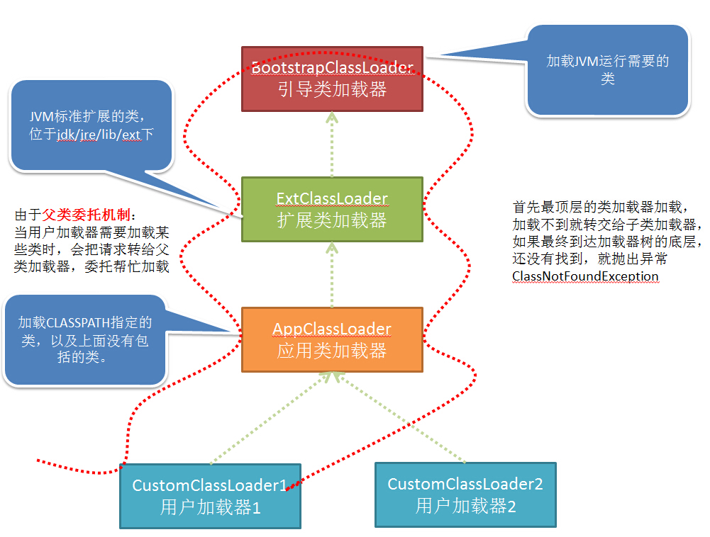
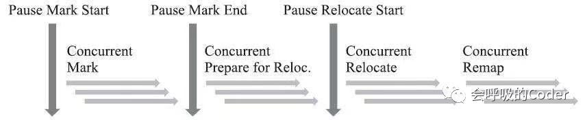

# 综述

> 般作为Java程序员在面试的时候一般会问的大多就是**Java内存区域、虚拟机垃圾算法、虚拟垃圾收集器、JVM内存管理、JVM调优、虚拟机性能检测**这些问题了。这些内容参考周的《深入理解Java虚拟机》中第二章和第三章就足够了。
>
> 最近八股文的水平又加深了，这些内容已经不够了。再加上《深入拆解 Java 虚拟机》专栏中部分内容。专栏分了4个模块，主要需要理解模块一，以及模块三的部分章节就足够了。

面试一般就基于Hotspot。没有见过面试时提问不同虚拟机之间差别之类的问题。


先区分一个概念：

- Jmm是Java内存模型的缩写，是并发里面的概念。也就是说Java虚拟机会什么时候把缓存里的内容溢写到主内存，实现各个线程的一致读写（详见Java多线程中volatile部分内容）。

- Java虚拟机规范里面把所谓的“Jvm内存模型”称之为The Structure of the Java Virtual Machine，Java虚拟机的结构。


TODO

- [ ] Linux中对JVM的一些工具


> # JVM基本结构


# 运行时数据区域


- #### 程序计数器

  程序计数器是来指示当前线程正在执行的JVM指令，因此程序计数器是**线程私有**的。一个JVM支持多个线程，每一个线程都要自己的程序计数器。如果线程正在执行的方法是Java方法，则程序计数器保存的是当前线程正在执行的JVM指令，如果正在执行的方法是Native方法，则保存为空（undefined)。


- #### 虚拟机栈

  虚拟机栈就是常说的栈内存，**线程私有，生命周期和线程相同**。虚拟机栈**存储栈帧**，栈帧中存放的局部变量表，方法部分返回值等。局部变量表主要存放了编译器可知的各种**数据类型、对象引用**。


- #### 本地方法栈

  本地方法栈存储着native方法的调用状态，**线程私有**。


- #### 堆

  Java虚拟机所管理的内存中最大的一块，**线程共享**，虚拟机启动时创建。**存放对象实例，几乎所有的对象实例以及数组都在这里分配内存。**

  Java堆是垃圾收集器管理的主要区域，因此也被称作**GC堆（Garbage Collected Heap）**.从垃圾回收的角度，由于现在收集器基本都采用分代垃圾收集算法，所以Java堆还可以细分为：新生代和老年代：在细致一点有：Eden空间、From Survivor、To Survivor空间等。

  

- #### 方法区

  别名叫做 **Non-Heap（非堆）**，**线程共享**，其主要存储着所加载的类的信息，如名称、修饰符等、类中的**静态变量**、类中定义为final类型的**常量**、类中的Field信息、类中的方法信息。

  HotSpot虚拟机中方法区也常被称为 **“永久代”**，本质上两者并**不等价**。
  
  
  
  - 运行时常量池
  
    运行时常量池是方法区的一部分，存放着类中固定的常量信息、方法、和field的引用信息。JVM在加载类的时候会为每一个Class分配一个独立的常量池。
  
    > 方法区只是规范，对于虚拟机的规范。所有的虚拟机应该有方法区，不同虚拟机方法区的叫法不一样。
    >
    > 在1.7之前在(JDK1.2 ~ JDK6)的实现中，HotSpot 使用永久代实现方法区，HotSpot 使用 GC分代来实现方法区内存回收。
    >
    > **JDK1.7及之后版本的 JVM 已经将运行时常量池从方法区中移了出来，在 Java 堆（Heap）中开辟了一块区域存放运行时常量池。同时在 jdk 1.8中移除整个永久代，取而代之的是一个叫元空间（Metaspace）的区域**。
    
  - 元空间（Metaspace）与永久代的区别
  
    存储位置不同，永久代物理是是堆的一部分，和新生代，老年代地址是连续的，而元空间属于本地内存；
  
    存储内容不同，元空间存储类的元信息，静态变量和常量池等并入堆中。相当于永久代的数据被分到了堆和元空间中。


- ### 直接内存

  直接内存并不是虚拟机运行时数据区的一部分，也不是虚拟机规范中定义的内存区域。在NIO中被引入和频繁的使用。使用Native函数库直接分配堆外内存，然后通过一个存储在java堆中的DirectByteBuffer对象作为这块内存的引用进行操作。**避免了在Java堆和Native堆之间来回复制数据**，显著提高性能。


# 类加载机制

> 《03 | Java虚拟机是如何加载Java类的?》
>
> 《24 | Context容器（上）：Tomcat如何打破双亲委托机制？》—— 深入拆解Tomcat & Jetty

虚拟机把描述类的数据从class文件加载到内存，并对数据进行校验、转换解析和初始化。最终形成可以被虚拟机最直接使用的java类型的过程就是虚拟机的类加载机制。

Java 的类加载，就是把字节码格式“.class”文件加载到 JVM 的**方法区**，并在 JVM 的**堆区**建立一个`java.lang.Class`对象的实例，用来封装 Java 类相关的数据和方法。


## 类加载过程

类加载过程分为**加载**、**验证**、**准备**、**解析**和**初始化**这5个阶段。

- 加载

  1.  通过类型的完全限定名，产生一个代表该类型的二进制数据流。

  2.  解析这个二进制数据流为方法区内的运行时数据结构。

  3.  创建一个表示该类型的java.lang.Class类的实例，作为方法区这个类的各种数据的访问入口。

     

- 链接

  链接，是指将创建成的类合并至 Java 虚拟机中，使之能够执行的过程。它可分为验证、准备以及解析三个阶段。

  - 验证

    目的是**为了确保Class文件的字节流中包含的信息符合当前虚拟机的要求，并且不会危害虚拟机自身的安全**。大致上会完成4个阶段的校验工作：**文件格式、元数据、字节码、符号引用**。

  

  - 准备

    准备阶段是正式为类变量**分配内存**并**设置类变量初始值**的阶段，这些变量所使用的内存都将在**方法区**中进行分配。（备注：这时候进行内存分配的仅包括类变量（**被static修饰的变量**），而不包括实例变量，实例变量将会在对象实例化时随着对象一起分配在Java堆中）。**初始值通常是数据类型的零值，赋值操作在初始化阶段进行**

  

  - 解析（非必须的）

    在 class 文件被加载至 Java  虚拟机之前，这个类无法知道其他类及其方法、字段所对应的具体地址，甚至不知道自己方法、字段的地址。因此，每当需要引用这些成员时，Java  编译器会生成一个符号引用。在运行阶段，这个符号引用一般都能够无歧义地定位到具体目标上。

    举例来说，对于一个方法调用，编译器会生成一个包含目标方法所在类的名字、目标方法的名字、接收参数类型以及返回值类型的符号引用，来指代所要调用的方法。

    解析阶段是虚拟机将常量池内的符号引用替换为直接引用的过程。

    > **符号引用(Symbolic References)：** 符号引用以一组符号来描述所引用的目标，符号可以是符合约定的任何形式的字面量，符号引用与虚拟机实现的内存布局无关，引用的目标并不一定已经加载到内存中。
    >
    > **直接引用（Direct References）:** 直接引用可以是直接指向目标的指针、相对偏移量或是一个能间接定位到目标的句柄。直接引用与虚拟机实现的内存布局相关，引用的目标必定已经在内存中存在。

  

- 初始化

  在 Java 代码中，如果要初始化一个静态字段，我们可以在声明时直接赋值，也可以在静态代码块中对其赋值。

  如果直接赋值的静态字段被 final 所修饰，并且它的类型是基本类型或字符串时，那么该字段便会被 Java  编译器标记成常量值（ConstantValue），其初始化直接由 Java  虚拟机完成。除此之外的直接赋值操作，以及所有静态代码块中的代码，则会被 Java 编译器置于同一方法中，并把它命名为 < clinit  >。

  类加载的最后一步是初始化，便是为标记为常量值的字段赋值，以及执行 < clinit > 方法的过程。Java 虚拟机会**通过加锁**来确保类的 < clinit > 方法**仅被执行一次**。

  那么，类的初始化何时会被触发呢？JVM 规范枚举了下述多种触发情况：

  1. 当虚拟机启动时，初始化用户指定的主类；
  2. 当遇到用以新建目标类实例的 new 指令时，初始化 new 指令的目标类；
  3. 当遇到调用静态方法的指令时，初始化该静态方法所在的类；
  4. 当遇到访问静态字段的指令时，初始化该静态字段所在的类；
  5. 子类的初始化会触发父类的初始化；
  6. 如果一个接口定义了 default 方法，那么直接实现或者间接实现该接口的类的初始化，会触发该接口的初始化；
  7. 使用反射 API 对某个类进行反射调用时，初始化这个类；
  8. 当初次调用 MethodHandle 实例时，初始化该 MethodHandle 指向的方法所在的类。


## 类加载器

对于任意一个类，都需要由加载它的类加载器和这个类本身一同确立其在Java虚拟机中的唯一性。如果两个类来源于同一个Class文件，只要加载它们的类加载器不同，那么这两个类就必定不相等。除了启动类加载器之外，其他的类加载器都是 java.lang.ClassLoader 的子类，因此有对应的 Java 对象。这些类加载器需要先由另一个类加载器，比如说启动类加载器，加载至 Java 虚拟机中，方能执行类加载。


- **启动类加载器（Bootstrap ClassLoader）：**

  这个类加载器负责将存放在/lib目录中的，或者被-Xbootclasspath参数所指定的路径中的，并且是虚拟机识别的（仅按照文件名识别，如rt.jar，名字不符合的类库即使放在lib目录中也不会被加载）类库加载到虚拟机内存中。

- **扩展类加载器（Extension ClassLoader）：**

  这个加载器由sun.misc.Launcher$ExtClassLoader实现，它负责加载/lib/ext目录中的，或者被java.ext.dirs系统变量所指定的路径中的所有类库，开发者可以直接使用扩展类加载器。

- **应用程序类加载器（Application ClassLoader）：**

  这个类加载器由sun.misc.Launcher$AppClassLoader实现。由于这个类加载器是ClassLoader中的getSystemClassLoader()方法的返回值，所以一般也称它为系统类加载器。它负责加载用户类路径（ClassPath）上所指定的类库，开发者可以直接使用这个类加载器，如果应用程序中没有自定义过自己的类加载器，一般情况下这个就是程序中默认的类加载器。

Java 9 引入了模块系统，并且略微更改了上述的类加载器。扩展类加载器被改名为平台类加载器（platform class loader）。Java SE 中除了少数几个关键模块，比如说 java.base 是由启动类加载器加载之外，其他的模块均由平台类加载器所加载。


> ### 双亲委派模型




- **双亲委派模型的工作过程：** 如果一个类加载器收到了类加载的请求，先把这个请求委派给父类加载器去完成（所以所有的加载请求最终都应该传送到顶层的启动类加载器中），只有当父加载器反馈自己无法完成加载请求时，子加载器才会尝试自己去加载。

优点：使得类先天具有一个层级结构。

JDK主要有3个自带ClassLoader：
最基础：Bootstrap ClassLoader（加载JDK的/lib目录下的类）
次基础：Extension ClassLoader（加载JDK的/lib/ext目录下的类）
普通：Application ClassLoader（程序自己classpath下的类）

> [spi与双亲委派](https://blog.csdn.net/qq_22041375/article/details/107131262)


> #### 自定义类加载器

自定义类加载器，不去继承 AppClassLoader，而是继承 ClassLoader 抽象类，再重写 findClass 和 loadClass 方法即可，Tomcat 就是通过自定义类加载器来实现自己的类加载逻辑。

- findClass 方法的主要职责就是找到“.class”文件，可能来自文件系统或者网络，找到后把“.class”文件读到内存得到字节码数组，然后调用 defineClass 方法得到 Class 对象。
- loadClass 是个 public  方法，说明它才是对外提供服务的接口，具体实现也比较清晰：首先检查这个类是不是已经被加载过了，如果加载过了直接返回，否则交给父加载器去加载。请你注意，这是一个递归调用，也就是说子加载器持有父加载器的引用，当一个类加载器需要加载一个 Java 类时，会先委托父加载器去加载，然后父加载器在自己的加载路径中搜索 Java  类，当父加载器在自己的加载范围内找不到时，才会交还给子加载器加载，这就是双亲委托机制。


> #### 破坏双亲委派模型

需要破坏的原因是：

加载类D的类加载器Dload，在解析过程中，如果要将D中符号引用N解析为类或者接口C的直接引用，C又未被类加载器加载，那么使用Dload对C进行加载。然而由于JDNI是使用启动类加载器加载的，而JNDI类中符号引用代表的类是第三方的代码，所以无法使用启动类加载器进行加载，所以需要调用应用程序类加载器加载。


> [为什么spi需要破坏双亲委派模型？](https://www.zhihu.com/question/60812524)

常常在以下的一些地方见的用处

-  JNDI,SPI,JDBC（已写在《Java基础》）
-  HotSwap，模块热部署
-  tomcat


> #### Tomcat类加载


**为什么Tomcat需要破坏双亲委派？**

1. 一个web容器可能需要部署多个应用程序，不同的应用程序可能会依赖同一个第三方类库的不同版本，不能要求同一个类库在同一个服务器只有一份，因此要保证每个应用程序的类库都是独立的，保证相互隔离。 
2. 部署在同一个web容器中相同的类库相同的版本可以共享。否则，如果服务器有10个应用程序，那么要有10份相同的类库加载进虚拟机。
3. web容器也有自己依赖的类库，不能于应用程序的类库混淆。基于安全考虑，应该让容器的类库和程序的类库隔离开来。 
4. web容器要支持jsp的修改，jsp 文件最终也是要编译成class文件才能在虚拟机中运行，但程序运行后修改jsp已经是司空见惯的事情，所以web容器需要支持 jsp 热更新。


当tomcat启动时，会创建几种类加载器：

1. **Bootstrap 引导类加载器**

　　加载JVM启动所需的类，以及标准扩展类（位于jre/lib/ext下）

2. **System 系统类加载器** 

   加载tomcat启动的类，比如bootstrap.jar，通常在catalina.bat或者catalina.sh中指定。位于CATALINA_HOME/bin下。

3. **Common 通用类加载器** 

   加载tomcat使用以及应用通用的一些类，位于CATALINA_HOME/lib下，比如servlet-api.jar

4. **webapp 应用类加载器**

   每个应用在部署后，**都会创建一个唯一的类加载器**。该类加载器会加载位于 WEB-INF/lib下的jar文件中的class 和 WEB-INF/classes下的class文件。


**当应用需要到某个类时，则会按照下面的顺序进行类加载**：

1.  使用bootstrap引导类加载器加载
2. 使用system系统类加载器加载
3. 使用应用类加载器在WEB-INF/classes中加载
4. 使用应用类加载器在WEB-INF/lib中加载
5. 使用common类加载器在CATALINA_HOME/lib中加载


Tomcat 的自定义类加载器 WebAppClassLoader 打破了双亲委托机制，它**首先自己尝试去加载某个类，如果找不到再代理给父类加载器**，其目的是优先加载 Web 应用自己定义的类。具体实现就是重写 ClassLoader 的两个方法：findClass 和 loadClass。

- 在 findClass 方法里，主要有三个步骤：
  1. 先在 Web 应用本地目录下查找要加载的类。
  2. 如果没有找到，交给父加载器去查找，它的父加载器就是上面提到的系统类加载器 AppClassLoader。
  3. 如何父加载器也没找到这个类，抛出 ClassNotFound 异常。
- 在loadClass中，主要有六个步骤：
  1. 先在本地 Cache 查找该类是否已经加载过，也就是说 Tomcat 的类加载器是否已经加载过这个类。
  2. 如果 Tomcat 类加载器没有加载过这个类，再看看系统类加载器是否加载过。
  3. 如果都没有，就让**ExtClassLoader**去加载，这一步比较关键，目的**防止 Web 应用自己的类覆盖 JRE 的核心类**。因为 Tomcat 需要打破双亲委托机制，假如 Web 应用里自定义了一个叫 Object 的类，如果先加载这个 Object 类，就会覆盖 JRE 里面的那个 Object 类，这就是为什么 Tomcat 的类加载器会优先尝试用 ExtClassLoader 去加载，因为  ExtClassLoader 会委托给 BootstrapClassLoader 去加载，BootstrapClassLoader  发现自己已经加载了 Object 类，直接返回给 Tomcat 的类加载器，这样 Tomcat 的类加载器就不会去加载 Web 应用下的  Object 类了，也就避免了覆盖 JRE 核心类的问题。
  4. 如果 ExtClassLoader 加载器加载失败，也就是说 JRE 核心类中没有这类，那么就在本地 Web 应用目录下查找并加载。
  5. 如果本地目录下没有这个类，说明不是 Web 应用自己定义的类，那么由系统类加载器去加载。这里请你注意，Web 应用是通过`Class.forName`调用交给系统类加载器的，因为`Class.forName`的默认加载器就是系统类加载器。
  6. 如果上述加载过程全部失败，抛出 ClassNotFound 异常。


```java
public Class<?> findClass(String name) throws ClassNotFoundException {
    ...
    Class<?> clazz = null;
    try {
      //1. 先在 Web 应用目录下查找类 
      clazz = findClassInternal(name);
    }  catch (RuntimeException e) {
      throw e;
    }
    if (clazz == null) {
    try {
      //2. 如果在本地目录没有找到，交给父加载器去查找
      clazz = super.findClass(name);
    }  catch (RuntimeException e) {
      throw e;
    }

    //3. 如果父类也没找到，抛出 ClassNotFoundException
    if (clazz == null) {
       throw new ClassNotFoundException(name);
    }
    return clazz;
}

public Class<?> loadClass(String name, boolean resolve) throws ClassNotFoundException {
    synchronized (getClassLoadingLock(name)) {
        Class<?> clazz = null;
        //1. 先在本地 cache 查找该类是否已经加载过
        clazz = findLoadedClass0(name);
        if (clazz != null) {
            if (resolve)
                resolveClass(clazz);
            return clazz;
        }
        //2. 从系统类加载器的 cache 中查找是否加载过
        clazz = findLoadedClass(name);
        if (clazz != null) {
            if (resolve)
                resolveClass(clazz);
            return clazz;
        }
        // 3. 尝试用 ExtClassLoader 类加载器类加载，为什么？
        ClassLoader javaseLoader = getJavaseClassLoader();
        try {
            clazz = javaseLoader.loadClass(name);
            if (clazz != null) {
                if (resolve)
                    resolveClass(clazz);
                return clazz;
            }
        } catch (ClassNotFoundException e) {
            // Ignore
        }

        // 4. 尝试在本地目录搜索 class 并加载
        try {
            clazz = findClass(name);
            if (clazz != null) {
                if (resolve)
                    resolveClass(clazz);
                return clazz;
            }
        } catch (ClassNotFoundException e) {
            // Ignore
        }

        // 5. 尝试用系统类加载器 (也就是 AppClassLoader) 来加载
      try {
        clazz = Class.forName(name, false, parent);
        if (clazz != null) {
          if (resolve)
            resolveClass(clazz);
          return clazz;
        }
      } catch (ClassNotFoundException e) {
        // Ignore
      }
    }
    //6. 上述过程都加载失败，抛出异常
    throw new ClassNotFoundException(name);
}
```


从上面的过程我们可以看到，Tomcat 的类加载器打破了双亲委托机制，没有一上来就直接委托给父加载器，而是先在本地目录下加载，为了避免本地目录下的类覆盖 JRE 的核心类，先尝试用 JVM 扩展类加载器 ExtClassLoader 去加载。


更多的内容见tomcat文档

> 24 | Context容器（上）：Tomcat如何打破双亲委托机制？      
>
> [图解Tomcat类加载机制(阿里面试题)](https://www.cnblogs.com/aspirant/p/8991830.html)
>
> [Tomcat类加载机制和JAVA类加载机制的比较](https://blog.csdn.net/dreamcatcher1314/article/details/78271251)


> #### 面试题

> ##### 既然 Tomcat 不遵循双亲委派机制，那么如果我自己定义一个恶意的HashMap，会不会有风险呢？(**阿里的面试官问**)

先在 Tomcat 的类加载器中查找是否已经加载过这个类，如果 Tomcat 类加载器没有加载过这个类，再看看系统类加载器是否加载过。如果都没有，就让**ExtClassLoader**去加载

Tomcat 的类加载器会优先尝试用 ExtClassLoader 去加载，因为  ExtClassLoader 会委托给 BootstrapClassLoader 去加载，BootstrapClassLoader  发现自己已经加载了 Object 类，直接返回给 Tomcat 的类加载器，这样 Tomcat 的类加载器就不会去加载 Web 应用下的  Object 类了，也就避免了覆盖 JRE 核心类的问题。


# 对象
## 对象创建


- **类加载检查**

  检查是否能在常量池中定位到这个类是否已加载完成，如果没有，那必须先执行相应的类加载过程。

- **分配内存**

  对象所需的内存大小在类加载完成后便可确定，为对象分配空间的任务等同于把一块确定大小的内存从Java堆中划分出来。

  > **内存分配方法**

  **分配方式**有 **“指针碰撞”** 和 **“空闲列表”** 两种，选择那种分配方式**由 Java 堆是否规整决定**，而Java堆是否规整又由所采用的垃圾收集器是否带有压缩整理功能决定。

  

  > **内存分配并发问题**

  通常来讲，虚拟机采用两种方式来保证线程安全：

  - **CAS+失败重试：** CAS是乐观锁的一种实现方式。所谓乐观锁就是，每次不加锁而是假设没有冲突而去完成某项操作，如果因为冲突失败就重试，直到成功为止。**虚拟机采用 CAS 配上失败重试的方式保证更新操作的原子性。**
  - **TLAB：** 为每一个线程预先在Eden区（年轻代）分配一块儿内存，JVM在给线程中的对象分配内存时，首先在TLAB分配，当对象大于TLAB中的剩余内存或TLAB的内存已用尽时，再采用上述的CAS进行内存分配


- 初始化零值

  将分配到的内存空间都初始化为零值

  

- 设置对象头

  **虚拟机要对对象进行必要的设置**。

  例如这个对象是那个类的实例、如何才能找到类的元数据信息、对象的哈希吗、对象的GC分代年龄等信息。 这些信息存放在对象头中。
  
  

- 执行 init 方法

  执行 new 指令之后会接着执行 `<init>` 方法，把对象按照程序员的意愿进行初始化，这样一个真正可用的对象才算完全产生出来。


## 对象的内存布局

> 10 Java对象的内存布局 ——《深入拆解 Java 虚拟机》

在Hotspot虚拟机中，对象在内存中的布局可以分为3快区域：**对象头**、**实例数据**和**对齐填充**。

- **Hotspot虚拟机的对象头包括两部分信息**
  - **第一部分用于存储对象自身的自身运行时数据，叫做标记字段**，标记字段用以存储 Java 虚拟机有关该对象的运行数据，如哈希码、GC 信息以及锁信息，官方称它为"Mark Word"。
  - **另一部分是类型指针**，即对象指向它的类元数据的指针，虚拟机通过这个指针来确定这个对象是那个类的实例。另外，如果对象是一个Java数组，那在对象头中还必须有一块用于记录数组长度的数据，因为虚拟机可以通过普通Java对象的元数据信息确定Java对象的大小，但是从数组的元数据中却无法确定数组的大小。
- **实例数据部分是对象真正存储的有效信息**，也是在程序中所定义的各种类型的字段内容。无论是从父类继承下来的，还是在子类中定义的，都需要记录起来。
- **对齐填充部分不是必然存在的，也没有什么特别的含义，仅仅起占位作用。**


### 对象头

JVM中对象头的方式有以下两种（以32位JVM为例）：

1. **普通对象**

   ```ruby
   |--------------------------------------------------------------|
   |                     Object Header (64 bits)                  |
   |------------------------------------|-------------------------|
   |        Mark Word (32 bits)         |    Klass Word (32 bits) |
   |------------------------------------|-------------------------|
   ```


2. **数组对象**

   ```ruby
   |---------------------------------------------------------------------------------|
   |                                 Object Header (96 bits)                         |
   |--------------------------------|-----------------------|------------------------|
   |        Mark Word(32bits)       |    Klass Word(32bits) |  array length(32bits)  |
   |--------------------------------|-----------------------|------------------------|
   ```


> #### Mark Word

这部分主要用来存储对象自身的运行时数据，如hashcode、gc分代年龄等。`mark word`的位长度为JVM的一个Word大小，也就是说32位JVM的`Mark word`为32位，64位JVM为64位。
 为了让一个字大小存储更多的信息，JVM将字的最低两个位设置为标记位，不同标记位下的Mark Word示意如下：

```ruby
|-------------------------------------------------------|--------------------|
|                  Mark Word (32 bits)                  |       State        |
|-------------------------------------------------------|--------------------|
| identity_hashcode:25 | age:4 | biased_lock:1 | lock:2 |       Normal       |
|-------------------------------------------------------|--------------------|
|  thread:23 | epoch:2 | age:4 | biased_lock:1 | lock:2 |       Biased       |
|-------------------------------------------------------|--------------------|
|               ptr_to_lock_record:30          | lock:2 | Lightweight Locked |
|-------------------------------------------------------|--------------------|
|               ptr_to_heavyweight_monitor:30  | lock:2 | Heavyweight Locked |
|-------------------------------------------------------|--------------------|
|                                              | lock:2 |    Marked for GC   |
|-------------------------------------------------------|--------------------|
    
  
|------------------------------------------------------------------------------|--------------------|
|                                  Mark Word (64 bits)                         |       State        |
|------------------------------------------------------------------------------|--------------------|
| unused:25 | identity_hashcode:31 | unused:1 | age:4 | biased_lock:1 | lock:2 |       Normal       |
|------------------------------------------------------------------------------|--------------------|
| thread:54 |       epoch:2        | unused:1 | age:4 | biased_lock:1 | lock:2 |       Biased       |
|------------------------------------------------------------------------------|--------------------|
|                       ptr_to_lock_record:62                         | lock:2 | Lightweight Locked |
|------------------------------------------------------------------------------|--------------------|
|                     ptr_to_heavyweight_monitor:62                   | lock:2 | Heavyweight Locked |
|------------------------------------------------------------------------------|--------------------|
|                                                                     | lock:2 |    Marked for GC   |
|------------------------------------------------------------------------------|--------------------|
```

其中各部分的含义如下：
 **lock**:2位的锁状态标记位，由于希望用尽可能少的二进制位表示尽可能多的信息，所以设置了lock标记。该标记的值不同，整个mark word表示的含义不同。

| biased_lock | lock |   状态   |
| :---------: | :--: | :------: |
|      0      |  01  |   无锁   |
|      1      |  01  |  偏向锁  |
|      0      |  00  | 轻量级锁 |
|      0      |  10  | 重量级锁 |
|      0      |  11  |  GC标记  |

**biased_lock**：对象是否启用偏向锁标记，只占1个二进制位。为1时表示对象启用偏向锁，为0时表示对象没有偏向锁。
 **age**：4位的Java对象年龄。在GC中，如果对象在Survivor区复制一次，年龄增加1。当对象达到设定的阈值时，将会晋升到老年代。默认情况下，并行GC的年龄阈值为15，并发GC的年龄阈值为6。由于age只有4位，所以最大值为15，这就是`-XX:MaxTenuringThreshold`选项最大值为15的原因。
 **identity_hashcode**：25位的对象标识Hash码，采用延迟加载技术。调用方法`System.identityHashCode()`计算，并会将结果写到该对象头中。当对象被锁定时，该值会移动到管程Monitor中。
 **thread**：持有偏向锁的线程ID。
 **epoch**：偏向时间戳。
 **ptr_to_lock_record**：指向栈中锁记录的指针。
 **ptr_to_heavyweight_monitor**：指向管程Monitor的指针。


> JDK中同步锁章节也有一部分内容
>
> [Java对象头详解](https://www.jianshu.com/p/3d38cba67f8b)


例子：

在 64 位的 Java 虚拟机中，对象头的标记字段占 64 位，而类型指针又占了 64 位。也就是说，每一个 Java  对象在内存中的额外开销就是 16 个字节。以 Integer 类为例，它仅有一个 int 类型的私有字段，占 4 个字节。因此，每一个  Integer 对象的额外内存开销至少是 400%。这也是为什么 Java 要引入基本类型的原因之一。


> #### 压缩指针

// todo


> #### 内存对齐

// todo

默认情况下，Java 虚拟机堆中对象的起始地址需要对齐至 8 的倍数。如果一个对象用不到 8N 个字节，那么空白的那部分空间就浪费掉了。这些浪费掉的空间我们称之为**对象间的填充（padding）**。


> #### 字段重排列

// todo

字段重排列，顾名思义，就是 Java 虚拟机重新分配字段的先后顺序，以达到内存对齐的目的。Java 虚拟机中有三种排列方法（对应 Java 虚拟机选项 -XX:FieldsAllocationStyle，默认值为 1），但都会遵循如下两个规则。

- 其一，如果一个字段占据 C 个字节，那么该字段的偏移量需要对齐至 NC。这里偏移量指的是字段地址与对象的起始地址差值。

  以 long 类为例，它仅有一个 long 类型的实例字段。在使用了压缩指针的 64 位虚拟机中，尽管对象头的大小为 12 个字节，该 long 类型字段的偏移量也只能是 16，而中间空着的 4 个字节便会被浪费掉。

- 其二，子类所继承字段的偏移量，需要与父类对应字段的偏移量保持一致。

  在具体实现中，Java 虚拟机还会对齐子类字段的起始位置。对于使用了压缩指针的 64 位虚拟机，子类第一个字段需要对齐至 4N；而对于关闭了压缩指针的 64 位虚拟机，子类第一个字段则需要对齐至 8N。


## 对象的访问定位

对象的访问方式由虚拟机实现而定，目前主流的访问方式有**使用句柄**和**直接指针**两种

- **句柄：** 如果使用句柄的话，那么Java堆中将会划分出一块内存来作为句柄池，reference 中存储的就是对象的句柄地址，而句柄中包含了对象实例数据与类型数据各自的具体地址信息


- **直接指针：** 如果使用直接指针访问，那么Java堆对像的布局中就必须考虑如何放置访问类型数据的相关信息，reference 中存储的直接就是对象的地址。


**这两种对象访问方式各有优势。使用句柄来访问的最大好处是reference中存储的是稳定的句柄地址，在对象被移动时只会改变句柄中的实例数据指针，而reference本身不需要修改。使用直接指针访问方式最大的好处就是速度快，它节省了一次指针定位的时间开销。**


> #### String类型的对象具体存在哪?

`String s ="xxx";`String为字符串常量，当然放在常量池中。

JDK6将常量池放在方法区中。方法区此时也是持久代。但是从JDK7开始, 常量池的实现已经从方法区中移出来放到堆内存里面了。


```java
public class StringTest {
     public static void main(String[] args) {
        //在main方法的栈中创建引用s1和引用s2，此引用s1和引用s2存放在栈（main方法的栈）中；编译时，在常量池中创建两个常量"hello"和"world"，s1和s2分别
        //指向两个常量
          String s1 = "hello";
          String s2 = "world";
          System.out.println(s1+"---"+s2);//1:hello---world
          change(s1,s2);//引用s1和s2作为参数传递到change方法中
          //change方法中的引用s1,s2和main方法中的引用s1,s2存放地址并不同，以下输出的是main方法栈中的s1和s2，并没有发生变化，故代码3有以下输出
          System.out.println(s1+"---"+s2);//3:hello---world
 
          //以下两行代码将会在main方法栈中创建引用sb1和sb2，并在堆内存中创建两个对象"hello"和"world",sb1和sb2分别指向两个对象
          StringBuffer sb1 = new StringBuffer("hello");
          StringBuffer sb2 = new StringBuffer("world");
          System.out.println(sb1+"---"+sb2);//4:hello---world
          change(sb1,sb2);//引用sb1和sb2作为参数传递到change方法中
          //main方法中的sb1所指向的堆内存地址未发生变化，故仍为"hello"，而change(sb1,sb2)方法改变了main方法中sb2所指向的堆内存地址的内容，故代码6有以下输出
          System.out.println(sb1+"---"+sb2);//6:hello---worldworld
     }
 
     public static void change(String s1, String s2) {//在change方法的栈中创建引用s1和s2,并指向常量池中的常量
          s1 = s2;//将引用s1指向s2的常量池中的"world"
          s2 = s1+s2;//在堆内存中创建"worldworld"对象，并将s2指向此堆内存地址
          System.out.println("change(s1,s2)---"+s1+"---"+s2);//2:change(s1,s2)---world---worldworld
     }
 
     public static void change(StringBuffer sb1, StringBuffer sb2) {//在change方法的栈(和上面的change方法栈不同)中创建引用sb1和sb2,并指向main方法栈中sb1和sb2所指向的对象
          sb1 = sb2;//将引用sb1指向sb2所引用的对象"world"
          sb2.append(sb1);//引用sb2所指向的对象发生变化，变为"worldworld"，注意此时外部main方法中的sb2和此方法中的sb1均指向此堆内存地址,
          //此地址内容发生变化后，外部main方法中的sb2指向的内容也跟着变化
          System.out.println("change(sb1,sb2)---"+sb1+"---"+sb2);//5:change(sb1,sb2)---worldworld---worldworld
     }
}
————————————————
版权声明：本文为CSDN博主「BiggerLee」的原创文章，遵循CC 4.0 BY-SA版权协议，转载请附上原文出处链接及本声明。
原文链接：https://blog.csdn.net/lixingtao0520/article/details/77978333
```

> [JVM内存模型及String对象内存分配](https://blog.csdn.net/lixingtao0520/article/details/77978333)


> #### int类型的比较小的数据存哪?

如果在[-128,+128]之间是从常量池的缓存里取。


**对象存哪里的问题重点**

- 成员变量 int a = 1, a作为变量名，在JVM中是以代码的形式存在，存放在方法区，当有线程执行到该代码的时候，会加载该代码进行执行，而1作为参数 a 的值在运行时存放在堆内存中，a指向该内存。

- 对于局部变量，a存在局部变量表中，在这个例子中，`getValue()`的声明周期就是该方法对应的Java栈，执行到`a=1`时会将`iconst_1`放到操作数栈，然后通过`istore_1`存放局部变量变中1的位置，而从中可以知道，a的类型为int，所以在变量槽（Solt）中存在的就是数值1

  所以，`int a=1`为局部变量的时候，这个时候a同样存在方法区的代码中，运行时a存在该方法对应的栈帧的局部变量表中，而该变量表中a的值为1，所以1存在栈内存中。

详细见，讲的相当的透彻了↓

[java中，成员变量 int a = 1, a存在哪, 1存在哪 (存在JVM哪)? - SevenLin澤耿的回答 - 知乎](https://www.zhihu.com/question/345241177/answer/821765039)


所以这类的问题，需要分情况回答。


# 运行字节码

> #### Java 虚拟机具体是怎样运行 Java 字节码的？

从虚拟机视角来看，执行 Java 代码首先需要将它编译而成的 class 文件加载到 Java 虚拟机中。加载后的 Java 类会被存放于方法区（Method Area）中。实际运行时，虚拟机会执行方法区内的代码。

在运行过程中，每当调用进入一个 Java 方法，Java 虚拟机会在当前线程的 Java 方法栈中生成一个栈帧，用以存放局部变量以及字节码的操作数。这个栈帧的大小是提前计算好的，而且 Java 虚拟机不要求栈帧在内存空间里连续分布。

当退出当前执行的方法时，不管是正常返回还是异常返回，Java 虚拟机均会弹出当前线程的当前栈帧，并将之舍弃。

从硬件视角来看，Java 字节码无法直接执行。因此，Java 虚拟机需要将字节码翻译成机器码。

在 HotSpot 里面，上述翻译过程有两种形式：第一种是解释执行，即逐条将字节码翻译成机器码并执行；第二种是即时编译（Just-In-Time compilation，JIT），即将一个方法中包含的所有字节码编译成机器码后再执行。


## 栈帧

栈帧（Stack Frame）是用于支持虚拟机进行方法调用和方法执行的数据结构，它是虚拟机运行时数据区中的虚拟机栈的栈元素。栈帧存储了方法的局部变量表、操作数栈、动态连接和方法返回地址等信息。

一个线程对应一个 JVM Stack。JVM Stack 中包含一组 Stack Frame。线程每调用一个方法就对应着 JVM Stack 中 Stack Frame 的入栈，方法执行完毕或者异常终止对应着出栈（销毁）。

当 JVM 调用一个 Java 方法时，它从对应类的类型信息中得到此方法的局部变量区和操作数栈的大小，并据此分配栈帧内存，然后压入 JVM 栈中。

在活动线程中，只有位于栈顶的栈帧才是有效的，称为当前栈帧，与这个栈帧相关联的方法称为当前方法。

> #### 栈帧结构


一个栈帧需要分配多少内存，不会受到程序运行期变量数据的影响，而仅仅取决于具体的虚拟机实现。

**局部变量表（Local Variable Table）**

- 在编译程序代码的时候就可以确定栈帧中需要多大的局部变量表，具体大小可在编译后的 Class 文件中看到。
- 局部变量表的容量以 Variable Slot（变量槽）为最小单位，每个变量槽都可以存储 32 位长度的内存空间。
- 在方法执行时，虚拟机使用局部变量表完成参数值到参数变量列表的传递过程的，如果执行的是实例方法，那局部变量表中第 0 位索引的 Slot 默认是用于传递方法所属对象实例的引用（在方法中可以通过关键字 this 来访问到这个隐含的参数）。
- 其余参数则按照参数表顺序排列，占用从 1 开始的局部变量 Slot。
- 基本类型数据以及引用和 returnAddress（返回地址）占用一个变量槽，long 和 double 需要两个。

**操作数栈（Operand Stack）**

- 同样也可以在编译期确定大小。
- Frame 被创建时，操作栈是空的。操作栈的每个项可以存放 JVM 的各种类型数据，其中 long 和 double 类型（64位数据）占用两个栈深。
- 方法执行的过程中，会有各种字节码指令往操作数栈中写入和提取内容，也就是出栈和入栈操作（与 Java 栈中栈帧操作类似）。
- 操作栈调用其它有返回结果的方法时，会把结果 push 到栈上（通过操作数栈来进行参数传递）。

**动态链接（Dynamic Linking）**

- 每个栈帧都包含一个指向运行时常量池中该栈帧所属方法的引用，持有这个引用是为了支持方法调用过程中的动态链接。
- 在[类加载阶段](https://www.cnblogs.com/jhxxb/p/10900405.html)中的解析阶段会将符号引用转为直接引用，这种转化也称为静态解析。另外的一部分将在运行时转化为直接引用，这部分称为动态链接。

**返回地址（Return Address）**

- 方法开始执行后，只有 2 种方式可以退出 ：方法返回指令，异常退出。

**帧数据区（Stack Data）**

- 帧数据区的大小依赖于 JVM 的具体实现。


> [Java-JVM 栈帧（Stack Frame）](https://www.cnblogs.com/jhxxb/p/11001238.html)


## 解释执行&即时编译


前者的优势在于无需等待编译，而后者的优势在于实际运行速度更快。HotSpot 默认采用混合模式，综合了解释执行和即时编译两者的优点。它会先解释执行字节码，而后将其中反复执行的热点代码，以方法为单位进行即时编译。

从 Java 7 开始，HotSpot 默认采用分层编译的方式：热点方法首先会被 C1 编译，而后热点方法中的热点会进一步被 C2 编译。**解释执行 Java 字节码**，然后会将其中反复执行的**热点代码，以方法为单位进行即时编译**，翻译成机器码后直接运行在底层硬件之上。

C1 又叫做 Client 编译器，面向的是对启动性能有要求的客户端 GUI 程序，采用的优化手段相对简单，因此编译时间较短。C2 又叫做 Server 编译器，面向的是对峰值性能有要求的服务器端程序，采用的优化手段相对复杂，因此编译时间较长，但同时生成代码的执行效率较高。

为了不干扰应用的正常运行，HotSpot 的即时编译是放在额外的编译线程中进行的。HotSpot 会根据 CPU 的数量设置编译线程的数目，并且按 1:2 的比例配置给 C1 及 C2 编译器。在计算资源充足的情况下，字节码的解释执行和即时编译可同时进行。编译完成后的机器码会在下次调用该方法时启用，以替换原本的解释执行。


# GC

> 11 | 垃圾回收（上） —— 《深入拆解 Java 虚拟机》


## 对象死亡

1. 引用计数法

   给对象中添加一个引用计数器，每当有一个地方引用它，计数器就加1；当引用失效，计数器就减1；任何时候计数器为0的对象就是不可能再被使用的。

   这个方法实现简单，效率高，但是目前主流的虚拟机中并没有选择这个算法来管理内存，其最主要的原因是它很难解决对象之间相互循环引用的问题。

2. 可达性分析算法

   这个算法的基本思想就是通过一系列的称为 **“GC Roots”** 的对象作为起点，从这些节点开始向下搜索，节点所走过的路径称为引用链，当一个对象到GC Roots没有任何引用链相连的话，则证明此对象是不可用的。目前 Java 虚拟机的主流垃圾回收器采取的是可达性分析算法。

   > 一个对象可以属于多个root，GC root有几下种：
   >
   > Class - 由系统类加载器(system class  loader)加载的对象，这些类是不能够被回收的，他们可以以静态字段的方式保存持有其它对象。我们需要注意的一点就是，通过用户自定义的类加载器加载的类，除非相应的java.lang.Class实例以其它的某种（或多种）方式成为roots，否则它们并不是roots。
   >
   > Thread - 活着的线程
   >
   > Stack Local - Java方法的local变量或参数
   >
   > JNI Local - JNI方法的local变量或参数
   >
   > JNI Global - 全局JNI引用
   >
   > Monitor Used - 用于同步的监控对象
   >
   > Held by JVM -  用于JVM特殊目的由GC保留的对象，但实际上这个与JVM的实现是有关的。可能已知的一些类型是：系统类加载器、一些JVM知道的重要的异常类、一些用于处理异常的预分配对象以及一些自定义的类加载器等。然而，JVM并没有为这些对象提供其它的信息，因此需要去确定哪些是属于"JVM持有"的了。
   >
   > /------------------------------------------------------------------------------------------------------
   >
   > 在Java语言里，可作为GC Roots对象的包括如下几种： 
   >  a.虚拟机栈(栈桢中的本地变量表)中的引用的对象 
   >  b.方法区中的类静态属性引用的对象 
   >  c.方法区中的常量引用的对象
   >  d.本地方法栈中JNI的引用的对象

虽然可达性分析的算法本身很简明，但是在实践中还是有不少其他问题需要解决的。

比如说，在多线程环境下，其他线程可能会更新已经访问过的对象中的引用，从而造成误报（将引用设置为 null）或者漏报（将引用设置为未被访问过的对象）。

误报并没有什么伤害，Java 虚拟机至多损失了部分垃圾回收的机会。漏报则比较麻烦，因为垃圾回收器可能回收事实上仍被引用的对象内存。一旦从原引用访问已经被回收了的对象，则很有可能会直接导致 Java 虚拟机崩溃。


## Stop-the-world

Java 虚拟机中的 Stop-the-world 是通过安全点（safepoint）机制来实现的。当 Java 虚拟机收到  Stop-the-world 请求，它便会等待所有的线程都到达安全点，才允许请求 Stop-the-world 的线程进行独占的工作。

当然，安全点的初始目的并不是让其他线程停下，而是找到一个稳定的执行状态。在这个执行状态下，Java 虚拟机的堆栈不会发生变化。这么一来，垃圾回收器便能够“安全”地执行可达性分析。

> #### 常见安全点

- 执行 JNI 本地代码

- 线程阻塞。阻塞的线程由于处于 Java 虚拟机线程调度器的掌控之下，因此属于安全点


## 垃圾收集算法

> ### 标记-清除算法

- 算法分为“标记”和“清除”阶段：首先标记出所有需要回收的对象，在标记完成后统一回收所有被标记的对象
- 它是最基础的收集算法，会带来两个明显的问题；1：效率问题和。2：空间问题（标记清除后会产生大量不连续的碎片）


> ### 复制算法

- 将内存分为大小相同的两块，每次使用其中的一块。当这一块的内存使用完后，就将还存活的对象复制到另一块去，然后再把使用的空间一次清理掉。这样就使每次的内存回收都是对内存区间的一半进行回收。
- 缺点是内存利用率低，只能使用一半的内存。同时进行复制也是需要时间的。


> ### 标记-整理算法

- 根据**老年代**的特点特出的一种标记算法，标记过程仍然与“标记-清除”算法一样，但后续步骤不是直接对可回收对象回收，而是让所有存活的对象向一段移动，然后直接清理掉端边界以外的内存。


> ### 分代收集算法

- 当前虚拟机的垃圾收集都采用分代收集算法，这种算法没有什么新的思想，只是根据对象存活周期的不同将内存分为几块。一般将java堆分为新生代和老年代，这样我们就可以根据各个年代的特点选择合适的垃圾收集算法。

- 比如在新生代中，每次收集都会有大量对象死去，所以可以选择复制算法，只需要付出少量对象的复制成本就可以完成每次垃圾收集。而老年代的对象存活几率是比较高的所以我们可以选择“标记-清理”或“标记-整理”算法进行垃圾收集。


## 内存分配与回收策略


- ## 对象优先在Eden区分配

  大多数情况下，对象在新生代中Eden区分配。当Eden区没有足够空间进行分配时，虚拟机将发起一次Minor GC。来收集新生代的垃圾。存活下来的对象，则会被送到 Survivor 区。

  新生代共有两个 Survivor 区，我们分别用 from 和 to 来指代。其中 to 指向的 Survivior 区是空的。

  当发生 Minor GC 时，Eden 区和 from 指向的 Survivor 区中的存活对象会被复制到 to 指向的 Survivor 区中，然后交换 from 和 to 指针，以保证下一次 Minor GC 时，to 指向的 Survivor 区还是空的。

  Java 虚拟机会记录 Survivor 区中的对象一共被来回复制了几次。如果一个对象被复制的次数为 15（对应虚拟机参数  -XX:+MaxTenuringThreshold），那么该对象将被晋升（promote）至老年代。另外，如果单个 Survivor  区已经被占用了 50%（对应虚拟机参数 -XX:TargetSurvivorRatio），那么较高复制次数的对象也会被晋升至老年代。

  总而言之，当发生 Minor GC 时，我们应用了标记 - 复制算法，将 Survivor 区中的老存活对象晋升到老年代，然后将剩下的存活对象和 Eden 区的存活对象复制到另一个 Survivor 区中。理想情况下，Eden  区中的对象基本都死亡了，那么需要复制的数据将非常少，因此采用这种标记 - 复制算法的效果极好。


 > #### 卡表

因为 Minor GC 只针对新生代进行垃圾回收，所以在枚举 GC Roots 的时候，它需要考虑从老年代到新生代的引用。为了避免扫描整个老年代，Java 虚拟机引入了名为卡表的技术，大致地标出可能存在老年代到新生代引用的内存区域。


> #### TLAB（Thread Local Allocation Buffer）

这个技术是用于解决多线程竞争堆内存分配问题的，核心原理是对分配一些连续的内存空间

  


> **Minor Gc和Full GC 有什么不同呢？**

- **新生代GC（Minor GC）**:指发生新生代的的垃圾收集动作，Minor GC非常频繁，回收速度一般也比较快。
- **老年代GC（Major GC/Full GC）**:指发生在老年代的GC，出现了Major GC经常会伴随至少一次的Minor GC（并非绝对），Major GC的 速度一般会比Minor GC的慢10倍以上。


- **大对象直接进入老年代**

  大对象就是需要大量连续内存空间的对象（比如：字符串、数组）。


- **长期存活的对象将进入老年代**

  为了做到这一点，虚拟机给每个对象一个对象年龄（Age）计数器。

  

- **动态对象年龄判定**

  为了更好的适应不同程序的内存情况，虚拟机不是永远要求对象年龄必须达到了某个值才能进入老年代，如果Survivor 空间中相同年龄所有对象大小的总和大于Survivor空间的一半，年龄大于或等于该年龄的对象就可以直接进入老年代，无需达到要求的年龄。


## 垃圾收集器

> 《深入拆解 Java 虚拟机》 —— 12 垃圾回收（下）

针对新生代的垃圾回收器共有三个：Serial，Parallel Scavenge 和 Parallel New。这三个采用的都是标记 -  复制算法。其中，Serial 是一个单线程的，Parallel New 可以看成 Serial 的多线程版本。Parallel Scavenge 和 Parallel New 类似，但更加注重吞吐率。此外，Parallel Scavenge 不能与 CMS 一起使用。

针对老年代的垃圾回收器也有三个：刚刚提到的 Serial Old 和 Parallel Old，以及 CMS。Serial Old 和 Parallel Old 都是标记 - 压缩算法。同样，前者是单线程的，而后者可以看成前者的多线程版本。


>### Serial收集器

- Serial（串行）收集器收集器是最基本、历史最悠久的垃圾收集器了。

- **单线程**。

- 它在进行垃圾收集工作的时候必须暂停其他所有的工作线程

- 新生代，使用**复制算法**。

  

优缺点：它**简单而高效（与其他收集器的单线程相比）**。Serial收集器由于没有线程交互的开销，自然可以获得很高的单线程收集效率。Serial收集器对于运行在Client模式下的虚拟机来说是个不错的选择。


> ### ParNew收集器

- **Serial收集器的多线程版本**，**除了使用多线程进行垃圾收集外，其余行为（控制参数、收集算法、回收策略等等）和Serial收集器完全一样。**
- 新生代使用复制算法


> ### Parallel Scavenge收集器

- 新生代、多线程、使用复制算法


优点：**高吞吐量**，但是会有长时间的停顿，适合批处理。


> ### Serial Old收集器

- **Serial收集器的老年代版本**，单线程，使用**标记-整理**算法。
- 它主要有两大用途：一种用途是在JDK1.5以及以前的版本中与Parallel Scavenge收集器搭配使用，另一种用途是作为CMS收集器的后备方案。


> ### Parallel Old收集器

- **Parallel Scavenge收集器的老年代版本**。使用多线程和“标记-整理”算法。
- 在注重吞吐量以及CPU资源的场合，都可以优先考虑 Parallel Scavenge收集器和Parallel Old收集器。


> ### CMS收集器（Concurrent Mark Sweep）

- 使用**标记-清除**算法。
- 由于 G1 的出现，CMS 在 Java 9 中已被废弃 。
- 过程分为四个步骤

  - **初始标记：** 暂停所有的其他线程，并记录下直接与root相连的对象，速度很快 ；
  - **并发标记：** 同时开启GC和用户线程，用一个闭包结构去记录可达对象。但在这个阶段结束，这个闭包结构并不能保证包含当前所有的可达对象。因为用户线程可能会不断的更新引用域，所以GC线程无法保证可达性分析的实时性。所以这个算法里会跟踪记录这些发生引用更新的地方。
  - **重新标记：** 重新标记阶段就是为了修正并发标记期间因为用户程序继续运行而导致标记产生变动的那一部分对象的标记记录，这个阶段的停顿时间一般会比初始标记阶段的时间稍长，远远比并发标记阶段时间短
  - **并发清除：** 开启用户线程，同时GC线程开始对为标记的区域做清扫。


优缺点：

- **对CPU资源敏感；**

- **无法处理浮动垃圾；**

- **它使用的回收算法“标记-清除”算法会导致收集结束时会有大量空间碎片产生。**

  

### G1收集器

G1 (Garbage-First)是一个横跨新生代和老年代的垃圾回收器。实际上，它已经打乱了前面所说的堆结构，直接将堆分成大小相等的`Region`。每个区域都可以充当 Eden  区、Survivor 区或者老年代中的一个。有两种收集模式Young GC和Mixed GC，它整体上采用的是**标记-整理**算法，局部采用了**复制算法**，而且和 CMS 一样都能够在应用程序运行过程中并发地进行垃圾回收。

G1 能够针对每个细分的区域来进行垃圾回收。在选择进行垃圾回收的区域时，它会优先回收死亡对象较多的区域。这也是 G1 名字的由来。

被视为JDK1.7中HotSpot虚拟机的一个重要进化特征，从JDK 9开始，G1成为默认的垃圾回收器。它具备一下特点：

- **并行与并发**：G1能充分利用CPU、多核环境下的硬件优势，使用多个CPU（CPU或者CPU核心）来缩短stop-The-World停顿时间。部分其他收集器原本需要停顿Java线程执行的GC动作，G1收集器仍然可以通过并发的方式让java程序继续执行。
- **分代收集**：虽然G1可以不需要其他收集器配合就能独立管理整个GC堆，但是还是保留了分代的概念。
- **空间整合**：与CMS的“标记--清理”算法不同，G1从整体来看是基于“标记整理”算法实现的收集器；从局部上来看是基于“复制”算法实现的。
- **可预测的停顿**：这是G1相对于CMS的另一个大优势，降低停顿时间是G1和ＣＭＳ共同的关注点，但Ｇ１除了追求低停顿外，还能建立可预测的停顿时间模型，能让使用者明确指定在一个长度为M毫秒的时间片段内。

**G1收集器在后台维护了一个优先列表，每次根据允许的收集时间，优先选择回收价值最大的Region(这也就是它的名字Garbage-First的由来)**。这种使用Region划分内存空间以及有优先级的区域回收方式，保证了GF收集器在有限时间内可以尽可能高的收集效率（把内存化整为零）。


> #### G1收集器`Region`的类型

​	


> #### G1收集器中`大对象`怎么分配

- 对象的大小<0.5个RegionSize直接存在新生代`Eden Region`区
- 对象的大小>=0.5个RegionSize且对象的大小<1个RegionSize,存到大对象区`Humongous Region`
- 对象的大小>=1个`RegionSize`存到连续的大对象区`Humongous Region`


> #### 怎么指定Region的大小

使用`-XX:G1HeapRegionSize`来指定`Region`的大小,Region的大小必须是2的幂次方,最大32M。


> #### G1垃圾收集器的运行过程

**Young GC**

当Eden区的空间占满之后，会触发Young GC，G1将Eden和Survivor中存活的对象拷贝到Survivor，或者直接晋升到Old Region中。Young GC的执行是多线程并发的，期间会停顿所有的用户线程（STW）。


**Old GC**

1. 初始标记(stop the world)

   比较`GC Roots`直接引用的对象同时标记，同时标记`GC Roots`对象所在的`Region`称为`Root Region`

2. 根分区扫描

   描整个老年代`Region`的`Rset`,标记包含初始标记阶段的`Root Region`的`Region`，也就是标记所有拥有老年代对象引用的存活对象。

3. 并发标记

   遍历`根分区扫描`步骤标记好`Region`,标记所有可达对象,和应用线程并发执行

4. 重新标记(stop the world)

   由于并发标记是和应用线程并发执行的,所以不可避免的有些对象会发生变化,G1 GC清空 SATB缓冲区，跟踪未被访问的存活对象，并执行引用处理。

5. 复制/清除(stop the world)

   - G1统计存活对象和完全空闲的区域，完全空闲区域将被重置回收

   - 执行清理RSet的操作

   - 将存活对象复制到新的未被占用的区域。执行这一步时可以只对新生代操作，这时G1将其记录为`[GC pause (young)]`；也可对新生代和一部分老年代都进行处理，这时被记录为`[GC Pause (mixed)]`，这些老年代要根据其“存活度”去选择。


> #### 什么是`Rset`

每个`Region`初始化时,都会初始化一个Rset(`remembered set`),每个`Region`都包含一个`Rset`,`Rset`的作用是记录了哪些内存区域(`Region`)对当前`Region`的引用。`Rset`是一个空间换时间的数据结构。有了Rset可以避免对整个堆进行扫描。


> #### G1和CMS的区别

- G1采用`标记-整理`算法,CMS采用`标记-清除`算法,所以G1不会产生很多垃圾碎片.
- G1的STW(stop the world)可控,可以使用`-XX:MaxGCPauseMillis`设置默认200ms
- G1的`Young GC`模式可以工作在`年轻代`,而单独的`CMS`只能工作在`老年代`.


> #### G1的应用场景

- 服务端多核CPU,JVM占用较大的应用(至少大于4G)。
- 应用在运行过程中产生大量的碎片,需要经常压缩。
- 想要更可控,可预期的停顿时间;防止高并发下应用雪崩现象。


> [总结G1垃圾收集器面试题](https://segmentfault.com/a/1190000038430433)
>
> [JVM G1垃圾回收器总结](https://www.jianshu.com/p/d1ea0f5059bd)


### Shenandoah

// todo


### ZGC

> [深入理解JVM - ZGC垃圾收集器](https://cloud.tencent.com/developer/article/1584921)
>
> 文章中写的简单易懂，也没有多余的废话，基本全文照抄了。

ZGC（Z Garbage Collector）是一款由Oracle公司研发的，以低延迟为首要目标的一款垃圾收集器。它是基于动态Region内存布局，（暂时）不设年龄分代，使用了**读屏障**、**染色指针**和**内存多重映射**等技术来实现可并发的**标记-整理算法**的收集器。在JDK 11新加入，还在实验阶段，主要特点是：回收TB级内存（最大4T），停顿时间不超过10ms。


> #### 动态Region

ZGC的Region可以具有大、中、小三类容量：

- 小型Region（Small Region）：容量固定为2MB，用于放置小于256KB的小对象。
- 中型Region（Medium Region）：容量固定为32MB，用于放置大于等于256KB但小于4MB的对象。·
- 大型Region（Large Region）：容量不固定，可以动态变化，但必须为2MB的整数倍，用于放置4MB或以上的大对象。每个大型Region中只会存放一个大对象，最小容量可低至4MB，所有大型Region可能小于中型Region。大型Region在ZGC的实现中是不会被重分配的，因为复制一个大对象的代价非常高昂。


> #### 染色指针技术

HotSpot虚拟机的标记实现方案有如下几种：

1. 把标记直接记录在对象头上（如Serial收集器）；
2. 把标记记录在与对象相互独立的数据结构上（如G1、Shenandoah使用了一种相当于堆内存的1/64大小的，称为BitMap的结构来记录标记信息）；
3. 直接把标记信息记在引用对象的指针上（如ZGC）

染色指针是一种直接将少量额外的信息存储在指针上的技术。目前在Linux下64位的操作系统中高18位是不能用来寻址的，但是剩余的46为却可以支持64T的空间，到目前为止我们几乎还用不到这么多内存。于是ZGC将46位中的高4位取出，用来存储4个标志位，剩余的42位可以支持4T的内存，如图所示：


- Linux下64位指针的高18位不能用来寻址，所有不能使用；
- Finalizable：表示是否只能通过finalize()方法才能被访问到，其他途径不行；
- Remapped：表示是否进入了重分配集（即被移动过）；
- Marked1、Marked0：表示对象的三色标记状态；
- 最后42用来存对象地址，最大支持4T；


> #### 三色标记

在并发的可达性分析算法中使用三色标记（Tri-color Marking）来标记对象是否被收集器访问过：

- 白色：表示对象尚未被垃圾收集器访问过。显然在可达性分析刚刚开始的阶段，所有的对象都是白色的，若在分析结束的阶段，仍然是白色的对象，即代表不可达。
- 黑色：表示对象已经被垃圾收集器访问过，且这个对象的所有引用都已经扫描过。黑色的对象代表已经扫描过，它是安全存活的，如果有其他对象引用指向了黑色对象，无须重新扫描一遍。黑色对象不可能直接（不经过灰色对象）指向某个白色对象。
- 灰色：表示对象已经被垃圾收集器访问过，但这个对象上至少存在一个引用还没有被扫描过。

可达性分析的扫描过程，其实就是一股以灰色为波峰的波纹从黑向白推进的过程，但是在并发的推进过程中会产生“对象消失”的问题，如图：


对象消失理论，只有同时满足才会发生对象消失：

- 赋值器插入了一条或多条从黑色对象到白色对象的新引用；
- 赋值器删除了全部从灰色对象到该白色对象的直接或间接引用；

要解决对象消失问题只需要破坏其中一条就行了，目前常用有两种方案：

- 增量更新（Incremental Update）:增量更新要破坏的是第一个条件，当黑色对象插入新的指向白色对象的引用关系时，就将这个新插入的引用记录下来，等并发扫描结束之后，再将这些记录过的引用关系中的黑色对象为根，重新扫描一次。这可以简化理解为，黑色对象一旦新插入了指向白色对象的引用之后，它就变回灰色对象了。
- 原始快照（Snapshot At TheBeginning，SATB）:原始快照要破坏的是第二个条件，当灰色对象要删除指向白色对象的引用关系时，就将这个要删除的引用记录下来，在并发扫描结束之后，再将这些记录过的引用关系中的灰色对象为根，重新扫描一次。这也可以简化理解为，无论引用关系删除与否，都会按照刚刚开始扫描那一刻的对象图快照来进行搜索。

> 以上无论是对引用关系记录的插入还是删除，虚拟机的记录操作都是通过写屏障实现的。CMS是基于增量更新来做并发标记的，G1、Shenandoah则是用原始快照来实现。


**染色指针的三大优势**

1. 一旦某个Region的存活对象被移走之后，这个Region立即就能够被释放和重用掉，而不必等待整个堆中所有指向该Region的引用都被修正后才能清理，这使得理论上只要还有一个空闲Region，ZGC就能完成收集。而Shenandoah需要等到更新阶段结束才能释放回收集中的Region，如果Region里面对象都存活的时候，需要1:1的空间才能完成收集。
2. 染色指针可以大幅减少在垃圾收集过程中内存屏障的使用数量，ZGC只使用了读屏障。
3. 染色指针具备强大的扩展性，它可以作为一种可扩展的存储结构用来记录更多与对象标记、重定位过程相关的数据，以便日后进一步提高性能。


> #### 内存多重映射

ZGC使用了内存多重映射（Multi-Mapping）将多个不同的虚拟内存地址映射到同一个物理内存地址上，这是一种多对一映射，意味着ZGC在虚拟内存中看到的地址空间要比实际的堆内存容量来得更大。把染色指针中的标志位看作是地址的分段符，那只要将这些不同的地址段都映射到同一个物理内存空间，经过多重映射转换后，就可以使用染色指针正常进行寻址了。

> ZGC的多重映射只是它采用染色指针技术的伴生产物


> #### 读屏障

当对象从堆中加载的时候，就会使用到读屏障（Load Barrier）。这里使用读屏障的主要作用就是检查指针上的三色标记位，根据标记位判断出对象是否被移动过，如果没有可以直接访问，如果移动过就需要进行“自愈”（对象访问会变慢，但也只会有一次变慢），当“自愈”完成后，后续访问就不会变慢了。

> 读写屏障可以理解成对象访问的“AOP”操作


> #### ZGC运作过程

ZGC的运作过程大致可划分为以下四个大的阶段：



- 并发标记（Concurrent Mark）：与G1、Shenandoah一样，并发标记是遍历对象图做可达性分析的阶段，它的初始标记和最终标记也会出现短暂的停顿，整个标记阶段只会更新染色指针中的Marked 0、Marked 1标志位。
- 并发预备重分配（Concurrent Prepare for Relocate）：这个阶段需要根据特定的查询条件统计得出本次收集过程要清理哪些Region，将这些Region组成重分配集（Relocation Set）。ZGC每次回收都会扫描所有的Region，用范围更大的扫描成本换取省去G1中记忆集的维护成本。
- 并发重分配（Concurrent Relocate）：重分配是ZGC执行过程中的核心阶段，这个过程要把重分配集中的存活对象复制到新的Region上，并为重分配集中的每个Region维护一个转发表（Forward Table），记录从旧对象到新对象的转向关系。ZGC收集器能仅从引用上就明确得知一个对象是否处于重分配集之中，如果用户线程此时并发访问了位于重分配集中的对象，这次访问将会被预置的内存屏障所截获，然后立即根据Region上的转发表记录将访问转发到新复制的对象上，并同时修正更新该引用的值，使其直接指向新对象，ZGC将这种行为称为指针的“自愈”（Self-Healing）能力。

> ZGC的染色指针因为“自愈”（Self-Healing）能力，所以只有第一次访问旧对象会变慢，而Shenandoah的Brooks转发指针是每次都会变慢。 一旦重分配集中某个Region的存活对象都复制完毕后，这个Region就可以立即释放用于新对象的分配，但是转发表还得留着不能释放掉，因为可能还有访问在使用这个转发表。

- 并发重映射（Concurrent Remap）：重映射所做的就是修正整个堆中指向重分配集中旧对象的所有引用，但是ZGC中对象引用存在“自愈”功能，所以这个重映射操作并不是很迫切。ZGC很巧妙地把并发重映射阶段要做的工作，合并到了下一次垃圾收集循环中的并发标记阶段里去完成，反正它们都是要遍历所有对象的，这样合并就节省了一次遍历对象图的开销。


> #### ZGC存在的问题

ZGC最大的问题是浮动垃圾。

ZGC的停顿时间是在10ms以下，但是ZGC的执行时间还是远远大于这个时间的。假如ZGC全过程需要执行10分钟，在这个期间由于对象分配速率很高，将创建大量的新对象，这些对象很难进入当次GC，所以只能在下次GC的时候进行回收，这些只能等到下次GC才能回收的对象就是浮动垃圾。

> ZGC没有分代概念，每次都需要进行全堆扫描，导致一些“朝生夕死”的对象没能及时的被回收。

**解决方案**

目前唯一的办法是增大堆的容量，使得程序得到更多的喘息时间，但是这个也是一个治标不治本的方案。如果需要从根本上解决这个问题，还是需要引入分代收集，让新生对象都在一个专门的区域中创建，然后专门针对这个区域进行更频繁、更快的收集。


**面试问题**

> #### Direct Buffer怎么被gc?

由于堆外内存并不直接控制于JVM，因此只能等到full GC的时候才能垃圾回收！（direct buffer归属的的JAVA对象是在堆上且能够被GC回收的，一旦它被回收，JVM将释放direct buffer的堆外空间。前提是没有关闭DisableExplicitGC）

ByteBuffer与Unsafe使用堆外内存在回收时的不同：

Direct ByteBuffer分配出去的直接内存其实也是由GC负责回收的，而不像Unsafe是完全自行管理的，Hotspot在GC时会扫描Direct ByteBuffer对象是否有引用，如没有则同时也会回收其占用的堆外内存。

**GC是如何回收ByteBuffer分配的直接内存的？**

DirectByteBuffer类的内部还是调用了`unsafe.freeMemory(adress)`进行释放。

> [Java堆外内存之三：堆外内存回收方法](https://www.cnblogs.com/duanxz/p/6089485.html)


> #### 如果用内存映射文件怎么gc?

> [JAVA NIO之浅谈内存映射文件原理与DirectMemory](https://www.cnblogs.com/lyftest/p/6564547.html)


# 机性能监控

## JDK监控和故障处理工具

- **jps**：JVM Process Status Tool ,显示指定系统内所有的HotSpot虚拟机进程

- **jstat**: JVM Statistics Monitoring Tool ,用于收集HotSpot虚拟机各方面的运行数据。

  > [jstat命令查看jvm的GC情况 （以Linux为例）](http://blog.itpub.net/31543790/viewspace-2657093/)                 

   jstat命令可以查看堆内存各部分的使用量，以及加载类的数量。命令的格式如下：

  ```shell
   jstat [-options] [vmid] [间隔时间/毫秒] [查询次数]
   常见options
  | class (类加载器) 
| compiler (JIT) 
  | gc (GC堆状态) 
| gccapacity (各区大小) 
  | gccause (最近一次GC统计和原因) 
| gcnew (新区统计)
  | gcnewcapacity (新区大小)
| gcold (老区统计)
  | gcoldcapacity (老区大小)
| gcpermcapacity (永久区大小)
  | gcutil (GC统计汇总)
| printcompilation (HotSpot编译统计)
  
```


- **jinfo**: Configuration Info forJava,显示虚拟机配置信息

- **jmap**: Memory Map for Java，生成虚拟机的内存转储快照（heapdump文件）

- **jhat**: JVM Heap Dump Browser ,用于分析heapdump文件，它会建立一个HTTP/HTML服务器，让用户可以在浏览器上查看分析结果

  

- **jstack**: Stack Trace forJava，显示虚拟机的线程快照

  > [jstack命令解析](https://www.jianshu.com/p/8d5782bc596e)

  ```shell
  /opt/java8/bin/jstack
  
  Usage:
      jstack [-l] <pid>
          (to connect to running process) 连接活动线程
      jstack -F [-m] [-l] <pid>
          (to connect to a hung process) 连接阻塞线程
      jstack [-m] [-l] <executable> <core>
          (to connect to a core file) 连接dump的文件
      jstack [-m] [-l] [server_id@]<remote server IP or hostname>
          (to connect to a remote debug server) 连接远程服务器
  
  Options:
      -F  to force a thread dump. Use when jstack <pid> does not respond (process is hung)
      -m  to print both java and native frames (mixed mode)
      -l  long listing. Prints additional information about locks
      -h or -help to print this help message
  ```
  
  根据线程号查出对应的java线程，进行处理`jstack -l 3033 > ./3033.stack`
  


// todo 30  Java虚拟机的监控及诊断工具（命令行篇）| 31 Java虚拟机的监控及诊断工具（GUI篇）


## JDK可视化工具

- **JConsole**
- **VisualVM**
- **eclipse memory analyer**


> [线上程序 CPU 过高问题排查](https://blog.vioao.site/posts/%E7%BA%BF%E4%B8%8A%E7%A8%8B%E5%BA%8FCPU%E8%BF%87%E9%AB%98%E9%97%AE%E9%A2%98%E6%8E%92%E6%9F%A5/)


# JVM调优

首先需要注意的是在对JVM内存调优的时候不能只看操作系统级别Java进程所占用的内存，这个数值不能准确的反应堆内存的真实占用情况，因为GC过后这个值是不会变化的，因此内存调优的时候要更多地使用JDK提供的内存查看工具，比如**JConsole**和**Java VisualVM**。

对JVM内存的系统级的调优主要的目的是**减少GC的频率和Full GC的次数**，过多的GC和Full GC是会占用很多的系统资源（主要是CPU），影响系统的吞吐量。特别要关注Full GC，因为它会对整个堆进行整理，导致Full GC一般由于以下几种情况：

1. 旧生代空间不足

   调优时尽量让对象在新生代GC时被回收、让对象在新生代多存活一段时间和不要创建过大的对象及数组避免直接在旧生代创建对象 。

2. Pemanet Generation空间不足。

3. System.gc()被显示调用。

   垃圾回收不要手动触发，尽量依靠JVM自身的机制 


1. 堆大小设置

   - 检查堆大小设置是否合理

   - 检查新生代老年代大小设置

   - 检查新生代中eden与survivor比例

     > 请注意，jvm调优，调的是稳定，并不能带给你性能的大幅提升。服务稳定的重要性就不用多说了，保证服务的稳定，gc永远会是[Java](http://lib.csdn.net/base/java)程序员需要考虑的不稳定因素之一。复杂和高并发下的服务，必须保证每次gc不会出现性能下降，各种性能指标不会出现波动，gc回收规律而且干净，找到合适的jvm设置。详细了解jvm的话请看神书《深入理解java虚拟机》。
     >
     > 说些题外话，面试发现，jvm调优很多人都没有经验，有人甚至怀疑这东西真正是否有用，有的公司统一jvm的设置贯穿所有服务。其实只是没碰到生产条件复杂的情况而已.
     >
     > 举个简单例子：我曾经的公司，碰到过服务运行超过14h直接死机的问题，头天下午压测，第二天上午服务自动重启了，按照当时习惯，新服务需要压力测试满12h，原则上我的服务通过测试，由于测试环境复杂，所有开发都可以登陆而且脚本很多，qa认为可能是有脚本误杀了，但是当时离上线deadline时间还早，于是决定再压力一次，成功复现，最后查看jvm发现每次fullgc之后o区总是会多一点，jmap打印内存栈发现char对象使用逐渐增大，最后撑满内存，最后定位到调用JNI发生内存泄露，解决了这个问题。这只是简单的一次，在那家公司，由于服务偏算法而且流量很高，碰到过很多这种问题。
     >
     > 还有一次，压力测试loadrunner图像显示每隔一段时间的点上响应时间立刻下降，过2s又恢复正常，规律性很强，通过jstat发现频繁生成大对象直接进入老年代，老年代很快撑大触发full gc回收，回收时间过长造成服务暂停明显，立刻反应到压测的响应上。解决的办法是调大年轻代，让大对象可以在年轻代触发yong gc，调整大对象在年轻代的回收频次，尽可能保证大对象在年轻代回收，减小老年代缩短回收时间，服务果然稳定下来。当时这么调整下来会有一点性能损失，基本可以忽略不计，但是提升了服务的稳定性，这才是这次jvm调优最重要的。


调优手段主要是通过控制堆内存的各个部分的比例和GC策略来实现，各部分比例不良设置会导致不良后果

1. 新生代设置过小

   一是新生代GC次数非常频繁，增大系统消耗；二是导致大对象直接进入旧生代，占据了旧生代剩余空间，诱发Full GC

2. 新生代设置过大

  一是新生代设置过大会导致旧生代过小（堆总量一定），从而诱发Full GC；二是新生代GC耗时大幅度增加

  一般说来**新生代占整个堆1/3**比较合适


3. Survivor设置过小

  导致对象从eden直接到达旧生代，降低了在新生代的存活时间


4. Survivor设置过大

  导致eden过小，增加了GC频率

  另外，通过-XX:MaxTenuringThreshold=n来控制新生代存活时间，尽量让对象在新生代被回收


**常见问题**

> #### 如何优化gc参数？

GC优化的最根本原因是啥？垃圾收集器的工作就是清除Java创建的对象，垃圾收集器需要清理的对象数量以及要执行的GC数量均取决于已创建的对象数量。因此，为了使你的系统在GC上表现良好，首先需要减少创建对象的数量。

**GC优化的两个目的：**

1. **将进入老年代的对象数量降到最低**

   除了可以在JDK 7及更高版本中使用的G1收集器以外，其他分代GC都是由Oracle 
   JVM提供的。关于分代GC，就是对象在Eden区被创建，随后被转移到Survivor区，在此之后剩余的对象会被转入老年代。也有一些对象由于占用内存过大，在Eden区被创建后会直接被传入老年代。老年代GC相对来说会比新生代GC更耗时，因此，减少进入老年代的对象数量可以显著降低Full
   GC的频率。你可能会以为减少进入老年代的对象数量意味着把它们留在新生代，事实正好相反，新生代内存的大小是可以调节的。

2. **减少Full GC的执行时间**

   Full GC的执行时间比Minor GC要长很多，因此，如果在Full GC上花费过多的时间（超过1s），将可能出现超时错误。

   - 如果**通过减小老年代内存来减少Full GC时间**，可能会引起`OutOfMemoryError`或者导致Full GC的频率升高。
   - 另外，如果**通过增加老年代内存来降低Full GC的频率**，Full GC的时间可能因此增加。

   因此，**你需要把老年代的大小设置成一个“合适”的值**。


**表1：GC优化需要考虑的JVM参数**

| **类型**       | **参数**            | **描述**                   |
| -------------- | ------------------- | -------------------------- |
| 堆内存大小     | `-Xms`              | 启动JVM时堆内存的大小      |
|                | `-Xmx`              | 堆内存最大限制             |
| 新生代空间大小 | `-XX:NewRatio`      | 新生代和老年代的内存比     |
|                | `-XX:NewSize`       | 新生代内存大小             |
|                | `-XX:SurvivorRatio` | Eden区和Survivor区的内存比 |


**CG优化的过程**

1. 监控GC从而检查系统中运行的GC的各种状态。

2. 分析监控结果后决定是否需要优化GC。如果分析结果显示运行GC的时间只有0.1-0.3秒，那么就不需要把时间浪费在GC优化上，但如果运行GC的时间达到1-3秒，甚至大于10秒，那么GC优化将是很有必要的。

   但是，如果你已经分配了大约10GB内存给Java，并且这些内存无法省下，那么就无法进行GC优化了。在进行GC优化之前，你需要考虑为什么你需要分配这么大的内存空间，如果你分配了1GB或2GB大小的内存并且出现了`OutOfMemoryError`，那你就应该执行**heap dump**来消除导致异常的原因。

3. 分析结果、设置GC类型、内存大小。


[Java经典面试题（其三）——JVM原理和调优](https://blog.csdn.net/sun1021873926/article/details/78002118) 

[JVM调优总结(这个总结得比较全面)](https://blog.csdn.net/wuzhilon88/article/details/49201891)

[压力测试分析](https://www.cnblogs.com/Darrenblog/p/7076691.html)

[虚拟机性能监控和故障处理工具](https://mp.weixin.qq.com/s?__biz=MzU4NDQ4MzU5OA==&mid=2247483922&idx=1&sn=0695ff4c2700ccebb8fbc39011866bd8&chksm=fd985473caefdd6583eb42dbbc7f01918dc6827c808292bb74a5b6333e3d526c097c9351e694#rd)

[深入理解虚拟机之垃圾回收](https://mp.weixin.qq.com/s?__biz=MzU4NDQ4MzU5OA==&mid=2247483914&idx=1&sn=9aa157d4a1570962c39783cdeec7e539&chksm=fd98546bcaefdd7d9f61cd356e5584e56b64e234c3a403ed93cb6d4dde07a505e3000fd0c427#rd)

[深入理解虚拟机之虚拟机类加载机制](https://mp.weixin.qq.com/s?__biz=MzU4NDQ4MzU5OA==&mid=2247483934&idx=1&sn=f247f9bee4e240f5e7fac25659da3bff&chksm=fd98547fcaefdd6996e1a7046e03f29df9308bdf82ceeffd111112766ffd3187892700f64b40#rd)

[可能是把Java内存区域讲的最清楚的一篇文章](https://mp.weixin.qq.com/s?__biz=MzU4NDQ4MzU5OA==&mid=2247484303&idx=1&sn=af0fd436cef755463f59ee4dd0720cbd&chksm=fd9855eecaefdcf8d94ac581cfda4e16c8a730bda60c3b50bc55c124b92f23b6217f7f8e58d5&token=506869459&lang=zh_CN#rd)

[一次JVM FullGC的背后，竟隐藏着惊心动魄的线上生产事故！【石杉的架构笔记】](https://juejin.im/post/5c1a448a6fb9a04a0f652134)

[JVM的基本结构](https://www.cnblogs.com/wade-luffy/p/5752893.html)

[jvm系列(十):如何优化Java GC「译」](https://www.cnblogs.com/ityouknow/p/7653129.html)


# JNI

Java Native Interface。

Java 中的 native 方法的链接方式主要有两种。一是按照 JNI 的默认规范命名所要链接的 C 函数，并依赖于 Java 虚拟机自动链接。另一种则是在 C 代码中主动链接。


# Java Agent

> 33 | Java Agent与字节码注入——《深入拆解 Java 虚拟机》

`premain`方法。顾名思义，这个方法指的就是在`main`方法之前执行的方法。Java 虚拟机所能识别的`premain`方法接收的是字符串类型的参数，而并非类似于`main`方法的字符串数组。

- 为了能够以 Java agent 的方式运行该`premain`方法，我们需要将其打包成 jar 包，并在其中的 MANIFEST.MF 配置文件中，指定所谓的`Premain-class`。
- 还可以通过 Attach API 远程加载，使用 Attach API 远程加载的 Java agent 不会再先于`main`方法执行，这取决于另一虚拟机调用 Attach API 的时机。并且，它运行的也不再是`premain`方法，而是名为`agentmain`的方法。

<!--以上为专栏内的摘抄，看起来比较奇怪，并不能很好的展示对agent的理解-->

------

java agent本质上可以理解为一个插件，该插件就是一个精心提供的jar包，这个jar包通过JVMTI（JVM Tool  Interface）完成加载，最终借助JPLISAgent（Java Programming Language Instrumentation  Services Agent）完成对目标代码的修改。

> #### java agent技术的主要功能

- 可以在加载java文件之前做拦截把字节码做修改
- 可以在运行期将已经加载的类的字节码做变更
- 还有其他的一些小众的功能
  - 获取所有已经被加载过的类
  - 获取所有已经被初始化过了的类
  - 获取某个对象的大小
  - 将某个jar加入到bootstrapclasspath里作为高优先级被bootstrapClassloader加载
  - 将某个jar加入到classpath里供AppClassloard去加载
  - 设置某些native方法的前缀，主要在查找native方法的时候做规则匹配


> **JVMTI**

[JVMTI](http://docs.oracle.com/javase/7/docs/platform/jvmti/jvmti.html)全称JVM Tool Interface，是JVM暴露出来的一些供用户扩展的接口集合。JVMTI是基于事件驱动的，JVM每执行到一定的逻辑就会调用一些事件的回调接口（如果有的话），这些接口可以供开发者扩展自己的逻辑。

> **JVMTIAgent**

JVMTIAgent其实就是一个动态库，利用JVMTI暴露出来的一些接口来干一些我们想做、但是正常情况下又做不到的事情，不过为了和普通的动态库进行区分，它一般会实现如下的一个或者多个函数

```cpp
JNIEXPORT jint JNICALL
Agent_OnLoad(JavaVM *vm, char *options, void *reserved);

JNIEXPORT jint JNICALL
Agent_OnAttach(JavaVM* vm, char* options, void* reserved);

JNIEXPORT void JNICALL
Agent_OnUnload(JavaVM *vm); 
```

- Agent_OnLoad函数，如果agent是在启动时加载的，也就是在vm参数里通过-agentlib来指定的，那在启动过程中就会去执行这个agent里的Agent_OnLoad函数。
- Agent_OnAttach函数，如果agent不是在启动时加载的，而是我们先attach到目标进程上，然后给对应的目标进程发送load命令来加载，则在加载过程中会调用Agent_OnAttach函数。
- Agent_OnUnload函数，在agent卸载时调用，不过貌似基本上很少实现它。

说到javaagent，必须要讲的是一个叫做instrument的JVMTIAgent（Linux下对应的动态库是libinstrument.so），因为javaagent功能就是它来实现的，另外instrument agent还有个别名叫JPLISAgent(Java Programming Language Instrumentation  Services Agent)，这个名字也完全体现了其最本质的功能：就是专门为Java语言编写的插桩服务提供支持的。

> **instrument agent**

instrument agent实现了Agent_OnLoad和Agent_OnAttach两方法，也就是说在使用时，agent既可以在启动时加载，也可以在运行时动态加载。其中启动时加载还可以通过类似-javaagent:myagent.jar的方式来间接加载instrument agent，运行时动态加载依赖的是JVM的attach机制（[JVM Attach机制实现](http://lovestblog.cn/blog/2014/06/18/jvm-attach/)），通过发送load命令来加载agent。


> #### 实现agent启动

通过java agent技术进行类的字节码修改最主要使用的就是Java Instrumentation API。

Java Agent支持目标JVM启动时加载，也支持在目标JVM运行时加载，这两种不同的加载模式会使用不同的入口函数，如果需要在目标JVM启动的同时加载Agent，那么可以选择实现下面的方法：

```java
[1] public static void premain(String agentArgs, Instrumentation inst); 
[2] public static void premain(String agentArgs);
```

JVM将首先寻找[1]，如果没有发现[1]，再寻找[2]。如果希望在目标JVM运行时加载Agent，则需要实现下面的方法：

```java
[1] public static void agentmain(String agentArgs, Instrumentation inst); 
[2] public static void agentmain(String agentArgs);
```

这两组方法的第一个参数AgentArgs是随同 “–javaagent”一起传入的程序参数，如果这个字符串代表了多个参数，就需要自己解析这些参数。inst是Instrumentation类型的对象，是JVM自动传入的，我们可以拿这个参数进行类增强等操作。

Agent需要打包成一个jar包，在ManiFest属性中指定“Premain-Class”或者“Agent-Class”,且需根据需求定义Can-Redefine-Classes和Can-Retransform-Classes。

**agent加载**

- 启动时加载
  - 启动参数增加-javaagent:[path]，其中path为对应的agent的jar包路径
- 运行中加载
  - 使用com.sun.tools.attach.VirtualMachine加载


> #### 原理简述

**启动时修改**


启动时修改主要是在jvm启动时，执行native函数的Agent_OnLoad方法，在方法执行时，执行如下步骤：

- 创建InstrumentationImpl对象
- 监听ClassFileLoadHook事件
- 调用InstrumentationImpl的loadClassAndCallPremain方法，在这个方法里会去调用javaagent里MANIFEST.MF里指定的Premain-Class类的premain方法


**运行时修改**


运行时修改主要是通过jvm的attach机制来请求目标jvm加载对应的agent，执行native函数的Agent_OnAttach方法，在方法执行时，执行如下步骤：

- 创建InstrumentationImpl对象
- 监听ClassFileLoadHook事件
- 调用InstrumentationImpl的loadClassAndCallAgentmain方法，在这个方法里会去调用javaagent里MANIFEST.MF里指定的Agentmain-Class类的agentmain方法


> [java agent技术原理及简单实现](https://www.cnblogs.com/kokov/p/12120033.html)
>
> [JVM源码分析之javaagent原理完全解读](https://www.cnblogs.com/beautiful-code/p/6424931.html)


# Java基本类型

 > #### boolean

首先，看看 Java 语言规范以及 Java 虚拟机规范是怎么定义 boolean 类型的。

在 Java 语言规范中，boolean 类型的值只有两种可能，它们分别用符号“true”和“false”来表示。显然，这两个符号是不能被虚拟机直接使用的。

在 Java 虚拟机规范中，boolean 类型则被映射成 int 类型。具体来说，**“true”被映射为整数 1，而“false”被映射为整数 0**。这个编码规则约束了 Java 字节码的具体实现。

举个例子，对于存储 boolean 数组的字节码，Java 虚拟机需保证实际存入的值是整数 1 或者 0。

Java 虚拟机规范同时也要求 Java 编译器遵守这个编码规则，并且用整数相关的字节码来实现逻辑运算，以及基于 boolean 类型的条件跳转。这样一来，在编译而成的 class 文件中，除了字段和传入参数外，基本看不出 boolean 类型的痕迹了。对于 Java 虚拟机来说，它看到的 boolean 类型，早已被映射为整数类型。因此，将原本声明为 boolean 类型的局部变量，赋值为除了 0、1 之外的整数值，在 Java 虚拟机看来是“合法”的。


除 boolean 类型之外，Java 还有另外 7 个基本类型。它们拥有不同的值域，但默认值在内存中均为 0。这些基本类型之中，浮点类型比较特殊。基于它的运算或比较，需要考虑 +0.0F、-0.0F 以及 NaN 的情况。

除 long 和 double 外，其他基本类型与引用类型在解释执行的方法栈帧中占用的大小是一致的，但它们在堆中占用的大小却不同。在将  boolean、byte、char 以及 short 的值存入字段或者数组单元时，Java 虚拟机会进行掩码操作。在读取时，Java  虚拟机则会将其扩展为 int 类型。


《深入拆解 Java 虚拟机 — 02  Java的基本类型》—— 难度大且偏门暂不深入了


# 异常处理

《06 | JVM是如何处理异常的？》

> #### Java 虚拟机是如何捕获异常的？

**try-catch代码块**

在编译生成的字节码中，每个方法都附带一个异常表。异常表中的每一个条目代表一个异常处理器，并且由 from 指针、to 指针、target 指针以及所捕获的异常类型构成。这些指针的值是字节码索引（bytecode index，bci），用以定位字节码。

其中，from 指针和 to 指针标示了该异常处理器所监控的范围，例如 try 代码块所覆盖的范围。target 指针则指向异常处理器的起始位置，例如 catch 代码块的起始位置。

当程序触发异常时，Java 虚拟机会从上至下遍历异常表中的所有条目。当触发异常的字节码的索引值在某个异常表条目的监控范围内，Java  虚拟机会判断所抛出的异常和该条目想要捕获的异常是否匹配。如果匹配，Java 虚拟机会将控制流转移至该条目 target 指针指向的字节码。

如果遍历完所有异常表条目，Java 虚拟机仍未匹配到异常处理器，那么它会弹出当前方法对应的 Java 栈帧，并且在调用者（caller）中重复上述操作。在最坏情况下，Java 虚拟机需要遍历当前线程 Java 栈上所有方法的异常表。


**finally代码块**

finally 代码块的编译比较复杂。当前版本 Java 编译器的做法，是复制 finally 代码块的内容，分别放在 try-catch 代码块所有正常执行路径以及异常执行路径的出口中。


针对异常执行路径，Java 编译器会生成一个或多个异常表条目，监控整个 try-catch 代码块，并且捕获所有种类的异常（在 javap 中以 any 指代）。这些异常表条目的 target 指针将指向另一份复制的 finally 代码块。并且，在这个 finally  代码块的最后，Java 编译器会重新抛出所捕获的异常。


如果 catch 代码块捕获了异常，并且触发了另一个异常，那么 finally 捕获并且重抛的异常是哪个呢？答案是后者。也就是说原本的异常便会被忽略掉，这对于代码调试来说十分不利。


# 注解处理器

> 27 注解处理器 —— 《深入拆解 Java 虚拟机》

Java 的注解机制允许开发人员自定义注解，这些自定义注解同样可以为 Java 编译器添加编译规则。不过，这种功能需要由开发人员提供，并且以插件的形式接入 Java 编译器中，这些插件我们称之为注解处理器（annotation processor）。


> #### 注解处理器的原理


Java 源代码的编译过程可分为三个步骤：

1. 将源文件解析为抽象语法树；
2. 调用已注册的注解处理器；
3. 生成字节码。

如果在第 2 步调用注解处理器过程中生成了新的源文件，那么编译器将重复第 1、2 步，解析并且处理新生成的源文件。每次重复我们称之为一轮（Round）。

```java
public interface Processor {
  void init(ProcessingEnvironment processingEnv);
  Set<String> getSupportedAnnotationTypes();
  SourceVersion getSupportedSourceVersion();
  boolean process(Set<? extends TypeElement> annotations, RoundEnvironment roundEnv);
}
```

所有的注解处理器类都需要实现接口`Processor`。该接口主要有四个重要方法。其中，`init`方法用来存放注解处理器的初始化代码。之所以不用构造器，是因为在 Java 编译器中，注解处理器的实例是通过反射 API 生成的。也正是因为使用反射 API，每个注解处理器类都需要定义一个无参数构造器。通常来说，当编写注解处理器时，我们不声明任何构造器，并依赖于 Java 编译器，为之插入一个无参数构造器。而具体的初始化代码，则放入`init`方法之中。

在剩下的三个方法中，`getSupportedAnnotationTypes`方法将返回注解处理器所支持的注解类型，这些注解类型只需用字符串形式表示即可。

`getSupportedSourceVersion`方法将返回该处理器所支持的 Java 版本，通常，这个版本需要与你的 Java 编译器版本保持一致；而`process`方法则是最为关键的注解处理方法。

JDK 提供了一个实现`Processor`接口的抽象类**`AbstractProcessor`**。该抽象类实现了`init`、`getSupportedAnnotationTypes`和`getSupportedSourceVersion`方法。它的子类可以通过`@SupportedAnnotationTypes`和`@SupportedSourceVersion`注解来声明所支持的注解类型以及 Java 版本。


在将该注解处理器编译成 class 文件后，我们便可以将其注册为 Java 编译器的插件，并用来处理其他源代码。注册的方法主要有两种。

- 第一种是直接使用 javac 命令的`-processor`参数，如下所示：

  ```bash
  $ javac -cp /CLASSPATH/TO/CheckGetterProcessor -processor bar.CheckGetterProcessor Foo.java
  error: Class 'Foo' is annotated as @CheckGetter, but field 'a' is without getter
  1 error
  ```

- 第二种则是将注解处理器编译生成的 class 文件压缩入 jar 包中，并在 jar 包的配置文件中记录该注解处理器的包名及类名，即`bar.CheckGetterProcessor`。

  ```bash
  （具体路径及配置文件名为`META-INF/services/javax.annotation.processing.Processor`）
  ```

  当启动 Java 编译器时，它会寻找 classpath 路径上的 jar 包是否包含上述配置文件，并自动注册其中记录的注解处理器。

  ```sh
  $ javac -cp /PATH/TO/CheckGetterProcessor.jar Foo.java
  error: Class 'Foo' is annotated as @CheckGetter, but field 'a' is without getter
  1 error
  ```


> #### 利用注解处理器生成源代码

这里指的是修改由 Java 源代码生成的抽象语法树，在其中修改已有树节点或者插入新的树节点，从而使生成的字节码发生变化。对抽象语法树的修改涉及了 Java 编译器的内部 API，这部分很可能随着版本变更而失效。因此，我并不推荐这种修改方式。

如果你感兴趣的话，可以参考 [Project Lombok][4]。这个项目自定义了一系列注解，并根据注解的内容来修改已有的源代码。例如它提供了`@Getter`和`@Setter`注解，能够为程序自动添加`getter`以及`setter`方法。

用注解处理器来生成源代码则比较常用。我们以前介绍过的压力测试 jcstress，以及接下来即将介绍的 JMH 工具，都是依赖这种方式来生成测试代码的。


# 进程和线程、协程的区别

> #### 概念

- 进程

  进程是具有一定独立功能的程序关于某个数据集合上的一次运行活动，进程是系统进行资源分配和调度的一个独立单位。每个进程都有自己的独立内存空间，不同进程通过进程间通信来通信。由于进程比较重量，占据独立的内存，所以上下文进程间的切换开销（栈、寄存器、虚拟内存、文件句柄等）比较大，但相对比较稳定安全。

- 线程

  线程是进程的一个实体，是CPU调度和分派的基本单位，它是比进程更小的能独立运行的基本单位。线程自己基本上不拥有系统资源，只拥有一点在运行中必不可少的资源(如程序计数器,一组寄存器和栈)，但是它可与同属一个进程的其他的线程共享进程所拥有的全部资源。线程间通信主要通过共享内存，上下文切换很快，资源开销较少，但相比进程不够稳定容易丢失数据。

- 协程

  Coroutine是**编译器级**的，Process和Thread是操作系统级的。**协程是一种用户态的轻量级线程，**协程的调度完全由用户控制。协程拥有自己的寄存器上下文和栈。协程调度切换时，将寄存器上下文和栈保存到其他地方，在切回来的时候，恢复先前保存的寄存器上下文和栈，直接操作栈则基本**没有内核切换**的开销，可以不加锁的访问全局变量，所以上下文的切换非常快。

- 管程

  这是操作系统里的概念。 管程可以看做一个软件模块，它是将共享的变量和对于这些共享变量的操作封装起来，形成一个具有一定接口的功能模块，进程可以调用管程来实现进程级别的并发控制。


>  #### 协程多与线程进行比较

1. 一个线程可以多个协程，一个进程也可以单独拥有多个协程，这样python中则能使用多核CPU。

2. 线程进程都是同步机制，而协程则是异步

3.  协程能保留上一次调用时的状态，每次过程重入时，就相当于进入上一次调用的状态

 

[Goroutine（协程）为何能处理大并发？](http://blog.51cto.com/yuhongchun/2059574)

[进程和线程、协程的区别](https://www.cnblogs.com/lxmhhy/p/6041001.html)


# 面试题

> #### 类的实例化顺序

**比如父类静态数据，构造函数，字段，子类静态数据，构造函数，字段，他们的执行顺序**

答：先静态、先父后子。
先静态：父静态 > 子静态
优先级：父类 > 子类 静态代码块 > 非静态代码块 > 构造函数
一个类的实例化过程：
1. 父类中的static代码块，当前类的static
2. 顺序执行父类的普通代码块
3. 父类的构造函数
4. 子类普通代码块
5. 子类（当前类）的构造函数，按顺序执行。
6. 子类方法的执行


> #### Java 8的内存分代改进

从永久代到元空间，在小范围自动扩展永生代避免溢出


> #### jvm中一次完整的GC流程（从ygc到fgc）是怎样的，重点讲讲对象如何晋升到老年代等

答：对象优先在新生代区中分配，若没有足够空间，Minor GC； 
大对象（需要大量连续内存空间）直接进入老年态；长期存活的对象进入老年态。如果对象在新生代出生并经过第一次MGC后仍然存活，年龄+1，若年龄超过一定限制（15），则被晋升到老年态。


> #### 你知道哪几种垃圾收集器，各自的优缺点，重点讲下cms，g1

|      |                                      |
| ---- | ------------------------------------ |
| G1   | 用于大堆区域。堆内存分割，并发回收   |
| CMS  | 多线程扫描，标记需要回收的实例，清除 |
|      |                                      |

CMS收集器：一款以获取最短回收停顿时间为目标的收集器，是基于“标记-清除”算法实现的，分为4个步骤：初始标记、并发标记、重新标记、并发清除。 

G1收集器：面向服务端应用的垃圾收集器，过程：初始标记；并发标记；最终标记；筛选回收。整体上看是“标记-整理”，局部看是“复制”，不会产生内存碎片。 


> ####    Eden和Survivor的比例分配

默认比例8:1


> #### 可以使用哪些参数来对JVM和GC进行调优？

为面试准备了解几个是很好的。

 -XX:-UseConcMarkSweepGC: 对老年代使用CMS收集器
 -XX:-UseParallelGC: 对新生代使用 Parallel GC
 -XX:-UseParallelOldGC: 在老年代和新生代都使用 Parallel GC
 -XX:-HeapDumpOnOutOfMemoryError: 当应用发生OOM时创建一个线程转储（dump）。对诊断非常有用。
 -XX:-PrintGCDetails: 打印GC的详细日志
 -Xms512m: 设置初始堆大小为 512m
 -Xmx1024m: 设置最大堆大小为 1024m
 -XX:NewSize 和 -XX:MaxNewSize: 指定新生代的默认和最大空间。
 -XX:NewRatio=3: 设置新生代和老年代大小的比例为 1:3
 -XX:SurvivorRatio=10: 设置 Eden space 和 Survivor space 的比例


> #### 加载和链接以后生成的是什么样的数据结构？存储在什么地方？

JVM并不会直接使用.class文件，类加载链接的目的就是在JVM中创建相应的类结构，会存储在元空间(我之前用的老说法”方法区”。


> #### IDE每当我们敲入点号时，IDE 便会根据点号前的内容，动态展示可以访问的字段或者方法。

// todo 说反射应该是不完全正确的，大部分应该是靠语法树来实现的。


> #### 新建对象的方式

除了最为常见的 new 语句之外，还可以通过反射机制、Object.clone 方法、反序列化以及 Unsafe.allocateInstance 方法来新建对象。

其中，Object.clone 方法和反序列化通过直接复制已有的数据，来初始化新建对象的实例字段。Unsafe.allocateInstance 方法则没有初始化实例字段，而 new 语句和反射机制，则是通过调用构造器来初始化实例字段。

以 new 语句为例，它编译而成的字节码将包含用来请求内存的 new 指令，以及用来调用构造器的 invokespecial 指令。

提到构造器，就不得不提到 Java 对构造器的诸多约束。首先，如果一个类没有定义任何构造器的话， Java 编译器会自动添加一个无参数的构造器。

然后，子类的构造器需要调用父类的构造器。如果父类存在无参数构造器的话，该调用可以是隐式的，也就是说 Java 编译器会自动添加对父类构造器的调用。但是，如果父类没有无参数构造器，那么子类的构造器则需要显式地调用父类带参数的构造器。

显式调用又可分为两种，一是直接使用“super”关键字调用父类构造器，二是使用“this”关键字调用同一个类中的其他构造器。无论是直接的显式调用，还是间接的显式调用，都需要作为构造器的第一条语句，以便优先初始化继承而来的父类字段。（不过这可以通过调用其他生成参数的方法，或者字节码注入来绕开。）

总而言之，当我们调用一个构造器时，它将优先调用父类的构造器，直至 Object 类。这些构造器的调用者皆为同一对象，也就是通过 new 指令新建而来的对象。

你应该已经发现了其中的玄机：通过 new 指令新建出来的对象，它的内存其实涵盖了所有父类中的实例字段。也就是说，虽然子类无法访问父类的私有实例字段，或者子类的实例字段隐藏了父类的同名实例字段，但是子类的实例还是会为这些父类实例字段分配内存的。


- JVM方法区存储内容 是否会动态扩展 是否会出现内存溢出 出现的原因有哪些。

- 为什么jdk8用metaspace数据结构用来替代perm？

- 简单谈谈堆外内存以及你的理解和认识。

- JVM的内存模型的理解，threadlocal使用场景及注意事项？

- JVM老年代和新生代的比例？

- jstack,jmap,jutil分别的意义？如何线上排查JVM的相关问题？

- Java虚拟机中，数据类型可以分为哪几类？

- 为什么要把堆和栈区分出来呢？栈中不是也可以存储数据吗？

- 在Java中，什么是是栈的起始点，同是也是程序的起始点？

- 为什么不把基本类型放堆中呢？

- Java中的参数传递时传值呢？还是传引用？

- Java中有没有指针的概念？

- Java中，栈的大小通过什么参数来设置？

- 一个空Object对象的占多大空间？

- 对象引用类型分为哪几类？

- 如何解决同时存在的对象创建和对象回收问题？

- 讲一讲内存分代及生命周期。

- 如何选择合适的垃圾收集算法？

- JVM中最大堆大小有没有限制？

- 堆大小通过什么参数设置？


