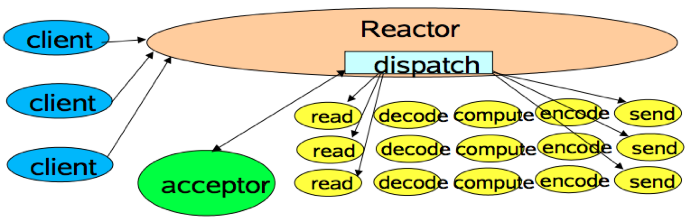
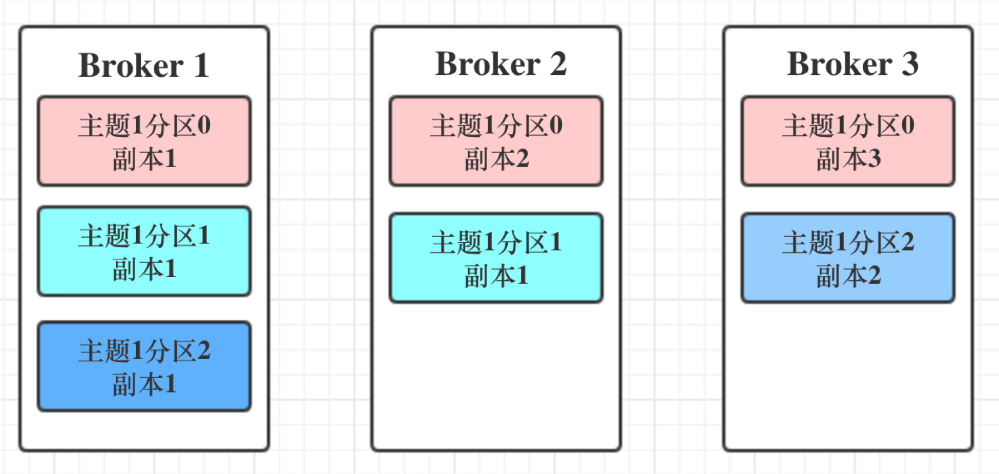
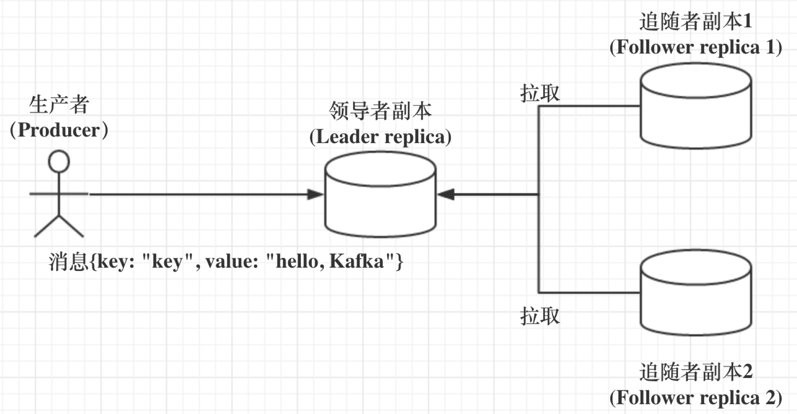

# 整体架构

1）Producer ：消息生产者，就是向kafka broker发消息的客户端；

2）Consumer ：消息消费者，向kafka broker取消息的客户端；

3）Topic ：可以理解为一个队列；

4） Consumer Group （CG）：这是kafka用来实现一个topic消息的广播（发给所有的consumer）和单播（发给任意一个consumer）的手段。一个topic可以有多个CG。topic的消息会复制（不是真的复制，是概念上的）到所有的CG，但每个partion只会把消息发给该CG中的一个consumer。如果需要实现广播，只要每个consumer有一个独立的CG就可以了。要实现单播只要所有的consumer在同一个CG。用CG还可以将consumer进行自由的分组而不需要多次发送消息到不同的topic；consumer根据消费的点，从broker上批量pull数据；

5）Broker ：一台kafka服务器就是一个broker。一个集群由多个broker组成。一个broker可以容纳多个topic；

6）Partition：为了实现扩展性，一个非常大的topic可以分布到多个broker（即服务器）上，一个topic可以分为多个partition，每个partition是一个有序的队列。partition中的每条消息都会被分配一个有序的id（offset）。kafka只保证按一个partition中的顺序将消息发给consumer，不保证一个topic的整体（多个partition间）的顺序；

7）Offset：kafka的存储文件都是按照offset.kafka来命名，用offset做名字的好处是方便查找。例如你想找位于2049的位置，只要找到2048.kafka的文件即可。当然the first offset就是00000000000.kafka。

# 版本演进

> 05 | 聊聊Kafka的版本号      

Kafka 目前总共演进了 7 个大版本，分别是 0.7、0.8、0.9、0.10、0.11、1.0 和 2.0。

- 0.7

  0.7 版本是最早开源时的“上古”版本了，这个版本只提供了最基础的消息队列功能，甚至连副本机制都没有。

- 0.8

  0.8 之后正式引入了**副本机制**，至此 Kafka  成为了一个真正意义上完备的分布式高可靠消息队列解决方案。有了副本备份机制，Kafka  就能够比较好地做到消息无丢失。那时候生产和消费消息使用的还是老版本的客户端 API，所谓的老版本是指当你用它们的 API  开发生产者和消费者应用时，你需要指定 ZooKeeper 的地址而非 Broker 的地址。老版本客户端有很多的问题，特别是生产者 API，它默认使用同步方式发送消息，可以想见其吞吐量一定不会太高。虽然它也支持异步的方式，但实际场景中可能会造成消息的丢失，因此 0.8.2.0 版本社区引入了**新版本 Producer API**，即需要指定 Broker 地址的 Producer。

- 0.9

  重量级的大版本更迭，0.9 大版本增加了基础的安全认证 / 权限功能，同时使用 Java 重写了新版本消费者 API，另外还引入了 Kafka Connect 组件用于实现高性能的数据抽取。**新版本 Producer API 在这个版本中算比较稳定了**

- 0.10

  里程碑式的大版本，因为该版本**引入了 Kafka Streams**。

- 0.11

  引入了两个重量级的功能变更：一个是提供幂等性 Producer API 以及事务（Transaction） API；另一个是对 Kafka 消息格式做了重构。主要是为 Kafka Streams 应用服务的。

- 1.0 与 2.0

  这两个大版本主要还是 Kafka Streams 的各种改进，在消息引擎方面并未引入太多的重大功能特性。

# Broker

## 数据处理模型

> 24 | 请求是怎么被处理的？

Kafka 使用的是**Reactor 模式**来处理请求的。

Reactor 模式的架构如下图所示：

从这张图中，我们可以发现，多个客户端会发送请求给到 Reactor。Reactor 有个请求分发线程 Dispatcher，也就是图中的 Acceptor，它会将不同的请求下发到多个工作线程中处理。

在这个架构中，Acceptor 线程只是用于请求分发，不涉及具体的逻辑处理，非常得轻量级，因此有很高的吞吐量表现。而这些工作线程可以根据实际业务处理需要任意增减，从而动态调节系统负载能力。

Kafka 是这个样子的：

Kafka 的 Broker 端有个 SocketServer 组件，类似于 Reactor 模式中的 Dispatcher，它也有对应的 Acceptor 线程和一个工作线程池，只不过在 Kafka 中，这个工作线程池有个专属的名字，叫网络线程池。Acceptor 线程采用轮询的方式将入站请求公平地发到所有网络线程中。Kafka 提供了 Broker 端参数 num.network.threads，用于调整该网络线程池的线程数。其**默认值是 3，表示每台 Broker 启动时会创建 3 个网络线程，专门处理客户端发送的请求**。

当网络线程拿到请求后，它不是自己处理，而是将请求放入到一个共享请求队列中。Broker 端还有个 IO  线程池，负责从该队列中取出请求，执行真正的处理。如果是 PRODUCE 生产请求，则将消息写入到底层的磁盘日志中；如果是 FETCH  请求，则从磁盘或页缓存中读取消息。

IO 线程池处中的线程才是执行请求逻辑的线程。Broker 端参数**num.io.threads**控制了这个线程池中的线程数。**目前该参数默认值是 8，表示每台 Broker 启动后自动创建 8 个 IO 线程处理请求**。你可以根据实际硬件条件设置此线程池的个数。

**请求队列是所有网络线程共享的，而响应队列则是每个网络线程专属的**。这么设计的原因就在于，Dispatcher 只是用于请求分发而不负责响应回传，因此只能让每个网络线程自己发送 Response 给客户端，所以这些 Response 也就没必要放在一个公共的地方。

**Purgatory**

它是用来**缓存延时请求**（Delayed Request）。**所谓延时请求，就是那些一时未满足条件不能立刻处理的请求**。比如设置了 acks=all 的 PRODUCE  请求，一旦设置了 acks=all，那么该请求就必须等待 ISR 中所有副本都接收了消息后才能返回，此时处理该请求的 IO 线程就必须等待其他  Broker 的写入结果。当请求不能立刻处理时，它就会暂存在 Purgatory 中。稍后一旦满足了完成条件，IO 线程会继续处理该请求，并将  Response 放入对应网络线程的响应队列中。

**数据类命令与控制类命令**

Kafka 社区把 PRODUCE 和 FETCH 这类请求称为数据类请求，把 LeaderAndIsr、StopReplica 这类请求称为控制类请求。细究起来，当前这种一视同仁的处理方式对控制类请求是不合理的。为什么呢？因为**控制类请求有这样一种能力：它可以直接令数据类请求失效！**

那么，社区是如何解决的呢？很简单，第三张图，社区完全拷贝了这张图中的一套组件，实现了两类请求的分离。也就是说，Kafka  Broker 启动后，会在后台分别创建网络线程池和 IO 线程池，**它们分别处理数据类请求和控制类请求**。至于所用的 Socket  端口，自然是使用不同的端口了，你需要提供不同的**listeners 配置**，显式地指定哪套端口用于处理哪类请求。

## Partition

> 09 |  生产者消息分区机制原理剖析

很明显，一个topic里面可以设置多个分区，数据按一定的策略发往不同的分区，所以kafka同一个topic是无法保证数据的顺序性的，但是同一个partition中的数据是有顺序的。要保证顺序消费的话，可以设计单一的partition，优化思路就是一贯的思路—分化，根据业务场景，看看能不能按某种key分partition，这样也能多partition也可以保证顺序消费。

分区策略：就是常见的轮询，随机，分组groupby，还可以自定义。

## Replication

> 23 | Kafka副本机制详解

Kafka 是有主题概念的，而每个主题又进一步划分成若干个分区。副本的概念实际上是在分区层级下定义的，每个分区配置有若干个副本。**所谓副本（Replica），本质就是一个只能追加写消息的提交日志**。根据 Kafka 副本机制的定义，同一个分区下的**所有副本保存有相同的消息序列**，这些副本分散保存在不同的 Broker 上，从而能够对抗部分 Broker 宕机带来的数据不可用。

**副本角色**

采用**基于领导者（Leader-based）的副本机制**。

- 第一，在 Kafka 中，副本分成两类：领导者副本（Leader Replica）和追随者副本（Follower Replica）。每个分区在创建时都要选举一个副本，称为领导者副本，其余的副本自动称为追随者副本。

- 第二，Kafka 的副本机制比其他分布式系统要更严格一些。在 Kafka  中，**追随者副本是不对外提供服务的**。这就是说，任何一个追随者副本都不能响应消费者和生产者的读写请求。所有的请求都必须由领导者副本来处理，或者说，所有的读写请求都必须发往领导者副本所在的 Broker，由该 Broker 负责处理。追随者副本不处理客户端请求，它唯一的任务就是从领导者副本**异步拉取**消息，并写入到自己的提交日志中，从而实现与领导者副本的同步。

- 第三，当领导者副本挂掉了，或者说领导者副本所在的 Broker 宕机时，Kafka 依托于 ZooKeeper  提供的监控功能能够实时感知到，并立即开启新一轮的领导者选举，从追随者副本中选一个作为新的领导者。**老 Leader  副本重启回来后，只能作为追随者副本加入到集群中**。

> #### Kafka 为什么追随者副本是不对外提供服务?

- **方便实现“Read-your-writes”**

  当你使用生产者 API 向 Kafka 成功写入消息后，马上使用消费者 API 去读取刚才生产的消息。如果允许追随者副本对外提供服务，由于副本同步是异步的，因此有可能出现追随者副本还没有从领导者副本那里拉取到最新的消息，从而使得客户端看不到最新写入的消息。

  

- **方便实现单调读（Monotonic Reads）**

  什么是单调读呢？就是对于一个消费者用户而言，在多次消费消息时，它不会看到某条消息一会儿存在一会儿不存在。多个follower拉取消息的时间不一致，导致连接到不同的follower读到的数据不同。

**In-sync Replicas（ISR）**

ISR 副本集合。ISR 中的副本都是与 Leader 同步的副本，相反，不在 ISR 中的追随者副本就被认为是与 Leader 不同步的。Leader 副本天然就在 ISR 中。也就是说，**ISR 不只是追随者副本集合，它必然包括 Leader 副本。甚至在某些情况下，ISR 只有 Leader 这一个副本**。

他根据**Broker 端参数 replica.lag.time.max.ms 参数值**来判断一个follower是否是与lead同步的。这个参数的含义是 Follower 副本能够落后 Leader 副本的最长时间间隔，当前默认值是 10 秒。

**Unclean 领导者选举（Unclean Leader Election）**

**Kafka 把所有不在 ISR 中的存活副本都称为非同步副本**。通常来说，非同步副本落后 Leader 太多，因此，如果选择这些副本作为新 Leader，就可能出现数据的丢失。毕竟，这些副本中保存的消息远远落后于老 Leader 中的消息。在 Kafka 中，选举这种副本的过程称为 Unclean 领导者选举。**Broker 端参数 unclean.leader.election.enable 控制是否允许 Unclean 领导者选举**。

开启 Unclean 领导者选举可能会造成数据丢失，但好处是，它使得分区 Leader 副本一直存在，不至于停止对外提供服务，因此提升了高可用性。反之，禁止 Unclean 领导者选举的好处在于维护了数据的一致性，避免了消息丢失，但牺牲了高可用性。建议别开了。

# Consumer Group

> 15 | 消费者组到底是什么？      

**Consumer Group 是 Kafka 提供的可扩展且具有容错性的消费者机制**。既然是一个组，那么组内必然可以有多个消费者或消费者实例（Consumer Instance），它们共享一个公共的 ID，这个 ID 被称为 Group  ID。组内的所有消费者协调在一起来消费订阅主题（Subscribed  Topics）的所有分区（Partition）。当然，**每个分区只能由同一个消费者组内的一个 Consumer 实例来消费**。

**分区数设置**

**理想情况下，Consumer 实例的数量应该等于该 Group 订阅主题的分区总数。**

如果你有 3 个实例，那么平均下来每个实例大约消费 2 个分区（6 / 3 = 2）；如果你设置了 8 个实例，那么很遗憾，有 2 个实例（8 – 6 = 2）将不会被分配任何分区，它们永远处于空闲状态。因此，在实际使用过程中一般不推荐设置大于总分区数的 Consumer  实例。设置多余的实例只会浪费资源，而没有任何好处。

## 位移管理

Offset对于 Consumer Group 而言，它是一组 KV 对，Key 是分区，V 对应 Consumer 消费该分区的最新位移。如果用  Java 来表示的话，你大致可以认为是这样的数据结构，即 `Map<TopicPartition, Long>`

- 老版本的 Consumer Group 把位移保存在 ZooKeeper 中。将位移保存在 ZooKeeper 外部系统的做法，最显而易见的好处就是减少了 Kafka Broker 端的状态保存开销。现在比较流行的提法是将服务器节点做成无状态的，这样可以自由地扩缩容，实现超强的伸缩性。

- 在新版本的 Consumer Group 中，Kafka 社区重新设计了 Consumer Group 的位移管理方式，采用了将位移保存在 Kafka 内部主题的方法。这个内部主题就是让人既爱又恨的 __consumer_offsets。新版本的 Consumer Group 将位移保存在 Broker 端的内部主题中。

转变的原因

ZooKeeper 这类元框架其实并不适合进行频繁的写更新，而 Consumer Group  的位移更新却是一个非常频繁的操作。这种大吞吐量的写操作会极大地拖慢 ZooKeeper 集群的性能，因此 Kafka 社区渐渐有了这样的共识：将 Consumer 位移保存在 ZooKeeper 中是不合适的做法。

> #### 位移提交

> 18 | Kafka中位移提交那些事儿

Consumer 的消费位移，它记录了 Consumer 要消费的**下一条**消息的位移，而不是目前最新消费消息的位移。

**Consumer 需要向 Kafka 汇报自己的位移数据，这个汇报过程被称为提交位移**（Committing Offsets）。因为 Consumer 能够同时消费多个分区的数据，所以位移的提交实际上是在分区粒度上进行的，即**Consumer 需要为分配给它的每个分区提交各自的位移数据**。

提交位移主要是为了表征 Consumer 的消费进度，这样当 Consumer 发生故障重启之后，就能够从 Kafka  中读取之前提交的位移值，然后从相应的位移处继续消费，从而避免整个消费过程重来一遍。换句话说，位移提交是 Kafka  提供给你的一个工具或语义保障，你负责维持这个语义保障，即如果你提交了位移 X，那么 Kafka 会认为所有位移值小于 X  的消息你都已经成功消费了。

**从用户的角度来说，位移提交分为自动提交和手动提交；从 Consumer 端的角度来说，位移提交分为同步提交和异步提交**。

- 自动提交

  一旦设置了 enable.auto.commit 为 true，Kafka 会保证在开始调用 poll 方法时，提交上次 poll  返回的所有消息。从顺序上来说，poll  方法的逻辑是先提交上一批消息的位移，再处理下一批消息，因此它能保证不出现消费丢失的情况。但自动提交位移的一个问题在于，**它可能会出现重复消费**。

- 手动提交

  在调用 `commitSync()` 时，Consumer 程序会处于阻塞状态，直到远端的 Broker 返回提交结果，这个状态才会结束，影响整个应用程序的 TPS。

  `commitAsync`异步提交，他不会堵塞，他的问题是在出现问题时它不会自动重试。因为它是异步操作，倘若提交失败后自动重试，那么它重试时提交的位移值可能早已经“过期”或不是最新值了。因此，异步提交的重试其实没有意义，所以 commitAsync 是不会重试的。

## Rebalance

**Rebalance 本质上是一种协议，规定了一个 Consumer Group 下的所有 Consumer 如何达成一致，来分配订阅 Topic 的每个分区**。

Rebalance 的触发条件有 3 个。

1. 组成员数发生变更。比如有新的 Consumer 实例加入组或者离开组，抑或是有 Consumer 实例崩溃被“踢出”组。
2. 订阅主题数发生变更。Consumer Group 可以使用正则表达式的方式订阅主题，比如  consumer.subscribe(Pattern.compile(“t.*c”)) 就表明该 Group 订阅所有以字母 t 开头、字母 c 结尾的主题。在 Consumer Group 的运行过程中，你新创建了一个满足这样条件的主题，那么该 Group 就会发生  Rebalance。
3. 订阅主题的分区数发生变更。Kafka 当前只能允许增加一个主题的分区数。当分区数增加时，就会触发订阅该主题的所有 Group 开启 Rebalance。

Rebalance 发生时，Group 下所有的 Consumer 实例都会协调在一起共同参与。

存在问题

- 在 Rebalance 过程中，所有 Consumer 实例都会停止消费，等待 Rebalance 完成。
- 目前 Rebalance 的设计是所有 Consumer 实例共同参与，全部重新分配所有分区，导致额外的变更。
- Group内Consumer一多就慢

> 25 | 消费者组重平衡全流程解析      

// todo

# 常见问题

> #### kafka底层的io模型

实际上 Kafka 客户端底层使用了 Java 的 selector，selector 在 Linux 上的实现机制是 epoll，而在 Windows 平台上的实现机制是 select。**因此在这一点上将 Kafka 部署在 Linux 上是有优势的，因为能够获得更高效的 I/O 性能。**

主流的 I/O 模型通常有 5 种类型：阻塞式 I/O、非阻塞式 I/O、I/O 多路复用、信号驱动 I/O 和异步 I/O。

每种 I/O  模型都有各自典型的使用场景，比如 

- Java 中 Socket 对象的阻塞模式和非阻塞模式就对应于前两种模型；
- 而 Linux 中的系统调用  select 函数就属于 I/O 多路复用模型；
- 大名鼎鼎的 epoll 系统调用则介于第三种和第四种模型之间；
- 至于第五种模型，其实很少有  Linux 系统支持，反而是 Windows 系统提供了一个叫 IOCP 线程模型属于这一种。

## 丢消息的原因

> 11 | 无消息丢失配置怎么实现？

**一句话概括，Kafka 只对“已提交”的消息（committed message）做有限度的持久化保证。**

- **生产者程序丢失数据**

  Kafka Producer 是异步发送消息的，也就是说如果你调用的是 producer.send(msg) 这个 API，那么它通常会立即返回，但此时你不能认为消息发送已成功完成。所以需要使用**producer.send(msg, callback)**，带有一个回调函数。

- **消费者程序丢失数据**

  Consumer 程序有个offset的概念，表示的是这个 Consumer 当前消费到的 Topic 分区的位置。由于消费消息与更新位移并不是原子操作，所以会出现丢数据的问题。**维持先消费消息（阅读），再更新位移（书签）的顺序**即可。这样就能最大限度地保证消息不丢失。

  在单消费者多线程消费的情况下，Consumer 程序从 Kafka 获取到消息后开启了多个线程异步处理消息，而 Consumer  程序自动地向前更新位移。假如其中某个线程运行失败了，它负责的消息没有被成功处理，但位移已经被更新了，因此这条消息对于 Consumer  而言实际上是丢失了。

  这里的关键在于 Consumer 自动提交位移，你没有真正地确认消息是否真的被消费就“盲目”地更新了位移。这个问题的解决方案也很简单：**如果是多线程异步处理消费消息，Consumer 程序不要开启自动提交位移，而是要应用程序手动提交位移**。

**最佳实践**

1. 不要使用 producer.send(msg)，而要使用 producer.send(msg, callback)。记住，一定要使用带有回调通知的 send 方法。
2. 设置 acks = all。acks 是 Producer 的一个参数，代表了你对“已提交”消息的定义。如果设置成 all，则表明所有副本 Broker 都要接收到消息，该消息才算是“已提交”。这是最高等级的“已提交”定义。
3. 设置 retries 为一个较大的值。这里的 retries 同样是 Producer 的参数，对应前面提到的 Producer  自动重试。当出现网络的瞬时抖动时，消息发送可能会失败，此时配置了 retries > 0 的 Producer  能够自动重试消息发送，避免消息丢失。
4. 设置 unclean.leader.election.enable = false。这是 Broker 端的参数，它控制的是哪些  Broker 有资格竞选分区的 Leader。如果一个 Broker 落后原先的 Leader 太多，那么它一旦成为新的  Leader，必然会造成消息的丢失。故一般都要将该参数设置成 false，即不允许这种情况的发生。
5. 设置 replication.factor >= 3。这也是 Broker 端的参数。其实这里想表述的是，最好将消息多保存几份，毕竟目前防止消息丢失的主要机制就是冗余。
6. 设置 min.insync.replicas > 1。这依然是 Broker 端参数，控制的是消息至少要被写入到多少个副本才算是“已提交”。设置成大于 1 可以提升消息持久性。在实际环境中千万不要使用默认值 1。
7. 确保 replication.factor >  min.insync.replicas。如果两者相等，那么只要有一个副本挂机，整个分区就无法正常工作了。我们不仅要改善消息的持久性，防止数据丢失，还要在不降低可用性的基础上完成。推荐设置成 replication.factor = min.insync.replicas + 1。
8. 确保消息消费完成再提交。Consumer 端有个参数 enable.auto.commit，最好把它设置成 false，并采用手动提交位移的方式。就像前面说的，这对于单 Consumer 多线程处理的场景而言是至关重要的。

## 消息交付可靠性保障&精确处理一次

> 14 | 幂等生产者和事务生产者是一回事吗？

所谓的消息交付可靠性保障，是指 Kafka 对 Producer 和 Consumer 要处理的消息提供什么样的承诺。常见的承诺有以下三种：

- 最多一次（at most once）：消息可能会丢失，但绝不会被重复发送。
- 至少一次（at least once）：消息不会丢失，但有可能被重复发送。
- 精确一次（exactly once）：消息不会丢失，也不会被重复发送。

至少一次：发送发开启重试功能，知道broker收到为止。

至多一次：关了重试即可。

Kafka 通过两种机制：**幂等性（Idempotence）**和**事务（Transaction）**做到精确一次。

**幂等性 Producer**

底层具体的原理很简单，就是经典的用空间去换时间的优化思路，即在 Broker 端多保存一些字段。当 Producer 发送了具有相同字段值的消息后，Broker 能够自动知晓这些消息已经重复了，于是可以在后台默默地把它们“丢弃”掉。当然，实际的实现原理并没有这么简单，但你大致可以这么理解。

作用范围：

- 首先，它只能保证单分区上的幂等性，即一个幂等性 Producer  能够保证某个主题的一个分区上不出现重复消息，它无法实现多个分区的幂等性。
- 其次，它只能实现单会话上的幂等性，不能实现跨会话的幂等性。这里的会话，你可以理解为 Producer 进程的一次运行。当你重启了 Producer 进程之后，这种幂等性保证就丧失了。

如果我想实现多分区以及多会话上的消息无重复，应该怎么做呢？答案就是事务（transaction）或者依赖事务型 Producer。这也是幂等性 Producer 和事务型 Producer 的最大区别！

**事务型 Producer**

Kafka 自 0.11 版本开始也提供了对事务的支持，目前主要是在 read committed  隔离级别上做事情。它能保证多条消息原子性地写入到目标分区，同时也能保证 Consumer 只能看到事务成功提交的消息。

事务型 Producer 能够保证将消息原子性地写入到多个分区中。这批消息要么全部写入成功，要么全部失败。另外，事务型 Producer 也不惧进程的重启。Producer 重启回来后，Kafka 依然保证它们发送消息的精确一次处理。

幂等性 Producer 只能保证单分区、单会话上的消息幂等性；而事务能够保证跨分区、跨会话间的幂等性。从交付语义上来看，自然是事务型 Producer 能做的更多，当然比起幂等性 Producer，事务型 Producer 的性能要更差。

# 比较RabbitMQ

> #### 在应用场景方面

RabbitMQ：遵循AMQP协议，由内在高并发的erlanng语言开发，用在实时的对可靠性要求比较高的消息传递上。

kafka是Linkedin于2010年12月份开源的消息发布订阅系统,它主要用于处理活跃的流式数据,大数据量的数据处理上。

> #### 在架构模型方面

RabbitMQ遵循AMQP协议，RabbitMQ的broker由Exchange,Binding,queue组成，其中exchange和binding组成了消息的路由键；客户端Producer通过连接channel和server进行通信，Consumer从queue获取消息进行消费（长连接，queue有消息会推送到consumer端，consumer循环从输入流读取数据）。rabbitMQ以broker为中心；有消息的确认机制。

kafka遵从一般的MQ结构，producer，broker，consumer，以consumer为中心，消息的消费信息保存的客户端consumer上，consumer根据消费的点，从broker上批量pull数据；**无消息确认机制。**

> #### 吞吐量

kafka具有高的吞吐量，内部采用消息的批量处理，zero-copy机制，数据的存储和获取是本地磁盘顺序批量操作，具有O(1)的复杂度，消息处理的效率很高。

rabbitMQ在吞吐量方面稍逊于kafka，他们的出发点不一样，rabbitMQ支持对消息的可靠的传递，支持事务，不支持批量的操作；基于存储的可靠性的要求存储可以采用内存或者硬盘。

> #### 可用性方面

rabbitMQ支持miror的queue，主queue失效，miror queue接管。

kafka的broker支持主备模式。

> #### 在集群负载均衡方面

kafka采用zookeeper对集群中的broker、consumer进行管理，可以注册topic到zookeeper上；通过zookeeper的协调机制，producer保存对应topic的broker信息，可以随机或者轮询发送到broker上；并且producer可以基于语义指定分片，消息发送到broker的某分片上。

rabbitMQ的负载均衡需要单独的loadbalancer进行支持。

https://juejin.im/post/5c6d1ecbe51d4567a238ab8b