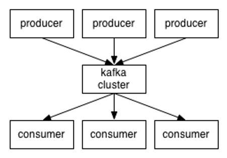
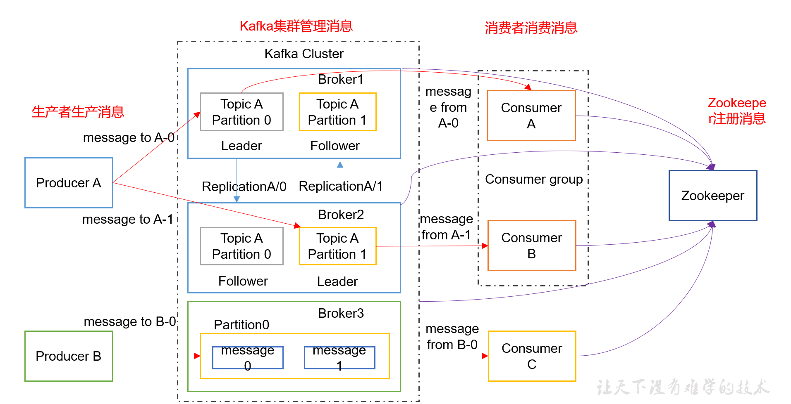

# 整体架构

1）Producer ：消息生产者，就是向kafka broker发消息的客户端；

2）Consumer ：消息消费者，向kafka broker取消息的客户端；

3）Topic ：可以理解为一个队列；

4） Consumer Group （CG）：这是kafka用来实现一个topic消息的广播（发给所有的consumer）和单播（发给任意一个consumer）的手段。一个topic可以有多个CG。topic的消息会复制（不是真的复制，是概念上的）到所有的CG，但每个partion只会把消息发给该CG中的一个consumer。如果需要实现广播，只要每个consumer有一个独立的CG就可以了。要实现单播只要所有的consumer在同一个CG。用CG还可以将consumer进行自由的分组而不需要多次发送消息到不同的topic；consumer根据消费的点，从broker上批量pull数据；

5）Broker ：一台kafka服务器就是一个broker。一个集群由多个broker组成。一个broker可以容纳多个topic；

6）Partition：为了实现扩展性，一个非常大的topic可以分布到多个broker（即服务器）上，一个topic可以分为多个partition，每个partition是一个有序的队列。partition中的每条消息都会被分配一个有序的id（offset）。kafka只保证按一个partition中的顺序将消息发给consumer，不保证一个topic的整体（多个partition间）的顺序；

7）Offset：kafka的存储文件都是按照offset.kafka来命名，用offset做名字的好处是方便查找。例如你想找位于2049的位置，只要找到2048.kafka的文件即可。当然the first offset就是00000000000.kafka。

# 比较RabbitMQ

> #### 在应用场景方面

RabbitMQ：遵循AMQP协议，由内在高并发的erlanng语言开发，用在实时的对可靠性要求比较高的消息传递上。

kafka是Linkedin于2010年12月份开源的消息发布订阅系统,它主要用于处理活跃的流式数据,大数据量的数据处理上。

> #### 在架构模型方面

RabbitMQ遵循AMQP协议，RabbitMQ的broker由Exchange,Binding,queue组成，其中exchange和binding组成了消息的路由键；客户端Producer通过连接channel和server进行通信，Consumer从queue获取消息进行消费（长连接，queue有消息会推送到consumer端，consumer循环从输入流读取数据）。rabbitMQ以broker为中心；有消息的确认机制。

kafka遵从一般的MQ结构，producer，broker，consumer，以consumer为中心，消息的消费信息保存的客户端consumer上，consumer根据消费的点，从broker上批量pull数据；**无消息确认机制。**

> #### 吞吐量

kafka具有高的吞吐量，内部采用消息的批量处理，zero-copy机制，数据的存储和获取是本地磁盘顺序批量操作，具有O(1)的复杂度，消息处理的效率很高。

rabbitMQ在吞吐量方面稍逊于kafka，他们的出发点不一样，rabbitMQ支持对消息的可靠的传递，支持事务，不支持批量的操作；基于存储的可靠性的要求存储可以采用内存或者硬盘。

> #### 可用性方面

rabbitMQ支持miror的queue，主queue失效，miror queue接管。

kafka的broker支持主备模式。

> #### 在集群负载均衡方面

kafka采用zookeeper对集群中的broker、consumer进行管理，可以注册topic到zookeeper上；通过zookeeper的协调机制，producer保存对应topic的broker信息，可以随机或者轮询发送到broker上；并且producer可以基于语义指定分片，消息发送到broker的某分片上。

rabbitMQ的负载均衡需要单独的loadbalancer进行支持。

https://juejin.im/post/5c6d1ecbe51d4567a238ab8b