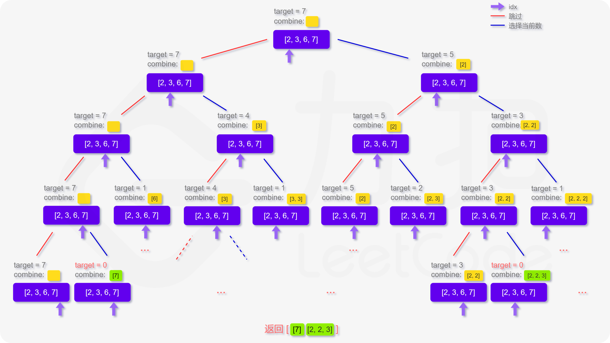

# 综述

- 按照热榜排序，目的是记录一下常问的LeetCode题目。
- cn与com都会涉及。
- 先把简单与中等的处理了，最后再处理困难
- :star: — 金典题|:fearful: — hard题|:new_moon_with_face:  —​ 脑筋急转弯、数学降维、其他思想降维、各种降维打击

所有题目来源：力扣（LeetCode）
著作权归领扣网络所有。商业转载请联系官方授权，非商业转载请注明出处。


# [1. 两数之和](https://leetcode-cn.com/problems/two-sum/)

给定一个整数数组 `nums` 和一个整数目标值 `target`，请你在该数组中找出 **和为目标值** 的那 **两个** 整数，并返回它们的数组下标。

你可以假设每种输入只会对应一个答案。但是，数组中同一个元素不能使用两遍。

你可以按任意顺序返回答案。

 

**示例 1：**

```
输入：nums = [2,7,11,15], target = 9
输出：[0,1]
解释：因为 nums[0] + nums[1] == 9 ，返回 [0, 1] 。
```

**示例 2：**

```
输入：nums = [3,2,4], target = 6
输出：[1,2]
```

**示例 3：**

```
输入：nums = [3,3], target = 6
输出：[0,1]
```


思路：

由于是要求2个数字相加等于目标数，可以循环nums数组，使用`Map<value, index>`表来存储已经遍历的每一个数字

```java
class Solution {
    public int[] twoSum(int[] nums, int target) {
        Map<Integer, Integer> map = new HashMap<>();
        for (int i = 0; i < nums.length; i++) {
            int complement = target - nums[i];
            if (map.containsKey(complement)) {
                return new int[] { map.get(complement), i };
            }
            map.put(nums[i], i);
        }
        
        return null;
    }
}
```


官方标准

```java
class Solution {
    public int[] twoSum(int[] nums, int target) {
        Map<Integer, Integer> hashtable = new HashMap<Integer, Integer>();
        for (int i = 0; i < nums.length; ++i) {
            if (hashtable.containsKey(target - nums[i])) {
                return new int[]{hashtable.get(target - nums[i]), i};
            }
            hashtable.put(nums[i], i);
        }
        return new int[0];
    }
}


作者：LeetCode-Solution
链接：https://leetcode-cn.com/problems/two-sum/solution/liang-shu-zhi-he-by-leetcode-solution/
来源：力扣（LeetCode）
著作权归作者所有。商业转载请联系作者获得授权，非商业转载请注明出处。
```


# [2. 两数相加](https://leetcode-cn.com/problems/add-two-numbers/)

给你两个 **非空** 的链表，表示两个非负的整数。它们每位数字都是按照 **逆序** 的方式存储的，并且每个节点只能存储 **一位** 数字。

请你将两个数相加，并以相同形式返回一个表示和的链表。

你可以假设除了数字 0 之外，这两个数都不会以 0 开头。

**示例 1：**


```
输入：l1 = [2,4,3], l2 = [5,6,4]
输出：[7,0,8]
解释：342 + 465 = 807.
```

示例 2：
```
输入：l1 = [0], l2 = [0]
输出：[0]
```

示例 3：

```
输入：l1 = [9,9,9,9,9,9,9], l2 = [9,9,9,9]
输出：[8,9,9,9,0,0,0,1]
```


提示：
- 每个链表中的节点数在范围 [1, 100] 内
- 0 <= Node.val <= 9
- 题目数据保证列表表示的数字不含前导零


我的基本想法是，就模拟10进制加法，单独定义个进位标志，一位位算就行。

```java
class Solution {
    public ListNode addTwoNumbers(ListNode l1, ListNode l2) {
        ListNode resultNode = null;
        ListNode temp = null;
        int carryBit = 0;

        while (true){
            int first = 0;
            if (l1 != null){
                first = l1.val;
                l1 = l1.next;
            }

            int sec = 0;
            if (l2 != null){
                sec = l2.val;
                l2 = l2.next;
            }

            int third =  first + sec + carryBit;
            if (third >= 10){
                third = third - 10;
                carryBit = 1;
            }else {
                carryBit = 0;
            }

            ListNode listNode = new ListNode(third);

            if (resultNode == null){
                resultNode = listNode;
                temp = listNode;
            }else {
                temp.next = listNode;
                temp = temp.next;
            }

            if (l1 == null && l2 == null){
                if (carryBit == 1){
                    temp.next = new ListNode(1);
                }
                break;
            }
        }

        return resultNode;
    }
}
```


官方标准

```java
class Solution {
    public ListNode addTwoNumbers(ListNode l1, ListNode l2) {
        ListNode head = null, tail = null;
        int carry = 0;
        while (l1 != null || l2 != null) {
            int n1 = l1 != null ? l1.val : 0;
            int n2 = l2 != null ? l2.val : 0;
            int sum = n1 + n2 + carry;
            if (head == null) {
                head = tail = new ListNode(sum % 10);
            } else {
                tail.next = new ListNode(sum % 10);
                tail = tail.next;
            }
            carry = sum / 10;
            if (l1 != null) {
                l1 = l1.next;
            }
            if (l2 != null) {
                l2 = l2.next;
            }
        }
        if (carry > 0) {
            tail.next = new ListNode(carry);
        }
        return head;
    }
}


作者：LeetCode-Solution
链接：https://leetcode-cn.com/problems/add-two-numbers/solution/liang-shu-xiang-jia-by-leetcode-solution/
来源：力扣（LeetCode）
著作权归作者所有。商业转载请联系作者获得授权，非商业转载请注明出处。
```


# [3. 无重复字符的最长子串](https://leetcode-cn.com/problems/longest-substring-without-repeating-characters/)

给定一个字符串，请你找出其中不含有重复字符的 **最长子串** 的长度。

**示例 1:**

```
输入: s = "abcabcbb"
输出: 3 
解释: 因为无重复字符的最长子串是 "abc"，所以其长度为 3。
```

**示例 2:**

```
输入: s = "bbbbb"
输出: 1
解释: 因为无重复字符的最长子串是 "b"，所以其长度为 1。
```

示例 3:

```
输入: s = "pwwkew"
输出: 3
解释: 因为无重复字符的最长子串是 "wke"，所以其长度为 3。
     请注意，你的答案必须是 子串 的长度，"pwke" 是一个子序列，不是子串。
```

**示例 4:**

```
输入: s = ""
输出: 0
```

**提示：**

- `0 <= s.length <= 5 * 104`
- `s` 由英文字母、数字、符号和空格组成


当年的想法应该是看了社区解答的，头尾双指针，遍历字符串的每个字符，如果字符在map中已经存在了，就说明遇到相同的了，那么头指针指向相同字符的下一个字符处，尾指针回溯，清空map。如果不存在就说明是个新的数字，放进map中。每轮遍历都计算一下长度，与记录的最大长度比较。遍历到最后一个字符。

一个明显的问题是，每次遇见相同的头指针都是往前推进1，尾指针则完全回溯了，又需要遍历一遍，这是重复遍历。

```java
class Solution {
    public int lengthOfLongestSubstring(String s) {
        char[] strArray = s.toCharArray();

        int arrayhead = 0;
        int arrayTail = 0;
        int result = 0;
        Map<Character, Integer> map = new HashMap<>();
        for (int i = 0; i < s.length();){
            char str = strArray[i];
            Integer dumpIndex = map.get(str);

            if (dumpIndex != null){
                arrayhead ++;
                i = arrayhead;
                arrayTail = arrayhead;
                map.clear();
            }else {
                map.put(str, i);
                i++;
                arrayTail++;
            }

            if (arrayTail - arrayhead > result){
                result = arrayTail - arrayhead;
            }
        }

        return result;
    }
}
```


官方：**滑动窗口**

如果我们依次递增地枚举子串的起始位置，那么子串的结束位置也是递增的！这里的原因在于，假设我们选择字符串中的第 $k$ 个字符作为起始位置，并且得到了不包含重复字符的最长子串的结束位置为 $rk$。那么当我们选择第 $k+1$ 个字符作为起始位置时，首先从 $k+1$ 到 $rk$ 的字符显然是不重复的，并且由于少了原本的第 $k$ 个字符，我们可以尝试继续增大 $rk$，直到右侧出现了重复字符为止。

这样一来，我们就可以使用「滑动窗口」来解决这个问题了：

- 我们使用两个指针表示字符串中的某个子串（或窗口）的左右边界，其中左指针代表着上文中「枚举子串的起始位置」，而右指针即为上文中的$rk$ ；

- 在每一步的操作中，我们会将左指针向右移动一格，表示 **我们开始枚举下一个字符作为起始位置**，然后我们可以不断地向右移动右指针，但需要保证这两个指针对应的子串中没有重复的字符。在移动结束后，这个子串就对应着 **以左指针开始的，不包含重复字符的最长子串**。我们记录下这个子串的长度；

- 在枚举结束后，我们找到的最长的子串的长度即为答案。

  

**判断重复字符**

在上面的流程中，我们还需要使用一种数据结构来判断 是否有重复的字符，常用的数据结构为哈希集合（即 C++ 中的 std::unordered_set，Java 中的 HashSet，Python 中的 set, JavaScript 中的 Set）。在左指针向右移动的时候，我们从哈希集合中移除一个字符，在右指针向右移动的时候，我们往哈希集合中添加一个字符。

```java
class Solution {
    public int lengthOfLongestSubstring(String s) {
        // 哈希集合，记录每个字符是否出现过
        Set<Character> occ = new HashSet<Character>();
        int n = s.length();
        // 右指针，初始值为 -1，相当于我们在字符串的左边界的左侧，还没有开始移动
        int rk = -1, ans = 0;
        for (int i = 0; i < n; ++i) {
            if (i != 0) {
                // 左指针向右移动一格，移除一个字符
                occ.remove(s.charAt(i - 1));
            }
            while (rk + 1 < n && !occ.contains(s.charAt(rk + 1))) {
                // 不断地移动右指针
                occ.add(s.charAt(rk + 1));
                ++rk;
            }
            // 第 i 到 rk 个字符是一个极长的无重复字符子串
            ans = Math.max(ans, rk - i + 1);
        }
        return ans;
    }
}


作者：LeetCode-Solution
链接：https://leetcode-cn.com/problems/longest-substring-without-repeating-characters/solution/wu-zhong-fu-zi-fu-de-zui-chang-zi-chuan-by-leetc-2/
来源：力扣（LeetCode）
著作权归作者所有。商业转载请联系作者获得授权，非商业转载请注明出处。
```


# [4. 寻找两个正序数组的中位数](https://leetcode-cn.com/problems/median-of-two-sorted-arrays/) :fearful:


# [5. 最长回文子串](https://leetcode-cn.com/problems/longest-palindromic-substring/)

给你一个字符串 `s`，找到 `s` 中最长的回文子串。

**示例 1：**

```
输入：s = "babad"
输出："bab"
解释："aba" 同样是符合题意的答案。
```

**示例 2：**

```
输入：s = "cbbd"
输出："bb"
```

**示例 3：**

```
输入：s = "a"
输出："a"
```

**示例 4：**

```
输入：s = "ac"
输出："a"
```

**提示：**

- `1 <= s.length <= 1000`
- `s` 仅由数字和英文字母（大写和/或小写）组成


又要想起被KMP支配的恐惧，对我来说算法里面的字符串处理是最困难的。

回文是指正着与逆着都一样的字符串。


多年前写的，思路早都忘记了，看代码应该是确定了一头一尾2个指针，一个从前往后，一个从后往前的开始遍历。当遇到不相等的时候，就说明当前的字符串肯定不是回文。然后向前移动一格，继续下一轮比较，如果移动的超出了原字符的最大长度，则缩短一下期待的回文字符串长度，然后又从第一个字符开始判断。

由于是从最大的字符串开始比较的，所以一旦找到一个回文串，那么肯定就是最长的。这样看起来，还是一个滑动窗口，只不过窗口在逐渐的减小。

```java
class Solution {
    public String longestPalindrome(String s) {
        char[] charArray = s.toCharArray();

        int head = 0;
        int scape = s.length();

        while (scape != 0){
            int tail = head + scape;

            boolean f = true;
            for (int i = 0; i < scape/2; i++){
                if (charArray[i + head] != charArray[tail - i - 1]){
                    f = false;
                    break;
                }
            }

            if (f){
                StringBuilder result = new StringBuilder();
                for (int i = head; i <= tail - 1; i++){
                    result.append(charArray[i]);
                }

                return result.toString();
            }else {
                if (tail < s.length()){
                    head ++;
                }else {
                    head = 0;
                    scape--;
                }
            }
        }

        return "";
    }
}
```


官方

给出了4种解法，并且出视频。看几个重要的

- 方法一（暴力解法）
- 方法二（中心扩散）
- 方法三（动态规划）
- 方法四（Manacher 算法）


**动态规划**

对于一个子串而言，如果它是回文串，并且长度大于 $2$，那么将它首尾的两个字母去除之后，它仍然是个回文串。例如对于字符串 $ababa$，如果我们已经知道 $bab$是回文串，那么 $ababa$ 一定是回文串，这是因为它的首尾两个字母都是$a$。

根据这样的思路，我们就可以用动态规划的方法解决本题。我们用 $P(i,j) $表示字符串 $s$ 的第 $i$ 到 $j$ 个字母组成的串（下文表示成 $s[i:j]$是否为回文串：
$$
P(i,j)=\begin{cases} true，如果子串 Si​…Sj​ 是回文串\\ false， 其他情况\end{cases}
$$
这里的「其它情况」包含两种可能性：

- $s[i,j]$本身不是一个回文串；
- $i>j$，此时 $s[i,j]$本身不合法。

那么我们就可以写出动态规划的状态转移方程：
$$
P(i,j)=P(i+1,j−1)∧(Si​==Sj​)
$$
也就是说，只有 $s[i+1:j−1]$是回文串，并且 $s$的第 $i$ 和 $j$ 个字母相同时，$s[i:j]$ 才会是回文串。

上文的所有讨论是建立在子串长度大于 2 的前提之上的，我们还需要考虑动态规划中的边界条件，即子串的长度为 1 或 2。对于长度为 1 的子串，它显然是个回文串；对于长度为 2 的子串，只要它的两个字母相同，它就是一个回文串。因此我们就可以写出动态规划的边界条件：

$$
\begin{cases} P(i,i) = true\\ P(i, i+1) = (Si​==Sj​)\end{cases}
$$
根据这个思路，我们就可以完成动态规划了，最终的答案即为所有 $P(i,j)=true$中 $j−i+1$（即子串长度）的最大值。注意：在状态转移方程中，我们是从长度较短的字符串向长度较长的字符串进行转移的，因此一定要注意动态规划的循环顺序。

```java
class Solution {
    public String longestPalindrome(String s) {
        int n = s.length();
        boolean[][] dp = new boolean[n][n];
        String ans = "";
        for (int l = 0; l < n; ++l) {
            for (int i = 0; i + l < n; ++i) {
                int j = i + l;
                if (l == 0) {
                    dp[i][j] = true;
                } else if (l == 1) {
                    dp[i][j] = (s.charAt(i) == s.charAt(j));
                } else {
                    dp[i][j] = (s.charAt(i) == s.charAt(j) && dp[i + 1][j - 1]);
                }
                if (dp[i][j] && l + 1 > ans.length()) {
                    ans = s.substring(i, i + l + 1);
                }
            }
        }
        return ans;
    }
}


作者：LeetCode-Solution
链接：https://leetcode-cn.com/problems/longest-palindromic-substring/solution/zui-chang-hui-wen-zi-chuan-by-leetcode-solution/
来源：力扣（LeetCode）
著作权归作者所有。商业转载请联系作者获得授权，非商业转载请注明出处。
```

这里的`int l`应该是回文的预期长度。


**方法二：中心扩展算法**

边界情况为子串长度为 1 或 2 的情况。我们枚举每一种边界情况，并从对应的子串开始不断地向两边扩展。如果两边的字母相同，我们就可以继续扩展，例如从 $P(i+1,j-1)$ 扩展到 $P(i,j)$；如果两边的字母不同，我们就可以停止扩展，因为在这之后的子串都不能是回文串了。

「边界情况」对应的子串实际上就是我们「扩展」出的回文串的「回文中心」。方法二的本质即为：我们枚举所有的「回文中心」并尝试「扩展」，直到无法扩展为止，此时的回文串长度即为此「回文中心」下的最长回文串长度。我们对所有的长度求出最大值，即可得到最终的答案。

```java
class Solution {
    public String longestPalindrome(String s) {
        if (s == null || s.length() < 1) {
            return "";
        }
        int start = 0, end = 0;
        for (int i = 0; i < s.length(); i++) {
            int len1 = expandAroundCenter(s, i, i);
            int len2 = expandAroundCenter(s, i, i + 1);
            int len = Math.max(len1, len2);
            if (len > end - start) {
                start = i - (len - 1) / 2;
                end = i + len / 2;
            }
        }
        return s.substring(start, end + 1);
    }

    public int expandAroundCenter(String s, int left, int right) {
        while (left >= 0 && right < s.length() && s.charAt(left) == s.charAt(right)) {
            --left;
            ++right;
        }
        return right - left - 1;
    }
}


作者：LeetCode-Solution
链接：https://leetcode-cn.com/problems/longest-palindromic-substring/solution/zui-chang-hui-wen-zi-chuan-by-leetcode-solution/
来源：力扣（LeetCode）
著作权归作者所有。商业转载请联系作者获得授权，非商业转载请注明出处。
```


# [10. 正则表达式匹配](https://leetcode-cn.com/problems/regular-expression-matching/)​ :fearful:

给你一个字符串 s 和一个字符规律 p，请你来实现一个支持 '.' 和 '\*' 的正则表达式匹配。

    '.' 匹配任意单个字符
    '*' 匹配零个或多个前面的那一个元素

所谓匹配，是要涵盖 整个 字符串 s的，而不是部分字符串。


示例 1：
```
输入：s = "aa" p = "a"
输出：false
解释："a" 无法匹配 "aa" 整个字符串。
```


示例 2:

```
输入：s = "aa" p = "a*"
输出：true
解释：因为 '*' 代表可以匹配零个或多个前面的那一个元素, 在这里前面的元素就是 'a'。因此，字符串 "aa" 可被视为 'a' 重复了一次。
```

示例 3：
```
输入：s = "ab" p = ".*"
输出：true
解释：".*" 表示可匹配零个或多个（'*'）任意字符（'.'）。
```
示例 4：
```
输入：s = "aab" p = "c*a*b"
输出：true
解释：因为 '*' 表示零个或多个，这里 'c' 为 0 个, 'a' 被重复一次。因此可以匹配字符串 "aab"。
```
示例 5：
```
输入：s = "mississippi" p = "mis*is*p*."
输出：false
```


提示：

- 0 <= s.length <= 20
- 0 <= p.length <= 30
- s 可能为空，且只包含从 a-z 的小写字母。
- p 可能为空，且只包含从 a-z 的小写字母，以及字符 . 和 *。
- 保证每次出现字符 * 时，前面都匹配到有效的字符


官方

**方法一：动态规划**

思路与算法

题目中的匹配是一个「逐步匹配」的过程：我们每次从字符串 $p$ 中取出一个字符或者「字符 + 星号」的组合，并在 $s$ 中进行匹配。对于 $p$ 中一个字符而言，它只能在 $s$ 中匹配一个字符，匹配的方法具有唯一性；而对于 $p$ 中字符 + 星号的组合而言，它可以在 $s$ 中匹配任意自然数个字符，并不具有唯一性。因此我们可以考虑使用动态规划，对匹配的方案进行枚举。

**我们用 $f[i][j]$ 表示 $s$ 的前 $i$ 个字符与 $p$ 中的前 $j$ 个字符是否能够匹配。**在进行状态转移时，我们考虑 $p$ 的第 $j$ 个字符的匹配情况：

- 如果 $p$ 的第 $j$ 个字符是一个小写字母，那么我们必须在 $s$ 中匹配一个相同的小写字母，即
  $$
  f[i][j] = \begin{cases} f[i - 1][j - 1], & s[i] = p[j]\\ \text{false}, & s[i] \neq p[j] \end{cases} 
  $$
  也就是说，如果 $s$ 的第 $i$ 个字符与 $p$ 的第 $j$ 个字符不相同，那么无法进行匹配；否则我们可以匹配两个字符串的最后一个字符，完整的匹配结果取决于两个字符串前面的部分。

- 如果 $p$ 的第 $j$ 个字符是 `*`，那么就表示我们可以对 $p$ 的第 $j-1$ 个字符匹配任意自然数次。在匹配 000 次的情况下，我们有
  $$
  f[i][j]=f[i][j−2]
  $$
  也就是我们「浪费」了一个字符 + 星号的组合，没有匹配任何 $s$ 中的字符。

  在匹配 1,2,3, \cdots$次的情况下，类似地我们有

  $$
  \begin{aligned} & f[i][j] = f[i - 1][j - 2], \quad && \text{if~} s[i] = p[j - 1] \\ & f[i][j] = f[i - 2][j - 2], \quad && \text{if~} s[i - 1] = s[i] = p[j - 1] \\ & f[i][j] = f[i - 3][j - 2], \quad && \text{if~} s[i - 2] = s[i - 1] = s[i] = p[j - 1] \\ & \cdots\cdots & \end{aligned}
  $$
  如果我们通过这种方法进行转移，那么我们就需要枚举这个组合到底匹配了 $s$ 中的几个字符，会增导致时间复杂度增加，并且代码编写起来十分麻烦。我们不妨换个角度考虑这个问题：字母 + 星号的组合在匹配的过程中，本质上只会有两种情况：

  - 匹配 $s$ 末尾的一个字符，将该字符扔掉，而该组合还可以继续进行匹配；
  - 不匹配字符，将该组合扔掉，不再进行匹配。

  如果按照这个角度进行思考，我们可以写出很精巧的状态转移方程：
  $$
  f[i][j] = \begin{cases} f[i - 1][j] \text{ or } f[i][j - 2], & s[i] = p[j - 1] \\ f[i][j - 2], & s[i] \neq p[j - 1] \end{cases}
  $$

- 在任意情况下，只要 $p[j]$ 是 .，那么 $p[j]$ 一定成功匹配 $s$ 中的任意一个小写字母。

最终的状态转移方程如下：
$$
f[i][j] = \begin{cases} \text{if} (p[j] \neq \text{`*`}) = \begin{cases} f[i - 1][j - 1], & \textit{matches}(s[i], p[j])\\ \text{false}, & \text{otherwise} \end{cases} \\ \text{otherwise} = \begin{cases} f[i - 1][j] \text{ or } f[i][j - 2], & \textit{matches}(s[i], p[j-1]) \\ f[i][j - 2], & \text{otherwise} \end{cases} \end{cases}
$$
其中 $\textit{matches}(x, y)$ 判断两个字符是否匹配的辅助函数。只有当 $y$ 是 . 或者 $x$ 和 $y$ 本身相同时，这两个字符才会匹配。

细节

动态规划的边界条件为 $f[0][0] = \text{true}$，即两个空字符串是可以匹配的。最终的答案即为 $f[m][n]$，其中 $m$ 和 $n$ 分别是字符串 $s$ 和 $p$ 的长度。由于大部分语言中，字符串的字符下标是从 $0$ 开始的，因此在实现上面的状态转移方程时，需要注意状态中每一维下标与实际字符下标的对应关系。

在上面的状态转移方程中，如果字符串 $p$ 中包含一个「字符 + 星号」的组合（例如 a\*），那么在进行状态转移时，会先将 a 进行匹配（当 $p[j]$ 为 a 时），再将 a* 作为整体进行匹配（当 $p[j]$ 为 * 时）。然而，在题目描述中，我们必须将 a* 看成一个整体，因此将 a 进行匹配是不符合题目要求的。看来我们进行了额外的状态转移，这样会对最终的答案产生影响吗？这个问题留给读者进行思考。

```java
class Solution {
    public boolean isMatch(String s, String p) {
        int m = s.length();
        int n = p.length();

        boolean[][] f = new boolean[m + 1][n + 1];
        f[0][0] = true;
        for (int i = 0; i <= m; ++i) {
            for (int j = 1; j <= n; ++j) {
                if (p.charAt(j - 1) == '*') {
                    f[i][j] = f[i][j - 2];
                    if (matches(s, p, i, j - 1)) {
                      // 这个 || 啥意思
                        f[i][j] = f[i][j] || f[i - 1][j];
                    }
                } else {
                    if (matches(s, p, i, j)) {
                        f[i][j] = f[i - 1][j - 1];
                    }
                }
            }
        }
        return f[m][n];
    }

    public boolean matches(String s, String p, int i, int j) {
        if (i == 0) {
            return false;
        }
        if (p.charAt(j - 1) == '.') {
            return true;
        }
        return s.charAt(i - 1) == p.charAt(j - 1);
    }
}


作者：LeetCode-Solution
链接：https://leetcode-cn.com/problems/regular-expression-matching/solution/zheng-ze-biao-da-shi-pi-pei-by-leetcode-solution/
来源：力扣（LeetCode）
著作权归作者所有。商业转载请联系作者获得授权，非商业转载请注明出处。
```


评论区的一个比较好的讲解

状态

首先状态 dp 一定能自己想出来。
`dp[i][j]` 表示 s 的前 i 个是否能被 p 的前 j 个匹配
转移方程

怎么想转移方程？首先想的时候从已经求出了  `dp[i-1][j-1]` 入手，再加上已知 s[i]、p[j]，要想的问题就是怎么去求 dp[i][j]。

已知 `dp[i-1][j-1]` 意思就是前面子串都匹配上了，不知道新的一位的情况。
那就分情况考虑，所以对于新的一位 p[j] s[i] 的值不同，要分情况讨论：

1. 考虑最简单的 `p[j] == s[i] : dp[i][j] = dp[i-1][j-1]`

   然后从 p[j] 可能的情况来考虑，让 p[j]=各种能等于的东西。

2. `p[j] == "." : dp[i][j] = dp[i-1][j-1]`

3. `p[j] ==" * ":`

**第一个难想出来的点：怎么区分 * 的两种讨论情况**

首先给了 *，明白 * 的含义是 匹配零个或多个前面的那一个元素，所以要考虑他前面的元素 p[j-1]。* 跟着他前一个字符走，前一个能匹配上 s[i]，* 才能有用，前一个都不能匹配上 s[i]，* 也无能为力，只能让前一个字符消失，也就是匹配 0 次前一个字符。
所以按照 p[j-1] 和 s[i] 是否相等，我们分为两种情况：
3.1 `p[j-1] != s[i] : dp[i][j] = dp[i][j-2]`

- 这就是刚才说的那种前一个字符匹配不上的情况。
- 比如(ab, abc * )。遇到 * 往前看两个，发现前面 s[i] 的 ab 对 p[j-2] 的 ab 能匹配，虽然后面是 c*，但是可以看做匹配 0 次 c，相当于直接去掉 c *，所以也是 True。注意 (ab, abc**) 是 False。

3.2 `p[j-1] == s[i] or p[j-1] == "."：`

* 前面那个字符，能匹配 s[i]，或者 * 前面那个字符是万能的 .
* 因为 . * 就相当于 . .，那就只要看前面可不可以匹配就行。
* 比如 (##b , ###b *)，或者 ( ##b , ### . * ) 只看 ### 后面一定是能够匹配上的。
* 所以要看 b 和 b * 前面那部分 ## 的地方匹不匹配。

**第二个难想出来的点：怎么判断前面是否匹配**

```
dp[i][j] = dp[i-1][j] // 多个字符匹配的情况	
or dp[i][j] = dp[i][j-1] // 单个字符匹配的情况
or dp[i][j] = dp[i][j-2] // 没有匹配的情况	
```

看 ### 匹不匹配，不是直接只看 ### 匹不匹配，要综合后面的 b b* 来分析
这三种情况是 or 的关系，满足任意一种都可以匹配上，同时是最难以理解的地方：

`dp[i-1][j]` 就是看 s 里 b 多不多， ### 和 ###b * 是否匹配，一旦匹配，s 后面再添个 b 也不影响，因为有 * 在，也就是 ###b 和 ###b *也会匹配。

`dp[i][j-1]` 就是去掉 * 的那部分，###b 和 ###b 是否匹配，比如 qqb qqb

`dp[i][j-2]` 就是 去掉多余的 b\*，p 本身之前的能否匹配，###b 和 ### 是否匹配，比如 qqb qqbb* 之前的 qqb qqb 就可以匹配，那多了的 b * 也无所谓，因为 b * 可以是匹配 0 次 b，相当于 b * 可以直接去掉了。

三种满足一种就能匹配上。

为什么没有 `dp[i-1][j-2]` 的情况？ 就是 ### 和 ### 是否匹配？因为这种情况已经是 `dp[i][j-1]` 的子问题。也就是 `s[i]==p[j-1]`，则 `dp[i-1][j-2]=dp[i][j-1]`。
最后来个归纳：

    如果 p.charAt(j) == s.charAt(i) : dp[i][j] = dp[i-1][j-1]；
    如果 p.charAt(j) == '.' : dp[i][j] = dp[i-1][j-1]；
    如果 p.charAt(j) == '*'：
        如果 p.charAt(j-1) != s.charAt(i) : dp[i][j] = dp[i][j-2] //in this case, a* only counts as empty
        如果 p.charAt(i-1) == s.charAt(i) or p.charAt(i-1) == '.'：
            dp[i][j] = dp[i-1][j] //in this case, a* counts as multiple a
            or dp[i][j] = dp[i][j-1] // in this case, a* counts as single a
            or dp[i][j] = dp[i][j-2] // in this case, a* counts as empty

作者：kao-la-7
链接：https://leetcode-cn.com/problems/regular-expression-matching/solution/dong-tai-gui-hua-zen-yao-cong-0kai-shi-si-kao-da-b/
来源：力扣（LeetCode）
著作权归作者所有。商业转载请联系作者获得授权，非商业转载请注明出处。


# [11. 盛最多水的容器](https://leetcode-cn.com/problems/container-with-most-water/)

给你 n 个非负整数 $a_1，a_2，...，a_n$，每个数代表坐标中的一个点 $(i, ai)$ 。在坐标内画 n 条垂直线，垂直线 i 的两个端点分别为 $(i, ai) $和 $(i, 0)$ 。找出其中的两条线，使得它们与 x 轴共同构成的容器可以容纳最多的水。

说明：你不能倾斜容器。

**示例 1：**


```
输入：[1,8,6,2,5,4,8,3,7]
输出：49 
解释：图中垂直线代表输入数组 [1,8,6,2,5,4,8,3,7]。在此情况下，容器能够容纳水（表示为蓝色部分）的最大值为 49。
```

**示例 2：**

```
输入：height = [1,1]
输出：1
```

**示例 3：**

```
输入：height = [4,3,2,1,4]
输出：16
```

**示例 4：**

```
输入：height = [1,2,1]
输出：2
```

**提示：**

- `n = height.length`
- `2 <= n <= 3 * 104`
- `0 <= height[i] <= 3 * 104`


哦，几年前使用的暴力解法

```java
class Solution {
    public int maxArea(int[] height) {
        int max = 0;
        for (int i = 0 ;i < height.length; i++){
            for (int j = i + 1; j < height.length; j++){
                int area = (j - i) * Math.min(height[i], height[j]);
                max = Math.max(area, max);
            }
        }

        return max;
    }
}

```


官方

**双指针**

先从题目中的示例开始，初始时，左右指针分别指向数组的左右两端，它们可以容纳的水量为 $min⁡(1,7)∗8=8$。

此时我们需要移动一个指针。移动哪一个呢？直觉告诉我们，应该移动对应数字较小的那个指针（即此时的左指针）。这是因为，由于容纳的水量是由
$$
两个指针指向的数字中较小值∗指针之间的距离
$$
决定的。如果我们移动数字较大的那个指针，那么前者「两个指针指向的数字中较小值」不会增加，后者「指针之间的距离」会减小，那么这个乘积会减小。因此，我们移动数字较大的那个指针是不合理的。因此，我们移动 数字较小的那个指针。

```java
public class Solution {
    public int maxArea(int[] height) {
        int l = 0, r = height.length - 1;
        int ans = 0;
        while (l < r) {
            int area = Math.min(height[l], height[r]) * (r - l);
            ans = Math.max(ans, area);
            if (height[l] <= height[r]) {
                ++l;
            }
            else {
                --r;
            }
        }
        return ans;
    }
}


作者：LeetCode-Solution
链接：https://leetcode-cn.com/problems/container-with-most-water/solution/sheng-zui-duo-shui-de-rong-qi-by-leetcode-solution/
来源：力扣（LeetCode）
著作权归作者所有。商业转载请联系作者获得授权，非商业转载请注明出处。
```

其实重点在证明，直接看链接即可。


# [15. 三数之和](https://leetcode-cn.com/problems/3sum/)

给你一个包含 n 个整数的数组 nums，判断 nums 中是否存在三个元素 a，b，c ，使得 $a + b + c = 0$ ？请你找出所有和为 0 且不重复的三元组。

注意：答案中不可以包含重复的三元组。

**示例 1：**

```
输入：nums = [-1,0,1,2,-1,-4]
输出：[[-1,-1,2],[-1,0,1]]
```

**示例 2：**

```
输入：nums = []
输出：[]
```

**示例 3：**

```
输入：nums = [0]
输出：[]
```


多年前做的了，暴力加上一点剪枝，内层循环为两数之和的思路。

```java
class Solution {
    public List<List<Integer>> threeSum(int[] nums) {
        List<List<Integer>> result = new ArrayList<>();
        if (nums.length < 3){
            return result;
        }

        Arrays.sort(nums);
        Map<Integer, Integer> map = new HashMap<>();
        for (int n = 0; n < nums.length; n ++){
            map.put(nums[n], n);
        }

        int length = nums.length;
        int max = nums[nums.length -1];
        int subMax = nums[nums.length -2];
        int pre = nums[0] - 1;

        for (int i = 0; i < length; i++){
            int first = nums[i];

            if (pre == first){
                continue;
            }else {
                pre = first;
            }

            if (first > 0){
                break;
            }

            if ((first + max + subMax) < 0){
                continue;
            }

            int pre2 = nums[0] - 1;
            for (int j = i + 1; j < length; j++){
                int sec = nums[j];

                if (pre2 == sec){
                    continue;
                }else {
                    pre2 = sec;
                }

                if (first + sec > 0){
                    break;
                }

                Integer n = map.get((first + sec) * -1);
                if (n != null && n > j){
                    List<Integer> list = new ArrayList<>();
                    list.add(first);
                    list.add(sec);
                    list.add(nums[n]);
                    result.add(list);
                }
            }
        }

        return result;
    }
}
```


官方

本题与 [1. 两数之和](https://leetcode-cn.com/problems/two-sum/) 类似，是非常经典的面试题，但是做法不尽相同。

**排序 + 双指针**

题目中要求找到所有「不重复」且和为 000 的三元组，这个「不重复」的要求使得我们无法简单地使用三重循环枚举所有的三元组。这是因为在最坏的情况下，数组中的元素全部为 000，即
$$
[0, 0, 0, 0, 0, ..., 0, 0, 0]
$$
任意一个三元组的和都为 0。如果我们直接使用三重循环枚举三元组，会得到 $O(N^3)$ 个满足题目要求的三元组（其中 N 是数组的长度）时间复杂度至少为 $O(N^3)$。在这之后，我们还需要使用哈希表进行去重操作，得到不包含重复三元组的最终答案，又消耗了大量的空间。这个做法的时间复杂度和空间复杂度都很高，因此我们要换一种思路来考虑这个问题。

「不重复」的本质是什么？我们保持三重循环的大框架不变，只需要保证：

- 第二重循环枚举到的元素不小于当前第一重循环枚举到的元素；
  
- 第三重循环枚举到的元素不小于当前第二重循环枚举到的元素。

也就是说，我们枚举的三元组 $(a, b, c)$ 满足 $a \leq b \leq c$，保证了只有 $(a, b, c)$这个顺序会被枚举到，而 $(b, a, c)$、$(c, b, a)$ 等等这些不会，这样就减少了重复。要实现这一点，我们可以将数组中的元素从小到大进行排序，随后使用普通的三重循环就可以满足上面的要求。

同时，对于每一重循环而言，相邻两次枚举的元素不能相同，否则也会造成重复。举个例子，如果排完序的数组为

[0, 1, 2, 2, 2, 3]
 ^  ^  ^

我们使用三重循环枚举到的第一个三元组为$(0, 1, 2)$，如果第三重循环继续枚举下一个元素，那么仍然是三元组 $(0, 1, 2)$，产生了重复。因此我们需要将第三重循环「跳到」下一个不相同的元素，即数组中的最后一个元素 3，枚举三元组 $(0, 1, 3)$。

这种方法的时间复杂度仍然为 $O(N^3)$，毕竟我们还是没有跳出三重循环的大框架。然而它是很容易继续优化的，可以发现，如果我们固定了前两重循环枚举到的元素 a和 b，那么只有唯一的 c 满足 $a+b+c=0$。当第二重循环往后枚举一个元素 $b'$ 时，由于 $b' > b$，那么满足 $a+b'+c'=0$ 的 $c'$ 一定有 $c' < c$，即 $c'$ 在数组中一定出现在 $c$ 的左侧。也就是说，我们可以从小到大枚举 $b$，同时从大到小枚举 $c$，即第二重循环和第三重循环实际上是并列的关系。

有了这样的发现，我们就可以保持第二重循环不变，而将第三重循环变成一个从数组最右端开始向左移动的指针，

这个方法就是我们常说的「双指针」，当我们需要枚举数组中的两个元素时，如果我们发现随着第一个元素的递增，第二个元素是递减的，那么就可以使用双指针的方法，将枚举的时间复杂度从 $O(N^2)$ 减少至 $O(N)$。为什么是 $O(N)$ 呢？这是因为在枚举的过程每一步中，「左指针」会向右移动一个位置（也就是题目中的 bbb），而「右指针」会向左移动若干个位置，这个与数组的元素有关，但我们知道它一共会移动的位置数为 $O(N)$，均摊下来，每次也向左移动一个位置，因此时间复杂度为 $O(N)$。

注意到我们的伪代码中还有第一重循环，时间复杂度为 $O(N)$，因此枚举的总时间复杂度为 $O(N^2)$。由于排序的时间复杂度为 $O(N \log N)$，在渐进意义下小于前者，因此算法的总时间复杂度为 $O(N^2)$。

```java
class Solution {
    public List<List<Integer>> threeSum(int[] nums) {
        int n = nums.length;
        Arrays.sort(nums);
        List<List<Integer>> ans = new ArrayList<List<Integer>>();
        // 枚举 a
        for (int first = 0; first < n; ++first) {
            // 需要和上一次枚举的数不相同
            if (first > 0 && nums[first] == nums[first - 1]) {
                continue;
            }
            // c 对应的指针初始指向数组的最右端
            int third = n - 1;
            int target = -nums[first];
            // 枚举 b
            for (int second = first + 1; second < n; ++second) {
                // 需要和上一次枚举的数不相同
                if (second > first + 1 && nums[second] == nums[second - 1]) {
                    continue;
                }
                // 需要保证 b 的指针在 c 的指针的左侧
                while (second < third && nums[second] + nums[third] > target) {
                    --third;
                }
                // 如果指针重合，随着 b 后续的增加
                // 就不会有满足 a+b+c=0 并且 b<c 的 c 了，可以退出循环
                if (second == third) {
                    break;
                }
                if (nums[second] + nums[third] == target) {
                    List<Integer> list = new ArrayList<Integer>();
                    list.add(nums[first]);
                    list.add(nums[second]);
                    list.add(nums[third]);
                    ans.add(list);
                }
            }
        }
        return ans;
    }
}


作者：LeetCode-Solution
链接：https://leetcode-cn.com/problems/3sum/solution/san-shu-zhi-he-by-leetcode-solution/
来源：力扣（LeetCode）
著作权归作者所有。商业转载请联系作者获得授权，非商业转载请注明出处。
```


# [17. 电话号码的字母组合](https://leetcode-cn.com/problems/letter-combinations-of-a-phone-number/)

给定一个仅包含数字 2-9 的字符串，返回所有它能表示的字母组合。答案可以按 任意顺序 返回。

给出数字到字母的映射如下（与电话按键相同）。注意 1 不对应任何字母。


**示例 1：**

```
输入：digits = "23"
输出：["ad","ae","af","bd","be","bf","cd","ce","cf"]
```

**示例 2：**

```
输入：digits = ""
输出：[]
```

**示例 3：**

```
输入：digits = "2"
输出：["a","b","c"]
```

**提示：**

- `0 <= digits.length <= 4`
- `digits[i]` 是范围 `['2', '9']` 的一个数字。


哦，暴力遍历，内存中存了一下电话盘。

```java
class Solution {
     public List<String> twoNumber(int n, List<String> list){
        Map<Integer, String[]> map = new HashMap<>();
        map.put(2, new String[]{"a", "b", "c"});
        map.put(3, new String[]{"d", "e", "f"});
        map.put(4, new String[]{"g", "h", "i"});
        map.put(5, new String[]{"j", "k", "l"});
        map.put(6, new String[]{"m", "n", "o"});
        map.put(7, new String[]{"p", "q", "r", "s"});
        map.put(8, new String[]{"t", "u", "v"});
        map.put(9, new String[]{"w", "x", "y", "z"});

        String[] alpha = map.get(n);
        if (list.size() == 0){
            for (String s : alpha) {
                list.add(s);
            }

            return list;
        }

        List<String> temp = new ArrayList<>();
        for (String s : alpha) {
            for (String s1 : list) {
                s1 = s1 + s;
                temp.add(s1);
            }
        }

        return temp;
    }

    
    
    public List<String> letterCombinations(String digits) {
        List<String> result = new ArrayList<>();

        for (int index = 0; index < digits.length(); index ++) {
          	// 这里拿到的是ascii码 减去0对应的ascii码 得到对应的数字
            result = twoNumber(digits.charAt(index) - '0', result);
        }

        return result;
        
    }
}
```


官方

**回溯**

首先使用哈希表存储每个数字对应的所有可能的字母，然后进行回溯操作。

回溯过程中维护一个字符串，表示已有的字母排列（如果未遍历完电话号码的所有数字，则已有的字母排列是不完整的）。该字符串初始为空。每次取电话号码的一位数字，从哈希表中获得该数字对应的所有可能的字母，并将其中的一个字母插入到已有的字母排列后面，然后继续处理电话号码的后一位数字，直到处理完电话号码中的所有数字，即得到一个完整的字母排列。然后进行回退操作，遍历其余的字母排列。

回溯算法用于寻找所有的可行解，如果发现一个解不可行，则会舍弃不可行的解。在这道题中，由于每个数字对应的每个字母都可能进入字母组合，因此不存在不可行的解，直接穷举所有的解即可。

```java
class Solution {
    public List<String> letterCombinations(String digits) {
        List<String> combinations = new ArrayList<String>();
        if (digits.length() == 0) {
            return combinations;
        }
        Map<Character, String> phoneMap = new HashMap<Character, String>() {{
            put('2', "abc");
            put('3', "def");
            put('4', "ghi");
            put('5', "jkl");
            put('6', "mno");
            put('7', "pqrs");
            put('8', "tuv");
            put('9', "wxyz");
        }};
        backtrack(combinations, phoneMap, digits, 0, new StringBuffer());
        return combinations;
    }

    public void backtrack(List<String> combinations, Map<Character, String> phoneMap, String digits, int index, StringBuffer combination) {
        if (index == digits.length()) {
            combinations.add(combination.toString());
        } else {
            char digit = digits.charAt(index);
            String letters = phoneMap.get(digit);
            int lettersCount = letters.length();
            for (int i = 0; i < lettersCount; i++) {
                combination.append(letters.charAt(i));
                backtrack(combinations, phoneMap, digits, index + 1, combination);
                combination.deleteCharAt(index);
            }
        }
    }
}


作者：LeetCode-Solution
链接：https://leetcode-cn.com/problems/letter-combinations-of-a-phone-number/solution/dian-hua-hao-ma-de-zi-mu-zu-he-by-leetcode-solutio/
来源：力扣（LeetCode）
著作权归作者所有。商业转载请联系作者获得授权，非商业转载请注明出处。
```


# [19. 删除链表的倒数第 N 个结点](https://leetcode-cn.com/problems/remove-nth-node-from-end-of-list/)

给你一个链表，删除链表的倒数第 `n` 个结点，并且返回链表的头结点。

**进阶：**你能尝试使用一趟扫描实现吗？

**示例 1：**


```
输入：head = [1,2,3,4,5], n = 2
输出：[1,2,3,5]
```

**示例 2：**

```
输入：head = [1], n = 1
输出：[]
```

**示例 3：**

```
输入：head = [1,2], n = 1
输出：[1]
```

**提示：**

- 链表中结点的数目为 `sz`
- `1 <= sz <= 30`
- `0 <= Node.val <= 100`
- `1 <= n <= sz`


非常典型的**快慢指针问题**，两个指针中间保持n的距离，快指针走到底的时候，慢指针所指的节点就是需要踢掉的节点。

几年前用的是空间换时间的做法，用map来缓存节点位置。

```java
/**
 * Definition for singly-linked list.
 * public class ListNode {
 *     int val;
 *     ListNode next;
 *     ListNode(int x) { val = x; }
 * }
 */
class Solution {
    public ListNode removeNthFromEnd(ListNode head, int n) {
        Map<Integer, ListNode> map = new HashMap<>();

        int i = 0;
        while (head != null){
            i++;
            map.put(i, head);
            head = head.next;
        }

        if (i == n){
            //删除头结点
            return map.get(2);
        }else if (n == 1){
            //删除位结点
            map.get(i - 1).next = null;
        }else {
            map.get(i - n).next = map.get(i - n + 2);
        }
        return map.get(1);
    }
}
```


官方

前言

在对链表进行操作时，一种常用的技巧是添加一个哑节点（dummy node），它的 next\textit{next}next 指针指向链表的头节点。这样一来，我们就不需要对头节点进行特殊的判断了。

例如，在本题中，如果我们要删除节点 yyy，我们需要知道节点 yyy 的前驱节点 xxx，并将 xxx 的指针指向 yyy 的后继节点。但由于头节点不存在前驱节点，因此我们需要在删除头节点时进行特殊判断。但如果我们添加了哑节点，那么头节点的前驱节点就是哑节点本身，此时我们就只需要考虑通用的情况即可。

特别地，在某些语言中，由于需要自行对内存进行管理。因此在实际的面试中，对于「是否需要释放被删除节点对应的空间」这一问题，我们需要和面试官进行积极的沟通以达成一致。下面的代码中默认不释放空间。


**方法一：计算链表长度**

一种容易想到的方法是，我们首先从头节点开始对链表进行一次遍历，得到链表的长度 LLL。随后我们再从头节点开始对链表进行一次遍历，当遍历到第 L−n+1L-n+1L−n+1 个节点时，它就是我们需要删除的节点。


**方法二：栈**

思路与算法

我们也可以在遍历链表的同时将所有节点依次入栈。根据栈「先进后出」的原则，我们弹出栈的第 n 个节点就是需要删除的节点，并且目前栈顶的节点就是待删除节点的前驱节点。这样一来，删除操作就变得十分方便了。


**方法三：双指针**

思路与算法

我们也可以在不预处理出链表的长度，以及使用常数空间的前提下解决本题。

由于我们需要找到倒数第 $n$ 个节点，因此我们可以使用两个指针 $first$ 和 $second$ 同时对链表进行遍历，并且  $first$  比 $second$  超前 n 个节点。当 $first$ 遍历到链表的末尾时，$second$ 就恰好处于倒数第 n 个节点。

具体地，初始时 $first$ 和 $second$均指向头节点。我们首先使用 $first $ 对链表进行遍历，遍历的次数为 $n$。此时，$first$ 和 $second$之间间隔了 $n-1$ 个节点，即 $first$ 比 $second$超前了 $n$ 个节点。

在这之后，我们同时使用 $first$ 和 $second$对链表进行遍历。当 $first$ 遍历到链表的末尾（即 $first$ 为空指针）时，$second$恰好指向倒数第 $n$ 个节点。

根据方法一和方法二，如果我们能够得到的是倒数第 $n$ 个节点的前驱节点而不是倒数第 $n$ 个节点的话，删除操作会更加方便。因此我们可以考虑在初始时将 $second$指向哑节点，其余的操作步骤不变。这样一来，当 $first$ 遍历到链表的末尾时，$second$的下一个节点就是我们需要删除的节点。

```java
class Solution {
    public ListNode removeNthFromEnd(ListNode head, int n) {
        ListNode dummy = new ListNode(0, head);
        ListNode first = head;
        ListNode second = dummy;
        for (int i = 0; i < n; ++i) {
            first = first.next;
        }
        while (first != null) {
            first = first.next;
            second = second.next;
        }
        second.next = second.next.next;
        ListNode ans = dummy.next;
        return ans;
    }
}


作者：LeetCode-Solution
链接：https://leetcode-cn.com/problems/remove-nth-node-from-end-of-list/solution/shan-chu-lian-biao-de-dao-shu-di-nge-jie-dian-b-61/
来源：力扣（LeetCode）
著作权归作者所有。商业转载请联系作者获得授权，非商业转载请注明出处。
```


# [20. 有效的括号](https://leetcode-cn.com/problems/valid-parentheses/)

给定一个只包括 '('，')'，'{'，'}'，'['，']' 的字符串 s ，判断字符串是否有效。

有效字符串需满足：

- 左括号必须用相同类型的右括号闭合。
- 左括号必须以正确的顺序闭合。

**示例 1：**

```
输入：s = "()"
输出：true
```

**示例 2：**

```
输入：s = "()[]{}"
输出：true
```

**示例 3：**

```
输入：s = "(]"
输出：false
```

**示例 4：**

```
输入：s = "([)]"
输出：false
```

**示例 5：**

```
输入：s = "{[]}"
输出：true
```


看到这种括号匹配，脑子里第一个想法就是用栈来实现。这里的做法也是使用一个list来模拟栈，如果是左半边括号就入栈，是右半边括号就出栈，然后对比一下两个符号是否匹配。

```java
class Solution {
    public boolean isValid(String s) {
        if (s == null || "".equals(s)){
            return true;
        }
        
        if (s.length() == 1){
            return false;
        }

        List<String> list = new ArrayList<>();
        for (int i = 0; i < s.length(); i++){
            String heses = String.valueOf(s.charAt(i));

            if (heses.equals("(") || heses.equals("[") || heses.equals("{")  ){
                list.add(heses);
            }else {
                if (list.size() == 0){
                    return false;
                }
                
                String left = list.get(list.size() - 1);

                if (heses.equals(")") && left.equals("(")){
                    list.remove(list.size() - 1);
                }else if (heses.equals("]") && left.equals("[")){
                    list.remove(list.size() - 1);
                }else if (heses.equals("}") && left.equals("{")){
                    list.remove(list.size() - 1);
                }else {
                    return false;
                }
            }
        }

        return list.size() == 0;
    }
}
```


官方

**栈**

判断括号的有效性可以使用「栈」这一数据结构来解决。

我们遍历给定的字符串 $s$。当我们遇到一个左括号时，我们会期望在后续的遍历中，有一个相同类型的右括号将其闭合。由于后遇到的左括号要先闭合，因此我们可以将这个左括号放入栈顶。

当我们遇到一个右括号时，我们需要将一个相同类型的左括号闭合。此时，我们可以取出栈顶的左括号并判断它们是否是相同类型的括号。如果不是相同的类型，或者栈中并没有左括号，那么字符串 $s$ 无效，返回 $False$。为了快速判断括号的类型，我们可以使用哈希表存储每一种括号。哈希表的键为右括号，值为相同类型的左括号。

在遍历结束后，如果栈中没有左括号，说明我们将字符串 $s$ 中的所有左括号闭合，返回 $True$，否则返回 $False$。

注意到有效字符串的长度一定为偶数，因此如果字符串的长度为奇数，我们可以直接返回 $False$，省去后续的遍历判断过程。

```java
class Solution {
    public boolean isValid(String s) {
        int n = s.length();
        if (n % 2 == 1) {
            return false;
        }

        Map<Character, Character> pairs = new HashMap<Character, Character>() {{
            put(')', '(');
            put(']', '[');
            put('}', '{');
        }};
        Deque<Character> stack = new LinkedList<Character>();
        for (int i = 0; i < n; i++) {
            char ch = s.charAt(i);
            if (pairs.containsKey(ch)) {
                if (stack.isEmpty() || stack.peek() != pairs.get(ch)) {
                    return false;
                }
                stack.pop();
            } else {
                stack.push(ch);
            }
        }
        return stack.isEmpty();
    }
}


作者：LeetCode-Solution
链接：https://leetcode-cn.com/problems/valid-parentheses/solution/you-xiao-de-gua-hao-by-leetcode-solution/
来源：力扣（LeetCode）
著作权归作者所有。商业转载请联系作者获得授权，非商业转载请注明出处。
```


# [21. 合并两个有序链表](https://leetcode-cn.com/problems/merge-two-sorted-lists/)

将两个升序链表合并为一个新的 **升序** 链表并返回。新链表是通过拼接给定的两个链表的所有节点组成的。

**示例 1：**


```
输入：l1 = [1,2,4], l2 = [1,3,4]
输出：[1,1,2,3,4,4]
```

**示例 2：**

```
输入：l1 = [], l2 = []
输出：[]
```

**示例 3：**

```
输入：l1 = [], l2 = [0]
输出：[0]
```

提示：

- 两个链表的节点数目范围是 [0, 50]
- -100 <= Node.val <= 100
- l1 和 l2 均按 非递减顺序 排列


思路比较明显，两个指针分别指向每个链表的头节点，在一个大while中比较判断，哪个指针的数字比较大。

```java
/**
 * Definition for singly-linked list.
 * public class ListNode {
 *     int val;
 *     ListNode next;
 *     ListNode(int x) { val = x; }
 * }
 */
class Solution {
    public ListNode mergeTwoLists(ListNode l1, ListNode l2) {
        ListNode listNode = new ListNode(0);
        ListNode first = listNode;

        while (l1 != null && l2 != null){
            if (l1.val < l2.val){
                listNode.next = new ListNode(l1.val);
                l1 = l1.next;
            }else {
                listNode.next = new ListNode(l2.val);
                l2 = l2.next;
            }
            listNode = listNode.next;
        }

        if (l1 != null){
            listNode.next = l1;
        }

        if (l2 != null){
            listNode.next = l2;
        }

        return first.next;
    }
}
```


官方

```java
class Solution {
    public ListNode mergeTwoLists(ListNode l1, ListNode l2) {
        ListNode prehead = new ListNode(-1);

        ListNode prev = prehead;
        while (l1 != null && l2 != null) {
            if (l1.val <= l2.val) {
                prev.next = l1;
                l1 = l1.next;
            } else {
                prev.next = l2;
                l2 = l2.next;
            }
            prev = prev.next;
        }

        // 合并后 l1 和 l2 最多只有一个还未被合并完，我们直接将链表末尾指向未合并完的链表即可
        prev.next = l1 == null ? l2 : l1;

        return prehead.next;
    }
}


作者：LeetCode-Solution
链接：https://leetcode-cn.com/problems/merge-two-sorted-lists/solution/he-bing-liang-ge-you-xu-lian-biao-by-leetcode-solu/
来源：力扣（LeetCode）
著作权归作者所有。商业转载请联系作者获得授权，非商业转载请注明出处。
```


# [22. 括号生成](https://leetcode-cn.com/problems/generate-parentheses/) :star:

数字 `n` 代表生成括号的对数，请你设计一个函数，用于能够生成所有可能的并且 **有效的** 括号组合。

**示例 1：**

```
输入：n = 3
输出：["((()))","(()())","(())()","()(())","()()()"]
```

**示例 2：**

```
输入：n = 1
输出：["()"]
```

**提示：**

- `1 <= n <= 8`


第一直觉就是动态规划。

评论区高赞的思路

```java
class Solution {
    private List<String> res = new ArrayList<>();

    public List<String> generateParenthesis(int n) {
        dfs("", n, n);
        return res;
    }

    public void dfs(String str, int left, int right){
        if (left == 0 && right == 0){
            res.add(str);
            return;
        }

        if (left == right){
            dfs(str + "(", left - 1, right);
        // 这里当本次dfs弹出后(())会有个类似的结构，此时要弹出了，不能给有括号了
        }else {// <- 就右边这个if，可以没有
          	// 按照当前的递归，当左右括号相等时都是先给个左括号了
          	// 剩余的左括号数永远都是少于右括号数的
            if (left > 0){
                dfs(str + "(", left - 1, right);
            }
            dfs(str + ")", left, right - 1);
        }
    }
}
```


官方的没怎么看懂，评论区高赞的：

> 递归（深度优先）+ 剪枝
>
> 剩余左括号总数要小于等于右括号。 递归把所有符合要求的加上去就行了

```java
		class Solution {
        List<String> res = new ArrayList<>();
        public List<String> generateParenthesis(int n) {
            if(n <= 0){
                return res;
            }
            getParenthesis("",n,n);
            return res;
        }

        private void getParenthesis(String str,int left, int right) {
            if(left == 0 && right == 0 ){
                res.add(str);
                return;
            }
            if(left == right){
                //剩余左右括号数相等，下一个只能用左括号
                getParenthesis(str+"(",left-1,right);
            }else if(left < right){
                //剩余左括号小于右括号，下一个可以用左括号也可以用右括号
                if(left > 0){
                    getParenthesis(str+"(",left-1,right);
                }
                getParenthesis(str+")",left,right-1);
            }
        }
    }

https://leetcode-cn.com/problems/generate-parentheses/solution/gua-hao-sheng-cheng-by-leetcode-solution/540232
```


当然也可以使用广度优先

```java
import java.util.ArrayDeque;
import java.util.ArrayList;
import java.util.Deque;
import java.util.LinkedList;
import java.util.List;
import java.util.Queue;

public class Solution {

    class Node {
        /**
         * 当前得到的字符串
         */
        private String res;
        /**
         * 剩余左括号数量
         */
        private int left;
        /**
         * 剩余右括号数量
         */
        private int right;

        public Node(String str, int left, int right) {
            this.res = str;
            this.left = left;
            this.right = right;
        }
    }

    public List<String> generateParenthesis(int n) {
        List<String> res = new ArrayList<>();
        if (n == 0) {
            return res;
        }
        Queue<Node> queue = new LinkedList<>();
        queue.offer(new Node("", n, n));

        while (!queue.isEmpty()) {
            Node curNode = queue.poll();
            if (curNode.left == 0 && curNode.right == 0) {
                res.add(curNode.res);
            }
            if (curNode.left > 0) {
                queue.offer(new Node(curNode.res + "(", curNode.left - 1, curNode.right));
            }
          	// 由于是先dfs的左边括号，按理来说 curNode.left < curNode.right 一直都是成立的
          	// 写 curNode.left != curNode.right 保证相等的时候左边先放就行了
            if (curNode.right > 0 && curNode.left < curNode.right) {
                queue.offer(new Node(curNode.res + ")", curNode.left, curNode.right - 1));
            }
        }
        return res;
    }
}


作者：liweiwei1419
链接：https://leetcode-cn.com/problems/generate-parentheses/solution/hui-su-suan-fa-by-liweiwei1419/
来源：力扣（LeetCode）
著作权归作者所有。商业转载请联系作者获得授权，非商业转载请注明出处。
```

作为对比，贴一个同样写法的深度优先，仅仅是把 `Queue` 换成了 `Stack` ，广度优先遍历就改成了深度优先遍历。）

```java
import java.util.ArrayDeque;
import java.util.ArrayList;
import java.util.Deque;
import java.util.LinkedList;
import java.util.List;
import java.util.Queue;
import java.util.Stack;

public class Solution {

    class Node {
        /**
         * 当前得到的字符串
         */
        private String res;
        /**
         * 剩余左括号数量
         */
        private int left;
        /**
         * 剩余右括号数量
         */
        private int right;

        public Node(String str, int left, int right) {
            this.res = str;
            this.left = left;
            this.right = right;
        }
    }
    
    // 注意：这是深度优先遍历

    public List<String> generateParenthesis(int n) {
        List<String> res = new ArrayList<>();
        if (n == 0) {
            return res;
        }

        // 查看了 Stack 源码，官方推荐使用 Deque 对象，
        // 注意：只使用栈相关的接口，即只使用 `addLast()` 和 `removeLast()`
        Deque<Node> stack = new ArrayDeque<>();
        stack.addLast(new Node("", n, n));

        while (!stack.isEmpty()) {

            Node curNode = stack.removeLast();
            if (curNode.left == 0 && curNode.right == 0) {
                res.add(curNode.res);
            }
            if (curNode.left > 0) {
                stack.addLast(new Node(curNode.res + "(", curNode.left - 1, curNode.right));
            }
            if (curNode.right > 0 && curNode.left < curNode.right) {
                stack.addLast(new Node(curNode.res + ")", curNode.left, curNode.right - 1));
            }
        }
        return res;
    }
}


作者：liweiwei1419
链接：https://leetcode-cn.com/problems/generate-parentheses/solution/hui-su-suan-fa-by-liweiwei1419/
来源：力扣（LeetCode）
著作权归作者所有。商业转载请联系作者获得授权，非商业转载请注明出处。
```


dp

> 思路：
>
> 当我们清楚所有 i<n 时括号的可能生成排列后，对与 i=n 的情况，我们考虑整个括号排列中最左边的括号。
> 它一定是一个左括号，那么它可以和它对应的右括号组成一组完整的括号 "( )"，我们认为这一组是相比 n-1 增加进来的括号。
>
> 那么，剩下 n-1 组括号有可能在哪呢？
>
> 【这里是重点，请着重理解】
>
> 剩下的括号要么在这一组新增的括号内部，要么在这一组新增括号的外部（右侧）。
>
> 既然知道了 i<n 的情况，那我们就可以对所有情况进行遍历：
>
> "(" + 【i=p时所有括号的排列组合】 + ")" + 【i=q时所有括号的排列组合】
>
> 其中 p + q = n-1，且 p q 均为非负整数。
>
> 事实上，当上述 p 从 0 取到 n-1，q 从 n-1 取到 0 后，所有情况就遍历完了。
>
> 注：上述遍历是没有重复情况出现的，即当 (p1,q1)≠(p2,q2) 时，按上述方式取的括号组合一定不同。
>
> 作者：yuyu-13
> 链接：https://leetcode-cn.com/problems/generate-parentheses/solution/zui-jian-dan-yi-dong-de-dong-tai-gui-hua-bu-lun-da/
> 来源：力扣（LeetCode）
> 著作权归作者所有。商业转载请联系作者获得授权，非商业转载请注明出处。

```java
    public List<String> generateParenthesis(int n) {
        LinkedList<LinkedList<String>> result = new LinkedList<LinkedList<String>>();
        if (n == 0)
            return result.get(0);
        LinkedList<String> list0 = new LinkedList<String>();
        list0.add("");
        result.add(list0);
        LinkedList<String> list1 = new LinkedList<String>();
        list1.add("()");
        result.add(list1);
        for (int i = 2; i <= n; i++) {
            LinkedList<String> temp = new LinkedList<String>();
            for (int j = 0; j < i; j++) {
                List<String> str1 = result.get(j);
                List<String> str2 = result.get(i - 1 - j);
                for (String s1 : str1) {
                    for (String s2 : str2) {
                        String el = "(" + s1 + ")" + s2;
                        temp.add(el);
                    }
                }

            }
            result.add(temp);
        }
        return result.get(n);
    }

作者：蓝亚之舟
链接：https://leetcode-cn.com/problems/generate-parentheses/solution/zui-jian-dan-yi-dong-de-dong-tai-gui-hua-bu-lun-da/125850
来源：力扣（LeetCode）
著作权归作者所有。商业转载请联系作者获得授权，非商业转载请注明出处。
```


这就是官方递归做法的反向思考，递归转dp的经典思路。这样理解

任何一个括号序列都一定是由 `(` 开头，并且第一个 `(` 一定有一个唯一与之对应的`)`。这样一来，每一个括号序列可以用$(a)b$  来表示，其中 a 与 b 分别是一个合法的括号序列（可以为空）。

那么，如果传入的n = 3，说明需要生成3对括号，6个括弧，需要生成所有长度为 `2 * n` 的括号序列。

- 那么dp的思路类似与数学归纳法，要求3先求2，1对括号与0对括号的情况预先写死。这是最外层for的解释。
- 第二次for，遍历$(a)b$  中a的括号对数量，相应的a的数量确定了，就可以确定b的括号对数量。`str1`与`str2`中分别放了a和b所有的组合可能。
- 最后2个for，遍历a和b的所有可能组合。


# [23. 合并K个升序链表](https://leetcode-cn.com/problems/merge-k-sorted-lists/)​ :fearful:

给你一个链表数组，每个链表都已经按升序排列。

请你将所有链表合并到一个升序链表中，返回合并后的链表。

**示例 1：**

```
输入：lists = [[1,4,5],[1,3,4],[2,6]]
输出：[1,1,2,3,4,4,5,6]
解释：链表数组如下：
[
  1->4->5,
  1->3->4,
  2->6
]
将它们合并到一个有序链表中得到。
1->1->2->3->4->4->5->6
```

**示例 2：**

```
输入：lists = []
输出：[]
```

**示例 3：**

```
输入：lists = [[]]
输出：[]
```

**提示：**

- `k == lists.length`
- `0 <= k <= 10^4`
- `0 <= lists[i].length <= 500`
- `-10^4 <= lists[i][j] <= 10^4`
- `lists[i]` 按 **升序** 排列
- `lists[i].length` 的总和不超过 `10^4`


最多1000个链表进行合并，21题多指针的思路就不合适了。初步的想法是用一个小顶堆，每次弹出最小的那个节点。


官方

**方法一：顺序合并**

我们可以想到一种最朴素的方法：用一个变量 ans 来维护以及合并的链表，第 i 次循环把第 i 个链表和 ans 合并，答案保存到 ans 中。


**方法二：分治合并**

考虑优化方法一，用分治的方法进行合并。

将 k 个链表配对并将同一对中的链表合并；
第一轮合并以后， k 个链表被合并成了 $\frac{k}{2}$ 个链表，平均长度为 $\frac{2n}{k}$，然后是 $\frac{k}{4}$ 个链表， $\frac{k}{8}$ 个链表等等；
重复这一过程，直到我们得到了最终的有序链表。


**方法三：使用优先队列合并**

这个方法和前两种方法的思路有所不同，我们需要维护当前每个链表没有被合并的元素的最前面一个，k 个链表就最多有 k 个满足这样条件的元素，每次在这些元素里面选取 val 属性最小的元素合并到答案中。在选取最小元素的时候，我们可以用优先队列来优化这个过程。

```java
class Solution {
    PriorityQueue<Status> queue = new PriorityQueue<>((x,y)->x.val-y.val);

    public ListNode mergeKLists(ListNode[] lists) {
        for (ListNode node: lists) {
            if (node != null) {
                queue.offer(new Status(node.val, node));
            }
        }
        ListNode head = new ListNode(0);
        ListNode tail = head;
        while (!queue.isEmpty()) {
            tail.next = queue.poll();
            tail = tail.next;
            if (tail.next != null) {
                queue.offer(tail.next);
            }
        }
        return head.next;
    }
}


作者：LeetCode-Solution
链接：https://leetcode-cn.com/problems/merge-k-sorted-lists/solution/he-bing-kge-pai-xu-lian-biao-by-leetcode-solutio-2/
来源：力扣（LeetCode）
著作权归作者所有。商业转载请联系作者获得授权，非商业转载请注明出处。
```


# [31. 下一个排列](https://leetcode-cn.com/problems/next-permutation/)

实现获取 下一个排列 的函数，算法需要将给定数字序列重新排列成字典序中下一个更大的排列。

如果不存在下一个更大的排列，则将数字重新排列成最小的排列（即升序排列）。

必须 原地 修改，只允许使用额外常数空间。


**示例 1：**

```
输入：nums = [1,2,3]
输出：[1,3,2]
```

**示例 2：**

```
输入：nums = [3,2,1]
输出：[1,2,3]
```

**示例 3：**

```
输入：nums = [1,1,5]
输出：[1,5,1]
```

**示例 4：**

```
输入：nums = [1]
输出：[1]
```

**提示：**

- `1 <= nums.length <= 100`
- `0 <= nums[i] <= 100`


这道题首先得知道字典序是什么样的。题目难度较大，不看解析压根想不到需要从后往前处理。

在看懂官方3位的排序规则后，这里再举个例子

[4,5,**2,6,3,1**]  -> [4,5,**3,1,2,6**] -> [4,5,3,**1,6,2**]

可以看到[4,5,2,6,3,1] 从前往后是顺序[4,5]，从后往前也是顺序[6,3,1]，这就表明[2,6,3,1]已经到达了2开头的最大值了，后一个应该是就是次一级的3开头，[3,x,x,x]，后面3位按从小到大重新排序。

[4,5,3,1,2,6]，[1,2,6]的后续为[1,6,2]。

所以相当于，从后往前找，找到第一个逆序的数字a，然后继续从后往前找，找到第一个比a大的数字b，然后交换他们，在a的原位置之后重新排个序。


官方

本题要求我们实现一个算法，将给定数字序列重新排列成字典序中下一个更大的排列。

以数字序列 $[1,2,3]$ 为例，其排列按照字典序依次为：

$$
[1,2,3]
$$

$$
[1,3,2]
$$

$$
[2,1,3]
$$

$$
[2,3,1]
$$

$$
[3,1,2]
$$

$$
[3,2,1]
$$

这样，排列 $[2,3,1]$ 的下一个排列即为 $[3,1,2]$。特别的，最大的排列 $[3,2,1]$ 的下一个排列为最小的排列 $[1,2,3]$。


**方法一：两遍扫描**

思路及解法

注意到下一个排列总是比当前排列要大，除非该排列已经是最大的排列。我们希望找到一种方法，能够找到一个大于当前序列的新序列，且变大的幅度尽可能小。具体地：

1. 我们需要将一个左边的「较小数」与一个右边的「较大数」交换，以能够让当前排列变大，从而得到下一个排列。
2. 同时我们要让这个「较小数」尽量靠右，而「较大数」尽可能小。当交换完成后，「较大数」右边的数需要按照升序重新排列。这样可以在保证新排列大于原来排列的情况下，使变大的幅度尽可能小。


以排列 $[4,5,2,6,3,1]$ 为例：

我们能找到的符合条件的一对「较小数」与「较大数」的组合为 2 与 3，满足「较小数」尽量靠右，而「较大数」尽可能小。

当我们完成交换后排列变为 $[4,5,3,6,2,1]$，此时我们可以重排「较小数」右边的序列，序列变为 $[4,5,3,1,2,6]$。


具体地，我们这样描述该算法，对于长度为 $n$ 的排列 $a$：

1. 首先从后向前查找第一个顺序对 $(i,i+1)$，满足 $a[i] < a[i+1]$。这样「较小数」即为 $a[i]$。此时 $[i+1,n)$ 必然是下降序列。
2. 如果找到了顺序对，那么在区间 $[i+1,n)$中从后向前查找第一个元素 $j$ 满足 $a[i] < a[j]$。这样「较大数」即为 $a[j]$。
3. 交换 $a[i]$ 与 $a[j]$，此时可以证明区间$[i+1,n)$ 必为降序。我们可以直接使用双指针**反转区间** $[i+1,n)$使其变为升序，**而无需对该区间进行排序**。


注意

如果在步骤 1 找不到顺序对，说明当前序列已经是一个降序序列，即最大的序列，我们直接跳过步骤 2 执行步骤 3，即可得到最小的升序序列。

该方法支持序列中存在重复元素，且在 C++ 的标准库函数 next_permutation 中被采用。


```java
class Solution {
    public void nextPermutation(int[] nums) {
      	// 从倒数第二格开始，从后往前遍历，找第一个逆序的（从右往左看←）
        int i = nums.length - 2;
        while (i >= 0 && nums[i] >= nums[i + 1]) {
            i--;
        }
        if (i >= 0) {
            int j = nums.length - 1;
            while (j >= 0 && nums[i] >= nums[j]) {
                j--;
            }
            swap(nums, i, j);
        }
        reverse(nums, i + 1);
    }

    public void swap(int[] nums, int i, int j) {
        int temp = nums[i];
        nums[i] = nums[j];
        nums[j] = temp;
    }

    public void reverse(int[] nums, int start) {
        int left = start, right = nums.length - 1;
        while (left < right) {
            swap(nums, left, right);
            left++;
            right--;
        }
    }
}


作者：LeetCode-Solution
链接：https://leetcode-cn.com/problems/next-permutation/solution/xia-yi-ge-pai-lie-by-leetcode-solution/
来源：力扣（LeetCode）
著作权归作者所有。商业转载请联系作者获得授权，非商业转载请注明出处。
```


# [32. 最长有效括号](https://leetcode-cn.com/problems/longest-valid-parentheses/) :fearful:

给你一个只包含 `'('` 和 `')'` 的字符串，找出最长有效（格式正确且连续）括号子串的长度。

**示例 1：**

```
输入：s = "(()"
输出：2
解释：最长有效括号子串是 "()"
```

**示例 2：**

```
输入：s = ")()())"
输出：4
解释：最长有效括号子串是 "()()"
```

**示例 3：**

```
输入：s = ""
输出：0
```

**提示：**

- `0 <= s.length <= 3 * 104`
- `s[i]` 为 `'('` 或 `')'`


一道hard，深度优先遍历的就不太合适了，联系22.括号生成的思路来看，第一反应还是dp，找$(a)b$模样的结构。


官方

**方法一：动态规划**

//todo 没太懂

我们定义 $dp[i]$表示以下标 $i$ 字符结尾的最长有效括号的长度。我们将 $dp$ 数组全部初始化为 $0$ 。显然有效的子串一定以 $)$ 结尾，因此我们可以知道以$($ 结尾的子串对应的 $dp$ 值必定为  $0$，我们只需要求解 $)$ 在  $dp[i]$数组中对应位置的值。

我们从前往后遍历字符串求解$dp$值，我们每两个字符检查一次：


1. $s[i]=')'$ 且 $s[i - 1] = '('$，也就是字符串形如 $“……()”$，我们可以推出：

$$
dp[i]=dp[i−2]+2
$$


我们可以进行这样的转移，是因为结束部分的 "()" 是一个有效子字符串，并且将之前有效子字符串的长度增加了 2 。

2. $s[i]='')'$ 且 $s[i−1]=')’$，也就是字符串形如 $“……))”$，我们可以推出：
   如果 $s[i−dp[i−1]−1]='(’$’，那么

$$
dp[i]=dp[i−1]+dp[i−dp[i−1]−2]+2
$$

我们考虑如果倒数第二个 $)$ 是一个有效子字符串的一部分（记作 $sub_s$ ），对于最后一个 $)$  ，如果它是一个更长子字符串的一部分，那么它一定有一个对应的$($ ，且它的位置在倒数第二个$)$所在的有效子字符串的前面（也就是 $sub_s$ 的前面）。因此，如果子字符串  $sub_s$  的前面恰好是 $($，那么我们就用 2 加上  $sub_s$  的长度（$dp[i−1]$）去更新 $dp[i]$。同时，我们也会把有效子串  $sub_s$ 之前的有效子串的长度也加上，也就是再加上 $dp[i−dp[i−1]−2]$。

最后的答案即为 $dp$ 数组中的最大值。

```java
public class Solution {
    public int longestValidParentheses(String s) {
        int maxans = 0;
        int[] dp = new int[s.length()];
        for (int i = 1; i < s.length(); i++) {
            if (s.charAt(i) == ')') {
                if (s.charAt(i - 1) == '(') {
                    dp[i] = (i >= 2 ? dp[i - 2] : 0) + 2;
                } else if (i - dp[i - 1] > 0 && s.charAt(i - dp[i - 1] - 1) == '(') {
                    dp[i] = dp[i - 1] + ((i - dp[i - 1]) >= 2 ? dp[i - dp[i - 1] - 2] : 0) + 2;
                }
                maxans = Math.max(maxans, dp[i]);
            }
        }
        return maxans;
    }
}


作者：LeetCode-Solution
链接：https://leetcode-cn.com/problems/longest-valid-parentheses/solution/zui-chang-you-xiao-gua-hao-by-leetcode-solution/
来源：力扣（LeetCode）
著作权归作者所有。商业转载请联系作者获得授权，非商业转载请注明出处。
```


**方法二：栈**

思路和算法

撇开方法一提及的动态规划方法，相信大多数人对于这题的第一直觉是找到每个可能的子串后判断它的有效性，但这样的时间复杂度会达到 O(n3)O(n^3)O(n3)，无法通过所有测试用例。但是通过栈，我们可以在遍历给定字符串的过程中去判断到目前为止扫描的子串的有效性，同时能得到最长有效括号的长度。

具体做法是我们始终保持栈底元素为当前已经遍历过的元素中「最后一个没有被匹配的右括号的下标」，这样的做法主要是考虑了边界条件的处理，栈里其他元素维护左括号的下标：

- 对于遇到的每个$ ‘(’$，我们将它的下标放入栈中
- 对于遇到的每个 $‘)’$ ，我们先弹出栈顶元素表示匹配了当前右括号：
  - 如果栈为空，说明当前的右括号为没有被匹配的右括号，我们将其下标放入栈中来更新我们之前提到的「最后一个没有被匹配的右括号的下标」

  - 如果栈不为空，当前右括号的下标减去栈顶元素即为「以该右括号为结尾的最长有效括号的长度」

我们从前往后遍历字符串并更新答案即可。

需要注意的是，如果一开始栈为空，第一个字符为左括号的时候我们会将其放入栈中，这样就不满足提及的「最后一个没有被匹配的右括号的下标」，为了保持统一，我们在一开始的时候往栈中放入一个值为 −1 的元素。

```java
public class Solution {
    public int longestValidParentheses(String s) {
        int maxans = 0;
        Deque<Integer> stack = new LinkedList<Integer>();
        stack.push(-1);
        for (int i = 0; i < s.length(); i++) {
            if (s.charAt(i) == '(') {
                stack.push(i);
            } else {
                stack.pop();
                if (stack.empty()) {
                    stack.push(i);
                } else {
                    maxans = Math.max(maxans, i - stack.peek());
                }
            }
        }
        return maxans;
    }
}


作者：LeetCode-Solution
链接：https://leetcode-cn.com/problems/longest-valid-parentheses/solution/zui-chang-you-xiao-gua-hao-by-leetcode-solution/
来源：力扣（LeetCode）
著作权归作者所有。商业转载请联系作者获得授权，非商业转载请注明出处。
```


**方法三：不需要额外的空间**

思路和算法

在此方法中，我们利用两个计数器 $left$ 和 $right$ 。首先，我们从左到右遍历字符串，对于遇到的每个 $‘(’$，我们增加 $left$ 计数器，对于遇到的每个$‘)’$，我们增加 $right$ 计数器。每当 $left$ 计数器与 $right$ 计数器相等时，我们计算当前有效字符串的长度，并且记录目前为止找到的最长子字符串。当 $right$ 计数器比 $left$ 计数器大时，我们将 $left$ 和 $right$ 计数器同时变回 000。

这样的做法贪心地考虑了以当前字符下标结尾的有效括号长度，每次当右括号数量多于左括号数量的时候之前的字符我们都扔掉不再考虑，重新从下一个字符开始计算，但这样会漏掉一种情况，就是遍历的时候左括号的数量始终大于右括号的数量，即 (() ，这种时候最长有效括号是求不出来的。

解决的方法也很简单，我们只需要从右往左遍历用类似的方法计算即可，只是这个时候判断条件反了过来：

- 当 $left$ 计数器比 $right$ 计数器大时，我们将 $left$ 和 $right$ 计数器同时变回 000
- 当 $left$ 计数器与 $right$ 计数器相等时，我们计算当前有效字符串的长度，并且记录目前为止找到的最长子字符串


这样我们就能涵盖所有情况从而求解出答案。

```java
public class Solution {
    public int longestValidParentheses(String s) {
        int left = 0, right = 0, maxlength = 0;
        for (int i = 0; i < s.length(); i++) {
            if (s.charAt(i) == '(') {
                left++;
            } else {
                right++;
            }
            if (left == right) {
                maxlength = Math.max(maxlength, 2 * right);
            } else if (right > left) {
                left = right = 0;
            }
        }
        left = right = 0;
        for (int i = s.length() - 1; i >= 0; i--) {
            if (s.charAt(i) == '(') {
                left++;
            } else {
                right++;
            }
            if (left == right) {
                maxlength = Math.max(maxlength, 2 * left);
            } else if (left > right) {
                left = right = 0;
            }
        }
        return maxlength;
    }
}


作者：LeetCode-Solution
链接：https://leetcode-cn.com/problems/longest-valid-parentheses/solution/zui-chang-you-xiao-gua-hao-by-leetcode-solution/
来源：力扣（LeetCode）
著作权归作者所有。商业转载请联系作者获得授权，非商业转载请注明出处。
```


# [33. 搜索旋转排序数组](https://leetcode-cn.com/problems/search-in-rotated-sorted-array/)

整数数组 nums 按升序排列，数组中的值**互不相同**。

在传递给函数之前，nums 在预先未知的某个下标 `k（0 <= k < nums.length）`上进行了旋转，使数组变为` [nums[k], nums[k+1], ..., nums[n-1], nums[0], nums[1], ..., nums[k-1]]`（下标从0开始计数）。例如， `[0,1,2,4,5,6,7] `在下标 3 处经旋转后可能变为 `[4,5,6,7,0,1,2] `。

给你 旋转后 的数组 nums 和一个整数 target ，如果 nums 中存在这个目标值 target ，则返回它的索引，否则返回 -1 。

**示例 1：**

```
输入：nums = [4,5,6,7,0,1,2], target = 0
输出：4
```


**示例 2：**

```
输入：nums = [4,5,6,7,0,1,2], target = 3
输出：-1
```


**示例 3：**

```
输入：nums = [1], target = 0
输出：-1
```


提示：

- $1 <= nums.length <= 5000$
- $-10^4 <= nums[i] <= 10^4$
- nums 中的每个值都独一无二
- nums 肯定会在某个点上旋转
- $-10^4 <= target <= 10^4$

**进阶：**你可以设计一个时间复杂度为 `O(log n)` 的解决方案吗？


由于已经是递增了，并且数字是唯一的，再加上已经提示是logn了，明显是一个树的查询复杂度，那么可以往二叉查找树上靠。

二分查找，比较中间值与首尾两值的大小，来判断折点在左边还是右边。

- 如果目标值落在了递增的一边，则算法转为二分查找。
- 否则再去另外一边重复上述操作。

```java
class Solution {
    public int search(int[] nums, int target) {
        if (nums == null || nums.length == 0) return -1;

        int leftIndex = 0;
        int rightIndex = nums.length - 1;

        while (leftIndex <= rightIndex){
            int midIndex = (leftIndex + rightIndex) / 2;
            int mid = nums[midIndex];
            if (mid == target){
                return midIndex;
            }
            if (rightIndex - leftIndex == 1){
                if (nums[rightIndex] == target){
                    return rightIndex;
                }
                if (nums[leftIndex] == target){
                    return leftIndex;
                }
            }

            if (nums[leftIndex] < mid){
                if (target >= nums[leftIndex] && target < mid){
                    rightIndex = midIndex - 1;
                }else {
                    leftIndex = midIndex + 1;
                }
            }else {
                if (target > mid && target <= nums[nums.length - 1]){
                    leftIndex = midIndex + 1;
                }else {
                    rightIndex = midIndex - 1;
                }
            }
        }
        return -1;
    }
}
```


官方

也是二分，思路比较简单，考验对边界条件的处理。

常规二分查找的时候查看当前 mid 为分割位置分割出来的两个部分 [l, mid] 和 [mid + 1, r] 哪个部分是有序的，并根据有序的那个部分确定我们该如何改变二分查找的上下界，因为我们能够根据有序的那部分判断出 target 在不在这个部分：

- 如果 [l, mid - 1] 是有序数组，且 target 的大小满足 [nums[l],nums[mid])[\textit{nums}[l],\textit{nums}[mid])[nums[l],nums[mid])，则我们应该将搜索范围缩小至 [l, mid - 1]，否则在 [mid + 1, r] 中寻找。
- 如果 [mid, r] 是有序数组，且 target 的大小满足 (nums[mid+1],nums[r]](\textit{nums}[mid+1],\textit{nums}[r]](nums[mid+1],nums[r]]，则我们应该将搜索范围缩小至 [mid + 1, r]，否则在 [l, mid - 1] 中寻找。

```java
class Solution {
    public int search(int[] nums, int target) {
        int n = nums.length;
        if (n == 0) {
            return -1;
        }
        if (n == 1) {
            return nums[0] == target ? 0 : -1;
        }
        int l = 0, r = n - 1;
        while (l <= r) {
            int mid = (l + r) / 2;
            if (nums[mid] == target) {
                return mid;
            }
            if (nums[0] <= nums[mid]) {
                if (nums[0] <= target && target < nums[mid]) {
                    r = mid - 1;
                } else {
                    l = mid + 1;
                }
            } else {
                if (nums[mid] < target && target <= nums[n - 1]) {
                    l = mid + 1;
                } else {
                    r = mid - 1;
                }
            }
        }
        return -1;
    }
}


作者：LeetCode-Solution
链接：https://leetcode-cn.com/problems/search-in-rotated-sorted-array/solution/sou-suo-xuan-zhuan-pai-xu-shu-zu-by-leetcode-solut/
来源：力扣（LeetCode）
著作权归作者所有。商业转载请联系作者获得授权，非商业转载请注明出处。
```


# [34. 在排序数组中查找元素的第一个和最后一个位置](https://leetcode-cn.com/problems/find-first-and-last-position-of-element-in-sorted-array/)

给定一个按照升序排列的整数数组 nums，和一个目标值 target。找出给定目标值在数组中的开始位置和结束位置。

如果数组中不存在目标值 target，返回 [-1, -1]。

**进阶：**

- 你可以设计并实现时间复杂度为 `O(log n)` 的算法解决此问题吗？

  

**示例 1：**

```
输入：nums = [5,7,7,8,8,10], target = 8
输出：[3,4]
```

**示例 2：**

```
输入：nums = [5,7,7,8,8,10], target = 6
输出：[-1,-1]
```

**示例 3：**

```
输入：nums = [], target = 0
输出：[-1,-1]
```

提示：

- 0 <= nums.length <= 105
- -109 <= nums[i] <= 109
- nums 是一个非递减数组
- -109 <= target <= 109


数组都已经有序了，数字有重复，直接二分啊。

- 取mid位置的值与target进行比较，看一下target落在了哪边。二分找到  `nums[mid] = target `的mid下标。
- 从mid位置双指针向两边走直到nums[i]值与target不同位置，双指针的位置即为下标。

也许，思路很简单，细节很魔鬼。


```java
    public int[] searchRange(int[] nums, int target) {
        int left = 0;
        int right = nums.length - 1;

        int mid = -1;
        while (left <= right) {
            mid = (left + right) / 2;
            if (nums[mid] == target) {
                break;
            }
            if (nums[mid] < target) {
                left = mid + 1;
            } else {
                right = mid - 1;
            }
        }

        if (left > right) {
            return new int[]{-1, -1};
        }

        left = mid;
        right = mid;
        boolean lStop = false;
        boolean rStop = false;

        while (true) {
            if (left < 0 && right > nums.length - 1){
                left++;
                right--;
                break;
            }

            if (lStop && rStop) {
                break;
            }

            if (left - 1 >= 0 && !lStop) {
                if (nums[left - 1] == target) {
                    left--;
                } else {
                    lStop = true;
                }
            }else {
                lStop = true;
            }

            if (right + 1 < nums.length && !rStop) {
                if (nums[right + 1] == target) {
                    right++;
                } else {
                    rStop = true;
                }
            }else {
                rStop = true;
            }
        }

        int[] result = new int[2];
        result[0] = left;
        result[1] = right;
        return result;
    }
```


官方

```java
class Solution {
    public int[] searchRange(int[] nums, int target) {
        int leftIdx = binarySearch(nums, target, true);
        int rightIdx = binarySearch(nums, target, false) - 1;
        if (leftIdx <= rightIdx && rightIdx < nums.length && nums[leftIdx] == target && nums[rightIdx] == target) {
            return new int[]{leftIdx, rightIdx};
        } 
        return new int[]{-1, -1};
    }

    public int binarySearch(int[] nums, int target, boolean lower) {
        int left = 0, right = nums.length - 1, ans = nums.length;
        while (left <= right) {
            int mid = (left + right) / 2;
            if (nums[mid] > target || (lower && nums[mid] >= target)) {
                right = mid - 1;
                ans = mid;
            } else {
                left = mid + 1;
            }
        }
        return ans;
    }
}


作者：LeetCode-Solution
链接：https://leetcode-cn.com/problems/find-first-and-last-position-of-element-in-sorted-array/solution/zai-pai-xu-shu-zu-zhong-cha-zhao-yuan-su-de-di-3-4/
来源：力扣（LeetCode）
著作权归作者所有。商业转载请联系作者获得授权，非商业转载请注明出处。
```

采用从两边逼近的方法，循环两次，分别求出起始与结束位置，再校验位置是否合法。


# [35. 搜索插入位置](https://leetcode-cn.com/problems/search-insert-position/)

给定一个排序数组和一个目标值，在数组中找到目标值，并返回其索引。如果目标值不存在于数组中，返回它将会被按顺序插入的位置。

你可以假设数组中无重复元素。

示例 1:
```
输入: [1,3,5,6], 5
输出: 2
```

示例 2:
```
输入: [1,3,5,6], 2
输出: 1
```

示例 3:
```
输入: [1,3,5,6], 7
输出: 4
```

示例 4:
```
输入: [1,3,5,6], 0
输出: 0
```


顺序查是最好写的，有序二分效率是最高的

```java
    public static int searchInsert(int[] nums, int target) {
        int left = 0;
        int right = nums.length - 1;
        if (target < nums[0]) {
            return 0;
        }

        if (target > nums[right]) {
            return nums.length;
        }

        while (left <= right) {
            if (left + 1 == right) {
                if (nums[left] == target) {
                    return left;
                } else if (nums[right] == target) {
                    return right;
                } else {
                    return left + 1;
                }
            }

            int mid = (left + right) / 2;
            if (nums[mid] == target) {
                return mid;
            }

            if (target > nums[mid]) {
                left = mid;
                continue;
            }

            if (target < nums[mid]) {
                right = mid;
            }
        }

        return -1;
    }
```

写的太复杂了，需要优化写法。


评论区的简单写法

他不去判断`nums[mid]`是否与target相等了，只判断相对大小。

```java
    public static int searchInsert(int[] nums, int target) {
        int n = nums.length;
        int l = 0, r = n - 1;
        while (l <= r) {
            int mid = l + (r - l) / 2;
            if (nums[mid] < target)
                l = mid + 1;
            else r = mid - 1;
        }
        return l;
    }
```


# [36. 有效的数独](https://leetcode-cn.com/problems/valid-sudoku/)

判断一个 9x9 的数独是否有效。只需要根据以下规则，验证已经填入的数字是否有效即可。

1. 数字 1-9 在每一行只能出现一次。
2. 数字 1-9 在每一列只能出现一次。
3. 数字 1-9 在每一个以粗实线分隔的 3x3 宫内只能出现一次。

数独部分空格内已填入了数字，空白格用 `'.'` 表示。

**示例 1:**

输入:

```
[
  ["5","3",".",".","7",".",".",".","."],
  ["6",".",".","1","9","5",".",".","."],
  [".","9","8",".",".",".",".","6","."],
  ["8",".",".",".","6",".",".",".","3"],
  ["4",".",".","8",".","3",".",".","1"],
  ["7",".",".",".","2",".",".",".","6"],
  [".","6",".",".",".",".","2","8","."],
  [".",".",".","4","1","9",".",".","5"],
  [".",".",".",".","8",".",".","7","9"]
]
输出: true
```

**示例 2:**

```
输入:
[
  ["8","3",".",".","7",".",".",".","."],
  ["6",".",".","1","9","5",".",".","."],
  [".","9","8",".",".",".",".","6","."],
  ["8",".",".",".","6",".",".",".","3"],
  ["4",".",".","8",".","3",".",".","1"],
  ["7",".",".",".","2",".",".",".","6"],
  [".","6",".",".",".",".","2","8","."],
  [".",".",".","4","1","9",".",".","5"],
  [".",".",".",".","8",".",".","7","9"]
]
输出: false
解释: 除了第一行的第一个数字从 5 改为 8 以外，空格内其他数字均与 示例1 相同。
     但由于位于左上角的 3x3 宫内有两个 8 存在, 因此这个数独是无效的。
```

**说明:**

- 一个有效的数独（部分已被填充）不一定是可解的。
- 只需要根据以上规则，验证已经填入的数字是否有效即可。
- 给定数独序列只包含数字 1-9 和字符 '.' 。
- 给定数独永远是 9x9 形式的。


# [38. 外观数列](https://leetcode-cn.com/problems/count-and-say/)

给定一个正整数 n ，输出外观数列的第 n 项。

「外观数列」是一个整数序列，从数字 1 开始，序列中的每一项都是对前一项的描述。

你可以将其视作是由递归公式定义的数字字符串序列：

- countAndSay(1) = "1"
- countAndSay(n) 是对 countAndSay(n-1) 的描述，然后转换成另一个数字字符串。

前五项如下：

```
1.     1
2.     11
3.     21
4.     1211
5.     111221
       第一项是数字 1 
       描述前一项，这个数是 1 即 “ 一 个 1 ”，记作 "11"
       描述前一项，这个数是 11 即 “ 二 个 1 ” ，记作 "21"
       描述前一项，这个数是 21 即 “ 一 个 2 + 一 个 1 ” ，记作 "1211"
       描述前一项，这个数是 1211 即 “ 一 个 1 + 一 个 2 + 二 个 1 ” ，记作 "111221"


```

要 描述 一个数字字符串，首先要将字符串分割为 最小 数量的组，每个组都由连续的最多 相同字符 组成。然后对于每个组，先描述字符的数量，然后描述字符，形成一个描述组。要将描述转换为数字字符串，先将每组中的字符数量用数字替换，再将所有描述组连接起来。


示例 1：
```
输入：n = 1
输出："1"
解释：这是一个基本样例。
```
示例 2：
```
输入：n = 4
输出："1211"
解释：
countAndSay(1) = "1"
countAndSay(2) = 读 "1" = 一 个 1 = "11"
countAndSay(3) = 读 "11" = 二 个 1 = "21"
countAndSay(4) = 读 "21" = 一 个 2 + 一 个 1 = "12" + "11" = "1211"
```


提示：

- 1 <= n <= 30


一道easy做了3个小时，本来的热身题，做成了送命题。

```java
    public String countAndSay(int n) {
        if (n == 1){
            return "1";
        }

        String result = "1";
        while (n > 1){
            result = dfs(result, "", 0, "");
            System.out.println(result);
            n--;
        }

        return String.valueOf(result);
    }

    private String dfs(String n, String dupChar, long dupNum, String result){
        if (n.length() == 0){
            return dupNum + dupChar;
        }

        String remainder;
        if (n.length() == 1){
            remainder = n;
        }else {
            remainder = n.substring(n.length() - 1);
        }
        if (remainder.equals(dupChar)){
            result = dfs(n.substring(0, n.length() - 1), remainder, dupNum + 1, result);
        }else {
            result = dfs(n.substring(0, n.length() - 1), remainder, 1L, result);
            if (dupNum != 0){
                result = result + dupNum + dupChar;
            }
        }

        return result;
    }
```


提交区

```
    public String countAndSay2(int n) {
        if(n==1){return "1";}
        String s = countAndSay2(n-1);
        StringBuilder result = new StringBuilder();
        int start = 0;
        for(int i=1;i<s.length();i++){
            if(s.charAt(i)!=s.charAt(start)){
                result.append(i-start).append(s.charAt(start));
                start=i;
            }
        }
        result.append(s.length()-start).append(s.charAt(start));
        return result.toString();
    }
```


# [39. 组合总和](https://leetcode-cn.com/problems/combination-sum/)

给定一个无重复元素的数组 `candidates` 和一个目标数 `target` ，找出 `candidates` 中所有可以使数字和为 `target` 的组合。

`candidates `中的数字可以无限制重复被选取。

说明：

- 所有数字（包括 target）都是正整数。
- 解集不能包含重复的组合。 

**示例 1：**

```
输入：candidates = [2,3,6,7], target = 7,
所求解集为：
[
  [7],
  [2,2,3]
]
```


**示例 2：**

```
输入：candidates = [2,3,5], target = 8,
所求解集为：
[
  [2,2,2,2],
  [2,3,3],
  [3,5]
]
```


提示：

- 1 <= candidates.length <= 30
- 1 <= candidates[i] <= 200
- candidate 中的每个元素都是独一无二的。
- 1 <= target <= 500


思路

看到可以重复使用，第一个想法就是贪心，然后加上回溯与剪枝。先把 `candidates` 排个序，由于无重复，排好后就是严格单调递增。

然后开始枚举，重复取第一个数字，直到总和大于target，则回溯。

```java
public class CombinationSum {
    public static void main(String[] args) {
        CombinationSum combinationSum = new CombinationSum();
//        int[] candidates = {2,3,5};
        int[] candidates = {2,3,6,7};
        List<List<Integer>> lists = combinationSum.combinationSum(candidates, 7);
        for (List<Integer> list : lists) {
            for (Integer integer : list) {
                System.out.println(integer + ",");
            }
            System.out.println("——————");
        }
    }

    List<List<Integer>> result = new ArrayList<>();
    public List<List<Integer>> combinationSum(int[] candidates, int target) {
        Arrays.sort(candidates);
        for (int i = 0; i < candidates.length; i++){
            dfs(candidates, target, new ArrayList<>(), i);
        }
        return result;
    }

    /**
     *
     * @param candidates 原数组
     * @param target 还剩下的目标值 = 原始target - list中的数字和
     * @param list 当前已经存的数字
     * @param cur 当前叠加的数字的下标
     */
    public void dfs(int[] candidates, int target, List<Integer> list, int cur){
        if (0 == target){
            List<Integer> tmp = new ArrayList<>(list);
            result.add(tmp);
            return;
        }

        if (target < 0){
            return;
        }

        if (cur == candidates.length){
            return;
        }

        list.add(candidates[cur]);
        dfs(candidates, target - candidates[cur], list, cur);
        list.remove(list.size() - 1);

      	// 剪枝，如果target已经不够了，后面的数字更大，更没有必要去试
      	// list.size()是为了去重复 这里是使用了外层循环 所以需要去重复
        if (target - candidates[cur] > 0 && list.size() > 0){
            for (int i = cur + 1; i < candidates.length; i++){
                list.add(candidates[i]);
                dfs(candidates, target  - candidates[i], list, i);
                list.remove(list.size() - 1);
            }
        }
    }

```


官方

方法一：搜索回溯

思路与算法

对于这类寻找所有可行解的题，我们都可以尝试用「搜索回溯」的方法来解决。

回到本题，我们定义递归函数 dfs(target, combine, idx) 表示当前在 candidates 数组的第 idx 位，还剩 target 要组合，已经组合的列表为 combine。递归的终止条件为 target <= 0 或者 candidates 数组被全部用完。那么在当前的函数中，每次我们可以选择跳过不用第 idx 个数，即执行 dfs(target, combine, idx + 1)。也可以选择使用第 idx 个数，即执行 dfs(target - candidates[idx], combine, idx)，注意到每个数字可以被无限制重复选取，因此搜索的下标仍为 idx。

更形象化地说，如果我们将整个搜索过程用一个树来表达，即如下图呈现，每次的搜索都会延伸出两个分叉，直到递归的终止条件，这样我们就能不重复且不遗漏地找到所有可行解：




```java
class Solution {
    public List<List<Integer>> combinationSum(int[] candidates, int target) {
        List<List<Integer>> ans = new ArrayList<List<Integer>>();
        List<Integer> combine = new ArrayList<Integer>();
        dfs(candidates, target, ans, combine, 0);
        return ans;
    }

    public void dfs(int[] candidates, int target, List<List<Integer>> ans, List<Integer> combine, int idx) {
        if (idx == candidates.length) {
            return;
        }
        if (target == 0) {
            ans.add(new ArrayList<Integer>(combine));
            return;
        }
        // 直接跳过
        dfs(candidates, target, ans, combine, idx + 1);
        // 选择当前数
        if (target - candidates[idx] >= 0) {
            combine.add(candidates[idx]);
            dfs(candidates, target - candidates[idx], ans, combine, idx);
            combine.remove(combine.size() - 1);
        }
    }
}


作者：LeetCode-Solution
链接：https://leetcode-cn.com/problems/combination-sum/solution/zu-he-zong-he-by-leetcode-solution/
来源：力扣（LeetCode）
著作权归作者所有。商业转载请联系作者获得授权，非商业转载请注明出处。
```

这里只给出了最朴素不含剪枝的写法，肯定是有一些优秀的剪枝方法的。

官方的解答有点基本，看看高赞的解答

[回溯算法 + 剪枝（回溯经典例题详解）](https://leetcode-cn.com/problems/combination-sum/solution/hui-su-suan-fa-jian-zhi-python-dai-ma-java-dai-m-2/)


# [42. 接雨水](https://leetcode-cn.com/problems/trapping-rain-water/) :fearful:

给定 *n* 个非负整数表示每个宽度为 1 的柱子的高度图，计算按此排列的柱子，下雨之后能接多少雨水。

**示例 1：**


```
输入：height = [0,1,0,2,1,0,1,3,2,1,2,1]
输出：6
解释：上面是由数组 [0,1,0,2,1,0,1,3,2,1,2,1] 表示的高度图，在这种情况下，可以接 6 个单位的雨水（蓝色部分表示雨水）。 
```


**示例 2：**

```
输入：height = [4,2,0,3,2,5]
输出：9
```

 

提示：

- n == height.length
- 0 <= n <= 3 * 104
- 0 <= height[i] <= 105


hard题。我的想法是抽象为求规则图形的面积，按1高度进行分层，在每一层中求空格的面积。

只记录一下做法

**方法 1：暴力**

 **方法 2：动态编程**

 **方法 3：栈的应用**


 **方法 4：使用双指针**

官方

```java
public int trap(int[] height) {
    int left = 0, right = height.length - 1;
    int ans = 0;
    int left_max = 0, right_max = 0;
    while (left < right) {
        if (height[left] < height[right]) {
            if (height[left] >= left_max) {
                left_max = height[left];
            } else {
                ans += (left_max - height[left]);
            }
            ++left;
        } else {
            if (height[right] >= right_max) {
                right_max = height[right];
            } else {
                ans += (right_max - height[right]);
            }
            --right;
        }
    }
    return ans;
}


作者：LeetCode
链接：https://leetcode-cn.com/problems/trapping-rain-water/solution/jie-yu-shui-by-leetcode/
来源：力扣（LeetCode）
著作权归作者所有。商业转载请联系作者获得授权，非商业转载请注明出处。
```


双指针的做法，评论区讲的特别清楚

先明确几个变量的意思：

```scss
left_max：左边的最大值，它是从左往右遍历找到的
right_max：右边的最大值，它是从右往左遍历找到的
left：从左往右处理的当前下标
right：从右往左处理的当前下标
```

定理一：在某个位置`i`处，它能存的水，取决于它左右两边的最大值中较小的一个。

定理二：当我们从左往右处理到left下标时，左边的最大值left_max对它而言是可信的，但right_max对它而言是不可信的。（见下图，由于中间状况未知，对于left下标而言，right_max未必就是它右边最大的值）

定理三：当我们从右往左处理到right下标时，右边的最大值right_max对它而言是可信的，但left_max对它而言是不可信的。

```text
                                   right_max
 left_max                             __
   __                                |  |
  |  |__   __??????????????????????  |  |
__|     |__|                       __|  |__
        left                      right
```

对于位置`left`而言，它左边最大值一定是left_max，右边最大值“大于等于”right_max，这时候，如果`left_max<right_max`成立，那么它就知道自己能存多少水了。无论右边将来会不会出现更大的right_max，都不影响这个结果。 所以当`left_max<right_max`时，我们就希望去处理left下标，反之，我们希望去处理right下标。

https://leetcode-cn.com/problems/trapping-rain-water/solution/jie-yu-shui-by-leetcode/327718


# [46. 全排列](https://leetcode-cn.com/problems/permutations/)

给定一个 **没有重复** 数字的序列，返回其所有可能的全排列。

**示例:**

```
输入: [1,2,3]
输出:
[
  [1,2,3],
  [1,3,2],
  [2,1,3],
  [2,3,1],
  [3,1,2],
  [3,2,1]
]
```


记得31题下一个排列，可以使用相似的思路。首先排序，然后直接用31题的算法即可。这样可以得到一个字段排列的。

或者说，dfs，3个位置，每个位置遍历所有的可能。


官方

**回溯**

```java
class Solution {
    public List<List<Integer>> permute(int[] nums) {
        List<List<Integer>> res = new ArrayList<List<Integer>>();

        List<Integer> output = new ArrayList<Integer>();
        for (int num : nums) {
            output.add(num);
        }

        int n = nums.length;
        backtrack(n, output, res, 0);
        return res;
    }

    public void backtrack(int n, List<Integer> output, List<List<Integer>> res, int first) {
        // 所有数都填完了
        if (first == n) {
            res.add(new ArrayList<Integer>(output));
        }
        for (int i = first; i < n; i++) {
            // 动态维护数组
            Collections.swap(output, first, i);
            // 继续递归填下一个数
            backtrack(n, output, res, first + 1);
            // 撤销操作
            Collections.swap(output, first, i);
        }
    }
}


作者：LeetCode-Solution
链接：https://leetcode-cn.com/problems/permutations/solution/quan-pai-lie-by-leetcode-solution-2/
来源：力扣（LeetCode）
著作权归作者所有。商业转载请联系作者获得授权，非商业转载请注明出处。
```


我们尝试在纸上写 3 个数字、4 个数字、5 个数字的全排列，相信不难找到这样的方法。以数组 [1, 2, 3] 的全排列为例。

- 先写以 1 开头的全排列，它们是：`[1, 2, 3]`,` [1, 3, 2]`，即 `1`  + ` [2, 3]` 的全排列（注意：递归结构体现在这里）；
- 再写以 2 开头的全排列，它们是：`[2, 1, 3]`, `[2, 3, 1]`，即 `2` + `[1, 3]` 的全排列；
- 最后写以 3 开头的全排列，它们是：`[3, 1, 2]`, `[3, 2, 1]`，即 `3` + `[1, 2]` 的全排列。


# [48. 旋转图像](https://leetcode-cn.com/problems/rotate-image/)

给定一个 n × n 的二维矩阵 matrix 表示一个图像。请你将图像顺时针旋转 90 度。

你必须在 原地 旋转图像，这意味着你需要直接修改输入的二维矩阵。请不要 使用另一个矩阵来旋转图像。

**示例 1：**


```
输入：matrix = [[1,2,3],[4,5,6],[7,8,9]]
输出：[[7,4,1],[8,5,2],[9,6,3]]
```


**示例 2：**


```
输入：matrix = [[5,1,9,11],[2,4,8,10],[13,3,6,7],[15,14,12,16]]
输出：[[15,13,2,5],[14,3,4,1],[12,6,8,9],[16,7,10,11]]
```

**示例 3：**

```
输入：matrix = [[1]]
输出：[[1]]
```

**示例 4：**

```
输入：matrix = [[1,2],[3,4]]
输出：[[3,1],[4,2]]
```

提示：

- matrix.length == n
- matrix[i].length == n
- 1 <= n <= 20
- -1000 <= matrix[i][j] <= 1000


没想法，第一个反应应该是找规律。


官方

**方法一：使用辅助数组**

对于矩阵中第 i 行的第 j 个元素，在旋转后，它出现在倒数第 i 列的第 j 个位置。

我们将其翻译成代码。由于矩阵中的行列从 0 开始计数，因此对于矩阵中的元素 $\textit{matrix}[\textit{row}][\textit{col}]$，在旋转后，它的新位置为 $\textit{matrix}_\textit{new}[\textit{col}][n - \textit{row} - 1]$。

这样以来，我们使用一个与$\textit{matrix}$ 大小相同的辅助数组 ${matrix}_\textit{new}$，临时存储旋转后的结果。我们遍历 $\textit{matrix}$  中的每一个元素，根据上述规则将该元素存放到  中对${matrix}_\textit{new}$应的位置。在遍历完成之后，再将 ${matrix}_\textit{new}$ 中的结果复制到原数组中即可。

```java
class Solution {
    public void rotate(int[][] matrix) {
        int n = matrix.length;
        int[][] matrix_new = new int[n][n];
        for (int i = 0; i < n; ++i) {
            for (int j = 0; j < n; ++j) {
                matrix_new[j][n - i - 1] = matrix[i][j];
            }
        }
        for (int i = 0; i < n; ++i) {
            for (int j = 0; j < n; ++j) {
                matrix[i][j] = matrix_new[i][j];
            }
        }
    }
}


作者：LeetCode-Solution
链接：https://leetcode-cn.com/problems/rotate-image/solution/xuan-zhuan-tu-xiang-by-leetcode-solution-vu3m/
来源：力扣（LeetCode）
著作权归作者所有。商业转载请联系作者获得授权，非商业转载请注明出处。
```


**方法二：原地旋转**


**方法三：用翻转代替旋转**

我们还可以另辟蹊径，用翻转操作代替旋转操作。我们还是以题目中的示例二

$\begin{bmatrix} 5 & 1 & 9 & 11 \\ 2 & 4 & 8 & 10 \\ 13 & 3 & 6 & 7 \\ 15 & 14 & 12 & 16 \end{bmatrix}$

作为例子，先将其通过水平轴翻转得到：

$\begin{bmatrix} 5 & 1 & 9 & 11 \\ 2 & 4 & 8 & 10 \\ 13 & 3 & 6 & 7 \\ 15 & 14 & 12 & 16 \end{bmatrix}$⇒水平翻转$\begin{bmatrix} 15 & 14 & 12 & 16 \\ 13 & 3 & 6 & 7 \\ 2 & 4 & 8 & 10 \\ 5 & 1 & 9 & 11 \end{bmatrix}$ 

再根据主对角线翻转得到：

$\begin{bmatrix} 15 & 14 & 12 & 16 \\ 13 & 3 & 6 & 7 \\ 2 & 4 & 8 & 10 \\ 5 & 1 & 9 & 11 \end{bmatrix} $⇒主对角线翻转$\begin{bmatrix} 15 & 13 & 2 & 5 \\ 14 & 3 & 4 & 1 \\ 12 & 6 & 8 & 9 \\ 16 & 7 & 10 & 11 \end{bmatrix}$ 


```java
class Solution {
    public void rotate(int[][] matrix) {
        int n = matrix.length;
        // 水平翻转
        for (int i = 0; i < n / 2; ++i) {
            for (int j = 0; j < n; ++j) {
                int temp = matrix[i][j];
                matrix[i][j] = matrix[n - i - 1][j];
                matrix[n - i - 1][j] = temp;
            }
        }
        // 主对角线翻转
        for (int i = 0; i < n; ++i) {
            for (int j = 0; j < i; ++j) {
                int temp = matrix[i][j]; 
                matrix[i][j] = matrix[j][i];
                matrix[j][i] = temp;
            }
        }
    }
}


作者：LeetCode-Solution
链接：https://leetcode-cn.com/problems/rotate-image/solution/xuan-zhuan-tu-xiang-by-leetcode-solution-vu3m/
来源：力扣（LeetCode）
著作权归作者所有。商业转载请联系作者获得授权，非商业转载请注明出处。
```


# [49. 字母异位词分组](https://leetcode-cn.com/problems/group-anagrams/)

给定一个字符串数组，将字母异位词组合在一起。字母异位词指字母相同，但排列不同的字符串。

示例:

```
输入: ["eat", "tea", "tan", "ate", "nat", "bat"]
输出:
[
  ["ate","eat","tea"],
  ["nat","tan"],
  ["bat"]
]
```


说明：

- 所有输入均为小写字母。
- 不考虑答案输出的顺序。


思路

- 方法一：

  遍历数组，拿到每一个单词，然后把单词按照字典顺序排序，然后放到map里面去，value值就存储第一个map中没有的key的原始数据。

- 方法二

  位运算，a的ASCII码为97，那么字符串 $abc = 97+98+99$ 然后把数字存到map中，这样字符相同的单词算出来的总数值是一样的。


官方

**前言**

两个字符串互为字母异位词，当且仅当两个字符串包含的字母相同。同一组字母异位词中的字符串具备相同点，可以使用相同点作为一组字母异位词的标志，使用哈希表存储每一组字母异位词，哈希表的键为一组字母异位词的标志，哈希表的值为一组字母异位词列表。

遍历每个字符串，对于每个字符串，得到该字符串所在的一组字母异位词的标志，将当前字符串加入该组字母异位词的列表中。遍历全部字符串之后，哈希表中的每个键值对即为一组字母异位词。

以下的两种方法分别使用排序和计数作为哈希表的键。

**方法一：排序**

由于互为字母异位词的两个字符串包含的字母相同，因此对两个字符串分别进行排序之后得到的字符串一定是相同的，故可以将排序之后的字符串作为哈希表的键。

```java
class Solution {
    public List<List<String>> groupAnagrams(String[] strs) {
        Map<String, List<String>> map = new HashMap<String, List<String>>();
        for (String str : strs) {
            char[] array = str.toCharArray();
            Arrays.sort(array);
            String key = new String(array);
            List<String> list = map.getOrDefault(key, new ArrayList<String>());
            list.add(str);
            map.put(key, list);
        }
        return new ArrayList<List<String>>(map.values());
    }
}


作者：LeetCode-Solution
链接：https://leetcode-cn.com/problems/group-anagrams/solution/zi-mu-yi-wei-ci-fen-zu-by-leetcode-solut-gyoc/
来源：力扣（LeetCode）
著作权归作者所有。商业转载请联系作者获得授权，非商业转载请注明出处。
```


方法二：计数

由于互为字母异位词的两个字符串包含的字母相同，因此两个字符串中的相同字母出现的次数一定是相同的，故可以将每个字母出现的次数使用字符串表示，作为哈希表的键。

由于字符串只包含小写字母，因此对于每个字符串，可以使用长度为 26 的数组记录每个字母出现的次数。需要注意的是，在使用数组作为哈希表的键时，不同语言的支持程度不同，因此不同语言的实现方式也不同。

```java
class Solution {
    public List<List<String>> groupAnagrams(String[] strs) {
        Map<String, List<String>> map = new HashMap<String, List<String>>();
        for (String str : strs) {
            int[] counts = new int[26];
            int length = str.length();
            for (int i = 0; i < length; i++) {
                counts[str.charAt(i) - 'a']++;
            }
            // 将每个出现次数大于 0 的字母和出现次数按顺序拼接成字符串，作为哈希表的键
            StringBuffer sb = new StringBuffer();
            for (int i = 0; i < 26; i++) {
                if (counts[i] != 0) {
                    sb.append((char) ('a' + i));
                    sb.append(counts[i]);
                }
            }
            String key = sb.toString();
            List<String> list = map.getOrDefault(key, new ArrayList<String>());
            list.add(str);
            map.put(key, list);
        }
        return new ArrayList<List<String>>(map.values());
    }
}


作者：LeetCode-Solution
链接：https://leetcode-cn.com/problems/group-anagrams/solution/zi-mu-yi-wei-ci-fen-zu-by-leetcode-solut-gyoc/
来源：力扣（LeetCode）
著作权归作者所有。商业转载请联系作者获得授权，非商业转载请注明出处。
```


# [53. 最大子序和](https://leetcode-cn.com/problems/maximum-subarray/)

给定一个整数数组 `nums` ，找到一个具有最大和的连续子数组（子数组最少包含一个元素），返回其最大和。

**示例 1：**

```
输入：nums = [-2,1,-3,4,-1,2,1,-5,4]
输出：6
解释：连续子数组 [4,-1,2,1] 的和最大，为 6 。
```

**示例 2：**

```
输入：nums = [1]
输出：1
```

**示例 3：**

```
输入：nums = [0]
输出：0
```

**示例 4：**

```
输入：nums = [-1]
输出：-1
```

**示例 5：**

```
输入：nums = [-100000]
输出：-100000
```

**提示：**

- `1 <= nums.length <= 3 * 104`
- `-105 <= nums[i] <= 105`

**进阶：**如果你已经实现复杂度为 `O(n)` 的解法，尝试使用更为精妙的 **分治法** 求解。


思路

不需要dp，使用简单的贪心算法即可。记录当前最大数和，往后遍历，把总数与遍历的数相加

- 如果结果小于0，则抛弃之前的数组，从0开始重新计数。
- 如果大于0，则与最大值进行比较，之后继续往后遍历

```java
    public int maxSubArray(int[] nums) {
        if (nums.length == 1) return nums[0];

        int max = nums[0];
        int sum = 0;

        for (int i = 0; i < nums.length; i++) {
            int cur = nums[i];
            if (cur < 0) {
                if ((sum + cur) < 0) {
                    sum = 0;
                    max = Math.max(max, cur);
                }else {
                    sum = sum + cur;
                }
            }else {
                if ((sum + cur) > 0) {
                    sum = sum + cur;
                }else {
                    sum = cur;
                }
                max = Math.max(max, sum);
            }
        }
        return max;
    }
```


官方

**方法一：动态规划**

思路和算法

假设 $\textit{nums}$ 数组的长度是 $n$，下标从 $0$ 到 $n-1$。

我们用 $f(i)$ 代表以第 $i$ 个数结尾的「连续子数组的最大和」，那么很显然我们要求的答案就是：

$$
\max_{0 \leq i \leq n-1} \{ f(i) \}
$$
因此我们只需要求出每个位置的 $f(i)$，然后返回 $f$ 数组中的最大值即可。那么我们如何求 $f(i)$ 呢？我们可以考虑 $\textit{nums}[i]$ 单独成为一段还是加入 $f(i−1)$ 对应的那一段，这取决于 $\textit{nums}[i]$ 和$\textit{nums}[i]f(i−1)$ 的大小，我们希望获得一个比较大的，于是可以写出这样的动态规划转移方程：
$$
\max \{ f(i-1) + \textit{nums}[i], \textit{nums}[i] \}
$$
不难给出一个时间复杂度 $O(n)$、空间复杂度 $O(n)$ 的实现，即用一个 f 数组来保存 $f(i)$ 的值，用一个循环求出所有 $f(i)$。考虑到 $f(i)$ 只和 $f(i−1)$ 相关，于是我们可以只用一个变量 $\textit{pre}$ 来维护对于当前 $f(i)$ 的 $f(i−1)$ 的值是多少，从而让空间复杂度降低到 $O(1)$，这有点类似「滚动数组」的思想。

```java
class Solution {
    public int maxSubArray(int[] nums) {
        int pre = 0, maxAns = nums[0];
        for (int x : nums) {
            pre = Math.max(pre + x, x);
            maxAns = Math.max(maxAns, pre);
        }
        return maxAns;
    }
}


作者：LeetCode-Solution
链接：https://leetcode-cn.com/problems/maximum-subarray/solution/zui-da-zi-xu-he-by-leetcode-solution/
来源：力扣（LeetCode）
著作权归作者所有。商业转载请联系作者获得授权，非商业转载请注明出处。
```

想法好，上面的代码有多种解释，很简洁，需要背一下


**方法二：分治**

思路和算法

这个分治方法类似于「线段树求解最长公共上升子序列问题」的 pushUp 操作。 也许读者还没有接触过线段树，没有关系，方法二的内容假设你没有任何线段树的基础。当然，如果读者有兴趣的话，推荐阅读线段树区间合并法解决多次询问的「区间最长连续上升序列问题」和「区间最大子段和问题」，还是非常有趣的。


官方给出了2种解法，就本题而已写到dp就行了，分治留到「线段树求解最长公共上升子序列问题」去吧。


# [55. 跳跃游戏](https://leetcode-cn.com/problems/jump-game/)

给定一个非负整数数组 `nums` ，你最初位于数组的 **第一个下标** 。

数组中的每个元素代表你在该位置**可以跳跃的最大长度**。

判断你是否能够到达最后一个下标。


**示例 1：**

```
输入：nums = [2,3,1,1,4]
输出：true
解释：可以先跳 1 步，从下标 0 到达下标 1, 然后再从下标 1 跳 3 步到达最后一个下标。
```


**示例 2：**

```
输入：nums = [3,2,1,0,4]
输出：false
解释：无论怎样，总会到达下标为 3 的位置。但该下标的最大跳跃长度是 0 ， 所以永远不可能到达最后一个下标。
```

 

提示：

- 1 <= nums.length <= 3 * 104
- 0 <= nums[i] <= 105


思路

题目写的是可以跳远的**最大**长度，只是最大长度，并不是说只能跳跃那么长。

那么，还是贪心，每次跳最长的，然后判断最后能否跳到最后一个位置，不能的话就回溯。


官方

**方法一：贪心**

我们可以用贪心的方法解决这个问题。

设想一下，对于数组中的任意一个位置 y，我们如何判断它是否可以到达？根据题目的描述，只要存在一个位置 x，它本身可以到达，并且它跳跃的最大长度为 $x + \textit{nums}[x]$，这个值大于等于 y，即 $x + \textit{nums}[x] \geq y$，那么位置 y 也可以到达。

换句话说，对于每一个可以到达的位置 x，它使得 $x+1,x+2,⋯ ,x+nums[x]$这些连续的位置都可以到达。

这样以来，我们依次遍历数组中的每一个位置，并实时维护 最远可以到达的位置。对于当前遍历到的位置 x，如果它在 最远可以到达的位置 的范围内，那么我们就可以从起点通过若干次跳跃到达该位置，因此我们可以用 $x + \textit{nums}[x]$ 更新 最远可以到达的位置。

在遍历的过程中，如果 最远可以到达的位置 大于等于数组中的最后一个位置，那就说明最后一个位置可达，我们就可以直接返回 True 作为答案。反之，如果在遍历结束后，最后一个位置仍然不可达，我们就返回 False 作为答案。

以题目中的示例一

[2, 3, 1, 1, 4]

为例：

- 我们一开始在位置 0，可以跳跃的最大长度为 2，因此最远可以到达的位置被更新为 2；

- 我们遍历到位置 1，由于 $1 \leq 2$，因此位置 1 可达。我们用 1 加上它可以跳跃的最大长度 3，将最远可以到达的位置更新为 4。由于 4 大于等于最后一个位置 4，因此我们直接返回 True。


我们再来看看题目中的示例二

[3, 2, 1, 0, 4]

- 我们一开始在位置 0，可以跳跃的最大长度为 3，因此最远可以到达的位置被更新为 3；
- 我们遍历到位置 1，由于 $1 \leq 3$，因此位置 1 可达，加上它可以跳跃的最大长度 2 得到 3，没有超过最远可以到达的位置；
- 位置 2、位置 3 同理，最远可以到达的位置不会被更新；
- 我们遍历到位置 4，由于 $4 > 3$，因此位置 4 不可达，我们也就不考虑它可以跳跃的最大长度了。

在遍历完成之后，位置 4 仍然不可达，因此我们返回 False。

```java
public class Solution {
    public boolean canJump(int[] nums) {
        int n = nums.length;
        int rightmost = 0;
        for (int i = 0; i < n; ++i) {
            if (i <= rightmost) {
                rightmost = Math.max(rightmost, i + nums[i]);
                if (rightmost >= n - 1) {
                    return true;
                }
            }
        }
        return false;
    }
}


作者：LeetCode-Solution
链接：https://leetcode-cn.com/problems/jump-game/solution/tiao-yue-you-xi-by-leetcode-solution/
来源：力扣（LeetCode）
著作权归作者所有。商业转载请联系作者获得授权，非商业转载请注明出处。
```


# [56. 合并区间](https://leetcode-cn.com/problems/merge-intervals/)

以数组 `intervals` 表示若干个区间的集合，其中单个区间为 `intervals[i] = [starti, endi]` 。请你合并所有重叠的区间，并返回一个不重叠的区间数组，该数组需恰好覆盖输入中的所有区间。

**示例 1：**

```
输入：intervals = [[1,3],[2,6],[8,10],[15,18]]
输出：[[1,6],[8,10],[15,18]]
解释：区间 [1,3] 和 [2,6] 重叠, 将它们合并为 [1,6].
```


**示例 2：**

```
输入：intervals = [[1,4],[4,5]]
输出：[[1,5]]
解释：区间 [1,4] 和 [4,5] 可被视为重叠区间。
```

 

提示：

- 1 <= intervals.length <= 104
- intervals[i].length == 2
- 0 <= starti <= endi <= 104


思路

1. 先按每个区间的起始节点排个序。
2. 按顺序判断前一个区间的 `endi` 是不是大于后一个区间的 `starti` 
   - 大于就可以合并，并且更新 `endi`
   - 小于就跳到后一个区间


官方

方法一：排序

思路

如果我们按照区间的左端点排序，那么在排完序的列表中，可以合并的区间一定是连续的。如下图所示，标记为蓝色、黄色和绿色的区间分别可以合并成一个大区间，它们在排完序的列表中是连续的：


算法

我们用数组 merged 存储最终的答案。

首先，我们将列表中的区间按照左端点升序排序。然后我们将第一个区间加入 merged 数组中，并按顺序依次考虑之后的每个区间：

- 如果当前区间的左端点在数组 merged 中最后一个区间的右端点之后，那么它们不会重合，我们可以直接将这个区间加入数组 merged 的末尾；

- 否则，它们重合，我们需要用当前区间的右端点更新数组 merged 中最后一个区间的右端点，将其置为二者的较大值。

```java
class Solution {
    public int[][] merge(int[][] intervals) {
        if (intervals.length == 0) {
            return new int[0][2];
        }
        Arrays.sort(intervals, new Comparator<int[]>() {
            public int compare(int[] interval1, int[] interval2) {
                return interval1[0] - interval2[0];
            }
        });
        List<int[]> merged = new ArrayList<int[]>();
        for (int i = 0; i < intervals.length; ++i) {
            int L = intervals[i][0], R = intervals[i][1];
            if (merged.size() == 0 || merged.get(merged.size() - 1)[1] < L) {
                merged.add(new int[]{L, R});
            } else {
                merged.get(merged.size() - 1)[1] = Math.max(merged.get(merged.size() - 1)[1], R);
            }
        }
        return merged.toArray(new int[merged.size()][]);
    }
}


作者：LeetCode-Solution
链接：https://leetcode-cn.com/problems/merge-intervals/solution/he-bing-qu-jian-by-leetcode-solution/
来源：力扣（LeetCode）
著作权归作者所有。商业转载请联系作者获得授权，非商业转载请注明出处。
```


# [58. 最后一个单词的长度](https://leetcode-cn.com/problems/length-of-last-word/)

给你一个字符串 s，由若干单词组成，单词之间用空格隔开。返回字符串中最后一个单词的长度。如果不存在最后一个单词，请返回 0 。

单词 是指仅由字母组成、不包含任何空格字符的最大子字符串。

 

示例 1：

```
输入：s = "Hello World"
输出：5
```


示例 2：

```
输入：s = " "
输出：0
```

 

提示：

- 1 <= s.length <= 104
- s 仅有英文字母和空格 ' ' 组成


简单的api实现，实在是太慢了

```
    public int lengthOfLastWord(String s) {
        String[] s1 = s.split(" ");
        if (s1.length == 0){
            return 0;
        }
        return s1[s1.length - 1].length();
    }
```

改进

```java
    public int lengthOfLastWord(String s) {
        int j = 0;
        int i = s.length() - 1;
        while (i >= 0){
            if (s.charAt(i) == 32){
                if (j != 0){
                    break;
                }
                i--;
                continue;
            }
            i--;
            j++;
        }
        return j;
    }
```


评论区

```
class Solution {
    public int lengthOfLastWord(String s) {
        int end = s.length() - 1;
        while(end >= 0 && s.charAt(end) == ' ') end--;
        if(end < 0) return 0;
        int start = end;
        while(start >= 0 && s.charAt(start) != ' ') start--;
        return end - start;
    }
}


作者：guanpengchn
链接：https://leetcode-cn.com/problems/length-of-last-word/solution/hua-jie-suan-fa-58-zui-hou-yi-ge-dan-ci-de-chang-d/
来源：力扣（LeetCode）
著作权归作者所有。商业转载请联系作者获得授权，非商业转载请注明出处。
```


# [62. 不同路径](https://leetcode-cn.com/problems/unique-paths/) :star:

一个机器人位于一个 m x n 网格的左上角 （起始点在下图中标记为 “Start” ）。

机器人每次只能向下或者向右移动一步。机器人试图达到网格的右下角（在下图中标记为 “Finish” ）。

问总共有多少条不同的路径？


**示例 1：**


```
输入：m = 3, n = 7
输出：28
```


**示例 2：**

```
输入：m = 3, n = 2
输出：3
解释：
从左上角开始，总共有 3 条路径可以到达右下角。

1. 向右 -> 向下 -> 向下
2. 向下 -> 向下 -> 向右
3. 向下 -> 向右 -> 向下
```


**示例 3：**

```
输入：m = 7, n = 3
输出：28
```


**示例 4：**

```
输入：m = 3, n = 3
输出：6
```


提示：

- 1 <= m, n <= 100
- 题目数据保证答案小于等于 2 * 109


非常经典的dp题，覃超的算法课就以本题来讲解dp的。

$dp[i][j]$ 为当前格的路径走法总数，由于只能向下或者向右走，那么当前格的总数就相当于上面那格的总数加左边那格的总数，状态转移方程为：
$$
 dp[i][j] = dp[i - 1][j] + dp[i][j - 1];
$$
明显，第一行与第一列是只有一种走法的，先初始化一下。

```java
    public static int uniquePaths(int m, int n) {
        int[][] dp = new int[m][n];

        dp[0][0] = 1;
        for (int i = 0; i < m; i++){
            for (int j = 0; j < n; j++){
                if (i == 0){
                    dp[0][j] = 1;
                    continue;
                }
                if (j == 0){
                    dp[i][0] = 1;
                    continue;
                }
                dp[i][j] = dp[i - 1][j] + dp[i][j - 1];
            }
        }
        return dp[m - 1][n - 1];
    }
```


官方

**方法一：动态规划**

```java
class Solution {
    public int uniquePaths(int m, int n) {
        int[][] f = new int[m][n];
        for (int i = 0; i < m; ++i) {
            f[i][0] = 1;
        }
        for (int j = 0; j < n; ++j) {
            f[0][j] = 1;
        }
        for (int i = 1; i < m; ++i) {
            for (int j = 1; j < n; ++j) {
                f[i][j] = f[i - 1][j] + f[i][j - 1];
            }
        }
        return f[m - 1][n - 1];
    }
}


作者：LeetCode-Solution
链接：https://leetcode-cn.com/problems/unique-paths/solution/bu-tong-lu-jing-by-leetcode-solution-hzjf/
来源：力扣（LeetCode）
著作权归作者所有。商业转载请联系作者获得授权，非商业转载请注明出处。
```


**方法二：组合数学**

**思路与算法**

从左上角到右下角的过程中，我们需要移动 $m+n-2$ 次，其中有 $m-1$ 次向下移动，$n-1$ 次向右移动。因此路径的总数，就等于从 $m+n-2$ 次移动中选择 $m-1$ 次向下移动的方案数，即组合数：

$$
{\Large C}_{m+n-2}^{m-1} = \binom{m+n-2}{m-1} = \frac{(m+n-2)(m+n-3)\cdots n}{(m-1)!} = \frac{(m+n-2)!}{(m-1)!(n-1)!} 
$$
因此我们直接计算出这个组合数即可。

```java
class Solution {
    public int uniquePaths(int m, int n) {
        long ans = 1;
        for (int x = n, y = 1; y < m; ++x, ++y) {
            ans = ans * x / y;
        }
        return (int) ans;
    }
}


作者：LeetCode-Solution
链接：https://leetcode-cn.com/problems/unique-paths/solution/bu-tong-lu-jing-by-leetcode-solution-hzjf/
来源：力扣（LeetCode）
著作权归作者所有。商业转载请联系作者获得授权，非商业转载请注明出处。
```

数学就是降维打击


# [64. 最小路径和](https://leetcode-cn.com/problems/minimum-path-sum/)

给定一个包含非负整数的 `*m* x *n*` 网格 `grid` ，请找出一条从左上角到右下角的路径，使得路径上的数字总和为最小。

**说明：**每次只能向下或者向右移动一步。


**示例 1：**


```
输入：grid = [[1,3,1],[1,5,1],[4,2,1]]
输出：7
解释：因为路径 1→3→1→1→1 的总和最小。
```


**示例 2：**

```
输入：grid = [[1,2,3],[4,5,6]]
输出：12
```

 

提示：

- `m == grid.length`
- `n == grid[i].length`
- `1 <= m, n <= 200`
- `0 <= grid[i][j] <= 100`


经典dp第二题，带有条件的dp

```java
class Solution {
    public int minPathSum(int[][] grid) {
        int row = grid.length;
        int col = grid[0].length;
        int[][] dp = new int[row][col];
        dp[0][0] = grid[0][0];
        for(int i = 0; i < row; i++){
            for(int j = 0; j < col; j++){
                if(i == 0 && j > 0){
                    dp[0][j] = dp[0][j - 1] + grid[0][j];
                }

                if(j == 0 && i > 0){
                    dp[i][0] = dp[i - 1][0] + grid[i][0];
                }

                if(i > 0 && j > 0){
                    dp[i][j] = Math.min(dp[i][j - 1], dp[i - 1][j]) + grid[i][j];
                }
            }
        }
        return dp[row - 1][col - 1];
    }
}
```


# [66. 加一](https://leetcode-cn.com/problems/plus-one/)

给定一个由 **整数** 组成的 **非空** 数组所表示的非负整数，在该数的基础上加一。

最高位数字存放在数组的首位， 数组中每个元素只存储**单个**数字。

你可以假设除了整数 0 之外，这个整数不会以零开头。

**示例 1：**

```
输入：digits = [1,2,3]
输出：[1,2,4]
解释：输入数组表示数字 123。
```

**示例 2：**

```
输入：digits = [4,3,2,1]
输出：[4,3,2,2]
解释：输入数组表示数字 4321。
```

**示例 3：**

```
输入：digits = [0]
输出：[1]
```


没啥好说的，注意一下进位就行了

```java
    public static int[] plusOne(int[] digits) {
        int carry = 0;
        for (int i = digits.length - 1; i >= 0; i--){
            int val = digits[i] + 1;
            if (val >= 10){
                val = val - 10;
                digits[i] = val;
                carry = 1;
            }else {
                digits[i] = val;
                carry = 0;
                break;
            }
        }
        if (carry == 1){
            int[] array = new int[digits.length + 1];
            array[0] = 1;
            int i = 1;
            for (int digit : digits) {
                array[i] = digit;
                i++;
            }
            digits = array;
        }
        return digits;
    }
```


# [67. 二进制求和](https://leetcode-cn.com/problems/add-binary/)

给你两个二进制字符串，返回它们的和（用二进制表示）。

输入为 非空 字符串且只包含数字 1 和 0。

 

**示例 1:**

```
输入: a = "11", b = "1"
输出: "100"
```

**示例 2:**

```
输入: a = "1010", b = "1011"
输出: "10101"
```

**提示：**

- 每个字符串仅由字符 `'0'` 或 `'1'` 组成。
- `1 <= a.length, b.length <= 10^4`
- 字符串如果不是 `"0"` ，就都不含前导零。


简单难度，没啥好说的，首先是标准思路

```java
public String addBinary(String a, String b) {
        StringBuilder stringBuilder = new StringBuilder();
        int aRight = a.length() - 1;
        int bRight = b.length() - 1;
        int carry = 0;
        while (aRight >= 0 || bRight >= 0){
            int aValue = 0;
            if (aRight >= 0){
                aValue = a.charAt(aRight) - '0';
                aRight--;
            }

            int bValue = 0;
            if (bRight >= 0){
                bValue = b.charAt(bRight) - '0';
                bRight--;
            }

            int value = aValue + bValue + carry;
            if (value >= 2){
                carry = 1;
                value = value - 2;
            }else {
                carry = 0;
            }
            stringBuilder = new StringBuilder(String.valueOf(value)).append(stringBuilder);
        }

        if (carry == 1){
            stringBuilder = new StringBuilder("1").append(stringBuilder);
        }
        return stringBuilder.toString();
    }

执行用时：3 ms, 在所有 Java 提交中击败了54.58% 的用户
内存消耗：38.7 MB, 在所有 Java 提交中击败了9.79% 的用户
```

没有考虑到极端长度不一致的情况下，所以成绩较差。但是由于存在进位的情况，不能直接把更长的那一节拼接过去。


# [70. 爬楼梯](https://leetcode-cn.com/problems/climbing-stairs/)

假设你正在爬楼梯。需要 n 阶你才能到达楼顶。

每次你可以爬 1 或 2 个台阶。你有多少种不同的方法可以爬到楼顶呢？

注意：给定 n 是一个正整数。

**示例 1：**

```
输入： 2
输出： 2
解释： 有两种方法可以爬到楼顶。

1.  1 阶 + 1 阶
2.  2 阶
```


**示例 2：**

```
输入： 3
输出： 3
解释： 有三种方法可以爬到楼顶。

1.  1 阶 + 1 阶 + 1 阶
2.  1 阶 + 2 阶
3.  2 阶 + 1 阶
```


dp入门

```java
class Solution {
    public int climbStairs(int n) {
        int [] dp = new int[n + 1];
        if(n == 1){
            return 1;
        }
        if(n == 2){
            return 2;
        }
        dp[0] = 0;
        dp[1] = 1;
        dp[2] = 2;
        
        for(int i = 3; i <= n; i++){
            dp[i] = dp[i - 1] + dp[i - 2];
        }
        return dp[n];
    }
}
```


# [72. 编辑距离](https://leetcode-cn.com/problems/edit-distance/) :fearful:

给你两个单词 word1 和 word2，请你计算出将 word1 转换成 word2 所使用的最少操作数 。

你可以对一个单词进行如下三种操作：

- 插入一个字符
- 删除一个字符
- 替换一个字符

 

**示例 1：**

```
输入：word1 = "horse", word2 = "ros"
输出：3
解释：
horse -> rorse (将 'h' 替换为 'r')
rorse -> rose (删除 'r')
rose -> ros (删除 'e')
```


**示例 2：**

```
输入：word1 = "intention", word2 = "execution"
输出：5
解释：
intention -> inention (删除 't')
inention -> enention (将 'i' 替换为 'e')
enention -> exention (将 'n' 替换为 'x')
exention -> exection (将 'n' 替换为 'c')
exection -> execution (插入 'u')
```


提示：

- 0 <= word1.length, word2.length <= 500
- word1 和 word2 由小写英文字母组成


没想法……


# [75. 颜色分类](https://leetcode-cn.com/problems/sort-colors/)

给定一个包含红色、白色和蓝色，一共 n 个元素的数组，原地对它们进行排序，使得相同颜色的元素相邻，并按照红色、白色、蓝色顺序排列。

此题中，我们使用整数 0、 1 和 2 分别表示红色、白色和蓝色。

 

示例 1：

```
输入：nums = [2,0,2,1,1,0]
输出：[0,0,1,1,2,2]
```


示例 2：

```
输入：nums = [2,0,1]
输出：[0,1,2]
```


示例 3：

```
输入：nums = [0]
输出：[0]
```


示例 4：

```
输入：nums = [1]
输出：[1]
```

 

提示：

- n == nums.length
- 1 <= n <= 300
- nums[i] 为 0、1 或 2

 


进阶：

- 你可以不使用代码库中的排序函数来解决这道题吗？
- 你能想出一个仅使用常数空间的一趟扫描算法吗？


这个不是一个排序吗？任意一种排序算法即可。


# [76. 最小覆盖子串](https://leetcode-cn.com/problems/minimum-window-substring/) :fearful:

给你一个字符串 s 、一个字符串 t 。返回 s 中涵盖 t 所有字符的最小子串。如果 s 中不存在涵盖 t 所有字符的子串，则返回空字符串 "" 。

注意：如果 s 中存在这样的子串，我们保证它是唯一的答案。

 

示例 1：

```
输入：s = "ADOBECODEBANC", t = "ABC"
输出："BANC"
```


示例 2：

```
输入：s = "a", t = "a"
输出："a"
```

 

提示：

- 1 <= s.length, t.length <= 105
- s 和 t 由英文字母组成


滑动窗口？没啥想法……


# [78. 子集](https://leetcode-cn.com/problems/subsets/)

给你一个整数数组 nums ，数组中的元素 互不相同 。返回该数组所有可能的子集（幂集）。

解集 不能 包含重复的子集。你可以按 任意顺序 返回解集。

 

示例 1：

```
输入：nums = [1,2,3]
输出：[[],[1],[2],[1,2],[3],[1,3],[2,3],[1,2,3]]
```


示例 2：

```
输入：nums = [0]
输出：[[],[0]]
```

 

提示：

- 1 <= nums.length <= 10
- -10 <= nums[i] <= 10
- nums 中的所有元素 互不相同


dfs，走一个全排列，把所有的可能都枚举出来。


官方

**方法一：迭代法实现子集枚举**

思路与算法

记原序列中元素的总数为 nnn。原序列中的每个数字 aia_iai 的状态可能有两种，即「在子集中」和「不在子集中」。我们用 111 表示「在子集中」，000 表示不在子集中，那么每一个子集可以对应一个长度为 nnn 的 0/10/10/1 序列，第 iii 位表示 aia_iai 是否在子集中。例如，n=3n = 3n=3 ，a={5,2,9}a = \{ 5, 2, 9 \}a={5,2,9} 时：

| 0/1 序列 | 子集    | 0/10/10/1 序列对应的二进制数 |
| -------- | ------- | ---------------------------- |
| 000      | { }     | 0                            |
| 001      | { 9 }   | 1                            |
| 010      | {2}     | 2                            |
| 011      | {2,9}   | 3                            |
| 100      | {5}     | 4                            |
| 101      | {5,9}   | 5                            |
| 110      | {5,2}   | 6                            |
| 111      | {5,2,9} | 7                            |

可以发现 0/1序列对应的二进制数正好从 0 到 $2^n - 1$。我们可以枚举 $\textit{mask} \in [0, 2^n - 1]$，$\textit{mask}$ 的二进制表示是一个 0/1 序列，我们可以按照这个 0/1 序列在原集合当中取数。当我们枚举完所有 $2^n$ 个 $\textit{mask}$，我们也就能构造出所有的子集。

```java
class Solution {
    List<Integer> t = new ArrayList<Integer>();
    List<List<Integer>> ans = new ArrayList<List<Integer>>();

    public List<List<Integer>> subsets(int[] nums) {
        int n = nums.length;
        for (int mask = 0; mask < (1 << n); ++mask) {
            t.clear();
            for (int i = 0; i < n; ++i) {
                if ((mask & (1 << i)) != 0) {
                    t.add(nums[i]);
                }
            }
            ans.add(new ArrayList<Integer>(t));
        }
        return ans;
    }
}


作者：LeetCode-Solution
链接：https://leetcode-cn.com/problems/subsets/solution/zi-ji-by-leetcode-solution/
来源：力扣（LeetCode）
著作权归作者所有。商业转载请联系作者获得授权，非商业转载请注明出处。
```


**方法二：递归法实现子集枚举**

思路与算法

我们也可以用递归来实现子集枚举。

假设我们需要找到一个长度为 n 的序列 a 的所有子序列，代码框架是这样的：

```c++
vector<int> t;
void dfs(int cur, int n) {
    if (cur == n) {
        // 记录答案
        // ...
        return;
    }
    // 考虑选择当前位置
    t.push_back(cur);
    dfs(cur + 1, n, k);
    t.pop_back();
    // 考虑不选择当前位置
    dfs(cur + 1, n, k);
}


作者：LeetCode-Solution
链接：https://leetcode-cn.com/problems/subsets/solution/zi-ji-by-leetcode-solution/
来源：力扣（LeetCode）
著作权归作者所有。商业转载请联系作者获得授权，非商业转载请注明出处。
```

上面的代码中，$dfs(cur,n)$ 参数表示当前位置是 $textit{cur}$，原序列总长度为 n。原序列的每个位置在答案序列中的状态有被选中和不被选中两种，我们用 ttt 数组存放已经被选出的数字。在进入 $\text{dfs}(\textit{cur}, n)$ 之前 $[0,cur−1]$ 位置的状态是确定的，而 $[cur,n−1]$内位置的状态是不确定的，$dfs(cur,n)$ 需要确定 $cur$ 位置的状态，然后求解子问题 $dfs(cur+1,n)$。对于 $cur$ 位置，我们需要考虑 $a[cur]$ 取或者不取，如果取，我们需要把 $a[cur]$ 放入一个临时的答案数组中（即上面代码中的 t），再执行 $dfs(cur+1,n)$，执行结束后需要对 ttt 进行回溯；如果不取，则直接执行 $dfs(cur+1,n)$。在整个递归调用的过程中，$\textit{cur}$ 是从小到大递增的，当 $\textit{cur}$ 增加到 n 的时候，记录答案并终止递归。可以看出二进制枚举的时间复杂度是 $O(2 ^ n)$。

```java
class Solution {
    List<Integer> t = new ArrayList<Integer>();
    List<List<Integer>> ans = new ArrayList<List<Integer>>();

    public List<List<Integer>> subsets(int[] nums) {
        dfs(0, nums);
        return ans;
    }

    public void dfs(int cur, int[] nums) {
        if (cur == nums.length) {
            ans.add(new ArrayList<Integer>(t));
            return;
        }
        t.add(nums[cur]);
        dfs(cur + 1, nums);
        t.remove(t.size() - 1);
        dfs(cur + 1, nums);
    }
}


作者：LeetCode-Solution
链接：https://leetcode-cn.com/problems/subsets/solution/zi-ji-by-leetcode-solution/
来源：力扣（LeetCode）
著作权归作者所有。商业转载请联系作者获得授权，非商业转载请注明出处。
```


# [79. 单词搜索](https://leetcode-cn.com/problems/word-search/) :star:

给定一个二维网格和一个单词，找出该单词是否存在于网格中。

单词必须按照字母顺序，通过相邻的单元格内的字母构成，其中“相邻”单元格是那些水平相邻或垂直相邻的单元格。同一个单元格内的字母不允许被重复使用。

 

示例:

```
board =
[
  ['A','B','C','E'],
  ['S','F','C','S'],
  ['A','D','E','E']
]

给定 word = "ABCCED", 返回 true
给定 word = "SEE", 返回 true
给定 word = "ABCB", 返回 false
```

 

提示：

- board 和 word 中只包含大写和小写英文字母。
- 1 <= board.length <= 200
- 1 <= board[i].length <= 200
- 1 <= word.length <= 10^3


思路

非常经典的dfs + 回溯。

```java
    public static boolean exist(char[][] board, String word) {
        boolean[][] visited = new boolean[board.length][board[0].length];
        for (int i = 0; i < board.length; i++) {
            for (int j = 0; j < board[0].length; j++) {
                if (check(i, j, 0, board, word, visited)) {
                    return true;
                }
            }
        }
        return false;
    }


    public static boolean check(int i, int j, int k, char[][] board, String word, boolean[][] visited) {
        if (board[i][j] != word.charAt(k)){
            return false;
        }
        if (word.length() - 1 == k){
            return true;
        }

        visited[i][j] = true;

        int[][] directions = {{-1, 0}, {1, 0}, {0, -1}, {0, 1}};
        boolean result = false;
        for (int[] direction : directions) {
            int newRow = i + direction[0];
            int newCol = j + direction[1];

            // 判断是否超出4个边界
            if (newRow < 0 || newCol < 0 || newRow >= board.length || newCol >= board[0].length){
                continue;
            }

            // 走回头路了
            if (visited[newRow][newCol]){
                continue;
            }

            if (check(newRow, newCol, k + 1, board, word, visited)){
                result = true;
                break;
            }
        }

        visited[i][j] = false;
        return result;
    }
```


官方

**方法一：深度优先搜索**

思路与算法

设函数 $check(i,j,k)$ 判断以网格的 $(i, j)$ 位置出发，能否搜索到单词 $word[k..]$，其中 $word[k..]$ 表示字符串 $word$ 从第 k 个字符开始的后缀子串。如果能搜索到，则返回 $true$，反之返回 $false$。函数 $check(i,j,k)$ 的执行步骤如下：

- 如果 $board[i][j]≠s[k]$，当前字符不匹配，直接返回 $false$。
- 如果当前已经访问到字符串的末尾，且对应字符依然匹配，此时直接返回 $true$。
- 否则，遍历当前位置的所有相邻位置。如果从某个相邻位置出发，能够搜索到子串 $word[k+1..]$，则返回 $true$，否则返回 $false$。

这样，我们对每一个位置 $(i,j)$ 都调用函数 $check(i,j,0)$ 进行检查：只要有一处返回 $true$，就说明网格中能够找到相应的单词，否则说明不能找到。

为了防止重复遍历相同的位置，需要额外维护一个与 $board$ 等大的 $visited$ 数组，用于标识每个位置是否被访问过。每次遍历相邻位置时，需要跳过已经被访问的位置。

```java
class Solution {
    public boolean exist(char[][] board, String word) {
        int h = board.length, w = board[0].length;
        boolean[][] visited = new boolean[h][w];
        for (int i = 0; i < h; i++) {
            for (int j = 0; j < w; j++) {
                boolean flag = check(board, visited, i, j, word, 0);
                if (flag) {
                    return true;
                }
            }
        }
        return false;
    }

    public boolean check(char[][] board, boolean[][] visited, int i, int j, String s, int k) {
        if (board[i][j] != s.charAt(k)) {
            return false;
        } else if (k == s.length() - 1) {
            return true;
        }
        visited[i][j] = true;
        int[][] directions = {{0, 1}, {0, -1}, {1, 0}, {-1, 0}};
        boolean result = false;
        for (int[] dir : directions) {
            int newi = i + dir[0], newj = j + dir[1];
            if (newi >= 0 && newi < board.length && newj >= 0 && newj < board[0].length) {
                if (!visited[newi][newj]) {
                    boolean flag = check(board, visited, newi, newj, s, k + 1);
                    if (flag) {
                        result = true;
                        break;
                    }
                }
            }
        }
        visited[i][j] = false;
        return result;
    }
}


作者：LeetCode-Solution
链接：https://leetcode-cn.com/problems/word-search/solution/dan-ci-sou-suo-by-leetcode-solution/
来源：力扣（LeetCode）
著作权归作者所有。商业转载请联系作者获得授权，非商业转载请注明出处。
```


# [84. 柱状图中最大的矩形](https://leetcode-cn.com/problems/largest-rectangle-in-histogram/) :fearful:

给定 *n* 个非负整数，用来表示柱状图中各个柱子的高度。每个柱子彼此相邻，且宽度为 1 。

求在该柱状图中，能够勾勒出来的矩形的最大面积。


以上是柱状图的示例，其中每个柱子的宽度为 1，给定的高度为 `[2,1,5,6,2,3]`。

图中阴影部分为所能勾勒出的最大矩形面积，其面积为 `10` 个单位。

**示例:**

```
输入: [2,1,5,6,2,3]
输出: 10
```


# [85. 最大矩形](https://leetcode-cn.com/problems/maximal-rectangle/) :fearful:

给定一个仅包含 `0` 和 `1` 、大小为 `rows x cols` 的二维二进制矩阵，找出只包含 `1` 的最大矩形，并返回其面积。


示例 1：
```
输入：matrix = [["1","0","1","0","0"],["1","0","1","1","1"],["1","1","1","1","1"],["1","0","0","1","0"]]
输出：6
解释：最大矩形如上图所示。
```

示例 2：
```
输入：matrix = []
输出：0
```

示例 3：
```
输入：matrix = [["0"]]
输出：0
```

示例 4：
```
输入：matrix = [["1"]]
输出：1
```

示例 5：
```
输入：matrix = [["0","0"]]
输出：0
```


提示：
- rows == matrix.length
- cols == matrix[0].length
- 0 <= row, cols <= 200
- matrix[i][j] 为 '0' 或 '1'


# [94. 二叉树的中序遍历](https://leetcode-cn.com/problems/binary-tree-inorder-traversal/) :star:

给定一个二叉树的根节点 `root` ，返回它的 **中序** 遍历。


**示例 1：**


```
输入：root = [1,null,2,3]
输出：[1,3,2]
```


**示例 2：**

```
输入：root = []
输出：[]
```

**示例 3：**

```
输入：root = [1]
输出：[1]
```


提示：

- 树中节点数目在范围 [0, 100] 内
- -100 <= Node.val <= 100

 

进阶: 递归算法很简单，你可以通过迭代算法完成吗？


**遍历** - 遍历分为3种，**中序遍历**，**前序遍历**，**后序遍历**。

1. **前序遍历**

   若二叉树非空，则执行以下操作：
   ① 访问根结点；
   ② 先序遍历左子树；
   ③ 先序遍历右子树。

2. **中序遍历**

   ① 中序遍历左子树；
   ② 访问根结点；
   ③ 中序遍历右子树。

3. **后序遍历**

   ① 后序遍历左子树；
   ② 后序遍历右子树；
   ③ 访问根结点。


这个序就是指的，访问根节点的顺序。

递归标准写法

```java
    public List<Integer> inorderTraversal(TreeNode root) {
        List<Integer> result = new ArrayList<>();
        visit(root, result);
        return result;
    }

    public void visit(TreeNode root, List<Integer> result) {
        if (root == null) {
            return;
        }

        visit(root.left, result);
        result.add(root.val);
        visit(root.right, result);
    }
```

迭代，就是要自己模拟递归时候的栈。需要把握好，入栈的实际与指针节点的移动。

```java
public static List<Integer> inorderTraversal(TreeNode root) {
    List<Integer> result = new ArrayList<>();
    Stack<TreeNode> stack = new Stack<>();
    TreeNode node = root;

    while (!stack.empty() || node != null){
        if (node != null){
            stack.push(node);
            node = node.left;
            continue;
        }

        node = stack.pop();
        result.add(node.val);
        node = node.right;
    }

    return result;
}
```


官方

**方法一：递归**

**方法二：迭代**

**方法三：Morris 中序遍历**

比较绕

Morris 遍历算法是另一种遍历二叉树的方法，它能将非递归的中序遍历空间复杂度降为 $O(1)$。

Morris 遍历算法整体步骤如下（假设当前遍历到的节点为 x）：

1. 如果 x 无左孩子，先将 x 的值加入答案数组，再访问 x 的右孩子，即 $x=x.rightx$。

2. 如果 x 有左孩子，则找到 x 左子树上最右的节点（即左子树中序遍历的最后一个节点，x 在中序遍历中的前驱节点），我们记为 predecessor。根据 predecessor 的右孩子是否为空，进行如下操作。 

   - 如果 predecessor 的右孩子为空，则将其右孩子指向 x，然后访问 x 的左孩子，即 x=x.left。
   - 如果 predecessor 的右孩子不为空，则此时其右孩子指向 x，说明我们已经遍历完 x 的左子树，我们将 predecessor 的右孩子置空，将 x 的值加入答案数组，然后访问 x 的右孩子，即 x=x.right。

3. 重复上述操作，直至访问完整棵树。

   

其实整个过程我们就多做一步：假设当前遍历到的节点为 x，将 x 的左子树中最右边的节点的右孩子指向 x，这样在左子树遍历完成后我们通过这个指向走回了 x，且能通过这个指向知晓我们已经遍历完成了左子树，而不用再通过栈来维护，省去了栈的空间复杂度。


```java
class Solution {
    public List<Integer> inorderTraversal(TreeNode root) {
        List<Integer> res = new ArrayList<Integer>();
        TreeNode predecessor = null;

        while (root != null) {
            if (root.left != null) {
                // predecessor 节点就是当前 root 节点向左走一步，然后一直向右走至无法走为止
                predecessor = root.left;
                while (predecessor.right != null && predecessor.right != root) {
                    predecessor = predecessor.right;
                }
                
                // 让 predecessor 的右指针指向 root，继续遍历左子树
                if (predecessor.right == null) {
                    predecessor.right = root;
                    root = root.left;
                }
                // 说明左子树已经访问完了，我们需要断开链接
                else {
                    res.add(root.val);
                    predecessor.right = null;
                    root = root.right;
                }
            }
            // 如果没有左孩子，则直接访问右孩子
            else {
                res.add(root.val);
                root = root.right;
            }
        }
        return res;
    }
}


作者：LeetCode-Solution
链接：https://leetcode-cn.com/problems/binary-tree-inorder-traversal/solution/er-cha-shu-de-zhong-xu-bian-li-by-leetcode-solutio/
来源：力扣（LeetCode）
著作权归作者所有。商业转载请联系作者获得授权，非商业转载请注明出处。
```


# [96. 不同的二叉搜索树](https://leetcode-cn.com/problems/unique-binary-search-trees/) :new_moon_with_face: (背)

给定一个整数 *n*，求以 1 ... *n* 为节点组成的二叉搜索树有多少种？

**示例:**

```
输入: 3
输出: 5
解释:
给定 n = 3, 一共有 5 种不同结构的二叉搜索树:

   1         3     3      2      1
    \       /     /      / \      \
     3     2     1      1   3      2
    /     /       \                 \
   2     1         2                 3
```


需要先搞清楚二叉搜索树的概念：

二叉查找树(Binary Search Tree)，又被称为二叉搜索树。设x为二叉查找树中的一个结点，x节点包含关键字key，节点x的key值记为key[x]。如果y是x的左子树中的一个结点，则key[y] <= key[x]；如果y是x的右子树的一个结点，则key[y] >= key[x]。

1. 若任意节点的左子树不空，则左子树上所有结点的值均小于它的根结点的值；
2. 任意节点的右子树不空，则右子树上所有结点的值均大于它的根结点的值；
3. 任意节点的左、右子树也分别为二叉查找树。
4. 没有键值相等的节点（no duplicate nodes）。
5. 所有结点存储一个关键字。


思路

难度较大

想法还是深度优先，由于二叉搜索树的特性，对所有枚举的可能做一个剪枝，同时建立一个visit数组存放已经使用过的数字。

官方给出的思路为dp，题目是真的比较阴间，自己从零开始想思路会比较难。

由于二叉搜索树的特性，可以保证同样的数字顺序，只能构建一棵二叉搜索树。

构建dp函数，$F(i,n)$，以i节点为根，n为长度，构建出来的二叉搜索树的个数。那么就等于i的左子树的所有可能个数*i的右子树的可能个数。


**方法一：动态规划**

**思路**

给定一个有序序列 $1⋯n_1$，为了构建出一棵二叉搜索树，我们可以遍历每个数字 i，将该数字作为树根，将 $1⋯(i−1)$ 序列作为左子树，将 $(i+1) \cdots n$ 序列作为右子树。接着我们可以按照同样的方式递归构建左子树和右子树。

在上述构建的过程中，由于根的值不同，因此我们能保证每棵二叉搜索树是唯一的。

由此可见，原问题可以分解成规模较小的两个子问题，且子问题的解可以复用。因此，我们可以想到使用动态规划来求解本题。

**算法**

题目要求是计算不同二叉搜索树的个数。为此，我们可以定义两个函数：

1. $G(n)$: 长度为 n 的序列能构成的不同二叉搜索树的个数。
2. $F(i, n)$: 以 i 为根、序列长度为 n 的不同二叉搜索树个数 $(1 \leq i \leq n)$。

可见，$G(n)$ 是我们求解需要的函数。

稍后我们将看到，$G(n)$ 可以从 $F(i, n)$ 得到，而 $F(i, n)$ 又会递归地依赖于 $G(n)$。

首先，根据上一节中的思路，不同的二叉搜索树的总数 $G(n)$，是对遍历所有 $i (1 \le i \le n)$ 的 $F(i, n)$ 之和。换言之：

$$
G(n)=\sum_{i=1}^{n}F(i,n)
$$
对于边界情况，当序列长度为 1（只有根）或为 0（空树）时，只有一种情况，即：
$$
G(0)=1,G(1)=1
$$
给定序列 $1 \cdots n$，我们选择数字 i 作为根，则根为 i 的所有二叉搜索树的集合是左子树集合和右子树集合的笛卡尔积，对于笛卡尔积中的每个元素，加上根节点之后形成完整的二叉搜索树，如下图所示：


举例而言，创建以 3 为根、长度为 7 的不同二叉搜索树，整个序列是 $[1, 2, 3, 4, 5, 6, 7]$，我们需要从左子序列 $[1, 2]$构建左子树，从右子序列 $[4, 5, 6, 7]$构建右子树，然后将它们组合（即笛卡尔积）。

对于这个例子，不同二叉搜索树的个数为 $F(3, 7)$。我们将 $[1,2]$ 构建不同左子树的数量表示为 $G(2)$, 从 $[4, 5, 6, 7]$ 构建不同右子树的数量表示为 $G(4)$，注意到 $G(n)$ 和序列的内容无关，只和序列的长度有关。于是，$F(3,7) = G(2) \cdot G(4)$。 因此，我们可以得到以下公式：

$$
F(i,n)=G(i−1)⋅G(n−i)
$$
将公式结合，可以得到 $G(n)$ 的递归表达式：
$$
G(n)=\sum_{i=1}^{n}G(i−1)⋅G(n−i)
$$
至此，我们从小到大计算 G 函数即可，因为 $G(n)$ 的值依赖于 $G(0) \cdots G(n-1)$。

```java
class Solution {
    public int numTrees(int n) {
        int[] G = new int[n + 1];
        G[0] = 1;
        G[1] = 1;

        for (int i = 2; i <= n; ++i) {
            for (int j = 1; j <= i; ++j) {
                G[i] += G[j - 1] * G[i - j];
            }
        }	
        return G[n];
    }
}


作者：LeetCode-Solution
链接：https://leetcode-cn.com/problems/unique-binary-search-trees/solution/bu-tong-de-er-cha-sou-suo-shu-by-leetcode-solution/
来源：力扣（LeetCode）
著作权归作者所有。商业转载请联系作者获得授权，非商业转载请注明出处。
```


# [98. 验证二叉搜索树](https://leetcode-cn.com/problems/validate-binary-search-tree/)

给定一个二叉树，判断其是否是一个有效的二叉搜索树。

假设一个二叉搜索树具有如下特征：

- 节点的左子树只包含小于当前节点的数。
- 节点的右子树只包含大于当前节点的数。
- 所有左子树和右子树自身必须也是二叉搜索树。

**示例 1:**

```
输入:
    2
   / \
  1   3
输出: true
```


**示例 2:**

```

输入:
    5
   / \
  1   4
     / \
    3   6
输出: false
解释: 输入为: [5,1,4,null,null,3,6]。
     根节点的值为 5 ，但是其右子节点值为 4 。
```


中序遍历走一遭即可


# [101. 对称二叉树](https://leetcode-cn.com/problems/symmetric-tree/)

给定一个二叉树，检查它是否是镜像对称的。

 

例如，二叉树 `[1,2,2,3,4,4,3]` 是对称的。

```
    1
   / \
  2   2
 / \ / \
3  4 4  3
```

 

但是下面这个 `[1,2,2,null,3,null,3]` 则不是镜像对称的:

```
    1
   / \
  2   2
   \   \
   3    3
```

 

**进阶：**

你可以运用递归和迭代两种方法解决这个问题吗？


思考

这个没什么好想的了，直接枚举吧。

递归

```java
    public boolean isSymmetric(TreeNode root) {
        if (root == null) return true;
        return check(root.left, root.right);
    }


    public boolean check(TreeNode left, TreeNode right){
        if (left == null && right == null) {
            return true;
        }
        if (left == null || right == null) return false;
        if (right.val != left.val) return false;
        if (check(left.left, right.right)) {
             return check(left.right, right.left);
        }
        return false;
    }
```


迭代

```java
    public static boolean isSymmetric2(TreeNode root) {
        if (root == null) return true;

        Stack<TreeNode> stack = new Stack<>();

        TreeNode left = root.left;
        TreeNode right = root.right;
        while (!stack.empty() || left != null || right != null){
            if (left == null && right == null) {
                right = stack.pop();
                left = stack.pop();

                left = left.right;
                right = right.left;
                continue;
            }

            if (left == null || right == null) return false;
            if (right.val != left.val) return false;

            stack.push(left);
            stack.push(right);

            left = left.left;
            right = right.right;
        }

        return true;
    }
```


官方的写法非常漂亮

递归

```java
class Solution {
    public boolean isSymmetric(TreeNode root) {
        return check(root, root);
    }

    public boolean check(TreeNode p, TreeNode q) {
        if (p == null && q == null) {
            return true;
        }
        if (p == null || q == null) {
            return false;
        }
      	// 这里利用了&&的特性，少些了很多if else
        return p.val == q.val && check(p.left, q.right) && check(p.right, q.left);
    }
}


作者：LeetCode-Solution
链接：https://leetcode-cn.com/problems/symmetric-tree/solution/dui-cheng-er-cha-shu-by-leetcode-solution/
来源：力扣（LeetCode）
著作权归作者所有。商业转载请联系作者获得授权，非商业转载请注明出处。
```

迭代

```java
class Solution {
    public boolean isSymmetric(TreeNode root) {
        return check(root, root);
    }

    public boolean check(TreeNode u, TreeNode v) {
        Queue<TreeNode> q = new LinkedList<TreeNode>();
        q.offer(u);
        q.offer(v);
        while (!q.isEmpty()) {
            u = q.poll();
            v = q.poll();
            if (u == null && v == null) {
                continue;
            }
            if ((u == null || v == null) || (u.val != v.val)) {
                return false;
            }

            q.offer(u.left);
            q.offer(v.right);

            q.offer(u.right);
            q.offer(v.left);
        }
        return true;
    }
}


作者：LeetCode-Solution
链接：https://leetcode-cn.com/problems/symmetric-tree/solution/dui-cheng-er-cha-shu-by-leetcode-solution/
来源：力扣（LeetCode）
著作权归作者所有。商业转载请联系作者获得授权，非商业转载请注明出处。
```

利用队列，进行广度优先遍历，这种写法更加的明了。


# [102. 二叉树的层序遍历](https://leetcode-cn.com/problems/binary-tree-level-order-traversal/)

给你一个二叉树，请你返回其按 层序遍历 得到的节点值。 （即逐层地，从左到右访问所有节点）。

 

示例：
二叉树：[3,9,20,null,null,15,7],

    3
    / \
      9  20
        /  \
       15   7


返回其层序遍历结果：

```
[
  [3],
  [9,20],
  [15,7]
]
```


没什么好想的，基础题bfs的实现

```java
public List<List<Integer>> levelOrder(TreeNode root) {
        Queue<TreeNode> arrayDeque = new LinkedList<>();
        arrayDeque.offer(root);
        int next = 1;
        List<List<Integer>> result = new ArrayList<>();
        if (root == null) return result;

        while (!arrayDeque.isEmpty()){
            List<Integer> list = new ArrayList<>();

            int cur = next;
            next = 0;
            while (cur-- > 0) {
                TreeNode node = arrayDeque.poll();
                if (node.left != null){
                    next++;
                    arrayDeque.offer(node.left);
                }
                if (node.right != null){
                    next++;
                    arrayDeque.offer(node.right);
                }
                list.add(node.val);
            }
            result.add(list);
        }
        return result;
    }
```


官方

```java
class Solution {
    public List<List<Integer>> levelOrder(TreeNode root) {
        List<List<Integer>> ret = new ArrayList<List<Integer>>();
        if (root == null) {
            return ret;
        }

        Queue<TreeNode> queue = new LinkedList<TreeNode>();
        queue.offer(root);
        while (!queue.isEmpty()) {
            List<Integer> level = new ArrayList<Integer>();
            int currentLevelSize = queue.size();
            for (int i = 1; i <= currentLevelSize; ++i) {
                TreeNode node = queue.poll();
                level.add(node.val);
                if (node.left != null) {
                    queue.offer(node.left);
                }
                if (node.right != null) {
                    queue.offer(node.right);
                }
            }
            ret.add(level);
        }
        
        return ret;
    }
}


作者：LeetCode-Solution
链接：https://leetcode-cn.com/problems/binary-tree-level-order-traversal/solution/er-cha-shu-de-ceng-xu-bian-li-by-leetcode-solution/
来源：力扣（LeetCode）
著作权归作者所有。商业转载请联系作者获得授权，非商业转载请注明出处。
```


# [104. 二叉树的最大深度](https://leetcode-cn.com/problems/maximum-depth-of-binary-tree/)

给定一个二叉树，找出其最大深度。

二叉树的深度为根节点到最远叶子节点的最长路径上的节点数。

说明: 叶子节点是指没有子节点的节点。

示例：
给定二叉树 [3,9,20,null,null,15,7]，

    		3
       / \
      9  20
        /  \
       15   7


dfs的基础实现题。当然bfs也是可以的。

```java
    public int maxDepth(TreeNode root) {
        int next = next(root, 0);
    }

    public int next(TreeNode node, int max){
        if (node == null) return max;

        max++;
        int l = next(node.left, max);
        int r = next(node.right, max);

        return Math.max(l, r);
    }
```


官方

dfs

```java
class Solution {
    public int maxDepth(TreeNode root) {
        if (root == null) {
            return 0;
        } else {
            int leftHeight = maxDepth(root.left);
            int rightHeight = maxDepth(root.right);
            return Math.max(leftHeight, rightHeight) + 1;
        }
    }
}


作者：LeetCode-Solution
链接：https://leetcode-cn.com/problems/maximum-depth-of-binary-tree/solution/er-cha-shu-de-zui-da-shen-du-by-leetcode-solution/
来源：力扣（LeetCode）
著作权归作者所有。商业转载请联系作者获得授权，非商业转载请注明出处。
```

相当于从底部往上叠加，每叠一层就多加1，可以减少一个全局的变量。


bfs

```java
class Solution {
    public int maxDepth(TreeNode root) {
        if (root == null) {
            return 0;
        }
        Queue<TreeNode> queue = new LinkedList<TreeNode>();
        queue.offer(root);
        int ans = 0;
        while (!queue.isEmpty()) {
            int size = queue.size();
            while (size > 0) {
                TreeNode node = queue.poll();
                if (node.left != null) {
                    queue.offer(node.left);
                }
                if (node.right != null) {
                    queue.offer(node.right);
                }
                size--;
            }
            ans++;
        }
        return ans;
    }
}


作者：LeetCode-Solution
链接：https://leetcode-cn.com/problems/maximum-depth-of-binary-tree/solution/er-cha-shu-de-zui-da-shen-du-by-leetcode-solution/
来源：力扣（LeetCode）
著作权归作者所有。商业转载请联系作者获得授权，非商业转载请注明出处。
```


# [105. 从前序与中序遍历序列构造二叉树](https://leetcode-cn.com/problems/construct-binary-tree-from-preorder-and-inorder-traversal/) :star:

根据一棵树的前序遍历与中序遍历构造二叉树。

注意:
你可以假设树中没有重复的元素。

例如，给出

```
前序遍历 preorder = [3,9,20,15,7]
中序遍历 inorder = [9,3,15,20,7]
```


返回如下的二叉树：

    		3
       / \
      9  20
        /  \
       15   7


这个是真的基础能力了，比较重要，需要掌握思路。

从例子看，根据前序，可以判断出根节点为3，拿到3去中序中，可以划分出左右子树为[9]，[15,20,7]两部分，然后依次类推。

没自己写，请默写官方例子。


官方

**方法一：递归**

思路

对于任意一颗树而言，前序遍历的形式总是

**`[ 根节点, [左子树的前序遍历结果], [右子树的前序遍历结果] ]`**

即根节点总是前序遍历中的第一个节点。而中序遍历的形式总是

**`[ [左子树的中序遍历结果], 根节点, [右子树的中序遍历结果] ]`**

只要我们在中序遍历中定位到根节点，那么我们就可以分别知道左子树和右子树中的节点数目。由于同一颗子树的前序遍历和中序遍历的长度显然是相同的，因此我们就可以对应到前序遍历的结果中，对上述形式中的所有左右括号进行定位。

这样以来，我们就知道了左子树的前序遍历和中序遍历结果，以及右子树的前序遍历和中序遍历结果，我们就可以递归地对构造出左子树和右子树，再将这两颗子树接到根节点的左右位置。

**细节**

在中序遍历中对根节点进行定位时，一种简单的方法是直接扫描整个中序遍历的结果并找出根节点，但这样做的时间复杂度较高。我们可以考虑使用哈希表来帮助我们快速地定位根节点。对于哈希映射中的每个键值对，键表示一个元素（节点的值），值表示其在中序遍历中的出现位置。在构造二叉树的过程之前，我们可以对中序遍历的列表进行一遍扫描，就可以构造出这个哈希映射。在此后构造二叉树的过程中，我们就只需要 $O(1)$ 的时间对根节点进行定位了。

下面的代码给出了详细的注释。

```java
class Solution {
    private Map<Integer, Integer> indexMap;

    public TreeNode myBuildTree(int[] preorder, int[] inorder, int preorder_left, int preorder_right, int inorder_left, int inorder_right) {
        if (preorder_left > preorder_right) {
            return null;
        }

        // 前序遍历中的第一个节点就是根节点
        int preorder_root = preorder_left;
        // 在中序遍历中定位根节点
        int inorder_root = indexMap.get(preorder[preorder_root]);
        
        // 先把根节点建立出来
        TreeNode root = new TreeNode(preorder[preorder_root]);
        // 得到左子树中的节点数目
        int size_left_subtree = inorder_root - inorder_left;
        // 递归地构造左子树，并连接到根节点
        // 先序遍历中「从 左边界+1 开始的 size_left_subtree」个元素就对应了中序遍历中「从 左边界 开始到 根节点定位-1」的元素
        root.left = myBuildTree(preorder, inorder, preorder_left + 1, preorder_left + size_left_subtree, inorder_left, inorder_root - 1);
        // 递归地构造右子树，并连接到根节点
        // 先序遍历中「从 左边界+1+左子树节点数目 开始到 右边界」的元素就对应了中序遍历中「从 根节点定位+1 到 右边界」的元素
        root.right = myBuildTree(preorder, inorder, preorder_left + size_left_subtree + 1, preorder_right, inorder_root + 1, inorder_right);
        return root;
    }

    public TreeNode buildTree(int[] preorder, int[] inorder) {
        int n = preorder.length;
        // 构造哈希映射，帮助我们快速定位根节点
        indexMap = new HashMap<Integer, Integer>();
        for (int i = 0; i < n; i++) {
            indexMap.put(inorder[i], i);
        }
        return myBuildTree(preorder, inorder, 0, n - 1, 0, n - 1);
    }
}


作者：LeetCode-Solution
链接：https://leetcode-cn.com/problems/construct-binary-tree-from-preorder-and-inorder-traversal/solution/cong-qian-xu-yu-zhong-xu-bian-li-xu-lie-gou-zao-9/
来源：力扣（LeetCode）
著作权归作者所有。商业转载请联系作者获得授权，非商业转载请注明出处。
```

**方法二：迭代**

比较复杂，暂时不看


评论区一个很简洁的写法

```java
class Solution {
    int pre = 0, in = 0;
    public TreeNode buildTree(int[] preorder, int[] inorder) {
        return recursive(preorder, inorder, Integer.MAX_VALUE);
    }
    
    public TreeNode recursive(int[] preorder, int[] inorder, int stop) {
        if (pre >= preorder.length) return null;
        if (inorder[in] == stop) {
            in++;
            return null;
        }
        int curVal = preorder[pre++];
        TreeNode cur = new TreeNode(curVal);
        cur.left = recursive(preorder, inorder, curVal);
        cur.right = recursive(preorder, inorder, stop);
        return cur;
    }
}
https://leetcode-cn.com/problems/construct-binary-tree-from-preorder-and-inorder-traversal/solution/cong-qian-xu-yu-zhong-xu-bian-li-xu-lie-gou-zao-9/423117
```


> ####  为什么前序与后序不能构建出唯一的二叉树？

直觉上看，前序与后序记录了层级关系，中序记录了左右关系。严格的证明还没找到。


一些参考

[关于二叉树先序遍历和后序遍历为什么不能唯一确定一个二叉树分析](https://blog.csdn.net/suliangkuanjiayou/article/details/102960971)


# [114. 二叉树展开为链表 ](https://leetcode-cn.com/problems/flatten-binary-tree-to-linked-list/) :star:

给你二叉树的根结点 root ，请你将它展开为一个单链表：

- 展开后的单链表应该同样使用 TreeNode ，其中 right 子指针指向链表中下一个结点，而左子指针始终为 null 。
- 展开后的单链表应该与二叉树 先序遍历 顺序相同。

 

示例 1：


```
输入：root = [1,2,5,3,4,null,6]
输出：[1,null,2,null,3,null,4,null,5,null,6]
```

示例 2：
```
输入：root = []
输出：[]
```

示例 3：
```
输入：root = [0]
输出：[0]
```


提示：
- 树中结点数在范围 [0, 2000] 内
- -100 <= Node.val <= 100

**进阶：**你可以使用原地算法（`O(1)` 额外空间）展开这棵树吗？


思考

既然题目要求是需要先序的顺序排，那么就先序遍历，把每个节点存在list里面，最后遍历list的节点，维护树形关系。

```java
    public void flatten(TreeNode root) {
        List<TreeNode> list = new ArrayList<>();
                
        visit(root, list);
        for (int i = 1; i < list.size(); i++) {
            TreeNode pre = list.get(i - 1);
            TreeNode cur = list.get(i);
            pre.left = null;
            pre.right = cur;
        }
    }

    public static void visit(TreeNode root, List<TreeNode> list){
        if (root == null) return;

        list.add(root);
        visit(root.left, list);
        visit(root.right, list);
    }
```

常数级额外空间的没想到。


官方

方法一：前序遍历

方法二：前序遍历和展开同步进行

```java
class Solution {
    public void flatten(TreeNode root) {
        if (root == null) {
            return;
        }
        Deque<TreeNode> stack = new LinkedList<TreeNode>();
        stack.push(root);
        TreeNode prev = null;
        while (!stack.isEmpty()) {
            TreeNode curr = stack.pop();
            if (prev != null) {
                prev.left = null;
                prev.right = curr;
            }
            TreeNode left = curr.left, right = curr.right;
            if (right != null) {
                stack.push(right);
            }
            if (left != null) {
                stack.push(left);
            }
            prev = curr;
        }
    }
}


作者：LeetCode-Solution
链接：https://leetcode-cn.com/problems/flatten-binary-tree-to-linked-list/solution/er-cha-shu-zhan-kai-wei-lian-biao-by-leetcode-solu/
来源：力扣（LeetCode）
著作权归作者所有。商业转载请联系作者获得授权，非商业转载请注明出处。
```


方法三：寻找前驱节点

前两种方法都借助前序遍历，前序遍历过程中需要使用栈存储节点。有没有空间复杂度是 O(1)O(1)O(1) 的做法呢？

注意到前序遍历访问各节点的顺序是根节点、左子树、右子树。如果一个节点的左子节点为空，则该节点不需要进行展开操作。如果一个节点的左子节点不为空，则该节点的左子树中的最后一个节点被访问之后，该节点的右子节点被访问。该节点的左子树中最后一个被访问的节点是左子树中的最右边的节点，也是该节点的前驱节点。因此，问题转化成寻找当前节点的前驱节点。

具体做法是，对于当前节点，如果其左子节点不为空，则在其左子树中找到最右边的节点，作为前驱节点，将当前节点的右子节点赋给前驱节点的右子节点，然后将当前节点的左子节点赋给当前节点的右子节点，并将当前节点的左子节点设为空。对当前节点处理结束后，继续处理链表中的下一个节点，直到所有节点都处理结束。

```java
class Solution {
    public void flatten(TreeNode root) {
        TreeNode curr = root;
        while (curr != null) {
            if (curr.left != null) {
                TreeNode next = curr.left;
                TreeNode predecessor = next;
                while (predecessor.right != null) {
                    predecessor = predecessor.right;
                }
                predecessor.right = curr.right;
                curr.left = null;
                curr.right = next;
            }
            curr = curr.right;
        }
    }
}


作者：LeetCode-Solution
链接：https://leetcode-cn.com/problems/flatten-binary-tree-to-linked-list/solution/er-cha-shu-zhan-kai-wei-lian-biao-by-leetcode-solu/
来源：力扣（LeetCode）
著作权归作者所有。商业转载请联系作者获得授权，非商业转载请注明出处。
```


其实第二种与第三种有异曲同工之处，第二种右子树使用栈来存储，第三种更加直接，使用左子树的最后一个叶子节点来存。


# [121. 买卖股票的最佳时机](https://leetcode-cn.com/problems/best-time-to-buy-and-sell-stock/)

给定一个数组 prices ，它的第 i 个元素 prices[i] 表示一支给定股票第 i 天的价格。

你只能选择 **某一天** 买入这只股票，并选择在 **未来的某一个不同的日子** 卖出该股票。设计一个算法来计算你所能获取的最大利润。

返回你可以从这笔交易中获取的最大利润。如果你不能获取任何利润，返回 0 。

 

示例 1：

```
输入：[7,1,5,3,6,4]
输出：5
解释：在第 2 天（股票价格 = 1）的时候买入，在第 5 天（股票价格 = 6）的时候卖出，最大利润 = 6-1 = 5 。
     注意利润不能是 7-1 = 6, 因为卖出价格需要大于买入价格；同时，你不能在买入前卖出股票。
```


示例 2：

```
输入：prices = [7,6,4,3,1]
输出：0
解释：在这种情况下, 没有交易完成, 所以最大利润为 0。
```

 

提示：

- 1 <= prices.length <= 105
- 0 <= prices[i] <= 104


思考

注意到例子一，输出为5，说明只允许操作一手，不允许多次买卖。

第一个想法是dfs，遍历数组记录，记录目前遍历的最小值，记录 `当前最大利润 = Math.max(历史最大利润, 今天卖出价 - 买进的最低价)​`

```java
    public int maxProfit(int[] prices) {
        int min = prices[0];
        int max = 0;

        for (int price : prices) {
            max = Math.max(price - min, max);
            min = Math.min(min, price);
        }

        return max;
    }
```


评论区

思路还是挺清晰的，还是DP思想：

1. 记录【今天之前买入的最小值】
2. 计算【今天之前最小值买入，今天卖出的获利】，也即【今天卖出的最大获利】
3. 比较【每天的最大获利】，取最大值即可

```java
class Solution {
    public int maxProfit(int[] prices) {
        if(prices.length <= 1)
            return 0;
        int min = prices[0], max = 0;
        for(int i = 1; i < prices.length; i++) {
            max = Math.max(max, prices[i] - min);
            min = Math.min(min, prices[i]);
        }
        return max;
    }
}
https://leetcode-cn.com/problems/best-time-to-buy-and-sell-stock/comments/73905
```


评论区2

推荐阅读  [@stormsunshine](https://leetcode-cn.com/u/stormsunshine/)  编写的文章《[股票问题系列通解（转载翻译）](https://leetcode-cn.com/circle/article/qiAgHn/)》；

| 题号                                                         | 题解                                                         |
| ------------------------------------------------------------ | ------------------------------------------------------------ |
| [121. 买卖股票的最佳时机](https://leetcode-cn.com/problems/best-time-to-buy-and-sell-stock) | [暴力解法、动态规划（Java）](https://leetcode-cn.com/problems/best-time-to-buy-and-sell-stock/solution/bao-li-mei-ju-dong-tai-gui-hua-chai-fen-si-xiang-b/) |
| [122. 买卖股票的最佳时机 II](https://leetcode-cn.com/problems/best-time-to-buy-and-sell-stock-ii) | [暴力搜索、贪心算法、动态规划（Java）](https://leetcode-cn.com/problems/best-time-to-buy-and-sell-stock-ii/solution/tan-xin-suan-fa-by-liweiwei1419-2/) |
| [123. 买卖股票的最佳时机 III](https://leetcode-cn.com/problems/best-time-to-buy-and-sell-stock-iii) | [动态规划（Java）](https://leetcode-cn.com/problems/best-time-to-buy-and-sell-stock-iii/solution/dong-tai-gui-hua-by-liweiwei1419-7/) |
| [188. 买卖股票的最佳时机 IV](https://leetcode-cn.com/problems/best-time-to-buy-and-sell-stock-iv) | [动态规划（「力扣」更新过用例，只有优化空间的版本可以 AC）](https://leetcode-cn.com/problems/best-time-to-buy-and-sell-stock-iv/solution/dong-tai-gui-hua-by-liweiwei1419-4/) |
| [309. 最佳买卖股票时机含冷冻期](https://leetcode-cn.com/problems/best-time-to-buy-and-sell-stock-with-cooldown) | [动态规划（Java）](https://leetcode-cn.com/problems/best-time-to-buy-and-sell-stock-with-cooldown/solution/dong-tai-gui-hua-by-liweiwei1419-5/) |
| [714. 买卖股票的最佳时机含手续费](https://leetcode-cn.com/problems/best-time-to-buy-and-sell-stock-with-transaction-fee) | [动态规划（Java）](https://leetcode-cn.com/problems/best-time-to-buy-and-sell-stock-with-transaction-fee/solution/dong-tai-gui-hua-by-liweiwei1419-6/) |


作者：liweiwei1419
链接：https://leetcode-cn.com/problems/best-time-to-buy-and-sell-stock/solution/bao-li-mei-ju-dong-tai-gui-hua-chai-fen-si-xiang-b/
来源：力扣（LeetCode）
著作权归作者所有。商业转载请联系作者获得授权，非商业转载请注明出处。


# [124. 二叉树中的最大路径和](https://leetcode-cn.com/problems/binary-tree-maximum-path-sum/) :fearful:

**路径** 被定义为一条从树中任意节点出发，沿父节点-子节点连接，达到任意节点的序列。同一个节点在一条路径序列中 **至多出现一次** 。该路径 **至少包含一个 节点**，且不一定经过根节点。

**路径和** 是路径中各节点值的总和。

给你一个二叉树的根节点 root ，返回其 最大路径和 。

 

示例 1：


```
输入：root = [1,2,3]
输出：6
解释：最优路径是 2 -> 1 -> 3 ，路径和为 2 + 1 + 3 = 6
```


示例 2：


```
输入：root = [-10,9,20,null,null,15,7]
输出：42
解释：最优路径是 15 -> 20 -> 7 ，路径和为 15 + 20 + 7 = 42
```

 

提示：

- 树中节点数目范围是 [1, 3 * 104]
- -1000 <= Node.val <= 1000


还是一个dp，dp数组中每个元素为当前节点的最大贡献值，最大贡献值是指从叶子点到当前节点的做大值。递推公式就为 $dp[i] = Math.max(dp[left],  dp[right], 0) $ 。目前为止都很容易想到，主要的难点是 

**如何得到二叉树的最大路径和？**

由于是一棵二叉树，所以无论怎么选路径，一定是能找到一个唯一的根节点的。那么问题就转为了求二叉树中每个节点的最大路径和，然后从中选取值最大的，即为整颗树的最大路径和。

对于二叉树中的一个节点，该节点的最大路径和取决于该节点的值与该节点的左右子节点的最大贡献值，如果子节点的最大贡献值为正，则计入该节点的最大路径和，否则不计入该节点的最大路径和。


官方：

**方法一：递归**

首先，考虑实现一个简化的函数 `maxGain(node)`，该函数计算二叉树中的一个节点的最大贡献值，具体而言，就是在以该节点为根节点的子树中寻找以该节点为起点的一条路径，使得该路径上的节点值之和最大。

具体而言，该函数的计算如下。

- 空节点的最大贡献值等于 0。
- 非空节点的最大贡献值等于节点值与其子节点中的最大贡献值之和（对于叶节点而言，最大贡献值等于节点值）。

例如，考虑如下二叉树。

```
   -10
   / \
  9  20
    /  \
   15   7
```

叶节点 9、15、7 的最大贡献值分别为 9、15、7。

得到叶节点的最大贡献值之后，再计算非叶节点的最大贡献值。节点 20 的最大贡献值等于 $20+\max(15,7)=35$，节点 $-10$ 的最大贡献值等于 $-10+\max(9,35)=25$。

上述计算过程是递归的过程，因此，对根节点调用函数 `maxGain`，即可得到每个节点的最大贡献值。

根据函数 `maxGain` 得到每个节点的最大贡献值之后，如何得到二叉树的最大路径和？对于二叉树中的一个节点，该节点的最大路径和取决于该节点的值与该节点的左右子节点的最大贡献值，如果子节点的最大贡献值为正，则计入该节点的最大路径和，否则不计入该节点的最大路径和。维护一个全局变量 `maxSum` 存储最大路径和，在递归过程中更新 `maxSum` 的值，最后得到的 `maxSum` 的值即为二叉树中的最大路径和。


```java
class Solution {
    int maxSum = Integer.MIN_VALUE;

    public int maxPathSum(TreeNode root) {
        maxGain(root);
        return maxSum;
    }

    public int maxGain(TreeNode node) {
        if (node == null) {
            return 0;
        }
        
        // 递归计算左右子节点的最大贡献值
        // 只有在最大贡献值大于 0 时，才会选取对应子节点
        int leftGain = Math.max(maxGain(node.left), 0);
        int rightGain = Math.max(maxGain(node.right), 0);

        // 节点的最大路径和取决于该节点的值与该节点的左右子节点的最大贡献值
        int priceNewpath = node.val + leftGain + rightGain;

        // 更新答案
        maxSum = Math.max(maxSum, priceNewpath);

        // 返回节点的最大贡献值
        return node.val + Math.max(leftGain, rightGain);
    }
}


作者：LeetCode-Solution
链接：https://leetcode-cn.com/problems/binary-tree-maximum-path-sum/solution/er-cha-shu-zhong-de-zui-da-lu-jing-he-by-leetcode-/
来源：力扣（LeetCode）
著作权归作者所有。商业转载请联系作者获得授权，非商业转载请注明出处。
```


评论区的一个解析

```yaml
这题目的难点在于理解题意和转化题意。
我们可以结合 数组的最大子数组和 的思路去解题。

1. 「可以从任意节点出发, 到达任意节点」 的路径, 
   一定是先上升（ 0 ～ n 个）节点, 到达顶点, 后下降（ 0 ～ n 个）节点。
   我们可以通过枚举顶点的方式来枚举路径。
   
2. 我们枚举顶点时, 可以把路径分拆成3部分： 左侧路径、右侧路径和顶点。
   如下面的路径, 顶点为 20, 左侧路径为 6 -> 15, 右侧为 6 -> 7。
   
      -10
      / \
     9 [20]
       /  \
     [15] [7]
     /    / \
   [6]   4  [6]   

   以当前节点为顶点的路径中, 最大和为 两侧路径的最大和 + 节点的值。
   需要注意的是, 两侧路径也可能不选, 此时取 0。

3. 如何求两侧路径最大和？ 看一个类似问题：求数组的最大子数组和。
   动态规划： dp[i] 代表以 nums[i] 为结尾的子数组的最大和。
   转移方程： dp[i] = max(dp[i-1], 0) + nums[i]。

4. 在树上, 设 dp[C] 代表以当前节点为结尾的最大上升路径和, 
   则我们需要对节点的左右子树做一个选择, 有
   dp[C] = max(max(dp[L], 0), max(dp[R], 0)) + C.val
   式中, C,L,R 分别代指 当前节点、左子节点、右子节点。

5. 最后, 以当前节点为顶点的路径中, 最大的和为
   max(dp[L], 0) + max(dp[R], 0) + C.val。
   我们枚举顶点, 并记录最大答案。
   
https://leetcode-cn.com/problems/binary-tree-maximum-path-sum/solution/er-cha-shu-zhong-de-zui-da-lu-jing-he-by-leetcode-/453643
```


# [128. 最长连续序列](https://leetcode-cn.com/problems/longest-consecutive-sequence/) :fearful:

给定一个未排序的整数数组 nums ，找出数字连续的最长序列（不要求序列元素在原数组中连续）的长度。

进阶：你可以设计并实现时间复杂度为 O(n) 的解决方案吗？

 

示例 1：
```
输入：nums = [100,4,200,1,3,2]
输出：4
解释：最长数字连续序列是 [1, 2, 3, 4]。它的长度为 4。
```

示例 2：
```
输入：nums = [0,3,7,2,5,8,4,6,0,1]
输出：9
```


提示：

- 0 <= nums.length <= 104
- -109 <= nums[i] <= 109


# [136. 只出现一次的数字](https://leetcode-cn.com/problems/single-number/) :new_moon_with_face:

给定一个非空整数数组，除了某个元素只出现一次以外，其余每个元素均出现两次。找出那个只出现了一次的元素。

说明：

你的算法应该具有线性时间复杂度。 你可以不使用额外空间来实现吗？

示例 1:
```
输入: [2,2,1]
输出: 1
```

示例 2:
```
输入: [4,1,2,1,2]
输出: 4
```


思考：

顺序遍历数组，用一个Set存储已经重复的。

不适用额外空间的话

- 先排序，再遍历，时间复杂度为$O（logn + n）$


```java
    public int singleNumber(int[] nums) {
        Set<Integer> set = new HashSet<>();

        for (int num : nums) {
            if (set.contains(num)) {
                set.remove(num);
            }else {
                set.add(num);
            }
        }

        return set.iterator().next();
    }
```


官方

**方法一：位运算**

如果不考虑时间复杂度和空间复杂度的限制，这道题有很多种解法，可能的解法有如下几种。

1. 使用集合存储数字。遍历数组中的每个数字，如果集合中没有该数字，则将该数字加入集合，如果集合中已经有该数字，则将该数字从集合中删除，最后剩下的数字就是只出现一次的数字。

2. 使用哈希表存储每个数字和该数字出现的次数。遍历数组即可得到每个数字出现的次数，并更新哈希表，最后遍历哈希表，得到只出现一次的数字。

3. 使用集合存储数组中出现的所有数字，并计算数组中的元素之和。由于集合保证元素无重复，因此计算集合中的所有元素之和的两倍，即为每个元素出现两次的情况下的元素之和。由于数组中只有一个元素出现一次，其余元素都出现两次，因此用集合中的元素之和的两倍减去数组中的元素之和，剩下的数就是数组中只出现一次的数字。

上述三种解法都需要额外使用 O(n) 的空间，其中 n 是数组长度。

如何才能做到线性时间复杂度和常数空间复杂度呢？

答案是使用位运算。对于这道题，可使用异或运算 $\oplus$。异或运算有以下三个性质。

1. 任何数和 0 做异或运算，结果仍然是原来的数，即 $a⊕0=a$。
2. 任何数和其自身做异或运算，结果是 0，即 $a⊕a=0$。
3. 异或运算满足交换律和结合律，即 $a⊕b⊕a=b⊕a⊕a=b⊕(a⊕a)=b⊕0=ba$

假设数组中有 $2m+1$ 个数，其中有 m 个数各出现两次，一个数出现一次。令 $a1$、$a2$、$\ldots$、$a_{m}$ 为出现两次的 m 个数，$a_{m+1}$ 为出现一次的数。根据性质 3，数组中的全部元素的异或运算结果总是可以写成如下形式：

$(a_{1} \oplus a_{1}) \oplus (a_{2} \oplus a_{2}) \oplus \cdots \oplus (a_{m} \oplus a_{m}) \oplus a_{m+1} $

根据性质 2 和性质 1，上式可化简和计算得到如下结果：

$0 \oplus 0 \oplus \cdots \oplus 0 \oplus a_{m+1}=a_{m+1} $

因此，数组中的全部元素的异或运算结果即为数组中只出现一次的数字。

```java
class Solution {
    public int singleNumber(int[] nums) {
        int single = 0;
        for (int num : nums) {
            single ^= num;
        }
        return single;
    }
}


作者：LeetCode-Solution
链接：https://leetcode-cn.com/problems/single-number/solution/zhi-chu-xian-yi-ci-de-shu-zi-by-leetcode-solution/
来源：力扣（LeetCode）
著作权归作者所有。商业转载请联系作者获得授权，非商业转载请注明出处。
```


# [139. 单词拆分](https://leetcode-cn.com/problems/word-break/)

给定一个非空字符串 s 和一个包含非空单词的列表 wordDict，判定 s 是否可以被空格拆分为一个或多个在字典中出现的单词。

说明：

- 拆分时可以重复使用字典中的单词。
- 你可以假设字典中没有重复的单词。

示例 1：
```
输入: s = "leetcode", wordDict = ["leet", "code"]
输出: true
解释: 返回 true 因为 "leetcode" 可以被拆分成 "leet code"。
```

示例 2：
```
输入: s = "applepenapple", wordDict = ["apple", "pen"]
输出: true
解释: 返回 true 因为 "applepenapple" 可以被拆分成 "apple pen apple"。
     注意你可以重复使用字典中的单词。
```

示例 3：
```
输入: s = "catsandog", wordDict = ["cats", "dog", "sand", "and", "cat"]
输出: false
```


# [141. 环形链表](https://leetcode-cn.com/problems/linked-list-cycle/)

给定一个链表，判断链表中是否有环。

如果链表中有某个节点，可以通过连续跟踪 next 指针再次到达，则链表中存在环。 为了表示给定链表中的环，我们使用整数 pos 来表示链表尾连接到链表中的位置（索引从 0 开始）。 如果 pos 是 -1，则在该链表中没有环。注意：pos 不作为参数进行传递，仅仅是为了标识链表的实际情况。

如果链表中存在环，则返回 true 。 否则，返回 false 。

 

进阶：

你能用 O(1)（即，常量）内存解决此问题吗？

 

示例 1：
```
输入：head = [3,2,0,-4], pos = 1
输出：true
解释：链表中有一个环，其尾部连接到第二个节点。
```

示例 2：
```
输入：head = [1,2], pos = 0
输出：true
解释：链表中有一个环，其尾部连接到第一个节点。
```

示例 3：
```
输入：head = [1], pos = -1
输出：false
解释：链表中没有环。
```

 

提示：

- 链表中节点的数目范围是 [0, 104]
- -105 <= Node.val <= 105
- pos 为 -1 或者链表中的一个 有效索引 。


这个快慢指针，如果能碰上就说明有环。

```java
    public boolean hasCycle(ListNode head) {
        if(head == null) return false;

        ListNode slow = head;
        ListNode fast = head.next;
        while (fast != null && fast.next != null) {
            if (slow == fast){
                return true;
            }

            fast = fast.next.next;
            slow = slow.next;
        }
        return false;
    }
```

