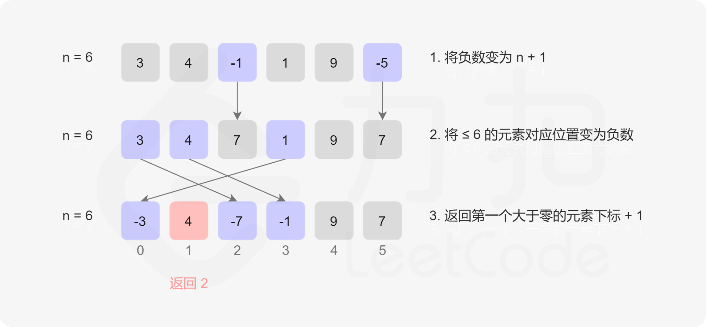
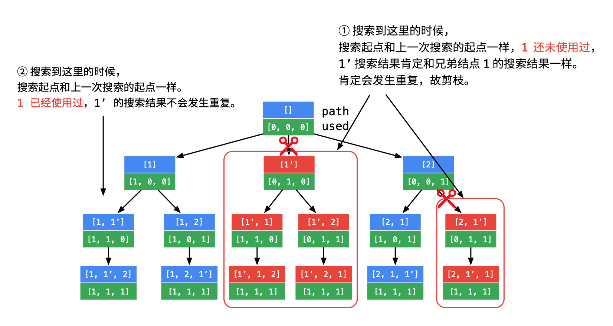

# 综述

- 按照热榜排序，目的是记录一下常问的LeetCode题目。
- cn与com都会涉及。
- 先把简单与中等的处理了，最后再处理困难
- :star: — 经典题|:fearful: — hard题|:new_moon_with_face:  — 脑筋急转弯、数学降维、其他思想降维、各种降维打击|:cry: — 完全没思路

所有题目来源：力扣（LeetCode）
著作权归领扣网络所有。商业转载请联系官方授权，非商业转载请注明出处。


# [1. 两数之和](https://leetcode-cn.com/problems/two-sum/)

给定一个整数数组 `nums` 和一个整数目标值 `target`，请你在该数组中找出 **和为目标值** 的那 **两个** 整数，并返回它们的数组下标。

你可以假设每种输入只会对应一个答案。但是，数组中同一个元素不能使用两遍。

你可以按任意顺序返回答案。

 

**示例 1：**

```
输入：nums = [2,7,11,15], target = 9
输出：[0,1]
解释：因为 nums[0] + nums[1] == 9 ，返回 [0, 1] 。
```

**示例 2：**

```
输入：nums = [3,2,4], target = 6
输出：[1,2]
```

**示例 3：**

```
输入：nums = [3,3], target = 6
输出：[0,1]
```


思路：

由于是要求2个数字相加等于目标数，可以循环nums数组，使用`Map<value, index>`表来存储已经遍历的每一个数字

```java
class Solution {
    public int[] twoSum(int[] nums, int target) {
        Map<Integer, Integer> map = new HashMap<>();
        for (int i = 0; i < nums.length; i++) {
            int complement = target - nums[i];
            if (map.containsKey(complement)) {
                return new int[] { map.get(complement), i };
            }
            map.put(nums[i], i);
        }
        
        return null;
    }
}
```


官方标准

```java
class Solution {
    public int[] twoSum(int[] nums, int target) {
        Map<Integer, Integer> hashtable = new HashMap<Integer, Integer>();
        for (int i = 0; i < nums.length; ++i) {
            if (hashtable.containsKey(target - nums[i])) {
                return new int[]{hashtable.get(target - nums[i]), i};
            }
            hashtable.put(nums[i], i);
        }
        return new int[0];
    }
}


作者：LeetCode-Solution
链接：https://leetcode-cn.com/problems/two-sum/solution/liang-shu-zhi-he-by-leetcode-solution/
来源：力扣（LeetCode）
著作权归作者所有。商业转载请联系作者获得授权，非商业转载请注明出处。
```


# [2. 两数相加](https://leetcode-cn.com/problems/add-two-numbers/)

给你两个 **非空** 的链表，表示两个非负的整数。它们每位数字都是按照 **逆序** 的方式存储的，并且每个节点只能存储 **一位** 数字。

请你将两个数相加，并以相同形式返回一个表示和的链表。

你可以假设除了数字 0 之外，这两个数都不会以 0 开头。

**示例 1：**


```
输入：l1 = [2,4,3], l2 = [5,6,4]
输出：[7,0,8]
解释：342 + 465 = 807.
```

示例 2：
```
输入：l1 = [0], l2 = [0]
输出：[0]
```

示例 3：

```
输入：l1 = [9,9,9,9,9,9,9], l2 = [9,9,9,9]
输出：[8,9,9,9,0,0,0,1]
```


提示：
- 每个链表中的节点数在范围 [1, 100] 内
- 0 <= Node.val <= 9
- 题目数据保证列表表示的数字不含前导零


我的基本想法是，就模拟10进制加法，单独定义个进位标志，一位位算就行。

```java
class Solution {
    public ListNode addTwoNumbers(ListNode l1, ListNode l2) {
        ListNode resultNode = null;
        ListNode temp = null;
        int carryBit = 0;

        while (true){
            int first = 0;
            if (l1 != null){
                first = l1.val;
                l1 = l1.next;
            }

            int sec = 0;
            if (l2 != null){
                sec = l2.val;
                l2 = l2.next;
            }

            int third =  first + sec + carryBit;
            if (third >= 10){
                third = third - 10;
                carryBit = 1;
            }else {
                carryBit = 0;
            }

            ListNode listNode = new ListNode(third);

            if (resultNode == null){
                resultNode = listNode;
                temp = listNode;
            }else {
                temp.next = listNode;
                temp = temp.next;
            }

            if (l1 == null && l2 == null){
                if (carryBit == 1){
                    temp.next = new ListNode(1);
                }
                break;
            }
        }

        return resultNode;
    }
}
```


官方标准

```java
class Solution {
    public ListNode addTwoNumbers(ListNode l1, ListNode l2) {
        ListNode head = null, tail = null;
        int carry = 0;
        while (l1 != null || l2 != null) {
            int n1 = l1 != null ? l1.val : 0;
            int n2 = l2 != null ? l2.val : 0;
            int sum = n1 + n2 + carry;
            if (head == null) {
                head = tail = new ListNode(sum % 10);
            } else {
                tail.next = new ListNode(sum % 10);
                tail = tail.next;
            }
            carry = sum / 10;
            if (l1 != null) {
                l1 = l1.next;
            }
            if (l2 != null) {
                l2 = l2.next;
            }
        }
        if (carry > 0) {
            tail.next = new ListNode(carry);
        }
        return head;
    }
}


作者：LeetCode-Solution
链接：https://leetcode-cn.com/problems/add-two-numbers/solution/liang-shu-xiang-jia-by-leetcode-solution/
来源：力扣（LeetCode）
著作权归作者所有。商业转载请联系作者获得授权，非商业转载请注明出处。
```


# [3. 无重复字符的最长子串](https://leetcode-cn.com/problems/longest-substring-without-repeating-characters/)

给定一个字符串，请你找出其中不含有重复字符的 **最长子串** 的长度。

**示例 1:**

```
输入: s = "abcabcbb"
输出: 3 
解释: 因为无重复字符的最长子串是 "abc"，所以其长度为 3。
```

**示例 2:**

```
输入: s = "bbbbb"
输出: 1
解释: 因为无重复字符的最长子串是 "b"，所以其长度为 1。
```

示例 3:

```
输入: s = "pwwkew"
输出: 3
解释: 因为无重复字符的最长子串是 "wke"，所以其长度为 3。
     请注意，你的答案必须是 子串 的长度，"pwke" 是一个子序列，不是子串。
```

**示例 4:**

```
输入: s = ""
输出: 0
```

**提示：**

- `0 <= s.length <= 5 * 104`
- `s` 由英文字母、数字、符号和空格组成


当年的想法应该是看了社区解答的，头尾双指针，遍历字符串的每个字符，如果字符在map中已经存在了，就说明遇到相同的了，那么头指针指向相同字符的下一个字符处，尾指针回溯，清空map。如果不存在就说明是个新的数字，放进map中。每轮遍历都计算一下长度，与记录的最大长度比较。遍历到最后一个字符。

一个明显的问题是，每次遇见相同的头指针都是往前推进1，尾指针则完全回溯了，又需要遍历一遍，这是重复遍历。

```java
class Solution {
    public int lengthOfLongestSubstring(String s) {
        char[] strArray = s.toCharArray();

        int arrayhead = 0;
        int arrayTail = 0;
        int result = 0;
        Map<Character, Integer> map = new HashMap<>();
        for (int i = 0; i < s.length();){
            char str = strArray[i];
            Integer dumpIndex = map.get(str);

            if (dumpIndex != null){
                arrayhead ++;
                i = arrayhead;
                arrayTail = arrayhead;
                map.clear();
            }else {
                map.put(str, i);
                i++;
                arrayTail++;
            }

            if (arrayTail - arrayhead > result){
                result = arrayTail - arrayhead;
            }
        }

        return result;
    }
}
```


官方：**滑动窗口**

如果我们依次递增地枚举子串的起始位置，那么子串的结束位置也是递增的！这里的原因在于，假设我们选择字符串中的第 $k$ 个字符作为起始位置，并且得到了不包含重复字符的最长子串的结束位置为 $rk$。那么当我们选择第 $k+1$ 个字符作为起始位置时，首先从 $k+1$ 到 $rk$ 的字符显然是不重复的，并且由于少了原本的第 $k$ 个字符，我们可以尝试继续增大 $rk$，直到右侧出现了重复字符为止。

这样一来，我们就可以使用「滑动窗口」来解决这个问题了：

- 我们使用两个指针表示字符串中的某个子串（或窗口）的左右边界，其中左指针代表着上文中「枚举子串的起始位置」，而右指针即为上文中的$rk$ ；

- 在每一步的操作中，我们会将左指针向右移动一格，表示 **我们开始枚举下一个字符作为起始位置**，然后我们可以不断地向右移动右指针，但需要保证这两个指针对应的子串中没有重复的字符。在移动结束后，这个子串就对应着 **以左指针开始的，不包含重复字符的最长子串**。我们记录下这个子串的长度；

- 在枚举结束后，我们找到的最长的子串的长度即为答案。

  

**判断重复字符**

在上面的流程中，我们还需要使用一种数据结构来判断 是否有重复的字符，常用的数据结构为哈希集合（即 C++ 中的 std::unordered_set，Java 中的 HashSet，Python 中的 set, JavaScript 中的 Set）。在左指针向右移动的时候，我们从哈希集合中移除一个字符，在右指针向右移动的时候，我们往哈希集合中添加一个字符。

```java
class Solution {
    public int lengthOfLongestSubstring(String s) {
        // 哈希集合，记录每个字符是否出现过
        Set<Character> occ = new HashSet<Character>();
        int n = s.length();
        // 右指针，初始值为 -1，相当于我们在字符串的左边界的左侧，还没有开始移动
        int rk = -1, ans = 0;
        for (int i = 0; i < n; ++i) {
            if (i != 0) {
                // 左指针向右移动一格，移除一个字符
                occ.remove(s.charAt(i - 1));
            }
            while (rk + 1 < n && !occ.contains(s.charAt(rk + 1))) {
                // 不断地移动右指针
                occ.add(s.charAt(rk + 1));
                ++rk;
            }
            // 第 i 到 rk 个字符是一个极长的无重复字符子串
            ans = Math.max(ans, rk - i + 1);
        }
        return ans;
    }
}


作者：LeetCode-Solution
链接：https://leetcode-cn.com/problems/longest-substring-without-repeating-characters/solution/wu-zhong-fu-zi-fu-de-zui-chang-zi-chuan-by-leetc-2/
来源：力扣（LeetCode）
著作权归作者所有。商业转载请联系作者获得授权，非商业转载请注明出处。
```


# [4. 寻找两个正序数组的中位数](https://leetcode-cn.com/problems/median-of-two-sorted-arrays/) :fearful:


# [5. 最长回文子串](https://leetcode-cn.com/problems/longest-palindromic-substring/)

给你一个字符串 `s`，找到 `s` 中最长的回文子串。

**示例 1：**

```
输入：s = "babad"
输出："bab"
解释："aba" 同样是符合题意的答案。
```

**示例 2：**

```
输入：s = "cbbd"
输出："bb"
```

**示例 3：**

```
输入：s = "a"
输出："a"
```

**示例 4：**

```
输入：s = "ac"
输出："a"
```

**提示：**

- `1 <= s.length <= 10`
- `s` 仅由数字和英文字母（大写和/或小写）组成


又要想起被KMP支配的恐惧，对我来说算法里面的字符串处理是最困难的。

回文是指正着与逆着都一样的字符串。


多年前写的，思路早都忘记了，看代码应该是确定了一头一尾2个指针，一个从前往后，一个从后往前的开始遍历。当遇到不相等的时候，就说明当前的字符串肯定不是回文。然后向前移动一格，继续下一轮比较，如果移动的超出了原字符的最大长度，则缩短一下期待的回文字符串长度，然后又从第一个字符开始判断。

由于是从最大的字符串开始比较的，所以一旦找到一个回文串，那么肯定就是最长的。这样看起来，还是一个滑动窗口，只不过窗口在逐渐的减小。

```java
class Solution {
    public String longestPalindrome(String s) {
        char[] charArray = s.toCharArray();

        int head = 0;
        int scape = s.length();

        while (scape != 0){
            int tail = head + scape;

            boolean f = true;
            for (int i = 0; i < scape/2; i++){
                if (charArray[i + head] != charArray[tail - i - 1]){
                    f = false;
                    break;
                }
            }

            if (f){
                StringBuilder result = new StringBuilder();
                for (int i = head; i <= tail - 1; i++){
                    result.append(charArray[i]);
                }

                return result.toString();
            }else {
                if (tail < s.length()){
                    head ++;
                }else {
                    head = 0;
                    scape--;
                }
            }
        }

        return "";
    }
}
```


官方

给出了4种解法，并且出视频。看几个重要的

- 方法一（暴力解法）
- 方法二（中心扩散）
- 方法三（动态规划）
- 方法四（Manacher 算法）


**动态规划**

对于一个子串而言，如果它是回文串，并且长度大于 $2$，那么将它首尾的两个字母去除之后，它仍然是个回文串。例如对于字符串 $ababa$，如果我们已经知道 $bab$是回文串，那么 $ababa$ 一定是回文串，这是因为它的首尾两个字母都是$a$。

根据这样的思路，我们就可以用动态规划的方法解决本题。我们用 $P(i,j) $表示字符串 $s$ 的第 $i$ 到 $j$ 个字母组成的串（下文表示成 $s[i:j]$是否为回文串：
$$
P(i,j)=\begin{cases} true，如果子串 Si​…Sj​ 是回文串\\ false， 其他情况\end{cases}
$$
这里的「其它情况」包含两种可能性：

- $s[i,j]$本身不是一个回文串；
- $i>j$，此时 $s[i,j]$本身不合法。

那么我们就可以写出动态规划的状态转移方程：
$$
P(i,j)=P(i+1,j−1)∧(Si​==Sj​)
$$
也就是说，只有 $s[i+1:j−1]$是回文串，并且 $s$的第 $i$ 和 $j$ 个字母相同时，$s[i:j]$ 才会是回文串。

上文的所有讨论是建立在子串长度大于 2 的前提之上的，我们还需要考虑动态规划中的边界条件，即子串的长度为 1 或 2。对于长度为 1 的子串，它显然是个回文串；对于长度为 2 的子串，只要它的两个字母相同，它就是一个回文串。因此我们就可以写出动态规划的边界条件：

$$
\begin{cases} P(i,i) = true\\ P(i, i+1) = (Si​==Sj​)\end{cases}
$$
根据这个思路，我们就可以完成动态规划了，最终的答案即为所有 $P(i,j)=true$中 $j−i+1$（即子串长度）的最大值。注意：在状态转移方程中，我们是从长度较短的字符串向长度较长的字符串进行转移的，因此一定要注意动态规划的循环顺序。

```java
class Solution {
    public String longestPalindrome(String s) {
        int n = s.length();
        boolean[][] dp = new boolean[n][n];
        String ans = "";
        for (int l = 0; l < n; ++l) {
            for (int i = 0; i + l < n; ++i) {
                int j = i + l;
                if (l == 0) {
                    dp[i][j] = true;
                } else if (l == 1) {
                    dp[i][j] = (s.charAt(i) == s.charAt(j));
                } else {
                    dp[i][j] = (s.charAt(i) == s.charAt(j) && dp[i + 1][j - 1]);
                }
                if (dp[i][j] && l + 1 > ans.length()) {
                    ans = s.substring(i, i + l + 1);
                }
            }
        }
        return ans;
    }
}


作者：LeetCode-Solution
链接：https://leetcode-cn.com/problems/longest-palindromic-substring/solution/zui-chang-hui-wen-zi-chuan-by-leetcode-solution/
来源：力扣（LeetCode）
著作权归作者所有。商业转载请联系作者获得授权，非商业转载请注明出处。
```

这里的`int l`应该是回文的预期长度。


**方法二：中心扩展算法**

边界情况为子串长度为 1 或 2 的情况。我们枚举每一种边界情况，并从对应的子串开始不断地向两边扩展。如果两边的字母相同，我们就可以继续扩展，例如从 $P(i+1,j-1)$ 扩展到 $P(i,j)$；如果两边的字母不同，我们就可以停止扩展，因为在这之后的子串都不能是回文串了。

「边界情况」对应的子串实际上就是我们「扩展」出的回文串的「回文中心」。方法二的本质即为：我们枚举所有的「回文中心」并尝试「扩展」，直到无法扩展为止，此时的回文串长度即为此「回文中心」下的最长回文串长度。我们对所有的长度求出最大值，即可得到最终的答案。

```java
class Solution {
    public String longestPalindrome(String s) {
        if (s == null || s.length() < 1) {
            return "";
        }
        int start = 0, end = 0;
        for (int i = 0; i < s.length(); i++) {
            int len1 = expandAroundCenter(s, i, i);
            int len2 = expandAroundCenter(s, i, i + 1);
            int len = Math.max(len1, len2);
            if (len > end - start) {
                start = i - (len - 1) / 2;
                end = i + len / 2;
            }
        }
        return s.substring(start, end + 1);
    }

    public int expandAroundCenter(String s, int left, int right) {
        while (left >= 0 && right < s.length() && s.charAt(left) == s.charAt(right)) {
            --left;
            ++right;
        }
        return right - left - 1;
    }
}


作者：LeetCode-Solution
链接：https://leetcode-cn.com/problems/longest-palindromic-substring/solution/zui-chang-hui-wen-zi-chuan-by-leetcode-solution/
来源：力扣（LeetCode）
著作权归作者所有。商业转载请联系作者获得授权，非商业转载请注明出处。
```


# [10. 正则表达式匹配](https://leetcode-cn.com/problems/regular-expression-matching/)​ :fearful:

给你一个字符串 s 和一个字符规律 p，请你来实现一个支持 '.' 和 '\*' 的正则表达式匹配。

    '.' 匹配任意单个字符
    '*' 匹配零个或多个前面的那一个元素

所谓匹配，是要涵盖 整个 字符串 s的，而不是部分字符串。


示例 1：
```
输入：s = "aa" p = "a"
输出：false
解释："a" 无法匹配 "aa" 整个字符串。
```


示例 2:

```
输入：s = "aa" p = "a*"
输出：true
解释：因为 '*' 代表可以匹配零个或多个前面的那一个元素, 在这里前面的元素就是 'a'。因此，字符串 "aa" 可被视为 'a' 重复了一次。
```

示例 3：
```
输入：s = "ab" p = ".*"
输出：true
解释：".*" 表示可匹配零个或多个（'*'）任意字符（'.'）。
```
示例 4：
```
输入：s = "aab" p = "c*a*b"
输出：true
解释：因为 '*' 表示零个或多个，这里 'c' 为 0 个, 'a' 被重复一次。因此可以匹配字符串 "aab"。
```
示例 5：
```
输入：s = "mississippi" p = "mis*is*p*."
输出：false
```


提示：

- 0 <= s.length <= 20
- 0 <= p.length <= 30
- s 可能为空，且只包含从 a-z 的小写字母。
- p 可能为空，且只包含从 a-z 的小写字母，以及字符 . 和 *。
- 保证每次出现字符 * 时，前面都匹配到有效的字符


官方

**方法一：动态规划**

思路与算法

题目中的匹配是一个「逐步匹配」的过程：我们每次从字符串 $p$ 中取出一个字符或者「字符 + 星号」的组合，并在 $s$ 中进行匹配。对于 $p$ 中一个字符而言，它只能在 $s$ 中匹配一个字符，匹配的方法具有唯一性；而对于 $p$ 中字符 + 星号的组合而言，它可以在 $s$ 中匹配任意自然数个字符，并不具有唯一性。因此我们可以考虑使用动态规划，对匹配的方案进行枚举。

**我们用 $f[i][j]$ 表示 $s$ 的前 $i$ 个字符与 $p$ 中的前 $j$ 个字符是否能够匹配。**在进行状态转移时，我们考虑 $p$ 的第 $j$ 个字符的匹配情况：

- 如果 $p$ 的第 $j$ 个字符是一个小写字母，那么我们必须在 $s$ 中匹配一个相同的小写字母，即
  $$
  f[i][j] = \begin{cases} f[i - 1][j - 1], & s[i] = p[j]\\ \text{false}, & s[i] \neq p[j] \end{cases} 
  $$
  也就是说，如果 $s$ 的第 $i$ 个字符与 $p$ 的第 $j$ 个字符不相同，那么无法进行匹配；否则我们可以匹配两个字符串的最后一个字符，完整的匹配结果取决于两个字符串前面的部分。

- 如果 $p$ 的第 $j$ 个字符是 `*`，那么就表示我们可以对 $p$ 的第 $j-1$ 个字符匹配任意自然数次。在匹配 0 次的情况下，我们有
  $$
  f[i][j]=f[i][j−2]
  $$
  也就是我们「浪费」了一个字符 + 星号的组合，没有匹配任何 $s$ 中的字符。

  在匹配 1,2,3, \cdots$次的情况下，类似地我们有

  $$
  \begin{aligned} & f[i][j] = f[i - 1][j - 2], \quad && \text{if~} s[i] = p[j - 1] \\ & f[i][j] = f[i - 2][j - 2], \quad && \text{if~} s[i - 1] = s[i] = p[j - 1] \\ & f[i][j] = f[i - 3][j - 2], \quad && \text{if~} s[i - 2] = s[i - 1] = s[i] = p[j - 1] \\ & \cdots\cdots & \end{aligned}
  $$
  如果我们通过这种方法进行转移，那么我们就需要枚举这个组合到底匹配了 $s$ 中的几个字符，会增导致时间复杂度增加，并且代码编写起来十分麻烦。我们不妨换个角度考虑这个问题：字母 + 星号的组合在匹配的过程中，本质上只会有两种情况：

  - 匹配 $s$ 末尾的一个字符，将该字符扔掉，而该组合还可以继续进行匹配；
  - 不匹配字符，将该组合扔掉，不再进行匹配。

  如果按照这个角度进行思考，我们可以写出很精巧的状态转移方程：
  $$
  f[i][j] = \begin{cases} f[i - 1][j] \text{ or } f[i][j - 2], & s[i] = p[j - 1] \\ f[i][j - 2], & s[i] \neq p[j - 1] \end{cases}
  $$

- 在任意情况下，只要 $p[j]$ 是 .，那么 $p[j]$ 一定成功匹配 $s$ 中的任意一个小写字母。

最终的状态转移方程如下：
$$
f[i][j] = \begin{cases} \text{if} (p[j] \neq \text{`*`}) = \begin{cases} f[i - 1][j - 1], & \textit{matches}(s[i], p[j])\\ \text{false}, & \text{otherwise} \end{cases} \\ \text{otherwise} = \begin{cases} f[i - 1][j] \text{ or } f[i][j - 2], & \textit{matches}(s[i], p[j-1]) \\ f[i][j - 2], & \text{otherwise} \end{cases} \end{cases}
$$
其中 $\textit{matches}(x, y)$ 判断两个字符是否匹配的辅助函数。只有当 $y$ 是 . 或者 $x$ 和 $y$ 本身相同时，这两个字符才会匹配。

细节

动态规划的边界条件为 $f[0][0] = \text{true}$，即两个空字符串是可以匹配的。最终的答案即为 $f[m][n]$，其中 $m$ 和 $n$ 分别是字符串 $s$ 和 $p$ 的长度。由于大部分语言中，字符串的字符下标是从 $0$ 开始的，因此在实现上面的状态转移方程时，需要注意状态中每一维下标与实际字符下标的对应关系。

在上面的状态转移方程中，如果字符串 $p$ 中包含一个「字符 + 星号」的组合（例如 a\*），那么在进行状态转移时，会先将 a 进行匹配（当 $p[j]$ 为 a 时），再将 a* 作为整体进行匹配（当 $p[j]$ 为 * 时）。然而，在题目描述中，我们必须将 a* 看成一个整体，因此将 a 进行匹配是不符合题目要求的。看来我们进行了额外的状态转移，这样会对最终的答案产生影响吗？这个问题留给读者进行思考。

```java
class Solution {
    public boolean isMatch(String s, String p) {
        int m = s.length();
        int n = p.length();

        boolean[][] f = new boolean[m + 1][n + 1];
        f[0][0] = true;
        for (int i = 0; i <= m; ++i) {
            for (int j = 1; j <= n; ++j) {
                if (p.charAt(j - 1) == '*') {
                    f[i][j] = f[i][j - 2];
                    if (matches(s, p, i, j - 1)) {
                      // 这个 || 啥意思
                        f[i][j] = f[i][j] || f[i - 1][j];
                    }
                } else {
                    if (matches(s, p, i, j)) {
                        f[i][j] = f[i - 1][j - 1];
                    }
                }
            }
        }
        return f[m][n];
    }

    public boolean matches(String s, String p, int i, int j) {
        if (i == 0) {
            return false;
        }
        if (p.charAt(j - 1) == '.') {
            return true;
        }
        return s.charAt(i - 1) == p.charAt(j - 1);
    }
}


作者：LeetCode-Solution
链接：https://leetcode-cn.com/problems/regular-expression-matching/solution/zheng-ze-biao-da-shi-pi-pei-by-leetcode-solution/
来源：力扣（LeetCode）
著作权归作者所有。商业转载请联系作者获得授权，非商业转载请注明出处。
```


评论区的一个比较好的讲解

状态

首先状态 dp 一定能自己想出来。
`dp[i][j]` 表示 s 的前 i 个是否能被 p 的前 j 个匹配
转移方程

怎么想转移方程？首先想的时候从已经求出了  `dp[i-1][j-1]` 入手，再加上已知 s[i]、p[j]，要想的问题就是怎么去求 dp[i][j]。

已知 `dp[i-1][j-1]` 意思就是前面子串都匹配上了，不知道新的一位的情况。
那就分情况考虑，所以对于新的一位 p[j] s[i] 的值不同，要分情况讨论：

1. 考虑最简单的 `p[j] == s[i] : dp[i][j] = dp[i-1][j-1]`

   然后从 p[j] 可能的情况来考虑，让 p[j]=各种能等于的东西。

2. `p[j] == "." : dp[i][j] = dp[i-1][j-1]`

3. `p[j] ==" * ":`

**第一个难想出来的点：怎么区分 * 的两种讨论情况**

首先给了 *，明白 * 的含义是 匹配零个或多个前面的那一个元素，所以要考虑他前面的元素 p[j-1]。* 跟着他前一个字符走，前一个能匹配上 s[i]，* 才能有用，前一个都不能匹配上 s[i]，* 也无能为力，只能让前一个字符消失，也就是匹配 0 次前一个字符。
所以按照 p[j-1] 和 s[i] 是否相等，我们分为两种情况：
3.1 `p[j-1] != s[i] : dp[i][j] = dp[i][j-2]`

- 这就是刚才说的那种前一个字符匹配不上的情况。
- 比如(ab, abc * )。遇到 * 往前看两个，发现前面 s[i] 的 ab 对 p[j-2] 的 ab 能匹配，虽然后面是 c*，但是可以看做匹配 0 次 c，相当于直接去掉 c *，所以也是 True。注意 (ab, abc**) 是 False。

3.2 `p[j-1] == s[i] or p[j-1] == "."：`

* 前面那个字符，能匹配 s[i]，或者 * 前面那个字符是万能的 .
* 因为 . * 就相当于 . .，那就只要看前面可不可以匹配就行。
* 比如 (##b , ###b *)，或者 ( ##b , ### . * ) 只看 ### 后面一定是能够匹配上的。
* 所以要看 b 和 b * 前面那部分 ## 的地方匹不匹配。

**第二个难想出来的点：怎么判断前面是否匹配**

```
dp[i][j] = dp[i-1][j] // 多个字符匹配的情况	
or dp[i][j] = dp[i][j-1] // 单个字符匹配的情况
or dp[i][j] = dp[i][j-2] // 没有匹配的情况	
```

看 ### 匹不匹配，不是直接只看 ### 匹不匹配，要综合后面的 b b* 来分析
这三种情况是 or 的关系，满足任意一种都可以匹配上，同时是最难以理解的地方：

`dp[i-1][j]` 就是看 s 里 b 多不多， ### 和 ###b * 是否匹配，一旦匹配，s 后面再添个 b 也不影响，因为有 * 在，也就是 ###b 和 ###b *也会匹配。

`dp[i][j-1]` 就是去掉 * 的那部分，###b 和 ###b 是否匹配，比如 qqb qqb

`dp[i][j-2]` 就是 去掉多余的 b\*，p 本身之前的能否匹配，###b 和 ### 是否匹配，比如 qqb qqbb* 之前的 qqb qqb 就可以匹配，那多了的 b * 也无所谓，因为 b * 可以是匹配 0 次 b，相当于 b * 可以直接去掉了。

三种满足一种就能匹配上。

为什么没有 `dp[i-1][j-2]` 的情况？ 就是 ### 和 ### 是否匹配？因为这种情况已经是 `dp[i][j-1]` 的子问题。也就是 `s[i]==p[j-1]`，则 `dp[i-1][j-2]=dp[i][j-1]`。
最后来个归纳：

    如果 p.charAt(j) == s.charAt(i) : dp[i][j] = dp[i-1][j-1]；
    如果 p.charAt(j) == '.' : dp[i][j] = dp[i-1][j-1]；
    如果 p.charAt(j) == '*'：
        如果 p.charAt(j-1) != s.charAt(i) : dp[i][j] = dp[i][j-2] //in this case, a* only counts as empty
        如果 p.charAt(i-1) == s.charAt(i) or p.charAt(i-1) == '.'：
            dp[i][j] = dp[i-1][j] //in this case, a* counts as multiple a
            or dp[i][j] = dp[i][j-1] // in this case, a* counts as single a
            or dp[i][j] = dp[i][j-2] // in this case, a* counts as empty

作者：kao-la-7
链接：https://leetcode-cn.com/problems/regular-expression-matching/solution/dong-tai-gui-hua-zen-yao-cong-0kai-shi-si-kao-da-b/
来源：力扣（LeetCode）
著作权归作者所有。商业转载请联系作者获得授权，非商业转载请注明出处。


# [11. 盛最多水的容器](https://leetcode-cn.com/problems/container-with-most-water/)

给你 n 个非负整数 $a_1，a_2，...，a_n$，每个数代表坐标中的一个点 $(i, ai)$ 。在坐标内画 n 条垂直线，垂直线 i 的两个端点分别为 $(i, ai) $和 $(i, 0)$ 。找出其中的两条线，使得它们与 x 轴共同构成的容器可以容纳最多的水。

说明：你不能倾斜容器。

**示例 1：**


```
输入：[1,8,6,2,5,4,8,3,7]
输出：49 
解释：图中垂直线代表输入数组 [1,8,6,2,5,4,8,3,7]。在此情况下，容器能够容纳水（表示为蓝色部分）的最大值为 49。
```

**示例 2：**

```
输入：height = [1,1]
输出：1
```

**示例 3：**

```
输入：height = [4,3,2,1,4]
输出：16
```

**示例 4：**

```
输入：height = [1,2,1]
输出：2
```

**提示：**

- `n = height.length`
- `2 <= n <= 3 * 104`
- `0 <= height[i] <= 3 * 104`


哦，几年前使用的暴力解法

```java
class Solution {
    public int maxArea(int[] height) {
        int max = 0;
        for (int i = 0 ;i < height.length; i++){
            for (int j = i + 1; j < height.length; j++){
                int area = (j - i) * Math.min(height[i], height[j]);
                max = Math.max(area, max);
            }
        }

        return max;
    }
}

```


官方

**双指针**

先从题目中的示例开始，初始时，左右指针分别指向数组的左右两端，它们可以容纳的水量为 $min⁡(1,7)∗8=8$。

此时我们需要移动一个指针。移动哪一个呢？直觉告诉我们，应该移动对应数字较小的那个指针（即此时的左指针）。这是因为，由于容纳的水量是由
$$
两个指针指向的数字中较小值∗指针之间的距离
$$
决定的。如果我们移动数字较大的那个指针，那么前者「两个指针指向的数字中较小值」不会增加，后者「指针之间的距离」会减小，那么这个乘积会减小。因此，我们移动数字较大的那个指针是不合理的。因此，我们移动 数字较小的那个指针。

```java
public class Solution {
    public int maxArea(int[] height) {
        int l = 0, r = height.length - 1;
        int ans = 0;
        while (l < r) {
            int area = Math.min(height[l], height[r]) * (r - l);
            ans = Math.max(ans, area);
            if (height[l] <= height[r]) {
                ++l;
            }
            else {
                --r;
            }
        }
        return ans;
    }
}


作者：LeetCode-Solution
链接：https://leetcode-cn.com/problems/container-with-most-water/solution/sheng-zui-duo-shui-de-rong-qi-by-leetcode-solution/
来源：力扣（LeetCode）
著作权归作者所有。商业转载请联系作者获得授权，非商业转载请注明出处。
```

其实重点在证明，直接看链接即可。


# [15. 三数之和](https://leetcode-cn.com/problems/3sum/) :star:

给你一个包含 n 个整数的数组 nums，判断 nums 中是否存在三个元素 a，b，c ，使得 $a + b + c = 0$ ？请你找出所有和为 0 且不重复的三元组。

注意：答案中不可以包含重复的三元组。

**示例 1：**

```
输入：nums = [-1,0,1,2,-1,-4]
输出：[[-1,-1,2],[-1,0,1]]
```

**示例 2：**

```
输入：nums = []
输出：[]
```

**示例 3：**

```
输入：nums = [0]
输出：[]
```


多年前做的了，暴力加上一点剪枝，内层循环为两数之和的思路。

```java
class Solution {
    public List<List<Integer>> threeSum(int[] nums) {
        List<List<Integer>> result = new ArrayList<>();
        if (nums.length < 3){
            return result;
        }

        Arrays.sort(nums);
        Map<Integer, Integer> map = new HashMap<>();
        for (int n = 0; n < nums.length; n ++){
            map.put(nums[n], n);
        }

        int length = nums.length;
        int max = nums[nums.length -1];
        int subMax = nums[nums.length -2];
        int pre = nums[0] - 1;

        for (int i = 0; i < length; i++){
            int first = nums[i];

            if (pre == first){
                continue;
            }else {
                pre = first;
            }

            if (first > 0){
                break;
            }

            if ((first + max + subMax) < 0){
                continue;
            }

            int pre2 = nums[0] - 1;
            for (int j = i + 1; j < length; j++){
                int sec = nums[j];

                if (pre2 == sec){
                    continue;
                }else {
                    pre2 = sec;
                }

                if (first + sec > 0){
                    break;
                }

                Integer n = map.get((first + sec) * -1);
                if (n != null && n > j){
                    List<Integer> list = new ArrayList<>();
                    list.add(first);
                    list.add(sec);
                    list.add(nums[n]);
                    result.add(list);
                }
            }
        }

        return result;
    }
}
```


官方

本题与 [1. 两数之和](https://leetcode-cn.com/problems/two-sum/) 类似，是非常经典的面试题，但是做法不尽相同。

**排序 + 双指针**

题目中要求找到所有「不重复」且和为 0 的三元组，这个「不重复」的要求使得我们无法简单地使用三重循环枚举所有的三元组。这是因为在最坏的情况下，数组中的元素全部为 0，即
$$
[0, 0, 0, 0, 0, ..., 0, 0, 0]
$$
任意一个三元组的和都为 0。如果我们直接使用三重循环枚举三元组，会得到 $O(N^3)$ 个满足题目要求的三元组（其中 N 是数组的长度）时间复杂度至少为 $O(N^3)$。在这之后，我们还需要使用哈希表进行去重操作，得到不包含重复三元组的最终答案，又消耗了大量的空间。这个做法的时间复杂度和空间复杂度都很高，因此我们要换一种思路来考虑这个问题。

「不重复」的本质是什么？我们保持三重循环的大框架不变，只需要保证：

- 第二重循环枚举到的元素不小于当前第一重循环枚举到的元素；
  
- 第三重循环枚举到的元素不小于当前第二重循环枚举到的元素。

也就是说，我们枚举的三元组 $(a, b, c)$ 满足 $a \leq b \leq c$，保证了只有 $(a, b, c)$这个顺序会被枚举到，而 $(b, a, c)$、$(c, b, a)$ 等等这些不会，这样就减少了重复。要实现这一点，我们可以将数组中的元素从小到大进行排序，随后使用普通的三重循环就可以满足上面的要求。

同时，对于每一重循环而言，相邻两次枚举的元素不能相同，否则也会造成重复。举个例子，如果排完序的数组为

[0, 1, 2, 2, 2, 3]
 ^  ^  ^

我们使用三重循环枚举到的第一个三元组为$(0, 1, 2)$，如果第三重循环继续枚举下一个元素，那么仍然是三元组 $(0, 1, 2)$，产生了重复。因此我们需要将第三重循环「跳到」下一个不相同的元素，即数组中的最后一个元素 3，枚举三元组 $(0, 1, 3)$。

这种方法的时间复杂度仍然为 $O(N^3)$，毕竟我们还是没有跳出三重循环的大框架。然而它是很容易继续优化的，可以发现，如果我们固定了前两重循环枚举到的元素 a和 b，那么只有唯一的 c 满足 $a+b+c=0$。当第二重循环往后枚举一个元素 $b'$ 时，由于 $b' > b$，那么满足 $a+b'+c'=0$ 的 $c'$ 一定有 $c' < c$，即 $c'$ 在数组中一定出现在 $c$ 的左侧。也就是说，我们可以从小到大枚举 $b$，同时从大到小枚举 $c$，即第二重循环和第三重循环实际上是并列的关系。

有了这样的发现，我们就可以保持第二重循环不变，而将第三重循环变成一个从数组最右端开始向左移动的指针，

这个方法就是我们常说的「双指针」，当我们需要枚举数组中的两个元素时，如果我们发现随着第一个元素的递增，第二个元素是递减的，那么就可以使用双指针的方法，将枚举的时间复杂度从 $O(N^2)$ 减少至 $O(N)$。为什么是 $O(N)$ 呢？这是因为在枚举的过程每一步中，「左指针」会向右移动一个位置（也就是题目中的 bbb），而「右指针」会向左移动若干个位置，这个与数组的元素有关，但我们知道它一共会移动的位置数为 $O(N)$，均摊下来，每次也向左移动一个位置，因此时间复杂度为 $O(N)$。

注意到我们的伪代码中还有第一重循环，时间复杂度为 $O(N)$，因此枚举的总时间复杂度为 $O(N^2)$。由于排序的时间复杂度为 $O(N \log N)$，在渐进意义下小于前者，因此算法的总时间复杂度为 $O(N^2)$。

```java
class Solution {
    public List<List<Integer>> threeSum(int[] nums) {
        int n = nums.length;
        Arrays.sort(nums);
        List<List<Integer>> ans = new ArrayList<List<Integer>>();
        // 枚举 a
        for (int first = 0; first < n; ++first) {
            // 需要和上一次枚举的数不相同
            if (first > 0 && nums[first] == nums[first - 1]) {
                continue;
            }
            // c 对应的指针初始指向数组的最右端
            int third = n - 1;
            int target = -nums[first];
            // 枚举 b
            for (int second = first + 1; second < n; ++second) {
                // 需要和上一次枚举的数不相同
                if (second > first + 1 && nums[second] == nums[second - 1]) {
                    continue;
                }
                // 需要保证 b 的指针在 c 的指针的左侧
                while (second < third && nums[second] + nums[third] > target) {
                    --third;
                }
                // 如果指针重合，随着 b 后续的增加
                // 就不会有满足 a+b+c=0 并且 b<c 的 c 了，可以退出循环
                if (second == third) {
                    break;
                }
                if (nums[second] + nums[third] == target) {
                    List<Integer> list = new ArrayList<Integer>();
                    list.add(nums[first]);
                    list.add(nums[second]);
                    list.add(nums[third]);
                    ans.add(list);
                }
            }
        }
        return ans;
    }
}


作者：LeetCode-Solution
链接：https://leetcode-cn.com/problems/3sum/solution/san-shu-zhi-he-by-leetcode-solution/
来源：力扣（LeetCode）
著作权归作者所有。商业转载请联系作者获得授权，非商业转载请注明出处。
```


# [17. 电话号码的字母组合](https://leetcode-cn.com/problems/letter-combinations-of-a-phone-number/)

给定一个仅包含数字 2-9 的字符串，返回所有它能表示的字母组合。答案可以按 任意顺序 返回。

给出数字到字母的映射如下（与电话按键相同）。注意 1 不对应任何字母。


**示例 1：**

```
输入：digits = "23"
输出：["ad","ae","af","bd","be","bf","cd","ce","cf"]
```

**示例 2：**

```
输入：digits = ""
输出：[]
```

**示例 3：**

```
输入：digits = "2"
输出：["a","b","c"]
```

**提示：**

- `0 <= digits.length <= 4`
- `digits[i]` 是范围 `['2', '9']` 的一个数字。


哦，暴力遍历，内存中存了一下电话盘。

```java
class Solution {
     public List<String> twoNumber(int n, List<String> list){
        Map<Integer, String[]> map = new HashMap<>();
        map.put(2, new String[]{"a", "b", "c"});
        map.put(3, new String[]{"d", "e", "f"});
        map.put(4, new String[]{"g", "h", "i"});
        map.put(5, new String[]{"j", "k", "l"});
        map.put(6, new String[]{"m", "n", "o"});
        map.put(7, new String[]{"p", "q", "r", "s"});
        map.put(8, new String[]{"t", "u", "v"});
        map.put(9, new String[]{"w", "x", "y", "z"});

        String[] alpha = map.get(n);
        if (list.size() == 0){
            for (String s : alpha) {
                list.add(s);
            }

            return list;
        }

        List<String> temp = new ArrayList<>();
        for (String s : alpha) {
            for (String s1 : list) {
                s1 = s1 + s;
                temp.add(s1);
            }
        }

        return temp;
    }

    
    
    public List<String> letterCombinations(String digits) {
        List<String> result = new ArrayList<>();

        for (int index = 0; index < digits.length(); index ++) {
          	// 这里拿到的是ascii码 减去0对应的ascii码 得到对应的数字
            result = twoNumber(digits.charAt(index) - '0', result);
        }

        return result;
        
    }
}
```


官方

**回溯**

首先使用哈希表存储每个数字对应的所有可能的字母，然后进行回溯操作。

回溯过程中维护一个字符串，表示已有的字母排列（如果未遍历完电话号码的所有数字，则已有的字母排列是不完整的）。该字符串初始为空。每次取电话号码的一位数字，从哈希表中获得该数字对应的所有可能的字母，并将其中的一个字母插入到已有的字母排列后面，然后继续处理电话号码的后一位数字，直到处理完电话号码中的所有数字，即得到一个完整的字母排列。然后进行回退操作，遍历其余的字母排列。

回溯算法用于寻找所有的可行解，如果发现一个解不可行，则会舍弃不可行的解。在这道题中，由于每个数字对应的每个字母都可能进入字母组合，因此不存在不可行的解，直接穷举所有的解即可。

```java
class Solution {
    public List<String> letterCombinations(String digits) {
        List<String> combinations = new ArrayList<String>();
        if (digits.length() == 0) {
            return combinations;
        }
        Map<Character, String> phoneMap = new HashMap<Character, String>() {{
            put('2', "abc");
            put('3', "def");
            put('4', "ghi");
            put('5', "jkl");
            put('6', "mno");
            put('7', "pqrs");
            put('8', "tuv");
            put('9', "wxyz");
        }};
        backtrack(combinations, phoneMap, digits, 0, new StringBuffer());
        return combinations;
    }

    public void backtrack(List<String> combinations, Map<Character, String> phoneMap, String digits, int index, StringBuffer combination) {
        if (index == digits.length()) {
            combinations.add(combination.toString());
        } else {
            char digit = digits.charAt(index);
            String letters = phoneMap.get(digit);
            int lettersCount = letters.length();
            for (int i = 0; i < lettersCount; i++) {
                combination.append(letters.charAt(i));
                backtrack(combinations, phoneMap, digits, index + 1, combination);
                combination.deleteCharAt(index);
            }
        }
    }
}


作者：LeetCode-Solution
链接：https://leetcode-cn.com/problems/letter-combinations-of-a-phone-number/solution/dian-hua-hao-ma-de-zi-mu-zu-he-by-leetcode-solutio/
来源：力扣（LeetCode）
著作权归作者所有。商业转载请联系作者获得授权，非商业转载请注明出处。
```


# [19. 删除链表的倒数第 N 个结点](https://leetcode-cn.com/problems/remove-nth-node-from-end-of-list/)

给你一个链表，删除链表的倒数第 `n` 个结点，并且返回链表的头结点。

**进阶：**你能尝试使用一趟扫描实现吗？

**示例 1：**


```
输入：head = [1,2,3,4,5], n = 2
输出：[1,2,3,5]
```

**示例 2：**

```
输入：head = [1], n = 1
输出：[]
```

**示例 3：**

```
输入：head = [1,2], n = 1
输出：[1]
```

**提示：**

- 链表中结点的数目为 `sz`
- `1 <= sz <= 30`
- `0 <= Node.val <= 100`
- `1 <= n <= sz`


非常典型的**快慢指针问题**，两个指针中间保持n的距离，快指针走到底的时候，慢指针所指的节点就是需要踢掉的节点。

几年前用的是空间换时间的做法，用map来缓存节点位置。

```java
/**
 * Definition for singly-linked list.
 * public class ListNode {
 *     int val;
 *     ListNode next;
 *     ListNode(int x) { val = x; }
 * }
 */
class Solution {
    public ListNode removeNthFromEnd(ListNode head, int n) {
        Map<Integer, ListNode> map = new HashMap<>();

        int i = 0;
        while (head != null){
            i++;
            map.put(i, head);
            head = head.next;
        }

        if (i == n){
            //删除头结点
            return map.get(2);
        }else if (n == 1){
            //删除位结点
            map.get(i - 1).next = null;
        }else {
            map.get(i - n).next = map.get(i - n + 2);
        }
        return map.get(1);
    }
}
```


官方

前言

在对链表进行操作时，一种常用的技巧是添加一个哑节点（dummy node），它的 next\textit{next}next 指针指向链表的头节点。这样一来，我们就不需要对头节点进行特殊的判断了。

例如，在本题中，如果我们要删除节点 yyy，我们需要知道节点 yyy 的前驱节点 xxx，并将 xxx 的指针指向 yyy 的后继节点。但由于头节点不存在前驱节点，因此我们需要在删除头节点时进行特殊判断。但如果我们添加了哑节点，那么头节点的前驱节点就是哑节点本身，此时我们就只需要考虑通用的情况即可。

特别地，在某些语言中，由于需要自行对内存进行管理。因此在实际的面试中，对于「是否需要释放被删除节点对应的空间」这一问题，我们需要和面试官进行积极的沟通以达成一致。下面的代码中默认不释放空间。


**方法一：计算链表长度**

一种容易想到的方法是，我们首先从头节点开始对链表进行一次遍历，得到链表的长度 LLL。随后我们再从头节点开始对链表进行一次遍历，当遍历到第 L−n+1L-n+1L−n+1 个节点时，它就是我们需要删除的节点。


**方法二：栈**

思路与算法

我们也可以在遍历链表的同时将所有节点依次入栈。根据栈「先进后出」的原则，我们弹出栈的第 n 个节点就是需要删除的节点，并且目前栈顶的节点就是待删除节点的前驱节点。这样一来，删除操作就变得十分方便了。


**方法三：双指针**

思路与算法

我们也可以在不预处理出链表的长度，以及使用常数空间的前提下解决本题。

由于我们需要找到倒数第 $n$ 个节点，因此我们可以使用两个指针 $first$ 和 $second$ 同时对链表进行遍历，并且  $first$  比 $second$  超前 n 个节点。当 $first$ 遍历到链表的末尾时，$second$ 就恰好处于倒数第 n 个节点。

具体地，初始时 $first$ 和 $second$均指向头节点。我们首先使用 $first $ 对链表进行遍历，遍历的次数为 $n$。此时，$first$ 和 $second$之间间隔了 $n-1$ 个节点，即 $first$ 比 $second$超前了 $n$ 个节点。

在这之后，我们同时使用 $first$ 和 $second$对链表进行遍历。当 $first$ 遍历到链表的末尾（即 $first$ 为空指针）时，$second$恰好指向倒数第 $n$ 个节点。

根据方法一和方法二，如果我们能够得到的是倒数第 $n$ 个节点的前驱节点而不是倒数第 $n$ 个节点的话，删除操作会更加方便。因此我们可以考虑在初始时将 $second$指向哑节点，其余的操作步骤不变。这样一来，当 $first$ 遍历到链表的末尾时，$second$的下一个节点就是我们需要删除的节点。

```java
class Solution {
    public ListNode removeNthFromEnd(ListNode head, int n) {
        ListNode dummy = new ListNode(0, head);
        ListNode first = head;
        ListNode second = dummy;
        for (int i = 0; i < n; ++i) {
            first = first.next;
        }
        while (first != null) {
            first = first.next;
            second = second.next;
        }
        second.next = second.next.next;
        ListNode ans = dummy.next;
        return ans;
    }
}


作者：LeetCode-Solution
链接：https://leetcode-cn.com/problems/remove-nth-node-from-end-of-list/solution/shan-chu-lian-biao-de-dao-shu-di-nge-jie-dian-b-61/
来源：力扣（LeetCode）
著作权归作者所有。商业转载请联系作者获得授权，非商业转载请注明出处。
```


# [20. 有效的括号](https://leetcode-cn.com/problems/valid-parentheses/)

给定一个只包括 '('，')'，'{'，'}'，'['，']' 的字符串 s ，判断字符串是否有效。

有效字符串需满足：

- 左括号必须用相同类型的右括号闭合。
- 左括号必须以正确的顺序闭合。

**示例 1：**

```
输入：s = "()"
输出：true
```

**示例 2：**

```
输入：s = "()[]{}"
输出：true
```

**示例 3：**

```
输入：s = "(]"
输出：false
```

**示例 4：**

```
输入：s = "([)]"
输出：false
```

**示例 5：**

```
输入：s = "{[]}"
输出：true
```


看到这种括号匹配，脑子里第一个想法就是用栈来实现。这里的做法也是使用一个list来模拟栈，如果是左半边括号就入栈，是右半边括号就出栈，然后对比一下两个符号是否匹配。

```java
class Solution {
    public boolean isValid(String s) {
        if (s == null || "".equals(s)){
            return true;
        }
        
        if (s.length() == 1){
            return false;
        }

        List<String> list = new ArrayList<>();
        for (int i = 0; i < s.length(); i++){
            String heses = String.valueOf(s.charAt(i));

            if (heses.equals("(") || heses.equals("[") || heses.equals("{")  ){
                list.add(heses);
            }else {
                if (list.size() == 0){
                    return false;
                }
                
                String left = list.get(list.size() - 1);

                if (heses.equals(")") && left.equals("(")){
                    list.remove(list.size() - 1);
                }else if (heses.equals("]") && left.equals("[")){
                    list.remove(list.size() - 1);
                }else if (heses.equals("}") && left.equals("{")){
                    list.remove(list.size() - 1);
                }else {
                    return false;
                }
            }
        }

        return list.size() == 0;
    }
}
```


官方

**栈**

判断括号的有效性可以使用「栈」这一数据结构来解决。

我们遍历给定的字符串 $s$。当我们遇到一个左括号时，我们会期望在后续的遍历中，有一个相同类型的右括号将其闭合。由于后遇到的左括号要先闭合，因此我们可以将这个左括号放入栈顶。

当我们遇到一个右括号时，我们需要将一个相同类型的左括号闭合。此时，我们可以取出栈顶的左括号并判断它们是否是相同类型的括号。如果不是相同的类型，或者栈中并没有左括号，那么字符串 $s$ 无效，返回 $False$。为了快速判断括号的类型，我们可以使用哈希表存储每一种括号。哈希表的键为右括号，值为相同类型的左括号。

在遍历结束后，如果栈中没有左括号，说明我们将字符串 $s$ 中的所有左括号闭合，返回 $True$，否则返回 $False$。

注意到有效字符串的长度一定为偶数，因此如果字符串的长度为奇数，我们可以直接返回 $False$，省去后续的遍历判断过程。

```java
class Solution {
    public boolean isValid(String s) {
        int n = s.length();
        if (n % 2 == 1) {
            return false;
        }

        Map<Character, Character> pairs = new HashMap<Character, Character>() {{
            put(')', '(');
            put(']', '[');
            put('}', '{');
        }};
        Deque<Character> stack = new LinkedList<Character>();
        for (int i = 0; i < n; i++) {
            char ch = s.charAt(i);
            if (pairs.containsKey(ch)) {
                if (stack.isEmpty() || stack.peek() != pairs.get(ch)) {
                    return false;
                }
                stack.pop();
            } else {
                stack.push(ch);
            }
        }
        return stack.isEmpty();
    }
}


作者：LeetCode-Solution
链接：https://leetcode-cn.com/problems/valid-parentheses/solution/you-xiao-de-gua-hao-by-leetcode-solution/
来源：力扣（LeetCode）
著作权归作者所有。商业转载请联系作者获得授权，非商业转载请注明出处。
```


# [21. 合并两个有序链表](https://leetcode-cn.com/problems/merge-two-sorted-lists/)

将两个升序链表合并为一个新的 **升序** 链表并返回。新链表是通过拼接给定的两个链表的所有节点组成的。

**示例 1：**


```
输入：l1 = [1,2,4], l2 = [1,3,4]
输出：[1,1,2,3,4,4]
```

**示例 2：**

```
输入：l1 = [], l2 = []
输出：[]
```

**示例 3：**

```
输入：l1 = [], l2 = [0]
输出：[0]
```

提示：

- 两个链表的节点数目范围是 [0, 50]
- -100 <= Node.val <= 100
- l1 和 l2 均按 非递减顺序 排列


思路比较明显，两个指针分别指向每个链表的头节点，在一个大while中比较判断，哪个指针的数字比较大。

```java
/**
 * Definition for singly-linked list.
 * public class ListNode {
 *     int val;
 *     ListNode next;
 *     ListNode(int x) { val = x; }
 * }
 */
class Solution {
    public ListNode mergeTwoLists(ListNode l1, ListNode l2) {
        ListNode listNode = new ListNode(0);
        ListNode first = listNode;

        while (l1 != null && l2 != null){
            if (l1.val < l2.val){
                listNode.next = new ListNode(l1.val);
                l1 = l1.next;
            }else {
                listNode.next = new ListNode(l2.val);
                l2 = l2.next;
            }
            listNode = listNode.next;
        }

        if (l1 != null){
            listNode.next = l1;
        }

        if (l2 != null){
            listNode.next = l2;
        }

        return first.next;
    }
}
```


官方

```java
class Solution {
    public ListNode mergeTwoLists(ListNode l1, ListNode l2) {
        ListNode prehead = new ListNode(-1);

        ListNode prev = prehead;
        while (l1 != null && l2 != null) {
            if (l1.val <= l2.val) {
                prev.next = l1;
                l1 = l1.next;
            } else {
                prev.next = l2;
                l2 = l2.next;
            }
            prev = prev.next;
        }

        // 合并后 l1 和 l2 最多只有一个还未被合并完，我们直接将链表末尾指向未合并完的链表即可
        prev.next = l1 == null ? l2 : l1;

        return prehead.next;
    }
}


作者：LeetCode-Solution
链接：https://leetcode-cn.com/problems/merge-two-sorted-lists/solution/he-bing-liang-ge-you-xu-lian-biao-by-leetcode-solu/
来源：力扣（LeetCode）
著作权归作者所有。商业转载请联系作者获得授权，非商业转载请注明出处。
```


# [22. 括号生成](https://leetcode-cn.com/problems/generate-parentheses/) :star:

数字 `n` 代表生成括号的对数，请你设计一个函数，用于能够生成所有可能的并且 **有效的** 括号组合。

**示例 1：**

```
输入：n = 3
输出：["((()))","(()())","(())()","()(())","()()()"]
```

**示例 2：**

```
输入：n = 1
输出：["()"]
```

**提示：**

- `1 <= n <= 8`


第一直觉就是动态规划。

评论区高赞的思路

```java
class Solution {
    private List<String> res = new ArrayList<>();

    public List<String> generateParenthesis(int n) {
        dfs("", n, n);
        return res;
    }

    public void dfs(String str, int left, int right){
        if (left == 0 && right == 0){
            res.add(str);
            return;
        }

        if (left == right){
            dfs(str + "(", left - 1, right);
        // 这里当本次dfs弹出后(())会有个类似的结构，此时要弹出了，不能给有括号了
        }else {// <- 就右边这个if，可以没有
          	// 按照当前的递归，当左右括号相等时都是先给个左括号了
          	// 剩余的左括号数永远都是少于右括号数的
            if (left > 0){
                dfs(str + "(", left - 1, right);
            }
            dfs(str + ")", left, right - 1);
        }
    }
}
```


官方的没怎么看懂，评论区高赞的：

> 递归（深度优先）+ 剪枝
>
> 剩余左括号总数要小于等于右括号。 递归把所有符合要求的加上去就行了

```java
		class Solution {
        List<String> res = new ArrayList<>();
        public List<String> generateParenthesis(int n) {
            if(n <= 0){
                return res;
            }
            getParenthesis("",n,n);
            return res;
        }

        private void getParenthesis(String str,int left, int right) {
            if(left == 0 && right == 0 ){
                res.add(str);
                return;
            }
            if(left == right){
                //剩余左右括号数相等，下一个只能用左括号
                getParenthesis(str+"(",left-1,right);
            }else if(left < right){
                //剩余左括号小于右括号，下一个可以用左括号也可以用右括号
                if(left > 0){
                    getParenthesis(str+"(",left-1,right);
                }
                getParenthesis(str+")",left,right-1);
            }
        }
    }

https://leetcode-cn.com/problems/generate-parentheses/solution/gua-hao-sheng-cheng-by-leetcode-solution/540232
```


当然也可以使用广度优先

```java
import java.util.ArrayDeque;
import java.util.ArrayList;
import java.util.Deque;
import java.util.LinkedList;
import java.util.List;
import java.util.Queue;

public class Solution {

    class Node {
        /**
         * 当前得到的字符串
         */
        private String res;
        /**
         * 剩余左括号数量
         */
        private int left;
        /**
         * 剩余右括号数量
         */
        private int right;

        public Node(String str, int left, int right) {
            this.res = str;
            this.left = left;
            this.right = right;
        }
    }

    public List<String> generateParenthesis(int n) {
        List<String> res = new ArrayList<>();
        if (n == 0) {
            return res;
        }
        Queue<Node> queue = new LinkedList<>();
        queue.offer(new Node("", n, n));

        while (!queue.isEmpty()) {
            Node curNode = queue.poll();
            if (curNode.left == 0 && curNode.right == 0) {
                res.add(curNode.res);
            }
            if (curNode.left > 0) {
                queue.offer(new Node(curNode.res + "(", curNode.left - 1, curNode.right));
            }
          	// 由于是先dfs的左边括号，按理来说 curNode.left < curNode.right 一直都是成立的
          	// 写 curNode.left != curNode.right 保证相等的时候左边先放就行了
            if (curNode.right > 0 && curNode.left < curNode.right) {
                queue.offer(new Node(curNode.res + ")", curNode.left, curNode.right - 1));
            }
        }
        return res;
    }
}


作者：liweiwei1419
链接：https://leetcode-cn.com/problems/generate-parentheses/solution/hui-su-suan-fa-by-liweiwei1419/
来源：力扣（LeetCode）
著作权归作者所有。商业转载请联系作者获得授权，非商业转载请注明出处。
```

作为对比，贴一个同样写法的深度优先，仅仅是把 `Queue` 换成了 `Stack` ，广度优先遍历就改成了深度优先遍历。）

```java
import java.util.ArrayDeque;
import java.util.ArrayList;
import java.util.Deque;
import java.util.LinkedList;
import java.util.List;
import java.util.Queue;
import java.util.Stack;

public class Solution {

    class Node {
        /**
         * 当前得到的字符串
         */
        private String res;
        /**
         * 剩余左括号数量
         */
        private int left;
        /**
         * 剩余右括号数量
         */
        private int right;

        public Node(String str, int left, int right) {
            this.res = str;
            this.left = left;
            this.right = right;
        }
    }
    
    // 注意：这是深度优先遍历

    public List<String> generateParenthesis(int n) {
        List<String> res = new ArrayList<>();
        if (n == 0) {
            return res;
        }

        // 查看了 Stack 源码，官方推荐使用 Deque 对象，
        // 注意：只使用栈相关的接口，即只使用 `addLast()` 和 `removeLast()`
        Deque<Node> stack = new ArrayDeque<>();
        stack.addLast(new Node("", n, n));

        while (!stack.isEmpty()) {

            Node curNode = stack.removeLast();
            if (curNode.left == 0 && curNode.right == 0) {
                res.add(curNode.res);
            }
            if (curNode.left > 0) {
                stack.addLast(new Node(curNode.res + "(", curNode.left - 1, curNode.right));
            }
            if (curNode.right > 0 && curNode.left < curNode.right) {
                stack.addLast(new Node(curNode.res + ")", curNode.left, curNode.right - 1));
            }
        }
        return res;
    }
}


作者：liweiwei1419
链接：https://leetcode-cn.com/problems/generate-parentheses/solution/hui-su-suan-fa-by-liweiwei1419/
来源：力扣（LeetCode）
著作权归作者所有。商业转载请联系作者获得授权，非商业转载请注明出处。
```


dp

> 思路：
>
> 当我们清楚所有 i<n 时括号的可能生成排列后，对与 i=n 的情况，我们考虑整个括号排列中最左边的括号。
> 它一定是一个左括号，那么它可以和它对应的右括号组成一组完整的括号 "( )"，我们认为这一组是相比 n-1 增加进来的括号。
>
> 那么，剩下 n-1 组括号有可能在哪呢？
>
> 【这里是重点，请着重理解】
>
> 剩下的括号要么在这一组新增的括号内部，要么在这一组新增括号的外部（右侧）。
>
> 既然知道了 i<n 的情况，那我们就可以对所有情况进行遍历：
>
> "(" + 【i=p时所有括号的排列组合】 + ")" + 【i=q时所有括号的排列组合】
>
> 其中 p + q = n-1，且 p q 均为非负整数。
>
> 事实上，当上述 p 从 0 取到 n-1，q 从 n-1 取到 0 后，所有情况就遍历完了。
>
> 注：上述遍历是没有重复情况出现的，即当 (p1,q1)≠(p2,q2) 时，按上述方式取的括号组合一定不同。
>
> 作者：yuyu-13
> 链接：https://leetcode-cn.com/problems/generate-parentheses/solution/zui-jian-dan-yi-dong-de-dong-tai-gui-hua-bu-lun-da/
> 来源：力扣（LeetCode）
> 著作权归作者所有。商业转载请联系作者获得授权，非商业转载请注明出处。

```java
    public List<String> generateParenthesis(int n) {
        LinkedList<LinkedList<String>> result = new LinkedList<LinkedList<String>>();
        if (n == 0)
            return result.get(0);
        LinkedList<String> list0 = new LinkedList<String>();
        list0.add("");
        result.add(list0);
        LinkedList<String> list1 = new LinkedList<String>();
        list1.add("()");
        result.add(list1);
        for (int i = 2; i <= n; i++) {
            LinkedList<String> temp = new LinkedList<String>();
            for (int j = 0; j < i; j++) {
                List<String> str1 = result.get(j);
                List<String> str2 = result.get(i - 1 - j);
                for (String s1 : str1) {
                    for (String s2 : str2) {
                        String el = "(" + s1 + ")" + s2;
                        temp.add(el);
                    }
                }

            }
            result.add(temp);
        }
        return result.get(n);
    }

作者：蓝亚之舟
链接：https://leetcode-cn.com/problems/generate-parentheses/solution/zui-jian-dan-yi-dong-de-dong-tai-gui-hua-bu-lun-da/125850
来源：力扣（LeetCode）
著作权归作者所有。商业转载请联系作者获得授权，非商业转载请注明出处。
```


这就是官方递归做法的反向思考，递归转dp的经典思路。这样理解

任何一个括号序列都一定是由 `(` 开头，并且第一个 `(` 一定有一个唯一与之对应的`)`。这样一来，每一个括号序列可以用$(a)b$  来表示，其中 a 与 b 分别是一个合法的括号序列（可以为空）。

那么，如果传入的n = 3，说明需要生成3对括号，6个括弧，需要生成所有长度为 `2 * n` 的括号序列。

- 那么dp的思路类似与数学归纳法，要求3先求2，1对括号与0对括号的情况预先写死。这是最外层for的解释。
- 第二次for，遍历$(a)b$  中a的括号对数量，相应的a的数量确定了，就可以确定b的括号对数量。`str1`与`str2`中分别放了a和b所有的组合可能。
- 最后2个for，遍历a和b的所有可能组合。


# [23. 合并K个升序链表](https://leetcode-cn.com/problems/merge-k-sorted-lists/)​ :fearful:

给你一个链表数组，每个链表都已经按升序排列。

请你将所有链表合并到一个升序链表中，返回合并后的链表。

**示例 1：**

```
输入：lists = [[1,4,5],[1,3,4],[2,6]]
输出：[1,1,2,3,4,4,5,6]
解释：链表数组如下：
[
  1->4->5,
  1->3->4,
  2->6
]
将它们合并到一个有序链表中得到。
1->1->2->3->4->4->5->6
```

**示例 2：**

```
输入：lists = []
输出：[]
```

**示例 3：**

```
输入：lists = [[]]
输出：[]
```

**提示：**

- `k == lists.length`
- `0 <= k <= 10^4`
- `0 <= lists[i].length <= 500`
- `-10^4 <= lists[i][j] <= 10^4`
- `lists[i]` 按 **升序** 排列
- `lists[i].length` 的总和不超过 `10^4`


最多10个链表进行合并，21题多指针的思路就不合适了。初步的想法是用一个小顶堆，每次弹出最小的那个节点。


官方

**方法一：顺序合并**

我们可以想到一种最朴素的方法：用一个变量 ans 来维护以及合并的链表，第 i 次循环把第 i 个链表和 ans 合并，答案保存到 ans 中。


**方法二：分治合并**

考虑优化方法一，用分治的方法进行合并。

将 k 个链表配对并将同一对中的链表合并；
第一轮合并以后， k 个链表被合并成了 $\frac{k}{2}$ 个链表，平均长度为 $\frac{2n}{k}$，然后是 $\frac{k}{4}$ 个链表， $\frac{k}{8}$ 个链表等等；
重复这一过程，直到我们得到了最终的有序链表。


**方法三：使用优先队列合并**

这个方法和前两种方法的思路有所不同，我们需要维护当前每个链表没有被合并的元素的最前面一个，k 个链表就最多有 k 个满足这样条件的元素，每次在这些元素里面选取 val 属性最小的元素合并到答案中。在选取最小元素的时候，我们可以用优先队列来优化这个过程。

```java
class Solution {
    PriorityQueue<Status> queue = new PriorityQueue<>((x,y)->x.val-y.val);

    public ListNode mergeKLists(ListNode[] lists) {
        for (ListNode node: lists) {
            if (node != null) {
                queue.offer(new Status(node.val, node));
            }
        }
        ListNode head = new ListNode(0);
        ListNode tail = head;
        while (!queue.isEmpty()) {
            tail.next = queue.poll();
            tail = tail.next;
            if (tail.next != null) {
                queue.offer(tail.next);
            }
        }
        return head.next;
    }
}


作者：LeetCode-Solution
链接：https://leetcode-cn.com/problems/merge-k-sorted-lists/solution/he-bing-kge-pai-xu-lian-biao-by-leetcode-solutio-2/
来源：力扣（LeetCode）
著作权归作者所有。商业转载请联系作者获得授权，非商业转载请注明出处。
```


# [28. 实现 strStr()](https://leetcode-cn.com/problems/implement-strstr/)
实现 strStr() 函数。
给你两个字符串 haystack 和 needle ，请你在 haystack 字符串中找出 needle 字符串出现的第一个位置（下标从 0 开始）。如果不存在，则返回  -1 。

**说明：**
当 needle 是空字符串时，我们应当返回什么值呢？这是一个在面试中很好的问题。
对于本题而言，当 needle 是空字符串时我们应当返回 0 。这与 C 语言的 strstr() 以及 Java 的 indexOf() 定义相符。

示例 1：
```
输入：haystack = "hello", needle = "ll"
输出：2
```
示例 2：
```
输入：haystack = "aaaaa", needle = "bba"
输出：-1
```
示例 3：
```
输入：haystack = "", needle = ""
输出：0
```


提示：
- 0 <= haystack.length, needle.length <= 5 * 104
- haystack 和 needle 仅由小写英文字符组成


思考

看到这种字符串匹配就想到了至今没搞明白的kmp。而且本题特喵的就是让你学kmp的啊！详情见算法文档kmp相关章节内容


# [29. 两数相除](https://leetcode-cn.com/problems/divide-two-integers/) :star:

给定两个整数，被除数 dividend 和除数 divisor。将两数相除，要求不使用乘法、除法和 mod 运算符。

返回被除数 dividend 除以除数 divisor 得到的商。

整数除法的结果应当截去（truncate）其小数部分，例如：`truncate(8.345) = 8` 以及 `truncate(-2.7335) = -2`

示例 1:

```
输入: dividend = 10, divisor = 3
输出: 3
解释: 10/3 = truncate(3.33333..) = truncate(3) = 3
```

示例 2:

```
输入: dividend = 7, divisor = -3
输出: -2
解释: 7/-3 = truncate(-2.33333..) = -2
```

**提示**：

- 被除数和除数均为 32 位有符号整数。
- 除数不为 0。
- 假设我们的环境只能存储 32 位有符号整数，其数值范围是 [−231,  231 − 1]。本题中，如果除法结果溢出，则返回 231 − 1。


```java
class Solution {
    public int divide(int dividend, int divisor) {
        if (divisor == 1){
            return dividend;
        }

        if (divisor == -1 && dividend == Integer.MIN_VALUE){
            return Integer.MAX_VALUE;
        }

        int sign = 1;
        if ((divisor < 0 && dividend > 0) || (divisor > 0 && dividend < 0)){
            sign = -1;
        }
        long divid = Math.abs((long) dividend);
        long divis = Math.abs((long) divisor);

        // 有多少个除数
        int ans = 0;
        // 当11 - (6 << 1) < 0 了，所以6就是当前轮最大的除数
        // 就知道了商在 2 - 4 之间
        while (divid >= divis){
            // 最终的目的是要知道有多少个除数
            // 所以每一轮都都要从最小倍数，也就是除数本身开始
            long div = divis;
            // 相当于3的个数
            int m = 1;
            while (divid >= div << 1){
                // 每次除数翻倍，那么相当于3的个数也翻倍了
                div = div << 1;
                m = m << 1;
            }
            // 由于是指数长的，减出来的数也许还能被3除
            divid = divid - div;
            ans = ans + m;
        }

        // 剩下已经不能再被除了
        // 由于都是截取 不再需要进行余数的矫正了
        return sign * ans;
    }
}
执行用时：1 ms, 在所有 Java 提交中击败了100.00% 的用户
内存消耗：35.7 MB, 在所有 Java 提交中击败了24.43% 的用户
```

参考了评论区的各种代码，自己写了一个版本。最繁琐的地方在于边界，由于是使用int，`int i = Integer.MIN_VALUE;` 无论他如何取反，这里都还是 `Integer.MIN_VALUE`，因为已经越界了。所以在允许的情况下还是使用long吧。


评论区

思路

> 越界问题只要对除数是1和-1单独讨论就完事了啊
> 关于如何提高效率快速逼近结果
>
> 举个例子：11 除以 3 。
> 首先11比3大，结果至少是1， 然后我让3翻倍，就是6，发现11比3翻倍后还要大，那么结果就至少是2了，那我让这个6再翻倍，得12，11不比12大，吓死我了，差点让就让刚才的最小解2也翻倍得到4了。但是我知道最终结果肯定在2和4之间。也就是说2再加上某个数，这个数是多少呢？我让11减去刚才最后一次的结果6，剩下5，我们计算5是3的几倍，也就是除法，看，递归出现了。说得很乱，不严谨，大家看个大概，然后自己在纸上画一画，或者直接看我代码就好啦！
>
> 作者：liujin-4
> 链接：https://leetcode-cn.com/problems/divide-two-integers/solution/po-su-de-xiang-fa-mei-you-wei-yun-suan-mei-you-yi-/
> 来源：力扣（LeetCode）
> 著作权归作者所有。商业转载请联系作者获得授权，非商业转载请注明出处。

```java
class Solution {
public:
    int divide(int dividend, int divisor) {
        if (dividend == INT_MIN && divisor == -1) {
            return INT_MAX;
        }
        long dvd = labs(dividend), dvs = labs(divisor), ans = 0;
        int sign = dividend > 0 ^ divisor > 0 ? -1 : 1;
        while (dvd >= dvs) {
            long temp = dvs, m = 1;
            while (temp << 1 <= dvd) {
                temp <<= 1;
                m <<= 1;
            }
            dvd -= temp;
            ans += m;
        }
        return sign * ans;
    }
};

https://leetcode.com/problems/divide-two-integers/discuss/13407/C++-bit-manipulations
```


# [30. 串联所有单词的子串](https://leetcode-cn.com/problems/substring-with-concatenation-of-all-words/) :fearful:

给定一个字符串 s 和一些长度相同的单词 words。找出 s 中恰好可以由 words 中所有单词串联形成的子串的起始位置。

注意子串要与 words 中的单词完全匹配，中间不能有其他字符，但不需要考虑 words 中单词串联的顺序。

 

示例 1：
```
输入：
  s = "barfoothefoobarman",
  words = ["foo","bar"]
输出：[0,9]
解释：
从索引 0 和 9 开始的子串分别是 "barfoo" 和 "foobar" 。
输出的顺序不重要, [9,0] 也是有效答案。
```
示例 2：
```
输入：
  s = "wordgoodgoodgoodbestword",
  words = ["word","good","best","word"]
输出：[]
```


根据评论区思路，由于单词是定长的所以可以直接按单词移动。由于不限制顺序，只判断存在与否，可以同时使用2个map来缓存数据，降低查找复杂度，一个map用来缓存words里面的单词，另外一个map用来存储当前已经匹配上的内容。

todo


评论区高赞

图太多，记录一下主要的思路。

**详细通俗的思路分析，多解法**

**解法一**

首先，最直接的思路，判断每个子串是否符合，符合就把下标保存起来，最后返回即可。

怎么判断子串是否符合？这也是这个题的难点了，由于子串包含的单词顺序并不需要固定，如果是两个单词 A，B，我们只需要判断子串是否是 AB 或者 BA 即可。如果是三个单词 A，B，C 也还好，只需要判断子串是否是 ABC，或者 ACB，BAC，BCA，CAB，CBA 就可以了，但如果更多单词呢？那就崩溃了。

用两个 HashMap 来解决。首先，我们把所有的单词存到 HashMap 里，key 直接存单词，value 存单词出现的个数（因为给出的单词可能会有重复的，所以可能是 1 或 2 或者其他）。然后扫描子串的单词，如果当前扫描的单词在之前的 HashMap 中，就把该单词存到新的 HashMap 中，并判断新的 HashMap 中该单词的 value 是不是大于之前的 HashMap 该单词的 value ，如果大了，就代表该子串不是我们要找的，接着判断下一个子串就可以了。如果不大于，那么我们接着判断下一个单词的情况。子串扫描结束，如果子串的全部单词都符合，那么该子串就是我们找的其中一个。

**解法二**

我们在解法一中，每次移动一个字符。现在为了方便讨论，我们每次移动一个单词的长度，也就是 3 个字符，这样所有的移动被分成了三类。


作者：windliang
链接：https://leetcode-cn.com/problems/substring-with-concatenation-of-all-words/solution/xiang-xi-tong-su-de-si-lu-fen-xi-duo-jie-fa-by-w-6/
来源：力扣（LeetCode）
著作权归作者所有。商业转载请联系作者获得授权，非商业转载请注明出处。


# [31. 下一个排列](https://leetcode-cn.com/problems/next-permutation/) :star:

实现获取 下一个排列 的函数，算法需要将给定数字序列重新排列成字典序中下一个更大的排列。

如果不存在下一个更大的排列，则将数字重新排列成最小的排列（即升序排列）。

必须 原地 修改，只允许使用额外常数空间。


**示例 1：**

```
输入：nums = [1,2,3]
输出：[1,3,2]
```

**示例 2：**

```
输入：nums = [3,2,1]
输出：[1,2,3]
```

**示例 3：**

```
输入：nums = [1,1,5]
输出：[1,5,1]
```

**示例 4：**

```
输入：nums = [1]
输出：[1]
```

**提示：**

- `1 <= nums.length <= 100`
- `0 <= nums[i] <= 100`


这道题首先得知道字典序是什么样的。题目难度较大，不看解析压根想不到需要从后往前处理。

在看懂官方3位的排序规则后，这里再举个例子

[4,5,**2,6,3,1**]  -> [4,5,**3,1,2,6**] -> [4,5,3,**1,6,2**]

可以看到[4,5,2,6,3,1] 从前往后是顺序[4,5]，从后往前也是顺序[6,3,1]，这就表明[2,6,3,1]已经到达了2开头的最大值了，后一个应该是就是次一级的3开头，[3,x,x,x]，后面3位按从小到大重新排序。

[4,5,3,1,2,6]，[1,2,6]的后续为[1,6,2]。

**所以相当于，从后往前找，找到第一个逆序的数字a，然后继续从后往前找，找到第一个比a大的数字b，然后交换他们，在a的原位置之后重新排个序。**

```java
class Solution {
    public void nextPermutation(int[] nums) {
        if (nums.length == 1) return;

        for (int i = nums.length - 2; i >= 0; i--) {
            // 找到逆序的
            if (nums[i] < nums[i + 1]){
                // 继续从最右边的开始找起
                int j = nums.length - 1;
                while (j >= 0){
                    // 由于是逆序的 所以一定会找到一个更大的数
                    if (nums[j] > nums[i]){
                        // 交换
                        int tmp = nums[j];
                        nums[j] = nums[i];
                        nums[i] = tmp;

                        // 排序
                        Arrays.sort(nums, i + 1, nums.length);
                        return;
                    }
                    j--;
                }
            }
        }

        // 如果是全逆序了 相当于是最后一个排序了
        Arrays.sort(nums);
    }
}
执行用时：1 ms, 在所有 Java 提交中击败了98.28% 的用户
内存消耗：38.7 MB, 在所有 Java 提交中击败了50.87% 的用户
```

官方代码写的明显更加的漂亮。


官方

本题要求我们实现一个算法，将给定数字序列重新排列成字典序中下一个更大的排列。

以数字序列 $[1,2,3]$ 为例，其排列按照字典序依次为：

$$
[1,2,3]
$$

$$
[1,3,2]
$$

$$
[2,1,3]
$$

$$
[2,3,1]
$$

$$
[3,1,2]
$$

$$
[3,2,1]
$$

这样，排列 $[2,3,1]$ 的下一个排列即为 $[3,1,2]$。特别的，最大的排列 $[3,2,1]$ 的下一个排列为最小的排列 $[1,2,3]$。


**方法一：两遍扫描**

思路及解法

注意到下一个排列总是比当前排列要大，除非该排列已经是最大的排列。我们希望找到一种方法，能够找到一个大于当前序列的新序列，且变大的幅度尽可能小。具体地：

1. 我们需要将一个左边的「较小数」与一个右边的「较大数」交换，以能够让当前排列变大，从而得到下一个排列。
2. 同时我们要让这个「较小数」尽量靠右，而「较大数」尽可能小。当交换完成后，「较大数」右边的数需要按照升序重新排列。这样可以在保证新排列大于原来排列的情况下，使变大的幅度尽可能小。


以排列 $[4,5,2,6,3,1]$ 为例：

我们能找到的符合条件的一对「较小数」与「较大数」的组合为 2 与 3，满足「较小数」尽量靠右，而「较大数」尽可能小。

当我们完成交换后排列变为 $[4,5,3,6,2,1]$，此时我们可以重排「较小数」右边的序列，序列变为 $[4,5,3,1,2,6]$。


具体地，我们这样描述该算法，对于长度为 $n$ 的排列 $a$：

1. 首先从后向前查找第一个顺序对 $(i,i+1)$，满足 $a[i] < a[i+1]$。这样「较小数」即为 $a[i]$。此时 $[i+1,n)$ 必然是下降序列。
2. 如果找到了顺序对，那么在区间 $[i+1,n)$中从后向前查找第一个元素 $j$ 满足 $a[i] < a[j]$。这样「较大数」即为 $a[j]$。
3. 交换 $a[i]$ 与 $a[j]$，此时可以证明区间$[i+1,n)$ 必为降序。我们可以直接使用双指针**反转区间** $[i+1,n)$使其变为升序，**而无需对该区间进行排序**。


注意

如果在步骤 1 找不到顺序对，说明当前序列已经是一个降序序列，即最大的序列，我们直接跳过步骤 2 执行步骤 3，即可得到最小的升序序列。

该方法支持序列中存在重复元素，且在 C++ 的标准库函数 next_permutation 中被采用。


```java
class Solution {
    public void nextPermutation(int[] nums) {
      	// 从倒数第二格开始，从后往前遍历，找第一个逆序的（从右往左看←）
        int i = nums.length - 2;
        while (i >= 0 && nums[i] >= nums[i + 1]) {
            i--;
        }
        if (i >= 0) {
            int j = nums.length - 1;
            while (j >= 0 && nums[i] >= nums[j]) {
                j--;
            }
            swap(nums, i, j);
        }
        reverse(nums, i + 1);
    }

    public void swap(int[] nums, int i, int j) {
        int temp = nums[i];
        nums[i] = nums[j];
        nums[j] = temp;
    }

    public void reverse(int[] nums, int start) {
        int left = start, right = nums.length - 1;
        while (left < right) {
            swap(nums, left, right);
            left++;
            right--;
        }
    }
}


作者：LeetCode-Solution
链接：https://leetcode-cn.com/problems/next-permutation/solution/xia-yi-ge-pai-lie-by-leetcode-solution/
来源：力扣（LeetCode）
著作权归作者所有。商业转载请联系作者获得授权，非商业转载请注明出处。
```


# [32. 最长有效括号](https://leetcode-cn.com/problems/longest-valid-parentheses/) :fearful::star:

给你一个只包含 `'('` 和 `')'` 的字符串，找出最长有效（格式正确且连续）括号子串的长度。

**示例 1：**

```
输入：s = "(()"
输出：2
解释：最长有效括号子串是 "()"
```

**示例 2：**

```
输入：s = ")()())"
输出：4
解释：最长有效括号子串是 "()()"
```

**示例 3：**

```
输入：s = ""
输出：0
```

**提示：**

- `0 <= s.length <= 3 * 104`
- `s[i]` 为 `'('` 或 `')'`


一道hard，深度优先遍历的就不太合适了，联系22.括号生成的思路来看，第一反应还是dp，找$(a)b$模样的结构。


todo


官方

**方法一：动态规划**

//todo 没太懂

我们定义 $dp[i]$表示以下标 $i$ 字符结尾的最长有效括号的长度。我们将 $dp$ 数组全部初始化为 $0$ 。显然有效的子串一定以 $)$ 结尾，因此我们可以知道以$($ 结尾的子串对应的 $dp$ 值必定为  $0$，我们只需要求解 $)$ 在  $dp[i]$数组中对应位置的值。

我们从前往后遍历字符串求解$dp$值，我们每两个字符检查一次：


1. $s[i]=')'$ 且 $s[i - 1] = '('$，也就是字符串形如 $“……()”$，我们可以推出：

$$
dp[i]=dp[i−2]+2
$$


我们可以进行这样的转移，是因为结束部分的 "()" 是一个有效子字符串，并且将之前有效子字符串的长度增加了 2 。

2. $s[i]='')'$ 且 $s[i−1]=')’$，也就是字符串形如 $“……))”$，我们可以推出：
   如果 $s[i−dp[i−1]−1]='(’$’，那么

$$
dp[i]=dp[i−1]+dp[i−dp[i−1]−2]+2
$$

我们考虑如果倒数第二个 $)$ 是一个有效子字符串的一部分（记作 $sub_s$ ），对于最后一个 $)$  ，如果它是一个更长子字符串的一部分，那么它一定有一个对应的$($ ，且它的位置在倒数第二个$)$所在的有效子字符串的前面（也就是 $sub_s$ 的前面）。因此，如果子字符串  $sub_s$  的前面恰好是 $($，那么我们就用 2 加上  $sub_s$  的长度（$dp[i−1]$）去更新 $dp[i]$。同时，我们也会把有效子串  $sub_s$ 之前的有效子串的长度也加上，也就是再加上 $dp[i−dp[i−1]−2]$。

最后的答案即为 $dp$ 数组中的最大值。

```java
public class Solution {
    public int longestValidParentheses(String s) {
        int maxans = 0;
        int[] dp = new int[s.length()];
        for (int i = 1; i < s.length(); i++) {
            if (s.charAt(i) == ')') {
                if (s.charAt(i - 1) == '(') {
                    dp[i] = (i >= 2 ? dp[i - 2] : 0) + 2;
                } else if (i - dp[i - 1] > 0 && s.charAt(i - dp[i - 1] - 1) == '(') {
                    dp[i] = dp[i - 1] + ((i - dp[i - 1]) >= 2 ? dp[i - dp[i - 1] - 2] : 0) + 2;
                }
                maxans = Math.max(maxans, dp[i]);
            }
        }
        return maxans;
    }
}


作者：LeetCode-Solution
链接：https://leetcode-cn.com/problems/longest-valid-parentheses/solution/zui-chang-you-xiao-gua-hao-by-leetcode-solution/
来源：力扣（LeetCode）
著作权归作者所有。商业转载请联系作者获得授权，非商业转载请注明出处。
```


**方法二：栈**

思路和算法

撇开方法一提及的动态规划方法，相信大多数人对于这题的第一直觉是找到每个可能的子串后判断它的有效性，但这样的时间复杂度会达到 $O(n^3)$，无法通过所有测试用例。但是通过栈，我们可以在遍历给定字符串的过程中去判断到目前为止扫描的子串的有效性，同时能得到最长有效括号的长度。

具体做法是我们始终保持栈底元素为当前已经遍历过的元素中「最后一个没有被匹配的右括号的下标」，这样的做法主要是考虑了边界条件的处理，栈里其他元素维护左括号的下标：

- 对于遇到的每个$ ‘(’$，我们将它的下标放入栈中
- 对于遇到的每个 $‘)’$ ，我们先弹出栈顶元素表示匹配了当前右括号：
  - 如果栈为空，说明当前的右括号为没有被匹配的右括号，我们将其下标放入栈中来更新我们之前提到的「最后一个没有被匹配的右括号的下标」

  - 如果栈不为空，当前右括号的下标减去栈顶元素即为「以该右括号为结尾的最长有效括号的长度」

我们从前往后遍历字符串并更新答案即可。

需要注意的是，如果一开始栈为空，第一个字符为左括号的时候我们会将其放入栈中，这样就不满足提及的「最后一个没有被匹配的右括号的下标」，为了保持统一，我们在一开始的时候往栈中放入一个值为 −1 的元素。

```java
public class Solution {
    public int longestValidParentheses(String s) {
        int maxans = 0;
        Deque<Integer> stack = new LinkedList<Integer>();
        stack.push(-1);
        for (int i = 0; i < s.length(); i++) {
            if (s.charAt(i) == '(') {
                stack.push(i);
            } else {
                stack.pop();
                if (stack.empty()) {
                    stack.push(i);
                } else {
                    maxans = Math.max(maxans, i - stack.peek());
                }
            }
        }
        return maxans;
    }
}


作者：LeetCode-Solution
链接：https://leetcode-cn.com/problems/longest-valid-parentheses/solution/zui-chang-you-xiao-gua-hao-by-leetcode-solution/
来源：力扣（LeetCode）
著作权归作者所有。商业转载请联系作者获得授权，非商业转载请注明出处。
```


**方法三：不需要额外的空间**

思路和算法

在此方法中，我们利用两个计数器 $left$ 和 $right$ 。首先，我们从左到右遍历字符串，对于遇到的每个 $‘(’$，我们增加 $left$ 计数器，对于遇到的每个$‘)’$，我们增加 $right$ 计数器。每当 $left$ 计数器与 $right$ 计数器相等时，我们计算当前有效字符串的长度，并且记录目前为止找到的最长子字符串。当 $right$ 计数器比 $left$ 计数器大时，我们将 $left$ 和 $right$ 计数器同时变回 0。

这样的做法贪心地考虑了以当前字符下标结尾的有效括号长度，每次当右括号数量多于左括号数量的时候之前的字符我们都扔掉不再考虑，重新从下一个字符开始计算，但这样会漏掉一种情况，就是遍历的时候左括号的数量始终大于右括号的数量，即 (() ，这种时候最长有效括号是求不出来的。

解决的方法也很简单，我们只需要从右往左遍历用类似的方法计算即可，只是这个时候判断条件反了过来：

- 当 $left$ 计数器比 $right$ 计数器大时，我们将 $left$ 和 $right$ 计数器同时变回 0
- 当 $left$ 计数器与 $right$ 计数器相等时，我们计算当前有效字符串的长度，并且记录目前为止找到的最长子字符串


这样我们就能涵盖所有情况从而求解出答案。

```java
public class Solution {
    public int longestValidParentheses(String s) {
        int left = 0, right = 0, maxlength = 0;
        for (int i = 0; i < s.length(); i++) {
            if (s.charAt(i) == '(') {
                left++;
            } else {
                right++;
            }
            if (left == right) {
                maxlength = Math.max(maxlength, 2 * right);
            } else if (right > left) {
                left = right = 0;
            }
        }
        left = right = 0;
        for (int i = s.length() - 1; i >= 0; i--) {
            if (s.charAt(i) == '(') {
                left++;
            } else {
                right++;
            }
            if (left == right) {
                maxlength = Math.max(maxlength, 2 * left);
            } else if (left > right) {
                left = right = 0;
            }
        }
        return maxlength;
    }
}


作者：LeetCode-Solution
链接：https://leetcode-cn.com/problems/longest-valid-parentheses/solution/zui-chang-you-xiao-gua-hao-by-leetcode-solution/
来源：力扣（LeetCode）
著作权归作者所有。商业转载请联系作者获得授权，非商业转载请注明出处。
```


# [33. 搜索旋转排序数组](https://leetcode-cn.com/problems/search-in-rotated-sorted-array/)

整数数组 nums 按升序排列，数组中的值**互不相同**。

在传递给函数之前，nums 在预先未知的某个下标 `k（0 <= k < nums.length）`上进行了旋转，使数组变为` [nums[k], nums[k+1], ..., nums[n-1], nums[0], nums[1], ..., nums[k-1]]`（下标从0开始计数）。例如， `[0,1,2,4,5,6,7] `在下标 3 处经旋转后可能变为 `[4,5,6,7,0,1,2] `。

给你 旋转后 的数组 nums 和一个整数 target ，如果 nums 中存在这个目标值 target ，则返回它的索引，否则返回 -1 。

**示例 1：**

```
输入：nums = [4,5,6,7,0,1,2], target = 0
输出：4
```


**示例 2：**

```
输入：nums = [4,5,6,7,0,1,2], target = 3
输出：-1
```


**示例 3：**

```
输入：nums = [1], target = 0
输出：-1
```


提示：

- $1 <= nums.length <= 50$
- $-10^4 <= nums[i] <= 10^4$
- nums 中的每个值都独一无二
- nums 肯定会在某个点上旋转
- $-10^4 <= target <= 10^4$

**进阶：**你可以设计一个时间复杂度为 `O(log n)` 的解决方案吗？


由于已经是递增了，并且数字是唯一的，再加上已经提示是logn了，明显是一个树的查询复杂度，那么可以往二叉查找树上靠。

二分查找，比较中间值与首尾两值的大小，来判断折点在左边还是右边。

- 如果目标值落在了递增的一边，则算法转为二分查找。
- 否则再去另外一边重复上述操作。

```java
class Solution {
    public int search(int[] nums, int target) {
        if (nums == null || nums.length == 0) return -1;

        int leftIndex = 0;
        int rightIndex = nums.length - 1;

        while (leftIndex <= rightIndex){
            int midIndex = (leftIndex + rightIndex) / 2;
            int mid = nums[midIndex];
            if (mid == target){
                return midIndex;
            }
            if (rightIndex - leftIndex == 1){
                if (nums[rightIndex] == target){
                    return rightIndex;
                }
                if (nums[leftIndex] == target){
                    return leftIndex;
                }
            }

            if (nums[leftIndex] < mid){
                if (target >= nums[leftIndex] && target < mid){
                    rightIndex = midIndex - 1;
                }else {
                    leftIndex = midIndex + 1;
                }
            }else {
                if (target > mid && target <= nums[nums.length - 1]){
                    leftIndex = midIndex + 1;
                }else {
                    rightIndex = midIndex - 1;
                }
            }
        }
        return -1;
    }
}
```


官方

也是二分，思路比较简单，考验对边界条件的处理。

常规二分查找的时候查看当前 mid 为分割位置分割出来的两个部分 [l, mid] 和 [mid + 1, r] 哪个部分是有序的，并根据有序的那个部分确定我们该如何改变二分查找的上下界，因为我们能够根据有序的那部分判断出 target 在不在这个部分：

- 如果 [l, mid - 1] 是有序数组，且 target 的大小满足 [nums[l],nums[mid])[\textit{nums}[l],\textit{nums}[mid])[nums[l],nums[mid])，则我们应该将搜索范围缩小至 [l, mid - 1]，否则在 [mid + 1, r] 中寻找。
- 如果 [mid, r] 是有序数组，且 target 的大小满足 (nums[mid+1],nums[r]](\textit{nums}[mid+1],\textit{nums}[r]](nums[mid+1],nums[r]]，则我们应该将搜索范围缩小至 [mid + 1, r]，否则在 [l, mid - 1] 中寻找。

```java
class Solution {
    public int search(int[] nums, int target) {
        int n = nums.length;
        if (n == 0) {
            return -1;
        }
        if (n == 1) {
            return nums[0] == target ? 0 : -1;
        }
        int l = 0, r = n - 1;
        while (l <= r) {
            int mid = (l + r) / 2;
            if (nums[mid] == target) {
                return mid;
            }
            if (nums[0] <= nums[mid]) {
                if (nums[0] <= target && target < nums[mid]) {
                    r = mid - 1;
                } else {
                    l = mid + 1;
                }
            } else {
                if (nums[mid] < target && target <= nums[n - 1]) {
                    l = mid + 1;
                } else {
                    r = mid - 1;
                }
            }
        }
        return -1;
    }
}


作者：LeetCode-Solution
链接：https://leetcode-cn.com/problems/search-in-rotated-sorted-array/solution/sou-suo-xuan-zhuan-pai-xu-shu-zu-by-leetcode-solut/
来源：力扣（LeetCode）
著作权归作者所有。商业转载请联系作者获得授权，非商业转载请注明出处。
```


# [34. 在排序数组中查找元素的第一个和最后一个位置](https://leetcode-cn.com/problems/find-first-and-last-position-of-element-in-sorted-array/)

给定一个按照升序排列的整数数组 nums，和一个目标值 target。找出给定目标值在数组中的开始位置和结束位置。

如果数组中不存在目标值 target，返回 [-1, -1]。

**进阶：**

- 你可以设计并实现时间复杂度为 `O(log n)` 的算法解决此问题吗？

  

**示例 1：**

```
输入：nums = [5,7,7,8,8,10], target = 8
输出：[3,4]
```

**示例 2：**

```
输入：nums = [5,7,7,8,8,10], target = 6
输出：[-1,-1]
```

**示例 3：**

```
输入：nums = [], target = 0
输出：[-1,-1]
```

提示：

- 0 <= nums.length <= 105
- -109 <= nums[i] <= 109
- nums 是一个非递减数组
- -109 <= target <= 109


数组都已经有序了，数字有重复，直接二分啊。

- 取mid位置的值与target进行比较，看一下target落在了哪边。二分找到  `nums[mid] = target `的mid下标。
- 从mid位置双指针向两边走直到nums[i]值与target不同位置，双指针的位置即为下标。

也许，思路很简单，细节很魔鬼。


```java
    public int[] searchRange(int[] nums, int target) {
        int left = 0;
        int right = nums.length - 1;

        int mid = -1;
        while (left <= right) {
            mid = (left + right) / 2;
            if (nums[mid] == target) {
                break;
            }
            if (nums[mid] < target) {
                left = mid + 1;
            } else {
                right = mid - 1;
            }
        }

        if (left > right) {
            return new int[]{-1, -1};
        }

        left = mid;
        right = mid;
        boolean lStop = false;
        boolean rStop = false;

        while (true) {
            if (left < 0 && right > nums.length - 1){
                left++;
                right--;
                break;
            }

            if (lStop && rStop) {
                break;
            }

            if (left - 1 >= 0 && !lStop) {
                if (nums[left - 1] == target) {
                    left--;
                } else {
                    lStop = true;
                }
            }else {
                lStop = true;
            }

            if (right + 1 < nums.length && !rStop) {
                if (nums[right + 1] == target) {
                    right++;
                } else {
                    rStop = true;
                }
            }else {
                rStop = true;
            }
        }

        int[] result = new int[2];
        result[0] = left;
        result[1] = right;
        return result;
    }
```


官方

```java
class Solution {
    public int[] searchRange(int[] nums, int target) {
        int leftIdx = binarySearch(nums, target, true);
        int rightIdx = binarySearch(nums, target, false) - 1;
        if (leftIdx <= rightIdx && rightIdx < nums.length && nums[leftIdx] == target && nums[rightIdx] == target) {
            return new int[]{leftIdx, rightIdx};
        } 
        return new int[]{-1, -1};
    }

    public int binarySearch(int[] nums, int target, boolean lower) {
        int left = 0, right = nums.length - 1, ans = nums.length;
        while (left <= right) {
            int mid = (left + right) / 2;
            if (nums[mid] > target || (lower && nums[mid] >= target)) {
                right = mid - 1;
                ans = mid;
            } else {
                left = mid + 1;
            }
        }
        return ans;
    }
}


作者：LeetCode-Solution
链接：https://leetcode-cn.com/problems/find-first-and-last-position-of-element-in-sorted-array/solution/zai-pai-xu-shu-zu-zhong-cha-zhao-yuan-su-de-di-3-4/
来源：力扣（LeetCode）
著作权归作者所有。商业转载请联系作者获得授权，非商业转载请注明出处。
```

采用从两边逼近的方法，循环两次，分别求出起始与结束位置，再校验位置是否合法。


# [35. 搜索插入位置](https://leetcode-cn.com/problems/search-insert-position/)

给定一个排序数组和一个目标值，在数组中找到目标值，并返回其索引。如果目标值不存在于数组中，返回它将会被按顺序插入的位置。

你可以假设数组中无重复元素。

示例 1:
```
输入: [1,3,5,6], 5
输出: 2
```

示例 2:
```
输入: [1,3,5,6], 2
输出: 1
```

示例 3:
```
输入: [1,3,5,6], 7
输出: 4
```

示例 4:
```
输入: [1,3,5,6], 0
输出: 0
```


顺序查是最好写的，有序二分效率是最高的

```java
    public static int searchInsert(int[] nums, int target) {
        int left = 0;
        int right = nums.length - 1;
        if (target < nums[0]) {
            return 0;
        }

        if (target > nums[right]) {
            return nums.length;
        }

        while (left <= right) {
            if (left + 1 == right) {
                if (nums[left] == target) {
                    return left;
                } else if (nums[right] == target) {
                    return right;
                } else {
                    return left + 1;
                }
            }

            int mid = (left + right) / 2;
            if (nums[mid] == target) {
                return mid;
            }

            if (target > nums[mid]) {
                left = mid;
                continue;
            }

            if (target < nums[mid]) {
                right = mid;
            }
        }

        return -1;
    }
```

写的太复杂了，需要优化写法。


评论区的简单写法

他不去判断`nums[mid]`是否与target相等了，只判断相对大小。

```java
    public static int searchInsert(int[] nums, int target) {
        int n = nums.length;
        int l = 0, r = n - 1;
        while (l <= r) {
            int mid = l + (r - l) / 2;
            if (nums[mid] < target)
                l = mid + 1;
            else r = mid - 1;
        }
        return l;
    }
```


# [36. 有效的数独](https://leetcode-cn.com/problems/valid-sudoku/)

判断一个 9x9 的数独是否有效。只需要根据以下规则，验证已经填入的数字是否有效即可。

1. 数字 1-9 在每一行只能出现一次。
2. 数字 1-9 在每一列只能出现一次。
3. 数字 1-9 在每一个以粗实线分隔的 3x3 宫内只能出现一次。

数独部分空格内已填入了数字，空白格用 `'.'` 表示。

**示例 1:**

输入:

```
[
  ["5","3",".",".","7",".",".",".","."],
  ["6",".",".","1","9","5",".",".","."],
  [".","9","8",".",".",".",".","6","."],
  ["8",".",".",".","6",".",".",".","3"],
  ["4",".",".","8",".","3",".",".","1"],
  ["7",".",".",".","2",".",".",".","6"],
  [".","6",".",".",".",".","2","8","."],
  [".",".",".","4","1","9",".",".","5"],
  [".",".",".",".","8",".",".","7","9"]
]
输出: true
```

**示例 2:**

```
输入:
[
  ["8","3",".",".","7",".",".",".","."],
  ["6",".",".","1","9","5",".",".","."],
  [".","9","8",".",".",".",".","6","."],
  ["8",".",".",".","6",".",".",".","3"],
  ["4",".",".","8",".","3",".",".","1"],
  ["7",".",".",".","2",".",".",".","6"],
  [".","6",".",".",".",".","2","8","."],
  [".",".",".","4","1","9",".",".","5"],
  [".",".",".",".","8",".",".","7","9"]
]
输出: false
解释: 除了第一行的第一个数字从 5 改为 8 以外，空格内其他数字均与 示例1 相同。
     但由于位于左上角的 3x3 宫内有两个 8 存在, 因此这个数独是无效的。
```

**说明:**

- 一个有效的数独（部分已被填充）不一定是可解的。
- 只需要根据以上规则，验证已经填入的数字是否有效即可。
- 给定数独序列只包含数字 1-9 和字符 '.' 。
- 给定数独永远是 9x9 形式的。


这题是验证数独而不是解数独。先遍历每一行，再遍历每一列，再去遍历9个小方块，时间复杂度$O(3n)$，每个数字会访问3遍。

```java
/**
* 遍历一遍 但是存在3个容器里面
*/
public boolean isValidSudoku(char[][] board) {
        // 先遍历行
        Set<Character> set = new HashSet<>();
        Map<Integer, Set<Character>> map = new HashMap<>();
        Map<String, Set<Character>> nineMap = new HashMap<>();
        for (int j = 0; j < board.length; j++) {
            char[] row = board[j];
            for (int i = 0; i < row.length; i++) {
                char col = row[i];
                if (col == '.') continue;
                // 判断行
                if (set.contains(col)){
                    return false;
                }
                set.add(col);

                // 判断列
                Set<Character> characters = map.computeIfAbsent(i, k -> new HashSet<>());
                if (characters.contains(col)){
                    return false;
                }
                characters.add(col);

                // 确定9个九宫格
                // 从左 -> 右排序
                String key = j / 3 + "-" + i / 3;
                Set<Character> nine = nineMap.computeIfAbsent(key, k -> new HashSet<>());
                if (nine.contains(col)){
                    return false;
                }
                nine.add(col);
            }
            set.clear();
        }
        return true;
    }

执行用时：20 ms, 在所有 Java 提交中击败了5.03% 的用户
内存消耗：39 MB, 在所有 Java 提交中击败了6.03% 的用户
```

不能使用 `Map<Integer, Set<Character>>` 因为实在是太慢了，使用二维数组！！！


官方

 **方法：一次迭代**

首先，让我们来讨论下面两个问题：

- 如何枚举子数独？

>  可以使用 `box_index = (row / 3) * 3 + columns / 3`，其中 / 是整数除法。


- 如何确保行 / 列 / 子数独中没有重复项？

  可以利用 value -> count 哈希映射来跟踪所有已经遇到的值。（二维数组就够了）


评论区

```java
class Solution {
    public boolean isValidSudoku(char[][] board) {
        int [][]row  =new int[9][10];
        int [][]col  =new int[9][10];
        int [][]box  =new int[9][10];
        for (int i = 0; i < 9; i++) {
            for (int j = 0; j < 9; j++) {
                if (board[i][j]=='.'){
                    continue;
                }
                int curNum = board[i][j]-'0';
                if (row[i][curNum]==1){
                    return false;
                }if (col[j][curNum]==1){
                    return false;
                }
                if (box[j/3 + (i/3) * 3][curNum]==1){
                    return false;
                }
                row[i][curNum]=1;
                col[j][curNum]=1;
                box[j/3 + (i/3) * 3][curNum]=1;
            }
        }
        return true;
    }
}

https://leetcode-cn.com/problems/valid-sudoku/solution/36-jiu-an-zhao-cong-zuo-wang-you-cong-shang-wang-x/
```


# [38. 外观数列](https://leetcode-cn.com/problems/count-and-say/)

给定一个正整数 n ，输出外观数列的第 n 项。

「外观数列」是一个整数序列，从数字 1 开始，序列中的每一项都是对前一项的描述。

你可以将其视作是由递归公式定义的数字字符串序列：

- countAndSay(1) = "1"
- countAndSay(n) 是对 countAndSay(n-1) 的描述，然后转换成另一个数字字符串。

前五项如下：

```
1.     1
2.     11
3.     21
4.     1211
5.     111221
       第一项是数字 1 
       描述前一项，这个数是 1 即 “ 一 个 1 ”，记作 "11"
       描述前一项，这个数是 11 即 “ 二 个 1 ” ，记作 "21"
       描述前一项，这个数是 21 即 “ 一 个 2 + 一 个 1 ” ，记作 "1211"
       描述前一项，这个数是 1211 即 “ 一 个 1 + 一 个 2 + 二 个 1 ” ，记作 "111221"


```

要 描述 一个数字字符串，首先要将字符串分割为 最小 数量的组，每个组都由连续的最多 相同字符 组成。然后对于每个组，先描述字符的数量，然后描述字符，形成一个描述组。要将描述转换为数字字符串，先将每组中的字符数量用数字替换，再将所有描述组连接起来。


示例 1：
```
输入：n = 1
输出："1"
解释：这是一个基本样例。
```
示例 2：
```
输入：n = 4
输出："1211"
解释：
countAndSay(1) = "1"
countAndSay(2) = 读 "1" = 一 个 1 = "11"
countAndSay(3) = 读 "11" = 二 个 1 = "21"
countAndSay(4) = 读 "21" = 一 个 2 + 一 个 1 = "12" + "11" = "1211"
```


提示：

- 1 <= n <= 30


一道easy做了3个小时，本来的热身题，做成了送命题。

```java
    public String countAndSay(int n) {
        if (n == 1){
            return "1";
        }

        String result = "1";
        while (n > 1){
            result = dfs(result, "", 0, "");
            System.out.println(result);
            n--;
        }

        return String.valueOf(result);
    }

    private String dfs(String n, String dupChar, long dupNum, String result){
        if (n.length() == 0){
            return dupNum + dupChar;
        }

        String remainder;
        if (n.length() == 1){
            remainder = n;
        }else {
            remainder = n.substring(n.length() - 1);
        }
      
      	// 递归从后往前打印每个数字的外观读法
        if (remainder.equals(dupChar)){
          	// 如果和之前的相同，那么统计数字要 + 1
            result = dfs(n.substring(0, n.length() - 1), remainder, dupNum + 1, result);
        }else {
            result = dfs(n.substring(0, n.length() - 1), remainder, 1L, result);
            if (dupNum != 0){
                result = result + dupNum + dupChar;
            }
        }

        return result;
    }
```


提交区

```
    public String countAndSay2(int n) {
        if(n==1){return "1";}
        String s = countAndSay2(n-1);
        StringBuilder result = new StringBuilder();
        int start = 0;
        for(int i=1;i<s.length();i++){
            if(s.charAt(i)!=s.charAt(start)){
            		// 双指针，就正向的往前走，如果两个指针指向的值不同，就在结果集里面记录一下外观描述 
                result.append(i-start).append(s.charAt(start));
                start=i;
            }
        }
        result.append(s.length()-start).append(s.charAt(start));
        return result.toString();
    }
```


# [39. 组合总和](https://leetcode-cn.com/problems/combination-sum/) :star:

给定一个无重复元素的数组 `candidates` 和一个目标数 `target` ，找出 `candidates` 中所有可以使数字和为 `target` 的组合。

`candidates `中的数字可以无限制重复被选取。

说明：

- 所有数字（包括 target）都是正整数。
- 解集不能包含重复的组合。 

**示例 1：**

```
输入：candidates = [2,3,6,7], target = 7,
所求解集为：
[
  [7],
  [2,2,3]
]
```


**示例 2：**

```
输入：candidates = [2,3,5], target = 8,
所求解集为：
[
  [2,2,2,2],
  [2,3,3],
  [3,5]
]
```


提示：

- 1 <= candidates.length <= 30
- 1 <= candidates[i] <= 200
- candidate 中的每个元素都是独一无二的。
- 1 <= target <= 500


思路

看到可以重复使用，第一个想法就是贪心，然后加上回溯与剪枝。先把 `candidates` 排个序，由于无重复，排好后就是严格单调递增。

然后开始枚举，重复取第一个数字，直到总和大于target，则回溯。

```java
public class CombinationSum {
    public static void main(String[] args) {
        CombinationSum combinationSum = new CombinationSum();
//        int[] candidates = {2,3,5};
        int[] candidates = {2,3,6,7};
        List<List<Integer>> lists = combinationSum.combinationSum(candidates, 7);
        for (List<Integer> list : lists) {
            for (Integer integer : list) {
                System.out.println(integer + ",");
            }
            System.out.println("——————");
        }
    }

    List<List<Integer>> result = new ArrayList<>();
    public List<List<Integer>> combinationSum(int[] candidates, int target) {
        Arrays.sort(candidates);
        for (int i = 0; i < candidates.length; i++){
            dfs(candidates, target, new ArrayList<>(), i);
        }
        return result;
    }

    /**
     *
     * @param candidates 原数组
     * @param target 还剩下的目标值 = 原始target - list中的数字和
     * @param list 当前已经存的数字
     * @param cur 当前叠加的数字的下标
     */
    public void dfs(int[] candidates, int target, List<Integer> list, int cur){
        if (0 == target){
            List<Integer> tmp = new ArrayList<>(list);
            result.add(tmp);
            return;
        }

        if (target < 0){
            return;
        }

        if (cur == candidates.length){
            return;
        }

        list.add(candidates[cur]);
        dfs(candidates, target - candidates[cur], list, cur);
        list.remove(list.size() - 1);

      	// 剪枝，如果target已经不够了，后面的数字更大，更没有必要去试
      	// list.size()是为了去重复 这里是使用了外层循环 所以需要去重复
        if (target - candidates[cur] > 0 && list.size() > 0){
            for (int i = cur + 1; i < candidates.length; i++){
                list.add(candidates[i]);
                dfs(candidates, target  - candidates[i], list, i);
                list.remove(list.size() - 1);
            }
        }
    }

```


官方

方法一：搜索回溯

思路与算法

对于这类寻找所有可行解的题，我们都可以尝试用「搜索回溯」的方法来解决。

回到本题，我们定义递归函数 dfs(target, combine, idx) 表示当前在 candidates 数组的第 idx 位，还剩 target 要组合，已经组合的列表为 combine。递归的终止条件为 target <= 0 或者 candidates 数组被全部用完。那么在当前的函数中，每次我们可以选择跳过不用第 idx 个数，即执行 dfs(target, combine, idx + 1)。也可以选择使用第 idx 个数，即执行 dfs(target - candidates[idx], combine, idx)，注意到每个数字可以被无限制重复选取，因此搜索的下标仍为 idx。

更形象化地说，如果我们将整个搜索过程用一个树来表达，即如下图呈现，每次的搜索都会延伸出两个分叉，直到递归的终止条件，这样我们就能不重复且不遗漏地找到所有可行解：


```java
class Solution {
    public List<List<Integer>> combinationSum(int[] candidates, int target) {
        List<List<Integer>> ans = new ArrayList<List<Integer>>();
        List<Integer> combine = new ArrayList<Integer>();
        dfs(candidates, target, ans, combine, 0);
        return ans;
    }

    public void dfs(int[] candidates, int target, List<List<Integer>> ans, List<Integer> combine, int idx) {
        if (idx == candidates.length) {
            return;
        }
        if (target == 0) {
            ans.add(new ArrayList<Integer>(combine));
            return;
        }
        // 直接跳过
        dfs(candidates, target, ans, combine, idx + 1);
        // 选择当前数
        if (target - candidates[idx] >= 0) {
            combine.add(candidates[idx]);
            dfs(candidates, target - candidates[idx], ans, combine, idx);
            combine.remove(combine.size() - 1);
        }
    }
}


作者：LeetCode-Solution
链接：https://leetcode-cn.com/problems/combination-sum/solution/zu-he-zong-he-by-leetcode-solution/
来源：力扣（LeetCode）
著作权归作者所有。商业转载请联系作者获得授权，非商业转载请注明出处。
```

这里只给出了最朴素不含剪枝的写法，肯定是有一些优秀的剪枝方法的。

官方的解答有点基本，看看高赞的解答

[回溯算法 + 剪枝（回溯经典例题详解）](https://leetcode-cn.com/problems/combination-sum/solution/hui-su-suan-fa-jian-zhi-python-dai-ma-java-dai-m-2/)


# [40. 组合总和 II](https://leetcode-cn.com/problems/combination-sum-ii/)

给定一个数组 candidates 和一个目标数 target ，找出 candidates 中所有可以使数字和为 target 的组合。

candidates 中的每个数字在每个组合中只能使用一次。

说明：

- 所有数字（包括目标数）都是正整数。
- 解集不能包含重复的组合。 

示例 1:
```
输入: candidates = [10,1,2,7,6,1,5], target = 8,
所求解集为:
[
  [1, 7],
  [1, 2, 5],
  [2, 6],
  [1, 1, 6]
]
```
示例 2:
```
输入: candidates = [2,5,2,1,2], target = 5,
所求解集为:
[
  [1,2,2],
  [5]
]
```


与上一题思路完全一样，考验编码的能力

```java
class Solution {
    public List<List<Integer>> result = new ArrayList<>();

    public List<List<Integer>> combinationSum2(int[] candidates, int target) {
        Arrays.sort(candidates);
        dfs(candidates, 0, target, new ArrayList<>());
        return result;
    }

    public void dfs(int[] candidates, int cur, int target, List<Integer> list){
        if (target == 0){
            result.add(new ArrayList<>(list));
            return;
        }

        int pre = 0;
        for (int i = cur; i < candidates.length; i++) {
            if (pre == candidates[i]){
                continue;
            }
            pre = candidates[i];
            if (target - candidates[i] < 0){
                // 后面的都更大 不用再遍历了
                break;
            }

            list.add(candidates[i]);
            dfs(candidates, i + 1, target - candidates[i], list);
            list.remove(list.size() - 1);
        }
    }
}
执行用时：2 ms, 在所有 Java 提交中击败了99.96% 的用户
内存消耗：38.7 MB, 在所有 Java 提交中击败了61.37% 的用户
```


评论区高赞

解题思路：

一句话题解：按顺序搜索，设置合理的变量，在搜索的过程中判断是否会出现重复集结果。重点理解对输入数组排序的作用和 参考代码 中大剪枝和小剪枝 的意思。


```java
import java.util.ArrayDeque;
import java.util.ArrayList;
import java.util.Arrays;
import java.util.Deque;
import java.util.List;

public class Solution {

    public List<List<Integer>> combinationSum2(int[] candidates, int target) {
        int len = candidates.length;
        List<List<Integer>> res = new ArrayList<>();
        if (len == 0) {
            return res;
        }

        // 关键步骤
        Arrays.sort(candidates);

        Deque<Integer> path = new ArrayDeque<>(len);
        dfs(candidates, len, 0, target, path, res);
        return res;
    }

    /**
     * @param candidates 候选数组
     * @param len        冗余变量
     * @param begin      从候选数组的 begin 位置开始搜索
     * @param target     表示剩余，这个值一开始等于 target，基于题目中说明的"所有数字（包括目标数）都是正整数"这个条件
     * @param path       从根结点到叶子结点的路径
     * @param res
     */
    private void dfs(int[] candidates, int len, int begin, int target, Deque<Integer> path, List<List<Integer>> res) {
        if (target == 0) {
            res.add(new ArrayList<>(path));
            return;
        }
        for (int i = begin; i < len; i++) {
            // 大剪枝：减去 candidates[i] 小于 0，减去后面的 candidates[i + 1]、candidates[i + 2] 肯定也小于 0，因此用 break
            if (target - candidates[i] < 0) {
                break;
            }

            // 小剪枝：同一层相同数值的结点，从第 2 个开始，候选数更少，结果一定发生重复，因此跳过，用 continue
            if (i > begin && candidates[i] == candidates[i - 1]) {
                continue;
            }

            path.addLast(candidates[i]);
            // 调试语句 ①
            // System.out.println("递归之前 => " + path + "，剩余 = " + (target - candidates[i]));

            // 因为元素不可以重复使用，这里递归传递下去的是 i + 1 而不是 i
            dfs(candidates, len, i + 1, target - candidates[i], path, res);

            path.removeLast();
            // 调试语句 ②
            // System.out.println("递归之后 => " + path + "，剩余 = " + (target - candidates[i]));
        }
    }

    public static void main(String[] args) {
        int[] candidates = new int[]{10, 1, 2, 7, 6, 1, 5};
        int target = 8;
        Solution solution = new Solution();
        List<List<Integer>> res = solution.combinationSum2(candidates, target);
        System.out.println("输出 => " + res);
    }
}


作者：liweiwei1419
链接：https://leetcode-cn.com/problems/combination-sum-ii/solution/hui-su-suan-fa-jian-zhi-python-dai-ma-java-dai-m-3/
来源：力扣（LeetCode）
著作权归作者所有。商业转载请联系作者获得授权，非商业转载请注明出处。
```

关键区别在于 去重的方式不同。

评论区的评论区

```
解释语句: if cur > begin and candidates[cur-1] == candidates[cur] 是如何避免重复的。


这个避免重复当思想是在是太重要了。
这个方法最重要的作用是，可以让同一层级，不出现相同的元素。即
                  1
                 / \
                2   2  这种情况不会发生 但是却允许了不同层级之间的重复即：
               /     \
              5       5
                例2
                  1
                 /
                2      这种情况确是允许的
               /
              2  
                
为何会有这种神奇的效果呢？
首先 cur-1 == cur 是用于判定当前元素是否和之前元素相同的语句。这个语句就能砍掉例1。
可是问题来了，如果把所有当前与之前一个元素相同的都砍掉，那么例二的情况也会消失。 
因为当第二个2出现的时候，他就和前一个2相同了。
                
那么如何保留例2呢？
那么就用cur > begin 来避免这种情况，你发现例1中的两个2是处在同一个层级上的，
例2的两个2是处在不同层级上的。
在一个for循环中，所有被遍历到的数都是属于一个层级的。我们要让一个层级中，
必须出现且只出现一个2，那么就放过第一个出现重复的2，但不放过后面出现的2。
第一个出现的2的特点就是 cur == begin. 第二个出现的2 特点是cur > begin.

https://leetcode-cn.com/problems/combination-sum-ii/solution/hui-su-suan-fa-jian-zhi-python-dai-ma-java-dai-m-3/225211
```


# [41. 缺失的第一个正数](https://leetcode-cn.com/problems/first-missing-positive/)

给你一个未排序的整数数组 nums ，请你找出其中没有出现的最小的正整数。

 

进阶：你可以实现时间复杂度为 O(n) 并且只使用常数级别额外空间的解决方案吗？
示例 1：
```
输入：nums = [1,2,0]
输出：3
```
示例 2：
```
输入：nums = [3,4,-1,1]
输出：2
```
示例 3：
```
输入：nums = [7,8,9,11,12]
输出：1
```


提示：
- 0 <= nums.length <= 300
- $-2^{31}$ <= nums[i] <= $2^{31} - 1$


正常来说可以先排序，然后按顺序遍历即可。但是进阶的条件下，如何实现O(n)的时间复杂度？

~~假设数字不重复。~~ 会有重复数字

参考了答案，之后反应过来O(n)不是指只能遍历一遍数组，这完全可以多遍历几遍。考虑极端情况，数组里面没有缺失任何一个一个数，从0到N-1刚刚好，那么相当于数组中最大的数就是 n -1 了，大于n - 1的数都不可能是缺失的第一个正数，同理负数和0都是无效的。遍历数组，读取数组中的值，把他与 num[i] - 1 下标的位置进行交换。

```java
class Solution {
    public int firstMissingPositive(int[] nums) {
        int i = 0;
        // 给数组重新整理顺序
        while (i < nums.length){
            // 不处理无效数组
            if (nums[i] <= 0 || nums[i] > nums.length){
                i++;
                continue;
            }

            // 当前元素已处于正确的位置
            if (i == nums[i] - 1){
                i++;
                continue;
            }

            int tmp = nums[i];
            if (nums[i] == nums[tmp - 1]){
                // 出现重复的数字了 无论怎么换都是死循环
                nums[i] = 0;
                continue;
            }
            nums[i] = nums[tmp - 1];
            nums[tmp - 1] = tmp;
        }

        // 第二次遍历数组
        for (i = 0; i < nums.length; i++){
            if (nums[i] <= 0 || nums[i] > nums.length){
                return i + 1;
            }
        }

        return nums.length + 1;
    }
}
执行用时：1 ms, 在所有 Java 提交中击败了70.09% 的用户
内存消耗：36.3 MB, 在所有 Java 提交中击败了28.57% 的用户
```


官方

前言

如果本题没有额外的时空复杂度要求，那么就很容易实现：

- 我们可以将数组所有的数放入哈希表，随后从 1 开始依次枚举正整数，并判断其是否在哈希表中；

- 我们可以从 1 开始依次枚举正整数，并遍历数组，判断其是否在数组中。

如果数组的长度为 N，那么第一种做法的时间复杂度为 O(N)，空间复杂度为 O(N)；第二种做法的时间复杂度为 $O(N^2)$，空间复杂度为 O(1)。但它们都不满足时间复杂度为 O(N) 且空间复杂度为 O(1)。

「真正」满足时间复杂度为 O(N) 且空间复杂度为 O(1) 的算法是不存在的，但是我们可以退而求其次：利用给定数组中的空间来存储一些状态。也就是说，如果题目给定的数组是不可修改的，那么就不存在满足时空复杂度要求的算法；但如果我们可以修改给定的数组，那么是存在满足要求的算法的。

**方法一：哈希表**

算法的流程如下：

- 我们将数组中所有小于等于 0 的数修改为 N+1；
- 我们遍历数组中的每一个数 x，它可能已经被打了标记，因此原本对应的数为 ∣x∣，其中 $|\,|$ 为绝对值符号。如果 $|x| \in [1, N]$，那么我们给数组中的第 ∣x∣−1 个位置的数添加一个负号。注意如果它已经有负号，不需要重复添加；
- 在遍历完成之后，如果数组中的每一个数都是负数，那么答案是 N+1，否则答案是第一个正数的位置加 1。



```java
class Solution {
    public int firstMissingPositive(int[] nums) {
        int n = nums.length;
        for (int i = 0; i < n; ++i) {
            if (nums[i] <= 0) {
                nums[i] = n + 1;
            }
        }
        for (int i = 0; i < n; ++i) {
            int num = Math.abs(nums[i]);
            if (num <= n) {
                nums[num - 1] = -Math.abs(nums[num - 1]);
            }
        }
        for (int i = 0; i < n; ++i) {
            if (nums[i] > 0) {
                return i + 1;
            }
        }
        return n + 1;
    }
}
```


**方法二：置换**

```java
class Solution {
    public int firstMissingPositive(int[] nums) {
        int n = nums.length;
        for (int i = 0; i < n; ++i) {
            while (nums[i] > 0 && nums[i] <= n && nums[nums[i] - 1] != nums[i]) {
                int temp = nums[nums[i] - 1];
                nums[nums[i] - 1] = nums[i];
                nums[i] = temp;
            }
        }
        for (int i = 0; i < n; ++i) {
            if (nums[i] != i + 1) {
                return i + 1;
            }
        }
        return n + 1;
    }
}


作者：LeetCode-Solution
链接：https://leetcode-cn.com/problems/first-missing-positive/solution/que-shi-de-di-yi-ge-zheng-shu-by-leetcode-solution/
来源：力扣（LeetCode）
著作权归作者所有。商业转载请联系作者获得授权，非商业转载请注明出处。
```


# [42. 接雨水](https://leetcode-cn.com/problems/trapping-rain-water/) :fearful:

给定 *n* 个非负整数表示每个宽度为 1 的柱子的高度图，计算按此排列的柱子，下雨之后能接多少雨水。

**示例 1：**


```
输入：height = [0,1,0,2,1,0,1,3,2,1,2,1]
输出：6
解释：上面是由数组 [0,1,0,2,1,0,1,3,2,1,2,1] 表示的高度图，在这种情况下，可以接 6 个单位的雨水（蓝色部分表示雨水）。 
```


**示例 2：**

```
输入：height = [4,2,0,3,2,5]
输出：9
```

 

提示：

- n == height.length
- 0 <= n <= 3 * 104
- 0 <= height[i] <= 105


hard题。我的想法是抽象为求规则图形的面积，按1高度进行分层，在每一层中求空格的面积。

只记录一下做法

**方法 1：暴力**

 **方法 2：动态编程**

 **方法 3：栈的应用**


 **方法 4：使用双指针**

官方

```java
public int trap(int[] height) {
    int left = 0, right = height.length - 1;
    int ans = 0;
    int left_max = 0, right_max = 0;
    while (left < right) {
        if (height[left] < height[right]) {
            if (height[left] >= left_max) {
                left_max = height[left];
            } else {
                ans += (left_max - height[left]);
            }
            ++left;
        } else {
            if (height[right] >= right_max) {
                right_max = height[right];
            } else {
                ans += (right_max - height[right]);
            }
            --right;
        }
    }
    return ans;
}


作者：LeetCode
链接：https://leetcode-cn.com/problems/trapping-rain-water/solution/jie-yu-shui-by-leetcode/
来源：力扣（LeetCode）
著作权归作者所有。商业转载请联系作者获得授权，非商业转载请注明出处。
```


双指针的做法，评论区讲的特别清楚

先明确几个变量的意思：

```scss
left_max：左边的最大值，它是从左往右遍历找到的
right_max：右边的最大值，它是从右往左遍历找到的
left：从左往右处理的当前下标
right：从右往左处理的当前下标
```

定理一：在某个位置`i`处，它能存的水，取决于它左右两边的最大值中较小的一个。

定理二：当我们从左往右处理到left下标时，左边的最大值left_max对它而言是可信的，但right_max对它而言是不可信的。（见下图，由于中间状况未知，对于left下标而言，right_max未必就是它右边最大的值）

定理三：当我们从右往左处理到right下标时，右边的最大值right_max对它而言是可信的，但left_max对它而言是不可信的。

```text
                                   right_max
 left_max                             __
   __                                |  |
  |  |__   __??????????????????????  |  |
__|     |__|                       __|  |__
        left                      right
```

对于位置`left`而言，它左边最大值一定是left_max，右边最大值“大于等于”right_max，这时候，如果`left_max<right_max`成立，那么它就知道自己能存多少水了。无论右边将来会不会出现更大的right_max，都不影响这个结果。 所以当`left_max<right_max`时，我们就希望去处理left下标，反之，我们希望去处理right下标。

https://leetcode-cn.com/problems/trapping-rain-water/solution/jie-yu-shui-by-leetcode/327718


# [43. 字符串相乘](https://leetcode-cn.com/problems/multiply-strings/)

给定两个以字符串形式表示的非负整数 `num1` 和 `num2`，返回 `num1` 和 `num2` 的乘积，它们的乘积也表示为字符串形式。

**示例 1:**

```
输入: num1 = "2", num2 = "3"
输出: "6"
```

**示例 2:**

```
输入: num1 = "123", num2 = "456"
输出: "56088"
```

**说明：**

1. num1 和 num2 的长度小于110。
2. num1 和 num2 只包含数字 0-9。
3. num1 和 num2 均不以零开头，除非是数字 0 本身。
4. 不能使用任何标准库的大数类型（比如 BigInteger）或直接将输入转换为整数来处理。


处理成大数相加的形式，想办法把一边的数字尽可能缩小。

```
123 * 456 = 122 * 456 + 456 = 61 * 456 * 2 + 456 = …… 
```


评论区高赞

方法一：普通竖式

思路

竖式运算思想，以 num1 为 123，num2 为 456 为例分析：


遍历 num2 每一位与 num1 进行相乘，将每一步的结果进行累加。

注意：

- num2 除了第一位的其他位与 num1 运算的结果需要 补0
- 计算字符串数字累加其实就是 415. 字符串相加

实现

```java
class Solution {
    /**
    * 计算形式
    *    num1
    *  x num2
    *  ------
    *  result
    */
    public String multiply(String num1, String num2) {
        if (num1.equals("0") || num2.equals("0")) {
            return "0";
        }
        // 保存计算结果
        String res = "0";
        
        // num2 逐位与 num1 相乘
        for (int i = num2.length() - 1; i >= 0; i--) {
            int carry = 0;
            // 保存 num2 第i位数字与 num1 相乘的结果
            StringBuilder temp = new StringBuilder();
            // 补 0 
            for (int j = 0; j < num2.length() - 1 - i; j++) {
                temp.append(0);
            }
            int n2 = num2.charAt(i) - '0';
            
            // num2 的第 i 位数字 n2 与 num1 相乘
            for (int j = num1.length() - 1; j >= 0 || carry != 0; j--) {
                int n1 = j < 0 ? 0 : num1.charAt(j) - '0';
                int product = (n1 * n2 + carry) % 10;
                temp.append(product);
                carry = (n1 * n2 + carry) / 10;
            }
            // 将当前结果与新计算的结果求和作为新的结果
            res = addStrings(res, temp.reverse().toString());
        }
        return res;
    }

    /**
     * 对两个字符串数字进行相加，返回字符串形式的和
     */
    public String addStrings(String num1, String num2) {
        StringBuilder builder = new StringBuilder();
        int carry = 0;
        for (int i = num1.length() - 1, j = num2.length() - 1;
             i >= 0 || j >= 0 || carry != 0;
             i--, j--) {
            int x = i < 0 ? 0 : num1.charAt(i) - '0';
            int y = j < 0 ? 0 : num2.charAt(j) - '0';
            int sum = (x + y + carry) % 10;
            builder.append(sum);
            carry = (x + y + carry) / 10;
        }
        return builder.reverse().toString();
    }
}


作者：breezean
链接：https://leetcode-cn.com/problems/multiply-strings/solution/you-hua-ban-shu-shi-da-bai-994-by-breezean/
来源：力扣（LeetCode）
著作权归作者所有。商业转载请联系作者获得授权，非商业转载请注明出处。
```


方法二：优化竖式

该算法是通过两数相乘时，乘数某位与被乘数某位相乘，与产生结果的位置的规律来完成。具体规律如下：

乘数 num1 位数为 M，被乘数 num2 位数为 N， num1 x num2 结果 res 最大总位数为 M+N
num1[i] x num2[j] 的结果为 tmp(位数为两位，"0x","xy"的形式)，其第一位位于 res[i+j]，第二位位于 res[i+j+1]。

结合下图更容易理解


```java
class Solution {
    public String multiply(String num1, String num2) {
        if (num1.equals("0") || num2.equals("0")) {
            return "0";
        }
        int[] res = new int[num1.length() + num2.length()];
        for (int i = num1.length() - 1; i >= 0; i--) {
            int n1 = num1.charAt(i) - '0';
            for (int j = num2.length() - 1; j >= 0; j--) {
                int n2 = num2.charAt(j) - '0';
                int sum = (res[i + j + 1] + n1 * n2);
                res[i + j + 1] = sum % 10;
                res[i + j] += sum / 10;
            }
        }

        StringBuilder result = new StringBuilder();
        for (int i = 0; i < res.length; i++) {
            if (i == 0 && res[i] == 0) continue;
            result.append(res[i]);
        }
        return result.toString();
    }
}


作者：breezean
链接：https://leetcode-cn.com/problems/multiply-strings/solution/you-hua-ban-shu-shi-da-bai-994-by-breezean/
来源：力扣（LeetCode）
著作权归作者所有。商业转载请联系作者获得授权，非商业转载请注明出处。
```


# [45. 跳跃游戏 II](https://leetcode-cn.com/problems/jump-game-ii/) :cry:

给定一个非负整数数组，你最初位于数组的第一个位置。

数组中的每个元素代表你在该位置可以跳跃的最大长度。

你的目标是使用最少的跳跃次数到达数组的最后一个位置。

**示例:**

```
输入: [2,3,1,1,4]
输出: 2
解释: 跳到最后一个位置的最小跳跃数是 2。
     从下标为 0 跳到下标为 1 的位置，跳 1 步，然后跳 3 步到达数组的最后一个位置。
```

**说明:**

假设你总是可以到达数组的最后一个位置。


思考

猜测是个dp，但是想不出转移方程。事实证明我想多了，本题可以用贪心，

```java
    public static int jump(int[] nums) {
        int times = 0;
        int end = 0;
        // 本轮可以调到的最大位置
        int maxPosition = 0;

        for (int i = 0; i < nums.length - 1; i++){
            maxPosition = Math.max(maxPosition, nums[i] + i);
            if (i == end){
                end = maxPosition;
                times++;
            }
        }
        return times;
    }
```

使用评论区思路


评论区高赞

讲解的非常好，这个逻辑才是通顺的，同时把优化的思路都写出来了。

**思路**

- 如果某一个作为 **起跳点** 的格子可以跳跃的距离是 3，那么表示后面 3 个格子都可以作为 **起跳点**。
  - 可以对每一个能作为 起跳点 的格子都尝试跳一次，把 **能跳到最远的距离** 不断更新。

- 如果从这个 起跳点 起跳叫做第 1 次 跳跃，那么从后面 3 个格子起跳 都 可以叫做第 2 次 跳跃。
- 所以，当一次 跳跃 结束时，从下一个格子开始，到现在 能跳到最远的距离，都 是下一次 跳跃 的 起跳点。
  - 对每一次 跳跃 用 for 循环来模拟。
  - 跳完一次之后，更新下一次 起跳点 的范围。
  - 在新的范围内跳，更新 能跳到最远的距离。

- 记录 跳跃 次数，如果跳到了终点，就得到了结果。

**图解**


```c++
int jump(vector<int> &nums)
{
    int ans = 0;
    int start = 0;
    int end = 1;
    while (end < nums.size())
    {
        int maxPos = 0;
        for (int i = start; i < end; i++)
        {
            // 能跳到最远的距离
            maxPos = max(maxPos, i + nums[i]);
        }
        start = end;      // 下一次起跳点范围开始的格子
        end = maxPos + 1; // 下一次起跳点范围结束的格子
        ans++;            // 跳跃次数
    }
    return ans;
}
```

优化

1. 从上面代码观察发现，其实被 while 包含的 for 循环中，i 是从头跑到尾的。

2. 只需要在一次 跳跃 完成时，更新下一次 能跳到最远的距离。

3. 并以此刻作为时机来更新 跳跃 次数。

4. 就可以在一次 for 循环中处理。

```c++
int jump(vector<int>& nums)
{
    int ans = 0;
    int end = 0;
    int maxPos = 0;
    for (int i = 0; i < nums.size() - 1; i++)
    {
        maxPos = max(nums[i] + i, maxPos);
        if (i == end)
        {
            end = maxPos;
            ans++;
        }
    }
    return ans;
}


作者：ikaruga
链接：https://leetcode-cn.com/problems/jump-game-ii/solution/45-by-ikaruga/
来源：力扣（LeetCode）
著作权归作者所有。商业转载请联系作者获得授权，非商业转载请注明出处。
```


# [46. 全排列](https://leetcode-cn.com/problems/permutations/) :star:

给定一个 **没有重复** 数字的序列，返回其所有可能的全排列。

**示例:**

```
输入: [1,2,3]
输出:
[
  [1,2,3],
  [1,3,2],
  [2,1,3],
  [2,3,1],
  [3,1,2],
  [3,2,1]
]
```


记得31题下一个排列，可以使用相似的思路。首先排序，然后直接用31题的算法即可。这样可以得到一个字段排列的。

或者说，dfs，3个位置，每个位置遍历所有的可能。

```java
 		public List<List<Integer>> result = new ArrayList<>();
    public List<List<Integer>> permute(int[] nums) {
        boolean[] userd = new boolean[nums.length];
        dfs(nums, new ArrayList<>(), userd);
        return result;
    }

    public void dfs(int[] nums, List<Integer> list, boolean[] userd){
        if (list.size() == nums.length){
            result.add(new ArrayList<>(list));
            return;
        }

        for (int i = 0; i < nums.length; i ++){
            if (!userd[i]){
                Integer integer = nums[i];
                userd[i] = true;
                list.add(integer);
                dfs(nums, list, userd);
                list.remove(integer);
                userd[i] = false;
            }
        }
    }
执行用时：1 ms, 在所有 Java 提交中击败了96.75% 的用户
内存消耗：38.8 MB, 在所有 Java 提交中击败了46.19% 的用户
```

多使用一个 `userd[i]` 数组，让代码更加好理解。 

```java
class Solution {
    public List<List<Integer>> result = new ArrayList<>();
    public List<List<Integer>> permute(int[] nums) {
        dfs(nums, new ArrayList<>());
        return result;
    }

    public void dfs(int[] nums, List<Integer> list){
        if (list.size() == nums.length){
            result.add(new ArrayList<>(list));
            return;
        }

        for (int i = 0; i < nums.length; i ++){
            // 更加的简洁	使用更少的内存
            if (!list.contains(nums[i])){
                list.add(nums[i]);
                dfs(nums, list);
                list.remove(list.size() - 1);
            }
        }
    }
}
执行用时：2 ms, 在所有 Java 提交中击败了53.09% 的用户
内存消耗：38.7 MB, 在所有 Java 提交中击败了61.86% 的用户
```


官方

**回溯**

```java
class Solution {
    public List<List<Integer>> permute(int[] nums) {
        List<List<Integer>> res = new ArrayList<List<Integer>>();

        List<Integer> output = new ArrayList<Integer>();
        for (int num : nums) {
            output.add(num);
        }

        int n = nums.length;
        backtrack(n, output, res, 0);
        return res;
    }

    public void backtrack(int n, List<Integer> output, List<List<Integer>> res, int first) {
        // 所有数都填完了
        if (first == n) {
            res.add(new ArrayList<Integer>(output));
        }
        for (int i = first; i < n; i++) {
            // 动态维护数组
            Collections.swap(output, first, i);
            // 继续递归填下一个数
            backtrack(n, output, res, first + 1);
            // 撤销操作
            Collections.swap(output, first, i);
        }
    }
}


作者：LeetCode-Solution
链接：https://leetcode-cn.com/problems/permutations/solution/quan-pai-lie-by-leetcode-solution-2/
来源：力扣（LeetCode）
著作权归作者所有。商业转载请联系作者获得授权，非商业转载请注明出处。
```


我们尝试在纸上写 3 个数字、4 个数字、5 个数字的全排列，相信不难找到这样的方法。以数组 [1, 2, 3] 的全排列为例。

- 先写以 1 开头的全排列，它们是：`[1, 2, 3]`,` [1, 3, 2]`，即 `1`  + ` [2, 3]` 的全排列（注意：递归结构体现在这里）；
- 再写以 2 开头的全排列，它们是：`[2, 1, 3]`, `[2, 3, 1]`，即 `2` + `[1, 3]` 的全排列；
- 最后写以 3 开头的全排列，它们是：`[3, 1, 2]`, `[3, 2, 1]`，即 `3` + `[1, 2]` 的全排列。


# [47. 全排列 II](https://leetcode-cn.com/problems/permutations-ii/)

给定一个可包含重复数字的序列 nums ，按任意顺序 返回所有不重复的全排列。

 

示例 1：
```
输入：nums = [1,1,2]
输出：
[[1,1,2],
 [1,2,1],
 [2,1,1]]
```
示例 2：
```
输入：nums = [1,2,3]
输出：[[1,2,3],[1,3,2],[2,1,3],[2,3,1],[3,1,2],[3,2,1]]
```


提示：
- 1 <= nums.length <= 8
- -10 <= nums[i] <= 10


基本上与上题也没有区别，与第40题组合总数的解法异曲同工。

```java
class Solution {
    public List<List<Integer>> result = new ArrayList<>();

    public List<List<Integer>> permuteUnique(int[] nums) {
        Arrays.sort(nums);
        dfs(nums, new ArrayList<>(), new boolean[nums.length]);
        return result;
    }

    public void dfs(int[] nums, List<Integer> list, boolean[] used){
        if (list.size() == nums.length){
            result.add(new ArrayList<>(list));
            return;
        }

        int pre = Integer.MIN_VALUE;
        for (int i = 0; i < nums.length; i++) {
            if (used[i]){
                continue;
            }

            if (pre != Integer.MIN_VALUE && nums[i] == pre){
                continue;
            }
            pre = nums[i];

            list.add(nums[i]);
            used[i] = true;
            dfs(nums, list, used);
            list.remove(list.size() - 1);
            used[i] = false;
        }
    }
}
执行用时：1 ms, 在所有 Java 提交中击败了100.00% 的用户
内存消耗：39.3 MB, 在所有 Java 提交中击败了42.96% 的用户
```


评论区高赞

这一题在「力扣」第 46 题： 全排列 的基础上增加了 序列中的元素可重复 这一条件，但要求：返回的结果又不能有重复元素。

思路是：在遍历的过程中，一边遍历一遍检测，在一定会产生重复结果集的地方剪枝。



```java
import java.util.ArrayDeque;
import java.util.ArrayList;
import java.util.Arrays;
import java.util.Deque;
import java.util.List;

public class Solution {

    public List<List<Integer>> permuteUnique(int[] nums) {
        int len = nums.length;
        List<List<Integer>> res = new ArrayList<>();
        if (len == 0) {
            return res;
        }

        // 排序（升序或者降序都可以），排序是剪枝的前提
        Arrays.sort(nums);

        boolean[] used = new boolean[len];
        // 使用 Deque 是 Java 官方 Stack 类的建议
        Deque<Integer> path = new ArrayDeque<>(len);
        dfs(nums, len, 0, used, path, res);
        return res;
    }

    private void dfs(int[] nums, int len, int depth, boolean[] used, Deque<Integer> path, List<List<Integer>> res) {
        if (depth == len) {
            res.add(new ArrayList<>(path));
            return;
        }

        for (int i = 0; i < len; ++i) {
            if (used[i]) {
                continue;
            }

            // 剪枝条件：i > 0 是为了保证 nums[i - 1] 有意义
            // 写 !used[i - 1] 是因为 nums[i - 1] 在深度优先遍历的过程中刚刚被撤销选择
            if (i > 0 && nums[i] == nums[i - 1] && !used[i - 1]) {
                continue;
            }

            path.addLast(nums[i]);
            used[i] = true;

            dfs(nums, len, depth + 1, used, path, res);
            // 回溯部分的代码，和 dfs 之前的代码是对称的
            used[i] = false;
            path.removeLast();
        }
    }
}


作者：liweiwei1419
链接：https://leetcode-cn.com/problems/permutations-ii/solution/hui-su-suan-fa-python-dai-ma-java-dai-ma-by-liwe-2/
来源：力扣（LeetCode）
著作权归作者所有。商业转载请联系作者获得授权，非商业转载请注明出处。
```


# [48. 旋转图像](https://leetcode-cn.com/problems/rotate-image/) :new_moon_with_face:

给定一个 n × n 的二维矩阵 matrix 表示一个图像。请你将图像顺时针旋转 90 度。

你必须在 原地 旋转图像，这意味着你需要直接修改输入的二维矩阵。请不要 使用另一个矩阵来旋转图像。

**示例 1：**


```
输入：matrix = [[1,2,3],[4,5,6],[7,8,9]]
输出：[[7,4,1],[8,5,2],[9,6,3]]
```


**示例 2：**


```
输入：matrix = [[5,1,9,11],[2,4,8,10],[13,3,6,7],[15,14,12,16]]
输出：[[15,13,2,5],[14,3,4,1],[12,6,8,9],[16,7,10,11]]
```

**示例 3：**

```
输入：matrix = [[1]]
输出：[[1]]
```

**示例 4：**

```
输入：matrix = [[1,2],[3,4]]
输出：[[3,1],[4,2]]
```

提示：

- matrix.length == n
- matrix[i].length == n
- 1 <= n <= 20
- -10 <= matrix[i][j] <= 10


没想法，第一个反应应该是找规律。按照先斜对称，再水平对称的做法来。

```java
class Solution {
    public void rotate(int[][] matrix) {
        // 行数 = 列数
        int n = matrix.length;
        // 斜(/)对称 根据次对角线做轴对称 把左上的内容放到左下
        for (int i = 0; i < n; i++) {
            // 由于是个正方形 所以只需要遍历一半
            for (int j = 0; j < n - i - 1; j++) {
                int tmp = matrix[i][j];
                matrix[i][j] = matrix[n - j - 1][n - i - 1];
                matrix[n - j - 1][n - i - 1] = tmp;
            }
        }

        // 上下翻转
        for (int i = 0; i < n / 2; i++) {
            for (int j = 0; j < n; j++) {
                int tmp = matrix[i][j];
                matrix[i][j] = matrix[n - i - 1][j];
                matrix[n - i - 1][j] = tmp;
            }
        }
    }
}
执行用时：0 ms, 在所有 Java 提交中击败了100.00% 的用户
内存消耗：38.7 MB, 在所有 Java 提交中击败了19.75% 的用户
```


官方

**方法一：使用辅助数组**

对于矩阵中第 i 行的第 j 个元素，在旋转后，它出现在倒数第 i 列的第 j 个位置。

我们将其翻译成代码。由于矩阵中的行列从 0 开始计数，因此对于矩阵中的元素 $\textit{matrix}[\textit{row}][\textit{col}]$，在旋转后，它的新位置为 $\textit{matrix}_\textit{new}[\textit{col}][n - \textit{row} - 1]$。

这样以来，我们使用一个与$\textit{matrix}$ 大小相同的辅助数组 ${matrix}_\textit{new}$，临时存储旋转后的结果。我们遍历 $\textit{matrix}$  中的每一个元素，根据上述规则将该元素存放到  中对${matrix}_\textit{new}$应的位置。在遍历完成之后，再将 ${matrix}_\textit{new}$ 中的结果复制到原数组中即可。

```java
class Solution {
    public void rotate(int[][] matrix) {
        int n = matrix.length;
        int[][] matrix_new = new int[n][n];
        for (int i = 0; i < n; ++i) {
            for (int j = 0; j < n; ++j) {
                matrix_new[j][n - i - 1] = matrix[i][j];
            }
        }
        for (int i = 0; i < n; ++i) {
            for (int j = 0; j < n; ++j) {
                matrix[i][j] = matrix_new[i][j];
            }
        }
    }
}


作者：LeetCode-Solution
链接：https://leetcode-cn.com/problems/rotate-image/solution/xuan-zhuan-tu-xiang-by-leetcode-solution-vu3m/
来源：力扣（LeetCode）
著作权归作者所有。商业转载请联系作者获得授权，非商业转载请注明出处。
```


**方法二：原地旋转**


**方法三：用翻转代替旋转**

我们还可以另辟蹊径，用翻转操作代替旋转操作。我们还是以题目中的示例二

$\begin{bmatrix} 5 & 1 & 9 & 11 \\ 2 & 4 & 8 & 10 \\ 13 & 3 & 6 & 7 \\ 15 & 14 & 12 & 16 \end{bmatrix}$

作为例子，先将其通过水平轴翻转得到：

$\begin{bmatrix} 5 & 1 & 9 & 11 \\ 2 & 4 & 8 & 10 \\ 13 & 3 & 6 & 7 \\ 15 & 14 & 12 & 16 \end{bmatrix}$⇒水平翻转$\begin{bmatrix} 15 & 14 & 12 & 16 \\ 13 & 3 & 6 & 7 \\ 2 & 4 & 8 & 10 \\ 5 & 1 & 9 & 11 \end{bmatrix}$ 

再根据主对角线翻转得到：

$\begin{bmatrix} 15 & 14 & 12 & 16 \\ 13 & 3 & 6 & 7 \\ 2 & 4 & 8 & 10 \\ 5 & 1 & 9 & 11 \end{bmatrix} $⇒主对角线翻转$\begin{bmatrix} 15 & 13 & 2 & 5 \\ 14 & 3 & 4 & 1 \\ 12 & 6 & 8 & 9 \\ 16 & 7 & 10 & 11 \end{bmatrix}$ 


```java
class Solution {
    public void rotate(int[][] matrix) {
        int n = matrix.length;
        // 水平翻转
        for (int i = 0; i < n / 2; ++i) {
            for (int j = 0; j < n; ++j) {
                int temp = matrix[i][j];
                matrix[i][j] = matrix[n - i - 1][j];
                matrix[n - i - 1][j] = temp;
            }
        }
        // 主对角线翻转
        for (int i = 0; i < n; ++i) {
            for (int j = 0; j < i; ++j) {
                int temp = matrix[i][j]; 
                matrix[i][j] = matrix[j][i];
                matrix[j][i] = temp;
            }
        }
    }
}


作者：LeetCode-Solution
链接：https://leetcode-cn.com/problems/rotate-image/solution/xuan-zhuan-tu-xiang-by-leetcode-solution-vu3m/
来源：力扣（LeetCode）
著作权归作者所有。商业转载请联系作者获得授权，非商业转载请注明出处。
```


# [49. 字母异位词分组](https://leetcode-cn.com/problems/group-anagrams/)

给定一个字符串数组，将字母异位词组合在一起。字母异位词指字母相同，但排列不同的字符串。

示例:

```
输入: ["eat", "tea", "tan", "ate", "nat", "bat"]
输出:
[
  ["ate","eat","tea"],
  ["nat","tan"],
  ["bat"]
]
```


说明：

- 所有输入均为小写字母。
- 不考虑答案输出的顺序。


思路

- 方法一：

  遍历数组，拿到每一个单词，然后把单词按照字典顺序排序，然后放到map里面去，value值就存储第一个map中没有的key的原始数据。

- 方法二

  位运算，a的ASCII码为97，那么字符串 $abc = 97+98+99$ 然后把数字存到map中，这样字符相同的单词算出来的总数值是一样的。

```java
class Solution {
    public List<List<String>> groupAnagrams(String[] strs) {
        Map<String, List<String>> map = new HashMap<>();

        for (String str : strs) {
            char[] arrayCh = str.toCharArray();
            Arrays.sort(arrayCh);
            String key = new String(arrayCh);
            List<String> list = map.get(key);
            if (list == null){
                list = new ArrayList<>();
            }
            list.add(str);
            map.put(key, list);

        }

        return new ArrayList<>(map.values());
    }
}
执行用时：10 ms, 在所有 Java 提交中击败了38.60% 的用户
内存消耗：41.7 MB, 在所有 Java 提交中击败了40.21% 的用户
```


官方

**前言**

两个字符串互为字母异位词，当且仅当两个字符串包含的字母相同。同一组字母异位词中的字符串具备相同点，可以使用相同点作为一组字母异位词的标志，使用哈希表存储每一组字母异位词，哈希表的键为一组字母异位词的标志，哈希表的值为一组字母异位词列表。

遍历每个字符串，对于每个字符串，得到该字符串所在的一组字母异位词的标志，将当前字符串加入该组字母异位词的列表中。遍历全部字符串之后，哈希表中的每个键值对即为一组字母异位词。

以下的两种方法分别使用排序和计数作为哈希表的键。

**方法一：排序**

由于互为字母异位词的两个字符串包含的字母相同，因此对两个字符串分别进行排序之后得到的字符串一定是相同的，故可以将排序之后的字符串作为哈希表的键。

```java
class Solution {
    public List<List<String>> groupAnagrams(String[] strs) {
        Map<String, List<String>> map = new HashMap<String, List<String>>();
        for (String str : strs) {
            char[] array = str.toCharArray();
            Arrays.sort(array);
            String key = new String(array);
            List<String> list = map.getOrDefault(key, new ArrayList<String>());
            list.add(str);
            map.put(key, list);
        }
        return new ArrayList<List<String>>(map.values());
    }
}


作者：LeetCode-Solution
链接：https://leetcode-cn.com/problems/group-anagrams/solution/zi-mu-yi-wei-ci-fen-zu-by-leetcode-solut-gyoc/
来源：力扣（LeetCode）
著作权归作者所有。商业转载请联系作者获得授权，非商业转载请注明出处。
```


**方法二：计数**

由于互为字母异位词的两个字符串包含的字母相同，因此两个字符串中的相同字母出现的次数一定是相同的，故可以将每个字母出现的次数使用字符串表示，作为哈希表的键。

由于字符串只包含小写字母，因此对于每个字符串，可以使用长度为 26 的数组记录每个字母出现的次数。需要注意的是，在使用数组作为哈希表的键时，不同语言的支持程度不同，因此不同语言的实现方式也不同。

```java
class Solution {
    public List<List<String>> groupAnagrams(String[] strs) {
        Map<String, List<String>> map = new HashMap<String, List<String>>();
        for (String str : strs) {
            int[] counts = new int[26];
            int length = str.length();
            for (int i = 0; i < length; i++) {
                counts[str.charAt(i) - 'a']++;
            }
            // 将每个出现次数大于 0 的字母和出现次数按顺序拼接成字符串，作为哈希表的键
            StringBuffer sb = new StringBuffer();
            for (int i = 0; i < 26; i++) {
                if (counts[i] != 0) {
                    sb.append((char) ('a' + i));
                    sb.append(counts[i]);
                }
            }
            String key = sb.toString();
            List<String> list = map.getOrDefault(key, new ArrayList<String>());
            list.add(str);
            map.put(key, list);
        }
        return new ArrayList<List<String>>(map.values());
    }
}


作者：LeetCode-Solution
链接：https://leetcode-cn.com/problems/group-anagrams/solution/zi-mu-yi-wei-ci-fen-zu-by-leetcode-solut-gyoc/
来源：力扣（LeetCode）
著作权归作者所有。商业转载请联系作者获得授权，非商业转载请注明出处。
```


# [50. Pow(x, n)](https://leetcode-cn.com/problems/powx-n/) :star:

实现 pow(x, n) ，即计算 x 的 n 次幂函数（即，$x^n$）。

示例 1：
```
输入：x = 2.00000, n = 10
输出：1024.00000
```
示例 2：
```
输入：x = 2.10000, n = 3
输出：9.26100
```
示例 3：
```
输入：x = 2.00000, n = -2
输出：0.25000
解释：2-2 = 1/22 = 1/4 = 0.25
```

提示：
- -100.0 < x < 100.0
- $-2^{31} <= n <= 2^{31}-1$
- $-10^4 <= x^n <= 10^4$

这种题目，一看就知道是二分，或者说分治，不然一个个去乘，复杂度实在太高了。
$$
3^7 = 3^6 * 3 = (3^3)^2*3 = (3^2*3)^2 * 3
$$
这就是一个递归了啊，要求当前的值，就需要求出子的值。

```java
class Solution {
    public double myPow(double x, int n) {
        if (n == 0) return 1;
        return n > 0 ? dfs(x, (long)n) : 1 / dfs(x, -(long)n);
    }

    public double dfs(double x, long n){
        if (n == 1){
            return x;
        }

        double y = dfs(x, n / 2);
        if (n % 2 == 0){
            return y * y;
        }else {
            return x * y * y;
        }
    }
}
执行用时：1 ms, 在所有 Java 提交中击败了98.84% 的用户
内存消耗：37.7 MB, 在所有 Java 提交中击败了51.30% 的用户
```


官方

**前言**

本题的方法被称为**「快速幂算法」**，有递归和迭代两个版本。这篇题解会从递归版本的开始讲起，再逐步引出迭代的版本。

当指数 n 为负数时，我们可以计算 $x^{-n}$ 再取倒数得到结果，因此我们只需要考虑 n 为自然数的情况。
方法一：快速幂 + 递归

「快速幂算法」的本质是分治算法。举个例子，如果我们要计算 $x^{64}$，我们可以按照：
$$
x→x^2→x^4→x^8→x^{16}→x^{32}→x^{64}
$$
的顺序，从 x 开始，每次直接把上一次的结果进行平方，计算 6 次就可以得到 $x^{64}$ 的值，而不需要对 x 乘 63 次 x。

再举一个例子，如果我们要计算 $x^{77}$，我们可以按照：
$$
x→x^2→x^4→x^9→x^{19}→x^{38}→x^{77}
$$
的顺序，在 $x \to x^2$，$x^2 \to x^4$，$x^{19} \to x^{38}$ 这些步骤中，我们直接把上一次的结果进行平方，而在 $x^4 \to x^9$，$x^9 \to x^{19}$，$x^{38} \to x^{77}$ 这些步骤中，我们把上一次的结果进行平方后，还要额外乘一个 x。

直接从左到右进行推导看上去很困难，因为在每一步中，我们不知道在将上一次的结果平方之后，还需不需要额外乘 x。但如果我们从右往左看，分治的思想就十分明显了：

- 当我们要计算 $x^n$ 时，我们可以先递归地计算出 $y = x^{\lfloor n/2 \rfloor}$，其中 $\lfloor a \rfloor$ 表示对 a 进行下取整；
  
- 根据递归计算的结果，如果 n 为偶数，那么 $x^n = y^2$；如果 n 为奇数，那么 $x^n = y^2 \times x$；
  
- 递归的边界为 $n = 0$，任意数的 0 次方均为 1。

```java
class Solution {
    public double myPow(double x, int n) {
        long N = n;
        return N >= 0 ? quickMul(x, N) : 1.0 / quickMul(x, -N);
    }

    public double quickMul(double x, long N) {
        if (N == 0) {
            return 1.0;
        }
        double y = quickMul(x, N / 2);
        return N % 2 == 0 ? y * y : y * y * x;
    }
}
```


**方法二：快速幂 + 迭代**

方法非常好，使用二进制的方式来处理。

```java
class Solution {
    public double myPow(double x, int n) {
        long N = n;
        return N >= 0 ? quickMul(x, N) : 1.0 / quickMul(x, -N);
    }

    public double quickMul(double x, long N) {
        double ans = 1.0;
        // 贡献的初始值为 x
        double x_contribute = x;
        // 在对 N 进行二进制拆分的同时计算答案
        while (N > 0) {
            if (N % 2 == 1) {
                // 如果 N 二进制表示的最低位为 1，那么需要计入贡献
                ans *= x_contribute;
            }
            // 将贡献不断地平方
            x_contribute *= x_contribute;
            // 舍弃 N 二进制表示的最低位，这样我们每次只要判断最低位即可
            N /= 2;
        }
        return ans;
    }
}


作者：LeetCode-Solution
链接：https://leetcode-cn.com/problems/powx-n/solution/powx-n-by-leetcode-solution/
来源：力扣（LeetCode）
著作权归作者所有。商业转载请联系作者获得授权，非商业转载请注明出处。
```


关于第二种，看评论区会更加的好理解

解题思路：

求 $x^n$ 最简单的方法是通过循环将 n 个 x 乘起来，依次求 $x^1, x^2, ..., x^{n-1}, x^n$ ，时间复杂度为 O(n) 。
快速幂法 可将时间复杂度降低至 O(\log n) ，以下从 “二分法” 和 “二进制” 两个角度解析快速幂法。
快速幂解析（二进制角度）：
> 利用十进制数字 nnn 的二进制表示，可对快速幂进行数学化解释。
- 对于任何十进制正整数 n ，设其二进制为 "$b_m...b_3b_2b_1$"（ $b_i$ 为二进制某位值，$i \in [1,m]$ ），则有：
	- 二进制转十进制： $n = 1b_1 + 2b_2 + 4b_3 + ... + 2^{m-1}b_m$ （即二进制转十进制公式） ；
 	- 幂的二进制展开： $x^n = x^{1b_1 + 2b_2 + 4b_3 + ... + 2^{m-1}b_m} = x^{1b_1}x^{2b_2}x^{4b_3}...x^{2^{m-1}b_m}$ ；
- 根据以上推导，可把计算 $x^n$ 转化为解决以下两个问题：
	- 计算 $x^1, x^2, x^4, ..., x^{2^{m-1}}$ 的值： 循环赋值操作 $x = x^2$ 即可；
	- 获取二进制各位 $b_1, b_2, b_3, ..., b_m$ 的值： 循环执行以下操作即可。
		- $n \& 1$ （与操作）： 判断 n 二进制最右一位是否为 1 ；
		- $n>>1$ （移位操作）： n 右移一位（可理解为删除最后一位）。
- 因此，应用以上操作，可在循环中依次计算 $x^{2^{0}b_1}, x^{2^{1}b_2}, ..., x^{2^{m-1}b_m}$ 的值，并将所有 $x^{2^{i-1}b_i}$ 累计相乘即可，其中：
$$
x^{2^{i-1}b_i}= \begin{cases} 1 & , b_i = 0 \\ x^{2^{i-1}} & , b_i = 1 \\ \end{cases}
$$

```java
class Solution {
    public double myPow(double x, int n) {
        if(x == 0.0f) return 0.0d;
        long b = n;
        double res = 1.0;
        if(b < 0) {
            x = 1 / x;
            b = -b;
        }
        while(b > 0) {
            if((b & 1) == 1) res *= x;
            x *= x;
            b >>= 1;
        }
        return res;
    }
}


作者：jyd
链接：https://leetcode-cn.com/problems/powx-n/solution/50-powx-n-kuai-su-mi-qing-xi-tu-jie-by-jyd/
来源：力扣（LeetCode）
著作权归作者所有。商业转载请联系作者获得授权，非商业转载请注明出处。
```


# [51. N 皇后](https://leetcode-cn.com/problems/n-queens/) :star:

n 皇后问题 研究的是如何将 n 个皇后放置在 n×n 的棋盘上，并且使皇后彼此之间不能相互攻击。

给你一个整数 n ，返回所有不同的 n 皇后问题 的解决方案。

每一种解法包含一个不同的 n 皇后问题 的棋子放置方案，该方案中 'Q' 和 '.' 分别代表了皇后和空位。

示例 1：


```
输入：n = 4
输出：[[".Q..","...Q","Q...","..Q."],["..Q.","Q...","...Q",".Q.."]]
解释：如上图所示，4 皇后问题存在两个不同的解法。
```


思考

经典题目N皇后，思路也很明显，dfs + 回溯 + 剪枝，看来又是考察写代码的能力了。

```java
class Solution {
    List<List<String>> result = new ArrayList<>();

    public List<List<String>> solveNQueens(int n) {
        boolean[] rowFlag = new boolean[n];
        boolean[] colFlag = new boolean[n];
        // 撇 /
        boolean[] right = new boolean[n + n];
        // 捺 \
        boolean[] left = new boolean[n + n];
        dfs(n, rowFlag, colFlag, right, left, new ArrayList<>(), 0);
        return result;
    }

    public void dfs(int n, boolean[] rowFlag, boolean[] colFlag, boolean[] right, boolean[] left, List<String> queens,
                    int curRow){
        if (queens.size() == n){
            print(n, queens);
            return;
        }

        // 权重 给所有斜方向的值统一加上权重
        // 保证斜的方向的数组下标不会小于0
        int weights = n - 1;
        for (int row = curRow; row < n; row++){
            for (int col = 0; col < n; col++){
                // 只要有一个为true 就不能放棋子
                if (!(rowFlag[row] || colFlag[col] || right[row - col + weights] || left[row + col])){
                    rowFlag[row] = true;
                    colFlag[col] = true;
                    right[row - col + weights] = true;
                    left[row + col] = true;
                    queens.add(row + "-" + col);

                    dfs(n, rowFlag, colFlag, right, left, queens, curRow + 1);

                    queens.remove(queens.size() - 1);
                    rowFlag[row] = false;
                    colFlag[col] = false;
                    right[row - col + weights] = false;
                    left[row + col] = false;
                }
            }
        }
    }

    public void print(int n, List<String> queens){
        List<String> tmp = new ArrayList<>();

        for (int row = 0; row < n; row++){
            StringBuilder stringBuilder = new StringBuilder();
            for (int col = 0; col < n; col++){
                if (queens.contains(row + "-" + col)){
                    stringBuilder.append("Q");
                }else {
                    stringBuilder.append(".");
                }
            }
            tmp.add(stringBuilder.toString());
        }
        result.add(tmp);
    }
}
执行结果：超出时间限制
最后执行的输入：9
```

很遗憾，超时，这种时候考虑剪枝，由于每一次递归，都是会向下走一层，所以没有必要再去循环行了。

改进后的核心dfs代码

```java
    public void dfs(int n, boolean[] colFlag, boolean[] right, boolean[] left, List<String> queens,
                    int row){
        if (queens.size() == n){
            print(n, queens);
            return;
        }

        // 权重 给所有斜方向的值统一加上权重
        // 保证斜的方向的数组下标不会小于0
        int weights = n - 1;
        for (int col = 0; col < n; col++){
            // 只要有一个为true 就不能放棋子
            if (!(colFlag[col] || right[row - col + weights] || left[row + col])){
                colFlag[col] = true;
                right[row - col + weights] = true;
                left[row + col] = true;
                queens.add(row + "-" + col);

                dfs(n, colFlag, right, left, queens, row + 1);

                queens.remove(queens.size() - 1);
                colFlag[col] = false;
                right[row - col + weights] = false;
                left[row + col] = false;
            }
        }
    }

执行用时：16 ms, 在所有 Java 提交中击败了5.52% 的用户
内存消耗：39.5 MB, 在所有 Java 提交中击败了5.01% 的用户
```


提交数据集中，执行用时为 1 ms 的范例

```java
class Solution {
    private List<List<String>> res = new ArrayList<>();

    public List<List<String>> solveNQueens(int n) {
        char[][] gird = new char[n][n];
        for (int i = 0; i < n; i++) {
            for (int j = 0; j < n; j++) {
                gird[i][j] = '.';
            }
        }
        boolean[] col = new boolean[n];
        boolean[] dg1 = new boolean[n * 2 - 1];
        boolean[] dg2 = new boolean[n * 2 - 1];
        dfs(0, n, gird, col, dg1, dg2);
        return res;
    }

    private void dfs(int index, int n, char[][] gird, boolean[] col, boolean[] dg1, boolean[] dg2) {
        if (index == n) {
            List<String> list = new ArrayList<>();
            for (int i = 0; i < gird.length; i++) {
                list.add(new String(gird[i]));
            }
            res.add(list);
            return;
        }
        for (int j = 0; j < n; j++) {
            if ((!col[j] && !dg1[n - index + j - 1]) && !dg2[index + j]) {
                gird[index][j] = 'Q';
                col[j] = dg1[n - index + j - 1] = dg2[index + j] = true;
                dfs(index + 1, n, gird, col, dg1, dg2);
                gird[index][j] = '.';
                col[j] = dg1[n - index + j - 1] = dg2[index + j] = false;
            }
        }
    }
}
```

思路是一样的，但是代码写的是真的漂亮，思路清晰，也不需要二次画图。


# [53. 最大子序和](https://leetcode-cn.com/problems/maximum-subarray/)

给定一个整数数组 `nums` ，找到一个具有最大和的连续子数组（子数组最少包含一个元素），返回其最大和。

**示例 1：**

```
输入：nums = [-2,1,-3,4,-1,2,1,-5,4]
输出：6
解释：连续子数组 [4,-1,2,1] 的和最大，为 6 。
```

**示例 2：**

```
输入：nums = [1]
输出：1
```

**示例 3：**

```
输入：nums = [0]
输出：0
```

**示例 4：**

```
输入：nums = [-1]
输出：-1
```

**示例 5：**

```
输入：nums = [-1000]
输出：-1000
```

**提示：**

- `1 <= nums.length <= 3 * 104`
- `-105 <= nums[i] <= 105`

**进阶：**如果你已经实现复杂度为 `O(n)` 的解法，尝试使用更为精妙的 **分治法** 求解。


思路

不需要dp，使用简单的贪心算法即可。记录当前最大数和，往后遍历，把总数与遍历的数相加

- 如果结果小于0，则抛弃之前的数组，从0开始重新计数。
- 如果大于0，则与最大值进行比较，之后继续往后遍历

```java
    public int maxSubArray(int[] nums) {
        if (nums.length == 1) return nums[0];

        int max = nums[0];
        int sum = 0;

        for (int i = 0; i < nums.length; i++) {
            int cur = nums[i];
            if (cur < 0) {
                if ((sum + cur) < 0) {
                    sum = 0;
                    max = Math.max(max, cur);
                }else {
                    sum = sum + cur;
                }
            }else {
                if ((sum + cur) > 0) {
                    sum = sum + cur;
                }else {
                    sum = cur;
                }
                max = Math.max(max, sum);
            }
        }
        return max;
    }
```


官方

**方法一：动态规划**

思路和算法

假设 $\textit{nums}$ 数组的长度是 $n$，下标从 $0$ 到 $n-1$。

我们用 $f(i)$ 代表以第 $i$ 个数结尾的「连续子数组的最大和」，那么很显然我们要求的答案就是：

$$
\max_{0 \leq i \leq n-1} \{ f(i) \}
$$
因此我们只需要求出每个位置的 $f(i)$，然后返回 $f$ 数组中的最大值即可。那么我们如何求 $f(i)$ 呢？我们可以考虑 $\textit{nums}[i]$ 单独成为一段还是加入 $f(i−1)$ 对应的那一段，这取决于 $\textit{nums}[i]$ 和$\textit{nums}[i]f(i−1)$ 的大小，我们希望获得一个比较大的，于是可以写出这样的动态规划转移方程：
$$
\max \{ f(i-1) + \textit{nums}[i], \textit{nums}[i] \}
$$
不难给出一个时间复杂度 $O(n)$、空间复杂度 $O(n)$ 的实现，即用一个 f 数组来保存 $f(i)$ 的值，用一个循环求出所有 $f(i)$。考虑到 $f(i)$ 只和 $f(i−1)$ 相关，于是我们可以只用一个变量 $\textit{pre}$ 来维护对于当前 $f(i)$ 的 $f(i−1)$ 的值是多少，从而让空间复杂度降低到 $O(1)$，这有点类似「滚动数组」的思想。

```java
class Solution {
    public int maxSubArray(int[] nums) {
        int pre = 0, maxAns = nums[0];
        for (int x : nums) {
            pre = Math.max(pre + x, x);
            maxAns = Math.max(maxAns, pre);
        }
        return maxAns;
    }
}


作者：LeetCode-Solution
链接：https://leetcode-cn.com/problems/maximum-subarray/solution/zui-da-zi-xu-he-by-leetcode-solution/
来源：力扣（LeetCode）
著作权归作者所有。商业转载请联系作者获得授权，非商业转载请注明出处。
```

想法好，上面的代码有多种解释，很简洁，需要背一下


**方法二：分治**

思路和算法

这个分治方法类似于「线段树求解最长公共上升子序列问题」的 pushUp 操作。 也许读者还没有接触过线段树，没有关系，方法二的内容假设你没有任何线段树的基础。当然，如果读者有兴趣的话，推荐阅读线段树区间合并法解决多次询问的「区间最长连续上升序列问题」和「区间最大子段和问题」，还是非常有趣的。


官方给出了2种解法，就本题而已写到dp就行了，分治留到「线段树求解最长公共上升子序列问题」去吧。


# [54. 螺旋矩阵](https://leetcode-cn.com/problems/spiral-matrix/)

给你一个 m 行 n 列的矩阵 matrix ，请按照 顺时针螺旋顺序 ，返回矩阵中的所有元素。

示例 1：


```
输入：matrix = [[1,2,3],[4,5,6],[7,8,9]]
输出：[1,2,3,6,9,8,7,4,5]
```
示例 2：


```
输入：matrix = [[1,2,3,4],[5,6,7,8],[9,10,11,12]]
输出：[1,2,3,4,8,12,11,10,9,5,6,7]
```


提示：
- m == matrix.length
- n == matrix[i].length
- 1 <= m, n <= 10
- -100 <= matrix[i][j] <= 100


思考

自己再定义一个`bolean used[][]` 数组，方向是固定的顺时针，一个方向上到头了，转的方向也是固定的。最后所有的数字都被访问了，就终止。

```java
class Solution {
    public List<Integer> spiralOrder(int[][] matrix) {
        boolean[][] visited = new boolean[matrix.length][matrix[0].length];
        int count = 0;
        int total = matrix.length * matrix[0].length;
        List<Integer> result = new ArrayList<>();

        int col = 0;
        int row = 0;

        // 4个方向 左-1 右1 上-2 下2
        int direct = 1;
        while (count < total) {
            result.add(matrix[row][col]);
            visited[row][col] = true;
            count++;

            switch (direct) {
                case 1:
                    if (col == matrix[0].length - 1 || visited[row][col + 1]) {
                        // 往右走到头了 改为向下
                        direct = 2;
                        row++;
                    } else {
                        col++;
                    }
                    break;
                case 2:
                    if (row == matrix.length - 1 || visited[row + 1][col]) {
                        // 往下走到头了 改为向左
                        direct = -1;
                        col--;
                    } else {
                        row++;
                    }
                    break;
                case -1:
                    if (col == 0 || visited[row][col - 1]) {
                        // 往左走到头了 改为向上
                        direct = -2;
                        row--;
                    } else {
                        col--;
                    }
                    break;
                case -2:
                    if (row == 0 || visited[row - 1][col]) {
                        // 往上走到头了 改为向右
                        direct = 1;
                        col++;
                    } else {
                        row--;
                    }
                    break;

            }
        }

        return result;
    }
}
执行用时：0 ms, 在所有 Java 提交中击败了100.00% 的用户
内存消耗：36.8 MB, 在所有 Java 提交中击败了18.82% 的用户
```


官方

模拟或者递归

**方法一：模拟**

可以模拟螺旋矩阵的路径。初始位置是矩阵的左上角，初始方向是向右，当路径超出界限或者进入之前访问过的位置时，顺时针旋转，进入下一个方向。

判断路径是否进入之前访问过的位置需要使用一个与输入矩阵大小相同的辅助矩阵 visited\textit{visited}visited，其中的每个元素表示该位置是否被访问过。当一个元素被访问时，将 visited\textit{visited}visited 中的对应位置的元素设为已访问。

如何判断路径是否结束？由于矩阵中的每个元素都被访问一次，因此路径的长度即为矩阵中的元素数量，当路径的长度达到矩阵中的元素数量时即为完整路径，将该路径返回。

```java
class Solution {
    public List<Integer> spiralOrder(int[][] matrix) {
        List<Integer> order = new ArrayList<Integer>();
        if (matrix == null || matrix.length == 0 || matrix[0].length == 0) {
            return order;
        }
        int rows = matrix.length, columns = matrix[0].length;
        boolean[][] visited = new boolean[rows][columns];
        int total = rows * columns;
        int row = 0, column = 0;
        int[][] directions = {{0, 1}, {1, 0}, {0, -1}, {-1, 0}};
        int directionIndex = 0;
        for (int i = 0; i < total; i++) {
            order.add(matrix[row][column]);
            visited[row][column] = true;
            int nextRow = row + directions[directionIndex][0], nextColumn = column + directions[directionIndex][1];
            if (nextRow < 0 || nextRow >= rows || nextColumn < 0 || nextColumn >= columns || visited[nextRow][nextColumn]) {
                directionIndex = (directionIndex + 1) % 4;
            }
            row += directions[directionIndex][0];
            column += directions[directionIndex][1];
        }
        return order;
    }
}


作者：LeetCode-Solution
链接：https://leetcode-cn.com/problems/spiral-matrix/solution/luo-xuan-ju-zhen-by-leetcode-solution/
来源：力扣（LeetCode）
著作权归作者所有。商业转载请联系作者获得授权，非商业转载请注明出处。
```


**方法二：按层模拟**

可以将矩阵看成若干层，首先输出最外层的元素，其次输出次外层的元素，直到输出最内层的元素。

也就是递归，这里使用评论区的代码

```java
private static List<Integer> spiralOrder(int[][] matrix) {
        LinkedList<Integer> result = new LinkedList<>();
        if(matrix==null||matrix.length==0) return result;
        int left = 0;
        int right = matrix[0].length - 1;
        int top = 0;
        int bottom = matrix.length - 1;
        int numEle = matrix.length * matrix[0].length;
        while (numEle >= 1) {
            for (int i = left; i <= right && numEle >= 1; i++) {
                result.add(matrix[top][i]);
                numEle--;
            }
            top++;
            for (int i = top; i <= bottom && numEle >= 1; i++) {
                result.add(matrix[i][right]);
                numEle--;
            }
            right--;
            for (int i = right; i >= left && numEle >= 1; i--) {
                result.add(matrix[bottom][i]);
                numEle--;
            }
            bottom--;
            for (int i = bottom; i >= top && numEle >= 1; i--) {
                result.add(matrix[i][left]);
                numEle--;
            }
            left++;
        }
        return result;
    }
https://leetcode-cn.com/problems/spiral-matrix/solution/luo-xuan-ju-zhen-by-leetcode-solution/441395
```

这个遍历的dfs写的很漂亮


# [55. 跳跃游戏](https://leetcode-cn.com/problems/jump-game/)

给定一个非负整数数组 `nums` ，你最初位于数组的 **第一个下标** 。

数组中的每个元素代表你在该位置**可以跳跃的最大长度**。

判断你是否能够到达最后一个下标。


**示例 1：**

```
输入：nums = [2,3,1,1,4]
输出：true
解释：可以先跳 1 步，从下标 0 到达下标 1, 然后再从下标 1 跳 3 步到达最后一个下标。
```


**示例 2：**

```
输入：nums = [3,2,1,0,4]
输出：false
解释：无论怎样，总会到达下标为 3 的位置。但该下标的最大跳跃长度是 0 ， 所以永远不可能到达最后一个下标。
```

 

提示：

- 1 <= nums.length <= 3 * 104
- 0 <= nums[i] <= 105


思路

题目写的是可以跳远的**最大**长度，只是最大长度，并不是说只能跳跃那么长。

那么，还是贪心，~~每次跳最长的，然后判断最后能否跳到最后一个位置，不能的话就回溯。~~ 由于这个跳跃是有连续性的，所以可以遍历每个元素，判断是否可以到达，如果可以到达就取出当前元素的可以跳跃距离，与最大跳跃距离进行比较，直到最后。一定是需要遍历每一个元素的，因为你不知道哪个元素里面就藏有大礼包。

主要考察思路，需要记一下思路。

```java
class Solution {
    public boolean canJump(int[] nums) {
        int cur = 0;
        int maxLength = 0;
        while (cur <= maxLength){
            // 判断当前的点是否能到达
            maxLength = Math.max(maxLength, cur + nums[cur]);
            if (maxLength >= nums.length - 1){
                return true;
            }
            cur++;
        }
        return false;
    }
}
执行用时：2 ms, 在所有 Java 提交中击败了83.16% 的用户
内存消耗：40.5 MB, 在所有 Java 提交中击败了28.10% 的用户
```


官方

**方法一：贪心**

我们可以用贪心的方法解决这个问题。

设想一下，对于数组中的任意一个位置 y，我们如何判断它是否可以到达？根据题目的描述，只要存在一个位置 x，它本身可以到达，并且它跳跃的最大长度为 $x + \textit{nums}[x]$，这个值大于等于 y，即 $x + \textit{nums}[x] \geq y$，那么位置 y 也可以到达。

换句话说，对于每一个可以到达的位置 x，它使得 $x+1,x+2,⋯ ,x+nums[x]$这些连续的位置都可以到达。

这样以来，我们依次遍历数组中的每一个位置，并实时维护 最远可以到达的位置。对于当前遍历到的位置 x，如果它在 最远可以到达的位置 的范围内，那么我们就可以从起点通过若干次跳跃到达该位置，因此我们可以用 $x + \textit{nums}[x]$ 更新 最远可以到达的位置。

在遍历的过程中，如果 最远可以到达的位置 大于等于数组中的最后一个位置，那就说明最后一个位置可达，我们就可以直接返回 True 作为答案。反之，如果在遍历结束后，最后一个位置仍然不可达，我们就返回 False 作为答案。

以题目中的示例一

[2, 3, 1, 1, 4]

为例：

- 我们一开始在位置 0，可以跳跃的最大长度为 2，因此最远可以到达的位置被更新为 2；

- 我们遍历到位置 1，由于 $1 \leq 2$，因此位置 1 可达。我们用 1 加上它可以跳跃的最大长度 3，将最远可以到达的位置更新为 4。由于 4 大于等于最后一个位置 4，因此我们直接返回 True。


我们再来看看题目中的示例二

[3, 2, 1, 0, 4]

- 我们一开始在位置 0，可以跳跃的最大长度为 3，因此最远可以到达的位置被更新为 3；
- 我们遍历到位置 1，由于 $1 \leq 3$，因此位置 1 可达，加上它可以跳跃的最大长度 2 得到 3，没有超过最远可以到达的位置；
- 位置 2、位置 3 同理，最远可以到达的位置不会被更新；
- 我们遍历到位置 4，由于 $4 > 3$，因此位置 4 不可达，我们也就不考虑它可以跳跃的最大长度了。

在遍历完成之后，位置 4 仍然不可达，因此我们返回 False。

```java
public class Solution {
    public boolean canJump(int[] nums) {
        int n = nums.length;
        int rightmost = 0;
        for (int i = 0; i < n; ++i) {
            if (i <= rightmost) {
                rightmost = Math.max(rightmost, i + nums[i]);
                if (rightmost >= n - 1) {
                    return true;
                }
            }
        }
        return false;
    }
}


作者：LeetCode-Solution
链接：https://leetcode-cn.com/problems/jump-game/solution/tiao-yue-you-xi-by-leetcode-solution/
来源：力扣（LeetCode）
著作权归作者所有。商业转载请联系作者获得授权，非商业转载请注明出处。
```


# [56. 合并区间](https://leetcode-cn.com/problems/merge-intervals/)

以数组 `intervals` 表示若干个区间的集合，其中单个区间为 `intervals[i] = [starti, endi]` 。请你合并所有重叠的区间，并返回一个不重叠的区间数组，该数组需恰好覆盖输入中的所有区间。

**示例 1：**

```
输入：intervals = [[1,3],[2,6],[8,10],[15,18]]
输出：[[1,6],[8,10],[15,18]]
解释：区间 [1,3] 和 [2,6] 重叠, 将它们合并为 [1,6].
```


**示例 2：**

```
输入：intervals = [[1,4],[4,5]]
输出：[[1,5]]
解释：区间 [1,4] 和 [4,5] 可被视为重叠区间。
```

 

提示：

- 1 <= intervals.length <= 104
- intervals[i].length == 2
- 0 <= starti <= endi <= 104


思路

1. 先按每个区间的起始节点排个序。
2. 按顺序判断前一个区间的 `endi` 是不是大于后一个区间的 `starti` 
   - 大于就可以合并，并且更新 `endi`
   - 小于就跳到后一个区间

```java
class Solution {
    public int[][] merge(int[][] intervals) {
        Arrays.sort(intervals, Comparator.comparingInt(a -> a[0]));
        List<int[]> list = new ArrayList<>();
        int[] cur = intervals[0];
        for (int i = 1; i < intervals.length; i++) {
            if (cur[1] >= intervals[i][0]) {
                // 前一个数组的结尾大于后一个数组的开头 合并
                cur[1] = Math.max(cur[1], intervals[i][1]);
                continue;
            }

            list.add(cur);
            cur = intervals[i];
        }
        list.add(cur);
        return list.toArray(new int[list.size()][2]);
    }
}
执行用时：8 ms, 在所有 Java 提交中击败了49.26% 的用户
内存消耗：41.3 MB, 在所有 Java 提交中击败了18.93% 的用户
```


官方

方法一：排序

思路

如果我们按照区间的左端点排序，那么在排完序的列表中，可以合并的区间一定是连续的。如下图所示，标记为蓝色、黄色和绿色的区间分别可以合并成一个大区间，它们在排完序的列表中是连续的：


算法

我们用数组 merged 存储最终的答案。

首先，我们将列表中的区间按照左端点升序排序。然后我们将第一个区间加入 merged 数组中，并按顺序依次考虑之后的每个区间：

- 如果当前区间的左端点在数组 merged 中最后一个区间的右端点之后，那么它们不会重合，我们可以直接将这个区间加入数组 merged 的末尾；

- 否则，它们重合，我们需要用当前区间的右端点更新数组 merged 中最后一个区间的右端点，将其置为二者的较大值。

```java
class Solution {
    public int[][] merge(int[][] intervals) {
        if (intervals.length == 0) {
            return new int[0][2];
        }
        Arrays.sort(intervals, new Comparator<int[]>() {
            public int compare(int[] interval1, int[] interval2) {
                return interval1[0] - interval2[0];
            }
        });
        List<int[]> merged = new ArrayList<int[]>();
        for (int i = 0; i < intervals.length; ++i) {
            int L = intervals[i][0], R = intervals[i][1];
            if (merged.size() == 0 || merged.get(merged.size() - 1)[1] < L) {
                merged.add(new int[]{L, R});
            } else {
                merged.get(merged.size() - 1)[1] = Math.max(merged.get(merged.size() - 1)[1], R);
            }
        }
        return merged.toArray(new int[merged.size()][]);
    }
}


作者：LeetCode-Solution
链接：https://leetcode-cn.com/problems/merge-intervals/solution/he-bing-qu-jian-by-leetcode-solution/
来源：力扣（LeetCode）
著作权归作者所有。商业转载请联系作者获得授权，非商业转载请注明出处。
```


# [57. 插入区间](https://leetcode-cn.com/problems/insert-interval/)

给你一个 无重叠的 ，按照区间起始端点排序的区间列表。

在列表中插入一个新的区间，你需要确保列表中的区间仍然有序且不重叠（如果有必要的话，可以合并区间）。

 

示例 1：
```
输入：intervals = [[1,3],[6,9]], newInterval = [2,5]
输出：[[1,5],[6,9]]
```
示例 2：
```
输入：intervals = [[1,2],[3,5],[6,7],[8,10],[12,16]], newInterval = [4,8]
输出：[[1,2],[3,10],[12,16]]
解释：这是因为新的区间 [4,8] 与 [3,5],[6,7],[8,10] 重叠。
```
示例 3：
```
输入：intervals = [], newInterval = [5,7]
输出：[[5,7]]
```
示例 4：
```
输入：intervals = [[1,5]], newInterval = [2,3]
输出：[[1,5]]
```
示例 5：
```
输入：intervals = [[1,5]], newInterval = [2,7]
输出：[[1,7]]
```


提示：
- 0 <= intervals.length <= 104
- intervals[i].length == 2
- 0 <= intervals[i][0] <= intervals[i][1] <= 105
- intervals 根据 intervals[i][0] 按 升序 排列
- newInterval.length == 2
- 0 <= newInterval[0] <= newInterval[1] <= 105


思考

和上一题感觉差不多，理清思路就行了

1. 单独的一个区间
2. 可以与前一个合并、后一个合并，前后一起合并
3. 可以包掉一个或多个

整体使用滑动窗口，左右指针即可。

```java
class Solution {
    public int[][] insert(int[][] intervals, int[] newInterval) {
        List<int[]> result = new ArrayList<>();
        int l = newInterval[0];
        int r = newInterval[1];

        int i = 0;
        for (; i < intervals.length; i++) {
            int[] interval = intervals[i];
            int left = interval[0];
            int right = interval[1];

            // 完全大于当前区间
            if (right < newInterval[0]){
                result.add(new int[]{left, right});
                continue;
            }

            // 完全小于当前区间
            if (newInterval[1] < left){
                break;
            }

            // 与当前区间接上了或者有重合或者包括了
            l = Math.min(l, left);
            r = Math.max(r, right);
        }

        result.add(new int[]{l, r});
        while (i < intervals.length){
            int[] interval = intervals[i];
            result.add(interval);
            i++;
        }

        return result.toArray(new int[result.size()][2]);
    }
}
执行用时：1 ms, 在所有 Java 提交中击败了99.85% 的用户
内存消耗：40.9 MB, 在所有 Java 提交中击败了21.99% 的用户
```

官方的思路基本上一致


官方

**方法一：模拟**

思路与算法

在给定的区间集合 $\mathcal{X}$ 互不重叠的前提下，当我们需要插入一个新的区间 $[\textit{left}, \textit{right}]$时，我们只需要：

- 找出所有与区间 $S$ 重叠的区间集合 $\mathcal{X}'$；
- 将 $\mathcal{X}'$ 中的所有区间连带上区间 S 合并成一个大区间；
- 最终的答案即为不与 $\mathcal{X}'$ 重叠的区间以及合并后的大区间。


```java
class Solution {
    public int[][] insert(int[][] intervals, int[] newInterval) {
        int left = newInterval[0];
        int right = newInterval[1];
        boolean placed = false;
        List<int[]> ansList = new ArrayList<int[]>();
        for (int[] interval : intervals) {
            if (interval[0] > right) {
                // 在插入区间的右侧且无交集
                if (!placed) {
                    ansList.add(new int[]{left, right});
                    placed = true;                    
                }
                ansList.add(interval);
            } else if (interval[1] < left) {
                // 在插入区间的左侧且无交集
                ansList.add(interval);
            } else {
                // 与插入区间有交集，计算它们的并集
                left = Math.min(left, interval[0]);
                right = Math.max(right, interval[1]);
            }
        }
        if (!placed) {
            ansList.add(new int[]{left, right});
        }
        int[][] ans = new int[ansList.size()][2];
        for (int i = 0; i < ansList.size(); ++i) {
            ans[i] = ansList.get(i);
        }
        return ans;
    }
}


作者：LeetCode-Solution
链接：https://leetcode-cn.com/problems/insert-interval/solution/cha-ru-qu-jian-by-leetcode-solution/
来源：力扣（LeetCode）
著作权归作者所有。商业转载请联系作者获得授权，非商业转载请注明出处。
```


# [58. 最后一个单词的长度](https://leetcode-cn.com/problems/length-of-last-word/)

给你一个字符串 s，由若干单词组成，单词之间用空格隔开。返回字符串中最后一个单词的长度。如果不存在最后一个单词，请返回 0 。

单词 是指仅由字母组成、不包含任何空格字符的最大子字符串。

 

示例 1：

```
输入：s = "Hello World"
输出：5
```


示例 2：

```
输入：s = " "
输出：0
```

 

提示：

- 1 <= s.length <= 104
- s 仅有英文字母和空格 ' ' 组成


简单的api实现，实在是太慢了

```
    public int lengthOfLastWord(String s) {
        String[] s1 = s.split(" ");
        if (s1.length == 0){
            return 0;
        }
        return s1[s1.length - 1].length();
    }
```

改进

```java
    public int lengthOfLastWord(String s) {
        int j = 0;
        int i = s.length() - 1;
        while (i >= 0){
            if (s.charAt(i) == 32){
                if (j != 0){
                    break;
                }
                i--;
                continue;
            }
            i--;
            j++;
        }
        return j;
    }
```


评论区

```
class Solution {
    public int lengthOfLastWord(String s) {
        int end = s.length() - 1;
        while(end >= 0 && s.charAt(end) == ' ') end--;
        if(end < 0) return 0;
        int start = end;
        while(start >= 0 && s.charAt(start) != ' ') start--;
        return end - start;
    }
}


作者：guanpengchn
链接：https://leetcode-cn.com/problems/length-of-last-word/solution/hua-jie-suan-fa-58-zui-hou-yi-ge-dan-ci-de-chang-d/
来源：力扣（LeetCode）
著作权归作者所有。商业转载请联系作者获得授权，非商业转载请注明出处。
```


# [59. 螺旋矩阵 II](https://leetcode-cn.com/problems/spiral-matrix-ii/)

给你一个正整数 n ，生成一个包含 1 到 $n^2$ 所有元素，且元素按顺时针顺序螺旋排列的 n x n 正方形矩阵 matrix 。 

示例 1：


```
输入：n = 3
输出：[[1,2,3],[8,9,4],[7,6,5]]
```

示例 2：

```
输入：n = 1
输出：[[1]]
```

提示：

- 1 <= n <= 20


思考

与54题的差别不大，受评论区代码影响

```java
class Solution {
    public int[][] generateMatrix(int n) {
        int[][] result = new int[n][n];

        int total = n * n;
        int count = 1;
        int left = 0;
        int top = 0;
        int right = n - 1;
        int bottom = n - 1;
        
        while (count <= total){
            // 向右
            for (int i = left; i <= right && count <= total; i++){
                result[top][i] = count;
                count++;
            }
            top++;

            for (int i = top; i <= bottom && count <= total; i++){
                result[i][right] = count;
                count++;
            }
            right--;

            for (int i = right; i >= left && count <= total; i--){
                result[bottom][i] = count;
                count++;
            }
            bottom--;

            for (int i = bottom; i >= top && count <= total; i--){
                result[i][left] = count;
                count++;
            }
            left++;
        }

        return result;
    }
}
执行用时：0 ms, 在所有 Java 提交中击败了100.00% 的用户
内存消耗：36.5 MB, 在所有 Java 提交中击败了54.71% 的用户
```


评论区与官方的思路与54题的完全没有区别。


# [61. 旋转链表](https://leetcode-cn.com/problems/rotate-list/)

给你一个链表的头节点 head ，旋转链表，将链表每个节点向右移动 k 个位置。

 

示例 1：


```
输入：head = [1,2,3,4,5], k = 2
输出：[4,5,1,2,3]
```
示例 2：


```
输入：head = [0,1,2], k = 4
输出：[2,0,1]
```


提示：
- 链表中节点的数目在范围 [0, 500] 内
- -100 <= Node.val <= 100
- 0 <= k <= 2 * 109


第一眼看没看懂题目意思，题目中 ”将链表每个节点向右移动“ 指你需要整体看来链表，而不是先把第一个节点往右移动，第二个节点再往右移动，而是整体往右移动，而且是成环的，最后一个节点再移动会回到第一个节点。

链表题，大多都是考思路，记住答案的思路就ok，评论区看下来，思路是模拟，然后给出了两种方案

- 链表成环

  把尾结点与头结点连起来，然后从头结点往后走 total - k 个位置后断开，后面那个位置就是新的头节点。

- 快慢指针

  快指针先走k步，然后慢指针与快指针一起走，直到走掉链表的尾节点，把尾节点与头节点连起来。此时慢指针的下一个位置，就是原链表倒数第k个节点，也就是新链表的头结点。


评论区高赞

**「快慢指针」解法**

本质还是道模拟题，分步骤处理即可：

- 避免不必要的旋转：与链表长度成整数倍的「旋转」都是没有意义的（旋转前后链表不变）
- 使用「快慢指针」找到倒数第 k 个节点（新头结点），然后完成基本的链接与断开与断开

```java
class Solution {
    public ListNode rotateRight(ListNode head, int k) {
        if (head == null || k == 0) return head;
        // 计算有效的 k 值：对于与链表长度成整数倍的「旋转」都是没有意义的（旋转前后链表不变）
        int tot = 0;
        ListNode tmp = head;
        while (tmp != null && ++tot > 0) tmp = tmp.next;
        k %= tot;
        if (k == 0) return head;

        // 使用「快慢指针」找到倒数第 k 个节点（新头结点）：slow 会停在「新头结点」的「前一位」，也就是「新尾结点」
        ListNode slow = head, fast = head;
        while (k-- > 0) fast = fast.next;
        while (fast.next != null) {
            slow = slow.next;
            fast = fast.next;
        }
        // 保存新头结点，并将新尾结点的 next 指针置空
        ListNode nHead = slow.next;
        slow.next = null;
        // 将新链表的前半部分（原链表的后半部分）与原链表的头结点链接上
        fast.next = head;
        return nHead;
    }
}


作者：AC_OIer
链接：https://leetcode-cn.com/problems/rotate-list/solution/kuai-man-zhi-zhen-ru-he-fen-bu-zou-jie-j-ns7u/
来源：力扣（LeetCode）
著作权归作者所有。商业转载请联系作者获得授权，非商业转载请注明出处。
```


**「闭合成环」解法**

另外一个做法是，先成环，再断开：

- 找到原链表的最后一个节点，将其与原链表的头结点相连（成环），并统计链表长度，更新有效 k 值
- 从原链表的头节点出发，找到需要断开的点，进行断开

```java
class Solution {
    public ListNode rotateRight(ListNode head, int k) {
        if (head == null || k == 0) return head;
        // 先将链表成环，并记录链表的长度
        // tmp 会记录住原链表最后一位节点
        int tot = 0;
        ListNode tmp = head;
        while (tmp.next != null && ++tot > 0) tmp = tmp.next;
        tot++;
        k %= tot;
        if (k == 0) return head;

        // 正式成环
        tmp.next = head;

        // 从原链表 head 出发，走 tot - k - 1 步，找到「新尾结点」进行断开，并将其下一个节点作为新节点返回
        k = tot - k - 1;
        while (k-- > 0) head = head.next;
        ListNode nHead = head.next;
        head.next = null;
        return nHead;
    }
}


作者：AC_OIer
链接：https://leetcode-cn.com/problems/rotate-list/solution/kuai-man-zhi-zhen-ru-he-fen-bu-zou-jie-j-ns7u/
来源：力扣（LeetCode）
著作权归作者所有。商业转载请联系作者获得授权，非商业转载请注明出处。
```


# [62. 不同路径](https://leetcode-cn.com/problems/unique-paths/) :star:

一个机器人位于一个 m x n 网格的左上角 （起始点在下图中标记为 “Start” ）。

机器人每次只能向下或者向右移动一步。机器人试图达到网格的右下角（在下图中标记为 “Finish” ）。

问总共有多少条不同的路径？


**示例 1：**


```
输入：m = 3, n = 7
输出：28
```


**示例 2：**

```
输入：m = 3, n = 2
输出：3
解释：
从左上角开始，总共有 3 条路径可以到达右下角。

1. 向右 -> 向下 -> 向下
2. 向下 -> 向下 -> 向右
3. 向下 -> 向右 -> 向下
```


**示例 3：**

```
输入：m = 7, n = 3
输出：28
```


**示例 4：**

```
输入：m = 3, n = 3
输出：6
```


提示：

- 1 <= m, n <= 100
- 题目数据保证答案小于等于 2 * 109


非常经典的dp题，覃超的算法课就以本题来讲解dp的。

$dp[i][j]$ 为当前格的路径走法总数，由于只能向下或者向右走，那么当前格的总数就相当于上面那格的总数加左边那格的总数，状态转移方程为：
$$
 dp[i][j] = dp[i - 1][j] + dp[i][j - 1];
$$
明显，第一行与第一列是只有一种走法的，先初始化一下。

```java
    public static int uniquePaths(int m, int n) {
        int[][] dp = new int[m][n];

        dp[0][0] = 1;
        for (int i = 0; i < m; i++){
            for (int j = 0; j < n; j++){
                if (i == 0){
                    dp[0][j] = 1;
                    continue;
                }
                if (j == 0){
                    dp[i][0] = 1;
                    continue;
                }
                dp[i][j] = dp[i - 1][j] + dp[i][j - 1];
            }
        }
        return dp[m - 1][n - 1];
    }
```


官方

**方法一：动态规划**

```java
class Solution {
    public int uniquePaths(int m, int n) {
        int[][] f = new int[m][n];
        for (int i = 0; i < m; ++i) {
            f[i][0] = 1;
        }
        for (int j = 0; j < n; ++j) {
            f[0][j] = 1;
        }
        for (int i = 1; i < m; ++i) {
            for (int j = 1; j < n; ++j) {
                f[i][j] = f[i - 1][j] + f[i][j - 1];
            }
        }
        return f[m - 1][n - 1];
    }
}


作者：LeetCode-Solution
链接：https://leetcode-cn.com/problems/unique-paths/solution/bu-tong-lu-jing-by-leetcode-solution-hzjf/
来源：力扣（LeetCode）
著作权归作者所有。商业转载请联系作者获得授权，非商业转载请注明出处。
```


**方法二：组合数学**

**思路与算法**

从左上角到右下角的过程中，我们需要移动 $m+n-2$ 次，其中有 $m-1$ 次向下移动，$n-1$ 次向右移动。因此路径的总数，就等于从 $m+n-2$ 次移动中选择 $m-1$ 次向下移动的方案数，即组合数：

$$
{\Large C}_{m+n-2}^{m-1} = \binom{m+n-2}{m-1} = \frac{(m+n-2)(m+n-3)\cdots n}{(m-1)!} = \frac{(m+n-2)!}{(m-1)!(n-1)!} 
$$
因此我们直接计算出这个组合数即可。

```java
class Solution {
    public int uniquePaths(int m, int n) {
        long ans = 1;
        for (int x = n, y = 1; y < m; ++x, ++y) {
            ans = ans * x / y;
        }
        return (int) ans;
    }
}


作者：LeetCode-Solution
链接：https://leetcode-cn.com/problems/unique-paths/solution/bu-tong-lu-jing-by-leetcode-solution-hzjf/
来源：力扣（LeetCode）
著作权归作者所有。商业转载请联系作者获得授权，非商业转载请注明出处。
```

数学就是降维打击


# [63. 不同路径 II](https://leetcode-cn.com/problems/unique-paths-ii/)

一个机器人位于一个 m x n 网格的左上角 （起始点在下图中标记为“Start” ）。

机器人每次只能向下或者向右移动一步。机器人试图达到网格的右下角（在下图中标记为“Finish”）。

现在考虑网格中有障碍物。那么从左上角到右下角将会有多少条不同的路径？

示例 1：


```
输入：obstacleGrid = [[0,0,0],[0,1,0],[0,0,0]]
输出：2
解释：
3x3 网格的正中间有一个障碍物。
从左上角到右下角一共有 2 条不同的路径：
1. 向右 -> 向右 -> 向下 -> 向下
2. 向下 -> 向下 -> 向右 -> 向右
```
示例 2：


```
输入：obstacleGrid = [[0,1],[0,0]]
输出：1
```


提示：
- m == obstacleGrid.length
- n == obstacleGrid[i].length
- 1 <= m, n <= 100
- $obstacleGrid[i][j]$ 为 0 或 1


思考

还是dp，没有区别啊。


```java
class Solution {
    public int uniquePathsWithObstacles(int[][] obstacleGrid) {
        int[][] dp = new int[obstacleGrid.length][obstacleGrid[0].length];
        // 左上角可能有石头
        if (obstacleGrid[0][0] == 1){
            return 0;
        }
        dp[0][0] = 1;

        int i = 1;
        // 初始化 第一行
        for (; i < obstacleGrid[0].length && obstacleGrid[0][i] == 0; i++){
            dp[0][i] = 1;
        }
        // 第一行有石头 石头后面的格子压根就到不了了
        for (; i < obstacleGrid[0].length; i++){
            dp[0][i] = 0;
        }

        for (i = 1; i < obstacleGrid.length && obstacleGrid[i][0] == 0; i++){
            dp[i][0] = 1;
        }
        // 第一列有石头 石头后面的格子压根就到不了了
        for (; i < obstacleGrid.length; i++){
            dp[i][0] = 0;
        }

        for (int row = 1; row < obstacleGrid.length; row++){
            for (int col = 1; col < obstacleGrid[0].length; col++){
                if (obstacleGrid[row][col] == 1){
                    dp[row][col] = 0;
                    continue;
                }

                dp[row][col] = (obstacleGrid[row - 1][col] == 1 ? 0 : dp[row - 1][col])
                        + (obstacleGrid[row][col - 1] == 1 ? 0 : dp[row][col - 1]);
            }
        }

        return dp[obstacleGrid.length - 1][obstacleGrid[0].length - 1];
    }
}
执行用时：0 ms, 在所有 Java 提交中击败了100.00% 的用户
内存消耗：38 MB, 在所有 Java 提交中击败了9.84% 的用户
```


官方

很显然我们可以给出一个时间复杂度 O(nm)并且空间复杂度也是 O(nm) 的实现，由于这里 f(i,j) 只与 f(i−1,j) 和 f(i,j−1) 相关，我们可以运用**「滚动数组思想」**把空间复杂度优化称 O(m)。「滚动数组思想」是一种常见的动态规划优化方法，在我们的题目中已经多次使用到，例如「剑指 Offer 46. 把数字翻译成字符串」、「70. 爬楼梯」等，当我们定义的状态在动态规划的转移方程中只和某几个状态相关的时候，就可以考虑这种优化方法，目的是给空间复杂度「降维」。如果你还不知道什么是「滚动数组思想」，一定要查阅相关资料进行学习哦。

代码中给出了使用「滚动数组思想」优化后的实现。 

```java
class Solution {
    public int uniquePathsWithObstacles(int[][] obstacleGrid) {
        int n = obstacleGrid.length, m = obstacleGrid[0].length;
        int[] f = new int[m];

        f[0] = obstacleGrid[0][0] == 0 ? 1 : 0;
        for (int i = 0; i < n; ++i) {
            for (int j = 0; j < m; ++j) {
                if (obstacleGrid[i][j] == 1) {
                    f[j] = 0;
                    continue;
                }
                if (j - 1 >= 0 && obstacleGrid[i][j - 1] == 0) {
                    f[j] += f[j - 1];
                }
            }
        }
        
        return f[m - 1];
    }
}


作者：LeetCode-Solution
链接：https://leetcode-cn.com/problems/unique-paths-ii/solution/bu-tong-lu-jing-ii-by-leetcode-solution-2/
来源：力扣（LeetCode）
著作权归作者所有。商业转载请联系作者获得授权，非商业转载请注明出处。
```


这里的滚动数组的优化，评论区解释的比较清晰

**动态规划+空间优化**

参考自官网解法，原文参见 [这里](https://leetcode-cn.com/problems/unique-paths-ii/solution/bu-tong-lu-jing-ii-by-leetcode-solution-2/)
对于动态规划的两种解法，都是只需要上一层的解，而不需要上上一层的。

```
dp[i][j] = dp[i - 1][j] + dp[i][j - 1]
```

也就是求第`i`行时，只需要`i-1`行已求解过的值，不需要`i-2`行的了。所以这里可以用滚动数组进行优化，将二维数组改为一维数组。一维数组的大小为**列的长度**。


第三次迭代时，求第三个格子`6`时，由于左边的值已经是已知的，第二次迭代时同位置的值也是已知的。所以当前值的计算方式就是：

```
计算当前值 = 以求出的左边值 + 上一次迭代同位置的值
dp[j] = dp[j - 1] + dp[j]
```

作者：wang_ni_ma
链接：https://leetcode-cn.com/problems/unique-paths-ii/solution/si-chong-shi-xian-xiang-xi-tu-jie-63-bu-0qyz7/
来源：力扣（LeetCode）
著作权归作者所有。商业转载请联系作者获得授权，非商业转载请注明出处。


# [64. 最小路径和](https://leetcode-cn.com/problems/minimum-path-sum/)

给定一个包含非负整数的 `m x n` 网格 `grid` ，请找出一条从左上角到右下角的路径，使得路径上的数字总和为最小。

**说明：**每次只能向下或者向右移动一步。


**示例 1：**


```
输入：grid = [[1,3,1],[1,5,1],[4,2,1]]
输出：7
解释：因为路径 1→3→1→1→1 的总和最小。
```


**示例 2：**

```
输入：grid = [[1,2,3],[4,5,6]]
输出：12
```

 

提示：

- `m == grid.length`
- `n == grid[i].length`
- `1 <= m, n <= 200`
- `0 <= grid[i][j] <= 100`


经典dp第二题，带有条件的dp

```java
class Solution {
    public int minPathSum(int[][] grid) {
        int row = grid.length;
        int col = grid[0].length;
        int[][] dp = new int[row][col];
        dp[0][0] = grid[0][0];
        for(int i = 0; i < row; i++){
            for(int j = 0; j < col; j++){
                if(i == 0 && j > 0){
                    dp[0][j] = dp[0][j - 1] + grid[0][j];
                }

                if(j == 0 && i > 0){
                    dp[i][0] = dp[i - 1][0] + grid[i][0];
                }

                if(i > 0 && j > 0){
                    dp[i][j] = Math.min(dp[i][j - 1], dp[i - 1][j]) + grid[i][j];
                }
            }
        }
        return dp[row - 1][col - 1];
    }
}
```


# [66. 加一](https://leetcode-cn.com/problems/plus-one/)

给定一个由 **整数** 组成的 **非空** 数组所表示的非负整数，在该数的基础上加一。

最高位数字存放在数组的首位， 数组中每个元素只存储**单个**数字。

你可以假设除了整数 0 之外，这个整数不会以零开头。

**示例 1：**

```
输入：digits = [1,2,3]
输出：[1,2,4]
解释：输入数组表示数字 123。
```

**示例 2：**

```
输入：digits = [4,3,2,1]
输出：[4,3,2,2]
解释：输入数组表示数字 4321。
```

**示例 3：**

```
输入：digits = [0]
输出：[1]
```


没啥好说的，注意一下进位就行了

```java
    public static int[] plusOne(int[] digits) {
        int carry = 0;
        for (int i = digits.length - 1; i >= 0; i--){
            int val = digits[i] + 1;
            if (val >= 10){
                val = val - 10;
                digits[i] = val;
                carry = 1;
            }else {
                digits[i] = val;
                carry = 0;
                break;
            }
        }
        if (carry == 1){
            int[] array = new int[digits.length + 1];
            array[0] = 1;
            int i = 1;
            for (int digit : digits) {
                array[i] = digit;
                i++;
            }
            digits = array;
        }
        return digits;
    }
```


# [67. 二进制求和](https://leetcode-cn.com/problems/add-binary/)

给你两个二进制字符串，返回它们的和（用二进制表示）。

输入为 非空 字符串且只包含数字 1 和 0。

 

**示例 1:**

```
输入: a = "11", b = "1"
输出: "100"
```

**示例 2:**

```
输入: a = "1010", b = "1011"
输出: "10101"
```

**提示：**

- 每个字符串仅由字符 `'0'` 或 `'1'` 组成。
- `1 <= a.length, b.length <= 10^4`
- 字符串如果不是 `"0"` ，就都不含前导零。


简单难度，没啥好说的，首先是标准思路

```java
public String addBinary(String a, String b) {
        StringBuilder stringBuilder = new StringBuilder();
        int aRight = a.length() - 1;
        int bRight = b.length() - 1;
        int carry = 0;
        while (aRight >= 0 || bRight >= 0){
            int aValue = 0;
            if (aRight >= 0){
                aValue = a.charAt(aRight) - '0';
                aRight--;
            }

            int bValue = 0;
            if (bRight >= 0){
                bValue = b.charAt(bRight) - '0';
                bRight--;
            }

            int value = aValue + bValue + carry;
            if (value >= 2){
                carry = 1;
                value = value - 2;
            }else {
                carry = 0;
            }
            stringBuilder = new StringBuilder(String.valueOf(value)).append(stringBuilder);
        }

        if (carry == 1){
            stringBuilder = new StringBuilder("1").append(stringBuilder);
        }
        return stringBuilder.toString();
    }

执行用时：3 ms, 在所有 Java 提交中击败了54.58% 的用户
内存消耗：38.7 MB, 在所有 Java 提交中击败了9.79% 的用户
```

没有考虑到极端长度不一致的情况下，所以成绩较差。但是由于存在进位的情况，不能直接把更长的那一节拼接过去。


# [69. x 的平方根](https://leetcode-cn.com/problems/sqrtx/) :star:

实现 `int sqrt(int x)` 函数。

计算并返回 x 的平方根，其中 x 是非负整数。

由于返回类型是整数，结果只保留整数的部分，小数部分将被舍去。

示例 1:
```
输入: 4
输出: 2
```
示例 2:
```
输入: 8
输出: 2
说明: 8 的平方根是 2.82842..., 
     由于返回类型是整数，小数部分将被舍去。
```


看到这题就想到了《左耳听风-陈皓 —— 魔数 0x5f3759df》的那一节，只不过人家的函数是平方根倒数。简单题就是考思路，我觉得本题使用二分，能够加速遍历。

```java
class Solution {
    public int mySqrt(int x) {
        if(x == 0) return 0;
        int m = 1;
        while (true) {
            while (x > (m << 2) * (m << 2)) {
                m = m << 2;
            }

            if ((m + 1) * (m + 1) > x) {
                return m;
            }

            m = m + 1;
        }
    }
}

class Solution {
    public int mySqrt(int x) {
        int l = 0;
        int r = x;
        int ans = -1;

        while (l <= r){
            int mid = (l + r) / 2;
            if (x >= mid * mid){
                ans = mid;
                l = mid + 1;
            }else {
                r = mid - 1;
            }
        }
        return ans;
    }
}

执行结果：超出时间限制
最后执行的输入：2147395599
```

两种都超了，看来思路不对。


官方：

**方法一：袖珍计算器算法**

**方法二：二分查找**

```java
class Solution {
    public int mySqrt(int x) {
        int l = 0, r = x, ans = -1;
        while (l <= r) {
            int mid = l + (r - l) / 2;
            if ((long) mid * mid <= x) {
                ans = mid;
                l = mid + 1;
            } else {
                r = mid - 1;
            }
        }
        return ans;
    }
}


作者：LeetCode-Solution
链接：https://leetcode-cn.com/problems/sqrtx/solution/x-de-ping-fang-gen-by-leetcode-solution/
来源：力扣（LeetCode）
著作权归作者所有。商业转载请联系作者获得授权，非商业转载请注明出处。
```

**方法三：牛顿迭代**


# [70. 爬楼梯](https://leetcode-cn.com/problems/climbing-stairs/)

假设你正在爬楼梯。需要 n 阶你才能到达楼顶。

每次你可以爬 1 或 2 个台阶。你有多少种不同的方法可以爬到楼顶呢？

注意：给定 n 是一个正整数。

**示例 1：**

```
输入： 2
输出： 2
解释： 有两种方法可以爬到楼顶。

1.  1 阶 + 1 阶
2.  2 阶
```


**示例 2：**

```
输入： 3
输出： 3
解释： 有三种方法可以爬到楼顶。

1.  1 阶 + 1 阶 + 1 阶
2.  1 阶 + 2 阶
3.  2 阶 + 1 阶
```


dp入门

```java
class Solution {
    public int climbStairs(int n) {
        int [] dp = new int[n + 1];
        if(n == 1){
            return 1;
        }
        if(n == 2){
            return 2;
        }
        dp[0] = 0;
        dp[1] = 1;
        dp[2] = 2;
        
        for(int i = 3; i <= n; i++){
            dp[i] = dp[i - 1] + dp[i - 2];
        }
        return dp[n];
    }
}
```


# [71. 简化路径](https://leetcode-cn.com/problems/simplify-path/)

给你一个字符串 path ，表示指向某一文件或目录的 Unix 风格 绝对路径 （以 '/' 开头），请你将其转化为更加简洁的规范路径。

在 Unix 风格的文件系统中，一个点（.）表示当前目录本身；此外，两个点 （..） 表示将目录切换到上一级（指向父目录）；两者都可以是复杂相对路径的组成部分。任意多个连续的斜杠（即，'//'）都被视为单个斜杠 '/' 。 对于此问题，任何其他格式的点（例如，'...'）均被视为文件/目录名称。

请注意，返回的 规范路径 必须遵循下述格式：
- 始终以斜杠 '/' 开头。
- 两个目录名之间必须只有一个斜杠 '/' 。
- 最后一个目录名（如果存在）不能 以 '/' 结尾。
- 此外，路径仅包含从根目录到目标文件或目录的路径上的目录（即，不含 '.' 或 '..'）。

返回简化后得到的 规范路径 。

 

示例 1：
```
输入：path = "/home/"
输出："/home"
解释：注意，最后一个目录名后面没有斜杠。 
```
示例 2：
```
输入：path = "/../"
输出："/"
解释：从根目录向上一级是不可行的，因为根目录是你可以到达的最高级。
```
示例 3：
```
输入：path = "/home//foo/"
输出："/home/foo"
解释：在规范路径中，多个连续斜杠需要用一个斜杠替换。
```
示例 4：
```
输入：path = "/a/./b/../../c/"
输出："/c"
```


提示：
- 1 <= path.length <= 3000
- path 由英文字母，数字，'.'，'/' 或 '_' 组成。
- path 是一个有效的 Unix 风格绝对路径。


思考

这个看起来是对队列的应用，使用 `/` 区分文件夹的名称，遇到 `/` 就压入队列，遍历完成后逐个弹出。

```java
class Solution {
    public String simplifyPath(String path) {
        LinkedList<String> queue = new LinkedList<>();
      	// 补一个 / 方便后续循环处理
        path = path + "/";

        int cur = 0;
        StringBuilder stringBuilder = new StringBuilder();
        while (cur < path.length()){
            char c = path.charAt(cur);
            cur++;

            if (c == '/'){
                String s = stringBuilder.toString();
                stringBuilder = new StringBuilder();

                if (s.length() > 0){
                    if (s.equals(".")){
                        continue;
                    }

                    // 如果是返回上一层 就删掉一个层级
                    if (s.equals("..")){
                        if (!queue.isEmpty()){
                            queue.removeLast();
                        }
                        continue;
                    }
                    queue.offer(s);
                }
                continue;
            }
            stringBuilder.append(c);
        }

        StringBuilder result = new StringBuilder("/");
        while (!queue.isEmpty()){
            result.append(queue.pop()).append("/");
        }
        if (result.length() > 1){
            result.deleteCharAt(result.length() - 1);
        }
        return result.toString();
    }
}
执行用时：6 ms, 在所有 Java 提交中击败了50.50% 的用户
内存消耗：38.5 MB, 在所有 Java 提交中击败了63.20% 的用户
```


评论区

解题思路

分割字符串之后根据每种情况进行判定
.和``就不用管，直接跳过
..就代表着返回上一级，即弹出队尾元素（要注意判空）
其他情况直接压入队列就行。

如果对linux比较熟悉的话这道题应该是秒杀的，Linux的目录层级就是用栈实现的
只不过为了拼接方便这里使用了双端队列

```java
class Solution {
    public String simplifyPath(String path) {
        // 双端队列
        Deque<String> queue = new LinkedList<>();
        // 分割字符
        String[] res = path.split("/");
        for(int i = 0; i < res.length; i++){
            String s = res[i];
            if(s.equals(".") || s.equals("")) continue;
            else if (s.equals("..")){
                if(!queue.isEmpty()){
                    queue.pollLast();
                }
            }else{
                queue.offer(s);
            }
        }
        // 拼接
        StringBuilder sb = new StringBuilder("/");
        while(!queue.isEmpty()){
            sb.append(queue.poll());
            if(!queue.isEmpty()){
                sb.append("/");
            }
        }
        // 判空
        return sb.toString().equals("") ? "/" : sb.toString();
    }
}


作者：spark-
链接：https://leetcode-cn.com/problems/simplify-path/solution/shuang-duan-dui-lie-linuxde-si-lu-by-sik-lt4h/
来源：力扣（LeetCode）
著作权归作者所有。商业转载请联系作者获得授权，非商业转载请注明出处。
```


# [72. 编辑距离](https://leetcode-cn.com/problems/edit-distance/) :fearful:

给你两个单词 word1 和 word2，请你计算出将 word1 转换成 word2 所使用的最少操作数 。

你可以对一个单词进行如下三种操作：

- 插入一个字符
- 删除一个字符
- 替换一个字符

 

**示例 1：**

```
输入：word1 = "horse", word2 = "ros"
输出：3
解释：
horse -> rorse (将 'h' 替换为 'r')
rorse -> rose (删除 'r')
rose -> ros (删除 'e')
```


**示例 2：**

```
输入：word1 = "intention", word2 = "execution"
输出：5
解释：
intention -> inention (删除 't')
inention -> enention (将 'i' 替换为 'e')
enention -> exention (将 'n' 替换为 'x')
exention -> exection (将 'n' 替换为 'c')
exection -> execution (插入 'u')
```


提示：

- 0 <= word1.length, word2.length <= 500
- word1 和 word2 由小写英文字母组成


没想法……


# [73. 矩阵置零](https://leetcode-cn.com/problems/set-matrix-zeroes/)

给定一个 $m * n$ 的矩阵，如果一个元素为 0 ，则将其所在行和列的所有元素都设为 0 。请使用 **原地** 算法。

进阶：
- 一个直观的解决方案是使用  O(mn) 的额外空间，但这并不是一个好的解决方案。
- 一个简单的改进方案是使用 O(m + n) 的额外空间，但这仍然不是最好的解决方案。
- 你能想出一个仅使用常量空间的解决方案吗？

 

示例 1：


```
输入：matrix = [[1,1,1],[1,0,1],[1,1,1]]
输出：[[1,0,1],[0,0,0],[1,0,1]]
```
示例 2：


```
输入：matrix = [[0,1,2,0],[3,4,5,2],[1,3,1,5]]
输出：[[0,0,0,0],[0,4,5,0],[0,3,1,0]]
```


提示：
- m == matrix.length
- n == matrix[0].length
- 1 <= m, n <= 200
- $-2^{31} <= matrix[i][j] <= 2^{31} - 1$


思考

既然不能使用额外的空间，那么就用时间换空间。这里的问题是，在遍历的时候不知道这个0是矩阵本身的0，还是后期手动变为的0；由于只有常量的空间，你没有地方来记录变为0的那些格子或者原来就为0的格子。

没想出好办法了，使用官方的思路

```java
class Solution {
    public void setZeroes(int[][] matrix) {
        // 记录第一行与第一列是否有0
        boolean row = false;
        boolean col = false;

        for (int i = 0; i < matrix.length; i++){
            if (matrix[i][0] == 0) {
                col = true;
                break;
            }
        }

        for (int i = 0; i < matrix[0].length; i++){
            if (matrix[0][i] == 0) {
                row = true;
                break;
            }
        }

        // 扫描矩阵 把原矩阵中为0的位置记录到第一行、第一列
        for (int i = 0; i < matrix.length; i++){
            for (int j = 0; j < matrix[0].length; j++){
                if (matrix[i][j] == 0){
                    matrix[0][j] = 0;
                    matrix[i][0] = 0;
                }
            }
        }

        // 把矩阵有0的 行与列都置为0
        for (int i = 1; i < matrix.length; i++){
            if (matrix[i][0] == 0){
                for (int j = 1; j < matrix[0].length; j++){
                    matrix[i][j] = 0;
                }
            }
        }

        for (int j= 1; j < matrix[0].length; j++){
            if (matrix[0][j] == 0) {
                for (int i = 1; i < matrix.length; i++){
                    matrix[i][j] = 0;
                }
            }
        }

        // 判断第一行与第一列是否为0
        if (row){
            Arrays.fill(matrix[0], 0);
        }

        if (col){
            for (int j = 0; j < matrix.length; j++){
                matrix[j][0] = 0;
            }
        }
    }
}
执行用时：1 ms, 在所有 Java 提交中击败了99.94% 的用户
内存消耗：40.2 MB, 在所有 Java 提交中击败了29.63% 的用户
```


官方

**方法一：使用标记数组**

**思路和算法**

我们可以用两个标记数组分别记录每一行和每一列是否有零出现。

具体地，我们首先遍历该数组一次，如果某个元素为 0，那么就将该元素所在的行和列所对应标记数组的位置置为 $\text{true}$。最后我们再次遍历该数组，用标记数组更新原数组即可。

**复杂度分析**

- 时间复杂度：O(mn)，其中 m 是矩阵的行数，n 是矩阵的列数。我们至多只需要遍历该矩阵两次。
- 空间复杂度：O(m+n)，其中 m 是矩阵的行数，n 是矩阵的列数。我们需要分别记录每一行或每一列是否有零出现。


**方法二：使用两个标记变量**

**思路和算法**

我们可以用矩阵的第一行和第一列代替方法一中的两个标记数组，以达到 O(1) 的额外空间。但这样会导致原数组的第一行和第一列被修改，无法记录它们是否原本包含 0。因此我们需要额外使用两个标记变量分别记录第一行和第一列是否原本包含 0。

在实际代码中，我们首先预处理出两个标记变量，接着使用其他行与列去处理第一行与第一列，然后反过来使用第一行与第一列去更新其他行与列，最后使用两个标记变量更新第一行与第一列即可。

```java
class Solution {
    public void setZeroes(int[][] matrix) {
        int m = matrix.length, n = matrix[0].length;
        boolean flagCol0 = false, flagRow0 = false;
        for (int i = 0; i < m; i++) {
            if (matrix[i][0] == 0) {
                flagCol0 = true;
            }
        }
        for (int j = 0; j < n; j++) {
            if (matrix[0][j] == 0) {
                flagRow0 = true;
            }
        }
        for (int i = 1; i < m; i++) {
            for (int j = 1; j < n; j++) {
                if (matrix[i][j] == 0) {
                    matrix[i][0] = matrix[0][j] = 0;
                }
            }
        }
        for (int i = 1; i < m; i++) {
            for (int j = 1; j < n; j++) {
                if (matrix[i][0] == 0 || matrix[0][j] == 0) {
                    matrix[i][j] = 0;
                }
            }
        }
        if (flagCol0) {
            for (int i = 0; i < m; i++) {
                matrix[i][0] = 0;
            }
        }
        if (flagRow0) {
            for (int j = 0; j < n; j++) {
                matrix[0][j] = 0;
            }
        }
    }
}
```


**方法三：使用一个标记变量**

思路和算法

我们可以对方法二进一步优化，只使用一个标记变量记录第一列是否原本存在 0。这样，第一列的第一个元素即可以标记第一行是否出现 0。但为了防止第一列的第一个元素被提前更新，我们需要从最后一行开始，倒序地处理矩阵元素。

```java
class Solution {
    public void setZeroes(int[][] matrix) {
        int m = matrix.length, n = matrix[0].length;
        boolean flagCol0 = false;
        for (int i = 0; i < m; i++) {
            if (matrix[i][0] == 0) {
                flagCol0 = true;
            }
            for (int j = 1; j < n; j++) {
                if (matrix[i][j] == 0) {
                    matrix[i][0] = matrix[0][j] = 0;
                }
            }
        }
        for (int i = m - 1; i >= 0; i--) {
            for (int j = 1; j < n; j++) {
                if (matrix[i][0] == 0 || matrix[0][j] == 0) {
                    matrix[i][j] = 0;
                }
            }
            if (flagCol0) {
                matrix[i][0] = 0;
            }
        }
    }
}


作者：LeetCode-Solution
链接：https://leetcode-cn.com/problems/set-matrix-zeroes/solution/ju-zhen-zhi-ling-by-leetcode-solution-9ll7/
来源：力扣（LeetCode）
著作权归作者所有。商业转载请联系作者获得授权，非商业转载请注明出处。
```


复用题目给的数组，与dp的压缩有异曲同工之秒，是真的骚……


# [74. 搜索二维矩阵](https://leetcode-cn.com/problems/search-a-2d-matrix/)

编写一个高效的算法来判断 m x n 矩阵中，是否存在一个目标值。该矩阵具有如下特性：
- 每行中的整数从左到右按升序排列。
- 每行的第一个整数大于前一行的最后一个整数。

 

示例 1：


```
输入：matrix = [[1,3,5,7],[10,11,16,20],[23,30,34,60]], target = 3
输出：true
```
示例 2：


```
输入：matrix = [[1,3,5,7],[10,11,16,20],[23,30,34,60]], target = 13
输出：false
```


提示：
- m == matrix.length
- n == matrix[i].length
- 1 <= m, n <= 100
- -104 <= matrix[i][j], target <= 104


思考

由于是按大小排好了顺序的，所以考虑二分，首先在第一列上使用二分法，可以定位到一行，然后在行上再进行二分。

```java
class Solution {
    public boolean searchMatrix(int[][] matrix, int target) {
        int m = matrix.length;
        int n = matrix[0].length;
        if (target < matrix[0][0]){
            return false;
        }

        if (target > matrix[m - 1][n - 1]){
            return false;
        }

        // 在第一列上进行二分，定位到具体的某一行
        int top = 0;
        int bottom = m - 1;
        int cur;
        while (Math.abs(top - bottom) > 1){
            cur = top + (bottom - top) / 2;
            if (matrix[cur][0] == target){
                return true;
            }

            if (matrix[cur][0] > target){
                bottom = cur - 1;
            }else {
                top = cur;
            }
        }

        if (matrix[bottom][0] <= target){
            top = bottom;
        }

        // 在行上进行二分，定位到具体的某一列
        int l = 0;
        int r = n - 1;
        while (l <= r){
            cur = (l + r) / 2;
            if (matrix[top][cur] == target){
                return true;
            }

            if (matrix[top][cur] > target){
                r = cur - 1;
            }else {
                l = cur + 1;
            }
        }

        return false;
    }
}
执行用时：0 ms, 在所有 Java 提交中击败了100.00% 的用户
内存消耗：38 MB, 在所有 Java 提交中击败了49.30% 的用户
```


官方

**方法一：两次二分查找**

```java
class Solution {
    public boolean searchMatrix(int[][] matrix, int target) {
        int rowIndex = binarySearchFirstColumn(matrix, target);
        if (rowIndex < 0) {
            return false;
        }
        return binarySearchRow(matrix[rowIndex], target);
    }

    public int binarySearchFirstColumn(int[][] matrix, int target) {
        int low = -1, high = matrix.length - 1;
        while (low < high) {
            int mid = (high - low + 1) / 2 + low;
            if (matrix[mid][0] <= target) {
                low = mid;
            } else {
                high = mid - 1;
            }
        }
        return low;
    }

    public boolean binarySearchRow(int[] row, int target) {
        int low = 0, high = row.length - 1;
        while (low <= high) {
            int mid = (high - low) / 2 + low;
            if (row[mid] == target) {
                return true;
            } else if (row[mid] > target) {
                high = mid - 1;
            } else {
                low = mid + 1;
            }
        }
        return false;
    }
}
```


**方法二：一次二分查找**

思路

若将矩阵每一行拼接在上一行的末尾，则会得到一个升序数组，我们可以在该数组上二分找到目标元素。

代码实现时，可以二分升序数组的下标，将其映射到原矩阵的行和列上。

```java
class Solution {
    public boolean searchMatrix(int[][] matrix, int target) {
        int m = matrix.length, n = matrix[0].length;
        int low = 0, high = m * n - 1;
        while (low <= high) {
            int mid = (high - low) / 2 + low;
            int x = matrix[mid / n][mid % n];
            if (x < target) {
                low = mid + 1;
            } else if (x > target) {
                high = mid - 1;
            } else {
                return true;
            }
        }
        return false;
    }
}


作者：LeetCode-Solution
链接：https://leetcode-cn.com/problems/search-a-2d-matrix/solution/sou-suo-er-wei-ju-zhen-by-leetcode-solut-vxui/
来源：力扣（LeetCode）
著作权归作者所有。商业转载请联系作者获得授权，非商业转载请注明出处。
```


# [75. 颜色分类](https://leetcode-cn.com/problems/sort-colors/)

给定一个包含红色、白色和蓝色，一共 n 个元素的数组，原地对它们进行排序，使得相同颜色的元素相邻，并按照红色、白色、蓝色顺序排列。

此题中，我们使用整数 0、 1 和 2 分别表示红色、白色和蓝色。

示例 1：

```
输入：nums = [2,0,2,1,1,0]
输出：[0,0,1,1,2,2]
```

示例 2：

```
输入：nums = [2,0,1]
输出：[0,1,2]
```

示例 3：

```
输入：nums = [0]
输出：[0]
```

示例 4：

```
输入：nums = [1]
输出：[1]
```

 

提示：

- n == nums.length
- 1 <= n <= 300
- nums[i] 为 0、1 或 2

 


进阶：

- 你可以不使用代码库中的排序函数来解决这道题吗？
- 你能想出一个仅使用常数空间的一趟扫描算法吗？


这个不是一个排序吗？任意一种排序算法即可。常数空间的，一趟扫描，使用双指针，一个在左一个在右。

```java
class Solution {
    public void sortColors(int[] nums) {
        int left = 0;
        int right = nums.length - 1;
        int cur = 0;

        while (cur <= right){
            int num = nums[cur];
            switch (num){
                case 0:
                    exch(nums, cur, left);
                    left++;
                    cur++;
                    break;
                case 1:
                    cur++;
                    break;
                case 2:
                    exch(nums, cur, right);
                    right--;
            }
        }
    }

    public void exch(int[] nums, int i, int j){
        int tmp = nums[i];
        nums[i] = nums[j];
        nums[j] = tmp;
    }
}
执行用时：0 ms, 在所有 Java 提交中击败了100.00% 的用户
内存消耗：36.9 MB, 在所有 Java 提交中击败了70.30% 的用户
```


官方

前言

本题是经典的「荷兰国旗问题」，由计算机科学家 Edsger W. Dijkstra 首先提出。

根据题目中的提示，我们可以统计出数组中 0,1,2 的个数，再根据它们的数量，重写整个数组。这种方法较为简单，也很容易想到，而本题解中会介绍两种基于指针进行交换的方法。

**方法一：单指针**

**思路与算法**

我们可以考虑对数组进行两次遍历。在第一次遍历中，我们将数组中所有的 0 交换到数组的头部。在第二次遍历中，我们将数组中所有的 1 交换到头部的 0 之后。此时，所有的 2 都出现在数组的尾部，这样我们就完成了排序。


**方法二：双指针**

**思路与算法**

方法一需要进行两次遍历，那么我们是否可以仅使用一次遍历呢？我们可以额外使用一个指针，即使用两个指针分别用来交换 0 和 1。

具体地，我们用指针 $p_0$ 来交换 0，$p_1$ 来交换 1，初始值都为 0。当我们从左向右遍历整个数组时：

- 如果找到了 1，那么将其与 nums[p1] 进行交换，并将 p1 向后移动一个位置，这与方法一是相同的；

- 如果找到了 0，那么将其与 nums[p0] 进行交换，并将 p0 向后移动一个位置。这样做是正确的吗？我们可以注意到，因为连续的 0 之后是连续的 1，因此如果我们将 0 与 nums[p0] 进行交换，那么我们可能会把一个 1 交换出去。当 p0<p1 时，我们已经将一些 1 连续地放在头部，此时一定会把一个 1 交换出去，导致答案错误。因此，如果 p0<p1，那么我们需要再将 nums[i] 与 nums[p1] 进行交换，其中 i 是当前遍历到的位置，在进行了第一次交换后，nums[i] 的值为 1，我们需要将这个 1 放到「头部」的末端。在最后，无论是否有 p0<p1，我们需要将 p0 和 p1 均向后移动一个位置，而不是仅将 p0 向后移动一个位置。

```java
class Solution {
    public void sortColors(int[] nums) {
        int n = nums.length;
        int p0 = 0, p1 = 0;
        for (int i = 0; i < n; ++i) {
            if (nums[i] == 1) {
                int temp = nums[i];
                nums[i] = nums[p1];
                nums[p1] = temp;
                ++p1;
            } else if (nums[i] == 0) {
                int temp = nums[i];
                nums[i] = nums[p0];
                nums[p0] = temp;
                if (p0 < p1) {
                    temp = nums[i];
                    nums[i] = nums[p1];
                    nums[p1] = temp;
                }
                ++p0;
                ++p1;
            }
        }
    }
}
```


**方法三：双指针**

**思路与算法**

与方法二类似，我们也可以考虑使用指针 $p_0$ 来交换 0，$p_2$ 来交换 2。此时，$p_0$ 的初始值仍然为 0，而 $p_2$ 的初始值为 n−1。在遍历的过程中，我们需要找出所有的 0 交换至数组的头部，并且找出所有的 2 交换至数组的尾部。

由于此时其中一个指针 $p_2$ 是从右向左移动的，因此当我们在从左向右遍历整个数组时，如果遍历到的位置超过了 $p_2$，那么就可以直接停止遍历了。

具体地，我们从左向右遍历整个数组，设当前遍历到的位置为 i，对应的元素为 $\textit{nums}[i]$；

- 如果找到了 0，那么与前面两种方法类似，将其与 $\textit{nums}[p_0]$ 进行交换，并将 $p_0$ 向后移动一个位置；

- 如果找到了 2，那么将其与 $\textit{nums}[p_2]$ 进行交换，并将 $p_2$ 向前移动一个位置。

这样做是正确的吗？可以发现，对于第二种情况，当我们将 $\textit{nums}[i]$ 与 $\textit{nums}[p_2]$ 进行交换之后，新的 $\textit{nums}[i]$ 可能仍然是 2，也可能是 0。然而此时我们已经结束了交换，开始遍历下一个元素 $\textit{nums}[i+1]$，不会再考虑 $\textit{nums}[i]$ 了，这样我们就会得到错误的答案。

因此，当我们找到 2 时，我们需要不断地将其与 $\textit{nums}[p_2]$ 进行交换，直到新的 $\textit{nums}[i]$ 不为 2。此时，如果 $\textit{nums}[i]$ 为 0，那么对应着第一种情况；如果 $\textit{nums}[i]$ 为 1，那么就不需要进行任何后续的操作。

```java
class Solution {
    public void sortColors(int[] nums) {
        int n = nums.length;
        int p0 = 0, p2 = n - 1;
        for (int i = 0; i <= p2; ++i) {
            while (i <= p2 && nums[i] == 2) {
                int temp = nums[i];
                nums[i] = nums[p2];
                nums[p2] = temp;
                --p2;
            }
            if (nums[i] == 0) {
                int temp = nums[i];
                nums[i] = nums[p0];
                nums[p0] = temp;
                ++p0;
            }
        }
    }
}


作者：LeetCode-Solution
链接：https://leetcode-cn.com/problems/sort-colors/solution/yan-se-fen-lei-by-leetcode-solution/
来源：力扣（LeetCode）
著作权归作者所有。商业转载请联系作者获得授权，非商业转载请注明出处。
```


# [76. 最小覆盖子串](https://leetcode-cn.com/problems/minimum-window-substring/) :fearful:

给你一个字符串 s 、一个字符串 t 。返回 s 中涵盖 t 所有字符的最小子串。如果 s 中不存在涵盖 t 所有字符的子串，则返回空字符串 "" 。

注意：如果 s 中存在这样的子串，我们保证它是唯一的答案。

 

示例 1：

```
输入：s = "ADOBECODEBANC", t = "ABC"
输出："BANC"
```


示例 2：

```
输入：s = "a", t = "a"
输出："a"
```

 

提示：

- 1 <= s.length, t.length <= 105
- s 和 t 由英文字母组成


滑动窗口？没啥想法……


# [77. 组合](https://leetcode-cn.com/problems/combinations/)

给定两个整数 n 和 k，返回 1 ... n 中所有可能的 k 个数的组合。

**示例:**

```
输入: n = 4, k = 2
输出:
[
  [2,4],
  [3,4],
  [2,3],
  [1,2],
  [1,3],
  [1,4],
]
```


思考

先简化问题，返回1……n中所有可能的3个数，dfs，枚举每一种可能。可能的k个数，也是dfs。

```java
class Solution {
    private List<List<Integer>> result = new ArrayList<>();

    public List<List<Integer>> combine(int n, int k) {
        if (k <= 0 || n < k) {
            return result;
        }
        dfs(n, k, new ArrayList<>(), 0);
        return result;
    }

    public void dfs(int n, int k, List<Integer> list, int cur){
        if (list.size() == k){
            result.add(new ArrayList<>(list));
            return;
        }

        for (int i = cur + 1; i <= n; i++){
            list.add(i);
            dfs(n, k, list, i);
            list.remove(list.size() - 1);
        }
    }
}

执行用时：25 ms, 在所有 Java 提交中击败了22.43% 的用户
内存消耗：39.7 MB, 在所有 Java 提交中击败了80.36% 的用户
```

这里最大的问题是没有做合适的剪枝，所以用时比较长。


评论区高赞：

**优化：分析搜索起点的上界进行剪枝**

事实上，如果 n = 7, k = 4，从 5 开始搜索就已经没有意义了，这是因为：即使把 5 选上，后面的数只有 6 和 7，一共就 3 个候选数，凑不出 4 个数的组合。因此，搜索起点有上界，这个上界是多少，可以举几个例子分析。

分析搜索起点的上界，其实是在深度优先遍历的过程中剪枝，剪枝可以避免不必要的遍历，剪枝剪得好，可以大幅度节约算法的执行时间。下面的图片绿色部分是剪掉的枝叶，当 n 很大的时候，能少遍历很多结点，节约了时间。


容易知道：搜索起点和当前还需要选几个数有关，而当前还需要选几个数与已经选了几个数有关，即与 path 的长度相关。我们举几个例子分析：

例如：n = 6 ，k = 4。

```
path.size() == 1 的时候，接下来要选择 3 个数，搜索起点最大是 4，最后一个被选的组合是 [4, 5, 6]；
path.size() == 2 的时候，接下来要选择 2 个数，搜索起点最大是 5，最后一个被选的组合是 [5, 6]；
path.size() == 3 的时候，接下来要选择 1 个数，搜索起点最大是 6，最后一个被选的组合是 [6]；
```

再如：n = 15 ，k = 4。

```
path.size() == 1 的时候，接下来要选择 3 个数，搜索起点最大是 13，最后一个被选的是 [13, 14, 15]；
path.size() == 2 的时候，接下来要选择 2 个数，搜索起点最大是 14，最后一个被选的是 [14, 15]；
path.size() == 3 的时候，接下来要选择 1 个数，搜索起点最大是 15，最后一个被选的是 [15]；
```

可以归纳出：

`搜索起点的上界 + 接下来要选择的元素个数 - 1 = n`

其中，接下来要选择的元素个数 `= k - path.size()`，整理得到：

`搜索起点的上界 = n - (k - path.size()) + 1​`

所以，我们的剪枝过程就是：把 `i <= n` 改成  `i <= n - (k - path.size()) + 1` ：

```java
import java.util.ArrayDeque;
import java.util.ArrayList;
import java.util.Deque;
import java.util.List;

public class Solution {

    public List<List<Integer>> combine(int n, int k) {
        List<List<Integer>> res = new ArrayList<>();
        if (k <= 0 || n < k) {
            return res;
        }
        Deque<Integer> path = new ArrayDeque<>();
        dfs(n, k, 1, path, res);
        return res;
    }

    private void dfs(int n, int k, int index, Deque<Integer> path, List<List<Integer>> res) {
        if (path.size() == k) {
            res.add(new ArrayList<>(path));
            return;
        }

        // 只有这里 i <= n - (k - path.size()) + 1 与参考代码 1 不同
        for (int i = index; i <= n - (k - path.size()) + 1; i++) {
            path.addLast(i);
            dfs(n, k, i + 1, path, res);
            path.removeLast();
        }
    }
}


作者：liweiwei1419
链接：https://leetcode-cn.com/problems/combinations/solution/hui-su-suan-fa-jian-zhi-python-dai-ma-java-dai-ma-/
来源：力扣（LeetCode）
著作权归作者所有。商业转载请联系作者获得授权，非商业转载请注明出处。
```


# [78. 子集](https://leetcode-cn.com/problems/subsets/)​ :star:

给你一个整数数组 nums ，数组中的元素 互不相同 。返回该数组所有可能的子集（幂集）。

解集 不能 包含重复的子集。你可以按 任意顺序 返回解集。

 

示例 1：

```
输入：nums = [1,2,3]
输出：[[],[1],[2],[1,2],[3],[1,3],[2,3],[1,2,3]]
```


示例 2：

```
输入：nums = [0]
输出：[[],[0]]
```

 

提示：

- 1 <= nums.length <= 10
- -10 <= nums[i] <= 10
- nums 中的所有元素 互不相同


参考77题的写法，dfs，把所有的可能都枚举出来。

```java
class Solution {
    private List<List<Integer>> result = new ArrayList<>();

    public List<List<Integer>> subsets(int[] nums) {
        for (int i = 0; i <= nums.length; i++){
            dfs(nums, new ArrayList<>(), 0, i);
        }
        return result;
    }

    public void dfs(int[] nums, List<Integer> list, int cur, int round){
        if (list.size() == round){
            result.add(new ArrayList<>(list));
            return;
        }

        for (int i = cur; i < nums.length; i++) {
            list.add(nums[i]);
            dfs(nums, list, i + 1, round);
            list.remove(list.size() - 1);
        }
    }
}

执行用时：1 ms, 在所有 Java 提交中击败了82.37% 的用户
内存消耗：38.9 MB, 在所有 Java 提交中击败了14.85% 的用户
```

这里就没有什么地方可以剪枝了。


官方

**方法一：迭代法实现子集枚举**

思路与算法

记原序列中元素的总数为 n。原序列中的每个数字 $a_i$ 的状态可能有两种，即「在子集中」和「不在子集中」。我们用 1 表示「在子集中」，0 表示不在子集中，那么每一个子集可以对应一个长度为 n 的 $0/1$ 序列，第 i 位表示 $a_i$ 是否在子集中。例如，$n = 3$ ，$a = \{ 5, 2, 9 \}$ 时：

| 0/1 序列 | 子集    | 0/1 序列对应的二进制数 |
| -------- | ------- | ---------------------- |
| 0        | { }     | 0                      |
| 001      | { 9 }   | 1                      |
| 010      | {2}     | 2                      |
| 011      | {2,9}   | 3                      |
| 100      | {5}     | 4                      |
| 101      | {5,9}   | 5                      |
| 110      | {5,2}   | 6                      |
| 111      | {5,2,9} | 7                      |

可以发现 0/1序列对应的二进制数正好从 0 到 $2^n - 1$。我们可以枚举 $\textit{mask} \in [0, 2^n - 1]$，$\textit{mask}$ 的二进制表示是一个 0/1 序列，我们可以按照这个 0/1 序列在原集合当中取数。当我们枚举完所有 $2^n$ 个 $\textit{mask}$，我们也就能构造出所有的子集。

```java
class Solution {
    List<Integer> t = new ArrayList<Integer>();
    List<List<Integer>> ans = new ArrayList<List<Integer>>();

    public List<List<Integer>> subsets(int[] nums) {
        int n = nums.length;
        for (int mask = 0; mask < (1 << n); ++mask) {
            t.clear();
            for (int i = 0; i < n; ++i) {
                if ((mask & (1 << i)) != 0) {
                    t.add(nums[i]);
                }
            }
            ans.add(new ArrayList<Integer>(t));
        }
        return ans;
    }
}


作者：LeetCode-Solution
链接：https://leetcode-cn.com/problems/subsets/solution/zi-ji-by-leetcode-solution/
来源：力扣（LeetCode）
著作权归作者所有。商业转载请联系作者获得授权，非商业转载请注明出处。
```


**方法二：递归法实现子集枚举**

思路与算法

我们也可以用递归来实现子集枚举。

假设我们需要找到一个长度为 n 的序列 a 的所有子序列，代码框架是这样的：

```c++
vector<int> t;
void dfs(int cur, int n) {
    if (cur == n) {
        // 记录答案
        // ...
        return;
    }
    // 考虑选择当前位置
    t.push_back(cur);
    dfs(cur + 1, n, k);
    t.pop_back();
    // 考虑不选择当前位置
    dfs(cur + 1, n, k);
}


作者：LeetCode-Solution
链接：https://leetcode-cn.com/problems/subsets/solution/zi-ji-by-leetcode-solution/
来源：力扣（LeetCode）
著作权归作者所有。商业转载请联系作者获得授权，非商业转载请注明出处。
```

上面的代码中，$dfs(cur,n)$ 参数表示当前位置是 $textit{cur}$，原序列总长度为 n。原序列的每个位置在答案序列中的状态有被选中和不被选中两种，我们用 ttt 数组存放已经被选出的数字。在进入 $\text{dfs}(\textit{cur}, n)$ 之前 $[0,cur−1]$ 位置的状态是确定的，而 $[cur,n−1]$内位置的状态是不确定的，$dfs(cur,n)$ 需要确定 $cur$ 位置的状态，然后求解子问题 $dfs(cur+1,n)$。对于 $cur$ 位置，我们需要考虑 $a[cur]$ 取或者不取，如果取，我们需要把 $a[cur]$ 放入一个临时的答案数组中（即上面代码中的 t），再执行 $dfs(cur+1,n)$，执行结束后需要对 ttt 进行回溯；如果不取，则直接执行 $dfs(cur+1,n)$。在整个递归调用的过程中，$\textit{cur}$ 是从小到大递增的，当 $\textit{cur}$ 增加到 n 的时候，记录答案并终止递归。可以看出二进制枚举的时间复杂度是 $O(2 ^ n)$。

```java
class Solution {
    List<Integer> t = new ArrayList<Integer>();
    List<List<Integer>> ans = new ArrayList<List<Integer>>();

    public List<List<Integer>> subsets(int[] nums) {
        dfs(0, nums);
        return ans;
    }

    public void dfs(int cur, int[] nums) {
        if (cur == nums.length) {
            ans.add(new ArrayList<Integer>(t));
            return;
        }
      	// 注意这里的写法往list中添加后，认为已经选中，然后继续dfs
      	// 之后弹出，可以认为没有选中，然后dfs
        t.add(nums[cur]);
        dfs(cur + 1, nums);
        t.remove(t.size() - 1);
        dfs(cur + 1, nums);
    }
}


作者：LeetCode-Solution
链接：https://leetcode-cn.com/problems/subsets/solution/zi-ji-by-leetcode-solution/
来源：力扣（LeetCode）
著作权归作者所有。商业转载请联系作者获得授权，非商业转载请注明出处。
```


# [79. 单词搜索](https://leetcode-cn.com/problems/word-search/) :star:

给定一个二维网格和一个单词，找出该单词是否存在于网格中。

单词必须按照字母顺序，通过相邻的单元格内的字母构成，其中“相邻”单元格是那些水平相邻或垂直相邻的单元格。同一个单元格内的字母不允许被重复使用。

 

示例:

```
board =
[
  ['A','B','C','E'],
  ['S','F','C','S'],
  ['A','D','E','E']
]

给定 word = "ABCCED", 返回 true
给定 word = "SEE", 返回 true
给定 word = "ABCB", 返回 false
```

 

提示：

- board 和 word 中只包含大写和小写英文字母。
- 1 <= board.length <= 200
- 1 <= board[i].length <= 200
- 1 <= word.length <= 10^3


思路

非常经典的dfs + 回溯。

```java
    public static boolean exist(char[][] board, String word) {
        boolean[][] visited = new boolean[board.length][board[0].length];
        for (int i = 0; i < board.length; i++) {
            for (int j = 0; j < board[0].length; j++) {
                if (check(i, j, 0, board, word, visited)) {
                    return true;
                }
            }
        }
        return false;
    }


    public static boolean check(int i, int j, int k, char[][] board, String word, boolean[][] visited) {
        if (board[i][j] != word.charAt(k)){
            return false;
        }
        if (word.length() - 1 == k){
            return true;
        }

        visited[i][j] = true;

        int[][] directions = {{-1, 0}, {1, 0}, {0, -1}, {0, 1}};
        boolean result = false;
        for (int[] direction : directions) {
            int newRow = i + direction[0];
            int newCol = j + direction[1];

            // 判断是否超出4个边界
            if (newRow < 0 || newCol < 0 || newRow >= board.length || newCol >= board[0].length){
                continue;
            }

            // 走回头路了
            if (visited[newRow][newCol]){
                continue;
            }

            if (check(newRow, newCol, k + 1, board, word, visited)){
                result = true;
                break;
            }
        }

        visite d[i][j] = false;
        return result;
    }
```


官方

**方法一：深度优先搜索**

思路与算法

设函数 $check(i,j,k)$ 判断以网格的 $(i, j)$ 位置出发，能否搜索到单词 $word[k..]$，其中 $word[k..]$ 表示字符串 $word$ 从第 k 个字符开始的后缀子串。如果能搜索到，则返回 $true$，反之返回 $false$。函数 $check(i,j,k)$ 的执行步骤如下：

- 如果 $board[i][j]≠s[k]$，当前字符不匹配，直接返回 $false$。
- 如果当前已经访问到字符串的末尾，且对应字符依然匹配，此时直接返回 $true$。
- 否则，遍历当前位置的所有相邻位置。如果从某个相邻位置出发，能够搜索到子串 $word[k+1..]$，则返回 $true$，否则返回 $false$。

这样，我们对每一个位置 $(i,j)$ 都调用函数 $check(i,j,0)$ 进行检查：只要有一处返回 $true$，就说明网格中能够找到相应的单词，否则说明不能找到。

为了防止重复遍历相同的位置，需要额外维护一个与 $board$ 等大的 $visited$ 数组，用于标识每个位置是否被访问过。每次遍历相邻位置时，需要跳过已经被访问的位置。

```java
class Solution {
    public boolean exist(char[][] board, String word) {
        int h = board.length, w = board[0].length;
        boolean[][] visited = new boolean[h][w];
        for (int i = 0; i < h; i++) {
            for (int j = 0; j < w; j++) {
                boolean flag = check(board, visited, i, j, word, 0);
                if (flag) {
                    return true;
                }
            }
        }
        return false;
    }

    public boolean check(char[][] board, boolean[][] visited, int i, int j, String s, int k) {
        if (board[i][j] != s.charAt(k)) {
            return false;
        } else if (k == s.length() - 1) {
            return true;
        }
        visited[i][j] = true;
        int[][] directions = {{0, 1}, {0, -1}, {1, 0}, {-1, 0}};
        boolean result = false;
        for (int[] dir : directions) {
            int newi = i + dir[0], newj = j + dir[1];
            if (newi >= 0 && newi < board.length && newj >= 0 && newj < board[0].length) {
                if (!visited[newi][newj]) {
                    boolean flag = check(board, visited, newi, newj, s, k + 1);
                    if (flag) {
                        result = true;
                        break;
                    }
                }
            }
        }
        visited[i][j] = false;
        return result;
    }
}


作者：LeetCode-Solution
链接：https://leetcode-cn.com/problems/word-search/solution/dan-ci-sou-suo-by-leetcode-solution/
来源：力扣（LeetCode）
著作权归作者所有。商业转载请联系作者获得授权，非商业转载请注明出处。
```


# [80. 删除有序数组中的重复项 II](https://leetcode-cn.com/problems/remove-duplicates-from-sorted-array-ii/)

给你一个有序数组 nums ，请你 **原地** 删除重复出现的元素，使每个元素 最多出现两次 ，返回删除后数组的新长度。

不要使用额外的数组空间，你必须在 **原地** 修改输入数组 并在使用 O(1) 额外空间的条件下完成。

示例 1：
```
输入：nums = [1,1,1,2,2,3]
输出：5, nums = [1,1,2,2,3]
解释：函数应返回新长度 length = 5, 并且原数组的前五个元素被修改为 1, 1, 2, 2, 3 。 不需要考虑数组中超出新长度后面的元素。
```
示例 2：
```
输入：nums = [0,0,1,1,1,1,2,3,3]
输出：7, nums = [0,0,1,1,2,3,3]
解释：函数应返回新长度 length = 7, 并且原数组的前五个元素被修改为 0, 0, 1, 1, 2, 3, 3 。 不需要考虑数组中超出新长度后面的元素。
```


提示：
- 1 <= nums.length <= 3 * 104
- $-10^4 <= nums[i] <= 10^4$
- nums 已按升序排列


思考

有序数组，所以找重复的元素问题不大，但是删除之后留下的空格是需要后续的元素往前补.

```java
class Solution {
    public int removeDuplicates(int[] nums) {
        if (nums.length == 1){
            return 1;
        }

        int start = 0;
        int length = 0;
        int pre = nums[0];
        int same = 1;

        for (int i = 1; i < nums.length; i++){
            int cur = nums[i];
            if (pre == cur){
                pre = cur;
                same ++;
                if (same >= 3){
                    // 需要删除的节点
                    // 由于节点排好了序 每一个节点都会尝试往左移动 所以空的位置都是连续的
                    if (length == 0){
                        start = i;
                    }
                    
                    length++;
                    continue;
                }
            }else {
                same = 1;
            }

            // 判断是否需要往左移动 需要的话要移到start的位置
            // 由于是删除了节点 所以length是不会减少的
            if (length > 0){
                nums[start] = nums[i];
                start++;
            }
            
            pre = cur;
        }
        
        return nums.length - length;
    }
}

执行用时：1 ms, 在所有 Java 提交中击败了68.14% 的用户
内存消耗：38.9 MB, 在所有 Java 提交中击败了5.06% 的用户
```


官方的代码漂亮的多

方法一：双指针

思路及解法

在阅读本题前，读者们可以先尝试解决「26. 删除有序数组中的重复项」。

因为给定数组是有序的，所以相同元素必然连续。我们可以使用双指针解决本题，遍历数组检查每一个元素是否应该被保留，如果应该被保留，就将其移动到指定位置。具体地，我们定义两个指针 slow 和 fast 分别为慢指针和快指针，其中慢指针表示处理出的数组的长度，快指针表示已经检查过的数组的长度，即 nums[fast] 表示待检查的第一个元素，nums[slow−1] 为上一个应该被保留的元素所移动到的指定位置。

因为本题要求相同元素最多出现两次而非一次，所以我们需要检查上上个应该被保留的元素 nums[slow−2] 是否和当前待检查元素 nums[fast] 相同。当且仅当 nums[slow−2]=nums[fast] 时，当前待检查元素 nums[fast] 不应该被保留（因为此时必然有 nums[slow−2]=nums[slow−1]=nums[fast]）。最后，slow 即为处理好的数组的长度。

特别地，数组的前两个数必然可以被保留，因此对于长度不超过 2 的数组，我们无需进行任何处理，对于长度超过 2 的数组，我们直接将双指针的初始值设为 2 即可。

```java
class Solution {
    public int removeDuplicates(int[] nums) {
        int n = nums.length;
        if (n <= 2) {
            return n;
        }
        int slow = 2, fast = 2;
        while (fast < n) {
            if (nums[slow - 2] != nums[fast]) {
                nums[slow] = nums[fast];
                ++slow;
            }
            ++fast;
        }
        return slow;
    }
}


作者：LeetCode-Solution
链接：https://leetcode-cn.com/problems/remove-duplicates-from-sorted-array-ii/solution/shan-chu-pai-xu-shu-zu-zhong-de-zhong-fu-yec2/
来源：力扣（LeetCode）
著作权归作者所有。商业转载请联系作者获得授权，非商业转载请注明出处。
```


# [81. 搜索旋转排序数组 II](https://leetcode-cn.com/problems/search-in-rotated-sorted-array-ii/)

已知存在一个按非降序排列的整数数组 $nums$ ，数组中的值不必互不相同。

在传递给函数之前，nums 在预先未知的某个下标 $k（0 <= k < nums.length）$上进行了 旋转 ，使数组变为 $[nums[k], nums[k+1], ..., nums[n-1], nums[0], nums[1], ..., nums[k-1]]$（下标 从 0 开始 计数）。例如， [0,1,2,4,4,4,5,6,6,7] 在下标 5 处经旋转后可能变为 [4,5,6,6,7,0,1,2,4,4] 。

给你 旋转后 的数组 nums 和一个整数 target ，请你编写一个函数来判断给定的目标值是否存在于数组中。如果 nums 中存在这个目标值 target ，则返回 true ，否则返回 false 。

 

示例 1：
```
输入：nums = [2,5,6,0,0,1,2], target = 0
输出：true
```
示例 2：
```
输入：nums = [2,5,6,0,0,1,2], target = 3
输出：false
```


提示：
- 1 <= nums.length <= 5000
- $-10^4 <= nums[i] <= 10^4$
- 题目数据保证 nums 在预先未知的某个下标上进行了旋转
- $-10^4 <= target <= 10^4$

**进阶：**

- 这是 [搜索旋转排序数组](https://leetcode-cn.com/problems/search-in-rotated-sorted-array/description/) 的延伸题目，本题中的 `nums` 可能包含重复元素。
- 这会影响到程序的时间复杂度吗？会有怎样的影响，为什么？


与33题的思路没差，稍微改一下即可，非降序排列，意思就是可以相等或者升序呗。当有相等的情况的时候，无法通过比较首位节点来判断折点出现在左边还是右边。

另外一种情况[4,4,4,3,4,4,4,4,4] ,target = 0，无论什么查找方法，都需要全遍历。

那么两种方案

- 第一种，大问题拆成子问题，左右两个子数组继续二分递归。
- 第二种，尝试开始遍历，确定顺序，这种算法最差情况会退化成n的复杂度。

```java
class Solution {
    public boolean search(int[] nums, int target) {
        return dfs(nums, 0, nums.length - 1, target);
    }

    public boolean dfs(int[] nums, int start, int end, int target){
        if (start > end){
            return false;
        }

        int mid = (start + end) / 2;
        if (nums[mid] == target){
            return true;
        }

        // 判断二分区间
        // 这种没有办法判断 折点再哪边 就先这样递归
        if (nums[mid] == nums[end] && nums[mid] == nums[start]){
            return dfs(nums, start, mid - 1, target) || dfs(nums, mid + 1, end, target);
        }

        // 右边是非降序的
        if (nums[mid] < nums[end]){
            if (target > nums[mid] && target <= nums[end]){
                return dfs(nums, mid + 1, end, target);
            }else {
                return dfs(nums, start, mid - 1, target);
            }
        }

        // 左边是非降序的
        if (nums[mid] > nums[end]){
            if (target >= nums[start] && target < nums[mid]){
                return dfs(nums, start, mid - 1, target);
            }else {
                return dfs(nums, mid + 1, end, target);
            }
        }

        // 如果左边节点与mid相同 则比较一下右边
        // 左边是非降序
        if (nums[mid] > nums[start]){
            if (target >= nums[start] && target < nums[mid]){
                return dfs(nums, start, mid - 1, target);
            }else {
                return dfs(nums, mid + 1, end, target);
            }
        }

        // 右边是非降序的
        if (nums[mid] < nums[start]){
            if (target > nums[mid] && target <= nums[end]){
                return dfs(nums, mid + 1, end, target);
            }else {
                return dfs(nums, start, mid - 1, target);
            }
        }

        return false;
    }
}
执行用时：1 ms, 在所有 Java 提交中击败了86.38% 的用户
内存消耗：38.3 MB, 在所有 Java 提交中击败了48.57% 的用户
```

注意边界，最差情况任然是$O(n)$复杂，例如全都是一样的数字的数组。


官方

**前言**

本篇题解基于「33. 搜索旋转排序数组的官方题解」，请读者在阅读完该题解后再继续阅读本篇题解。
方法一：二分查找

**思路**

对于数组中有重复元素的情况，二分查找时可能会有 $a[l]=a[\textit{mid}]=a[r]$，此时无法判断区间 $[l,\textit{mid}] $和区间 $[\textit{mid}+1,r]$哪个是有序的。

例如 $\textit{nums}=[3,1,2,3,3,3,3]$，$textit{target}=2$，首次二分时无法判断区间 [0,3] 和区间 [4,6] 哪个是有序的。

对于这种情况，我们只能将当前二分区间的左边界加一，右边界减一，然后在新区间上继续二分查找。

代码

```java
class Solution {
    public boolean search(int[] nums, int target) {
        int n = nums.length;
        if (n == 0) {
            return false;
        }
        if (n == 1) {
            return nums[0] == target;
        }
        int l = 0, r = n - 1;
        while (l <= r) {
            int mid = (l + r) / 2;
            if (nums[mid] == target) {
                return true;
            }
            if (nums[l] == nums[mid] && nums[mid] == nums[r]) {
                ++l;
                --r;
            } else if (nums[l] <= nums[mid]) {
                if (nums[l] <= target && target < nums[mid]) {
                    r = mid - 1;
                } else {
                    l = mid + 1;
                }
            } else {
                if (nums[mid] < target && target <= nums[n - 1]) {
                    l = mid + 1;
                } else {
                    r = mid - 1;
                }
            }
        }
        return false;
    }
}


作者：LeetCode-Solution
链接：https://leetcode-cn.com/problems/search-in-rotated-sorted-array-ii/solution/sou-suo-xuan-zhuan-pai-xu-shu-zu-ii-by-l-0nmp/
来源：力扣（LeetCode）
著作权归作者所有。商业转载请联系作者获得授权，非商业转载请注明出处。
```


# [82. 删除排序链表中的重复元素 II](https://leetcode-cn.com/problems/remove-duplicates-from-sorted-list-ii/)

存在一个按升序排列的链表，给你这个链表的头节点 head ，请你删除链表中所有存在数字重复情况的节点，只保留原始链表中 没有重复出现 的数字。

返回同样按升序排列的结果链表。

示例 1：


```
输入：head = [1,2,3,3,4,4,5]
输出：[1,2,5]
```
示例 2：
```
输入：head = [1,1,1,2,3]
输出：[2,3]
```


提示：

- 链表中节点数目在范围 [0, 300] 内
- -100 <= Node.val <= 100
- 题目数据保证链表已经按升序排列


这个并没有什么特别的思路，就是练习对链表的掌握。

```java
class Solution {
    public ListNode deleteDuplicates(ListNode head) {
        if (head == null) return null;

        ListNode first = new ListNode();
        first.next = head;
        ListNode pre = first;
        while (head.next != null){
            if (head.val != head.next.val){
                // 说明中间有重复
                if (pre.next != head){
                    pre.next = head.next;
                }else {
                    pre = head;
                }
            }
            head = head.next;
        }
        
        if (pre.next != head){
            pre.next = null;
        }
        
        return first.next;
    }
}
执行用时：0 ms, 在所有 Java 提交中击败了100.00% 的用户
内存消耗：38 MB, 在所有 Java 提交中击败了25.27% 的用户
```


官方

**方法一：一次遍历**

思路与算法

由于给定的链表是排好序的，因此重复的元素在链表中出现的位置是连续的，因此我们只需要对链表进行一次遍历，就可以删除重复的元素。由于链表的头节点可能会被删除，因此我们需要额外使用一个哑节点（dummy node）指向链表的头节点。

具体地，我们从指针 $\textit{cur}$ 指向链表的哑节点，随后开始对链表进行遍历。如果当前 $\textit{cur.next}$ 与 $\textit{cur.next.next}$ 对应的元素相同，那么我们就需要将 $\textit{cur.next}$ 以及所有后面拥有相同元素值的链表节点全部删除。我们记下这个元素值 x，随后不断将 $\textit{cur.next}$ 从链表中移除，直到 $\textit{cur.next}$ 为空节点或者其元素值不等于 x 为止。此时，我们将链表中所有元素值为 x 的节点全部删除。

如果当前 $\textit{cur.next}$ 与 $\textit{cur.next.next}$ 对应的元素不相同，那么说明链表中只有一个元素值为 $\textit{cur.next}$ 的节点，那么我们就可以将 $\textit{cur}$ 指向 $\textit{cur.next}$。

当遍历完整个链表之后，我们返回链表的的哑节点的下一个节点 $\textit{dummy.next}$ 即可。

**细节**

需要注意 $\textit{cur.next}$ 以及 $\textit{cur.next.next}$ 可能为空节点，如果不加以判断，可能会产生运行错误。

```java
class Solution {
    public ListNode deleteDuplicates(ListNode head) {
        if (head == null) {
            return head;
        }
        
        ListNode dummy = new ListNode(0, head);

        ListNode cur = dummy;
        while (cur.next != null && cur.next.next != null) {
            if (cur.next.val == cur.next.next.val) {
                int x = cur.next.val;
              	// 找到重复的节点 干掉
                while (cur.next != null && cur.next.val == x) {
                    cur.next = cur.next.next;
                }
            } else {
                cur = cur.next;
            }
        }

        return dummy.next;
    }
}


作者：LeetCode-Solution
链接：https://leetcode-cn.com/problems/remove-duplicates-from-sorted-list-ii/solution/shan-chu-pai-xu-lian-biao-zhong-de-zhong-oayn/
来源：力扣（LeetCode）
著作权归作者所有。商业转载请联系作者获得授权，非商业转载请注明出处。
```

官方的写法略有不同，使用了2个循环，分别干掉了重复的数字。


# [83. 删除排序链表中的重复元素](https://leetcode-cn.com/problems/remove-duplicates-from-sorted-list/)

存在一个按升序排列的链表，给你这个链表的头节点 head ，请你删除所有重复的元素，使每个元素 **只出现一次** 。

返回同样按升序排列的结果链表。
示例 1：


```
输入：head = [1,1,2]
输出：[1,2]
```
示例 2：
```
输入：head = [1,1,2,3,3]
输出：[1,2,3]
```


和82题几乎没有区别

```java
lass Solution {
    public ListNode deleteDuplicates(ListNode head) {
        if (head == null) return null;
        ListNode first = new ListNode();
        first.next = head;
        ListNode pre = head;
        while (head != null){
            if (head.val != pre.val){
                pre.next = head;
                pre = head;
            }
            head = head.next;
        }
      	// 在最终的结果中pre与cur应当是前后节点关系 所以直接赋值null就行
        pre.next = null;
        return first.next;
    }
}
执行用时：0 ms, 在所有 Java 提交中击败了100.00% 的用户
内存消耗：37.9 MB, 在所有 Java 提交中击败了65.28% 的用户
```


官方

```java
class Solution {
    public ListNode deleteDuplicates(ListNode head) {
        if (head == null) {
            return head;
        }

        ListNode cur = head;
        while (cur.next != null) {
            if (cur.val == cur.next.val) {
                cur.next = cur.next.next;
            } else {
                cur = cur.next;
            }
        }

        return head;
    }
}


作者：LeetCode-Solution
链接：https://leetcode-cn.com/problems/remove-duplicates-from-sorted-list/solution/shan-chu-pai-xu-lian-biao-zhong-de-zhong-49v5/
来源：力扣（LeetCode）
著作权归作者所有。商业转载请联系作者获得授权，非商业转载请注明出处。
```

更加的简洁一些


# [84. 柱状图中最大的矩形](https://leetcode-cn.com/problems/largest-rectangle-in-histogram/) :fearful:

给定 *n* 个非负整数，用来表示柱状图中各个柱子的高度。每个柱子彼此相邻，且宽度为 1 。

求在该柱状图中，能够勾勒出来的矩形的最大面积。


以上是柱状图的示例，其中每个柱子的宽度为 1，给定的高度为 `[2,1,5,6,2,3]`。

图中阴影部分为所能勾勒出的最大矩形面积，其面积为 `10` 个单位。

**示例:**

```
输入: [2,1,5,6,2,3]
输出: 10
```


# [85. 最大矩形](https://leetcode-cn.com/problems/maximal-rectangle/) :fearful:

给定一个仅包含 `0` 和 `1` 、大小为 `rows x cols` 的二维二进制矩阵，找出只包含 `1` 的最大矩形，并返回其面积。


示例 1：
```
输入：matrix = [["1","0","1","0","0"],["1","0","1","1","1"],["1","1","1","1","1"],["1","0","0","1","0"]]
输出：6
解释：最大矩形如上图所示。
```

示例 2：
```
输入：matrix = []
输出：0
```

示例 3：
```
输入：matrix = [["0"]]
输出：0
```

示例 4：
```
输入：matrix = [["1"]]
输出：1
```

示例 5：
```
输入：matrix = [["0","0"]]
输出：0
```


提示：
- rows == matrix.length
- cols == matrix[0].length
- 0 <= row, cols <= 200
- $matrix[i][j]$ 为 '0' 或 '1'


# [86. 分隔链表](https://leetcode-cn.com/problems/partition-list/)
给你一个链表的头节点 head 和一个特定值 x ，请你对链表进行分隔，使得所有 **小于** x 的节点都出现在 **大于或等于** x 的节点之前。

你应当 **保留** 两个分区中每个节点的初始相对位置。

 

示例 1：


```
输入：head = [1,4,3,2,5,2], x = 3
输出：[1,2,2,4,3,5]
```
示例 2：
```
输入：head = [2,1], x = 2
输出：[1,2]
```


提示：
- 链表中节点的数目在范围 [0, 200] 内
- -100 <= Node.val <= 100
- -200 <= x <= 200


思考

要保留相对位置就需要按顺序遍历。创建左指针，指向最后一个小于目标的节点，依次遍历每个节点，把小于目标的节点移动到左节点之后。

```java
class Solution {
    public ListNode partition(ListNode head, int x) {
        if (head == null) return null;
      	// 左节点 记录小于x的节点
        ListNode left = new ListNode();
      	// 哑结点
        ListNode first = left;
        left.next = head;
      	// 当前遍历的节点
        ListNode cur = left;
      	// 当前遍历的节点的前一个节点
        ListNode pre = left;

      	// 确定left节点的位置 找到第一个大于等于x的前一个节点
        while (cur.next != null && cur.next.val < x){
            left = left.next;
            pre = cur;
            cur = cur.next;
        }
        cur = cur.next;

        while (cur != null){
            if (cur.val >= x){
                pre = cur;
                cur = cur.next;
                continue;
            }

            // 断掉小于x的节点 放到left后面去
            pre.next = cur.next;
            cur.next = left.next;
            left.next = cur;
            left = left.next;
            cur = pre.next;
        }

        return first.next;
    }
}
执行用时：0 ms, 在所有 Java 提交中击败了100.00% 的用户
内存消耗：37.9 MB, 在所有 Java 提交中击败了23.08% 的用户
```


官方

方法一：模拟

直观来说我们只需维护两个链表 $\textit{small}$ 和 $\textit{large}$ 即可，$\textit{small}$ 链表按顺序存储所有小于 x 的节点，$\textit{large}$ 链表按顺序存储所有大于等于 x 的节点。遍历完原链表后，我们只要将 $\textit{small}$ 链表尾节点指向 $\textit{large}$ 链表的头节点即能完成对链表的分隔。

```java
class Solution {
    public ListNode partition(ListNode head, int x) {
        ListNode small = new ListNode(0);
        ListNode smallHead = small;
        ListNode large = new ListNode(0);
        ListNode largeHead = large;
        while (head != null) {
            if (head.val < x) {
                small.next = head;
                small = small.next;
            } else {
                large.next = head;
                large = large.next;
            }
            head = head.next;
        }
        large.next = null;
        small.next = largeHead.next;
        return smallHead.next;
    }
}


作者：LeetCode-Solution
链接：https://leetcode-cn.com/problems/partition-list/solution/fen-ge-lian-biao-by-leetcode-solution-7ade/
来源：力扣（LeetCode）
著作权归作者所有。商业转载请联系作者获得授权，非商业转载请注明出处。
```


# [88. 合并两个有序数组](https://leetcode-cn.com/problems/merge-sorted-array/)

给你两个有序整数数组 nums1 和 nums2，请你将 nums2 合并到 nums1 中，使 nums1 成为一个有序数组。

初始化 nums1 和 nums2 的元素数量分别为 m 和 n 。你可以假设 nums1 的空间大小等于 m + n，这样它就有足够的空间保存来自 nums2 的元素。

示例 1：

```
输入：nums1 = [1,2,3,0,0,0], m = 3, nums2 = [2,5,6], n = 3
输出：[1,2,2,3,5,6]
```

**示例 2：**

```
输入：nums1 = [1], m = 1, nums2 = [], n = 0
输出：[1]
```

提示：

- nums1.length == m + n
- nums2.length == n
- 0 <= m, n <= 200
- 1 <= m + n <= 200
- -109 <= nums1[i], nums2[i] <= 10


思考

都告诉你长度了，那么就从nums1数组的后面往前面填数字。

```java
class Solution {
    public void merge(int[] nums1, int m, int[] nums2, int n) {
        int i = m + n - 1;
        m--;
        n--;
        while (m >= 0 && n >= 0) {
            if (nums1[m] >= nums2[n]) {
                nums1[i] = nums1[m];
                m--;
            } else {
                nums1[i] = nums2[n];
                n--;
            }
            i--;
        }

        while (m >= 0) {
            nums1[i] = nums1[m];
            m--;
            i--;
        }

        while (n >= 0) {
            nums1[i] = nums2[n];
            n--;
            i--;
        }
    }
}
执行用时：0 ms, 在所有 Java 提交中击败了100.00% 的用户
内存消耗：38.3 MB, 在所有 Java 提交中击败了89.06% 的用户
```


# [89. 格雷编码](https://leetcode-cn.com/problems/gray-code/) :new_moon_with_face:

格雷编码是一个二进制数字系统，在该系统中，两个连续的数值仅有一个位数的差异。
给定一个代表编码总位数的非负整数 n，打印其格雷编码序列。即使有多个不同答案，你也只需要返回其中一种。
格雷编码序列必须以 0 开头。

示例 1:
```
输入: 2
输出: [0,1,3,2]
解释:
00 - 0
01 - 1
11 - 3
10 - 2

对于给定的 n，其格雷编码序列并不唯一。
例如，[0,2,3,1] 也是一个有效的格雷编码序列。

00 - 0
10 - 2
11 - 3
01 - 1
```
示例 2:
```
输入: 0
输出: [0]
解释: 我们定义格雷编码序列必须以 0 开头。
     给定编码总位数为 n 的格雷编码序列，其长度为 2n。当 n = 0 时，长度为 20 = 1。
     因此，当 n = 0 时，其格雷编码序列为 [0]。
```


思考

仔细看题，”两个连续的数值仅有一个位数的差异“。所以就不允许00 后面的下一个是 11。我们知道给你n位，可以有 $2^n$ 个数字。


评论区高赞

思路：

- 设 n 阶格雷码集合为 G(n)，则 G(n+1) 阶格雷码为：
  - 给 G(n) 阶格雷码每个元素二进制形式前面添加 0，得到 G′(n)；
  - 设 G(n) 集合倒序（镜像）为 R(n)，给 R(n) 每个元素二进制形式前面添加 1，得到 R′(n)；
  - G(n+1) = G'(n) ∪ R'(n) 拼接两个集合即可得到下一阶格雷码。
- 根据以上规律，可从 0 阶格雷码推导致任何阶格雷码。
- 代码解析
  - 由于最高位前默认为 0，因此 G'(n) = G(n)，只需在 res(即 G(n)后添加 R′(n) 即可；
  - 计算 R′(n)：执行 head = 1 << i 计算出对应位数，以给 R(n) 前添加 111 得到对应 R′(n)；
  - 倒序遍历 res(即 G(n))：依次求得 R′(n) 各元素添加至 res 尾端，遍历完成后 res(即 G(n+1))。


```java
class Solution {
    public List<Integer> grayCode(int n) {
        List<Integer> res = new ArrayList<Integer>() {{ add(0); }};
        int head = 1;
        for (int i = 0; i < n; i++) {
            for (int j = res.size() - 1; j >= 0; j--)
                res.add(head + res.get(j));
            head <<= 1;
        }
        return res;
    }
}


作者：jyd
链接：https://leetcode-cn.com/problems/gray-code/solution/gray-code-jing-xiang-fan-she-fa-by-jyd/
来源：力扣（LeetCode）
著作权归作者所有。商业转载请联系作者获得授权，非商业转载请注明出处。
```

这代码写的真的好，楞了一下才反应过来。


# [90. 子集 II](https://leetcode-cn.com/problems/subsets-ii/)

给你一个整数数组 nums ，其中可能包含重复元素，请你返回该数组所有可能的子集（幂集）。

解集 **不能** 包含重复的子集。返回的解集中，子集可以按 **任意顺序** 排列。

示例 1：
```
输入：nums = [1,2,2]
输出：[[],[1],[1,2],[1,2,2],[2],[2,2]]
```
示例 2：
```
输入：nums = [0]
输出：[[],[0]]
```


提示：
- 1 <= nums.length <= 10
- -10 <= nums[i] <= 10


两种思路统计子集

1. 按题目的输出，每个数字可以选择取or不取。
2. 按照每次取的个数来计算子集。


按照第一种思路

这样，其实每个数字只有两种可能，但是把数字独立来看了，相互之间是没有联系的，这样去重就不知道如何去做，只能借助于set了

```java
public static Set<List<Integer>> set = new HashSet<>();
    public static List<List<Integer>> subsetsWithDup2(int[] nums) {
        dfs2(nums, new ArrayList<>(), 0);
        return new ArrayList<>(set);
    }

    public static void dfs2(int[] nums, List<Integer> list, int term){
        if (nums.length == term){
            set.add(new ArrayList<>(list));
            return;
        }

        // 取了当前值的情况
        list.add(nums[term]);
        dfs2(nums, list, term + 1);
        list.remove(list.size() - 1);

        // 没取的情况
        dfs2(nums, list, term + 1);
    }
```


按照第二种思路，使用递归的方式

```java
class Solution {
    public List<List<Integer>> result = new ArrayList<>();

    public List<List<Integer>> subsetsWithDup(int[] nums) {
        Arrays.sort(nums);
        result.add(new ArrayList<>());
        for (int gap = 1; gap <= nums.length; gap++){
            dfs(nums, new ArrayList<>(), gap, 0);
        }
        return result;
    }

    public void dfs(int[] nums, List<Integer> list, int gap, int term){
        if (list.size() == gap){
            result.add(new ArrayList<>(list));
            return;
        }
				
        int pre = Integer.MIN_VALUE;
        for (int i = term; i < nums.length; i++) {
            // 当然这个if可以写的更加”标准“一点
          	// if(i > term && nums[i - 1] != nums[i])
            if (pre != nums[i]){
                pre = nums[i];
                list.add(nums[i]);
                dfs(nums, list, gap, i + 1);
                list.remove(list.size() - 1);
            }
        }
    }
}
```


# [91. 解码方法](https://leetcode-cn.com/problems/decode-ways/) :cry:

一条包含字母 A-Z 的消息通过以下映射进行了 编码 ：
```
'A' -> 1
'B' -> 2
...
'Z' -> 26
```
要 **解码** 已编码的消息，所有数字必须基于上述映射的方法，反向映射回字母（可能有多种方法）。例如，"111" 可以将 "1" 中的每个 "1" 映射为 "A" ，从而得到 "AAA" ，或者可以将 "11" 和 "1"（分别为 "K" 和 "A" ）映射为 "KA" 。注意，"06" 不能映射为 "F" ，因为 "6" 和 "06" 不同。

给你一个只含数字的 **非空** 字符串 num ，请计算并返回 解码 方法的 总数 。

题目数据保证答案肯定是一个 **32 位** 的整数。

 

示例 1：
```
输入：s = "12"
输出：2
解释：它可以解码为 "AB"（1 2）或者 "L"（12）。
```
示例 2：
```
输入：s = "226"
输出：3
解释：它可以解码为 "BZ" (2 26), "VF" (22 6), 或者 "BBF" (2 2 6) 。
```
示例 3：
```
输入：s = "0"
输出：0
解释：没有字符映射到以 0 开头的数字。含有 0 的有效映射是 'J' -> "10" 和 'T'-> "20" 。由于没有字符，因此没有有效的方法对此进行解码，因为所有数字都需要映射。
```
示例 4：
```
输入：s = "06"
输出：0
```

提示：
- 1 <= s.length <= 100
- s 只包含数字，并且可能包含前导零。


思考

感觉还是一个dfs啊，在每次遍历的时候增加判断条件用来剪枝。其实，看到总数应该要有dp的想法了，他没有要求你返回每一种可能，而仅仅是要求返回一个整数。

```java
class Solution {
    private int count = 0;
    private boolean unDecode = false;

    public int numDecodings(String s) {
        // 排除先导0
        if (s.startsWith("0")){
            return 0;
        }

        if (unDecode){
            return 0;
        }

        dfs(s, 0);
        return count;
    }

    public void dfs(String s, int start){
        // 出现了无法解析的0
        if (unDecode){
            return;
        }

        if (start == s.length()){
            count++;
            return;
        }

        for (int i = 1; i <= 2; i++){
            int cur = s.charAt(start) - '0';
            if (cur == 0){
                // 检查这个0是否可以被解析
                if (s.charAt(start - 1) - '0' == 1 || s.charAt(start - 1) - '0' == 2){
                    continue;
                }
                // 0打头的东西解析不了 0结尾的已经在上轮统计过了。
                unDecode = true;
                return;
            }
            if (start + i > s.length()){
                break;
            }
            String str = s.substring(start, start + i);
            int num = Integer.parseInt(str);
            if (num > 26) continue;

            dfs(s, start + i);
        }

    }
}
执行结果：
超出时间限制
显示详情
最后执行的输入：
"111111111111111111111111111111111111111111111"
```

这个是正向的，一个个去统计，超时了，看起来应该是有方法来一次统计所有的可能，然后再减去不可能的情况。

在看了多个评论区的解答后，仍然想了半天才理解过来。

```java
class Solution {
    public int numDecodings(String s) {
        char[] chars = s.toCharArray();
        if (s.charAt(0) == '0') return 0;

        // 为0 ~ i 子串的解码总数
        int[] dp = new int[s.length()];
        // 第一个字符解码的总可能数 如果为0直接可以返回了
        dp[0] = 1;
        // 只有出现 11~19 或者 21~26 这种数字的情况下 才会有增加解码的可能性
        // 出现 xx27 他只有一种可能，就是解码为2,7，所以总数不会增加
        // 出现 xx10 0绑死了前面的1 反而可能降低解码可能总数
        for(int i = 1; i < s.length(); i++){
            char c = chars[i];
            int pre = chars[i - 1];

            if (c == '0'){
                if (pre == '1' || pre == '2'){
                    // 因为 10 20 只能有一种情况 不会增加
                    // 为什么是 i - 2 而不是 i - 1 ？因为这个0把前面的1、2给定死了
                    // 例如 xxx210，10只能在一起，不存在21这种情况，相当于10这两位数被直接抹去了
                    // 当然就是看 2这位的解码总数了
                    if (i == 1){
                        // 处理一下越界的情况 例如 10 开头
                        dp[1] = 1;
                    }else {
                        dp[i] = dp[i - 2];
                    }
                }else {
                    // 出现了 30 之类的数字 无法解析
                    return 0;
                }
            }else {
                if ((pre == '2' && c >= '0' && c <= '6') || pre == '1'){
                    // 例如 xxxx216 可以有2种情况1，6与16
                    // 当16合起来的时候，只有就变成了 xxxx2 16，可能性确定了，看xxxx2 的可能总数
                    // 当分开时，只有xxxx21 6 ，也是唯一的可能，至于21能不能结合是dp[i - 1]的事，看xxxxx1的可能总数
                    if (i == 1){
                        // 处理一下越界的情况 例如 26 开头
                        dp[1] = 2;
                    }else {
                        dp[i] = dp[i - 1] + dp[i - 2];
                    }
                }else {
                    // 例如 xxxx28 他不能合起来，只能分开为2，8，那么2就能去与前面的数字结合了
                    // 而8本身只能有一种情况并不会加多情况 所以8这个数字上的解码总数完全取决于2
                    dp[i] = dp[i - 1];
                }
            }
        }
        return dp[s.length() - 1];
    }
}
```


评论区高赞

**算法分析**


源码

```c++
int numDecodings(string s) {
    if (s[0] == '0') return 0;
    int pre = 1, curr = 1;//dp[-1] = dp[0] = 1
    for (int i = 1; i < s.size(); i++) {
        int tmp = curr;
        if (s[i] == '0')
            if (s[i - 1] == '1' || s[i - 1] == '2') curr = pre;
            else return 0;
        else if (s[i - 1] == '1' || (s[i - 1] == '2' && s[i] >= '1' && s[i] <= '6'))
            curr = curr + pre;
        pre = tmp;
    }
    return curr;
}


作者：pris_bupt
链接：https://leetcode-cn.com/problems/decode-ways/solution/c-wo-ren-wei-hen-jian-dan-zhi-guan-de-jie-fa-by-pr/
来源：力扣（LeetCode）
著作权归作者所有。商业转载请联系作者获得授权，非商业转载请注明出处。
```

真的没有考虑dp……


# [93. 复原 IP 地址](https://leetcode-cn.com/problems/restore-ip-addresses/)

给定一个只包含数字的字符串，用以表示一个 IP 地址，返回所有可能从 s 获得的 有效 IP 地址 。你可以按任何顺序返回答案。

有效 IP 地址 正好由四个整数（每个整数位于 0 到 255 之间组成，且不能含有前导 0），整数之间用 '.' 分隔。

例如："0.1.2.201" 和 "192.168.1.1" 是 有效 IP 地址，但是 "0.011.255.245"、"192.168.1.312" 和 "192.168@1.1" 是 无效 IP 地址。

 

示例 1：
```
输入：s = "25525511135"
输出：["255.255.11.135","255.255.111.35"]
```
示例 2：
```
输入：s = "0000"
输出：["0.0.0.0"]
```
示例 3：
```
输入：s = "1111"
输出：["1.1.1.1"]
```
示例 4：
```
输入：s = "010010"
输出：["0.10.0.10","0.100.1.0"]
```
示例 5：
```
输入：s = "101023"
输出：["1.0.10.23","1.0.102.3","10.1.0.23","10.10.2.3","101.0.2.3"]
```


提示：
- 0 <= s.length <= 3000
- s 仅由数字组成


思考

按道理来说，ip地址是从 0.0.0.0 到 255.255.255.255 ，最少4个，最多也就12个字符，但是提示里面 s.length <= 3000……

从例5的解答，可以很明显的感觉到dfs的做法。

```java
class Solution {
    private List<String> result = new ArrayList<>();

    public List<String> restoreIpAddresses(String s) {
        if (s.length() > 12 || s.length() < 4){
            return new ArrayList<>() ;
        }

        dfs(s, 0, 1, 1, new ArrayList<>());
        return result;
    }

    public void dfs(String s, int start, int length, int depth, List<String> list){
        if (depth == 5){
            if (start > s.length() - 1){
                result.add(String.join(".", list));
            }
            return;
        }

        for (int i = length; i <= 3; i++){
            // 长度越界了
            if (start + i > s.length()) continue;
            // 单个0可以 以0开头不行
            if (s.charAt(start) == '0' && i > 1) continue;
            // 合规判断
            String substring = s.substring(start, start + i);
            int value = Integer.parseInt(substring);
            if (value > 255) {
                continue;
            }

            list.add(substring);
            dfs(s, start + i, 1, depth + 1, list);
            list.remove(list.size() - 1);
        }
    }
}
执行用时：3 ms, 在所有 Java 提交中击败了60.48% 的用户
内存消耗：38.6 MB, 在所有 Java 提交中击败了56.41% 的用户
```

最好不要用 `substring` 函数，很耗时间。官方思路差不多


官方

**方法一：回溯**

思路与算法

由于我们需要找出所有可能复原出的 IP 地址，因此可以考虑使用回溯的方法，对所有可能的字符串分隔方式进行搜索，并筛选出满足要求的作为答案。

设题目中给出的字符串为 s。我们用递归函数 $\textit{dfs}(\textit{segId}, \textit{segStart})$ 表示我们正在从 $s[\textit{segStart}]$ 的位置开始，搜索 IP 地址中的第 $\textit{segId}$ 段，其中 $\textit{segId} \in \{0, 1, 2, 3\}$。由于 IP 地址的每一段必须是 $[0, 255]$ 中的整数，因此我们从 $\textit{segStart}$ 开始，从小到大依次枚举当前这一段 IP 地址的结束位置 $\textit{segEnd}$。如果满足要求，就递归地进行下一段搜索，调用递归函数 $\textit{dfs}(\textit{segId} + 1, \textit{segEnd} + 1)$。

特别地，由于 IP 地址的每一段不能有前导零，因此如果 $s[\textit{segStart}]$ 等于字符 0，那么 IP 地址的第 $\textit{segId}$ 段只能为 0，需要作为特殊情况进行考虑。

在搜索的过程中，如果我们已经得到了全部的 4 段 IP 地址（即 $\textit{segId} = 4$），并且遍历完了整个字符串（即 $\textit{segStart} = |s|$，其中 $∣s∣$ 表示字符串 s 的长度），那么就复原出了一种满足题目要求的 IP 地址，我们将其加入答案。在其它的时刻，如果提前遍历完了整个字符串，那么我们需要结束搜索，回溯到上一步。

```java
class Solution {
    static final int SEG_COUNT = 4;
    List<String> ans = new ArrayList<String>();
    int[] segments = new int[SEG_COUNT];

    public List<String> restoreIpAddresses(String s) {
        segments = new int[SEG_COUNT];
        dfs(s, 0, 0);
        return ans;
    }

    public void dfs(String s, int segId, int segStart) {
        // 如果找到了 4 段 IP 地址并且遍历完了字符串，那么就是一种答案
        if (segId == SEG_COUNT) {
            if (segStart == s.length()) {
                StringBuffer ipAddr = new StringBuffer();
                for (int i = 0; i < SEG_COUNT; ++i) {
                    ipAddr.append(segments[i]);
                    if (i != SEG_COUNT - 1) {
                        ipAddr.append('.');
                    }
                }
                ans.add(ipAddr.toString());
            }
            return;
        }

        // 如果还没有找到 4 段 IP 地址就已经遍历完了字符串，那么提前回溯
        if (segStart == s.length()) {
            return;
        }

        // 由于不能有前导零，如果当前数字为 0，那么这一段 IP 地址只能为 0
        if (s.charAt(segStart) == '0') {
            segments[segId] = 0;
            dfs(s, segId + 1, segStart + 1);
        }

        // 一般情况，枚举每一种可能性并递归
        int addr = 0;
        for (int segEnd = segStart; segEnd < s.length(); ++segEnd) {
            addr = addr * 10 + (s.charAt(segEnd) - '0');
            if (addr > 0 && addr <= 0xFF) {
                segments[segId] = addr;
                dfs(s, segId + 1, segEnd + 1);
            } else {
                break;
            }
        }
    }
}


作者：LeetCode-Solution
链接：https://leetcode-cn.com/problems/restore-ip-addresses/solution/fu-yuan-ipdi-zhi-by-leetcode-solution/
来源：力扣（LeetCode）
著作权归作者所有。商业转载请联系作者获得授权，非商业转载请注明出处。
```


# [94. 二叉树的中序遍历](https://leetcode-cn.com/problems/binary-tree-inorder-traversal/) :star:

给定一个二叉树的根节点 `root` ，返回它的 **中序** 遍历。


**示例 1：**


```
输入：root = [1,null,2,3]
输出：[1,3,2]
```


**示例 2：**

```
输入：root = []
输出：[]
```

**示例 3：**

```
输入：root = [1]
输出：[1]
```


提示：

- 树中节点数目在范围 [0, 100] 内
- -100 <= Node.val <= 100

 

进阶: 递归算法很简单，你可以通过迭代算法完成吗？


**遍历** - 遍历分为3种，**中序遍历**，**前序遍历**，**后序遍历**。

1. **前序遍历**

   若二叉树非空，则执行以下操作：
   ① 访问根结点；
   ② 先序遍历左子树；
   ③ 先序遍历右子树。

2. **中序遍历**

   ① 中序遍历左子树；
   ② 访问根结点；
   ③ 中序遍历右子树。

3. **后序遍历**

   ① 后序遍历左子树；
   ② 后序遍历右子树；
   ③ 访问根结点。


这个序就是指的，访问根节点的顺序。

递归标准写法

```java
    public List<Integer> inorderTraversal(TreeNode root) {
        List<Integer> result = new ArrayList<>();
        visit(root, result);
        return result;
    }

    public void visit(TreeNode root, List<Integer> result) {
        if (root == null) {
            return;
        }

        visit(root.left, result);
        result.add(root.val);
        visit(root.right, result);
    }
```

迭代，就是要自己模拟递归时候的栈。需要把握好，入栈的实际与指针节点的移动。

```java
public static List<Integer> inorderTraversal(TreeNode root) {
    List<Integer> result = new ArrayList<>();
    Stack<TreeNode> stack = new Stack<>();
    TreeNode node = root;

    while (!stack.empty() || node != null){
        if (node != null){
            stack.push(node);
            node = node.left;
            continue;
        }

        node = stack.pop();
        result.add(node.val);
        node = node.right;
    }

    return result;
}
```


官方

**方法一：递归**

**方法二：迭代**

**方法三：Morris 中序遍历**

比较绕

Morris 遍历算法是另一种遍历二叉树的方法，它能将非递归的中序遍历空间复杂度降为 $O(1)$。

Morris 遍历算法整体步骤如下（假设当前遍历到的节点为 x）：

1. 如果 x 无左孩子，先将 x 的值加入答案数组，再访问 x 的右孩子，即 $x=x.rightx$。

2. 如果 x 有左孩子，则找到 x 左子树上最右的节点（即左子树中序遍历的最后一个节点，x 在中序遍历中的前驱节点），我们记为 predecessor。根据 predecessor 的右孩子是否为空，进行如下操作。 

   - 如果 predecessor 的右孩子为空，则将其右孩子指向 x，然后访问 x 的左孩子，即 x=x.left。
   - 如果 predecessor 的右孩子不为空，则此时其右孩子指向 x，说明我们已经遍历完 x 的左子树，我们将 predecessor 的右孩子置空，将 x 的值加入答案数组，然后访问 x 的右孩子，即 x=x.right。

3. 重复上述操作，直至访问完整棵树。

   

其实整个过程我们就多做一步：假设当前遍历到的节点为 x，将 x 的左子树中最右边的节点的右孩子指向 x，这样在左子树遍历完成后我们通过这个指向走回了 x，且能通过这个指向知晓我们已经遍历完成了左子树，而不用再通过栈来维护，省去了栈的空间复杂度。


```java
class Solution {
    public List<Integer> inorderTraversal(TreeNode root) {
        List<Integer> res = new ArrayList<Integer>();
        TreeNode predecessor = null;

        while (root != null) {
            if (root.left != null) {
                // predecessor 节点就是当前 root 节点向左走一步，然后一直向右走至无法走为止
                predecessor = root.left;
                while (predecessor.right != null && predecessor.right != root) {
                    predecessor = predecessor.right;
                }
                
                // 让 predecessor 的右指针指向 root，继续遍历左子树
                if (predecessor.right == null) {
                    predecessor.right = root;
                    root = root.left;
                }
                // 说明左子树已经访问完了，我们需要断开链接
                else {
                    res.add(root.val);
                    predecessor.right = null;
                    root = root.right;
                }
            }
            // 如果没有左孩子，则直接访问右孩子
            else {
                res.add(root.val);
                root = root.right;
            }
        }
        return res;
    }
}


作者：LeetCode-Solution
链接：https://leetcode-cn.com/problems/binary-tree-inorder-traversal/solution/er-cha-shu-de-zhong-xu-bian-li-by-leetcode-solutio/
来源：力扣（LeetCode）
著作权归作者所有。商业转载请联系作者获得授权，非商业转载请注明出处。
```


# [95. 不同的二叉搜索树 II](https://leetcode-cn.com/problems/unique-binary-search-trees-ii/) :star:

给定一个整数 *n*，生成所有由 1 ... *n* 为节点所组成的 **二叉搜索树** 。

**示例：**

```
输入：3
输出：
[
  [1,null,3,2],
  [3,2,null,1],
  [3,1,null,null,2],
  [2,1,3],
  [1,null,2,null,3]
]
解释：
以上的输出对应以下 5 种不同结构的二叉搜索树：

   1         3     3      2      1
    \       /     /      / \      \
     3     2     1      1   3      2
    /     /       \                 \
   2     1         2                 3
```

**提示：**

- `0 <= n <= 8`


思考

与96题思路非常接近，思路需要背一下。这里n才8，最快的肯定是打表。

这里不dp了，直接dfs，由于二叉搜索树的性质，同一个遍历序列只能有一棵树。这是一道经典的递归思想，把一个大的树的问题，分解成子树的问题来解决。

按官方思路写的解答

```java
class Solution {
    public List<TreeNode> generateTrees(int n) {
        if(n == 0){
            return new ArrayList<>();
        }
        return generateTrees(1, n);
    }

    public List<TreeNode> generateTrees(int start, int end){
        List<TreeNode> allTrees = new ArrayList<>();
        if (start > end) {
            allTrees.add(null);
            return allTrees;
        }

        for (int i = start; i <= end; i++){
            List<TreeNode> lefts = generateTrees(start, i - 1);
            List<TreeNode> rights = generateTrees(i + 1, end);

            for (TreeNode left : lefts) {
                for (TreeNode right : rights) {
                    TreeNode currTree = new TreeNode(i);
                    currTree.left = left;
                    currTree.right = right;
                    allTrees.add(currTree);
                }
            }
        }

        return allTrees;
    }
}
执行用时：1 ms, 在所有 Java 提交中击败了99.66% 的用户
内存消耗：39.4 MB, 在所有 Java 提交中击败了11.59% 的用户
```


官方

方法一：回溯

思路与算法

二叉搜索树关键的性质是根节点的值大于左子树所有节点的值，小于右子树所有节点的值，且左子树和右子树也同样为二叉搜索树。因此在生成所有可行的二叉搜索树的时候，假设当前序列长度为 n，如果我们枚举根节点的值为 i，那么根据二叉搜索树的性质我们可以知道左子树的节点值的集合为 $[1 \ldots i-1]$，右子树的节点值的集合为 $[i+1 \ldots n]$。而左子树和右子树的生成相较于原问题是一个序列长度缩小的子问题，因此我们可以想到用回溯的方法来解决这道题目。

我们定义 `generateTrees(start, end)` 函数表示当前值的集合为 $[\textit{start},\textit{end}]$，返回序列 $[\textit{start},\textit{end}]$ 生成的所有可行的二叉搜索树。按照上文的思路，我们考虑枚举$[\textit{start},\textit{end}]$中的值 i 为当前二叉搜索树的根，那么序列划分为了 $[\textit{start},i-1]$ 和 $[i+1,\textit{end}]$ 两部分。我们递归调用这两部分，即 `generateTrees(start, i - 1) `和 `generateTrees(i + 1, end)`，获得所有可行的左子树和可行的右子树，那么最后一步我们只要从可行左子树集合中选一棵，再从可行右子树集合中选一棵拼接到根节点上，并将生成的二叉搜索树放入答案数组即可。

递归的入口即为` generateTrees(1, n)`，出口为当 $\textit{start}>\textit{end}$ 的时候，当前二叉搜索树为空，返回空节点即可。

```java
class Solution {
    public List<TreeNode> generateTrees(int n) {
        if (n == 0) {
            return new LinkedList<TreeNode>();
        }
        return generateTrees(1, n);
    }

    public List<TreeNode> generateTrees(int start, int end) {
        List<TreeNode> allTrees = new LinkedList<TreeNode>();
        if (start > end) {
            allTrees.add(null);
            return allTrees;
        }

        // 枚举可行根节点
        for (int i = start; i <= end; i++) {
            // 获得所有可行的左子树集合
            List<TreeNode> leftTrees = generateTrees(start, i - 1);

            // 获得所有可行的右子树集合
            List<TreeNode> rightTrees = generateTrees(i + 1, end);

            // 从左子树集合中选出一棵左子树，从右子树集合中选出一棵右子树，拼接到根节点上
            for (TreeNode left : leftTrees) {
                for (TreeNode right : rightTrees) {
                    TreeNode currTree = new TreeNode(i);
                    currTree.left = left;
                    currTree.right = right;
                    allTrees.add(currTree);
                }
            }
        }
        return allTrees;
    }
}


作者：LeetCode-Solution
链接：https://leetcode-cn.com/problems/unique-binary-search-trees-ii/solution/bu-tong-de-er-cha-sou-suo-shu-ii-by-leetcode-solut/
来源：力扣（LeetCode）
著作权归作者所有。商业转载请联系作者获得授权，非商业转载请注明出处。
```


# [96. 不同的二叉搜索树](https://leetcode-cn.com/problems/unique-binary-search-trees/) :new_moon_with_face: (背)

给定一个整数 *n*，求以 1 ... *n* 为节点组成的二叉搜索树有多少种？

**示例:**

```
输入: 3
输出: 5
解释:
给定 n = 3, 一共有 5 种不同结构的二叉搜索树:

   1         3     3      2      1
    \       /     /      / \      \
     3     2     1      1   3      2
    /     /       \                 \
   2     1         2                 3
```


需要先搞清楚二叉搜索树的概念：

二叉查找树(Binary Search Tree)，又被称为二叉搜索树。设x为二叉查找树中的一个结点，x节点包含关键字key，节点x的key值记为key[x]。如果y是x的左子树中的一个结点，则key[y] <= key[x]；如果y是x的右子树的一个结点，则key[y] >= key[x]。

1. 若任意节点的左子树不空，则左子树上所有结点的值均小于它的根结点的值；
2. 任意节点的右子树不空，则右子树上所有结点的值均大于它的根结点的值；
3. 任意节点的左、右子树也分别为二叉查找树。
4. 没有键值相等的节点（no duplicate nodes）。
5. 所有结点存储一个关键字。


思路

难度较大

想法还是深度优先，由于二叉搜索树的特性，对所有枚举的可能做一个剪枝，同时建立一个visit数组存放已经使用过的数字。

官方给出的思路为dp，题目是真的比较阴间，自己从零开始想思路会比较难。

由于二叉搜索树的特性，可以保证同样的数字顺序，只能构建一棵二叉搜索树。

构建dp函数，$F(i,n)$，以i节点为根，n为长度，构建出来的二叉搜索树的个数。那么就等于i的左子树的所有可能个数*i的右子树的可能个数。


**方法一：动态规划**

**思路**

给定一个有序序列 $1⋯n_1$，为了构建出一棵二叉搜索树，我们可以遍历每个数字 i，将该数字作为树根，将 $1⋯(i−1)$ 序列作为左子树，将 $(i+1) \cdots n$ 序列作为右子树。接着我们可以按照同样的方式递归构建左子树和右子树。

在上述构建的过程中，由于根的值不同，因此我们能保证每棵二叉搜索树是唯一的。

由此可见，原问题可以分解成规模较小的两个子问题，且子问题的解可以复用。因此，我们可以想到使用动态规划来求解本题。

**算法**

题目要求是计算不同二叉搜索树的个数。为此，我们可以定义两个函数：

1. $G(n)$: 长度为 n 的序列能构成的不同二叉搜索树的个数。
2. $F(i, n)$: 以 i 为根、序列长度为 n 的不同二叉搜索树个数 $(1 \leq i \leq n)$。

可见，$G(n)$ 是我们求解需要的函数。

稍后我们将看到，$G(n)$ 可以从 $F(i, n)$ 得到，而 $F(i, n)$ 又会递归地依赖于 $G(n)$。

首先，根据上一节中的思路，不同的二叉搜索树的总数 $G(n)$，是对遍历所有 $i (1 \le i \le n)$ 的 $F(i, n)$ 之和。换言之：

$$
G(n)=\sum_{i=1}^{n}F(i,n)
$$
对于边界情况，当序列长度为 1（只有根）或为 0（空树）时，只有一种情况，即：
$$
G(0)=1,G(1)=1
$$
给定序列 $1 \cdots n$，我们选择数字 i 作为根，则根为 i 的所有二叉搜索树的集合是左子树集合和右子树集合的笛卡尔积，对于笛卡尔积中的每个元素，加上根节点之后形成完整的二叉搜索树，如下图所示：


举例而言，创建以 3 为根、长度为 7 的不同二叉搜索树，整个序列是 $[1, 2, 3, 4, 5, 6, 7]$，我们需要从左子序列 $[1, 2]$构建左子树，从右子序列 $[4, 5, 6, 7]$构建右子树，然后将它们组合（即笛卡尔积）。

对于这个例子，不同二叉搜索树的个数为 $F(3, 7)$。我们将 $[1,2]$ 构建不同左子树的数量表示为 $G(2)$, 从 $[4, 5, 6, 7]$ 构建不同右子树的数量表示为 $G(4)$，注意到 $G(n)$ 和序列的内容无关，只和序列的长度有关。于是，$F(3,7) = G(2) \cdot G(4)$。 因此，我们可以得到以下公式：

$$
F(i,n)=G(i−1)⋅G(n−i)
$$
将公式结合，可以得到 $G(n)$ 的递归表达式：
$$
G(n)=\sum_{i=1}^{n}G(i−1)⋅G(n−i)
$$
至此，我们从小到大计算 G 函数即可，因为 $G(n)$ 的值依赖于 $G(0) \cdots G(n-1)$。

```java
class Solution {
    public int numTrees(int n) {
        int[] G = new int[n + 1];
        G[0] = 1;
        G[1] = 1;

        for (int i = 2; i <= n; ++i) {
            for (int j = 1; j <= i; ++j) {
                G[i] += G[j - 1] * G[i - j];
            }
        }	
        return G[n];
    }
}


作者：LeetCode-Solution
链接：https://leetcode-cn.com/problems/unique-binary-search-trees/solution/bu-tong-de-er-cha-sou-suo-shu-by-leetcode-solution/
来源：力扣（LeetCode）
著作权归作者所有。商业转载请联系作者获得授权，非商业转载请注明出处。
```


# [97. 交错字符串](https://leetcode-cn.com/problems/interleaving-string/) :cry::star:

给定三个字符串 s1、s2、s3，请你帮忙验证 s3 是否是由 s1 和 s2 交错 组成的。

两个字符串 s 和 t 交错 的定义与过程如下，其中每个字符串都会被分割成若干 非空 子字符串：

- s = s1 + s2 + ... + sn
- t = t1 + t2 + ... + tm
- |n - m| <= 1
- 交错 是 s1 + t1 + s2 + t2 + s3 + t3 + ... 或者 t1 + s1 + t2 + s2 + t3 + s3 + ...

**提示：**`a + b` 意味着字符串 `a` 和 `b` 连接。


**示例 1**


```
输入：s1 = "aabcc", s2 = "dbbca", s3 = "aadbbcbcac"
输出：true
```

**示例 2：**

```
输入：s1 = "aabcc", s2 = "dbbca", s3 = "aadbbbaccc"
输出：false
```

**示例 3：**

```
输入：s1 = "", s2 = "", s3 = ""
输出：true
```

**提示：**

- `0 <= s1.length, s2.length <= 100`
- `0 <= s3.length <= 200`
- `s1`、`s2`、和 `s3` 都由小写英文字母组成


一开始确实想用双指针，发现并不对，因为会有大量的回溯。没有好的想法，所以猜测为dp，但是没有想到递推公式，在阅读答案后的代码

```java
class Solution {
    public boolean isInterleave(String s1, String s2, String s3) {
       if (s1.length() + s2.length() != s3.length()){
            return false;
        }
        boolean[][] dp = new boolean[s1.length() + 1][s2.length() + 1];
        dp[0][0] = true;

        for (int i = 0; i <= s1.length(); i++){
            for (int j = 0; j <= s2.length(); j++){
                int p = i + j - 1;

                if (i > 0){
                    dp[i][j] = dp[i - 1][j] && s1.charAt(i - 1) == s3.charAt(p);
                }

                if (j > 0){
                    dp[i][j] = dp[i][j] || dp[i][j - 1] && s2.charAt(j - 1) == s3.charAt(p);
                }
            }
        }

        return dp[s1.length()][s2.length()];
    }
}
执行用时：8 ms, 在所有 Java 提交中击败了23.81% 的用户
内存消耗：36.8 MB, 在所有 Java 提交中击败了33.65% 的用户
```


官方

方法一：动态规划

记 ∣s1∣=n|s_1| = n∣s1∣=n，∣s2∣=m|s_2| = m∣s2∣=m。

思路与算法

双指针法错在哪里？ 也许有同学看到这道题目的第一反应是使用双指针法解决这个问题，指针 $p_1$ 一开始指向 $s_1$ 的头部，指针 $p_1$ 一开始指向 $s_3$ 的头部，指针 $p_3$ 指向 $s_3$ 的头部，每次观察 $p_1$ 和 $p_1$ 指向的元素哪一个和 $p_3$ 指向的元素相等，相等则匹配并后移指针。样例就是一个很好的反例，用这种方法判断 $s_1 = {\rm aabcc}$，$s_2 = {\rm dbbca}$，$s_3 = {\rm aadbbcbcac}$ 时，得到的结果是 $\rm False$，实际应该是 $\rm True$。

解决这个问题的正确方法是动态规划。 首先如果 $|s_1| + |s_2| \neq |s_3|$，那 $s_3$ 必然不可能由 $s_1$ 和 $s_3$ 交错组成。在 $|s_1| + |s_2| = |s_3|$时，我们可以用动态规划来求解。**我们定义 $f(i, j)$ 表示 $s_1$ 的前 $i$ 个元素和 $s_2$ 的前 $j$ 个元素是否能交错组成 $s_3$ 的前 $i + j$ 个元素**。如果 $s_1$ 的第 $i$ 个元素和 $s_2$ 的第 $i + j$ 个元素相等，那么 $s_1$ 的前 $i$ 个元素和 $s_2$ 的前 $j$ 个元素是否能交错组成 $s_3$ 的前 $i + j$ 个元素取决于 $s_1$ 的前 $i - 1$ 个元素和 $s_2$ 的前 $j$ 个元素是否能交错组成 $s_3$ 的前 $i + j - 1$ 个元素，即此时 $f(i, j)$ 取决于 $f(i - 1, j)$，在此情况下如果 $f(i - 1, j)$ 为真，则 $f(i, j)$ 也为真。同样的，如果 $s_2$ 的第 $j$ 个元素和 $s_3$ 的第 $i + j$ 个元素相等并且 $f(i, j - 1)$ 为真，则 $f(i, j)$ 也为真。于是我们可以推导出这样的动态规划转移方程：
$$
f(i, j) = [f(i - 1, j) \, {\rm and} \, s_1(i - 1) = s_3(p)] \, {\rm or} \, [f(i, j - 1) \, {\rm and} \, s_2(j - 1) = s_3(p)]
$$
其中 $p = i + j - 1$。边界条件为 $f(0, 0) = {\rm True}$。至此，我们很容易可以给出这样一个实现：

```java
class Solution {
    public boolean isInterleave(String s1, String s2, String s3) {
        int n = s1.length(), m = s2.length(), t = s3.length();

        if (n + m != t) {
            return false;
        }

        boolean[][] f = new boolean[n + 1][m + 1];

        //边界条件：认为s1的前0个字符和s2的前0个字符，可以交替组成s3的前0个字符
        f[0][0] = true;
        for (int i = 0; i <= n; ++i) {
            for (int j = 0; j <= m; ++j) {
                int p = i + j - 1;
                if (i > 0) {
                  	// 官方代码前面这个'f[i][j] ||'是没必要的
                    f[i][j] = f[i][j] || (f[i - 1][j] && s1.charAt(i - 1) == s3.charAt(p));
                }
                if (j > 0) {
                  	// 如果前一步i>0时已算出f[i][j]为true，则下面的||会短路，f[i][j]直接就是true了
                    f[i][j] = f[i][j] || (f[i][j - 1] && s2.charAt(j - 1) == s3.charAt(p));
                }
            }
        }

      	// 返回结果：s1的前n个字符和s2的前m个字符，可否交替组成s3的前n+m个字符
        return f[n][m];
    }
}


作者：LeetCode-Solution
链接：https://leetcode-cn.com/problems/interleaving-string/solution/jiao-cuo-zi-fu-chuan-by-leetcode-solution/
来源：力扣（LeetCode）
著作权归作者所有。商业转载请联系作者获得授权，非商业转载请注明出处。
```

不难看出这个实现的时间复杂度和空间复杂度都是 O(nm)。

使用滚动数组优化空间复杂度。 因为这里数组 f 的第 i 行只和第 i - 1 行相关，所以我们可以用滚动数组优化这个动态规划，这样空间复杂度可以变成 O(m)。敲黑板：我们又遇到「滚动数组」优化啦！不会的同学一定要学习哟。如果还没有做过这几个题建议大家做一下，都可以使用这个思想进行优化：


# [98. 验证二叉搜索树](https://leetcode-cn.com/problems/validate-binary-search-tree/)

给定一个二叉树，判断其是否是一个有效的二叉搜索树。

假设一个二叉搜索树具有如下特征：

- 节点的左子树只包含小于当前节点的数。
- 节点的右子树只包含大于当前节点的数。
- 所有左子树和右子树自身必须也是二叉搜索树。

**示例 1:**

```
输入:
    2
   / \
  1   3
输出: true
```


**示例 2:**

```
输入:
    5
   / \
  1   4
     / \
    3   6
输出: false
解释: 输入为: [5,1,4,null,null,3,6]。
     根节点的值为 5 ，但是其右子节点值为 4 。
```


中序遍历走一遭即可


# [100. 相同的树](https://leetcode-cn.com/problems/same-tree/)

给你两棵二叉树的根节点 p 和 q ，编写一个函数来检验这两棵树是否相同。

如果两个树在结构上相同，并且节点具有相同的值，则认为它们是相同的。

 

示例 1：


```
输入：p = [1,2,3], q = [1,2,3]
输出：true
```

示例 2：

```
输入：p = [1,2], q = [1,null,2]
输出：false
```

示例 3：

```
输入：p = [1,2,1], q = [1,1,2]
输出：false
```


提示：

- 两棵树上的节点数目都在范围 [0, 100] 内
- -104 <= Node.val <= 104


简单题，都知道单独的前序 或者 中序 或者 后续是不能唯一的确定一棵树的，但是本题也不需要遍历两遍。递归，先判断当前节点，是否相等，然后判断左子树是否相等，右子树是否相等，注意边界条件。

```java
class Solution {
    public boolean isSameTree(TreeNode p, TreeNode q) {
        return dfs(p, q);
    }

    public boolean dfs(TreeNode p, TreeNode q) {
        if (p == null && q == null){
            return true;
        }

        if (p == null || q == null){
            return false;
        }

        if (p.val == q.val){
            if (!dfs(p.left, q.left)) {
                return false;
            }

            return dfs(p.right, q.right);
        }

        return false;
    }
}
执行用时：0 ms, 在所有 Java 提交中击败了100.00% 的用户
内存消耗：35.6 MB, 在所有 Java 提交中击败了95.14% 的用户
```


官方

**方法一：深度优先搜索**

如果两个二叉树都为空，则两个二叉树相同。如果两个二叉树中有且只有一个为空，则两个二叉树一定不相同。

如果两个二叉树都不为空，那么首先判断它们的根节点的值是否相同，若不相同则两个二叉树一定不同，若相同，再分别判断两个二叉树的左子树是否相同以及右子树是否相同。这是一个递归的过程，因此可以使用深度优先搜索，递归地判断两个二叉树是否相同。

```java
class Solution {
    public boolean isSameTree(TreeNode p, TreeNode q) {
        if (p == null && q == null) {
            return true;
        } else if (p == null || q == null) {
            return false;
        } else if (p.val != q.val) {
            return false;
        } else {
            return isSameTree(p.left, q.left) && isSameTree(p.right, q.right);
        }
    }
}
```


**方法二：广度优先搜索**

可以通过广度优先搜索判断两个二叉树是否相同。同样首先判断两个二叉树是否为空，如果两个二叉树都不为空，则从两个二叉树的根节点开始广度优先搜索。

使用两个队列分别存储两个二叉树的节点。初始时将两个二叉树的根节点分别加入两个队列。每次从两个队列各取出一个节点，进行如下比较操作。

1. 比较两个节点的值，如果两个节点的值不相同则两个二叉树一定不同；
2. 如果两个节点的值相同，则判断两个节点的子节点是否为空，如果只有一个节点的左子节点为空，或者只有一个节点的右子节点为空，则两个二叉树的结构不同，因此两个二叉树一定不同；
3. 如果两个节点的子节点的结构相同，则将两个节点的非空子节点分别加入两个队列，子节点加入队列时需要注意顺序，如果左右子节点都不为空，则先加入左子节点，后加入右子节点。

如果搜索结束时两个队列同时为空，则两个二叉树相同。如果只有一个队列为空，则两个二叉树的结构不同，因此两个二叉树不同。

```java
class Solution {
    public boolean isSameTree(TreeNode p, TreeNode q) {
        if (p == null && q == null) {
            return true;
        } else if (p == null || q == null) {
            return false;
        }
        Queue<TreeNode> queue1 = new LinkedList<TreeNode>();
        Queue<TreeNode> queue2 = new LinkedList<TreeNode>();
        queue1.offer(p);
        queue2.offer(q);
        while (!queue1.isEmpty() && !queue2.isEmpty()) {
            TreeNode node1 = queue1.poll();
            TreeNode node2 = queue2.poll();
            if (node1.val != node2.val) {
                return false;
            }
            TreeNode left1 = node1.left, right1 = node1.right, left2 = node2.left, right2 = node2.right;
            if (left1 == null ^ left2 == null) {
                return false;
            }
            if (right1 == null ^ right2 == null) {
                return false;
            }
            if (left1 != null) {
                queue1.offer(left1);
            }
            if (right1 != null) {
                queue1.offer(right1);
            }
            if (left2 != null) {
                queue2.offer(left2);
            }
            if (right2 != null) {
                queue2.offer(right2);
            }
        }
        return queue1.isEmpty() && queue2.isEmpty();
    }
}


作者：LeetCode-Solution
链接：https://leetcode-cn.com/problems/same-tree/solution/xiang-tong-de-shu-by-leetcode-solution/
来源：力扣（LeetCode）
著作权归作者所有。商业转载请联系作者获得授权，非商业转载请注明出处。
```


# [101. 对称二叉树](https://leetcode-cn.com/problems/symmetric-tree/)

给定一个二叉树，检查它是否是镜像对称的。

 

例如，二叉树 `[1,2,2,3,4,4,3]` 是对称的。

```
    1
   / \
  2   2
 / \ / \
3  4 4  3
```

 

但是下面这个 `[1,2,2,null,3,null,3]` 则不是镜像对称的:

```
    1
   / \
  2   2
   \   \
   3    3
```

 

**进阶：**

你可以运用递归和迭代两种方法解决这个问题吗？


思考

这个没什么好想的了，直接枚举吧。

递归

```java
    public boolean isSymmetric(TreeNode root) {
        if (root == null) return true;
        return check(root.left, root.right);
    }


    public boolean check(TreeNode left, TreeNode right){
        if (left == null && right == null) {
            return true;
        }
        if (left == null || right == null) return false;
        if (right.val != left.val) return false;
        if (check(left.left, right.right)) {
             return check(left.right, right.left);
        }
        return false;
    }
```


迭代

```java
    public static boolean isSymmetric2(TreeNode root) {
        if (root == null) return true;

        Stack<TreeNode> stack = new Stack<>();

        TreeNode left = root.left;
        TreeNode right = root.right;
        while (!stack.empty() || left != null || right != null){
            if (left == null && right == null) {
                right = stack.pop();
                left = stack.pop();

                left = left.right;
                right = right.left;
                continue;
            }

            if (left == null || right == null) return false;
            if (right.val != left.val) return false;

            stack.push(left);
            stack.push(right);

            left = left.left;
            right = right.right;
        }

        return true;
    }
```


官方的写法非常漂亮

递归

```java
class Solution {
    public boolean isSymmetric(TreeNode root) {
        return check(root, root);
    }

    public boolean check(TreeNode p, TreeNode q) {
        if (p == null && q == null) {
            return true;
        }
        if (p == null || q == null) {
            return false;
        }
      	// 这里利用了&&的特性，少些了很多if else
        return p.val == q.val && check(p.left, q.right) && check(p.right, q.left);
    }
}


作者：LeetCode-Solution
链接：https://leetcode-cn.com/problems/symmetric-tree/solution/dui-cheng-er-cha-shu-by-leetcode-solution/
来源：力扣（LeetCode）
著作权归作者所有。商业转载请联系作者获得授权，非商业转载请注明出处。
```

迭代

```java
class Solution {
    public boolean isSymmetric(TreeNode root) {
        return check(root, root);
    }

    public boolean check(TreeNode u, TreeNode v) {
        Queue<TreeNode> q = new LinkedList<TreeNode>();
        q.offer(u);
        q.offer(v);
        while (!q.isEmpty()) {
            u = q.poll();
            v = q.poll();
            if (u == null && v == null) {
                continue;
            }
            if ((u == null || v == null) || (u.val != v.val)) {
                return false;
            }

            q.offer(u.left);
            q.offer(v.right);

            q.offer(u.right);
            q.offer(v.left);
        }
        return true;
    }
}


作者：LeetCode-Solution
链接：https://leetcode-cn.com/problems/symmetric-tree/solution/dui-cheng-er-cha-shu-by-leetcode-solution/
来源：力扣（LeetCode）
著作权归作者所有。商业转载请联系作者获得授权，非商业转载请注明出处。
```

利用队列，进行广度优先遍历，这种写法更加的明了。


# [102. 二叉树的层序遍历](https://leetcode-cn.com/problems/binary-tree-level-order-traversal/)

给你一个二叉树，请你返回其按 层序遍历 得到的节点值。 （即逐层地，从左到右访问所有节点）。

 

示例：
二叉树：[3,9,20,null,null,15,7],

    		3
    	 / \
      9  20
        /  \
       15   7


返回其层序遍历结果：

```
[
  [3],
  [9,20],
  [15,7]
]
```


没什么好想的，基础题bfs的实现

```java
public List<List<Integer>> levelOrder(TreeNode root) {
        Queue<TreeNode> arrayDeque = new LinkedList<>();
        arrayDeque.offer(root);
        int next = 1;
        List<List<Integer>> result = new ArrayList<>();
        if (root == null) return result;

        while (!arrayDeque.isEmpty()){
            List<Integer> list = new ArrayList<>();

            int cur = next;
            next = 0;
            while (cur-- > 0) {
                TreeNode node = arrayDeque.poll();
                if (node.left != null){
                    next++;
                    arrayDeque.offer(node.left);
                }
                if (node.right != null){
                    next++;
                    arrayDeque.offer(node.right);
                }
                list.add(node.val);
            }
            result.add(list);
        }
        return result;
    }
```


官方

```java
class Solution {
    public List<List<Integer>> levelOrder(TreeNode root) {
        List<List<Integer>> ret = new ArrayList<List<Integer>>();
        if (root == null) {
            return ret;
        }

        Queue<TreeNode> queue = new LinkedList<TreeNode>();
        queue.offer(root);
        while (!queue.isEmpty()) {
            List<Integer> level = new ArrayList<Integer>();
            int currentLevelSize = queue.size();
            for (int i = 1; i <= currentLevelSize; ++i) {
                TreeNode node = queue.poll();
                level.add(node.val);
                if (node.left != null) {
                    queue.offer(node.left);
                }
                if (node.right != null) {
                    queue.offer(node.right);
                }
            }
            ret.add(level);
        }
        
        return ret;
    }
}


作者：LeetCode-Solution
链接：https://leetcode-cn.com/problems/binary-tree-level-order-traversal/solution/er-cha-shu-de-ceng-xu-bian-li-by-leetcode-solution/
来源：力扣（LeetCode）
著作权归作者所有。商业转载请联系作者获得授权，非商业转载请注明出处。
```


# [103. 二叉树的锯齿形层序遍历](https://leetcode-cn.com/problems/binary-tree-zigzag-level-order-traversal/)

给定一个二叉树，返回其节点值的锯齿形层序遍历。（即先从左往右，再从右往左进行下一层遍历，以此类推，层与层之间交替进行）。

例如：
给定二叉树 [3,9,20,null,null,15,7],
```
    3
   / \
  9  20
    /  \
   15   7
```
返回锯齿形层序遍历如下：
```
[
  [3],
  [20,9],
  [15,7]
]
```

难度适中，主要就是要思路清晰，理清楚关系，再用代码表达出来就ok了。大家都知道要借助于队列，或者说链表，使用一个或者两个队列，对与链表来说区别不大，所以使用2个链表。

从第二层看，需要倒序读先读到20，再读9，读到20之后，只能往集合里面放入15或者7，由于要保持一个顺序，所以只能先放7再放15，那么

- 偶数层从右往左遍历，往队头先插入右节点，再插入左节点。
- 同理，奇数层，需要从左往右遍历，那么需要先读取链表的尾部，这是一个先进后出的栈结构。然后为了保持顺序，只能先插入左节点，再插入右节点，这也倒数偶数层也必须从链表尾部开始读取，所以这里定义两个栈是比较合适的。

```java
/**
 * Definition for a binary tree node.
 * public class TreeNode {
 *     int val;
 *     TreeNode left;
 *     TreeNode right;
 *     TreeNode() {}
 *     TreeNode(int val) { this.val = val; }
 *     TreeNode(int val, TreeNode left, TreeNode right) {
 *         this.val = val;
 *         this.left = left;
 *         this.right = right;
 *     }
 * }
 */
class Solution {
    public List<List<Integer>> zigzagLevelOrder(TreeNode root) {
        List<List<Integer>> result = new ArrayList<>();
        if (root == null) return result;
        LinkedList<TreeNode> odd = new LinkedList<>();
        LinkedList<TreeNode> even = new LinkedList<>();
        // 放到尾部
        odd.offer(root);

        List<Integer> list = new ArrayList<>();
        while (!odd.isEmpty() || !even.isEmpty()){
            list = new ArrayList<>();
            while (!odd.isEmpty()){
                TreeNode node = odd.pollLast();
                if (node.left != null){
                    even.offer(node.left);
                }
                if (node.right != null){
                    even.offer(node.right);
                }
                list.add(node.val);
            }
            if (list.size() > 0){
                result.add(list);
            }

            list = new ArrayList<>();
            while (!even.isEmpty()){
                TreeNode node = even.pollLast();
                if (node.right != null){
                    odd.offer(node.right);
                }
                if (node.left != null){
                    odd.offer(node.left);
                }
                list.add(node.val);
            }
            if (list.size() > 0){
                result.add(list);
            }
        }

        return result;
    }
}
执行用时：1 ms, 在所有 Java 提交中击败了98.69% 的用户
内存消耗：38.5 MB, 在所有 Java 提交中击败了65.35% 的用户
```


官方的思路也很好

方法一：广度优先遍历

此题是「102. 二叉树的层序遍历」的变种，最后输出的要求有所变化，要求我们按层数的奇偶来决定每一层的输出顺序。规定二叉树的根节点为第 0 层，如果当前层数是偶数，从左至右输出当前层的节点值，否则，从右至左输出当前层的节点值。

我们依然可以沿用第 102 题的思想，修改广度优先搜索，对树进行逐层遍历，用队列维护当前层的所有元素，当队列不为空的时候，求得当前队列的长度 $\textit{size}$，每次从队列中取出 $\textit{size}$ 个元素进行拓展，然后进行下一次迭代。

为了满足题目要求的返回值为「先从左往右，再从右往左」交替输出的锯齿形，我们可以利用「双端队列」的数据结构来维护当前层节点值输出的顺序。

双端队列是一个可以在队列任意一端插入元素的队列。在广度优先搜索遍历当前层节点拓展下一层节点的时候我们仍然从左往右按顺序拓展，但是对当前层节点的

- 如果从左至右，我们每次将被遍历到的元素插入至双端队列的末尾。
- 如果从右至左，我们每次将被遍历到的元素插入至双端队列的头部。

```java
class Solution {
    public List<List<Integer>> zigzagLevelOrder(TreeNode root) {
        List<List<Integer>> ans = new LinkedList<List<Integer>>();
        if (root == null) {
            return ans;
        }

        Queue<TreeNode> nodeQueue = new LinkedList<TreeNode>();
        nodeQueue.offer(root);
        boolean isOrderLeft = true;

        while (!nodeQueue.isEmpty()) {
            Deque<Integer> levelList = new LinkedList<Integer>();
            int size = nodeQueue.size();
            for (int i = 0; i < size; ++i) {
                TreeNode curNode = nodeQueue.poll();
                if (isOrderLeft) {
                    levelList.offerLast(curNode.val);
                } else {
                    levelList.offerFirst(curNode.val);
                }
                if (curNode.left != null) {
                    nodeQueue.offer(curNode.left);
                }
                if (curNode.right != null) {
                    nodeQueue.offer(curNode.right);
                }
            }
            ans.add(new LinkedList<Integer>(levelList));
            isOrderLeft = !isOrderLeft;
        }

        return ans;
    }
}
```

他不纠结与从队列的哪端存入/读取数据，只要能够顺序或者逆序读出就可以，也就是使用一个标准的二叉树层序遍历，之后再找一个双端队列转一下结果集。


# [104. 二叉树的最大深度](https://leetcode-cn.com/problems/maximum-depth-of-binary-tree/)

给定一个二叉树，找出其最大深度。

二叉树的深度为根节点到最远叶子节点的最长路径上的节点数。

说明: 叶子节点是指没有子节点的节点。

示例：
给定二叉树 [3,9,20,null,null,15,7]，

    		3
       / \
      9  20
        /  \
       15   7


dfs的基础实现题。当然bfs也是可以的。

```java
    public int maxDepth(TreeNode root) {
        int next = next(root, 0);
    }

    public int next(TreeNode node, int max){
        if (node == null) return max;

        max++;
        int l = next(node.left, max);
        int r = next(node.right, max);

        return Math.max(l, r);
    }
```


官方

dfs

```java
class Solution {
    public int maxDepth(TreeNode root) {
        if (root == null) {
            return 0;
        } else {
            int leftHeight = maxDepth(root.left);
            int rightHeight = maxDepth(root.right);
            return Math.max(leftHeight, rightHeight) + 1;
        }
    }
}


作者：LeetCode-Solution
链接：https://leetcode-cn.com/problems/maximum-depth-of-binary-tree/solution/er-cha-shu-de-zui-da-shen-du-by-leetcode-solution/
来源：力扣（LeetCode）
著作权归作者所有。商业转载请联系作者获得授权，非商业转载请注明出处。
```

相当于从底部往上叠加，每叠一层就多加1，可以减少一个全局的变量。


bfs

```java
class Solution {
    public int maxDepth(TreeNode root) {
        if (root == null) {
            return 0;
        }
        Queue<TreeNode> queue = new LinkedList<TreeNode>();
        queue.offer(root);
        int ans = 0;
        while (!queue.isEmpty()) {
            int size = queue.size();
            while (size > 0) {
                TreeNode node = queue.poll();
                if (node.left != null) {
                    queue.offer(node.left);
                }
                if (node.right != null) {
                    queue.offer(node.right);
                }
                size--;
            }
            ans++;
        }
        return ans;
    }
}


作者：LeetCode-Solution
链接：https://leetcode-cn.com/problems/maximum-depth-of-binary-tree/solution/er-cha-shu-de-zui-da-shen-du-by-leetcode-solution/
来源：力扣（LeetCode）
著作权归作者所有。商业转载请联系作者获得授权，非商业转载请注明出处。
```


# [105. 从前序与中序遍历序列构造二叉树](https://leetcode-cn.com/problems/construct-binary-tree-from-preorder-and-inorder-traversal/) :star:

根据一棵树的前序遍历与中序遍历构造二叉树。

注意:
你可以假设树中没有重复的元素。

例如，给出

```
前序遍历 preorder = [3,9,20,15,7]
中序遍历 inorder = [9,3,15,20,7]
```


返回如下的二叉树：

    		3
       / \
      9  20
        /  \
       15   7


这个是真的基础能力了，比较重要，需要掌握思路。

从例子看，根据前序，可以判断出根节点为3，拿到3去中序中，可以划分出左右子树为[9]，[15,20,7]两部分，然后依次类推。

没自己写，请默写官方例子。


官方

**方法一：递归**

思路

对于任意一颗树而言，前序遍历的形式总是

**`[ 根节点, [左子树的前序遍历结果], [右子树的前序遍历结果] ]`**

即根节点总是前序遍历中的第一个节点。而中序遍历的形式总是

**`[ [左子树的中序遍历结果], 根节点, [右子树的中序遍历结果] ]`**

只要我们在中序遍历中定位到根节点，那么我们就可以分别知道左子树和右子树中的节点数目。由于同一颗子树的前序遍历和中序遍历的长度显然是相同的，因此我们就可以对应到前序遍历的结果中，对上述形式中的所有左右括号进行定位。

这样以来，我们就知道了左子树的前序遍历和中序遍历结果，以及右子树的前序遍历和中序遍历结果，我们就可以递归地对构造出左子树和右子树，再将这两颗子树接到根节点的左右位置。

**细节**

在中序遍历中对根节点进行定位时，一种简单的方法是直接扫描整个中序遍历的结果并找出根节点，但这样做的时间复杂度较高。我们可以考虑使用哈希表来帮助我们快速地定位根节点。对于哈希映射中的每个键值对，键表示一个元素（节点的值），值表示其在中序遍历中的出现位置。在构造二叉树的过程之前，我们可以对中序遍历的列表进行一遍扫描，就可以构造出这个哈希映射。在此后构造二叉树的过程中，我们就只需要 $O(1)$ 的时间对根节点进行定位了。

下面的代码给出了详细的注释。

```java
class Solution {
    private Map<Integer, Integer> indexMap;

    public TreeNode myBuildTree(int[] preorder, int[] inorder, int preorder_left, int preorder_right, int inorder_left, int inorder_right) {
        if (preorder_left > preorder_right) {
            return null;
        }

        // 前序遍历中的第一个节点就是根节点
        int preorder_root = preorder_left;
        // 在中序遍历中定位根节点
        int inorder_root = indexMap.get(preorder[preorder_root]);
        
        // 先把根节点建立出来
        TreeNode root = new TreeNode(preorder[preorder_root]);
        // 得到左子树中的节点数目
        int size_left_subtree = inorder_root - inorder_left;
        // 递归地构造左子树，并连接到根节点
        // 先序遍历中「从 左边界+1 开始的 size_left_subtree」个元素就对应了中序遍历中「从 左边界 开始到 根节点定位-1」的元素
        root.left = myBuildTree(preorder, inorder, preorder_left + 1, preorder_left + size_left_subtree, inorder_left, inorder_root - 1);
        // 递归地构造右子树，并连接到根节点
        // 先序遍历中「从 左边界+1+左子树节点数目 开始到 右边界」的元素就对应了中序遍历中「从 根节点定位+1 到 右边界」的元素
        root.right = myBuildTree(preorder, inorder, preorder_left + size_left_subtree + 1, preorder_right, inorder_root + 1, inorder_right);
        return root;
    }

    public TreeNode buildTree(int[] preorder, int[] inorder) {
        int n = preorder.length;
        // 构造哈希映射，帮助我们快速定位根节点
        indexMap = new HashMap<Integer, Integer>();
        for (int i = 0; i < n; i++) {
            indexMap.put(inorder[i], i);
        }
        return myBuildTree(preorder, inorder, 0, n - 1, 0, n - 1);
    }
}


作者：LeetCode-Solution
链接：https://leetcode-cn.com/problems/construct-binary-tree-from-preorder-and-inorder-traversal/solution/cong-qian-xu-yu-zhong-xu-bian-li-xu-lie-gou-zao-9/
来源：力扣（LeetCode）
著作权归作者所有。商业转载请联系作者获得授权，非商业转载请注明出处。
```

**方法二：迭代**

比较复杂，暂时不看


评论区一个很简洁的写法

```java
class Solution {
    int pre = 0, in = 0;
    public TreeNode buildTree(int[] preorder, int[] inorder) {
        return recursive(preorder, inorder, Integer.MAX_VALUE);
    }
    
    public TreeNode recursive(int[] preorder, int[] inorder, int stop) {
        if (pre >= preorder.length) return null;
        if (inorder[in] == stop) {
            in++;
            return null;
        }
        int curVal = preorder[pre++];
        TreeNode cur = new TreeNode(curVal);
        cur.left = recursive(preorder, inorder, curVal);
        cur.right = recursive(preorder, inorder, stop);
        return cur;
    }
}
https://leetcode-cn.com/problems/construct-binary-tree-from-preorder-and-inorder-traversal/solution/cong-qian-xu-yu-zhong-xu-bian-li-xu-lie-gou-zao-9/423117
```


> ####  为什么前序与后序不能构建出唯一的二叉树？

直觉上看，前序与后序记录了层级关系，中序记录了左右关系。严格的证明还没找到。


一些参考

[关于二叉树先序遍历和后序遍历为什么不能唯一确定一个二叉树分析](https://blog.csdn.net/suliangkuanjiayou/article/details/102960971)


# [107. 二叉树的层序遍历 II](https://leetcode-cn.com/problems/binary-tree-level-order-traversal-ii/)

给定一个二叉树，返回其节点值自底向上的层序遍历。 （即按从叶子节点所在层到根节点所在的层，逐层从左向右遍历）

例如：
给定二叉树 [3,9,20,null,null,15,7],
```
    3
   / \
  9  20
    /  \
   15   7
```
返回其自底向上的层序遍历为：
```
[
  [15,7],
  [9,20],
  [3]
]
```


102题写法换了一种，最后再把结果集逆转。

```java
class Solution {
    public List<List<Integer>> levelOrderBottom(TreeNode root) {
        List<List<Integer>> result = new ArrayList<>();
        if (root == null) return result;

        Queue<TreeNode> queue = new ArrayDeque<>();
        queue.offer(root);

        int cur = 1;
        int next = 0;
        List<Integer> tmp = new ArrayList<>();
        while (!queue.isEmpty()){
            TreeNode node = queue.poll();

            if (node.left != null){
                queue.offer(node.left);
                next++;
            }

            if (node.right != null){
                queue.offer(node.right);
                next++;
            }


            tmp.add(node.val);
            if (cur > 1){
                cur --;
            } else {
                result.add(new ArrayList<>(tmp));
                tmp.clear();
                cur = next;
                next = 0;
            }
        }
        Collections.reverse(result);
        return result;
    }
}
执行用时：2 ms, 在所有 Java 提交中击败了18.17% 的用户
内存消耗：38.4 MB, 在所有 Java 提交中击败了91.55% 的用户
```


官方

**前言**

这道题和「102. 二叉树的层序遍历」相似，不同之处在于，第 102 题要求从上到下输出每一层的节点值，而这道题要求从下到上输出每一层的节点值。除了输出顺序不同以外，这两道题的思路是相同的，都可以使用广度优先搜索进行层次遍历。
方法一：广度优先搜索

树的层次遍历可以使用广度优先搜索实现。从根节点开始搜索，每次遍历同一层的全部节点，使用一个列表存储该层的节点值。

如果要求从上到下输出每一层的节点值，做法是很直观的，在遍历完一层节点之后，将存储该层节点值的列表添加到结果列表的尾部。这道题要求从下到上输出每一层的节点值，只要对上述操作稍作修改即可：在遍历完一层节点之后，将存储该层节点值的列表添加到结果列表的头部。

为了降低在结果列表的头部添加一层节点值的列表的时间复杂度，结果列表可以使用链表的结构，在链表头部添加一层节点值的列表的时间复杂度是 O(1)。在 Java 中，由于我们需要返回的 List 是一个接口，这里可以使用链表实现；而 C++ 或 Python 中，我们需要返回一个 vector 或 list，它不方便在头部插入元素（会增加时间开销），所以我们可以先用尾部插入的方法得到从上到下的层次遍历列表，然后再进行反转。

```java
class Solution {
    public List<List<Integer>> levelOrderBottom(TreeNode root) {
        List<List<Integer>> levelOrder = new LinkedList<List<Integer>>();
        if (root == null) {
            return levelOrder;
        }
        Queue<TreeNode> queue = new LinkedList<TreeNode>();
        queue.offer(root);
        while (!queue.isEmpty()) {
            List<Integer> level = new ArrayList<Integer>();
            int size = queue.size();
            for (int i = 0; i < size; i++) {
                TreeNode node = queue.poll();
                level.add(node.val);
                TreeNode left = node.left, right = node.right;
                if (left != null) {
                    queue.offer(left);
                }
                if (right != null) {
                    queue.offer(right);
                }
            }
            levelOrder.add(0, level);
        }
        return levelOrder;
    }
}


作者：LeetCode-Solution
链接：https://leetcode-cn.com/problems/binary-tree-level-order-traversal-ii/solution/er-cha-shu-de-ceng-ci-bian-li-ii-by-leetcode-solut/
来源：力扣（LeetCode）
著作权归作者所有。商业转载请联系作者获得授权，非商业转载请注明出处。
```

这个链表就非常的骚


# [109. 有序链表转换二叉搜索树](https://leetcode-cn.com/problems/convert-sorted-list-to-binary-search-tree/) :star:

给定一个单链表，其中的元素按升序排序，将其转换为高度平衡的二叉搜索树。

本题中，一个高度平衡二叉树是指一个二叉树每个节点 的左右两个子树的高度差的绝对值不超过 1。

**示例:**

```
给定的有序链表： [-10, -3, 0, 5, 9],

一个可能的答案是：[0, -3, 9, -10, null, 5], 它可以表示下面这个高度平衡二叉搜索树：

      0
     / \
   -3   9
   /   /
 -10  5
```


熟悉树的好题目，解法比较多，在使用了最基本的方法之后，还是看一下官方的比较好。

```java
    public TreeNode sortedListToBST(ListNode head) {
        if (head == null) return null;
        if (head.next == null) return new TreeNode(head.val);

        ListNode fast = head;
        ListNode slow = head;
        ListNode slowPre = head;
        while (fast != null && fast.next != null){
            fast = fast.next.next;
            slowPre = slow;
            slow = slow.next;
        }

        TreeNode root = new TreeNode(slow.val);
        slowPre.next = null;

        root.left = sortedListToBST(head);
        root.right = sortedListToBST(slow.next);
        return root;
    }
执行用时：0 ms, 在所有 Java 提交中击败了100.00% 的用户
内存消耗：39 MB, 在所有 Java 提交中击败了97.93% 的用户
```


评论区思路完全一样的

> 其实蛮简单的，就是找链表中间节点作为根节点，然后再找中点两边的子链表的中点，一直递归下去直到子链表为空
>
> 1. 特例处理：如果head为空返回空，如果head.next为空返回值为head.val的树节点
> 2. 利用快慢指针找链表中间节点（slow每次走一步，fast每次走两步，循环停止时slow指向中间节点）
>    同时记录一下slow的前一个节点pre，这是为后面的断开操作做准备
> 3. 创建树的根节点，把slow的值赋给它，并断开链表中间节点和左边子链表的连接
> 4. 递归链表中间节点左右两边的子链表，找子链表的中间节点，再找子链表的子链表的中间节点，如此循环往复，直到符合特例处理的条件递归返回
>
> 作者：edelweisskoko
> 链接：https://leetcode-cn.com/problems/convert-sorted-list-to-binary-search-tree/solution/109-you-xu-lian-biao-zhuan-huan-er-cha-s-x583/
> 来源：力扣（LeetCode）
> 著作权归作者所有。商业转载请联系作者获得授权，非商业转载请注明出处。


再来一个思路非常流畅的

> 作者：xiao_ben_zhu
> 链接：https://leetcode-cn.com/problems/convert-sorted-list-to-binary-search-tree/solution/shou-hua-tu-jie-san-chong-jie-fa-jie-zhu-shu-zu-ku/
> 来源：力扣（LeetCode）
> 著作权归作者所有。商业转载请联系作者获得授权，非商业转载请注明出


官方

**前言**

将给定的有序链表转换为二叉搜索树的第一步是确定根节点。由于我们需要构造出平衡的二叉树，因此比较直观的想法是让根节点左子树中的节点个数与右子树中的节点个数尽可能接近。这样一来，左右子树的高度也会非常接近，可以达到高度差绝对值不超过 1 的题目要求。

如何找出这样的一个根节点呢？我们可以找出链表元素的中位数作为根节点的值。

根据中位数的性质，链表中小于中位数的元素个数与大于中位数的元素个数要么相等，要么相差 111。此时，小于中位数的元素组成了左子树，大于中位数的元素组成了右子树，它们分别对应着有序链表中连续的一段。在这之后，我们使用分治的思想，继续递归地对左右子树进行构造，找出对应的中位数作为根节点，以此类推。

**方法一：分治**
具体地，设当前链表的左端点为 $left$，右端点 $right$，包含关系为「左闭右开」，即 $left$ 包含在链表中而 $right$ 不包含在链表中。我们希望快速地找出链表的中位数节点 $mid$。

> 为什么要设定「左闭右开」的关系？由于题目中给定的链表为单向链表，访问后继元素十分容易，但无法直接访问前驱元素。因此在找出链表的中位数节点 $mid$ 之后，如果设定「左闭右开」的关系，我们就可以直接用 $(\textit{left}, \textit{mid})$ 以及 $(\textit{mid}.\textit{next}, \textit{right})$ 来表示左右子树对应的列表了。并且，初始的列表也可以用 $(\textit{head}, \textit{null})$ 方便地进行表示，其中 $\textit{null}$ 表示空节点。

找出链表中位数节点的方法多种多样，其中较为简单的一种是「快慢指针法」。初始时，快指针 $\textit{fast}$ 和慢指针 $\textit{slow}$ 均指向链表的左端点 $left$。我们将快指针 $\textit{fast}$ 向右移动两次的同时，将慢指针 $\textit{slow}$ 向右移动一次，直到快指针到达边界（即快指针到达右端点或快指针的下一个节点是右端点）。此时，慢指针对应的元素就是中位数。

在找出了中位数节点之后，我们将其作为当前根节点的元素，并递归地构造其左侧部分的链表对应的左子树，以及右侧部分的链表对应的右子树。

```java
class Solution {
    public TreeNode sortedListToBST(ListNode head) {
        return buildTree(head, null);
    }

    public TreeNode buildTree(ListNode left, ListNode right) {
        if (left == right) {
            return null;
        }
        ListNode mid = getMedian(left, right);
        TreeNode root = new TreeNode(mid.val);
        root.left = buildTree(left, mid);
        root.right = buildTree(mid.next, right);
        return root;
    }

    public ListNode getMedian(ListNode left, ListNode right) {
        ListNode fast = left;
        ListNode slow = left;
        while (fast != right && fast.next != right) {
            fast = fast.next;
            fast = fast.next;
            slow = slow.next;
        }
        return slow;
    }
}
```


**方法二：分治 + 中序遍历优化**

方法一的时间复杂度的瓶颈在于寻找中位数节点。由于构造出的二叉搜索树的中序遍历结果就是链表本身，因此我们可以将分治和中序遍历结合起来，减少时间复杂度。

```java
class Solution {
    ListNode globalHead;

    public TreeNode sortedListToBST(ListNode head) {
        globalHead = head;
        int length = getLength(head);
        return buildTree(0, length - 1);
    }

    public int getLength(ListNode head) {
        int ret = 0;
        while (head != null) {
            ++ret;
            head = head.next;
        }
        return ret;
    }

    public TreeNode buildTree(int left, int right) {
        if (left > right) {
            return null;
        }
        int mid = (left + right + 1) / 2;
        TreeNode root = new TreeNode();
        root.left = buildTree(left, mid - 1);
        root.val = globalHead.val;
        globalHead = globalHead.next;
        root.right = buildTree(mid + 1, right);
        return root;
    }
}
```


官方解答下面的评论区暴躁老哥的，这个思路很好的

用什么分治，bfs建树 + dfs填节点值不香吗

```c++
private:
    void dfsBuild(ListNode*& li, TreeNode* root){
        if (root == NULL)
            return;
        dfsBuild(li, root->left);
        root->val = li->val;
        li = li->next;
        dfsBuild(li, root->right);
    }
public:
    TreeNode* sortedListToBST(ListNode* head) {
        if (head == NULL)
            return NULL;
        ListNode* node = head;
        TreeNode* root = new TreeNode(0);
        queue<TreeNode*> que;
        que.push(root);
        node = node->next;
        while (node){
            TreeNode* n = que.front();
            que.pop();
            n->left = new TreeNode(0);
            que.push(n->left);
            node = node->next;
            if (node == NULL){
                break;
            }
            n->right = new TreeNode(0);
            que.push(n->right);
            node = node->next;
        }
        dfsBuild(head, root);
        return root;
    }
https://leetcode-cn.com/problems/convert-sorted-list-to-binary-search-tree/solution/you-xu-lian-biao-zhuan-huan-er-cha-sou-suo-shu-1-3/550589
```


# [114. 二叉树展开为链表 ](https://leetcode-cn.com/problems/flatten-binary-tree-to-linked-list/) :star:

给你二叉树的根结点 root ，请你将它展开为一个单链表：

- 展开后的单链表应该同样使用 TreeNode ，其中 right 子指针指向链表中下一个结点，而左子指针始终为 null 。
- 展开后的单链表应该与二叉树 先序遍历 顺序相同。

 

示例 1：


```
输入：root = [1,2,5,3,4,null,6]
输出：[1,null,2,null,3,null,4,null,5,null,6]
```

示例 2：
```
输入：root = []
输出：[]
```

示例 3：
```
输入：root = [0]
输出：[0]
```


提示：
- 树中结点数在范围 [0, 20] 内
- -100 <= Node.val <= 100

**进阶：**你可以使用原地算法（`O(1)` 额外空间）展开这棵树吗？


思考

既然题目要求是需要先序的顺序排，那么就先序遍历，把每个节点存在list里面，最后遍历list的节点，维护树形关系。

```java
    public void flatten(TreeNode root) {
        List<TreeNode> list = new ArrayList<>();
                
        visit(root, list);
        for (int i = 1; i < list.size(); i++) {
            TreeNode pre = list.get(i - 1);
            TreeNode cur = list.get(i);
            pre.left = null;
            pre.right = cur;
        }
    }

    public static void visit(TreeNode root, List<TreeNode> list){
        if (root == null) return;

        list.add(root);
        visit(root.left, list);
        visit(root.right, list);
    }
```

常数级额外空间的没想到。


官方

方法一：前序遍历

方法二：前序遍历和展开同步进行

```java
class Solution {
    public void flatten(TreeNode root) {
        if (root == null) {
            return;
        }
        Deque<TreeNode> stack = new LinkedList<TreeNode>();
        stack.push(root);
        TreeNode prev = null;
        while (!stack.isEmpty()) {
            TreeNode curr = stack.pop();
            if (prev != null) {
                prev.left = null;
                prev.right = curr;
            }
            TreeNode left = curr.left, right = curr.right;
            if (right != null) {
                stack.push(right);
            }
            if (left != null) {
                stack.push(left);
            }
            prev = curr;
        }
    }
}


作者：LeetCode-Solution
链接：https://leetcode-cn.com/problems/flatten-binary-tree-to-linked-list/solution/er-cha-shu-zhan-kai-wei-lian-biao-by-leetcode-solu/
来源：力扣（LeetCode）
著作权归作者所有。商业转载请联系作者获得授权，非商业转载请注明出处。
```


方法三：寻找前驱节点

前两种方法都借助前序遍历，前序遍历过程中需要使用栈存储节点。有没有空间复杂度是 O(1)O(1)O(1) 的做法呢？

注意到前序遍历访问各节点的顺序是根节点、左子树、右子树。如果一个节点的左子节点为空，则该节点不需要进行展开操作。如果一个节点的左子节点不为空，则该节点的左子树中的最后一个节点被访问之后，该节点的右子节点被访问。该节点的左子树中最后一个被访问的节点是左子树中的最右边的节点，也是该节点的前驱节点。因此，问题转化成寻找当前节点的前驱节点。

具体做法是，对于当前节点，如果其左子节点不为空，则在其左子树中找到最右边的节点，作为前驱节点，将当前节点的右子节点赋给前驱节点的右子节点，然后将当前节点的左子节点赋给当前节点的右子节点，并将当前节点的左子节点设为空。对当前节点处理结束后，继续处理链表中的下一个节点，直到所有节点都处理结束。

```java
class Solution {
    public void flatten(TreeNode root) {
        TreeNode curr = root;
        while (curr != null) {
            if (curr.left != null) {
                TreeNode next = curr.left;
                TreeNode predecessor = next;
                while (predecessor.right != null) {
                    predecessor = predecessor.right;
                }
                predecessor.right = curr.right;
                curr.left = null;
                curr.right = next;
            }
            curr = curr.right;
        }
    }
}


作者：LeetCode-Solution
链接：https://leetcode-cn.com/problems/flatten-binary-tree-to-linked-list/solution/er-cha-shu-zhan-kai-wei-lian-biao-by-leetcode-solu/
来源：力扣（LeetCode）
著作权归作者所有。商业转载请联系作者获得授权，非商业转载请注明出处。
```


其实第二种与第三种有异曲同工之处，第二种右子树使用栈来存储，第三种更加直接，使用左子树的最后一个叶子节点来存。


# [121. 买卖股票的最佳时机](https://leetcode-cn.com/problems/best-time-to-buy-and-sell-stock/)

给定一个数组 prices ，它的第 i 个元素 prices[i] 表示一支给定股票第 i 天的价格。

你只能选择 **某一天** 买入这只股票，并选择在 **未来的某一个不同的日子** 卖出该股票。设计一个算法来计算你所能获取的最大利润。

返回你可以从这笔交易中获取的最大利润。如果你不能获取任何利润，返回 0 。

 

示例 1：

```
输入：[7,1,5,3,6,4]
输出：5
解释：在第 2 天（股票价格 = 1）的时候买入，在第 5 天（股票价格 = 6）的时候卖出，最大利润 = 6-1 = 5 。
     注意利润不能是 7-1 = 6, 因为卖出价格需要大于买入价格；同时，你不能在买入前卖出股票。
```


示例 2：

```
输入：prices = [7,6,4,3,1]
输出：0
解释：在这种情况下, 没有交易完成, 所以最大利润为 0。
```

 

提示：

- 1 <= prices.length <= 105
- 0 <= prices[i] <= 104


思考

注意到例子一，输出为5，说明只允许操作一手，不允许多次买卖。

第一个想法是dfs，遍历数组记录，记录目前遍历的最小值，记录 `当前最大利润 = Math.max(历史最大利润, 今天卖出价 - 买进的最低价)​`

```java
    public int maxProfit(int[] prices) {
        int min = prices[0];
        int max = 0;

        for (int price : prices) {
            max = Math.max(price - min, max);
            min = Math.min(min, price);
        }

        return max;
    }
```


评论区

思路还是挺清晰的，还是DP思想：

1. 记录【今天之前买入的最小值】
2. 计算【今天之前最小值买入，今天卖出的获利】，也即【今天卖出的最大获利】
3. 比较【每天的最大获利】，取最大值即可

```java
class Solution {
    public int maxProfit(int[] prices) {
        if(prices.length <= 1)
            return 0;
        int min = prices[0], max = 0;
        for(int i = 1; i < prices.length; i++) {
            max = Math.max(max, prices[i] - min);
            min = Math.min(min, prices[i]);
        }
        return max;
    }
}
https://leetcode-cn.com/problems/best-time-to-buy-and-sell-stock/comments/73905
```


评论区2

推荐阅读  [@stormsunshine](https://leetcode-cn.com/u/stormsunshine/)  编写的文章《[股票问题系列通解（转载翻译）](https://leetcode-cn.com/circle/article/qiAgHn/)》；

| 题号                                                         | 题解                                                         |
| ------------------------------------------------------------ | ------------------------------------------------------------ |
| [121. 买卖股票的最佳时机](https://leetcode-cn.com/problems/best-time-to-buy-and-sell-stock) | [暴力解法、动态规划（Java）](https://leetcode-cn.com/problems/best-time-to-buy-and-sell-stock/solution/bao-li-mei-ju-dong-tai-gui-hua-chai-fen-si-xiang-b/) |
| [122. 买卖股票的最佳时机 II](https://leetcode-cn.com/problems/best-time-to-buy-and-sell-stock-ii) | [暴力搜索、贪心算法、动态规划（Java）](https://leetcode-cn.com/problems/best-time-to-buy-and-sell-stock-ii/solution/tan-xin-suan-fa-by-liweiwei1419-2/) |
| [123. 买卖股票的最佳时机 III](https://leetcode-cn.com/problems/best-time-to-buy-and-sell-stock-iii) | [动态规划（Java）](https://leetcode-cn.com/problems/best-time-to-buy-and-sell-stock-iii/solution/dong-tai-gui-hua-by-liweiwei1419-7/) |
| [188. 买卖股票的最佳时机 IV](https://leetcode-cn.com/problems/best-time-to-buy-and-sell-stock-iv) | [动态规划（「力扣」更新过用例，只有优化空间的版本可以 AC）](https://leetcode-cn.com/problems/best-time-to-buy-and-sell-stock-iv/solution/dong-tai-gui-hua-by-liweiwei1419-4/) |
| [309. 最佳买卖股票时机含冷冻期](https://leetcode-cn.com/problems/best-time-to-buy-and-sell-stock-with-cooldown) | [动态规划（Java）](https://leetcode-cn.com/problems/best-time-to-buy-and-sell-stock-with-cooldown/solution/dong-tai-gui-hua-by-liweiwei1419-5/) |
| [714. 买卖股票的最佳时机含手续费](https://leetcode-cn.com/problems/best-time-to-buy-and-sell-stock-with-transaction-fee) | [动态规划（Java）](https://leetcode-cn.com/problems/best-time-to-buy-and-sell-stock-with-transaction-fee/solution/dong-tai-gui-hua-by-liweiwei1419-6/) |


作者：liweiwei1419
链接：https://leetcode-cn.com/problems/best-time-to-buy-and-sell-stock/solution/bao-li-mei-ju-dong-tai-gui-hua-chai-fen-si-xiang-b/
来源：力扣（LeetCode）
著作权归作者所有。商业转载请联系作者获得授权，非商业转载请注明出处。


# [122. 买卖股票的最佳时机 II](https://leetcode-cn.com/problems/best-time-to-buy-and-sell-stock-ii/)

给定一个数组，它的第 i 个元素是一支给定股票第 i 天的价格。

设计一个算法来计算你所能获取的最大利润。你可以尽可能地完成更多的交易（多次买卖一支股票）。

注意：你不能同时参与多笔交易（你必须在再次购买前出售掉之前的股票）。

 

示例 1:
```
输入: [7,1,5,3,6,4]
输出: 7
解释: 在第 2 天（股票价格 = 1）的时候买入，在第 3 天（股票价格 = 5）的时候卖出, 这笔交易所能获得利润 = 5-1 = 4 。
     随后，在第 4 天（股票价格 = 3）的时候买入，在第 5 天（股票价格 = 6）的时候卖出, 这笔交易所能获得利润 = 6-3 = 3 。
```
示例 2:
```
输入: [1,2,3,4,5]
输出: 4
解释: 在第 1 天（股票价格 = 1）的时候买入，在第 5 天 （股票价格 = 5）的时候卖出, 这笔交易所能获得利润 = 5-1 = 4 。
     注意你不能在第 1 天和第 2 天接连购买股票，之后再将它们卖出。
     因为这样属于同时参与了多笔交易，你必须在再次购买前出售掉之前的股票。
```
示例 3:
```
输入: [7,6,4,3,1]
输出: 0
解释: 在这种情况下, 没有交易完成, 所以最大利润为 0。
```


提示：
- 1 <= prices.length <= 3 * 10 ^ 4
- 0 <= prices[i] <= 10 ^ 4


感觉应该是dp，设$dp[i][j]$为第i天可以赚的最大利润。j为1则为当天手里有一支，j为0则为当天手里没有。

$dp[0][0]$ = 0，$dp[0][1] = -7$，$dp[1][0] = Math.max(dp[0][0] + 0, dp[0][1] + 1)$，$dp[1][1] = Math.max(dp[0][0] - 1, dp[0][1])$

这个dp其实看起来很像一个贪心模式。现在的问题就是，这个递推公式能覆盖到所有的可能吗？怎么证明


```java
class Solution {
    public int maxProfit(int[] prices) {
        int[][] dp = new int[prices.length][2];

        dp[0][0] = 0;
        dp[0][1] = -prices[0];
        for (int i = 1; i < prices.length; i++) {
            dp[i][0] = Math.max(dp[i - 1][0], dp[i - 1][1] + prices[i]);
            dp[i][1] = Math.max(dp[i - 1][1], dp[i - 1][0] - prices[i]);
        }

        return dp[prices.length - 1][0];
    }
}
```


评论区高赞

> `[7, 1, 5, 6]`  第二天买入，第四天卖出，收益最大（6-1），所以一般人可能会想，怎么判断不是第三天就卖出了呢?  这里就把问题复杂化了，根据题目的意思，当天卖出以后，当天还可以买入，所以其实可以第三天卖出，第三天买入，第四天又卖出（（5-1）+ （6-5）  === 6 - 1）。所以算法可以直接简化为只要今天比昨天大，就卖出。
>
> https://leetcode-cn.com/problems/best-time-to-buy-and-sell-stock-ii/comments/42837


评论区次高

第一种方法：深度优先搜索，时间复杂度`O(2^n)`，这个通过不了LeetCode，不过能work，测试了多组测试样例是正确的

```python
class Solution:
    def maxProfit(self, prices: List[int]) -> int:
        self.prices = prices
        self.profit = []
        self.helper(0, 0, 0)
        return max(self.profit)
        
    # have 0:未持有  1:持有
    def helper(self, i, have, profit):
        if i == len(self.prices):
            self.profit.append(profit)
            return
        if have: # 如果持有中
            self.helper(i+1, 0, profit + self.prices[i]) # 卖出
            self.helper(i+1, 1, profit) # 不动
        else: # 如果未持有
            self.helper(i+1, 0, profit) # 不动
            self.helper(i+1, 1, profit - self.prices[i]) # 买入
```

第二种方法：贪心算法，一次遍历，只要今天价格小于明天价格就在今天买入然后明天卖出，时间复杂度`O(n)`

```python
class Solution:
    def maxProfit(self, prices: List[int]) -> int:
        ans = 0
        for i in range(1, len(prices)):
            if prices[i] > prices[i-1]:
                ans += prices[i] - prices[i-1]
        return ans
```

第三种方法：DP动态规划，第`i`天只有两种状态，不持有或持有股票，当天不持有股票的状态可能来自昨天卖出或者昨天也不持有，同理，当天持有股票的状态可能来自昨天买入或者昨天也持有中，取最后一天的不持有股票状态就是问题的解

```python
class Solution:
    def maxProfit(self, prices: List[int]) -> int:
        if not prices:
            return 0
        n = len(prices)
        dp = [[0]*2 for _ in range(n)]
        # dp[i][0]表示第i天不持有股票, dp[i][1]表示第i天持有股票
        dp[0][0], dp[0][1] = 0, - prices[0]
        for i in range(1, n):
            dp[i][0] = max(dp[i-1][0], dp[i-1][1] + prices[i])
            dp[i][1] = max(dp[i-1][1], dp[i-1][0] - prices[i])
        return dp[n-1][0]
```

https://leetcode-cn.com/problems/best-time-to-buy-and-sell-stock-ii/comments/46324


# [124. 二叉树中的最大路径和](https://leetcode-cn.com/problems/binary-tree-maximum-path-sum/) :fearful:

**路径** 被定义为一条从树中任意节点出发，沿父节点-子节点连接，达到任意节点的序列。同一个节点在一条路径序列中 **至多出现一次** 。该路径 **至少包含一个 节点**，且不一定经过根节点。

**路径和** 是路径中各节点值的总和。

给你一个二叉树的根节点 root ，返回其 最大路径和 。

 

示例 1：


```
输入：root = [1,2,3]
输出：6
解释：最优路径是 2 -> 1 -> 3 ，路径和为 2 + 1 + 3 = 6
```


示例 2：


```
输入：root = [-10,9,20,null,null,15,7]
输出：42
解释：最优路径是 15 -> 20 -> 7 ，路径和为 15 + 20 + 7 = 42
```

 

提示：

- 树中节点数目范围是 [1, 3 * 104]
- -10 <= Node.val <= 10


还是一个dp，dp数组中每个元素为当前节点的最大贡献值，最大贡献值是指从叶子点到当前节点的做大值。递推公式就为 $dp[i] = Math.max(dp[left],  dp[right], 0) $ 。目前为止都很容易想到，主要的难点是 

**如何得到二叉树的最大路径和？**

由于是一棵二叉树，所以无论怎么选路径，一定是能找到一个唯一的根节点的。那么问题就转为了求二叉树中每个节点的最大路径和，然后从中选取值最大的，即为整颗树的最大路径和。

对于二叉树中的一个节点，该节点的最大路径和取决于该节点的值与该节点的左右子节点的最大贡献值，如果子节点的最大贡献值为正，则计入该节点的最大路径和，否则不计入该节点的最大路径和。


官方：

**方法一：递归**

首先，考虑实现一个简化的函数 `maxGain(node)`，该函数计算二叉树中的一个节点的最大贡献值，具体而言，就是在以该节点为根节点的子树中寻找以该节点为起点的一条路径，使得该路径上的节点值之和最大。

具体而言，该函数的计算如下。

- 空节点的最大贡献值等于 0。
- 非空节点的最大贡献值等于节点值与其子节点中的最大贡献值之和（对于叶节点而言，最大贡献值等于节点值）。

例如，考虑如下二叉树。

```
   -10
   / \
  9  20
    /  \
   15   7
```

叶节点 9、15、7 的最大贡献值分别为 9、15、7。

得到叶节点的最大贡献值之后，再计算非叶节点的最大贡献值。节点 20 的最大贡献值等于 $20+\max(15,7)=35$，节点 $-10$ 的最大贡献值等于 $-10+\max(9,35)=25$。

上述计算过程是递归的过程，因此，对根节点调用函数 `maxGain`，即可得到每个节点的最大贡献值。

根据函数 `maxGain` 得到每个节点的最大贡献值之后，如何得到二叉树的最大路径和？对于二叉树中的一个节点，该节点的最大路径和取决于该节点的值与该节点的左右子节点的最大贡献值，如果子节点的最大贡献值为正，则计入该节点的最大路径和，否则不计入该节点的最大路径和。维护一个全局变量 `maxSum` 存储最大路径和，在递归过程中更新 `maxSum` 的值，最后得到的 `maxSum` 的值即为二叉树中的最大路径和。


```java
class Solution {
    int maxSum = Integer.MIN_VALUE;

    public int maxPathSum(TreeNode root) {
        maxGain(root);
        return maxSum;
    }

    public int maxGain(TreeNode node) {
        if (node == null) {
            return 0;
        }
        
        // 递归计算左右子节点的最大贡献值
        // 只有在最大贡献值大于 0 时，才会选取对应子节点
        int leftGain = Math.max(maxGain(node.left), 0);
        int rightGain = Math.max(maxGain(node.right), 0);

        // 节点的最大路径和取决于该节点的值与该节点的左右子节点的最大贡献值
        int priceNewpath = node.val + leftGain + rightGain;

        // 更新答案
        maxSum = Math.max(maxSum, priceNewpath);

        // 返回节点的最大贡献值
        return node.val + Math.max(leftGain, rightGain);
    }
}


作者：LeetCode-Solution
链接：https://leetcode-cn.com/problems/binary-tree-maximum-path-sum/solution/er-cha-shu-zhong-de-zui-da-lu-jing-he-by-leetcode-/
来源：力扣（LeetCode）
著作权归作者所有。商业转载请联系作者获得授权，非商业转载请注明出处。
```


评论区的一个解析

```yaml
这题目的难点在于理解题意和转化题意。
我们可以结合 数组的最大子数组和 的思路去解题。

1. 「可以从任意节点出发, 到达任意节点」 的路径, 
   一定是先上升（ 0 ～ n 个）节点, 到达顶点, 后下降（ 0 ～ n 个）节点。
   我们可以通过枚举顶点的方式来枚举路径。
   
2. 我们枚举顶点时, 可以把路径分拆成3部分： 左侧路径、右侧路径和顶点。
   如下面的路径, 顶点为 20, 左侧路径为 6 -> 15, 右侧为 6 -> 7。
   
      -10
      / \
     9 [20]
       /  \
     [15] [7]
     /    / \
   [6]   4  [6]   

   以当前节点为顶点的路径中, 最大和为 两侧路径的最大和 + 节点的值。
   需要注意的是, 两侧路径也可能不选, 此时取 0。

3. 如何求两侧路径最大和？ 看一个类似问题：求数组的最大子数组和。
   动态规划： dp[i] 代表以 nums[i] 为结尾的子数组的最大和。
   转移方程： dp[i] = max(dp[i-1], 0) + nums[i]。

4. 在树上, 设 dp[C] 代表以当前节点为结尾的最大上升路径和, 
   则我们需要对节点的左右子树做一个选择, 有
   dp[C] = max(max(dp[L], 0), max(dp[R], 0)) + C.val
   式中, C,L,R 分别代指 当前节点、左子节点、右子节点。

5. 最后, 以当前节点为顶点的路径中, 最大的和为
   max(dp[L], 0) + max(dp[R], 0) + C.val。
   我们枚举顶点, 并记录最大答案。
   
https://leetcode-cn.com/problems/binary-tree-maximum-path-sum/solution/er-cha-shu-zhong-de-zui-da-lu-jing-he-by-leetcode-/453643
```


# [128. 最长连续序列](https://leetcode-cn.com/problems/longest-consecutive-sequence/) :fearful:

给定一个未排序的整数数组 nums ，找出数字连续的最长序列（不要求序列元素在原数组中连续）的长度。

进阶：你可以设计并实现时间复杂度为 O(n) 的解决方案吗？

 

示例 1：
```
输入：nums = [100,4,200,1,3,2]
输出：4
解释：最长数字连续序列是 [1, 2, 3, 4]。它的长度为 4。
```

示例 2：
```
输入：nums = [0,3,7,2,5,8,4,6,0,1]
输出：9
```


提示：

- 0 <= nums.length <= 104
- -109 <= nums[i] <= 109


# [136. 只出现一次的数字](https://leetcode-cn.com/problems/single-number/) :new_moon_with_face:

给定一个非空整数数组，除了某个元素只出现一次以外，其余每个元素均出现两次。找出那个只出现了一次的元素。

说明：

你的算法应该具有线性时间复杂度。 你可以不使用额外空间来实现吗？

示例 1:
```
输入: [2,2,1]
输出: 1
```

示例 2:
```
输入: [4,1,2,1,2]
输出: 4
```


思考：

顺序遍历数组，用一个Set存储已经重复的。

不适用额外空间的话

- 先排序，再遍历，时间复杂度为$O（logn + n）$


```java
    public int singleNumber(int[] nums) {
        Set<Integer> set = new HashSet<>();

        for (int num : nums) {
            if (set.contains(num)) {
                set.remove(num);
            }else {
                set.add(num);
            }
        }

        return set.iterator().next();
    }
```


官方

**方法一：位运算**

如果不考虑时间复杂度和空间复杂度的限制，这道题有很多种解法，可能的解法有如下几种。

1. 使用集合存储数字。遍历数组中的每个数字，如果集合中没有该数字，则将该数字加入集合，如果集合中已经有该数字，则将该数字从集合中删除，最后剩下的数字就是只出现一次的数字。

2. 使用哈希表存储每个数字和该数字出现的次数。遍历数组即可得到每个数字出现的次数，并更新哈希表，最后遍历哈希表，得到只出现一次的数字。

3. 使用集合存储数组中出现的所有数字，并计算数组中的元素之和。由于集合保证元素无重复，因此计算集合中的所有元素之和的两倍，即为每个元素出现两次的情况下的元素之和。由于数组中只有一个元素出现一次，其余元素都出现两次，因此用集合中的元素之和的两倍减去数组中的元素之和，剩下的数就是数组中只出现一次的数字。

上述三种解法都需要额外使用 O(n) 的空间，其中 n 是数组长度。

如何才能做到线性时间复杂度和常数空间复杂度呢？

答案是使用位运算。对于这道题，可使用异或运算 $\oplus$。异或运算有以下三个性质。

1. 任何数和 0 做异或运算，结果仍然是原来的数，即 $a⊕0=a$。
2. 任何数和其自身做异或运算，结果是 0，即 $a⊕a=0$。
3. 异或运算满足交换律和结合律，即 $a⊕b⊕a=b⊕a⊕a=b⊕(a⊕a)=b⊕0=ba$

假设数组中有 $2m+1$ 个数，其中有 m 个数各出现两次，一个数出现一次。令 $a1$、$a2$、$\ldots$、$a_{m}$ 为出现两次的 m 个数，$a_{m+1}$ 为出现一次的数。根据性质 3，数组中的全部元素的异或运算结果总是可以写成如下形式：

$(a_{1} \oplus a_{1}) \oplus (a_{2} \oplus a_{2}) \oplus \cdots \oplus (a_{m} \oplus a_{m}) \oplus a_{m+1} $

根据性质 2 和性质 1，上式可化简和计算得到如下结果：

$0 \oplus 0 \oplus \cdots \oplus 0 \oplus a_{m+1}=a_{m+1} $

因此，数组中的全部元素的异或运算结果即为数组中只出现一次的数字。

```java
class Solution {
    public int singleNumber(int[] nums) {
        int single = 0;
        for (int num : nums) {
            single ^= num;
        }
        return single;
    }
}


作者：LeetCode-Solution
链接：https://leetcode-cn.com/problems/single-number/solution/zhi-chu-xian-yi-ci-de-shu-zi-by-leetcode-solution/
来源：力扣（LeetCode）
著作权归作者所有。商业转载请联系作者获得授权，非商业转载请注明出处。
```


# [137. 只出现一次的数字 II](https://leetcode-cn.com/problems/single-number-ii/) :new_moon_with_face:

给你一个整数数组 nums ，除某个元素仅出现 一次 外，其余每个元素都恰出现 三次 。请你找出并返回那个只出现了一次的元素。

示例 1：
```
输入：nums = [2,2,3,2]
输出：3
```
示例 2：
```
输入：nums = [0,1,0,1,0,1,99]
输出：99
```


提示：
- $1 <= nums.length <= 3 * 10^4$
- $-2^{31} <= nums[i] <= 2^{31} - 1$
- nums 中，除某个元素仅出现 一次 外，其余每个元素都恰出现 三次

**进阶：**你的算法应该具有线性时间复杂度。 你可以不使用额外空间来实现吗？


非进阶的比较简单，不使用额外空间的凉了。


官方：

**综述**

该问题看起来很简单，使用 Set 或 HashMap 可以在 O(N) 的时间和 O(N) 的空间内解决。

真正的挑战在于 Google 面试官要求使用常数空间解决该问题（最近 6 个月该问题在 Google 上非常流行），测试应聘者是否熟练位操作。

**方法一：HashSet**

将输入数组存储到 HashSet，然后使用 HashSet 中数字和的三倍与数组之和比较。

$$
3 \times (a + b + c) - (a + a + a + b + b + b + c) = 2 c
$$
**方法二：HashMap**

遍历输入数组，统计每个数字出现的次数，最后返回出现次数为 1 的数字。


**方法三：位运算符：NOT，AND 和 XOR**

使用[位运算符](https://leetcode-cn.com/problems/single-number-ii/solution/zhi-chu-xian-yi-ci-de-shu-zi-ii-by-leetcode/[https://wiki.python.org/moin/BitwiseOperators)可以实现 O(1) 的空间复杂度。


∼x表示位运算 NOT

x&y表示位运算 AND

x⊕y表示位运算 XOR


**XOR**

该运算符用于检测出现奇数次的位：1、3、5 等。

0 与任何数 XOR 结果为该数。

$$
0\oplus x = x
$$
两个相同的数 XOR 结果为 0。
$$
x \oplus x = 0
$$


以此类推，只有某个位置的数字出现奇数次时，该位的掩码才不为 0。


因此，可以检测出出现一次的位和出现三次的位，但是要注意区分这两种情况。

**AND 和 NOT**

为了区分出现一次的数字和出现三次的数字，使用两个位掩码：`seen_once` 和 `seen_twice`。

思路是：

- 仅当 seen_twice 未变时，改变 seen_once。
- 仅当 seen_once 未变时，改变 seen_twice。


位掩码 seen_once 仅保留出现一次的数字，不保留出现三次的数字。

```java
class Solution {
  public int singleNumber(int[] nums) {
    int seenOnce = 0, seenTwice = 0;

    for (int num : nums) {
      // first appearence: 
      // add num to seen_once 
      // don't add to seen_twice because of presence in seen_once

      // second appearance: 
      // remove num from seen_once 
      // add num to seen_twice

      // third appearance: 
      // don't add to seen_once because of presence in seen_twice
      // remove num from seen_twice
      seenOnce = ~seenTwice & (seenOnce ^ num);
      seenTwice = ~seenOnce & (seenTwice ^ num);
    }

    return seenOnce;
  }
}


作者：LeetCode
链接：https://leetcode-cn.com/problems/single-number-ii/solution/zhi-chu-xian-yi-ci-de-shu-zi-ii-by-leetcode/
来源：力扣（LeetCode）
著作权归作者所有。商业转载请联系作者获得授权，非商业转载请注明出处。
```


# [139. 单词拆分](https://leetcode-cn.com/problems/word-break/)

给定一个非空字符串 s 和一个包含非空单词的列表 wordDict，判定 s 是否可以被空格拆分为一个或多个在字典中出现的单词。

说明：

- 拆分时可以重复使用字典中的单词。
- 你可以假设字典中没有重复的单词。

示例 1：
```
输入: s = "leetcode", wordDict = ["leet", "code"]
输出: true
解释: 返回 true 因为 "leetcode" 可以被拆分成 "leet code"。
```

示例 2：
```
输入: s = "applepenapple", wordDict = ["apple", "pen"]
输出: true
解释: 返回 true 因为 "applepenapple" 可以被拆分成 "apple pen apple"。
     注意你可以重复使用字典中的单词。
```

示例 3：
```
输入: s = "catsandog", wordDict = ["cats", "dog", "sand", "and", "cat"]
输出: false
```


# [141. 环形链表](https://leetcode-cn.com/problems/linked-list-cycle/)

给定一个链表，判断链表中是否有环。

如果链表中有某个节点，可以通过连续跟踪 next 指针再次到达，则链表中存在环。 为了表示给定链表中的环，我们使用整数 pos 来表示链表尾连接到链表中的位置（索引从 0 开始）。 如果 pos 是 -1，则在该链表中没有环。注意：pos 不作为参数进行传递，仅仅是为了标识链表的实际情况。

如果链表中存在环，则返回 true 。 否则，返回 false 。

 

进阶：

你能用 O(1)（即，常量）内存解决此问题吗？

 

示例 1：
```
输入：head = [3,2,0,-4], pos = 1
输出：true
解释：链表中有一个环，其尾部连接到第二个节点。
```

示例 2：
```
输入：head = [1,2], pos = 0
输出：true
解释：链表中有一个环，其尾部连接到第一个节点。
```

示例 3：
```
输入：head = [1], pos = -1
输出：false
解释：链表中没有环。
```

 

提示：

- 链表中节点的数目范围是 [0, 104]
- -105 <= Node.val <= 105
- pos 为 -1 或者链表中的一个 有效索引 。


这个快慢指针，如果能碰上就说明有环。

```java
    public boolean hasCycle(ListNode head) {
        if(head == null) return false;

        ListNode slow = head;
        ListNode fast = head.next;
        while (fast != null && fast.next != null) {
            if (slow == fast){
                return true;
            }

            fast = fast.next.next;
            slow = slow.next;
        }
        return false;
    }
```


# [142. 环形链表 II](https://leetcode-cn.com/problems/linked-list-cycle-ii/)

给定一个链表，返回链表开始入环的第一个节点。 如果链表无环，则返回 null。

为了表示给定链表中的环，我们使用整数 pos 来表示链表尾连接到链表中的位置（索引从 0 开始）。 如果 pos 是 -1，则在该链表中没有环。注意，pos 仅仅是用于标识环的情况，并不会作为参数传递到函数中。

说明：不允许修改给定的链表。

进阶：

- 你是否可以使用 O(1) 空间解决此题？

 

**示例 1：**


```
输入：head = [3,2,0,-4], pos = 1
输出：返回索引为 1 的链表节点
解释：链表中有一个环，其尾部连接到第二个节点。
```

**示例 2：**


```
输入：head = [1,2], pos = 0
输出：返回索引为 0 的链表节点
解释：链表中有一个环，其尾部连接到第一个节点。
```

**示例 3：**


```
输入：head = [1], pos = -1
输出：返回 null
解释：链表中没有环。
```


思考

map临时存储节点是可以通过此题的。$O(1)$空间的看官方的公式推导。

```java
public class Solution {
    public ListNode detectCycle(ListNode head) {
        ListNode slow = head;
        ListNode fast = head;

        while (true){
            if (fast == null || fast.next == null){
                return null;
            }
            slow = slow.next;
            fast = fast.next.next;

            if (slow == fast){
                ListNode pre = head;
                while (true){
                    if (pre == fast){
                        return pre;
                    }
                    pre = pre.next;
                    fast = fast.next;
                }
            }
        }
    }
}
```


官方

**方法一：哈希表**

**方法二：快慢指针**

思路与算法

我们使用两个指针，$\textit{fast}$ 与 $\textit{slow}$。它们起始都位于链表的头部。随后，$textit{slow}$ 指针每次向后移动一个位置，而 $textit{fast}$ 指针向后移动两个位置。如果链表中存在环，则 $textit{fast}$ 指针最终将再次与 $textit{slow}$ 指针在环中相遇。

如下图所示，设链表中环外部分的长度为 a。$textit{slow}$ 指针进入环后，又走了 b 的距离与 $textit{fast}$ 相遇。此时，$textit{fast}$ 指针已经走完了环的 n 圈，因此它走过的总距离为 $a+n(b+c)+b=a+(n+1)b+nc$。


根据题意，任意时刻，$textit{fast}$ 指针走过的距离都为 $textit{slow}$ 指针的 2 倍。因此，我们有

$$
a+(n+1)b+nc=2(a+b) \implies a=c+(n-1)(b+c) 
$$

有了 $a=c+(n-1)(b+c)$ 的等量关系，我们会发现：从相遇点到入环点的距离加上 n-1 圈的环长，恰好等于从链表头部到入环点的距离。

因此，当发现 $textit{slow}$ 与 $textit{fast}$ 相遇时，我们再额外使用一个指针 $\textit{ptr}$。起始，它指向链表头部；随后，它和 $textit{slow}$ 每次向后移动一个位置。最终，它们会在入环点相遇。

```java
public class Solution {
    public ListNode detectCycle(ListNode head) {
        if (head == null) {
            return null;
        }
        ListNode slow = head, fast = head;
        while (fast != null) {
            slow = slow.next;
            if (fast.next != null) {
                fast = fast.next.next;
            } else {
                return null;
            }
            if (fast == slow) {
                ListNode ptr = head;
                while (ptr != slow) {
                    ptr = ptr.next;
                    slow = slow.next;
                }
                return ptr;
            }
        }
        return null;
    }
}


作者：LeetCode-Solution
链接：https://leetcode-cn.com/problems/linked-list-cycle-ii/solution/huan-xing-lian-biao-ii-by-leetcode-solution/
来源：力扣（LeetCode）
著作权归作者所有。商业转载请联系作者获得授权，非商业转载请注明出处。
```


# [146. LRU 缓存机制](https://leetcode-cn.com/problems/lru-cache/)

运用你所掌握的数据结构，设计和实现一个  LRU (最近最少使用) 缓存机制 。

实现 LRUCache 类：
- LRUCache(int capacity) 以正整数作为容量 capacity 初始化 LRU 缓存
- int get(int key) 如果关键字 key 存在于缓存中，则返回关键字的值，否则返回 -1 。
- void put(int key, int value) 如果关键字已经存在，则变更其数据值；如果关键字不存在，则插入该组「关键字-值」。当缓存容量达到上限时，它应该在写入新数据之前删除最久未使用的数据值，从而为新的数据值留出空间。

进阶：你是否可以在 O(1) 时间复杂度内完成这两种操作？
示例：
```
输入
["LRUCache", "put", "put", "get", "put", "get", "put", "get", "get", "get"]
[[2], [1, 1], [2, 2], [1], [3, 3], [2], [4, 4], [1], [3], [4]]
输出
[null, null, null, 1, null, -1, null, -1, 3, 4]

解释
LRUCache lRUCache = new LRUCache(2);
lRUCache.put(1, 1); // 缓存是 {1=1}
lRUCache.put(2, 2); // 缓存是 {1=1, 2=2}
lRUCache.get(1);    // 返回 1
lRUCache.put(3, 3); // 该操作会使得关键字 2 作废，缓存是 {1=1, 3=3}
lRUCache.get(2);    // 返回 -1 (未找到)
lRUCache.put(4, 4); // 该操作会使得关键字 1 作废，缓存是 {4=4, 3=3}
lRUCache.get(1);    // 返回 -1 (未找到)
lRUCache.get(3);    // 返回 3
lRUCache.get(4);    // 返回 4
```


提示：
- 1 <= capacity <= 30
- 0 <= key <= 30
- 0 <= value <= 104
- 最多调用 3 * 104 次 get 和 put


思考

有点类似跳表的一个结构。底层使用map作为存储容器，key是值，value为一个对象，这些对象组成一个链表用来维护最近最少使用。最新使用了的节点会被移到链表尾部。


```java
public class LRUCache {
    private Map<Integer, TwoWayListNode> map;
    int size = 0;
    int capacity;
    TwoWayListNode head;
    TwoWayListNode tail;

    public LRUCache(int capacity) {
        map = new HashMap<>(capacity);
        this.capacity = capacity;
        head = new TwoWayListNode(Integer.MIN_VALUE, Integer.MIN_VALUE);
        tail = head;
    }

    public int get(int key) {
        TwoWayListNode node = map.get(key);
        if (node != null){
            moveToTail(node);
        }
        return node == null ? -1 : node.val;
    }

    /**
     * 最近使用的节点都在尾部
     * @param key
     * @param value
     */
    public void put(int key, int value) {
        TwoWayListNode node = map.get(key);
        if (node != null){
            node.val = value;
            moveToTail(node);
        }else {
            node = new TwoWayListNode(value, key);
            if (size == capacity){
                // 满了 淘汰
                TwoWayListNode cur = head.next;
                map.remove(cur.key);
                TwoWayListNode next = cur.next;
                head.next = next;
                if (next != null){
                    next.before = head;
                }else {
                    // 说明就只有这一个节点了 更新tail
                    tail = head;
                }
                cur.next = null;
                cur.before = null;
            }else {
                size++;
            }

            // 把节点放在尾部
            tail.next = node;
            node.before = tail;
            tail = node;
        }

        map.put(key, node);
    }

    /**
     * 把当前节点移到末尾
     */
    public void moveToTail(TwoWayListNode node){
        // 如果自己不是尾部 把自己拿出来 放到尾部去
        TwoWayListNode next = node.next;
        if (next != null){
            TwoWayListNode before = node.before;
            before.next = next;
            next.before = before;

            // 把节点放在尾部
            tail.next = node;
            node.before = tail;
            node.next = null;
            tail = node;
        }
    }
}
执行用时：18 ms, 在所有 Java 提交中击败了93.87% 的用户
内存消耗：46.4 MB, 在所有 Java 提交中击败了71.19% 的用户
```


官方

前言

实现本题的两种操作，需要用到一个哈希表和一个双向链表。在面试中，面试官一般会期望读者能够自己实现一个简单的双向链表，而不是使用语言自带的、封装好的数据结构。在 Python 语言中，有一种结合了哈希表与双向链表的数据结构 **OrderedDict**，只需要短短的几行代码就可以完成本题。在 Java 语言中，同样有类似的数据结构 **LinkedHashMap**。这些做法都不会符合面试官的要求，因此下面只给出使用封装好的数据结构实现的代码，而不多做任何阐述。

```java
class LRUCache extends LinkedHashMap<Integer, Integer>{
    private int capacity;
    
    public LRUCache(int capacity) {
        super(capacity, 0.75F, true);
        this.capacity = capacity;
    }

    public int get(int key) {
        return super.getOrDefault(key, -1);
    }

    public void put(int key, int value) {
        super.put(key, value);
    }

    @Override
    protected boolean removeEldestEntry(Map.Entry<Integer, Integer> eldest) {
        return size() > capacity; 
    }
}
```

方法一：哈希表 + 双向链表

算法

LRU 缓存机制可以通过哈希表辅以双向链表实现，我们用一个哈希表和一个双向链表维护所有在缓存中的键值对。

- 双向链表按照被使用的顺序存储了这些键值对，靠近头部的键值对是最近使用的，而靠近尾部的键值对是最久未使用的。
- 哈希表即为普通的哈希映射（HashMap），通过缓存数据的键映射到其在双向链表中的位置。

这样以来，我们首先使用哈希表进行定位，找出缓存项在双向链表中的位置，随后将其移动到双向链表的头部，即可在 O(1) 的时间内完成 get 或者 put 操作。具体的方法如下：

- 对于 get 操作，首先判断 key 是否存在：

  - 如果 key 不存在，则返回 −1-1−1；

  - 如果 key 存在，则 key 对应的节点是最近被使用的节点。通过哈希表定位到该节点在双向链表中的位置，并将其移动到双向链表的头部，最后返回该节点的值。

- 对于 put 操作，首先判断 key 是否存在：

  - 如果 key 不存在，使用 key 和 value 创建一个新的节点，在双向链表的头部添加该节点，并将 key 和该节点添加进哈希表中。然后判断双向链表的节点数是否超出容量，如果超出容量，则删除双向链表的尾部节点，并删除哈希表中对应的项；
  - 如果 key 存在，则与 get 操作类似，先通过哈希表定位，再将对应的节点的值更新为 value，并将该节点移到双向链表的头部。

上述各项操作中，访问哈希表的时间复杂度为 O(1)，在双向链表的头部添加节点、在双向链表的尾部删除节点的复杂度也为 O(1)。而将一个节点移到双向链表的头部，可以分成「删除该节点」和「在双向链表的头部添加节点」两步操作，都可以在 O(1) 时间内完成。

小贴士

在双向链表的实现中，使用一个伪头部（dummy head）和伪尾部（dummy tail）标记界限，这样在添加节点和删除节点的时候就不需要检查相邻的节点是否存在。

```java
public class LRUCache {
    class DLinkedNode {
        int key;
        int value;
        DLinkedNode prev;
        DLinkedNode next;
        public DLinkedNode() {}
        public DLinkedNode(int _key, int _value) {key = _key; value = _value;}
    }

    private Map<Integer, DLinkedNode> cache = new HashMap<Integer, DLinkedNode>();
    private int size;
    private int capacity;
    private DLinkedNode head, tail;

    public LRUCache(int capacity) {
        this.size = 0;
        this.capacity = capacity;
        // 使用伪头部和伪尾部节点
        head = new DLinkedNode();
        tail = new DLinkedNode();
        head.next = tail;
        tail.prev = head;
    }

    public int get(int key) {
        DLinkedNode node = cache.get(key);
        if (node == null) {
            return -1;
        }
        // 如果 key 存在，先通过哈希表定位，再移到头部
        moveToHead(node);
        return node.value;
    }

    public void put(int key, int value) {
        DLinkedNode node = cache.get(key);
        if (node == null) {
            // 如果 key 不存在，创建一个新的节点
            DLinkedNode newNode = new DLinkedNode(key, value);
            // 添加进哈希表
            cache.put(key, newNode);
            // 添加至双向链表的头部
            addToHead(newNode);
            ++size;
            if (size > capacity) {
                // 如果超出容量，删除双向链表的尾部节点
                DLinkedNode tail = removeTail();
                // 删除哈希表中对应的项
                cache.remove(tail.key);
                --size;
            }
        }
        else {
            // 如果 key 存在，先通过哈希表定位，再修改 value，并移到头部
            node.value = value;
            moveToHead(node);
        }
    }

    private void addToHead(DLinkedNode node) {
        node.prev = head;
        node.next = head.next;
        head.next.prev = node;
        head.next = node;
    }

    private void removeNode(DLinkedNode node) {
        node.prev.next = node.next;
        node.next.prev = node.prev;
    }

    private void moveToHead(DLinkedNode node) {
        removeNode(node);
        addToHead(node);
    }

    private DLinkedNode removeTail() {
        DLinkedNode res = tail.prev;
        removeNode(res);
        return res;
    }
}


作者：LeetCode-Solution
链接：https://leetcode-cn.com/problems/lru-cache/solution/lruhuan-cun-ji-zhi-by-leetcode-solution/
来源：力扣（LeetCode）
著作权归作者所有。商业转载请联系作者获得授权，非商业转载请注明出处。
```


# [148. 排序链表](https://leetcode-cn.com/problems/sort-list/) :star:

给你链表的头结点 head ，请将其按 **升序** 排列并返回 排序后的链表 。

进阶：

- 你可以在 O(nlogn) 时间复杂度和常数级空间复杂度下，对链表进行排序吗？

 

示例 1：


```
输入：head = [4,2,1,3]
输出：[1,2,3,4]
```

示例 2：

```
输入：head = [-1,5,3,4,0]
输出：[-1,0,3,4,5]
```

示例 3：

```
输入：head = []
输出：[]
```


提示：

- 链表中节点的数目在范围 [0, 5 * 104] 内
- -105 <= Node.val <= 105


在对复杂度没要求的情况下，怎么做都行，map存每个节点，小顶堆存每个节点，都行。

如果要在 O(nlogn) 时间复杂度和常数级空间复杂度下，首先从logn中可以想到树的查询，nlogn可以联想到归并排序，归并整体上是一棵树，每一层都要遍历所有的节点，时间复杂度是满足的。由于需要常数的空间，所以不能递归，需要使用迭代的方式，人为的控制左右指针，手动的分割出归并的范围。

好题，不仅锻炼了对链表的操作能力，也练习了迭代式的二路归并的写法。

```java
class Solution {
    public ListNode sortList(ListNode head) {
        ListNode node = head;
        int length = 0;
        while (node != null){
            node = node.next;
            length++;
        }

        // 需要合并的左右节点的起始节点
        ListNode left;
        ListNode right;

        // 临时节点，记录每一层合并后的结果
        ListNode pre = new ListNode(-1);
        ListNode preHead = pre;
        pre.next = head;

        // 每次合并的节点的长度 由于是二路归并 所以是2的n次幂
        // 最后一组可能不满
        // 从底向上合并 初始长度为1，所有节点两两合并
        int intv = 1;
        while (intv <= length){
            // 每次都是从桩节点开始
            pre = preHead;
            node = preHead.next;

            while (node != null){
                int i = intv;
                // 需要合并的左右节点的长度
                int leftLength = 0;
                int rightLength = 0;

                // 取出1对左节点与右节点
                left = node;
                while (node != null && i > 0){
                    node = node.next;
                    i--;
                    leftLength++;
                }
                i = intv;
                right = node;
                while (node != null && i > 0){
                    node = node.next;
                    i--;
                    rightLength++;
                }

                // 合并
                // 目前只有右节点 会存在不满的情况
                while (leftLength > 0 && rightLength > 0){
                    if (left.val < right.val){
                        pre.next = left;
                        left = left.next;
                        leftLength--;
                    }else {
                        pre.next = right;
                        right = right.next;
                        rightLength--;
                    }
                    pre = pre.next;
                }

                // 说明是右节点已经遍历完了 而左节点还有内容
                if (leftLength > 0){
                    pre.next = left;
                }else {
                    pre.next = right;
                }

                // 由于pre后面接上了后续所有的节点
                // 所以需要移动到下一个要归并的左节点之前
                while (leftLength > 0 || rightLength > 0){
                    pre = pre.next;
                    leftLength--;
                    rightLength--;
                }
                // 合并完成了 后面还是要接回去
                pre.next = node;
            }

            intv = intv * 2;
        }
        return preHead.next;
    }
}
```

根据评论区的迭代写法，自己写了一般，并加了部分注释。


评论区高赞

**解答一：归并排序（递归法）**

- 题目要求时间空间复杂度分别为$O(nlogn)$和$O(1)$，根据时间复杂度我们自然想到二分法，从而联想到归并排序；

- 对数组做归并排序的空间复杂度为 $O(1)$，分别由新开辟数组$O(n)$和递归函数调用$O(logn)$组成，而根据链表特性：
  - 数组额外空间：链表可以通过修改引用来更改节点顺序，无需像数组一样开辟额外空间；
  - 递归额外空间：递归调用函数将带来$O(logn)$的空间复杂度，因此若希望达到$O(1)$空间复杂度，则不能使用递归。 

- 通过递归实现链表归并排序，有以下两个环节：
  - **分割 cut 环节**： 找到当前链表中点，并从中点将链表断开（以便在下次递归 cut 时，链表片段拥有正确边界）；
    - 我们使用 fast,slow 快慢双指针法，奇数个节点找到中点，偶数个节点找到中心左边的节点。
    - 找到中点 slow 后，执行 slow.next = None 将链表切断。
    - 递归分割时，输入当前链表左端点 head 和中心节点 slow 的下一个节点 tmp(因为链表是从 slow 切断的)。
    - cut 递归终止条件： 当head.next == None时，说明只有一个节点了，直接返回此节点。
  - **合并 merge 环节**： 将两个排序链表合并，转化为一个排序链表。
    - 双指针法合并，建立辅助ListNode h 作为头部。
    - 设置两指针 left, right 分别指向两链表头部，比较两指针处节点值大小，由小到大加入合并链表头部，指针交替前进，直至添加完两个链表。
    - 返回辅助ListNode h 作为头部的下个节点 h.next。
    - 时间复杂度 O(l + r)，l, r 分别代表两个链表长度。
  - 当题目输入的 head == None 时，直接返回None。


```java
class Solution {
    public ListNode sortList(ListNode head) {
        if (head == null || head.next == null)
            return head;
        ListNode fast = head.next, slow = head;
        while (fast != null && fast.next != null) {
            slow = slow.next;
            fast = fast.next.next;
        }
        ListNode tmp = slow.next;
        slow.next = null;
        ListNode left = sortList(head);
        ListNode right = sortList(tmp);
        ListNode h = new ListNode(0);
        ListNode res = h;
        while (left != null && right != null) {
            if (left.val < right.val) {
                h.next = left;
                left = left.next;
            } else {
                h.next = right;
                right = right.next;
            }
            h = h.next;
        }
        h.next = left != null ? left : right;
        return res.next;
    }
}


作者：jyd
链接：https://leetcode-cn.com/problems/sort-list/solution/sort-list-gui-bing-pai-xu-lian-biao-by-jyd/
来源：力扣（LeetCode）
著作权归作者所有。商业转载请联系作者获得授权，非商业转载请注明出处。
```


**解答二：归并排序（从底至顶直接合并）**

- 对于非递归的归并排序，需要使用迭代的方式替换cut环节：
  - 我们知道，cut环节本质上是通过二分法得到链表最小节点单元，再通过多轮合并得到排序结果。
  - 每一轮合并merge操作针对的单元都有固定长度intv，例如：
    - 第一轮合并时intv = 1，即将整个链表切分为多个长度为1的单元，并按顺序两两排序合并，合并完成的已排序单元长度为2。
    - 第二轮合并时intv = 2，即将整个链表切分为多个长度为2的单元，并按顺序两两排序合并，合并完成已排序单元长度为4。
    - 以此类推，直到单元长度intv >= 链表长度，代表已经排序完成。
  - 根据以上推论，我们可以仅根据intv计算每个单元边界，并完成链表的每轮排序合并，例如:
    - 当intv = 1时，将链表第1和第2节点排序合并，第3和第4节点排序合并，……。
    - 当intv = 2时，将链表第1-2和第3-4节点排序合并，第5-6和第7-8节点排序合并，……。
    - 当intv = 4时，将链表第1-4和第5-8节点排序合并，第9-12和第13-16节点排序合并，……。


来自评论区的java版本

```java
class Solution {
    public ListNode sortList(ListNode head) {
        ListNode h, h1, h2, pre, res;
        h = head;
        int length = 0, intv = 1;
        while (h != null) {
            h = h.next;
            length++;
        }
        res = new ListNode(0);
        res.next = head;
        while (intv < length) {
            pre = res;
            h = res.next;
            while (h != null) {
                int i = intv;
                h1 = h;
                while (i > 0 && h != null) {
                    h = h.next;
                    i--;
                }
                if (i > 0) break;
                i = intv;
                h2 = h;
                while (i > 0 && h != null) {
                    h = h.next;
                    i--;
                }
                int c1 = intv, c2 = intv - i;
                while (c1 > 0 && c2 > 0) {
                    if (h1.val < h2.val) {
                        pre.next = h1;
                        h1 = h1.next;
                        c1--;
                    } else {
                        pre.next = h2;
                        h2 = h2.next;
                        c2--;
                    }
                    pre = pre.next;
                }
                pre.next = c1 == 0 ? h2 : h1;
                while (c1 > 0 || c2 > 0) {
                    pre = pre.next;
                    c1--;
                    c2--;
                }
                pre.next = h;
            }
            intv *= 2;
        }
        return res.next;
    }
}
https://leetcode-cn.com/problems/sort-list/solution/sort-list-gui-bing-pai-xu-lian-biao-by-jyd/224647
```


# [155. 最小栈](https://leetcode-cn.com/problems/min-stack/)

设计一个支持 push ，pop ，top 操作，并能在常数时间内检索到最小元素的栈。

- push(x) —— 将元素 x 推入栈中。
- pop() —— 删除栈顶的元素。
- top() —— 获取栈顶元素。
- getMin() —— 检索栈中的最小元素。

 

示例:
```
输入：
["MinStack","push","push","push","getMin","pop","top","getMin"]
[[],[-2],[0],[-3],[],[],[],[]]

输出：
[null,null,null,null,-3,null,0,-2]

解释：
MinStack minStack = new MinStack();
minStack.push(-2);
minStack.push(0);
minStack.push(-3);
minStack.getMin();   --> 返回 -3.
minStack.pop();
minStack.top();      --> 返回 0.
minStack.getMin();   --> 返回 -2.
```


提示：

- pop、top 和 getMin 操作总是在 **非空栈** 上调用。


简单实现

```java
class MinStack {
    List<Integer> list = new ArrayList<>();
    Integer min = Integer.MAX_VALUE;

    /** initialize your data structure here. */
    public MinStack() {

    }
    
    public void push(int val) {
        list.add(val);
        min = Math.min(val, min);
    }

    public void pop() {
        list.remove(list.size() - 1);
        min = list.stream().min(Integer::compareTo).orElse(Integer.MAX_VALUE);
    }

    public int top() {
        return list.get(list.size() - 1);
    }

    public int getMin() {
        return min;
    }
}
执行用时：13 ms, 在所有 Java 提交中击败了8.25% 的用户
内存消耗：39.8 MB, 在所有 Java 提交中击败了97.47% 的用户
```

如果仅仅是实现功能，那么非常简单，但是一般来说需要考虑并发 -> `synchronized` 或者 `cas + volatile`。底层使用数组或者list，题目还需要可以在常数时间内得到最小值，如果使用空间换时间的方式的话，可以考虑小顶堆，在java里面体现为优先队列。


# [160. 相交链表](https://leetcode-cn.com/problems/intersection-of-two-linked-lists/)

编写一个程序，找到两个单链表相交的起始节点。

如下面的两个链表：


在节点 c1 开始相交。

 

示例 1：


```
输入：intersectVal = 8, listA = [4,1,8,4,5], listB = [5,0,1,8,4,5], skipA = 2, skipB = 3
输出：Reference of the node with value = 8
输入解释：相交节点的值为 8 （注意，如果两个链表相交则不能为 0）。从各自的表头开始算起，链表 A 为 [4,1,8,4,5]，链表 B 为 [5,0,1,8,4,5]。在 A 中，相交节点前有 2 个节点；在 B 中，相交节点前有 3 个节点。
```

示例 2：

```
输入：intersectVal = 2, listA = [0,9,1,2,4], listB = [3,2,4], skipA = 3, skipB = 1
输出：Reference of the node with value = 2
输入解释：相交节点的值为 2 （注意，如果两个链表相交则不能为 0）。从各自的表头开始算起，链表 A 为 [0,9,1,2,4]，链表 B 为 [3,2,4]。在 A 中，相交节点前有 3 个节点；在 B 中，相交节点前有 1 个节点。
```

示例 3：

```
输入：intersectVal = 0, listA = [2,6,4], listB = [1,5], skipA = 3, skipB = 2
输出：null
输入解释：从各自的表头开始算起，链表 A 为 [2,6,4]，链表 B 为 [1,5]。由于这两个链表不相交，所以 intersectVal 必须为 0，而 skipA 和 skipB 可以是任意值。
解释：这两个链表不相交，因此返回 null。
```

注意：

- 如果两个链表没有交点，返回 null.
- 在返回结果后，两个链表仍须保持原有的结构。
- 可假定整个链表结构中没有循环。
- 程序尽量满足 O(n) 时间复杂度，且仅用 O(1) 内存。


想法一

第一次遍历两条链表，找到长的链表比短的那条长多少。

第二次遍历，让长的那条先走完多出来的距离，然后两条链表同步向后，再判断节点是否相等。


想法二

两条链表拼起来，开始遍历，相等的那个点就是相交点。

```java
public class Solution {
    public ListNode getIntersectionNode(ListNode headA, ListNode headB) {
        int j = 0;
        ListNode nodeA = headA;
        ListNode nodeB = headB;
        while (nodeA != null && nodeB != null){
            nodeA = nodeA.next;
            nodeB = nodeB.next;
        }

        boolean aLonger = true;
        if (nodeA != null){
            while (nodeA != null){
                nodeA = nodeA.next;
                j++;
            }
        }

        if (nodeB != null){
            aLonger = false;
            while (nodeB != null){
                nodeB = nodeB.next;
                j++;
            }
        }

        nodeA = headA;
        nodeB = headB;

        if (aLonger){
            while (j > 0){
                nodeA = nodeA.next;
                j--;
            }
        }else {
            while (j > 0){
                nodeB = nodeB.next;
                j--;
            }
        }

        while (nodeA != null && nodeB != null){
            if (nodeA == nodeB){
                return nodeA;
            }
            nodeA = nodeA.next;
            nodeB = nodeB.next;
        }
        return null;
    }
}
```


官方

方法三：双指针法

创建两个指针 pA 和 pB，分别初始化为链表 A 和 B 的头结点。然后让它们向后逐结点遍历。
当 pA 到达链表的尾部时，将它重定位到链表 B 的头结点 (你没看错，就是链表 B); 类似的，当 pB 到达链表的尾部时，将它重定位到链表 A 的头结点。
若在某一时刻 pA 和 pB 相遇，则 pA/pB 为相交结点。
想弄清楚为什么这样可行, 可以考虑以下两个链表: `A={1,3,5,7,9,11} 和 B={2,4,9,11}`，相交于结点 9。 由于 `B.length (=4) < A.length (=6)`，pB 比 pA 少经过 2 个结点，会先到达尾部。将 pB 重定向到 A 的头结点，pA 重定向到 B 的头结点后，pB 要比 pA 多走 2 个结点。因此，它们会同时到达交点。
如果两个链表存在相交，它们末尾的结点必然相同。因此当 pA/pB 到达链表结尾时，记录下链表 A/B 对应的元素。若最后元素不相同，则两个链表不相交。

评论区答案

```java
public class Solution {
    public ListNode getIntersectionNode(ListNode headA, ListNode headB) {
        /**
        定义两个指针, 第一轮让两个到达末尾的节点指向另一个链表的头部, 最后如果相遇则为交点(在第一轮移动中恰好抹除了长度差)
        两个指针等于移动了相同的距离, 有交点就返回, 无交点就是各走了两条指针的长度
        **/
        if(headA == null || headB == null) return null;
        ListNode pA = headA, pB = headB;
        // 在这里第一轮体现在pA和pB第一次到达尾部会移向另一链表的表头, 而第二轮体现在如果pA或pB相交就返回交点, 不相交最后就是null==null
        while(pA != pB) {
            pA = pA == null ? headB : pA.next;
            pB = pB == null ? headA : pB.next;
        }
        return pA;
    }
}
```


# [169. 多数元素](https://leetcode-cn.com/problems/majority-element/)

给定一个大小为 n 的数组，找到其中的多数元素。多数元素是指在数组中出现次数 **大于 ⌊ n/2 ⌋** 的元素。

你可以假设数组是非空的，并且给定的数组总是存在多数元素。

**示例 1：**

```
输入：[3,2,3]
输出：3
```

**示例 2：**

```
输入：[2,2,1,1,1,2,2]
输出：2
```


题目要求大于一半，那么肯定有且只有一个数字会大于一半了，2种思路：

第一种：排序，然后一个个遍历，取相同字符的第 n / 2 + 1个元素的值

第二种：找个map统计。 

```java
class Solution {
    public int majorityElement(int[] nums) {
        Arrays.sort(nums);

        int i = 0;
        int length = nums.length / 2;
        while (i < nums.length){
            if (nums[i] == nums[i + length]){
               break;
            }
            i++;
        }
        return nums[i];
    }
}
执行用时：3 ms, 在所有 Java 提交中击败了37.78% 的用户
内存消耗：41.6 MB, 在所有 Java 提交中击败了75.71% 的用户
```


官方

```java
class Solution {
    public int majorityElement(int[] nums) {
        Arrays.sort(nums);
        return nums[nums.length / 2];
    }
}
```

简直了


# [206. 反转链表](https://leetcode-cn.com/problems/reverse-linked-list/)

反转一个单链表。

示例:

```
输入: 1->2->3->4->5->NULL
输出: 5->4->3->2->1->NULL
```


进阶:
你可以迭代或递归地反转链表。你能否用两种方法解决这道题？


```java
class Solution {
    public ListNode reverseList(ListNode head) {
        ListNode pre = null;
        if(head == null) return null;

        while (true){
            ListNode next = head.next;
            head.next = pre;
            pre = head;

            if (next == null) {
                break;
            }
            head = next;
        }

        return head;
    }
}
```


官方

 **方法一：迭代**

```java
class Solution {
    public ListNode reverseList(ListNode head) {
        ListNode prev = null;
        ListNode curr = head;
        while (curr != null) {
            ListNode nextTemp = curr.next;
            curr.next = prev;
            prev = curr;
            curr = nextTemp;
        }
        return prev;
    }
}


作者：LeetCode
链接：https://leetcode-cn.com/problems/reverse-linked-list/solution/fan-zhuan-lian-biao-by-leetcode/
来源：力扣（LeetCode）
著作权归作者所有。商业转载请联系作者获得授权，非商业转载请注明出处。
```


**方法二：递归**

```java
class Solution {
    public ListNode reverseList(ListNode head) {
        if (head == null || head.next == null) {
            return head;
        }
        ListNode p = reverseList(head.next);
        head.next.next = head;
        head.next = null;
        return p;
    }
}


作者：LeetCode
链接：https://leetcode-cn.com/problems/reverse-linked-list/solution/fan-zhuan-lian-biao-by-leetcode/
来源：力扣（LeetCode）
著作权归作者所有。商业转载请联系作者获得授权，非商业转载请注明出处。
```

这个递归理解起来有点困难

评论区

> - 假设链表是`[1, 2, 3, 4, 5]`从最底层最后一个reverseList(5)来看
>
> 1. 返回了5这个节点
> 2. reverseList(4)中
> 3. p为5
> 4. head.next.next = head 相当于 5 -> 4
> 5. 现在节点情况为 4 -> 5 -> 4
> 6. head.next = null,切断4 -> 5 这一条，现在只有 5 -> 4
> 7. 返回（return）p为5，5 -> 4
> 8. 返回上一层reverseList(3)
> 9. 处理完后返回的是4 -> 3
> 10. 依次向上

```
reverseList: head=1
    reverseList: head=2
	    reverseList: head=3
		    reverseList:head=4
			    reverseList:head=5 
					终止返回
				cur = 5
				4.next.next->4，即5->4
			cur=5
			3.next.next->3，即4->3
		cur = 5
		2.next.next->2，即3->2
	cur = 5
	1.next.next->1，即2->1
	
	最后返回cur
```


# [215. 数组中的第K个最大元素](https://leetcode-cn.com/problems/kth-largest-element-in-an-array/) :star:

在未排序的数组中找到第 k 个最大的元素。请注意，你需要找的是数组排序后的第 k 个最大的元素，而不是第 k 个不同的元素。

示例 1:

```
输入: [3,2,1,5,6,4] 和 k = 2
输出: 5
```

**示例 2:**

```
输入: [3,2,3,1,2,4,5,5,6] 和 k = 4
输出: 4
```


思考

还想个p，直接排序后去取指定下标的值就行了。

```java
class Solution {
    public int findKthLargest(int[] nums, int k) {
        Arrays.sort(nums);
        return nums[nums.length - k];
    }
}
执行用时：2 ms, 在所有 Java 提交中击败了90.92% 的用户
内存消耗：38.5 MB, 在所有 Java 提交中击败了92.19% 的用户
```

这里想考察的应该是堆的实现与快速选择排序


官方

**快速选择**

由此可以发现每次经过「划分」操作后，我们一定可以确定一个元素的最终位置，即 x 的最终位置为 q，并且保证 $a[l \cdots q - 1]$ 中的每个元素小于等于 $a[q]$，且 $a[q]$ 小于等于 $a[q + 1 \cdots r]$ 中的每个元素。所以只要某次划分的 q 为倒数第 k 个下标的时候，我们就已经找到了答案。 我们只关心这一点，至于 $a[l \cdots q - 1]$ 和 $a[q+1 \cdots r]$ 是否是有序的，我们不关心。

因此我们可以改进快速排序算法来解决这个问题：在分解的过程当中，我们会对子数组进行划分，如果划分得到的 qqq 正好就是我们需要的下标，就直接返回 $a[q]$；否则，如果 q 比目标下标小，就递归右子区间，否则递归左子区间。这样就可以把原来递归两个区间变成只递归一个区间，提高了时间效率。这就是「快速选择」算法。

```java
class Solution {
    Random random = new Random();

    public int findKthLargest(int[] nums, int k) {
        return quickSelect(nums, 0, nums.length - 1, nums.length - k);
    }

    public int quickSelect(int[] a, int l, int r, int index) {
        int q = randomPartition(a, l, r);
        if (q == index) {
            return a[q];
        } else {
            return q < index ? quickSelect(a, q + 1, r, index) : quickSelect(a, l, q - 1, index);
        }
    }

    public int randomPartition(int[] a, int l, int r) {
        int i = random.nextInt(r - l + 1) + l;
        swap(a, i, r);
        return partition(a, l, r);
    }

    public int partition(int[] a, int l, int r) {
        int x = a[r], i = l - 1;
        for (int j = l; j < r; ++j) {
            if (a[j] <= x) {
                swap(a, ++i, j);
            }
        }
        swap(a, i + 1, r);
        return i + 1;
    }

    public void swap(int[] a, int i, int j) {
        int temp = a[i];
        a[i] = a[j];
        a[j] = temp;
    }
}


作者：LeetCode-Solution
链接：https://leetcode-cn.com/problems/kth-largest-element-in-an-array/solution/shu-zu-zhong-de-di-kge-zui-da-yuan-su-by-leetcode-/
来源：力扣（LeetCode）
著作权归作者所有。商业转载请联系作者获得授权，非商业转载请注明出处。
```


**方法二：基于堆排序的选择方法**


# [217. 存在重复元素](https://leetcode-cn.com/problems/contains-duplicate/)

给定一个整数数组，判断是否存在重复元素。

如果存在一值在数组中出现至少两次，函数返回 true 。如果数组中每个元素都不相同，则返回 false 。

示例 1:

```
输入: [1,2,3,1]
输出: true
```

示例 2:

```
输入: [1,2,3,4]
输出: false
```

示例 3:

```
输入: [1,1,1,3,3,4,3,2,4,2]
输出: true
```


朴素的想法

```java
class Solution {
    public boolean containsDuplicate(int[] nums) {
        if (nums.length == 0 || nums.length == 1){
            return false;
        }

        Set<Integer> set = new HashSet<>();
        for (int num : nums) {
            if (set.contains(num)){
                return true;
            }
            
            set.add(num);
        }
        return false;
    }
}
执行用时：9 ms, 在所有 Java 提交中击败了26.61% 的用户
内存消耗：44.5 MB, 在所有 Java 提交中击败了29.39% 的用户
```

很低的成绩啊，别人位图？


评论区

```java
 public boolean containsDuplicate(int[] nums) {
   return Arrays.stream(nums).distinct().count() < nums.length;
 }
```


# [230. 二叉搜索树中第K小的元素](https://leetcode-cn.com/problems/kth-smallest-element-in-a-bst/)

给定一个二叉搜索树的根节点 root ，和一个整数 k ，请你设计一个算法查找其中第 k 个最小元素（从 1 开始计数）。

示例 1：


```
输入：root = [3,1,4,null,2], k = 1
输出：1
```
示例 2：


```
输入：root = [5,3,6,2,4,null,null,1], k = 3
输出：3
```

提示：
- 树中的节点数为 n 。
- 1 <= k <= n <= 104
- 0 <= Node.val <= 104


进阶：如果二叉搜索树经常被修改（插入/删除操作）并且你需要频繁地查找第 k 小的值，你将如何优化算法？


思考

由于是二叉搜索树，根据树的性质，中序遍历的结果为一个从小到大的数组，那么找到第k个即可。

```java
class Solution {
    int i = -1;
    int cur = 1;
    boolean condition = true;

    public int kthSmallest(TreeNode root, int k) {
        dfs(root, k);
        return i;
    }

    public void dfs(TreeNode root, int k){
        if (root == null){
            return;
        }

        dfs(root.left, k);
        if (cur == k && condition){
            i = root.val;
            condition = false;
            return;
        }else {
            cur++;
        }
        dfs(root.right, k);
    }
}
执行用时：0 ms, 在所有 Java 提交中击败了100.00% 的用户
内存消耗：38.1 MB, 在所有 Java 提交中击败了84.47% 的用户
```


官方

**方法一：递归**

**算法：**

通过构造 BST 的中序遍历序列，则第 `k-1` 个元素就是第 `k` 小的元素。

```java
class Solution {
  public ArrayList<Integer> inorder(TreeNode root, ArrayList<Integer> arr) {
    if (root == null) return arr;
    inorder(root.left, arr);
    arr.add(root.val);
    inorder(root.right, arr);
    return arr;
  }

  public int kthSmallest(TreeNode root, int k) {
    ArrayList<Integer> nums = inorder(root, new ArrayList<Integer>());
    return nums.get(k - 1);
  }
}


作者：LeetCode
链接：https://leetcode-cn.com/problems/kth-smallest-element-in-a-bst/solution/er-cha-sou-suo-shu-zhong-di-kxiao-de-yuan-su-by-le/
来源：力扣（LeetCode）
著作权归作者所有。商业转载请联系作者获得授权，非商业转载请注明出处。
```

**方法二：迭代**

**算法：**

在栈的帮助下，可以将方法一的递归转换为迭代，这样可以加快速度，因为这样可以不用遍历整个树，可以在找到答案后停止。

```java
class Solution {
  public int kthSmallest(TreeNode root, int k) {
    LinkedList<TreeNode> stack = new LinkedList<TreeNode>();

    while (true) {
      while (root != null) {
        stack.add(root);
        root = root.left;
      }
      root = stack.removeLast();
      if (--k == 0) return root.val;
      root = root.right;
    }
  }
}


作者：LeetCode
链接：https://leetcode-cn.com/problems/kth-smallest-element-in-a-bst/solution/er-cha-sou-suo-shu-zhong-di-kxiao-de-yuan-su-by-le/
来源：力扣（LeetCode）
著作权归作者所有。商业转载请联系作者获得授权，非商业转载请注明出处。
```


# [231. 2的幂](https://leetcode-cn.com/problems/power-of-two/)

给定一个整数，编写一个函数来判断它是否是 2 的幂次方。

**示例 1:**

```
输入: 1
输出: true
解释: 2^0= 1
```

**示例 2:**

```
输入: 16
输出: true
解释: 2^4 = 16
```

**示例 3:**

```
输入: 218
输出: false
```


朴素的想法就是不断的除2看是否能整除。

```java
class Solution {
    public boolean isPowerOfTwo(int n) {
        int i = 1;
        while (i <= n){
            if (n == i){
                return true;
            }
            i = i * 2;
        }
        return false;
    }
}
```

超出时间限制了。


评论区

位运算，以32位二进制来考虑，要是2的幂，32就只能有一位为1，其余位为0。所以：

```java
class Solution {
    public boolean isPowerOfTwo(int n) {
        if(n <= 0)
            return false;
        return (n & (n-1)) == 0;
    }
}
```

```
例子：
5 -> 0101
4 -> 0100
5&4 = 0101

8 -> 10
7 -> 0111
8&7
```


# [235. 二叉搜索树的最近公共祖先](https://leetcode-cn.com/problems/lowest-common-ancestor-of-a-binary-search-tree/)

给定一个二叉搜索树, 找到该树中两个指定节点的最近公共祖先。

百度百科中最近公共祖先的定义为：“对于有根树 T 的两个结点 p、q，最近公共祖先表示为一个结点 x，满足 x 是 p、q 的祖先且 x 的深度尽可能大（一个节点也可以是它自己的祖先）。”

例如，给定如下二叉搜索树:  root = [6,2,8,0,4,7,9,null,null,3,5]


示例 1:

```
输入: root = [6,2,8,0,4,7,9,null,null,3,5], p = 2, q = 8
输出: 6 
解释: 节点 2 和节点 8 的最近公共祖先是 6。
```
示例 2:
```
输入: root = [6,2,8,0,4,7,9,null,null,3,5], p = 2, q = 4
输出: 2
解释: 节点 2 和节点 4 的最近公共祖先是 2, 因为根据定义最近公共祖先节点可以为节点本身。
```
说明:
- 所有节点的值都是唯一的。
- p、q 为不同节点且均存在于给定的二叉搜索树中。


利用二叉搜索树的性质，总结规律

```java
class Solution {
    public TreeNode lowestCommonAncestor(TreeNode root, TreeNode p, TreeNode q) {
        TreeNode min;
        TreeNode max;
        if (p.val < q.val){
            min = p;
            max = q;
        }else {
            min = q;
            max = p;
        }

        while (root != null){
            if (root.val > min.val && root.val < max.val) {
                return root;
            }

            if (root.val > min.val && root.val > max.val){
                root = root.left;
                continue;
            }

            if (root.val < min.val && root.val < max.val){
                root = root.right;
                continue;
            }

            if (root.val == min.val){
                return root;
            }

            if (root.val == max.val){
                return max;
            }
        }
        return null;
    }
}
执行用时：6 ms, 在所有 Java 提交中击败了100.00% 的用户
内存消耗：39.3 MB, 在所有 Java 提交中击败了57.11% 的用户
```


评论区

Java递归，三行解决

```java
class Solution {
    public TreeNode lowestCommonAncestor(TreeNode root, TreeNode p, TreeNode q) {
        if(root.val < p.val && root.val < q.val) return lowestCommonAncestor(root.right, p, q);
        if(root.val > p.val && root.val > q.val) return lowestCommonAncestor(root.left, p, q);
        return root;
    }
}
https://leetcode-cn.com/problems/lowest-common-ancestor-of-a-binary-search-tree/solution/er-cha-sou-suo-shu-de-zui-jin-gong-gong-zu-xian-26/607624
```


# [236. 二叉树的最近公共祖先](https://leetcode-cn.com/problems/lowest-common-ancestor-of-a-binary-tree/) :star:

给定一个二叉树, 找到该树中两个指定节点的最近公共祖先。

百度百科中最近公共祖先的定义为：“对于有根树 T 的两个节点 p、q，最近公共祖先表示为一个节点 x，满足 x 是 p、q 的祖先且 x 的深度尽可能大（一个节点也可以是它自己的祖先）。”

示例 1：


```
输入：root = [3,5,1,6,2,0,8,null,null,7,4], p = 5, q = 1
输出：3
解释：节点 5 和节点 1 的最近公共祖先是节点 3 。
```
示例 2：
```
输入：root = [3,5,1,6,2,0,8,null,null,7,4], p = 5, q = 4
输出：5
解释：节点 5 和节点 4 的最近公共祖先是节点 5 。因为根据定义最近公共祖先节点可以为节点本身。
```
示例 3：
```
输入：root = [1,2], p = 1, q = 2
输出：1
```


提示：
- 树中节点数目在范围 [2, 105] 内。
- -109 <= Node.val <= 109
- 所有 Node.val 互不相同 。
- p != q
- p 和 q 均存在于给定的二叉树中。


思考

与235相比，没有了搜索树的性质，就是一颗普通的二叉树，那就只能硬遍历，然后在map里记录父节点信息，当找到2个节点之后，再从记录里面找到最近的公共节点了，接近与暴力查找。

```java
class Solution {
    public Map<Integer, TreeNode> parentMap = new HashMap<>();

    public TreeNode lowestCommonAncestor(TreeNode root, TreeNode p, TreeNode q) {
        List<Integer> list = new ArrayList<>();
        dfs(root, null);
        while (p != null){
            list.add(p.val);
            p = parentMap.get(p.val);
        }

        while (q != null){
            if (list.contains(q.val)){
                return q;
            }
            q = parentMap.get(q.val);
        }

        return null;
    }

    public void dfs(TreeNode cur, TreeNode parent){
        if (cur == null){
            return;
        }
        parentMap.put(cur.val, parent);
        dfs(cur.left, cur);
        dfs(cur.right, cur);
    }
}
执行用时：12 ms, 在所有 Java 提交中击败了13.67% 的用户
内存消耗：40.7 MB, 在所有 Java 提交中击败了37.19% 的用户
```


官方的估计是为了严谨，每次都写的很抽象

**评论区高赞**

**解题思路：**

祖先的定义： 若节点 p 在节点 root 的左（右）子树中，或 p = root ，则称 root 是 p 的祖先。

最近公共祖先的定义： 设节点 root 为节点 p,q 的某公共祖先，若其左子节点 root.left 和右子节点 root.right 都不是 p,q 的公共祖先，则称 root 是 “最近的公共祖先” 。

根据以上定义，若 root 是 p,q 的 最近公共祖先 ，则只可能为以下情况之一：
- p 和 q 在 root 的子树中，且分列 root 的 异侧（即分别在左、右子树中）；
- p=root ，且 q 在 root 的左或右子树中；
- q=root ，且 p 在 root 的左或右子树中；


考虑通过递归对二叉树进行后序遍历，当遇到节点 p 或 q 时返回。从底至顶回溯，当节点 p,q 在节点 root 的异侧时，节点 root 即为最近公共祖先，则向上返回 root 。

**递归解析：**

1. 终止条件：
   - 当越过叶节点，则直接返回 null ；    
   - 当 root 等于 p,q ，则直接返回 root ；
2. 递推工作：
   - 开启递归左子节点，回值记为 left ；    
   - 开启递归右子节点，返回值记为 right ；
3. 返回值： 根据 left 和 right ，可展开为四种情况；
   - 当 left 和 right 同时为空 ：说明 root 的左 / 右子树中都不包含 p,q ，返回 null ；
   - 当 left 和 right 同时不为空 ：说明 p,q 分列在 root 的 异侧 （分别在 左 / 右子树），因此 root 为最近公共祖先，返回 root ；
   - 当 left 为空 ，right 不为空 ：p,q 都不在 root 的左子树中，直接返回 right 。具体可分为两种情况：
     -  p,q 其中一个在 root 的 右子树 中，此时 right 指向 ppp（假设为 ppp ）；
     -  p,q 两节点都在 root 的 右子树 中，此时的 right 指向 最近公共祖先节点 ；

   -   当 left 不为空 ， right 为空 ：与情况 3. 同理；

```java
class Solution {
    public TreeNode lowestCommonAncestor(TreeNode root, TreeNode p, TreeNode q) {
        if(root == null || root == p || root == q) return root;
        TreeNode left = lowestCommonAncestor(root.left, p, q);
        TreeNode right = lowestCommonAncestor(root.right, p, q);
        if(left == null && right == null) return null; // 1.
        if(left == null) return right; // 3.
        if(right == null) return left; // 4.
        return root; // 2. if(left != null and right != null)
    }
}


作者：jyd
链接：https://leetcode-cn.com/problems/lowest-common-ancestor-of-a-binary-tree/solution/236-er-cha-shu-de-zui-jin-gong-gong-zu-xian-hou-xu/
来源：力扣（LeetCode）
著作权归作者所有。商业转载请联系作者获得授权，非商业转载请注明出处。
```


官方

**方法一：递归**

思路和算法

我们递归遍历整棵二叉树，定义 $f_x$ 表示 x 节点的子树中是否包含 p 节点或 q 节点，如果包含为 true，否则为 false。那么符合条件的最近公共祖先 x 一定满足如下条件：
$$
(f_{\text{lson}}\ \&\&\ f_{\text{rson}})\ ||\ ((x\ =\ p\ ||\ x\ =\ q)\ \&\&\ (f_{\text{lson}}\ ||\ f_{\text{rson}})) 
$$


其中 $\text{lson}$ 和 $\text{rson}$ 分别代表 x 节点的左孩子和右孩子。初看可能会感觉条件判断有点复杂，我们来一条条看，$f_{\text{lson}}\ \&\&\ f_{\text{rson}}$ 说明左子树和右子树均包含 p 节点或 q 节点，如果左子树包含的是 p 节点，那么右子树只能包含 q 节点，反之亦然，因为 p 节点和 q 节点都是不同且唯一的节点，因此如果满足这个判断条件即可说明 x 就是我们要找的最近公共祖先。再来看第二条判断条件，这个判断条件即是考虑了 x 恰好是 p 节点或 q 节点且它的左子树或右子树有一个包含了另一个节点的情况，因此如果满足这个判断条件亦可说明 x 就是我们要找的最近公共祖先。

```java
class Solution {

    private TreeNode ans;

    public Solution() {
        this.ans = null;
    }

    private boolean dfs(TreeNode root, TreeNode p, TreeNode q) {
        if (root == null) return false;
        boolean lson = dfs(root.left, p, q);
        boolean rson = dfs(root.right, p, q);
        if ((lson && rson) || ((root.val == p.val || root.val == q.val) && (lson || rson))) {
            ans = root;
        } 
        return lson || rson || (root.val == p.val || root.val == q.val);
    }

    public TreeNode lowestCommonAncestor(TreeNode root, TreeNode p, TreeNode q) {
        this.dfs(root, p, q);
        return this.ans;
    }
}


作者：LeetCode-Solution
链接：https://leetcode-cn.com/problems/lowest-common-ancestor-of-a-binary-tree/solution/er-cha-shu-de-zui-jin-gong-gong-zu-xian-by-leetc-2/
来源：力扣（LeetCode）
著作权归作者所有。商业转载请联系作者获得授权，非商业转载请注明出处。
```


方法二：存储父节点

思路

我们可以用哈希表存储所有节点的父节点，然后我们就可以利用节点的父节点信息从 p 结点开始不断往上跳，并记录已经访问过的节点，再从 q 节点开始不断往上跳，如果碰到已经访问过的节点，那么这个节点就是我们要找的最近公共祖先。

算法

- 从根节点开始遍历整棵二叉树，用哈希表记录每个节点的父节点指针。
- 从 p 节点开始不断往它的祖先移动，并用数据结构记录已经访问过的祖先节点。
- 同样，我们再从 q 节点开始不断往它的祖先移动，如果有祖先已经被访问过，即意味着这是 p 和 q 的深度最深的公共祖先，即 LCA 节点。

```java
class Solution {
    Map<Integer, TreeNode> parent = new HashMap<Integer, TreeNode>();
    Set<Integer> visited = new HashSet<Integer>();

    public void dfs(TreeNode root) {
        if (root.left != null) {
            parent.put(root.left.val, root);
            dfs(root.left);
        }
        if (root.right != null) {
            parent.put(root.right.val, root);
            dfs(root.right);
        }
    }

    public TreeNode lowestCommonAncestor(TreeNode root, TreeNode p, TreeNode q) {
        dfs(root);
        while (p != null) {
            visited.add(p.val);
            p = parent.get(p.val);
        }
        while (q != null) {
            if (visited.contains(q.val)) {
                return q;
            }
            q = parent.get(q.val);
        }
        return null;
    }
}


作者：LeetCode-Solution
链接：https://leetcode-cn.com/problems/lowest-common-ancestor-of-a-binary-tree/solution/er-cha-shu-de-zui-jin-gong-gong-zu-xian-by-leetc-2/
来源：力扣（LeetCode）
著作权归作者所有。商业转载请联系作者获得授权，非商业转载请注明出处。
```


# [237. 删除链表中的节点](https://leetcode-cn.com/problems/delete-node-in-a-linked-list/)

请编写一个函数，使其可以删除某个链表中给定的（非末尾）节点。传入函数的唯一参数为 要被删除的节点 。

现有一个链表 -- head = [4,5,1,9]，它可以表示为:

 


示例 1：

```
输入：head = [4,5,1,9], node = 5
输出：[4,1,9]
解释：给定你链表中值为 5 的第二个节点，那么在调用了你的函数之后，该链表应变为 4 -> 1 -> 9.

来源：力扣（LeetCode）
链接：https://leetcode-cn.com/problems/delete-node-in-a-linked-list
著作权归领扣网络所有。商业转载请联系官方授权，非商业转载请注明出处。
```

示例 2：

```
输入：head = [4,5,1,9], node = 1
输出：[4,5,9]
解释：给定你链表中值为 1 的第三个节点，那么在调用了你的函数之后，该链表应变为 4 -> 5 -> 9.
```

 

提示：

- 链表至少包含两个节点。
- 链表中所有节点的值都是唯一的。
- 给定的节点为非末尾节点并且一定是链表中的一个有效节点。
- 不要从你的函数中返回任何结果。


思考

这里不会给你头结点，而是给的被删除的节点，拿不到前置节点，所以不能直接改指针。

但是，仔细审题后，发现没有禁止对链表本身进行修改，那么就可以换值了。把当前要被删的节点的值与后序节点的值进行替换即可。

```java
class Solution {
    public void deleteNode(ListNode node) {
        ListNode pre = null;
        while (node.next != null){
            node.val = node.next.val;
            pre = node;
            node = node.next;
        }
        pre.next = null;
    }
}
```


官方

既然不能干掉自己，那就变成别人然后把他干掉就好了

```ruby
class Solution {
    public void deleteNode(ListNode node) {
        node.val = node.next.val;    //变成下个倒霉蛋
        node.next = node.next.next;  //把倒霉蛋干掉。
    }
}
```

看了答案之后发现我还是想差了，只要交换一次，然后就可以操作next指向之后的那个节点了，不需要变后序所有的。


# [238. 除自身以外数组的乘积](https://leetcode-cn.com/problems/product-of-array-except-self/) :new_moon_with_face:

给你一个长度为 n 的整数数组 nums，其中 n > 1，返回输出数组 output ，其中 output[i] 等于 nums 中除 nums[i] 之外其余各元素的乘积。

 

示例:

```
输入: [1,2,3,4]
输出: [24,12,8,6]
```

提示：题目数据保证数组之中任意元素的全部前缀元素和后缀（甚至是整个数组）的乘积都在 32 位整数范围内。

说明: 请不要使用除法，且在 O(n) 时间复杂度内完成此题。

进阶：
你可以在常数空间复杂度内完成这个题目吗？（ 出于对空间复杂度分析的目的，输出数组不被视为额外空间。）


思考

本来是所有的元素乘起来，要哪个除哪个，结果题目限制不能使用除法。那题目的本意应该不是去让你模拟除法。

那除了暴力解，就已经想不到思路了。


官方

**前言**

这似乎是一个简单的问题，可以在线性时间和空间内解决。先计算给定数组所有元素的乘积，然后对数组中的每个元素 x，将总的乘积除以 x 来求得除自身值的以外数组的乘积。

然而这样的解决方法有一个问题，就是如果输入数组中出现 0，那么这个方法就失效了。而且在问题中说明了不允许使用除法运算。这增加了这个问题的难度。

**方法一：左右乘积列表**

**思路**

我们不必将所有数字的乘积除以给定索引处的数字得到相应的答案，而是利用索引左侧所有数字的乘积和右侧所有数字的乘积（即前缀与后缀）相乘得到答案。

对于给定索引 i，我们将使用它左边所有数字的乘积乘以右边所有数字的乘积。下面让我们更加具体的描述这个算法。

**算法**

- 初始化两个空数组 L 和 R。对于给定索引 i，L[i] 代表的是 i 左侧所有数字的乘积，R[i] 代表的是 i 右侧所有数字的乘积。
- 我们需要用两个循环来填充 L 和 R 数组的值。对于数组 L，L[0] 应该是 1，因为第一个元素的左边没有元素。对于其他元素：$L[i] = L[i-1] * nums[i-1]$。
- 同理，对于数组 R，R[length-1] 应为 1。length 指的是输入数组的大小。其他元素：$R[i] = R[i+1] * nums[i+1]$。
- 当 R 和 L 数组填充完成，我们只需要在输入数组上迭代，且索引 i 处的值为：$L[i] * R[i]$。

```java
class Solution {
    public int[] productExceptSelf(int[] nums) {
        int length = nums.length;

        // L 和 R 分别表示左右两侧的乘积列表
        int[] L = new int[length];
        int[] R = new int[length];

        int[] answer = new int[length];

        // L[i] 为索引 i 左侧所有元素的乘积
        // 对于索引为 '0' 的元素，因为左侧没有元素，所以 L[0] = 1
        L[0] = 1;
        for (int i = 1; i < length; i++) {
            L[i] = nums[i - 1] * L[i - 1];
        }

        // R[i] 为索引 i 右侧所有元素的乘积
        // 对于索引为 'length-1' 的元素，因为右侧没有元素，所以 R[length-1] = 1
        R[length - 1] = 1;
        for (int i = length - 2; i >= 0; i--) {
            R[i] = nums[i + 1] * R[i + 1];
        }

        // 对于索引 i，除 nums[i] 之外其余各元素的乘积就是左侧所有元素的乘积乘以右侧所有元素的乘积
        for (int i = 0; i < length; i++) {
            answer[i] = L[i] * R[i];
        }

        return answer;
    }
}


作者：LeetCode-Solution
链接：https://leetcode-cn.com/problems/product-of-array-except-self/solution/chu-zi-shen-yi-wai-shu-zu-de-cheng-ji-by-leetcode-/
来源：力扣（LeetCode）
著作权归作者所有。商业转载请联系作者获得授权，非商业转载请注明出处。
```

**方法二：空间复杂度 O(1) 的方法**

**思路**

尽管上面的方法已经能够很好的解决这个问题，但是空间复杂度并不为常数。

由于输出数组不算在空间复杂度内，那么我们可以将 L 或 R 数组用输出数组来计算。先把输出数组当作 L 数组来计算，然后再动态构造 R 数组得到结果。让我们来看看基于这个思想的算法。

**算法**

- 初始化 answer 数组，对于给定索引 i，answer[i] 代表的是 i 左侧所有数字的乘积。
- 构造方式与之前相同，只是我们试图节省空间，先把 answer 作为方法一的 L 数组。
- 这种方法的唯一变化就是我们没有构造 R 数组。而是用一个遍历来跟踪右边元素的乘积。并更新数组 $answer[i]=answer[i]*R$。然后 R 更新为 $R=R∗nums[i]$，其中变量 R 表示的就是索引右侧数字的乘积。

```java
class Solution {
    public int[] productExceptSelf(int[] nums) {
        int length = nums.length;
        int[] answer = new int[length];

        // answer[i] 表示索引 i 左侧所有元素的乘积
        // 因为索引为 '0' 的元素左侧没有元素， 所以 answer[0] = 1
        answer[0] = 1;
        for (int i = 1; i < length; i++) {
            answer[i] = nums[i - 1] * answer[i - 1];
        }

        // R 为右侧所有元素的乘积
        // 刚开始右边没有元素，所以 R = 1
        int R = 1;
        for (int i = length - 1; i >= 0; i--) {
            // 对于索引 i，左边的乘积为 answer[i]，右边的乘积为 R
            answer[i] = answer[i] * R;
            // R 需要包含右边所有的乘积，所以计算下一个结果时需要将当前值乘到 R 上
            R *= nums[i];
        }
        return answer;
    }
}


作者：LeetCode-Solution
链接：https://leetcode-cn.com/problems/product-of-array-except-self/solution/chu-zi-shen-yi-wai-shu-zu-de-cheng-ji-by-leetcode-/
来源：力扣（LeetCode）
著作权归作者所有。商业转载请联系作者获得授权，非商业转载请注明出处。
```


# [292. Nim 游戏](https://leetcode-cn.com/problems/nim-game/)

你和你的朋友，两个人一起玩 Nim 游戏：

- 桌子上有一堆石头。
- 你们轮流进行自己的回合，你作为先手。
- 每一回合，轮到的人拿掉 1 - 3 块石头。
- 拿掉最后一块石头的人就是获胜者。

假设你们每一步都是最优解。请编写一个函数，来判断你是否可以在给定石头数量为 n 的情况下赢得游戏。如果可以赢，返回 true；否则，返回 false 。

示例 1：

```
输入：n = 4
输出：false 
解释：如果堆中有 4 块石头，那么你永远不会赢得比赛；
     因为无论你拿走 1 块、2 块 还是 3 块石头，最后一块石头总是会被你的朋友拿走。
```

**示例 2：**

```
输入：n = 1
输出：true
```

**示例 3：**

```
输入：n = 2
输出：true
```


说着的我一直想这dp怎么做，没做出来……


评论区高赞

前面作者的心路历程写的很好，思路演变很自然，推荐一看。

这里摘抄一下图解部分

> 因为如果是 4 个石子，谁先手就谁输。因为你一次性最多拿 3 个，最后一个石子一定被对方拿走。
>
> 然后我们可以把石子，4 个，4 个分成一个个小堆。然后有 4 种情况。
>
> 全是 4 个一小堆。
>
> X X     X X     X X     X X
> X X     X X     X X     X X 
>
> 余下 1 个。
>
> X X     X X     X X     X X     X 
> X X     X X     X X     X X     
>
> 余下 2 个。
>
> X X     X X     X X     X X     X X         
> X X     X X     X X     X X      
>
> 余下 3 个。
>
> X X     X X     X X     X X     X X         
> X X     X X     X X     X X     X 
>
> 只要有余下的，因为是你先手，你只需要把余下的全拿走。然后对方从每个小堆里拿石子，你只需要把每个小堆里剩下的拿走即可。最后一定是你拿走最后一个石子。
>
> 如果非要说，如果对方从多个小堆里拿石子呢？他拿完以后我们就把每个小堆再还原成 4 个，4 个的，然后把不是 4 个的那堆拿走。
>
> 其实上边只是一个抽象出的模型，实际上，当第一步我们把余下的拿走以后。之后如果对方拿 x 个，我们只需要拿 4 - x 个即可。
>
> 而如果没有余下的，那如果对方知道这个技巧的话，一定是对方赢了。
>
> 作者：windliang
> 链接：https://leetcode-cn.com/problems/nim-game/solution/xiang-xi-tong-su-de-si-lu-fen-xi-duo-jie-fa-by-54/
> 来源：力扣（LeetCode）
> 著作权归作者所有。商业转载请联系作者获得授权，非商业转载请注明出处。


# [344. 反转字符串](https://leetcode-cn.com/problems/reverse-string/)

编写一个函数，其作用是将输入的字符串反转过来。输入字符串以字符数组 char[] 的形式给出。

不要给另外的数组分配额外的空间，你必须原地修改输入数组、使用 O(1) 的额外空间解决这一问题。

你可以假设数组中的所有字符都是 ASCII 码表中的可打印字符。

 

示例 1：

```
输入：["h","e","l","l","o"]
输出：["o","l","l","e","h"]
```


示例 2：

```
输入：["H","a","n","n","a","h"]
输出：["h","a","n","n","a","H"]
```


左右指针转就完事了

```java
class Solution {
    public void reverseString(char[] s) {
        int left = 0;
        int right = s.length - 1;

        while (left <= right){
            char tmp = s[left];
            s[left] = s[right];
            s[right] = tmp;

            left++;
            right--;
        }
    }
}
执行用时：1 ms, 在所有 Java 提交中击败了100.00% 的用户
内存消耗：45.3 MB, 在所有 Java 提交中击败了18.85% 的用户
```

内存很差，不知道 `所有字符都是 ASCII 码表中的可打印字符` 这句话怎么用。


官方

```java
class Solution {
    public void reverseString(char[] s) {
        int n = s.length;
        for (int left = 0, right = n - 1; left < right; ++left, --right) {
            char tmp = s[left];
            s[left] = s[right];
            s[right] = tmp;
        }
    }
}


作者：LeetCode-Solution
链接：https://leetcode-cn.com/problems/reverse-string/solution/fan-zhuan-zi-fu-chuan-by-leetcode-solution/
来源：力扣（LeetCode）
著作权归作者所有。商业转载请联系作者获得授权，非商业转载请注明出处。
```

可以干掉一个指针。


# [377. 组合总和 Ⅳ](https://leetcode-cn.com/problems/combination-sum-iv/) :cry: :star:

给你一个由 不同 整数组成的数组 nums ，和一个目标整数 target 。请你从 nums 中找出并返回总和为 target 的元素组合的个数。

题目数据保证答案符合 32 位整数范围。

示例 1：
```
输入：nums = [1,2,3], target = 4
输出：7
解释：
所有可能的组合为：
(1, 1, 1, 1)
(1, 1, 2)
(1, 2, 1)
(1, 3)
(2, 1, 1)
(2, 2)
(3, 1)
请注意，顺序不同的序列被视作不同的组合。
```
示例 2：
```
输入：nums = [9], target = 3
输出：0
```


提示：
- 1 <= nums.length <= 200
- 1 <= nums[i] <= 1000
- nums 中的所有元素 互不相同
- 1 <= target <= 1000


进阶：如果给定的数组中含有负数会发生什么？问题会产生何种变化？如果允许负数出现，需要向题目中添加哪些限制条件？


看到 “元素组合的个数” 就知道本题一定是用dp，但是我仍然想 dfs 试试看。

本题算是 “背包问题”中比较有代表性的题目了

```java
class Solution {
    private  int count = 0;

    public int combinationSum4(int[] nums, int target) {
        Arrays.sort(nums);
        dfs(nums, target);
        return count;
    }

    private void dfs(int[] nums, int target){
        if (target == 0){
            count++;
            return;
        }

        for (int i = 0; i < nums.length; i++) {
            int num = nums[i];
            if (target - num >= 0){
                dfs(nums, target - num);
            }else {
                // 后续的只会更大，不用再试了
                return;
            }
        }
    }
}
执行结果：超出时间限制
显示详情
最后执行的输入：
[2,1,3]
35
```

果然头铁……，但是dp的实在想不到了。


评论区

**动态规划**

本题与「完全背包求方案数」问题的差别在于：选择方案中的不同的物品顺序代表不同方案。

举个 🌰，在「完全背包」问题中，凑成总价值为 6 的方案 [1,2,3] 算是 111 种方案，但在本题算是 3∗2∗1=6 种方案（[1,2,3],[2,1,3],[3,1,2] ... ）。

因此我们不能直接代入「完全背包」的思路（状态定义）来求解。

这时候可以从「构成答案的组合」入手：利用 1 <= nums[i] <= 1000 和 1 <= target <= 1000 条件可以确定，组合长度必然在 [1,1000]。

定义 $f[i][j]$为组合长度为 i，凑成总和为 j 的方案数是多少。

由于对组合方案的长度没有限制，因此我们最终答案为所有的 $f[x][target]$ 的总和。

同时有显而易见的初始条件（有效值）：$f[0][0]=1$。

那么对任意的 $f[len][target]$ 而言，组合中的最后一个数字可以选择 nums 中的任意数值，因此 $f[len][target]$ 应该为以下所有方案总和：

1. 最后一个数选择 nums[0]，方案数为 $f[len−1][target−nums[0]]$
2. 最后一个数选择 nums[1]，方案数为 $f[len−1][target−nums[1]]$
3. 最后一个数选择 nums[2]，方案数为 $f[len−1][target−nums[2]]$

即转移方程为：
$$
f[len][target] = \sum_{i = 0}^{n -1} f[len - 1][target - nums[i]], target \geqslant nums[i]
$$
**动态规划（降维优化）**

我们知道「完全背包」可以通过取消物品维度来实现降维优化。

本题也可以使用相同手段：**定义 f[i] 为凑成总和为 i 的方案数是多少。**

由于 nums 的数都是正整数，因此我们有显然的初始化条件 f[0]=1（代表什么都不选，凑成总和为 0 的方案数为 1），同时最终答案为 f[target]f。

不失一般性的考虑 f[i]该如何转移，由于每个数值可以被选择无限次，因此在计算任意总和时，我们保证 nums 中的每一位都会被考虑到即可（即确保对组合总和 target 的遍历在外，对数组 nums 的遍历在内）。

即转移方程为：
$$
f[j] = \sum_{i = 0}^{n -1} f[target - nums[i]], target \geqslant nums[i]
$$

```java
class Solution {
    public int combinationSum4(int[] nums, int t) {
        int[] f = new int[t + 1];
        f[0] = 1;
        for (int j = 1; j <= t; j++) {
            for (int u : nums) {
                if (j >= u) f[j] += f[j - u];
            }
        }
        return f[t];
    }
}


作者：AC_OIer
链接：https://leetcode-cn.com/problems/combination-sum-iv/solution/gong-shui-san-xie-yu-wan-quan-bei-bao-we-x0kn/
来源：力扣（LeetCode）
著作权归作者所有。商业转载请联系作者获得授权，非商业转载请注明出处。
```


# [394. 字符串解码](https://leetcode-cn.com/problems/decode-string/)

给定一个经过编码的字符串，返回它解码后的字符串。

编码规则为: `k[encoded_string]`，表示其中方括号内部的 `encoded_string` 正好重复 k 次。注意 k 保证为正整数。

你可以认为输入字符串总是有效的；输入字符串中没有额外的空格，且输入的方括号总是符合格式要求的。

此外，你可以认为原始数据不包含数字，所有的数字只表示重复的次数 k ，例如不会出现像 3a 或 2[4] 的输入。

示例 1：
```
输入：s = "3[a]2[bc]"
输出："aaabcbc"
```
示例 2：
```
输入：s = "3[a2[c]]"
输出："accaccacc"
```
示例 3：
```
输入：s = "2[abc]3[cd]ef"
输出："abcabccdcdcdef"
```
示例 4：
```
输入：s = "abc3[cd]xyz"
输出："abccdcdcdxyz"
```


思路

由于存在嵌套，所以还是需要准备好一个栈，先处理最内层的内容。这是一道简单的回溯题，主要考察编写程序的能力。

```java
class Solution {
    // 在原数组中的当前下标
    public int i = 0;

    public String decodeString(String s) {
        return dfs(s, 1);
    }

    public String dfs(String s,  int num){
        int length = s.length();

        // 本轮 当前已经读了的 需要重复的字符串
        StringBuilder cur = new StringBuilder();
        // 需要重复的次数 '[' 前面的数字
        int numNext = 0;
        for (; i < length; i++){
            char c = s.charAt(i);
            String str = String.valueOf(c);

            if(c >= '0' && c <= '9'){
                // 当前字符是数字
                numNext = numNext * 10 + (c - '0') ;
                continue;
            }else {
                cur.append(str);
            }

            if ("[".equals(String.valueOf(s.charAt(i)))) {
                cur.deleteCharAt(cur.length() - 1);
                i++;
                cur.append(dfs(s, numNext));
                numNext = 0;
                continue;
            }

            // 准备开始重复
            if ("]".equals(String.valueOf(s.charAt(i)))){
                cur.deleteCharAt(cur.length() - 1);
                StringBuilder result = new StringBuilder();
                while (num > 0){
                    result.append(cur);
                    num--;
                }
                return result.toString();
            }
        }

        return cur.toString();
    }
}
执行用时：1 ms, 在所有 Java 提交中击败了88.40% 的用户
内存消耗：36.3 MB, 在所有 Java 提交中击败了88.23% 的用户
```


评论区高赞

**解法一：辅助栈法**

本题难点在于括号内嵌套括号，需要**从内向外**生成与拼接字符串，这与栈的**先入后出**特性对应。

**算法流程：**

- 构建辅助栈 stack， 遍历字符串 s 中每个字符 c
  - 当 c 为数字时，将数字字符转化为数字 multi，用于后续倍数计算；
  - 当 c 为字母时，在 res 尾部添加 c；
  - 当 c 为 [ 时，将当前 multi 和 res 入栈，并分别置空置 0：
    - 记录此 [ 前的临时结果 res 至栈，用于发现对应 ] 后的拼接操作；
    - 记录此 [ 前的倍数 multi 至栈，用于发现对应 ] 后，获取 multi × [...] 字符串。
    - 进入到新 [ 后，res 和 multi 重新记录。
  - 当 c 为 ] 时，stack 出栈，拼接字符串 res = last_res + cur_multi * res，其中:
    - last_res是上个 [ 到当前 [ 的字符串，例如 "3[a2[c]]" 中的 a；
    - cur_multi是当前 [ 到 ] 内字符串的重复倍数，例如 "3[a2[c]]" 中的 2。
- 返回字符串 res。

```java
class Solution {
    public String decodeString(String s) {
        StringBuilder res = new StringBuilder();
        int multi = 0;
        LinkedList<Integer> stack_multi = new LinkedList<>();
        LinkedList<String> stack_res = new LinkedList<>();
        for(Character c : s.toCharArray()) {
            if(c == '[') {
                stack_multi.addLast(multi);
                stack_res.addLast(res.toString());
                multi = 0;
                res = new StringBuilder();
            }
            else if(c == ']') {
                StringBuilder tmp = new StringBuilder();
                int cur_multi = stack_multi.removeLast();
                for(int i = 0; i < cur_multi; i++) tmp.append(res);
                res = new StringBuilder(stack_res.removeLast() + tmp);
            }
            else if(c >= '0' && c <= '9') multi = multi * 10 + Integer.parseInt(c + "");
            else res.append(c);
        }
        return res.toString();
    }
}


作者：jyd
链接：https://leetcode-cn.com/problems/decode-string/solution/decode-string-fu-zhu-zhan-fa-di-gui-fa-by-jyd/
来源：力扣（LeetCode）
著作权归作者所有。商业转载请联系作者获得授权，非商业转载请注明出处。
```

**解法二：递归法**

总体思路与辅助栈法一致，不同点在于将 [ 和 ] 分别作为递归的开启与终止条件：

- 当 s[i] == ']' 时，返回当前括号内记录的 res 字符串与 ] 的索引 i （更新上层递归指针位置）；
- 当 s[i] == '[' 时，开启新一层递归，记录此 [...] 内字符串 tmp 和递归后的最新索引 i，并执行 res + multi * tmp 拼接字符串。
  遍历完毕后返回 res。

```java
class Solution {
    public String decodeString(String s) {
        return dfs(s, 0)[0];
    }
    private String[] dfs(String s, int i) {
        StringBuilder res = new StringBuilder();
        int multi = 0;
        while(i < s.length()) {
            if(s.charAt(i) >= '0' && s.charAt(i) <= '9') 
                multi = multi * 10 + Integer.parseInt(String.valueOf(s.charAt(i))); 
            else if(s.charAt(i) == '[') {
                String[] tmp = dfs(s, i + 1);
                i = Integer.parseInt(tmp[0]);
                while(multi > 0) {
                    res.append(tmp[1]);
                    multi--;
                }
            }
            else if(s.charAt(i) == ']') 
                return new String[] { String.valueOf(i), res.toString() };
            else 
                res.append(String.valueOf(s.charAt(i)));
            i++;
        }
        return new String[] { res.toString() };
    } 
}


作者：jyd
链接：https://leetcode-cn.com/problems/decode-string/solution/decode-string-fu-zhu-zhan-fa-di-gui-fa-by-jyd/
来源：力扣（LeetCode）
著作权归作者所有。商业转载请联系作者获得授权，非商业转载请注明出处。
```


# [557. 反转字符串中的单词 III](https://leetcode-cn.com/problems/reverse-words-in-a-string-iii/)

给定一个字符串，你需要反转字符串中每个单词的字符顺序，同时仍保留空格和单词的初始顺序。

示例：

```
输入："Let's take LeetCode contest"
输出："s'teL ekat edoCteeL tsetnoc"
```

 

提示：

- 在字符串中，每个单词由单个空格分隔，并且字符串中不会有任何额外的空格。


```java
class Solution {
    public String reverseWords(String s) {
        StringBuilder result = new StringBuilder();
        String[] split = s.split(" ");
        for (String s1 : split) {
            for (int i = s1.length() - 1; i >= 0; i--){
                result.append(s1.charAt(i));
            }
            result.append(" ");
        }
        result.deleteCharAt(result.length() - 1);
        return result.toString();
    }
}
执行用时：9 ms, 在所有 Java 提交中击败了47.19% 的用户
内存消耗：39 MB, 在所有 Java 提交中击败了63.31% 的用户
```

这里偷懒了，使用了 `split` 方法，导致整体的效率降低了。


官方

```java
class Solution {
    public String reverseWords(String s) {
        StringBuffer ret = new StringBuffer();
        int length = s.length();
        int i = 0;
        while (i < length) {
            int start = i;
            while (i < length && s.charAt(i) != ' ') {
                i++;
            }
            for (int p = start; p < i; p++) {
                ret.append(s.charAt(start + i - 1 - p));
            }
            while (i < length && s.charAt(i) == ' ') {
                i++;
                ret.append(' ');
            }
        }
        return ret.toString();
    }
}


作者：LeetCode-Solution
链接：https://leetcode-cn.com/problems/reverse-words-in-a-string-iii/solution/fan-zhuan-zi-fu-chuan-zhong-de-dan-ci-iii-by-lee-2/
来源：力扣（LeetCode）
著作权归作者所有。商业转载请联系作者获得授权，非商业转载请注明出处。
```

