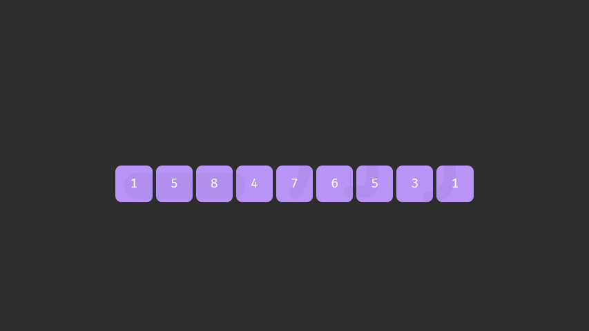

# 综述

- 按照热榜排序，目的是记录一下常问的LeetCode题目。

- cn与com都会涉及。

- 先把简单与中等的处理了，最后再处理困难

  

所有题目来源：力扣（LeetCode）
著作权归领扣网络所有。商业转载请联系官方授权，非商业转载请注明出处。


# [1. 两数之和](https://leetcode-cn.com/problems/two-sum/)

给定一个整数数组 `nums` 和一个整数目标值 `target`，请你在该数组中找出 **和为目标值** 的那 **两个** 整数，并返回它们的数组下标。

你可以假设每种输入只会对应一个答案。但是，数组中同一个元素不能使用两遍。

你可以按任意顺序返回答案。

 

**示例 1：**

```
输入：nums = [2,7,11,15], target = 9
输出：[0,1]
解释：因为 nums[0] + nums[1] == 9 ，返回 [0, 1] 。
```

**示例 2：**

```
输入：nums = [3,2,4], target = 6
输出：[1,2]
```

**示例 3：**

```
输入：nums = [3,3], target = 6
输出：[0,1]
```


思路：

由于是要求2个数字相加等于目标数，可以循环nums数组，使用`Map<value, index>`表来存储已经遍历的每一个数字

```java
class Solution {
    public int[] twoSum(int[] nums, int target) {
        Map<Integer, Integer> map = new HashMap<>();
        for (int i = 0; i < nums.length; i++) {
            int complement = target - nums[i];
            if (map.containsKey(complement)) {
                return new int[] { map.get(complement), i };
            }
            map.put(nums[i], i);
        }
        
        return null;
    }
}
```


官方标准

```java
class Solution {
    public int[] twoSum(int[] nums, int target) {
        Map<Integer, Integer> hashtable = new HashMap<Integer, Integer>();
        for (int i = 0; i < nums.length; ++i) {
            if (hashtable.containsKey(target - nums[i])) {
                return new int[]{hashtable.get(target - nums[i]), i};
            }
            hashtable.put(nums[i], i);
        }
        return new int[0];
    }
}


作者：LeetCode-Solution
链接：https://leetcode-cn.com/problems/two-sum/solution/liang-shu-zhi-he-by-leetcode-solution/
来源：力扣（LeetCode）
著作权归作者所有。商业转载请联系作者获得授权，非商业转载请注明出处。
```


# [2. 两数相加](https://leetcode-cn.com/problems/add-two-numbers/)

给你两个 **非空** 的链表，表示两个非负的整数。它们每位数字都是按照 **逆序** 的方式存储的，并且每个节点只能存储 **一位** 数字。

请你将两个数相加，并以相同形式返回一个表示和的链表。

你可以假设除了数字 0 之外，这两个数都不会以 0 开头。

**示例 1：**


```
输入：l1 = [2,4,3], l2 = [5,6,4]
输出：[7,0,8]
解释：342 + 465 = 807.
```

示例 2：
```
输入：l1 = [0], l2 = [0]
输出：[0]
```

示例 3：

```
输入：l1 = [9,9,9,9,9,9,9], l2 = [9,9,9,9]
输出：[8,9,9,9,0,0,0,1]
```


提示：
- 每个链表中的节点数在范围 [1, 100] 内
- 0 <= Node.val <= 9
- 题目数据保证列表表示的数字不含前导零


我的基本想法是，就模拟10进制加法，单独定义个进位标志，一位位算就行。

```java
class Solution {
    public ListNode addTwoNumbers(ListNode l1, ListNode l2) {
        ListNode resultNode = null;
        ListNode temp = null;
        int carryBit = 0;

        while (true){
            int first = 0;
            if (l1 != null){
                first = l1.val;
                l1 = l1.next;
            }

            int sec = 0;
            if (l2 != null){
                sec = l2.val;
                l2 = l2.next;
            }

            int third =  first + sec + carryBit;
            if (third >= 10){
                third = third - 10;
                carryBit = 1;
            }else {
                carryBit = 0;
            }

            ListNode listNode = new ListNode(third);

            if (resultNode == null){
                resultNode = listNode;
                temp = listNode;
            }else {
                temp.next = listNode;
                temp = temp.next;
            }

            if (l1 == null && l2 == null){
                if (carryBit == 1){
                    temp.next = new ListNode(1);
                }
                break;
            }
        }

        return resultNode;
    }
}
```


官方标准

```java
class Solution {
    public ListNode addTwoNumbers(ListNode l1, ListNode l2) {
        ListNode head = null, tail = null;
        int carry = 0;
        while (l1 != null || l2 != null) {
            int n1 = l1 != null ? l1.val : 0;
            int n2 = l2 != null ? l2.val : 0;
            int sum = n1 + n2 + carry;
            if (head == null) {
                head = tail = new ListNode(sum % 10);
            } else {
                tail.next = new ListNode(sum % 10);
                tail = tail.next;
            }
            carry = sum / 10;
            if (l1 != null) {
                l1 = l1.next;
            }
            if (l2 != null) {
                l2 = l2.next;
            }
        }
        if (carry > 0) {
            tail.next = new ListNode(carry);
        }
        return head;
    }
}


作者：LeetCode-Solution
链接：https://leetcode-cn.com/problems/add-two-numbers/solution/liang-shu-xiang-jia-by-leetcode-solution/
来源：力扣（LeetCode）
著作权归作者所有。商业转载请联系作者获得授权，非商业转载请注明出处。
```


# [3. 无重复字符的最长子串](https://leetcode-cn.com/problems/longest-substring-without-repeating-characters/)

给定一个字符串，请你找出其中不含有重复字符的 **最长子串** 的长度。

**示例 1:**

```
输入: s = "abcabcbb"
输出: 3 
解释: 因为无重复字符的最长子串是 "abc"，所以其长度为 3。
```

**示例 2:**

```
输入: s = "bbbbb"
输出: 1
解释: 因为无重复字符的最长子串是 "b"，所以其长度为 1。
```

示例 3:

```
输入: s = "pwwkew"
输出: 3
解释: 因为无重复字符的最长子串是 "wke"，所以其长度为 3。
     请注意，你的答案必须是 子串 的长度，"pwke" 是一个子序列，不是子串。
```

**示例 4:**

```
输入: s = ""
输出: 0
```

**提示：**

- `0 <= s.length <= 5 * 104`
- `s` 由英文字母、数字、符号和空格组成


当年的想法应该是看了社区解答的，头尾双指针，遍历字符串的每个字符，如果字符在map中已经存在了，就说明遇到相同的了，那么头指针指向相同字符的下一个字符处，尾指针回溯，清空map。如果不存在就说明是个新的数字，放进map中。每轮遍历都计算一下长度，与记录的最大长度比较。遍历到最后一个字符。

一个明显的问题是，每次遇见相同的头指针都是往前推进1，尾指针则完全回溯了，又需要遍历一遍，这是重复遍历。

```java
class Solution {
    public int lengthOfLongestSubstring(String s) {
        char[] strArray = s.toCharArray();

        int arrayhead = 0;
        int arrayTail = 0;
        int result = 0;
        Map<Character, Integer> map = new HashMap<>();
        for (int i = 0; i < s.length();){
            char str = strArray[i];
            Integer dumpIndex = map.get(str);

            if (dumpIndex != null){
                arrayhead ++;
                i = arrayhead;
                arrayTail = arrayhead;
                map.clear();
            }else {
                map.put(str, i);
                i++;
                arrayTail++;
            }

            if (arrayTail - arrayhead > result){
                result = arrayTail - arrayhead;
            }
        }

        return result;
    }
}
```


官方：**滑动窗口**

如果我们依次递增地枚举子串的起始位置，那么子串的结束位置也是递增的！这里的原因在于，假设我们选择字符串中的第 $k$ 个字符作为起始位置，并且得到了不包含重复字符的最长子串的结束位置为 $rk$。那么当我们选择第 $k+1$ 个字符作为起始位置时，首先从 $k+1$ 到 $rk$ 的字符显然是不重复的，并且由于少了原本的第 $k$ 个字符，我们可以尝试继续增大 $rk$，直到右侧出现了重复字符为止。

这样一来，我们就可以使用「滑动窗口」来解决这个问题了：

- 我们使用两个指针表示字符串中的某个子串（或窗口）的左右边界，其中左指针代表着上文中「枚举子串的起始位置」，而右指针即为上文中的$rk$ ；

- 在每一步的操作中，我们会将左指针向右移动一格，表示 **我们开始枚举下一个字符作为起始位置**，然后我们可以不断地向右移动右指针，但需要保证这两个指针对应的子串中没有重复的字符。在移动结束后，这个子串就对应着 **以左指针开始的，不包含重复字符的最长子串**。我们记录下这个子串的长度；

- 在枚举结束后，我们找到的最长的子串的长度即为答案。

  

**判断重复字符**

在上面的流程中，我们还需要使用一种数据结构来判断 是否有重复的字符，常用的数据结构为哈希集合（即 C++ 中的 std::unordered_set，Java 中的 HashSet，Python 中的 set, JavaScript 中的 Set）。在左指针向右移动的时候，我们从哈希集合中移除一个字符，在右指针向右移动的时候，我们往哈希集合中添加一个字符。

```java
class Solution {
    public int lengthOfLongestSubstring(String s) {
        // 哈希集合，记录每个字符是否出现过
        Set<Character> occ = new HashSet<Character>();
        int n = s.length();
        // 右指针，初始值为 -1，相当于我们在字符串的左边界的左侧，还没有开始移动
        int rk = -1, ans = 0;
        for (int i = 0; i < n; ++i) {
            if (i != 0) {
                // 左指针向右移动一格，移除一个字符
                occ.remove(s.charAt(i - 1));
            }
            while (rk + 1 < n && !occ.contains(s.charAt(rk + 1))) {
                // 不断地移动右指针
                occ.add(s.charAt(rk + 1));
                ++rk;
            }
            // 第 i 到 rk 个字符是一个极长的无重复字符子串
            ans = Math.max(ans, rk - i + 1);
        }
        return ans;
    }
}


作者：LeetCode-Solution
链接：https://leetcode-cn.com/problems/longest-substring-without-repeating-characters/solution/wu-zhong-fu-zi-fu-de-zui-chang-zi-chuan-by-leetc-2/
来源：力扣（LeetCode）
著作权归作者所有。商业转载请联系作者获得授权，非商业转载请注明出处。
```


# [4. 寻找两个正序数组的中位数](https://leetcode-cn.com/problems/median-of-two-sorted-arrays/) :fearful:


# [5. 最长回文子串](https://leetcode-cn.com/problems/longest-palindromic-substring/)

给你一个字符串 `s`，找到 `s` 中最长的回文子串。

**示例 1：**

```
输入：s = "babad"
输出："bab"
解释："aba" 同样是符合题意的答案。
```

**示例 2：**

```
输入：s = "cbbd"
输出："bb"
```

**示例 3：**

```
输入：s = "a"
输出："a"
```

**示例 4：**

```
输入：s = "ac"
输出："a"
```

**提示：**

- `1 <= s.length <= 1000`
- `s` 仅由数字和英文字母（大写和/或小写）组成


又要想起被KMP支配的恐惧，对我来说算法里面的字符串处理是最困难的。

回文是指正着与逆着都一样的字符串。


多年前写的，思路早都忘记了，看代码应该是确定了一头一尾2个指针，一个从前往后，一个从后往前的开始遍历。当遇到不相等的时候，就说明当前的字符串肯定不是回文。然后向前移动一格，继续下一轮比较，如果移动的超出了原字符的最大长度，则缩短一下期待的回文字符串长度，然后又从第一个字符开始判断。

由于是从最大的字符串开始比较的，所以一旦找到一个回文串，那么肯定就是最长的。这样看起来，还是一个滑动窗口，只不过窗口在逐渐的减小。

```java
class Solution {
    public String longestPalindrome(String s) {
        char[] charArray = s.toCharArray();

        int head = 0;
        int scape = s.length();

        while (scape != 0){
            int tail = head + scape;

            boolean f = true;
            for (int i = 0; i < scape/2; i++){
                if (charArray[i + head] != charArray[tail - i - 1]){
                    f = false;
                    break;
                }
            }

            if (f){
                StringBuilder result = new StringBuilder();
                for (int i = head; i <= tail - 1; i++){
                    result.append(charArray[i]);
                }

                return result.toString();
            }else {
                if (tail < s.length()){
                    head ++;
                }else {
                    head = 0;
                    scape--;
                }
            }
        }

        return "";
    }
}
```


官方

给出了4种解法，并且出视频。看几个重要的

- 方法一（暴力解法）
- 方法二（中心扩散）
- 方法三（动态规划）
- 方法四（Manacher 算法）


**动态规划**

对于一个子串而言，如果它是回文串，并且长度大于 $2$，那么将它首尾的两个字母去除之后，它仍然是个回文串。例如对于字符串 $ababa$，如果我们已经知道 $bab$是回文串，那么 $ababa$ 一定是回文串，这是因为它的首尾两个字母都是$a$。

根据这样的思路，我们就可以用动态规划的方法解决本题。我们用 $P(i,j) $表示字符串 $s$ 的第 $i$ 到 $j$ 个字母组成的串（下文表示成 $s[i:j]$是否为回文串：
$$
P(i,j)=\begin{cases} true，如果子串 Si​…Sj​ 是回文串\\ false， 其他情况\end{cases}
$$
这里的「其它情况」包含两种可能性：

- $s[i,j]$本身不是一个回文串；
- $i>j$，此时 $s[i,j]$本身不合法。

那么我们就可以写出动态规划的状态转移方程：
$$
P(i,j)=P(i+1,j−1)∧(Si​==Sj​)
$$
也就是说，只有 $s[i+1:j−1]$是回文串，并且 $s$的第 $i$ 和 $j$ 个字母相同时，$s[i:j]$ 才会是回文串。

上文的所有讨论是建立在子串长度大于 2 的前提之上的，我们还需要考虑动态规划中的边界条件，即子串的长度为 1 或 2。对于长度为 1 的子串，它显然是个回文串；对于长度为 2 的子串，只要它的两个字母相同，它就是一个回文串。因此我们就可以写出动态规划的边界条件：

$$
\begin{cases} P(i,i) = true\\ P(i, i+1) = (Si​==Sj​)\end{cases}
$$
根据这个思路，我们就可以完成动态规划了，最终的答案即为所有 $P(i,j)=true$中 $j−i+1$（即子串长度）的最大值。注意：在状态转移方程中，我们是从长度较短的字符串向长度较长的字符串进行转移的，因此一定要注意动态规划的循环顺序。

```java
class Solution {
    public String longestPalindrome(String s) {
        int n = s.length();
        boolean[][] dp = new boolean[n][n];
        String ans = "";
        for (int l = 0; l < n; ++l) {
            for (int i = 0; i + l < n; ++i) {
                int j = i + l;
                if (l == 0) {
                    dp[i][j] = true;
                } else if (l == 1) {
                    dp[i][j] = (s.charAt(i) == s.charAt(j));
                } else {
                    dp[i][j] = (s.charAt(i) == s.charAt(j) && dp[i + 1][j - 1]);
                }
                if (dp[i][j] && l + 1 > ans.length()) {
                    ans = s.substring(i, i + l + 1);
                }
            }
        }
        return ans;
    }
}


作者：LeetCode-Solution
链接：https://leetcode-cn.com/problems/longest-palindromic-substring/solution/zui-chang-hui-wen-zi-chuan-by-leetcode-solution/
来源：力扣（LeetCode）
著作权归作者所有。商业转载请联系作者获得授权，非商业转载请注明出处。
```

这里的`int l`应该是回文的预期长度。


**方法二：中心扩展算法**

边界情况为子串长度为 1 或 2 的情况。我们枚举每一种边界情况，并从对应的子串开始不断地向两边扩展。如果两边的字母相同，我们就可以继续扩展，例如从 $P(i+1,j-1)$ 扩展到 $P(i,j)$；如果两边的字母不同，我们就可以停止扩展，因为在这之后的子串都不能是回文串了。

「边界情况」对应的子串实际上就是我们「扩展」出的回文串的「回文中心」。方法二的本质即为：我们枚举所有的「回文中心」并尝试「扩展」，直到无法扩展为止，此时的回文串长度即为此「回文中心」下的最长回文串长度。我们对所有的长度求出最大值，即可得到最终的答案。

```java
class Solution {
    public String longestPalindrome(String s) {
        if (s == null || s.length() < 1) {
            return "";
        }
        int start = 0, end = 0;
        for (int i = 0; i < s.length(); i++) {
            int len1 = expandAroundCenter(s, i, i);
            int len2 = expandAroundCenter(s, i, i + 1);
            int len = Math.max(len1, len2);
            if (len > end - start) {
                start = i - (len - 1) / 2;
                end = i + len / 2;
            }
        }
        return s.substring(start, end + 1);
    }

    public int expandAroundCenter(String s, int left, int right) {
        while (left >= 0 && right < s.length() && s.charAt(left) == s.charAt(right)) {
            --left;
            ++right;
        }
        return right - left - 1;
    }
}


作者：LeetCode-Solution
链接：https://leetcode-cn.com/problems/longest-palindromic-substring/solution/zui-chang-hui-wen-zi-chuan-by-leetcode-solution/
来源：力扣（LeetCode）
著作权归作者所有。商业转载请联系作者获得授权，非商业转载请注明出处。
```


# [10. 正则表达式匹配](https://leetcode-cn.com/problems/regular-expression-matching/)​ :fearful:


# [11. 盛最多水的容器](https://leetcode-cn.com/problems/container-with-most-water/)

给你 n 个非负整数 $a_1，a_2，...，a_n$，每个数代表坐标中的一个点 $(i, ai)$ 。在坐标内画 n 条垂直线，垂直线 i 的两个端点分别为 $(i, ai) $和 $(i, 0)$ 。找出其中的两条线，使得它们与 x 轴共同构成的容器可以容纳最多的水。

说明：你不能倾斜容器。

**示例 1：**


```
输入：[1,8,6,2,5,4,8,3,7]
输出：49 
解释：图中垂直线代表输入数组 [1,8,6,2,5,4,8,3,7]。在此情况下，容器能够容纳水（表示为蓝色部分）的最大值为 49。
```

**示例 2：**

```
输入：height = [1,1]
输出：1
```

**示例 3：**

```
输入：height = [4,3,2,1,4]
输出：16
```

**示例 4：**

```
输入：height = [1,2,1]
输出：2
```

**提示：**

- `n = height.length`
- `2 <= n <= 3 * 104`
- `0 <= height[i] <= 3 * 104`


哦，几年前使用的暴力解法

```java
class Solution {
    public int maxArea(int[] height) {
        int max = 0;
        for (int i = 0 ;i < height.length; i++){
            for (int j = i + 1; j < height.length; j++){
                int area = (j - i) * Math.min(height[i], height[j]);
                max = Math.max(area, max);
            }
        }

        return max;
    }
}

```


官方

**双指针**

先从题目中的示例开始，初始时，左右指针分别指向数组的左右两端，它们可以容纳的水量为 $min⁡(1,7)∗8=8$。

此时我们需要移动一个指针。移动哪一个呢？直觉告诉我们，应该移动对应数字较小的那个指针（即此时的左指针）。这是因为，由于容纳的水量是由
$$
两个指针指向的数字中较小值∗指针之间的距离
$$
决定的。如果我们移动数字较大的那个指针，那么前者「两个指针指向的数字中较小值」不会增加，后者「指针之间的距离」会减小，那么这个乘积会减小。因此，我们移动数字较大的那个指针是不合理的。因此，我们移动 数字较小的那个指针。

```java
public class Solution {
    public int maxArea(int[] height) {
        int l = 0, r = height.length - 1;
        int ans = 0;
        while (l < r) {
            int area = Math.min(height[l], height[r]) * (r - l);
            ans = Math.max(ans, area);
            if (height[l] <= height[r]) {
                ++l;
            }
            else {
                --r;
            }
        }
        return ans;
    }
}


作者：LeetCode-Solution
链接：https://leetcode-cn.com/problems/container-with-most-water/solution/sheng-zui-duo-shui-de-rong-qi-by-leetcode-solution/
来源：力扣（LeetCode）
著作权归作者所有。商业转载请联系作者获得授权，非商业转载请注明出处。
```

其实重点在证明，直接看链接即可。


# [15. 三数之和](https://leetcode-cn.com/problems/3sum/)

给你一个包含 n 个整数的数组 nums，判断 nums 中是否存在三个元素 a，b，c ，使得 $a + b + c = 0$ ？请你找出所有和为 0 且不重复的三元组。

注意：答案中不可以包含重复的三元组。

**示例 1：**

```
输入：nums = [-1,0,1,2,-1,-4]
输出：[[-1,-1,2],[-1,0,1]]
```

**示例 2：**

```
输入：nums = []
输出：[]
```

**示例 3：**

```
输入：nums = [0]
输出：[]
```


多年前做的了，暴力加上一点剪枝，内层循环为两数之和的思路。

```java
class Solution {
    public List<List<Integer>> threeSum(int[] nums) {
        List<List<Integer>> result = new ArrayList<>();
        if (nums.length < 3){
            return result;
        }

        Arrays.sort(nums);
        Map<Integer, Integer> map = new HashMap<>();
        for (int n = 0; n < nums.length; n ++){
            map.put(nums[n], n);
        }

        int length = nums.length;
        int max = nums[nums.length -1];
        int subMax = nums[nums.length -2];
        int pre = nums[0] - 1;

        for (int i = 0; i < length; i++){
            int first = nums[i];

            if (pre == first){
                continue;
            }else {
                pre = first;
            }

            if (first > 0){
                break;
            }

            if ((first + max + subMax) < 0){
                continue;
            }

            int pre2 = nums[0] - 1;
            for (int j = i + 1; j < length; j++){
                int sec = nums[j];

                if (pre2 == sec){
                    continue;
                }else {
                    pre2 = sec;
                }

                if (first + sec > 0){
                    break;
                }

                Integer n = map.get((first + sec) * -1);
                if (n != null && n > j){
                    List<Integer> list = new ArrayList<>();
                    list.add(first);
                    list.add(sec);
                    list.add(nums[n]);
                    result.add(list);
                }
            }
        }

        return result;
    }
}
```


官方

本题与 [1. 两数之和](https://leetcode-cn.com/problems/two-sum/) 类似，是非常经典的面试题，但是做法不尽相同。

**排序 + 双指针**

题目中要求找到所有「不重复」且和为 000 的三元组，这个「不重复」的要求使得我们无法简单地使用三重循环枚举所有的三元组。这是因为在最坏的情况下，数组中的元素全部为 000，即
$$
[0, 0, 0, 0, 0, ..., 0, 0, 0]
$$
任意一个三元组的和都为 0。如果我们直接使用三重循环枚举三元组，会得到 $O(N^3)$ 个满足题目要求的三元组（其中 N 是数组的长度）时间复杂度至少为 $O(N^3)$。在这之后，我们还需要使用哈希表进行去重操作，得到不包含重复三元组的最终答案，又消耗了大量的空间。这个做法的时间复杂度和空间复杂度都很高，因此我们要换一种思路来考虑这个问题。

「不重复」的本质是什么？我们保持三重循环的大框架不变，只需要保证：

- 第二重循环枚举到的元素不小于当前第一重循环枚举到的元素；
  
- 第三重循环枚举到的元素不小于当前第二重循环枚举到的元素。

也就是说，我们枚举的三元组 $(a, b, c)$ 满足 $a \leq b \leq c$，保证了只有 $(a, b, c)$这个顺序会被枚举到，而 $(b, a, c)$、$(c, b, a)$ 等等这些不会，这样就减少了重复。要实现这一点，我们可以将数组中的元素从小到大进行排序，随后使用普通的三重循环就可以满足上面的要求。

同时，对于每一重循环而言，相邻两次枚举的元素不能相同，否则也会造成重复。举个例子，如果排完序的数组为

[0, 1, 2, 2, 2, 3]
 ^  ^  ^

我们使用三重循环枚举到的第一个三元组为$(0, 1, 2)$，如果第三重循环继续枚举下一个元素，那么仍然是三元组 $(0, 1, 2)$，产生了重复。因此我们需要将第三重循环「跳到」下一个不相同的元素，即数组中的最后一个元素 3，枚举三元组 $(0, 1, 3)$。

这种方法的时间复杂度仍然为 $O(N^3)$，毕竟我们还是没有跳出三重循环的大框架。然而它是很容易继续优化的，可以发现，如果我们固定了前两重循环枚举到的元素 a和 b，那么只有唯一的 c 满足 $a+b+c=0$。当第二重循环往后枚举一个元素 $b'$ 时，由于 $b' > b$，那么满足 $a+b'+c'=0$ 的 $c'$ 一定有 $c' < c$，即 $c'$ 在数组中一定出现在 $c$ 的左侧。也就是说，我们可以从小到大枚举 $b$，同时从大到小枚举 $c$，即第二重循环和第三重循环实际上是并列的关系。

有了这样的发现，我们就可以保持第二重循环不变，而将第三重循环变成一个从数组最右端开始向左移动的指针，

这个方法就是我们常说的「双指针」，当我们需要枚举数组中的两个元素时，如果我们发现随着第一个元素的递增，第二个元素是递减的，那么就可以使用双指针的方法，将枚举的时间复杂度从 $O(N^2)$ 减少至 $O(N)$。为什么是 $O(N)$ 呢？这是因为在枚举的过程每一步中，「左指针」会向右移动一个位置（也就是题目中的 bbb），而「右指针」会向左移动若干个位置，这个与数组的元素有关，但我们知道它一共会移动的位置数为 $O(N)$，均摊下来，每次也向左移动一个位置，因此时间复杂度为 $O(N)$。

注意到我们的伪代码中还有第一重循环，时间复杂度为 $O(N)$，因此枚举的总时间复杂度为 $O(N^2)$。由于排序的时间复杂度为 $O(N \log N)$，在渐进意义下小于前者，因此算法的总时间复杂度为 $O(N^2)$。

```java
class Solution {
    public List<List<Integer>> threeSum(int[] nums) {
        int n = nums.length;
        Arrays.sort(nums);
        List<List<Integer>> ans = new ArrayList<List<Integer>>();
        // 枚举 a
        for (int first = 0; first < n; ++first) {
            // 需要和上一次枚举的数不相同
            if (first > 0 && nums[first] == nums[first - 1]) {
                continue;
            }
            // c 对应的指针初始指向数组的最右端
            int third = n - 1;
            int target = -nums[first];
            // 枚举 b
            for (int second = first + 1; second < n; ++second) {
                // 需要和上一次枚举的数不相同
                if (second > first + 1 && nums[second] == nums[second - 1]) {
                    continue;
                }
                // 需要保证 b 的指针在 c 的指针的左侧
                while (second < third && nums[second] + nums[third] > target) {
                    --third;
                }
                // 如果指针重合，随着 b 后续的增加
                // 就不会有满足 a+b+c=0 并且 b<c 的 c 了，可以退出循环
                if (second == third) {
                    break;
                }
                if (nums[second] + nums[third] == target) {
                    List<Integer> list = new ArrayList<Integer>();
                    list.add(nums[first]);
                    list.add(nums[second]);
                    list.add(nums[third]);
                    ans.add(list);
                }
            }
        }
        return ans;
    }
}


作者：LeetCode-Solution
链接：https://leetcode-cn.com/problems/3sum/solution/san-shu-zhi-he-by-leetcode-solution/
来源：力扣（LeetCode）
著作权归作者所有。商业转载请联系作者获得授权，非商业转载请注明出处。
```


# [17. 电话号码的字母组合](https://leetcode-cn.com/problems/letter-combinations-of-a-phone-number/)

给定一个仅包含数字 2-9 的字符串，返回所有它能表示的字母组合。答案可以按 任意顺序 返回。

给出数字到字母的映射如下（与电话按键相同）。注意 1 不对应任何字母。


**示例 1：**

```
输入：digits = "23"
输出：["ad","ae","af","bd","be","bf","cd","ce","cf"]
```

**示例 2：**

```
输入：digits = ""
输出：[]
```

**示例 3：**

```
输入：digits = "2"
输出：["a","b","c"]
```

**提示：**

- `0 <= digits.length <= 4`
- `digits[i]` 是范围 `['2', '9']` 的一个数字。


哦，暴力遍历，内存中存了一下电话盘。

```java
class Solution {
     public List<String> twoNumber(int n, List<String> list){
        Map<Integer, String[]> map = new HashMap<>();
        map.put(2, new String[]{"a", "b", "c"});
        map.put(3, new String[]{"d", "e", "f"});
        map.put(4, new String[]{"g", "h", "i"});
        map.put(5, new String[]{"j", "k", "l"});
        map.put(6, new String[]{"m", "n", "o"});
        map.put(7, new String[]{"p", "q", "r", "s"});
        map.put(8, new String[]{"t", "u", "v"});
        map.put(9, new String[]{"w", "x", "y", "z"});

        String[] alpha = map.get(n);
        if (list.size() == 0){
            for (String s : alpha) {
                list.add(s);
            }

            return list;
        }

        List<String> temp = new ArrayList<>();
        for (String s : alpha) {
            for (String s1 : list) {
                s1 = s1 + s;
                temp.add(s1);
            }
        }

        return temp;
    }

    
    
    public List<String> letterCombinations(String digits) {
        List<String> result = new ArrayList<>();

        for (int index = 0; index < digits.length(); index ++) {
          	// 这里拿到的是ascii码 减去0对应的ascii码 得到对应的数字
            result = twoNumber(digits.charAt(index) - '0', result);
        }

        return result;
        
    }
}
```


官方

**回溯**

首先使用哈希表存储每个数字对应的所有可能的字母，然后进行回溯操作。

回溯过程中维护一个字符串，表示已有的字母排列（如果未遍历完电话号码的所有数字，则已有的字母排列是不完整的）。该字符串初始为空。每次取电话号码的一位数字，从哈希表中获得该数字对应的所有可能的字母，并将其中的一个字母插入到已有的字母排列后面，然后继续处理电话号码的后一位数字，直到处理完电话号码中的所有数字，即得到一个完整的字母排列。然后进行回退操作，遍历其余的字母排列。

回溯算法用于寻找所有的可行解，如果发现一个解不可行，则会舍弃不可行的解。在这道题中，由于每个数字对应的每个字母都可能进入字母组合，因此不存在不可行的解，直接穷举所有的解即可。

```java
class Solution {
    public List<String> letterCombinations(String digits) {
        List<String> combinations = new ArrayList<String>();
        if (digits.length() == 0) {
            return combinations;
        }
        Map<Character, String> phoneMap = new HashMap<Character, String>() {{
            put('2', "abc");
            put('3', "def");
            put('4', "ghi");
            put('5', "jkl");
            put('6', "mno");
            put('7', "pqrs");
            put('8', "tuv");
            put('9', "wxyz");
        }};
        backtrack(combinations, phoneMap, digits, 0, new StringBuffer());
        return combinations;
    }

    public void backtrack(List<String> combinations, Map<Character, String> phoneMap, String digits, int index, StringBuffer combination) {
        if (index == digits.length()) {
            combinations.add(combination.toString());
        } else {
            char digit = digits.charAt(index);
            String letters = phoneMap.get(digit);
            int lettersCount = letters.length();
            for (int i = 0; i < lettersCount; i++) {
                combination.append(letters.charAt(i));
                backtrack(combinations, phoneMap, digits, index + 1, combination);
                combination.deleteCharAt(index);
            }
        }
    }
}


作者：LeetCode-Solution
链接：https://leetcode-cn.com/problems/letter-combinations-of-a-phone-number/solution/dian-hua-hao-ma-de-zi-mu-zu-he-by-leetcode-solutio/
来源：力扣（LeetCode）
著作权归作者所有。商业转载请联系作者获得授权，非商业转载请注明出处。
```


# [19. 删除链表的倒数第 N 个结点](https://leetcode-cn.com/problems/remove-nth-node-from-end-of-list/)

给你一个链表，删除链表的倒数第 `n` 个结点，并且返回链表的头结点。

**进阶：**你能尝试使用一趟扫描实现吗？

**示例 1：**


```
输入：head = [1,2,3,4,5], n = 2
输出：[1,2,3,5]
```

**示例 2：**

```
输入：head = [1], n = 1
输出：[]
```

**示例 3：**

```
输入：head = [1,2], n = 1
输出：[1]
```

**提示：**

- 链表中结点的数目为 `sz`
- `1 <= sz <= 30`
- `0 <= Node.val <= 100`
- `1 <= n <= sz`


非常典型的**快慢指针问题**，两个指针中间保持n的距离，快指针走到底的时候，慢指针所指的节点就是需要踢掉的节点。

几年前用的是空间换时间的做法，用map来缓存节点位置。

```java
/**
 * Definition for singly-linked list.
 * public class ListNode {
 *     int val;
 *     ListNode next;
 *     ListNode(int x) { val = x; }
 * }
 */
class Solution {
    public ListNode removeNthFromEnd(ListNode head, int n) {
        Map<Integer, ListNode> map = new HashMap<>();

        int i = 0;
        while (head != null){
            i++;
            map.put(i, head);
            head = head.next;
        }

        if (i == n){
            //删除头结点
            return map.get(2);
        }else if (n == 1){
            //删除位结点
            map.get(i - 1).next = null;
        }else {
            map.get(i - n).next = map.get(i - n + 2);
        }
        return map.get(1);
    }
}
```


官方

前言

在对链表进行操作时，一种常用的技巧是添加一个哑节点（dummy node），它的 next\textit{next}next 指针指向链表的头节点。这样一来，我们就不需要对头节点进行特殊的判断了。

例如，在本题中，如果我们要删除节点 yyy，我们需要知道节点 yyy 的前驱节点 xxx，并将 xxx 的指针指向 yyy 的后继节点。但由于头节点不存在前驱节点，因此我们需要在删除头节点时进行特殊判断。但如果我们添加了哑节点，那么头节点的前驱节点就是哑节点本身，此时我们就只需要考虑通用的情况即可。

特别地，在某些语言中，由于需要自行对内存进行管理。因此在实际的面试中，对于「是否需要释放被删除节点对应的空间」这一问题，我们需要和面试官进行积极的沟通以达成一致。下面的代码中默认不释放空间。


**方法一：计算链表长度**

一种容易想到的方法是，我们首先从头节点开始对链表进行一次遍历，得到链表的长度 LLL。随后我们再从头节点开始对链表进行一次遍历，当遍历到第 L−n+1L-n+1L−n+1 个节点时，它就是我们需要删除的节点。


**方法二：栈**

思路与算法

我们也可以在遍历链表的同时将所有节点依次入栈。根据栈「先进后出」的原则，我们弹出栈的第 n 个节点就是需要删除的节点，并且目前栈顶的节点就是待删除节点的前驱节点。这样一来，删除操作就变得十分方便了。


**方法三：双指针**

思路与算法

我们也可以在不预处理出链表的长度，以及使用常数空间的前提下解决本题。

由于我们需要找到倒数第 $n$ 个节点，因此我们可以使用两个指针 $first$ 和 $second$ 同时对链表进行遍历，并且  $first$  比 $second$  超前 n 个节点。当 $first$ 遍历到链表的末尾时，$second$ 就恰好处于倒数第 n 个节点。

具体地，初始时 $first$ 和 $second$均指向头节点。我们首先使用 $first $ 对链表进行遍历，遍历的次数为 $n$。此时，$first$ 和 $second$之间间隔了 $n-1$ 个节点，即 $first$ 比 $second$超前了 $n$ 个节点。

在这之后，我们同时使用 $first$ 和 $second$对链表进行遍历。当 $first$ 遍历到链表的末尾（即 $first$ 为空指针）时，$second$恰好指向倒数第 $n$ 个节点。

根据方法一和方法二，如果我们能够得到的是倒数第 $n$ 个节点的前驱节点而不是倒数第 $n$ 个节点的话，删除操作会更加方便。因此我们可以考虑在初始时将 $second$指向哑节点，其余的操作步骤不变。这样一来，当 $first$ 遍历到链表的末尾时，$second$的下一个节点就是我们需要删除的节点。

```java
class Solution {
    public ListNode removeNthFromEnd(ListNode head, int n) {
        ListNode dummy = new ListNode(0, head);
        ListNode first = head;
        ListNode second = dummy;
        for (int i = 0; i < n; ++i) {
            first = first.next;
        }
        while (first != null) {
            first = first.next;
            second = second.next;
        }
        second.next = second.next.next;
        ListNode ans = dummy.next;
        return ans;
    }
}


作者：LeetCode-Solution
链接：https://leetcode-cn.com/problems/remove-nth-node-from-end-of-list/solution/shan-chu-lian-biao-de-dao-shu-di-nge-jie-dian-b-61/
来源：力扣（LeetCode）
著作权归作者所有。商业转载请联系作者获得授权，非商业转载请注明出处。
```


# [20. 有效的括号](https://leetcode-cn.com/problems/valid-parentheses/)

给定一个只包括 '('，')'，'{'，'}'，'['，']' 的字符串 s ，判断字符串是否有效。

有效字符串需满足：

- 左括号必须用相同类型的右括号闭合。
- 左括号必须以正确的顺序闭合。

**示例 1：**

```
输入：s = "()"
输出：true
```

**示例 2：**

```
输入：s = "()[]{}"
输出：true
```

**示例 3：**

```
输入：s = "(]"
输出：false
```

**示例 4：**

```
输入：s = "([)]"
输出：false
```

**示例 5：**

```
输入：s = "{[]}"
输出：true
```


看到这种括号匹配，脑子里第一个想法就是用栈来实现。这里的做法也是使用一个list来模拟栈，如果是左半边括号就入栈，是右半边括号就出栈，然后对比一下两个符号是否匹配。

```java
class Solution {
    public boolean isValid(String s) {
        if (s == null || "".equals(s)){
            return true;
        }
        
        if (s.length() == 1){
            return false;
        }

        List<String> list = new ArrayList<>();
        for (int i = 0; i < s.length(); i++){
            String heses = String.valueOf(s.charAt(i));

            if (heses.equals("(") || heses.equals("[") || heses.equals("{")  ){
                list.add(heses);
            }else {
                if (list.size() == 0){
                    return false;
                }
                
                String left = list.get(list.size() - 1);

                if (heses.equals(")") && left.equals("(")){
                    list.remove(list.size() - 1);
                }else if (heses.equals("]") && left.equals("[")){
                    list.remove(list.size() - 1);
                }else if (heses.equals("}") && left.equals("{")){
                    list.remove(list.size() - 1);
                }else {
                    return false;
                }
            }
        }

        return list.size() == 0;
    }
}
```


官方

**栈**

判断括号的有效性可以使用「栈」这一数据结构来解决。

我们遍历给定的字符串 $s$。当我们遇到一个左括号时，我们会期望在后续的遍历中，有一个相同类型的右括号将其闭合。由于后遇到的左括号要先闭合，因此我们可以将这个左括号放入栈顶。

当我们遇到一个右括号时，我们需要将一个相同类型的左括号闭合。此时，我们可以取出栈顶的左括号并判断它们是否是相同类型的括号。如果不是相同的类型，或者栈中并没有左括号，那么字符串 $s$ 无效，返回 $False$。为了快速判断括号的类型，我们可以使用哈希表存储每一种括号。哈希表的键为右括号，值为相同类型的左括号。

在遍历结束后，如果栈中没有左括号，说明我们将字符串 $s$ 中的所有左括号闭合，返回 $True$，否则返回 $False$。

注意到有效字符串的长度一定为偶数，因此如果字符串的长度为奇数，我们可以直接返回 $False$，省去后续的遍历判断过程。

```java
class Solution {
    public boolean isValid(String s) {
        int n = s.length();
        if (n % 2 == 1) {
            return false;
        }

        Map<Character, Character> pairs = new HashMap<Character, Character>() {{
            put(')', '(');
            put(']', '[');
            put('}', '{');
        }};
        Deque<Character> stack = new LinkedList<Character>();
        for (int i = 0; i < n; i++) {
            char ch = s.charAt(i);
            if (pairs.containsKey(ch)) {
                if (stack.isEmpty() || stack.peek() != pairs.get(ch)) {
                    return false;
                }
                stack.pop();
            } else {
                stack.push(ch);
            }
        }
        return stack.isEmpty();
    }
}


作者：LeetCode-Solution
链接：https://leetcode-cn.com/problems/valid-parentheses/solution/you-xiao-de-gua-hao-by-leetcode-solution/
来源：力扣（LeetCode）
著作权归作者所有。商业转载请联系作者获得授权，非商业转载请注明出处。
```


# [21. 合并两个有序链表](https://leetcode-cn.com/problems/merge-two-sorted-lists/)

将两个升序链表合并为一个新的 **升序** 链表并返回。新链表是通过拼接给定的两个链表的所有节点组成的。

**示例 1：**


```
输入：l1 = [1,2,4], l2 = [1,3,4]
输出：[1,1,2,3,4,4]
```

**示例 2：**

```
输入：l1 = [], l2 = []
输出：[]
```

**示例 3：**

```
输入：l1 = [], l2 = [0]
输出：[0]
```

提示：

- 两个链表的节点数目范围是 [0, 50]
- -100 <= Node.val <= 100
- l1 和 l2 均按 非递减顺序 排列


思路比较明显，两个指针分别指向每个链表的头节点，在一个大while中比较判断，哪个指针的数字比较大。

```java
/**
 * Definition for singly-linked list.
 * public class ListNode {
 *     int val;
 *     ListNode next;
 *     ListNode(int x) { val = x; }
 * }
 */
class Solution {
    public ListNode mergeTwoLists(ListNode l1, ListNode l2) {
        ListNode listNode = new ListNode(0);
        ListNode first = listNode;

        while (l1 != null && l2 != null){
            if (l1.val < l2.val){
                listNode.next = new ListNode(l1.val);
                l1 = l1.next;
            }else {
                listNode.next = new ListNode(l2.val);
                l2 = l2.next;
            }
            listNode = listNode.next;
        }

        if (l1 != null){
            listNode.next = l1;
        }

        if (l2 != null){
            listNode.next = l2;
        }

        return first.next;
    }
}
```


官方

```java
class Solution {
    public ListNode mergeTwoLists(ListNode l1, ListNode l2) {
        ListNode prehead = new ListNode(-1);

        ListNode prev = prehead;
        while (l1 != null && l2 != null) {
            if (l1.val <= l2.val) {
                prev.next = l1;
                l1 = l1.next;
            } else {
                prev.next = l2;
                l2 = l2.next;
            }
            prev = prev.next;
        }

        // 合并后 l1 和 l2 最多只有一个还未被合并完，我们直接将链表末尾指向未合并完的链表即可
        prev.next = l1 == null ? l2 : l1;

        return prehead.next;
    }
}


作者：LeetCode-Solution
链接：https://leetcode-cn.com/problems/merge-two-sorted-lists/solution/he-bing-liang-ge-you-xu-lian-biao-by-leetcode-solu/
来源：力扣（LeetCode）
著作权归作者所有。商业转载请联系作者获得授权，非商业转载请注明出处。
```


# [22. 括号生成](https://leetcode-cn.com/problems/generate-parentheses/)

数字 `n` 代表生成括号的对数，请你设计一个函数，用于能够生成所有可能的并且 **有效的** 括号组合。

**示例 1：**

```
输入：n = 3
输出：["((()))","(()())","(())()","()(())","()()()"]
```

**示例 2：**

```
输入：n = 1
输出：["()"]
```

**提示：**

- `1 <= n <= 8`


第一直觉就是动态规划。


官方的没怎么看懂，评论区高赞的：

> 递归（深度优先）+ 剪枝
>
> 剩余左括号总数要小于等于右括号。 递归把所有符合要求的加上去就行了

```java
		class Solution {
        List<String> res = new ArrayList<>();
        public List<String> generateParenthesis(int n) {
            if(n <= 0){
                return res;
            }
            getParenthesis("",n,n);
            return res;
        }

        private void getParenthesis(String str,int left, int right) {
            if(left == 0 && right == 0 ){
                res.add(str);
                return;
            }
            if(left == right){
                //剩余左右括号数相等，下一个只能用左括号
                getParenthesis(str+"(",left-1,right);
            }else if(left < right){
                //剩余左括号小于右括号，下一个可以用左括号也可以用右括号
                if(left > 0){
                    getParenthesis(str+"(",left-1,right);
                }
                getParenthesis(str+")",left,right-1);
            }
        }
    }

https://leetcode-cn.com/problems/generate-parentheses/solution/gua-hao-sheng-cheng-by-leetcode-solution/540232
```


当然也可以使用广度优先

```java
import java.util.ArrayDeque;
import java.util.ArrayList;
import java.util.Deque;
import java.util.LinkedList;
import java.util.List;
import java.util.Queue;

public class Solution {

    class Node {
        /**
         * 当前得到的字符串
         */
        private String res;
        /**
         * 剩余左括号数量
         */
        private int left;
        /**
         * 剩余右括号数量
         */
        private int right;

        public Node(String str, int left, int right) {
            this.res = str;
            this.left = left;
            this.right = right;
        }
    }

    public List<String> generateParenthesis(int n) {
        List<String> res = new ArrayList<>();
        if (n == 0) {
            return res;
        }
        Queue<Node> queue = new LinkedList<>();
        queue.offer(new Node("", n, n));

        while (!queue.isEmpty()) {
            Node curNode = queue.poll();
            if (curNode.left == 0 && curNode.right == 0) {
                res.add(curNode.res);
            }
            if (curNode.left > 0) {
                queue.offer(new Node(curNode.res + "(", curNode.left - 1, curNode.right));
            }
            if (curNode.right > 0 && curNode.left < curNode.right) {
                queue.offer(new Node(curNode.res + ")", curNode.left, curNode.right - 1));
            }
        }
        return res;
    }
}


作者：liweiwei1419
链接：https://leetcode-cn.com/problems/generate-parentheses/solution/hui-su-suan-fa-by-liweiwei1419/
来源：力扣（LeetCode）
著作权归作者所有。商业转载请联系作者获得授权，非商业转载请注明出处。
```

作为对比，贴一个同样写法的深度优先，仅仅是把 `Queue` 换成了 `Stack` ，广度优先遍历就改成了深度优先遍历。）

```java
import java.util.ArrayDeque;
import java.util.ArrayList;
import java.util.Deque;
import java.util.LinkedList;
import java.util.List;
import java.util.Queue;
import java.util.Stack;

public class Solution {

    class Node {
        /**
         * 当前得到的字符串
         */
        private String res;
        /**
         * 剩余左括号数量
         */
        private int left;
        /**
         * 剩余右括号数量
         */
        private int right;

        public Node(String str, int left, int right) {
            this.res = str;
            this.left = left;
            this.right = right;
        }
    }
    
    // 注意：这是深度优先遍历

    public List<String> generateParenthesis(int n) {
        List<String> res = new ArrayList<>();
        if (n == 0) {
            return res;
        }

        // 查看了 Stack 源码，官方推荐使用 Deque 对象，
        // 注意：只使用栈相关的接口，即只使用 `addLast()` 和 `removeLast()`
        Deque<Node> stack = new ArrayDeque<>();
        stack.addLast(new Node("", n, n));

        while (!stack.isEmpty()) {

            Node curNode = stack.removeLast();
            if (curNode.left == 0 && curNode.right == 0) {
                res.add(curNode.res);
            }
            if (curNode.left > 0) {
                stack.addLast(new Node(curNode.res + "(", curNode.left - 1, curNode.right));
            }
            if (curNode.right > 0 && curNode.left < curNode.right) {
                stack.addLast(new Node(curNode.res + ")", curNode.left, curNode.right - 1));
            }
        }
        return res;
    }
}


作者：liweiwei1419
链接：https://leetcode-cn.com/problems/generate-parentheses/solution/hui-su-suan-fa-by-liweiwei1419/
来源：力扣（LeetCode）
著作权归作者所有。商业转载请联系作者获得授权，非商业转载请注明出处。
```


dp

> 思路：
>
> 当我们清楚所有 i<n 时括号的可能生成排列后，对与 i=n 的情况，我们考虑整个括号排列中最左边的括号。
> 它一定是一个左括号，那么它可以和它对应的右括号组成一组完整的括号 "( )"，我们认为这一组是相比 n-1 增加进来的括号。
>
> 那么，剩下 n-1 组括号有可能在哪呢？
>
> 【这里是重点，请着重理解】
>
> 剩下的括号要么在这一组新增的括号内部，要么在这一组新增括号的外部（右侧）。
>
> 既然知道了 i<n 的情况，那我们就可以对所有情况进行遍历：
>
> "(" + 【i=p时所有括号的排列组合】 + ")" + 【i=q时所有括号的排列组合】
>
> 其中 p + q = n-1，且 p q 均为非负整数。
>
> 事实上，当上述 p 从 0 取到 n-1，q 从 n-1 取到 0 后，所有情况就遍历完了。
>
> 注：上述遍历是没有重复情况出现的，即当 (p1,q1)≠(p2,q2) 时，按上述方式取的括号组合一定不同。
>
> 作者：yuyu-13
> 链接：https://leetcode-cn.com/problems/generate-parentheses/solution/zui-jian-dan-yi-dong-de-dong-tai-gui-hua-bu-lun-da/
> 来源：力扣（LeetCode）
> 著作权归作者所有。商业转载请联系作者获得授权，非商业转载请注明出处。

```java
    public List<String> generateParenthesis(int n) {
        LinkedList<LinkedList<String>> result = new LinkedList<LinkedList<String>>();
        if (n == 0)
            return result.get(0);
        LinkedList<String> list0 = new LinkedList<String>();
        list0.add("");
        result.add(list0);
        LinkedList<String> list1 = new LinkedList<String>();
        list1.add("()");
        result.add(list1);
        for (int i = 2; i <= n; i++) {
            LinkedList<String> temp = new LinkedList<String>();
            for (int j = 0; j < i; j++) {
                List<String> str1 = result.get(j);
                List<String> str2 = result.get(i - 1 - j);
                for (String s1 : str1) {
                    for (String s2 : str2) {
                        String el = "(" + s1 + ")" + s2;
                        temp.add(el);
                    }
                }

            }
            result.add(temp);
        }
        return result.get(n);
    }

作者：蓝亚之舟
链接：https://leetcode-cn.com/problems/generate-parentheses/solution/zui-jian-dan-yi-dong-de-dong-tai-gui-hua-bu-lun-da/125850
来源：力扣（LeetCode）
著作权归作者所有。商业转载请联系作者获得授权，非商业转载请注明出处。
```


这就是官方递归做法的反向思考，递归转dp的经典思路。这样理解

任何一个括号序列都一定是由 `(` 开头，并且第一个 `(` 一定有一个唯一与之对应的`)`。这样一来，每一个括号序列可以用$(a)b$  来表示，其中 a 与 b 分别是一个合法的括号序列（可以为空）。

那么，如果传入的n = 3，说明需要生成3对括号，6个括弧，需要生成所有长度为 `2 * n` 的括号序列。

- 那么dp的思路类似与数学归纳法，要求3先求2，1对括号与0对括号的情况预先写死。这是最外层for的解释。
- 第二次for，遍历$(a)b$  中a的括号对数量，相应的a的数量确定了，就可以确定b的括号对数量。`str1`与`str2`中分别放了a和b所有的组合可能。
- 最后2个for，遍历a和b的所有可能组合。


# [23. 合并K个升序链表](https://leetcode-cn.com/problems/merge-k-sorted-lists/)​ :fearful:

给你一个链表数组，每个链表都已经按升序排列。

请你将所有链表合并到一个升序链表中，返回合并后的链表。

**示例 1：**

```
输入：lists = [[1,4,5],[1,3,4],[2,6]]
输出：[1,1,2,3,4,4,5,6]
解释：链表数组如下：
[
  1->4->5,
  1->3->4,
  2->6
]
将它们合并到一个有序链表中得到。
1->1->2->3->4->4->5->6
```

**示例 2：**

```
输入：lists = []
输出：[]
```

**示例 3：**

```
输入：lists = [[]]
输出：[]
```

**提示：**

- `k == lists.length`
- `0 <= k <= 10^4`
- `0 <= lists[i].length <= 500`
- `-10^4 <= lists[i][j] <= 10^4`
- `lists[i]` 按 **升序** 排列
- `lists[i].length` 的总和不超过 `10^4`


最多1000个链表进行合并，21题多指针的思路就不合适了。初步的想法是用一个小顶堆，每次弹出最小的那个节点。


官方

**方法一：顺序合并**

我们可以想到一种最朴素的方法：用一个变量 ans 来维护以及合并的链表，第 i 次循环把第 i 个链表和 ans 合并，答案保存到 ans 中。


**方法二：分治合并**

考虑优化方法一，用分治的方法进行合并。

将 k 个链表配对并将同一对中的链表合并；
第一轮合并以后， k 个链表被合并成了 $\frac{k}{2}$ 个链表，平均长度为 $\frac{2n}{k}$，然后是 $\frac{k}{4}$ 个链表， $\frac{k}{8}$ 个链表等等；
重复这一过程，直到我们得到了最终的有序链表。


**方法三：使用优先队列合并**

这个方法和前两种方法的思路有所不同，我们需要维护当前每个链表没有被合并的元素的最前面一个，k 个链表就最多有 k 个满足这样条件的元素，每次在这些元素里面选取 val 属性最小的元素合并到答案中。在选取最小元素的时候，我们可以用优先队列来优化这个过程。

```java
class Solution {
    PriorityQueue<Status> queue = new PriorityQueue<>((x,y)->x.val-y.val);

    public ListNode mergeKLists(ListNode[] lists) {
        for (ListNode node: lists) {
            if (node != null) {
                queue.offer(new Status(node.val, node));
            }
        }
        ListNode head = new ListNode(0);
        ListNode tail = head;
        while (!queue.isEmpty()) {
            tail.next = queue.poll();
            tail = tail.next;
            if (tail.next != null) {
                queue.offer(tail.next);
            }
        }
        return head.next;
    }
}


作者：LeetCode-Solution
链接：https://leetcode-cn.com/problems/merge-k-sorted-lists/solution/he-bing-kge-pai-xu-lian-biao-by-leetcode-solutio-2/
来源：力扣（LeetCode）
著作权归作者所有。商业转载请联系作者获得授权，非商业转载请注明出处。
```


# [31. 下一个排列](https://leetcode-cn.com/problems/next-permutation/)

实现获取 下一个排列 的函数，算法需要将给定数字序列重新排列成字典序中下一个更大的排列。

如果不存在下一个更大的排列，则将数字重新排列成最小的排列（即升序排列）。

必须 原地 修改，只允许使用额外常数空间。


**示例 1：**

```
输入：nums = [1,2,3]
输出：[1,3,2]
```

**示例 2：**

```
输入：nums = [3,2,1]
输出：[1,2,3]
```

**示例 3：**

```
输入：nums = [1,1,5]
输出：[1,5,1]
```

**示例 4：**

```
输入：nums = [1]
输出：[1]
```

**提示：**

- `1 <= nums.length <= 100`
- `0 <= nums[i] <= 100`


这道题首先得知道字典序是什么样的。题目难度较大，不看解析压根想不到需要从后往前处理。

在看懂官方3位的排序规则后，这里再举个例子

[4,5,**2,6,3,1**]  -> [4,5,**3,1,2,6**] -> [4,5,3,**1,6,2**]

可以看到[4,5,2,6,3,1] 从前往后是顺序[4,5]，从后往前也是顺序[6,3,1]，这就表明[2,6,3,1]已经到达了2开头的最大值了，后一个应该是就是次一级的3开头，[3,x,x,x]，后面3位按从小到大重新排序。

[4,5,3,1,2,6]，[1,2,6]的后续为[1,6,2]。

所以相当于，从后往前找，找到第一个逆序的数字a，然后继续从后往前找，找到第一个比a大的数字b，然后交换他们，在a的原位置之后重新排个序。


官方

本题要求我们实现一个算法，将给定数字序列重新排列成字典序中下一个更大的排列。

以数字序列 $[1,2,3]$ 为例，其排列按照字典序依次为：

$$
[1,2,3]
$$

$$
[1,3,2]
$$

$$
[2,1,3]
$$

$$
[2,3,1]
$$

$$
[3,1,2]
$$

$$
[3,2,1]
$$

这样，排列 $[2,3,1]$ 的下一个排列即为 $[3,1,2]$。特别的，最大的排列 $[3,2,1]$ 的下一个排列为最小的排列 $[1,2,3]$。


**方法一：两遍扫描**

思路及解法

注意到下一个排列总是比当前排列要大，除非该排列已经是最大的排列。我们希望找到一种方法，能够找到一个大于当前序列的新序列，且变大的幅度尽可能小。具体地：

1. 我们需要将一个左边的「较小数」与一个右边的「较大数」交换，以能够让当前排列变大，从而得到下一个排列。
2. 同时我们要让这个「较小数」尽量靠右，而「较大数」尽可能小。当交换完成后，「较大数」右边的数需要按照升序重新排列。这样可以在保证新排列大于原来排列的情况下，使变大的幅度尽可能小。


以排列 $[4,5,2,6,3,1]$ 为例：

我们能找到的符合条件的一对「较小数」与「较大数」的组合为 2 与 3，满足「较小数」尽量靠右，而「较大数」尽可能小。

当我们完成交换后排列变为 $[4,5,3,6,2,1]$，此时我们可以重排「较小数」右边的序列，序列变为 $[4,5,3,1,2,6]$。


具体地，我们这样描述该算法，对于长度为 $n$ 的排列 $a$：

1. 首先从后向前查找第一个顺序对 $(i,i+1)$，满足 $a[i] < a[i+1]$。这样「较小数」即为 $a[i]$。此时 $[i+1,n)$ 必然是下降序列。
2. 如果找到了顺序对，那么在区间 $[i+1,n)$中从后向前查找第一个元素 $j$ 满足 $a[i] < a[j]$。这样「较大数」即为 $a[j]$。
3. 交换 $a[i]$ 与 $a[j]$，此时可以证明区间$[i+1,n)$ 必为降序。我们可以直接使用双指针**反转区间** $[i+1,n)$使其变为升序，**而无需对该区间进行排序**。



注意

如果在步骤 1 找不到顺序对，说明当前序列已经是一个降序序列，即最大的序列，我们直接跳过步骤 2 执行步骤 3，即可得到最小的升序序列。

该方法支持序列中存在重复元素，且在 C++ 的标准库函数 next_permutation 中被采用。


```java
class Solution {
    public void nextPermutation(int[] nums) {
      	// 从倒数第二格开始，从后往前遍历，找第一个逆序的（从右往左看←）
        int i = nums.length - 2;
        while (i >= 0 && nums[i] >= nums[i + 1]) {
            i--;
        }
        if (i >= 0) {
            int j = nums.length - 1;
            while (j >= 0 && nums[i] >= nums[j]) {
                j--;
            }
            swap(nums, i, j);
        }
        reverse(nums, i + 1);
    }

    public void swap(int[] nums, int i, int j) {
        int temp = nums[i];
        nums[i] = nums[j];
        nums[j] = temp;
    }

    public void reverse(int[] nums, int start) {
        int left = start, right = nums.length - 1;
        while (left < right) {
            swap(nums, left, right);
            left++;
            right--;
        }
    }
}


作者：LeetCode-Solution
链接：https://leetcode-cn.com/problems/next-permutation/solution/xia-yi-ge-pai-lie-by-leetcode-solution/
来源：力扣（LeetCode）
著作权归作者所有。商业转载请联系作者获得授权，非商业转载请注明出处。
```


# [32. 最长有效括号](https://leetcode-cn.com/problems/longest-valid-parentheses/) :fearful:

给你一个只包含 `'('` 和 `')'` 的字符串，找出最长有效（格式正确且连续）括号子串的长度。

**示例 1：**

```
输入：s = "(()"
输出：2
解释：最长有效括号子串是 "()"
```

**示例 2：**

```
输入：s = ")()())"
输出：4
解释：最长有效括号子串是 "()()"
```

**示例 3：**

```
输入：s = ""
输出：0
```

**提示：**

- `0 <= s.length <= 3 * 104`
- `s[i]` 为 `'('` 或 `')'`


一道hard，深度优先遍历的就不太合适了，联系22.括号生成的思路来看，第一反应还是dp，找$(a)b$模样的结构。


官方

**方法一：动态规划**

//todo 没太懂

我们定义 $dp[i]$表示以下标 $i$ 字符结尾的最长有效括号的长度。我们将 $dp$ 数组全部初始化为 $0$ 。显然有效的子串一定以 $)$ 结尾，因此我们可以知道以$($ 结尾的子串对应的 $dp$ 值必定为  $0$，我们只需要求解 $)$ 在  $dp[i]$数组中对应位置的值。

我们从前往后遍历字符串求解$dp$值，我们每两个字符检查一次：


1. $s[i]=')'$ 且 $s[i - 1] = '('$，也就是字符串形如 $“……()”$，我们可以推出：

$$
dp[i]=dp[i−2]+2
$$


我们可以进行这样的转移，是因为结束部分的 "()" 是一个有效子字符串，并且将之前有效子字符串的长度增加了 2 。

2. $s[i]='')'$ 且 $s[i−1]=')’$，也就是字符串形如 $“……))”$，我们可以推出：
   如果 $s[i−dp[i−1]−1]='(’$’，那么

$$
dp[i]=dp[i−1]+dp[i−dp[i−1]−2]+2
$$

我们考虑如果倒数第二个 $)$ 是一个有效子字符串的一部分（记作 $sub_s$ ），对于最后一个 $)$  ，如果它是一个更长子字符串的一部分，那么它一定有一个对应的$($ ，且它的位置在倒数第二个$)$所在的有效子字符串的前面（也就是 $sub_s$ 的前面）。因此，如果子字符串  $sub_s$  的前面恰好是 $($，那么我们就用 2 加上  $sub_s$  的长度（$dp[i−1]$）去更新 $dp[i]$。同时，我们也会把有效子串  $sub_s$ 之前的有效子串的长度也加上，也就是再加上 $dp[i−dp[i−1]−2]$。

最后的答案即为 $dp$ 数组中的最大值。

```java
public class Solution {
    public int longestValidParentheses(String s) {
        int maxans = 0;
        int[] dp = new int[s.length()];
        for (int i = 1; i < s.length(); i++) {
            if (s.charAt(i) == ')') {
                if (s.charAt(i - 1) == '(') {
                    dp[i] = (i >= 2 ? dp[i - 2] : 0) + 2;
                } else if (i - dp[i - 1] > 0 && s.charAt(i - dp[i - 1] - 1) == '(') {
                    dp[i] = dp[i - 1] + ((i - dp[i - 1]) >= 2 ? dp[i - dp[i - 1] - 2] : 0) + 2;
                }
                maxans = Math.max(maxans, dp[i]);
            }
        }
        return maxans;
    }
}


作者：LeetCode-Solution
链接：https://leetcode-cn.com/problems/longest-valid-parentheses/solution/zui-chang-you-xiao-gua-hao-by-leetcode-solution/
来源：力扣（LeetCode）
著作权归作者所有。商业转载请联系作者获得授权，非商业转载请注明出处。
```


**方法二：栈**

思路和算法

撇开方法一提及的动态规划方法，相信大多数人对于这题的第一直觉是找到每个可能的子串后判断它的有效性，但这样的时间复杂度会达到 O(n3)O(n^3)O(n3)，无法通过所有测试用例。但是通过栈，我们可以在遍历给定字符串的过程中去判断到目前为止扫描的子串的有效性，同时能得到最长有效括号的长度。

具体做法是我们始终保持栈底元素为当前已经遍历过的元素中「最后一个没有被匹配的右括号的下标」，这样的做法主要是考虑了边界条件的处理，栈里其他元素维护左括号的下标：

- 对于遇到的每个$ ‘(’$，我们将它的下标放入栈中
- 对于遇到的每个 $‘)’$ ，我们先弹出栈顶元素表示匹配了当前右括号：
  - 如果栈为空，说明当前的右括号为没有被匹配的右括号，我们将其下标放入栈中来更新我们之前提到的「最后一个没有被匹配的右括号的下标」

  - 如果栈不为空，当前右括号的下标减去栈顶元素即为「以该右括号为结尾的最长有效括号的长度」

我们从前往后遍历字符串并更新答案即可。

需要注意的是，如果一开始栈为空，第一个字符为左括号的时候我们会将其放入栈中，这样就不满足提及的「最后一个没有被匹配的右括号的下标」，为了保持统一，我们在一开始的时候往栈中放入一个值为 −1 的元素。

```java
public class Solution {
    public int longestValidParentheses(String s) {
        int maxans = 0;
        Deque<Integer> stack = new LinkedList<Integer>();
        stack.push(-1);
        for (int i = 0; i < s.length(); i++) {
            if (s.charAt(i) == '(') {
                stack.push(i);
            } else {
                stack.pop();
                if (stack.empty()) {
                    stack.push(i);
                } else {
                    maxans = Math.max(maxans, i - stack.peek());
                }
            }
        }
        return maxans;
    }
}


作者：LeetCode-Solution
链接：https://leetcode-cn.com/problems/longest-valid-parentheses/solution/zui-chang-you-xiao-gua-hao-by-leetcode-solution/
来源：力扣（LeetCode）
著作权归作者所有。商业转载请联系作者获得授权，非商业转载请注明出处。
```


**方法三：不需要额外的空间**

思路和算法

在此方法中，我们利用两个计数器 $left$ 和 $right$ 。首先，我们从左到右遍历字符串，对于遇到的每个 $‘(’$，我们增加 $left$ 计数器，对于遇到的每个$‘)’$，我们增加 $right$ 计数器。每当 $left$ 计数器与 $right$ 计数器相等时，我们计算当前有效字符串的长度，并且记录目前为止找到的最长子字符串。当 $right$ 计数器比 $left$ 计数器大时，我们将 $left$ 和 $right$ 计数器同时变回 000。

这样的做法贪心地考虑了以当前字符下标结尾的有效括号长度，每次当右括号数量多于左括号数量的时候之前的字符我们都扔掉不再考虑，重新从下一个字符开始计算，但这样会漏掉一种情况，就是遍历的时候左括号的数量始终大于右括号的数量，即 (() ，这种时候最长有效括号是求不出来的。

解决的方法也很简单，我们只需要从右往左遍历用类似的方法计算即可，只是这个时候判断条件反了过来：

- 当 $left$ 计数器比 $right$ 计数器大时，我们将 $left$ 和 $right$ 计数器同时变回 000
- 当 $left$ 计数器与 $right$ 计数器相等时，我们计算当前有效字符串的长度，并且记录目前为止找到的最长子字符串


这样我们就能涵盖所有情况从而求解出答案。

```java
public class Solution {
    public int longestValidParentheses(String s) {
        int left = 0, right = 0, maxlength = 0;
        for (int i = 0; i < s.length(); i++) {
            if (s.charAt(i) == '(') {
                left++;
            } else {
                right++;
            }
            if (left == right) {
                maxlength = Math.max(maxlength, 2 * right);
            } else if (right > left) {
                left = right = 0;
            }
        }
        left = right = 0;
        for (int i = s.length() - 1; i >= 0; i--) {
            if (s.charAt(i) == '(') {
                left++;
            } else {
                right++;
            }
            if (left == right) {
                maxlength = Math.max(maxlength, 2 * left);
            } else if (left > right) {
                left = right = 0;
            }
        }
        return maxlength;
    }
}


作者：LeetCode-Solution
链接：https://leetcode-cn.com/problems/longest-valid-parentheses/solution/zui-chang-you-xiao-gua-hao-by-leetcode-solution/
来源：力扣（LeetCode）
著作权归作者所有。商业转载请联系作者获得授权，非商业转载请注明出处。
```


# [33. 搜索旋转排序数组](https://leetcode-cn.com/problems/search-in-rotated-sorted-array/)

整数数组 nums 按升序排列，数组中的值**互不相同**。

在传递给函数之前，nums 在预先未知的某个下标 `k（0 <= k < nums.length）`上进行了旋转，使数组变为` [nums[k], nums[k+1], ..., nums[n-1], nums[0], nums[1], ..., nums[k-1]]`（下标从0开始计数）。例如， `[0,1,2,4,5,6,7] `在下标 3 处经旋转后可能变为 `[4,5,6,7,0,1,2] `。

给你 旋转后 的数组 nums 和一个整数 target ，如果 nums 中存在这个目标值 target ，则返回它的索引，否则返回 -1 。

**示例 1：**

```
输入：nums = [4,5,6,7,0,1,2], target = 0
输出：4
```


**示例 2：**

```
输入：nums = [4,5,6,7,0,1,2], target = 3
输出：-1
```


**示例 3：**

```
输入：nums = [1], target = 0
输出：-1
```


提示：

- $1 <= nums.length <= 5000$
- $-10^4 <= nums[i] <= 10^4$
- nums 中的每个值都独一无二
- nums 肯定会在某个点上旋转
- $-10^4 <= target <= 10^4$

**进阶：**你可以设计一个时间复杂度为 `O(log n)` 的解决方案吗？


由于已经是递增了，并且数字是唯一的，再加上已经提示是logn了，明显是一个树的查询复杂度，那么可以往二叉查找树上靠。

二分查找，比较中间值与首尾两值的大小，来判断折点在左边还是右边。

- 如果目标值落在了递增的一边，则算法转为二分查找。
- 否则再去另外一边重复上述操作。


官方

也是二分，思路比较简单，考验对边界条件的处理。

常规二分查找的时候查看当前 mid 为分割位置分割出来的两个部分 [l, mid] 和 [mid + 1, r] 哪个部分是有序的，并根据有序的那个部分确定我们该如何改变二分查找的上下界，因为我们能够根据有序的那部分判断出 target 在不在这个部分：

- 如果 [l, mid - 1] 是有序数组，且 target 的大小满足 [nums[l],nums[mid])[\textit{nums}[l],\textit{nums}[mid])[nums[l],nums[mid])，则我们应该将搜索范围缩小至 [l, mid - 1]，否则在 [mid + 1, r] 中寻找。
- 如果 [mid, r] 是有序数组，且 target 的大小满足 (nums[mid+1],nums[r]](\textit{nums}[mid+1],\textit{nums}[r]](nums[mid+1],nums[r]]，则我们应该将搜索范围缩小至 [mid + 1, r]，否则在 [l, mid - 1] 中寻找。

```java
class Solution {
    public int search(int[] nums, int target) {
        int n = nums.length;
        if (n == 0) {
            return -1;
        }
        if (n == 1) {
            return nums[0] == target ? 0 : -1;
        }
        int l = 0, r = n - 1;
        while (l <= r) {
            int mid = (l + r) / 2;
            if (nums[mid] == target) {
                return mid;
            }
            if (nums[0] <= nums[mid]) {
                if (nums[0] <= target && target < nums[mid]) {
                    r = mid - 1;
                } else {
                    l = mid + 1;
                }
            } else {
                if (nums[mid] < target && target <= nums[n - 1]) {
                    l = mid + 1;
                } else {
                    r = mid - 1;
                }
            }
        }
        return -1;
    }
}


作者：LeetCode-Solution
链接：https://leetcode-cn.com/problems/search-in-rotated-sorted-array/solution/sou-suo-xuan-zhuan-pai-xu-shu-zu-by-leetcode-solut/
来源：力扣（LeetCode）
著作权归作者所有。商业转载请联系作者获得授权，非商业转载请注明出处。
```


# [34. 在排序数组中查找元素的第一个和最后一个位置](https://leetcode-cn.com/problems/find-first-and-last-position-of-element-in-sorted-array/)

给定一个按照升序排列的整数数组 nums，和一个目标值 target。找出给定目标值在数组中的开始位置和结束位置。

如果数组中不存在目标值 target，返回 [-1, -1]。

**进阶：**

- 你可以设计并实现时间复杂度为 `O(log n)` 的算法解决此问题吗？

  

**示例 1：**

```
输入：nums = [5,7,7,8,8,10], target = 8
输出：[3,4]
```

**示例 2：**

```
输入：nums = [5,7,7,8,8,10], target = 6
输出：[-1,-1]
```

**示例 3：**

```
输入：nums = [], target = 0
输出：[-1,-1]
```

提示：

- 0 <= nums.length <= 105
- -109 <= nums[i] <= 109
- nums 是一个非递减数组
- -109 <= target <= 109


数组都已经有序了，数字有重复，直接二分啊。

- 取mid位置的值与target进行比较，看一下target落在了哪边。
- 找到target落在了哪个位置，然后双指针向两边走直到nums[i]值与target不同位置，双指针的位置即为下标。

也许，思路很简单，细节很魔鬼。


官方

```java
class Solution {
    public int[] searchRange(int[] nums, int target) {
        int leftIdx = binarySearch(nums, target, true);
        int rightIdx = binarySearch(nums, target, false) - 1;
        if (leftIdx <= rightIdx && rightIdx < nums.length && nums[leftIdx] == target && nums[rightIdx] == target) {
            return new int[]{leftIdx, rightIdx};
        } 
        return new int[]{-1, -1};
    }

    public int binarySearch(int[] nums, int target, boolean lower) {
        int left = 0, right = nums.length - 1, ans = nums.length;
        while (left <= right) {
            int mid = (left + right) / 2;
            if (nums[mid] > target || (lower && nums[mid] >= target)) {
                right = mid - 1;
                ans = mid;
            } else {
                left = mid + 1;
            }
        }
        return ans;
    }
}


作者：LeetCode-Solution
链接：https://leetcode-cn.com/problems/find-first-and-last-position-of-element-in-sorted-array/solution/zai-pai-xu-shu-zu-zhong-cha-zhao-yuan-su-de-di-3-4/
来源：力扣（LeetCode）
著作权归作者所有。商业转载请联系作者获得授权，非商业转载请注明出处。
```


# [39. 组合总和](https://leetcode-cn.com/problems/combination-sum/)

给定一个无重复元素的数组 `candidates` 和一个目标数 `target` ，找出 `candidates` 中所有可以使数字和为 `target` 的组合。

`candidates `中的数字可以无限制重复被选取。

说明：

- 所有数字（包括 target）都是正整数。
- 解集不能包含重复的组合。 

**示例 1：**

```
输入：candidates = [2,3,6,7], target = 7,
所求解集为：
[
  [7],
  [2,2,3]
]
```


**示例 2：**

```
输入：candidates = [2,3,5], target = 8,
所求解集为：
[
  [2,2,2,2],
  [2,3,3],
  [3,5]
]
```


提示：

- 1 <= candidates.length <= 30
- 1 <= candidates[i] <= 200
- candidate 中的每个元素都是独一无二的。
- 1 <= target <= 500


思路

看到可以重复使用，第一个想法就是贪心，然后加上回溯与剪枝。先把 `candidates` 排个序，由于无重复，排好后就是严格单调递增。

然后开始枚举，重复取第一个数字，直到总和大于target，则回溯。


官方

方法一：搜索回溯

思路与算法

对于这类寻找所有可行解的题，我们都可以尝试用「搜索回溯」的方法来解决。

回到本题，我们定义递归函数 dfs(target, combine, idx) 表示当前在 candidates 数组的第 idx 位，还剩 target 要组合，已经组合的列表为 combine。递归的终止条件为 target <= 0 或者 candidates 数组被全部用完。那么在当前的函数中，每次我们可以选择跳过不用第 idx 个数，即执行 dfs(target, combine, idx + 1)。也可以选择使用第 idx 个数，即执行 dfs(target - candidates[idx], combine, idx)，注意到每个数字可以被无限制重复选取，因此搜索的下标仍为 idx。

更形象化地说，如果我们将整个搜索过程用一个树来表达，即如下图呈现，每次的搜索都会延伸出两个分叉，直到递归的终止条件，这样我们就能不重复且不遗漏地找到所有可行解：


```java
class Solution {
    public List<List<Integer>> combinationSum(int[] candidates, int target) {
        List<List<Integer>> ans = new ArrayList<List<Integer>>();
        List<Integer> combine = new ArrayList<Integer>();
        dfs(candidates, target, ans, combine, 0);
        return ans;
    }

    public void dfs(int[] candidates, int target, List<List<Integer>> ans, List<Integer> combine, int idx) {
        if (idx == candidates.length) {
            return;
        }
        if (target == 0) {
            ans.add(new ArrayList<Integer>(combine));
            return;
        }
        // 直接跳过
        dfs(candidates, target, ans, combine, idx + 1);
        // 选择当前数
        if (target - candidates[idx] >= 0) {
            combine.add(candidates[idx]);
            dfs(candidates, target - candidates[idx], ans, combine, idx);
            combine.remove(combine.size() - 1);
        }
    }
}


作者：LeetCode-Solution
链接：https://leetcode-cn.com/problems/combination-sum/solution/zu-he-zong-he-by-leetcode-solution/
来源：力扣（LeetCode）
著作权归作者所有。商业转载请联系作者获得授权，非商业转载请注明出处。
```

这里只给出了最朴素不含剪枝的写法，肯定是有一些优秀的剪枝方法的。

官方的解答有点基本，看看高赞的解答

[回溯算法 + 剪枝（回溯经典例题详解）](https://leetcode-cn.com/problems/combination-sum/solution/hui-su-suan-fa-jian-zhi-python-dai-ma-java-dai-m-2/)


# [42. 接雨水](https://leetcode-cn.com/problems/trapping-rain-water/) :fearful:

给定 *n* 个非负整数表示每个宽度为 1 的柱子的高度图，计算按此排列的柱子，下雨之后能接多少雨水。

**示例 1：**


```
输入：height = [0,1,0,2,1,0,1,3,2,1,2,1]
输出：6
解释：上面是由数组 [0,1,0,2,1,0,1,3,2,1,2,1] 表示的高度图，在这种情况下，可以接 6 个单位的雨水（蓝色部分表示雨水）。 
```


**示例 2：**

```
输入：height = [4,2,0,3,2,5]
输出：9
```

 

提示：

- n == height.length
- 0 <= n <= 3 * 104
- 0 <= height[i] <= 105


hard题。我的想法是抽象为求规则图形的面积，按1高度进行分层，在每一层中求空格的面积。

只记录一下做法

**方法 1：暴力**

 **方法 2：动态编程**

 **方法 3：栈的应用**


 **方法 4：使用双指针**

官方

```java
public int trap(int[] height) {
    int left = 0, right = height.length - 1;
    int ans = 0;
    int left_max = 0, right_max = 0;
    while (left < right) {
        if (height[left] < height[right]) {
            if (height[left] >= left_max) {
                left_max = height[left];
            } else {
                ans += (left_max - height[left]);
            }
            ++left;
        } else {
            if (height[right] >= right_max) {
                right_max = height[right];
            } else {
                ans += (right_max - height[right]);
            }
            --right;
        }
    }
    return ans;
}


作者：LeetCode
链接：https://leetcode-cn.com/problems/trapping-rain-water/solution/jie-yu-shui-by-leetcode/
来源：力扣（LeetCode）
著作权归作者所有。商业转载请联系作者获得授权，非商业转载请注明出处。
```


双指针的做法，评论区讲的特别清楚

先明确几个变量的意思：

```scss
left_max：左边的最大值，它是从左往右遍历找到的
right_max：右边的最大值，它是从右往左遍历找到的
left：从左往右处理的当前下标
right：从右往左处理的当前下标
```

定理一：在某个位置`i`处，它能存的水，取决于它左右两边的最大值中较小的一个。

定理二：当我们从左往右处理到left下标时，左边的最大值left_max对它而言是可信的，但right_max对它而言是不可信的。（见下图，由于中间状况未知，对于left下标而言，right_max未必就是它右边最大的值）

定理三：当我们从右往左处理到right下标时，右边的最大值right_max对它而言是可信的，但left_max对它而言是不可信的。

```text
                                   right_max
 left_max                             __
   __                                |  |
  |  |__   __??????????????????????  |  |
__|     |__|                       __|  |__
        left                      right
```

对于位置`left`而言，它左边最大值一定是left_max，右边最大值“大于等于”right_max，这时候，如果`left_max<right_max`成立，那么它就知道自己能存多少水了。无论右边将来会不会出现更大的right_max，都不影响这个结果。 所以当`left_max<right_max`时，我们就希望去处理left下标，反之，我们希望去处理right下标。

https://leetcode-cn.com/problems/trapping-rain-water/solution/jie-yu-shui-by-leetcode/327718


# [46. 全排列](https://leetcode-cn.com/problems/permutations/)

给定一个 **没有重复** 数字的序列，返回其所有可能的全排列。

**示例:**

```
输入: [1,2,3]
输出:
[
  [1,2,3],
  [1,3,2],
  [2,1,3],
  [2,3,1],
  [3,1,2],
  [3,2,1]
]
```


记得31题下一个排列，可以使用相似的思路。首先排序，然后直接用31题的算法即可。这样可以得到一个字段排列的。

或者说，dfs，3个位置，每个位置遍历所有的可能。


官方

**回溯**

```java
class Solution {
    public List<List<Integer>> permute(int[] nums) {
        List<List<Integer>> res = new ArrayList<List<Integer>>();

        List<Integer> output = new ArrayList<Integer>();
        for (int num : nums) {
            output.add(num);
        }

        int n = nums.length;
        backtrack(n, output, res, 0);
        return res;
    }

    public void backtrack(int n, List<Integer> output, List<List<Integer>> res, int first) {
        // 所有数都填完了
        if (first == n) {
            res.add(new ArrayList<Integer>(output));
        }
        for (int i = first; i < n; i++) {
            // 动态维护数组
            Collections.swap(output, first, i);
            // 继续递归填下一个数
            backtrack(n, output, res, first + 1);
            // 撤销操作
            Collections.swap(output, first, i);
        }
    }
}


作者：LeetCode-Solution
链接：https://leetcode-cn.com/problems/permutations/solution/quan-pai-lie-by-leetcode-solution-2/
来源：力扣（LeetCode）
著作权归作者所有。商业转载请联系作者获得授权，非商业转载请注明出处。
```


我们尝试在纸上写 3 个数字、4 个数字、5 个数字的全排列，相信不难找到这样的方法。以数组 [1, 2, 3] 的全排列为例。

- 先写以 1 开头的全排列，它们是：`[1, 2, 3]`,` [1, 3, 2]`，即 `1`  + ` [2, 3]` 的全排列（注意：递归结构体现在这里）；
- 再写以 2 开头的全排列，它们是：`[2, 1, 3]`, `[2, 3, 1]`，即 `2` + `[1, 3]` 的全排列；
- 最后写以 3 开头的全排列，它们是：`[3, 1, 2]`, `[3, 2, 1]`，即 `3` + `[1, 2]` 的全排列。


# [48. 旋转图像](https://leetcode-cn.com/problems/rotate-image/)

给定一个 n × n 的二维矩阵 matrix 表示一个图像。请你将图像顺时针旋转 90 度。

你必须在 原地 旋转图像，这意味着你需要直接修改输入的二维矩阵。请不要 使用另一个矩阵来旋转图像。

**示例 1：**


```
输入：matrix = [[1,2,3],[4,5,6],[7,8,9]]
输出：[[7,4,1],[8,5,2],[9,6,3]]
```


**示例 2：**


```
输入：matrix = [[5,1,9,11],[2,4,8,10],[13,3,6,7],[15,14,12,16]]
输出：[[15,13,2,5],[14,3,4,1],[12,6,8,9],[16,7,10,11]]
```

**示例 3：**

```
输入：matrix = [[1]]
输出：[[1]]
```

**示例 4：**

```
输入：matrix = [[1,2],[3,4]]
输出：[[3,1],[4,2]]
```

提示：

- matrix.length == n
- matrix[i].length == n
- 1 <= n <= 20
- -1000 <= matrix[i][j] <= 1000


没想法，第一个反应应该是找规律。


官方

**方法一：使用辅助数组**

对于矩阵中第 i 行的第 j 个元素，在旋转后，它出现在倒数第 i 列的第 j 个位置。

我们将其翻译成代码。由于矩阵中的行列从 0 开始计数，因此对于矩阵中的元素 $\textit{matrix}[\textit{row}][\textit{col}]$，在旋转后，它的新位置为 $\textit{matrix}_\textit{new}[\textit{col}][n - \textit{row} - 1]$。

这样以来，我们使用一个与$\textit{matrix}$ 大小相同的辅助数组 ${matrix}_\textit{new}$，临时存储旋转后的结果。我们遍历 $\textit{matrix}$  中的每一个元素，根据上述规则将该元素存放到  中对${matrix}_\textit{new}$应的位置。在遍历完成之后，再将 ${matrix}_\textit{new}$ 中的结果复制到原数组中即可。

```java
class Solution {
    public void rotate(int[][] matrix) {
        int n = matrix.length;
        int[][] matrix_new = new int[n][n];
        for (int i = 0; i < n; ++i) {
            for (int j = 0; j < n; ++j) {
                matrix_new[j][n - i - 1] = matrix[i][j];
            }
        }
        for (int i = 0; i < n; ++i) {
            for (int j = 0; j < n; ++j) {
                matrix[i][j] = matrix_new[i][j];
            }
        }
    }
}


作者：LeetCode-Solution
链接：https://leetcode-cn.com/problems/rotate-image/solution/xuan-zhuan-tu-xiang-by-leetcode-solution-vu3m/
来源：力扣（LeetCode）
著作权归作者所有。商业转载请联系作者获得授权，非商业转载请注明出处。
```


**方法二：原地旋转**


**方法三：用翻转代替旋转**

我们还可以另辟蹊径，用翻转操作代替旋转操作。我们还是以题目中的示例二

$\begin{bmatrix} 5 & 1 & 9 & 11 \\ 2 & 4 & 8 & 10 \\ 13 & 3 & 6 & 7 \\ 15 & 14 & 12 & 16 \end{bmatrix}$

作为例子，先将其通过水平轴翻转得到：

$\begin{bmatrix} 5 & 1 & 9 & 11 \\ 2 & 4 & 8 & 10 \\ 13 & 3 & 6 & 7 \\ 15 & 14 & 12 & 16 \end{bmatrix}$⇒水平翻转$\begin{bmatrix} 15 & 14 & 12 & 16 \\ 13 & 3 & 6 & 7 \\ 2 & 4 & 8 & 10 \\ 5 & 1 & 9 & 11 \end{bmatrix}$ 

再根据主对角线翻转得到：

$\begin{bmatrix} 15 & 14 & 12 & 16 \\ 13 & 3 & 6 & 7 \\ 2 & 4 & 8 & 10 \\ 5 & 1 & 9 & 11 \end{bmatrix} $⇒主对角线翻转$\begin{bmatrix} 15 & 13 & 2 & 5 \\ 14 & 3 & 4 & 1 \\ 12 & 6 & 8 & 9 \\ 16 & 7 & 10 & 11 \end{bmatrix}$ 


```java
class Solution {
    public void rotate(int[][] matrix) {
        int n = matrix.length;
        // 水平翻转
        for (int i = 0; i < n / 2; ++i) {
            for (int j = 0; j < n; ++j) {
                int temp = matrix[i][j];
                matrix[i][j] = matrix[n - i - 1][j];
                matrix[n - i - 1][j] = temp;
            }
        }
        // 主对角线翻转
        for (int i = 0; i < n; ++i) {
            for (int j = 0; j < i; ++j) {
                int temp = matrix[i][j]; 
                matrix[i][j] = matrix[j][i];
                matrix[j][i] = temp;
            }
        }
    }
}


作者：LeetCode-Solution
链接：https://leetcode-cn.com/problems/rotate-image/solution/xuan-zhuan-tu-xiang-by-leetcode-solution-vu3m/
来源：力扣（LeetCode）
著作权归作者所有。商业转载请联系作者获得授权，非商业转载请注明出处。
```


# [49. 字母异位词分组](https://leetcode-cn.com/problems/group-anagrams/)

给定一个字符串数组，将字母异位词组合在一起。字母异位词指字母相同，但排列不同的字符串。

示例:

```
输入: ["eat", "tea", "tan", "ate", "nat", "bat"]
输出:
[
  ["ate","eat","tea"],
  ["nat","tan"],
  ["bat"]
]
```


说明：

- 所有输入均为小写字母。
- 不考虑答案输出的顺序。


思路

- 方法一：

  遍历数组，拿到每一个单词，然后把单词按照字典顺序排序，然后放到map里面去，value值就存储第一个map中没有的key的原始数据。

- 方法二

  位运算，a的ASCII码为97，那么字符串 $abc = 97+98+99$ 然后把数字存到map中，这样字符相同的单词算出来的总数值是一样的。


官方

**前言**

两个字符串互为字母异位词，当且仅当两个字符串包含的字母相同。同一组字母异位词中的字符串具备相同点，可以使用相同点作为一组字母异位词的标志，使用哈希表存储每一组字母异位词，哈希表的键为一组字母异位词的标志，哈希表的值为一组字母异位词列表。

遍历每个字符串，对于每个字符串，得到该字符串所在的一组字母异位词的标志，将当前字符串加入该组字母异位词的列表中。遍历全部字符串之后，哈希表中的每个键值对即为一组字母异位词。

以下的两种方法分别使用排序和计数作为哈希表的键。

**方法一：排序**

由于互为字母异位词的两个字符串包含的字母相同，因此对两个字符串分别进行排序之后得到的字符串一定是相同的，故可以将排序之后的字符串作为哈希表的键。

```java
class Solution {
    public List<List<String>> groupAnagrams(String[] strs) {
        Map<String, List<String>> map = new HashMap<String, List<String>>();
        for (String str : strs) {
            char[] array = str.toCharArray();
            Arrays.sort(array);
            String key = new String(array);
            List<String> list = map.getOrDefault(key, new ArrayList<String>());
            list.add(str);
            map.put(key, list);
        }
        return new ArrayList<List<String>>(map.values());
    }
}


作者：LeetCode-Solution
链接：https://leetcode-cn.com/problems/group-anagrams/solution/zi-mu-yi-wei-ci-fen-zu-by-leetcode-solut-gyoc/
来源：力扣（LeetCode）
著作权归作者所有。商业转载请联系作者获得授权，非商业转载请注明出处。
```


方法二：计数

由于互为字母异位词的两个字符串包含的字母相同，因此两个字符串中的相同字母出现的次数一定是相同的，故可以将每个字母出现的次数使用字符串表示，作为哈希表的键。

由于字符串只包含小写字母，因此对于每个字符串，可以使用长度为 26 的数组记录每个字母出现的次数。需要注意的是，在使用数组作为哈希表的键时，不同语言的支持程度不同，因此不同语言的实现方式也不同。

```java
class Solution {
    public List<List<String>> groupAnagrams(String[] strs) {
        Map<String, List<String>> map = new HashMap<String, List<String>>();
        for (String str : strs) {
            int[] counts = new int[26];
            int length = str.length();
            for (int i = 0; i < length; i++) {
                counts[str.charAt(i) - 'a']++;
            }
            // 将每个出现次数大于 0 的字母和出现次数按顺序拼接成字符串，作为哈希表的键
            StringBuffer sb = new StringBuffer();
            for (int i = 0; i < 26; i++) {
                if (counts[i] != 0) {
                    sb.append((char) ('a' + i));
                    sb.append(counts[i]);
                }
            }
            String key = sb.toString();
            List<String> list = map.getOrDefault(key, new ArrayList<String>());
            list.add(str);
            map.put(key, list);
        }
        return new ArrayList<List<String>>(map.values());
    }
}


作者：LeetCode-Solution
链接：https://leetcode-cn.com/problems/group-anagrams/solution/zi-mu-yi-wei-ci-fen-zu-by-leetcode-solut-gyoc/
来源：力扣（LeetCode）
著作权归作者所有。商业转载请联系作者获得授权，非商业转载请注明出处。
```


# [53. 最大子序和](https://leetcode-cn.com/problems/maximum-subarray/)

给定一个整数数组 `nums` ，找到一个具有最大和的连续子数组（子数组最少包含一个元素），返回其最大和。

**示例 1：**

```
输入：nums = [-2,1,-3,4,-1,2,1,-5,4]
输出：6
解释：连续子数组 [4,-1,2,1] 的和最大，为 6 。
```

**示例 2：**

```
输入：nums = [1]
输出：1
```

**示例 3：**

```
输入：nums = [0]
输出：0
```

**示例 4：**

```
输入：nums = [-1]
输出：-1
```

**示例 5：**

```
输入：nums = [-100000]
输出：-100000
```

**提示：**

- `1 <= nums.length <= 3 * 104`
- `-105 <= nums[i] <= 105`

**进阶：**如果你已经实现复杂度为 `O(n)` 的解法，尝试使用更为精妙的 **分治法** 求解。


思路

不需要dp，使用简单的贪心算法即可。记录当前最大数和，往后遍历，把总数与遍历的数相加

- 如果结果小于0，则抛弃之前的数组，从0开始重新计数。
- 如果大于0，则与最大值进行比较，之后继续往后遍历


官方

**方法一：动态规划**

思路和算法

假设 $\textit{nums}$ 数组的长度是 $n$，下标从 $0$ 到 $n-1$。

我们用 $f(i)$ 代表以第 $i$ 个数结尾的「连续子数组的最大和」，那么很显然我们要求的答案就是：

$$
\max_{0 \leq i \leq n-1} \{ f(i) \}
$$
因此我们只需要求出每个位置的 $f(i)$，然后返回 $f$ 数组中的最大值即可。那么我们如何求 $f(i)$ 呢？我们可以考虑 $\textit{nums}[i]$ 单独成为一段还是加入 $f(i−1)$ 对应的那一段，这取决于 $\textit{nums}[i]$ 和$\textit{nums}[i]f(i−1)$ 的大小，我们希望获得一个比较大的，于是可以写出这样的动态规划转移方程：
$$
\max \{ f(i-1) + \textit{nums}[i], \textit{nums}[i] \}
$$
不难给出一个时间复杂度 $O(n)$、空间复杂度 $O(n)$ 的实现，即用一个 fff 数组来保存 $f(i)$ 的值，用一个循环求出所有 $f(i)$。考虑到 $f(i)$ 只和 $f(i−1)$ 相关，于是我们可以只用一个变量 $\textit{pre}$ 来维护对于当前 $f(i)$ 的 $f(i−1)$ 的值是多少，从而让空间复杂度降低到 $O(1)$，这有点类似「滚动数组」的思想。

```java
class Solution {
    public int maxSubArray(int[] nums) {
        int pre = 0, maxAns = nums[0];
        for (int x : nums) {
            pre = Math.max(pre + x, x);
            maxAns = Math.max(maxAns, pre);
        }
        return maxAns;
    }
}


作者：LeetCode-Solution
链接：https://leetcode-cn.com/problems/maximum-subarray/solution/zui-da-zi-xu-he-by-leetcode-solution/
来源：力扣（LeetCode）
著作权归作者所有。商业转载请联系作者获得授权，非商业转载请注明出处。
```


**方法二：分治**

思路和算法

这个分治方法类似于「线段树求解最长公共上升子序列问题」的 pushUp 操作。 也许读者还没有接触过线段树，没有关系，方法二的内容假设你没有任何线段树的基础。当然，如果读者有兴趣的话，推荐阅读线段树区间合并法解决多次询问的「区间最长连续上升序列问题」和「区间最大子段和问题」，还是非常有趣的。


官方给出了2种解法，就本题而已写到dp就行了，分治留到「线段树求解最长公共上升子序列问题」去吧。


# [55. 跳跃游戏](https://leetcode-cn.com/problems/jump-game/)

给定一个非负整数数组 `nums` ，你最初位于数组的 **第一个下标** 。

数组中的每个元素代表你在该位置**可以跳跃的最大长度**。

判断你是否能够到达最后一个下标。


**示例 1：**

```
输入：nums = [2,3,1,1,4]
输出：true
解释：可以先跳 1 步，从下标 0 到达下标 1, 然后再从下标 1 跳 3 步到达最后一个下标。
```


**示例 2：**

```
输入：nums = [3,2,1,0,4]
输出：false
解释：无论怎样，总会到达下标为 3 的位置。但该下标的最大跳跃长度是 0 ， 所以永远不可能到达最后一个下标。
```

 

提示：

- 1 <= nums.length <= 3 * 104
- 0 <= nums[i] <= 105


思路

题目写的是可以跳远的**最大**长度，只是最大长度，并不是说只能跳跃那么长。

那么，还是贪心，每次跳最长的，然后判断最后能否跳到最后一个位置，不能的话就回溯。


官方

**方法一：贪心**

我们可以用贪心的方法解决这个问题。

设想一下，对于数组中的任意一个位置 y，我们如何判断它是否可以到达？根据题目的描述，只要存在一个位置 x，它本身可以到达，并且它跳跃的最大长度为 $x + \textit{nums}[x]$，这个值大于等于 y，即 $x + \textit{nums}[x] \geq y$，那么位置 y 也可以到达。

换句话说，对于每一个可以到达的位置 x，它使得 $x+1,x+2,⋯ ,x+nums[x]$这些连续的位置都可以到达。

这样以来，我们依次遍历数组中的每一个位置，并实时维护 最远可以到达的位置。对于当前遍历到的位置 x，如果它在 最远可以到达的位置 的范围内，那么我们就可以从起点通过若干次跳跃到达该位置，因此我们可以用 $x + \textit{nums}[x]$ 更新 最远可以到达的位置。

在遍历的过程中，如果 最远可以到达的位置 大于等于数组中的最后一个位置，那就说明最后一个位置可达，我们就可以直接返回 True 作为答案。反之，如果在遍历结束后，最后一个位置仍然不可达，我们就返回 False 作为答案。

以题目中的示例一

[2, 3, 1, 1, 4]

为例：

- 我们一开始在位置 0，可以跳跃的最大长度为 2，因此最远可以到达的位置被更新为 2；

- 我们遍历到位置 1，由于 $1 \leq 2$，因此位置 1 可达。我们用 1 加上它可以跳跃的最大长度 3，将最远可以到达的位置更新为 4。由于 4 大于等于最后一个位置 4，因此我们直接返回 True。


我们再来看看题目中的示例二

[3, 2, 1, 0, 4]

- 我们一开始在位置 0，可以跳跃的最大长度为 3，因此最远可以到达的位置被更新为 3；
- 我们遍历到位置 1，由于 $1 \leq 3$，因此位置 1 可达，加上它可以跳跃的最大长度 2 得到 3，没有超过最远可以到达的位置；
- 位置 2、位置 3 同理，最远可以到达的位置不会被更新；
- 我们遍历到位置 4，由于 $4 > 3$，因此位置 4 不可达，我们也就不考虑它可以跳跃的最大长度了。

在遍历完成之后，位置 4 仍然不可达，因此我们返回 False。

```java
public class Solution {
    public boolean canJump(int[] nums) {
        int n = nums.length;
        int rightmost = 0;
        for (int i = 0; i < n; ++i) {
            if (i <= rightmost) {
                rightmost = Math.max(rightmost, i + nums[i]);
                if (rightmost >= n - 1) {
                    return true;
                }
            }
        }
        return false;
    }
}


作者：LeetCode-Solution
链接：https://leetcode-cn.com/problems/jump-game/solution/tiao-yue-you-xi-by-leetcode-solution/
来源：力扣（LeetCode）
著作权归作者所有。商业转载请联系作者获得授权，非商业转载请注明出处。
```

