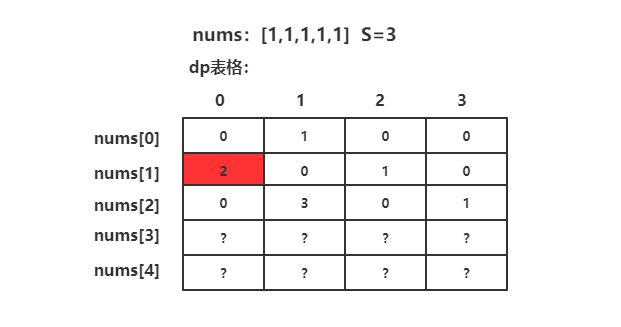
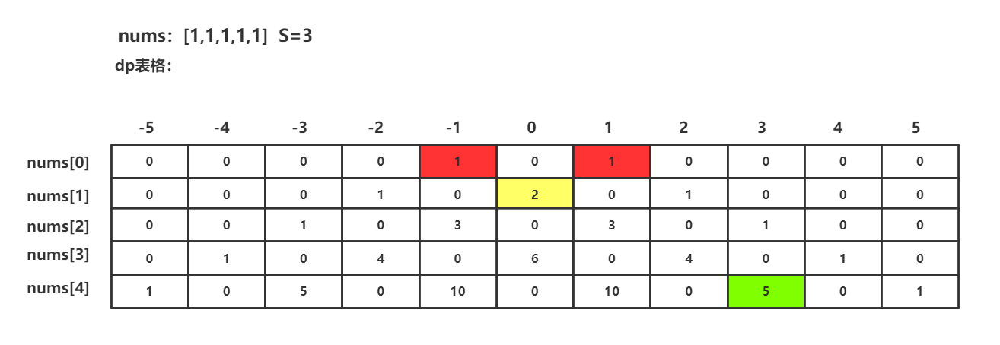

# [151. 翻转字符串里的单词](https://leetcode-cn.com/problems/reverse-words-in-a-string/)

给定一个字符串，逐个翻转字符串中的每个单词。

说明：

- 无空格字符构成一个 单词 。
- 输入字符串可以在前面或者后面包含多余的空格，但是反转后的字符不能包括。
- 如果两个单词间有多余的空格，将反转后单词间的空格减少到只含一个。

**示例 1：**

```
输入："the sky is blue"
输出："blue is sky the"
```

**示例 4：**

```
输入：s = "  Bob    Loves  Alice   "
输出："Alice Loves Bob"
```


没啥好说的

```java
class Solution {
    public String reverseWords(String s) {
        s = s.trim();
        int left = s.length();
        StringBuilder sb = new StringBuilder();
        for (int i = s.length() - 1; i >= 0; i--){
            char c = s.charAt(i);
            if (c == ' ' && s.charAt(i + 1) != ' '){
                sb.append(s, i + 1, left);
                sb.append(" ");
                while (s.charAt(i) == ' '){
                    i--;
                }
                left = i + 1;
            }
        }
        sb.append(s, 0, left);
        return sb.toString();
    }
}
执行用时：3 ms, 在所有 Java 提交中击败了96.13% 的用户
内存消耗：38.5 MB, 在所有 Java 提交中击败了71.30% 的用户
```

使用了 `StringBuilder` 写起来舒服一点，就导致耗时比较多。


# [153. 寻找旋转排序数组中的最小值](https://leetcode-cn.com/problems/find-minimum-in-rotated-sorted-array/)

已知一个长度为 n 的数组，预先按照升序排列，经由 1 到 n 次 旋转 后，得到输入数组。例如，原数组 nums = [0,1,2,4,5,6,7] 在变化后可能得到：

- 若旋转 `4` 次，则可以得到 `[4,5,6,7,0,1,2]`
- 若旋转 `7` 次，则可以得到 `[0,1,2,4,5,6,7]`

注意，数组 [a[0], a[1], a[2], ..., a[n-1]] 旋转一次 的结果为数组 [a[n-1], a[0], a[1], a[2], ..., a[n-2]] 。

给你一个元素值 互不相同 的数组 nums ，它原来是一个升序排列的数组，并按上述情形进行了多次旋转。请你找出并返回数组中的 最小元素 。

**示例 1：**

```
输入：nums = [3,4,5,1,2]
输出：1
解释：原数组为 [1,2,3,4,5] ，旋转 3 次得到输入数组。
```


本题与[81. 搜索旋转排序数组 II](https://leetcode-cn.com/problems/search-in-rotated-sorted-array-ii/)，[33. 搜索旋转排序数组](https://leetcode-cn.com/problems/search-in-rotated-sorted-array/) 高度相似，那么解法也是一样的。

```java
class Solution {
    public int findMin(int[] nums) {
        if (nums[0] < nums[nums.length - 1]){
            return nums[0];
        }

        int left = 0;
        int right = nums.length - 1;
        int mid = 0;
        while (left <= right){
            mid = left + (right - left) / 2;
            if (nums[mid] < nums[right]){
                right = mid;
            }else {
                left = mid + 1;
            }
        }
        return nums[mid];
    }
}
执行用时：0 ms, 在所有 Java 提交中击败了100.00% 的用户
内存消耗：37.8 MB, 在所有 Java 提交中击败了76.03% 的用户
```


# [155. 最小栈](https://leetcode-cn.com/problems/min-stack/)

设计一个支持 push ，pop ，top 操作，并能在常数时间内检索到最小元素的栈。

- push(x) —— 将元素 x 推入栈中。
- pop() —— 删除栈顶的元素。
- top() —— 获取栈顶元素。
- getMin() —— 检索栈中的最小元素。

 

示例:

```
输入：
["MinStack","push","push","push","getMin","pop","top","getMin"]
[[],[-2],[0],[-3],[],[],[],[]]

输出：
[null,null,null,null,-3,null,0,-2]

解释：
MinStack minStack = new MinStack();
minStack.push(-2);
minStack.push(0);
minStack.push(-3);
minStack.getMin();   --> 返回 -3.
minStack.pop();
minStack.top();      --> 返回 0.
minStack.getMin();   --> 返回 -2.
```


提示：

- pop、top 和 getMin 操作总是在 **非空栈** 上调用。


简单实现

```java
class MinStack {
    List<Integer> list = new ArrayList<>();
    Integer min = Integer.MAX_VALUE;

    /** initialize your data structure here. */
    public MinStack() {

    }
    
    public void push(int val) {
        list.add(val);
        min = Math.min(val, min);
    }

    public void pop() {
        list.remove(list.size() - 1);
        min = list.stream().min(Integer::compareTo).orElse(Integer.MAX_VALUE);
    }

    public int top() {
        return list.get(list.size() - 1);
    }

    public int getMin() {
        return min;
    }
}
执行用时：13 ms, 在所有 Java 提交中击败了8.25% 的用户
内存消耗：39.8 MB, 在所有 Java 提交中击败了97.47% 的用户
```

如果仅仅是实现功能，那么非常简单，但是一般来说需要考虑并发 -> `synchronized` 或者 `cas + volatile`。底层使用数组或者list，题目还需要可以在常数时间内得到最小值，如果使用空间换时间的方式的话，可以考虑小顶堆，在java里面体现为优先队列。


# [160. 相交链表](https://leetcode-cn.com/problems/intersection-of-two-linked-lists/)

编写一个程序，找到两个单链表相交的起始节点。

如下面的两个链表：


在节点 c1 开始相交。

 

示例 1：


```
输入：intersectVal = 8, listA = [4,1,8,4,5], listB = [5,0,1,8,4,5], skipA = 2, skipB = 3
输出：Reference of the node with value = 8
输入解释：相交节点的值为 8 （注意，如果两个链表相交则不能为 0）。从各自的表头开始算起，链表 A 为 [4,1,8,4,5]，链表 B 为 [5,0,1,8,4,5]。在 A 中，相交节点前有 2 个节点；在 B 中，相交节点前有 3 个节点。
```

示例 2：

```
输入：intersectVal = 2, listA = [0,9,1,2,4], listB = [3,2,4], skipA = 3, skipB = 1
输出：Reference of the node with value = 2
输入解释：相交节点的值为 2 （注意，如果两个链表相交则不能为 0）。从各自的表头开始算起，链表 A 为 [0,9,1,2,4]，链表 B 为 [3,2,4]。在 A 中，相交节点前有 3 个节点；在 B 中，相交节点前有 1 个节点。
```

示例 3：

```
输入：intersectVal = 0, listA = [2,6,4], listB = [1,5], skipA = 3, skipB = 2
输出：null
输入解释：从各自的表头开始算起，链表 A 为 [2,6,4]，链表 B 为 [1,5]。由于这两个链表不相交，所以 intersectVal 必须为 0，而 skipA 和 skipB 可以是任意值。
解释：这两个链表不相交，因此返回 null。
```

注意：

- 如果两个链表没有交点，返回 null.
- 在返回结果后，两个链表仍须保持原有的结构。
- 可假定整个链表结构中没有循环。
- 程序尽量满足 O(n) 时间复杂度，且仅用 O(1) 内存。


想法一

第一次遍历两条链表，找到长的链表比短的那条长多少。

第二次遍历，让长的那条先走完多出来的距离，然后两条链表同步向后，再判断节点是否相等。

```java
public class Solution {
    public ListNode getIntersectionNode(ListNode headA, ListNode headB) {
        int l1 = 0; 
        int l2 = 0;
        ListNode cur = headA;
        while(cur != null){
            cur = cur.next;
            l1++;
        }

        cur = headB;
        while(cur != null){
            cur = cur.next;
            l2++;
        }

        if(l2 > l1){
            int i = l2 - l1;
            while(i > 0){
                headB = headB.next;
                i--;
            }
        }else{
            int i = l1 - l2;
            while(i > 0){
                headA = headA.next;
                i--;
            }
        }

        while(headA != null){
            if(headA == headB){
                return headA;
            }
            headA = headA.next;
            headB = headB.next;
        }
        return null;
    }
}
```


想法二

两条链表拼起来，开始遍历，相等的那个点就是相交点。

```java
public class Solution {
    public ListNode getIntersectionNode(ListNode headA, ListNode headB) {
        int j = 0;
        ListNode nodeA = headA;
        ListNode nodeB = headB;
        while (nodeA != null && nodeB != null){
            nodeA = nodeA.next;
            nodeB = nodeB.next;
        }

        boolean aLonger = true;
        if (nodeA != null){
            while (nodeA != null){
                nodeA = nodeA.next;
                j++;
            }
        }

        if (nodeB != null){
            aLonger = false;
            while (nodeB != null){
                nodeB = nodeB.next;
                j++;
            }
        }

        nodeA = headA;
        nodeB = headB;

        if (aLonger){
            while (j > 0){
                nodeA = nodeA.next;
                j--;
            }
        }else {
            while (j > 0){
                nodeB = nodeB.next;
                j--;
            }
        }

        while (nodeA != null && nodeB != null){
            if (nodeA == nodeB){
                return nodeA;
            }
            nodeA = nodeA.next;
            nodeB = nodeB.next;
        }
        return null;
    }
}
```


官方

方法三：双指针法

创建两个指针 pA 和 pB，分别初始化为链表 A 和 B 的头结点。然后让它们向后逐结点遍历。
当 pA 到达链表的尾部时，将它重定位到链表 B 的头结点 (你没看错，就是链表 B); 类似的，当 pB 到达链表的尾部时，将它重定位到链表 A 的头结点。
若在某一时刻 pA 和 pB 相遇，则 pA/pB 为相交结点。
想弄清楚为什么这样可行, 可以考虑以下两个链表: `A={1,3,5,7,9,11} 和 B={2,4,9,11}`，相交于结点 9。 由于 `B.length (=4) < A.length (=6)`，pB 比 pA 少经过 2 个结点，会先到达尾部。将 pB 重定向到 A 的头结点，pA 重定向到 B 的头结点后，pB 要比 pA 多走 2 个结点。因此，它们会同时到达交点。
如果两个链表存在相交，它们末尾的结点必然相同。因此当 pA/pB 到达链表结尾时，记录下链表 A/B 对应的元素。若最后元素不相同，则两个链表不相交。

评论区答案

```java
public class Solution {
    public ListNode getIntersectionNode(ListNode headA, ListNode headB) {
        /**
        定义两个指针, 第一轮让两个到达末尾的节点指向另一个链表的头部, 最后如果相遇则为交点(在第一轮移动中恰好抹除了长度差)
        两个指针等于移动了相同的距离, 有交点就返回, 无交点就是各走了两条指针的长度
        **/
        if(headA == null || headB == null) return null;
        ListNode pA = headA, pB = headB;
        // 在这里第一轮体现在pA和pB第一次到达尾部会移向另一链表的表头, 而第二轮体现在如果pA或pB相交就返回交点, 不相交最后就是null==null
        while(pA != pB) {
            pA = pA == null ? headB : pA.next;
            pB = pB == null ? headA : pB.next;
        }
        return pA;
    }
}
```


# [162. 寻找峰值](https://leetcode-cn.com/problems/find-peak-element/) :star:

峰值元素是指其值大于左右相邻值的元素。

给你一个输入数组 nums，找到峰值元素并返回其索引。数组可能包含多个峰值，在这种情况下，返回 任何一个峰值 所在位置即可。

你可以假设 nums[-1] = nums[n] = -∞ 。

**示例 1：**

```
输入：nums = [1,2,3,1]
输出：2
解释：3 是峰值元素，你的函数应该返回其索引 2。
```

示例 2：

```
输入：nums = [1,2,1,3,5,6,4]
输出：1 或 5 
解释：你的函数可以返回索引 1，其峰值元素为 2；
     或者返回索引 5， 其峰值元素为 6。
```

**提示：**

- 1 <= nums.length <= 1000
- $-2^{31} <= nums[i] <= 2^{31} - 1$
- 对于所有有效的 i 都有 nums[i] != nums[i + 1]

**进阶：**你可以实现时间复杂度为 `O(logN)` 的解决方案吗？


依据提议，相邻的元素是不会相等的。依据进阶的 $O(logn)$ 让人联想到树的结构。但是除了线性的解题，我还是想不到别的方案。

```java
class Solution {
    public int findPeakElement(int[] nums) {
        if (nums.length == 1){
            return 0;
        }
        if (nums[0] > nums[1]){
            return 0;
        }
        if (nums[nums.length - 1] > nums[nums.length - 2]){
            return nums.length - 1;
        }

        for (int i = 1; i < nums.length - 1; i++) {
            if (nums[i] > nums[i - 1] && nums[i] > nums[i + 1]){
                return i;
            }
        }
        return -1;
    }
}
执行用时：0 ms, 在所有 Java 提交中击败了100.00% 的用户
内存消耗：38.1 MB, 在所有 Java 提交中击败了58.98% 的用户
```

我不是太懂，线性的解答为什么还是击败了100.00%……


官方

**方法一: 线性扫描**

```java
public class Solution {
    public int findPeakElement(int[] nums) {
        for (int i = 0; i < nums.length - 1; i++) {
            if (nums[i] > nums[i + 1])
                return i;
        }
        return nums.length - 1;
    }
}


作者：LeetCode
链接：https://leetcode-cn.com/problems/find-peak-element/solution/xun-zhao-feng-zhi-by-leetcode/
来源：力扣（LeetCode）
著作权归作者所有。商业转载请联系作者获得授权，非商业转载请注明出处。
```

可以分为3种情况来讨论，但是哪种情况都不需要判断前面那节。


**方法二：递归二分查找**

我们可以将 nums 数组中的任何给定序列视为交替的升序和降序序列。通过利用这一点，以及“可以返回任何一个峰作为结果”的要求，我们可以利用二分查找来找到所需的峰值元素。

在简单的二分查找中，我们处理的是一个有序数列，并通过在每一步减少搜索空间来找到所需要的数字。在本例中，我们对二分查找进行一点修改。首先从数组 nums 中找到中间的元素 mid。若该元素恰好位于降序序列或者一个局部下降坡度中（通过将 nums[i] 与右侧比较判断)，则说明峰值会在本元素的左边。于是，我们将搜索空间缩小为 mid 的左边(包括其本身)，并在左侧子数组上重复上述过程。

若该元素恰好位于升序序列或者一个局部上升坡度中（通过将 nums[i] 与右侧比较判断)，则说明峰值会在本元素的右边。于是，我们将搜索空间缩小为 mid 的右边，并在右侧子数组上重复上述过程。

就这样，我们不断地缩小搜索空间，直到搜索空间中只有一个元素，该元素即为峰值元素。

```java
public class Solution {
    public int findPeakElement(int[] nums) {
        return search(nums, 0, nums.length - 1);
    }
    public int search(int[] nums, int l, int r) {
        if (l == r)
            return l;
        int mid = (l + r) / 2;
        if (nums[mid] > nums[mid + 1])
            return search(nums, l, mid);
        return search(nums, mid + 1, r);
    }
}


作者：LeetCode
链接：https://leetcode-cn.com/problems/find-peak-element/solution/xun-zhao-feng-zhi-by-leetcode/
来源：力扣（LeetCode）
著作权归作者所有。商业转载请联系作者获得授权，非商业转载请注明出处。
```

巧妙的二分了斜率。


# [165. 比较版本号](https://leetcode-cn.com/problems/compare-version-numbers/)

给你两个版本号 `version1` 和 `version2` ，请你比较它们。

示例 1：

```
输入：version1 = "1.01", version2 = "1.001"
输出：0
解释：忽略前导零，"01" 和 "001" 都表示相同的整数 "1"
```

示例 2：

```
输入：version1 = "1.0", version2 = "1.0.0"
输出：0
解释：version1 没有指定下标为 2 的修订号，即视为 "0"
```


老老实实在写逻辑就可以了，偷懒使用了api，把所有的字符串转为了数据进行处理，当然会导致效率降低

```java
class Solution {
    public int compareVersion(String version1, String version2) {
        String[] split1 = version1.split("\\.");
        String[] split2 = version2.split("\\.");
        int length = Math.min(split1.length, split2.length);
        for (int i = 0; i < length; i++) {
            if (Integer.parseInt(split1[i]) > Integer.parseInt(split2[i])){
                return 1;
            }

            if (Integer.parseInt(split1[i]) < Integer.parseInt(split2[i])){
                return -1;
            }
        }

        if (split1.length == split2.length){
            return 0;
        }

        if (split1.length > split2.length){
            for (int i = split2.length; i < split1.length; i++){
                if (Integer.parseInt(split1[i]) != 0){
                    return 1;
                }
            }
            return 0;
        }

        for (int i = split1.length; i < split2.length; i++){
            if (Integer.parseInt(split2[i]) != 0){
                return -1;
            }
        }
        return 0;
    }
}
执行用时：1 ms, 在所有 Java 提交中击败了82.86% 的用户
内存消耗：36.4 MB, 在所有 Java 提交中击败了79.64% 的用户
```


# [167. 两数之和 II - 输入有序数组](https://leetcode-cn.com/problems/two-sum-ii-input-array-is-sorted/)

给定一个已按照 升序排列  的整数数组 numbers ，请你从数组中找出两个数满足相加之和等于目标数 target 。

函数应该以长度为 2 的整数数组的形式返回这两个数的下标值。numbers 的下标 从 1 开始计数 ，所以答案数组应当满足 1 <= answer[0] < answer[1] <= numbers.length 。

你可以假设每个输入只对应唯一的答案，而且你不可以重复使用相同的元素。


示例 1：

```
输入：numbers = [2,7,11,15], target = 9
输出：[1,2]
解释：2 与 7 之和等于目标数 9 。因此 index1 = 1, index2 = 2 。
```

示例 2：

```
输入：numbers = [2,3,4], target = 6
输出：[1,3]
```

示例 3：

```
输入：numbers = [-1,0], target = -1
输出：[1,2]
```


提示：

- 2 <= numbers.length <= 3 * 104
- -1000 <= numbers[i] <= 1000
- numbers 按 递增顺序 排列
- -1000 <= target <= 1000
- 仅存在一个有效答案


简单版本的 twoSum。首先考虑边界，可以直接排除很多无效的用例，毕竟题目没有说有且仅有一个有效答案。当全为正数时，可以先用二分的方式，缩写数组的长度。之后使用左右指针的方式，每次可以尝试用二分的方式多移动几格。

```java
class Solution {
    public int[] twoSum(int[] numbers, int target) {
        if (numbers[0] > target) return null;

        int l = 0;
        int r = numbers.length - 1;
        int mid = r;
        if (numbers[0] >= 0){
            while (l <= r){
                mid = (r - l) / 2 + l;
                if (numbers[mid] > target) {
                    r = mid - 1;
                }else if (numbers[mid] == target){
                    break;
                }else {
                    l = mid + 1;
                }
            }
        }

        l = 0;
        r = mid;
        while (l < r){
            int val = numbers[l] + numbers[r];
            if (val == target){
                return new int[]{l + 1, r + 1};
            }

            if (val > target){
                r--;
            }else {
                l++;
            }
        }
        return null;
    }
}
执行用时：0 ms, 在所有 Java 提交中击败了100.00% 的用户
内存消耗：38.8 MB, 在所有 Java 提交中击败了26.95% 的用户
```


# [169. 多数元素](https://leetcode-cn.com/problems/majority-element/)

给定一个大小为 n 的数组，找到其中的多数元素。多数元素是指在数组中出现次数 **大于 ⌊ n/2 ⌋** 的元素。

你可以假设数组是非空的，并且给定的数组总是存在多数元素。

**示例 1：**

```
输入：[3,2,3]
输出：3
```

**示例 2：**

```
输入：[2,2,1,1,1,2,2]
输出：2
```


题目要求大于一半，那么肯定有且只有一个数字会大于一半了，2种思路：

第一种：排序，然后一个个遍历，取相同字符的第 n / 2 + 1个元素的值

第二种：找个map统计。 

```java
class Solution {
    public int majorityElement(int[] nums) {
        Arrays.sort(nums);

        int i = 0;
        int length = nums.length / 2;
        while (i < nums.length){
            if (nums[i] == nums[i + length]){
               break;
            }
            i++;
        }
        return nums[i];
    }
}
执行用时：3 ms, 在所有 Java 提交中击败了37.78% 的用户
内存消耗：41.6 MB, 在所有 Java 提交中击败了75.71% 的用户
```


官方

```java
class Solution {
    public int majorityElement(int[] nums) {
        Arrays.sort(nums);
        return nums[nums.length / 2];
    }
}
```

简直了


最佳

[摩尔投票法](https://leetcode-cn.com/problems/shu-zu-zhong-chu-xian-ci-shu-chao-guo-yi-ban-de-shu-zi-lcof/solution/mian-shi-ti-39-shu-zu-zhong-chu-xian-ci-shu-chao-3/)


# [203. 移除链表元素](https://leetcode-cn.com/problems/remove-linked-list-elements/)

给你一个链表的头节点 `head` 和一个整数 `val` ，请你删除链表中所有满足 `Node.val == val` 的节点，并返回 **新的头节点** 。

非常标准的简单题，链表操作上手。


```java
class Solution {
    public ListNode removeElements(ListNode head, int val) {
        if (head == null) return null;
        ListNode first = new ListNode();
        first.next = head;

        ListNode pre = first;
        ListNode cur = head;
        while (cur != null){
            if (cur.val == val){
                pre.next = cur.next;
            }else {
                pre = cur;
            }
            cur = cur.next;
        }
        return first.next;
    }
}
执行用时：1 ms, 在所有 Java 提交中击败了99.70% 的用户
内存消耗：39.4 MB, 在所有 Java 提交中击败了29.45% 的用户
```


# [206. 反转链表](https://leetcode-cn.com/problems/reverse-linked-list/)

反转一个单链表。

示例:

```
输入: 1->2->3->4->5->NULL
输出: 5->4->3->2->1->NULL
```


进阶:
你可以迭代或递归地反转链表。你能否用两种方法解决这道题？


```java
class Solution {
    public ListNode reverseList(ListNode head) {
        ListNode pre = null;
        if(head == null) return null;

        while (true){
            ListNode next = head.next;
            head.next = pre;
            pre = head;

            if (next == null) {
                break;
            }
            head = next;
        }

        return head;
    }
}
```


官方

 **方法一：迭代**

```java
class Solution {
    public ListNode reverseList(ListNode head) {
        ListNode prev = null;
        ListNode curr = head;
        while (curr != null) {
            ListNode nextTemp = curr.next;
            curr.next = prev;
            prev = curr;
            curr = nextTemp;
        }
        return prev;
    }
}


作者：LeetCode
链接：https://leetcode-cn.com/problems/reverse-linked-list/solution/fan-zhuan-lian-biao-by-leetcode/
来源：力扣（LeetCode）
著作权归作者所有。商业转载请联系作者获得授权，非商业转载请注明出处。
```


**方法二：递归**

```java
class Solution {
    public ListNode reverseList(ListNode head) {
        if (head == null || head.next == null) {
            return head;
        }
        ListNode p = reverseList(head.next);
        head.next.next = head;
        head.next = null;
        return p;
    }
}


作者：LeetCode
链接：https://leetcode-cn.com/problems/reverse-linked-list/solution/fan-zhuan-lian-biao-by-leetcode/
来源：力扣（LeetCode）
著作权归作者所有。商业转载请联系作者获得授权，非商业转载请注明出处。
```

这个递归理解起来有点困难

评论区

> - 假设链表是`[1, 2, 3, 4, 5]`从最底层最后一个reverseList(5)来看
>
> 1. 返回了5这个节点
> 2. reverseList(4)中
> 3. p为5
> 4. head.next.next = head 相当于 5 -> 4
> 5. 现在节点情况为 4 -> 5 -> 4
> 6. head.next = null,切断4 -> 5 这一条，现在只有 5 -> 4
> 7. 返回（return）p为5，5 -> 4
> 8. 返回上一层reverseList(3)
> 9. 处理完后返回的是4 -> 3
> 10. 依次向上

```
reverseList: head=1
    reverseList: head=2
	    reverseList: head=3
		    reverseList:head=4
			    reverseList:head=5 
					终止返回
				cur = 5
				4.next.next->4，即5->4
			cur=5
			3.next.next->3，即4->3
		cur = 5
		2.next.next->2，即3->2
	cur = 5
	1.next.next->1，即2->1
	
	最后返回cur
```


# [215. 数组中的第K个最大元素](https://leetcode-cn.com/problems/kth-largest-element-in-an-array/) :star:

在未排序的数组中找到第 k 个最大的元素。请注意，你需要找的是数组排序后的第 k 个最大的元素，而不是第 k 个不同的元素。

示例 1:

```
输入: [3,2,1,5,6,4] 和 k = 2
输出: 5
```

**示例 2:**

```
输入: [3,2,3,1,2,4,5,5,6] 和 k = 4
输出: 4
```


思考

还想个p，直接排序后去取指定下标的值就行了。

```java
class Solution {
    public int findKthLargest(int[] nums, int k) {
        Arrays.sort(nums);
        return nums[nums.length - k];
    }
}
执行用时：2 ms, 在所有 Java 提交中击败了90.92% 的用户
内存消耗：38.5 MB, 在所有 Java 提交中击败了92.19% 的用户
```

这里想考察的应该是堆的实现与快速选择排序


官方

**快速选择**

由此可以发现每次经过「划分」操作后，我们一定可以确定一个元素的最终位置，即 x 的最终位置为 q，并且保证 $a[l \cdots q - 1]$ 中的每个元素小于等于 $a[q]$，且 $a[q]$ 小于等于 $a[q + 1 \cdots r]$ 中的每个元素。所以只要某次划分的 q 为倒数第 k 个下标的时候，我们就已经找到了答案。 我们只关心这一点，至于 $a[l \cdots q - 1]$ 和 $a[q+1 \cdots r]$ 是否是有序的，我们不关心。

因此我们可以改进快速排序算法来解决这个问题：在分解的过程当中，我们会对子数组进行划分，如果划分得到的 qqq 正好就是我们需要的下标，就直接返回 $a[q]$；否则，如果 q 比目标下标小，就递归右子区间，否则递归左子区间。这样就可以把原来递归两个区间变成只递归一个区间，提高了时间效率。这就是「快速选择」算法。

```java
class Solution {
    Random random = new Random();

    public int findKthLargest(int[] nums, int k) {
        return quickSelect(nums, 0, nums.length - 1, nums.length - k);
    }

    public int quickSelect(int[] a, int l, int r, int index) {
        int q = randomPartition(a, l, r);
        if (q == index) {
            return a[q];
        } else {
            return q < index ? quickSelect(a, q + 1, r, index) : quickSelect(a, l, q - 1, index);
        }
    }

    public int randomPartition(int[] a, int l, int r) {
        int i = random.nextInt(r - l + 1) + l;
        swap(a, i, r);
        return partition(a, l, r);
    }

    public int partition(int[] a, int l, int r) {
        int x = a[r], i = l - 1;
        for (int j = l; j < r; ++j) {
            if (a[j] <= x) {
                swap(a, ++i, j);
            }
        }
        swap(a, i + 1, r);
        return i + 1;
    }

    public void swap(int[] a, int i, int j) {
        int temp = a[i];
        a[i] = a[j];
        a[j] = temp;
    }
}


作者：LeetCode-Solution
链接：https://leetcode-cn.com/problems/kth-largest-element-in-an-array/solution/shu-zu-zhong-de-di-kge-zui-da-yuan-su-by-leetcode-/
来源：力扣（LeetCode）
著作权归作者所有。商业转载请联系作者获得授权，非商业转载请注明出处。
```


**方法二：基于堆排序的选择方法**


# [217. 存在重复元素](https://leetcode-cn.com/problems/contains-duplicate/)

给定一个整数数组，判断是否存在重复元素。

如果存在一值在数组中出现至少两次，函数返回 true 。如果数组中每个元素都不相同，则返回 false 。

示例 1:

```
输入: [1,2,3,1]
输出: true
```


# [230. 二叉搜索树中第K小的元素](https://leetcode-cn.com/problems/kth-smallest-element-in-a-bst/)

给定一个二叉搜索树的根节点 root ，和一个整数 k ，请你设计一个算法查找其中第 k 个最小元素（从 1 开始计数）。

示例 1：


```
输入：root = [3,1,4,null,2], k = 1
输出：1
```

示例 2：


```
输入：root = [5,3,6,2,4,null,null,1], k = 3
输出：3
```

提示：

- 树中的节点数为 n 。
- 1 <= k <= n <= 104
- 0 <= Node.val <= 104


进阶：如果二叉搜索树经常被修改（插入/删除操作）并且你需要频繁地查找第 k 小的值，你将如何优化算法？


思考

由于是二叉搜索树，根据树的性质，中序遍历的结果为一个从小到大的数组，那么找到第k个即可。

```java
class Solution {
    int i = -1;
    int cur = 1;
    boolean condition = true;

    public int kthSmallest(TreeNode root, int k) {
        dfs(root, k);
        return i;
    }

    public void dfs(TreeNode root, int k){
        if (root == null){
            return;
        }

        dfs(root.left, k);
        if (cur == k && condition){
            i = root.val;
            condition = false;
            return;
        }else {
            cur++;
        }
        dfs(root.right, k);
    }
}
执行用时：0 ms, 在所有 Java 提交中击败了100.00% 的用户
内存消耗：38.1 MB, 在所有 Java 提交中击败了84.47% 的用户
```


官方

**方法一：递归**

**算法：**

通过构造 BST 的中序遍历序列，则第 `k-1` 个元素就是第 `k` 小的元素。

```java
class Solution {
  public ArrayList<Integer> inorder(TreeNode root, ArrayList<Integer> arr) {
    if (root == null) return arr;
    inorder(root.left, arr);
    arr.add(root.val);
    inorder(root.right, arr);
    return arr;
  }

  public int kthSmallest(TreeNode root, int k) {
    ArrayList<Integer> nums = inorder(root, new ArrayList<Integer>());
    return nums.get(k - 1);
  }
}


作者：LeetCode
链接：https://leetcode-cn.com/problems/kth-smallest-element-in-a-bst/solution/er-cha-sou-suo-shu-zhong-di-kxiao-de-yuan-su-by-le/
来源：力扣（LeetCode）
著作权归作者所有。商业转载请联系作者获得授权，非商业转载请注明出处。
```

**方法二：迭代**

**算法：**

在栈的帮助下，可以将方法一的递归转换为迭代，这样可以加快速度，因为这样可以不用遍历整个树，可以在找到答案后停止。

```java
class Solution {
  public int kthSmallest(TreeNode root, int k) {
    LinkedList<TreeNode> stack = new LinkedList<TreeNode>();

    while (true) {
      while (root != null) {
        stack.add(root);
        root = root.left;
      }
      root = stack.removeLast();
      if (--k == 0) return root.val;
      root = root.right;
    }
  }
}


作者：LeetCode
链接：https://leetcode-cn.com/problems/kth-smallest-element-in-a-bst/solution/er-cha-sou-suo-shu-zhong-di-kxiao-de-yuan-su-by-le/
来源：力扣（LeetCode）
著作权归作者所有。商业转载请联系作者获得授权，非商业转载请注明出处。
```


# [231. 2的幂](https://leetcode-cn.com/problems/power-of-two/)

给定一个整数，编写一个函数来判断它是否是 2 的幂次方。

**示例 1:**

```
输入: 1
输出: true
解释: 2^0= 1
```

**示例 2:**

```
输入: 16
输出: true
解释: 2^4 = 16
```

**示例 3:**

```
输入: 218
输出: false
```


朴素的想法就是不断的除2看是否能整除。

```java
class Solution {
    public boolean isPowerOfTwo(int n) {
        int i = 1;
        while (i <= n){
            if (n == i){
                return true;
            }
            i = i * 2;
        }
        return false;
    }
}
```

超出时间限制了。


评论区

位运算，以32位二进制来考虑，要是2的幂，32就只能有一位为1，其余位为0。所以：

```java
class Solution {
    public boolean isPowerOfTwo(int n) {
        if(n <= 0)
            return false;
        return (n & (n-1)) == 0;
    }
}
```

```
例子：
5 -> 0101
4 -> 0100
5&4 = 0101

8 -> 10
7 -> 0111
8&7
```


# [235. 二叉搜索树的最近公共祖先](https://leetcode-cn.com/problems/lowest-common-ancestor-of-a-binary-search-tree/)

给定一个二叉搜索树, 找到该树中两个指定节点的最近公共祖先。

百度百科中最近公共祖先的定义为：“对于有根树 T 的两个结点 p、q，最近公共祖先表示为一个结点 x，满足 x 是 p、q 的祖先且 x 的深度尽可能大（一个节点也可以是它自己的祖先）。”

例如，给定如下二叉搜索树:  root = [6,2,8,0,4,7,9,null,null,3,5]


示例 1:

```
输入: root = [6,2,8,0,4,7,9,null,null,3,5], p = 2, q = 8
输出: 6 
解释: 节点 2 和节点 8 的最近公共祖先是 6。
```

示例 2:

```
输入: root = [6,2,8,0,4,7,9,null,null,3,5], p = 2, q = 4
输出: 2
解释: 节点 2 和节点 4 的最近公共祖先是 2, 因为根据定义最近公共祖先节点可以为节点本身。
```

说明:

- 所有节点的值都是唯一的。
- p、q 为不同节点且均存在于给定的二叉搜索树中。


利用二叉搜索树的性质，总结规律

```java
class Solution {
    public TreeNode lowestCommonAncestor(TreeNode root, TreeNode p, TreeNode q) {
        TreeNode min;
        TreeNode max;
        if (p.val < q.val){
            min = p;
            max = q;
        }else {
            min = q;
            max = p;
        }

        while (root != null){
            if (root.val > min.val && root.val < max.val) {
                return root;
            }

            if (root.val > min.val && root.val > max.val){
                root = root.left;
                continue;
            }

            if (root.val < min.val && root.val < max.val){
                root = root.right;
                continue;
            }

            if (root.val == min.val){
                return root;
            }

            if (root.val == max.val){
                return max;
            }
        }
        return null;
    }
}
执行用时：6 ms, 在所有 Java 提交中击败了100.00% 的用户
内存消耗：39.3 MB, 在所有 Java 提交中击败了57.11% 的用户
```


评论区

Java递归，三行解决

```java
class Solution {
    public TreeNode lowestCommonAncestor(TreeNode root, TreeNode p, TreeNode q) {
        if(root.val < p.val && root.val < q.val) return lowestCommonAncestor(root.right, p, q);
        if(root.val > p.val && root.val > q.val) return lowestCommonAncestor(root.left, p, q);
        return root;
    }
}
https://leetcode-cn.com/problems/lowest-common-ancestor-of-a-binary-search-tree/solution/er-cha-sou-suo-shu-de-zui-jin-gong-gong-zu-xian-26/607624
```


# [236. 二叉树的最近公共祖先](https://leetcode-cn.com/problems/lowest-common-ancestor-of-a-binary-tree/) :star:

给定一个二叉树, 找到该树中两个指定节点的最近公共祖先。

百度百科中最近公共祖先的定义为：“对于有根树 T 的两个节点 p、q，最近公共祖先表示为一个节点 x，满足 x 是 p、q 的祖先且 x 的深度尽可能大（一个节点也可以是它自己的祖先）。”

示例 1：


```
输入：root = [3,5,1,6,2,0,8,null,null,7,4], p = 5, q = 1
输出：3
解释：节点 5 和节点 1 的最近公共祖先是节点 3 。
```

示例 2：

```
输入：root = [3,5,1,6,2,0,8,null,null,7,4], p = 5, q = 4
输出：5
解释：节点 5 和节点 4 的最近公共祖先是节点 5 。因为根据定义最近公共祖先节点可以为节点本身。
```

示例 3：

```
输入：root = [1,2], p = 1, q = 2
输出：1
```


提示：

- 树中节点数目在范围 [2, 105] 内。
- -109 <= Node.val <= 109
- 所有 Node.val 互不相同 。
- p != q
- p 和 q 均存在于给定的二叉树中。


思考

与235相比，没有了搜索树的性质，就是一颗普通的二叉树，那就只能硬遍历，然后在map里记录父节点信息，当找到2个节点之后，再从记录里面找到最近的公共节点了，接近与暴力查找。

```java
class Solution {
    public Map<Integer, TreeNode> parentMap = new HashMap<>();

    public TreeNode lowestCommonAncestor(TreeNode root, TreeNode p, TreeNode q) {
        List<Integer> list = new ArrayList<>();
        dfs(root, null);
        while (p != null){
            list.add(p.val);
            p = parentMap.get(p.val);
        }

        while (q != null){
            if (list.contains(q.val)){
                return q;
            }
            q = parentMap.get(q.val);
        }

        return null;
    }

    public void dfs(TreeNode cur, TreeNode parent){
        if (cur == null){
            return;
        }
        parentMap.put(cur.val, parent);
        dfs(cur.left, cur);
        dfs(cur.right, cur);
    }
}
执行用时：12 ms, 在所有 Java 提交中击败了13.67% 的用户
内存消耗：40.7 MB, 在所有 Java 提交中击败了37.19% 的用户
```


官方的估计是为了严谨，每次都写的很抽象

**评论区高赞**

**解题思路：**

祖先的定义： 若节点 p 在节点 root 的左（右）子树中，或 p = root ，则称 root 是 p 的祖先。

最近公共祖先的定义： 设节点 root 为节点 p,q 的某公共祖先，若其左子节点 root.left 和右子节点 root.right 都不是 p,q 的公共祖先，则称 root 是 “最近的公共祖先” 。

根据以上定义，若 root 是 p,q 的 最近公共祖先 ，则只可能为以下情况之一：

- p 和 q 在 root 的子树中，且分列 root 的 异侧（即分别在左、右子树中）；
- p=root ，且 q 在 root 的左或右子树中；
- q=root ，且 p 在 root 的左或右子树中；


考虑通过递归对二叉树进行后序遍历，当遇到节点 p 或 q 时返回。从底至顶回溯，当节点 p,q 在节点 root 的异侧时，节点 root 即为最近公共祖先，则向上返回 root 。

**递归解析：**

1. 终止条件：
   - 当越过叶节点，则直接返回 null ；    
   - 当 root 等于 p,q ，则直接返回 root ；
2. 递推工作：
   - 开启递归左子节点，回值记为 left ；    
   - 开启递归右子节点，返回值记为 right ；
3. 返回值： 根据 left 和 right ，可展开为四种情况；
   - 当 left 和 right 同时为空 ：说明 root 的左 / 右子树中都不包含 p,q ，返回 null ；
   - 当 left 和 right 同时不为空 ：说明 p,q 分列在 root 的 异侧 （分别在 左 / 右子树），因此 root 为最近公共祖先，返回 root ；
   - 当 left 为空 ，right 不为空 ：p,q 都不在 root 的左子树中，直接返回 right 。具体可分为两种情况：
     -  p,q 其中一个在 root 的 右子树 中，此时 right 指向 ppp（假设为 ppp ）；
     -  p,q 两节点都在 root 的 右子树 中，此时的 right 指向 最近公共祖先节点 ；

   - 当 left 不为空 ， right 为空 ：与情况 3. 同理；

```java
class Solution {
    public TreeNode lowestCommonAncestor(TreeNode root, TreeNode p, TreeNode q) {
        if(root == null || root == p || root == q) return root;
        TreeNode left = lowestCommonAncestor(root.left, p, q);
        TreeNode right = lowestCommonAncestor(root.right, p, q);
        if(left == null && right == null) return null; // 1.
        if(left == null) return right; // 3.
        if(right == null) return left; // 4.
        return root; // 2. if(left != null and right != null)
    }
}


作者：jyd
链接：https://leetcode-cn.com/problems/lowest-common-ancestor-of-a-binary-tree/solution/236-er-cha-shu-de-zui-jin-gong-gong-zu-xian-hou-xu/
来源：力扣（LeetCode）
著作权归作者所有。商业转载请联系作者获得授权，非商业转载请注明出处。
```


官方

**方法一：递归**

思路和算法

我们递归遍历整棵二叉树，定义 $f_x$ 表示 x 节点的子树中是否包含 p 节点或 q 节点，如果包含为 true，否则为 false。那么符合条件的最近公共祖先 x 一定满足如下条件：
$$
(f_{\text{lson}}\ \&\&\ f_{\text{rson}})\ ||\ ((x\ =\ p\ ||\ x\ =\ q)\ \&\&\ (f_{\text{lson}}\ ||\ f_{\text{rson}})) 
$$


其中 $\text{lson}$ 和 $\text{rson}$ 分别代表 x 节点的左孩子和右孩子。初看可能会感觉条件判断有点复杂，我们来一条条看，$f_{\text{lson}}\ \&\&\ f_{\text{rson}}$ 说明左子树和右子树均包含 p 节点或 q 节点，如果左子树包含的是 p 节点，那么右子树只能包含 q 节点，反之亦然，因为 p 节点和 q 节点都是不同且唯一的节点，因此如果满足这个判断条件即可说明 x 就是我们要找的最近公共祖先。再来看第二条判断条件，这个判断条件即是考虑了 x 恰好是 p 节点或 q 节点且它的左子树或右子树有一个包含了另一个节点的情况，因此如果满足这个判断条件亦可说明 x 就是我们要找的最近公共祖先。

```java
class Solution {

    private TreeNode ans;

    public Solution() {
        this.ans = null;
    }

    private boolean dfs(TreeNode root, TreeNode p, TreeNode q) {
        if (root == null) return false;
        boolean lson = dfs(root.left, p, q);
        boolean rson = dfs(root.right, p, q);
        if ((lson && rson) || ((root.val == p.val || root.val == q.val) && (lson || rson))) {
            ans = root;
        } 
        return lson || rson || (root.val == p.val || root.val == q.val);
    }

    public TreeNode lowestCommonAncestor(TreeNode root, TreeNode p, TreeNode q) {
        this.dfs(root, p, q);
        return this.ans;
    }
}


作者：LeetCode-Solution
链接：https://leetcode-cn.com/problems/lowest-common-ancestor-of-a-binary-tree/solution/er-cha-shu-de-zui-jin-gong-gong-zu-xian-by-leetc-2/
来源：力扣（LeetCode）
著作权归作者所有。商业转载请联系作者获得授权，非商业转载请注明出处。
```


方法二：存储父节点

思路

我们可以用哈希表存储所有节点的父节点，然后我们就可以利用节点的父节点信息从 p 结点开始不断往上跳，并记录已经访问过的节点，再从 q 节点开始不断往上跳，如果碰到已经访问过的节点，那么这个节点就是我们要找的最近公共祖先。

算法

- 从根节点开始遍历整棵二叉树，用哈希表记录每个节点的父节点指针。
- 从 p 节点开始不断往它的祖先移动，并用数据结构记录已经访问过的祖先节点。
- 同样，我们再从 q 节点开始不断往它的祖先移动，如果有祖先已经被访问过，即意味着这是 p 和 q 的深度最深的公共祖先，即 LCA 节点。

```java
class Solution {
    Map<Integer, TreeNode> parent = new HashMap<Integer, TreeNode>();
    Set<Integer> visited = new HashSet<Integer>();

    public void dfs(TreeNode root) {
        if (root.left != null) {
            parent.put(root.left.val, root);
            dfs(root.left);
        }
        if (root.right != null) {
            parent.put(root.right.val, root);
            dfs(root.right);
        }
    }

    public TreeNode lowestCommonAncestor(TreeNode root, TreeNode p, TreeNode q) {
        dfs(root);
        while (p != null) {
            visited.add(p.val);
            p = parent.get(p.val);
        }
        while (q != null) {
            if (visited.contains(q.val)) {
                return q;
            }
            q = parent.get(q.val);
        }
        return null;
    }
}


作者：LeetCode-Solution
链接：https://leetcode-cn.com/problems/lowest-common-ancestor-of-a-binary-tree/solution/er-cha-shu-de-zui-jin-gong-gong-zu-xian-by-leetc-2/
来源：力扣（LeetCode）
著作权归作者所有。商业转载请联系作者获得授权，非商业转载请注明出处。
```


# [237. 删除链表中的节点](https://leetcode-cn.com/problems/delete-node-in-a-linked-list/)

请编写一个函数，使其可以删除某个链表中给定的（非末尾）节点。传入函数的唯一参数为 要被删除的节点 。

现有一个链表 -- head = [4,5,1,9]，它可以表示为:

 


示例 1：

```
输入：head = [4,5,1,9], node = 5
输出：[4,1,9]
解释：给定你链表中值为 5 的第二个节点，那么在调用了你的函数之后，该链表应变为 4 -> 1 -> 9.

来源：力扣（LeetCode）
链接：https://leetcode-cn.com/problems/delete-node-in-a-linked-list
著作权归领扣网络所有。商业转载请联系官方授权，非商业转载请注明出处。
```

示例 2：

```
输入：head = [4,5,1,9], node = 1
输出：[4,5,9]
解释：给定你链表中值为 1 的第三个节点，那么在调用了你的函数之后，该链表应变为 4 -> 5 -> 9.
```

 

提示：

- 链表至少包含两个节点。
- 链表中所有节点的值都是唯一的。
- 给定的节点为非末尾节点并且一定是链表中的一个有效节点。
- 不要从你的函数中返回任何结果。


思考

这里不会给你头结点，而是给的被删除的节点，拿不到前置节点，所以不能直接改指针。

但是，仔细审题后，发现没有禁止对链表本身进行修改，那么就可以换值了。把当前要被删的节点的值与后序节点的值进行替换即可。

```java
class Solution {
    public void deleteNode(ListNode node) {
        ListNode pre = null;
        while (node.next != null){
            node.val = node.next.val;
            pre = node;
            node = node.next;
        }
        pre.next = null;
    }
}
```


官方

既然不能干掉自己，那就变成别人然后把他干掉就好了

```ruby
class Solution {
    public void deleteNode(ListNode node) {
        node.val = node.next.val;    //变成下个倒霉蛋
        node.next = node.next.next;  //把倒霉蛋干掉。
    }
}
```

看了答案之后发现我还是想差了，只要交换一次，然后就可以操作next指向之后的那个节点了，不需要变后序所有的。


# [238. 除自身以外数组的乘积](https://leetcode-cn.com/problems/product-of-array-except-self/) :new_moon_with_face:

给你一个长度为 n 的整数数组 nums，其中 n > 1，返回输出数组 output ，其中 output[i] 等于 nums 中除 nums[i] 之外其余各元素的乘积。

 

示例:

```
输入: [1,2,3,4]
输出: [24,12,8,6]
```

提示：题目数据保证数组之中任意元素的全部前缀元素和后缀（甚至是整个数组）的乘积都在 32 位整数范围内。

说明: 请不要使用除法，且在 O(n) 时间复杂度内完成此题。

进阶：
你可以在常数空间复杂度内完成这个题目吗？（ 出于对空间复杂度分析的目的，输出数组不被视为额外空间。）


思考

本来是所有的元素乘起来，要哪个除哪个，结果题目限制不能使用除法。那题目的本意应该不是去让你模拟除法。

那除了暴力解，就已经想不到思路了。


官方

**前言**

这似乎是一个简单的问题，可以在线性时间和空间内解决。先计算给定数组所有元素的乘积，然后对数组中的每个元素 x，将总的乘积除以 x 来求得除自身值的以外数组的乘积。

然而这样的解决方法有一个问题，就是如果输入数组中出现 0，那么这个方法就失效了。而且在问题中说明了不允许使用除法运算。这增加了这个问题的难度。

**方法一：左右乘积列表**

**思路**

我们不必将所有数字的乘积除以给定索引处的数字得到相应的答案，而是利用索引左侧所有数字的乘积和右侧所有数字的乘积（即前缀与后缀）相乘得到答案。

对于给定索引 i，我们将使用它左边所有数字的乘积乘以右边所有数字的乘积。下面让我们更加具体的描述这个算法。

**算法**

- 初始化两个空数组 L 和 R。对于给定索引 i，L[i] 代表的是 i 左侧所有数字的乘积，R[i] 代表的是 i 右侧所有数字的乘积。
- 我们需要用两个循环来填充 L 和 R 数组的值。对于数组 L，L[0] 应该是 1，因为第一个元素的左边没有元素。对于其他元素：$L[i] = L[i-1] * nums[i-1]$。
- 同理，对于数组 R，R[length-1] 应为 1。length 指的是输入数组的大小。其他元素：$R[i] = R[i+1] * nums[i+1]$。
- 当 R 和 L 数组填充完成，我们只需要在输入数组上迭代，且索引 i 处的值为：$L[i] * R[i]$。

```java
class Solution {
    public int[] productExceptSelf(int[] nums) {
        int length = nums.length;

        // L 和 R 分别表示左右两侧的乘积列表
        int[] L = new int[length];
        int[] R = new int[length];

        int[] answer = new int[length];

        // L[i] 为索引 i 左侧所有元素的乘积
        // 对于索引为 '0' 的元素，因为左侧没有元素，所以 L[0] = 1
        L[0] = 1;
        for (int i = 1; i < length; i++) {
            L[i] = nums[i - 1] * L[i - 1];
        }

        // R[i] 为索引 i 右侧所有元素的乘积
        // 对于索引为 'length-1' 的元素，因为右侧没有元素，所以 R[length-1] = 1
        R[length - 1] = 1;
        for (int i = length - 2; i >= 0; i--) {
            R[i] = nums[i + 1] * R[i + 1];
        }

        // 对于索引 i，除 nums[i] 之外其余各元素的乘积就是左侧所有元素的乘积乘以右侧所有元素的乘积
        for (int i = 0; i < length; i++) {
            answer[i] = L[i] * R[i];
        }

        return answer;
    }
}


作者：LeetCode-Solution
链接：https://leetcode-cn.com/problems/product-of-array-except-self/solution/chu-zi-shen-yi-wai-shu-zu-de-cheng-ji-by-leetcode-/
来源：力扣（LeetCode）
著作权归作者所有。商业转载请联系作者获得授权，非商业转载请注明出处。
```

**方法二：空间复杂度 O(1) 的方法**

**思路**

尽管上面的方法已经能够很好的解决这个问题，但是空间复杂度并不为常数。

由于输出数组不算在空间复杂度内，那么我们可以将 L 或 R 数组用输出数组来计算。先把输出数组当作 L 数组来计算，然后再动态构造 R 数组得到结果。让我们来看看基于这个思想的算法。

**算法**

- 初始化 answer 数组，对于给定索引 i，answer[i] 代表的是 i 左侧所有数字的乘积。
- 构造方式与之前相同，只是我们试图节省空间，先把 answer 作为方法一的 L 数组。
- 这种方法的唯一变化就是我们没有构造 R 数组。而是用一个遍历来跟踪右边元素的乘积。并更新数组 $answer[i]=answer[i]*R$。然后 R 更新为 $R=R∗nums[i]$，其中变量 R 表示的就是索引右侧数字的乘积。

```java
class Solution {
    public int[] productExceptSelf(int[] nums) {
        int length = nums.length;
        int[] answer = new int[length];

        // answer[i] 表示索引 i 左侧所有元素的乘积
        // 因为索引为 '0' 的元素左侧没有元素， 所以 answer[0] = 1
        answer[0] = 1;
        for (int i = 1; i < length; i++) {
            answer[i] = nums[i - 1] * answer[i - 1];
        }

        // R 为右侧所有元素的乘积
        // 刚开始右边没有元素，所以 R = 1
        int R = 1;
        for (int i = length - 1; i >= 0; i--) {
            // 对于索引 i，左边的乘积为 answer[i]，右边的乘积为 R
            answer[i] = answer[i] * R;
            // R 需要包含右边所有的乘积，所以计算下一个结果时需要将当前值乘到 R 上
            R *= nums[i];
        }
        return answer;
    }
}


作者：LeetCode-Solution
链接：https://leetcode-cn.com/problems/product-of-array-except-self/solution/chu-zi-shen-yi-wai-shu-zu-de-cheng-ji-by-leetcode-/
来源：力扣（LeetCode）
著作权归作者所有。商业转载请联系作者获得授权，非商业转载请注明出处。
```


# [292. Nim 游戏](https://leetcode-cn.com/problems/nim-game/)

你和你的朋友，两个人一起玩 Nim 游戏：

- 桌子上有一堆石头。
- 你们轮流进行自己的回合，你作为先手。
- 每一回合，轮到的人拿掉 1 - 3 块石头。
- 拿掉最后一块石头的人就是获胜者。

假设你们每一步都是最优解。请编写一个函数，来判断你是否可以在给定石头数量为 n 的情况下赢得游戏。如果可以赢，返回 true；否则，返回 false 。

示例 1：

```
输入：n = 4
输出：false 
解释：如果堆中有 4 块石头，那么你永远不会赢得比赛；
     因为无论你拿走 1 块、2 块 还是 3 块石头，最后一块石头总是会被你的朋友拿走。
```

**示例 2：**

```
输入：n = 1
输出：true
```

**示例 3：**

```
输入：n = 2
输出：true
```


说着的我一直想这dp怎么做，没做出来……


评论区高赞

前面作者的心路历程写的很好，思路演变很自然，推荐一看。

这里摘抄一下图解部分

> 因为如果是 4 个石子，谁先手就谁输。因为你一次性最多拿 3 个，最后一个石子一定被对方拿走。
>
> 然后我们可以把石子，4 个，4 个分成一个个小堆。然后有 4 种情况。
>
> 全是 4 个一小堆。
>
> X X     X X     X X     X X
> X X     X X     X X     X X 
>
> 余下 1 个。
>
> X X     X X     X X     X X     X 
> X X     X X     X X     X X     
>
> 余下 2 个。
>
> X X     X X     X X     X X     X X         
> X X     X X     X X     X X      
>
> 余下 3 个。
>
> X X     X X     X X     X X     X X         
> X X     X X     X X     X X     X 
>
> 只要有余下的，因为是你先手，你只需要把余下的全拿走。然后对方从每个小堆里拿石子，你只需要把每个小堆里剩下的拿走即可。最后一定是你拿走最后一个石子。
>
> 如果非要说，如果对方从多个小堆里拿石子呢？他拿完以后我们就把每个小堆再还原成 4 个，4 个的，然后把不是 4 个的那堆拿走。
>
> 其实上边只是一个抽象出的模型，实际上，当第一步我们把余下的拿走以后。之后如果对方拿 x 个，我们只需要拿 4 - x 个即可。
>
> 而如果没有余下的，那如果对方知道这个技巧的话，一定是对方赢了。
>
> 作者：windliang
> 链接：https://leetcode-cn.com/problems/nim-game/solution/xiang-xi-tong-su-de-si-lu-fen-xi-duo-jie-fa-by-54/
> 来源：力扣（LeetCode）
> 著作权归作者所有。商业转载请联系作者获得授权，非商业转载请注明出处。


# [344. 反转字符串](https://leetcode-cn.com/problems/reverse-string/)

编写一个函数，其作用是将输入的字符串反转过来。输入字符串以字符数组 char[] 的形式给出。

不要给另外的数组分配额外的空间，你必须原地修改输入数组、使用 O(1) 的额外空间解决这一问题。

你可以假设数组中的所有字符都是 ASCII 码表中的可打印字符。

 

示例 1：

```
输入：["h","e","l","l","o"]
输出：["o","l","l","e","h"]
```


示例 2：

```
输入：["H","a","n","n","a","h"]
输出：["h","a","n","n","a","H"]
```


左右指针转就完事了

```java
class Solution {
    public void reverseString(char[] s) {
        int left = 0;
        int right = s.length - 1;

        while (left <= right){
            char tmp = s[left];
            s[left] = s[right];
            s[right] = tmp;

            left++;
            right--;
        }
    }
}
执行用时：1 ms, 在所有 Java 提交中击败了100.00% 的用户
内存消耗：45.3 MB, 在所有 Java 提交中击败了18.85% 的用户
```

内存很差，不知道 `所有字符都是 ASCII 码表中的可打印字符` 这句话怎么用。


官方

```java
class Solution {
    public void reverseString(char[] s) {
        int n = s.length;
        for (int left = 0, right = n - 1; left < right; ++left, --right) {
            char tmp = s[left];
            s[left] = s[right];
            s[right] = tmp;
        }
    }
}


作者：LeetCode-Solution
链接：https://leetcode-cn.com/problems/reverse-string/solution/fan-zhuan-zi-fu-chuan-by-leetcode-solution/
来源：力扣（LeetCode）
著作权归作者所有。商业转载请联系作者获得授权，非商业转载请注明出处。
```

可以干掉一个指针。


# [377. 组合总和 Ⅳ](https://leetcode-cn.com/problems/combination-sum-iv/) :cry: :star:

给你一个由 不同 整数组成的数组 nums ，和一个目标整数 target 。请你从 nums 中找出并返回总和为 target 的元素组合的个数。

题目数据保证答案符合 32 位整数范围。

示例 1：

```
输入：nums = [1,2,3], target = 4
输出：7
解释：
所有可能的组合为：
(1, 1, 1, 1)
(1, 1, 2)
(1, 2, 1)
(1, 3)
(2, 1, 1)
(2, 2)
(3, 1)
请注意，顺序不同的序列被视作不同的组合。
```

示例 2：

```
输入：nums = [9], target = 3
输出：0
```


提示：

- 1 <= nums.length <= 200
- 1 <= nums[i] <= 1000
- nums 中的所有元素 互不相同
- 1 <= target <= 1000


进阶：如果给定的数组中含有负数会发生什么？问题会产生何种变化？如果允许负数出现，需要向题目中添加哪些限制条件？


看到 “元素组合的个数” 就知道本题一定是用dp，但是我仍然想 dfs 试试看。

本题算是 “背包问题”中比较有代表性的题目了

```java
class Solution {
    private  int count = 0;

    public int combinationSum4(int[] nums, int target) {
        Arrays.sort(nums);
        dfs(nums, target);
        return count;
    }

    private void dfs(int[] nums, int target){
        if (target == 0){
            count++;
            return;
        }

        for (int i = 0; i < nums.length; i++) {
            int num = nums[i];
            if (target - num >= 0){
                dfs(nums, target - num);
            }else {
                // 后续的只会更大，不用再试了
                return;
            }
        }
    }
}
执行结果：超出时间限制
显示详情
最后执行的输入：
[2,1,3]
35
```

果然头铁……，但是dp的实在想不到了。


评论区

**动态规划**

本题与「完全背包求方案数」问题的差别在于：选择方案中的不同的物品顺序代表不同方案。

举个 🌰，在「完全背包」问题中，凑成总价值为 6 的方案 [1,2,3] 算是 111 种方案，但在本题算是 3∗2∗1=6 种方案（[1,2,3],[2,1,3],[3,1,2] ... ）。

因此我们不能直接代入「完全背包」的思路（状态定义）来求解。

这时候可以从「构成答案的组合」入手：利用 1 <= nums[i] <= 1000 和 1 <= target <= 1000 条件可以确定，组合长度必然在 [1,1000]。

定义 $f[i][j]$为组合长度为 i，凑成总和为 j 的方案数是多少。

由于对组合方案的长度没有限制，因此我们最终答案为所有的 $f[x][target]$ 的总和。

同时有显而易见的初始条件（有效值）：$f[0][0]=1$。

那么对任意的 $f[len][target]$ 而言，组合中的最后一个数字可以选择 nums 中的任意数值，因此 $f[len][target]$ 应该为以下所有方案总和：

1. 最后一个数选择 nums[0]，方案数为 $f[len−1][target−nums[0]]$
2. 最后一个数选择 nums[1]，方案数为 $f[len−1][target−nums[1]]$
3. 最后一个数选择 nums[2]，方案数为 $f[len−1][target−nums[2]]$

即转移方程为：
$$
f[len][target] = \sum_{i = 0}^{n -1} f[len - 1][target - nums[i]], target \geqslant nums[i]
$$
**动态规划（降维优化）**

我们知道「完全背包」可以通过取消物品维度来实现降维优化。

本题也可以使用相同手段：**定义 f[i] 为凑成总和为 i 的方案数是多少。**

由于 nums 的数都是正整数，因此我们有显然的初始化条件 f[0]=1（代表什么都不选，凑成总和为 0 的方案数为 1），同时最终答案为 f[target]f。

不失一般性的考虑 f[i]该如何转移，由于每个数值可以被选择无限次，因此在计算任意总和时，我们保证 nums 中的每一位都会被考虑到即可（即确保对组合总和 target 的遍历在外，对数组 nums 的遍历在内）。

即转移方程为：
$$
f[j] = \sum_{i = 0}^{n -1} f[target - nums[i]], target \geqslant nums[i]
$$

```java
class Solution {
    public int combinationSum4(int[] nums, int t) {
        int[] f = new int[t + 1];
        f[0] = 1;
        for (int j = 1; j <= t; j++) {
            for (int u : nums) {
                if (j >= u) f[j] += f[j - u];
            }
        }
        return f[t];
    }
}


作者：AC_OIer
链接：https://leetcode-cn.com/problems/combination-sum-iv/solution/gong-shui-san-xie-yu-wan-quan-bei-bao-we-x0kn/
来源：力扣（LeetCode）
著作权归作者所有。商业转载请联系作者获得授权，非商业转载请注明出处。
```


# [394. 字符串解码](https://leetcode-cn.com/problems/decode-string/)

给定一个经过编码的字符串，返回它解码后的字符串。

编码规则为: `k[encoded_string]`，表示其中方括号内部的 `encoded_string` 正好重复 k 次。注意 k 保证为正整数。

你可以认为输入字符串总是有效的；输入字符串中没有额外的空格，且输入的方括号总是符合格式要求的。

此外，你可以认为原始数据不包含数字，所有的数字只表示重复的次数 k ，例如不会出现像 3a 或 2[4] 的输入。

示例 1：

```
输入：s = "3[a]2[bc]"
输出："aaabcbc"
```

示例 2：

```
输入：s = "3[a2[c]]"
输出："accaccacc"
```

示例 3：

```
输入：s = "2[abc]3[cd]ef"
输出："abcabccdcdcdef"
```

示例 4：

```
输入：s = "abc3[cd]xyz"
输出："abccdcdcdxyz"
```


思路

由于存在嵌套，所以还是需要准备好一个栈，先处理最内层的内容。这是一道简单的回溯题，主要考察编写程序的能力。

```java
class Solution {
    // 在原数组中的当前下标
    public int i = 0;

    public String decodeString(String s) {
        return dfs(s, 1);
    }

    public String dfs(String s,  int num){
        int length = s.length();

        // 本轮 当前已经读了的 需要重复的字符串
        StringBuilder cur = new StringBuilder();
        // 需要重复的次数 '[' 前面的数字
        int numNext = 0;
        for (; i < length; i++){
            char c = s.charAt(i);
            String str = String.valueOf(c);

            if(c >= '0' && c <= '9'){
                // 当前字符是数字
                numNext = numNext * 10 + (c - '0') ;
                continue;
            }else {
                cur.append(str);
            }

            if ("[".equals(String.valueOf(s.charAt(i)))) {
                cur.deleteCharAt(cur.length() - 1);
                i++;
                cur.append(dfs(s, numNext));
                numNext = 0;
                continue;
            }

            // 准备开始重复
            if ("]".equals(String.valueOf(s.charAt(i)))){
                cur.deleteCharAt(cur.length() - 1);
                StringBuilder result = new StringBuilder();
                while (num > 0){
                    result.append(cur);
                    num--;
                }
                return result.toString();
            }
        }

        return cur.toString();
    }
}
执行用时：1 ms, 在所有 Java 提交中击败了88.40% 的用户
内存消耗：36.3 MB, 在所有 Java 提交中击败了88.23% 的用户
```


评论区高赞

**解法一：辅助栈法**

本题难点在于括号内嵌套括号，需要**从内向外**生成与拼接字符串，这与栈的**先入后出**特性对应。

**算法流程：**

- 构建辅助栈 stack， 遍历字符串 s 中每个字符 c
  - 当 c 为数字时，将数字字符转化为数字 multi，用于后续倍数计算；
  - 当 c 为字母时，在 res 尾部添加 c；
  - 当 c 为 [ 时，将当前 multi 和 res 入栈，并分别置空置 0：
    - 记录此 [ 前的临时结果 res 至栈，用于发现对应 ] 后的拼接操作；
    - 记录此 [ 前的倍数 multi 至栈，用于发现对应 ] 后，获取 multi × [...] 字符串。
    - 进入到新 [ 后，res 和 multi 重新记录。
  - 当 c 为 ] 时，stack 出栈，拼接字符串 res = last_res + cur_multi * res，其中:
    - last_res是上个 [ 到当前 [ 的字符串，例如 "3[a2[c]]" 中的 a；
    - cur_multi是当前 [ 到 ] 内字符串的重复倍数，例如 "3[a2[c]]" 中的 2。
- 返回字符串 res。

```java
class Solution {
    public String decodeString(String s) {
        StringBuilder res = new StringBuilder();
        int multi = 0;
        LinkedList<Integer> stack_multi = new LinkedList<>();
        LinkedList<String> stack_res = new LinkedList<>();
        for(Character c : s.toCharArray()) {
            if(c == '[') {
                stack_multi.addLast(multi);
                stack_res.addLast(res.toString());
                multi = 0;
                res = new StringBuilder();
            }
            else if(c == ']') {
                StringBuilder tmp = new StringBuilder();
                int cur_multi = stack_multi.removeLast();
                for(int i = 0; i < cur_multi; i++) tmp.append(res);
                res = new StringBuilder(stack_res.removeLast() + tmp);
            }
            else if(c >= '0' && c <= '9') multi = multi * 10 + Integer.parseInt(c + "");
            else res.append(c);
        }
        return res.toString();
    }
}


作者：jyd
链接：https://leetcode-cn.com/problems/decode-string/solution/decode-string-fu-zhu-zhan-fa-di-gui-fa-by-jyd/
来源：力扣（LeetCode）
著作权归作者所有。商业转载请联系作者获得授权，非商业转载请注明出处。
```

**解法二：递归法**

总体思路与辅助栈法一致，不同点在于将 [ 和 ] 分别作为递归的开启与终止条件：

- 当 s[i] == ']' 时，返回当前括号内记录的 res 字符串与 ] 的索引 i （更新上层递归指针位置）；
- 当 s[i] == '[' 时，开启新一层递归，记录此 [...] 内字符串 tmp 和递归后的最新索引 i，并执行 res + multi * tmp 拼接字符串。
  遍历完毕后返回 res。

```java
class Solution {
    public String decodeString(String s) {
        return dfs(s, 0)[0];
    }
    private String[] dfs(String s, int i) {
        StringBuilder res = new StringBuilder();
        int multi = 0;
        while(i < s.length()) {
            if(s.charAt(i) >= '0' && s.charAt(i) <= '9') 
                multi = multi * 10 + Integer.parseInt(String.valueOf(s.charAt(i))); 
            else if(s.charAt(i) == '[') {
                String[] tmp = dfs(s, i + 1);
                i = Integer.parseInt(tmp[0]);
                while(multi > 0) {
                    res.append(tmp[1]);
                    multi--;
                }
            }
            else if(s.charAt(i) == ']') 
                return new String[] { String.valueOf(i), res.toString() };
            else 
                res.append(String.valueOf(s.charAt(i)));
            i++;
        }
        return new String[] { res.toString() };
    } 
}


作者：jyd
链接：https://leetcode-cn.com/problems/decode-string/solution/decode-string-fu-zhu-zhan-fa-di-gui-fa-by-jyd/
来源：力扣（LeetCode）
著作权归作者所有。商业转载请联系作者获得授权，非商业转载请注明出处。
```


# [461. 汉明距离](https://leetcode-cn.com/problems/hamming-distance/)

两个整数之间的[汉明距离](https://baike.baidu.com/item/汉明距离)指的是这两个数字对应二进制位不同的位置的数目。

给出两个整数 `x` 和 `y`，计算它们之间的汉明距离。

**注意：**
 0 ≤ `x`, `y` < $2^{31}$.

**示例:**

```
输入: x = 1, y = 4

输出: 2

解释:
1   (0 0 0 1)
4   (0 1 0 0)
       ↑   ↑

上面的箭头指出了对应二进制位不同的位置。
```


拿来熟悉二进制操作的。先做异或得出所有不同的二进制位，然后想办法把值为1的位置给敲出来。

```java
class Solution {
    public int hammingDistance(int x, int y) {
        int i = x ^ y;
        int count = 0;
        while (i != 0){
            if ((i & 1) == 1){
                count++;
            }
            i = i >> 1;
        }

        return count;
    }
}
执行用时：0 ms, 在所有 Java 提交中击败了100.00% 的用户
内存消耗：35.4 MB, 在所有 Java 提交中击败了21.77% 的用户
```


官方

方法一：内置位计数功能

```java
class Solution {
    public int hammingDistance(int x, int y) {
        return Integer.bitCount(x ^ y);
    }
}
```

工程中应该直接用这个。

方法二：移位实现位计数

```java
class Solution {
    public int hammingDistance(int x, int y) {
        int s = x ^ y, ret = 0;
        while (s != 0) {
            ret += s & 1;
            s >>= 1;
        }
        return ret;
    }
}
```

笨办法，但是写的漂亮

方法三：Brian Kernighan\text{Brian Kernighan}Brian Kernighan 算法

```java
class Solution {
    public int hammingDistance(int x, int y) {
        int s = x ^ y, ret = 0;
        while (s != 0) {
            s &= s - 1;
            ret++;
        }
        return ret;
    }
}


作者：LeetCode-Solution
链接：https://leetcode-cn.com/problems/hamming-distance/solution/yi-ming-ju-chi-by-leetcode-solution-u1w7/
来源：力扣（LeetCode）
著作权归作者所有。商业转载请联系作者获得授权，非商业转载请注明出处。
```

`s & (s - 1)​` 相当于敲掉 s 的最右边的一位1。


# [494. 目标和](https://leetcode-cn.com/problems/target-sum/) :star: :warning:

给你一个整数数组 nums 和一个整数 target 。

向数组中的每个整数前添加 '+' 或 '-' ，然后串联起所有整数，可以构造一个 表达式 ：

- 例如，nums = [2, 1] ，可以在 2 之前添加 '+' ，在 1 之前添加 '-' ，然后串联起来得到表达式 "+2-1" 。

返回可以通过上述方法构造的、运算结果等于 target 的不同 表达式 的数目。

 

示例 1：

```
输入：nums = [1,1,1,1,1], target = 3
输出：5
解释：一共有 5 种方法让最终目标和为 3 。
-1 + 1 + 1 + 1 + 1 = 3
+1 - 1 + 1 + 1 + 1 = 3
+1 + 1 - 1 + 1 + 1 = 3
+1 + 1 + 1 - 1 + 1 = 3
+1 + 1 + 1 + 1 - 1 = 3
```

示例 2：

```
输入：nums = [1], target = 1
输出：1
```

提示：

- 1 <= nums.length <= 20
- 0 <= nums[i] <= 1000
- 0 <= sum(nums[i]) <= 1000
- -1000 <= target <= 100


对于这种求数量的题目，使用dfs迭代的方法一定会超时，题目肯定是dp。

// todo 自己没做出来 空一段时间再做


官方动态规划版

记数组的元素和为 $\textit{sum}$

，添加 $\textit{-}$ 号的元素之和为 $\textit{neg}$，则其余添加 $\texttt{+}$ 的元素之和为 $\textit{sum}-\textit{neg}$，得到的表达式的结果为
$$
(sum−neg)−neg=sum−2⋅neg=target
$$
即
$$
\textit{neg}=\dfrac{\textit{sum}-\textit{target}}{2}
$$
由于数组 $\textit{nums}$ 中的元素都是非负整数，$\textit{neg}$ 也必须是非负整数，所以上式成立的前提是 $\textit{sum}-\textit{target}$是非负偶数。若不符合该条件可直接返回 0。

若上式成立，问题转化成在数组 $\textit{nums}$ 中选取若干元素，使得这些元素之和等于 $\textit{neg}$，计算选取元素的方案数。我们可以使用动态规划的方法求解。

定义二维数组 $\textit{dp}$，**其中 $\textit{dp}[i][j]$表示在数组 $\textit{nums}$ 的前 i 个数中选取元素，使得这些元素之和等于 j 的方案数**。假设数组 $\textit{nums}$ 的长度为 n，则最终答案为 $\textit{dp}[n][\textit{neg}]$。

当没有任何元素可以选取时，元素和只能是 0，对应的方案数是 1，因此动态规划的边界条件是：
$$
\textit{dp}[0][j]=\begin{cases} 1, & j=0 \\ 0, & j \ge 1 \end{cases}
$$
当 $1 \le i \le n$ 时，对于数组 $\textit{nums}$ 中的第 i 个元素 $\textit{num}$（i 的计数从 1 开始），遍历 $0 \le j \le \textit{neg}$，计算 $\textit{dp}[i][j]$的值：

- 如果$j < \textit{num}$，则不能选 $\textit{num}$，此时有 $\textit{dp}[i][j] = \textit{dp}[i - 1][j][j]$；

  [^问题1]: 这个不能算是简单的背包问题吧，题目要求每个数前面必须填符号，不能不选吧？

- 如果$j \ge \textit{num}$，则如果不选 $\textit{num}$，方案数是 $\textit{dp}[i - 1][j]$，如果选 $\textit{num}$，方案数是 $\textit{dp}[i - 1][j - \textit{num}]$，此时有 $\textit{dp}[i][j] = \textit{dp}[i - 1][j] + \textit{dp}[i - 1][j - \textit{num}]$。

  [^问题2]: 既然选了，只能选择 + 号吗，- 号的情况如何处理？

因此状态转移方程如下：
$$
\textit{dp}[i][j]=\begin{cases} \textit{dp}[i - 1][j], & j<\textit{nums}[i] \\ \textit{dp}[i - 1][j] + \textit{dp}[i - 1][j - \textit{nums}[i]], & j \ge \textit{nums}[i] \end{cases}
$$
最终得到 $\textit{dp}[n][\textit{neg}]$ 的值即为答案。

由此可以得到空间复杂度为 $O(n \times \textit{neg})$ 的实现。

```java
class Solution {
    public int findTargetSumWays(int[] nums, int target) {
        int sum = 0;
        for (int num : nums) {
            sum += num;
        }
        int diff = sum - target;
        if (diff < 0 || diff % 2 != 0) {
            return 0;
        }
        int n = nums.length, neg = diff / 2;
        int[][] dp = new int[n + 1][neg + 1];
        dp[0][0] = 1;
        for (int i = 1; i <= n; i++) {
            int num = nums[i - 1];
            for (int j = 0; j <= neg; j++) {
                dp[i][j] = dp[i - 1][j];
                if (j >= num) {
                    dp[i][j] += dp[i - 1][j - num];
                }
            }
        }
        return dp[n][neg];
    }
}
```

由于 dp 的每一行的计算只和上一行有关，因此可以使用滚动数组的方式，去掉 dp 的第一个维度，将空间复杂度优化到 O(neg)。

实现时，内层循环需采用倒序遍历的方式，这种方式保证转移来的是 $dp[i−1][]$ 中的元素值。

```java
class Solution {
    public int findTargetSumWays(int[] nums, int target) {
        int sum = 0;
        for (int num : nums) {
            sum += num;
        }
        int diff = sum - target;
        if (diff < 0 || diff % 2 != 0) {
            return 0;
        }
        int neg = diff / 2;
        int[] dp = new int[neg + 1];
        dp[0] = 1;
        for (int num : nums) {
            for (int j = neg; j >= num; j--) {
                dp[j] += dp[j - num];
            }
        }
        return dp[neg];
    }
}


作者：LeetCode-Solution
链接：https://leetcode-cn.com/problems/target-sum/solution/mu-biao-he-by-leetcode-solution-o0cp/
来源：力扣（LeetCode）
著作权归作者所有。商业转载请联系作者获得授权，非商业转载请注明出处。
```


官方版本难以理解的地方实在是太多了，已经在相关内容上打上下标了。

分享一个评论

> 原问题等同于： 找到nums一个正子集P和一个负子集N，使得总和等于target。即sum(P) - sum(N) == target，
> 即sum(P) + sum(N) + sum(P) - sum(N) == target + sum(P) + sum(N)
> 即2 * sum(P) == target + sum(nums)， 其中target + sum(nums)必须>=0且为偶数，否则等式不可能成立。
> 则问题转换为：存在多少个子集P，使sum(P) == (target + sum(nums))/2。
>
> dp[i][j]表示前i个元素有多少个目标和为j的子集。$dp[0][0] = 1$
>        1. $dp[i][j] = dp[i-1][j]$
>     2. 如果nums[0...i-2]存在目标和为j-nums[i-1]的子集，则dp[i][j] += dp[i-1][j-nums[i-1]]
>
> https://leetcode-cn.com/problems/target-sum/solution/mu-biao-he-by-leetcode-solution-o0cp/975024


网友解法

此方法，通俗易懂，还写明了作者解题时的思考方式，学习之。

**定义状态**

搞清楚需要输出的结果后，就可以来想办法画一个表格，也就是定义dp数组的含义。根据背包问题的经验，可以将$dp[ i ][ j ]$定义为从数组nums中 0 - i 的元素进行加减可以得到 j 的方法数量。

**状态转移方程**

搞清楚状态以后，我们就可以根据状态去考虑如何根据子问题的转移从而得到整体的解。这道题的关键不是nums[i]的选与不选，而是nums[i]是加还是减，那么我们就可以将方程定义为：

$$ dp[ i ][ j ] = dp[ i - 1 ][ j - nums[ i ] ] + dp[ i - 1 ][ j + nums[ i ] ] $$

可以理解为nums[i]这个元素我可以执行加，还可以执行减，那么我$dp[i][j]$的结果值就是加/减之后对应位置的和。

**dp数组的定义**

一般背包问题的定义都是$dp[len][t+1]$。而我一开始基于这个出发就进入了一个误区。下图是我刚开始在本子上画的表格，在计算到第二行的时候就发现不对了，在取值 i=1也就是第二行的时候，很明显[1,1]会有两种得到0的方法，但是我根据上面的方程来算的话，这个$dp[1][0]$应该等于1才对，百思不得其解，后来我去官方题解确认了下我状态转移方程的正确性，发现并没有问题，我只能接着画图，思考这个多出来的1应该在哪儿？


**打表格**

后来前前后后又读了几遍题目，发现我上面那个表格只画了每个元素执行加法的部分，而忽略了执行减法的部分，整个表格区域应该是分为三部分：-/0/+。那么对应的表格的每一行的长度t就可以表示为：t=(sum*2)+1，其中一个sum表示nums中执行全部执行加/减能达到的数，而加的1显然是中间的0.具体表格如下图所示：



么上面红色部分为什么得2也说的通了，因为忽略了负数部分的那个1，加上负数部分以后就可以得到正确的结果了。而绿色部分的表格值就是我们本题的解。dp表示为：$dp[len - 1][sum + s]$。

**初始化**

这道题有个坑的地方，就是nums[0]可能等于0，这样初始化dp数组第一行的时候很可能踩坑，因为如果nums[0]==0那么$dp[0][sum]$需要初始化为2，因为加减0都得0。具体代码如下：

[^问题1]: 没懂，为什么要初始化为2


```java
    public static int findTargetSumWays(int[] nums, int s) {
        int sum = 0;
        for (int i = 0; i < nums.length; i++) {
            sum += nums[i];
        }
        // 绝对值范围超过了sum的绝对值范围则无法得到
        if (Math.abs(s) > Math.abs(sum)) return 0;

        int len = nums.length;
        // - 0 +
        int t = sum * 2 + 1;
        int[][] dp = new int[len][t];
        // 初始化
        if (nums[0] == 0) {
            dp[0][sum] = 2;
        } else {
            dp[0][sum + nums[0]] = 1;
            dp[0][sum - nums[0]] = 1;
        }

        for (int i = 1; i < len; i++) {
            for (int j = 0; j < t; j++) {
                // 边界
                int l = (j - nums[i]) >= 0 ? j - nums[i] : 0;
                int r = (j + nums[i]) < t ? j + nums[i] : 0;
                dp[i][j] = dp[i - 1][l] + dp[i - 1][r];
            }
        }
        return dp[len - 1][sum + s];
    }


作者：keepal
链接：https://leetcode-cn.com/problems/target-sum/solution/dong-tai-gui-hua-si-kao-quan-guo-cheng-by-keepal/
来源：力扣（LeetCode）
著作权归作者所有。商业转载请联系作者获得授权，非商业转载请注明出处。
```


# [557. 反转字符串中的单词 III](https://leetcode-cn.com/problems/reverse-words-in-a-string-iii/)

给定一个字符串，你需要反转字符串中每个单词的字符顺序，同时仍保留空格和单词的初始顺序。

示例：

```
输入："Let's take LeetCode contest"
输出："s'teL ekat edoCteeL tsetnoc"
```

 

提示：

- 在字符串中，每个单词由单个空格分隔，并且字符串中不会有任何额外的空格。


```java
class Solution {
    public String reverseWords(String s) {
        StringBuilder result = new StringBuilder();
        String[] split = s.split(" ");
        for (String s1 : split) {
            for (int i = s1.length() - 1; i >= 0; i--){
                result.append(s1.charAt(i));
            }
            result.append(" ");
        }
        result.deleteCharAt(result.length() - 1);
        return result.toString();
    }
}
执行用时：9 ms, 在所有 Java 提交中击败了47.19% 的用户
内存消耗：39 MB, 在所有 Java 提交中击败了63.31% 的用户
```

这里偷懒了，使用了 `split` 方法，导致整体的效率降低了。


官方

```java
class Solution {
    public String reverseWords(String s) {
        StringBuffer ret = new StringBuffer();
        int length = s.length();
        int i = 0;
        while (i < length) {
            int start = i;
            while (i < length && s.charAt(i) != ' ') {
                i++;
            }
            for (int p = start; p < i; p++) {
                ret.append(s.charAt(start + i - 1 - p));
            }
            while (i < length && s.charAt(i) == ' ') {
                i++;
                ret.append(' ');
            }
        }
        return ret.toString();
    }
}


作者：LeetCode-Solution
链接：https://leetcode-cn.com/problems/reverse-words-in-a-string-iii/solution/fan-zhuan-zi-fu-chuan-zhong-de-dan-ci-iii-by-lee-2/
来源：力扣（LeetCode）
著作权归作者所有。商业转载请联系作者获得授权，非商业转载请注明出处。
```


# [633. 平方数之和](https://leetcode-cn.com/problems/sum-of-square-numbers/)

给定一个非负整数 `c` ，你要判断是否存在两个整数 `a` 和 `b`，使得 $a^2 + b^2 = c$ 。

**示例 1：**

```
输入：c = 5
输出：true
解释：1 * 1 + 2 * 2 = 5
```

**提示：**

- $0 <= c <= 2^{31} - 1$


这个暴力的来，然后加上剪枝，也就是说$0 + \sqrt{c} ^ 2 = c$，那么b的最大值就是 $\sqrt{c}$ 了，然后b从0开始遍历，剪完之后对结果进行开方，如果开完之后是个整数，那么就得到了结果。

```java
class Solution {
    public boolean judgeSquareSum(int c) {
        for (int a = 0; a <= Math.sqrt(c); a++) {
            double b = c - a * a;
            b = Math.sqrt(b);
            if (b == (int)b){
                return true;
            }
        }
        return false;
    }
}
执行用时：7 ms, 在所有 Java 提交中击败了14.73% 的用户
内存消耗：35.1 MB, 在所有 Java 提交中击败了76.27% 的用户
```


评论区高赞

**基本分析**

根据等式 $a^2 + b^2 = c$，可得知 a 和 b 的范围均为 $[0,\sqrt{c}]$。

基于此我们会有以下几种做法。

**枚举**

我们可以枚举 `a` ，边枚举边检查是否存在 `b` 使得等式成立。

这样做的复杂度为 $O(\sqrt{c})$。

```java
class Solution {
    public boolean judgeSquareSum(int c) {
        int max = (int)Math.sqrt(c);
        for (int a = 0; a <= max; a++) {
            int b = (int)Math.sqrt(c - a * a);
            if (a * a + b * b == c) return true;
        }
        return false;
    }
}
```


双指针

由于 a 和 b 的范围均为 $[0,\sqrt{c}]$，因此我们可以使用「双指针」在 $[0,\sqrt{c}]$范围进行扫描：

- $a^2 + b^2 == c$ : 找到符合条件的 a 和 b，返回 true
- $a^2 + b^2 < c$ : 当前值比目标值要小，a++
- $a^2 + b^2 > c$ : 当前值比目标值要大，b--

```java
class Solution {
    public boolean judgeSquareSum(int c) {
        int a = 0, b = (int)Math.sqrt(c);
        while (a <= b) {
            int cur = a * a + b * b;
            if (cur == c) {
                return true;
            } else if (cur > c) {
                b--;
            } else {
                a++;
            }
        }
        return false;
    }
}


作者：AC_OIer
链接：https://leetcode-cn.com/problems/sum-of-square-numbers/solution/gong-shui-san-xie-yi-ti-san-jie-mei-ju-s-7qi5/
来源：力扣（LeetCode）
著作权归作者所有。商业转载请联系作者获得授权，非商业转载请注明出处。
```


**费马平方和**

费马平方和 : 奇质数能表示为两个平方数之和的充分必要条件是该质数被 4 除余 1 。

翻译过来就是：当且仅当一个自然数的质因数分解中，满足 4k+3 形式的质数次方数均为偶数时，该自然数才能被表示为两个平方数之和。


# [692. 前K个高频单词](https://leetcode-cn.com/problems/top-k-frequent-words/)

给一非空的单词列表，返回前 k 个出现次数最多的单词。

返回的答案应该按单词出现频率由高到低排序。如果不同的单词有相同出现频率，按字母顺序排序。

示例 1：

```
输入: ["i", "love", "leetcode", "i", "love", "coding"], k = 2
输出: ["i", "love"]
解析: "i" 和 "love" 为出现次数最多的两个单词，均为2次。
    注意，按字母顺序 "i" 在 "love" 之前。
```


示例 2：

```
输入: ["the", "day", "is", "sunny", "the", "the", "the", "sunny", "is", "is"], k = 4
输出: ["the", "is", "sunny", "day"]
解析: "the", "is", "sunny" 和 "day" 是出现次数最多的四个单词，
    出现次数依次为 4, 3, 2 和 1 次。
```

 

注意：

- 假定 k 总为有效值， 1 ≤ k ≤ 集合元素数。
- 输入的单词均由小写字母组成。

 


扩展练习：

- 尝试以 O(n log k) 时间复杂度和 O(n) 空间复杂度解决。


~~感觉这就是一个非常标准的字典树的应用。每个树的节点值存储上一个次数，输入的数组长度为 n ，树的查询为logk，时间复杂度刚刚好满足。~~

对优先队列的结构还是没有理解透彻，这个相当于 RLU ，最近最少未使用。


给出一个字典树的实现

```java
class Solution {
    public List<String> topKFrequent(String[] words, int k) {
        Node root = new Node();
        Node cur = root;

        // 遍历所有字符串 构建字典树
        for (String word : words) {
            for (int i = 0; i < word.length(); i++) {
                char c = word.charAt(i);
                Node next = cur.map.get(c);
                if (next == null){
                    next = new Node();
                    next.setKey(cur.key + c);
                    cur.map.put(c, next);
                }
                cur = next;

                if (i == word.length() - 1){
                    next.count = next.count + 1;
                }
            }
            cur = root;
        }

        // 遍历字典树拿到topk
        List<Node> list = new ArrayList<>();
        visit(root, list);

        List<String> result = list.stream().sorted((Node node1, Node node2) -> {
            if (node1.count > node2.count){
                return -1;
            }else if (node1.count < node2.count){
                return 1;
            }else {
                return node1.key.compareTo(node2.key);
            }
        }).limit(k).map(Node::getKey).collect(Collectors.toList());
        return result;
    }

     private void visit(Node node, List<Node> result){
        if (node == null){
            return;
        }

        if (node.count != 0){
            result.add(node);
        }

        node.map.forEach((k, v) -> {
            visit(v, result);
        });
    }

    private class Node{
        private String key = "";
        private Map<Character, Node> map = new HashMap<>();
        private int count = 0;

        public String getKey() {
            return key;
        }

        public void setKey(String key) {
            this.key = key;
        }

        public Map<Character, Node> getMap() {
            return map;
        }

        public void setMap(Map<Character, Node> map) {
            this.map = map;
        }

        public int getCount() {
            return count;
        }

        public void setCount(int count) {
            this.count = count;
        }
    }
}
执行用时：30 ms, 在所有 Java 提交中击败了5.35% 的用户
内存消耗：39.6 MB, 在所有 Java 提交中击败了5.31% 的用户
```


官方

```java
class Solution {
    public List<String> topKFrequent(String[] words, int k) {
        Map<String, Integer> cnt = new HashMap<String, Integer>();
        for (String word : words) {
            cnt.put(word, cnt.getOrDefault(word, 0) + 1);
        }
        PriorityQueue<Map.Entry<String, Integer>> pq = new PriorityQueue<Map.Entry<String, Integer>>(new Comparator<Map.Entry<String, Integer>>() {
            public int compare(Map.Entry<String, Integer> entry1, Map.Entry<String, Integer> entry2) {
                return entry1.getValue() == entry2.getValue() ? entry2.getKey().compareTo(entry1.getKey()) : entry1.getValue() - entry2.getValue();
            }
        });
        for (Map.Entry<String, Integer> entry : cnt.entrySet()) {
            pq.offer(entry);
            if (pq.size() > k) {
                pq.poll();
            }
        }
        List<String> ret = new ArrayList<String>();
        while (!pq.isEmpty()) {
            ret.add(pq.poll().getKey());
        }
        Collections.reverse(ret);
        return ret;
    }
}


作者：LeetCode-Solution
链接：https://leetcode-cn.com/problems/top-k-frequent-words/solution/qian-kge-gao-pin-dan-ci-by-leetcode-solu-3qk0/
来源：力扣（LeetCode）
著作权归作者所有。商业转载请联系作者获得授权，非商业转载请注明出处。
```


# [872. 叶子相似的树](https://leetcode-cn.com/problems/leaf-similar-trees/)


简单难度的题目，就是dfs拿出所有叶子节点，然后比较。

```java
class Solution {
    public boolean leafSimilar(TreeNode root1, TreeNode root2) {
        List<Integer> list1 = new ArrayList<>();
        List<Integer> list2 = new ArrayList<>();
        getLeafList(root1, list1);
        getLeafList(root2, list2);

        if (list1.size() != list2.size()) return false;
        for (int i = 0; i < list1.size(); i++) {
            Integer val1 = list1.get(i);
            Integer val2 = list2.get(i);
            if (!val1.equals(val2)) return false;
        }
        return true;       
    }

    private void getLeafList(TreeNode root, List<Integer> list){
        if (root.right == null && root.left == null){
            list.add(root.val);
            return; 
        }
        
        if (root.left != null){
            getLeafList(root.left, list);
        }
        
        if (root.right != null){
            getLeafList(root.right, list);
        }
    }
}
执行用时：0 ms, 在所有 Java 提交中击败了100.00% 的用户
内存消耗：35.5 MB, 在所有 Java 提交中击败了100.00% 的用户
```


# [1143. 最长公共子序列](https://leetcode-cn.com/problems/longest-common-subsequence/)


# [1190. 反转每对括号间的子串](https://leetcode-cn.com/problems/reverse-substrings-between-each-pair-of-parentheses/)

给出一个字符串 s（仅含有小写英文字母和括号）。

请你按照从括号内到外的顺序，逐层反转每对匹配括号中的字符串，并返回最终的结果。

注意，您的结果中 不应 包含任何括号。

 

**示例 1：**

```
输入：s = "(abcd)"
输出："dcba"
```

**示例 2：**

```
输入：s = "(u(love)i)"
输出："iloveu"
```

**示例 3：**

```
输入：s = "(ed(et(oc))el)"
输出："leetcode"
```

**示例 4：**

```
输入：s = "a(bcdefghijkl(mno)p)q"
输出："apmnolkjihgfedcbq"
```


朴素的想法是对栈的应用，遇见非 ")" 就压栈，遇见 ")" 就弹栈直到遇见括号另一半。在弹栈的时候，顺便就完成了反转。但是效率看起来很低啊。

```java
class Solution {
    public String reverseParentheses(String s) {
        Stack<Character> stack = new Stack<>();
        char[] chars = s.toCharArray();
        for (char c : chars) {
            if (c == ')'){
                // 弹出栈中元素 直到出现一个 '('
                StringBuilder builder = new StringBuilder();
                while (true){
                    Character pop = stack.pop();
                    if (pop == '(') break;
                    builder.append(pop);
                }
                // 反转完成后再放入栈中
                for (char c1 : builder.toString().toCharArray()) {
                    stack.push(c1);
                }
            }else {
                stack.push(c);
            }
        }

        StringBuilder result = new StringBuilder();
        while (!stack.isEmpty()){
            result.append(stack.pop());
        }
        return result.reverse().toString();
    }
}
执行用时：6 ms, 在所有 Java 提交中击败了40.47% 的用户
内存消耗：38.3 MB, 在所有 Java 提交中击败了38.95% 的用户
```


官方

 **方法一：栈**

 **方法二：预处理括号**

思路及算法

我们可以将括号的反转理解为逆序地遍历括号，如下图：


1. 第一步我们向右移动到左括号，此时我们跳跃到该左括号对应的右括号（进入了更深一层）；
2. 第二到第三步我们在括号内部向左移动（完成了更深层的遍历）；
3. 第四步我们向左移动到左括号，此时我们跳跃到该左括号对应的右括号（返回到上一层）；
4. 第五步我们在括号外向右移动（继续遍历）。

读者们可以自行尝试模拟两层乃至多层括号嵌套的移动方案，规律可以从当前的单层括号中总结出来。

假设我们沿着某个方向移动，此时遇到了括号，那么我们只需要首先跳跃到该括号对应的另一个括号所在处，然后改变我们的移动方向即可。这个方案同时适用于遍历时进入更深一层，以及完成当前层的遍历后返回到上一层的方案。

在实际代码中，我们需要预处理出每一个括号对应的另一个括号所在的位置，这一部分我们可以使用栈解决。当我们预处理完成后，即可在线性时间内完成遍历，遍历的字符串顺序即为反转后的字符串。

```java
class Solution {
    public String reverseParentheses(String s) {
        int n = s.length();
        int[] pair = new int[n];
        Deque<Integer> stack = new LinkedList<Integer>();
        for (int i = 0; i < n; i++) {
            if (s.charAt(i) == '(') {
                stack.push(i);
            } else if (s.charAt(i) == ')') {
                int j = stack.pop();
                pair[i] = j;
                pair[j] = i;
            }
        }

        StringBuffer sb = new StringBuffer();
        int index = 0, step = 1;
        while (index < n) {
            if (s.charAt(index) == '(' || s.charAt(index) == ')') {
                index = pair[index];
                step = -step;
            } else {
                sb.append(s.charAt(index));
            }
            index += step;
        }
        return sb.toString();
    }
}


作者：LeetCode-Solution
链接：https://leetcode-cn.com/problems/reverse-substrings-between-each-pair-of-parentheses/solution/fan-zhuan-mei-dui-gua-hao-jian-de-zi-chu-gwpv/
来源：力扣（LeetCode）
著作权归作者所有。商业转载请联系作者获得授权，非商业转载请注明出处。
```

