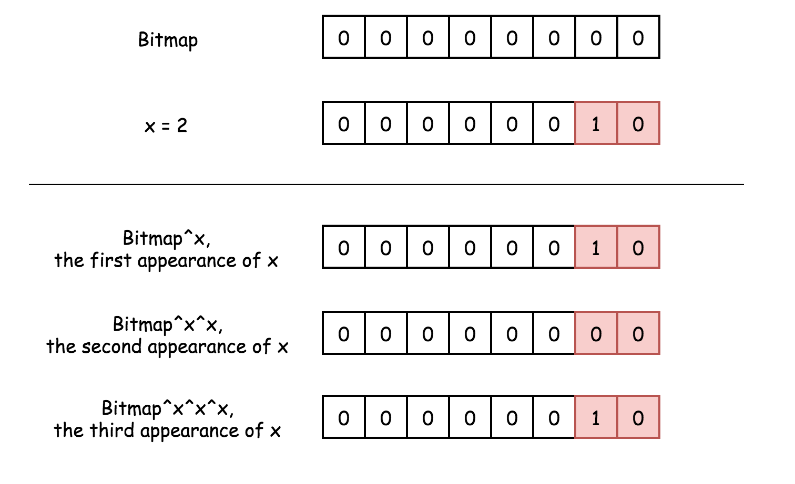
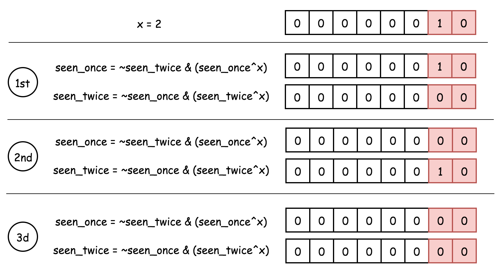
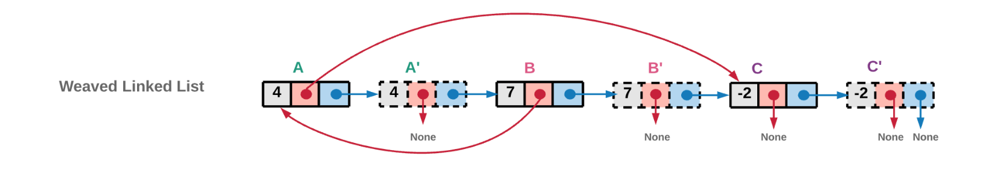
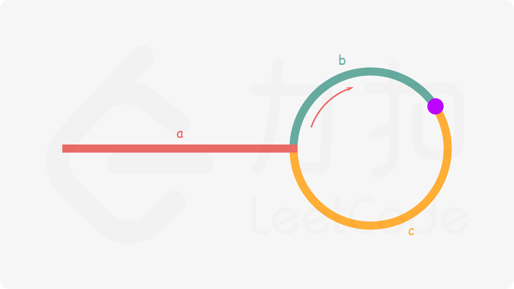
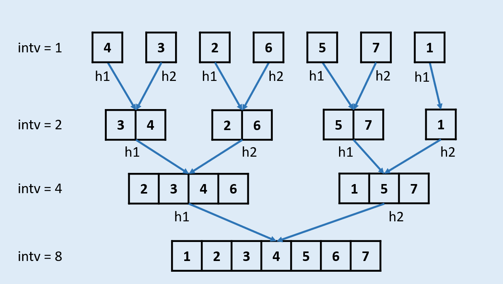
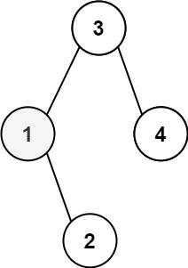

# [100. 相同的树](https://leetcode-cn.com/problems/same-tree/)

给你两棵二叉树的根节点 p 和 q ，编写一个函数来检验这两棵树是否相同。

如果两个树在结构上相同，并且节点具有相同的值，则认为它们是相同的。

 

示例 1：


```
输入：p = [1,2,3], q = [1,2,3]
输出：true
```

示例 2：

```
输入：p = [1,2], q = [1,null,2]
输出：false
```

示例 3：

```
输入：p = [1,2,1], q = [1,1,2]
输出：false
```


提示：

- 两棵树上的节点数目都在范围 [0, 100] 内
- -104 <= Node.val <= 104


简单题，都知道单独的前序 或者 中序 或者 后续是不能唯一的确定一棵树的，但是本题也不需要遍历两遍。递归，先判断当前节点，是否相等，然后判断左子树是否相等，右子树是否相等，注意边界条件。

```java
class Solution {
    public boolean isSameTree(TreeNode p, TreeNode q) {
        return dfs(p, q);
    }

    public boolean dfs(TreeNode p, TreeNode q) {
        if (p == null && q == null){
            return true;
        }

        if (p == null || q == null){
            return false;
        }

        if (p.val == q.val){
            if (!dfs(p.left, q.left)) {
                return false;
            }

            return dfs(p.right, q.right);
        }

        return false;
    }
}
执行用时：0 ms, 在所有 Java 提交中击败了100.00% 的用户
内存消耗：35.6 MB, 在所有 Java 提交中击败了95.14% 的用户
```


官方

**方法一：深度优先搜索**

如果两个二叉树都为空，则两个二叉树相同。如果两个二叉树中有且只有一个为空，则两个二叉树一定不相同。

如果两个二叉树都不为空，那么首先判断它们的根节点的值是否相同，若不相同则两个二叉树一定不同，若相同，再分别判断两个二叉树的左子树是否相同以及右子树是否相同。这是一个递归的过程，因此可以使用深度优先搜索，递归地判断两个二叉树是否相同。

```java
class Solution {
    public boolean isSameTree(TreeNode p, TreeNode q) {
        if (p == null && q == null) {
            return true;
        } else if (p == null || q == null) {
            return false;
        } else if (p.val != q.val) {
            return false;
        } else {
            return isSameTree(p.left, q.left) && isSameTree(p.right, q.right);
        }
    }
}
```


**方法二：广度优先搜索**

可以通过广度优先搜索判断两个二叉树是否相同。同样首先判断两个二叉树是否为空，如果两个二叉树都不为空，则从两个二叉树的根节点开始广度优先搜索。

使用两个队列分别存储两个二叉树的节点。初始时将两个二叉树的根节点分别加入两个队列。每次从两个队列各取出一个节点，进行如下比较操作。

1. 比较两个节点的值，如果两个节点的值不相同则两个二叉树一定不同；
2. 如果两个节点的值相同，则判断两个节点的子节点是否为空，如果只有一个节点的左子节点为空，或者只有一个节点的右子节点为空，则两个二叉树的结构不同，因此两个二叉树一定不同；
3. 如果两个节点的子节点的结构相同，则将两个节点的非空子节点分别加入两个队列，子节点加入队列时需要注意顺序，如果左右子节点都不为空，则先加入左子节点，后加入右子节点。

如果搜索结束时两个队列同时为空，则两个二叉树相同。如果只有一个队列为空，则两个二叉树的结构不同，因此两个二叉树不同。

```java
class Solution {
    public boolean isSameTree(TreeNode p, TreeNode q) {
        if (p == null && q == null) {
            return true;
        } else if (p == null || q == null) {
            return false;
        }
        Queue<TreeNode> queue1 = new LinkedList<TreeNode>();
        Queue<TreeNode> queue2 = new LinkedList<TreeNode>();
        queue1.offer(p);
        queue2.offer(q);
        while (!queue1.isEmpty() && !queue2.isEmpty()) {
            TreeNode node1 = queue1.poll();
            TreeNode node2 = queue2.poll();
            if (node1.val != node2.val) {
                return false;
            }
            TreeNode left1 = node1.left, right1 = node1.right, left2 = node2.left, right2 = node2.right;
            if (left1 == null ^ left2 == null) {
                return false;
            }
            if (right1 == null ^ right2 == null) {
                return false;
            }
            if (left1 != null) {
                queue1.offer(left1);
            }
            if (right1 != null) {
                queue1.offer(right1);
            }
            if (left2 != null) {
                queue2.offer(left2);
            }
            if (right2 != null) {
                queue2.offer(right2);
            }
        }
        return queue1.isEmpty() && queue2.isEmpty();
    }
}


作者：LeetCode-Solution
链接：https://leetcode-cn.com/problems/same-tree/solution/xiang-tong-de-shu-by-leetcode-solution/
来源：力扣（LeetCode）
著作权归作者所有。商业转载请联系作者获得授权，非商业转载请注明出处。
```


# [101. 对称二叉树](https://leetcode-cn.com/problems/symmetric-tree/)

给定一个二叉树，检查它是否是镜像对称的。

 

例如，二叉树 `[1,2,2,3,4,4,3]` 是对称的。

```
    1
   / \
  2   2
 / \ / \
3  4 4  3
```

 

但是下面这个 `[1,2,2,null,3,null,3]` 则不是镜像对称的:

```
    1
   / \
  2   2
   \   \
   3    3
```

 

**进阶：**

你可以运用递归和迭代两种方法解决这个问题吗？


思考

这个没什么好想的了，直接枚举吧。

递归

```java
    public boolean isSymmetric(TreeNode root) {
        if (root == null) return true;
        return check(root.left, root.right);
    }


    public boolean check(TreeNode left, TreeNode right){
        if (left == null && right == null) {
            return true;
        }
        if (left == null || right == null) return false;
        if (right.val != left.val) return false;
        if (check(left.left, right.right)) {
             return check(left.right, right.left);
        }
        return false;
    }
```


迭代

```java
    public static boolean isSymmetric2(TreeNode root) {
        if (root == null) return true;

        Stack<TreeNode> stack = new Stack<>();

        TreeNode left = root.left;
        TreeNode right = root.right;
        while (!stack.empty() || left != null || right != null){
            if (left == null && right == null) {
                right = stack.pop();
                left = stack.pop();

                left = left.right;
                right = right.left;
                continue;
            }

            if (left == null || right == null) return false;
            if (right.val != left.val) return false;

            stack.push(left);
            stack.push(right);

            left = left.left;
            right = right.right;
        }

        return true;
    }
```


官方的写法非常漂亮

递归

```java
class Solution {
    public boolean isSymmetric(TreeNode root) {
        return check(root, root);
    }

    public boolean check(TreeNode p, TreeNode q) {
        if (p == null && q == null) {
            return true;
        }
        if (p == null || q == null) {
            return false;
        }
      	// 这里利用了&&的特性，少些了很多if else
        return p.val == q.val && check(p.left, q.right) && check(p.right, q.left);
    }
}


作者：LeetCode-Solution
链接：https://leetcode-cn.com/problems/symmetric-tree/solution/dui-cheng-er-cha-shu-by-leetcode-solution/
来源：力扣（LeetCode）
著作权归作者所有。商业转载请联系作者获得授权，非商业转载请注明出处。
```

迭代

```java
class Solution {
    public boolean isSymmetric(TreeNode root) {
        return check(root, root);
    }

    public boolean check(TreeNode u, TreeNode v) {
        Queue<TreeNode> q = new LinkedList<TreeNode>();
        q.offer(u);
        q.offer(v);
        while (!q.isEmpty()) {
            u = q.poll();
            v = q.poll();
            if (u == null && v == null) {
                continue;
            }
            if ((u == null || v == null) || (u.val != v.val)) {
                return false;
            }

            q.offer(u.left);
            q.offer(v.right);

            q.offer(u.right);
            q.offer(v.left);
        }
        return true;
    }
}


作者：LeetCode-Solution
链接：https://leetcode-cn.com/problems/symmetric-tree/solution/dui-cheng-er-cha-shu-by-leetcode-solution/
来源：力扣（LeetCode）
著作权归作者所有。商业转载请联系作者获得授权，非商业转载请注明出处。
```

利用队列，进行广度优先遍历，这种写法更加的明了。


# [102. 二叉树的层序遍历](https://leetcode-cn.com/problems/binary-tree-level-order-traversal/)

给你一个二叉树，请你返回其按 层序遍历 得到的节点值。 （即逐层地，从左到右访问所有节点）。

 

示例：
二叉树：[3,9,20,null,null,15,7],

    		3
    	 / \
      9  20
        /  \
       15   7


返回其层序遍历结果：

```
[
  [3],
  [9,20],
  [15,7]
]
```


没什么好想的，基础题bfs的实现

```java
public List<List<Integer>> levelOrder(TreeNode root) {
        Queue<TreeNode> arrayDeque = new LinkedList<>();
        arrayDeque.offer(root);
        int next = 1;
        List<List<Integer>> result = new ArrayList<>();
        if (root == null) return result;

        while (!arrayDeque.isEmpty()){
            List<Integer> list = new ArrayList<>();

            int cur = next;
            next = 0;
            while (cur-- > 0) {
                TreeNode node = arrayDeque.poll();
                if (node.left != null){
                    next++;
                    arrayDeque.offer(node.left);
                }
                if (node.right != null){
                    next++;
                    arrayDeque.offer(node.right);
                }
                list.add(node.val);
            }
            result.add(list);
        }
        return result;
    }
```


官方

```java
class Solution {
    public List<List<Integer>> levelOrder(TreeNode root) {
        List<List<Integer>> ret = new ArrayList<List<Integer>>();
        if (root == null) {
            return ret;
        }

        Queue<TreeNode> queue = new LinkedList<TreeNode>();
        queue.offer(root);
        while (!queue.isEmpty()) {
            List<Integer> level = new ArrayList<Integer>();
            int currentLevelSize = queue.size();
            for (int i = 1; i <= currentLevelSize; ++i) {
                TreeNode node = queue.poll();
                level.add(node.val);
                if (node.left != null) {
                    queue.offer(node.left);
                }
                if (node.right != null) {
                    queue.offer(node.right);
                }
            }
            ret.add(level);
        }
        
        return ret;
    }
}


作者：LeetCode-Solution
链接：https://leetcode-cn.com/problems/binary-tree-level-order-traversal/solution/er-cha-shu-de-ceng-xu-bian-li-by-leetcode-solution/
来源：力扣（LeetCode）
著作权归作者所有。商业转载请联系作者获得授权，非商业转载请注明出处。
```


# [103. 二叉树的锯齿形层序遍历](https://leetcode-cn.com/problems/binary-tree-zigzag-level-order-traversal/)

给定一个二叉树，返回其节点值的锯齿形层序遍历。（即先从左往右，再从右往左进行下一层遍历，以此类推，层与层之间交替进行）。

例如：
给定二叉树 [3,9,20,null,null,15,7],

```
    3
   / \
  9  20
    /  \
   15   7
```

返回锯齿形层序遍历如下：

```
[
  [3],
  [20,9],
  [15,7]
]
```

难度适中，主要就是要思路清晰，理清楚关系，再用代码表达出来就ok了。大家都知道要借助于队列，或者说链表，使用一个或者两个队列，对与链表来说区别不大，所以使用2个链表。

从第二层看，需要倒序读先读到20，再读9，读到20之后，只能往集合里面放入15或者7，由于要保持一个顺序，所以只能先放7再放15，那么

- 偶数层从右往左遍历，往队头先插入右节点，再插入左节点。
- 同理，奇数层，需要从左往右遍历，那么需要先读取链表的尾部，这是一个先进后出的栈结构。然后为了保持顺序，只能先插入左节点，再插入右节点，这也倒数偶数层也必须从链表尾部开始读取，所以这里定义两个栈是比较合适的。

```java
/**
 * Definition for a binary tree node.
 * public class TreeNode {
 *     int val;
 *     TreeNode left;
 *     TreeNode right;
 *     TreeNode() {}
 *     TreeNode(int val) { this.val = val; }
 *     TreeNode(int val, TreeNode left, TreeNode right) {
 *         this.val = val;
 *         this.left = left;
 *         this.right = right;
 *     }
 * }
 */
class Solution {
    public List<List<Integer>> zigzagLevelOrder(TreeNode root) {
        List<List<Integer>> result = new ArrayList<>();
        if (root == null) return result;
        LinkedList<TreeNode> odd = new LinkedList<>();
        LinkedList<TreeNode> even = new LinkedList<>();
        // 放到尾部
        odd.offer(root);

        List<Integer> list = new ArrayList<>();
        while (!odd.isEmpty() || !even.isEmpty()){
            list = new ArrayList<>();
            while (!odd.isEmpty()){
                TreeNode node = odd.pollLast();
                if (node.left != null){
                    even.offer(node.left);
                }
                if (node.right != null){
                    even.offer(node.right);
                }
                list.add(node.val);
            }
            if (list.size() > 0){
                result.add(list);
            }

            list = new ArrayList<>();
            while (!even.isEmpty()){
                TreeNode node = even.pollLast();
                if (node.right != null){
                    odd.offer(node.right);
                }
                if (node.left != null){
                    odd.offer(node.left);
                }
                list.add(node.val);
            }
            if (list.size() > 0){
                result.add(list);
            }
        }

        return result;
    }
}
执行用时：1 ms, 在所有 Java 提交中击败了98.69% 的用户
内存消耗：38.5 MB, 在所有 Java 提交中击败了65.35% 的用户
```


官方的思路也很好

方法一：广度优先遍历

此题是「102. 二叉树的层序遍历」的变种，最后输出的要求有所变化，要求我们按层数的奇偶来决定每一层的输出顺序。规定二叉树的根节点为第 0 层，如果当前层数是偶数，从左至右输出当前层的节点值，否则，从右至左输出当前层的节点值。

我们依然可以沿用第 102 题的思想，修改广度优先搜索，对树进行逐层遍历，用队列维护当前层的所有元素，当队列不为空的时候，求得当前队列的长度 $\textit{size}$，每次从队列中取出 $\textit{size}$ 个元素进行拓展，然后进行下一次迭代。

为了满足题目要求的返回值为「先从左往右，再从右往左」交替输出的锯齿形，我们可以利用「双端队列」的数据结构来维护当前层节点值输出的顺序。

双端队列是一个可以在队列任意一端插入元素的队列。在广度优先搜索遍历当前层节点拓展下一层节点的时候我们仍然从左往右按顺序拓展，但是对当前层节点的

- 如果从左至右，我们每次将被遍历到的元素插入至双端队列的末尾。
- 如果从右至左，我们每次将被遍历到的元素插入至双端队列的头部。

```java
class Solution {
    public List<List<Integer>> zigzagLevelOrder(TreeNode root) {
        List<List<Integer>> ans = new LinkedList<List<Integer>>();
        if (root == null) {
            return ans;
        }

        Queue<TreeNode> nodeQueue = new LinkedList<TreeNode>();
        nodeQueue.offer(root);
        boolean isOrderLeft = true;

        while (!nodeQueue.isEmpty()) {
            Deque<Integer> levelList = new LinkedList<Integer>();
            int size = nodeQueue.size();
            for (int i = 0; i < size; ++i) {
                TreeNode curNode = nodeQueue.poll();
                if (isOrderLeft) {
                    levelList.offerLast(curNode.val);
                } else {
                    levelList.offerFirst(curNode.val);
                }
                if (curNode.left != null) {
                    nodeQueue.offer(curNode.left);
                }
                if (curNode.right != null) {
                    nodeQueue.offer(curNode.right);
                }
            }
            ans.add(new LinkedList<Integer>(levelList));
            isOrderLeft = !isOrderLeft;
        }

        return ans;
    }
}
```

他不纠结与从队列的哪端存入/读取数据，只要能够顺序或者逆序读出就可以，也就是使用一个标准的二叉树层序遍历，之后再找一个双端队列转一下结果集。


# [104. 二叉树的最大深度](https://leetcode-cn.com/problems/maximum-depth-of-binary-tree/)

给定一个二叉树，找出其最大深度。

二叉树的深度为根节点到最远叶子节点的最长路径上的节点数。

说明: 叶子节点是指没有子节点的节点。

示例：
给定二叉树 [3,9,20,null,null,15,7]，

    		3
       / \
      9  20
        /  \
       15   7


dfs的基础实现题。当然bfs也是可以的。

```java
    public int maxDepth(TreeNode root) {
        int next = next(root, 0);
    }

    public int next(TreeNode node, int max){
        if (node == null) return max;

        max++;
        int l = next(node.left, max);
        int r = next(node.right, max);

        return Math.max(l, r);
    }
```


官方

dfs

```java
class Solution {
    public int maxDepth(TreeNode root) {
        if (root == null) {
            return 0;
        } else {
            int leftHeight = maxDepth(root.left);
            int rightHeight = maxDepth(root.right);
            return Math.max(leftHeight, rightHeight) + 1;
        }
    }
}


作者：LeetCode-Solution
链接：https://leetcode-cn.com/problems/maximum-depth-of-binary-tree/solution/er-cha-shu-de-zui-da-shen-du-by-leetcode-solution/
来源：力扣（LeetCode）
著作权归作者所有。商业转载请联系作者获得授权，非商业转载请注明出处。
```

相当于从底部往上叠加，每叠一层就多加1，可以减少一个全局的变量。


bfs

```java
class Solution {
    public int maxDepth(TreeNode root) {
        if (root == null) {
            return 0;
        }
        Queue<TreeNode> queue = new LinkedList<TreeNode>();
        queue.offer(root);
        int ans = 0;
        while (!queue.isEmpty()) {
            int size = queue.size();
            while (size > 0) {
                TreeNode node = queue.poll();
                if (node.left != null) {
                    queue.offer(node.left);
                }
                if (node.right != null) {
                    queue.offer(node.right);
                }
                size--;
            }
            ans++;
        }
        return ans;
    }
}


作者：LeetCode-Solution
链接：https://leetcode-cn.com/problems/maximum-depth-of-binary-tree/solution/er-cha-shu-de-zui-da-shen-du-by-leetcode-solution/
来源：力扣（LeetCode）
著作权归作者所有。商业转载请联系作者获得授权，非商业转载请注明出处。
```


# [105. 从前序与中序遍历序列构造二叉树](https://leetcode-cn.com/problems/construct-binary-tree-from-preorder-and-inorder-traversal/) :star:

根据一棵树的前序遍历与中序遍历构造二叉树。

注意:
你可以假设树中没有重复的元素。

例如，给出

```
前序遍历 preorder = [3,9,20,15,7]
中序遍历 inorder = [9,3,15,20,7]
```


返回如下的二叉树：

    		3
       / \
      9  20
        /  \
       15   7


这个是真的基础能力了，比较重要，需要掌握思路。

从例子看，根据前序，可以判断出根节点为3，拿到3去中序中，可以划分出左右子树为[9]，[15,20,7]两部分，然后依次类推。

没自己写，请默写官方例子。


官方

**方法一：递归**

思路

对于任意一颗树而言，前序遍历的形式总是

**`[ 根节点, [左子树的前序遍历结果], [右子树的前序遍历结果] ]`**

即根节点总是前序遍历中的第一个节点。而中序遍历的形式总是

**`[ [左子树的中序遍历结果], 根节点, [右子树的中序遍历结果] ]`**

只要我们在中序遍历中定位到根节点，那么我们就可以分别知道左子树和右子树中的节点数目。由于同一颗子树的前序遍历和中序遍历的长度显然是相同的，因此我们就可以对应到前序遍历的结果中，对上述形式中的所有左右括号进行定位。

这样以来，我们就知道了左子树的前序遍历和中序遍历结果，以及右子树的前序遍历和中序遍历结果，我们就可以递归地对构造出左子树和右子树，再将这两颗子树接到根节点的左右位置。

**细节**

在中序遍历中对根节点进行定位时，一种简单的方法是直接扫描整个中序遍历的结果并找出根节点，但这样做的时间复杂度较高。我们可以考虑使用哈希表来帮助我们快速地定位根节点。对于哈希映射中的每个键值对，键表示一个元素（节点的值），值表示其在中序遍历中的出现位置。在构造二叉树的过程之前，我们可以对中序遍历的列表进行一遍扫描，就可以构造出这个哈希映射。在此后构造二叉树的过程中，我们就只需要 $O(1)$ 的时间对根节点进行定位了。

下面的代码给出了详细的注释。

```java
class Solution {
    private Map<Integer, Integer> indexMap;

    public TreeNode myBuildTree(int[] preorder, int[] inorder, int preorder_left, int preorder_right, int inorder_left, int inorder_right) {
        if (preorder_left > preorder_right) {
            return null;
        }

        // 前序遍历中的第一个节点就是根节点
        int preorder_root = preorder_left;
        // 在中序遍历中定位根节点
        int inorder_root = indexMap.get(preorder[preorder_root]);
        
        // 先把根节点建立出来
        TreeNode root = new TreeNode(preorder[preorder_root]);
        // 得到左子树中的节点数目
        int size_left_subtree = inorder_root - inorder_left;
        // 递归地构造左子树，并连接到根节点
        // 先序遍历中「从 左边界+1 开始的 size_left_subtree」个元素就对应了中序遍历中「从 左边界 开始到 根节点定位-1」的元素
        root.left = myBuildTree(preorder, inorder, preorder_left + 1, preorder_left + size_left_subtree, inorder_left, inorder_root - 1);
        // 递归地构造右子树，并连接到根节点
        // 先序遍历中「从 左边界+1+左子树节点数目 开始到 右边界」的元素就对应了中序遍历中「从 根节点定位+1 到 右边界」的元素
        root.right = myBuildTree(preorder, inorder, preorder_left + size_left_subtree + 1, preorder_right, inorder_root + 1, inorder_right);
        return root;
    }

    public TreeNode buildTree(int[] preorder, int[] inorder) {
        int n = preorder.length;
        // 构造哈希映射，帮助我们快速定位根节点
        indexMap = new HashMap<Integer, Integer>();
        for (int i = 0; i < n; i++) {
            indexMap.put(inorder[i], i);
        }
        return myBuildTree(preorder, inorder, 0, n - 1, 0, n - 1);
    }
}


作者：LeetCode-Solution
链接：https://leetcode-cn.com/problems/construct-binary-tree-from-preorder-and-inorder-traversal/solution/cong-qian-xu-yu-zhong-xu-bian-li-xu-lie-gou-zao-9/
来源：力扣（LeetCode）
著作权归作者所有。商业转载请联系作者获得授权，非商业转载请注明出处。
```

**方法二：迭代**

比较复杂，暂时不看


评论区一个很简洁的写法

```java
class Solution {
    int pre = 0, in = 0;
    public TreeNode buildTree(int[] preorder, int[] inorder) {
        return recursive(preorder, inorder, Integer.MAX_VALUE);
    }
    
    public TreeNode recursive(int[] preorder, int[] inorder, int stop) {
        if (pre >= preorder.length) return null;
        if (inorder[in] == stop) {
            in++;
            return null;
        }
        int curVal = preorder[pre++];
        TreeNode cur = new TreeNode(curVal);
        cur.left = recursive(preorder, inorder, curVal);
        cur.right = recursive(preorder, inorder, stop);
        return cur;
    }
}
https://leetcode-cn.com/problems/construct-binary-tree-from-preorder-and-inorder-traversal/solution/cong-qian-xu-yu-zhong-xu-bian-li-xu-lie-gou-zao-9/423117
```


> ####  为什么前序与后序不能构建出唯一的二叉树？

直觉上看，前序与后序记录了层级关系，中序记录了左右关系。严格的证明还没找到。


一些参考

[关于二叉树先序遍历和后序遍历为什么不能唯一确定一个二叉树分析](https://blog.csdn.net/suliangkuanjiayou/article/details/102960971)


# [107. 二叉树的层序遍历 II](https://leetcode-cn.com/problems/binary-tree-level-order-traversal-ii/)

给定一个二叉树，返回其节点值自底向上的层序遍历。 （即按从叶子节点所在层到根节点所在的层，逐层从左向右遍历）

例如：
给定二叉树 [3,9,20,null,null,15,7],

```
    3
   / \
  9  20
    /  \
   15   7
```

返回其自底向上的层序遍历为：

```
[
  [15,7],
  [9,20],
  [3]
]
```


102题写法换了一种，最后再把结果集逆转。

```java
class Solution {
    public List<List<Integer>> levelOrderBottom(TreeNode root) {
        List<List<Integer>> result = new ArrayList<>();
        if (root == null) return result;

        Queue<TreeNode> queue = new ArrayDeque<>();
        queue.offer(root);

        int cur = 1;
        int next = 0;
        List<Integer> tmp = new ArrayList<>();
        while (!queue.isEmpty()){
            TreeNode node = queue.poll();

            if (node.left != null){
                queue.offer(node.left);
                next++;
            }

            if (node.right != null){
                queue.offer(node.right);
                next++;
            }


            tmp.add(node.val);
            if (cur > 1){
                cur --;
            } else {
                result.add(new ArrayList<>(tmp));
                tmp.clear();
                cur = next;
                next = 0;
            }
        }
        Collections.reverse(result);
        return result;
    }
}
执行用时：2 ms, 在所有 Java 提交中击败了18.17% 的用户
内存消耗：38.4 MB, 在所有 Java 提交中击败了91.55% 的用户
```


官方

**前言**

这道题和「102. 二叉树的层序遍历」相似，不同之处在于，第 102 题要求从上到下输出每一层的节点值，而这道题要求从下到上输出每一层的节点值。除了输出顺序不同以外，这两道题的思路是相同的，都可以使用广度优先搜索进行层次遍历。
方法一：广度优先搜索

树的层次遍历可以使用广度优先搜索实现。从根节点开始搜索，每次遍历同一层的全部节点，使用一个列表存储该层的节点值。

如果要求从上到下输出每一层的节点值，做法是很直观的，在遍历完一层节点之后，将存储该层节点值的列表添加到结果列表的尾部。这道题要求从下到上输出每一层的节点值，只要对上述操作稍作修改即可：在遍历完一层节点之后，将存储该层节点值的列表添加到结果列表的头部。

为了降低在结果列表的头部添加一层节点值的列表的时间复杂度，结果列表可以使用链表的结构，在链表头部添加一层节点值的列表的时间复杂度是 O(1)。在 Java 中，由于我们需要返回的 List 是一个接口，这里可以使用链表实现；而 C++ 或 Python 中，我们需要返回一个 vector 或 list，它不方便在头部插入元素（会增加时间开销），所以我们可以先用尾部插入的方法得到从上到下的层次遍历列表，然后再进行反转。

```java
class Solution {
    public List<List<Integer>> levelOrderBottom(TreeNode root) {
        List<List<Integer>> levelOrder = new LinkedList<List<Integer>>();
        if (root == null) {
            return levelOrder;
        }
        Queue<TreeNode> queue = new LinkedList<TreeNode>();
        queue.offer(root);
        while (!queue.isEmpty()) {
            List<Integer> level = new ArrayList<Integer>();
            int size = queue.size();
            for (int i = 0; i < size; i++) {
                TreeNode node = queue.poll();
                level.add(node.val);
                TreeNode left = node.left, right = node.right;
                if (left != null) {
                    queue.offer(left);
                }
                if (right != null) {
                    queue.offer(right);
                }
            }
            levelOrder.add(0, level);
        }
        return levelOrder;
    }
}


作者：LeetCode-Solution
链接：https://leetcode-cn.com/problems/binary-tree-level-order-traversal-ii/solution/er-cha-shu-de-ceng-ci-bian-li-ii-by-leetcode-solut/
来源：力扣（LeetCode）
著作权归作者所有。商业转载请联系作者获得授权，非商业转载请注明出处。
```

这个链表就非常的骚


# [108. 将有序数组转换为二叉搜索树](https://leetcode-cn.com/problems/convert-sorted-array-to-binary-search-tree/)

给你一个整数数组 nums ，其中元素已经按 升序 排列，请你将其转换为一棵 高度平衡 二叉搜索树。

高度平衡 二叉树是一棵满足「每个节点的左右两个子树的高度差的绝对值不超过 1 」的二叉树。


简单题

由于需要是平衡的树，并且给的数组也已经有序了，那么直接可以去数组的中间节点，然后分为左右子树，递归处理。

```java
class Solution {
    public TreeNode sortedArrayToBST(int[] nums) {
        return dfs(nums, 0, nums.length - 1);
    }

    private TreeNode dfs(int[] nums, int lo, int hi){
        if (hi == lo){
            return new TreeNode(nums[hi]);
        }
        if (hi - lo == 1){
            TreeNode node = new TreeNode(nums[lo]);
            node.right = new TreeNode(nums[hi]);
            return node;
        }

        int mid = lo + (hi - lo) / 2;
        TreeNode node = new TreeNode(nums[mid]);
        node.left = dfs(nums, lo, mid - 1);
        node.right = dfs(nums, mid + 1, hi);
        return node;
    }
}
执行用时：0 ms, 在所有 Java 提交中击败了100.00% 的用户
内存消耗：38 MB, 在所有 Java 提交中击败了85.17% 的用户
```


# [109. 有序链表转换二叉搜索树](https://leetcode-cn.com/problems/convert-sorted-list-to-binary-search-tree/) :star:

给定一个单链表，其中的元素按升序排序，将其转换为高度平衡的二叉搜索树。

本题中，一个高度平衡二叉树是指一个二叉树每个节点 的左右两个子树的高度差的绝对值不超过 1。

**示例:**

```
给定的有序链表： [-10, -3, 0, 5, 9],

一个可能的答案是：[0, -3, 9, -10, null, 5], 它可以表示下面这个高度平衡二叉搜索树：

      0
     / \
   -3   9
   /   /
 -10  5
```


熟悉树的好题目，解法比较多，在使用了最基本的方法之后，还是看一下官方的比较好。

```java
    public TreeNode sortedListToBST(ListNode head) {
        if (head == null) return null;
        if (head.next == null) return new TreeNode(head.val);

        ListNode fast = head;
        ListNode slow = head;
        ListNode slowPre = head;
        while (fast != null && fast.next != null){
            fast = fast.next.next;
            slowPre = slow;
            slow = slow.next;
        }

        TreeNode root = new TreeNode(slow.val);
        slowPre.next = null;

        root.left = sortedListToBST(head);
        root.right = sortedListToBST(slow.next);
        return root;
    }
执行用时：0 ms, 在所有 Java 提交中击败了100.00% 的用户
内存消耗：39 MB, 在所有 Java 提交中击败了97.93% 的用户
```


评论区思路完全一样的

> 其实蛮简单的，就是找链表中间节点作为根节点，然后再找中点两边的子链表的中点，一直递归下去直到子链表为空
>
> 1. 特例处理：如果head为空返回空，如果head.next为空返回值为head.val的树节点
> 2. 利用快慢指针找链表中间节点（slow每次走一步，fast每次走两步，循环停止时slow指向中间节点）
>    同时记录一下slow的前一个节点pre，这是为后面的断开操作做准备
> 3. 创建树的根节点，把slow的值赋给它，并断开链表中间节点和左边子链表的连接
> 4. 递归链表中间节点左右两边的子链表，找子链表的中间节点，再找子链表的子链表的中间节点，如此循环往复，直到符合特例处理的条件递归返回
>
> 作者：edelweisskoko
> 链接：https://leetcode-cn.com/problems/convert-sorted-list-to-binary-search-tree/solution/109-you-xu-lian-biao-zhuan-huan-er-cha-s-x583/
> 来源：力扣（LeetCode）
> 著作权归作者所有。商业转载请联系作者获得授权，非商业转载请注明出处。


再来一个思路非常流畅的

> 作者：xiao_ben_zhu
> 链接：https://leetcode-cn.com/problems/convert-sorted-list-to-binary-search-tree/solution/shou-hua-tu-jie-san-chong-jie-fa-jie-zhu-shu-zu-ku/
> 来源：力扣（LeetCode）
> 著作权归作者所有。商业转载请联系作者获得授权，非商业转载请注明出


官方

**前言**

将给定的有序链表转换为二叉搜索树的第一步是确定根节点。由于我们需要构造出平衡的二叉树，因此比较直观的想法是让根节点左子树中的节点个数与右子树中的节点个数尽可能接近。这样一来，左右子树的高度也会非常接近，可以达到高度差绝对值不超过 1 的题目要求。

如何找出这样的一个根节点呢？我们可以找出链表元素的中位数作为根节点的值。

根据中位数的性质，链表中小于中位数的元素个数与大于中位数的元素个数要么相等，要么相差 111。此时，小于中位数的元素组成了左子树，大于中位数的元素组成了右子树，它们分别对应着有序链表中连续的一段。在这之后，我们使用分治的思想，继续递归地对左右子树进行构造，找出对应的中位数作为根节点，以此类推。

**方法一：分治**
具体地，设当前链表的左端点为 $left$，右端点 $right$，包含关系为「左闭右开」，即 $left$ 包含在链表中而 $right$ 不包含在链表中。我们希望快速地找出链表的中位数节点 $mid$。

> 为什么要设定「左闭右开」的关系？由于题目中给定的链表为单向链表，访问后继元素十分容易，但无法直接访问前驱元素。因此在找出链表的中位数节点 $mid$ 之后，如果设定「左闭右开」的关系，我们就可以直接用 $(\textit{left}, \textit{mid})$ 以及 $(\textit{mid}.\textit{next}, \textit{right})$ 来表示左右子树对应的列表了。并且，初始的列表也可以用 $(\textit{head}, \textit{null})$ 方便地进行表示，其中 $\textit{null}$ 表示空节点。

找出链表中位数节点的方法多种多样，其中较为简单的一种是「快慢指针法」。初始时，快指针 $\textit{fast}$ 和慢指针 $\textit{slow}$ 均指向链表的左端点 $left$。我们将快指针 $\textit{fast}$ 向右移动两次的同时，将慢指针 $\textit{slow}$ 向右移动一次，直到快指针到达边界（即快指针到达右端点或快指针的下一个节点是右端点）。此时，慢指针对应的元素就是中位数。

在找出了中位数节点之后，我们将其作为当前根节点的元素，并递归地构造其左侧部分的链表对应的左子树，以及右侧部分的链表对应的右子树。

```java
class Solution {
    public TreeNode sortedListToBST(ListNode head) {
        return buildTree(head, null);
    }

    public TreeNode buildTree(ListNode left, ListNode right) {
        if (left == right) {
            return null;
        }
        ListNode mid = getMedian(left, right);
        TreeNode root = new TreeNode(mid.val);
        root.left = buildTree(left, mid);
        root.right = buildTree(mid.next, right);
        return root;
    }

    public ListNode getMedian(ListNode left, ListNode right) {
        ListNode fast = left;
        ListNode slow = left;
        while (fast != right && fast.next != right) {
            fast = fast.next;
            fast = fast.next;
            slow = slow.next;
        }
        return slow;
    }
}
```


**方法二：分治 + 中序遍历优化**

方法一的时间复杂度的瓶颈在于寻找中位数节点。由于构造出的二叉搜索树的中序遍历结果就是链表本身，因此我们可以将分治和中序遍历结合起来，减少时间复杂度。

```java
class Solution {
    ListNode globalHead;

    public TreeNode sortedListToBST(ListNode head) {
        globalHead = head;
        int length = getLength(head);
        return buildTree(0, length - 1);
    }

    public int getLength(ListNode head) {
        int ret = 0;
        while (head != null) {
            ++ret;
            head = head.next;
        }
        return ret;
    }

    public TreeNode buildTree(int left, int right) {
        if (left > right) {
            return null;
        }
        int mid = (left + right + 1) / 2;
        TreeNode root = new TreeNode();
        root.left = buildTree(left, mid - 1);
        root.val = globalHead.val;
        globalHead = globalHead.next;
        root.right = buildTree(mid + 1, right);
        return root;
    }
}
```


官方解答下面的评论区暴躁老哥的，这个思路很好的

用什么分治，bfs建树 + dfs填节点值不香吗

```c++
private:
    void dfsBuild(ListNode*& li, TreeNode* root){
        if (root == NULL)
            return;
        dfsBuild(li, root->left);
        root->val = li->val;
        li = li->next;
        dfsBuild(li, root->right);
    }
public:
    TreeNode* sortedListToBST(ListNode* head) {
        if (head == NULL)
            return NULL;
        ListNode* node = head;
        TreeNode* root = new TreeNode(0);
        queue<TreeNode*> que;
        que.push(root);
        node = node->next;
        while (node){
            TreeNode* n = que.front();
            que.pop();
            n->left = new TreeNode(0);
            que.push(n->left);
            node = node->next;
            if (node == NULL){
                break;
            }
            n->right = new TreeNode(0);
            que.push(n->right);
            node = node->next;
        }
        dfsBuild(head, root);
        return root;
    }
https://leetcode-cn.com/problems/convert-sorted-list-to-binary-search-tree/solution/you-xu-lian-biao-zhuan-huan-er-cha-sou-suo-shu-1-3/550589
```


# [110. 平衡二叉树](https://leetcode-cn.com/problems/balanced-binary-tree/)

给定一个二叉树，判断它是否是高度平衡的二叉树。

本题中，一棵高度平衡二叉树定义为：

    一个二叉树每个节点 的左右两个子树的高度差的绝对值不超过 1 。


题目明示了判断左右两个子树的高度差，那么递归求高度就可以了

```java
class Solution {
    public boolean isBalanced(TreeNode root) {
        if (root == null) return true;
        return dfs(root) != -6;
    }

    private int dfs(TreeNode root){
        if (root.right == null && root.left == null){
            return 1;
        }

        int left = 0;
        int right = 0;
        if (root.left != null){
            left = dfs(root.left);
        }

        if (root.right != null){
            right = dfs(root.right);
        }
        if (left == -6 || right == -6 || Math.abs(left - right) > 1){
            return -6;
        }

        return Math.max(left, right) + 1;
    }
}
执行用时：1 ms, 在所有 Java 提交中击败了99.99% 的用户
内存消耗：38.3 MB, 在所有 Java 提交中击败了86.00% 的用户
```


# [111. 二叉树的最小深度](https://leetcode-cn.com/problems/minimum-depth-of-binary-tree/)

给定一个二叉树，找出其最小深度。

最小深度是从根节点到最近叶子节点的最短路径上的节点数量。

**说明：**叶子节点是指没有子节点的节点。

**示例 1：**

```
输入：root = [3,9,20,null,null,15,7]
输出：2
```


找最大深度，那么明显的广度优先会合适一点，一旦找到了一个叶子节点，那么立刻可以确定深度了。

```java
class Solution {
    public int minDepth(TreeNode root) {
        if (root == null) return 0;
        Queue<TreeNode> queue = new ArrayDeque<>();
        queue.offer(root);

        int level = 0;
        while (!queue.isEmpty()){
            level++;

            int size = queue.size();
            while (size > 0){
                TreeNode node = queue.poll();
                if (node.right == null && node.left == null){
                    return level;
                }
                if (node.right != null){
                    queue.offer(node.right);
                }
                if (node.left != null){
                    queue.offer(node.left);
                }
                size--;
            }
        }

        return level;
    }
}
执行用时：1 ms, 在所有 Java 提交中击败了99.83% 的用户
内存消耗：57.6 MB, 在所有 Java 提交中击败了98.90% 的用户
```


官方BFS的写法

```java
class Solution {
    class QueueNode {
        TreeNode node;
        int depth;

        public QueueNode(TreeNode node, int depth) {
            this.node = node;
            this.depth = depth;
        }
    }

    public int minDepth(TreeNode root) {
        if (root == null) {
            return 0;
        }

        Queue<QueueNode> queue = new LinkedList<QueueNode>();
        queue.offer(new QueueNode(root, 1));
        while (!queue.isEmpty()) {
            QueueNode nodeDepth = queue.poll();
            TreeNode node = nodeDepth.node;
            int depth = nodeDepth.depth;
            if (node.left == null && node.right == null) {
                return depth;
            }
            if (node.left != null) {
                queue.offer(new QueueNode(node.left, depth + 1));
            }
            if (node.right != null) {
                queue.offer(new QueueNode(node.right, depth + 1));
            }
        }

        return 0;
    }
}


作者：LeetCode-Solution
链接：https://leetcode-cn.com/problems/minimum-depth-of-binary-tree/solution/er-cha-shu-de-zui-xiao-shen-du-by-leetcode-solutio/
来源：力扣（LeetCode）
著作权归作者所有。商业转载请联系作者获得授权，非商业转载请注明出处。
```


# [112. 路径总和](https://leetcode-cn.com/problems/path-sum/)

给你二叉树的根节点 root 和一个表示目标和的整数 targetSum ，判断该树中是否存在 根节点到叶子节点 的路径，这条路径上所有节点值相加等于目标和 targetSum 。

叶子节点 是指没有子节点的节点。

```java
class Solution {
    public boolean hasPathSum(TreeNode root, int targetSum) {
        if (root == null) return false;
        return dfs(root, targetSum);
    }
    private boolean dfs(TreeNode root, int targetSum){
        if (root.left == null && root.right == null){
            return targetSum == root.val;
        }

        boolean left = false;
        if (root.left != null){
            left = dfs(root.left, targetSum - root.val);
        }

        if (left){
            return true;
        }

        if (root.right != null){
            return dfs(root.right, targetSum - root.val);
        }
        return false;
    }
}
```


# [113. 路径总和 II](https://leetcode-cn.com/problems/path-sum-ii/)

给你二叉树的根节点 root 和一个整数目标和 targetSum ，找出所有 从根节点到叶子节点 路径总和等于给定目标和的路径。

叶子节点 是指没有子节点的节点。

**示例 1：**


```
输入：root = [5,4,8,11,null,13,4,7,2,null,null,5,1], targetSum = 22
输出：[[5,4,11,2],[5,8,4,5]]
```


思考

注意两个细节：

1. 题目没说这个树非空，记得提前判断一下。
2. 题目没说所有节点的值非负，所以完全可能存在负数，那么就不能剪枝了，需要一路遍历到叶子节点才能判断本条路径是否符合条件了。


使用标准的递归来写回方便一些。

```java
class Solution {
    private List<List<Integer>> result = new ArrayList<>();

    public List<List<Integer>> pathSum(TreeNode root, int targetSum) {
        if (root == null) return result;
        dfs(root, targetSum, new ArrayList<>());
        return result;
    }

    private void dfs(TreeNode root, int targetSum, List<Integer> list){
        if (root.right == null && root.left == null){
            if (targetSum - root.val == 0){
                list.add(root.val);
                result.add(new ArrayList<>(list));
                list.remove(list.size() - 1);
            }
            return;
        }

        list.add(root.val);
        if (root.left != null){
            dfs(root.left, targetSum - root.val, list);
        }
        if (root.right != null){
            dfs(root.right, targetSum - root.val, list);
        }
        list.remove(list.size() - 1);
    }
}
执行用时：1 ms, 在所有 Java 提交中击败了100.00% 的用户
内存消耗：38.8 MB, 在所有 Java 提交中击败了57.57% 的用户
```


# [114. 二叉树展开为链表 ](https://leetcode-cn.com/problems/flatten-binary-tree-to-linked-list/) :star:

给你二叉树的根结点 root ，请你将它展开为一个单链表：

- 展开后的单链表应该同样使用 TreeNode ，其中 right 子指针指向链表中下一个结点，而左子指针始终为 null 。
- 展开后的单链表应该与二叉树 先序遍历 顺序相同。

 

示例 1：


```
输入：root = [1,2,5,3,4,null,6]
输出：[1,null,2,null,3,null,4,null,5,null,6]
```

示例 2：

```
输入：root = []
输出：[]
```

示例 3：

```
输入：root = [0]
输出：[0]
```


提示：

- 树中结点数在范围 [0, 20] 内
- -100 <= Node.val <= 100

**进阶：**你可以使用原地算法（`O(1)` 额外空间）展开这棵树吗？


思考

既然题目要求是需要先序的顺序排，那么就先序遍历，把每个节点存在list里面，最后遍历list的节点，维护树形关系。

```java
    public void flatten(TreeNode root) {
        List<TreeNode> list = new ArrayList<>();
                
        visit(root, list);
        for (int i = 1; i < list.size(); i++) {
            TreeNode pre = list.get(i - 1);
            TreeNode cur = list.get(i);
            pre.left = null;
            pre.right = cur;
        }
    }

    public static void visit(TreeNode root, List<TreeNode> list){
        if (root == null) return;

        list.add(root);
        visit(root.left, list);
        visit(root.right, list);
    }
```

常数级额外空间的没想到。


官方

方法一：前序遍历

方法二：前序遍历和展开同步进行

```java
class Solution {
    public void flatten(TreeNode root) {
        if (root == null) {
            return;
        }
        Deque<TreeNode> stack = new LinkedList<TreeNode>();
        stack.push(root);
        TreeNode prev = null;
        while (!stack.isEmpty()) {
            TreeNode curr = stack.pop();
            if (prev != null) {
                prev.left = null;
                prev.right = curr;
            }
            TreeNode left = curr.left, right = curr.right;
            if (right != null) {
                stack.push(right);
            }
            if (left != null) {
                stack.push(left);
            }
            prev = curr;
        }
    }
}


作者：LeetCode-Solution
链接：https://leetcode-cn.com/problems/flatten-binary-tree-to-linked-list/solution/er-cha-shu-zhan-kai-wei-lian-biao-by-leetcode-solu/
来源：力扣（LeetCode）
著作权归作者所有。商业转载请联系作者获得授权，非商业转载请注明出处。
```


方法三：寻找前驱节点

前两种方法都借助前序遍历，前序遍历过程中需要使用栈存储节点。有没有空间复杂度是 O(1)O(1)O(1) 的做法呢？

注意到前序遍历访问各节点的顺序是根节点、左子树、右子树。如果一个节点的左子节点为空，则该节点不需要进行展开操作。如果一个节点的左子节点不为空，则该节点的左子树中的最后一个节点被访问之后，该节点的右子节点被访问。该节点的左子树中最后一个被访问的节点是左子树中的最右边的节点，也是该节点的前驱节点。因此，问题转化成寻找当前节点的前驱节点。

具体做法是，对于当前节点，如果其左子节点不为空，则在其左子树中找到最右边的节点，作为前驱节点，将当前节点的右子节点赋给前驱节点的右子节点，然后将当前节点的左子节点赋给当前节点的右子节点，并将当前节点的左子节点设为空。对当前节点处理结束后，继续处理链表中的下一个节点，直到所有节点都处理结束。

```java
class Solution {
    public void flatten(TreeNode root) {
        TreeNode curr = root;
        while (curr != null) {
            if (curr.left != null) {
                TreeNode next = curr.left;
                TreeNode predecessor = next;
                while (predecessor.right != null) {
                    predecessor = predecessor.right;
                }
                predecessor.right = curr.right;
                curr.left = null;
                curr.right = next;
            }
            curr = curr.right;
        }
    }
}


作者：LeetCode-Solution
链接：https://leetcode-cn.com/problems/flatten-binary-tree-to-linked-list/solution/er-cha-shu-zhan-kai-wei-lian-biao-by-leetcode-solu/
来源：力扣（LeetCode）
著作权归作者所有。商业转载请联系作者获得授权，非商业转载请注明出处。
```


其实第二种与第三种有异曲同工之处，第二种右子树使用栈来存储，第三种更加直接，使用左子树的最后一个叶子节点来存。


# [116. 填充每个节点的下一个右侧节点指针](https://leetcode-cn.com/problems/populating-next-right-pointers-in-each-node/) :star:

给定一个 **完美二叉树** ，其所有叶子节点都在同一层，每个父节点都有两个子节点。二叉树定义如下：

```c++
struct Node {
  int val;
  Node *left;
  Node *right;
  Node *next;
}
```

填充它的每个 next 指针，让这个指针指向其下一个右侧节点。如果找不到下一个右侧节点，则将 next 指针设置为 NULL。

初始状态下，所有 next 指针都被设置为 NULL。

**进阶：**

- 你只能使用常量级额外空间。
- 使用递归解题也符合要求，本题中递归程序占用的栈空间不算做额外的空间复杂度。


**示例：**


```
输入：root = [1,2,3,4,5,6,7]
输出：[1,#,2,3,#,4,5,6,7,#]
解释：给定二叉树如图 A 所示，你的函数应该填充它的每个 next 指针，以指向其下一个右侧节点，如图 B 所示。序列化的输出按层序遍历排列，同一层节点由 next 指针连接，'#' 标志着每一层的结束。
```


如果创建了一个长度为叶子节点的队列，这个能算常数级额外空间吗？应该不行吧。层序遍历都是需要借助队列的。

提示里面说递归的方法栈不算，那么就用递归。

```java
class Solution {
    public Node connect(Node root) {
        if (root == null) return null;
        dfs(root.left, root.right);
        return root;
    }

    private void dfs(Node left, Node right){
        if (left == null){
            return;
        }

        left.next = right;
        dfs(left.left, left.right);
        dfs(left.right, right.left);
        dfs(right.left, right.right);
    }
}
执行用时：2 ms, 在所有 Java 提交中击败了69.18% 的用户
内存消耗：38.6 MB, 在所有 Java 提交中击败了73.57% 的用户
```

时间效率非常难看，这是因为有重复遍历的部分，仔细观察递归的流程发现5号节点的左子树与6号节点的右子树重复遍历了，进行改进如下：增加一个标志位用来判断是否是中间两个节点下来的，是的话就少遍历两条路径即可。

```java
class Solution {
    public Node connect(Node root) {
        if (root == null) return null;
        dfs(root.left, root.right, false);
        return root;
    }

    private void dfs(Node left, Node right, boolean isMid){
        if (left == null){
            return;
        }

        left.next = right;
        if (isMid){
            dfs(left.right, right.left, true);
        }else {
            dfs(left.left, left.right, false);
            dfs(left.right, right.left, true);
            dfs(right.left, right.right, false);
        }
    }
}
执行用时：0 ms, 在所有 Java 提交中击败了100.00% 的用户
内存消耗：38.5 MB, 在所有 Java 提交中击败了85.23% 的用户
```


官方的思路真不错，一时没转过来。

**方法二：使用已建立的 $text{next}$ 指针**

**思路**

1. 从根节点开始，由于第 0 层只有一个节点，所以不需要连接，直接为第 1 层节点建立 $\text{next}$ 指针即可。该算法中需要注意的一点是，当我们为第 N 层节点建立 $\text{next}$ 指针时，处于第 N−1 层。当第 N 层节点的 $\text{next}$ 指针全部建立完成后，移至第 N 层，建立第 N+1 层节点的 $\text{next}$ 指针。

2. 遍历某一层的节点时，这层节点的 $\text{next}$ 指针已经建立。因此我们只需要知道这一层的最左节点，就可以按照链表方式遍历，不需要使用队列。


```java
class Solution {
    public Node connect(Node root) {
        if (root == null) {
            return root;
        }
        
        // 从根节点开始
        Node leftmost = root;
        
        while (leftmost.left != null) {
            
            // 遍历这一层节点组织成的链表，为下一层的节点更新 next 指针
            Node head = leftmost;
            
            while (head != null) {
                
                // CONNECTION 1
                head.left.next = head.right;
                
                // CONNECTION 2
                if (head.next != null) {
                    head.right.next = head.next.left;
                }
                
                // 指针向后移动
                head = head.next;
            }
            
            // 去下一层的最左的节点
            leftmost = leftmost.left;
        }
        
        return root;
    }
}


作者：LeetCode-Solution
链接：https://leetcode-cn.com/problems/populating-next-right-pointers-in-each-node/solution/tian-chong-mei-ge-jie-dian-de-xia-yi-ge-you-ce-2-4/
来源：力扣（LeetCode）
著作权归作者所有。商业转载请联系作者获得授权，非商业转载请注明出处。
```


# [121. 买卖股票的最佳时机](https://leetcode-cn.com/problems/best-time-to-buy-and-sell-stock/)

给定一个数组 prices ，它的第 i 个元素 prices[i] 表示一支给定股票第 i 天的价格。

你只能选择 **某一天** 买入这只股票，并选择在 **未来的某一个不同的日子** 卖出该股票。设计一个算法来计算你所能获取的最大利润。

返回你可以从这笔交易中获取的最大利润。如果你不能获取任何利润，返回 0 。

 

示例 1：

```
输入：[7,1,5,3,6,4]
输出：5
解释：在第 2 天（股票价格 = 1）的时候买入，在第 5 天（股票价格 = 6）的时候卖出，最大利润 = 6-1 = 5 。
     注意利润不能是 7-1 = 6, 因为卖出价格需要大于买入价格；同时，你不能在买入前卖出股票。
```


示例 2：

```
输入：prices = [7,6,4,3,1]
输出：0
解释：在这种情况下, 没有交易完成, 所以最大利润为 0。
```

 

提示：

- 1 <= prices.length <= 105
- 0 <= prices[i] <= 104


思考

注意到例子一，输出为5，说明只允许操作一手，不允许多次买卖。

第一个想法是dfs，遍历数组记录，记录目前遍历的最小值，记录 `当前最大利润 = Math.max(历史最大利润, 今天卖出价 - 买进的最低价)​`

```java
    public int maxProfit(int[] prices) {
        int min = prices[0];
        int max = 0;

        for (int price : prices) {
            max = Math.max(price - min, max);
            min = Math.min(min, price);
        }

        return max;
    }
```


评论区

思路还是挺清晰的，还是DP思想：

1. 记录【今天之前买入的最小值】
2. 计算【今天之前最小值买入，今天卖出的获利】，也即【今天卖出的最大获利】
3. 比较【每天的最大获利】，取最大值即可

```java
class Solution {
    public int maxProfit(int[] prices) {
        if(prices.length <= 1)
            return 0;
        int min = prices[0], max = 0;
        for(int i = 1; i < prices.length; i++) {
            max = Math.max(max, prices[i] - min);
            min = Math.min(min, prices[i]);
        }
        return max;
    }
}
https://leetcode-cn.com/problems/best-time-to-buy-and-sell-stock/comments/73905
```


评论区2

推荐阅读  [@stormsunshine](https://leetcode-cn.com/u/stormsunshine/)  编写的文章《[股票问题系列通解（转载翻译）](https://leetcode-cn.com/circle/article/qiAgHn/)》；

| 题号                                                         | 题解                                                         |
| ------------------------------------------------------------ | ------------------------------------------------------------ |
| [121. 买卖股票的最佳时机](https://leetcode-cn.com/problems/best-time-to-buy-and-sell-stock) | [暴力解法、动态规划（Java）](https://leetcode-cn.com/problems/best-time-to-buy-and-sell-stock/solution/bao-li-mei-ju-dong-tai-gui-hua-chai-fen-si-xiang-b/) |
| [122. 买卖股票的最佳时机 II](https://leetcode-cn.com/problems/best-time-to-buy-and-sell-stock-ii) | [暴力搜索、贪心算法、动态规划（Java）](https://leetcode-cn.com/problems/best-time-to-buy-and-sell-stock-ii/solution/tan-xin-suan-fa-by-liweiwei1419-2/) |
| [123. 买卖股票的最佳时机 III](https://leetcode-cn.com/problems/best-time-to-buy-and-sell-stock-iii) | [动态规划（Java）](https://leetcode-cn.com/problems/best-time-to-buy-and-sell-stock-iii/solution/dong-tai-gui-hua-by-liweiwei1419-7/) |
| [188. 买卖股票的最佳时机 IV](https://leetcode-cn.com/problems/best-time-to-buy-and-sell-stock-iv) | [动态规划（「力扣」更新过用例，只有优化空间的版本可以 AC）](https://leetcode-cn.com/problems/best-time-to-buy-and-sell-stock-iv/solution/dong-tai-gui-hua-by-liweiwei1419-4/) |
| [309. 最佳买卖股票时机含冷冻期](https://leetcode-cn.com/problems/best-time-to-buy-and-sell-stock-with-cooldown) | [动态规划（Java）](https://leetcode-cn.com/problems/best-time-to-buy-and-sell-stock-with-cooldown/solution/dong-tai-gui-hua-by-liweiwei1419-5/) |
| [714. 买卖股票的最佳时机含手续费](https://leetcode-cn.com/problems/best-time-to-buy-and-sell-stock-with-transaction-fee) | [动态规划（Java）](https://leetcode-cn.com/problems/best-time-to-buy-and-sell-stock-with-transaction-fee/solution/dong-tai-gui-hua-by-liweiwei1419-6/) |


作者：liweiwei1419
链接：https://leetcode-cn.com/problems/best-time-to-buy-and-sell-stock/solution/bao-li-mei-ju-dong-tai-gui-hua-chai-fen-si-xiang-b/
来源：力扣（LeetCode）
著作权归作者所有。商业转载请联系作者获得授权，非商业转载请注明出处。


# [122. 买卖股票的最佳时机 II](https://leetcode-cn.com/problems/best-time-to-buy-and-sell-stock-ii/)

给定一个数组，它的第 i 个元素是一支给定股票第 i 天的价格。

设计一个算法来计算你所能获取的最大利润。你可以尽可能地完成更多的交易（多次买卖一支股票）。

注意：你不能同时参与多笔交易（你必须在再次购买前出售掉之前的股票）。

 

示例 1:

```
输入: [7,1,5,3,6,4]
输出: 7
解释: 在第 2 天（股票价格 = 1）的时候买入，在第 3 天（股票价格 = 5）的时候卖出, 这笔交易所能获得利润 = 5-1 = 4 。
     随后，在第 4 天（股票价格 = 3）的时候买入，在第 5 天（股票价格 = 6）的时候卖出, 这笔交易所能获得利润 = 6-3 = 3 。
```

示例 2:

```
输入: [1,2,3,4,5]
输出: 4
解释: 在第 1 天（股票价格 = 1）的时候买入，在第 5 天 （股票价格 = 5）的时候卖出, 这笔交易所能获得利润 = 5-1 = 4 。
     注意你不能在第 1 天和第 2 天接连购买股票，之后再将它们卖出。
     因为这样属于同时参与了多笔交易，你必须在再次购买前出售掉之前的股票。
```

示例 3:

```
输入: [7,6,4,3,1]
输出: 0
解释: 在这种情况下, 没有交易完成, 所以最大利润为 0。
```


提示：

- 1 <= prices.length <= 3 * 10 ^ 4
- 0 <= prices[i] <= 10 ^ 4


感觉应该是dp，设$dp[i][j]$为第i天可以赚的最大利润。j为1则为当天手里有一支，j为0则为当天手里没有。

$dp[0][0]$ = 0，$dp[0][1] = -7$，$dp[1][0] = Math.max(dp[0][0] + 0, dp[0][1] + 1)$，$dp[1][1] = Math.max(dp[0][0] - 1, dp[0][1])$

这个dp其实看起来很像一个贪心模式。现在的问题就是，这个递推公式能覆盖到所有的可能吗？怎么证明


```java
class Solution {
    public int maxProfit(int[] prices) {
        int[][] dp = new int[prices.length][2];

        dp[0][0] = 0;
        dp[0][1] = -prices[0];
        for (int i = 1; i < prices.length; i++) {
            dp[i][0] = Math.max(dp[i - 1][0], dp[i - 1][1] + prices[i]);
            dp[i][1] = Math.max(dp[i - 1][1], dp[i - 1][0] - prices[i]);
        }

        return dp[prices.length - 1][0];
    }
}
```


评论区高赞

> `[7, 1, 5, 6]`  第二天买入，第四天卖出，收益最大（6-1），所以一般人可能会想，怎么判断不是第三天就卖出了呢?  这里就把问题复杂化了，根据题目的意思，当天卖出以后，当天还可以买入，所以其实可以第三天卖出，第三天买入，第四天又卖出（（5-1）+ （6-5）  === 6 - 1）。所以算法可以直接简化为只要今天比昨天大，就卖出。
>
> https://leetcode-cn.com/problems/best-time-to-buy-and-sell-stock-ii/comments/42837


评论区次高

第一种方法：深度优先搜索，时间复杂度`O(2^n)`，这个通过不了LeetCode，不过能work，测试了多组测试样例是正确的

```python
class Solution:
    def maxProfit(self, prices: List[int]) -> int:
        self.prices = prices
        self.profit = []
        self.helper(0, 0, 0)
        return max(self.profit)
        
    # have 0:未持有  1:持有
    def helper(self, i, have, profit):
        if i == len(self.prices):
            self.profit.append(profit)
            return
        if have: # 如果持有中
            self.helper(i+1, 0, profit + self.prices[i]) # 卖出
            self.helper(i+1, 1, profit) # 不动
        else: # 如果未持有
            self.helper(i+1, 0, profit) # 不动
            self.helper(i+1, 1, profit - self.prices[i]) # 买入
```

第二种方法：贪心算法，一次遍历，只要今天价格小于明天价格就在今天买入然后明天卖出，时间复杂度`O(n)`

```python
class Solution:
    def maxProfit(self, prices: List[int]) -> int:
        ans = 0
        for i in range(1, len(prices)):
            if prices[i] > prices[i-1]:
                ans += prices[i] - prices[i-1]
        return ans
```

第三种方法：DP动态规划，第`i`天只有两种状态，不持有或持有股票，当天不持有股票的状态可能来自昨天卖出或者昨天也不持有，同理，当天持有股票的状态可能来自昨天买入或者昨天也持有中，取最后一天的不持有股票状态就是问题的解

```python
class Solution:
    def maxProfit(self, prices: List[int]) -> int:
        if not prices:
            return 0
        n = len(prices)
        dp = [[0]*2 for _ in range(n)]
        # dp[i][0]表示第i天不持有股票, dp[i][1]表示第i天持有股票
        dp[0][0], dp[0][1] = 0, - prices[0]
        for i in range(1, n):
            dp[i][0] = max(dp[i-1][0], dp[i-1][1] + prices[i])
            dp[i][1] = max(dp[i-1][1], dp[i-1][0] - prices[i])
        return dp[n-1][0]
```

https://leetcode-cn.com/problems/best-time-to-buy-and-sell-stock-ii/comments/46324


# [124. 二叉树中的最大路径和](https://leetcode-cn.com/problems/binary-tree-maximum-path-sum/) :fearful:

**路径** 被定义为一条从树中任意节点出发，沿父节点-子节点连接，达到任意节点的序列。同一个节点在一条路径序列中 **至多出现一次** 。该路径 **至少包含一个 节点**，且不一定经过根节点。

**路径和** 是路径中各节点值的总和。

给你一个二叉树的根节点 root ，返回其 最大路径和 。

 

示例 1：


```
输入：root = [1,2,3]
输出：6
解释：最优路径是 2 -> 1 -> 3 ，路径和为 2 + 1 + 3 = 6
```


示例 2：


```
输入：root = [-10,9,20,null,null,15,7]
输出：42
解释：最优路径是 15 -> 20 -> 7 ，路径和为 15 + 20 + 7 = 42
```

 

提示：

- 树中节点数目范围是 [1, 3 * 104]
- -10 <= Node.val <= 10


还是一个dp，dp数组中每个元素为当前节点的最大贡献值，最大贡献值是指从叶子点到当前节点的做大值。递推公式就为 $dp[i] = Math.max(dp[left],  dp[right], 0) $ 。目前为止都很容易想到，主要的难点是 

**如何得到二叉树的最大路径和？**

由于是一棵二叉树，所以无论怎么选路径，一定是能找到一个唯一的根节点的。那么问题就转为了求二叉树中每个节点的最大路径和，然后从中选取值最大的，即为整颗树的最大路径和。

对于二叉树中的一个节点，该节点的最大路径和取决于该节点的值与该节点的左右子节点的最大贡献值，如果子节点的最大贡献值为正，则计入该节点的最大路径和，否则不计入该节点的最大路径和。


官方：

**方法一：递归**

首先，考虑实现一个简化的函数 `maxGain(node)`，该函数计算二叉树中的一个节点的最大贡献值，具体而言，就是在以该节点为根节点的子树中寻找以该节点为起点的一条路径，使得该路径上的节点值之和最大。

具体而言，该函数的计算如下。

- 空节点的最大贡献值等于 0。
- 非空节点的最大贡献值等于节点值与其子节点中的最大贡献值之和（对于叶节点而言，最大贡献值等于节点值）。

例如，考虑如下二叉树。

```
   -10
   / \
  9  20
    /  \
   15   7
```

叶节点 9、15、7 的最大贡献值分别为 9、15、7。

得到叶节点的最大贡献值之后，再计算非叶节点的最大贡献值。节点 20 的最大贡献值等于 $20+\max(15,7)=35$，节点 $-10$ 的最大贡献值等于 $-10+\max(9,35)=25$。

上述计算过程是递归的过程，因此，对根节点调用函数 `maxGain`，即可得到每个节点的最大贡献值。

根据函数 `maxGain` 得到每个节点的最大贡献值之后，如何得到二叉树的最大路径和？对于二叉树中的一个节点，该节点的最大路径和取决于该节点的值与该节点的左右子节点的最大贡献值，如果子节点的最大贡献值为正，则计入该节点的最大路径和，否则不计入该节点的最大路径和。维护一个全局变量 `maxSum` 存储最大路径和，在递归过程中更新 `maxSum` 的值，最后得到的 `maxSum` 的值即为二叉树中的最大路径和。


```java
class Solution {
    int maxSum = Integer.MIN_VALUE;

    public int maxPathSum(TreeNode root) {
        maxGain(root);
        return maxSum;
    }

    public int maxGain(TreeNode node) {
        if (node == null) {
            return 0;
        }
        
        // 递归计算左右子节点的最大贡献值
        // 只有在最大贡献值大于 0 时，才会选取对应子节点
        int leftGain = Math.max(maxGain(node.left), 0);
        int rightGain = Math.max(maxGain(node.right), 0);

        // 节点的最大路径和取决于该节点的值与该节点的左右子节点的最大贡献值
        int priceNewpath = node.val + leftGain + rightGain;

        // 更新答案
        maxSum = Math.max(maxSum, priceNewpath);

        // 返回节点的最大贡献值
        return node.val + Math.max(leftGain, rightGain);
    }
}


作者：LeetCode-Solution
链接：https://leetcode-cn.com/problems/binary-tree-maximum-path-sum/solution/er-cha-shu-zhong-de-zui-da-lu-jing-he-by-leetcode-/
来源：力扣（LeetCode）
著作权归作者所有。商业转载请联系作者获得授权，非商业转载请注明出处。
```


评论区的一个解析

```yaml
这题目的难点在于理解题意和转化题意。
我们可以结合 数组的最大子数组和 的思路去解题。

1. 「可以从任意节点出发, 到达任意节点」 的路径, 
   一定是先上升（ 0 ～ n 个）节点, 到达顶点, 后下降（ 0 ～ n 个）节点。
   我们可以通过枚举顶点的方式来枚举路径。
   
2. 我们枚举顶点时, 可以把路径分拆成3部分： 左侧路径、右侧路径和顶点。
   如下面的路径, 顶点为 20, 左侧路径为 6 -> 15, 右侧为 6 -> 7。
   
      -10
      / \
     9 [20]
       /  \
     [15] [7]
     /    / \
   [6]   4  [6]   

   以当前节点为顶点的路径中, 最大和为 两侧路径的最大和 + 节点的值。
   需要注意的是, 两侧路径也可能不选, 此时取 0。

3. 如何求两侧路径最大和？ 看一个类似问题：求数组的最大子数组和。
   动态规划： dp[i] 代表以 nums[i] 为结尾的子数组的最大和。
   转移方程： dp[i] = max(dp[i-1], 0) + nums[i]。

4. 在树上, 设 dp[C] 代表以当前节点为结尾的最大上升路径和, 
   则我们需要对节点的左右子树做一个选择, 有
   dp[C] = max(max(dp[L], 0), max(dp[R], 0)) + C.val
   式中, C,L,R 分别代指 当前节点、左子节点、右子节点。

5. 最后, 以当前节点为顶点的路径中, 最大的和为
   max(dp[L], 0) + max(dp[R], 0) + C.val。
   我们枚举顶点, 并记录最大答案。
   
https://leetcode-cn.com/problems/binary-tree-maximum-path-sum/solution/er-cha-shu-zhong-de-zui-da-lu-jing-he-by-leetcode-/453643
```


# [125. 验证回文串](https://leetcode-cn.com/problems/valid-palindrome/)

给定一个字符串，验证它是否是回文串，只考虑字母和数字字符，可以忽略字母的大小写。

说明：本题中，我们将空字符串定义为有效的回文串。

示例 1:

```
输入: "A man, a plan, a canal: Panama"
输出: true
```

示例 2:

```
输入: "race a car"
输出: false
```


这题目就简单的双指针

```java
import java.util.Locale;
class Solution {
    public boolean isPalindrome(String s) {
        if (s == null || s.length() == 0) return true;
        int lo = 0;
        int hi = s.length() - 1;
        s = s.toLowerCase(Locale.ENGLISH);
        while (lo <= hi){
            char left = s.charAt(lo);
            if ((left < 97 && left > 57) || left > 122 || left < 48) {
                lo++;
                continue;
            }

            char right = s.charAt(hi);
            if ((right < 97 && right > 57) || right > 122 || right < 48) {
                hi--;
                continue;
            }

            if (left != right){
                return false;
            }
            lo++;
            hi--;
        }
        return true;
    }
}
执行用时：3 ms, 在所有 Java 提交中击败了92.77% 的用户
内存消耗：38.4 MB, 在所有 Java 提交中击败了77.77% 的用户
```


官方

```java
class Solution {
    public boolean isPalindrome(String s) {
        int n = s.length();
        int left = 0, right = n - 1;
        while (left < right) {
            while (left < right && !Character.isLetterOrDigit(s.charAt(left))) {
                ++left;
            }
            while (left < right && !Character.isLetterOrDigit(s.charAt(right))) {
                --right;
            }
            if (left < right) {
                if (Character.toLowerCase(s.charAt(left)) != Character.toLowerCase(s.charAt(right))) {
                    return false;
                }
                ++left;
                --right;
            }
        }
        return true;
    }
}


作者：LeetCode-Solution
链接：https://leetcode-cn.com/problems/valid-palindrome/solution/yan-zheng-hui-wen-chuan-by-leetcode-solution/
来源：力扣（LeetCode）
著作权归作者所有。商业转载请联系作者获得授权，非商业转载请注明出处。
```


# [128. 最长连续序列](https://leetcode-cn.com/problems/longest-consecutive-sequence/) :fearful:

给定一个未排序的整数数组 nums ，找出数字连续的最长序列（不要求序列元素在原数组中连续）的长度。

进阶：你可以设计并实现时间复杂度为 O(n) 的解决方案吗？

 

示例 1：

```
输入：nums = [100,4,200,1,3,2]
输出：4
解释：最长数字连续序列是 [1, 2, 3, 4]。它的长度为 4。
```

示例 2：

```
输入：nums = [0,3,7,2,5,8,4,6,0,1]
输出：9
```


提示：

- 0 <= nums.length <= 104
- -109 <= nums[i] <= 109


# [129. 求根节点到叶节点数字之和](https://leetcode-cn.com/problems/sum-root-to-leaf-numbers/)

给你一个二叉树的根节点 root ，树中每个节点都存放有一个 0 到 9 之间的数字。

每条从根节点到叶节点的路径都代表一个数字：

- 例如，从根节点到叶节点的路径 1 -> 2 -> 3 表示数字 123 。

计算从根节点到叶节点生成的 所有数字之和 。

叶节点 是指没有子节点的节点。

示例：


```
输入：root = [4,9,0,5,1]
输出：1026
解释：
从根到叶子节点路径 4->9->5 代表数字 495
从根到叶子节点路径 4->9->1 代表数字 491
从根到叶子节点路径 4->0 代表数字 40
因此，数字总和 = 495 + 491 + 40 = 1026
```


dfs深度优先，枚举所有的可能，get不到这主要是考察什么。

```java
class Solution {
    private int sum = 0;

    public int sumNumbers(TreeNode root) {
        dfs(root, 0);
        return sum;
    }

    private void dfs(TreeNode root, int value){
        if (root.right == null && root.left == null){
            sum += value * 10 + root.val;
            return;
        }

        if (root.left != null){
            dfs(root.left, value * 10 + root.val);
        }

        if (root.right != null){
            dfs(root.right, value * 10 + root.val);
        }
    }
}
执行用时：0 ms, 在所有 Java 提交中击败了100.00% 的用户
内存消耗：35.7 MB, 在所有 Java 提交中击败了93.10% 的用户
```


# [130. 被围绕的区域](https://leetcode-cn.com/problems/surrounded-regions/)

给你一个 m x n 的矩阵 board ，由若干字符 'X' 和 'O' ，找到所有被 'X' 围绕的区域，并将这些区域里所有的 'O' 用 'X' 填充。

**示例 1：**


```
输入：board = [["X","X","X","X"],["X","O","O","X"],["X","X","O","X"],["X","O","X","X"]]
输出：[["X","X","X","X"],["X","X","X","X"],["X","X","X","X"],["X","O","X","X"]]
解释：被围绕的区间不会存在于边界上，换句话说，任何边界上的 'O' 都不会被填充为 'X'。 任何不在边界上，或不与边界上的 'O' 相连的 'O' 最终都会被填充为 'X'。如果两个元素在水平或垂直方向相邻，则称它们是“相连”的。
```


这个题目没啥技巧啊，就是dfs考察写代码的能力，与之前的螺旋矩阵的题目很像。

```java
class Solution {
    private List<Integer> direct = new ArrayList<>();
    private int row;
    private int col;

    public void solve(char[][] board) {
        direct.add(1);
        direct.add(2);
        direct.add(3);
        direct.add(4);

        row = board.length;
        col = board[0].length;

        int n = 0;
        int m = 0;

        // 遍历第一行
        for (; n < col; n++){
            // 往下进行dfs
            dfs(board, m, n, 1);
        }
        n--;
        m++;

        for (; m < row; m++){
            dfs(board, m, n, 4);
        }
        m--;
        n--;

        for (; n >= 0; n--){
            dfs(board, m, n, 2);
        }
        n++;
        m--;

        for (; m >= 0; m--){
            dfs(board, m, n, 3);
        }

        for (int i = 0; i < board.length; i++) {
            char[] chars = board[i];
            for (int j = 0; j < chars.length; j++) {
                char c = board[i][j];
                if (c == '1'){
                    board[i][j] = 'O';
                    continue;
                }
                if (c == 'O'){
                    board[i][j] = 'X';
                }
            }
        }
    }

    /**
     * 上下左右 1234
     * 四个顶点特殊处理
     * @param board
     * @param source 是从哪个方向来的或者说不要再去遍历哪个方向 防止重复走
     */
    private void dfs(char[][] board, int row, int col, int source){
        if (0 > row || row >= this.row){
            return;
        }
        if (0 > col || col >= this.col){
            return;
        }

        char c = board[row][col];
        if ((row == 0 && col == 0) || (row == this.row - 1 && col == 0)
                || (row == 0 && col == this.col - 1) || (row == this.row - 1) && col == this.col - 1) {
            if (c == 'O'){
                board[row][col] = '1';
            }
            return;
        }

        if (c == 'X' || c == '1') return;

        board[row][col] = '1';

        for (Integer dir : direct) {
            if (dir == source) continue;
            switch (dir){
                case 1:
                    dfs(board, row - 1, col, 2);
                    break;
                case 2:
                    dfs(board, row + 1, col, 1);
                    break;
                case 3:
                    dfs(board, row, col - 1, 4);
                    break;
                case 4:
                    dfs(board, row, col + 1, 3);
                    break;
            }
        }
    }
}
执行用时：2 ms, 在所有 Java 提交中击败了92.84% 的用户
内存消耗：40.5 MB, 在所有 Java 提交中击败了65.18% 的用户
```


官方

**方法一：深度优先搜索**

```java
class Solution {
    int n, m;

    public void solve(char[][] board) {
        n = board.length;
        if (n == 0) {
            return;
        }
        m = board[0].length;
        for (int i = 0; i < n; i++) {
            dfs(board, i, 0);
            dfs(board, i, m - 1);
        }
        for (int i = 1; i < m - 1; i++) {
            dfs(board, 0, i);
            dfs(board, n - 1, i);
        }
        for (int i = 0; i < n; i++) {
            for (int j = 0; j < m; j++) {
                if (board[i][j] == 'A') {
                    board[i][j] = 'O';
                } else if (board[i][j] == 'O') {
                    board[i][j] = 'X';
                }
            }
        }
    }

    public void dfs(char[][] board, int x, int y) {
        if (x < 0 || x >= n || y < 0 || y >= m || board[x][y] != 'O') {
            return;
        }
        board[x][y] = 'A';
        dfs(board, x + 1, y);
        dfs(board, x - 1, y);
        dfs(board, x, y + 1);
        dfs(board, x, y - 1);
    }
}


作者：LeetCode-Solution
链接：https://leetcode-cn.com/problems/surrounded-regions/solution/bei-wei-rao-de-qu-yu-by-leetcode-solution/
来源：力扣（LeetCode）
著作权归作者所有。商业转载请联系作者获得授权，非商业转载请注明出处。
```


# [136. 只出现一次的数字](https://leetcode-cn.com/problems/single-number/) :new_moon_with_face:

给定一个非空整数数组，除了某个元素只出现一次以外，其余每个元素均出现两次。找出那个只出现了一次的元素。

说明：

你的算法应该具有线性时间复杂度。 你可以不使用额外空间来实现吗？

示例 1:

```
输入: [2,2,1]
输出: 1
```

示例 2:

```
输入: [4,1,2,1,2]
输出: 4
```


思考：

顺序遍历数组，用一个Set存储已经重复的。

不适用额外空间的话

- 先排序，再遍历，时间复杂度为$O（logn + n）$


```java
    public int singleNumber(int[] nums) {
        Set<Integer> set = new HashSet<>();

        for (int num : nums) {
            if (set.contains(num)) {
                set.remove(num);
            }else {
                set.add(num);
            }
        }

        return set.iterator().next();
    }
```


官方

**方法一：位运算**

如果不考虑时间复杂度和空间复杂度的限制，这道题有很多种解法，可能的解法有如下几种。

1. 使用集合存储数字。遍历数组中的每个数字，如果集合中没有该数字，则将该数字加入集合，如果集合中已经有该数字，则将该数字从集合中删除，最后剩下的数字就是只出现一次的数字。

2. 使用哈希表存储每个数字和该数字出现的次数。遍历数组即可得到每个数字出现的次数，并更新哈希表，最后遍历哈希表，得到只出现一次的数字。

3. 使用集合存储数组中出现的所有数字，并计算数组中的元素之和。由于集合保证元素无重复，因此计算集合中的所有元素之和的两倍，即为每个元素出现两次的情况下的元素之和。由于数组中只有一个元素出现一次，其余元素都出现两次，因此用集合中的元素之和的两倍减去数组中的元素之和，剩下的数就是数组中只出现一次的数字。

上述三种解法都需要额外使用 O(n) 的空间，其中 n 是数组长度。

如何才能做到线性时间复杂度和常数空间复杂度呢？

答案是使用位运算。对于这道题，可使用异或运算 $\oplus$。异或运算有以下三个性质。

1. 任何数和 0 做异或运算，结果仍然是原来的数，即 $a⊕0=a$。
2. 任何数和其自身做异或运算，结果是 0，即 $a⊕a=0$。
3. 异或运算满足交换律和结合律，即 $a⊕b⊕a=b⊕a⊕a=b⊕(a⊕a)=b⊕0=ba$

假设数组中有 $2m+1$ 个数，其中有 m 个数各出现两次，一个数出现一次。令 $a1$、$a2$、$\ldots$、$a_{m}$ 为出现两次的 m 个数，$a_{m+1}$ 为出现一次的数。根据性质 3，数组中的全部元素的异或运算结果总是可以写成如下形式：

$(a_{1} \oplus a_{1}) \oplus (a_{2} \oplus a_{2}) \oplus \cdots \oplus (a_{m} \oplus a_{m}) \oplus a_{m+1} $

根据性质 2 和性质 1，上式可化简和计算得到如下结果：

$0 \oplus 0 \oplus \cdots \oplus 0 \oplus a_{m+1}=a_{m+1} $

因此，数组中的全部元素的异或运算结果即为数组中只出现一次的数字。

```java
class Solution {
    public int singleNumber(int[] nums) {
        int single = 0;
        for (int num : nums) {
            single ^= num;
        }
        return single;
    }
}


作者：LeetCode-Solution
链接：https://leetcode-cn.com/problems/single-number/solution/zhi-chu-xian-yi-ci-de-shu-zi-by-leetcode-solution/
来源：力扣（LeetCode）
著作权归作者所有。商业转载请联系作者获得授权，非商业转载请注明出处。
```


# [137. 只出现一次的数字 II](https://leetcode-cn.com/problems/single-number-ii/) :new_moon_with_face:

给你一个整数数组 nums ，除某个元素仅出现 一次 外，其余每个元素都恰出现 三次 。请你找出并返回那个只出现了一次的元素。

示例 1：

```
输入：nums = [2,2,3,2]
输出：3
```

示例 2：

```
输入：nums = [0,1,0,1,0,1,99]
输出：99
```


提示：

- $1 <= nums.length <= 3 * 10^4$
- $-2^{31} <= nums[i] <= 2^{31} - 1$
- nums 中，除某个元素仅出现 一次 外，其余每个元素都恰出现 三次

**进阶：**你的算法应该具有线性时间复杂度。 你可以不使用额外空间来实现吗？


非进阶的比较简单，不使用额外空间的凉了。


官方：

**综述**

该问题看起来很简单，使用 Set 或 HashMap 可以在 O(N) 的时间和 O(N) 的空间内解决。

真正的挑战在于 Google 面试官要求使用常数空间解决该问题（最近 6 个月该问题在 Google 上非常流行），测试应聘者是否熟练位操作。

**方法一：HashSet**

将输入数组存储到 HashSet，然后使用 HashSet 中数字和的三倍与数组之和比较。

$$
3 \times (a + b + c) - (a + a + a + b + b + b + c) = 2 c
$$
**方法二：HashMap**

遍历输入数组，统计每个数字出现的次数，最后返回出现次数为 1 的数字。


**方法三：位运算符：NOT，AND 和 XOR**

使用[位运算符](https://leetcode-cn.com/problems/single-number-ii/solution/zhi-chu-xian-yi-ci-de-shu-zi-ii-by-leetcode/[https://wiki.python.org/moin/BitwiseOperators)可以实现 O(1) 的空间复杂度。


∼x表示位运算 NOT

x&y表示位运算 AND

x⊕y表示位运算 XOR


**XOR**

该运算符用于检测出现奇数次的位：1、3、5 等。

0 与任何数 XOR 结果为该数。

$$
0\oplus x = x
$$
两个相同的数 XOR 结果为 0。
$$
x \oplus x = 0
$$


以此类推，只有某个位置的数字出现奇数次时，该位的掩码才不为 0。



因此，可以检测出出现一次的位和出现三次的位，但是要注意区分这两种情况。

**AND 和 NOT**

为了区分出现一次的数字和出现三次的数字，使用两个位掩码：`seen_once` 和 `seen_twice`。

思路是：

- 仅当 seen_twice 未变时，改变 seen_once。
- 仅当 seen_once 未变时，改变 seen_twice。



位掩码 seen_once 仅保留出现一次的数字，不保留出现三次的数字。

```java
class Solution {
  public int singleNumber(int[] nums) {
    int seenOnce = 0, seenTwice = 0;

    for (int num : nums) {
      // first appearence: 
      // add num to seen_once 
      // don't add to seen_twice because of presence in seen_once

      // second appearance: 
      // remove num from seen_once 
      // add num to seen_twice

      // third appearance: 
      // don't add to seen_once because of presence in seen_twice
      // remove num from seen_twice
      seenOnce = ~seenTwice & (seenOnce ^ num);
      seenTwice = ~seenOnce & (seenTwice ^ num);
    }

    return seenOnce;
  }
}


作者：LeetCode
链接：https://leetcode-cn.com/problems/single-number-ii/solution/zhi-chu-xian-yi-ci-de-shu-zi-ii-by-leetcode/
来源：力扣（LeetCode）
著作权归作者所有。商业转载请联系作者获得授权，非商业转载请注明出处。
```


# [138. 复制带随机指针的链表](https://leetcode-cn.com/problems/copy-list-with-random-pointer/) :new_moon_with_face:

给你一个长度为 n 的链表，每个节点包含一个额外增加的随机指针 random ，该指针可以指向链表中的任何节点或空节点。

构造这个链表的 深拷贝。 深拷贝应该正好由 n 个 全新 节点组成，其中每个新节点的值都设为其对应的原节点的值。新节点的 next 指针和 random 指针也都应指向复制链表中的新节点，并使原链表和复制链表中的这些指针能够表示相同的链表状态。复制链表中的指针都不应指向原链表中的节点 。

例如，如果原链表中有 X 和 Y 两个节点，其中 X.random --> Y 。那么在复制链表中对应的两个节点 x 和 y ，同样有 x.random --> y 。

返回复制链表的头节点。

用一个由 n 个节点组成的链表来表示输入/输出中的链表。每个节点用一个 [val, random_index] 表示：

- val：一个表示 Node.val 的整数。
- random_index：随机指针指向的节点索引（范围从 0 到 n-1）；如果不指向任何节点，则为  null 。

你的代码 只 接受原链表的头节点 head 作为传入参数。


最朴素的方式，使用两个map缓存节点，结果实在是太惨了。

```java
class Solution {
    public Node copyRandomList(Node head) {
        Node pre = new Node(-1);
        Node newHead = pre;
        Node node = head;
        Map<Node, Integer> map = new HashMap<>();
        Map<Integer, Node> copyMap = new HashMap<>();

        int index = 1;
        while (node != null){
            Node tmp = new Node(node.val);
            pre.next = tmp;
            map.put(node, index);
            copyMap.put(index, tmp);
            pre = pre.next;
            node = node.next;
            index++;
        }

        node = head;
        pre = newHead.next;
        while (node != null){
            Node random = node.random;
            if (random == null){
                pre.random = null;
            }else {
                Integer integer = map.get(node.random);
                pre.random = copyMap.get(integer);
            }
            pre = pre.next;
            node = node.next;
        }
        return newHead.next;
    }
}
执行用时：1 ms, 在所有 Java 提交中击败了14.68% 的用户
内存消耗：38.6 MB, 在所有 Java 提交中击败了5.76% 的用户
```


官方

方法一与方法二

官方讲的好复杂，评论区：

```java
		public Node copyRandomList(Node head) {
        HashMap<Node, Node> copyMap = new HashMap<>();

        // copy val
        Node cur = head;
        while (cur != null) {
            Node copy = new Node(cur.val);
            copyMap.put(cur, copy);
            cur = cur.next;
        }

        // copy next and random
        cur = head;
        while (cur != null) {
            Node copy = copyMap.get(cur);
            copy.next = copyMap.get(cur.next);
            copy.random = copyMap.get(cur.random);

            cur = cur.next;
        }

        return copyMap.getOrDefault(head, null);
    }
https://leetcode-cn.com/problems/copy-list-with-random-pointer/solution/fu-zhi-dai-sui-ji-zhi-zhen-de-lian-biao-by-leetcod/779463
```


方法三：

1. 遍历原来的链表并拷贝每一个节点，将拷贝节点放在原来节点的旁边，创造出一个旧节点和新节点交错的链表。




2. 迭代这个新旧节点交错的链表，并用旧节点的 random 指针去更新对应新节点的 random 指针。比方说， B 的 random 指针指向 A ，意味着 B' 的 random 指针指向 A' 。
3. 现在 `random` 指针已经被赋值给正确的节点， `next` 指针也需要被正确赋值，以便将新的节点正确链接同时将旧节点重新正确链接。

```java
/*
// Definition for a Node.
class Node {
    public int val;
    public Node next;
    public Node random;

    public Node() {}

    public Node(int _val,Node _next,Node _random) {
        val = _val;
        next = _next;
        random = _random;
    }
};
*/
public class Solution {
  public Node copyRandomList(Node head) {

    if (head == null) {
      return null;
    }

    // Creating a new weaved list of original and copied nodes.
    Node ptr = head;
    while (ptr != null) {

      // Cloned node
      Node newNode = new Node(ptr.val);

      // Inserting the cloned node just next to the original node.
      // If A->B->C is the original linked list,
      // Linked list after weaving cloned nodes would be A->A'->B->B'->C->C'
      newNode.next = ptr.next;
      ptr.next = newNode;
      ptr = newNode.next;
    }

    ptr = head;

    // Now link the random pointers of the new nodes created.
    // Iterate the newly created list and use the original nodes' random pointers,
    // to assign references to random pointers for cloned nodes.
    while (ptr != null) {
      ptr.next.random = (ptr.random != null) ? ptr.random.next : null;
      ptr = ptr.next.next;
    }

    // Unweave the linked list to get back the original linked list and the cloned list.
    // i.e. A->A'->B->B'->C->C' would be broken to A->B->C and A'->B'->C'
    Node ptr_old_list = head; // A->B->C
    Node ptr_new_list = head.next; // A'->B'->C'
    Node head_old = head.next;
    while (ptr_old_list != null) {
      ptr_old_list.next = ptr_old_list.next.next;
      ptr_new_list.next = (ptr_new_list.next != null) ? ptr_new_list.next.next : null;
      ptr_old_list = ptr_old_list.next;
      ptr_new_list = ptr_new_list.next;
    }
    return head_old;
  }
}


作者：LeetCode
链接：https://leetcode-cn.com/problems/copy-list-with-random-pointer/solution/fu-zhi-dai-sui-ji-zhi-zhen-de-lian-biao-by-leetcod/
来源：力扣（LeetCode）
著作权归作者所有。商业转载请联系作者获得授权，非商业转载请注明出处。
```


# [139. 单词拆分](https://leetcode-cn.com/problems/word-break/)

给定一个非空字符串 s 和一个包含非空单词的列表 wordDict，判定 s 是否可以被空格拆分为一个或多个在字典中出现的单词。

说明：

- 拆分时可以重复使用字典中的单词。
- 你可以假设字典中没有重复的单词。

示例 1：

```
输入: s = "leetcode", wordDict = ["leet", "code"]
输出: true
解释: 返回 true 因为 "leetcode" 可以被拆分成 "leet code"。
```

示例 2：

```
输入: s = "applepenapple", wordDict = ["apple", "pen"]
输出: true
解释: 返回 true 因为 "applepenapple" 可以被拆分成 "apple pen apple"。
     注意你可以重复使用字典中的单词。
```

示例 3：

```
输入: s = "catsandog", wordDict = ["cats", "dog", "sand", "and", "cat"]
输出: false
```


# [141. 环形链表](https://leetcode-cn.com/problems/linked-list-cycle/)

给定一个链表，判断链表中是否有环。

如果链表中有某个节点，可以通过连续跟踪 next 指针再次到达，则链表中存在环。 为了表示给定链表中的环，我们使用整数 pos 来表示链表尾连接到链表中的位置（索引从 0 开始）。 如果 pos 是 -1，则在该链表中没有环。注意：pos 不作为参数进行传递，仅仅是为了标识链表的实际情况。

如果链表中存在环，则返回 true 。 否则，返回 false 。

 

进阶：

你能用 O(1)（即，常量）内存解决此问题吗？

 

示例 1：

```
输入：head = [3,2,0,-4], pos = 1
输出：true
解释：链表中有一个环，其尾部连接到第二个节点。
```

示例 2：

```
输入：head = [1,2], pos = 0
输出：true
解释：链表中有一个环，其尾部连接到第一个节点。
```

示例 3：

```
输入：head = [1], pos = -1
输出：false
解释：链表中没有环。
```

 

提示：

- 链表中节点的数目范围是 [0, 104]
- -105 <= Node.val <= 105
- pos 为 -1 或者链表中的一个 有效索引 。


这个快慢指针，如果能碰上就说明有环。

```java
    public boolean hasCycle(ListNode head) {
        if(head == null) return false;

        ListNode slow = head;
        ListNode fast = head.next;
        while (fast != null && fast.next != null) {
            if (slow == fast){
                return true;
            }

            fast = fast.next.next;
            slow = slow.next;
        }
        return false;
    }
```


# [142. 环形链表 II](https://leetcode-cn.com/problems/linked-list-cycle-ii/)

给定一个链表，返回链表开始入环的第一个节点。 如果链表无环，则返回 null。

为了表示给定链表中的环，我们使用整数 pos 来表示链表尾连接到链表中的位置（索引从 0 开始）。 如果 pos 是 -1，则在该链表中没有环。注意，pos 仅仅是用于标识环的情况，并不会作为参数传递到函数中。

说明：不允许修改给定的链表。

进阶：

- 你是否可以使用 O(1) 空间解决此题？

 

**示例 1：**


```
输入：head = [3,2,0,-4], pos = 1
输出：返回索引为 1 的链表节点
解释：链表中有一个环，其尾部连接到第二个节点。
```

**示例 2：**


```
输入：head = [1,2], pos = 0
输出：返回索引为 0 的链表节点
解释：链表中有一个环，其尾部连接到第一个节点。
```

**示例 3：**


```
输入：head = [1], pos = -1
输出：返回 null
解释：链表中没有环。
```


思考

map临时存储节点是可以通过此题的。$O(1)$空间的看官方的公式推导。

```java
public class Solution {
    public ListNode detectCycle(ListNode head) {
        ListNode slow = head;
        ListNode fast = head;

        while (true){
            if (fast == null || fast.next == null){
                return null;
            }
            slow = slow.next;
            fast = fast.next.next;

            if (slow == fast){
                ListNode pre = head;
                while (true){
                    if (pre == fast){
                        return pre;
                    }
                    pre = pre.next;
                    fast = fast.next;
                }
            }
        }
    }
}
```


官方

**方法一：哈希表**

**方法二：快慢指针**

思路与算法

我们使用两个指针，$\textit{fast}$ 与 $\textit{slow}$。它们起始都位于链表的头部。随后，$textit{slow}$ 指针每次向后移动一个位置，而 $textit{fast}$ 指针向后移动两个位置。如果链表中存在环，则 $textit{fast}$ 指针最终将再次与 $textit{slow}$ 指针在环中相遇。

如下图所示，设链表中环外部分的长度为 a。$textit{slow}$ 指针进入环后，又走了 b 的距离与 $textit{fast}$ 相遇。此时，$textit{fast}$ 指针已经走完了环的 n 圈，因此它走过的总距离为 $a+n(b+c)+b=a+(n+1)b+nc$。



根据题意，任意时刻，$textit{fast}$ 指针走过的距离都为 $textit{slow}$ 指针的 2 倍。因此，我们有

$$
a+(n+1)b+nc=2(a+b) \implies a=c+(n-1)(b+c) 
$$

有了 $a=c+(n-1)(b+c)$ 的等量关系，我们会发现：从相遇点到入环点的距离加上 n-1 圈的环长，恰好等于从链表头部到入环点的距离。

因此，当发现 $textit{slow}$ 与 $textit{fast}$ 相遇时，我们再额外使用一个指针 $\textit{ptr}$。起始，它指向链表头部；随后，它和 $textit{slow}$ 每次向后移动一个位置。最终，它们会在入环点相遇。

```java
public class Solution {
    public ListNode detectCycle(ListNode head) {
        if (head == null) {
            return null;
        }
        ListNode slow = head, fast = head;
        while (fast != null) {
            slow = slow.next;
            if (fast.next != null) {
                fast = fast.next.next;
            } else {
                return null;
            }
            if (fast == slow) {
                ListNode ptr = head;
                while (ptr != slow) {
                    ptr = ptr.next;
                    slow = slow.next;
                }
                return ptr;
            }
        }
        return null;
    }
}


作者：LeetCode-Solution
链接：https://leetcode-cn.com/problems/linked-list-cycle-ii/solution/huan-xing-lian-biao-ii-by-leetcode-solution/
来源：力扣（LeetCode）
著作权归作者所有。商业转载请联系作者获得授权，非商业转载请注明出处。
```


# [143. 重排链表](https://leetcode-cn.com/problems/reorder-list/)

给定一个单链表 L：L0→L1→…→Ln-1→Ln ，
将其重新排列后变为： L0→Ln→L1→Ln-1→L2→Ln-2→…

你不能只是单纯的改变节点内部的值，而是需要实际的进行节点交换。

示例 1:
```
给定链表 1->2->3->4, 重新排列为 1->4->2->3.
```
示例 2:
```
给定链表 1->2->3->4->5, 重新排列为 1->5->2->4->3.
```


想法一：

链表倒转。先遍历一遍链表，得到长度，然后把后半段「奇数则前半段多一个」的节点单独拎出来，然后进行链表的倒转。之后开始进行两个链表的合并；

想法二：

借助数组，这样相当于给节点固定了一个顺序，这里为了方便，使用栈。


这里我为了写的方便，使用了想法二，不知道为什么耗时比较高。

```java
class Solution {
    public void reorderList(ListNode head) {
        Stack<ListNode> stack = new Stack<>();
        ListNode node = head;
        int count = 0;
        while (node != null){
            stack.push(node);
            node = node.next;
            count++;
        }

        node = new ListNode(-1);
        int num = 0;
        while (count >= 0){
            if ((num & 1) == 0){
                node.next = head;
                head = head.next;
            }else {
                node.next = stack.pop();
            }
            node = node.next;
            count--;
            num++;
        }
        node.next = null;
    }
}
执行用时：3 ms, 在所有 Java 提交中击败了41.63% 的用户
内存消耗：40.9 MB, 在所有 Java 提交中击败了74.61% 的用户
```


官方的思路与我一致，贴一个写的漂亮的

**方法一：线性表**

```java
class Solution {
    public void reorderList(ListNode head) {
        if (head == null) {
            return;
        }
        List<ListNode> list = new ArrayList<ListNode>();
        ListNode node = head;
        while (node != null) {
            list.add(node);
            node = node.next;
        }
        int i = 0, j = list.size() - 1;
      	// 这里的重排 写的很漂亮一口气排完了2个节点
        while (i < j) {
            list.get(i).next = list.get(j);
            i++;
            if (i == j) {
                break;
            }
            list.get(j).next = list.get(i);
            j--;
        }
        list.get(i).next = null;
    }
}


作者：LeetCode-Solution
链接：https://leetcode-cn.com/problems/reorder-list/solution/zhong-pai-lian-biao-by-leetcode-solution/
来源：力扣（LeetCode）
著作权归作者所有。商业转载请联系作者获得授权，非商业转载请注明出处。
```


**方法二：寻找链表中点 + 链表逆序 + 合并链表**

注意到目标链表即为将原链表的左半端和反转后的右半端合并后的结果。

这样我们的任务即可划分为三步：

1. 找到原链表的中点（参考「[876. 链表的中间结点](https://leetcode-cn.com/problems/middle-of-the-linked-list/)」）。

   我们可以使用快慢指针来 O(N) 地找到链表的中间节点。

2. 将原链表的右半端反转（参考「[206. 反转链表](https://leetcode-cn.com/problems/reverse-linked-list/)」）。

   我们可以使用迭代法实现链表的反转。

3. 将原链表的两端合并。


# [146. LRU 缓存机制](https://leetcode-cn.com/problems/lru-cache/)

运用你所掌握的数据结构，设计和实现一个  LRU (最近最少使用) 缓存机制 。

实现 LRUCache 类：

- LRUCache(int capacity) 以正整数作为容量 capacity 初始化 LRU 缓存
- int get(int key) 如果关键字 key 存在于缓存中，则返回关键字的值，否则返回 -1 。
- void put(int key, int value) 如果关键字已经存在，则变更其数据值；如果关键字不存在，则插入该组「关键字-值」。当缓存容量达到上限时，它应该在写入新数据之前删除最久未使用的数据值，从而为新的数据值留出空间。

进阶：你是否可以在 O(1) 时间复杂度内完成这两种操作？
示例：

```
输入
["LRUCache", "put", "put", "get", "put", "get", "put", "get", "get", "get"]
[[2], [1, 1], [2, 2], [1], [3, 3], [2], [4, 4], [1], [3], [4]]
输出
[null, null, null, 1, null, -1, null, -1, 3, 4]

解释
LRUCache lRUCache = new LRUCache(2);
lRUCache.put(1, 1); // 缓存是 {1=1}
lRUCache.put(2, 2); // 缓存是 {1=1, 2=2}
lRUCache.get(1);    // 返回 1
lRUCache.put(3, 3); // 该操作会使得关键字 2 作废，缓存是 {1=1, 3=3}
lRUCache.get(2);    // 返回 -1 (未找到)
lRUCache.put(4, 4); // 该操作会使得关键字 1 作废，缓存是 {4=4, 3=3}
lRUCache.get(1);    // 返回 -1 (未找到)
lRUCache.get(3);    // 返回 3
lRUCache.get(4);    // 返回 4
```


提示：

- 1 <= capacity <= 30
- 0 <= key <= 30
- 0 <= value <= 104
- 最多调用 3 * 104 次 get 和 put


思考

有点类似跳表的一个结构。底层使用map作为存储容器，key是值，value为一个对象，这些对象组成一个链表用来维护最近最少使用。最新使用了的节点会被移到链表尾部。


```java
public class LRUCache {
    private Map<Integer, TwoWayListNode> map;
    int size = 0;
    int capacity;
    TwoWayListNode head;
    TwoWayListNode tail;

    public LRUCache(int capacity) {
        map = new HashMap<>(capacity);
        this.capacity = capacity;
        head = new TwoWayListNode(Integer.MIN_VALUE, Integer.MIN_VALUE);
        tail = head;
    }

    public int get(int key) {
        TwoWayListNode node = map.get(key);
        if (node != null){
            moveToTail(node);
        }
        return node == null ? -1 : node.val;
    }

    /**
     * 最近使用的节点都在尾部
     * @param key
     * @param value
     */
    public void put(int key, int value) {
        TwoWayListNode node = map.get(key);
        if (node != null){
            node.val = value;
            moveToTail(node);
        }else {
            node = new TwoWayListNode(value, key);
            if (size == capacity){
                // 满了 淘汰
                TwoWayListNode cur = head.next;
                map.remove(cur.key);
                TwoWayListNode next = cur.next;
                head.next = next;
                if (next != null){
                    next.before = head;
                }else {
                    // 说明就只有这一个节点了 更新tail
                    tail = head;
                }
                cur.next = null;
                cur.before = null;
            }else {
                size++;
            }

            // 把节点放在尾部
            tail.next = node;
            node.before = tail;
            tail = node;
        }

        map.put(key, node);
    }

    /**
     * 把当前节点移到末尾
     */
    public void moveToTail(TwoWayListNode node){
        // 如果自己不是尾部 把自己拿出来 放到尾部去
        TwoWayListNode next = node.next;
        if (next != null){
            TwoWayListNode before = node.before;
            before.next = next;
            next.before = before;

            // 把节点放在尾部
            tail.next = node;
            node.before = tail;
            node.next = null;
            tail = node;
        }
    }
}
执行用时：18 ms, 在所有 Java 提交中击败了93.87% 的用户
内存消耗：46.4 MB, 在所有 Java 提交中击败了71.19% 的用户
```


官方

前言

实现本题的两种操作，需要用到一个哈希表和一个双向链表。在面试中，面试官一般会期望读者能够自己实现一个简单的双向链表，而不是使用语言自带的、封装好的数据结构。在 Python 语言中，有一种结合了哈希表与双向链表的数据结构 **OrderedDict**，只需要短短的几行代码就可以完成本题。在 Java 语言中，同样有类似的数据结构 **LinkedHashMap**。这些做法都不会符合面试官的要求，因此下面只给出使用封装好的数据结构实现的代码，而不多做任何阐述。

```java
class LRUCache extends LinkedHashMap<Integer, Integer>{
    private int capacity;
    
    public LRUCache(int capacity) {
        super(capacity, 0.75F, true);
        this.capacity = capacity;
    }

    public int get(int key) {
        return super.getOrDefault(key, -1);
    }

    public void put(int key, int value) {
        super.put(key, value);
    }

    @Override
    protected boolean removeEldestEntry(Map.Entry<Integer, Integer> eldest) {
        return size() > capacity; 
    }
}
```

方法一：哈希表 + 双向链表

算法

LRU 缓存机制可以通过哈希表辅以双向链表实现，我们用一个哈希表和一个双向链表维护所有在缓存中的键值对。

- 双向链表按照被使用的顺序存储了这些键值对，靠近头部的键值对是最近使用的，而靠近尾部的键值对是最久未使用的。
- 哈希表即为普通的哈希映射（HashMap），通过缓存数据的键映射到其在双向链表中的位置。

这样以来，我们首先使用哈希表进行定位，找出缓存项在双向链表中的位置，随后将其移动到双向链表的头部，即可在 O(1) 的时间内完成 get 或者 put 操作。具体的方法如下：

- 对于 get 操作，首先判断 key 是否存在：

  - 如果 key 不存在，则返回 −1-1−1；

  - 如果 key 存在，则 key 对应的节点是最近被使用的节点。通过哈希表定位到该节点在双向链表中的位置，并将其移动到双向链表的头部，最后返回该节点的值。

- 对于 put 操作，首先判断 key 是否存在：

  - 如果 key 不存在，使用 key 和 value 创建一个新的节点，在双向链表的头部添加该节点，并将 key 和该节点添加进哈希表中。然后判断双向链表的节点数是否超出容量，如果超出容量，则删除双向链表的尾部节点，并删除哈希表中对应的项；
  - 如果 key 存在，则与 get 操作类似，先通过哈希表定位，再将对应的节点的值更新为 value，并将该节点移到双向链表的头部。

上述各项操作中，访问哈希表的时间复杂度为 O(1)，在双向链表的头部添加节点、在双向链表的尾部删除节点的复杂度也为 O(1)。而将一个节点移到双向链表的头部，可以分成「删除该节点」和「在双向链表的头部添加节点」两步操作，都可以在 O(1) 时间内完成。

小贴士

在双向链表的实现中，使用一个伪头部（dummy head）和伪尾部（dummy tail）标记界限，这样在添加节点和删除节点的时候就不需要检查相邻的节点是否存在。

```java
public class LRUCache {
    class DLinkedNode {
        int key;
        int value;
        DLinkedNode prev;
        DLinkedNode next;
        public DLinkedNode() {}
        public DLinkedNode(int _key, int _value) {key = _key; value = _value;}
    }

    private Map<Integer, DLinkedNode> cache = new HashMap<Integer, DLinkedNode>();
    private int size;
    private int capacity;
    private DLinkedNode head, tail;

    public LRUCache(int capacity) {
        this.size = 0;
        this.capacity = capacity;
        // 使用伪头部和伪尾部节点
        head = new DLinkedNode();
        tail = new DLinkedNode();
        head.next = tail;
        tail.prev = head;
    }

    public int get(int key) {
        DLinkedNode node = cache.get(key);
        if (node == null) {
            return -1;
        }
        // 如果 key 存在，先通过哈希表定位，再移到头部
        moveToHead(node);
        return node.value;
    }

    public void put(int key, int value) {
        DLinkedNode node = cache.get(key);
        if (node == null) {
            // 如果 key 不存在，创建一个新的节点
            DLinkedNode newNode = new DLinkedNode(key, value);
            // 添加进哈希表
            cache.put(key, newNode);
            // 添加至双向链表的头部
            addToHead(newNode);
            ++size;
            if (size > capacity) {
                // 如果超出容量，删除双向链表的尾部节点
                DLinkedNode tail = removeTail();
                // 删除哈希表中对应的项
                cache.remove(tail.key);
                --size;
            }
        }
        else {
            // 如果 key 存在，先通过哈希表定位，再修改 value，并移到头部
            node.value = value;
            moveToHead(node);
        }
    }

    private void addToHead(DLinkedNode node) {
        node.prev = head;
        node.next = head.next;
        head.next.prev = node;
        head.next = node;
    }

    private void removeNode(DLinkedNode node) {
        node.prev.next = node.next;
        node.next.prev = node.prev;
    }

    private void moveToHead(DLinkedNode node) {
        removeNode(node);
        addToHead(node);
    }

    private DLinkedNode removeTail() {
        DLinkedNode res = tail.prev;
        removeNode(res);
        return res;
    }
}


作者：LeetCode-Solution
链接：https://leetcode-cn.com/problems/lru-cache/solution/lruhuan-cun-ji-zhi-by-leetcode-solution/
来源：力扣（LeetCode）
著作权归作者所有。商业转载请联系作者获得授权，非商业转载请注明出处。
```


# [148. 排序链表](https://leetcode-cn.com/problems/sort-list/) :star:

给你链表的头结点 head ，请将其按 **升序** 排列并返回 排序后的链表 。

进阶：

- 你可以在 O(nlogn) 时间复杂度和常数级空间复杂度下，对链表进行排序吗？

 

示例 1：


```
输入：head = [4,2,1,3]
输出：[1,2,3,4]
```

示例 2：

```
输入：head = [-1,5,3,4,0]
输出：[-1,0,3,4,5]
```

示例 3：

```
输入：head = []
输出：[]
```


提示：

- 链表中节点的数目在范围 [0, 5 * 104] 内
- -105 <= Node.val <= 105


在对复杂度没要求的情况下，怎么做都行，map存每个节点，小顶堆存每个节点，都行。

如果要在 O(nlogn) 时间复杂度和常数级空间复杂度下，首先从logn中可以想到树的查询，nlogn可以联想到归并排序，归并整体上是一棵树，每一层都要遍历所有的节点，时间复杂度是满足的。由于需要常数的空间，所以不能递归，需要使用迭代的方式，人为的控制左右指针，手动的分割出归并的范围。

好题，不仅锻炼了对链表的操作能力，也练习了迭代式的二路归并的写法。

```java
class Solution {
    public ListNode sortList(ListNode head) {
        ListNode node = head;
        int length = 0;
        while (node != null){
            node = node.next;
            length++;
        }

        // 需要合并的左右节点的起始节点
        ListNode left;
        ListNode right;

        // 临时节点，记录每一层合并后的结果
        ListNode pre = new ListNode(-1);
        ListNode preHead = pre;
        pre.next = head;

        // 每次合并的节点的长度 由于是二路归并 所以是2的n次幂
        // 最后一组可能不满
        // 从底向上合并 初始长度为1，所有节点两两合并
        int intv = 1;
        while (intv <= length){
            // 每次都是从桩节点开始
            pre = preHead;
            node = preHead.next;

            while (node != null){
                int i = intv;
                // 需要合并的左右节点的长度
                int leftLength = 0;
                int rightLength = 0;

                // 取出1对左节点与右节点
                left = node;
                while (node != null && i > 0){
                    node = node.next;
                    i--;
                    leftLength++;
                }
                i = intv;
                right = node;
                while (node != null && i > 0){
                    node = node.next;
                    i--;
                    rightLength++;
                }

                // 合并
                // 目前只有右节点 会存在不满的情况
                while (leftLength > 0 && rightLength > 0){
                    if (left.val < right.val){
                        pre.next = left;
                        left = left.next;
                        leftLength--;
                    }else {
                        pre.next = right;
                        right = right.next;
                        rightLength--;
                    }
                    pre = pre.next;
                }

                // 说明是右节点已经遍历完了 而左节点还有内容
                if (leftLength > 0){
                    pre.next = left;
                }else {
                    pre.next = right;
                }

                // 由于pre后面接上了后续所有的节点
                // 所以需要移动到下一个要归并的左节点之前
                while (leftLength > 0 || rightLength > 0){
                    pre = pre.next;
                    leftLength--;
                    rightLength--;
                }
                // 合并完成了 后面还是要接回去
                pre.next = node;
            }

            intv = intv * 2;
        }
        return preHead.next;
    }
}
```

根据评论区的迭代写法，自己写了一般，并加了部分注释。


评论区高赞

**解答一：归并排序（递归法）**

- 题目要求时间空间复杂度分别为$O(nlogn)$和$O(1)$，根据时间复杂度我们自然想到二分法，从而联想到归并排序；

- 对数组做归并排序的空间复杂度为 $O(1)$，分别由新开辟数组$O(n)$和递归函数调用$O(logn)$组成，而根据链表特性：
  - 数组额外空间：链表可以通过修改引用来更改节点顺序，无需像数组一样开辟额外空间；
  - 递归额外空间：递归调用函数将带来$O(logn)$的空间复杂度，因此若希望达到$O(1)$空间复杂度，则不能使用递归。 

- 通过递归实现链表归并排序，有以下两个环节：
  - **分割 cut 环节**： 找到当前链表中点，并从中点将链表断开（以便在下次递归 cut 时，链表片段拥有正确边界）；
    - 我们使用 fast,slow 快慢双指针法，奇数个节点找到中点，偶数个节点找到中心左边的节点。
    - 找到中点 slow 后，执行 slow.next = None 将链表切断。
    - 递归分割时，输入当前链表左端点 head 和中心节点 slow 的下一个节点 tmp(因为链表是从 slow 切断的)。
    - cut 递归终止条件： 当head.next == None时，说明只有一个节点了，直接返回此节点。
  - **合并 merge 环节**： 将两个排序链表合并，转化为一个排序链表。
    - 双指针法合并，建立辅助ListNode h 作为头部。
    - 设置两指针 left, right 分别指向两链表头部，比较两指针处节点值大小，由小到大加入合并链表头部，指针交替前进，直至添加完两个链表。
    - 返回辅助ListNode h 作为头部的下个节点 h.next。
    - 时间复杂度 O(l + r)，l, r 分别代表两个链表长度。
  - 当题目输入的 head == None 时，直接返回None。


```java
class Solution {
    public ListNode sortList(ListNode head) {
        if (head == null || head.next == null)
            return head;
        ListNode fast = head.next, slow = head;
        while (fast != null && fast.next != null) {
            slow = slow.next;
            fast = fast.next.next;
        }
        ListNode tmp = slow.next;
        slow.next = null;
        ListNode left = sortList(head);
        ListNode right = sortList(tmp);
        ListNode h = new ListNode(0);
        ListNode res = h;
        while (left != null && right != null) {
            if (left.val < right.val) {
                h.next = left;
                left = left.next;
            } else {
                h.next = right;
                right = right.next;
            }
            h = h.next;
        }
        h.next = left != null ? left : right;
        return res.next;
    }
}


作者：jyd
链接：https://leetcode-cn.com/problems/sort-list/solution/sort-list-gui-bing-pai-xu-lian-biao-by-jyd/
来源：力扣（LeetCode）
著作权归作者所有。商业转载请联系作者获得授权，非商业转载请注明出处。
```


**解答二：归并排序（从底至顶直接合并）**

- 对于非递归的归并排序，需要使用迭代的方式替换cut环节：
  - 我们知道，cut环节本质上是通过二分法得到链表最小节点单元，再通过多轮合并得到排序结果。
  - 每一轮合并merge操作针对的单元都有固定长度intv，例如：
    - 第一轮合并时intv = 1，即将整个链表切分为多个长度为1的单元，并按顺序两两排序合并，合并完成的已排序单元长度为2。
    - 第二轮合并时intv = 2，即将整个链表切分为多个长度为2的单元，并按顺序两两排序合并，合并完成已排序单元长度为4。
    - 以此类推，直到单元长度intv >= 链表长度，代表已经排序完成。
  - 根据以上推论，我们可以仅根据intv计算每个单元边界，并完成链表的每轮排序合并，例如:
    - 当intv = 1时，将链表第1和第2节点排序合并，第3和第4节点排序合并，……。
    - 当intv = 2时，将链表第1-2和第3-4节点排序合并，第5-6和第7-8节点排序合并，……。
    - 当intv = 4时，将链表第1-4和第5-8节点排序合并，第9-12和第13-16节点排序合并，……。



来自评论区的java版本

```java
class Solution {
    public ListNode sortList(ListNode head) {
        ListNode h, h1, h2, pre, res;
        h = head;
        int length = 0, intv = 1;
        while (h != null) {
            h = h.next;
            length++;
        }
        res = new ListNode(0);
        res.next = head;
        while (intv < length) {
            pre = res;
            h = res.next;
            while (h != null) {
                int i = intv;
                h1 = h;
                while (i > 0 && h != null) {
                    h = h.next;
                    i--;
                }
                if (i > 0) break;
                i = intv;
                h2 = h;
                while (i > 0 && h != null) {
                    h = h.next;
                    i--;
                }
                int c1 = intv, c2 = intv - i;
                while (c1 > 0 && c2 > 0) {
                    if (h1.val < h2.val) {
                        pre.next = h1;
                        h1 = h1.next;
                        c1--;
                    } else {
                        pre.next = h2;
                        h2 = h2.next;
                        c2--;
                    }
                    pre = pre.next;
                }
                pre.next = c1 == 0 ? h2 : h1;
                while (c1 > 0 || c2 > 0) {
                    pre = pre.next;
                    c1--;
                    c2--;
                }
                pre.next = h;
            }
            intv *= 2;
        }
        return res.next;
    }
}
https://leetcode-cn.com/problems/sort-list/solution/sort-list-gui-bing-pai-xu-lian-biao-by-jyd/224647
```


示例 2:

```
输入: [1,2,3,4]
输出: false
```

示例 3:

```
输入: [1,1,1,3,3,4,3,2,4,2]
输出: true
```


朴素的想法

```java
class Solution {
    public boolean containsDuplicate(int[] nums) {
        if (nums.length == 0 || nums.length == 1){
            return false;
        }

        Set<Integer> set = new HashSet<>();
        for (int num : nums) {
            if (set.contains(num)){
                return true;
            }
            
            set.add(num);
        }
        return false;
    }
}
执行用时：9 ms, 在所有 Java 提交中击败了26.61% 的用户
内存消耗：44.5 MB, 在所有 Java 提交中击败了29.39% 的用户
```

很低的成绩啊，别人位图？


评论区

```java
 public boolean containsDuplicate(int[] nums) {
   return Arrays.stream(nums).distinct().count() < nums.length;
 }
```


# [155. 最小栈](https://leetcode-cn.com/problems/min-stack/)

设计一个支持 push ，pop ，top 操作，并能在常数时间内检索到最小元素的栈。

- push(x) —— 将元素 x 推入栈中。
- pop() —— 删除栈顶的元素。
- top() —— 获取栈顶元素。
- getMin() —— 检索栈中的最小元素。

 

示例:

```
输入：
["MinStack","push","push","push","getMin","pop","top","getMin"]
[[],[-2],[0],[-3],[],[],[],[]]

输出：
[null,null,null,null,-3,null,0,-2]

解释：
MinStack minStack = new MinStack();
minStack.push(-2);
minStack.push(0);
minStack.push(-3);
minStack.getMin();   --> 返回 -3.
minStack.pop();
minStack.top();      --> 返回 0.
minStack.getMin();   --> 返回 -2.
```


提示：

- pop、top 和 getMin 操作总是在 **非空栈** 上调用。


简单实现

```java
class MinStack {
    List<Integer> list = new ArrayList<>();
    Integer min = Integer.MAX_VALUE;

    /** initialize your data structure here. */
    public MinStack() {

    }
    
    public void push(int val) {
        list.add(val);
        min = Math.min(val, min);
    }

    public void pop() {
        list.remove(list.size() - 1);
        min = list.stream().min(Integer::compareTo).orElse(Integer.MAX_VALUE);
    }

    public int top() {
        return list.get(list.size() - 1);
    }

    public int getMin() {
        return min;
    }
}
执行用时：13 ms, 在所有 Java 提交中击败了8.25% 的用户
内存消耗：39.8 MB, 在所有 Java 提交中击败了97.47% 的用户
```

如果仅仅是实现功能，那么非常简单，但是一般来说需要考虑并发 -> `synchronized` 或者 `cas + volatile`。底层使用数组或者list，题目还需要可以在常数时间内得到最小值，如果使用空间换时间的方式的话，可以考虑小顶堆，在java里面体现为优先队列。


# [160. 相交链表](https://leetcode-cn.com/problems/intersection-of-two-linked-lists/)

编写一个程序，找到两个单链表相交的起始节点。

如下面的两个链表：


在节点 c1 开始相交。

 

示例 1：


```
输入：intersectVal = 8, listA = [4,1,8,4,5], listB = [5,0,1,8,4,5], skipA = 2, skipB = 3
输出：Reference of the node with value = 8
输入解释：相交节点的值为 8 （注意，如果两个链表相交则不能为 0）。从各自的表头开始算起，链表 A 为 [4,1,8,4,5]，链表 B 为 [5,0,1,8,4,5]。在 A 中，相交节点前有 2 个节点；在 B 中，相交节点前有 3 个节点。
```

示例 2：

```
输入：intersectVal = 2, listA = [0,9,1,2,4], listB = [3,2,4], skipA = 3, skipB = 1
输出：Reference of the node with value = 2
输入解释：相交节点的值为 2 （注意，如果两个链表相交则不能为 0）。从各自的表头开始算起，链表 A 为 [0,9,1,2,4]，链表 B 为 [3,2,4]。在 A 中，相交节点前有 3 个节点；在 B 中，相交节点前有 1 个节点。
```

示例 3：

```
输入：intersectVal = 0, listA = [2,6,4], listB = [1,5], skipA = 3, skipB = 2
输出：null
输入解释：从各自的表头开始算起，链表 A 为 [2,6,4]，链表 B 为 [1,5]。由于这两个链表不相交，所以 intersectVal 必须为 0，而 skipA 和 skipB 可以是任意值。
解释：这两个链表不相交，因此返回 null。
```

注意：

- 如果两个链表没有交点，返回 null.
- 在返回结果后，两个链表仍须保持原有的结构。
- 可假定整个链表结构中没有循环。
- 程序尽量满足 O(n) 时间复杂度，且仅用 O(1) 内存。


想法一

第一次遍历两条链表，找到长的链表比短的那条长多少。

第二次遍历，让长的那条先走完多出来的距离，然后两条链表同步向后，再判断节点是否相等。

```java
public class Solution {
    public ListNode getIntersectionNode(ListNode headA, ListNode headB) {
        int l1 = 0; 
        int l2 = 0;
        ListNode cur = headA;
        while(cur != null){
            cur = cur.next;
            l1++;
        }

        cur = headB;
        while(cur != null){
            cur = cur.next;
            l2++;
        }

        if(l2 > l1){
            int i = l2 - l1;
            while(i > 0){
                headB = headB.next;
                i--;
            }
        }else{
            int i = l1 - l2;
            while(i > 0){
                headA = headA.next;
                i--;
            }
        }

        while(headA != null){
            if(headA == headB){
                return headA;
            }
            headA = headA.next;
            headB = headB.next;
        }
        return null;
    }
}
```


想法二

两条链表拼起来，开始遍历，相等的那个点就是相交点。

```java
public class Solution {
    public ListNode getIntersectionNode(ListNode headA, ListNode headB) {
        int j = 0;
        ListNode nodeA = headA;
        ListNode nodeB = headB;
        while (nodeA != null && nodeB != null){
            nodeA = nodeA.next;
            nodeB = nodeB.next;
        }

        boolean aLonger = true;
        if (nodeA != null){
            while (nodeA != null){
                nodeA = nodeA.next;
                j++;
            }
        }

        if (nodeB != null){
            aLonger = false;
            while (nodeB != null){
                nodeB = nodeB.next;
                j++;
            }
        }

        nodeA = headA;
        nodeB = headB;

        if (aLonger){
            while (j > 0){
                nodeA = nodeA.next;
                j--;
            }
        }else {
            while (j > 0){
                nodeB = nodeB.next;
                j--;
            }
        }

        while (nodeA != null && nodeB != null){
            if (nodeA == nodeB){
                return nodeA;
            }
            nodeA = nodeA.next;
            nodeB = nodeB.next;
        }
        return null;
    }
}
```


官方

方法三：双指针法

创建两个指针 pA 和 pB，分别初始化为链表 A 和 B 的头结点。然后让它们向后逐结点遍历。
当 pA 到达链表的尾部时，将它重定位到链表 B 的头结点 (你没看错，就是链表 B); 类似的，当 pB 到达链表的尾部时，将它重定位到链表 A 的头结点。
若在某一时刻 pA 和 pB 相遇，则 pA/pB 为相交结点。
想弄清楚为什么这样可行, 可以考虑以下两个链表: `A={1,3,5,7,9,11} 和 B={2,4,9,11}`，相交于结点 9。 由于 `B.length (=4) < A.length (=6)`，pB 比 pA 少经过 2 个结点，会先到达尾部。将 pB 重定向到 A 的头结点，pA 重定向到 B 的头结点后，pB 要比 pA 多走 2 个结点。因此，它们会同时到达交点。
如果两个链表存在相交，它们末尾的结点必然相同。因此当 pA/pB 到达链表结尾时，记录下链表 A/B 对应的元素。若最后元素不相同，则两个链表不相交。

评论区答案

```java
public class Solution {
    public ListNode getIntersectionNode(ListNode headA, ListNode headB) {
        /**
        定义两个指针, 第一轮让两个到达末尾的节点指向另一个链表的头部, 最后如果相遇则为交点(在第一轮移动中恰好抹除了长度差)
        两个指针等于移动了相同的距离, 有交点就返回, 无交点就是各走了两条指针的长度
        **/
        if(headA == null || headB == null) return null;
        ListNode pA = headA, pB = headB;
        // 在这里第一轮体现在pA和pB第一次到达尾部会移向另一链表的表头, 而第二轮体现在如果pA或pB相交就返回交点, 不相交最后就是null==null
        while(pA != pB) {
            pA = pA == null ? headB : pA.next;
            pB = pB == null ? headA : pB.next;
        }
        return pA;
    }
}
```


# [169. 多数元素](https://leetcode-cn.com/problems/majority-element/)

给定一个大小为 n 的数组，找到其中的多数元素。多数元素是指在数组中出现次数 **大于 ⌊ n/2 ⌋** 的元素。

你可以假设数组是非空的，并且给定的数组总是存在多数元素。

**示例 1：**

```
输入：[3,2,3]
输出：3
```

**示例 2：**

```
输入：[2,2,1,1,1,2,2]
输出：2
```


题目要求大于一半，那么肯定有且只有一个数字会大于一半了，2种思路：

第一种：排序，然后一个个遍历，取相同字符的第 n / 2 + 1个元素的值

第二种：找个map统计。 

```java
class Solution {
    public int majorityElement(int[] nums) {
        Arrays.sort(nums);

        int i = 0;
        int length = nums.length / 2;
        while (i < nums.length){
            if (nums[i] == nums[i + length]){
               break;
            }
            i++;
        }
        return nums[i];
    }
}
执行用时：3 ms, 在所有 Java 提交中击败了37.78% 的用户
内存消耗：41.6 MB, 在所有 Java 提交中击败了75.71% 的用户
```


官方

```java
class Solution {
    public int majorityElement(int[] nums) {
        Arrays.sort(nums);
        return nums[nums.length / 2];
    }
}
```

简直了


# [206. 反转链表](https://leetcode-cn.com/problems/reverse-linked-list/)

反转一个单链表。

示例:

```
输入: 1->2->3->4->5->NULL
输出: 5->4->3->2->1->NULL
```


进阶:
你可以迭代或递归地反转链表。你能否用两种方法解决这道题？


```java
class Solution {
    public ListNode reverseList(ListNode head) {
        ListNode pre = null;
        if(head == null) return null;

        while (true){
            ListNode next = head.next;
            head.next = pre;
            pre = head;

            if (next == null) {
                break;
            }
            head = next;
        }

        return head;
    }
}
```


官方

 **方法一：迭代**

```java
class Solution {
    public ListNode reverseList(ListNode head) {
        ListNode prev = null;
        ListNode curr = head;
        while (curr != null) {
            ListNode nextTemp = curr.next;
            curr.next = prev;
            prev = curr;
            curr = nextTemp;
        }
        return prev;
    }
}


作者：LeetCode
链接：https://leetcode-cn.com/problems/reverse-linked-list/solution/fan-zhuan-lian-biao-by-leetcode/
来源：力扣（LeetCode）
著作权归作者所有。商业转载请联系作者获得授权，非商业转载请注明出处。
```


**方法二：递归**

```java
class Solution {
    public ListNode reverseList(ListNode head) {
        if (head == null || head.next == null) {
            return head;
        }
        ListNode p = reverseList(head.next);
        head.next.next = head;
        head.next = null;
        return p;
    }
}


作者：LeetCode
链接：https://leetcode-cn.com/problems/reverse-linked-list/solution/fan-zhuan-lian-biao-by-leetcode/
来源：力扣（LeetCode）
著作权归作者所有。商业转载请联系作者获得授权，非商业转载请注明出处。
```

这个递归理解起来有点困难

评论区

> - 假设链表是`[1, 2, 3, 4, 5]`从最底层最后一个reverseList(5)来看
>
> 1. 返回了5这个节点
> 2. reverseList(4)中
> 3. p为5
> 4. head.next.next = head 相当于 5 -> 4
> 5. 现在节点情况为 4 -> 5 -> 4
> 6. head.next = null,切断4 -> 5 这一条，现在只有 5 -> 4
> 7. 返回（return）p为5，5 -> 4
> 8. 返回上一层reverseList(3)
> 9. 处理完后返回的是4 -> 3
> 10. 依次向上

```
reverseList: head=1
    reverseList: head=2
	    reverseList: head=3
		    reverseList:head=4
			    reverseList:head=5 
					终止返回
				cur = 5
				4.next.next->4，即5->4
			cur=5
			3.next.next->3，即4->3
		cur = 5
		2.next.next->2，即3->2
	cur = 5
	1.next.next->1，即2->1
	
	最后返回cur
```


# [215. 数组中的第K个最大元素](https://leetcode-cn.com/problems/kth-largest-element-in-an-array/) :star:

在未排序的数组中找到第 k 个最大的元素。请注意，你需要找的是数组排序后的第 k 个最大的元素，而不是第 k 个不同的元素。

示例 1:

```
输入: [3,2,1,5,6,4] 和 k = 2
输出: 5
```

**示例 2:**

```
输入: [3,2,3,1,2,4,5,5,6] 和 k = 4
输出: 4
```


思考

还想个p，直接排序后去取指定下标的值就行了。

```java
class Solution {
    public int findKthLargest(int[] nums, int k) {
        Arrays.sort(nums);
        return nums[nums.length - k];
    }
}
执行用时：2 ms, 在所有 Java 提交中击败了90.92% 的用户
内存消耗：38.5 MB, 在所有 Java 提交中击败了92.19% 的用户
```

这里想考察的应该是堆的实现与快速选择排序


官方

**快速选择**

由此可以发现每次经过「划分」操作后，我们一定可以确定一个元素的最终位置，即 x 的最终位置为 q，并且保证 $a[l \cdots q - 1]$ 中的每个元素小于等于 $a[q]$，且 $a[q]$ 小于等于 $a[q + 1 \cdots r]$ 中的每个元素。所以只要某次划分的 q 为倒数第 k 个下标的时候，我们就已经找到了答案。 我们只关心这一点，至于 $a[l \cdots q - 1]$ 和 $a[q+1 \cdots r]$ 是否是有序的，我们不关心。

因此我们可以改进快速排序算法来解决这个问题：在分解的过程当中，我们会对子数组进行划分，如果划分得到的 qqq 正好就是我们需要的下标，就直接返回 $a[q]$；否则，如果 q 比目标下标小，就递归右子区间，否则递归左子区间。这样就可以把原来递归两个区间变成只递归一个区间，提高了时间效率。这就是「快速选择」算法。

```java
class Solution {
    Random random = new Random();

    public int findKthLargest(int[] nums, int k) {
        return quickSelect(nums, 0, nums.length - 1, nums.length - k);
    }

    public int quickSelect(int[] a, int l, int r, int index) {
        int q = randomPartition(a, l, r);
        if (q == index) {
            return a[q];
        } else {
            return q < index ? quickSelect(a, q + 1, r, index) : quickSelect(a, l, q - 1, index);
        }
    }

    public int randomPartition(int[] a, int l, int r) {
        int i = random.nextInt(r - l + 1) + l;
        swap(a, i, r);
        return partition(a, l, r);
    }

    public int partition(int[] a, int l, int r) {
        int x = a[r], i = l - 1;
        for (int j = l; j < r; ++j) {
            if (a[j] <= x) {
                swap(a, ++i, j);
            }
        }
        swap(a, i + 1, r);
        return i + 1;
    }

    public void swap(int[] a, int i, int j) {
        int temp = a[i];
        a[i] = a[j];
        a[j] = temp;
    }
}


作者：LeetCode-Solution
链接：https://leetcode-cn.com/problems/kth-largest-element-in-an-array/solution/shu-zu-zhong-de-di-kge-zui-da-yuan-su-by-leetcode-/
来源：力扣（LeetCode）
著作权归作者所有。商业转载请联系作者获得授权，非商业转载请注明出处。
```


**方法二：基于堆排序的选择方法**


# [217. 存在重复元素](https://leetcode-cn.com/problems/contains-duplicate/)

给定一个整数数组，判断是否存在重复元素。

如果存在一值在数组中出现至少两次，函数返回 true 。如果数组中每个元素都不相同，则返回 false 。

示例 1:

```
输入: [1,2,3,1]
输出: true
```


# [230. 二叉搜索树中第K小的元素](https://leetcode-cn.com/problems/kth-smallest-element-in-a-bst/)

给定一个二叉搜索树的根节点 root ，和一个整数 k ，请你设计一个算法查找其中第 k 个最小元素（从 1 开始计数）。

示例 1：



```
输入：root = [3,1,4,null,2], k = 1
输出：1
```

示例 2：


```
输入：root = [5,3,6,2,4,null,null,1], k = 3
输出：3
```

提示：

- 树中的节点数为 n 。
- 1 <= k <= n <= 104
- 0 <= Node.val <= 104


进阶：如果二叉搜索树经常被修改（插入/删除操作）并且你需要频繁地查找第 k 小的值，你将如何优化算法？


思考

由于是二叉搜索树，根据树的性质，中序遍历的结果为一个从小到大的数组，那么找到第k个即可。

```java
class Solution {
    int i = -1;
    int cur = 1;
    boolean condition = true;

    public int kthSmallest(TreeNode root, int k) {
        dfs(root, k);
        return i;
    }

    public void dfs(TreeNode root, int k){
        if (root == null){
            return;
        }

        dfs(root.left, k);
        if (cur == k && condition){
            i = root.val;
            condition = false;
            return;
        }else {
            cur++;
        }
        dfs(root.right, k);
    }
}
执行用时：0 ms, 在所有 Java 提交中击败了100.00% 的用户
内存消耗：38.1 MB, 在所有 Java 提交中击败了84.47% 的用户
```


官方

**方法一：递归**

**算法：**

通过构造 BST 的中序遍历序列，则第 `k-1` 个元素就是第 `k` 小的元素。

```java
class Solution {
  public ArrayList<Integer> inorder(TreeNode root, ArrayList<Integer> arr) {
    if (root == null) return arr;
    inorder(root.left, arr);
    arr.add(root.val);
    inorder(root.right, arr);
    return arr;
  }

  public int kthSmallest(TreeNode root, int k) {
    ArrayList<Integer> nums = inorder(root, new ArrayList<Integer>());
    return nums.get(k - 1);
  }
}


作者：LeetCode
链接：https://leetcode-cn.com/problems/kth-smallest-element-in-a-bst/solution/er-cha-sou-suo-shu-zhong-di-kxiao-de-yuan-su-by-le/
来源：力扣（LeetCode）
著作权归作者所有。商业转载请联系作者获得授权，非商业转载请注明出处。
```

**方法二：迭代**

**算法：**

在栈的帮助下，可以将方法一的递归转换为迭代，这样可以加快速度，因为这样可以不用遍历整个树，可以在找到答案后停止。

```java
class Solution {
  public int kthSmallest(TreeNode root, int k) {
    LinkedList<TreeNode> stack = new LinkedList<TreeNode>();

    while (true) {
      while (root != null) {
        stack.add(root);
        root = root.left;
      }
      root = stack.removeLast();
      if (--k == 0) return root.val;
      root = root.right;
    }
  }
}


作者：LeetCode
链接：https://leetcode-cn.com/problems/kth-smallest-element-in-a-bst/solution/er-cha-sou-suo-shu-zhong-di-kxiao-de-yuan-su-by-le/
来源：力扣（LeetCode）
著作权归作者所有。商业转载请联系作者获得授权，非商业转载请注明出处。
```


# [231. 2的幂](https://leetcode-cn.com/problems/power-of-two/)

给定一个整数，编写一个函数来判断它是否是 2 的幂次方。

**示例 1:**

```
输入: 1
输出: true
解释: 2^0= 1
```

**示例 2:**

```
输入: 16
输出: true
解释: 2^4 = 16
```

**示例 3:**

```
输入: 218
输出: false
```


朴素的想法就是不断的除2看是否能整除。

```java
class Solution {
    public boolean isPowerOfTwo(int n) {
        int i = 1;
        while (i <= n){
            if (n == i){
                return true;
            }
            i = i * 2;
        }
        return false;
    }
}
```

超出时间限制了。


评论区

位运算，以32位二进制来考虑，要是2的幂，32就只能有一位为1，其余位为0。所以：

```java
class Solution {
    public boolean isPowerOfTwo(int n) {
        if(n <= 0)
            return false;
        return (n & (n-1)) == 0;
    }
}
```

```
例子：
5 -> 0101
4 -> 0100
5&4 = 0101

8 -> 10
7 -> 0111
8&7
```


# [235. 二叉搜索树的最近公共祖先](https://leetcode-cn.com/problems/lowest-common-ancestor-of-a-binary-search-tree/)

给定一个二叉搜索树, 找到该树中两个指定节点的最近公共祖先。

百度百科中最近公共祖先的定义为：“对于有根树 T 的两个结点 p、q，最近公共祖先表示为一个结点 x，满足 x 是 p、q 的祖先且 x 的深度尽可能大（一个节点也可以是它自己的祖先）。”

例如，给定如下二叉搜索树:  root = [6,2,8,0,4,7,9,null,null,3,5]


示例 1:

```
输入: root = [6,2,8,0,4,7,9,null,null,3,5], p = 2, q = 8
输出: 6 
解释: 节点 2 和节点 8 的最近公共祖先是 6。
```

示例 2:

```
输入: root = [6,2,8,0,4,7,9,null,null,3,5], p = 2, q = 4
输出: 2
解释: 节点 2 和节点 4 的最近公共祖先是 2, 因为根据定义最近公共祖先节点可以为节点本身。
```

说明:

- 所有节点的值都是唯一的。
- p、q 为不同节点且均存在于给定的二叉搜索树中。


利用二叉搜索树的性质，总结规律

```java
class Solution {
    public TreeNode lowestCommonAncestor(TreeNode root, TreeNode p, TreeNode q) {
        TreeNode min;
        TreeNode max;
        if (p.val < q.val){
            min = p;
            max = q;
        }else {
            min = q;
            max = p;
        }

        while (root != null){
            if (root.val > min.val && root.val < max.val) {
                return root;
            }

            if (root.val > min.val && root.val > max.val){
                root = root.left;
                continue;
            }

            if (root.val < min.val && root.val < max.val){
                root = root.right;
                continue;
            }

            if (root.val == min.val){
                return root;
            }

            if (root.val == max.val){
                return max;
            }
        }
        return null;
    }
}
执行用时：6 ms, 在所有 Java 提交中击败了100.00% 的用户
内存消耗：39.3 MB, 在所有 Java 提交中击败了57.11% 的用户
```


评论区

Java递归，三行解决

```java
class Solution {
    public TreeNode lowestCommonAncestor(TreeNode root, TreeNode p, TreeNode q) {
        if(root.val < p.val && root.val < q.val) return lowestCommonAncestor(root.right, p, q);
        if(root.val > p.val && root.val > q.val) return lowestCommonAncestor(root.left, p, q);
        return root;
    }
}
https://leetcode-cn.com/problems/lowest-common-ancestor-of-a-binary-search-tree/solution/er-cha-sou-suo-shu-de-zui-jin-gong-gong-zu-xian-26/607624
```


# [236. 二叉树的最近公共祖先](https://leetcode-cn.com/problems/lowest-common-ancestor-of-a-binary-tree/) :star:

给定一个二叉树, 找到该树中两个指定节点的最近公共祖先。

百度百科中最近公共祖先的定义为：“对于有根树 T 的两个节点 p、q，最近公共祖先表示为一个节点 x，满足 x 是 p、q 的祖先且 x 的深度尽可能大（一个节点也可以是它自己的祖先）。”

示例 1：


```
输入：root = [3,5,1,6,2,0,8,null,null,7,4], p = 5, q = 1
输出：3
解释：节点 5 和节点 1 的最近公共祖先是节点 3 。
```

示例 2：

```
输入：root = [3,5,1,6,2,0,8,null,null,7,4], p = 5, q = 4
输出：5
解释：节点 5 和节点 4 的最近公共祖先是节点 5 。因为根据定义最近公共祖先节点可以为节点本身。
```

示例 3：

```
输入：root = [1,2], p = 1, q = 2
输出：1
```


提示：

- 树中节点数目在范围 [2, 105] 内。
- -109 <= Node.val <= 109
- 所有 Node.val 互不相同 。
- p != q
- p 和 q 均存在于给定的二叉树中。


思考

与235相比，没有了搜索树的性质，就是一颗普通的二叉树，那就只能硬遍历，然后在map里记录父节点信息，当找到2个节点之后，再从记录里面找到最近的公共节点了，接近与暴力查找。

```java
class Solution {
    public Map<Integer, TreeNode> parentMap = new HashMap<>();

    public TreeNode lowestCommonAncestor(TreeNode root, TreeNode p, TreeNode q) {
        List<Integer> list = new ArrayList<>();
        dfs(root, null);
        while (p != null){
            list.add(p.val);
            p = parentMap.get(p.val);
        }

        while (q != null){
            if (list.contains(q.val)){
                return q;
            }
            q = parentMap.get(q.val);
        }

        return null;
    }

    public void dfs(TreeNode cur, TreeNode parent){
        if (cur == null){
            return;
        }
        parentMap.put(cur.val, parent);
        dfs(cur.left, cur);
        dfs(cur.right, cur);
    }
}
执行用时：12 ms, 在所有 Java 提交中击败了13.67% 的用户
内存消耗：40.7 MB, 在所有 Java 提交中击败了37.19% 的用户
```


官方的估计是为了严谨，每次都写的很抽象

**评论区高赞**

**解题思路：**

祖先的定义： 若节点 p 在节点 root 的左（右）子树中，或 p = root ，则称 root 是 p 的祖先。

最近公共祖先的定义： 设节点 root 为节点 p,q 的某公共祖先，若其左子节点 root.left 和右子节点 root.right 都不是 p,q 的公共祖先，则称 root 是 “最近的公共祖先” 。

根据以上定义，若 root 是 p,q 的 最近公共祖先 ，则只可能为以下情况之一：

- p 和 q 在 root 的子树中，且分列 root 的 异侧（即分别在左、右子树中）；
- p=root ，且 q 在 root 的左或右子树中；
- q=root ，且 p 在 root 的左或右子树中；


考虑通过递归对二叉树进行后序遍历，当遇到节点 p 或 q 时返回。从底至顶回溯，当节点 p,q 在节点 root 的异侧时，节点 root 即为最近公共祖先，则向上返回 root 。

**递归解析：**

1. 终止条件：
   - 当越过叶节点，则直接返回 null ；    
   - 当 root 等于 p,q ，则直接返回 root ；
2. 递推工作：
   - 开启递归左子节点，回值记为 left ；    
   - 开启递归右子节点，返回值记为 right ；
3. 返回值： 根据 left 和 right ，可展开为四种情况；
   - 当 left 和 right 同时为空 ：说明 root 的左 / 右子树中都不包含 p,q ，返回 null ；
   - 当 left 和 right 同时不为空 ：说明 p,q 分列在 root 的 异侧 （分别在 左 / 右子树），因此 root 为最近公共祖先，返回 root ；
   - 当 left 为空 ，right 不为空 ：p,q 都不在 root 的左子树中，直接返回 right 。具体可分为两种情况：
     -  p,q 其中一个在 root 的 右子树 中，此时 right 指向 ppp（假设为 ppp ）；
     -  p,q 两节点都在 root 的 右子树 中，此时的 right 指向 最近公共祖先节点 ；

   - 当 left 不为空 ， right 为空 ：与情况 3. 同理；

```java
class Solution {
    public TreeNode lowestCommonAncestor(TreeNode root, TreeNode p, TreeNode q) {
        if(root == null || root == p || root == q) return root;
        TreeNode left = lowestCommonAncestor(root.left, p, q);
        TreeNode right = lowestCommonAncestor(root.right, p, q);
        if(left == null && right == null) return null; // 1.
        if(left == null) return right; // 3.
        if(right == null) return left; // 4.
        return root; // 2. if(left != null and right != null)
    }
}


作者：jyd
链接：https://leetcode-cn.com/problems/lowest-common-ancestor-of-a-binary-tree/solution/236-er-cha-shu-de-zui-jin-gong-gong-zu-xian-hou-xu/
来源：力扣（LeetCode）
著作权归作者所有。商业转载请联系作者获得授权，非商业转载请注明出处。
```


官方

**方法一：递归**

思路和算法

我们递归遍历整棵二叉树，定义 $f_x$ 表示 x 节点的子树中是否包含 p 节点或 q 节点，如果包含为 true，否则为 false。那么符合条件的最近公共祖先 x 一定满足如下条件：
$$
(f_{\text{lson}}\ \&\&\ f_{\text{rson}})\ ||\ ((x\ =\ p\ ||\ x\ =\ q)\ \&\&\ (f_{\text{lson}}\ ||\ f_{\text{rson}})) 
$$


其中 $\text{lson}$ 和 $\text{rson}$ 分别代表 x 节点的左孩子和右孩子。初看可能会感觉条件判断有点复杂，我们来一条条看，$f_{\text{lson}}\ \&\&\ f_{\text{rson}}$ 说明左子树和右子树均包含 p 节点或 q 节点，如果左子树包含的是 p 节点，那么右子树只能包含 q 节点，反之亦然，因为 p 节点和 q 节点都是不同且唯一的节点，因此如果满足这个判断条件即可说明 x 就是我们要找的最近公共祖先。再来看第二条判断条件，这个判断条件即是考虑了 x 恰好是 p 节点或 q 节点且它的左子树或右子树有一个包含了另一个节点的情况，因此如果满足这个判断条件亦可说明 x 就是我们要找的最近公共祖先。

```java
class Solution {

    private TreeNode ans;

    public Solution() {
        this.ans = null;
    }

    private boolean dfs(TreeNode root, TreeNode p, TreeNode q) {
        if (root == null) return false;
        boolean lson = dfs(root.left, p, q);
        boolean rson = dfs(root.right, p, q);
        if ((lson && rson) || ((root.val == p.val || root.val == q.val) && (lson || rson))) {
            ans = root;
        } 
        return lson || rson || (root.val == p.val || root.val == q.val);
    }

    public TreeNode lowestCommonAncestor(TreeNode root, TreeNode p, TreeNode q) {
        this.dfs(root, p, q);
        return this.ans;
    }
}


作者：LeetCode-Solution
链接：https://leetcode-cn.com/problems/lowest-common-ancestor-of-a-binary-tree/solution/er-cha-shu-de-zui-jin-gong-gong-zu-xian-by-leetc-2/
来源：力扣（LeetCode）
著作权归作者所有。商业转载请联系作者获得授权，非商业转载请注明出处。
```


方法二：存储父节点

思路

我们可以用哈希表存储所有节点的父节点，然后我们就可以利用节点的父节点信息从 p 结点开始不断往上跳，并记录已经访问过的节点，再从 q 节点开始不断往上跳，如果碰到已经访问过的节点，那么这个节点就是我们要找的最近公共祖先。

算法

- 从根节点开始遍历整棵二叉树，用哈希表记录每个节点的父节点指针。
- 从 p 节点开始不断往它的祖先移动，并用数据结构记录已经访问过的祖先节点。
- 同样，我们再从 q 节点开始不断往它的祖先移动，如果有祖先已经被访问过，即意味着这是 p 和 q 的深度最深的公共祖先，即 LCA 节点。

```java
class Solution {
    Map<Integer, TreeNode> parent = new HashMap<Integer, TreeNode>();
    Set<Integer> visited = new HashSet<Integer>();

    public void dfs(TreeNode root) {
        if (root.left != null) {
            parent.put(root.left.val, root);
            dfs(root.left);
        }
        if (root.right != null) {
            parent.put(root.right.val, root);
            dfs(root.right);
        }
    }

    public TreeNode lowestCommonAncestor(TreeNode root, TreeNode p, TreeNode q) {
        dfs(root);
        while (p != null) {
            visited.add(p.val);
            p = parent.get(p.val);
        }
        while (q != null) {
            if (visited.contains(q.val)) {
                return q;
            }
            q = parent.get(q.val);
        }
        return null;
    }
}


作者：LeetCode-Solution
链接：https://leetcode-cn.com/problems/lowest-common-ancestor-of-a-binary-tree/solution/er-cha-shu-de-zui-jin-gong-gong-zu-xian-by-leetc-2/
来源：力扣（LeetCode）
著作权归作者所有。商业转载请联系作者获得授权，非商业转载请注明出处。
```


# [237. 删除链表中的节点](https://leetcode-cn.com/problems/delete-node-in-a-linked-list/)

请编写一个函数，使其可以删除某个链表中给定的（非末尾）节点。传入函数的唯一参数为 要被删除的节点 。

现有一个链表 -- head = [4,5,1,9]，它可以表示为:

 


示例 1：

```
输入：head = [4,5,1,9], node = 5
输出：[4,1,9]
解释：给定你链表中值为 5 的第二个节点，那么在调用了你的函数之后，该链表应变为 4 -> 1 -> 9.

来源：力扣（LeetCode）
链接：https://leetcode-cn.com/problems/delete-node-in-a-linked-list
著作权归领扣网络所有。商业转载请联系官方授权，非商业转载请注明出处。
```

示例 2：

```
输入：head = [4,5,1,9], node = 1
输出：[4,5,9]
解释：给定你链表中值为 1 的第三个节点，那么在调用了你的函数之后，该链表应变为 4 -> 5 -> 9.
```

 

提示：

- 链表至少包含两个节点。
- 链表中所有节点的值都是唯一的。
- 给定的节点为非末尾节点并且一定是链表中的一个有效节点。
- 不要从你的函数中返回任何结果。


思考

这里不会给你头结点，而是给的被删除的节点，拿不到前置节点，所以不能直接改指针。

但是，仔细审题后，发现没有禁止对链表本身进行修改，那么就可以换值了。把当前要被删的节点的值与后序节点的值进行替换即可。

```java
class Solution {
    public void deleteNode(ListNode node) {
        ListNode pre = null;
        while (node.next != null){
            node.val = node.next.val;
            pre = node;
            node = node.next;
        }
        pre.next = null;
    }
}
```


官方

既然不能干掉自己，那就变成别人然后把他干掉就好了

```ruby
class Solution {
    public void deleteNode(ListNode node) {
        node.val = node.next.val;    //变成下个倒霉蛋
        node.next = node.next.next;  //把倒霉蛋干掉。
    }
}
```

看了答案之后发现我还是想差了，只要交换一次，然后就可以操作next指向之后的那个节点了，不需要变后序所有的。


# [238. 除自身以外数组的乘积](https://leetcode-cn.com/problems/product-of-array-except-self/) :new_moon_with_face:

给你一个长度为 n 的整数数组 nums，其中 n > 1，返回输出数组 output ，其中 output[i] 等于 nums 中除 nums[i] 之外其余各元素的乘积。

 

示例:

```
输入: [1,2,3,4]
输出: [24,12,8,6]
```

提示：题目数据保证数组之中任意元素的全部前缀元素和后缀（甚至是整个数组）的乘积都在 32 位整数范围内。

说明: 请不要使用除法，且在 O(n) 时间复杂度内完成此题。

进阶：
你可以在常数空间复杂度内完成这个题目吗？（ 出于对空间复杂度分析的目的，输出数组不被视为额外空间。）


思考

本来是所有的元素乘起来，要哪个除哪个，结果题目限制不能使用除法。那题目的本意应该不是去让你模拟除法。

那除了暴力解，就已经想不到思路了。


官方

**前言**

这似乎是一个简单的问题，可以在线性时间和空间内解决。先计算给定数组所有元素的乘积，然后对数组中的每个元素 x，将总的乘积除以 x 来求得除自身值的以外数组的乘积。

然而这样的解决方法有一个问题，就是如果输入数组中出现 0，那么这个方法就失效了。而且在问题中说明了不允许使用除法运算。这增加了这个问题的难度。

**方法一：左右乘积列表**

**思路**

我们不必将所有数字的乘积除以给定索引处的数字得到相应的答案，而是利用索引左侧所有数字的乘积和右侧所有数字的乘积（即前缀与后缀）相乘得到答案。

对于给定索引 i，我们将使用它左边所有数字的乘积乘以右边所有数字的乘积。下面让我们更加具体的描述这个算法。

**算法**

- 初始化两个空数组 L 和 R。对于给定索引 i，L[i] 代表的是 i 左侧所有数字的乘积，R[i] 代表的是 i 右侧所有数字的乘积。
- 我们需要用两个循环来填充 L 和 R 数组的值。对于数组 L，L[0] 应该是 1，因为第一个元素的左边没有元素。对于其他元素：$L[i] = L[i-1] * nums[i-1]$。
- 同理，对于数组 R，R[length-1] 应为 1。length 指的是输入数组的大小。其他元素：$R[i] = R[i+1] * nums[i+1]$。
- 当 R 和 L 数组填充完成，我们只需要在输入数组上迭代，且索引 i 处的值为：$L[i] * R[i]$。

```java
class Solution {
    public int[] productExceptSelf(int[] nums) {
        int length = nums.length;

        // L 和 R 分别表示左右两侧的乘积列表
        int[] L = new int[length];
        int[] R = new int[length];

        int[] answer = new int[length];

        // L[i] 为索引 i 左侧所有元素的乘积
        // 对于索引为 '0' 的元素，因为左侧没有元素，所以 L[0] = 1
        L[0] = 1;
        for (int i = 1; i < length; i++) {
            L[i] = nums[i - 1] * L[i - 1];
        }

        // R[i] 为索引 i 右侧所有元素的乘积
        // 对于索引为 'length-1' 的元素，因为右侧没有元素，所以 R[length-1] = 1
        R[length - 1] = 1;
        for (int i = length - 2; i >= 0; i--) {
            R[i] = nums[i + 1] * R[i + 1];
        }

        // 对于索引 i，除 nums[i] 之外其余各元素的乘积就是左侧所有元素的乘积乘以右侧所有元素的乘积
        for (int i = 0; i < length; i++) {
            answer[i] = L[i] * R[i];
        }

        return answer;
    }
}


作者：LeetCode-Solution
链接：https://leetcode-cn.com/problems/product-of-array-except-self/solution/chu-zi-shen-yi-wai-shu-zu-de-cheng-ji-by-leetcode-/
来源：力扣（LeetCode）
著作权归作者所有。商业转载请联系作者获得授权，非商业转载请注明出处。
```

**方法二：空间复杂度 O(1) 的方法**

**思路**

尽管上面的方法已经能够很好的解决这个问题，但是空间复杂度并不为常数。

由于输出数组不算在空间复杂度内，那么我们可以将 L 或 R 数组用输出数组来计算。先把输出数组当作 L 数组来计算，然后再动态构造 R 数组得到结果。让我们来看看基于这个思想的算法。

**算法**

- 初始化 answer 数组，对于给定索引 i，answer[i] 代表的是 i 左侧所有数字的乘积。
- 构造方式与之前相同，只是我们试图节省空间，先把 answer 作为方法一的 L 数组。
- 这种方法的唯一变化就是我们没有构造 R 数组。而是用一个遍历来跟踪右边元素的乘积。并更新数组 $answer[i]=answer[i]*R$。然后 R 更新为 $R=R∗nums[i]$，其中变量 R 表示的就是索引右侧数字的乘积。

```java
class Solution {
    public int[] productExceptSelf(int[] nums) {
        int length = nums.length;
        int[] answer = new int[length];

        // answer[i] 表示索引 i 左侧所有元素的乘积
        // 因为索引为 '0' 的元素左侧没有元素， 所以 answer[0] = 1
        answer[0] = 1;
        for (int i = 1; i < length; i++) {
            answer[i] = nums[i - 1] * answer[i - 1];
        }

        // R 为右侧所有元素的乘积
        // 刚开始右边没有元素，所以 R = 1
        int R = 1;
        for (int i = length - 1; i >= 0; i--) {
            // 对于索引 i，左边的乘积为 answer[i]，右边的乘积为 R
            answer[i] = answer[i] * R;
            // R 需要包含右边所有的乘积，所以计算下一个结果时需要将当前值乘到 R 上
            R *= nums[i];
        }
        return answer;
    }
}


作者：LeetCode-Solution
链接：https://leetcode-cn.com/problems/product-of-array-except-self/solution/chu-zi-shen-yi-wai-shu-zu-de-cheng-ji-by-leetcode-/
来源：力扣（LeetCode）
著作权归作者所有。商业转载请联系作者获得授权，非商业转载请注明出处。
```


# [292. Nim 游戏](https://leetcode-cn.com/problems/nim-game/)

你和你的朋友，两个人一起玩 Nim 游戏：

- 桌子上有一堆石头。
- 你们轮流进行自己的回合，你作为先手。
- 每一回合，轮到的人拿掉 1 - 3 块石头。
- 拿掉最后一块石头的人就是获胜者。

假设你们每一步都是最优解。请编写一个函数，来判断你是否可以在给定石头数量为 n 的情况下赢得游戏。如果可以赢，返回 true；否则，返回 false 。

示例 1：

```
输入：n = 4
输出：false 
解释：如果堆中有 4 块石头，那么你永远不会赢得比赛；
     因为无论你拿走 1 块、2 块 还是 3 块石头，最后一块石头总是会被你的朋友拿走。
```

**示例 2：**

```
输入：n = 1
输出：true
```

**示例 3：**

```
输入：n = 2
输出：true
```


说着的我一直想这dp怎么做，没做出来……


评论区高赞

前面作者的心路历程写的很好，思路演变很自然，推荐一看。

这里摘抄一下图解部分

> 因为如果是 4 个石子，谁先手就谁输。因为你一次性最多拿 3 个，最后一个石子一定被对方拿走。
>
> 然后我们可以把石子，4 个，4 个分成一个个小堆。然后有 4 种情况。
>
> 全是 4 个一小堆。
>
> X X     X X     X X     X X
> X X     X X     X X     X X 
>
> 余下 1 个。
>
> X X     X X     X X     X X     X 
> X X     X X     X X     X X     
>
> 余下 2 个。
>
> X X     X X     X X     X X     X X         
> X X     X X     X X     X X      
>
> 余下 3 个。
>
> X X     X X     X X     X X     X X         
> X X     X X     X X     X X     X 
>
> 只要有余下的，因为是你先手，你只需要把余下的全拿走。然后对方从每个小堆里拿石子，你只需要把每个小堆里剩下的拿走即可。最后一定是你拿走最后一个石子。
>
> 如果非要说，如果对方从多个小堆里拿石子呢？他拿完以后我们就把每个小堆再还原成 4 个，4 个的，然后把不是 4 个的那堆拿走。
>
> 其实上边只是一个抽象出的模型，实际上，当第一步我们把余下的拿走以后。之后如果对方拿 x 个，我们只需要拿 4 - x 个即可。
>
> 而如果没有余下的，那如果对方知道这个技巧的话，一定是对方赢了。
>
> 作者：windliang
> 链接：https://leetcode-cn.com/problems/nim-game/solution/xiang-xi-tong-su-de-si-lu-fen-xi-duo-jie-fa-by-54/
> 来源：力扣（LeetCode）
> 著作权归作者所有。商业转载请联系作者获得授权，非商业转载请注明出处。


# [344. 反转字符串](https://leetcode-cn.com/problems/reverse-string/)

编写一个函数，其作用是将输入的字符串反转过来。输入字符串以字符数组 char[] 的形式给出。

不要给另外的数组分配额外的空间，你必须原地修改输入数组、使用 O(1) 的额外空间解决这一问题。

你可以假设数组中的所有字符都是 ASCII 码表中的可打印字符。

 

示例 1：

```
输入：["h","e","l","l","o"]
输出：["o","l","l","e","h"]
```


示例 2：

```
输入：["H","a","n","n","a","h"]
输出：["h","a","n","n","a","H"]
```


左右指针转就完事了

```java
class Solution {
    public void reverseString(char[] s) {
        int left = 0;
        int right = s.length - 1;

        while (left <= right){
            char tmp = s[left];
            s[left] = s[right];
            s[right] = tmp;

            left++;
            right--;
        }
    }
}
执行用时：1 ms, 在所有 Java 提交中击败了100.00% 的用户
内存消耗：45.3 MB, 在所有 Java 提交中击败了18.85% 的用户
```

内存很差，不知道 `所有字符都是 ASCII 码表中的可打印字符` 这句话怎么用。


官方

```java
class Solution {
    public void reverseString(char[] s) {
        int n = s.length;
        for (int left = 0, right = n - 1; left < right; ++left, --right) {
            char tmp = s[left];
            s[left] = s[right];
            s[right] = tmp;
        }
    }
}


作者：LeetCode-Solution
链接：https://leetcode-cn.com/problems/reverse-string/solution/fan-zhuan-zi-fu-chuan-by-leetcode-solution/
来源：力扣（LeetCode）
著作权归作者所有。商业转载请联系作者获得授权，非商业转载请注明出处。
```

可以干掉一个指针。


# [377. 组合总和 Ⅳ](https://leetcode-cn.com/problems/combination-sum-iv/) :cry: :star:

给你一个由 不同 整数组成的数组 nums ，和一个目标整数 target 。请你从 nums 中找出并返回总和为 target 的元素组合的个数。

题目数据保证答案符合 32 位整数范围。

示例 1：

```
输入：nums = [1,2,3], target = 4
输出：7
解释：
所有可能的组合为：
(1, 1, 1, 1)
(1, 1, 2)
(1, 2, 1)
(1, 3)
(2, 1, 1)
(2, 2)
(3, 1)
请注意，顺序不同的序列被视作不同的组合。
```

示例 2：

```
输入：nums = [9], target = 3
输出：0
```


提示：

- 1 <= nums.length <= 200
- 1 <= nums[i] <= 1000
- nums 中的所有元素 互不相同
- 1 <= target <= 1000


进阶：如果给定的数组中含有负数会发生什么？问题会产生何种变化？如果允许负数出现，需要向题目中添加哪些限制条件？


看到 “元素组合的个数” 就知道本题一定是用dp，但是我仍然想 dfs 试试看。

本题算是 “背包问题”中比较有代表性的题目了

```java
class Solution {
    private  int count = 0;

    public int combinationSum4(int[] nums, int target) {
        Arrays.sort(nums);
        dfs(nums, target);
        return count;
    }

    private void dfs(int[] nums, int target){
        if (target == 0){
            count++;
            return;
        }

        for (int i = 0; i < nums.length; i++) {
            int num = nums[i];
            if (target - num >= 0){
                dfs(nums, target - num);
            }else {
                // 后续的只会更大，不用再试了
                return;
            }
        }
    }
}
执行结果：超出时间限制
显示详情
最后执行的输入：
[2,1,3]
35
```

果然头铁……，但是dp的实在想不到了。


评论区

**动态规划**

本题与「完全背包求方案数」问题的差别在于：选择方案中的不同的物品顺序代表不同方案。

举个 🌰，在「完全背包」问题中，凑成总价值为 6 的方案 [1,2,3] 算是 111 种方案，但在本题算是 3∗2∗1=6 种方案（[1,2,3],[2,1,3],[3,1,2] ... ）。

因此我们不能直接代入「完全背包」的思路（状态定义）来求解。

这时候可以从「构成答案的组合」入手：利用 1 <= nums[i] <= 1000 和 1 <= target <= 1000 条件可以确定，组合长度必然在 [1,1000]。

定义 $f[i][j]$为组合长度为 i，凑成总和为 j 的方案数是多少。

由于对组合方案的长度没有限制，因此我们最终答案为所有的 $f[x][target]$ 的总和。

同时有显而易见的初始条件（有效值）：$f[0][0]=1$。

那么对任意的 $f[len][target]$ 而言，组合中的最后一个数字可以选择 nums 中的任意数值，因此 $f[len][target]$ 应该为以下所有方案总和：

1. 最后一个数选择 nums[0]，方案数为 $f[len−1][target−nums[0]]$
2. 最后一个数选择 nums[1]，方案数为 $f[len−1][target−nums[1]]$
3. 最后一个数选择 nums[2]，方案数为 $f[len−1][target−nums[2]]$

即转移方程为：
$$
f[len][target] = \sum_{i = 0}^{n -1} f[len - 1][target - nums[i]], target \geqslant nums[i]
$$
**动态规划（降维优化）**

我们知道「完全背包」可以通过取消物品维度来实现降维优化。

本题也可以使用相同手段：**定义 f[i] 为凑成总和为 i 的方案数是多少。**

由于 nums 的数都是正整数，因此我们有显然的初始化条件 f[0]=1（代表什么都不选，凑成总和为 0 的方案数为 1），同时最终答案为 f[target]f。

不失一般性的考虑 f[i]该如何转移，由于每个数值可以被选择无限次，因此在计算任意总和时，我们保证 nums 中的每一位都会被考虑到即可（即确保对组合总和 target 的遍历在外，对数组 nums 的遍历在内）。

即转移方程为：
$$
f[j] = \sum_{i = 0}^{n -1} f[target - nums[i]], target \geqslant nums[i]
$$

```java
class Solution {
    public int combinationSum4(int[] nums, int t) {
        int[] f = new int[t + 1];
        f[0] = 1;
        for (int j = 1; j <= t; j++) {
            for (int u : nums) {
                if (j >= u) f[j] += f[j - u];
            }
        }
        return f[t];
    }
}


作者：AC_OIer
链接：https://leetcode-cn.com/problems/combination-sum-iv/solution/gong-shui-san-xie-yu-wan-quan-bei-bao-we-x0kn/
来源：力扣（LeetCode）
著作权归作者所有。商业转载请联系作者获得授权，非商业转载请注明出处。
```


# [394. 字符串解码](https://leetcode-cn.com/problems/decode-string/)

给定一个经过编码的字符串，返回它解码后的字符串。

编码规则为: `k[encoded_string]`，表示其中方括号内部的 `encoded_string` 正好重复 k 次。注意 k 保证为正整数。

你可以认为输入字符串总是有效的；输入字符串中没有额外的空格，且输入的方括号总是符合格式要求的。

此外，你可以认为原始数据不包含数字，所有的数字只表示重复的次数 k ，例如不会出现像 3a 或 2[4] 的输入。

示例 1：

```
输入：s = "3[a]2[bc]"
输出："aaabcbc"
```

示例 2：

```
输入：s = "3[a2[c]]"
输出："accaccacc"
```

示例 3：

```
输入：s = "2[abc]3[cd]ef"
输出："abcabccdcdcdef"
```

示例 4：

```
输入：s = "abc3[cd]xyz"
输出："abccdcdcdxyz"
```


思路

由于存在嵌套，所以还是需要准备好一个栈，先处理最内层的内容。这是一道简单的回溯题，主要考察编写程序的能力。

```java
class Solution {
    // 在原数组中的当前下标
    public int i = 0;

    public String decodeString(String s) {
        return dfs(s, 1);
    }

    public String dfs(String s,  int num){
        int length = s.length();

        // 本轮 当前已经读了的 需要重复的字符串
        StringBuilder cur = new StringBuilder();
        // 需要重复的次数 '[' 前面的数字
        int numNext = 0;
        for (; i < length; i++){
            char c = s.charAt(i);
            String str = String.valueOf(c);

            if(c >= '0' && c <= '9'){
                // 当前字符是数字
                numNext = numNext * 10 + (c - '0') ;
                continue;
            }else {
                cur.append(str);
            }

            if ("[".equals(String.valueOf(s.charAt(i)))) {
                cur.deleteCharAt(cur.length() - 1);
                i++;
                cur.append(dfs(s, numNext));
                numNext = 0;
                continue;
            }

            // 准备开始重复
            if ("]".equals(String.valueOf(s.charAt(i)))){
                cur.deleteCharAt(cur.length() - 1);
                StringBuilder result = new StringBuilder();
                while (num > 0){
                    result.append(cur);
                    num--;
                }
                return result.toString();
            }
        }

        return cur.toString();
    }
}
执行用时：1 ms, 在所有 Java 提交中击败了88.40% 的用户
内存消耗：36.3 MB, 在所有 Java 提交中击败了88.23% 的用户
```


评论区高赞

**解法一：辅助栈法**

本题难点在于括号内嵌套括号，需要**从内向外**生成与拼接字符串，这与栈的**先入后出**特性对应。

**算法流程：**

- 构建辅助栈 stack， 遍历字符串 s 中每个字符 c
  - 当 c 为数字时，将数字字符转化为数字 multi，用于后续倍数计算；
  - 当 c 为字母时，在 res 尾部添加 c；
  - 当 c 为 [ 时，将当前 multi 和 res 入栈，并分别置空置 0：
    - 记录此 [ 前的临时结果 res 至栈，用于发现对应 ] 后的拼接操作；
    - 记录此 [ 前的倍数 multi 至栈，用于发现对应 ] 后，获取 multi × [...] 字符串。
    - 进入到新 [ 后，res 和 multi 重新记录。
  - 当 c 为 ] 时，stack 出栈，拼接字符串 res = last_res + cur_multi * res，其中:
    - last_res是上个 [ 到当前 [ 的字符串，例如 "3[a2[c]]" 中的 a；
    - cur_multi是当前 [ 到 ] 内字符串的重复倍数，例如 "3[a2[c]]" 中的 2。
- 返回字符串 res。

```java
class Solution {
    public String decodeString(String s) {
        StringBuilder res = new StringBuilder();
        int multi = 0;
        LinkedList<Integer> stack_multi = new LinkedList<>();
        LinkedList<String> stack_res = new LinkedList<>();
        for(Character c : s.toCharArray()) {
            if(c == '[') {
                stack_multi.addLast(multi);
                stack_res.addLast(res.toString());
                multi = 0;
                res = new StringBuilder();
            }
            else if(c == ']') {
                StringBuilder tmp = new StringBuilder();
                int cur_multi = stack_multi.removeLast();
                for(int i = 0; i < cur_multi; i++) tmp.append(res);
                res = new StringBuilder(stack_res.removeLast() + tmp);
            }
            else if(c >= '0' && c <= '9') multi = multi * 10 + Integer.parseInt(c + "");
            else res.append(c);
        }
        return res.toString();
    }
}


作者：jyd
链接：https://leetcode-cn.com/problems/decode-string/solution/decode-string-fu-zhu-zhan-fa-di-gui-fa-by-jyd/
来源：力扣（LeetCode）
著作权归作者所有。商业转载请联系作者获得授权，非商业转载请注明出处。
```

**解法二：递归法**

总体思路与辅助栈法一致，不同点在于将 [ 和 ] 分别作为递归的开启与终止条件：

- 当 s[i] == ']' 时，返回当前括号内记录的 res 字符串与 ] 的索引 i （更新上层递归指针位置）；
- 当 s[i] == '[' 时，开启新一层递归，记录此 [...] 内字符串 tmp 和递归后的最新索引 i，并执行 res + multi * tmp 拼接字符串。
  遍历完毕后返回 res。

```java
class Solution {
    public String decodeString(String s) {
        return dfs(s, 0)[0];
    }
    private String[] dfs(String s, int i) {
        StringBuilder res = new StringBuilder();
        int multi = 0;
        while(i < s.length()) {
            if(s.charAt(i) >= '0' && s.charAt(i) <= '9') 
                multi = multi * 10 + Integer.parseInt(String.valueOf(s.charAt(i))); 
            else if(s.charAt(i) == '[') {
                String[] tmp = dfs(s, i + 1);
                i = Integer.parseInt(tmp[0]);
                while(multi > 0) {
                    res.append(tmp[1]);
                    multi--;
                }
            }
            else if(s.charAt(i) == ']') 
                return new String[] { String.valueOf(i), res.toString() };
            else 
                res.append(String.valueOf(s.charAt(i)));
            i++;
        }
        return new String[] { res.toString() };
    } 
}


作者：jyd
链接：https://leetcode-cn.com/problems/decode-string/solution/decode-string-fu-zhu-zhan-fa-di-gui-fa-by-jyd/
来源：力扣（LeetCode）
著作权归作者所有。商业转载请联系作者获得授权，非商业转载请注明出处。
```


# [557. 反转字符串中的单词 III](https://leetcode-cn.com/problems/reverse-words-in-a-string-iii/)

给定一个字符串，你需要反转字符串中每个单词的字符顺序，同时仍保留空格和单词的初始顺序。

示例：

```
输入："Let's take LeetCode contest"
输出："s'teL ekat edoCteeL tsetnoc"
```

 

提示：

- 在字符串中，每个单词由单个空格分隔，并且字符串中不会有任何额外的空格。


```java
class Solution {
    public String reverseWords(String s) {
        StringBuilder result = new StringBuilder();
        String[] split = s.split(" ");
        for (String s1 : split) {
            for (int i = s1.length() - 1; i >= 0; i--){
                result.append(s1.charAt(i));
            }
            result.append(" ");
        }
        result.deleteCharAt(result.length() - 1);
        return result.toString();
    }
}
执行用时：9 ms, 在所有 Java 提交中击败了47.19% 的用户
内存消耗：39 MB, 在所有 Java 提交中击败了63.31% 的用户
```

这里偷懒了，使用了 `split` 方法，导致整体的效率降低了。


官方

```java
class Solution {
    public String reverseWords(String s) {
        StringBuffer ret = new StringBuffer();
        int length = s.length();
        int i = 0;
        while (i < length) {
            int start = i;
            while (i < length && s.charAt(i) != ' ') {
                i++;
            }
            for (int p = start; p < i; p++) {
                ret.append(s.charAt(start + i - 1 - p));
            }
            while (i < length && s.charAt(i) == ' ') {
                i++;
                ret.append(' ');
            }
        }
        return ret.toString();
    }
}


作者：LeetCode-Solution
链接：https://leetcode-cn.com/problems/reverse-words-in-a-string-iii/solution/fan-zhuan-zi-fu-chuan-zhong-de-dan-ci-iii-by-lee-2/
来源：力扣（LeetCode）
著作权归作者所有。商业转载请联系作者获得授权，非商业转载请注明出处。
```


# [633. 平方数之和](https://leetcode-cn.com/problems/sum-of-square-numbers/)

给定一个非负整数 `c` ，你要判断是否存在两个整数 `a` 和 `b`，使得 $a^2 + b^2 = c$ 。

**示例 1：**

```
输入：c = 5
输出：true
解释：1 * 1 + 2 * 2 = 5
```

**提示：**

- $0 <= c <= 2^{31} - 1$


这个暴力的来，然后加上剪枝，也就是说$0 + \sqrt{c} ^ 2 = c$，那么b的最大值就是 $\sqrt{c}$ 了，然后b从0开始遍历，剪完之后对结果进行开方，如果开完之后是个整数，那么就得到了结果。

```java
class Solution {
    public boolean judgeSquareSum(int c) {
        for (int a = 0; a <= Math.sqrt(c); a++) {
            double b = c - a * a;
            b = Math.sqrt(b);
            if (b == (int)b){
                return true;
            }
        }
        return false;
    }
}
执行用时：7 ms, 在所有 Java 提交中击败了14.73% 的用户
内存消耗：35.1 MB, 在所有 Java 提交中击败了76.27% 的用户
```


评论区高赞

**基本分析**

根据等式 $a^2 + b^2 = c$，可得知 a 和 b 的范围均为 $[0,\sqrt{c}]$。

基于此我们会有以下几种做法。

**枚举**

我们可以枚举 `a` ，边枚举边检查是否存在 `b` 使得等式成立。

这样做的复杂度为 $O(\sqrt{c})$。

```java
class Solution {
    public boolean judgeSquareSum(int c) {
        int max = (int)Math.sqrt(c);
        for (int a = 0; a <= max; a++) {
            int b = (int)Math.sqrt(c - a * a);
            if (a * a + b * b == c) return true;
        }
        return false;
    }
}
```


双指针

由于 a 和 b 的范围均为 $[0,\sqrt{c}]$，因此我们可以使用「双指针」在 $[0,\sqrt{c}]$范围进行扫描：

- $a^2 + b^2 == c$ : 找到符合条件的 a 和 b，返回 true
- $a^2 + b^2 < c$ : 当前值比目标值要小，a++
- $a^2 + b^2 > c$ : 当前值比目标值要大，b--

```java
class Solution {
    public boolean judgeSquareSum(int c) {
        int a = 0, b = (int)Math.sqrt(c);
        while (a <= b) {
            int cur = a * a + b * b;
            if (cur == c) {
                return true;
            } else if (cur > c) {
                b--;
            } else {
                a++;
            }
        }
        return false;
    }
}


作者：AC_OIer
链接：https://leetcode-cn.com/problems/sum-of-square-numbers/solution/gong-shui-san-xie-yi-ti-san-jie-mei-ju-s-7qi5/
来源：力扣（LeetCode）
著作权归作者所有。商业转载请联系作者获得授权，非商业转载请注明出处。
```


**费马平方和**

费马平方和 : 奇质数能表示为两个平方数之和的充分必要条件是该质数被 4 除余 1 。

翻译过来就是：当且仅当一个自然数的质因数分解中，满足 4k+3 形式的质数次方数均为偶数时，该自然数才能被表示为两个平方数之和。


# [872. 叶子相似的树](https://leetcode-cn.com/problems/leaf-similar-trees/)


简单难度的题目，就是dfs拿出所有叶子节点，然后比较。

```java
class Solution {
    public boolean leafSimilar(TreeNode root1, TreeNode root2) {
        List<Integer> list1 = new ArrayList<>();
        List<Integer> list2 = new ArrayList<>();
        getLeafList(root1, list1);
        getLeafList(root2, list2);

        if (list1.size() != list2.size()) return false;
        for (int i = 0; i < list1.size(); i++) {
            Integer val1 = list1.get(i);
            Integer val2 = list2.get(i);
            if (!val1.equals(val2)) return false;
        }
        return true;       
    }

    private void getLeafList(TreeNode root, List<Integer> list){
        if (root.right == null && root.left == null){
            list.add(root.val);
            return; 
        }
        
        if (root.left != null){
            getLeafList(root.left, list);
        }
        
        if (root.right != null){
            getLeafList(root.right, list);
        }
    }
}
执行用时：0 ms, 在所有 Java 提交中击败了100.00% 的用户
内存消耗：35.5 MB, 在所有 Java 提交中击败了100.00% 的用户
```


# [1143. 最长公共子序列](https://leetcode-cn.com/problems/longest-common-subsequence/)

