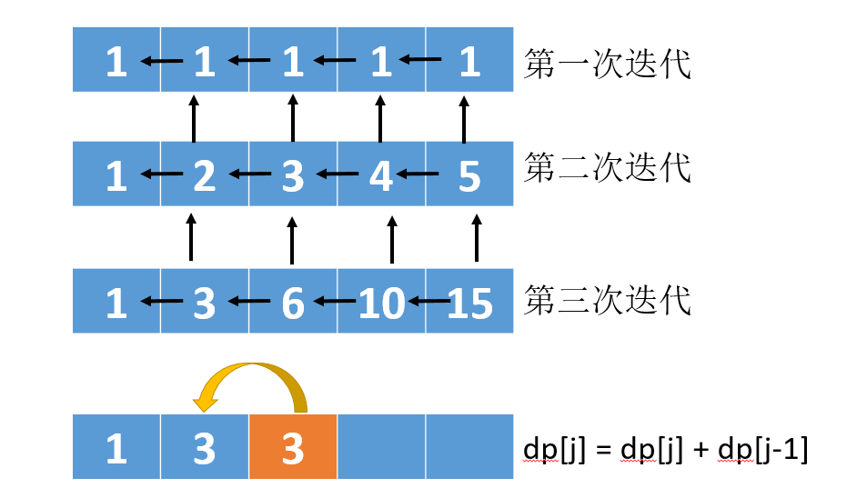
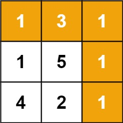
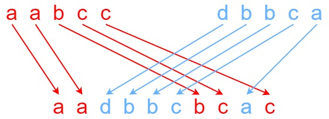

# [50. Pow(x, n)](https://leetcode-cn.com/problems/powx-n/) :star:

实现 pow(x, n) ，即计算 x 的 n 次幂函数（即，$x^n$）。

示例 1：
```
输入：x = 2.00000, n = 10
输出：1024.00000
```
示例 2：
```
输入：x = 2.10000, n = 3
输出：9.26100
```
示例 3：
```
输入：x = 2.00000, n = -2
输出：0.25000
解释：2-2 = 1/22 = 1/4 = 0.25
```

提示：
- -100.0 < x < 100.0
- $-2^{31} <= n <= 2^{31}-1$
- $-10^4 <= x^n <= 10^4$

这种题目，一看就知道是二分，或者说分治，不然一个个去乘，复杂度实在太高了。
$$
3^7 = 3^6 * 3 = (3^3)^2*3 = (3^2*3)^2 * 3
$$
这就是一个递归了啊，要求当前的值，就需要求出子的值。

```java
class Solution {
    public double myPow(double x, int n) {
        if (n == 0) return 1;
        return n > 0 ? dfs(x, (long)n) : 1 / dfs(x, -(long)n);
    }

    public double dfs(double x, long n){
        if (n == 1){
            return x;
        }

        double y = dfs(x, n / 2);
        if (n % 2 == 0){
            return y * y;
        }else {
            return x * y * y;
        }
    }
}
执行用时：1 ms, 在所有 Java 提交中击败了98.84% 的用户
内存消耗：37.7 MB, 在所有 Java 提交中击败了51.30% 的用户
```


官方

**前言**

本题的方法被称为**「快速幂算法」**，有递归和迭代两个版本。这篇题解会从递归版本的开始讲起，再逐步引出迭代的版本。

当指数 n 为负数时，我们可以计算 $x^{-n}$ 再取倒数得到结果，因此我们只需要考虑 n 为自然数的情况。
方法一：快速幂 + 递归

「快速幂算法」的本质是分治算法。举个例子，如果我们要计算 $x^{64}$，我们可以按照：
$$
x→x^2→x^4→x^8→x^{16}→x^{32}→x^{64}
$$
的顺序，从 x 开始，每次直接把上一次的结果进行平方，计算 6 次就可以得到 $x^{64}$ 的值，而不需要对 x 乘 63 次 x。

再举一个例子，如果我们要计算 $x^{77}$，我们可以按照：
$$
x→x^2→x^4→x^9→x^{19}→x^{38}→x^{77}
$$
的顺序，在 $x \to x^2$，$x^2 \to x^4$，$x^{19} \to x^{38}$ 这些步骤中，我们直接把上一次的结果进行平方，而在 $x^4 \to x^9$，$x^9 \to x^{19}$，$x^{38} \to x^{77}$ 这些步骤中，我们把上一次的结果进行平方后，还要额外乘一个 x。

直接从左到右进行推导看上去很困难，因为在每一步中，我们不知道在将上一次的结果平方之后，还需不需要额外乘 x。但如果我们从右往左看，分治的思想就十分明显了：

- 当我们要计算 $x^n$ 时，我们可以先递归地计算出 $y = x^{\lfloor n/2 \rfloor}$，其中 $\lfloor a \rfloor$ 表示对 a 进行下取整；
  
- 根据递归计算的结果，如果 n 为偶数，那么 $x^n = y^2$；如果 n 为奇数，那么 $x^n = y^2 \times x$；
  
- 递归的边界为 $n = 0$，任意数的 0 次方均为 1。

```java
class Solution {
    public double myPow(double x, int n) {
        long N = n;
        return N >= 0 ? quickMul(x, N) : 1.0 / quickMul(x, -N);
    }

    public double quickMul(double x, long N) {
        if (N == 0) {
            return 1.0;
        }
        double y = quickMul(x, N / 2);
        return N % 2 == 0 ? y * y : y * y * x;
    }
}
```


**方法二：快速幂 + 迭代**

方法非常好，使用二进制的方式来处理。

```java
class Solution {
    public double myPow(double x, int n) {
        long N = n;
        return N >= 0 ? quickMul(x, N) : 1.0 / quickMul(x, -N);
    }

    public double quickMul(double x, long N) {
        double ans = 1.0;
        // 贡献的初始值为 x
        double x_contribute = x;
        // 在对 N 进行二进制拆分的同时计算答案
        while (N > 0) {
            if (N % 2 == 1) {
                // 如果 N 二进制表示的最低位为 1，那么需要计入贡献
                ans *= x_contribute;
            }
            // 将贡献不断地平方
            x_contribute *= x_contribute;
            // 舍弃 N 二进制表示的最低位，这样我们每次只要判断最低位即可
            N /= 2;
        }
        return ans;
    }
}


作者：LeetCode-Solution
链接：https://leetcode-cn.com/problems/powx-n/solution/powx-n-by-leetcode-solution/
来源：力扣（LeetCode）
著作权归作者所有。商业转载请联系作者获得授权，非商业转载请注明出处。
```


关于第二种，看评论区会更加的好理解

解题思路：

求 $x^n$ 最简单的方法是通过循环将 n 个 x 乘起来，依次求 $x^1, x^2, ..., x^{n-1}, x^n$ ，时间复杂度为 O(n) 。
快速幂法 可将时间复杂度降低至 O(\log n) ，以下从 “二分法” 和 “二进制” 两个角度解析快速幂法。
快速幂解析（二进制角度）：
> 利用十进制数字 nnn 的二进制表示，可对快速幂进行数学化解释。
- 对于任何十进制正整数 n ，设其二进制为 "$b_m...b_3b_2b_1$"（ $b_i$ 为二进制某位值，$i \in [1,m]$ ），则有：
	- 二进制转十进制： $n = 1b_1 + 2b_2 + 4b_3 + ... + 2^{m-1}b_m$ （即二进制转十进制公式） ；
 	- 幂的二进制展开： $x^n = x^{1b_1 + 2b_2 + 4b_3 + ... + 2^{m-1}b_m} = x^{1b_1}x^{2b_2}x^{4b_3}...x^{2^{m-1}b_m}$ ；
- 根据以上推导，可把计算 $x^n$ 转化为解决以下两个问题：
	- 计算 $x^1, x^2, x^4, ..., x^{2^{m-1}}$ 的值： 循环赋值操作 $x = x^2$ 即可；
	- 获取二进制各位 $b_1, b_2, b_3, ..., b_m$ 的值： 循环执行以下操作即可。
		- $n \& 1$ （与操作）： 判断 n 二进制最右一位是否为 1 ；
		- $n>>1$ （移位操作）： n 右移一位（可理解为删除最后一位）。
- 因此，应用以上操作，可在循环中依次计算 $x^{2^{0}b_1}, x^{2^{1}b_2}, ..., x^{2^{m-1}b_m}$ 的值，并将所有 $x^{2^{i-1}b_i}$ 累计相乘即可，其中：
$$
x^{2^{i-1}b_i}= \begin{cases} 1 & , b_i = 0 \\ x^{2^{i-1}} & , b_i = 1 \\ \end{cases}
$$

```java
class Solution {
    public double myPow(double x, int n) {
        if(x == 0.0f) return 0.0d;
        long b = n;
        double res = 1.0;
        if(b < 0) {
            x = 1 / x;
            b = -b;
        }
        while(b > 0) {
            if((b & 1) == 1) res *= x;
            x *= x;
            b >>= 1;
        }
        return res;
    }
}


作者：jyd
链接：https://leetcode-cn.com/problems/powx-n/solution/50-powx-n-kuai-su-mi-qing-xi-tu-jie-by-jyd/
来源：力扣（LeetCode）
著作权归作者所有。商业转载请联系作者获得授权，非商业转载请注明出处。
```


# [51. N 皇后](https://leetcode-cn.com/problems/n-queens/) :star:

n 皇后问题 研究的是如何将 n 个皇后放置在 n×n 的棋盘上，并且使皇后彼此之间不能相互攻击。

给你一个整数 n ，返回所有不同的 n 皇后问题 的解决方案。

每一种解法包含一个不同的 n 皇后问题 的棋子放置方案，该方案中 'Q' 和 '.' 分别代表了皇后和空位。

示例 1：


```
输入：n = 4
输出：[[".Q..","...Q","Q...","..Q."],["..Q.","Q...","...Q",".Q.."]]
解释：如上图所示，4 皇后问题存在两个不同的解法。
```


思考

经典题目N皇后，思路也很明显，dfs + 回溯 + 剪枝，看来又是考察写代码的能力了。

```java
class Solution {
    List<List<String>> result = new ArrayList<>();

    public List<List<String>> solveNQueens(int n) {
        boolean[] rowFlag = new boolean[n];
        boolean[] colFlag = new boolean[n];
        // 撇 /
        boolean[] right = new boolean[n + n];
        // 捺 \
        boolean[] left = new boolean[n + n];
        dfs(n, rowFlag, colFlag, right, left, new ArrayList<>(), 0);
        return result;
    }

    public void dfs(int n, boolean[] rowFlag, boolean[] colFlag, boolean[] right, boolean[] left, List<String> queens,
                    int curRow){
        if (queens.size() == n){
            print(n, queens);
            return;
        }

        // 权重 给所有斜方向的值统一加上权重
        // 保证斜的方向的数组下标不会小于0
        int weights = n - 1;
        for (int row = curRow; row < n; row++){
            for (int col = 0; col < n; col++){
                // 只要有一个为true 就不能放棋子
                if (!(rowFlag[row] || colFlag[col] || right[row - col + weights] || left[row + col])){
                    rowFlag[row] = true;
                    colFlag[col] = true;
                    right[row - col + weights] = true;
                    left[row + col] = true;
                    queens.add(row + "-" + col);

                    dfs(n, rowFlag, colFlag, right, left, queens, curRow + 1);

                    queens.remove(queens.size() - 1);
                    rowFlag[row] = false;
                    colFlag[col] = false;
                    right[row - col + weights] = false;
                    left[row + col] = false;
                }
            }
        }
    }

    public void print(int n, List<String> queens){
        List<String> tmp = new ArrayList<>();

        for (int row = 0; row < n; row++){
            StringBuilder stringBuilder = new StringBuilder();
            for (int col = 0; col < n; col++){
                if (queens.contains(row + "-" + col)){
                    stringBuilder.append("Q");
                }else {
                    stringBuilder.append(".");
                }
            }
            tmp.add(stringBuilder.toString());
        }
        result.add(tmp);
    }
}
执行结果：超出时间限制
最后执行的输入：9
```

很遗憾，超时，这种时候考虑剪枝，由于每一次递归，都是会向下走一层，所以没有必要再去循环行了。

改进后的核心dfs代码

```java
    public void dfs(int n, boolean[] colFlag, boolean[] right, boolean[] left, List<String> queens,
                    int row){
        if (queens.size() == n){
            print(n, queens);
            return;
        }

        // 权重 给所有斜方向的值统一加上权重
        // 保证斜的方向的数组下标不会小于0
        int weights = n - 1;
        for (int col = 0; col < n; col++){
            // 只要有一个为true 就不能放棋子
            if (!(colFlag[col] || right[row - col + weights] || left[row + col])){
                colFlag[col] = true;
                right[row - col + weights] = true;
                left[row + col] = true;
                queens.add(row + "-" + col);

                dfs(n, colFlag, right, left, queens, row + 1);

                queens.remove(queens.size() - 1);
                colFlag[col] = false;
                right[row - col + weights] = false;
                left[row + col] = false;
            }
        }
    }

执行用时：16 ms, 在所有 Java 提交中击败了5.52% 的用户
内存消耗：39.5 MB, 在所有 Java 提交中击败了5.01% 的用户
```


提交数据集中，执行用时为 1 ms 的范例

```java
class Solution {
    private List<List<String>> res = new ArrayList<>();

    public List<List<String>> solveNQueens(int n) {
        char[][] gird = new char[n][n];
        for (int i = 0; i < n; i++) {
            for (int j = 0; j < n; j++) {
                gird[i][j] = '.';
            }
        }
        boolean[] col = new boolean[n];
        boolean[] dg1 = new boolean[n * 2 - 1];
        boolean[] dg2 = new boolean[n * 2 - 1];
        dfs(0, n, gird, col, dg1, dg2);
        return res;
    }

    private void dfs(int index, int n, char[][] gird, boolean[] col, boolean[] dg1, boolean[] dg2) {
        if (index == n) {
            List<String> list = new ArrayList<>();
            for (int i = 0; i < gird.length; i++) {
                list.add(new String(gird[i]));
            }
            res.add(list);
            return;
        }
        for (int j = 0; j < n; j++) {
            if ((!col[j] && !dg1[n - index + j - 1]) && !dg2[index + j]) {
                gird[index][j] = 'Q';
                col[j] = dg1[n - index + j - 1] = dg2[index + j] = true;
                dfs(index + 1, n, gird, col, dg1, dg2);
                gird[index][j] = '.';
                col[j] = dg1[n - index + j - 1] = dg2[index + j] = false;
            }
        }
    }
}
```

思路是一样的，但是代码写的是真的漂亮，思路清晰，也不需要二次画图。


# [53. 最大子序和](https://leetcode-cn.com/problems/maximum-subarray/)

给定一个整数数组 `nums` ，找到一个具有最大和的连续子数组（子数组最少包含一个元素），返回其最大和。

**示例 1：**

```
输入：nums = [-2,1,-3,4,-1,2,1,-5,4]
输出：6
解释：连续子数组 [4,-1,2,1] 的和最大，为 6 。
```

**示例 2：**

```
输入：nums = [1]
输出：1
```

**示例 3：**

```
输入：nums = [0]
输出：0
```

**示例 4：**

```
输入：nums = [-1]
输出：-1
```

**示例 5：**

```
输入：nums = [-1000]
输出：-1000
```

**提示：**

- `1 <= nums.length <= 3 * 104`
- `-105 <= nums[i] <= 105`

**进阶：**如果你已经实现复杂度为 `O(n)` 的解法，尝试使用更为精妙的 **分治法** 求解。


思路

不需要dp，使用简单的贪心算法即可。记录当前最大数和，往后遍历，把总数与遍历的数相加

- 如果结果小于0，则抛弃之前的数组，从0开始重新计数。
- 如果大于0，则与最大值进行比较，之后继续往后遍历

```java
    public int maxSubArray(int[] nums) {
        if (nums.length == 1) return nums[0];

        int max = nums[0];
        int sum = 0;

        for (int i = 0; i < nums.length; i++) {
            int cur = nums[i];
            if (cur < 0) {
                if ((sum + cur) < 0) {
                    sum = 0;
                    max = Math.max(max, cur);
                }else {
                    sum = sum + cur;
                }
            }else {
                if ((sum + cur) > 0) {
                    sum = sum + cur;
                }else {
                    sum = cur;
                }
                max = Math.max(max, sum);
            }
        }
        return max;
    }
```


官方

**方法一：动态规划**

思路和算法

假设 $\textit{nums}$ 数组的长度是 $n$，下标从 $0$ 到 $n-1$。

我们用 $f(i)$ 代表以第 $i$ 个数结尾的「连续子数组的最大和」，那么很显然我们要求的答案就是：

$$
\max_{0 \leq i \leq n-1} \{ f(i) \}
$$
因此我们只需要求出每个位置的 $f(i)$，然后返回 $f$ 数组中的最大值即可。那么我们如何求 $f(i)$ 呢？我们可以考虑 $\textit{nums}[i]$ 单独成为一段还是加入 $f(i−1)$ 对应的那一段，这取决于 $\textit{nums}[i]$ 和$\textit{nums}[i]f(i−1)$ 的大小，我们希望获得一个比较大的，于是可以写出这样的动态规划转移方程：
$$
\max \{ f(i-1) + \textit{nums}[i], \textit{nums}[i] \}
$$
不难给出一个时间复杂度 $O(n)$、空间复杂度 $O(n)$ 的实现，即用一个 f 数组来保存 $f(i)$ 的值，用一个循环求出所有 $f(i)$。考虑到 $f(i)$ 只和 $f(i−1)$ 相关，于是我们可以只用一个变量 $\textit{pre}$ 来维护对于当前 $f(i)$ 的 $f(i−1)$ 的值是多少，从而让空间复杂度降低到 $O(1)$，这有点类似「滚动数组」的思想。

```java
class Solution {
    public int maxSubArray(int[] nums) {
        int pre = 0, maxAns = nums[0];
        for (int x : nums) {
            pre = Math.max(pre + x, x);
            maxAns = Math.max(maxAns, pre);
        }
        return maxAns;
    }
}


作者：LeetCode-Solution
链接：https://leetcode-cn.com/problems/maximum-subarray/solution/zui-da-zi-xu-he-by-leetcode-solution/
来源：力扣（LeetCode）
著作权归作者所有。商业转载请联系作者获得授权，非商业转载请注明出处。
```

想法好，上面的代码有多种解释，很简洁，需要背一下


**方法二：分治**

思路和算法

这个分治方法类似于「线段树求解最长公共上升子序列问题」的 pushUp 操作。 也许读者还没有接触过线段树，没有关系，方法二的内容假设你没有任何线段树的基础。当然，如果读者有兴趣的话，推荐阅读线段树区间合并法解决多次询问的「区间最长连续上升序列问题」和「区间最大子段和问题」，还是非常有趣的。


官方给出了2种解法，就本题而已写到dp就行了，分治留到「线段树求解最长公共上升子序列问题」去吧。


# [54. 螺旋矩阵](https://leetcode-cn.com/problems/spiral-matrix/)

给你一个 m 行 n 列的矩阵 matrix ，请按照 顺时针螺旋顺序 ，返回矩阵中的所有元素。

示例 1：


```
输入：matrix = [[1,2,3],[4,5,6],[7,8,9]]
输出：[1,2,3,6,9,8,7,4,5]
```
示例 2：


```
输入：matrix = [[1,2,3,4],[5,6,7,8],[9,10,11,12]]
输出：[1,2,3,4,8,12,11,10,9,5,6,7]
```


提示：
- m == matrix.length
- n == matrix[i].length
- 1 <= m, n <= 10
- -100 <= matrix[i][j] <= 100


思考

自己再定义一个`bolean used[][]` 数组，方向是固定的顺时针，一个方向上到头了，转的方向也是固定的。最后所有的数字都被访问了，就终止。

```java
class Solution {
    public List<Integer> spiralOrder(int[][] matrix) {
        boolean[][] visited = new boolean[matrix.length][matrix[0].length];
        int count = 0;
        int total = matrix.length * matrix[0].length;
        List<Integer> result = new ArrayList<>();

        int col = 0;
        int row = 0;

        // 4个方向 左-1 右1 上-2 下2
        int direct = 1;
        while (count < total) {
            result.add(matrix[row][col]);
            visited[row][col] = true;
            count++;

            switch (direct) {
                case 1:
                    if (col == matrix[0].length - 1 || visited[row][col + 1]) {
                        // 往右走到头了 改为向下
                        direct = 2;
                        row++;
                    } else {
                        col++;
                    }
                    break;
                case 2:
                    if (row == matrix.length - 1 || visited[row + 1][col]) {
                        // 往下走到头了 改为向左
                        direct = -1;
                        col--;
                    } else {
                        row++;
                    }
                    break;
                case -1:
                    if (col == 0 || visited[row][col - 1]) {
                        // 往左走到头了 改为向上
                        direct = -2;
                        row--;
                    } else {
                        col--;
                    }
                    break;
                case -2:
                    if (row == 0 || visited[row - 1][col]) {
                        // 往上走到头了 改为向右
                        direct = 1;
                        col++;
                    } else {
                        row--;
                    }
                    break;

            }
        }

        return result;
    }
}
执行用时：0 ms, 在所有 Java 提交中击败了100.00% 的用户
内存消耗：36.8 MB, 在所有 Java 提交中击败了18.82% 的用户
```


官方

模拟或者递归

**方法一：模拟**

可以模拟螺旋矩阵的路径。初始位置是矩阵的左上角，初始方向是向右，当路径超出界限或者进入之前访问过的位置时，顺时针旋转，进入下一个方向。

判断路径是否进入之前访问过的位置需要使用一个与输入矩阵大小相同的辅助矩阵 visited\textit{visited}visited，其中的每个元素表示该位置是否被访问过。当一个元素被访问时，将 visited\textit{visited}visited 中的对应位置的元素设为已访问。

如何判断路径是否结束？由于矩阵中的每个元素都被访问一次，因此路径的长度即为矩阵中的元素数量，当路径的长度达到矩阵中的元素数量时即为完整路径，将该路径返回。

```java
class Solution {
    public List<Integer> spiralOrder(int[][] matrix) {
        List<Integer> order = new ArrayList<Integer>();
        if (matrix == null || matrix.length == 0 || matrix[0].length == 0) {
            return order;
        }
        int rows = matrix.length, columns = matrix[0].length;
        boolean[][] visited = new boolean[rows][columns];
        int total = rows * columns;
        int row = 0, column = 0;
        int[][] directions = {{0, 1}, {1, 0}, {0, -1}, {-1, 0}};
        int directionIndex = 0;
        for (int i = 0; i < total; i++) {
            order.add(matrix[row][column]);
            visited[row][column] = true;
            int nextRow = row + directions[directionIndex][0], nextColumn = column + directions[directionIndex][1];
            if (nextRow < 0 || nextRow >= rows || nextColumn < 0 || nextColumn >= columns || visited[nextRow][nextColumn]) {
                directionIndex = (directionIndex + 1) % 4;
            }
            row += directions[directionIndex][0];
            column += directions[directionIndex][1];
        }
        return order;
    }
}


作者：LeetCode-Solution
链接：https://leetcode-cn.com/problems/spiral-matrix/solution/luo-xuan-ju-zhen-by-leetcode-solution/
来源：力扣（LeetCode）
著作权归作者所有。商业转载请联系作者获得授权，非商业转载请注明出处。
```


**方法二：按层模拟**

可以将矩阵看成若干层，首先输出最外层的元素，其次输出次外层的元素，直到输出最内层的元素。

也就是递归，这里使用评论区的代码

```java
private static List<Integer> spiralOrder(int[][] matrix) {
        LinkedList<Integer> result = new LinkedList<>();
        if(matrix==null||matrix.length==0) return result;
        int left = 0;
        int right = matrix[0].length - 1;
        int top = 0;
        int bottom = matrix.length - 1;
        int numEle = matrix.length * matrix[0].length;
        while (numEle >= 1) {
            for (int i = left; i <= right && numEle >= 1; i++) {
                result.add(matrix[top][i]);
                numEle--;
            }
            top++;
            for (int i = top; i <= bottom && numEle >= 1; i++) {
                result.add(matrix[i][right]);
                numEle--;
            }
            right--;
            for (int i = right; i >= left && numEle >= 1; i--) {
                result.add(matrix[bottom][i]);
                numEle--;
            }
            bottom--;
            for (int i = bottom; i >= top && numEle >= 1; i--) {
                result.add(matrix[i][left]);
                numEle--;
            }
            left++;
        }
        return result;
    }
https://leetcode-cn.com/problems/spiral-matrix/solution/luo-xuan-ju-zhen-by-leetcode-solution/441395
```

这个遍历的dfs写的很漂亮


# [55. 跳跃游戏](https://leetcode-cn.com/problems/jump-game/)

给定一个非负整数数组 `nums` ，你最初位于数组的 **第一个下标** 。

数组中的每个元素代表你在该位置**可以跳跃的最大长度**。

判断你是否能够到达最后一个下标。


**示例 1：**

```
输入：nums = [2,3,1,1,4]
输出：true
解释：可以先跳 1 步，从下标 0 到达下标 1, 然后再从下标 1 跳 3 步到达最后一个下标。
```


**示例 2：**

```
输入：nums = [3,2,1,0,4]
输出：false
解释：无论怎样，总会到达下标为 3 的位置。但该下标的最大跳跃长度是 0 ， 所以永远不可能到达最后一个下标。
```

 

提示：

- 1 <= nums.length <= 3 * 104
- 0 <= nums[i] <= 105


思路

题目写的是可以跳远的**最大**长度，只是最大长度，并不是说只能跳跃那么长。

那么，还是贪心，~~每次跳最长的，然后判断最后能否跳到最后一个位置，不能的话就回溯。~~ 由于这个跳跃是有连续性的，所以可以遍历每个元素，判断是否可以到达，如果可以到达就取出当前元素的可以跳跃距离，与最大跳跃距离进行比较，直到最后。一定是需要遍历每一个元素的，因为你不知道哪个元素里面就藏有大礼包。

主要考察思路，需要记一下思路。

```java
class Solution {
    public boolean canJump(int[] nums) {
        int cur = 0;
        int maxLength = 0;
        while (cur <= maxLength){
            // 判断当前的点是否能到达
            maxLength = Math.max(maxLength, cur + nums[cur]);
            if (maxLength >= nums.length - 1){
                return true;
            }
            cur++;
        }
        return false;
    }
}
执行用时：2 ms, 在所有 Java 提交中击败了83.16% 的用户
内存消耗：40.5 MB, 在所有 Java 提交中击败了28.10% 的用户
```


官方

**方法一：贪心**

我们可以用贪心的方法解决这个问题。

设想一下，对于数组中的任意一个位置 y，我们如何判断它是否可以到达？根据题目的描述，只要存在一个位置 x，它本身可以到达，并且它跳跃的最大长度为 $x + \textit{nums}[x]$，这个值大于等于 y，即 $x + \textit{nums}[x] \geq y$，那么位置 y 也可以到达。

换句话说，对于每一个可以到达的位置 x，它使得 $x+1,x+2,⋯ ,x+nums[x]$这些连续的位置都可以到达。

这样以来，我们依次遍历数组中的每一个位置，并实时维护 最远可以到达的位置。对于当前遍历到的位置 x，如果它在 最远可以到达的位置 的范围内，那么我们就可以从起点通过若干次跳跃到达该位置，因此我们可以用 $x + \textit{nums}[x]$ 更新 最远可以到达的位置。

在遍历的过程中，如果 最远可以到达的位置 大于等于数组中的最后一个位置，那就说明最后一个位置可达，我们就可以直接返回 True 作为答案。反之，如果在遍历结束后，最后一个位置仍然不可达，我们就返回 False 作为答案。

以题目中的示例一

[2, 3, 1, 1, 4]

为例：

- 我们一开始在位置 0，可以跳跃的最大长度为 2，因此最远可以到达的位置被更新为 2；

- 我们遍历到位置 1，由于 $1 \leq 2$，因此位置 1 可达。我们用 1 加上它可以跳跃的最大长度 3，将最远可以到达的位置更新为 4。由于 4 大于等于最后一个位置 4，因此我们直接返回 True。


我们再来看看题目中的示例二

[3, 2, 1, 0, 4]

- 我们一开始在位置 0，可以跳跃的最大长度为 3，因此最远可以到达的位置被更新为 3；
- 我们遍历到位置 1，由于 $1 \leq 3$，因此位置 1 可达，加上它可以跳跃的最大长度 2 得到 3，没有超过最远可以到达的位置；
- 位置 2、位置 3 同理，最远可以到达的位置不会被更新；
- 我们遍历到位置 4，由于 $4 > 3$，因此位置 4 不可达，我们也就不考虑它可以跳跃的最大长度了。

在遍历完成之后，位置 4 仍然不可达，因此我们返回 False。

```java
public class Solution {
    public boolean canJump(int[] nums) {
        int n = nums.length;
        int rightmost = 0;
        for (int i = 0; i < n; ++i) {
            if (i <= rightmost) {
                rightmost = Math.max(rightmost, i + nums[i]);
                if (rightmost >= n - 1) {
                    return true;
                }
            }
        }
        return false;
    }
}


作者：LeetCode-Solution
链接：https://leetcode-cn.com/problems/jump-game/solution/tiao-yue-you-xi-by-leetcode-solution/
来源：力扣（LeetCode）
著作权归作者所有。商业转载请联系作者获得授权，非商业转载请注明出处。
```


# [56. 合并区间](https://leetcode-cn.com/problems/merge-intervals/)

以数组 `intervals` 表示若干个区间的集合，其中单个区间为 `intervals[i] = [starti, endi]` 。请你合并所有重叠的区间，并返回一个不重叠的区间数组，该数组需恰好覆盖输入中的所有区间。

**示例 1：**

```
输入：intervals = [[1,3],[2,6],[8,10],[15,18]]
输出：[[1,6],[8,10],[15,18]]
解释：区间 [1,3] 和 [2,6] 重叠, 将它们合并为 [1,6].
```


**示例 2：**

```
输入：intervals = [[1,4],[4,5]]
输出：[[1,5]]
解释：区间 [1,4] 和 [4,5] 可被视为重叠区间。
```

 

提示：

- 1 <= intervals.length <= 104
- intervals[i].length == 2
- 0 <= starti <= endi <= 104


思路

1. 先按每个区间的起始节点排个序。
2. 按顺序判断前一个区间的 `endi` 是不是大于后一个区间的 `starti` 
   - 大于就可以合并，并且更新 `endi`
   - 小于就跳到后一个区间

```java
class Solution {
    public int[][] merge(int[][] intervals) {
        Arrays.sort(intervals, Comparator.comparingInt(a -> a[0]));
        List<int[]> list = new ArrayList<>();
        int[] cur = intervals[0];
        for (int i = 1; i < intervals.length; i++) {
            if (cur[1] >= intervals[i][0]) {
                // 前一个数组的结尾大于后一个数组的开头 合并
                cur[1] = Math.max(cur[1], intervals[i][1]);
                continue;
            }

            list.add(cur);
            cur = intervals[i];
        }
        list.add(cur);
```


# [57. 插入区间](https://leetcode-cn.com/problems/insert-interval/)

给你一个 无重叠的 ，按照区间起始端点排序的区间列表。

在列表中插入一个新的区间，你需要确保列表中的区间仍然有序且不重叠（如果有必要的话，可以合并区间）。

 

示例 1：
```
输入：intervals = [[1,3],[6,9]], newInterval = [2,5]
输出：[[1,5],[6,9]]
```
示例 2：
```
输入：intervals = [[1,2],[3,5],[6,7],[8,10],[12,16]], newInterval = [4,8]
输出：[[1,2],[3,10],[12,16]]
解释：这是因为新的区间 [4,8] 与 [3,5],[6,7],[8,10] 重叠。
```
示例 3：
```
输入：intervals = [], newInterval = [5,7]
输出：[[5,7]]
```
示例 4：
```
输入：intervals = [[1,5]], newInterval = [2,3]
输出：[[1,5]]
```
示例 5：
```
输入：intervals = [[1,5]], newInterval = [2,7]
输出：[[1,7]]
```


提示：
- 0 <= intervals.length <= 104
- intervals[i].length == 2
- 0 <= intervals[i][0] <= intervals[i][1] <= 105
- intervals 根据 intervals[i][0] 按 升序 排列
- newInterval.length == 2
- 0 <= newInterval[0] <= newInterval[1] <= 105


思考

和上一题感觉差不多，理清思路就行了

1. 单独的一个区间
2. 可以与前一个合并、后一个合并，前后一起合并
3. 可以包掉一个或多个

整体使用滑动窗口，左右指针即可。

```java
class Solution {
    public int[][] insert(int[][] intervals, int[] newInterval) {
        List<int[]> result = new ArrayList<>();
        int l = newInterval[0];
        int r = newInterval[1];

        int i = 0;
        for (; i < intervals.length; i++) {
            int[] interval = intervals[i];
            int left = interval[0];
            int right = interval[1];

            // 完全大于当前区间
            if (right < newInterval[0]){
                result.add(new int[]{left, right});
                continue;
            }

            // 完全小于当前区间
            if (newInterval[1] < left){
                break;
            }

            // 与当前区间接上了或者有重合或者包括了
            l = Math.min(l, left);
            r = Math.max(r, right);
        }

        result.add(new int[]{l, r});
        while (i < intervals.length){
            int[] interval = intervals[i];
            result.add(interval);
            i++;
        }

        return result.toArray(new int[result.size()][2]);
    }
}
执行用时：1 ms, 在所有 Java 提交中击败了99.85% 的用户
内存消耗：40.9 MB, 在所有 Java 提交中击败了21.99% 的用户
```

官方的思路基本上一致


官方

**方法一：模拟**

思路与算法

在给定的区间集合 $\mathcal{X}$ 互不重叠的前提下，当我们需要插入一个新的区间 $[\textit{left}, \textit{right}]$时，我们只需要：

- 找出所有与区间 $S$ 重叠的区间集合 $\mathcal{X}'$；
- 将 $\mathcal{X}'$ 中的所有区间连带上区间 S 合并成一个大区间；
- 最终的答案即为不与 $\mathcal{X}'$ 重叠的区间以及合并后的大区间。


```java
class Solution {
    public int[][] insert(int[][] intervals, int[] newInterval) {
        int left = newInterval[0];
        int right = newInterval[1];
        boolean placed = false;
        List<int[]> ansList = new ArrayList<int[]>();
        for (int[] interval : intervals) {
            if (interval[0] > right) {
                // 在插入区间的右侧且无交集
                if (!placed) {
                    ansList.add(new int[]{left, right});
                    placed = true;                    
                }
                ansList.add(interval);
            } else if (interval[1] < left) {
                // 在插入区间的左侧且无交集
                ansList.add(interval);
            } else {
                // 与插入区间有交集，计算它们的并集
                left = Math.min(left, interval[0]);
                right = Math.max(right, interval[1]);
            }
        }
        if (!placed) {
            ansList.add(new int[]{left, right});
        }
        int[][] ans = new int[ansList.size()][2];
        for (int i = 0; i < ansList.size(); ++i) {
            ans[i] = ansList.get(i);
        }
        return ans;
    }
}


作者：LeetCode-Solution
链接：https://leetcode-cn.com/problems/insert-interval/solution/cha-ru-qu-jian-by-leetcode-solution/
来源：力扣（LeetCode）
著作权归作者所有。商业转载请联系作者获得授权，非商业转载请注明出处。
```


# [58. 最后一个单词的长度](https://leetcode-cn.com/problems/length-of-last-word/)

给你一个字符串 s，由若干单词组成，单词之间用空格隔开。返回字符串中最后一个单词的长度。如果不存在最后一个单词，请返回 0 。

单词 是指仅由字母组成、不包含任何空格字符的最大子字符串。

 

示例 1：

```
输入：s = "Hello World"
输出：5
```


示例 2：

```
输入：s = " "
输出：0
```

 

提示：

- 1 <= s.length <= 104
- s 仅有英文字母和空格 ' ' 组成


简单的api实现，实在是太慢了

```
    public int lengthOfLastWord(String s) {
        String[] s1 = s.split(" ");
        if (s1.length == 0){
            return 0;
        }
        return s1[s1.length - 1].length();
    }
```

改进

```java
    public int lengthOfLastWord(String s) {
        int j = 0;
        int i = s.length() - 1;
        while (i >= 0){
            if (s.charAt(i) == 32){
                if (j != 0){
                    break;
                }
                i--;
                continue;
            }
            i--;
            j++;
        }
        return j;
    }
```


评论区

```
class Solution {
    public int lengthOfLastWord(String s) {
        int end = s.length() - 1;
        while(end >= 0 && s.charAt(end) == ' ') end--;
        if(end < 0) return 0;
        int start = end;
        while(start >= 0 && s.charAt(start) != ' ') start--;
        return end - start;
    }
}


作者：guanpengchn
链接：https://leetcode-cn.com/problems/length-of-last-word/solution/hua-jie-suan-fa-58-zui-hou-yi-ge-dan-ci-de-chang-d/
来源：力扣（LeetCode）
著作权归作者所有。商业转载请联系作者获得授权，非商业转载请注明出处。
```


# [59. 螺旋矩阵 II](https://leetcode-cn.com/problems/spiral-matrix-ii/)

给你一个正整数 n ，生成一个包含 1 到 $n^2$ 所有元素，且元素按顺时针顺序螺旋排列的 n x n 正方形矩阵 matrix 。 

示例 1：


```
输入：n = 3
输出：[[1,2,3],[8,9,4],[7,6,5]]
```

示例 2：

```
输入：n = 1
输出：[[1]]
```

提示：

- 1 <= n <= 20


思考

与54题的差别不大，受评论区代码影响

```java
class Solution {
    public int[][] generateMatrix(int n) {
        int[][] result = new int[n][n];

        int total = n * n;
        int count = 1;
        int left = 0;
        int top = 0;
        int right = n - 1;
        int bottom = n - 1;
        
        while (count <= total){
            // 向右
            for (int i = left; i <= right && count <= total; i++){
                result[top][i] = count;
                count++;
            }
            top++;

            for (int i = top; i <= bottom && count <= total; i++){
                result[i][right] = count;
                count++;
            }
            right--;

            for (int i = right; i >= left && count <= total; i--){
                result[bottom][i] = count;
                count++;
            }
            bottom--;

            for (int i = bottom; i >= top && count <= total; i--){
                result[i][left] = count;
                count++;
            }
            left++;
        }

        return result;
    }
}
执行用时：0 ms, 在所有 Java 提交中击败了100.00% 的用户
内存消耗：36.5 MB, 在所有 Java 提交中击败了54.71% 的用户
```


评论区与官方的思路与54题的完全没有区别。


# [61. 旋转链表](https://leetcode-cn.com/problems/rotate-list/)

给你一个链表的头节点 head ，旋转链表，将链表每个节点向右移动 k 个位置。

 

示例 1：


```
输入：head = [1,2,3,4,5], k = 2
输出：[4,5,1,2,3]
```
示例 2：


```
输入：head = [0,1,2], k = 4
输出：[2,0,1]
```


提示：
- 链表中节点的数目在范围 [0, 500] 内
- -100 <= Node.val <= 100
- 0 <= k <= 2 * 109


第一眼看没看懂题目意思，题目中 ”将链表每个节点向右移动“ 指你需要整体看来链表，而不是先把第一个节点往右移动，第二个节点再往右移动，而是整体往右移动，而且是成环的，最后一个节点再移动会回到第一个节点。

链表题，大多都是考思路，记住答案的思路就ok，评论区看下来，思路是模拟，然后给出了两种方案

- 链表成环

  把尾结点与头结点连起来，然后从头结点往后走 total - k 个位置后断开，后面那个位置就是新的头节点。

- 快慢指针

  快指针先走k步，然后慢指针与快指针一起走，直到走掉链表的尾节点，把尾节点与头节点连起来。此时慢指针的下一个位置，就是原链表倒数第k个节点，也就是新链表的头结点。


评论区高赞

**「快慢指针」解法**

本质还是道模拟题，分步骤处理即可：

- 避免不必要的旋转：与链表长度成整数倍的「旋转」都是没有意义的（旋转前后链表不变）
- 使用「快慢指针」找到倒数第 k 个节点（新头结点），然后完成基本的链接与断开与断开

```java
class Solution {
    public ListNode rotateRight(ListNode head, int k) {
        if (head == null || k == 0) return head;
        // 计算有效的 k 值：对于与链表长度成整数倍的「旋转」都是没有意义的（旋转前后链表不变）
        int tot = 0;
        ListNode tmp = head;
        while (tmp != null && ++tot > 0) tmp = tmp.next;
        k %= tot;
        if (k == 0) return head;

        // 使用「快慢指针」找到倒数第 k 个节点（新头结点）：slow 会停在「新头结点」的「前一位」，也就是「新尾结点」
        ListNode slow = head, fast = head;
        while (k-- > 0) fast = fast.next;
        while (fast.next != null) {
            slow = slow.next;
            fast = fast.next;
        }
        // 保存新头结点，并将新尾结点的 next 指针置空
        ListNode nHead = slow.next;
        slow.next = null;
        // 将新链表的前半部分（原链表的后半部分）与原链表的头结点链接上
        fast.next = head;
        return nHead;
    }
}


作者：AC_OIer
链接：https://leetcode-cn.com/problems/rotate-list/solution/kuai-man-zhi-zhen-ru-he-fen-bu-zou-jie-j-ns7u/
来源：力扣（LeetCode）
著作权归作者所有。商业转载请联系作者获得授权，非商业转载请注明出处。
```


**「闭合成环」解法**

另外一个做法是，先成环，再断开：

- 找到原链表的最后一个节点，将其与原链表的头结点相连（成环），并统计链表长度，更新有效 k 值
- 从原链表的头节点出发，找到需要断开的点，进行断开

```java
class Solution {
    public ListNode rotateRight(ListNode head, int k) {
        if (head == null || k == 0) return head;
        // 先将链表成环，并记录链表的长度
        // tmp 会记录住原链表最后一位节点
        int tot = 0;
        ListNode tmp = head;
        while (tmp.next != null && ++tot > 0) tmp = tmp.next;
        tot++;
        k %= tot;
        if (k == 0) return head;

        // 正式成环
        tmp.next = head;

        // 从原链表 head 出发，走 tot - k - 1 步，找到「新尾结点」进行断开，并将其下一个节点作为新节点返回
        k = tot - k - 1;
        while (k-- > 0) head = head.next;
        ListNode nHead = head.next;
        head.next = null;
        return nHead;
    }
}


作者：AC_OIer
链接：https://leetcode-cn.com/problems/rotate-list/solution/kuai-man-zhi-zhen-ru-he-fen-bu-zou-jie-j-ns7u/
来源：力扣（LeetCode）
著作权归作者所有。商业转载请联系作者获得授权，非商业转载请注明出处。
```


# [62. 不同路径](https://leetcode-cn.com/problems/unique-paths/) :star:

一个机器人位于一个 m x n 网格的左上角 （起始点在下图中标记为 “Start” ）。

机器人每次只能向下或者向右移动一步。机器人试图达到网格的右下角（在下图中标记为 “Finish” ）。

问总共有多少条不同的路径？


**示例 1：**


```
输入：m = 3, n = 7
输出：28
```


**示例 2：**

```
输入：m = 3, n = 2
输出：3
解释：
从左上角开始，总共有 3 条路径可以到达右下角。

1. 向右 -> 向下 -> 向下
2. 向下 -> 向下 -> 向右
3. 向下 -> 向右 -> 向下
```


**示例 3：**

```
输入：m = 7, n = 3
输出：28
```


**示例 4：**

```
输入：m = 3, n = 3
输出：6
```


提示：

- 1 <= m, n <= 100
- 题目数据保证答案小于等于 2 * 109


非常经典的dp题，覃超的算法课就以本题来讲解dp的。

$dp[i][j]$ 为当前格的路径走法总数，由于只能向下或者向右走，那么当前格的总数就相当于上面那格的总数加左边那格的总数，状态转移方程为：
$$
 dp[i][j] = dp[i - 1][j] + dp[i][j - 1];
$$
明显，第一行与第一列是只有一种走法的，先初始化一下。

```java
    public static int uniquePaths(int m, int n) {
        int[][] dp = new int[m][n];

        dp[0][0] = 1;
        for (int i = 0; i < m; i++){
            for (int j = 0; j < n; j++){
                if (i == 0){
                    dp[0][j] = 1;
                    continue;
                }
                if (j == 0){
                    dp[i][0] = 1;
                    continue;
                }
                dp[i][j] = dp[i - 1][j] + dp[i][j - 1];
            }
        }
        return dp[m - 1][n - 1];
    }
```


官方

**方法一：动态规划**

```java
class Solution {
    public int uniquePaths(int m, int n) {
        int[][] f = new int[m][n];
        for (int i = 0; i < m; ++i) {
            f[i][0] = 1;
        }
        for (int j = 0; j < n; ++j) {
            f[0][j] = 1;
        }
        for (int i = 1; i < m; ++i) {
            for (int j = 1; j < n; ++j) {
                f[i][j] = f[i - 1][j] + f[i][j - 1];
            }
        }
        return f[m - 1][n - 1];
    }
}


作者：LeetCode-Solution
链接：https://leetcode-cn.com/problems/unique-paths/solution/bu-tong-lu-jing-by-leetcode-solution-hzjf/
来源：力扣（LeetCode）
著作权归作者所有。商业转载请联系作者获得授权，非商业转载请注明出处。
```


**方法二：组合数学**

**思路与算法**

从左上角到右下角的过程中，我们需要移动 $m+n-2$ 次，其中有 $m-1$ 次向下移动，$n-1$ 次向右移动。因此路径的总数，就等于从 $m+n-2$ 次移动中选择 $m-1$ 次向下移动的方案数，即组合数：

$$
{\Large C}_{m+n-2}^{m-1} = \binom{m+n-2}{m-1} = \frac{(m+n-2)(m+n-3)\cdots n}{(m-1)!} = \frac{(m+n-2)!}{(m-1)!(n-1)!} 
$$
因此我们直接计算出这个组合数即可。

```java
class Solution {
    public int uniquePaths(int m, int n) {
        long ans = 1;
        for (int x = n, y = 1; y < m; ++x, ++y) {
            ans = ans * x / y;
        }
        return (int) ans;
    }
}


作者：LeetCode-Solution
链接：https://leetcode-cn.com/problems/unique-paths/solution/bu-tong-lu-jing-by-leetcode-solution-hzjf/
来源：力扣（LeetCode）
著作权归作者所有。商业转载请联系作者获得授权，非商业转载请注明出处。
```

数学就是降维打击


# [63. 不同路径 II](https://leetcode-cn.com/problems/unique-paths-ii/)

一个机器人位于一个 m x n 网格的左上角 （起始点在下图中标记为“Start” ）。

机器人每次只能向下或者向右移动一步。机器人试图达到网格的右下角（在下图中标记为“Finish”）。

现在考虑网格中有障碍物。那么从左上角到右下角将会有多少条不同的路径？

示例 1：


```
输入：obstacleGrid = [[0,0,0],[0,1,0],[0,0,0]]
输出：2
解释：
3x3 网格的正中间有一个障碍物。
从左上角到右下角一共有 2 条不同的路径：
1. 向右 -> 向右 -> 向下 -> 向下
2. 向下 -> 向下 -> 向右 -> 向右
```
示例 2：


```
输入：obstacleGrid = [[0,1],[0,0]]
输出：1
```


提示：
- m == obstacleGrid.length
- n == obstacleGrid[i].length
- 1 <= m, n <= 100
- $obstacleGrid[i][j]$ 为 0 或 1


思考

还是dp，没有区别啊。


```java
class Solution {
    public int uniquePathsWithObstacles(int[][] obstacleGrid) {
        int[][] dp = new int[obstacleGrid.length][obstacleGrid[0].length];
        // 左上角可能有石头
        if (obstacleGrid[0][0] == 1){
            return 0;
        }
        dp[0][0] = 1;

        int i = 1;
        // 初始化 第一行
        for (; i < obstacleGrid[0].length && obstacleGrid[0][i] == 0; i++){
            dp[0][i] = 1;
        }
        // 第一行有石头 石头后面的格子压根就到不了了
        for (; i < obstacleGrid[0].length; i++){
            dp[0][i] = 0;
        }

        for (i = 1; i < obstacleGrid.length && obstacleGrid[i][0] == 0; i++){
            dp[i][0] = 1;
        }
        // 第一列有石头 石头后面的格子压根就到不了了
        for (; i < obstacleGrid.length; i++){
            dp[i][0] = 0;
        }

        for (int row = 1; row < obstacleGrid.length; row++){
            for (int col = 1; col < obstacleGrid[0].length; col++){
                if (obstacleGrid[row][col] == 1){
                    dp[row][col] = 0;
                    continue;
                }

                dp[row][col] = (obstacleGrid[row - 1][col] == 1 ? 0 : dp[row - 1][col])
                        + (obstacleGrid[row][col - 1] == 1 ? 0 : dp[row][col - 1]);
            }
        }

        return dp[obstacleGrid.length - 1][obstacleGrid[0].length - 1];
    }
}
执行用时：0 ms, 在所有 Java 提交中击败了100.00% 的用户
内存消耗：38 MB, 在所有 Java 提交中击败了9.84% 的用户
```


官方

很显然我们可以给出一个时间复杂度 O(nm)并且空间复杂度也是 O(nm) 的实现，由于这里 f(i,j) 只与 f(i−1,j) 和 f(i,j−1) 相关，我们可以运用**「滚动数组思想」**把空间复杂度优化称 O(m)。「滚动数组思想」是一种常见的动态规划优化方法，在我们的题目中已经多次使用到，例如「剑指 Offer 46. 把数字翻译成字符串」、「70. 爬楼梯」等，当我们定义的状态在动态规划的转移方程中只和某几个状态相关的时候，就可以考虑这种优化方法，目的是给空间复杂度「降维」。如果你还不知道什么是「滚动数组思想」，一定要查阅相关资料进行学习哦。

代码中给出了使用「滚动数组思想」优化后的实现。 

```java
class Solution {
    public int uniquePathsWithObstacles(int[][] obstacleGrid) {
        int n = obstacleGrid.length, m = obstacleGrid[0].length;
        int[] f = new int[m];

        f[0] = obstacleGrid[0][0] == 0 ? 1 : 0;
        for (int i = 0; i < n; ++i) {
            for (int j = 0; j < m; ++j) {
                if (obstacleGrid[i][j] == 1) {
                    f[j] = 0;
                    continue;
                }
                if (j - 1 >= 0 && obstacleGrid[i][j - 1] == 0) {
                    f[j] += f[j - 1];
                }
            }
        }
        
        return f[m - 1];
    }
}


作者：LeetCode-Solution
链接：https://leetcode-cn.com/problems/unique-paths-ii/solution/bu-tong-lu-jing-ii-by-leetcode-solution-2/
来源：力扣（LeetCode）
著作权归作者所有。商业转载请联系作者获得授权，非商业转载请注明出处。
```


这里的滚动数组的优化，评论区解释的比较清晰

**动态规划+空间优化**

参考自官网解法，原文参见 [这里](https://leetcode-cn.com/problems/unique-paths-ii/solution/bu-tong-lu-jing-ii-by-leetcode-solution-2/)
对于动态规划的两种解法，都是只需要上一层的解，而不需要上上一层的。

```
dp[i][j] = dp[i - 1][j] + dp[i][j - 1]
```

也就是求第`i`行时，只需要`i-1`行已求解过的值，不需要`i-2`行的了。所以这里可以用滚动数组进行优化，将二维数组改为一维数组。一维数组的大小为**列的长度**。



第三次迭代时，求第三个格子`6`时，由于左边的值已经是已知的，第二次迭代时同位置的值也是已知的。所以当前值的计算方式就是：

```
计算当前值 = 以求出的左边值 + 上一次迭代同位置的值
dp[j] = dp[j - 1] + dp[j]
```

作者：wang_ni_ma
链接：https://leetcode-cn.com/problems/unique-paths-ii/solution/si-chong-shi-xian-xiang-xi-tu-jie-63-bu-0qyz7/
来源：力扣（LeetCode）
著作权归作者所有。商业转载请联系作者获得授权，非商业转载请注明出处。


# [64. 最小路径和](https://leetcode-cn.com/problems/minimum-path-sum/)

给定一个包含非负整数的 `m x n` 网格 `grid` ，请找出一条从左上角到右下角的路径，使得路径上的数字总和为最小。

**说明：**每次只能向下或者向右移动一步。


**示例 1：**



```
输入：grid = [[1,3,1],[1,5,1],[4,2,1]]
输出：7
解释：因为路径 1→3→1→1→1 的总和最小。
```


**示例 2：**

```
输入：grid = [[1,2,3],[4,5,6]]
输出：12
```

 

提示：

- `m == grid.length`
- `n == grid[i].length`
- `1 <= m, n <= 200`
- `0 <= grid[i][j] <= 100`


经典dp第二题，带有条件的dp

```java
class Solution {
    public int minPathSum(int[][] grid) {
        int row = grid.length;
        int col = grid[0].length;
        int[][] dp = new int[row][col];
        dp[0][0] = grid[0][0];
        for(int i = 0; i < row; i++){
            for(int j = 0; j < col; j++){
                if(i == 0 && j > 0){
                    dp[0][j] = dp[0][j - 1] + grid[0][j];
                }

                if(j == 0 && i > 0){
                    dp[i][0] = dp[i - 1][0] + grid[i][0];
                }

                if(i > 0 && j > 0){
                    dp[i][j] = Math.min(dp[i][j - 1], dp[i - 1][j]) + grid[i][j];
                }
            }
        }
        return dp[row - 1][col - 1];
    }
}
```


# [66. 加一](https://leetcode-cn.com/problems/plus-one/)

给定一个由 **整数** 组成的 **非空** 数组所表示的非负整数，在该数的基础上加一。

最高位数字存放在数组的首位， 数组中每个元素只存储**单个**数字。

你可以假设除了整数 0 之外，这个整数不会以零开头。

**示例 1：**

```
输入：digits = [1,2,3]
输出：[1,2,4]
解释：输入数组表示数字 123。
```

**示例 2：**

```
输入：digits = [4,3,2,1]
输出：[4,3,2,2]
解释：输入数组表示数字 4321。
```

**示例 3：**

```
输入：digits = [0]
输出：[1]
```


没啥好说的，注意一下进位就行了

```java
    public static int[] plusOne(int[] digits) {
        int carry = 0;
        for (int i = digits.length - 1; i >= 0; i--){
            int val = digits[i] + 1;
            if (val >= 10){
                val = val - 10;
                digits[i] = val;
                carry = 1;
            }else {
                digits[i] = val;
                carry = 0;
                break;
            }
        }
        if (carry == 1){
            int[] array = new int[digits.length + 1];
            array[0] = 1;
            int i = 1;
            for (int digit : digits) {
                array[i] = digit;
                i++;
            }
            digits = array;
        }
        return digits;
    }
```


# [67. 二进制求和](https://leetcode-cn.com/problems/add-binary/)

给你两个二进制字符串，返回它们的和（用二进制表示）。

输入为 非空 字符串且只包含数字 1 和 0。

 

**示例 1:**

```
输入: a = "11", b = "1"
输出: "100"
```

**示例 2:**

```
输入: a = "1010", b = "1011"
输出: "10101"
```

**提示：**

- 每个字符串仅由字符 `'0'` 或 `'1'` 组成。
- `1 <= a.length, b.length <= 10^4`
- 字符串如果不是 `"0"` ，就都不含前导零。


简单难度，没啥好说的，首先是标准思路

```java
public String addBinary(String a, String b) {
        StringBuilder stringBuilder = new StringBuilder();
        int aRight = a.length() - 1;
        int bRight = b.length() - 1;
        int carry = 0;
        while (aRight >= 0 || bRight >= 0){
            int aValue = 0;
            if (aRight >= 0){
                aValue = a.charAt(aRight) - '0';
                aRight--;
            }

            int bValue = 0;
            if (bRight >= 0){
                bValue = b.charAt(bRight) - '0';
                bRight--;
            }

            int value = aValue + bValue + carry;
            if (value >= 2){
                carry = 1;
                value = value - 2;
            }else {
                carry = 0;
            }
            stringBuilder = new StringBuilder(String.valueOf(value)).append(stringBuilder);
        }

        if (carry == 1){
            stringBuilder = new StringBuilder("1").append(stringBuilder);
        }
        return stringBuilder.toString();
    }

执行用时：3 ms, 在所有 Java 提交中击败了54.58% 的用户
内存消耗：38.7 MB, 在所有 Java 提交中击败了9.79% 的用户
```

没有考虑到极端长度不一致的情况下，所以成绩较差。但是由于存在进位的情况，不能直接把更长的那一节拼接过去。


# [69. x 的平方根](https://leetcode-cn.com/problems/sqrtx/) :star:

实现 `int sqrt(int x)` 函数。

计算并返回 x 的平方根，其中 x 是非负整数。

由于返回类型是整数，结果只保留整数的部分，小数部分将被舍去。

示例 1:
```
输入: 4
输出: 2
```
示例 2:
```
输入: 8
输出: 2
说明: 8 的平方根是 2.82842..., 
     由于返回类型是整数，小数部分将被舍去。
```


看到这题就想到了《左耳听风-陈皓 —— 魔数 0x5f3759df》的那一节，只不过人家的函数是平方根倒数。简单题就是考思路，我觉得本题使用二分，能够加速遍历。

```java
class Solution {
    public int mySqrt(int x) {
        if(x == 0) return 0;
        int m = 1;
        while (true) {
            while (x > (m << 2) * (m << 2)) {
                m = m << 2;
            }

            if ((m + 1) * (m + 1) > x) {
                return m;
            }

            m = m + 1;
        }
    }
}

class Solution {
    public int mySqrt(int x) {
        int l = 0;
        int r = x;
        int ans = -1;

        while (l <= r){
            int mid = (l + r) / 2;
            if (x >= mid * mid){
                ans = mid;
                l = mid + 1;
            }else {
                r = mid - 1;
            }
        }
        return ans;
    }
}

执行结果：超出时间限制
最后执行的输入：2147395599
```

两种都超了，看来思路不对。


官方：

**方法一：袖珍计算器算法**

**方法二：二分查找**

```java
class Solution {
    public int mySqrt(int x) {
        int l = 0, r = x, ans = -1;
        while (l <= r) {
            int mid = l + (r - l) / 2;
            if ((long) mid * mid <= x) {
                ans = mid;
                l = mid + 1;
            } else {
                r = mid - 1;
            }
        }
        return ans;
    }
}


作者：LeetCode-Solution
链接：https://leetcode-cn.com/problems/sqrtx/solution/x-de-ping-fang-gen-by-leetcode-solution/
来源：力扣（LeetCode）
著作权归作者所有。商业转载请联系作者获得授权，非商业转载请注明出处。
```

**方法三：牛顿迭代**


# [70. 爬楼梯](https://leetcode-cn.com/problems/climbing-stairs/)

假设你正在爬楼梯。需要 n 阶你才能到达楼顶。

每次你可以爬 1 或 2 个台阶。你有多少种不同的方法可以爬到楼顶呢？

注意：给定 n 是一个正整数。

**示例 1：**

```
输入： 2
输出： 2
解释： 有两种方法可以爬到楼顶。

1.  1 阶 + 1 阶
2.  2 阶
```


**示例 2：**

```
输入： 3
输出： 3
解释： 有三种方法可以爬到楼顶。

1.  1 阶 + 1 阶 + 1 阶
2.  1 阶 + 2 阶
3.  2 阶 + 1 阶
```


dp入门

```java
class Solution {
    public int climbStairs(int n) {
        int [] dp = new int[n + 1];
        if(n == 1){
            return 1;
        }
        if(n == 2){
            return 2;
        }
        dp[0] = 0;
        dp[1] = 1;
        dp[2] = 2;
        
        for(int i = 3; i <= n; i++){
            dp[i] = dp[i - 1] + dp[i - 2];
        }
        return dp[n];
    }
}
```


# [71. 简化路径](https://leetcode-cn.com/problems/simplify-path/)

给你一个字符串 path ，表示指向某一文件或目录的 Unix 风格 绝对路径 （以 '/' 开头），请你将其转化为更加简洁的规范路径。

在 Unix 风格的文件系统中，一个点（.）表示当前目录本身；此外，两个点 （..） 表示将目录切换到上一级（指向父目录）；两者都可以是复杂相对路径的组成部分。任意多个连续的斜杠（即，'//'）都被视为单个斜杠 '/' 。 对于此问题，任何其他格式的点（例如，'...'）均被视为文件/目录名称。

请注意，返回的 规范路径 必须遵循下述格式：
- 始终以斜杠 '/' 开头。
- 两个目录名之间必须只有一个斜杠 '/' 。
- 最后一个目录名（如果存在）不能 以 '/' 结尾。
- 此外，路径仅包含从根目录到目标文件或目录的路径上的目录（即，不含 '.' 或 '..'）。

返回简化后得到的 规范路径 。

 

示例 1：
```
输入：path = "/home/"
输出："/home"
解释：注意，最后一个目录名后面没有斜杠。 
```
示例 2：
```
输入：path = "/../"
输出："/"
解释：从根目录向上一级是不可行的，因为根目录是你可以到达的最高级。
```
示例 3：
```
输入：path = "/home//foo/"
输出："/home/foo"
解释：在规范路径中，多个连续斜杠需要用一个斜杠替换。
```
示例 4：
```
输入：path = "/a/./b/../../c/"
输出："/c"
```


提示：
- 1 <= path.length <= 3000
- path 由英文字母，数字，'.'，'/' 或 '_' 组成。
- path 是一个有效的 Unix 风格绝对路径。


思考

这个看起来是对队列的应用，使用 `/` 区分文件夹的名称，遇到 `/` 就压入队列，遍历完成后逐个弹出。

```java
class Solution {
    public String simplifyPath(String path) {
        LinkedList<String> queue = new LinkedList<>();
      	// 补一个 / 方便后续循环处理
        path = path + "/";

        int cur = 0;
        StringBuilder stringBuilder = new StringBuilder();
        while (cur < path.length()){
            char c = path.charAt(cur);
            cur++;

            if (c == '/'){
                String s = stringBuilder.toString();
                stringBuilder = new StringBuilder();

                if (s.length() > 0){
                    if (s.equals(".")){
                        continue;
                    }

                    // 如果是返回上一层 就删掉一个层级
                    if (s.equals("..")){
                        if (!queue.isEmpty()){
                            queue.removeLast();
                        }
                        continue;
                    }
                    queue.offer(s);
                }
                continue;
            }
            stringBuilder.append(c);
        }

        StringBuilder result = new StringBuilder("/");
        while (!queue.isEmpty()){
            result.append(queue.pop()).append("/");
        }
        if (result.length() > 1){
            result.deleteCharAt(result.length() - 1);
        }
        return result.toString();
    }
}
执行用时：6 ms, 在所有 Java 提交中击败了50.50% 的用户
内存消耗：38.5 MB, 在所有 Java 提交中击败了63.20% 的用户
```


评论区

解题思路

分割字符串之后根据每种情况进行判定
.和``就不用管，直接跳过
..就代表着返回上一级，即弹出队尾元素（要注意判空）
其他情况直接压入队列就行。

如果对linux比较熟悉的话这道题应该是秒杀的，Linux的目录层级就是用栈实现的
只不过为了拼接方便这里使用了双端队列

```java
class Solution {
    public String simplifyPath(String path) {
        // 双端队列
        Deque<String> queue = new LinkedList<>();
        // 分割字符
        String[] res = path.split("/");
        for(int i = 0; i < res.length; i++){
            String s = res[i];
            if(s.equals(".") || s.equals("")) continue;
            else if (s.equals("..")){
                if(!queue.isEmpty()){
                    queue.pollLast();
                }
            }else{
                queue.offer(s);
            }
        }
        // 拼接
        StringBuilder sb = new StringBuilder("/");
        while(!queue.isEmpty()){
            sb.append(queue.poll());
            if(!queue.isEmpty()){
                sb.append("/");
            }
        }
        // 判空
        return sb.toString().equals("") ? "/" : sb.toString();
    }
}


作者：spark-
链接：https://leetcode-cn.com/problems/simplify-path/solution/shuang-duan-dui-lie-linuxde-si-lu-by-sik-lt4h/
来源：力扣（LeetCode）
著作权归作者所有。商业转载请联系作者获得授权，非商业转载请注明出处。
```


# [72. 编辑距离](https://leetcode-cn.com/problems/edit-distance/) :fearful:

给你两个单词 word1 和 word2，请你计算出将 word1 转换成 word2 所使用的最少操作数 。

你可以对一个单词进行如下三种操作：

- 插入一个字符
- 删除一个字符
- 替换一个字符

 

**示例 1：**

```
输入：word1 = "horse", word2 = "ros"
输出：3
解释：
horse -> rorse (将 'h' 替换为 'r')
rorse -> rose (删除 'r')
rose -> ros (删除 'e')
```


**示例 2：**

```
输入：word1 = "intention", word2 = "execution"
输出：5
解释：
intention -> inention (删除 't')
inention -> enention (将 'i' 替换为 'e')
enention -> exention (将 'n' 替换为 'x')
exention -> exection (将 'n' 替换为 'c')
exection -> execution (插入 'u')
```


提示：

- 0 <= word1.length, word2.length <= 500
- word1 和 word2 由小写英文字母组成


没想法……


# [73. 矩阵置零](https://leetcode-cn.com/problems/set-matrix-zeroes/)

给定一个 $m * n$ 的矩阵，如果一个元素为 0 ，则将其所在行和列的所有元素都设为 0 。请使用 **原地** 算法。

进阶：
- 一个直观的解决方案是使用  O(mn) 的额外空间，但这并不是一个好的解决方案。
- 一个简单的改进方案是使用 O(m + n) 的额外空间，但这仍然不是最好的解决方案。
- 你能想出一个仅使用常量空间的解决方案吗？

 

示例 1：


```
输入：matrix = [[1,1,1],[1,0,1],[1,1,1]]
输出：[[1,0,1],[0,0,0],[1,0,1]]
```
示例 2：


```
输入：matrix = [[0,1,2,0],[3,4,5,2],[1,3,1,5]]
输出：[[0,0,0,0],[0,4,5,0],[0,3,1,0]]
```


提示：
- m == matrix.length
- n == matrix[0].length
- 1 <= m, n <= 200
- $-2^{31} <= matrix[i][j] <= 2^{31} - 1$


思考

既然不能使用额外的空间，那么就用时间换空间。这里的问题是，在遍历的时候不知道这个0是矩阵本身的0，还是后期手动变为的0；由于只有常量的空间，你没有地方来记录变为0的那些格子或者原来就为0的格子。

没想出好办法了，使用官方的思路

```java
class Solution {
    public void setZeroes(int[][] matrix) {
        // 记录第一行与第一列是否有0
        boolean row = false;
        boolean col = false;

        for (int i = 0; i < matrix.length; i++){
            if (matrix[i][0] == 0) {
                col = true;
                break;
            }
        }

        for (int i = 0; i < matrix[0].length; i++){
            if (matrix[0][i] == 0) {
                row = true;
                break;
            }
        }

        // 扫描矩阵 把原矩阵中为0的位置记录到第一行、第一列
        for (int i = 0; i < matrix.length; i++){
            for (int j = 0; j < matrix[0].length; j++){
                if (matrix[i][j] == 0){
                    matrix[0][j] = 0;
                    matrix[i][0] = 0;
                }
            }
        }

        // 把矩阵有0的 行与列都置为0
        for (int i = 1; i < matrix.length; i++){
            if (matrix[i][0] == 0){
                for (int j = 1; j < matrix[0].length; j++){
                    matrix[i][j] = 0;
                }
            }
        }

        for (int j= 1; j < matrix[0].length; j++){
            if (matrix[0][j] == 0) {
                for (int i = 1; i < matrix.length; i++){
                    matrix[i][j] = 0;
                }
            }
        }

        // 判断第一行与第一列是否为0
        if (row){
            Arrays.fill(matrix[0], 0);
        }

        if (col){
            for (int j = 0; j < matrix.length; j++){
                matrix[j][0] = 0;
            }
        }
    }
}
执行用时：1 ms, 在所有 Java 提交中击败了99.94% 的用户
内存消耗：40.2 MB, 在所有 Java 提交中击败了29.63% 的用户
```


官方

**方法一：使用标记数组**

**思路和算法**

我们可以用两个标记数组分别记录每一行和每一列是否有零出现。

具体地，我们首先遍历该数组一次，如果某个元素为 0，那么就将该元素所在的行和列所对应标记数组的位置置为 $\text{true}$。最后我们再次遍历该数组，用标记数组更新原数组即可。

**复杂度分析**

- 时间复杂度：O(mn)，其中 m 是矩阵的行数，n 是矩阵的列数。我们至多只需要遍历该矩阵两次。
- 空间复杂度：O(m+n)，其中 m 是矩阵的行数，n 是矩阵的列数。我们需要分别记录每一行或每一列是否有零出现。


**方法二：使用两个标记变量**

**思路和算法**

我们可以用矩阵的第一行和第一列代替方法一中的两个标记数组，以达到 O(1) 的额外空间。但这样会导致原数组的第一行和第一列被修改，无法记录它们是否原本包含 0。因此我们需要额外使用两个标记变量分别记录第一行和第一列是否原本包含 0。

在实际代码中，我们首先预处理出两个标记变量，接着使用其他行与列去处理第一行与第一列，然后反过来使用第一行与第一列去更新其他行与列，最后使用两个标记变量更新第一行与第一列即可。

```java
class Solution {
    public void setZeroes(int[][] matrix) {
        int m = matrix.length, n = matrix[0].length;
        boolean flagCol0 = false, flagRow0 = false;
        for (int i = 0; i < m; i++) {
            if (matrix[i][0] == 0) {
                flagCol0 = true;
            }
        }
        for (int j = 0; j < n; j++) {
            if (matrix[0][j] == 0) {
                flagRow0 = true;
            }
        }
        for (int i = 1; i < m; i++) {
            for (int j = 1; j < n; j++) {
                if (matrix[i][j] == 0) {
                    matrix[i][0] = matrix[0][j] = 0;
                }
            }
        }
        for (int i = 1; i < m; i++) {
            for (int j = 1; j < n; j++) {
                if (matrix[i][0] == 0 || matrix[0][j] == 0) {
                    matrix[i][j] = 0;
                }
            }
        }
        if (flagCol0) {
            for (int i = 0; i < m; i++) {
                matrix[i][0] = 0;
            }
        }
        if (flagRow0) {
            for (int j = 0; j < n; j++) {
                matrix[0][j] = 0;
            }
        }
    }
}
```


**方法三：使用一个标记变量**

思路和算法

我们可以对方法二进一步优化，只使用一个标记变量记录第一列是否原本存在 0。这样，第一列的第一个元素即可以标记第一行是否出现 0。但为了防止第一列的第一个元素被提前更新，我们需要从最后一行开始，倒序地处理矩阵元素。

```java
class Solution {
    public void setZeroes(int[][] matrix) {
        int m = matrix.length, n = matrix[0].length;
        boolean flagCol0 = false;
        for (int i = 0; i < m; i++) {
            if (matrix[i][0] == 0) {
                flagCol0 = true;
            }
            for (int j = 1; j < n; j++) {
                if (matrix[i][j] == 0) {
                    matrix[i][0] = matrix[0][j] = 0;
                }
            }
        }
        for (int i = m - 1; i >= 0; i--) {
            for (int j = 1; j < n; j++) {
                if (matrix[i][0] == 0 || matrix[0][j] == 0) {
                    matrix[i][j] = 0;
                }
            }
            if (flagCol0) {
                matrix[i][0] = 0;
            }
        }
    }
}


作者：LeetCode-Solution
链接：https://leetcode-cn.com/problems/set-matrix-zeroes/solution/ju-zhen-zhi-ling-by-leetcode-solution-9ll7/
来源：力扣（LeetCode）
著作权归作者所有。商业转载请联系作者获得授权，非商业转载请注明出处。
```


复用题目给的数组，与dp的压缩有异曲同工之秒，是真的骚……


# [74. 搜索二维矩阵](https://leetcode-cn.com/problems/search-a-2d-matrix/)

编写一个高效的算法来判断 m x n 矩阵中，是否存在一个目标值。该矩阵具有如下特性：
- 每行中的整数从左到右按升序排列。
- 每行的第一个整数大于前一行的最后一个整数。

 

示例 1：


```
输入：matrix = [[1,3,5,7],[10,11,16,20],[23,30,34,60]], target = 3
输出：true
```
示例 2：


```
输入：matrix = [[1,3,5,7],[10,11,16,20],[23,30,34,60]], target = 13
输出：false
```


提示：
- m == matrix.length
- n == matrix[i].length
- 1 <= m, n <= 100
- -104 <= matrix[i][j], target <= 104


思考

由于是按大小排好了顺序的，所以考虑二分，首先在第一列上使用二分法，可以定位到一行，然后在行上再进行二分。

```java
class Solution {
    public boolean searchMatrix(int[][] matrix, int target) {
        int m = matrix.length;
        int n = matrix[0].length;
        if (target < matrix[0][0]){
            return false;
        }

        if (target > matrix[m - 1][n - 1]){
            return false;
        }

        // 在第一列上进行二分，定位到具体的某一行
        int top = 0;
        int bottom = m - 1;
        int cur;
        while (Math.abs(top - bottom) > 1){
            cur = top + (bottom - top) / 2;
            if (matrix[cur][0] == target){
                return true;
            }

            if (matrix[cur][0] > target){
                bottom = cur - 1;
            }else {
                top = cur;
            }
        }

        if (matrix[bottom][0] <= target){
            top = bottom;
        }

        // 在行上进行二分，定位到具体的某一列
        int l = 0;
        int r = n - 1;
        while (l <= r){
            cur = (l + r) / 2;
            if (matrix[top][cur] == target){
                return true;
            }

            if (matrix[top][cur] > target){
                r = cur - 1;
            }else {
                l = cur + 1;
            }
        }

        return false;
    }
}
执行用时：0 ms, 在所有 Java 提交中击败了100.00% 的用户
内存消耗：38 MB, 在所有 Java 提交中击败了49.30% 的用户
```


官方

**方法一：两次二分查找**

```java
class Solution {
    public boolean searchMatrix(int[][] matrix, int target) {
        int rowIndex = binarySearchFirstColumn(matrix, target);
        if (rowIndex < 0) {
            return false;
        }
        return binarySearchRow(matrix[rowIndex], target);
    }

    public int binarySearchFirstColumn(int[][] matrix, int target) {
        int low = -1, high = matrix.length - 1;
        while (low < high) {
            int mid = (high - low + 1) / 2 + low;
            if (matrix[mid][0] <= target) {
                low = mid;
            } else {
                high = mid - 1;
            }
        }
        return low;
    }

    public boolean binarySearchRow(int[] row, int target) {
        int low = 0, high = row.length - 1;
        while (low <= high) {
            int mid = (high - low) / 2 + low;
            if (row[mid] == target) {
                return true;
            } else if (row[mid] > target) {
                high = mid - 1;
            } else {
                low = mid + 1;
            }
        }
        return false;
    }
}
```


**方法二：一次二分查找**

思路

若将矩阵每一行拼接在上一行的末尾，则会得到一个升序数组，我们可以在该数组上二分找到目标元素。

代码实现时，可以二分升序数组的下标，将其映射到原矩阵的行和列上。

```java
class Solution {
    public boolean searchMatrix(int[][] matrix, int target) {
        int m = matrix.length, n = matrix[0].length;
        int low = 0, high = m * n - 1;
        while (low <= high) {
            int mid = (high - low) / 2 + low;
            int x = matrix[mid / n][mid % n];
            if (x < target) {
                low = mid + 1;
            } else if (x > target) {
                high = mid - 1;
            } else {
                return true;
            }
        }
        return false;
    }
}


作者：LeetCode-Solution
链接：https://leetcode-cn.com/problems/search-a-2d-matrix/solution/sou-suo-er-wei-ju-zhen-by-leetcode-solut-vxui/
来源：力扣（LeetCode）
著作权归作者所有。商业转载请联系作者获得授权，非商业转载请注明出处。
```


# [75. 颜色分类](https://leetcode-cn.com/problems/sort-colors/)

给定一个包含红色、白色和蓝色，一共 n 个元素的数组，原地对它们进行排序，使得相同颜色的元素相邻，并按照红色、白色、蓝色顺序排列。

此题中，我们使用整数 0、 1 和 2 分别表示红色、白色和蓝色。

示例 1：

```
输入：nums = [2,0,2,1,1,0]
输出：[0,0,1,1,2,2]
```

示例 2：

```
输入：nums = [2,0,1]
输出：[0,1,2]
```

示例 3：

```
输入：nums = [0]
输出：[0]
```

示例 4：

```
输入：nums = [1]
输出：[1]
```

 

提示：

- n == nums.length
- 1 <= n <= 300
- nums[i] 为 0、1 或 2

 


进阶：

- 你可以不使用代码库中的排序函数来解决这道题吗？
- 你能想出一个仅使用常数空间的一趟扫描算法吗？


这个不是一个排序吗？任意一种排序算法即可。常数空间的，一趟扫描，使用双指针，一个在左一个在右。

```java
class Solution {
    public void sortColors(int[] nums) {
        int left = 0;
        int right = nums.length - 1;
        int cur = 0;

        while (cur <= right){
            int num = nums[cur];
            switch (num){
                case 0:
                    exch(nums, cur, left);
                    left++;
                    cur++;
                    break;
                case 1:
                    cur++;
                    break;
                case 2:
                    exch(nums, cur, right);
                    right--;
            }
        }
    }

    public void exch(int[] nums, int i, int j){
        int tmp = nums[i];
        nums[i] = nums[j];
        nums[j] = tmp;
    }
}
执行用时：0 ms, 在所有 Java 提交中击败了100.00% 的用户
内存消耗：36.9 MB, 在所有 Java 提交中击败了70.30% 的用户
```


官方

前言

本题是经典的「荷兰国旗问题」，由计算机科学家 Edsger W. Dijkstra 首先提出。

根据题目中的提示，我们可以统计出数组中 0,1,2 的个数，再根据它们的数量，重写整个数组。这种方法较为简单，也很容易想到，而本题解中会介绍两种基于指针进行交换的方法。

**方法一：单指针**

**思路与算法**

我们可以考虑对数组进行两次遍历。在第一次遍历中，我们将数组中所有的 0 交换到数组的头部。在第二次遍历中，我们将数组中所有的 1 交换到头部的 0 之后。此时，所有的 2 都出现在数组的尾部，这样我们就完成了排序。


**方法二：双指针**

**思路与算法**

方法一需要进行两次遍历，那么我们是否可以仅使用一次遍历呢？我们可以额外使用一个指针，即使用两个指针分别用来交换 0 和 1。

具体地，我们用指针 $p_0$ 来交换 0，$p_1$ 来交换 1，初始值都为 0。当我们从左向右遍历整个数组时：

- 如果找到了 1，那么将其与 nums[p1] 进行交换，并将 p1 向后移动一个位置，这与方法一是相同的；

- 如果找到了 0，那么将其与 nums[p0] 进行交换，并将 p0 向后移动一个位置。这样做是正确的吗？我们可以注意到，因为连续的 0 之后是连续的 1，因此如果我们将 0 与 nums[p0] 进行交换，那么我们可能会把一个 1 交换出去。当 p0<p1 时，我们已经将一些 1 连续地放在头部，此时一定会把一个 1 交换出去，导致答案错误。因此，如果 p0<p1，那么我们需要再将 nums[i] 与 nums[p1] 进行交换，其中 i 是当前遍历到的位置，在进行了第一次交换后，nums[i] 的值为 1，我们需要将这个 1 放到「头部」的末端。在最后，无论是否有 p0<p1，我们需要将 p0 和 p1 均向后移动一个位置，而不是仅将 p0 向后移动一个位置。

```java
class Solution {
    public void sortColors(int[] nums) {
        int n = nums.length;
        int p0 = 0, p1 = 0;
        for (int i = 0; i < n; ++i) {
            if (nums[i] == 1) {
                int temp = nums[i];
                nums[i] = nums[p1];
                nums[p1] = temp;
                ++p1;
            } else if (nums[i] == 0) {
                int temp = nums[i];
                nums[i] = nums[p0];
                nums[p0] = temp;
                if (p0 < p1) {
                    temp = nums[i];
                    nums[i] = nums[p1];
                    nums[p1] = temp;
                }
                ++p0;
                ++p1;
            }
        }
    }
}
```


**方法三：双指针**

**思路与算法**

与方法二类似，我们也可以考虑使用指针 $p_0$ 来交换 0，$p_2$ 来交换 2。此时，$p_0$ 的初始值仍然为 0，而 $p_2$ 的初始值为 n−1。在遍历的过程中，我们需要找出所有的 0 交换至数组的头部，并且找出所有的 2 交换至数组的尾部。

由于此时其中一个指针 $p_2$ 是从右向左移动的，因此当我们在从左向右遍历整个数组时，如果遍历到的位置超过了 $p_2$，那么就可以直接停止遍历了。

具体地，我们从左向右遍历整个数组，设当前遍历到的位置为 i，对应的元素为 $\textit{nums}[i]$；

- 如果找到了 0，那么与前面两种方法类似，将其与 $\textit{nums}[p_0]$ 进行交换，并将 $p_0$ 向后移动一个位置；

- 如果找到了 2，那么将其与 $\textit{nums}[p_2]$ 进行交换，并将 $p_2$ 向前移动一个位置。

这样做是正确的吗？可以发现，对于第二种情况，当我们将 $\textit{nums}[i]$ 与 $\textit{nums}[p_2]$ 进行交换之后，新的 $\textit{nums}[i]$ 可能仍然是 2，也可能是 0。然而此时我们已经结束了交换，开始遍历下一个元素 $\textit{nums}[i+1]$，不会再考虑 $\textit{nums}[i]$ 了，这样我们就会得到错误的答案。

因此，当我们找到 2 时，我们需要不断地将其与 $\textit{nums}[p_2]$ 进行交换，直到新的 $\textit{nums}[i]$ 不为 2。此时，如果 $\textit{nums}[i]$ 为 0，那么对应着第一种情况；如果 $\textit{nums}[i]$ 为 1，那么就不需要进行任何后续的操作。

```java
class Solution {
    public void sortColors(int[] nums) {
        int n = nums.length;
        int p0 = 0, p2 = n - 1;
        for (int i = 0; i <= p2; ++i) {
            while (i <= p2 && nums[i] == 2) {
                int temp = nums[i];
                nums[i] = nums[p2];
                nums[p2] = temp;
                --p2;
            }
            if (nums[i] == 0) {
                int temp = nums[i];
                nums[i] = nums[p0];
                nums[p0] = temp;
                ++p0;
            }
        }
    }
}


作者：LeetCode-Solution
链接：https://leetcode-cn.com/problems/sort-colors/solution/yan-se-fen-lei-by-leetcode-solution/
来源：力扣（LeetCode）
著作权归作者所有。商业转载请联系作者获得授权，非商业转载请注明出处。
```


# [76. 最小覆盖子串](https://leetcode-cn.com/problems/minimum-window-substring/) :fearful:

给你一个字符串 s 、一个字符串 t 。返回 s 中涵盖 t 所有字符的最小子串。如果 s 中不存在涵盖 t 所有字符的子串，则返回空字符串 "" 。

注意：如果 s 中存在这样的子串，我们保证它是唯一的答案。

 

示例 1：

```
输入：s = "ADOBECODEBANC", t = "ABC"
输出："BANC"
```


示例 2：

```
输入：s = "a", t = "a"
输出："a"
```

 

提示：

- 1 <= s.length, t.length <= 105
- s 和 t 由英文字母组成


滑动窗口？没啥想法……


# [77. 组合](https://leetcode-cn.com/problems/combinations/)

给定两个整数 n 和 k，返回 1 ... n 中所有可能的 k 个数的组合。

**示例:**

```
输入: n = 4, k = 2
输出:
[
  [2,4],
  [3,4],
  [2,3],
  [1,2],
  [1,3],
  [1,4],
]
```


思考

先简化问题，返回1……n中所有可能的3个数，dfs，枚举每一种可能。可能的k个数，也是dfs。

```java
class Solution {
    private List<List<Integer>> result = new ArrayList<>();

    public List<List<Integer>> combine(int n, int k) {
        if (k <= 0 || n < k) {
            return result;
        }
        dfs(n, k, new ArrayList<>(), 0);
        return result;
    }

    public void dfs(int n, int k, List<Integer> list, int cur){
        if (list.size() == k){
            result.add(new ArrayList<>(list));
            return;
        }

        for (int i = cur + 1; i <= n; i++){
            list.add(i);
            dfs(n, k, list, i);
            list.remove(list.size() - 1);
        }
    }
}

执行用时：25 ms, 在所有 Java 提交中击败了22.43% 的用户
内存消耗：39.7 MB, 在所有 Java 提交中击败了80.36% 的用户
```

这里最大的问题是没有做合适的剪枝，所以用时比较长。


评论区高赞：

**优化：分析搜索起点的上界进行剪枝**

事实上，如果 n = 7, k = 4，从 5 开始搜索就已经没有意义了，这是因为：即使把 5 选上，后面的数只有 6 和 7，一共就 3 个候选数，凑不出 4 个数的组合。因此，搜索起点有上界，这个上界是多少，可以举几个例子分析。

分析搜索起点的上界，其实是在深度优先遍历的过程中剪枝，剪枝可以避免不必要的遍历，剪枝剪得好，可以大幅度节约算法的执行时间。下面的图片绿色部分是剪掉的枝叶，当 n 很大的时候，能少遍历很多结点，节约了时间。


容易知道：搜索起点和当前还需要选几个数有关，而当前还需要选几个数与已经选了几个数有关，即与 path 的长度相关。我们举几个例子分析：

例如：n = 6 ，k = 4。

```
path.size() == 1 的时候，接下来要选择 3 个数，搜索起点最大是 4，最后一个被选的组合是 [4, 5, 6]；
path.size() == 2 的时候，接下来要选择 2 个数，搜索起点最大是 5，最后一个被选的组合是 [5, 6]；
path.size() == 3 的时候，接下来要选择 1 个数，搜索起点最大是 6，最后一个被选的组合是 [6]；
```

再如：n = 15 ，k = 4。

```
path.size() == 1 的时候，接下来要选择 3 个数，搜索起点最大是 13，最后一个被选的是 [13, 14, 15]；
path.size() == 2 的时候，接下来要选择 2 个数，搜索起点最大是 14，最后一个被选的是 [14, 15]；
path.size() == 3 的时候，接下来要选择 1 个数，搜索起点最大是 15，最后一个被选的是 [15]；
```

可以归纳出：

`搜索起点的上界 + 接下来要选择的元素个数 - 1 = n`

其中，接下来要选择的元素个数 `= k - path.size()`，整理得到：

`搜索起点的上界 = n - (k - path.size()) + 1`

所以，我们的剪枝过程就是：把 `i <= n` 改成  `i <= n - (k - path.size()) + 1` ：

```java
import java.util.ArrayDeque;
import java.util.ArrayList;
import java.util.Deque;
import java.util.List;

public class Solution {

    public List<List<Integer>> combine(int n, int k) {
        List<List<Integer>> res = new ArrayList<>();
        if (k <= 0 || n < k) {
            return res;
        }
        Deque<Integer> path = new ArrayDeque<>();
        dfs(n, k, 1, path, res);
        return res;
    }

    private void dfs(int n, int k, int index, Deque<Integer> path, List<List<Integer>> res) {
        if (path.size() == k) {
            res.add(new ArrayList<>(path));
            return;
        }

        // 只有这里 i <= n - (k - path.size()) + 1 与参考代码 1 不同
        for (int i = index; i <= n - (k - path.size()) + 1; i++) {
            path.addLast(i);
            dfs(n, k, i + 1, path, res);
            path.removeLast();
        }
    }
}


作者：liweiwei1419
链接：https://leetcode-cn.com/problems/combinations/solution/hui-su-suan-fa-jian-zhi-python-dai-ma-java-dai-ma-/
来源：力扣（LeetCode）
著作权归作者所有。商业转载请联系作者获得授权，非商业转载请注明出处。
```


# [78. 子集](https://leetcode-cn.com/problems/subsets/) :star:

给你一个整数数组 nums ，数组中的元素 互不相同 。返回该数组所有可能的子集（幂集）。

解集 不能 包含重复的子集。你可以按 任意顺序 返回解集。

 

示例 1：

```
输入：nums = [1,2,3]
输出：[[],[1],[2],[1,2],[3],[1,3],[2,3],[1,2,3]]
```


示例 2：

```
输入：nums = [0]
输出：[[],[0]]
```

 

提示：

- 1 <= nums.length <= 10
- -10 <= nums[i] <= 10
- nums 中的所有元素 互不相同


参考77题的写法，dfs，把所有的可能都枚举出来。

```java
class Solution {
    private List<List<Integer>> result = new ArrayList<>();

    public List<List<Integer>> subsets(int[] nums) {
        for (int i = 0; i <= nums.length; i++){
            dfs(nums, new ArrayList<>(), 0, i);
        }
        return result;
    }

    public void dfs(int[] nums, List<Integer> list, int cur, int round){
        if (list.size() == round){
            result.add(new ArrayList<>(list));
            return;
        }

        for (int i = cur; i < nums.length; i++) {
            list.add(nums[i]);
            dfs(nums, list, i + 1, round);
            list.remove(list.size() - 1);
        }
    }
}

执行用时：1 ms, 在所有 Java 提交中击败了82.37% 的用户
内存消耗：38.9 MB, 在所有 Java 提交中击败了14.85% 的用户
```

这里就没有什么地方可以剪枝了。


官方

**方法一：迭代法实现子集枚举**

思路与算法

记原序列中元素的总数为 n。原序列中的每个数字 $a_i$ 的状态可能有两种，即「在子集中」和「不在子集中」。我们用 1 表示「在子集中」，0 表示不在子集中，那么每一个子集可以对应一个长度为 n 的 $0/1$ 序列，第 i 位表示 $a_i$ 是否在子集中。例如，$n = 3$ ，$a = \{ 5, 2, 9 \}$ 时：

| 0/1 序列 | 子集    | 0/1 序列对应的二进制数 |
| -------- | ------- | ---------------------- |
| 0        | { }     | 0                      |
| 001      | { 9 }   | 1                      |
| 010      | {2}     | 2                      |
| 011      | {2,9}   | 3                      |
| 100      | {5}     | 4                      |
| 101      | {5,9}   | 5                      |
| 110      | {5,2}   | 6                      |
| 111      | {5,2,9} | 7                      |

可以发现 0/1序列对应的二进制数正好从 0 到 $2^n - 1$。我们可以枚举 $\textit{mask} \in [0, 2^n - 1]$，$\textit{mask}$ 的二进制表示是一个 0/1 序列，我们可以按照这个 0/1 序列在原集合当中取数。当我们枚举完所有 $2^n$ 个 $\textit{mask}$，我们也就能构造出所有的子集。

```java
class Solution {
    List<Integer> t = new ArrayList<Integer>();
    List<List<Integer>> ans = new ArrayList<List<Integer>>();

    public List<List<Integer>> subsets(int[] nums) {
        int n = nums.length;
        for (int mask = 0; mask < (1 << n); ++mask) {
            t.clear();
            for (int i = 0; i < n; ++i) {
                if ((mask & (1 << i)) != 0) {
                    t.add(nums[i]);
                }
            }
            ans.add(new ArrayList<Integer>(t));
        }
        return ans;
    }
}


作者：LeetCode-Solution
链接：https://leetcode-cn.com/problems/subsets/solution/zi-ji-by-leetcode-solution/
来源：力扣（LeetCode）
著作权归作者所有。商业转载请联系作者获得授权，非商业转载请注明出处。
```


**方法二：递归法实现子集枚举**

思路与算法

我们也可以用递归来实现子集枚举。

假设我们需要找到一个长度为 n 的序列 a 的所有子序列，代码框架是这样的：

```c++
vector<int> t;
void dfs(int cur, int n) {
    if (cur == n) {
        // 记录答案
        // ...
        return;
    }
    // 考虑选择当前位置
    t.push_back(cur);
    dfs(cur + 1, n, k);
    t.pop_back();
    // 考虑不选择当前位置
    dfs(cur + 1, n, k);
}


作者：LeetCode-Solution
链接：https://leetcode-cn.com/problems/subsets/solution/zi-ji-by-leetcode-solution/
来源：力扣（LeetCode）
著作权归作者所有。商业转载请联系作者获得授权，非商业转载请注明出处。
```

上面的代码中，$dfs(cur,n)$ 参数表示当前位置是 $textit{cur}$，原序列总长度为 n。原序列的每个位置在答案序列中的状态有被选中和不被选中两种，我们用 ttt 数组存放已经被选出的数字。在进入 $\text{dfs}(\textit{cur}, n)$ 之前 $[0,cur−1]$ 位置的状态是确定的，而 $[cur,n−1]$内位置的状态是不确定的，$dfs(cur,n)$ 需要确定 $cur$ 位置的状态，然后求解子问题 $dfs(cur+1,n)$。对于 $cur$ 位置，我们需要考虑 $a[cur]$ 取或者不取，如果取，我们需要把 $a[cur]$ 放入一个临时的答案数组中（即上面代码中的 t），再执行 $dfs(cur+1,n)$，执行结束后需要对 ttt 进行回溯；如果不取，则直接执行 $dfs(cur+1,n)$。在整个递归调用的过程中，$\textit{cur}$ 是从小到大递增的，当 $\textit{cur}$ 增加到 n 的时候，记录答案并终止递归。可以看出二进制枚举的时间复杂度是 $O(2 ^ n)$。

```java
class Solution {
    List<Integer> t = new ArrayList<Integer>();
    List<List<Integer>> ans = new ArrayList<List<Integer>>();

    public List<List<Integer>> subsets(int[] nums) {
        dfs(0, nums);
        return ans;
    }

    public void dfs(int cur, int[] nums) {
        if (cur == nums.length) {
            ans.add(new ArrayList<Integer>(t));
            return;
        }
      	// 注意这里的写法往list中添加后，认为已经选中，然后继续dfs
      	// 之后弹出，可以认为没有选中，然后dfs
        t.add(nums[cur]);
        dfs(cur + 1, nums);
        t.remove(t.size() - 1);
        dfs(cur + 1, nums);
    }
}


作者：LeetCode-Solution
链接：https://leetcode-cn.com/problems/subsets/solution/zi-ji-by-leetcode-solution/
来源：力扣（LeetCode）
著作权归作者所有。商业转载请联系作者获得授权，非商业转载请注明出处。
```


# [79. 单词搜索](https://leetcode-cn.com/problems/word-search/) :star:

给定一个二维网格和一个单词，找出该单词是否存在于网格中。

单词必须按照字母顺序，通过相邻的单元格内的字母构成，其中“相邻”单元格是那些水平相邻或垂直相邻的单元格。同一个单元格内的字母不允许被重复使用。

 

示例:

```
board =
[
  ['A','B','C','E'],
  ['S','F','C','S'],
  ['A','D','E','E']
]

给定 word = "ABCCED", 返回 true
给定 word = "SEE", 返回 true
给定 word = "ABCB", 返回 false
```

 

提示：

- board 和 word 中只包含大写和小写英文字母。
- 1 <= board.length <= 200
- 1 <= board[i].length <= 200
- 1 <= word.length <= 10^3


思路

非常经典的dfs + 回溯。

```java
    public static boolean exist(char[][] board, String word) {
        boolean[][] visited = new boolean[board.length][board[0].length];
        for (int i = 0; i < board.length; i++) {
            for (int j = 0; j < board[0].length; j++) {
                if (check(i, j, 0, board, word, visited)) {
                    return true;
                }
            }
        }
        return false;
    }


    public static boolean check(int i, int j, int k, char[][] board, String word, boolean[][] visited) {
        if (board[i][j] != word.charAt(k)){
            return false;
        }
        if (word.length() - 1 == k){
            return true;
        }

        visited[i][j] = true;

        int[][] directions = {{-1, 0}, {1, 0}, {0, -1}, {0, 1}};
        boolean result = false;
        for (int[] direction : directions) {
            int newRow = i + direction[0];
            int newCol = j + direction[1];

            // 判断是否超出4个边界
            if (newRow < 0 || newCol < 0 || newRow >= board.length || newCol >= board[0].length){
                continue;
            }

            // 走回头路了
            if (visited[newRow][newCol]){
                continue;
            }

            if (check(newRow, newCol, k + 1, board, word, visited)){
                result = true;
                break;
            }
        }

        visite d[i][j] = false;
        return result;
    }
```


官方

**方法一：深度优先搜索**

思路与算法

设函数 $check(i,j,k)$ 判断以网格的 $(i, j)$ 位置出发，能否搜索到单词 $word[k..]$，其中 $word[k..]$ 表示字符串 $word$ 从第 k 个字符开始的后缀子串。如果能搜索到，则返回 $true$，反之返回 $false$。函数 $check(i,j,k)$ 的执行步骤如下：

- 如果 $board[i][j]≠s[k]$，当前字符不匹配，直接返回 $false$。
- 如果当前已经访问到字符串的末尾，且对应字符依然匹配，此时直接返回 $true$。
- 否则，遍历当前位置的所有相邻位置。如果从某个相邻位置出发，能够搜索到子串 $word[k+1..]$，则返回 $true$，否则返回 $false$。

这样，我们对每一个位置 $(i,j)$ 都调用函数 $check(i,j,0)$ 进行检查：只要有一处返回 $true$，就说明网格中能够找到相应的单词，否则说明不能找到。

为了防止重复遍历相同的位置，需要额外维护一个与 $board$ 等大的 $visited$ 数组，用于标识每个位置是否被访问过。每次遍历相邻位置时，需要跳过已经被访问的位置。

```java
class Solution {
    public boolean exist(char[][] board, String word) {
        int h = board.length, w = board[0].length;
        boolean[][] visited = new boolean[h][w];
        for (int i = 0; i < h; i++) {
            for (int j = 0; j < w; j++) {
                boolean flag = check(board, visited, i, j, word, 0);
                if (flag) {
                    return true;
                }
            }
        }
        return false;
    }

    public boolean check(char[][] board, boolean[][] visited, int i, int j, String s, int k) {
        if (board[i][j] != s.charAt(k)) {
            return false;
        } else if (k == s.length() - 1) {
            return true;
        }
        visited[i][j] = true;
        int[][] directions = {{0, 1}, {0, -1}, {1, 0}, {-1, 0}};
        boolean result = false;
        for (int[] dir : directions) {
            int newi = i + dir[0], newj = j + dir[1];
            if (newi >= 0 && newi < board.length && newj >= 0 && newj < board[0].length) {
                if (!visited[newi][newj]) {
                    boolean flag = check(board, visited, newi, newj, s, k + 1);
                    if (flag) {
                        result = true;
                        break;
                    }
                }
            }
        }
        visited[i][j] = false;
        return result;
    }
}


作者：LeetCode-Solution
链接：https://leetcode-cn.com/problems/word-search/solution/dan-ci-sou-suo-by-leetcode-solution/
来源：力扣（LeetCode）
著作权归作者所有。商业转载请联系作者获得授权，非商业转载请注明出处。
```


# [80. 删除有序数组中的重复项 II](https://leetcode-cn.com/problems/remove-duplicates-from-sorted-array-ii/)

给你一个有序数组 nums ，请你 **原地** 删除重复出现的元素，使每个元素 最多出现两次 ，返回删除后数组的新长度。

不要使用额外的数组空间，你必须在 **原地** 修改输入数组 并在使用 O(1) 额外空间的条件下完成。

示例 1：
```
输入：nums = [1,1,1,2,2,3]
输出：5, nums = [1,1,2,2,3]
解释：函数应返回新长度 length = 5, 并且原数组的前五个元素被修改为 1, 1, 2, 2, 3 。 不需要考虑数组中超出新长度后面的元素。
```
示例 2：
```
输入：nums = [0,0,1,1,1,1,2,3,3]
输出：7, nums = [0,0,1,1,2,3,3]
解释：函数应返回新长度 length = 7, 并且原数组的前五个元素被修改为 0, 0, 1, 1, 2, 3, 3 。 不需要考虑数组中超出新长度后面的元素。
```


提示：
- 1 <= nums.length <= 3 * 104
- $-10^4 <= nums[i] <= 10^4$
- nums 已按升序排列


思考

有序数组，所以找重复的元素问题不大，但是删除之后留下的空格是需要后续的元素往前补.

```java
class Solution {
    public int removeDuplicates(int[] nums) {
        if (nums.length == 1){
            return 1;
        }

        int start = 0;
        int length = 0;
        int pre = nums[0];
        int same = 1;

        for (int i = 1; i < nums.length; i++){
            int cur = nums[i];
            if (pre == cur){
                pre = cur;
                same ++;
                if (same >= 3){
                    // 需要删除的节点
                    // 由于节点排好了序 每一个节点都会尝试往左移动 所以空的位置都是连续的
                    if (length == 0){
                        start = i;
                    }
                    
                    length++;
                    continue;
                }
            }else {
                same = 1;
            }

            // 判断是否需要往左移动 需要的话要移到start的位置
            // 由于是删除了节点 所以length是不会减少的
            if (length > 0){
                nums[start] = nums[i];
                start++;
            }
            
            pre = cur;
        }
        
        return nums.length - length;
    }
}

执行用时：1 ms, 在所有 Java 提交中击败了68.14% 的用户
内存消耗：38.9 MB, 在所有 Java 提交中击败了5.06% 的用户
```


官方的代码漂亮的多

方法一：双指针

思路及解法

在阅读本题前，读者们可以先尝试解决「26. 删除有序数组中的重复项」。

因为给定数组是有序的，所以相同元素必然连续。我们可以使用双指针解决本题，遍历数组检查每一个元素是否应该被保留，如果应该被保留，就将其移动到指定位置。具体地，我们定义两个指针 slow 和 fast 分别为慢指针和快指针，其中慢指针表示处理出的数组的长度，快指针表示已经检查过的数组的长度，即 nums[fast] 表示待检查的第一个元素，nums[slow−1] 为上一个应该被保留的元素所移动到的指定位置。

因为本题要求相同元素最多出现两次而非一次，所以我们需要检查上上个应该被保留的元素 nums[slow−2] 是否和当前待检查元素 nums[fast] 相同。当且仅当 nums[slow−2]=nums[fast] 时，当前待检查元素 nums[fast] 不应该被保留（因为此时必然有 nums[slow−2]=nums[slow−1]=nums[fast]）。最后，slow 即为处理好的数组的长度。

特别地，数组的前两个数必然可以被保留，因此对于长度不超过 2 的数组，我们无需进行任何处理，对于长度超过 2 的数组，我们直接将双指针的初始值设为 2 即可。

```java
class Solution {
    public int removeDuplicates(int[] nums) {
        int n = nums.length;
        if (n <= 2) {
            return n;
        }
        int slow = 2, fast = 2;
        while (fast < n) {
            if (nums[slow - 2] != nums[fast]) {
                nums[slow] = nums[fast];
                ++slow;
            }
            ++fast;
        }
        return slow;
    }
}


作者：LeetCode-Solution
链接：https://leetcode-cn.com/problems/remove-duplicates-from-sorted-array-ii/solution/shan-chu-pai-xu-shu-zu-zhong-de-zhong-fu-yec2/
来源：力扣（LeetCode）
著作权归作者所有。商业转载请联系作者获得授权，非商业转载请注明出处。
```


# [81. 搜索旋转排序数组 II](https://leetcode-cn.com/problems/search-in-rotated-sorted-array-ii/)

已知存在一个按非降序排列的整数数组 $nums$ ，数组中的值不必互不相同。

在传递给函数之前，nums 在预先未知的某个下标 $k（0 <= k < nums.length）$上进行了 旋转 ，使数组变为 $[nums[k], nums[k+1], ..., nums[n-1], nums[0], nums[1], ..., nums[k-1]]$（下标 从 0 开始 计数）。例如， [0,1,2,4,4,4,5,6,6,7] 在下标 5 处经旋转后可能变为 [4,5,6,6,7,0,1,2,4,4] 。

给你 旋转后 的数组 nums 和一个整数 target ，请你编写一个函数来判断给定的目标值是否存在于数组中。如果 nums 中存在这个目标值 target ，则返回 true ，否则返回 false 。

 

示例 1：
```
输入：nums = [2,5,6,0,0,1,2], target = 0
输出：true
```
示例 2：
```
输入：nums = [2,5,6,0,0,1,2], target = 3
输出：false
```


提示：
- 1 <= nums.length <= 5000
- $-10^4 <= nums[i] <= 10^4$
- 题目数据保证 nums 在预先未知的某个下标上进行了旋转
- $-10^4 <= target <= 10^4$

**进阶：**

- 这是 [搜索旋转排序数组](https://leetcode-cn.com/problems/search-in-rotated-sorted-array/description/) 的延伸题目，本题中的 `nums` 可能包含重复元素。
- 这会影响到程序的时间复杂度吗？会有怎样的影响，为什么？


与33题的思路没差，稍微改一下即可，非降序排列，意思就是可以相等或者升序呗。当有相等的情况的时候，无法通过比较首位节点来判断折点出现在左边还是右边。

另外一种情况[4,4,4,3,4,4,4,4,4] ,target = 0，无论什么查找方法，都需要全遍历。

那么两种方案

- 第一种，大问题拆成子问题，左右两个子数组继续二分递归。
- 第二种，尝试开始遍历，确定顺序，这种算法最差情况会退化成n的复杂度。

```java
class Solution {
    public boolean search(int[] nums, int target) {
        return dfs(nums, 0, nums.length - 1, target);
    }

    public boolean dfs(int[] nums, int start, int end, int target){
        if (start > end){
            return false;
        }

        int mid = (start + end) / 2;
        if (nums[mid] == target){
            return true;
        }

        // 判断二分区间
        // 这种没有办法判断 折点再哪边 就先这样递归
        if (nums[mid] == nums[end] && nums[mid] == nums[start]){
            return dfs(nums, start, mid - 1, target) || dfs(nums, mid + 1, end, target);
        }

        // 右边是非降序的
        if (nums[mid] < nums[end]){
            if (target > nums[mid] && target <= nums[end]){
                return dfs(nums, mid + 1, end, target);
            }else {
                return dfs(nums, start, mid - 1, target);
            }
        }

        // 左边是非降序的
        if (nums[mid] > nums[end]){
            if (target >= nums[start] && target < nums[mid]){
                return dfs(nums, start, mid - 1, target);
            }else {
                return dfs(nums, mid + 1, end, target);
            }
        }

        // 如果左边节点与mid相同 则比较一下右边
        // 左边是非降序
        if (nums[mid] > nums[start]){
            if (target >= nums[start] && target < nums[mid]){
                return dfs(nums, start, mid - 1, target);
            }else {
                return dfs(nums, mid + 1, end, target);
            }
        }

        // 右边是非降序的
        if (nums[mid] < nums[start]){
            if (target > nums[mid] && target <= nums[end]){
                return dfs(nums, mid + 1, end, target);
            }else {
                return dfs(nums, start, mid - 1, target);
            }
        }

        return false;
    }
}
执行用时：1 ms, 在所有 Java 提交中击败了86.38% 的用户
内存消耗：38.3 MB, 在所有 Java 提交中击败了48.57% 的用户
```

注意边界，最差情况任然是$O(n)$复杂，例如全都是一样的数字的数组。


官方

**前言**

本篇题解基于「33. 搜索旋转排序数组的官方题解」，请读者在阅读完该题解后再继续阅读本篇题解。
方法一：二分查找

**思路**

对于数组中有重复元素的情况，二分查找时可能会有 $a[l]=a[\textit{mid}]=a[r]$，此时无法判断区间 $[l,\textit{mid}] $和区间 $[\textit{mid}+1,r]$哪个是有序的。

例如 $\textit{nums}=[3,1,2,3,3,3,3]$，$textit{target}=2$，首次二分时无法判断区间 [0,3] 和区间 [4,6] 哪个是有序的。

对于这种情况，我们只能将当前二分区间的左边界加一，右边界减一，然后在新区间上继续二分查找。

代码

```java
class Solution {
    public boolean search(int[] nums, int target) {
        int n = nums.length;
        if (n == 0) {
            return false;
        }
        if (n == 1) {
            return nums[0] == target;
        }
        int l = 0, r = n - 1;
        while (l <= r) {
            int mid = (l + r) / 2;
            if (nums[mid] == target) {
                return true;
            }
            if (nums[l] == nums[mid] && nums[mid] == nums[r]) {
                ++l;
                --r;
            } else if (nums[l] <= nums[mid]) {
                if (nums[l] <= target && target < nums[mid]) {
                    r = mid - 1;
                } else {
                    l = mid + 1;
                }
            } else {
                if (nums[mid] < target && target <= nums[n - 1]) {
                    l = mid + 1;
                } else {
                    r = mid - 1;
                }
            }
        }
        return false;
    }
}


作者：LeetCode-Solution
链接：https://leetcode-cn.com/problems/search-in-rotated-sorted-array-ii/solution/sou-suo-xuan-zhuan-pai-xu-shu-zu-ii-by-l-0nmp/
来源：力扣（LeetCode）
著作权归作者所有。商业转载请联系作者获得授权，非商业转载请注明出处。
```


# [82. 删除排序链表中的重复元素 II](https://leetcode-cn.com/problems/remove-duplicates-from-sorted-list-ii/)

存在一个按升序排列的链表，给你这个链表的头节点 head ，请你删除链表中所有存在数字重复情况的节点，只保留原始链表中 没有重复出现 的数字。

返回同样按升序排列的结果链表。

示例 1：


```
输入：head = [1,2,3,3,4,4,5]
输出：[1,2,5]
```
示例 2：
```
输入：head = [1,1,1,2,3]
输出：[2,3]
```


提示：

- 链表中节点数目在范围 [0, 300] 内
- -100 <= Node.val <= 100
- 题目数据保证链表已经按升序排列


这个并没有什么特别的思路，就是练习对链表的掌握。

```java
class Solution {
    public ListNode deleteDuplicates(ListNode head) {
        if (head == null) return null;

        ListNode first = new ListNode();
        first.next = head;
        ListNode pre = first;
        while (head.next != null){
            if (head.val != head.next.val){
                // 说明中间有重复
                if (pre.next != head){
                    pre.next = head.next;
                }else {
                    pre = head;
                }
            }
            head = head.next;
        }
        
        if (pre.next != head){
            pre.next = null;
        }
        
        return first.next;
    }
}
执行用时：0 ms, 在所有 Java 提交中击败了100.00% 的用户
内存消耗：38 MB, 在所有 Java 提交中击败了25.27% 的用户
```


官方

**方法一：一次遍历**

思路与算法

由于给定的链表是排好序的，因此重复的元素在链表中出现的位置是连续的，因此我们只需要对链表进行一次遍历，就可以删除重复的元素。由于链表的头节点可能会被删除，因此我们需要额外使用一个哑节点（dummy node）指向链表的头节点。

具体地，我们从指针 $\textit{cur}$ 指向链表的哑节点，随后开始对链表进行遍历。如果当前 $\textit{cur.next}$ 与 $\textit{cur.next.next}$ 对应的元素相同，那么我们就需要将 $\textit{cur.next}$ 以及所有后面拥有相同元素值的链表节点全部删除。我们记下这个元素值 x，随后不断将 $\textit{cur.next}$ 从链表中移除，直到 $\textit{cur.next}$ 为空节点或者其元素值不等于 x 为止。此时，我们将链表中所有元素值为 x 的节点全部删除。

如果当前 $\textit{cur.next}$ 与 $\textit{cur.next.next}$ 对应的元素不相同，那么说明链表中只有一个元素值为 $\textit{cur.next}$ 的节点，那么我们就可以将 $\textit{cur}$ 指向 $\textit{cur.next}$。

当遍历完整个链表之后，我们返回链表的的哑节点的下一个节点 $\textit{dummy.next}$ 即可。

**细节**

需要注意 $\textit{cur.next}$ 以及 $\textit{cur.next.next}$ 可能为空节点，如果不加以判断，可能会产生运行错误。

```java
class Solution {
    public ListNode deleteDuplicates(ListNode head) {
        if (head == null) {
            return head;
        }
        
        ListNode dummy = new ListNode(0, head);

        ListNode cur = dummy;
        while (cur.next != null && cur.next.next != null) {
            if (cur.next.val == cur.next.next.val) {
                int x = cur.next.val;
              	// 找到重复的节点 干掉
                while (cur.next != null && cur.next.val == x) {
                    cur.next = cur.next.next;
                }
            } else {
                cur = cur.next;
            }
        }

        return dummy.next;
    }
}


作者：LeetCode-Solution
链接：https://leetcode-cn.com/problems/remove-duplicates-from-sorted-list-ii/solution/shan-chu-pai-xu-lian-biao-zhong-de-zhong-oayn/
来源：力扣（LeetCode）
著作权归作者所有。商业转载请联系作者获得授权，非商业转载请注明出处。
```

官方的写法略有不同，使用了2个循环，分别干掉了重复的数字。


# [83. 删除排序链表中的重复元素](https://leetcode-cn.com/problems/remove-duplicates-from-sorted-list/)

存在一个按升序排列的链表，给你这个链表的头节点 head ，请你删除所有重复的元素，使每个元素 **只出现一次** 。

返回同样按升序排列的结果链表。
示例 1：


```
输入：head = [1,1,2]
输出：[1,2]
```
示例 2：
```
输入：head = [1,1,2,3,3]
输出：[1,2,3]
```


和82题几乎没有区别

```java
lass Solution {
    public ListNode deleteDuplicates(ListNode head) {
        if (head == null) return null;
        ListNode first = new ListNode();
        first.next = head;
        ListNode pre = head;
        while (head != null){
            if (head.val != pre.val){
                pre.next = head;
                pre = head;
            }
            head = head.next;
        }
      	// 在最终的结果中pre与cur应当是前后节点关系 所以直接赋值null就行
        pre.next = null;
        return first.next;
    }
}
执行用时：0 ms, 在所有 Java 提交中击败了100.00% 的用户
内存消耗：37.9 MB, 在所有 Java 提交中击败了65.28% 的用户
```


官方

```java
class Solution {
    public ListNode deleteDuplicates(ListNode head) {
        if (head == null) {
            return head;
        }

        ListNode cur = head;
        while (cur.next != null) {
            if (cur.val == cur.next.val) {
                cur.next = cur.next.next;
            } else {
                cur = cur.next;
            }
        }

        return head;
    }
}


作者：LeetCode-Solution
链接：https://leetcode-cn.com/problems/remove-duplicates-from-sorted-list/solution/shan-chu-pai-xu-lian-biao-zhong-de-zhong-49v5/
来源：力扣（LeetCode）
著作权归作者所有。商业转载请联系作者获得授权，非商业转载请注明出处。
```

更加的简洁一些


# [84. 柱状图中最大的矩形](https://leetcode-cn.com/problems/largest-rectangle-in-histogram/) :fearful:

给定 *n* 个非负整数，用来表示柱状图中各个柱子的高度。每个柱子彼此相邻，且宽度为 1 。

求在该柱状图中，能够勾勒出来的矩形的最大面积。


以上是柱状图的示例，其中每个柱子的宽度为 1，给定的高度为 `[2,1,5,6,2,3]`。

图中阴影部分为所能勾勒出的最大矩形面积，其面积为 `10` 个单位。

**示例:**

```
输入: [2,1,5,6,2,3]
输出: 10
```


# [85. 最大矩形](https://leetcode-cn.com/problems/maximal-rectangle/) :fearful:

给定一个仅包含 `0` 和 `1` 、大小为 `rows x cols` 的二维二进制矩阵，找出只包含 `1` 的最大矩形，并返回其面积。


示例 1：
```
输入：matrix = [["1","0","1","0","0"],["1","0","1","1","1"],["1","1","1","1","1"],["1","0","0","1","0"]]
输出：6
解释：最大矩形如上图所示。
```

示例 2：
```
输入：matrix = []
输出：0
```

示例 3：
```
输入：matrix = [["0"]]
输出：0
```

示例 4：
```
输入：matrix = [["1"]]
输出：1
```

示例 5：
```
输入：matrix = [["0","0"]]
输出：0
```


提示：
- rows == matrix.length
- cols == matrix[0].length
- 0 <= row, cols <= 200
- $matrix[i][j]$ 为 '0' 或 '1'


# [86. 分隔链表](https://leetcode-cn.com/problems/partition-list/)
给你一个链表的头节点 head 和一个特定值 x ，请你对链表进行分隔，使得所有 **小于** x 的节点都出现在 **大于或等于** x 的节点之前。

你应当 **保留** 两个分区中每个节点的初始相对位置。

 

示例 1：


```
输入：head = [1,4,3,2,5,2], x = 3
输出：[1,2,2,4,3,5]
```
示例 2：
```
输入：head = [2,1], x = 2
输出：[1,2]
```


提示：
- 链表中节点的数目在范围 [0, 200] 内
- -100 <= Node.val <= 100
- -200 <= x <= 200


思考

要保留相对位置就需要按顺序遍历。创建左指针，指向最后一个小于目标的节点，依次遍历每个节点，把小于目标的节点移动到左节点之后。

```java
class Solution {
    public ListNode partition(ListNode head, int x) {
        if (head == null) return null;
      	// 左节点 记录小于x的节点
        ListNode left = new ListNode();
      	// 哑结点
        ListNode first = left;
        left.next = head;
      	// 当前遍历的节点
        ListNode cur = left;
      	// 当前遍历的节点的前一个节点
        ListNode pre = left;

      	// 确定left节点的位置 找到第一个大于等于x的前一个节点
        while (cur.next != null && cur.next.val < x){
            left = left.next;
            pre = cur;
            cur = cur.next;
        }
        cur = cur.next;

        while (cur != null){
            if (cur.val >= x){
                pre = cur;
                cur = cur.next;
                continue;
            }

            // 断掉小于x的节点 放到left后面去
            pre.next = cur.next;
            cur.next = left.next;
            left.next = cur;
            left = left.next;
            cur = pre.next;
        }

        return first.next;
    }
}
执行用时：0 ms, 在所有 Java 提交中击败了100.00% 的用户
内存消耗：37.9 MB, 在所有 Java 提交中击败了23.08% 的用户
```


官方

方法一：模拟

直观来说我们只需维护两个链表 $\textit{small}$ 和 $\textit{large}$ 即可，$\textit{small}$ 链表按顺序存储所有小于 x 的节点，$\textit{large}$ 链表按顺序存储所有大于等于 x 的节点。遍历完原链表后，我们只要将 $\textit{small}$ 链表尾节点指向 $\textit{large}$ 链表的头节点即能完成对链表的分隔。

```java
class Solution {
    public ListNode partition(ListNode head, int x) {
        ListNode small = new ListNode(0);
        ListNode smallHead = small;
        ListNode large = new ListNode(0);
        ListNode largeHead = large;
        while (head != null) {
            if (head.val < x) {
                small.next = head;
                small = small.next;
            } else {
                large.next = head;
                large = large.next;
            }
            head = head.next;
        }
        large.next = null;
        small.next = largeHead.next;
        return smallHead.next;
    }
}


作者：LeetCode-Solution
链接：https://leetcode-cn.com/problems/partition-list/solution/fen-ge-lian-biao-by-leetcode-solution-7ade/
来源：力扣（LeetCode）
著作权归作者所有。商业转载请联系作者获得授权，非商业转载请注明出处。
```


# [88. 合并两个有序数组](https://leetcode-cn.com/problems/merge-sorted-array/)

给你两个有序整数数组 nums1 和 nums2，请你将 nums2 合并到 nums1 中，使 nums1 成为一个有序数组。

初始化 nums1 和 nums2 的元素数量分别为 m 和 n 。你可以假设 nums1 的空间大小等于 m + n，这样它就有足够的空间保存来自 nums2 的元素。

示例 1：

```
输入：nums1 = [1,2,3,0,0,0], m = 3, nums2 = [2,5,6], n = 3
输出：[1,2,2,3,5,6]
```

**示例 2：**

```
输入：nums1 = [1], m = 1, nums2 = [], n = 0
输出：[1]
```

提示：

- nums1.length == m + n
- nums2.length == n
- 0 <= m, n <= 200
- 1 <= m + n <= 200
- -109 <= nums1[i], nums2[i] <= 10


思考

都告诉你长度了，那么就从nums1数组的后面往前面填数字。

```java
class Solution {
    public void merge(int[] nums1, int m, int[] nums2, int n) {
        int i = m + n - 1;
        m--;
        n--;
        while (m >= 0 && n >= 0) {
            if (nums1[m] >= nums2[n]) {
                nums1[i] = nums1[m];
                m--;
            } else {
                nums1[i] = nums2[n];
                n--;
            }
            i--;
        }

        while (m >= 0) {
            nums1[i] = nums1[m];
            m--;
            i--;
        }

        while (n >= 0) {
            nums1[i] = nums2[n];
            n--;
            i--;
        }
    }
}
执行用时：0 ms, 在所有 Java 提交中击败了100.00% 的用户
内存消耗：38.3 MB, 在所有 Java 提交中击败了89.06% 的用户
```


# [89. 格雷编码](https://leetcode-cn.com/problems/gray-code/) :new_moon_with_face:

格雷编码是一个二进制数字系统，在该系统中，两个连续的数值仅有一个位数的差异。
给定一个代表编码总位数的非负整数 n，打印其格雷编码序列。即使有多个不同答案，你也只需要返回其中一种。
格雷编码序列必须以 0 开头。

示例 1:
```
输入: 2
输出: [0,1,3,2]
解释:
00 - 0
01 - 1
11 - 3
10 - 2

对于给定的 n，其格雷编码序列并不唯一。
例如，[0,2,3,1] 也是一个有效的格雷编码序列。

00 - 0
10 - 2
11 - 3
01 - 1
```
示例 2:
```
输入: 0
输出: [0]
解释: 我们定义格雷编码序列必须以 0 开头。
     给定编码总位数为 n 的格雷编码序列，其长度为 2n。当 n = 0 时，长度为 20 = 1。
     因此，当 n = 0 时，其格雷编码序列为 [0]。
```


思考

仔细看题，”两个连续的数值仅有一个位数的差异“。所以就不允许00 后面的下一个是 11。我们知道给你n位，可以有 $2^n$ 个数字。


评论区高赞

思路：

- 设 n 阶格雷码集合为 G(n)，则 G(n+1) 阶格雷码为：
  - 给 G(n) 阶格雷码每个元素二进制形式前面添加 0，得到 G′(n)；
  - 设 G(n) 集合倒序（镜像）为 R(n)，给 R(n) 每个元素二进制形式前面添加 1，得到 R′(n)；
  - G(n+1) = G'(n) ∪ R'(n) 拼接两个集合即可得到下一阶格雷码。
- 根据以上规律，可从 0 阶格雷码推导致任何阶格雷码。
- 代码解析
  - 由于最高位前默认为 0，因此 G'(n) = G(n)，只需在 res(即 G(n)后添加 R′(n) 即可；
  - 计算 R′(n)：执行 head = 1 << i 计算出对应位数，以给 R(n) 前添加 111 得到对应 R′(n)；
  - 倒序遍历 res(即 G(n))：依次求得 R′(n) 各元素添加至 res 尾端，遍历完成后 res(即 G(n+1))。


```java
class Solution {
    public List<Integer> grayCode(int n) {
        List<Integer> res = new ArrayList<Integer>() {{ add(0); }};
        int head = 1;
        for (int i = 0; i < n; i++) {
            for (int j = res.size() - 1; j >= 0; j--)
                res.add(head + res.get(j));
            head <<= 1;
        }
        return res;
    }
}


作者：jyd
链接：https://leetcode-cn.com/problems/gray-code/solution/gray-code-jing-xiang-fan-she-fa-by-jyd/
来源：力扣（LeetCode）
著作权归作者所有。商业转载请联系作者获得授权，非商业转载请注明出处。
```

这代码写的真的好，楞了一下才反应过来。


# [90. 子集 II](https://leetcode-cn.com/problems/subsets-ii/)

给你一个整数数组 nums ，其中可能包含重复元素，请你返回该数组所有可能的子集（幂集）。

解集 **不能** 包含重复的子集。返回的解集中，子集可以按 **任意顺序** 排列。

示例 1：
```
输入：nums = [1,2,2]
输出：[[],[1],[1,2],[1,2,2],[2],[2,2]]
```
示例 2：
```
输入：nums = [0]
输出：[[],[0]]
```


提示：
- 1 <= nums.length <= 10
- -10 <= nums[i] <= 10


两种思路统计子集

1. 按题目的输出，每个数字可以选择取or不取。
2. 按照每次取的个数来计算子集。


按照第一种思路

这样，其实每个数字只有两种可能，但是把数字独立来看了，相互之间是没有联系的，这样去重就不知道如何去做，只能借助于set了

```java
public static Set<List<Integer>> set = new HashSet<>();
    public static List<List<Integer>> subsetsWithDup2(int[] nums) {
        dfs2(nums, new ArrayList<>(), 0);
        return new ArrayList<>(set);
    }

    public static void dfs2(int[] nums, List<Integer> list, int term){
        if (nums.length == term){
            set.add(new ArrayList<>(list));
            return;
        }

        // 取了当前值的情况
        list.add(nums[term]);
        dfs2(nums, list, term + 1);
        list.remove(list.size() - 1);

        // 没取的情况
        dfs2(nums, list, term + 1);
    }
```


按照第二种思路，使用递归的方式

```java
class Solution {
    public List<List<Integer>> result = new ArrayList<>();

    public List<List<Integer>> subsetsWithDup(int[] nums) {
        Arrays.sort(nums);
        result.add(new ArrayList<>());
        for (int gap = 1; gap <= nums.length; gap++){
            dfs(nums, new ArrayList<>(), gap, 0);
        }
        return result;
    }

    public void dfs(int[] nums, List<Integer> list, int gap, int term){
        if (list.size() == gap){
            result.add(new ArrayList<>(list));
            return;
        }
				
        int pre = Integer.MIN_VALUE;
        for (int i = term; i < nums.length; i++) {
            // 当然这个if可以写的更加”标准“一点
          	// if(i > term && nums[i - 1] != nums[i])
            if (pre != nums[i]){
                pre = nums[i];
                list.add(nums[i]);
                dfs(nums, list, gap, i + 1);
                list.remove(list.size() - 1);
            }
        }
    }
}
```


# [91. 解码方法](https://leetcode-cn.com/problems/decode-ways/) :cry:

一条包含字母 A-Z 的消息通过以下映射进行了 编码 ：
```
'A' -> 1
'B' -> 2
...
'Z' -> 26
```
要 **解码** 已编码的消息，所有数字必须基于上述映射的方法，反向映射回字母（可能有多种方法）。例如，"111" 可以将 "1" 中的每个 "1" 映射为 "A" ，从而得到 "AAA" ，或者可以将 "11" 和 "1"（分别为 "K" 和 "A" ）映射为 "KA" 。注意，"06" 不能映射为 "F" ，因为 "6" 和 "06" 不同。

给你一个只含数字的 **非空** 字符串 num ，请计算并返回 解码 方法的 总数 。

题目数据保证答案肯定是一个 **32 位** 的整数。

 

示例 1：
```
输入：s = "12"
输出：2
解释：它可以解码为 "AB"（1 2）或者 "L"（12）。
```
示例 2：
```
输入：s = "226"
输出：3
解释：它可以解码为 "BZ" (2 26), "VF" (22 6), 或者 "BBF" (2 2 6) 。
```
示例 3：
```
输入：s = "0"
输出：0
解释：没有字符映射到以 0 开头的数字。含有 0 的有效映射是 'J' -> "10" 和 'T'-> "20" 。由于没有字符，因此没有有效的方法对此进行解码，因为所有数字都需要映射。
```
示例 4：
```
输入：s = "06"
输出：0
```

提示：
- 1 <= s.length <= 100
- s 只包含数字，并且可能包含前导零。


思考

感觉还是一个dfs啊，在每次遍历的时候增加判断条件用来剪枝。其实，看到总数应该要有dp的想法了，他没有要求你返回每一种可能，而仅仅是要求返回一个整数。

```java
class Solution {
    private int count = 0;
    private boolean unDecode = false;

    public int numDecodings(String s) {
        // 排除先导0
        if (s.startsWith("0")){
            return 0;
        }

        if (unDecode){
            return 0;
        }

        dfs(s, 0);
        return count;
    }

    public void dfs(String s, int start){
        // 出现了无法解析的0
        if (unDecode){
            return;
        }

        if (start == s.length()){
            count++;
            return;
        }

        for (int i = 1; i <= 2; i++){
            int cur = s.charAt(start) - '0';
            if (cur == 0){
                // 检查这个0是否可以被解析
                if (s.charAt(start - 1) - '0' == 1 || s.charAt(start - 1) - '0' == 2){
                    continue;
                }
                // 0打头的东西解析不了 0结尾的已经在上轮统计过了。
                unDecode = true;
                return;
            }
            if (start + i > s.length()){
                break;
            }
            String str = s.substring(start, start + i);
            int num = Integer.parseInt(str);
            if (num > 26) continue;

            dfs(s, start + i);
        }

    }
}
执行结果：
超出时间限制
显示详情
最后执行的输入：
"111111111111111111111111111111111111111111111"
```

这个是正向的，一个个去统计，超时了，看起来应该是有方法来一次统计所有的可能，然后再减去不可能的情况。

在看了多个评论区的解答后，仍然想了半天才理解过来。

```java
class Solution {
    public int numDecodings(String s) {
        char[] chars = s.toCharArray();
        if (s.charAt(0) == '0') return 0;

        // 为0 ~ i 子串的解码总数
        int[] dp = new int[s.length()];
        // 第一个字符解码的总可能数 如果为0直接可以返回了
        dp[0] = 1;
        // 只有出现 11~19 或者 21~26 这种数字的情况下 才会有增加解码的可能性
        // 出现 xx27 他只有一种可能，就是解码为2,7，所以总数不会增加
        // 出现 xx10 0绑死了前面的1 反而可能降低解码可能总数
        for(int i = 1; i < s.length(); i++){
            char c = chars[i];
            int pre = chars[i - 1];

            if (c == '0'){
                if (pre == '1' || pre == '2'){
                    // 因为 10 20 只能有一种情况 不会增加
                    // 为什么是 i - 2 而不是 i - 1 ？因为这个0把前面的1、2给定死了
                    // 例如 xxx210，10只能在一起，不存在21这种情况，相当于10这两位数被直接抹去了
                    // 当然就是看 2这位的解码总数了
                    if (i == 1){
                        // 处理一下越界的情况 例如 10 开头
                        dp[1] = 1;
                    }else {
                        dp[i] = dp[i - 2];
                    }
                }else {
                    // 出现了 30 之类的数字 无法解析
                    return 0;
                }
            }else {
                if ((pre == '2' && c >= '0' && c <= '6') || pre == '1'){
                    // 例如 xxxx216 可以有2种情况1，6与16
                    // 当16合起来的时候，只有就变成了 xxxx2 16，可能性确定了，看xxxx2 的可能总数
                    // 当分开时，只有xxxx21 6 ，也是唯一的可能，至于21能不能结合是dp[i - 1]的事，看xxxxx1的可能总数
                    if (i == 1){
                        // 处理一下越界的情况 例如 26 开头
                        dp[1] = 2;
                    }else {
                        dp[i] = dp[i - 1] + dp[i - 2];
                    }
                }else {
                    // 例如 xxxx28 他不能合起来，只能分开为2，8，那么2就能去与前面的数字结合了
                    // 而8本身只能有一种情况并不会加多情况 所以8这个数字上的解码总数完全取决于2
                    dp[i] = dp[i - 1];
                }
            }
        }
        return dp[s.length() - 1];
    }
}
```


评论区高赞

**算法分析**


源码

```c++
int numDecodings(string s) {
    if (s[0] == '0') return 0;
    int pre = 1, curr = 1;//dp[-1] = dp[0] = 1
    for (int i = 1; i < s.size(); i++) {
        int tmp = curr;
        if (s[i] == '0')
            if (s[i - 1] == '1' || s[i - 1] == '2') curr = pre;
            else return 0;
        else if (s[i - 1] == '1' || (s[i - 1] == '2' && s[i] >= '1' && s[i] <= '6'))
            curr = curr + pre;
        pre = tmp;
    }
    return curr;
}


作者：pris_bupt
链接：https://leetcode-cn.com/problems/decode-ways/solution/c-wo-ren-wei-hen-jian-dan-zhi-guan-de-jie-fa-by-pr/
来源：力扣（LeetCode）
著作权归作者所有。商业转载请联系作者获得授权，非商业转载请注明出处。
```

真的没有考虑dp……


# [93. 复原 IP 地址](https://leetcode-cn.com/problems/restore-ip-addresses/)

给定一个只包含数字的字符串，用以表示一个 IP 地址，返回所有可能从 s 获得的 有效 IP 地址 。你可以按任何顺序返回答案。

有效 IP 地址 正好由四个整数（每个整数位于 0 到 255 之间组成，且不能含有前导 0），整数之间用 '.' 分隔。

例如："0.1.2.201" 和 "192.168.1.1" 是 有效 IP 地址，但是 "0.011.255.245"、"192.168.1.312" 和 "192.168@1.1" 是 无效 IP 地址。

 

示例 1：
```
输入：s = "25525511135"
输出：["255.255.11.135","255.255.111.35"]
```
示例 2：
```
输入：s = "0000"
输出：["0.0.0.0"]
```
示例 3：
```
输入：s = "1111"
输出：["1.1.1.1"]
```
示例 4：
```
输入：s = "010010"
输出：["0.10.0.10","0.100.1.0"]
```
示例 5：
```
输入：s = "101023"
输出：["1.0.10.23","1.0.102.3","10.1.0.23","10.10.2.3","101.0.2.3"]
```


提示：
- 0 <= s.length <= 3000
- s 仅由数字组成


思考

按道理来说，ip地址是从 0.0.0.0 到 255.255.255.255 ，最少4个，最多也就12个字符，但是提示里面 s.length <= 3000……

从例5的解答，可以很明显的感觉到dfs的做法。

```java
class Solution {
    private List<String> result = new ArrayList<>();

    public List<String> restoreIpAddresses(String s) {
        if (s.length() > 12 || s.length() < 4){
            return new ArrayList<>() ;
        }

        dfs(s, 0, 1, 1, new ArrayList<>());
        return result;
    }

    public void dfs(String s, int start, int length, int depth, List<String> list){
        if (depth == 5){
            if (start > s.length() - 1){
                result.add(String.join(".", list));
            }
            return;
        }

        for (int i = length; i <= 3; i++){
            // 长度越界了
            if (start + i > s.length()) continue;
            // 单个0可以 以0开头不行
            if (s.charAt(start) == '0' && i > 1) continue;
            // 合规判断
            String substring = s.substring(start, start + i);
            int value = Integer.parseInt(substring);
            if (value > 255) {
                continue;
            }

            list.add(substring);
            dfs(s, start + i, 1, depth + 1, list);
            list.remove(list.size() - 1);
        }
    }
}
执行用时：3 ms, 在所有 Java 提交中击败了60.48% 的用户
内存消耗：38.6 MB, 在所有 Java 提交中击败了56.41% 的用户
```

最好不要用 `substring` 函数，很耗时间。官方思路差不多


官方

**方法一：回溯**

思路与算法

由于我们需要找出所有可能复原出的 IP 地址，因此可以考虑使用回溯的方法，对所有可能的字符串分隔方式进行搜索，并筛选出满足要求的作为答案。

设题目中给出的字符串为 s。我们用递归函数 $\textit{dfs}(\textit{segId}, \textit{segStart})$ 表示我们正在从 $s[\textit{segStart}]$ 的位置开始，搜索 IP 地址中的第 $\textit{segId}$ 段，其中 $\textit{segId} \in \{0, 1, 2, 3\}$。由于 IP 地址的每一段必须是 $[0, 255]$ 中的整数，因此我们从 $\textit{segStart}$ 开始，从小到大依次枚举当前这一段 IP 地址的结束位置 $\textit{segEnd}$。如果满足要求，就递归地进行下一段搜索，调用递归函数 $\textit{dfs}(\textit{segId} + 1, \textit{segEnd} + 1)$。

特别地，由于 IP 地址的每一段不能有前导零，因此如果 $s[\textit{segStart}]$ 等于字符 0，那么 IP 地址的第 $\textit{segId}$ 段只能为 0，需要作为特殊情况进行考虑。

在搜索的过程中，如果我们已经得到了全部的 4 段 IP 地址（即 $\textit{segId} = 4$），并且遍历完了整个字符串（即 $\textit{segStart} = |s|$，其中 $∣s∣$ 表示字符串 s 的长度），那么就复原出了一种满足题目要求的 IP 地址，我们将其加入答案。在其它的时刻，如果提前遍历完了整个字符串，那么我们需要结束搜索，回溯到上一步。

```java
class Solution {
    static final int SEG_COUNT = 4;
    List<String> ans = new ArrayList<String>();
    int[] segments = new int[SEG_COUNT];

    public List<String> restoreIpAddresses(String s) {
        segments = new int[SEG_COUNT];
        dfs(s, 0, 0);
        return ans;
    }

    public void dfs(String s, int segId, int segStart) {
        // 如果找到了 4 段 IP 地址并且遍历完了字符串，那么就是一种答案
        if (segId == SEG_COUNT) {
            if (segStart == s.length()) {
                StringBuffer ipAddr = new StringBuffer();
                for (int i = 0; i < SEG_COUNT; ++i) {
                    ipAddr.append(segments[i]);
                    if (i != SEG_COUNT - 1) {
                        ipAddr.append('.');
                    }
                }
                ans.add(ipAddr.toString());
            }
            return;
        }

        // 如果还没有找到 4 段 IP 地址就已经遍历完了字符串，那么提前回溯
        if (segStart == s.length()) {
            return;
        }

        // 由于不能有前导零，如果当前数字为 0，那么这一段 IP 地址只能为 0
        if (s.charAt(segStart) == '0') {
            segments[segId] = 0;
            dfs(s, segId + 1, segStart + 1);
        }

        // 一般情况，枚举每一种可能性并递归
        int addr = 0;
        for (int segEnd = segStart; segEnd < s.length(); ++segEnd) {
            addr = addr * 10 + (s.charAt(segEnd) - '0');
            if (addr > 0 && addr <= 0xFF) {
                segments[segId] = addr;
                dfs(s, segId + 1, segEnd + 1);
            } else {
                break;
            }
        }
    }
}


作者：LeetCode-Solution
链接：https://leetcode-cn.com/problems/restore-ip-addresses/solution/fu-yuan-ipdi-zhi-by-leetcode-solution/
来源：力扣（LeetCode）
著作权归作者所有。商业转载请联系作者获得授权，非商业转载请注明出处。
```


# [94. 二叉树的中序遍历](https://leetcode-cn.com/problems/binary-tree-inorder-traversal/) :star:

给定一个二叉树的根节点 `root` ，返回它的 **中序** 遍历。


**示例 1：**


```
输入：root = [1,null,2,3]
输出：[1,3,2]
```


**示例 2：**

```
输入：root = []
输出：[]
```

**示例 3：**

```
输入：root = [1]
输出：[1]
```


提示：

- 树中节点数目在范围 [0, 100] 内
- -100 <= Node.val <= 100

 

进阶: 递归算法很简单，你可以通过迭代算法完成吗？


**遍历** - 遍历分为3种，**中序遍历**，**前序遍历**，**后序遍历**。

1. **前序遍历**

   若二叉树非空，则执行以下操作：
   ① 访问根结点；
   ② 先序遍历左子树；
   ③ 先序遍历右子树。

2. **中序遍历**

   ① 中序遍历左子树；
   ② 访问根结点；
   ③ 中序遍历右子树。

3. **后序遍历**

   ① 后序遍历左子树；
   ② 后序遍历右子树；
   ③ 访问根结点。


这个序就是指的，访问根节点的顺序。

递归标准写法

```java
    public List<Integer> inorderTraversal(TreeNode root) {
        List<Integer> result = new ArrayList<>();
        visit(root, result);
        return result;
    }

    public void visit(TreeNode root, List<Integer> result) {
        if (root == null) {
            return;
        }

        visit(root.left, result);
        result.add(root.val);
        visit(root.right, result);
    }
```

迭代，就是要自己模拟递归时候的栈。需要把握好，入栈的实际与指针节点的移动。

```java
public static List<Integer> inorderTraversal(TreeNode root) {
    List<Integer> result = new ArrayList<>();
    Stack<TreeNode> stack = new Stack<>();
    TreeNode node = root;

    while (!stack.empty() || node != null){
        if (node != null){
            stack.push(node);
            node = node.left;
            continue;
        }

        node = stack.pop();
        result.add(node.val);
        node = node.right;
    }

    return result;
}
```


官方

**方法一：递归**

**方法二：迭代**

**方法三：Morris 中序遍历**

比较绕

Morris 遍历算法是另一种遍历二叉树的方法，它能将非递归的中序遍历空间复杂度降为 $O(1)$。

Morris 遍历算法整体步骤如下（假设当前遍历到的节点为 x）：

1. 如果 x 无左孩子，先将 x 的值加入答案数组，再访问 x 的右孩子，即 $x=x.rightx$。

2. 如果 x 有左孩子，则找到 x 左子树上最右的节点（即左子树中序遍历的最后一个节点，x 在中序遍历中的前驱节点），我们记为 predecessor。根据 predecessor 的右孩子是否为空，进行如下操作。 

   - 如果 predecessor 的右孩子为空，则将其右孩子指向 x，然后访问 x 的左孩子，即 x=x.left。
   - 如果 predecessor 的右孩子不为空，则此时其右孩子指向 x，说明我们已经遍历完 x 的左子树，我们将 predecessor 的右孩子置空，将 x 的值加入答案数组，然后访问 x 的右孩子，即 x=x.right。

3. 重复上述操作，直至访问完整棵树。

   

其实整个过程我们就多做一步：假设当前遍历到的节点为 x，将 x 的左子树中最右边的节点的右孩子指向 x，这样在左子树遍历完成后我们通过这个指向走回了 x，且能通过这个指向知晓我们已经遍历完成了左子树，而不用再通过栈来维护，省去了栈的空间复杂度。


```java
class Solution {
    public List<Integer> inorderTraversal(TreeNode root) {
        List<Integer> res = new ArrayList<Integer>();
        TreeNode predecessor = null;

        while (root != null) {
            if (root.left != null) {
                // predecessor 节点就是当前 root 节点向左走一步，然后一直向右走至无法走为止
                predecessor = root.left;
                while (predecessor.right != null && predecessor.right != root) {
                    predecessor = predecessor.right;
                }
                
                // 让 predecessor 的右指针指向 root，继续遍历左子树
                if (predecessor.right == null) {
                    predecessor.right = root;
                    root = root.left;
                }
                // 说明左子树已经访问完了，我们需要断开链接
                else {
                    res.add(root.val);
                    predecessor.right = null;
                    root = root.right;
                }
            }
            // 如果没有左孩子，则直接访问右孩子
            else {
                res.add(root.val);
                root = root.right;
            }
        }
        return res;
    }
}


作者：LeetCode-Solution
链接：https://leetcode-cn.com/problems/binary-tree-inorder-traversal/solution/er-cha-shu-de-zhong-xu-bian-li-by-leetcode-solutio/
来源：力扣（LeetCode）
著作权归作者所有。商业转载请联系作者获得授权，非商业转载请注明出处。
```


# [95. 不同的二叉搜索树 II](https://leetcode-cn.com/problems/unique-binary-search-trees-ii/) :star:

给定一个整数 *n*，生成所有由 1 ... *n* 为节点所组成的 **二叉搜索树** 。

**示例：**

```
输入：3
输出：
[
  [1,null,3,2],
  [3,2,null,1],
  [3,1,null,null,2],
  [2,1,3],
  [1,null,2,null,3]
]
解释：
以上的输出对应以下 5 种不同结构的二叉搜索树：

   1         3     3      2      1
    \       /     /      / \      \
     3     2     1      1   3      2
    /     /       \                 \
   2     1         2                 3
```

**提示：**

- `0 <= n <= 8`


思考

与96题思路非常接近，思路需要背一下。这里n才8，最快的肯定是打表。

这里不dp了，直接dfs，由于二叉搜索树的性质，同一个遍历序列只能有一棵树。这是一道经典的递归思想，把一个大的树的问题，分解成子树的问题来解决。

按官方思路写的解答

```java
class Solution {
    public List<TreeNode> generateTrees(int n) {
        if(n == 0){
            return new ArrayList<>();
        }
        return generateTrees(1, n);
    }

    public List<TreeNode> generateTrees(int start, int end){
        List<TreeNode> allTrees = new ArrayList<>();
        if (start > end) {
            allTrees.add(null);
            return allTrees;
        }

        for (int i = start; i <= end; i++){
            List<TreeNode> lefts = generateTrees(start, i - 1);
            List<TreeNode> rights = generateTrees(i + 1, end);

            for (TreeNode left : lefts) {
                for (TreeNode right : rights) {
                    TreeNode currTree = new TreeNode(i);
                    currTree.left = left;
                    currTree.right = right;
                    allTrees.add(currTree);
                }
            }
        }

        return allTrees;
    }
}
执行用时：1 ms, 在所有 Java 提交中击败了99.66% 的用户
内存消耗：39.4 MB, 在所有 Java 提交中击败了11.59% 的用户
```


官方

方法一：回溯

思路与算法

二叉搜索树关键的性质是根节点的值大于左子树所有节点的值，小于右子树所有节点的值，且左子树和右子树也同样为二叉搜索树。因此在生成所有可行的二叉搜索树的时候，假设当前序列长度为 n，如果我们枚举根节点的值为 i，那么根据二叉搜索树的性质我们可以知道左子树的节点值的集合为 $[1 \ldots i-1]$，右子树的节点值的集合为 $[i+1 \ldots n]$。而左子树和右子树的生成相较于原问题是一个序列长度缩小的子问题，因此我们可以想到用回溯的方法来解决这道题目。

我们定义 `generateTrees(start, end)` 函数表示当前值的集合为 $[\textit{start},\textit{end}]$，返回序列 $[\textit{start},\textit{end}]$ 生成的所有可行的二叉搜索树。按照上文的思路，我们考虑枚举$[\textit{start},\textit{end}]$中的值 i 为当前二叉搜索树的根，那么序列划分为了 $[\textit{start},i-1]$ 和 $[i+1,\textit{end}]$ 两部分。我们递归调用这两部分，即 `generateTrees(start, i - 1) `和 `generateTrees(i + 1, end)`，获得所有可行的左子树和可行的右子树，那么最后一步我们只要从可行左子树集合中选一棵，再从可行右子树集合中选一棵拼接到根节点上，并将生成的二叉搜索树放入答案数组即可。

递归的入口即为` generateTrees(1, n)`，出口为当 $\textit{start}>\textit{end}$ 的时候，当前二叉搜索树为空，返回空节点即可。

```java
class Solution {
    public List<TreeNode> generateTrees(int n) {
        if (n == 0) {
            return new LinkedList<TreeNode>();
        }
        return generateTrees(1, n);
    }

    public List<TreeNode> generateTrees(int start, int end) {
        List<TreeNode> allTrees = new LinkedList<TreeNode>();
        if (start > end) {
            allTrees.add(null);
            return allTrees;
        }

        // 枚举可行根节点
        for (int i = start; i <= end; i++) {
            // 获得所有可行的左子树集合
            List<TreeNode> leftTrees = generateTrees(start, i - 1);

            // 获得所有可行的右子树集合
            List<TreeNode> rightTrees = generateTrees(i + 1, end);

            // 从左子树集合中选出一棵左子树，从右子树集合中选出一棵右子树，拼接到根节点上
            for (TreeNode left : leftTrees) {
                for (TreeNode right : rightTrees) {
                    TreeNode currTree = new TreeNode(i);
                    currTree.left = left;
                    currTree.right = right;
                    allTrees.add(currTree);
                }
            }
        }
        return allTrees;
    }
}


作者：LeetCode-Solution
链接：https://leetcode-cn.com/problems/unique-binary-search-trees-ii/solution/bu-tong-de-er-cha-sou-suo-shu-ii-by-leetcode-solut/
来源：力扣（LeetCode）
著作权归作者所有。商业转载请联系作者获得授权，非商业转载请注明出处。
```


# [96. 不同的二叉搜索树](https://leetcode-cn.com/problems/unique-binary-search-trees/) :new_moon_with_face: (背)

给定一个整数 *n*，求以 1 ... *n* 为节点组成的二叉搜索树有多少种？

**示例:**

```
输入: 3
输出: 5
解释:
给定 n = 3, 一共有 5 种不同结构的二叉搜索树:

   1         3     3      2      1
    \       /     /      / \      \
     3     2     1      1   3      2
    /     /       \                 \
   2     1         2                 3
```


需要先搞清楚二叉搜索树的概念：

二叉查找树(Binary Search Tree)，又被称为二叉搜索树。设x为二叉查找树中的一个结点，x节点包含关键字key，节点x的key值记为key[x]。如果y是x的左子树中的一个结点，则key[y] <= key[x]；如果y是x的右子树的一个结点，则key[y] >= key[x]。

1. 若任意节点的左子树不空，则左子树上所有结点的值均小于它的根结点的值；
2. 任意节点的右子树不空，则右子树上所有结点的值均大于它的根结点的值；
3. 任意节点的左、右子树也分别为二叉查找树。
4. 没有键值相等的节点（no duplicate nodes）。
5. 所有结点存储一个关键字。


思路

难度较大

想法还是深度优先，由于二叉搜索树的特性，对所有枚举的可能做一个剪枝，同时建立一个visit数组存放已经使用过的数字。

官方给出的思路为dp，题目是真的比较阴间，自己从零开始想思路会比较难。

由于二叉搜索树的特性，可以保证同样的数字顺序，只能构建一棵二叉搜索树。

构建dp函数，$F(i,n)$，以i节点为根，n为长度，构建出来的二叉搜索树的个数。那么就等于i的左子树的所有可能个数*i的右子树的可能个数。


**方法一：动态规划**

**思路**

给定一个有序序列 $1⋯n_1$，为了构建出一棵二叉搜索树，我们可以遍历每个数字 i，将该数字作为树根，将 $1⋯(i−1)$ 序列作为左子树，将 $(i+1) \cdots n$ 序列作为右子树。接着我们可以按照同样的方式递归构建左子树和右子树。

在上述构建的过程中，由于根的值不同，因此我们能保证每棵二叉搜索树是唯一的。

由此可见，原问题可以分解成规模较小的两个子问题，且子问题的解可以复用。因此，我们可以想到使用动态规划来求解本题。

**算法**

题目要求是计算不同二叉搜索树的个数。为此，我们可以定义两个函数：

1. $G(n)$: 长度为 n 的序列能构成的不同二叉搜索树的个数。
2. $F(i, n)$: 以 i 为根、序列长度为 n 的不同二叉搜索树个数 $(1 \leq i \leq n)$。

可见，$G(n)$ 是我们求解需要的函数。

稍后我们将看到，$G(n)$ 可以从 $F(i, n)$ 得到，而 $F(i, n)$ 又会递归地依赖于 $G(n)$。

首先，根据上一节中的思路，不同的二叉搜索树的总数 $G(n)$，是对遍历所有 $i (1 \le i \le n)$ 的 $F(i, n)$ 之和。换言之：

$$
G(n)=\sum_{i=1}^{n}F(i,n)
$$
对于边界情况，当序列长度为 1（只有根）或为 0（空树）时，只有一种情况，即：
$$
G(0)=1,G(1)=1
$$
给定序列 $1 \cdots n$，我们选择数字 i 作为根，则根为 i 的所有二叉搜索树的集合是左子树集合和右子树集合的笛卡尔积，对于笛卡尔积中的每个元素，加上根节点之后形成完整的二叉搜索树，如下图所示：


举例而言，创建以 3 为根、长度为 7 的不同二叉搜索树，整个序列是 $[1, 2, 3, 4, 5, 6, 7]$，我们需要从左子序列 $[1, 2]$构建左子树，从右子序列 $[4, 5, 6, 7]$构建右子树，然后将它们组合（即笛卡尔积）。

对于这个例子，不同二叉搜索树的个数为 $F(3, 7)$。我们将 $[1,2]$ 构建不同左子树的数量表示为 $G(2)$, 从 $[4, 5, 6, 7]$ 构建不同右子树的数量表示为 $G(4)$，注意到 $G(n)$ 和序列的内容无关，只和序列的长度有关。于是，$F(3,7) = G(2) \cdot G(4)$。 因此，我们可以得到以下公式：

$$
F(i,n)=G(i−1)⋅G(n−i)
$$
将公式结合，可以得到 $G(n)$ 的递归表达式：
$$
G(n)=\sum_{i=1}^{n}G(i−1)⋅G(n−i)
$$
至此，我们从小到大计算 G 函数即可，因为 $G(n)$ 的值依赖于 $G(0) \cdots G(n-1)$。

```java
class Solution {
    public int numTrees(int n) {
        int[] G = new int[n + 1];
        G[0] = 1;
        G[1] = 1;

        for (int i = 2; i <= n; ++i) {
            for (int j = 1; j <= i; ++j) {
                G[i] += G[j - 1] * G[i - j];
            }
        }	
        return G[n];
    }
}


作者：LeetCode-Solution
链接：https://leetcode-cn.com/problems/unique-binary-search-trees/solution/bu-tong-de-er-cha-sou-suo-shu-by-leetcode-solution/
来源：力扣（LeetCode）
著作权归作者所有。商业转载请联系作者获得授权，非商业转载请注明出处。
```


# [97. 交错字符串](https://leetcode-cn.com/problems/interleaving-string/) :cry::star:

给定三个字符串 s1、s2、s3，请你帮忙验证 s3 是否是由 s1 和 s2 交错 组成的。

两个字符串 s 和 t 交错 的定义与过程如下，其中每个字符串都会被分割成若干 非空 子字符串：

- s = s1 + s2 + ... + sn
- t = t1 + t2 + ... + tm
- |n - m| <= 1
- 交错 是 s1 + t1 + s2 + t2 + s3 + t3 + ... 或者 t1 + s1 + t2 + s2 + t3 + s3 + ...

**提示：**`a + b` 意味着字符串 `a` 和 `b` 连接。


**示例 1**



```
输入：s1 = "aabcc", s2 = "dbbca", s3 = "aadbbcbcac"
输出：true
```

**示例 2：**

```
输入：s1 = "aabcc", s2 = "dbbca", s3 = "aadbbbaccc"
输出：false
```

**示例 3：**

```
输入：s1 = "", s2 = "", s3 = ""
输出：true
```

**提示：**

- `0 <= s1.length, s2.length <= 100`
- `0 <= s3.length <= 200`
- `s1`、`s2`、和 `s3` 都由小写英文字母组成


一开始确实想用双指针，发现并不对，因为会有大量的回溯。没有好的想法，所以猜测为dp，但是没有想到递推公式，在阅读答案后的代码

```java
class Solution {
    public boolean isInterleave(String s1, String s2, String s3) {
       if (s1.length() + s2.length() != s3.length()){
            return false;
        }
        boolean[][] dp = new boolean[s1.length() + 1][s2.length() + 1];
        dp[0][0] = true;

        for (int i = 0; i <= s1.length(); i++){
            for (int j = 0; j <= s2.length(); j++){
                int p = i + j - 1;

                if (i > 0){
                    dp[i][j] = dp[i - 1][j] && s1.charAt(i - 1) == s3.charAt(p);
                }

                if (j > 0){
                    dp[i][j] = dp[i][j] || dp[i][j - 1] && s2.charAt(j - 1) == s3.charAt(p);
                }
            }
        }

        return dp[s1.length()][s2.length()];
    }
}
执行用时：8 ms, 在所有 Java 提交中击败了23.81% 的用户
内存消耗：36.8 MB, 在所有 Java 提交中击败了33.65% 的用户
```


官方

方法一：动态规划

记 ∣s1∣=n|s_1| = n∣s1∣=n，∣s2∣=m|s_2| = m∣s2∣=m。

思路与算法

双指针法错在哪里？ 也许有同学看到这道题目的第一反应是使用双指针法解决这个问题，指针 $p_1$ 一开始指向 $s_1$ 的头部，指针 $p_1$ 一开始指向 $s_3$ 的头部，指针 $p_3$ 指向 $s_3$ 的头部，每次观察 $p_1$ 和 $p_1$ 指向的元素哪一个和 $p_3$ 指向的元素相等，相等则匹配并后移指针。样例就是一个很好的反例，用这种方法判断 $s_1 = {\rm aabcc}$，$s_2 = {\rm dbbca}$，$s_3 = {\rm aadbbcbcac}$ 时，得到的结果是 $\rm False$，实际应该是 $\rm True$。

解决这个问题的正确方法是动态规划。 首先如果 $|s_1| + |s_2| \neq |s_3|$，那 $s_3$ 必然不可能由 $s_1$ 和 $s_3$ 交错组成。在 $|s_1| + |s_2| = |s_3|$时，我们可以用动态规划来求解。**我们定义 $f(i, j)$ 表示 $s_1$ 的前 $i$ 个元素和 $s_2$ 的前 $j$ 个元素是否能交错组成 $s_3$ 的前 $i + j$ 个元素**。如果 $s_1$ 的第 $i$ 个元素和 $s_2$ 的第 $i + j$ 个元素相等，那么 $s_1$ 的前 $i$ 个元素和 $s_2$ 的前 $j$ 个元素是否能交错组成 $s_3$ 的前 $i + j$ 个元素取决于 $s_1$ 的前 $i - 1$ 个元素和 $s_2$ 的前 $j$ 个元素是否能交错组成 $s_3$ 的前 $i + j - 1$ 个元素，即此时 $f(i, j)$ 取决于 $f(i - 1, j)$，在此情况下如果 $f(i - 1, j)$ 为真，则 $f(i, j)$ 也为真。同样的，如果 $s_2$ 的第 $j$ 个元素和 $s_3$ 的第 $i + j$ 个元素相等并且 $f(i, j - 1)$ 为真，则 $f(i, j)$ 也为真。于是我们可以推导出这样的动态规划转移方程：
$$
f(i, j) = [f(i - 1, j) \, {\rm and} \, s_1(i - 1) = s_3(p)] \, {\rm or} \, [f(i, j - 1) \, {\rm and} \, s_2(j - 1) = s_3(p)]
$$
其中 $p = i + j - 1$。边界条件为 $f(0, 0) = {\rm True}$。至此，我们很容易可以给出这样一个实现：

```java
class Solution {
    public boolean isInterleave(String s1, String s2, String s3) {
        int n = s1.length(), m = s2.length(), t = s3.length();

        if (n + m != t) {
            return false;
        }

        boolean[][] f = new boolean[n + 1][m + 1];

        //边界条件：认为s1的前0个字符和s2的前0个字符，可以交替组成s3的前0个字符
        f[0][0] = true;
        for (int i = 0; i <= n; ++i) {
            for (int j = 0; j <= m; ++j) {
                int p = i + j - 1;
                if (i > 0) {
                  	// 官方代码前面这个'f[i][j] ||'是没必要的
                    f[i][j] = f[i][j] || (f[i - 1][j] && s1.charAt(i - 1) == s3.charAt(p));
                }
                if (j > 0) {
                  	// 如果前一步i>0时已算出f[i][j]为true，则下面的||会短路，f[i][j]直接就是true了
                    f[i][j] = f[i][j] || (f[i][j - 1] && s2.charAt(j - 1) == s3.charAt(p));
                }
            }
        }

      	// 返回结果：s1的前n个字符和s2的前m个字符，可否交替组成s3的前n+m个字符
        return f[n][m];
    }
}


作者：LeetCode-Solution
链接：https://leetcode-cn.com/problems/interleaving-string/solution/jiao-cuo-zi-fu-chuan-by-leetcode-solution/
来源：力扣（LeetCode）
著作权归作者所有。商业转载请联系作者获得授权，非商业转载请注明出处。
```

不难看出这个实现的时间复杂度和空间复杂度都是 O(nm)。

使用滚动数组优化空间复杂度。 因为这里数组 f 的第 i 行只和第 i - 1 行相关，所以我们可以用滚动数组优化这个动态规划，这样空间复杂度可以变成 O(m)。敲黑板：我们又遇到「滚动数组」优化啦！不会的同学一定要学习哟。如果还没有做过这几个题建议大家做一下，都可以使用这个思想进行优化：


# [98. 验证二叉搜索树](https://leetcode-cn.com/problems/validate-binary-search-tree/)

给定一个二叉树，判断其是否是一个有效的二叉搜索树。

假设一个二叉搜索树具有如下特征：

- 节点的左子树只包含小于当前节点的数。
- 节点的右子树只包含大于当前节点的数。
- 所有左子树和右子树自身必须也是二叉搜索树。

**示例 1:**

```
输入:
    2
   / \
  1   3
输出: true
```


**示例 2:**

```
输入:
    5
   / \
  1   4
     / \
    3   6
输出: false
解释: 输入为: [5,1,4,null,null,3,6]。
     根节点的值为 5 ，但是其右子节点值为 4 。
```


中序遍历走一遭即可