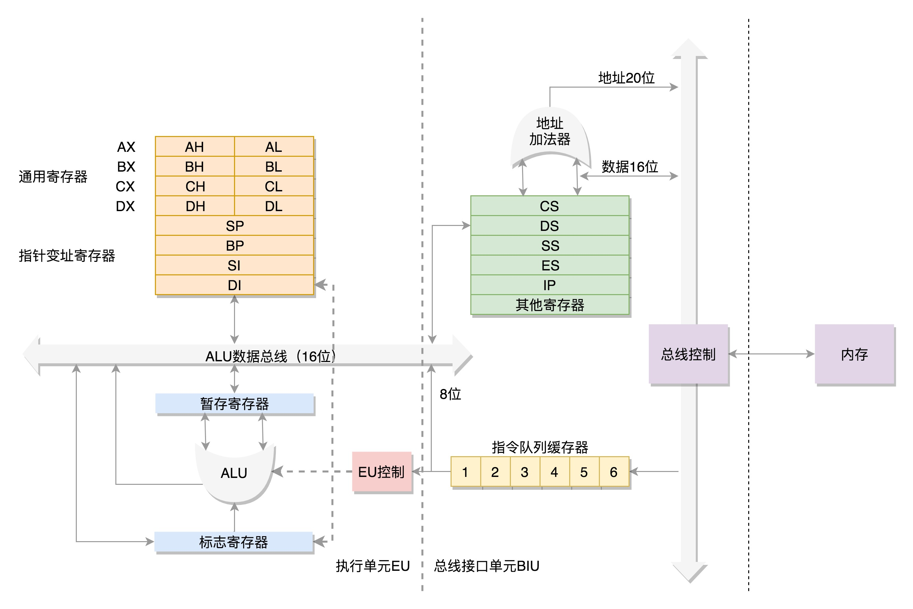
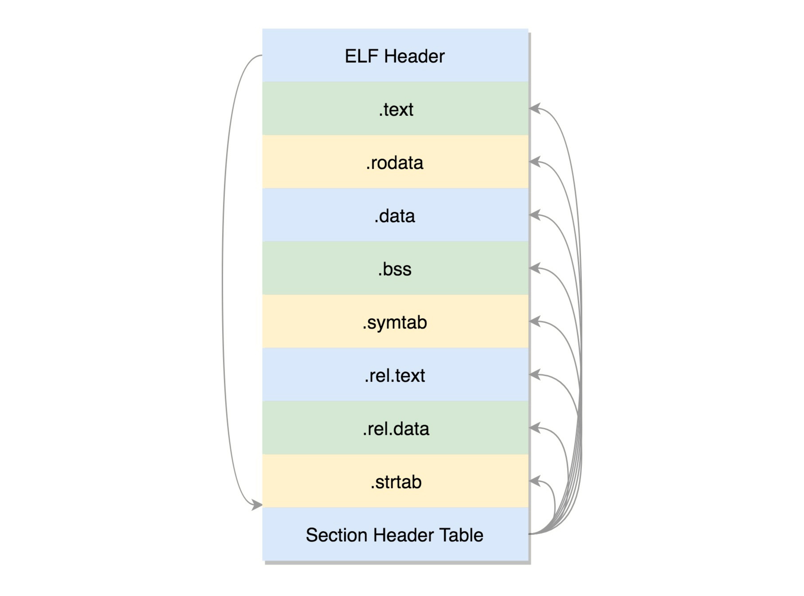
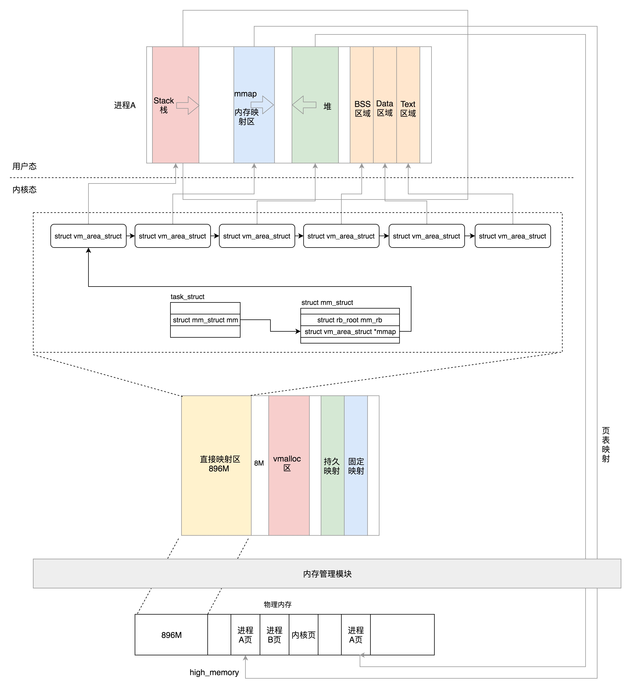
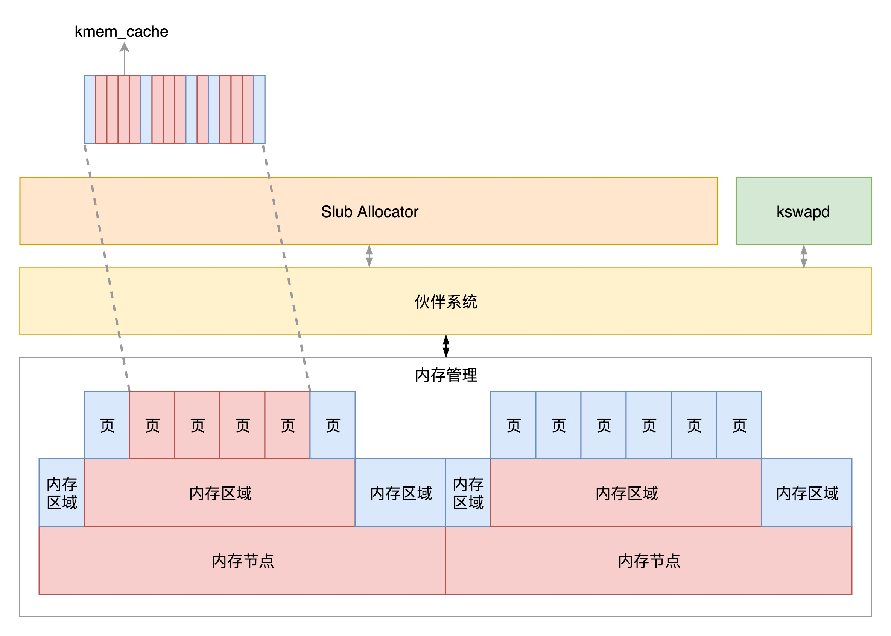
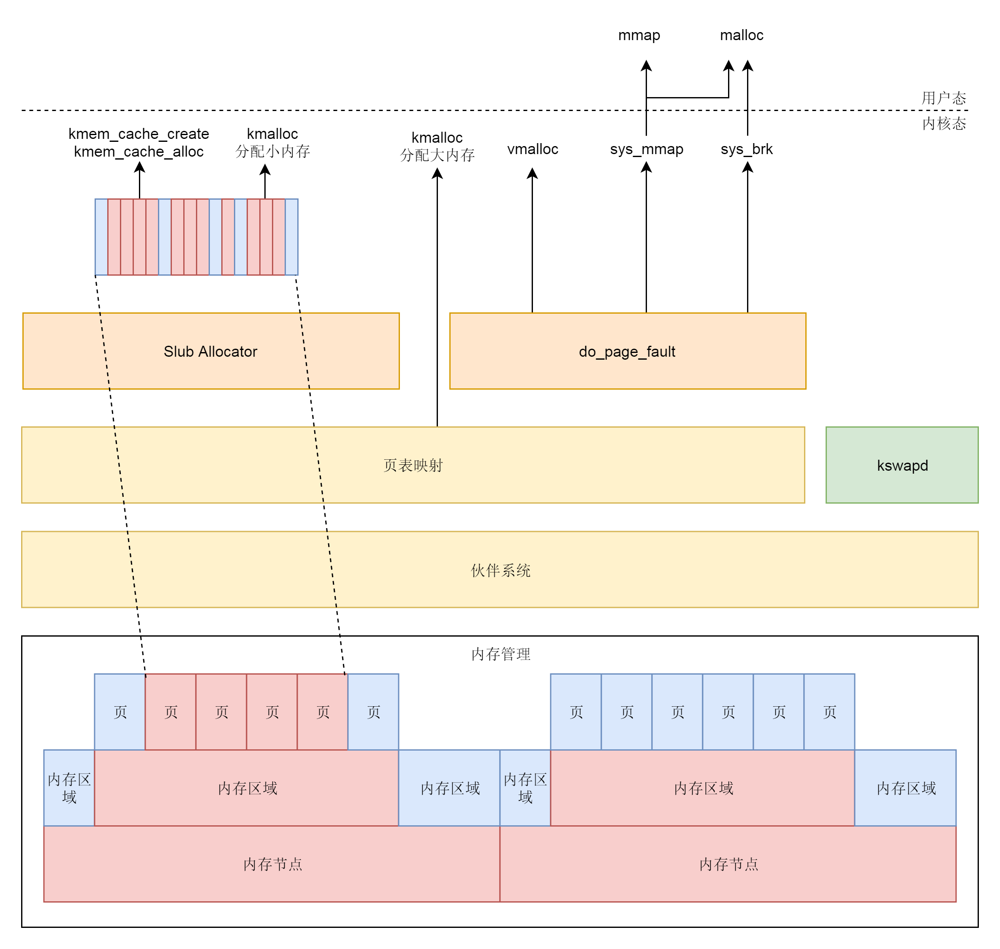

# 综述

- 文档主要是阅读刘超老师《趣谈Linux操作系统》的总结。
- 考虑到大小，进行了文档拆分，本文档内记录初始化、进程管理、内存管理，三部分。
- 第一次梳理中，等待二次整理与三次精炼。


# 系统初始化

> #### **实模式（Real Pattern** ）与 **保护模式**（Protected Pattern）



最初计算机发展的时候，第一个 “标准” 是以8086处理器为基准的。

- 8086 处理器内部有 8 个 16 位的通用寄存器，分别是 AX、BX、CX、DX、SP、BP、SI、DI。 这些寄存器比较灵活，其中 AX、BX、CX、DX 可以分成两个 8 位的寄存器来使用。

- 每个进程都分代码段和数据段，为了指向不同进程的地址空间，有四个 16 位的段寄存器，分别是 CS、DS、SS、ES。

  其中：

  - CS 就是代码段寄存器（Code Segment Register），通过它可以找到代码在内存中的位置；
  - DS 是数据段的寄存器，通过它可以找到数据在内存中的位置。
  - SS 是栈寄存器（Stack Register）。
  - ES（Extra Segment） 段寄存器是一个附加段寄存器。

- IP 寄存器就是指令指针寄存器（Instruction Pointer Register)，指向代码段中**下一条指令**的位置。

- 8086 的地址总线地址是 20 位。在寻址的时候把 CS 和 DS 中的值左移 4 位，变成 20 位的，加上 16 位的偏移量，这样就可以得到最终 20 位的数据地址。由于 总线只有20位，那么他只能够有 $2^{20}=1M$ 个地址。由于偏移量是16位，所以一个段最大的大小是 $2^{16}=64k$。所以对于 8086CPU，最多只能访问 1M 的内存空间，还要分成多个段，每个段最多 64K。（这里要概念清楚，是只能访问 1M的内存空间，意思是有1M个地址，如果按字节编址，那么可以访问的内存大小为1MB）

  

当换成32位处理器的时候，由于地址总线变为了32位，寻址方式肯定不同，为了保持兼容，对**段寄存器**（Segment Register）做了较大的调整。

CS、SS、DS、ES 仍然是 16 位的，但是不再是段的起始地址。段的起始地址放在内存的某个地方。这个地方是一个表格，表格中的一项一项是**段描述符**（Segment Descriptor）。这里面才是真正的段的起始地址。而段寄存器里面保存的是在这个表格中的哪一项，称为**选择子**（Selector）。

这样，将一个从段寄存器直接拿到的段起始地址，就变成了先间接地从段寄存器找到表格中的一项，再从表格中的一项中拿到段起始地址。


因而到了 32 位的系统架构下，我们将前一种模式称为**实模式**（Real Pattern），后一种模式称为**保护模式**（Protected Pattern）。

当系统刚刚启动的时候，CPU 是处于实模式的，只能寻址 1M，每个段最多 64K，这个时候和原来的模式是兼容的。也就是说，哪怕你买了 32 位的 CPU，也支持在原来的模式下运行，只不过快了一点而已。

当需要更多内存的时候，你可以遵循一定的规则，进行一系列的操作，然后切换到保护模式，就能够用到 32 位 CPU 更强大的能力。


## BIOS 时期

按下计算机的启动按钮，主板就加上电了。在主板上，有一个东西叫**ROM**（Read Only Memory，只读存储器）上面早就固化了一些初始化的程序，也就是**BIOS**（Basic Input and Output System，基本输入输出系统）。


在 x86 系统中，将 1M 空间最上面的 0xF0000 到 0xFFFFF 这 64K 映射给 ROM，也就是说，到这部分地址访问的时候，会访问 ROM。

当电脑刚加电的时候，会做一些重置的工作，将 CS 设置为 0xFFFF，将 IP 设置为 0x0000，所以第一条指令就会指向 0xFFFF0，正是在 ROM 的范围内。在这里，有一个 JMP 命令会跳到 ROM 中做初始化工作的代码，于是，BIOS 开始进行初始化的工作。

- 首先，BIOS 要检查一下系统的硬件是不是都好着呢。
- 然后，要建立一个中断向量表和中断服务程序


## bootloader 时期

操作系统一般都会在安装在硬盘上，在 BIOS 的界面上。你会看到一个启动盘的选项。

启动盘一般在第一个扇区，占 512 字节，而且以 0xAA55 结束。这是一个约定，当满足这个条件的时候，就说明这是一个启动盘，在 512 字节以内会启动相关的代码。

在 Linux 里面有一个工具，叫**Grub2**，全称 Grand Unified Bootloader Version 2。使用 `grub2-install /dev/sda`，可以将启动程序安装到相应的位置。

- grub2 第一个要安装的就是 boot.img。它由 boot.S 编译而成，一共 512 字节，正式安装到启动盘的第一个扇区。这个扇区通常称为**MBR**（Master Boot Record，主引导记录 / 扇区）。BIOS 完成任务后，会将 boot.img 从硬盘加载到内存中的 0x7c00 来运行。

- 由于 512 个字节实在有限，boot.img 做不了太多的事情。它能做的最重要的一个事情就是加载 grub2 的另一个镜像 core.img。

- core.img 由 lzma_decompress.img、diskboot.img、kernel.img 和一系列的模块组成，功能比较丰富，能做很多事情。

  - boot.img 先加载的是 core.img 的第一个扇区。如果从硬盘启动的话，这个扇区里面是 diskboot.img，对应的代码是 diskboot.S。
  - boot.img 将控制权交给 diskboot.img 后，diskboot.img 的任务就是将 core.img 的其他部分加载进来，先是解压缩程序 lzma_decompress.img，再往下是 kernel.img，最后是各个模块 module 对应的映像。这里需要注意，它不是 Linux 的内核，而是 grub 的内核。
  - lzma_decompress.img 对应的代码是 startup_raw.S，本来 kernel.img 是压缩过的，现在执行的时候，需要解压缩。

在这之前，我们所有遇到过的程序都非常非常小，完全可以在实模式下运行，但是随着我们加载的东西越来越大，实模式这 1M 的地址空间实在放不下了，所以在真正的解压缩之前，lzma_decompress.img 做了一个重要的决定，就是调用 real_to_prot，切换到保护模式，这样就能在更大的寻址空间里面，加载更多的东西。

- 之后切换模式。

- kernel.img 对应的代码是 startup.S 以及一堆 c 文件，在 startup.S 中会调用 grub_main，这是 grub kernel 的主函数。在这个函数里面，grub_load_config() 开始解析 grub.conf 文件里的配置信息。

  如果是正常启动，grub_main 最后会调用 `grub_command_execute (“normal”, 0, 0)`，最终会调用 grub_normal_execute() 函数。在这个函数里面，grub_show_menu() 会显示出让你选择的那个操作系统的列表。

- 一旦选定了启动某个操作系统，就要开始调用 grub_menu_execute_entry() ，开始解析并执行选择的那一项。例如里面的 linux16 命令，表示装载指定的内核文件，并传递内核启动参数。于是 grub_cmd_linux() 函数会被调用，它会首先读取 Linux 内核镜像头部的一些数据结构，放到内存中的数据结构来，进行检查。如果检查通过，则会**读取整个 Linux 内核镜像到内存**。如果配置文件里面还有 initrd 命令，用于为即将启动的内核传递 init ramdisk 路径。于是 grub_cmd_initrd() 函数会被调用，**将 initramfs 加载到内存中来**。

- 当这些事情做完之后，`grub_command_execute (“boot”, 0, 0) `才开始真正地启动内核。


整体的流程基本上是


> #### **从实模式切换到保护模式**

切换到保护模式要干很多工作，大部分工作都与内存的访问方式有关。

- 第一项是**启用分段**，就是在内存里面建立段描述符表，将寄存器里面的段寄存器变成段选择子，指向某个段描述符，这样就能实现不同进程的切换了。

- 第二项是**启动分页**。能够管理的内存变大了，就需要将内存分成相等大小的块

- 集权与授权，打开 Gate A20，也就是第 21 根地址线的控制线。在实模式 8086 下面，一共就 20 个地址线，可访问 1M 的地址空间。如果超过了这个限度怎么办呢？当然是绕回来了。在保护模式下，第 21 根要起作用了，于是我们就需要打开 Gate A20。

  切换保护模式的函数 DATA32 call real_to_prot 会打开 Gate A20，也就是第 21 根地址线的控制线。


## 内核初始化

内核的启动从入口函数 start_kernel() 开始。在 init/main.c 文件中，start_kernel 相当于内核的 main 函数。打开这个函数，你会发现，里面是各种各样初始化函数 XXXX_init。


最后，start_kernel() 调用的是 rest_init()，用来做其他方面的初始化。


### 进程管理模块

> #### 创建0号、1号进程

在操作系统里面，先要有个创始进程，有一行指令 `set_task_stack_end_magic(&init_task)`。这里面有一个参数 init_task，它的定义是 `struct task_struct init_task = INIT_TASK(init_task)`。它是系统创建的第一个进程，我们称为**0 号进程**。这是唯一一个没有通过 fork 或者 kernel_thread 产生的进程，是进程列表的第一个。

之后，rest_init 用 kernel_thread(kernel_init, NULL, CLONE_FS) 创建第二个进程，这个是**1 号进程**。1 号进程对于操作系统来讲，有“划时代”的意义。因为它将运行一个用户进程，随着进程的变多，最终形成一棵进程树。

当有多个线程之后，需要做好线程的权限控制。 x86 提供了分层的权限机制，把区域分成了四个 Ring，越往里权限越高，越往外权限越低。


操作系统很好地利用了这个机制，将能够访问关键资源的代码放在 Ring0，我们称为**内核态**（Kernel Mode）；将普通的程序代码放在 Ring3，我们称为**用户态**（User Mode）。

系统此时处于保护模式，保护模式除了可访问空间大一些，还有另一个重要功能，就是“保护”，也就是说，当处于用户态的代码想要执行更高权限的指令，这种行为是被禁止的。


> #### 从用户态到内核态

当一个用户态的程序运行到一半，要访问一个核心资源，例如访问网卡发一个网络包，就需要暂停当前的运行，调用系统调用，接下来就轮到内核中的代码运行了。首先，内核将从系统调用传过来的包，在网卡上排队，轮到的时候就发送。发送完了，系统调用就结束了，返回用户态，让暂停运行的程序接着运行。

这个暂停其实就是把程序运行到一半的情况保存下来。例如，我们知道，内存是用来保存程序运行时候的中间结果的，现在要暂时停下来，这些中间结果不能丢，因为再次运行的时候，还要基于这些中间结果接着来。另外就是，当前运行到代码的哪一行了，当前的栈在哪里，这些都是在寄存器里面的。

所以，暂停的那一刻，要把当时 CPU 的寄存器的值全部暂存到一个地方，这个地方可以放在进程管理系统很容易获取的地方。当系统调用完毕，返回的时候，再从这个地方将寄存器的值恢复回去，就能接着运行了。

这个过程就是这样的：**用户态 - 系统调用 - 保存寄存器 - 内核态执行系统调用 - 恢复寄存器 - 返回用户态，然后接着运行。**


> #### 从内核态到用户态

当前执行 kernel_thread 这个函数创建1号进程的时候，我们还在内核态，现在我们就来跨越这道屏障，到用户态去运行一个程序。这该怎么办呢？很少听说“先内核态再用户态”的。

kernel_thread 的参数是一个函数 kernel_init，也就是这个进程会运行这个函数。

- 在 kernel_init 里面，会调用 kernel_init_freeable()。之后，代码会运行 run_init_process 函数，底层最终调用的是 do_execve。

- execve 是一个系统调用，它的作用是运行一个执行文件。加一个 do_ 的往往是内核系统调用的实现。

  - 它会尝试运行 ramdisk 的“/init”，或者普通文件系统上的“/sbin/init” “/etc/init” “/bin/init” “/bin/sh”。

  - 不同版本的 Linux 会选择不同的文件启动，但是只要有一个起来了就可以

    

利用执行 init 文件的机会，从内核态回到用户态。

- 从系统调用的过程可以得到启发，“用户态 - 系统调用 - 保存寄存器 - 内核态执行系统调用 - 恢复寄存器 - 返回用户态”，然后接着运行。而咱们刚才运行 init，是调用 do_execve，正是上面的过程的后半部分，从内核态执行系统调用开始。
- do_execve->do_execveat_common->exec_binprm->search_binary_handler，在 search_binary_handler 方法中会调用 load_binary 加载二进制的文件。
- 也就是说，要运行一个程序，需要加载这个二进制文件，这就是我们常说的**项目执行计划书**。它是有一定格式的。Linux 下一个常用的格式是**ELF**
- 最后调用 start_thread。
  - 手动补上了原来系统调用里，保存寄存器的一个步骤。
  - 最后的 force_iret 方法是用于从系统调用中返回。这个时候会恢复寄存器。从哪里恢复呢？按说是从进入系统调用的时候，保存的寄存器里面拿出。好在上面的函数补上了寄存器。CS 和指令指针寄存器 IP 恢复了，指向用户态下一个要执行的语句。DS 和函数栈指针 SP 也被恢复了，指向用户态函数栈的栈顶。所以，下一条指令，就从用户态开始运行了。


> #### ramdisk 的作用

- 一开始到用户态的是 ramdisk 的 init，后来会启动真正根文件系统上的 init，成为所有用户态进程的祖先。

- 此时回到用户态是没有文件系统的。

  因为 init 程序是在文件系统上的，文件系统一定是在一个存储设备上的，例如硬盘。Linux 访问存储设备，要有驱动才能访问。如果存储系统数目很有限，那驱动可以直接放到内核里面，反正前面我们加载过内核到内存里了，现在可以直接对存储系统进行访问。但是存储系统越来越多了，如果所有市面上的存储系统的驱动都默认放进内核，内核就太大了。只好先弄一个基于内存的文件系统。内存访问是不需要驱动的，这个就是 ramdisk。这个时候，ramdisk 是根文件系统。

- 然后开始运行 ramdisk 上的 /init。等它运行完了就已经在用户态了。/init 这个程序会先根据存储系统的类型加载驱动，有了驱动就可以设置真正的根文件系统了。有了真正的根文件系统，ramdisk 上的 /init 会启动文件系统上的 init。


> #### **创建 2 号进程**

内核态的根进程。`kernel_thread(kthreadd, NULL, CLONE_FS | CLONE_FILES) `又一次使用 kernel_thread 函数创建进程。


###  系统调用模块

Linux 提供了 glibc 这个中介，glibc 对系统调用进行了封装，它更熟悉系统调用的细节，并且可以封装成更加友好的接口。

在 glibc 的源代码中，有个文件 syscalls.list，里面列着所有 glibc 的函数对应的系统调用。另外，glibc 还有一个脚本 make-syscall.sh，可以根据配置文件，对于每一个封装好的系统调用，生成一个文件。这个文件里面定义了一些宏，例如 #define SYSCALL_NAME open。

glibc 还有一个文件 syscall-template.S，使用上面这个宏，定义了这个系统调用的调用方式。里面对于任何一个系统调用，会调用 **`DO_CALL`**。这也是一个宏，这个宏 32 位和 64 位的定义是不一样的。


> #### 32 位系统调用过程


```c
#define DO_CALL(syscall_name, args)                           \
    PUSHARGS_##args                               \
    DOARGS_##args                                 \
    movl $SYS_ify (syscall_name), %eax;                          \
    ENTER_KERNEL                                  \
    POPARGS_##args
```

这里，我们将请求参数放在寄存器里面，根据系统调用的名称，得到系统调用号，放在寄存器 eax 里面，然后执行 ENTER_KERNEL。


这里面的 ENTER_KERNEL 是

```
# define ENTER_KERNEL int $0x80
```

int 就是 interrupt，也就是“中断”的意思。int $0x80 就是触发一个软中断，通过它就可以陷入（trap）内核。

在内核启动的时候，还记得有一个 trap_init()，其中有这样的代码：

```c
set_system_intr_gate(IA32_SYSCALL_VECTOR, entry_INT80_32);
```

这是一个软中断的陷入门。当接收到一个系统调用的时候，entry_INT80_32 就被调用了。

```
ENTRY(entry_INT80_32)
        ASM_CLAC
        pushl   %eax                    /* pt_regs->orig_ax */
        SAVE_ALL pt_regs_ax=$-ENOSYS    /* save rest */
        movl    %esp, %eax
        call    do_syscall_32_irqs_on
.Lsyscall_32_done:
......
.Lirq_return:
	INTERRUPT_RETURN
```

通过 push 和 SAVE_ALL 将当前用户态的寄存器，保存在 pt_regs 结构里面。

进入内核之前，保存所有的寄存器，然后调用 do_syscall_32_irqs_on。在do_syscall_32_irqs_on中，将系统调用号从 eax 里面取出来，然后根据系统调用号，在系统调用表中找到相应的函数进行调用，并将寄存器中保存的参数取出来，作为函数参数。根据宏定义，`#define ia32_sys_call_table sys_call_table`，系统调用就是放在这个表里面。

当系统调用结束之后，在 entry_INT80_32 之后，紧接着调用的是 INTERRUPT_RETURN，我们能够找到它的定义，也就是 iret。

```c
#define INTERRUPT_RETURN     
```

iret 指令将原来用户态保存的现场恢复回来，包含代码段、指令指针寄存器等。这时候用户态进程恢复执行。


> #### 64 位系统调用过程


```c
#define DO_CALL(syscall_name, args)					      \
  lea SYS_ify (syscall_name), %rax;					      \
  syscall
```

和之前一样，还是将系统调用名称转换为系统调用号，放到寄存器 rax。这里是真正进行调用，不是用中断了，而是改用 syscall 指令了。并且，传递参数的寄存器也变了。

syscall 指令还使用了一种特殊的寄存器，叫**特殊模块寄存器**（Model Specific Registers，简称 MSR）。这种寄存器是 CPU 为了完成某些特殊控制功能为目的的寄存器，其中就有系统调用。

在系统初始化的时候，trap_init 除了初始化上面的中断模式，这里面还会调用 `cpu_init->syscall_init`。这里面有这样的代码：

```c
wrmsrl(MSR_LSTAR, (unsigned long)entry_SYSCALL_64);
```

rdmsr 和 wrmsr 是用来读写特殊模块寄存器的。MSR_LSTAR 就是这样一个特殊的寄存器，当 syscall 指令调用的时候，会从这个寄存器里面拿出函数地址来调用，也就是调用 entry_SYSCALL_64。

在 arch/x86/entry/entry_64.S 中定义了 entry_SYSCALL_64。这里先保存了很多寄存器到 pt_regs 结构里面，例如用户态的代码段、数据段、保存参数的寄存器，然后调用 entry_SYSCALL64_slow_pat->do_syscall_64。

在 do_syscall_64 里面，从 rax 里面拿出系统调用号，然后根据系统调用号，在系统调用表 sys_call_table 中找到相应的函数进行调用，并将寄存器中保存的参数取出来，作为函数参数。

所以，无论是 32 位，还是 64 位，都会到系统调用表 sys_call_table 这里来。

64 位的系统调用返回的时候，执行的是 USERGS_SYSRET64。这里，返回用户态的指令变成了 sysretq。


> #### 系统调用表

系统调用表 sys_call_table 是怎么形成的？

- 32 位的系统调用表定义在面 arch/x86/entry/syscalls/syscall_32.tbl 文件里。

- 64 位的系统调用定义在另一个文件 arch/x86/entry/syscalls/syscall_64.tbl 里。

- 系统调用在内核中的实现函数要有一个声明。声明往往在 include/linux/syscalls.h 文件中。

- 真正的实现这个系统调用，一般在一个.c 文件里面，例如 sys_open 的实现在 fs/open.c 里面。

  

声明和实现都好了。接下来，在编译的过程中，需要根据 syscall_32.tbl 和 syscall_64.tbl 生成自己的 unistd_32.h 和 unistd_64.h。生成方式在 arch/x86/entry/syscalls/Makefile 中。

这里面会使用两个脚本，其中第一个脚本 arch/x86/entry/syscalls/syscallhdr.sh，会在文件中生成 #define __NR_open；第二个脚本 arch/x86/entry/syscalls/syscalltbl.sh，会在文件中生成 __SYSCALL(__NR_open, sys_open)。这样，unistd_32.h 和 unistd_64.h 是对应的系统调用号和系统调用实现函数之间的对应关系。

在文件 arch/x86/entry/syscall_32.c，定义了这样一个表，里面 include 了这个头文件，从而所有的 sys_ 系统调用都在这个表里面了。

同理，在文件 arch/x86/entry/syscall_64.c，定义了这样一个表，里面 include 了这个头文件，这样所有的 sys_ 系统调用就都在这个表里面了。


# 进程管理

创建进程与创建线程具体实现流程在用户态与内核态的对比图：


## 进程创建

进程创建 — 进程从代码到二进制到运行时的过程。

首先通过图右边的文件编译过程，生成 so 文件和可执行文件，放在硬盘上。下图左边的用户态的进程 A 执行 fork，创建进程 B，在进程 B 的处理逻辑中，执行 exec 系列系统调用。这个系统调用会通过 load_elf_binary 方法，将刚才生成的可执行文件，加载到进程 B 的内存中执行。


普通的进程可以使用 fork 系统调用进行调用。

```c
#include <stdio.h>
#include <stdlib.h>
#include <sys/types.h>
#include <unistd.h>
 
 
extern int create_process (char* program, char** arg_list);
 
 
int create_process (char* program, char** arg_list)
{
    pid_t child_pid;
    child_pid = fork ();
    if (child_pid != 0)
        return child_pid;
    else {
        execvp (program, arg_list);
        abort ();
    }
```

调用方法

```c
#include <stdio.h>
#include <stdlib.h>
#include <sys/types.h>
#include <unistd.h>
 
extern int create_process (char* program, char** arg_list);
 
int main ()
{
    char* arg_list[] = {
        "ls",
        "-l",
        "/etc/yum.repos.d/",
        NULL
    };
    create_process ("ls", arg_list);
    return 0;
}
```

文件写好之后，首先需要编译。


> #### 进行编译：程序的二进制格式

在 Linux 下面，二进制的程序有严格的格式，这个格式我们称为**ELF**（Executeable and Linkable Format，可执行与可链接格式）。这个格式可以根据编译的结果不同，分为不同的格式。


在编译的时候，先做预处理工作，例如将头文件嵌入到正文中，将定义的宏展开，然后就是真正的编译过程，最终编译成为.o 文件，这就是 ELF 的第一种类型，**可重定位文件**（Relocatable File）。

这个文件的格式是这样的：



ELF 文件的头是用于描述整个文件的。这个文件格式在内核中有定义，分别为 struct elf32_hdr 和 struct elf64_hdr。接下来我们来看一个一个的 section，我们也叫**节**。

- .text：放编译好的二进制可执行代码
- .data：已经初始化好的全局变量
- .rodata：只读数据，例如字符串常量、const 的变量
- .bss：未初始化全局变量，运行时会置 0
- .symtab：符号表，记录的则是函数和变量
- .strtab：字符串表、字符串常量和变量名
- .rel.text：函数重定向
- .rel.data：数据重定向

这里只有全局变量，局部变量是放在栈里面的，是程序运行过程中随时分配空间，随时释放的，现在我们讨论的是二进制文件，还没启动，所以只需要讨论在哪里保存全局变量。

这些节的元数据信息也需要有一个地方保存，就是最后的节头部表（Section Header Table）。在这个表里面，每一个 section 都有一项，在代码里面也有定义 struct elf32_shdr 和 struct elf64_shdr。在 ELF 的头里面，有描述这个文件的节头部表的位置，有多少个表项等等信息。


可重定位文件的**可重定位**这样理解：这个编译好的代码和变量，将来加载到内存里面的时候，都是要加载到一定位置的。比如说，调用一个函数，其实就是跳到这个函数所在的代码位置执行；再比如修改一个全局变量，也是要到变量的位置那里去修改。但是现在这个时候，还是.o 文件，不是一个可以直接运行的程序，这里面只是部分代码片段。例如这里的 create_process 函数，将来被谁调用，在哪里调用都不清楚，就更别提确定位置了。所以，.o 里面的位置是不确定的，但是必须是可重新定位的，因为它将来是要做函数库的，在哪里被调用了就重新定位这些代码、变量的位置。

有的 section，例如.rel.text, .rel.data 就与重定位有关。例如这里的 createprocess.o，里面调用了 create_process 函数，但是这个函数在另外一个.o 里面，因而 createprocess.o 里面根本不可能知道被调用函数的位置，所以只好在 rel.text 里面标注，这个函数是需要重定位的。

函数作为库文件被重用，不能以.o 的形式存在，而是要形成库文件，库文件又分为静态链接库与动态链接库。


**静态链接库**

在编译的时候，会去指定目录下找到目标文件，将.o 文件提取出来，链接到程序中，形成二进制执行文件。形成的二进制文件叫**可执行文件**，是 ELF 的第二种格式，格式如下：


这个格式和.o 文件大致相似，还是分成一个个的 section，并且被节头表描述。只不过这些 section 是多个.o 文件合并过的。但是这个时候，这个文件已经是马上就可以加载到内存里面执行的文件了，因而这些 section 被分成了需要加载到内存里面的代码段、数据段和不需要加载到内存里面的部分，将小的 section 合成了大的段 segment，并且在最前面加一个段头表（Segment Header Table）。在代码里面的定义为 struct elf32_phdr 和 struct elf64_phdr，这里面除了有对于段的描述之外，最重要的是 p_vaddr，这个是这个段加载到内存的虚拟地址。在 ELF 头里面，有一项 e_entry，也是个虚拟地址，是这个程序运行的入口。

静态链接库一旦链接进去，代码和变量的 section 都合并了，因而程序运行的时候，就不依赖于这个库是否存在。但是这样有一个缺点，就是相同的代码段，如果被多个程序使用的话，在内存里面就有多份，而且一旦静态链接库更新了，如果二进制执行文件不重新编译，也不随着更新。


**动态链接库**

当一个动态链接库被链接到一个程序文件中的时候，最后的程序文件并不包括动态链接库中的代码，而仅仅包括对动态链接库的引用，并且不保存动态链接库的全路径，仅仅保存动态链接库的名称。

当运行这个程序的时候，首先寻找动态链接库，然后加载它。默认情况下，系统在 /lib 和 /usr/lib 文件夹下寻找动态链接库。如果找不到就会报错，我们可以设定 LD_LIBRARY_PATH 环境变量，程序运行时会在此环境变量指定的文件夹下寻找动态链接库。

动态链接库，就是 ELF 的第三种类型，**共享对象文件**（Shared Object）。基于动态连接库创建出来的二进制文件格式还是 ELF，但是稍有不同。

- 首先，多了一个.interp 的 Segment，这里面是 ld-linux.so，这是动态链接器，也就是说，运行时的链接动作都是它做的。
- 另外，ELF 文件中还多了两个 section，一个是.plt，**过程链接表（Procedure Linkage Table，PLT）**，一个是.got.plt，**全局偏移量表（Global Offset Table，GOT）**。

它们是怎么工作的，使得程序运行的时候，可以将 so 文件动态链接到进程空间的呢？


**动态链接的原理（过程）**

dynamiccreateprocess 这个程序要调用 libdynamicprocess.so 里的 create_process 函数。

1. 由于是运行时才去找，编译的时候，压根不知道这个函数在哪里，所以就在 PLT 里面建立一项 PLT[x]。这一项也是一些代码，有点像一个本地的代理，在二进制程序里面，不直接调用 create_process 函数，而是调用 PLT[x] 里面的代理代码，这个代理代码会在运行的时候找真正的 create_process 函数。

2. 去哪里找代理代码呢？这就用到了 GOT，这里面也会为 create_process 函数创建一项 GOT[y]。这一项是运行时 create_process 函数在内存中真正的地址。如果这个地址在，dynamiccreateprocess 调用 PLT[x] 里面的代理代码，代理代码调用 GOT 表中对应项 GOT[y]，调用的就是加载到内存中的 libdynamicprocess.so 里面的 create_process 函数了。

3. 但是 GOT 怎么知道的呢？对于 create_process 函数，GOT 一开始就会创建一项 GOT[y]，但是这里面没有真正的地址，因为它也不知道，但是它有办法，它又回调 PLT，告诉它，你里面的代理代码来找我要 create_process 函数的真实地址，我不知道，你想想办法吧。
4. PLT 这个时候会转而调用 PLT[0]，也即第一项，PLT[0] 转而调用 GOT[2]，这里面是 ld-linux.so 的入口函数，这个函数会找到加载到内存中的 libdynamicprocess.so 里面的 create_process 函数的地址，然后把这个地址放在 GOT[y] 里面。下次，PLT[x] 的代理函数就能够直接调用了。


> #### 运行程序为进程

知道了 ELF 这个格式，这个时候它还是个程序，那怎么把这个文件加载到内存里面呢？

在内核中，有 linux_binfmt 这样一个数据结构，用来定义加载二进制文件的方法。对于 ELF 文件格式，有对应的实现 `struct linux_binfmt elf_format` 。其中通过 load_elf_binary 函数来加载 elf 文件。

在系统启动的章节中，有一节从内核态到用户态中有一段方法的调用过程，具体是这样的：

`do_execve->do_execveat_common->exec_binprm->search_binary_handler`

他最终调用了 load_elf_binary 函数。do_execve 又是被 exec 这个系统调用调用的。所以原理是 exec 这个系统调用最终调用的 load_elf_binary


> #### 进程树

既然所有的进程都是从父进程 fork 过来的，那总归有一个祖宗进程，这就是咱们系统启动的 init 进程。在解析 Linux 的启动过程的时候，1 号进程是 /sbin/init。如果在 centOS 7 里面，我们 ls 一下，可以看到，这个进程是被软链接到 systemd 的。

系统启动之后，init 进程会启动很多的 daemon 进程，为系统运行提供服务，然后就是启动 getty，让用户登录，登录后运行 shell，用户启动的进程都是通过 shell 运行的，从而形成了一棵进程树。

我们可以通过 ps -ef 命令查看当前系统启动的进程，我们会发现有三类进程。

```shell
[root@deployer ~]# ps -ef
UID        PID  PPID  C STIME TTY          TIME CMD
root         1     0  0  2018 ?        00:00:29 /usr/lib/systemd/systemd --system --deserialize 21
root         2     0  0  2018 ?        00:00:00 [kthreadd]
root         3     2  0  2018 ?        00:00:00 [ksoftirqd/0]
root         5     2  0  2018 ?        00:00:00 [kworker/0:0H]
root         9     2  0  2018 ?        00:00:40 [rcu_sched]
......
root       337     2  0  2018 ?        00:00:01 [kworker/3:1H]
root       380     1  0  2018 ?        00:00:00 /usr/lib/systemd/systemd-udevd
root       415     1  0  2018 ?        00:00:01 /sbin/auditd
root       498     1  0  2018 ?        00:00:03 /usr/lib/systemd/systemd-logind
......
root       852     1  0  2018 ?        00:06:25 /usr/sbin/rsyslogd -n
root      2580     1  0  2018 ?        00:00:00 /usr/sbin/sshd -D
root     29058     2  0 Jan03 ?        00:00:01 [kworker/1:2]
root     29672     2  0 Jan04 ?        00:00:09 [kworker/2:1]
root     30467     1  0 Jan06 ?        00:00:00 /usr/sbin/crond -n
root     31574     2  0 Jan08 ?        00:00:01 [kworker/u128:2]
......
root     32792  2580  0 Jan10 ?        00:00:00 sshd: root@pts/0
root     32794 32792  0 Jan10 pts/0    00:00:00 -bash
root     32901 32794  0 00:01 pts/0    00:00:00 ps -ef
```

你会发现，PID 1 的进程就是我们的 init 进程 systemd，PID 2 的进程是内核线程 kthreadd，这两个我们在内核启动的时候都见过。其中用户态的不带中括号，内核态的带中括号。

接下来进程号依次增大，但是你会看所有带中括号的内核态的进程，祖先都是 2 号进程。而用户态的进程，祖先都是 1 号进程。tty 那一列，是问号的，说明不是前台启动的，一般都是后台的服务。

pts 的父进程是 sshd，bash 的父进程是 pts，ps -ef 这个命令的父进程是 bash。这样整个链条都比较清晰了。


## 线程创建


> #### 线程的数据

我们把线程访问的数据细分成三类。

第一类是**线程栈上的本地数据**。

比如函数执行过程中的局部变量。函数的调用会使用栈的模型，这在线程里面是一样的。只不过每个线程都有自己的栈空间。主线程在内存中有一个栈空间，其他线程栈也拥有独立的栈空间。为了避免线程之间的栈空间踩踏，线程栈之间还会有小块区域，用来隔离保护各自的栈空间。一旦另一个线程踏入到这个隔离区，就会引发段错误。


第二类数据就是**在整个进程里共享的全局数据**。

例如全局变量，虽然在不同进程中是隔离的，但是在一个进程中是共享的。如果同一个全局变量，两个线程一起修改，那肯定会有问题，有可能把数据改的面目全非。这就需要有一种机制来保护他们，比如你先用我再用。


第三类数据**线程私有数据**（Thread Specific Data）

可以通过以下函数创建：

```c
int pthread_key_create(pthread_key_t *key, void (*destructor)(void*))
```

可以看到，创建一个 key，伴随着一个析构函数。key 一旦被创建，所有线程都可以访问它，但各线程可根据自己的需要往 key 中填入不同的值，这就相当于提供了一个同名而不同值的全局变量。


> #### 数据的保护

第一种方式，**Mutex**，全称 Mutual Exclusion，中文叫**互斥**，它的模式就是在共享数据访问的时候，去申请加把锁，谁先拿到锁，谁就拿到了访问权限。

使用流程


- 使用 Mutex，首先要使用 pthread_mutex_init 函数初始化这个 mutex，初始化后，就可以用它来保护共享变量了。
- pthread_mutex_lock() 就是去抢那把锁的函数，如果抢到了，就可以执行下一行程序，对共享变量进行访；如果没抢到，就被阻塞在那里等待。
- 如果不想被阻塞，可以使用 pthread_mutex_trylock 去抢那把锁，如果抢到了，就可以执行下一行程序，对共享变量进行访问；如果没抢到，不会被阻塞，而是返回一个错误码。
- 当共享数据访问结束了，别忘了使用 pthread_mutex_unlock 释放锁，让给其他人使用，最终调用 pthread_mutex_destroy 销毁掉这把锁。

在使用 Mutex 的时候，有个问题是如果使用 pthread_mutex_lock()，那就需要一直在那里等着。如果是 pthread_mutex_trylock()，就可以不用等着，去干点儿别的，但是我怎么知道什么时候回来再试一下，是不是轮到我了呢？能不能在轮到我的时候，通知我一下呢？

这其实就是条件变量，也就是说如果没事儿，就让大家歇着，有事儿了就去通知，别让人家没事儿就来问问，浪费大家的时间。

但是当它接到了通知，来操作共享资源的时候，还是需要抢互斥锁，因为可能很多人都受到了通知，都来访问了，所以**条件变量和互斥锁是配合使用的**。


条件变量和互斥锁使用流程


## 进程数据结构

在 Linux 里面，无论是进程，还是线程，到了内核里面，我们统一都叫任务（Task），由一个统一的结构**task_struct**进行管理。 Linux 内核有一个**链表**，将所有的 task_struct 串起来。接下来，我们来看每一个任务都应该包含哪些字段。


> #### 任务 ID

每一个任务都应该有一个 ID，作为这个任务的唯一标识。task_struct 里面涉及任务 ID 的，有下面几个：

```c
pid_t pid;
pid_t tgid;
struct task_struct *group_leader; 
```

进程和线程到了内核这里，统一变成了任务，这就带来两个问题。

第一个问题是，**任务展示**。

ps 命令可以展示出所有的进程。但是如果你是这个命令的实现者，到了内核，按照上面的任务列表把这些命令都显示出来，把所有的线程全都平摊开来显示给用户。用户肯定觉得既复杂又困惑。复杂在于，列表这么长；困惑在于，里面出现了很多并不是自己创建的线程。

第二个问题是，**给任务下发指令**。

前面我们学习命令行的时候，知道可以通过 kill 来给进程发信号，通知进程退出。如果发给了其中一个线程，我们就不能只退出这个线程，而是应该退出整个进程。当然，有时候，我们希望只给某个线程发信号。


所以在内核中，它们虽然都是任务，但是应该加以区分。其中，pid 是 process id，tgid 是 thread group ID。

任何一个进程，如果只有主线程，那 pid 是自己，tgid 是自己，group_leader 指向的还是自己。

[^问题1]: 进程与他的主线程是共用一个task_struct，还是有2个task。还是说进程就等于主线程，连pid都是一样的？

但是，如果一个进程创建了其他线程，那就会有所变化了。线程有自己的 pid，tgid 就是进程的主线程的 pid，group_leader 指向的就是进程的主线程。

> **主线程**
>
> 当一个程序启动时，就有一个进程被操作系统（OS）创建，与此同时一个线程也立刻运行，该线程通常叫做程序的**主线程**（Main Thread），因为它是程序开始时就执行的，如果你需要再创建线程，那么创建的线程就是这个主线程的子线程。每个进程至少都有一个主线程，在Winform中，应该就是创建GUI的线程。

好了，有了 tgid，我们就知道 tast_struct 代表的是一个进程还是代表一个线程了。

[^问题2]: 这里是不是意味着，主线程就是这个进程本身，tgid指向自己的那个tast_struct？


> #### 信号处理

 task_struct 里面关于信号处理的字段如下

```c
/* Signal handlers: */
struct signal_struct		*signal;
struct sighand_struct		*sighand;
sigset_t			blocked;
sigset_t			real_blocked;
sigset_t			saved_sigmask;
struct sigpending		pending;
unsigned long			sas_ss_sp;
size_t				sas_ss_size;
unsigned int			sas_ss_flags;
```

这里定义了哪些信号被阻塞暂不处理（blocked），哪些信号尚等待处理（pending），哪些信号正在通过信号处理函数进行处理（sighand）。处理的结果可以是忽略，可以是结束进程等等。

信号处理函数默认使用**用户态的函数栈**，当然也可以开辟新的栈专门用于信号处理，这就是 sas_ss_xxx 这三个变量的作用。


> #### 任务状态

在 task_struct 里面，涉及任务状态的是下面这几个变量：

```c
 volatile long state;    /* -1 unrunnable, 0 runnable, >0 stopped */
 int exit_state;
 unsigned int flags;
```

**state（状态）**

state（状态）可以取的值定义在 include/linux/sched.h 头文件中。

```c
/* Used in tsk->state: */
#define TASK_RUNNING                    0
#define TASK_INTERRUPTIBLE              1
#define TASK_UNINTERRUPTIBLE            2
#define __TASK_STOPPED                  4
#define __TASK_TRACED                   8
/* Used in tsk->exit_state: */
#define EXIT_DEAD                       16
#define EXIT_ZOMBIE                     32
#define EXIT_TRACE                      (EXIT_ZOMBIE | EXIT_DEAD)
/* Used in tsk->state again: */
#define TASK_DEAD                       64
#define TASK_WAKEKILL                   128
#define TASK_WAKING                     256
#define TASK_PARKED                     512
#define TASK_NOLOAD                     1024
#define TASK_NEW                        2048
#define TASK_STATE_MAX                  4096
```

从定义的数值很容易看出来，flags 是通过 bitset 的方式设置的也就是说，当前是什么状态，哪一位就置一。


- TASK_RUNNING 并不是说进程正在运行，而是表示进程在时刻准备运行的状态。当处于这个状态的进程获得时间片的时候，就是在运行中；如果没有获得时间片，就说明它被其他进程抢占了，在等待再次分配时间片。
- 在运行中的进程，一旦要进行一些 I/O 操作，需要等待 I/O 完毕，这个时候会释放 CPU，进入睡眠状态。在 Linux 中，有两种睡眠状态。
  - 一种是**TASK_INTERRUPTIBLE**，**可中断的睡眠状态**。这是一种浅睡眠的状态，也就是说，虽然在睡眠，等待 I/O 完成，但是这个时候一个信号来的时候，进程还是要被唤醒。只不过唤醒后，不是继续刚才的操作，而是进行信号处理。当然程序员可以根据自己的意愿，来写信号处理函数，例如收到某些信号，就放弃等待这个 I/O 操作完成，直接退出，也可也收到某些信息，继续等待。
  - 另一种睡眠是**TASK_UNINTERRUPTIBLE**，**不可中断的睡眠状态**。这是一种深度睡眠状态，不可被信号唤醒，只能死等 I/O 操作完成。一旦 I/O 操作因为特殊原因不能完成，这个时候，谁也叫不醒这个进程了。你可能会说，我 kill 它呢？别忘了，kill 本身也是一个信号，既然这个状态不可被信号唤醒，kill 信号也被忽略了。除非重启电脑，没有其他办法。因此，这其实是一个比较危险的事情，除非程序员极其有把握，不然还是不要设置成 TASK_UNINTERRUPTIBLE。
  - 于是，我们就有了一种新的进程睡眠状态，**TASK_KILLABLE，可以终止的新睡眠状态**。进程处于这种状态中，它的运行原理类似 TASK_UNINTERRUPTIBLE，只不过可以响应致命信号。
    - `#define TASK_KILLABLE           (TASK_WAKEKILL | TASK_UNINTERRUPTIBLE)`
    - 从定义可以看出，TASK_WAKEKILL 用于在接收到致命信号时唤醒进程，而 TASK_KILLABLE 相当于这两位都设置了。

- TASK_STOPPED 是在进程接收到 SIGSTOP、SIGTTIN、SIGTSTP 或者 SIGTTOU 信号之后进入该状态。

- TASK_TRACED 表示进程被 debugger 等进程监视，进程执行被调试程序所停止。当一个进程被另外的进程所监视，每一个信号都会让进程进入该状态。

- 一旦一个进程要结束，先进入的是 EXIT_ZOMBIE 状态，但是这个时候它的父进程还没有使用 wait() 等系统调用来获知它的终止信息，此时进程就成了僵尸进程。

- EXIT_DEAD 是进程的最终状态。EXIT_ZOMBIE 和 EXIT_DEAD 也可以用于 exit_state。


**标志（flags）**

上面的进程状态和进程的运行、调度有关系，还有其他的一些状态，我们称为**标志**。放在 flags 字段中，这些字段都被定义称为**宏**，以 PF 开头。这里有几个例子。

```c
#define PF_EXITING		0x00000004
#define PF_VCPU			0x00000010
#define PF_FORKNOEXEC		0x00000040
```

- **PF_EXITING**表示正在退出。当有这个 flag 的时候，在函数 find_alive_thread 中，找活着的线程，遇到有这个 flag 的，就直接跳过。
- **PF_VCPU**表示进程运行在虚拟 CPU 上。在函数 account_system_time 中，统计进程的系统运行时间，如果有这个 flag，就调用 account_guest_time，按照客户机的时间进行统计。
- **PF_FORKNOEXEC**表示 fork 完了，还没有 exec。在 _do_fork 函数里面调用 copy_process，这个时候把 flag 设置为 PF_FORKNOEXEC。当 exec 中调用了 load_elf_binary 的时候，又把这个 flag 去掉。


> #### 进程调度

大概涉及以下字段。

```c
// 是否在运行队列上
int				on_rq;
// 优先级
int				prio;
int				static_prio;
int				normal_prio;
unsigned int			rt_priority;
// 调度器类
const struct sched_class	*sched_class;
// 调度实体
struct sched_entity		se;
struct sched_rt_entity		rt;
struct sched_dl_entity		dl;
// 调度策略
unsigned int			policy;
// 可以使用哪些 CPU
int				nr_cpus_allowed;
cpumask_t			cpus_allowed;
struct sched_info		sched_info;

```


> #### 运行统计信息

在进程的运行过程中，会有一些统计量，具体你可以看下面的列表。这里面有进程在用户态和内核态消耗的时间、上下文切换的次数等等。

```c
u64				utime;// 用户态消耗的 CPU 时间
u64				stime;// 内核态消耗的 CPU 时间
unsigned long			nvcsw;// 自愿 (voluntary) 上下文切换计数
unsigned long			nivcsw;// 非自愿 (involuntary) 上下文切换计数
u64				start_time;// 进程启动时间，不包含睡眠时间
u64				real_start_time;// 进程启动时间，包含睡眠时间
```


> #### 进程亲缘关系

任何一个进程都有父进程。所以，整个进程其实就是一棵进程树。而拥有同一父进程的所有进程都具有兄弟关系。

```c
struct task_struct __rcu *real_parent; /* real parent process */
struct task_struct __rcu *parent; /* recipient of SIGCHLD, wait4() reports */
struct list_head children;      /* list of my children */
struct list_head sibling;       /* linkage in my parent's children list */
```

- parent 指向其父进程。当它终止时，必须向它的父进程发送信号。
- children 表示链表的头部。链表中的所有元素都是它的子进程。
- sibling 用于把当前进程插入到兄弟链表中。

通常情况下，real_parent 和 parent 是一样的，但是也会有另外的情况存在。例如，bash 创建一个进程，那进程的 parent 和 real_parent 就都是 bash。如果在 bash 上使用 GDB 来 debug 一个进程，这个时候 GDB 是 real_parent，bash 是这个进程的 parent。


### 进程权限

在 Linux 里面，对于进程权限的定义如下：

```c
/* Objective and real subjective task credentials (COW): */
const struct cred __rcu         *real_cred;
/* Effective (overridable) subjective task credentials (COW): */
const struct cred __rcu         *cred;
```

这个结构的注释里，有两个名词比较拗口，Objective 和 Subjective。事实上，所谓的权限，就是我能操纵谁，谁能操纵我。

- “谁能操作我”，很显然，这个时候我就是被操作的对象，就是 Objective，那个想操作我的就是 Subjective。
- “我能操作谁”，这个时候我就是 Subjective，那个要被我操作的就是 Objectvie。

“操作”，就是一个对象对另一个对象进行某些动作。当动作要实施的时候，就要审核权限，当两边的权限匹配上了，就可以实施操作。其中，

- real_cred 就是说明谁能操作我这个进程
- cred 就是说明我这个进程能够操作谁。


这里 cred 的定义如下：

```c
struct cred {
......
        kuid_t          uid;            /* real UID of the task */
        kgid_t          gid;            /* real GID of the task */
        kuid_t          suid;           /* saved UID of the task */
        kgid_t          sgid;           /* saved GID of the task */
        kuid_t          euid;           /* effective UID of the task */
        kgid_t          egid;           /* effective GID of the task */
        kuid_t          fsuid;          /* UID for VFS ops */
        kgid_t          fsgid;          /* GID for VFS ops */
......
        kernel_cap_t    cap_inheritable; /* caps our children can inherit */
        kernel_cap_t    cap_permitted;  /* caps we're permitted */
        kernel_cap_t    cap_effective;  /* caps we can actually use */
        kernel_cap_t    cap_bset;       /* capability bounding set */
        kernel_cap_t    cap_ambient;    /* Ambient capability set */
......
} __randomize_layout;
```

从这里的定义可以看出，大部分是关于**用户和用户所属的用户组信息**。

- 第一个是 uid 和 gid，注释是 real user/group id。一般情况下，谁启动的进程，就是谁的 ID。但是权限审核的时候，往往不比较这两个，也就是说不大起作用。
- 第二个是 euid 和 egid，注释是 effective user/group id。一看这个名字，就知道这个是起“作用”的。当这个进程要操作消息队列、共享内存、信号量等对象的时候，其实就是在比较这个用户和组是否有权限。
- 第三个是 fsuid 和 fsgid，也就是 filesystem user/group id。这个是对文件操作会审核的权限。

一般说来，fsuid、euid，和 uid 是一样的，fsgid、egid，和 gid 也是一样的。因为谁启动的进程，就应该审核启动的用户到底有没有这个权限。


> 777 rwx rwx rwx
>
> 从左至右，
>
> 1-3位数字代表文件所有者的权限，
>
> 4-6位数字代表同组用户的权限，
>
> 7-9数字代表其他用户的权限。


**set-user-ID**

这里有常见的几种情况，注意第三行的权限 rwsr-xr-x


当，用户A去执行用户B的文件的时候，如果单单只是给了可执行文件的执行权限，用户A是没办法去修改相关的配置文件的，在这种情况下需要使用set-user-ID。

我们可以通过 chmod u+s program 命令，给这个程序设置 set-user-ID 的标识位，把权限变成 rwsr-xr-x。这个时候，用户 A 再启动这个文件的时候，创建的进程 uid 当然还是用户 A，但是 euid 和 fsuid 就不是用户 A 了，因为看到了 set-user-id 标识，就改为文件的所有者的 ID，也就是说，euid 和 fsuid 都改成用户 B 了，这样就能够将结果保存下来。

在 Linux 里面，一个进程可以随时通过 setuid 设置用户 ID，所以，游戏程序的用户 B 的 ID 还会保存在一个地方，这就是 suid 和 sgid，也就是 saved uid 和 save gid。这样就可以很方便地使用 setuid，通过设置 uid 或者 suid 来改变权限。


**capabilities**

在上面的task结构中，下面还有一排cap_开头的变量。

除了以用户和用户组控制权限，Linux 还有另一个机制就是**capabilities**。

原来控制进程的权限，要么是高权限的 root 用户，要么是一般权限的普通用户，这时候的问题是，root 用户权限太大，而普通用户权限太小。有时候一个普通用户想做一点高权限的事情，必须给他整个 root 的权限。这个太不安全了。于是，我们引入新的机制 capabilities，用位图表示权限，在 capability.h 可以找到定义的权限。

```c
#define CAP_CHOWN            0
#define CAP_KILL             5
#define CAP_NET_BIND_SERVICE 10
#define CAP_NET_RAW          13
#define CAP_SYS_MODULE       16
#define CAP_SYS_RAWIO        17
#define CAP_SYS_BOOT         22
#define CAP_SYS_TIME         25
#define CAP_AUDIT_READ          37
#define CAP_LAST_CAP         CAP_AUDIT_READ
```

对于普通用户运行的进程，当有这个权限的时候，就能做这些操作；没有的时候，就不能做，这样粒度要小很多。

- cap_permitted 表示进程能够使用的权限。但是真正起作用的是 cap_effective。cap_permitted 中可以包含 cap_effective 中没有的权限。一个进程可以在必要的时候，放弃自己的某些权限，这样更加安全。假设自己因为代码漏洞被攻破了，但是如果啥也干不了，就没办法进一步突破。

- cap_inheritable 表示当可执行文件的扩展属性设置了 inheritable 位时，调用 exec 执行该程序会继承调用者的 inheritable 集合，并将其加入到 permitted 集合。但在非 root 用户下执行 exec 时，通常不会保留 inheritable 集合，但是往往又是非 root 用户，才想保留权限，所以非常鸡肋。

- cap_bset，也就是 capability bounding set，是系统中所有进程允许保留的权限。如果这个集合中不存在某个权限，那么系统中的所有进程都没有这个权限。即使以超级用户权限执行的进程，也是一样的。

  这样有很多好处。例如，系统启动以后，将加载内核模块的权限去掉，那所有进程都不能加载内核模块。这样，即便这台机器被攻破，也做不了太多有害的事情。

- cap_ambient 是比较新加入内核的，就是为了解决 cap_inheritable 鸡肋的状况，也就是，非 root 用户进程使用 exec 执行一个程序的时候，如何保留权限的问题。当执行 exec 的时候，cap_ambient 会被添加到 cap_permitted 中，同时设置到 cap_effective 中。


> #### 内存管理

每个进程都有自己独立的虚拟内存空间，这需要有一个数据结构来表示，就是 mm_struct。这个我们在内存管理那一节详细讲述。

```c
struct mm_struct                *mm;
struct mm_struct                *active_mm;
```


> #### 文件与文件系统

每个进程有一个文件系统的数据结构，还有一个打开文件的数据结构。这个我们放到文件系统那一节详细讲述。

```c
/* Filesystem information: */
struct fs_struct                *fs;
/* Open file information: */
struct files_struct             *files;
```


### 函数栈

内核栈部分还有两个成员变量，涉及到用户态的执行和内核态的执行。


#### 用户态函数栈

在用户态中，程序的执行往往是一个函数调用另一个函数。函数调用都是通过栈来进行的，其实就是指令跳转，从代码的一个地方跳到另外一个地方。这里比较棘手的问题是，参数和返回地址应该怎么传递过去呢？

在进程的内存空间里面，栈是一个从高地址到低地址，往下增长的结构，也就是上面是栈底，下面是栈顶，入栈和出栈的操作都是从下面的栈顶开始的。


**32 位操作系统。**


在 CPU 里，**ESP**（Extended Stack Pointer）是栈顶指针寄存器，入栈操作 Push 和出栈操作 Pop 指令，会自动调整 ESP 的值。另外有一个寄存器**EBP**（Extended Base Pointer），是栈基地址指针寄存器，指向当前栈帧的最底部。

例如，A 调用 B，A 的栈里面包含 A 函数的局部变量，然后是调用 B 的时候要传给它的参数，然后返回 A 的地址，这个地址也应该入栈，这就形成了 A 的栈帧。接下来就是 B 的栈帧部分了，先保存的是 A 栈帧的栈底位置，也就是 EBP。因为在 B 函数里面获取 A 传进来的参数，就是通过这个指针获取的，接下来保存的是 B 的局部变量等等。

当 B 返回的时候，返回值会保存在 EAX 寄存器中，从栈中弹出返回地址，将指令跳转回去，参数也从栈中弹出，然后继续执行 A。


**64 位操作系统**


模式多少有些不一样。因为 64 位操作系统的寄存器数目比较多。rax 用于保存函数调用的返回结果。栈顶指针寄存器变成了 rsp，指向栈顶位置。堆栈的 Pop 和 Push 操作会自动调整 rsp，栈基指针寄存器变成了 rbp，指向当前栈帧的起始位置。

改变比较多的是参数传递。rdi、rsi、rdx、rcx、r8、r9 这 6 个寄存器，用于传递存储函数调用时的 6 个参数。如果超过 6 的时候，还是需要放到栈里面。

然而，前 6 个参数有时候需要进行寻址，但是如果在寄存器里面，是没有地址的，因而还是会放到栈里面，只不过放到栈里面的操作是被调用函数做的。

以上的栈操作，都是在进程的内存空间里面进行的。


#### 内核态函数栈

接下来，我们通过系统调用，从进程的内存空间到内核中了。内核中也有各种各样的函数调用来调用去的，也需要这样一个机制，这时候，上面的成员变量 stack，也就是内核栈，就派上了用场。

Linux 给每个 task 都分配了内核栈。

- 在 32 位系统上 arch/x86/include/asm/page_32_types.h，是这样定义的：一个 PAGE_SIZE 是 4K，左移一位就是乘以 2，也就是 8K。
- 内核栈在 64 位系统上 arch/x86/include/asm/page_64_types.h，是这样定义的：在 PAGE_SIZE 的基础上左移两位，也即 16K，并且要求起始地址必须是 8192 的整数倍。


内核栈是一个非常特殊的结构，如下图所示：


这段空间的最低位置，是一个 thread_info 结构。这个结构是对 task_struct 结构的补充。因为 task_struct 结构庞大但是通用，不同的体系结构就需要保存不同的东西，所以往往与体系结构有关的，都放在 thread_info 里面。

在内核代码里面有这样一个 union，将 thread_info 和 stack 放在一起，在 include/linux/sched.h 文件中就有。


在内核栈的最高地址端，存放的是另一个结构 pt_regs，32 位和 64 位的定义不一样。

看到这个是不是很熟悉？咱们在讲系统调用的时候，已经多次见过这个结构。当系统调用从用户态到内核态的时候，首先要做的第一件事情，就是将用户态运行过程中的 CPU 上下文保存起来，其实主要就是保存在这个结构的寄存器变量里。这样当从内核系统调用返回的时候，才能让进程在刚才的地方接着运行下去。

如果我们对比系统调用那一节的内容，你会发现系统调用的时候，压栈的值的顺序和 struct pt_regs 中寄存器定义的顺序是一样的。

在内核中，CPU 的寄存器 ESP 或者 RSP，已经指向内核栈的栈顶，在内核态里的调用都有和用户态相似的过程。


> #### 通过 task_struct 找内核栈

> #### 通过内核栈找 task_struct


## 调度

对于操作系统来讲，它面对的 CPU 的数量是有限的，干活儿都是它们，但是进程数目远远超过 CPU 的数目，因而就需要进行进程的调度，有效地分配 CPU 的时间，既要保证进程的最快响应，也要保证进程之间的公平。这也是一个非常复杂的、需要平衡的事情。


### 调度策略与调度类

在 Linux 里面，进程大概可以分成两种。

- 一种称为**实时进程**，也就是需要尽快执行返回结果的那种。

- 另一种是**普通进程**，大部分的进程其实都是这种。

那很显然，对于这两种进程，我们的调度策略肯定是不同的。在 task_struct 中，有一个成员变量 policy，叫**调度策略**。

它有以下几个定义：

```c
#define SCHED_NORMAL		0
#define SCHED_FIFO		1
#define SCHED_RR		2
#define SCHED_BATCH		3
#define SCHED_IDLE		5
#define SCHED_DEADLINE		6
```

配合调度策略的，还有**优先级**，也在 task_struct 中。

```c
int prio, static_prio, normal_prio;
unsigned int rt_priority;
```

优先级其实就是一个数值，对于实时进程，优先级的范围是 0～99；对于普通进程，优先级的范围是 100～139。数值越小，优先级越高。从这里可以看出，所有的实时进程都比普通进程优先级要高。

------

**实时调度策略**

对于调度策略，其中 SCHED_FIFO、SCHED_RR、SCHED_DEADLINE 是实时进程的调度策略。

例如：

- **SCHED_FIFO**就是相同优先级的，先来先服务，但是高优先级的进程可以抢占低优先级的进程，而相同优先级的进程，我们遵循先来先得。

- 另外一种策略是，相同优先级，轮换着来，这就是**SCHED_RR 轮流调度算法**，采用时间片，相同优先级的任务当用完时间片会被放到队列尾部，以保证公平性，而高优先级的任务也是可以抢占低优先级的任务。

- 还有一种新的策略是**SCHED_DEADLINE**，是按照任务的 deadline 进行调度的。当产生一个调度点的时候，DL 调度器总是选择其 deadline 距离当前时间点最近的那个任务，并调度它执行。

------

**普通调度策略**

对于普通进程的调度策略有，SCHED_NORMAL、SCHED_BATCH、SCHED_IDLE。

- SCHED_NORMAL 是普通的进程。
- SCHED_BATCH 是后台进程，几乎不需要和前端进行交互。不要影响需要交互的进程，可以降低他的优先级。

- SCHED_IDLE 是特别空闲的时候才跑的进程。


上面无论是 policy 还是 priority，都设置了一个变量，变量仅仅表示了应该这样这样干，但事情总要有人去干，在 task_struct 里面，还有这样的成员变量：

```c
const struct sched_class *sched_class;
```

调度策略的执行逻辑，就封装在这里面，它是真正干活的那个。

sched_class 有几种实现：

- stop_sched_class 优先级最高的任务会使用这种策略，会中断所有其他线程，且不会被其他任务打断；
- dl_sched_class 就对应上面的 deadline 调度策略；
- rt_sched_class 就对应 RR 算法或者 FIFO 算法的调度策略，具体调度策略由进程的 task_struct->policy 指定；
- fair_sched_class 就是普通进程的调度策略；
- idle_sched_class 就是空闲进程的调度策略。

这里实时进程的调度策略 RR 和 FIFO 相对简单一些，而且由于咱们平时常遇到的都是普通进程，在这里，咱们就重点分析普通进程的调度问题。普通进程使用的调度策略是 fair_sched_class，顾名思义，对于普通进程来讲，公平是最重要的。

------

**完全公平调度算法**

在 Linux 里面，实现了一个基于 CFS 的调度算法。CFS 全称 Completely Fair Scheduling，叫完全公平调度。

- 首先，需要记录下进程的运行时间。CPU 会提供一个时钟，过一段时间就触发一个时钟中断，这个我们叫 Tick。CFS 会为每一个进程安排一个虚拟运行时间 vruntime。如果一个进程在运行，随着时间的增长，也就是一个个 tick 的到来，进程的 vruntime 将不断增大。没有得到执行的进程 vruntime 不变。
- 显然，那些 vruntime 少的，原来受到了不公平的对待，需要给它补上，所以会优先运行这样的进程。

```c
/*
 * Update the current task's runtime statistics.
 */
static void update_curr(struct cfs_rq *cfs_rq)
{
	struct sched_entity *curr = cfs_rq->curr;
	u64 now = rq_clock_task(rq_of(cfs_rq));
	u64 delta_exec;
......
	delta_exec = now - curr->exec_start;
......
	curr->exec_start = now;
......
	curr->sum_exec_runtime += delta_exec;
......
	curr->vruntime += calc_delta_fair(delta_exec, curr);
	update_min_vruntime(cfs_rq);
......
}
 
 
/*
 * delta /= w
 */
static inline u64 calc_delta_fair(u64 delta, struct sched_entity *se)
{
	if (unlikely(se->load.weight != NICE_0_LOAD))
        /* delta_exec * weight / lw.weight */
		delta = __calc_delta(delta, NICE_0_LOAD, &se->load);
	return delta;
}
```

在这里得到当前的时间，以及这次的时间片开始的时间，两者相减就是这次运行的时间 delta_exec ，但是得到的这个时间其实是实际运行的时间，需要做一定的转化才作为虚拟运行时间 vruntime。转化方法如下：

`虚拟运行时间 vruntime += 实际运行时间 delta_exec * NICE_0_LOAD / 权重`

这就是说，同样的实际运行时间，给高权重的算少了，低权重的算多了，但是当选取下一个运行进程的时候，还是按照最小的 vruntime 来的，这样高权重的获得的实际运行时间自然就多了。

------

#### 调度队列与调度实体


CFS 需要一个数据结构来对 vruntime 进行排序，找出最小的那个。这个能够排序的数据结构不但需要查询的时候，能够快速找到最小的，更新的时候也需要能够快速的调整排序，要知道 vruntime 可是经常在变的，变了再插入这个数据结构，就需要重新排序。

能够平衡查询和更新速度的是树，在这里使用的是红黑树。**红黑树的的节点是应该包括 vruntime 的，称为调度实体**。

在 task_struct 中有这样的成员变量：

```c
struct sched_entity se;
struct sched_rt_entity rt;
struct sched_dl_entity dl;
```

这里有实时调度实体 sched_rt_entity，Deadline 调度实体 sched_dl_entity，以及完全公平算法调度实体 sched_entity。

不光 CFS 调度策略需要有这样一个数据结构进行排序，其他的调度策略也同样有自己的数据结构进行排序，因为任何一个策略做调度的时候，都是要区分谁先运行谁后运行。而进程根据自己是实时的，还是普通的类型，通过这个成员变量，将自己挂在某一个数据结构里面，和其他的进程排序，等待被调度。如果这个进程是个普通进程，则通过 sched_entity，将自己挂在这棵红黑树上。

对于普通进程的调度实体定义如下，这里面包含了 vruntime 和权重 load_weight，以及对于运行时间的统计。

```c
struct sched_entity {
	struct load_weight		load;
	struct rb_node			run_node;
	struct list_head		group_node;
	unsigned int			on_rq;
	u64				exec_start;
	u64				sum_exec_runtime;
	u64				vruntime;
	u64				prev_sum_exec_runtime;
	u64				nr_migrations;
	struct sched_statistics		statistics;
......
};
```

下图是一个红黑树的例子:


所有可运行的进程通过不断地插入操作最终都存储在以时间为顺序的红黑树中，vruntime 最小的在树的左侧，vruntime 最多的在树的右侧。 CFS 调度策略会选择红黑树最左边的叶子节点作为下一个将获得 cpu 的任务。


**红黑树存放位置**

**每个 CPU 都有自己的 struct rq 结构**，其用于描述在此 CPU 上所运行的所有进程，其包括一个**实时进程队列 rt_rq 和一个 CFS 运行队列 cfs_rq**，在调度时，调度器首先会先去实时进程队列找是否有实时进程需要运行，如果没有才会去 CFS 运行队列找是否有进行需要运行。

```c
struct rq {
	/* runqueue lock: */
	raw_spinlock_t lock;
	unsigned int nr_running;
	unsigned long cpu_load[CPU_LOAD_IDX_MAX];
......
	struct load_weight load;
	unsigned long nr_load_updates;
	u64 nr_switches;
 
 
	struct cfs_rq cfs;
	struct rt_rq rt;
	struct dl_rq dl;
......
	struct task_struct *curr, *idle, *stop;
......
};
```

对于普通进程公平队列 cfs_rq，定义如下：

```c
/* CFS-related fields in a runqueue */
struct cfs_rq {
	struct load_weight load;
	unsigned int nr_running, h_nr_running;
 
 
	u64 exec_clock;
	u64 min_vruntime;
#ifndef CONFIG_64BIT
	u64 min_vruntime_copy;
#endif
	struct rb_root tasks_timeline;
	struct rb_node *rb_leftmost;
 
 
	struct sched_entity *curr, *next, *last, *skip;
......
};
```

这里面 rb_root 指向的就是红黑树的根节点，这个红黑树在 CPU 看起来就是一个队列，不断的取下一个应该运行的进程。rb_leftmost 指向的是最左面的节点。

------

#### 调度类工作流程

调度类的定义如下：

```c
struct sched_class {
	const struct sched_class *next;
 
 
	void (*enqueue_task) (struct rq *rq, struct task_struct *p, int flags);
	void (*dequeue_task) (struct rq *rq, struct task_struct *p, int flags);
	void (*yield_task) (struct rq *rq);
	bool (*yield_to_task) (struct rq *rq, struct task_struct *p, bool preempt);
 
 
	void (*check_preempt_curr) (struct rq *rq, struct task_struct *p, int flags);
 
 
	struct task_struct * (*pick_next_task) (struct rq *rq,
						struct task_struct *prev,
						struct rq_flags *rf);
	void (*put_prev_task) (struct rq *rq, struct task_struct *p);
 
 
	void (*set_curr_task) (struct rq *rq);
	void (*task_tick) (struct rq *rq, struct task_struct *p, int queued);
	void (*task_fork) (struct task_struct *p);
	void (*task_dead) (struct task_struct *p);
 
 
	void (*switched_from) (struct rq *this_rq, struct task_struct *task);
	void (*switched_to) (struct rq *this_rq, struct task_struct *task);
	void (*prio_changed) (struct rq *this_rq, struct task_struct *task, int oldprio);
	unsigned int (*get_rr_interval) (struct rq *rq,
					 struct task_struct *task);
	void (*update_curr) (struct rq *rq)
```

这个结构定义了很多种方法，用于在队列上操作任务。这里请大家注意第一个成员变量，是一个指针，指向下一个调度类。

上面有写过，调度类分为下面这几种：

```c
extern const struct sched_class stop_sched_class;
extern const struct sched_class dl_sched_class;
extern const struct sched_class rt_sched_class;
extern const struct sched_class fair_sched_class;
extern const struct sched_class idle_sched_class;
```

**它们其实是放在一个链表上的**。这里我们以调度最常见的操作，**取下一个任务**为例，这里面有一个 for_each_class 循环，沿着上面的顺序，依次调用每个调度类的方法。这就说明，调度的时候是从优先级最高的调度类到优先级低的调度类，依次执行。而对于每种调度类，有自己的实现，例如，CFS 就有 fair_sched_class。

```c
const struct sched_class fair_sched_class = {
	.next			= &idle_sched_class,
	.enqueue_task		= enqueue_task_fair,
	.dequeue_task		= dequeue_task_fair,
	.yield_task		= yield_task_fair,
	.yield_to_task		= yield_to_task_fair,
	.check_preempt_curr	= check_preempt_wakeup,
	.pick_next_task		= pick_next_task_fair,
	.put_prev_task		= put_prev_task_fair,
	.set_curr_task          = set_curr_task_fair,
	.task_tick		= task_tick_fair, 
	.task_fork		= task_fork_fair,
	.prio_changed		= prio_changed_fair,
	.switched_from		= switched_from_fair,
	.switched_to		= switched_to_fair,
	.get_rr_interval	= get_rr_interval_fair,
	.update_curr		= update_curr_fair,
};
```

对于同样的 pick_next_task 选取下一个要运行的任务这个动作，不同的调度类有自己的实现。fair_sched_class 的实现是 pick_next_task_fair，rt_sched_class 的实现是 pick_next_task_rt。

我们会发现这两个函数是操作不同的队列，pick_next_task_rt 操作的是 rt_rq，pick_next_task_fair 操作的是 cfs_rq。

这样整个运行的场景就串起来了，在每个 CPU 上都有一个队列 rq，这个队列里面包含多个子队列，例如 rt_rq 和 cfs_rq，不同的队列有不同的实现方式，cfs_rq 就是用红黑树实现的。

当有一天，某个 CPU 需要找下一个任务执行的时候，会按照优先级依次调用调度类，不同的调度类操作不同的队列。当然 rt_sched_class 先被调用，它会在 rt_rq 上找下一个任务，只有找不到的时候，才轮到 fair_sched_class 被调用，它会在 cfs_rq 上找下一个任务。这样保证了实时任务的优先级永远大于普通任务。


### 调度触发方式

主要有两种方式，主动调度与抢占式调度。


#### 主动调度 :star:


计算机主要处理计算、网络、存储三个方面。计算主要是 CPU 和内存的合作；网络和存储则多是和外部设备的合作；在操作外部设备的时候，往往需要让出 CPU，选择调用 schedule() 函数。

接下来，我们就来看**schedule 函数的调用过程**。

```c
asmlinkage __visible void __sched schedule(void)
{
	struct task_struct *tsk = current;
 
 
	sched_submit_work(tsk);
	do {
		preempt_disable();
		__schedule(false);
		sched_preempt_enable_no_resched();
	} while (need_resched());
}
```

这段代码的主要逻辑是在 __schedule 函数中实现的。这个函数比较复杂，我们分几个部分来讲解。

```c
static void __sched notrace __schedule(bool preempt)
{
	struct task_struct *prev, *next;
	unsigned long *switch_count;
	struct rq_flags rf;
	struct rq *rq;
	int cpu;
 
 
	cpu = smp_processor_id();
	rq = cpu_rq(cpu);
	prev = rq->curr;
  
  next = pick_next_task(rq, prev, &rf);
  clear_tsk_need_resched(prev);
  clear_preempt_need_resched();
```

- 首先，在当前的 CPU 上，我们取出任务队列 rq。

- `task_struct *prev` 指向这个 CPU 的任务队列上面正在运行的那个进程 curr。为啥是 prev？因为一旦将来它被切换下来，那它就成了前任了。

- 获取下一个任务，`task_struct *next` 指向下一个任务，这就是**继任**。

  pick_next_task的实现如下:

  ```c
  static inline struct task_struct *
  pick_next_task(struct rq *rq, struct task_struct *prev, struct rq_flags *rf)
  {
  	const struct sched_class *class;
  	struct task_struct *p;
  	/*
  	 * Optimization: we know that if all tasks are in the fair class we can call that function directly, but only if the @prev task wasn't of a higher scheduling class, because otherwise those loose the opportunity to pull in more work from other CPUs.
  	 */
  	if (likely((prev->sched_class == &idle_sched_class ||
  		    prev->sched_class == &fair_sched_class) &&
  		   rq->nr_running == rq->cfs.h_nr_running)) {
  		p = fair_sched_class.pick_next_task(rq, prev, rf);
  		if (unlikely(p == RETRY_TASK))
  			goto again;
  		/* Assumes fair_sched_class->next == idle_sched_class */
  		if (unlikely(!p))
  			p = idle_sched_class.pick_next_task(rq, prev, rf);
  		return p;
  	}
  again:
  	for_each_class(class) {
  		p = class->pick_next_task(rq, prev, rf);
  		if (p) {
  			if (unlikely(p == RETRY_TASK))
  				goto again;
  			return p;
  		}
  	}
  }
  ```

  - 我们来看 again 这里，就是咱们上一节讲的依次调用调度类。但是这里有了一个优化，因为大部分进程是普通进程，所以大部分情况下会调用上面的逻辑，调用的就是 fair_sched_class.pick_next_task。
  - 根据上面对于 fair_sched_class 的定义，它调用的是 pick_next_task_fair，对于 CFS 调度类，取出相应的队列 cfs_rq，这就是我们上面讲的那棵红黑树。

  ```c
  		struct sched_entity *curr = cfs_rq->curr;
  		if (curr) {
  			if (curr->on_rq)
  				update_curr(cfs_rq);
  			else
  				curr = NULL;
  ......
  		}
  		se = pick_next_entity(cfs_rq, curr);
      p = task_of(se);
  
  
      if (prev != p) {
        struct sched_entity *pse = &prev->se;
    ......
        put_prev_entity(cfs_rq, pse);
        set_next_entity(cfs_rq, se);
      }
  
  
      return p
  ```

  - 取出当前正在运行的任务 curr，如果依然是可运行的状态，也即处于进程就绪状态，则调用 update_curr 更新 vruntime。update_curr 咱们上一节就见过了，它会根据实际运行时间算出 vruntime 来。
  - 接着，pick_next_entity 从红黑树里面，取最左边的一个节点。
  - task_of 得到下一个调度实体对应的 task_struct，如果发现继任和前任不一样，这就说明有一个更需要运行的进程了，就需要更新红黑树了。前面前任的 vruntime 更新过了，put_prev_entity 放回红黑树，会找到相应的位置，然后 set_next_entity 将继任者设为当前任务。

- 第三步，当选出的继任者和前任不同，就要进行上下文切换，继任者进程正式进入运行。

  ```c
  if (likely(prev != next)) {
  		rq->nr_switches++;
  		rq->curr = next;
  		++*switch_count;
  ......
  		rq = context_switch(rq, prev, next, &rf);
  
  ```

  


##### 进程上下文切换

上下文切换主要干两件事情，**一是切换进程空间，也即虚拟内存**；**二是切换寄存器和 CPU 上下文**。

context_switch

```c
/*
 * context_switch - switch to the new MM and the new thread's register state.
 */
static __always_inline struct rq *
context_switch(struct rq *rq, struct task_struct *prev,
	       struct task_struct *next, struct rq_flags *rf)
{
	struct mm_struct *mm, *oldmm;
......
	mm = next->mm;
	oldmm = prev->active_mm;
......
	switch_mm_irqs_off(oldmm, mm, next);
......
	/* Here we just switch the register state and the stack. */
	switch_to(prev, next, prev);
	barrier();
	return finish_task_switch(prev);
}
```

- 这里首先是内存空间的切换，里面涉及内存管理的内容比较多。

- 接下来，我们看 switch_to。它就是寄存器和栈的切换，它调用到了 __switch_to_asm。这是一段汇编代码，主要用于栈的切换。

  - 对于 32 位操作系统来讲，切换的是栈顶指针 esp。
  - 对于 64 位操作系统来讲，切换的是栈顶指针 rsp。

- 最终，都返回了 __switch_to 这个函数。这个函数对于 32 位和 64 位操作系统虽然有不同的实现，但里面做的事情是差不多的。所以我这里仅仅列出 64 位操作系统做的事情。

  ```c
  __visible __notrace_funcgraph struct task_struct *
  __switch_to(struct task_struct *prev_p, struct task_struct *next_p)
  {
  	struct thread_struct *prev = &prev_p->thread;
  	struct thread_struct *next = &next_p->thread;
  ......
  	int cpu = smp_processor_id();
  	struct tss_struct *tss = &per_cpu(cpu_tss, cpu);
  ......
  	load_TLS(next, cpu);
  ......
  	this_cpu_write(current_task, next_p);
   
   
  	/* Reload esp0 and ss1.  This changes current_thread_info(). */
  	load_sp0(tss, next);
  ......
  	return prev_p;
  }
  ```

这里面有一个 Per CPU 的结构体 tss。

在 x86 体系结构中，提供了一种以硬件的方式进行进程切换的模式，**对于每个进程**，x86 希望在内存里面维护一个 **TSS（Task State Segment，任务状态段）**结构。这里面有所有的寄存器。

另外，还有一个**特殊的寄存器 TR（Task Register，任务寄存器），指向某个进程的 TSS**。更改 TR 的值，将会触发硬件保存 CPU 所有寄存器的值到当前进程的 TSS 中，然后从新进程的 TSS 中读出所有寄存器值，加载到 CPU 对应的寄存器中。但是这样有个缺点。我们做进程切换的时候，没必要每个寄存器都切换，这样每个进程一个 TSS，就需要全量保存，全量切换，动作太大了。

于是，Linux 操作系统想了一个办法。还记得在系统初始化的时候，会调用 cpu_init 吗？这里面会给每一个 CPU 关联一个 TSS，然后将 TR 指向这个 TSS，然后在操作系统的运行过程中，TR 就不切换了，永远指向这个 TSS。TSS 用数据结构 tss_struct 表示。

在 Linux 中，真的参与进程切换的寄存器很少，主要的就是栈顶寄存器。于是，在 task_struct 里面，还有一个我们原来没有注意的成员变量 **thread**。这里面保留了要**切换进程的时候需要修改的寄存器。**

```c
/* CPU-specific state of this task: */
	struct thread_struct		thread;
```

**所谓的进程切换，就是将某个进程的 thread_struct 里面的寄存器的值，写入到 CPU 的 TR 指向的 tss_struct，对于 CPU 来讲，这就算是完成了切换。**

例如 __switch_to 中的 load_sp0，就是将下一个进程的 thread_struct 的 sp0 的值加载到 tss_struct 里面去。


// todo 整体流程还需要再理顺

到此就完成了进程的切换

- 从进程 A 切换到进程 B，用户栈要不要切换呢？当然要，其实早就已经切换了，就在切换内存空间的时候。每个进程的用户栈都是独立的，都在内存空间里面。

- 那内核栈呢？已经在 __switch_to 里面切换了，也就是将 current_task 指向当前的 task_struct。里面的 void *stack 指针，指向的就是当前的内核栈。

- 内核栈的栈顶指针呢？在 __switch_to_asm 里面已经切换了栈顶指针，并且将栈顶指针在 __switch_to 加载到了 TSS 里面。

- 用户栈的栈顶指针呢？如果当前在内核里面的话，它当然是在内核栈顶部的 pt_regs 结构里面呀。当从内核返回用户态运行的时候，pt_regs 里面有所有当时在用户态的时候运行的上下文信息，就可以开始运行了。

  [^问题]: 如果当前是在用户态呢？栈顶指针是从哪里拿？是和内核的栈顶指针一样switch_to_asm里面处理吗？ 貌似用户态不可以操作寄存器进行cpu上下文切换
  [^问题2]: 一个进程一直运行在用户态，当cpu时间分片进行进程调度的时候，这个进程是否需要切换到内核态完成调度与上下文的切换？感觉应该是不需要的。对于进程来说应该是无感知的，上下文切换是针对cpu来说的。那最后一点，给我的感觉就是所有的用户栈的栈顶指针都可以内核返回的时候拿到，感觉不太对。
  
  


##### 指令指针的保存与恢复

这里先明确一点，进程的调度都最终会调用到 __schedule 函数。为了方便记住，姑且给它起个名字，就叫“**进程调度第一定律**”。

我们用最前面的例子仔细分析这个过程。本来一个进程 A 在用户态是要写一个文件的，写文件的操作用户态没办法完成，就要通过系统调用到达内核态。在这个切换的过程中，用户态的指令指针寄存器是保存在 pt_regs 里面的，到了内核态，就开始沿着写文件的逻辑一步一步执行，结果发现需要等待，于是就调用 __schedule 函数。

这个时候，进程 A 在内核态的指令指针是指向 __schedule 了。这里请记住，A 进程的内核栈会保存这个 __schedule 的调用，而且知道这是从 btrfs_wait_for_no_snapshoting_writes 这个函数里面进去的。

__schedule 里面经过上面的层层调用，到达了 context_switch 的最后三行指令（其中 barrier 语句是一个编译器指令，用于保证 switch_to 和 finish_task_switch 的执行顺序，不会因为编译阶段优化而改变，这里咱们可以忽略它）。

```c
switch_to(prev, next, prev);
barrier();
return finish_task_switch(prev);
```

当进程 A 在内核里面执行 switch_to 的时候，内核态的指令指针也是指向这一行的。但是在 switch_to 里面，将寄存器和栈都切换到成了进程 B 的，唯一没有变的就是指令指针寄存器。当 switch_to 返回的时候，指令指针寄存器指向了下一条语句 finish_task_switch。

但这个时候的 finish_task_switch 已经不是进程 A 的 finish_task_switch 了，而是进程 B 的 finish_task_switch 了。

这样合理吗？你怎么知道进程 B 当时被切换下去的时候，执行到哪里了？恢复 B 进程执行的时候一定在这里呢？这时候就要用到咱的“进程调度第一定律”了。

当年 B 进程被别人切换走的时候，也是调用 __schedule，也是调用到 switch_to，被切换成为 C 进程的，所以，B 进程当年的下一个指令也是 finish_task_switch，这就说明指令指针指到这里是没有错的。

接下来，我们要从 finish_task_switch 完毕后，返回 __schedule 的调用了。返回到哪里呢？按照函数返回的原理，当然是从内核栈里面去找，是返回到 btrfs_wait_for_no_snapshoting_writes 吗？当然不是了，因为 btrfs_wait_for_no_snapshoting_writes 是在 A 进程的内核栈里面的，它早就被切换走了，应该从 B 进程的内核栈里面找。

假设，B 就是最前面例子里面调用 tap_do_read 读网卡的进程。它当年调用 __schedule 的时候，是从 tap_do_read 这个函数调用进去的。

当然，B 进程的内核栈里面放的是 tap_do_read。于是，从 __schedule 返回之后，当然是接着 tap_do_read 运行，然后在内核运行完毕后，返回用户态。这个时候，B 进程内核栈的 pt_regs 也保存了用户态的指令指针寄存器，就接着在用户态的下一条指令开始运行就可以了。


#### 抢占式调度

> #### 抢占的检查时机

最常见的现象就是**一个进程执行时间太长了，是时候切换到另一个进程了**。在计算机里面有一个时钟，会过一段时间触发一次时钟中断，通知操作系统，时间又过去一个时钟周期，这是个很好的方式，可以查看是否是需要抢占的时间点。

时钟中断处理函数会调用 scheduler_tick()，它的代码如下：

```c
void scheduler_tick(void)
{
	int cpu = smp_processor_id();
	struct rq *rq = cpu_rq(cpu);
	struct task_struct *curr = rq->curr;
......
	curr->sched_class->task_tick(rq, curr, 0);
	cpu_load_update_active(rq);
	calc_global_load_tick(rq);
......
}
```

这个函数先取出当然 cpu 的运行队列，然后得到这个队列上当前正在运行中的进程的 task_struct，然后调用这个 task_struct 的调度类的 task_tick 函数，顾名思义这个函数就是来处理时钟事件的。

如果当前运行的进程是普通进程，调度类为 fair_sched_class，调用的处理时钟的函数为 task_tick_fair。我们来看一下它的实现。

```c
static void task_tick_fair(struct rq *rq, struct task_struct *curr, int queued)
{
	struct cfs_rq *cfs_rq;
	struct sched_entity *se = &curr->se;
 
 
	for_each_sched_entity(se) {
		cfs_rq = cfs_rq_of(se);
		entity_tick(cfs_rq, se, queued);
	}
......
}
```

根据当前进程的 task_struct，找到对应的调度实体 sched_entity 和 cfs_rq 队列，调用 entity_tick。

```c
static void
entity_tick(struct cfs_rq *cfs_rq, struct sched_entity *curr, int queued)
{
	update_curr(cfs_rq);
	update_load_avg(curr, UPDATE_TG);
	update_cfs_shares(curr);
.....
	if (cfs_rq->nr_running > 1)
		check_preempt_tick(cfs_rq, curr);
}
```

在 entity_tick 里面，我们又见到了熟悉的 update_curr。它会更新当前进程的 vruntime，然后调用 check_preempt_tick。顾名思义就是，检查是否是时候被抢占了。

```c
static void
check_preempt_tick(struct cfs_rq *cfs_rq, struct sched_entity *curr)
{
	unsigned long ideal_runtime, delta_exec;
	struct sched_entity *se;
	s64 delta;
 
 
	ideal_runtime = sched_slice(cfs_rq, curr);
	delta_exec = curr->sum_exec_runtime - curr->prev_sum_exec_runtime;
	if (delta_exec > ideal_runtime) {
		resched_curr(rq_of(cfs_rq));
		return;
	}
......
	se = __pick_first_entity(cfs_rq);
	delta = curr->vruntime - se->vruntime;
	if (delta < 0)
		return;
	if (delta > ideal_runtime)
		resched_curr(rq_of(cfs_rq));
}
```

- check_preempt_tick 先是调用 sched_slice 函数计算出的 ideal_runtime，他是一个调度周期中，这个进程应该运行的实际时间。

  sum_exec_runtime 指进程总共执行的实际时间，prev_sum_exec_runtime 指上次该进程被调度时已经占用的实际时间。每次在调度一个新的进程时都会把它的 se->prev_sum_exec_runtime = se->sum_exec_runtime，所以 sum_exec_runtime-prev_sum_exec_runtime 就是这次调度占用实际时间。如果这个时间大于 ideal_runtime，则应该被抢占了。

- 除了这个条件之外，还会通过 __pick_first_entity 取出红黑树中最小的进程。如果当前进程的 vruntime 大于红黑树中最小的进程的 vruntime，且差值大于 ideal_runtime，也应该被抢占了。

当发现当前进程应该被抢占，不能直接把它踢下来，而是把它标记为应该被抢占。为什么呢？因为进程调度第一定律呀，一定要等待正在运行的进程调用 __schedule 才行啊，所以这里只能先标记一下。

------

另外一个可能抢占的场景是**当一个进程被唤醒的时候**。

当一个进程在等待一个 I/O 的时候，会主动放弃 CPU。但是当 I/O 到来的时候，进程往往会被唤醒。这个时候是一个时机。当被唤醒的进程优先级高于 CPU 上的当前进程，就会触发抢占。try_to_wake_up() 调用 ttwu_queue 将这个唤醒的任务添加到队列当中。ttwu_queue 再调用 ttwu_do_activate 激活这个任务。ttwu_do_activate 调用 ttwu_do_wakeup。这里面调用了 check_preempt_curr 检查是否应该发生抢占。如果应该发生抢占，也不是直接踢走当然进程，而也是将**当前进程标记为应该被抢占**。

------


> #### 抢占的时机

真正的抢占还需要时机，也就是需要那么一个时刻，让正在运行中的进程有机会调用一下 __schedule。这个时机分为用户态和内核态。


**用户态的抢占时机**

1. 对于用户态的进程来讲，**从系统调用中返回的那个时刻**，是一个被抢占的时机。

   前面讲系统调用的时候，64 位的系统调用的链路位 

   `do_syscall_64->syscall_return_slowpath->prepare_exit_to_usermode->exit_to_usermode_loop`

   当时我们还没关注 exit_to_usermode_loop 这个函数，现在我们来看一下。

   ```c
   static void exit_to_usermode_loop(struct pt_regs *regs, u32 cached_flags)
   {
   	while (true) {
   		/* We have work to do. */
   		local_irq_enable();
    
    
   		if (cached_flags & _TIF_NEED_RESCHED)
   			schedule();
   ......
   	}
   }
   ```

   现在我们看到在 exit_to_usermode_loop 函数中，上面打的标记起了作用，如果被打了 _TIF_NEED_RESCHED，调用 schedule 进行调度，调用的过程和上一节解析的一样，会选择一个进程让出 CPU，做上下文切换。

   

2. 对于用户态的进程来讲，**从中断中返回的那个时刻**，也是一个被抢占的时机。

------

**内核态的抢占时机**

1. 对内核态的执行中，被抢占的时机**一般发生在 preempt_enable() 中**。

   在内核态的执行中，有的操作是不能被中断的，所以在进行这些操作之前，总是先调用 preempt_disable() 关闭抢占，当再次打开的时候，就是一次内核态代码被抢占的机会。

   preempt_enable() 会调用 preempt_count_dec_and_test()，判断 preempt_count 和 TIF_NEED_RESCHED 看是否可以被抢占。如果可以，就调用 preempt_schedule->preempt_schedule_common->__schedule 进行调度。还是满足进程调度第一定律的。

   ```c
   #define preempt_enable() \
   do { \
   	if (unlikely(preempt_count_dec_and_test())) \
   		__preempt_schedule(); \
   } while (0)
    
    
   #define preempt_count_dec_and_test() \
   	({ preempt_count_sub(1); should_resched(0); })
    
    
   static __always_inline bool should_resched(int preempt_offset)
   {
   	return unlikely(preempt_count() == preempt_offset &&
   			tif_need_resched());
   }
    
    
   #define tif_need_resched() test_thread_flag(TIF_NEED_RESCHED)
    
    
   static void __sched notrace preempt_schedule_common(void)
   {
   	do {
   ......
   		__schedule(true);
   ......
   	} while (need_resched())
   ```

   

2. 在内核态也会遇到中断的情况，**当中断返回的时候**，返回的仍然是内核态。这个时候也是一个执行抢占的时机，现在我们再来上面中断返回的代码中返回内核的那部分代码，调用的是 preempt_schedule_irq。

   ```c
   asmlinkage __visible void __sched preempt_schedule_irq(void)
   {
   ......
   	do {
   		preempt_disable();
   		local_irq_enable();
   		__schedule(true);
   		local_irq_disable();
   		sched_preempt_enable_no_resched();
   	} while (need_resched());
   ......
   }
   ```

   preempt_schedule_irq 调用 __schedule 进行调度。还是满足进程调度第一定律的。


## 进程/线程 创建具体实现

### 进程 - fork


fork 是一个系统调用，根据咱们讲过的系统调用的流程，流程的最后会在 sys_call_table 中找到相应的系统调用 sys_fork。sys_fork 会调用 _do_fork。

```c
long _do_fork(unsigned long clone_flags,
	      unsigned long stack_start,
	      unsigned long stack_size,
	      int __user *parent_tidptr,
	      int __user *child_tidptr,
	      unsigned long tls)
{
	struct task_struct *p;
	int trace = 0;
	long nr;
 
 
......
	p = copy_process(clone_flags, stack_start, stack_size,
			 child_tidptr, NULL, trace, tls, NUMA_NO_NODE);
......
	if (!IS_ERR(p)) {
		struct pid *pid;
		pid = get_task_pid(p, PIDTYPE_PID);
		nr = pid_vnr(pid);
 
 
		if (clone_flags & CLONE_PARENT_SETTID)
			put_user(nr, parent_tidptr);
 
 
......
		wake_up_new_task(p);
......
		put_pid(pid);
	} 
......
```


```c
static __latent_entropy struct task_struct *copy_process(
					unsigned long clone_flags,
					unsigned long stack_start,
					unsigned long stack_size,
					int __user *child_tidptr,
					struct pid *pid,
					int trace,
					unsigned long tls,
					int node)
{
	int retval;
	struct task_struct *p;
......
	p = dup_task_struct(current, node);
  
  retval = copy_creds(p, clone_flags);
  
  p->utime = p->stime = p->gtime = 0;
  p->start_time = ktime_get_ns();
  p->real_start_time = ktime_get_boot_ns();

  retval = sched_fork(clone_flags, p);

  retval = copy_files(clone_flags, p);
	retval = copy_fs(clone_flags, p);
  
  init_sigpending(&p->pending);
	retval = copy_sighand(clone_flags, p);
	retval = copy_signal(clone_flags, p);
  
  retval = copy_mm(clone_flags, p);

```

_do_fork 里面做的第一件大事就是 copy_process，如果所有数据结构都从头创建一份太麻烦了，还不如使用惯用“伎俩”，Ctrl C + Ctrl V。在 copy_process 中会调用 dup_task_struct 方法。


#### 复制结构

> #### 复制 task_struct与内核栈

dup_task_struct 主要做了下面几件事情：

- 调用 alloc_task_struct_node 分配一个 task_struct 结构；
- 调用 alloc_thread_stack_node 来创建内核栈，这里面调用 __vmalloc_node_range 分配一个连续的 THREAD_SIZE 的内存空间，赋值给 task_struct 的 void *stack 成员变量；
- 调用 arch_dup_task_struct(struct task_struct *dst, struct task_struct *src)，将 task_struct 进行复制，其实就是调用 memcpy；
- 调用 setup_thread_stack 设置 thread_info。

到这里，整个 task_struct 复制了一份，而且内核栈也创建好了。


> #### 复制权限相关字段

copy_creds 主要做了下面几件事情：

- 调用 prepare_creds，准备一个新的 struct cred *new。如何准备呢？其实还是从内存中分配一个新的 struct cred 结构，然后调用 memcpy 复制一份父进程的 cred；
- 接着 p->cred = p->real_cred = get_cred(new)，将新进程的“我能操作谁”和“谁能操作我”两个权限都指向新的 cred。


> #### 重新设置进程运行的统计量。

```c
  p->utime = p->stime = p->gtime = 0;
  p->start_time = ktime_get_ns();
  p->real_start_time = ktime_get_boot_ns();
```


> #### 设置调度相关的变量。

sched_fork 主要做了下面几件事情：

- 调用 __sched_fork，在这里面将 on_rq 设为 0，初始化 sched_entity，将里面的 exec_start、sum_exec_runtime、prev_sum_exec_runtime、vruntime 都设为 0。你还记得吗，这几个变量涉及进程的实际运行时间和虚拟运行时间。是否到时间应该被调度了，就靠它们几个；

- 设置进程的状态 p->state = TASK_NEW；

- 初始化优先级 prio、normal_prio、static_prio；

- 设置调度类，如果是普通进程，就设置为 p->sched_class = &fair_sched_class；

- 调用调度类的 task_fork 函数，对于 CFS 来讲，就是调用 task_fork_fair。在这个函数里

  - 先调用 update_curr，对于当前的进程进行统计量更新

  - 然后把子进程和父进程的 vruntime 设成一样

  - 最后调用 place_entity，初始化 sched_entity。

    这里有一个变量 sysctl_sched_child_runs_first，可以设置父进程和子进程谁先运行。如果设置了子进程先运行，即便两个进程的 vruntime 一样，也要把子进程的 sched_entity 放在前面，然后调用 resched_curr，标记当前运行的进程 TIF_NEED_RESCHED，也就是说，把父进程设置为应该被调度，这样下次调度的时候，父进程会被子进程抢占。

    

> #### 初始化与文件和文件系统相关的变量

- copy_files 主要用于复制一个进程打开的文件信息。这些信息用一个结构 files_struct 来维护，每个打开的文件都有一个文件描述符。在 copy_files 函数里面调用 dup_fd，在这里面会创建一个新的 files_struct，然后将所有的文件描述符数组 fdtable 拷贝一份。
- copy_fs 主要用于复制一个进程的目录信息。这些信息用一个结构 fs_struct 来维护。一个进程有自己的根目录和根文件系统 root，也有当前目录 pwd 和当前目录的文件系统，都在 fs_struct 里面维护。copy_fs 函数里面调用 copy_fs_struct，创建一个新的 fs_struct，并复制原来进程的 fs_struct。


> #### 初始化与信号相关的变量

- copy_sighand 会分配一个新的 sighand_struct。这里最主要的是维护信号处理函数，在 copy_sighand 里面会调用 memcpy，将信号处理函数 sighand->action 从父进程复制到子进程。
- init_sigpending 和 copy_signal 用于初始化，并且复制用于维护发给这个进程的信号的数据结构。copy_signal 函数会分配一个新的 signal_struct，并进行初始化。


> #### 复制进程内存空间

进程都自己的内存空间，用 mm_struct 结构来表示。copy_mm 函数中调用 dup_mm，分配一个新的 mm_struct 结构，调用 memcpy 复制这个结构。dup_mmap 用于复制内存空间中内存映射的部分。前面讲系统调用的时候，我们说过，mmap 可以分配大块的内存，其实 mmap 也可以将一个文件映射到内存中，方便可以像读写内存一样读写文件，这个在内存管理那节我们讲。


> #### 分配 pid，设置 tid，group_leader，并且建立进程之间的亲缘关系

```c
	INIT_LIST_HEAD(&p->children);
	INIT_LIST_HEAD(&p->sibling);
......
    p->pid = pid_nr(pid);
	if (clone_flags & CLONE_THREAD) {
		p->exit_signal = -1;
		p->group_leader = current->group_leader;
		p->tgid = current->tgid;
	} else {
		if (clone_flags & CLONE_PARENT)
			p->exit_signal = current->group_leader->exit_signal;
		else
			p->exit_signal = (clone_flags & CSIGNAL);
		p->group_leader = p;
		p->tgid = p->pid;
	}
......
	if (clone_flags & (CLONE_PARENT|CLONE_THREAD)) {
		p->real_parent = current->real_parent;
		p->parent_exec_id = current->parent_exec_id;
	} else {
		p->real_parent = current;
		p->parent_exec_id = current->self_exec_id;
	}
```


#### 唤醒新进程

_do_fork 做的第二件大事是 wake_up_new_task。新任务刚刚建立，有没有机会抢占别人，获得 CPU 呢？

```c
void wake_up_new_task(struct task_struct *p)
{
	struct rq_flags rf;
	struct rq *rq;
......
	p->state = TASK_RUNNING;
......
	activate_task(rq, p, ENQUEUE_NOCLOCK);
	p->on_rq = TASK_ON_RQ_QUEUED;
	trace_sched_wakeup_new(p);
	check_preempt_curr(rq, p, WF_FORK);
......
}
```

首先，我们需要将进程的状态设置为 TASK_RUNNING。activate_task 函数中会调用 enqueue_task。

```c
static inline void enqueue_task(struct rq *rq, struct task_struct *p, int flags)
{
.....
	p->sched_class->enqueue_task(rq, p, flags);
}
```

如果是 CFS 的调度类，则执行相应的 enqueue_task_fair。

```c
static void
enqueue_task_fair(struct rq *rq, struct task_struct *p, int flags)
{
	struct cfs_rq *cfs_rq;
	struct sched_entity *se = &p->se;
......
	cfs_rq = cfs_rq_of(se);
	enqueue_entity(cfs_rq, se, flags);
......
	cfs_rq->h_nr_running++;
......
}
```

在 enqueue_task_fair 中取出的队列就是 cfs_rq，然后调用 enqueue_entity。

在 enqueue_entity 函数里面，会调用 update_curr，更新运行的统计量，然后调用 __enqueue_entity，将 sched_entity 加入到红黑树里面，然后将 se->on_rq = 1 设置在队列上。

回到 enqueue_task_fair 后，将这个队列上运行的进程数目加一。然后，wake_up_new_task 会调用 check_preempt_curr，看是否能够抢占当前进程。

在 check_preempt_curr 中，会调用相应的调度类的 rq->curr->sched_class->check_preempt_curr(rq, p, flags)。对于 CFS 调度类来讲，调用的是 check_preempt_wakeup。

```c
static void check_preempt_wakeup(struct rq *rq, struct task_struct *p, int wake_flags)
{
	struct task_struct *curr = rq->curr;
	struct sched_entity *se = &curr->se, *pse = &p->se;
	struct cfs_rq *cfs_rq = task_cfs_rq(curr);
......
	if (test_tsk_need_resched(curr))
		return;
......
	find_matching_se(&se, &pse);
	update_curr(cfs_rq_of(se));
	if (wakeup_preempt_entity(se, pse) == 1) {
		goto preempt;
	}
	return;
preempt:
	resched_curr(rq);
......
}
```

在 check_preempt_wakeup 函数中，前面调用 task_fork_fair 的时候，设置 sysctl_sched_child_runs_first 了，已经将当前父进程的 TIF_NEED_RESCHED 设置了，则直接返回。

否则，check_preempt_wakeup 还是会调用 update_curr 更新一次统计量，然后 wakeup_preempt_entity 将父进程和子进程 PK 一次，看是不是要抢占，如果要则调用 resched_curr 标记父进程为 TIF_NEED_RESCHED。

如果新创建的进程应该抢占父进程，在什么时间抢占呢？别忘了 fork 是一个系统调用，从系统调用返回的时候，是抢占的一个好时机，如果父进程判断自己已经被设置为 TIF_NEED_RESCHED，就让子进程先跑，抢占自己。


### 线程 - pthread_create

#### 用户态创建线程

其实，线程不是一个完全由内核实现的机制，它是由内核态和用户态合作完成的。pthread_create 不是一个系统调用，是 Glibc 库的一个函数。下面我们依次来看这个函数做了些啥。

- 首先处理的是线程的属性参数。

  例如前面写程序的时候，我们设置的线程栈大小。如果没有传入线程属性，就取默认值。

- 接下来，就像在内核里一样，每一个进程或者线程都有一个 task_struct 结构，在用户态也有一个用于维护线程的结构，就是这个 pthread 结构。

- 凡是涉及函数的调用，都要使用到栈。每个线程也有自己的栈。那接下来就是创建线程栈了。

  ```c
  int err = ALLOCATE_STACK (iattr, &pd);
  ```

  ALLOCATE_STACK 是一个宏，我们找到它的定义之后，发现它其实就是一个函数。只是，这个函数有些复杂，所以我这里把主要的代码列一下。

  ```c
  # define ALLOCATE_STACK(attr, pd) allocate_stack (attr, pd, &stackaddr)
   
   
  static int
  allocate_stack (const struct pthread_attr *attr, struct pthread **pdp,
                  ALLOCATE_STACK_PARMS)
  {
    struct pthread *pd;
    size_t size;
    size_t pagesize_m1 = __getpagesize () - 1;
  ......
    size = attr->stacksize;
  ......
    /* Allocate some anonymous memory.  If possible use the cache.  */
    size_t guardsize;
    void *mem;
    const int prot = (PROT_READ | PROT_WRITE
                     | ((GL(dl_stack_flags) & PF_X) ? PROT_EXEC : 0));
    /* Adjust the stack size for alignment.  */
    size &= ~__static_tls_align_m1;
    /* Make sure the size of the stack is enough for the guard and
    eventually the thread descriptor.  */
    guardsize = (attr->guardsize + pagesize_m1) & ~pagesize_m1;
    size += guardsize;
    pd = get_cached_stack (&size, &mem);
    if (pd == NULL)
    {
      /* If a guard page is required, avoid committing memory by first
      allocate with PROT_NONE and then reserve with required permission
      excluding the guard page.  */
  	mem = __mmap (NULL, size, (guardsize == 0) ? prot : PROT_NONE,
  			MAP_PRIVATE | MAP_ANONYMOUS | MAP_STACK, -1, 0);
      /* Place the thread descriptor at the end of the stack.  */
  #if TLS_TCB_AT_TP
      pd = (struct pthread *) ((char *) mem + size) - 1;
  #elif TLS_DTV_AT_TP
      pd = (struct pthread *) ((((uintptr_t) mem + size - __static_tls_size) & ~__static_tls_align_m1) - TLS_PRE_TCB_SIZE);
  #endif
      /* Now mprotect the required region excluding the guard area. */
      char *guard = guard_position (mem, size, guardsize, pd, pagesize_m1);
      setup_stack_prot (mem, size, guard, guardsize, prot);
      pd->stackblock = mem;
      pd->stackblock_size = size;
      pd->guardsize = guardsize;
      pd->specific[0] = pd->specific_1stblock;
      /* And add to the list of stacks in use.  */
      stack_list_add (&pd->list, &stack_used);
    }
    
    *pdp = pd;
    void *stacktop;
  # if TLS_TCB_AT_TP
    /* The stack begins before the TCB and the static TLS block.  */
    stacktop = ((char *) (pd + 1) - __static_tls_size);
  # elif TLS_DTV_AT_TP
    stacktop = (char *) (pd - 1);
  # endif
    *stack = stacktop;
  ...... 
  }
  ```

  我们来看一下，allocate_stack 主要做了以下这些事情：

  - 如果你在线程属性里面设置过栈的大小，需要你把设置的值拿出来；
  - 为了防止栈的访问越界，在栈的末尾会有一块空间 guardsize，一旦访问到这里就错误了；
  - 其实线程栈是在进程的堆里面创建的。如果一个进程不断地创建和删除线程，我们不可能不断地去申请和清除线程栈使用的内存块，这样就需要有一个缓存。get_cached_stack 就是根据计算出来的 size 大小，看一看已经有的缓存中，有没有已经能够满足条件的；
  - 如果缓存里面没有，就需要调用 __mmap 创建一块新的，系统调用那一节我们讲过，如果要在堆里面 malloc 一块内存，比较大的话，用 __mmap；
  - 线程栈也是自顶向下生长的，还记得每个线程要有一个 pthread 结构，这个结构也是放在栈的空间里面的。在栈底的位置，其实是地址最高位；
  - 计算出 guard 内存的位置，调用 setup_stack_prot 设置这块内存的是受保护的；
  - 接下来，开始填充 pthread 这个结构里面的成员变量 stackblock、stackblock_size、guardsize、specific。这里的 specific 是用于存放 Thread Specific Data 的，也即属于线程的全局变量；
  - 将这个线程栈放到 stack_used 链表中，其实管理线程栈总共有两个链表，一个是 stack_used，也就是这个栈正被使用；另一个是 stack_cache，就是上面说的，一旦线程结束，先缓存起来，不释放，等有其他的线程创建的时候，给其他的线程用。


#### 内核态创建任务

接下来，我们接着 pthread_create 看。其实有了用户态的栈，接着需要解决的就是用户态的程序从哪里开始运行的问题。

```c
pd->start_routine = start_routine;
pd->arg = arg;
pd->schedpolicy = self->schedpolicy;
pd->schedparam = self->schedparam;
/* Pass the descriptor to the caller.  */
*newthread = (pthread_t) pd;
atomic_increment (&__nptl_nthreads);
retval = create_thread (pd, iattr, &stopped_start, STACK_VARIABLES_ARGS, &thread_ran);
```

start_routine 就是咱们给线程的函数，start_routine，start_routine 的参数 arg，以及调度策略都要赋值给 pthread。

接下来 __nptl_nthreads 加一，说明有多了一个线程。

真正创建线程的是调用 create_thread 函数，这个函数定义如下：

```c
static int
create_thread (struct pthread *pd, const struct pthread_attr *attr,
bool *stopped_start, STACK_VARIABLES_PARMS, bool *thread_ran)
{
  const int clone_flags = (CLONE_VM | CLONE_FS | CLONE_FILES | CLONE_SYSVSEM | CLONE_SIGHAND | CLONE_THREAD | CLONE_SETTLS | CLONE_PARENT_SETTID | CLONE_CHILD_CLEARTID | 0);
  ARCH_CLONE (&start_thread, STACK_VARIABLES_ARGS, clone_flags, pd, &pd->tid, tp, &pd->tid)；
  /* It's started now, so if we fail below, we'll have to cancel it
and let it clean itself up.  */
  *thread_ran = true;
}
```

这里面有很长的 clone_flags，这些咱们原来一直没注意，不过接下来的过程，我们要特别的关注一下这些标志位。然后就是 ARCH_CLONE，其实调用的是 __clone。

```assembly
# define ARCH_CLONE __clone
 
 
/* The userland implementation is:
   int clone (int (*fn)(void *arg), void *child_stack, int flags, void *arg),
   the kernel entry is:
   int clone (long flags, void *child_stack).
 
 
   The parameters are passed in register and on the stack from userland:
   rdi: fn
   rsi: child_stack
   rdx: flags
   rcx: arg
   r8d: TID field in parent
   r9d: thread pointer
%esp+8: TID field in child
 
 
   The kernel expects:
   rax: system call number
   rdi: flags
   rsi: child_stack
   rdx: TID field in parent
   r10: TID field in child
   r8:  thread pointer  */
 
        .text
ENTRY (__clone)
        movq    $-EINVAL,%rax
......
        /* Insert the argument onto the new stack.  */
        subq    $16,%rsi
        movq    %rcx,8(%rsi)
 
 
        /* Save the function pointer.  It will be popped off in the
           child in the ebx frobbing below.  */
        movq    %rdi,0(%rsi)
 
 
        /* Do the system call.  */
        movq    %rdx, %rdi
        movq    %r8, %rdx
        movq    %r9, %r8
        mov     8(%rsp), %R10_LP
        movl    $SYS_ify(clone),%eax
......
        syscall
......
PSEUDO_END (__clone)
```

我们能看到最后调用了 syscall，这一点 clone 和我们原来熟悉的其他系统调用几乎是一致的。但是，也有少许不一样的地方。

如果在进程的主线程里面调用其他系统调用，当前用户态的栈是指向整个进程的栈，栈顶指针也是指向进程的栈，指令指针也是指向进程的主线程的代码。此时此刻执行到这里，调用 clone 的时候，用户态的栈、栈顶指针、指令指针和其他系统调用一样，都是指向主线程的。

但是对于线程来说，这些都要变。因为我们希望当 clone 这个系统调用成功的时候，除了内核里面有这个线程对应的 task_struct，当系统调用返回到用户态的时候，用户态的栈应该是线程的栈，栈顶指针应该指向线程的栈，指令指针应该指向线程将要执行的那个函数。

所以这些都需要我们自己做，将线程要执行的函数的参数和指令的位置都压到栈里面，当从内核返回，从栈里弹出来的时候，就从这个函数开始，带着这些参数执行下去。

接下来我们就要进入内核了。内核里面对于 clone 系统调用的定义是这样的：

```c
SYSCALL_DEFINE5(clone, unsigned long, clone_flags, unsigned long, newsp,
		 int __user *, parent_tidptr,
		 int __user *, child_tidptr,
		 unsigned long, tls)
{
	return _do_fork(clone_flags, newsp, 0, parent_tidptr, child_tidptr, tls);
}
```

看到这里，发现了熟悉的面孔 _do_fork。这里我们重点关注几个区别。


> #### 复杂的标志位设定

我们来看都影响了什么

- 对于 copy_files，原来是调用 dup_fd 复制一个 files_struct 的，现在因为 CLONE_FILES 标识位变成将原来的 files_struct 引用计数加一。

  ```c
  static int copy_files(unsigned long clone_flags, struct task_struct *tsk)
  {
  	struct files_struct *oldf, *newf;
  	oldf = current->files;
  	if (clone_flags & CLONE_FILES) {
  		atomic_inc(&oldf->count);
  		goto out;
  	}
  	newf = dup_fd(oldf, &error);
  	tsk->files = newf;
  out:
  	return error;
  }
  ```

- 对于 copy_fs，原来是调用 copy_fs_struct 复制一个 fs_struct，现在因为 CLONE_FS 标识位变成将原来的 fs_struct 的用户数加一。

  ```c
  static int copy_fs(unsigned long clone_flags, struct task_struct *tsk)
  {
  	struct fs_struct *fs = current->fs;
  	if (clone_flags & CLONE_FS) {
  		fs->users++;
  		return 0;
  	}
  	tsk->fs = copy_fs_struct(fs);
  	return 0;
  }
  ```

- 对于 copy_sighand，原来是创建一个新的 sighand_struct，现在因为 CLONE_SIGHAND 标识位变成将原来的 sighand_struct 引用计数加一。

  ```c
  static int copy_sighand(unsigned long clone_flags, struct task_struct *tsk)
  {
  	struct sighand_struct *sig;
   
   
  	if (clone_flags & CLONE_SIGHAND) {
  		atomic_inc(&current->sighand->count);
  		return 0;
  	}
  	sig = kmem_cache_alloc(sighand_cachep, GFP_KERNEL);
  	atomic_set(&sig->count, 1);
  	memcpy(sig->action, current->sighand->action, sizeof(sig->action));
  	return 0;
  }
  ```

- 对于 copy_signal，原来是创建一个新的 signal_struct，现在因为 CLONE_THREAD 直接返回了。

  ```c
  static int copy_signal(unsigned long clone_flags, struct task_struct *tsk)
  {
  	struct signal_struct *sig;
  	if (clone_flags & CLONE_THREAD)
  		return 0;
  	sig = kmem_cache_zalloc(signal_cachep, GFP_KERNEL);
  	tsk->signal = sig;
      init_sigpending(&sig->shared_pending);
  ......
  }
  ```

- 对于 copy_mm，原来是调用 dup_mm 复制一个 mm_struct，现在因为 CLONE_VM 标识位而直接指向了原来的 mm_struct

  ```c
  static int copy_mm(unsigned long clone_flags, struct task_struct *tsk)
  {
  	struct mm_struct *mm, *oldmm;
  	oldmm = current->mm;
  	if (clone_flags & CLONE_VM) {
  		mmget(oldmm);
  		mm = oldmm;
  		goto good_mm;
  	}
  	mm = dup_mm(tsk);
  good_mm:
  	tsk->mm = mm;
  	tsk->active_mm = mm;
  	return 0;
  }
  ```


> #### 对于亲缘关系的影响

毕竟我们要识别多个线程是不是属于一个进程

```c
p->pid = pid_nr(pid);
if (clone_flags & CLONE_THREAD) {
	p->exit_signal = -1;
	p->group_leader = current->group_leader;
	p->tgid = current->tgid;
} else {
	if (clone_flags & CLONE_PARENT)
		p->exit_signal = current->group_leader->exit_signal;
	else
		p->exit_signal = (clone_flags & CSIGNAL);
	p->group_leader = p;
	p->tgid = p->pid;
}
	/* CLONE_PARENT re-uses the old parent */
if (clone_flags & (CLONE_PARENT|CLONE_THREAD)) {
	p->real_parent = current->real_parent;
	p->parent_exec_id = current->parent_exec_id;
} else {
	p->real_parent = current;
	p->parent_exec_id = current->self_exec_id;
}
```

从上面的代码可以看出，使用了 CLONE_THREAD 标识位之后，使得亲缘关系有了一定的变化。

- 如果是新进程，那这个进程的 group_leader 就是他自己，tgid 是它自己的 pid，这就完全重打锣鼓另开张了，自己是线程组的头。如果是新线程，group_leader 是当前进程的，group_leader，tgid 是当前进程的 tgid，也就是当前进程的 pid，这个时候还是拜原来进程为老大。
- 如果是新进程，新进程的 real_parent 是当前的进程，在进程树里面又见一辈人；如果是新线程，线程的 real_parent 是当前的进程的 real_parent，其实是平辈的。


> #### 对于信号的处理

如何保证发给进程的信号虽然可以被一个线程处理，但是影响范围应该是整个进程的。例如，kill 一个进程，则所有线程都要被干掉。如果一个信号是发给一个线程的 pthread_kill，则应该只有线程能够收到。

在 copy_process 的主流程里面，无论是创建进程还是线程，都会初始化 struct sigpending pending，也就是每个 task_struct，都会有这样一个成员变量。这就是一个信号列表。如果这个 task_struct 是一个线程，这里面的信号就是发给这个线程的；如果这个 task_struct 是一个进程，这里面的信号是发给主线程的。

```c
init_sigpending(&p->pending);
```

另外，上面 copy_signal 的时候，我们可以看到，在创建进程的过程中，会初始化 signal_struct 里面的 struct sigpending shared_pending。但是，在创建线程的过程中，连 signal_struct 都共享了。也就是说，整个进程里的所有线程共享一个 shared_pending，这也是一个信号列表，是发给整个进程的，哪个线程处理都一样。

```c
init_sigpending(&sig->shared_pending);
```

至此，clone 在内核的调用完毕，要返回系统调用，回到用户态。

​	


#### 用户态执行线程

根据 __clone 的第一个参数，回到用户态也不是直接运行我们指定的那个函数，而是一个通用的 start_thread，这是所有线程在用户态的统一入口。

```c
#define START_THREAD_DEFN \
  static int __attribute__ ((noreturn)) start_thread (void *arg)
 
 
START_THREAD_DEFN
{
    struct pthread *pd = START_THREAD_SELF;
    /* Run the code the user provided.  */
    THREAD_SETMEM (pd, result, pd->start_routine (pd->arg));
    /* Call destructors for the thread_local TLS variables.  */
    /* Run the destructor for the thread-local data.  */
    __nptl_deallocate_tsd ();
    if (__glibc_unlikely (atomic_decrement_and_test (&__nptl_nthreads)))
        /* This was the last thread.  */
        exit (0);
    __free_tcb (pd);
    __exit_thread ();
}
```

在 start_thread 入口函数中，才真正的调用用户提供的函数，在用户的函数执行完毕之后，会释放这个线程相关的数据。例如，线程本地数据 thread_local variables，线程数目也减一。如果这是最后一个线程了，就直接退出进程，另外 __free_tcb 用于释放 pthread。

```c
void
internal_function
__free_tcb (struct pthread *pd)
{
  ......
  __deallocate_stack (pd);
}
 
 
void
internal_function
__deallocate_stack (struct pthread *pd)
{
  /* Remove the thread from the list of threads with user defined
     stacks.  */
  stack_list_del (&pd->list);
  /* Not much to do.  Just free the mmap()ed memory.  Note that we do
     not reset the 'used' flag in the 'tid' field.  This is done by
     the kernel.  If no thread has been created yet this field is
     still zero.  */
  if (__glibc_likely (! pd->user_stack))
    (void) queue_stack (pd);
}
```

__free_tcb 会调用 __deallocate_stack 来释放整个线程栈，这个线程栈要从当前使用线程栈的列表 stack_used 中拿下来，放到缓存的线程栈列表 stack_cache 中。

好了，整个线程的生命周期到这里就结束了。


# 内存管理

每个项目的物理地址对于进程不可见，谁也不能直接访问这个物理地址。操作系统会给进程分配一个虚拟地址。所有进程看到的这个地址都是一样的，里面的内存都是从 0 开始编号。

在程序里面，指令写入的地址是虚拟地址。例如，位置为 10M 的内存区域，操作系统会提供一种机制，将不同进程的虚拟地址和不同内存的物理地址映射起来。当程序要访问虚拟地址的时候，由内核的数据结构进行转换，转换成不同的物理地址，这样不同的进程运行的时候，写入的是不同的物理地址，这样就不会冲突了。


**简单的程序使用哪些内存的几种方式：**

- 代码需要放在内存里面；
- 全局变量，例如 max_length；
- 常量字符串"Input the string length : "；
- 函数栈，例如局部变量 num 是作为参数传给 generate 函数的，这里面涉及了函数调用，局部变量，函数参数等都是保存在函数栈上面的；
- 堆，malloc 分配的内存在堆里面；
- 这里面涉及对 glibc 的调用，所以 glibc 的代码是以 so 文件的形式存在的，也需要放在内存里面。

malloc 会调用系统调用，进入内核，所以这个程序一旦运行起来，内核部分还需要分配内存：

- 内核的代码要在内存里面；
- 内核中也有全局变量；
- 每个进程都要有一个 task_struct；
- 每个进程还有一个内核栈；
- 在内核里面也有动态分配的内存；
- 虚拟地址到物理地址的映射表放在哪里？


## 虚拟内存布局

上面的这些内存里面的数据，应该用虚拟地址访问。既然都是虚拟地址，我们就先不管映射到物理地址以后是如何布局的。

如果是 32 位，有 2^32 = 4G 的内存空间都是我的，不管内存是不是真的有 4G。如果是 64 位，在 x86_64 下面，其实只使用了 48 位，那也挺恐怖的。48 位地址长度也就是对应了 256TB 的地址空间。

首先，这么大的虚拟空间一切二，一部分用来放内核的东西，称为**内核空间**，一部分用来放进程的东西，称为**用户空间**。用户空间在下，在低地址，我们假设就是 0 号到 29 号会议室；内核空间在上，在高地址，我们假设是 30 号到 39 号会议室。这两部分空间的分界线因为 32 位和 64 位的不同而不同，我们这里不深究。


对于普通进程来说，内核空间的那部分虽然虚拟地址在那里，但是不能访问。


- 我们从最低位开始排起，先是**Text Segment、Data Segment 和 BSS Segment**。Text Segment 是存放二进制可执行代码的位置，Data Segment 存放静态常量，BSS Segment 存放未初始化的静态变量。是不是觉得这几个名字很熟悉？没错，咱们前面讲 ELF 格式的时候提到过，在二进制执行文件里面，就有这三个部分。这里就是把二进制执行文件的三个部分加载到内存里面。

- 接下来是**堆**（Heap）**段**。堆是往高地址增长的，是用来动态分配内存的区域，malloc 就是在这里面分配的。

- 接下来的区域是**Memory Mapping Segment**。这块地址可以用来把文件映射进内存用的，如果二进制的执行文件依赖于某个动态链接库，就是在这个区域里面将 so 文件映射到了内存中。

- 再下面就是**栈**（Stack）**地址段**。主线程的函数调用的函数栈就是用这里的。


如果普通进程还想进一步访问内核空间，是没办法的，只能眼巴巴地看着。如果需要进行更高权限的工作，就需要调用系统调用，进入内核。

一旦进入了内核，就换了一副视角。刚才是普通进程的视角，觉着整个空间是它独占的，没有其他进程存在。当然另一个进程也这样认为，因为它们互相看不到对方。这也就是说，不同进程的 0 号到 29 号会议室放的东西都不一样。

但是到了内核里面，**无论是从哪个进程进来的，看到的都是同一个内核空间，看到的都是同一个进程列表。虽然内核栈是各用个的**，但是如果想知道的话，还是能够知道每个进程的内核栈在哪里的。所以，如果要访问一些公共的数据结构，需要进行锁保护。也就是说，不同的进程进入到内核后，进入的 30 号到 39 号会议室是同一批会议室。

内核的代码访问内核的数据结构，大部分的情况下都是使用虚拟地址的，虽然内核代码权限很大，但是能够使用的虚拟地址范围也只能在内核空间，也即内核代码访问内核数据结构。只能用 30 号到 39 号这些编号，不能用 0 到 29 号，因为这些是被进程空间占用的。而且，进程有很多个。你现在在内核，但是你不知道当前指的 0 号是哪个进程的 0 号。

在内核里面也会有内核的代码，同样有 Text Segment、Data Segment 和 BSS Segment，别忘了咱们讲内核启动的时候，内核代码也是 ELF 格式的。


## 虚拟地址到物理地址的映射方式

### 分段机制


分段机制下的虚拟地址由两部分组成，**段选择子**和**段内偏移量**。段选择子就保存在段寄存器里面。段选择子里面最重要的是**段号**，用作段表的索引。段表里面保存的是这个段的**基地址**、**段的界限**和**特权等级**等。虚拟地址中的段内偏移量应该位于 0 和段界限之间。如果段内偏移量是合法的，就将段基地址加上段内偏移量得到物理内存地址。

在 Linux 里面，段表全称**段描述符表**（segment descriptors），放在**全局描述符表 GDT**（Global Descriptor Table）里面。一个段表项由段基地址 base、段界限 limit，还有一些标识符组成。

```c
DEFINE_PER_CPU_PAGE_ALIGNED(struct gdt_page, gdt_page) = { .gdt = {
#ifdef CONFIG_X86_64
	[GDT_ENTRY_KERNEL32_CS]		= GDT_ENTRY_INIT(0xc09b, 0, 0xfffff),
	[GDT_ENTRY_KERNEL_CS]		= GDT_ENTRY_INIT(0xa09b, 0, 0xfffff),
	[GDT_ENTRY_KERNEL_DS]		= GDT_ENTRY_INIT(0xc093, 0, 0xfffff),
	[GDT_ENTRY_DEFAULT_USER32_CS]	= GDT_ENTRY_INIT(0xc0fb, 0, 0xfffff),
	[GDT_ENTRY_DEFAULT_USER_DS]	= GDT_ENTRY_INIT(0xc0f3, 0, 0xfffff),
	[GDT_ENTRY_DEFAULT_USER_CS]	= GDT_ENTRY_INIT(0xa0fb, 0, 0xfffff),
#else
	[GDT_ENTRY_KERNEL_CS]		= GDT_ENTRY_INIT(0xc09a, 0, 0xfffff),
	[GDT_ENTRY_KERNEL_DS]		= GDT_ENTRY_INIT(0xc092, 0, 0xfffff),
	[GDT_ENTRY_DEFAULT_USER_CS]	= GDT_ENTRY_INIT(0xc0fa, 0, 0xfffff),
	[GDT_ENTRY_DEFAULT_USER_DS]	= GDT_ENTRY_INIT(0xc0f2, 0, 0xfffff),
......
#endif
} };
EXPORT_PER_CPU_SYMBOL_GPL(gdt_page);
```

这里面对于 64 位的和 32 位的，都定义了内核代码段、内核数据段、用户代码段和用户数据段。

另外，还会定义下面四个段选择子，指向上面的段描述符表项。这四个段选择子看着是不是有点眼熟？咱们讲内核初始化的时候，启动第一个用户态的进程，就是将这四个值赋值给段寄存器。

```c
#define __KERNEL_CS			(GDT_ENTRY_KERNEL_CS*8)
#define __KERNEL_DS			(GDT_ENTRY_KERNEL_DS*8)
#define __USER_DS			(GDT_ENTRY_DEFAULT_USER_DS*8 + 3)
#define __USER_CS			(GDT_ENTRY_DEFAULT_USER_CS*8 + 3)
```

通过分析，我们发现，所有的段的起始地址都是一样的，都是 0。这算哪门子分段嘛！所以，**在 Linux 操作系统中，并没有使用到全部的分段功能**。那分段是不是完全没有用处呢？分段可以做权限审核，例如用户态 DPL 是 3，内核态 DPL 是 0。当用户态试图访问内核态的时候，会因为权限不足而报错。


### 分页机制

其实 Linux 倾向于另外一种从虚拟地址到物理地址的转换方式，称为**分页**（Paging）。

对于物理内存，操作系统把它分成一块一块大小相同的页，这样更方便管理，例如有的内存页面长时间不用了，可以暂时写到硬盘上，称为**换出**。一旦需要的时候，再加载进来，叫作**换入**。这样可以扩大可用物理内存的大小，提高物理内存的利用率。

这个换入和换出都是以页为单位的。**页面的大小一般为 4KB**。为了能够定位和访问每个页，需要有个页表，保存每个页的起始地址，再加上在页内的偏移量，组成线性地址，就能对于内存中的每个位置进行访问了。


虚拟地址分为两部分，**页号**和**页内偏移**。页号作为页表的索引，页表包含物理页每页所在物理内存的基地址。这个基地址与页内偏移的组合就形成了物理内存地址。

32 位环境下，虚拟地址空间共 4GB。如果分成 4KB 一个页，那就是 1M 个页。**每个页表项需要 4 个字节来存储**，那么整个 4GB 空间的映射就需要 4MB 的内存来存储映射表。如果每个进程都有自己的映射表，100 个进程就需要 400MB 的内存。对于内核来讲，有点大了 。

页表中所有页表项必须提前建好，并且要求是连续的。如果不连续，就没有办法通过虚拟地址里面的页号找到对应的页表项了。

那怎么办呢？我们可以试着将页表再分页，4G 的空间需要 4M 的页表来存储映射。我们把这 4M 分成 1K（1024）个 4K，每个 4K 又能放在一页里面，这样 1K 个 4K 就是 1K 个页，这 1K 个页也需要一个表进行管理，我们称为**页目录表**，这个页目录表里面有 1K 项，每项 4 个字节，页目录表大小也是 4K。

页目录有 1K 项，用 10 位就可以表示访问页目录的哪一项。这一项其实对应的是一整页的页表项，也即 4K 的页表项。每个页表项也是 4 个字节，因而一整页的页表项是 1K 个。再用 10 位就可以表示访问页表项的哪一项，页表项中的一项对应的就是一个页，是存放数据的页，这个页的大小是 4K，用 12 位可以定位这个页内的任何一个位置。

这样加起来正好 32 位，也就是用前 10 位定位到页目录表中的一项。将这一项对应的页表取出来共 1k 项，再用中间 10 位定位到页表中的一项，将这一项对应的存放数据的页取出来，再用最后 12 位定位到页中的具体位置访问数据。


如果这样的话，映射 4GB 地址空间就需要 4MB+4KB 的内存，这样不是更大了吗？ 当然如果页是满的，当然是更大了，但是，我们往往不会为一个进程分配那么多内存。

比如说，上面图中，我们假设只给这个进程分配了一个数据页。如果只使用页表，也需要完整的 1M 个页表项共 4M 的内存，但是如果使用了页目录，页目录需要 1K 个全部分配，占用内存 4K，但是里面只有一项使用了。到了页表项，只需要分配能够管理那个数据页的页表项页就可以了，也就是说，最多 4K，这样内存就节省多了。

当然对于 64 位的系统，两级肯定不够了，就变成了四级目录，分别是全局页目录项 PGD（Page Global Directory）、上层页目录项 PUD（Page Upper Directory）、中间页目录项 PMD（Page Middle Directory）和页表项 PTE（Page Table Entry）。


## 虚拟内存空间管理

### 用户态和内核态的划分

task_struct 结构里面有一个 struct mm_struct 结构来管理内存，在 struct mm_struct 里面，有这样一个成员变量：

```c
unsigned long task_size;		/* size of task vm space */
```

整个虚拟内存空间要一分为二，一部分是用户态地址空间，一部分是内核态地址空间，那这两部分的分界线在哪里呢？这就要 task_size 来定义。

对于 32 位的系统，内核里面是这样定义 TASK_SIZE 的：

```c
#ifdef CONFIG_X86_32
/*
 * User space process size: 3GB (default).
 */
#define TASK_SIZE		PAGE_OFFSET
#define TASK_SIZE_MAX		TASK_SIZE
/*
config PAGE_OFFSET
        hex
        default 0xC0000000
        depends on X86_32
*/
#else
/*
 * User space process size. 47bits minus one guard page.
*/
#define TASK_SIZE_MAX	((1UL << 47) - PAGE_SIZE)
#define TASK_SIZE		(test_thread_flag(TIF_ADDR32) ? \
					IA32_PAGE_OFFSET : TASK_SIZE_MAX)
......
```

当执行一个新的进程的时候，会做以下的设置：

```c
current->mm->task_size = TASK_SIZE;
```

对于 32 位系统，最大能够寻址 2^32=4G，其中用户态虚拟地址空间是 3G，内核态是 1G。

对于 64 位系统，虚拟地址只使用了 48 位。就像代码里面写的一样，1 左移了 47 位，就相当于 48 位地址空间一半的位置，0x0000800000000000，然后减去一个页，就是 0x00007FFFFFFFF000，共 128T。同样，内核空间也是 128T。内核空间和用户空间之间隔着很大的空隙，以此来进行隔离。


### 用户态内存布局

用户态虚拟空间里面有几类数据，例如代码、全局变量、堆、栈、内存映射区等。在 struct mm_struct 里面，有下面这些变量定义了这些区域的统计信息和位置。

```c
unsigned long mmap_base;	/* base of mmap area */
unsigned long total_vm;		/* Total pages mapped */
unsigned long locked_vm;	/* Pages that have PG_mlocked set */
unsigned long pinned_vm;	/* Refcount permanently increased */
unsigned long data_vm;		/* VM_WRITE & ~VM_SHARED & ~VM_STACK */
unsigned long exec_vm;		/* VM_EXEC & ~VM_WRITE & ~VM_STACK */
unsigned long stack_vm;		/* VM_STACK */
unsigned long start_code, end_code, start_data, end_data;
unsigned long start_brk, brk, start_stack;
unsigned long arg_start, arg_end, env_start, env_end;
```

其中

- mmap_base 表示虚拟地址空间中用于内存映射的起始地址。一般情况下，这个空间是从高地址到低地址增长的。malloc 申请一大块内存的时候，就是通过 mmap 在这里映射一块区域到物理内存。加载动态链接库 so 文件，也是在这个区域里面，映射一块区域到 so 文件。

- total_vm 是总共映射的页的数目。我们知道，这么大的虚拟地址空间，不可能都有真实内存对应，所以这里是映射的数目。当内存吃紧的时候，有些页可以换出到硬盘上，有的页因为比较重要，不能换出。
- locked_vm 就是被锁定不能换出，pinned_vm 是不能换出，也不能移动。
- data_vm 是存放数据的页的数目，exec_vm 是存放可执行文件的页的数目，stack_vm 是栈所占的页的数目。
- start_code 和 end_code 表示可执行代码的开始和结束位置，start_data 和 end_data 表示已初始化数据的开始位置和结束位置。
- start_brk 是堆的起始位置，brk 是堆当前的结束位置。前面咱们讲过 malloc 申请一小块内存的话，就是通过改变 brk 位置实现的。
- start_stack 是栈的起始位置，栈的结束位置在寄存器的栈顶指针中。
- arg_start 和 arg_end 是参数列表的位置， env_start 和 env_end 是环境变量的位置。它们都位于栈中最高地址的地方。

整个布局就像下面这张图这样


除了位置信息之外，struct mm_struct 里面还专门有一个结构 **vm_area_struct**，来描述这些**区域的属性**。

```c
struct vm_area_struct *mmap;		/* list of VMAs */
struct rb_root mm_rb;
```

这里面一个是单链表，用于将这些区域串起来。另外还有一个红黑树。

```c
struct vm_area_struct {
	/* The first cache line has the info for VMA tree walking. */
	unsigned long vm_start;		/* Our start address within vm_mm. */
	unsigned long vm_end;		/* The first byte after our end address within vm_mm. */
	/* linked list of VM areas per task, sorted by address */
	struct vm_area_struct *vm_next, *vm_prev;
	struct rb_node vm_rb;
	struct mm_struct *vm_mm;	/* The address space we belong to. */
	struct list_head anon_vma_chain; /* Serialized by mmap_sem &
					  * page_table_lock */
	struct anon_vma *anon_vma;	/* Serialized by page_table_lock */
	/* Function pointers to deal with this struct. */
	const struct vm_operations_struct *vm_ops;
	struct file * vm_file;		/* File we map to (can be NULL). */
	void * vm_private_data;		/* was vm_pte (shared mem) */
} __randomize_layout;
```

其中

- vm_start 和 vm_end 指定了该区域在用户空间中的起始和结束地址。
- vm_next 和 vm_prev 将这个区域串在链表上。vm_rb 将这个区域放在红黑树上。
- vm_ops 里面是对这个内存区域可以做的操作的定义。
- 虚拟内存区域可以映射到物理内存，也可以映射到文件，映射到物理内存的时候称为匿名映射，anon_vma 中，anoy 就是 anonymous，匿名的意思，映射到文件就需要有 vm_file 指定被映射的文件。


**vm_area_struct 是通过 load_elf_binary 方法与上面的内存区域关联的**

当 exec 运行一个二进制程序的时候，除了解析 ELF 的格式之外，另外一个重要的事情就是建立内存映射。

```c
static int load_elf_binary(struct linux_binprm *bprm)
{
......
  setup_new_exec(bprm);
......
  retval = setup_arg_pages(bprm, randomize_stack_top(STACK_TOP),
				 executable_stack);
......
  error = elf_map(bprm->file, load_bias + vaddr, elf_ppnt,
				elf_prot, elf_flags, total_size);
......
  retval = set_brk(elf_bss, elf_brk, bss_prot);
......
  elf_entry = load_elf_interp(&loc->interp_elf_ex,
					    interpreter,
					    &interp_map_addr,
					    load_bias, interp_elf_phdata);
......
  current->mm->end_code = end_code;
  current->mm->start_code = start_code;
  current->mm->start_data = start_data;
  current->mm->end_data = end_data;
  current->mm->start_stack = bprm->p;
......
}
```

load_elf_binary 会完成以下的事情：

- 调用 setup_new_exec，设置内存映射区 mmap_base；
- 调用 setup_arg_pages，设置栈的 vm_area_struct，这里面设置了 mm->arg_start 是指向栈底的，current->mm->start_stack 就是栈底；
- elf_map 会将 ELF 文件中的代码部分映射到内存中来；
- set_brk 设置了堆的 vm_area_struct，这里面设置了 current->mm->start_brk = current->mm->brk，也即堆里面还是空的；
- load_elf_interp 将依赖的 so 映射到内存中的内存映射区域。

最终就形成下面这个内存映射图：


映射完毕后，在两种情况下会改变里面的值。

- 第一种情况是函数的调用，涉及函数栈的改变，主要是改变栈顶指针。

- 第二种情况是通过 malloc 申请一个堆内的空间，当然底层要么执行 brk，要么执行 mmap。

这里我们重点看一下 brk 是怎么做的。brk 系统调用实现的入口是 sys_brk 函数，就像下面代码定义的一样：

```c
SYSCALL_DEFINE1(brk, unsigned long, brk)
{
	unsigned long retval;
	unsigned long newbrk, oldbrk;
	struct mm_struct *mm = current->mm;
	struct vm_area_struct *next;
......
	newbrk = PAGE_ALIGN(brk);
	oldbrk = PAGE_ALIGN(mm->brk);
	if (oldbrk == newbrk)
		goto set_brk;
 
 
	/* Always allow shrinking brk. */
	if (brk <= mm->brk) {
		if (!do_munmap(mm, newbrk, oldbrk-newbrk, &uf))
			goto set_brk;
		goto out;
	}
 
 
	/* Check against existing mmap mappings. */
	next = find_vma(mm, oldbrk);
	if (next && newbrk + PAGE_SIZE > vm_start_gap(next))
		goto out;
 
 
	/* Ok, looks good - let it rip. */
	if (do_brk(oldbrk, newbrk-oldbrk, &uf) < 0)
		goto out;
 
 
set_brk:
	mm->brk = brk;
......
	return brk;
out:
	retval = mm->brk;
	return retval
```

堆是从低地址向高地址增长的，sys_brk 函数的参数 brk 是新的堆顶位置，而当前的 mm->brk 是原来堆顶的位置。

- 首先要做的第一个事情，将原来的堆顶和现在的堆顶，都按照页对齐地址，然后比较大小。如果两者相同，说明这次增加的堆的量很小，还在一个页里面，不需要另行分配页，直接跳到 set_brk 那里，设置 mm->brk 为新的 brk 就可以了。

- 如果发现新旧堆顶不在一个页里面，要跨页。如果发现新堆顶小于旧堆顶，这说明不是新分配内存了，而是释放内存了，释放的还不小，至少释放了一页，于是调用 do_munmap 将这一页的内存映射去掉。

- 如果堆将要扩大，就要调用 find_vma。如果打开这个函数，看到的是对红黑树的查找，找到的是原堆顶所在的 vm_area_struct 的下一个 vm_area_struct，看当前的堆顶和下一个 vm_area_struct 之间还能不能分配一个完整的页。如果不能，没办法只好直接退出返回，内存空间都被占满了。

- 如果还有空间，就调用 do_brk 进一步分配堆空间，从旧堆顶开始，分配计算出的新旧堆顶之间的页数。

  ```c++
  static int do_brk(unsigned long addr, unsigned long len, struct list_head *uf)
  {
  	return do_brk_flags(addr, len, 0, uf);
  }
   
   
  static int do_brk_flags(unsigned long addr, unsigned long request, unsigned long flags, struct list_head *uf)
  {
  	struct mm_struct *mm = current->mm;
  	struct vm_area_struct *vma, *prev;
  	unsigned long len;
  	struct rb_node **rb_link, *rb_parent;
  	pgoff_t pgoff = addr >> PAGE_SHIFT;
  	int error;
   
   
  	len = PAGE_ALIGN(request);
  ......
  	find_vma_links(mm, addr, addr + len, &prev, &rb_link,
  			      &rb_parent);
  ......
  	vma = vma_merge(mm, prev, addr, addr + len, flags,
  			NULL, NULL, pgoff, NULL, NULL_VM_UFFD_CTX);
  	if (vma)
  		goto out;
  ......
  	vma = kmem_cache_zalloc(vm_area_cachep, GFP_KERNEL);
  	INIT_LIST_HEAD(&vma->anon_vma_chain);
  	vma->vm_mm = mm;
  	vma->vm_start = addr;
  	vma->vm_end = addr + len;
  	vma->vm_pgoff = pgoff;
  	vma->vm_flags = flags;
  	vma->vm_page_prot = vm_get_page_prot(flags);
  	vma_link(mm, vma, prev, rb_link, rb_parent);
  out:
  	perf_event_mmap(vma);
  	mm->total_vm += len >> PAGE_SHIFT;
  	mm->data_vm += len >> PAGE_SHIFT;
  	if (flags & VM_LOCKED)
  		mm->locked_vm += (len >> PAGE_SHIFT);
  	vma->vm_flags |= VM_SOFTDIRTY;
  	return 0;
  ```

  在 do_brk 中，调用 find_vma_links 找到将来的 vm_area_struct 节点在红黑树的位置，找到它的父节点、前序节点。接下来调用 vma_merge，看这个新节点是否能够和现有树中的节点合并。如果地址是连着的，能够合并，则不用创建新的 vm_area_struct 了，直接跳到 out，更新统计值即可；如果不能合并，则创建新的 vm_area_struct，既加到 anon_vma_chain 链表中，也加到红黑树中。


### 内核态内存布局

内核态的虚拟空间和某一个进程没有关系，所有进程通过系统调用进入到内核之后，看到的虚拟地址空间都是一样的。

**32 位的内核态的布局：**


32 位的内核态虚拟地址空间一共就 1G，占绝大部分的前 896M，称为**直接映射区**。所谓的直接映射区，就是这一块空间是连续的，和物理内存是非常简单的映射关系，其实就是虚拟内存地址减去 3G，就得到物理内存的位置。

这里虚拟地址和物理地址发生了关联关系，在物理内存的开始的 896M 的空间，会被直接映射到 3G 至 3G+896M 的虚拟地址，这样容易给你一种感觉，是这些内存访问起来和物理内存差不多，别这样想，在大部分情况下，对于这一段内存的访问，在内核中，还是会使用虚拟地址的，并且将来也会为这一段空间建设页表，对这段地址的访问也会走分页地址的流程，只不过页表里面比较简单，是直接的一一对应而已。

这 896M 还需要仔细分解。

- 在系统启动的时候，物理内存的前 1M 已经被占用了，从 1M 开始加载内核代码段，然后就是内核的全局变量、BSS 等，也是 ELF 里面涵盖的。这样内核的代码段，全局变量，BSS 也就会被映射到 3G 后的虚拟地址空间里面。
- 具体的物理内存布局可以查看 /proc/iomem。

- 在内核运行的过程中，如果碰到系统调用创建进程，会创建 task_struct 这样的实例，内核的进程管理代码会将实例创建在 3G 至 3G+896M 的虚拟空间中，当然也会被放在物理内存里面的前 896M 里面，相应的页表也会被创建。

- 在内核运行的过程中，会涉及内核栈的分配，内核的进程管理的代码会将内核栈创建在 3G 至 3G+896M 的虚拟空间中，当然也就会被放在物理内存里面的前 896M 里面，相应的页表也会被创建。

896M 这个值在内核中被定义为 high_memory，在此之上常称为“高端内存”。这是个很笼统的说法，到底是虚拟内存的 3G+896M 以上的是高端内存，还是物理内存 896M 以上的是高端内存呢？这里仍然需要辨析一下，高端内存是物理内存的概念。它仅仅是内核中的内存管理模块看待物理内存的时候的概念。前面我们也说过，在内核中，除了内存管理模块直接操作物理地址之外，内核的其他模块，仍然要操作虚拟地址，而虚拟地址是需要内存管理模块分配和映射好的。

于是，我们可以将剩下的虚拟内存地址分成下面这几个部分：

- 在 896M 到 VMALLOC_START 之间有 8M 的空间。

- VMALLOC_START 到 VMALLOC_END 之间称为内核动态映射空间，也即内核想像用户态进程一样 malloc 申请内存，在内核里面可以使用 vmalloc。假设物理内存里面，896M 到 1.5G 之间已经被用户态进程占用了，并且映射关系放在了进程的页表中，内核 vmalloc 的时候，只能从分配物理内存 1.5G 开始，就需要使用这一段的虚拟地址进行映射，映射关系放在专门给内核自己用的页表里面。

- PKMAP_BASE 到 FIXADDR_START 的空间称为持久内核映射。使用 alloc_pages() 函数的时候，在物理内存的高端内存得到 struct page 结构，可以调用 kmap 将其在映射到这个区域。

- FIXADDR_START 到 FIXADDR_TOP(0xFFFF F000) 的空间，称为固定映射区域，主要用于满足特殊需求。

  在最后一个区域可以通过 kmap_atomic 实现临时内核映射。假设用户态的进程要映射一个文件到内存中，先要映射用户态进程空间的一段虚拟地址到物理内存，然后将文件内容写入这个物理内存供用户态进程访问。给用户态进程分配物理内存页可以通过 alloc_pages()，分配完毕后，按说将用户态进程虚拟地址和物理内存的映射关系放在用户态进程的页表中，就完事大吉了。这个时候，用户态进程可以通过用户态的虚拟地址，也即 0 至 3G 的部分，经过页表映射后访问物理内存，并不需要内核态的虚拟地址里面也划出一块来，映射到这个物理内存页。但是如果要把文件内容写入物理内存，这件事情要内核来干了，这就只好通过 kmap_atomic 做一个临时映射，写入物理内存完毕后，再 kunmap_atomic 来解映射即可。


**64 位的内核态的布局：**


64 位的内核主要包含以下几个部分：

- 从 0xffff800000000000 开始就是内核的部分，只不过一开始有 8T 的空档区域。
- 从 __PAGE_OFFSET_BASE(0xffff880000000000) 开始的 64T 的虚拟地址空间是直接映射区域，也就是减去 PAGE_OFFSET 就是物理地址。虚拟地址和物理地址之间的映射在大部分情况下还是会通过建立页表的方式进行映射。
- 从 VMALLOC_START（0xffffc90000000000）开始到 VMALLOC_END（0xffffe90000000000）的 32T 的空间是给 vmalloc 的。
- 从 VMEMMAP_START（0xffffea0000000000）开始的 1T 空间用于存放物理页面的描述结构 struct page 的。从 __START_KERNEL_map（0xffffffff80000000）开始的 512M 用于存放内核代码段、全局变量、BSS 等。这里对应到物理内存开始的位置，减去 __START_KERNEL_map 就能得到物理内存的地址。这里和直接映射区有点像，但是不矛盾，因为直接映射区之前有 8T 的空当区域，早就过了内核代码在物理内存中加载的位置。


进程运行状态在 32 位下对应关系




进程运行状态在 64 位下对应关系


## 物理内存管理

先看整体结构图，理清楚各个结构之间的对应关系


- 如果有多个 CPU，那就有多个节点。每个节点用 struct pglist_data 表示，放在一个数组里面。
- 每个节点分为多个区域，每个区域用 struct zone 表示，也放在一个数组里面。
- 每个区域分为多个页。为了方便分配，空闲页放在 struct free_area 里面，使用伙伴系统进行管理和分配，每一页用 struct page 表示。

### 物理内存的组织方式

**平坦内存模型（Flat Memory Model）**

我们总是把内存想象成它是由连续的一页一页的块组成的。我们可以从 0 开始对物理页编号，这样每个物理页都会有个页号。

由于物理地址是连续的，页也是连续的，每个页大小也是一样的。因而对于任何一个地址，只要直接除一下每页的大小，很容易直接算出在哪一页。每个页有一个结构 struct page 表示，这个结构也是放在一个数组里面，这样根据页号，很容易通过下标找到相应的 struct page 结构。

我们讲 x86 的工作模式的时候，讲过 CPU 是通过总线去访问内存的，这就是最经典的内存使用方式。


在这种模式下，CPU 也会有多个，在总线的一侧。所有的内存条组成一大片内存，在总线的另一侧，所有的 CPU 访问内存都要过总线，而且距离都是一样的，这种模式称为**SMP（Symmetric multiprocessing）**，即对称多处理器。当然，它也有一个显著的缺点，就是总线会成为瓶颈，因为数据都要走它。


**稀疏内存模型**

为了提高性能和可扩展性，后来有了一种更高级的模式，**NUMA（Non-uniform memory access）**，非一致内存访问。在这种模式下，内存不是一整块。每个 CPU 都有自己的本地内存，CPU 访问本地内存不用过总线，因而速度要快很多，每个 CPU 和内存在一起，称为一个 NUMA 节点。但是，在本地内存不足的情况下，每个 CPU 都可以去另外的 NUMA 节点申请内存，这个时候访问延时就会比较长。

这样，内存被分成了多个节点，每个节点再被分成一个一个的页面。由于页需要全局唯一定位，页还是需要有全局唯一的页号的。但是由于物理内存不是连起来的了，页号也就不再连续了。于是内存模型就变成了非连续内存模型，管理起来就复杂一些。

这里需要指出的是，NUMA 往往是非连续内存模型。而非连续内存模型不一定就是 NUMA，有时候一大片内存的情况下，也会有物理内存地址不连续的情况。后来内存技术牛了，可以支持热插拔了。这个时候，不连续成为常态。

我们主要解析当前的主流场景，NUMA 方式。


> #### 节点

首先要能够表示 NUMA 节点的概念，于是有了下面这个结构 `typedef struct pglist_data pg_data_t`，它里面有以下的成员变量：

```c
typedef struct pglist_data {
	struct zone node_zones[MAX_NR_ZONES];
	struct zonelist node_zonelists[MAX_ZONELISTS];
	int nr_zones;
	struct page *node_mem_map;
	unsigned long node_start_pfn;
	unsigned long node_present_pages; /* total number of physical pages */
	unsigned long node_spanned_pages; /* total size of physical page range, including holes */
	int node_id;
......
} pg_data_t;
```

- 每一个节点都有自己的 ID：node_id；

- node_mem_map 就是这个节点的 struct page 数组，用于描述这个节点里面的所有的页；

- node_start_pfn 是这个节点的起始页号；

- node_spanned_pages 是这个节点中包含不连续的物理内存地址的页面数；

- node_present_pages 是真正可用的物理页面的数目。

  例如，64M 物理内存隔着一个 4M 的空洞，然后是另外的 64M 物理内存。这样换算成页面数目就是，16K 个页面隔着 1K 个页面，然后是另外 16K 个页面。这种情况下，node_spanned_pages 就是 33K 个页面，node_present_pages 就是 32K 个页面。
- 每一个节点分成一个个区域 zone，放在数组 node_zones 里面。这个数组的大小为 MAX_NR_ZONES。我们来看区域类型的定义。

  ```c
  enum zone_type {
  #ifdef CONFIG_ZONE_DMA
  	ZONE_DMA,
  #endif
  #ifdef CONFIG_ZONE_DMA32
  	ZONE_DMA32,
  #endif
  	ZONE_NORMAL,
  #ifdef CONFIG_HIGHMEM
  	ZONE_HIGHMEM,
  #endif
  	ZONE_MOVABLE,
  	__MAX_NR_ZONES
  };
  ```

  - ZONE_DMA 是指可用于作 DMA（Direct Memory Access，直接内存存取）的内存。对于 64 位系统，有两个 DMA 区域。除了上面说的 ZONE_DMA，还有 ZONE_DMA32。
  - ZONE_NORMAL 是直接映射区，就是上一节讲的，从物理内存到虚拟内存的内核区域，通过加上一个常量直接映射。
  - ZONE_HIGHMEM 是高端内存区，就是上一节讲的，对于 32 位系统来说超过 896M 的地方，对于 64 位没必要有的一段区域。
  - ZONE_MOVABLE 是可移动区域，通过将物理内存划分为可移动分配区域和不可移动分配区域来避免内存碎片。

  对于区域的划分，都是针对物理内存的。

- nr_zones 表示当前节点的区域的数量。
- node_zonelists 是备用节点和它的内存区域的情况。前面讲 NUMA 的时候，我们讲了 CPU 访问内存，本节点速度最快，但是如果本节点内存不够怎么办，还是需要去其他节点进行分配。毕竟，就算在备用节点里面选择，慢了点也比没有强。

既然整个内存被分成了多个节点，那 pglist_data 应该放在一个数组里面。每个节点一项，就像下面代码里面一样：

```c
struct pglist_data *node_data[MAX_NUMNODES] __read_mostly;
```


> #### 区域

表示区域的数据结构 zone 的定义如下：

```c
struct zone {
......
	struct pglist_data	*zone_pgdat;
	struct per_cpu_pageset __percpu *pageset;
 
 
	unsigned long		zone_start_pfn;
 
 
	/*
	 * spanned_pages is the total pages spanned by the zone, including
	 * holes, which is calculated as:
	 * 	spanned_pages = zone_end_pfn - zone_start_pfn;
	 *
	 * present_pages is physical pages existing within the zone, which
	 * is calculated as:
	 *	present_pages = spanned_pages - absent_pages(pages in holes);
	 *
	 * managed_pages is present pages managed by the buddy system, which
	 * is calculated as (reserved_pages includes pages allocated by the
	 * bootmem allocator):
	 *	managed_pages = present_pages - reserved_pages;
	 *
	 */
	unsigned long		managed_pages;
	unsigned long		spanned_pages;
	unsigned long		present_pages;
 
 
	const char		*name;
......
	/* free areas of different sizes */
	struct free_area	free_area[MAX_ORDER];
 
 
	/* zone flags, see below */
	unsigned long		flags;
 
 
	/* Primarily protects free_area */
	spinlock_t		lock;
......
} ____cacheline_internodealigned_in_
```

- zone_start_pfn 表示属于这个 zone 的第一个页。
- spanned_pages = zone_end_pfn - zone_start_pfn，也即 spanned_pages 指的是不管中间有没有物理内存空洞，反正就是最后的页号减去起始的页号。
- present_pages = spanned_pages - absent_pages(pages in holes)，也即 present_pages 是这个 zone 在物理内存中真实存在的所有 page 数目。
- managed_pages = present_pages - reserved_pages，也即 managed_pages 是这个 zone 被伙伴系统管理的所有的 page 数目。

- per_cpu_pageset 用于区分冷热页。

  为了让 CPU 快速访问段描述符，在 CPU 里面有段描述符缓存。CPU 访问这个缓存的速度比内存快得多。同样对于页面来讲，也是这样的。如果一个页被加载到 CPU 高速缓存里面，这就是一个热页（Hot Page），CPU 读起来速度会快很多，如果没有就是冷页（Cold Page）。由于每个 CPU 都有自己的高速缓存，因而 per_cpu_pageset 也是每个 CPU 一个。


> #### 页

组成物理内存的基本单位，页的数据结构 struct page。这是一个特别复杂的结构，里面有很多的 union，union 结构是在 C 语言中被用于同一块内存根据情况保存不同类型数据的一种方式。这里之所以用了 union，是因为一个物理页面使用模式有多种。

```c
   struct page {
    	unsigned long flags;
    	union {
    		struct address_space *mapping;	
    		void *s_mem;			/* slab first object */
    		atomic_t compound_mapcount;	/* first tail page */
    	};
    	union {
    		pgoff_t index;		/* Our offset within mapping. */
    		void *freelist;		/* sl[aou]b first free object */
    	};
    	union {
    		unsigned counters;
    		struct {
    			union {
    				atomic_t _mapcount;
    				unsigned int active;		/* SLAB */
    				struct {			/* SLUB */
    					unsigned inuse:16;
    					unsigned objects:15;
    					unsigned frozen:1;
    				};
    				int units;			/* SLOB */
    			};
    			atomic_t _refcount;
    		};
    	};
    	union {
    		struct list_head lru;	/* Pageout list	 */
    		struct dev_pagemap *pgmap; 
    		struct {		/* slub per cpu partial pages */
    			struct page *next;	/* Next partial slab */
    			int pages;	/* Nr of partial slabs left */
    			int pobjects;	/* Approximate # of objects */
    		};
    		struct rcu_head rcu_head;
    		struct {
    			unsigned long compound_head; /* If bit zero is set */
    			unsigned int compound_dtor;
    			unsigned int compound_order;
    		};
    	};
    	union {
    		unsigned long private;
    		struct kmem_cache *slab_cache;	/* SL[AU]B: Pointer to slab */
    	};
    ......
    }
```


**第一种模式，要用就用一整页。**

这一整页的内存，或者直接和虚拟地址空间建立映射关系，我们把这种称为匿名页（Anonymous Page）。或者用于关联一个文件，然后再和虚拟地址空间建立映射关系，这样的文件，我们称为内存映射文件（Memory-mapped File）。

如果某一页是这种使用模式，则会使用 union 中的以下变量：

- `struct address_space *mapping` 就是用于内存映射，如果是匿名页，最低位为 1；如果是映射文件，最低位为 0；
- `pgoff_t index` 是在映射区的偏移量；
- `atomic_t _mapcount`，每个进程都有自己的页表，这里指有多少个页表项指向了这个页；
- `struct list_head lru` 表示这一页应该在一个链表上，例如这个页面被换出，就在换出页的链表中；
- `compound` 相关的变量用于复合页（Compound Page），就是将物理上连续的两个或多个页看成一个独立的大页。


**第二种模式，仅需分配小块内存。**

有时候，我们不需要一下子分配这么多的内存，例如分配一个 task_struct 结构，只需要分配小块的内存，去存储这个进程描述结构的对象。为了满足对这种小内存块的需要，Linux 系统采用了一种被称为**slab allocator**的技术，用于分配称为 slab 的一小块内存。它的基本原理是从内存管理模块申请一整块页，然后划分成多个小块的存储池，用复杂的队列来维护这些小块的状态（状态包括：被分配了 / 被放回池子 / 应该被回收）。

也正是因为 slab allocator 对于队列的维护过于复杂，后来就有了一种不使用队列的分配器 slub allocator，后面我们会解析这个分配器。但是你会发现，它里面还是用了很多 slab 的字眼，因为它保留了 slab 的用户接口，可以看成 slab allocator 的另一种实现。还有一种小块内存的分配器称为**slob**，非常简单，主要使用在小型的嵌入式系统。

如果某一页是用于分割成一小块一小块的内存进行分配的使用模式，则会使用 union 中的以下变量：

- s_mem 是已经分配了正在使用的 slab 的第一个对象；
- freelist 是池子中的空闲对象；
- rcu_head 是需要释放的列表。


### 物理内存的分配方式

#### 整页的分配

对于要分配比较大的内存，例如到分配页级别的，可以使用**伙伴系统**（Buddy System）。

Linux 中的内存管理的“页”大小为 4KB。把所有的空闲页分组为 11 个页块链表，每个块链表分别包含很多个大小的页块，有 1、2、4、8、16、32、64、128、256、512 和 1024 个连续页的页块。最大可以申请 1024 个连续页，对应 4MB 大小的连续内存。每个页块的第一个页的物理地址是该页块大小的整数倍。


意思就是说这里有11个链表，第一个链表里面每个节点包含一页，第二个链表里面每个节点包含了二页……。第 i 个页块链表中，页块中页的数目为 2^i。

在 struct zone 里面有以下的定义：

```c
struct free_area	free_area[MAX_ORDER];
# MAX_ORDER 就是指数。
#define MAX_ORDER 11
```

当向内核请求分配 $(2^{(i-1)}，2^i]$ 数目的页块时，按照 2^i 页块请求处理。如果对应的页块链表中没有空闲页块，那我们就在更大的页块链表中去找。当分配的页块中有多余的页时，伙伴系统会根据多余的页块大小插入到对应的空闲页块链表中。

例如，要请求一个 128 个页的页块时，先检查 128 个页的页块链表是否有空闲块。如果没有，则查 256 个页的页块链表；如果有空闲块的话，则将 256 个页的页块分成两份，一份使用，一份插入 128 个页的页块链表中。如果还是没有，就查 512 个页的页块链表；如果有的话，就分裂为 128、128、256 三个页块，一个 128 的使用，剩余两个插入对应页块链表。


上面这个过程，我们可以在分配页的函数 alloc_pages 中看到。

```c
static inline struct page *
alloc_pages(gfp_t gfp_mask, unsigned int order)
{
	return alloc_pages_current(gfp_mask, order);
}
 
 
/**
 * 	alloc_pages_current - Allocate pages.
 *
 *	@gfp:
 *				%GFP_USER   user allocation,
 *      	%GFP_KERNEL kernel allocation,
 *      	%GFP_HIGHMEM highmem allocation,
 *      	%GFP_FS     don't call back into a file system.
 *      	%GFP_ATOMIC don't sleep.
 *	@order: Power of two of allocation size in pages. 0 is a single page.
 *
 *	Allocate a page from the kernel page pool.  When not in
 *	interrupt context and apply the current process NUMA policy.
 *	Returns NULL when no page can be allocated.
 */
struct page *alloc_pages_current(gfp_t gfp, unsigned order)
{
	struct mempolicy *pol = &default_policy;
	struct page *page;
......
	page = __alloc_pages_nodemask(gfp, order,
				policy_node(gfp, pol, numa_node_id()),
				policy_nodemask(gfp, pol));
......
	return page;
}
```

alloc_pages 会调用 alloc_pages_current，gfp 表示希望在哪个区域中分配这个内存：

- GFP_USER 用于分配一个页映射到用户进程的虚拟地址空间，并且希望直接被内核或者硬件访问，主要用于一个用户进程希望通过内存映射的方式，访问某些硬件的缓存，例如显卡缓存；
- GFP_KERNEL 用于内核中分配页，主要分配 ZONE_NORMAL 区域，也即直接映射区；
- GFP_HIGHMEM，顾名思义就是主要分配高端区域的内存。

另一个参数 order，就是表示分配 2 的 order 次方个页。

接下来调用 __alloc_pages_nodemask。这是伙伴系统的核心方法。它会调用 get_page_from_freelist。这里面的逻辑也很容易理解，就是在一个循环中先看当前节点的 zone。如果找不到空闲页，则再看备用节点的 zone。

```c
static struct page *
get_page_from_freelist(gfp_t gfp_mask, unsigned int order, int alloc_flags,
						const struct alloc_context *ac)
{
......
	for_next_zone_zonelist_nodemask(zone, z, ac->zonelist, ac->high_zoneidx, ac->nodemask) {
		struct page *page;
......
		page = rmqueue(ac->preferred_zoneref->zone, zone, order,
				gfp_mask, alloc_flags, ac->migratetype);
......
}
```

每一个 zone，都有伙伴系统维护的各种大小的队列，就像上面伙伴系统原理里讲的那样。这里调用 rmqueue 就很好理解了，就是找到合适大小的那个队列，把页面取下来。

接下来的调用链是 `rmqueue->__rmqueue->__rmqueue_smallest`。在这里，我们能清楚看到伙伴系统的逻辑。

```c
static inline
struct page *__rmqueue_smallest(struct zone *zone, unsigned int order,
						int migratetype)
{
	unsigned int current_order;
	struct free_area *area;
	struct page *page;
 
 
	/* Find a page of the appropriate size in the preferred list */
	for (current_order = order; current_order < MAX_ORDER; ++current_order) {
		area = &(zone->free_area[current_order]);
		page = list_first_entry_or_null(&area->free_list[migratetype],
							struct page, lru);
		if (!page)
			continue;
		list_del(&page->lru);
		rmv_page_order(page);
		area->nr_free--;
		expand(zone, page, order, current_order, area, migratetype);
		set_pcppage_migratetype(page, migratetype);
		return page;
	}
 
 
	return NULL;
```

从当前的 order，也即指数开始，在伙伴系统的 free_area 找 2^order 大小的页块。如果链表的第一个不为空，就找到了；如果为空，就到更大的 order 的页块链表里面去找。找到以后，除了将页块从链表中取下来，我们还要把多余的的部分放到其他页块链表里面。

expand 就是干这个事情的。area–就是伙伴系统那个表里面的前一项，前一项里面的页块大小是当前项的页块大小除以 2，size 右移一位也就是除以 2，list_add 就是加到链表上，nr_free++ 就是计数加 1。

```c
static inline void expand(struct zone *zone, struct page *page,
	int low, int high, struct free_area *area,
	int migratetype)
{
	unsigned long size = 1 << high;
 
 
	while (high > low) {
		area--;
		high--;
		size >>= 1;
......
		list_add(&page[size].lru, &area->free_list[migratetype]);
		area->nr_free++;
		set_page_order(&page[size], high);
	}
}
```


#### 小内存的分配

如果遇到小的对象，会使用 slub 分配器进行分配。在创建进程的时候，会调用 dup_task_struct，它想要试图复制一个 task_struct 对象，需要先调用 alloc_task_struct_node，分配一个 task_struct 对象。

从这段代码可以看出，它调用了 kmem_cache_alloc_node 函数，在 task_struct 的缓存区域 task_struct_cachep 分配了一块内存。

```c
static struct kmem_cache *task_struct_cachep;
 
task_struct_cachep = kmem_cache_create("task_struct",
			arch_task_struct_size, align,
			SLAB_PANIC|SLAB_NOTRACK|SLAB_ACCOUNT, NULL);
 
static inline struct task_struct *alloc_task_struct_node(int node)
{
	return kmem_cache_alloc_node(task_struct_cachep, GFP_KERNEL, node);
}
 
static inline void free_task_struct(struct task_struct *tsk)
{
	kmem_cache_free(task_struct_cachep, tsk);
}
```

在系统初始化的时候，task_struct_cachep 会被 kmem_cache_create 函数创建。这个函数也比较容易看懂，专门用于分配 task_struct 对象的缓存。这个缓存区的名字就叫 task_struct。缓存区中每一块的大小正好等于 task_struct 的大小，也即 arch_task_struct_size。

有了这个缓存区，每次创建 task_struct 的时候，我们不用到内存里面去分配，先在缓存里面看看有没有直接可用的，这就是**kmem_cache_alloc_node**的作用。

当一个进程结束，task_struct 也不用直接被销毁，而是放回到缓存中，这就是**kmem_cache_free**的作用。这样，新进程创建的时候，我们就可以直接用现成的缓存中的 task_struct 了。


缓存区 struct kmem_cache 结构

```c
struct kmem_cache {
	struct kmem_cache_cpu __percpu *cpu_slab;
	/* Used for retriving partial slabs etc */
	unsigned long flags;
	unsigned long min_partial;
	int size;		/* The size of an object including meta data */
	int object_size;	/* The size of an object without meta data */
	int offset;		/* Free pointer offset. */
#ifdef CONFIG_SLUB_CPU_PARTIAL
	int cpu_partial;	/* Number of per cpu partial objects to keep around */
#endif
	struct kmem_cache_order_objects oo;
	/* Allocation and freeing of slabs */
	struct kmem_cache_order_objects max;
	struct kmem_cache_order_objects min;
	gfp_t allocflags;	/* gfp flags to use on each alloc */
	int refcount;		/* Refcount for slab cache destroy */
	void (*ctor)(void *);
......
	const char *name;	/* Name (only for display!) */
	struct list_head list;	/* List of slab caches */
......
	struct kmem_cache_node *node[MAX_NUMNODES];
};
```

- struct list_head list 一个链表。对于操作系统来讲，要创建和管理的缓存绝对不止 task_struct。mm_struct 、fs_struct 都需要。因此，所有的缓存最后都会放在一个链表里面，也就是 LIST_HEAD(slab_caches)。

- 对于缓存来讲，其实就是分配了连续几页的大内存块，然后根据缓存对象的大小，切成小内存块。所以，我们这里有三个 kmem_cache_order_objects 类型的变量。这里面的 order，就是 2 的 order 次方个页面的大内存块，objects 就是能够存放的缓存对象的数量。

  最终，我们将大内存块切分成小内存块，样子就像下面这样。

  

  每一项的结构都是缓存对象后面跟一个下一个空闲对象的指针，这样非常方便将所有的空闲对象链成一个链。其实，这就相当于咱们数据结构里面学的，用数组实现一个可随机插入和删除的链表。

- 所以，这里面就有三个变量：size 是包含这个指针的大小，object_size 是纯对象的大小，offset 就是把下一个空闲对象的指针存放在这一项里的偏移量。


那这些缓存对象哪些被分配了、哪些在空着，什么情况下整个大内存块都被分配完了，需要向伙伴系统申请几个页形成新的大内存块？这些信息该由谁来维护呢？

接下来就是最重要的两个成员变量出场的时候了。kmem_cache_cpu 和 kmem_cache_node，它们都是每个 NUMA 节点上有一个，我们只需要看一个节点里面的情况。


在分配缓存块的时候，要分两种路径，**fast path**和**slow path**，也就是**快速通道**和**普通通道**。其中 kmem_cache_cpu 就是快速通道，kmem_cache_node 是普通通道。每次分配的时候，要先从 kmem_cache_cpu 进行分配。如果 kmem_cache_cpu 里面没有空闲的块，那就到 kmem_cache_node 中进行分配；如果还是没有空闲的块，才去伙伴系统分配新的页。


**kmem_cache_cpu**

```c
struct kmem_cache_cpu {
	void **freelist;	/* Pointer to next available object */
	unsigned long tid;	/* Globally unique transaction id */
	struct page *page;	/* The slab from which we are allocating */
#ifdef CONFIG_SLUB_CPU_PARTIAL
	struct page *partial;	/* Partially allocated frozen slabs */
#endif
......
};
```

- 在这里，page 指向大内存块的第一个页，缓存块就是从里面分配的。freelist 指向大内存块里面第一个空闲的项。按照上面说的，这一项会有指针指向下一个空闲的项，最终所有空闲的项会形成一个链表。

- partial 指向的也是大内存块的第一个页，之所以名字叫 partial（部分），就是因为它里面部分被分配出去了，部分是空的。这是一个备用列表，当 page 满了，就会从这里找。


**kmem_cache_node**

```c
struct kmem_cache_node {
	spinlock_t list_lock;
......
#ifdef CONFIG_SLUB
	unsigned long nr_partial;
	struct list_head partial;
......
#endif
};
```

这里面也有一个 partial，是一个链表。这个链表里存放的是部分空闲的大内存块。这是 kmem_cache_cpu 里面的 partial 的备用列表，如果那里没有，就到这里来找。


**具体的分配过程**

kmem_cache_alloc_node 会调用 slab_alloc_node。

```c
/*
 * Inlined fastpath so that allocation functions (kmalloc, kmem_cache_alloc)
 * have the fastpath folded into their functions. So no function call
 * overhead for requests that can be satisfied on the fastpath.
 *
 * The fastpath works by first checking if the lockless freelist can be used.
 * If not then __slab_alloc is called for slow processing.
 *
 * Otherwise we can simply pick the next object from the lockless free list.
 */
static __always_inline void *slab_alloc_node(struct kmem_cache *s,
		gfp_t gfpflags, int node, unsigned long addr)
{
	void *object;
	struct kmem_cache_cpu *c;
	struct page *page;
	unsigned long tid;
......
	tid = this_cpu_read(s->cpu_slab->tid);
	c = raw_cpu_ptr(s->cpu_slab);
......
	object = c->freelist;
	page = c->page;
	if (unlikely(!object || !node_match(page, node))) {
		object = __slab_alloc(s, gfpflags, node, addr, c);
		stat(s, ALLOC_SLOWPATH);
	} 
......
	return object;
}
```

快速通道很简单，取出 cpu_slab 也即 kmem_cache_cpu 的 freelist，这就是第一个空闲的项，可以直接返回了。如果没有空闲的了，则只好进入普通通道，调用 __slab_alloc。

```c
static void *___slab_alloc(struct kmem_cache *s, gfp_t gfpflags, int node,
			  unsigned long addr, struct kmem_cache_cpu *c)
{
	void *freelist;
	struct page *page;
......
redo:
......
	/* must check again c->freelist in case of cpu migration or IRQ */
	freelist = c->freelist;
	if (freelist)
		goto load_freelist;
 
 
	freelist = get_freelist(s, page);
 
 
	if (!freelist) {
		c->page = NULL;
		stat(s, DEACTIVATE_BYPASS);
		goto new_slab;
	}
 
 
load_freelist:
	c->freelist = get_freepointer(s, freelist);
	c->tid = next_tid(c->tid);
	return freelist;
 
 
new_slab:
 
 
	if (slub_percpu_partial(c)) {
		page = c->page = slub_percpu_partial(c);
		slub_set_percpu_partial(c, page);
		stat(s, CPU_PARTIAL_ALLOC);
		goto redo;
	}
 
 
	freelist = new_slab_objects(s, gfpflags, node, &c);
......
	return freeli
 
```

- 首先再次尝试一下 kmem_cache_cpu 的 freelist。为什么呢？万一当前进程被中断，等回来的时候，别人已经释放了一些缓存，说不定又有空间了呢。如果找到了，就跳到 load_freelist，在这里将 freelist 指向下一个空闲项，返回就可以了。

- 如果 freelist 还是没有，则跳到 new_slab 里面去。这里面我们先去 kmem_cache_cpu 的 partial 里面看。如果 partial 不是空的，那就将 kmem_cache_cpu 的 page，也就是快速通道的那一大块内存，**替换为 partial 里面的大块内存**。然后 redo，重新试下。这次应该就可以成功了。

- 如果真的还不行，那就要到 new_slab_objects 了。

```c
static inline void *new_slab_objects(struct kmem_cache *s, gfp_t flags,
			int node, struct kmem_cache_cpu **pc)
{
	void *freelist;
	struct kmem_cache_cpu *c = *pc;
	struct page *page;
 
 
	freelist = get_partial(s, flags, node, c);
 
 
	if (freelist)
		return freelist;
 
 
	page = new_slab(s, flags, node);
	if (page) {
		c = raw_cpu_ptr(s->cpu_slab);
		if (c->page)
			flush_slab(s, c);
 
 
		freelist = page->freelist;
		page->freelist = NULL;
 
 
		stat(s, ALLOC_SLAB);
		c->page = page;
		*pc = c;
	} else
		freelist = NULL;
 
 
	return freelis
```

在这里面，get_partial 会根据 node id，找到相应的 kmem_cache_node，然后调用 get_partial_node，开始在这个节点进行分配。

```c
/*
 * Try to allocate a partial slab from a specific node.
 */
static void *get_partial_node(struct kmem_cache *s, struct kmem_cache_node *n,
				struct kmem_cache_cpu *c, gfp_t flags)
{
	struct page *page, *page2;
	void *object = NULL;
	int available = 0;
	int objects;
......
	list_for_each_entry_safe(page, page2, &n->partial, lru) {
		void *t;
 
 
		t = acquire_slab(s, n, page, object == NULL, &objects);
		if (!t)
			break;
 
 
		available += objects;
		if (!object) {
			c->page = page;
			stat(s, ALLOC_FROM_PARTIAL);
			object = t;
		} else {
			put_cpu_partial(s, page, 0);
			stat(s, CPU_PARTIAL_NODE);
		}
		if (!kmem_cache_has_cpu_partial(s)
			|| available > slub_cpu_partial(s) / 2)
			break;
	}
......
	return object;
```

- acquire_slab 会从 kmem_cache_node 的 partial 链表中拿下一大块内存来，并且将 freelist，也就是第一块空闲的缓存块，赋值给 t。并且当第一轮循环的时候，将 kmem_cache_cpu 的 page 指向取下来的这一大块内存，返回的 object 就是这块内存里面的第一个缓存块 t。如果 kmem_cache_cpu 也有一个 partial，就会进行第二轮，再次取下一大块内存来，这次调用 put_cpu_partial，放到 kmem_cache_cpu 的 partial 里面。

- 如果 kmem_cache_node 里面也没有空闲的内存，这就说明原来分配的页里面都放满了，就要回到 new_slab_objects 函数，里面 new_slab 函数会调用 allocate_slab。

```c
static struct page *allocate_slab(struct kmem_cache *s, gfp_t flags, int node)
{
	struct page *page;
	struct kmem_cache_order_objects oo = s->oo;
	gfp_t alloc_gfp;
	void *start, *p;
	int idx, order;
	bool shuffle;
 
 
	flags &= gfp_allowed_mask;
......
	page = alloc_slab_page(s, alloc_gfp, node, oo);
	if (unlikely(!page)) {
		oo = s->min;
		alloc_gfp = flags;
		/*
		 * Allocation may have failed due to fragmentation.
		 * Try a lower order alloc if possible
		 */
		page = alloc_slab_page(s, alloc_gfp, node, oo);
		if (unlikely(!page))
			goto out;
		stat(s, ORDER_FALLBACK);
	}
......
	return page;
}
```

在这里，我们看到了 alloc_slab_page 分配页面。分配的时候，要按 kmem_cache_order_objects 里面的 order 来。如果第一次分配不成功，说明内存已经很紧张了，那就换成 min 版本的 kmem_cache_order_objects。


### 页面换出

每个进程都有自己的虚拟地址空间，无论是 32 位还是 64 位，虚拟地址空间都非常大，物理内存不可能有这么多的空间放得下。所以，一般情况下，页面只有在被使用的时候，才会放在物理内存中。如果过了一段时间不被使用，即便用户进程并没有释放它，物理内存管理也有责任做一定的干预。例如，将这些物理内存中的页面换出到硬盘上去；将空出的物理内存，交给活跃的进程去使用。


**触发时间**

- 最常见的情况就是，分配内存的时候，发现没有地方了，就试图回收一下。例如，咱们解析申请一个页面的时候，会调用 get_page_from_freelist，接下来的调用链为 get_page_from_freelist->node_reclaim->__node_reclaim->shrink_node，通过这个调用链可以看出，页面换出也是以内存节点为单位的。

- 还有一种情况，就是作为内存管理系统应该主动去做的，而不能等真的出了事儿再做，这就是内核线程**kswapd**。这个内核线程，在系统初始化的时候就被创建。这样它会进入一个无限循环，直到系统停止。在这个循环中，如果内存使用没有那么紧张，那它就可以放心睡大觉；如果内存紧张了，就需要去检查一下内存，看看是否需要换出一些内存页。

  ```c
  /*
   * The background pageout daemon, started as a kernel thread
   * from the init process.
   *
   * This basically trickles out pages so that we have _some_
   * free memory available even if there is no other activity
   * that frees anything up. This is needed for things like routing
   * etc, where we otherwise might have all activity going on in
   * asynchronous contexts that cannot page things out.
   *
   * If there are applications that are active memory-allocators
   * (most normal use), this basically shouldn't matter.
   */
  static int kswapd(void *p)
  {
  	unsigned int alloc_order, reclaim_order;
  	unsigned int classzone_idx = MAX_NR_ZONES - 1;
  	pg_data_t *pgdat = (pg_data_t*)p;
  	struct task_struct *tsk = current;
   
   
      for ( ; ; ) {
  ......
          kswapd_try_to_sleep(pgdat, alloc_order, reclaim_order,
  					classzone_idx);
  ......
          reclaim_order = balance_pgdat(pgdat, alloc_order, classzone_idx);
  ......
      }
  }
  ```

  这里的调用链是 balance_pgdat->kswapd_shrink_node->shrink_node，是以内存节点为单位的，最后也是调用 shrink_node。

  shrink_node 会调用 shrink_node_memcg。这里面有一个循环处理页面的列表，看这个函数的注释，其实和上面我们想表达的内存换出是一样的。

  ```c
  /*
   * This is a basic per-node page freer.  Used by both kswapd and direct reclaim.
   */
  static void shrink_node_memcg(struct pglist_data *pgdat, struct mem_cgroup *memcg,
  			      struct scan_control *sc, unsigned long *lru_pages)
  {
  ......
  	unsigned long nr[NR_LRU_LISTS];
  	enum lru_list lru;
  ......
  	while (nr[LRU_INACTIVE_ANON] || nr[LRU_ACTIVE_FILE] ||
  					nr[LRU_INACTIVE_FILE]) {
  		unsigned long nr_anon, nr_file, percentage;
  		unsigned long nr_scanned;
   
   
  		for_each_evictable_lru(lru) {
  			if (nr[lru]) {
  				nr_to_scan = min(nr[lru], SWAP_CLUSTER_MAX);
  				nr[lru] -= nr_to_scan;
   
   
  				nr_reclaimed += shrink_list(lru, nr_to_scan,
  							    lruvec, memcg, sc);
  			}
  		}
  ......
  	}
  ......
  ```

  这里面有个 lru 列表。从下面的定义，我们可以想象，所有的页面都被挂在 LRU 列表中。LRU 是 Least Recent Use，也就是最近最少使用。也就是说，这个列表里面会按照活跃程度进行排序，这样就容易把不怎么用的内存页拿出来做处理。

  内存页总共分两类，一类是**匿名页**，和虚拟地址空间进行关联；一类是**内存映射**，不但和虚拟地址空间关联，还和文件管理关联。

  它们每一类都有两个列表，一个是 active，一个是 inactive。顾名思义，active 就是比较活跃的，inactive 就是不怎么活跃的。这两个里面的页会变化，过一段时间，活跃的可能变为不活跃，不活跃的可能变为活跃。如果要换出内存，那就是从不活跃的列表中找出最不活跃的，换出到硬盘上。

  ```c
  enum lru_list {
  	LRU_INACTIVE_ANON = LRU_BASE,
  	LRU_ACTIVE_ANON = LRU_BASE + LRU_ACTIVE,
  	LRU_INACTIVE_FILE = LRU_BASE + LRU_FILE,
  	LRU_ACTIVE_FILE = LRU_BASE + LRU_FILE + LRU_ACTIVE,
  	LRU_UNEVICTABLE,
  	NR_LRU_LISTS
  };
   
   
  #define for_each_evictable_lru(lru) for (lru = 0; lru <= LRU_ACTIVE_FILE; lru++)
   
   
  static unsigned long shrink_list(enum lru_list lru, unsigned long nr_to_scan,
  				 struct lruvec *lruvec, struct mem_cgroup *memcg,
  				 struct scan_control *sc)
  {
  	if (is_active_lru(lru)) {
  		if (inactive_list_is_low(lruvec, is_file_lru(lru),
  					 memcg, sc, true))
  			shrink_active_list(nr_to_scan, lruvec, sc, lru);
  		return 0;
  	}
   
   
  	return shrink_inactive_list(nr_to_scan, lruvec, sc, lru);
  ```

  从上面的代码可以看出，shrink_list 会先缩减活跃页面列表，再压缩不活跃的页面列表。对于不活跃列表的缩减，shrink_inactive_list 就需要对页面进行回收；对于匿名页来讲，需要分配 swap，将内存页写入文件系统；对于内存映射关联了文件的，我们需要将在内存中对于文件的修改写回到文件中。


> #### 总结

对于物理内存来讲，从下层到上层的关系及分配模式如下：

- 物理内存分 NUMA 节点，分别进行管理；
- 每个 NUMA 节点分成多个内存区域；
- 每个内存区域分成多个物理页面；
- 伙伴系统将多个连续的页面作为一个大的内存块分配给上层；
- kswapd 负责物理页面的换入换出；
- Slub Allocator 将从伙伴系统申请的大内存块切成小块，分配给其他系统。




## 内存映射原理

### 用户态内存映射

#### mmap

每一个进程都有一个列表 vm_area_struct，指向虚拟地址空间的不同的内存块，这个变量的名字叫**mmap**。

[^vm_area_struct]: 回顾 用户态内存布局 一节。从 task_struct -> mm_struct -> vm_area_struct

```c
struct mm_struct {
	struct vm_area_struct *mmap;		/* list of VMAs */
......
}
 
 
struct vm_area_struct {
	/*
	 * For areas with an address space and backing store,
	 * linkage into the address_space->i_mmap interval tree.
	 */
	struct {
		struct rb_node rb;
		unsigned long rb_subtree_last;
	} shared;
 
 
 
 
	/*
	 * A file's MAP_PRIVATE vma can be in both i_mmap tree and anon_vma
	 * list, after a COW of one of the file pages.	A MAP_SHARED vma
	 * can only be in the i_mmap tree.  An anonymous MAP_PRIVATE, stack
	 * or brk vma (with NULL file) can only be in an anon_vma list.
	 */
	struct list_head anon_vma_chain; /* Serialized by mmap_sem &
					  * page_table_lock */
	struct anon_vma *anon_vma;	/* Serialized by page_table_lock */
 
 
 
 
	/* Function pointers to deal with this struct. */
	const struct vm_operations_struct *vm_ops;
	/* Information about our backing store: */
	unsigned long vm_pgoff;		/* Offset (within vm_file) in PAGE_SIZE
					   units */
	struct file * vm_file;		/* File we map to (can be NULL). */
	void * vm_private_data;		/* was vm_pte (shared mem) */
```

内存映射不仅仅是物理内存和虚拟内存之间的映射，还包括将文件中的内容映射到虚拟内存空间。这个时候，访问内存空间就能够访问到文件里面的数据。而仅有物理内存和虚拟内存的映射，是一种特殊情况。

如果我们要申请小块内存，就用 brk。如果申请一大块内存，就要用 mmap。对于堆的申请来讲，mmap 是映射内存空间到物理内存。另外，如果一个进程想映射一个文件到自己的虚拟内存空间，也要通过 mmap 系统调用。这个时候 mmap 是映射内存空间到物理内存再到文件。可见 mmap 这个系统调用是核心，我们现在来看 mmap 这个系统调用。

```c
SYSCALL_DEFINE6(mmap, unsigned long, addr, unsigned long, len,
                unsigned long, prot, unsigned long, flags,
                unsigned long, fd, unsigned long, off)
{
......
        error = sys_mmap_pgoff(addr, len, prot, flags, fd, off >> PAGE_SHIFT);
......
}
 
 
SYSCALL_DEFINE6(mmap_pgoff, unsigned long, addr, unsigned long, len,
		unsigned long, prot, unsigned long, flags,
		unsigned long, fd, unsigned long, pgoff)
{
	struct file *file = NULL;
......
	file = fget(fd);
......
	retval = vm_mmap_pgoff(file, addr, len, prot, flags, pgoff);
	return retval;
}
```

如果要映射到文件，fd 会传进来一个文件描述符，并且 mmap_pgoff 里面通过 fget 函数，根据文件描述符获得 struct file。struct file 表示打开的一个文件。

接下来的调用链是 vm_mmap_pgoff->do_mmap_pgoff->do_mmap。这里面主要干了两件事情：

- 调用 get_unmapped_area 找到一个没有映射的区域；
- 调用 mmap_region 映射这个区域。


**get_unmapped_area**

```c
unsigned long
get_unmapped_area(struct file *file, unsigned long addr, unsigned long len,
		unsigned long pgoff, unsigned long flags)
{
	unsigned long (*get_area)(struct file *, unsigned long,
				  unsigned long, unsigned long, unsigned long);
......
	get_area = current->mm->get_unmapped_area;
	if (file) {
		if (file->f_op->get_unmapped_area)
			get_area = file->f_op->get_unmapped_area;
	} 
......
}
```

- 这里面如果是匿名映射，则调用 mm_struct 里面的 get_unmapped_area 函数。这个函数其实是 arch_get_unmapped_area。它会调用 find_vma_prev，在表示虚拟内存区域的 vm_area_struct 红黑树上找到相应的位置。之所以叫 prev，是说这个时候虚拟内存区域还没有建立，找到前一个 vm_area_struct。
- 如果不是匿名映射，而是映射到一个文件，这样在 Linux 里面，每个打开的文件都有一个 struct file 结构，里面有一个 file_operations，用来表示和这个文件相关的操作。如果是我们熟知的 ext4 文件系统，调用的是 thp_get_unmapped_area。如果我们仔细看这个函数，最终还是调用 mm_struct 里面的 get_unmapped_area 函数。殊途同归。


**mmap_region映射虚拟内存区域**

```c
unsigned long mmap_region(struct file *file, unsigned long addr,
		unsigned long len, vm_flags_t vm_flags, unsigned long pgoff,
		struct list_head *uf)
{
	struct mm_struct *mm = current->mm;
	struct vm_area_struct *vma, *prev;
	struct rb_node **rb_link, *rb_parent;
 
 
	/*
	 * Can we just expand an old mapping?
	 */
	vma = vma_merge(mm, prev, addr, addr + len, vm_flags,
			NULL, file, pgoff, NULL, NULL_VM_UFFD_CTX);
	if (vma)
		goto out;
 
 
	/*
	 * Determine the object being mapped and call the appropriate
	 * specific mapper. the address has already been validated, but
	 * not unmapped, but the maps are removed from the list.
	 */
	vma = kmem_cache_zalloc(vm_area_cachep, GFP_KERNEL);
	if (!vma) {
		error = -ENOMEM;
		goto unacct_error;
	}
 
 
	vma->vm_mm = mm;
	vma->vm_start = addr;
	vma->vm_end = addr + len;
	vma->vm_flags = vm_flags;
	vma->vm_page_prot = vm_get_page_prot(vm_flags);
	vma->vm_pgoff = pgoff;
	INIT_LIST_HEAD(&vma->anon_vma_chain);
 
 
	if (file) {
		vma->vm_file = get_file(file);
		error = call_mmap(file, vma);
		addr = vma->vm_start;
		vm_flags = vma->vm_flags;
	} 
......
	vma_link(mm, vma, prev, rb_link, rb_parent);
	return addr;
.....
```

- 之前找到了虚拟内存区域的前一个 vm_area_struct，我们首先要看，是否能够基于它进行扩展，也即调用 vma_merge，和前一个 vm_area_struct 合并到一起。

- 如果不能，就需要调用 kmem_cache_zalloc，在 Slub 里面创建一个新的 vm_area_struct 对象，设置起始和结束位置，将它加入队列。如果是映射到文件，则设置 vm_file 为目标文件，调用 call_mmap。其实就是调用 file_operations 的 mmap 函数。对于 ext4 文件系统，调用的是 ext4_file_mmap。从这个函数的参数可以看出，这一刻文件和内存开始发生关系了。这里我们将 vm_area_struct 的内存操作设置为文件系统操作，也就是说，读写内存其实就是读写文件系统。
- 最终，vma_link 函数将新创建的 vm_area_struct 挂在了 mm_struct 里面的红黑树上。


这个时候，从内存到文件的映射关系，至少在逻辑层面建立起来。那从文件到内存的映射关系呢？vma_link 还做了另外一件事情，就是 __vma_link_file。这个东西要用于建立这层映射关系。

对于打开的文件，会有一个结构 struct file 来表示。它有个成员指向 struct address_space 结构，这里面有棵变量名为 i_mmap 的红黑树，vm_area_struct 就挂在这棵树上。


到这里，内存映射的内容告一段落了。目前好像还没和物理内存发生任何关系，还是在虚拟内存里面。我们还没有开始真正访问内存，这个时候，内存管理并不直接分配物理内存，因为物理内存相对于虚拟地址空间太宝贵了，只有等真正用的那一刻才会开始分配。


#### 用户态缺页异常

一旦开始访问虚拟内存的某个地址，如果发现并没有对应的物理页，那就触发缺页中断，调用 do_page_fault。

[^注释1]: 这里是没有对应的物理页，有可能是页表里从来没建过；也有可能是页表里有，但是页面换出到硬盘了。

```c
dotraplinkage void notrace
do_page_fault(struct pt_regs *regs, unsigned long error_code)
{
	unsigned long address = read_cr2(); /* Get the faulting address */
......
	__do_page_fault(regs, error_code, address);
......
}
 
 
/*
 * This routine handles page faults.  It determines the address,
 * and the problem, and then passes it off to one of the appropriate
 * routines.
 */
static noinline void
__do_page_fault(struct pt_regs *regs, unsigned long error_code,
		unsigned long address)
{
	struct vm_area_struct *vma;
	struct task_struct *tsk;
	struct mm_struct *mm;
	tsk = current;
	mm = tsk->mm;
 
 
	if (unlikely(fault_in_kernel_space(address))) {
		if (vmalloc_fault(address) >= 0)
			return;
	}
......
	vma = find_vma(mm, address);
......
	fault = handle_mm_fault(vma, address, flags);
......
```

在 __do_page_fault 里面

- 先要判断缺页中断是否发生在内核。如果发生在内核则调用 vmalloc_fault，这就和咱们前面学过的虚拟内存的布局对应上了。在内核里面，vmalloc 区域需要内核页表映射到物理页。咱们这里把内核的这部分放放。

- 如果在用户空间里面，找到你访问的那个地址所在的区域 vm_area_struct，然后调用 handle_mm_fault 来映射这个区域。


```c
static int __handle_mm_fault(struct vm_area_struct *vma, unsigned long address,
		unsigned int flags)
{
	struct vm_fault vmf = {
		.vma = vma,
		.address = address & PAGE_MASK,
		.flags = flags,
		.pgoff = linear_page_index(vma, address),
		.gfp_mask = __get_fault_gfp_mask(vma),
	};
	struct mm_struct *mm = vma->vm_mm;
	pgd_t *pgd;
	p4d_t *p4d;
	int ret;
 
 
	pgd = pgd_offset(mm, address);
	p4d = p4d_alloc(mm, pgd, address);
......
	vmf.pud = pud_alloc(mm, p4d, address);
......
	vmf.pmd = pmd_alloc(mm, vmf.pud, address);
......
	return handle_pte_fault(&vmf);
}
```

到这里，终于看到了我们熟悉的 PGD、P4G、PUD、PMD、PTE，这就是前面讲页表的时候，讲述的四级页表的概念，因为暂且不考虑五级页表，我们暂时忽略 P4G。pgd_t 用于全局页目录项，pud_t 用于上层页目录项，pmd_t 用于中间页目录项，pte_t 用于直接页表项。

**每个进程都有独立的地址空间，为了这个进程独立完成映射，每个进程都有独立的进程页表，这个页表的最顶级的 pgd 存放在 task_struct 中的 mm_struct 的 pgd 变量里面**。


在一个进程新创建的时候，会调用 fork，对于内存的部分会调用 copy_mm，里面调用 dup_mm。

在这里，除了创建一个新的 mm_struct，并且通过 memcpy 将它和父进程的弄成一模一样之外，我们还需要调用 mm_init 进行初始化。接下来，mm_init 调用 mm_alloc_pgd，分配全局页目录项，赋值给 mm_struct 的 pdg 成员变量。在mm_alloc_pgd 中调用了 pgd_alloc， pgd_alloc 里面除了分配 PDG 之外，还做了很重要的一个事情，就是调用 pgd_ctor。pgd_ctor 拷贝了对于 swapper_pg_dir 的引用。swapper_pg_dir 是内核页表的最顶级的全局页目录。

一个进程的虚拟地址空间包含用户态和内核态两部分。为了从虚拟地址空间映射到物理页面，页表也分为用户地址空间的页表和内核页表，这就和上面遇到的 vmalloc 有关系了。在内核里面，映射靠内核页表，这里内核页表会拷贝一份到进程的页表。

至此，一个进程 fork 完毕之后，有了内核页表，有了自己顶级的 pgd，但是对于用户地址空间来讲，还完全没有映射过。这需要等到这个进程在某个 CPU 上运行，并且对内存访问的那一刻了。

当这个进程被调度到某个 CPU 上运行的时候，要调用 context_switch 进行上下文切换。对于内存方面的切换会调用 switch_mm_irqs_off，这里面会调用 load_new_mm_cr3。cr3 是 CPU 的一个寄存器，它会指向当前进程的顶级 pgd。如果 CPU 的指令要访问进程的虚拟内存，它就会自动从 cr3 里面得到 pgd 在物理内存的地址，然后根据里面的页表解析虚拟内存的地址为物理内存，从而访问真正的物理内存上的数据。这里需要注意两点：

- 第一点，cr3 里面存放当前进程的顶级 pgd，这个是硬件的要求。cr3 里面需要存放 pgd 在物理内存的地址，不能是虚拟地址。因而 load_new_mm_cr3 里面会使用 __pa，将 mm_struct 里面的成员变量 pdg（mm_struct 里面存的都是虚拟地址）变为物理地址，才能加载到 cr3 里面去。
- 第二点，用户进程在运行的过程中，访问虚拟内存中的数据，会被 cr3 里面指向的页表转换为物理地址后，才在物理内存中访问数据，这个过程都是在用户态运行的，地址转换的过程无需进入内核态。


只有访问虚拟内存的时候，**发现没有映射过物理内存，页表也没有创建过，才触发缺页异常**。进入内核调用 do_page_fault，一直调用到 `__handle_mm_fault`，这才有了上面解析到这个函数的时候，我们看到的代码。既然原来没有创建过页表，那只好补上这一课。于是，`__handle_mm_fault` 调用 pud_alloc 和 pmd_alloc，来创建相应的页目录项，最后调用 handle_pte_fault 来创建页表项。


**handle_pte_fault**

```c
static int handle_pte_fault(struct vm_fault *vmf)
{
	pte_t entry;
......
	vmf->pte = pte_offset_map(vmf->pmd, vmf->address);
	vmf->orig_pte = *vmf->pte;
......
	if (!vmf->pte) {
		if (vma_is_anonymous(vmf->vma))
			return do_anonymous_page(vmf);
		else
			return do_fault(vmf);
	}
 
 
	if (!pte_present(vmf->orig_pte))
		return do_swap_page(vmf);
......
}
```

这里面总的来说分了三种情况。

- 如果 PTE，也就是页表项，从来没有出现过，那就是新映射的页。
  - 如果是匿名页，就是第一种情况，应该映射到一个物理内存页，在这里调用的是 `do_anonymous_page`。
  - 如果是映射到文件，调用的就是 `do_fault`，这是第二种情况
- 如果 PTE 原来出现过，说明原来页面在物理内存中，后来换出到硬盘了，现在应该换回来，调用的是 `do_swap_page`。


**do_anonymous_page**

```c
static int do_anonymous_page(struct vm_fault *vmf)
{
	struct vm_area_struct *vma = vmf->vma;
	struct mem_cgroup *memcg;
	struct page *page;
	int ret = 0;
	pte_t entry;
......
	if (pte_alloc(vma->vm_mm, vmf->pmd, vmf->address))
		return VM_FAULT_OOM;
......
	page = alloc_zeroed_user_highpage_movable(vma, vmf->address);
......
	entry = mk_pte(page, vma->vm_page_prot);
	if (vma->vm_flags & VM_WRITE)
		entry = pte_mkwrite(pte_mkdirty(entry));
 
 
	vmf->pte = pte_offset_map_lock(vma->vm_mm, vmf->pmd, vmf->address,
			&vmf->ptl);
......
	set_pte_at(vma->vm_mm, vmf->address, vmf->pte, entry);
......
}
```

对于匿名页的映射，我们需要先通过 pte_alloc 分配一个页表项，然后通过 alloc_zeroed_user_highpage_movable 分配一个页。之后它会调用 alloc_pages_vma，并最终调用 `__alloc_pages_nodemask`。`__alloc_pages_nodemask `是伙伴系统的核心函数，专门用来分配物理页面的。

do_anonymous_page 接下来要调用 mk_pte，将页表项指向新分配的物理页，set_pte_at 会将页表项塞到页表里面。


**do_fault**

第二种情况映射到文件 do_fault，最终会调用 __do_fault。

```c
static int __do_fault(struct vm_fault *vmf)
{
	struct vm_area_struct *vma = vmf->vma;
	int ret;
......
	ret = vma->vm_ops->fault(vmf);
......
	return ret;
}
```

这里调用了 struct vm_operations_struct vm_ops 的 fault 函数。还记得咱们上面用 mmap 映射文件的时候，对于 ext4 文件系统，vm_ops 指向了 ext4_file_vm_ops，也就是调用了 ext4_filemap_fault。

```c
static const struct vm_operations_struct ext4_file_vm_ops = {
	.fault		= ext4_filemap_fault,
	.map_pages	= filemap_map_pages,
	.page_mkwrite   = ext4_page_mkwrite,
};
 
 
int ext4_filemap_fault(struct vm_fault *vmf)
{
	struct inode *inode = file_inode(vmf->vma->vm_file);
......
	err = filemap_fault(vmf);
......
	return err;
}
```

ext4_filemap_fault 里面的逻辑我们很容易就能读懂。vm_file 就是咱们当时 mmap 的时候映射的那个文件，然后我们需要调用 filemap_fault。对于文件映射来说，一般这个文件会在物理内存里面有页面作为它的缓存，find_get_page 就是找那个页。如果找到了，就调用 do_async_mmap_readahead，预读一些数据到内存里面；如果没有，就跳到 no_cached_page。

```c
int filemap_fault(struct vm_fault *vmf)
{
	int error;
	struct file *file = vmf->vma->vm_file;
	struct address_space *mapping = file->f_mapping;
	struct inode *inode = mapping->host;
	pgoff_t offset = vmf->pgoff;
	struct page *page;
	int ret = 0;
......
	page = find_get_page(mapping, offset);
	if (likely(page) && !(vmf->flags & FAULT_FLAG_TRIED)) {
		do_async_mmap_readahead(vmf->vma, ra, file, page, offset);
	} else if (!page) {
		goto no_cached_page;
	}
......
	vmf->page = page;
	return ret | VM_FAULT_LOCKED;
no_cached_page:
	error = page_cache_read(file, offset, vmf->gfp_mask);
......
}
```

如果没有物理内存中的缓存页，那就调用 page_cache_read。在这里显示分配一个缓存页，将这一页加到 lru 表里面，然后在 address_space 中调用 address_space_operations 的 readpage 函数，将文件内容读到内存中。address_space 的作用咱们上面也介绍过了。readpage 调用的其实是 ext4_readpage，最后会调用 ext4_read_inline_page，这里面有部分逻辑和内存映射。

在 ext4_read_inline_page 函数里，我们需要先调用 kmap_atomic，将物理内存映射到内核的虚拟地址空间，得到内核中的地址 kaddr。 我们在前面提到过 kmap_atomic，它是用来做临时内核映射的。本来把物理内存映射到用户虚拟地址空间，不需要在内核里面映射一把。但是，现在因为要从文件里面读取数据并写入这个物理页面，又不能使用物理地址，我们只能使用虚拟地址，这就需要在内核里面临时映射一把。临时映射后，ext4_read_inline_data 读取文件到这个虚拟地址。读取完毕后，我们取消这个临时映射 kunmap_atomic 就行了。


**do_swap_page**

之前我们讲过物理内存管理。如果长时间不用，就要换出到硬盘，也就是 swap，现在这部分数据又要访问了，我们还得想办法再次读到内存中来。

```c
nt do_swap_page(struct vm_fault *vmf)
{
	struct vm_area_struct *vma = vmf->vma;
	struct page *page, *swapcache;
	struct mem_cgroup *memcg;
	swp_entry_t entry;
	pte_t pte;
......
	entry = pte_to_swp_entry(vmf->orig_pte);
......
	page = lookup_swap_cache(entry);
	if (!page) {
		page = swapin_readahead(entry, GFP_HIGHUSER_MOVABLE, vma,
					vmf->address);
......
	} 
......
	swapcache = page;
......
	pte = mk_pte(page, vma->vm_page_prot);
......
	set_pte_at(vma->vm_mm, vmf->address, vmf->pte, pte);
	vmf->orig_pte = pte;
......
	swap_free(entry);
......
}
```

函数会先查找 swap 文件有没有缓存页。如果没有，就调用 swapin_readahead，将 swap 文件读到内存中来，形成内存页，并通过 mk_pte 生成页表项。set_pte_at 将页表项插入页表，swap_free 将 swap 文件清理。因为重新加载回内存了，不再需要 swap 文件了。

swapin_readahead 会最终调用 swap_readpage，在这里，我们看到了熟悉的 readpage 函数，也就是说读取普通文件和读取 swap 文件，过程是一样的，同样需要用 kmap_atomic 做临时映射。


通过上面复杂的过程，用户态缺页异常处理完毕了。物理内存中有了页面，页表也建立好了映射。接下来，用户程序在虚拟内存空间里面，可以通过虚拟地址顺利经过页表映射的访问物理页面上的数据了。

为了加快映射速度，我们不需要每次从虚拟地址到物理地址的转换都走一遍页表。

页表一般都很大，只能存放在内存中。操作系统每次访问内存都要折腾两步，先通过查询页表得到物理地址，然后访问该物理地址读取指令、数据。

为了提高映射速度，我们引入了**TLB**（Translation Lookaside Buffer），我们经常称为**快表**，专门用来做地址映射的硬件设备。它不在内存中，可存储的数据比较少，但是比内存要快。所以，我们可以想象，TLB 就是页表的 Cache，其中存储了当前最可能被访问到的页表项，其内容是部分页表项的一个副本。

有了 TLB 之后，地址映射的过程就像图中画的。我们先查块表，块表中有映射关系，然后直接转换为物理地址。如果在 TLB 查不到映射关系时，才会到内存中查询页表。


> #### 总结

用户态的内存映射机制包含以下几个部分。

- 用户态内存映射函数 mmap，包括用它来做匿名映射和文件映射。
- 用户态的页表结构，存储位置在 mm_struct 中。
- 在用户态访问没有映射的内存会引发缺页异常，分配物理页表、补齐页表。如果是匿名映射则分配物理内存；如果是 swap，则将 swap 文件读入；如果是文件映射，则将文件读入。


### 内核态内存映射

- 内核态内存映射函数 vmalloc、kmap_atomic 是如何工作的；
- 内核态页表是放在哪里的，如何工作的？swapper_pg_dir 是怎么回事；
- 出现了内核态缺页异常应该怎么办？


#### 内核页表

和用户态页表不同，在系统初始化的时候，就要创建内核页表了。

从内核页表的根 swapper_pg_dir 开始找线索，swapper_pg_dir 指向内核最顶级的目录 pgd，同时出现的还有几个页表目录。64 位系统的虚拟地址空间的布局，其中 XXX_ident_pgt 对应的是直接映射区，XXX_kernel_pgt 对应的是内核代码区，XXX_fixmap_pgt 对应的是固定映射区。它们是在汇编语言的文件里面的 arch\x86\kernel\head_64.S 进行的初始化。

*……省略一大段初始化流程*


用户态进程页表，会有 mm_struct 指向进程顶级目录 pgd，对于内核来讲，也定义了一个 mm_struct，指向 swapper_pg_dir。

```c
struct mm_struct init_mm = {
	.mm_rb		= RB_ROOT,
	.pgd		= swapper_pg_dir,
	.mm_users	= ATOMIC_INIT(2),
	.mm_count	= ATOMIC_INIT(1),
	.mmap_sem	= __RWSEM_INITIALIZER(init_mm.mmap_sem),
	.page_table_lock =  __SPIN_LOCK_UNLOCKED(init_mm.page_table_lock),
	.mmlist		= LIST_HEAD_INIT(init_mm.mmlist),
	.user_ns	= &init_user_ns,
	INIT_MM_CONTEXT(init_mm)
};
```

定义完了内核页表，接下来是初始化内核页表，在系统启动的时候 start_kernel 会调用 setup_arch。

```c
void __init setup_arch(char **cmdline_p)
{
	/*
	 * copy kernel address range established so far and switch
	 * to the proper swapper page table
	 */
	clone_pgd_range(swapper_pg_dir     + KERNEL_PGD_BOUNDARY,
			initial_page_table + KERNEL_PGD_BOUNDARY,
			KERNEL_PGD_PTRS);
 
 
	load_cr3(swapper_pg_dir);
	__flush_tlb_all();
......
	init_mm.start_code = (unsigned long) _text;
	init_mm.end_code = (unsigned long) _etext;
	init_mm.end_data = (unsigned long) _edata;
	init_mm.brk = _brk_end;
......
	init_mem_mapping();
......
}
```

在 setup_arch 中，load_cr3(swapper_pg_dir) 说明内核页表要开始起作用了，并且刷新了 TLB，初始化 init_mm 的成员变量，最重要的就是 init_mem_mapping。最终它会调用 kernel_physical_mapping_init。在 kernel_physical_mapping_init 里，我们先通过 __va 将物理地址转换为虚拟地址，然后在创建虚拟地址和物理地址的映射页表。


#### vmalloc 和 kmap_atomic 原理

在用户态可以通过 malloc 函数分配内存，当然 malloc 在分配比较大的内存的时候，底层调用的是 mmap，当然也可以直接通过 mmap 做内存映射，在内核里面也有相应的函数。

在虚拟地址空间里面，有个 vmalloc 区域，从 VMALLOC_START 开始到 VMALLOC_END，可以用于映射一段物理内存。

```c
/**
 *	vmalloc  -  allocate virtually contiguous memory
 *	@size:		allocation size
 *	Allocate enough pages to cover @size from the page level
 *	allocator and map them into contiguous kernel virtual space.
 *
 *	For tight control over page level allocator and protection flags
 *	use __vmalloc() instead.
 */
void *vmalloc(unsigned long size)
{
	return __vmalloc_node_flags(size, NUMA_NO_NODE,
				    GFP_KERNEL);
}
 
 
static void *__vmalloc_node(unsigned long size, unsigned long align,
			    gfp_t gfp_mask, pgprot_t prot,
			    int node, const void *caller)
{
	return __vmalloc_node_range(size, align, VMALLOC_START, VMALLOC_END,
				gfp_mask, prot, 0, node, caller);
}
```


再来看内核的临时映射函数 kmap_atomic 的实现。从下面的代码我们可以看出，如果是 32 位有高端地址的，就需要调用 set_pte 通过内核页表进行临时映射；如果是 64 位没有高端地址的，就调用 page_address，里面会调用 lowmem_page_address。其实低端内存的映射，会直接使用 __va 进行临时映射。

```c
void *kmap_atomic_prot(struct page *page, pgprot_t prot)
{
......
	if (!PageHighMem(page))
		return page_address(page);
......
	vaddr = __fix_to_virt(FIX_KMAP_BEGIN + idx);
	set_pte(kmap_pte-idx, mk_pte(page, prot));
......
	return (void *)vaddr;
}
 
 
void *kmap_atomic(struct page *page)
{
	return kmap_atomic_prot(page, kmap_prot);
}
 
 
static __always_inline void *lowmem_page_address(const struct page *page)
{
	return page_to_virt(page);
}
 
 
#define page_to_virt(x)	__va(PFN_PHYS(page_to_pfn(x)
```


#### 内核态缺页异常

kmap_atomic 和 vmalloc 不同。kmap_atomic 发现，没有页表的时候，就直接创建页表进行映射了。而 vmalloc 没有，它只分配了内核的虚拟地址。所以，访问它的时候，会产生缺页异常。

内核态的缺页异常还是会调用 do_page_fault，但是会走到用户态缺页异常中没有解析的那部分 vmalloc_fault。这个函数并不复杂，主要用于关联内核页表项。


## 总结

整个内存管理的体系串起来。

- 物理内存根据 NUMA 架构分节点。每个节点里面再分区域。每个区域里面再分页。

- 物理页面通过伙伴系统进行分配。分配的物理页面要变成虚拟地址让上层可以访问，kswapd 可以根据物理页面的使用情况对页面进行换入换出。

- 对于内存的分配需求，可能来自内核态，也可能来自用户态。
- 对于内核态，kmalloc 在分配大内存的时候，以及 vmalloc 分配不连续物理页的时候，直接使用伙伴系统，分配后转换为虚拟地址，访问的时候需要通过内核页表进行映射。
- 对于 kmem_cache 以及 kmalloc 分配小内存，则使用 slub 分配器，将伙伴系统分配出来的大块内存切成一小块一小块进行分配。
- kmem_cache 和 kmalloc 的部分不会被换出，因为用这两个函数分配的内存多用于保持内核关键的数据结构。内核态中 vmalloc 分配的部分会被换出，因而当访问的时候，发现不在，就会调用 do_page_fault。
  - 对于用户态的内存分配，或者直接调用 mmap 系统调用分配，或者调用 malloc。调用 malloc 的时候，如果分配小的内存，就用 sys_brk 系统调用；如果分配大的内存，还是用 sys_mmap 系统调用。正常情况下，用户态的内存都是可以换出的，因而一旦发现内存中不存在，就会调用 do_page_fault。



