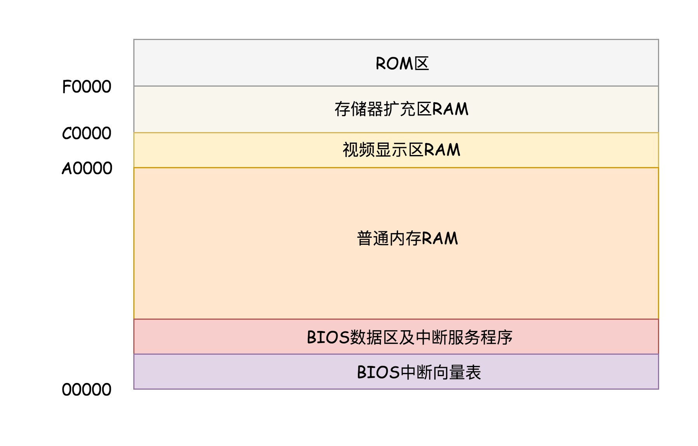
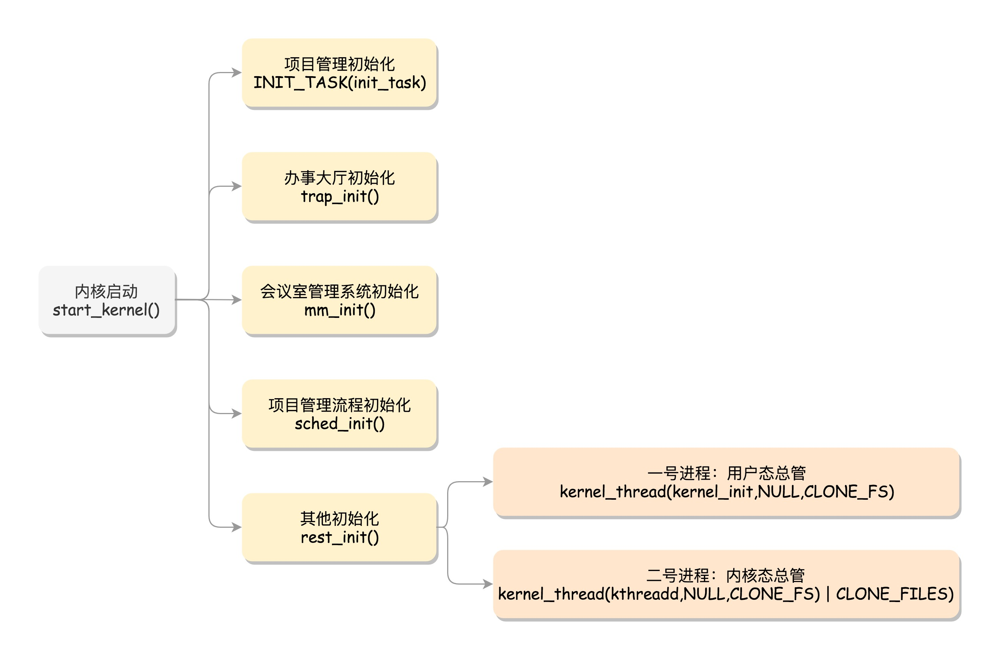

# 综述

文档主要是阅读刘超老师《趣谈Linux操作系统》的总结


# 系统初始化

> #### **实模式（Real Pattern** ）与 **保护模式**（Protected Pattern）


最初计算机发展的时候，第一个 “标准” 是以8086处理器为基准的。

- 8086 处理器内部有 8 个 16 位的通用寄存器，分别是 AX、BX、CX、DX、SP、BP、SI、DI。 这些寄存器比较灵活，其中 AX、BX、CX、DX 可以分成两个 8 位的寄存器来使用。

- 每个进程都分代码段和数据段，为了指向不同进程的地址空间，有四个 16 位的段寄存器，分别是 CS、DS、SS、ES。

  其中：

  - CS 就是代码段寄存器（Code Segment Register），通过它可以找到代码在内存中的位置；
  - DS 是数据段的寄存器，通过它可以找到数据在内存中的位置。
  - SS 是栈寄存器（Stack Register）。
  - ES（Extra Segment） 段寄存器是一个附加段寄存器。

- IP 寄存器就是指令指针寄存器（Instruction Pointer Register)，指向代码段中下一条指令的位置。

- 8086 的地址总线地址是 20 位。在寻址的时候把 CS 和 DS 中的值左移 4 位，变成 20 位的，加上 16 位的偏移量，这样就可以得到最终 20 位的数据地址。由于 总线只有20位，那么他只能够有 $2^{20}=1M$ 个地址。由于偏移量是16位，所以一个段最大的大小是 $2^{16}=64k$。所以对于 8086CPU，最多只能访问 1M 的内存空间，还要分成多个段，每个段最多 64K。（这里要概念清楚，是只能访问 1M的内存空间，意思是有1M个地址，如果按字节编址，那么可以访问的内存大小为1MB）

  

当换成32位处理器的时候，由于地址总线变为了32位，寻址方式肯定不同，为了保持兼容，对**段寄存器**（Segment Register）做了较大的调整。

CS、SS、DS、ES 仍然是 16 位的，但是不再是段的起始地址。段的起始地址放在内存的某个地方。这个地方是一个表格，表格中的一项一项是**段描述符**（Segment Descriptor）。这里面才是真正的段的起始地址。而段寄存器里面保存的是在这个表格中的哪一项，称为**选择子**（Selector）。

这样，将一个从段寄存器直接拿到的段起始地址，就变成了先间接地从段寄存器找到表格中的一项，再从表格中的一项中拿到段起始地址。


因而到了 32 位的系统架构下，我们将前一种模式称为**实模式**（Real Pattern），后一种模式称为**保护模式**（Protected Pattern）。

当系统刚刚启动的时候，CPU 是处于实模式的，只能寻址 1M，每个段最多 64K，这个时候和原来的模式是兼容的。也就是说，哪怕你买了 32 位的 CPU，也支持在原来的模式下运行，只不过快了一点而已。

当需要更多内存的时候，你可以遵循一定的规则，进行一系列的操作，然后切换到保护模式，就能够用到 32 位 CPU 更强大的能力。


## BIOS 时期

按下计算机的启动按钮，主板就加上电了。在主板上，有一个东西叫**ROM**（Read Only Memory，只读存储器）上面早就固化了一些初始化的程序，也就是**BIOS**（Basic Input and Output System，基本输入输出系统）。



在 x86 系统中，将 1M 空间最上面的 0xF0000 到 0xFFFFF 这 64K 映射给 ROM，也就是说，到这部分地址访问的时候，会访问 ROM。

当电脑刚加电的时候，会做一些重置的工作，将 CS 设置为 0xFFFF，将 IP 设置为 0x0000，所以第一条指令就会指向 0xFFFF0，正是在 ROM 的范围内。在这里，有一个 JMP 命令会跳到 ROM 中做初始化工作的代码，于是，BIOS 开始进行初始化的工作。

- 首先，BIOS 要检查一下系统的硬件是不是都好着呢。
- 然后，要建立一个中断向量表和中断服务程序


## bootloader 时期

操作系统一般都会在安装在硬盘上，在 BIOS 的界面上。你会看到一个启动盘的选项。

启动盘一般在第一个扇区，占 512 字节，而且以 0xAA55 结束。这是一个约定，当满足这个条件的时候，就说明这是一个启动盘，在 512 字节以内会启动相关的代码。

在 Linux 里面有一个工具，叫**Grub2**，全称 Grand Unified Bootloader Version 2。使用 `grub2-install /dev/sda`，可以将启动程序安装到相应的位置。

- grub2 第一个要安装的就是 boot.img。它由 boot.S 编译而成，一共 512 字节，正式安装到启动盘的第一个扇区。这个扇区通常称为**MBR**（Master Boot Record，主引导记录 / 扇区）。BIOS 完成任务后，会将 boot.img 从硬盘加载到内存中的 0x7c00 来运行。

- 由于 512 个字节实在有限，boot.img 做不了太多的事情。它能做的最重要的一个事情就是加载 grub2 的另一个镜像 core.img。

- core.img 由 lzma_decompress.img、diskboot.img、kernel.img 和一系列的模块组成，功能比较丰富，能做很多事情。

  - boot.img 先加载的是 core.img 的第一个扇区。如果从硬盘启动的话，这个扇区里面是 diskboot.img，对应的代码是 diskboot.S。

    boot.img 将控制权交给 diskboot.img 后，diskboot.img 的任务就是将 core.img 的其他部分加载进来，先是解压缩程序 lzma_decompress.img，再往下是 kernel.img，最后是各个模块 module 对应的映像。这里需要注意，它不是 Linux 的内核，而是 grub 的内核。

    lzma_decompress.img 对应的代码是 startup_raw.S，本来 kernel.img 是压缩过的，现在执行的时候，需要解压缩。

在这之前，我们所有遇到过的程序都非常非常小，完全可以在实模式下运行，但是随着我们加载的东西越来越大，实模式这 1M 的地址空间实在放不下了，所以在真正的解压缩之前，lzma_decompress.img 做了一个重要的决定，就是调用 real_to_prot，切换到保护模式，这样就能在更大的寻址空间里面，加载更多的东西。

- 之后切换模式。

- kernel.img 对应的代码是 startup.S 以及一堆 c 文件，在 startup.S 中会调用 grub_main，这是 grub kernel 的主函数。在这个函数里面，grub_load_config() 开始解析 grub.conf 文件里的配置信息。

  如果是正常启动，grub_main 最后会调用 `grub_command_execute (“normal”, 0, 0)`，最终会调用 grub_normal_execute() 函数。在这个函数里面，grub_show_menu() 会显示出让你选择的那个操作系统的列表。

- 一旦选定了启动某个操作系统，就要开始调用 grub_menu_execute_entry() ，开始解析并执行选择的那一项。例如里面的 linux16 命令，表示装载指定的内核文件，并传递内核启动参数。于是 grub_cmd_linux() 函数会被调用，它会首先读取 Linux 内核镜像头部的一些数据结构，放到内存中的数据结构来，进行检查。如果检查通过，则会**读取整个 Linux 内核镜像到内存**。如果配置文件里面还有 initrd 命令，用于为即将启动的内核传递 init ramdisk 路径。于是 grub_cmd_initrd() 函数会被调用，**将 initramfs 加载到内存中来**。

- 当这些事情做完之后，`grub_command_execute (“boot”, 0, 0) `才开始真正地启动内核。


整体的流程基本上是


> #### **从实模式切换到保护模式**

切换到保护模式要干很多工作，大部分工作都与内存的访问方式有关。

- 第一项是**启用分段**，就是在内存里面建立段描述符表，将寄存器里面的段寄存器变成段选择子，指向某个段描述符，这样就能实现不同进程的切换了。

- 第二项是**启动分页**。能够管理的内存变大了，就需要将内存分成相等大小的块

- 集权与授权，打开 Gate A20，也就是第 21 根地址线的控制线。在实模式 8086 下面，一共就 20 个地址线，可访问 1M 的地址空间。如果超过了这个限度怎么办呢？当然是绕回来了。在保护模式下，第 21 根要起作用了，于是我们就需要打开 Gate A20。

  切换保护模式的函数 DATA32 call real_to_prot 会打开 Gate A20，也就是第 21 根地址线的控制线。


## 内核初始化

内核的启动从入口函数 start_kernel() 开始。在 init/main.c 文件中，start_kernel 相当于内核的 main 函数。打开这个函数，你会发现，里面是各种各样初始化函数 XXXX_init。



最后，start_kernel() 调用的是 rest_init()，用来做其他方面的初始化。


### 进程管理模块

> #### 创建0号、1号进程

在操作系统里面，先要有个创始进程，有一行指令 `set_task_stack_end_magic(&init_task)`。这里面有一个参数 init_task，它的定义是 `struct task_struct init_task = INIT_TASK(init_task)`。它是系统创建的第一个进程，我们称为**0 号进程**。这是唯一一个没有通过 fork 或者 kernel_thread 产生的进程，是进程列表的第一个。

之后，rest_init 用 kernel_thread(kernel_init, NULL, CLONE_FS) 创建第二个进程，这个是**1 号进程**。1 号进程对于操作系统来讲，有“划时代”的意义。因为它将运行一个用户进程，随着进程的变多，最终形成一棵进程树。

当有多个线程之后，需要做好线程的权限控制。 x86 提供了分层的权限机制，把区域分成了四个 Ring，越往里权限越高，越往外权限越低。


操作系统很好地利用了这个机制，将能够访问关键资源的代码放在 Ring0，我们称为**内核态**（Kernel Mode）；将普通的程序代码放在 Ring3，我们称为**用户态**（User Mode）。

系统此时处于保护模式，保护模式除了可访问空间大一些，还有另一个重要功能，就是“保护”，也就是说，当处于用户态的代码想要执行更高权限的指令，这种行为是被禁止的。


> #### 从用户态到内核态

当一个用户态的程序运行到一半，要访问一个核心资源，例如访问网卡发一个网络包，就需要暂停当前的运行，调用系统调用，接下来就轮到内核中的代码运行了。首先，内核将从系统调用传过来的包，在网卡上排队，轮到的时候就发送。发送完了，系统调用就结束了，返回用户态，让暂停运行的程序接着运行。

这个暂停其实就是把程序运行到一半的情况保存下来。例如，我们知道，内存是用来保存程序运行时候的中间结果的，现在要暂时停下来，这些中间结果不能丢，因为再次运行的时候，还要基于这些中间结果接着来。另外就是，当前运行到代码的哪一行了，当前的栈在哪里，这些都是在寄存器里面的。

所以，暂停的那一刻，要把当时 CPU 的寄存器的值全部暂存到一个地方，这个地方可以放在进程管理系统很容易获取的地方。当系统调用完毕，返回的时候，再从这个地方将寄存器的值恢复回去，就能接着运行了。

这个过程就是这样的：**用户态 - 系统调用 - 保存寄存器 - 内核态执行系统调用 - 恢复寄存器 - 返回用户态，然后接着运行。**


> #### 从内核态到用户态

当前执行 kernel_thread 这个函数创建1号进程的时候，我们还在内核态，现在我们就来跨越这道屏障，到用户态去运行一个程序。这该怎么办呢？很少听说“先内核态再用户态”的。

kernel_thread 的参数是一个函数 kernel_init，也就是这个进程会运行这个函数。

- 在 kernel_init 里面，会调用 kernel_init_freeable()。之后，代码会运行 run_init_process 函数，底层最终调用的是 do_execve。

- execve 是一个系统调用，它的作用是运行一个执行文件。加一个 do_ 的往往是内核系统调用的实现。

  - 它会尝试运行 ramdisk 的“/init”，或者普通文件系统上的“/sbin/init” “/etc/init” “/bin/init” “/bin/sh”。

  - 不同版本的 Linux 会选择不同的文件启动，但是只要有一个起来了就可以

    

利用执行 init 文件的机会，从内核态回到用户态。

- 从系统调用的过程可以得到启发，“用户态 - 系统调用 - 保存寄存器 - 内核态执行系统调用 - 恢复寄存器 - 返回用户态”，然后接着运行。而咱们刚才运行 init，是调用 do_execve，正是上面的过程的后半部分，从内核态执行系统调用开始。
- do_execve->do_execveat_common->exec_binprm->search_binary_handler，在 search_binary_handler 方法中会调用 load_binary 加载二进制的文件。
- 也就是说，要运行一个程序，需要加载这个二进制文件，这就是我们常说的**项目执行计划书**。它是有一定格式的。Linux 下一个常用的格式是**ELF**
- 最后调用 start_thread。
  - 手动补上了原来系统调用里，保存寄存器的一个步骤。
  - 最后的 force_iret 方法是用于从系统调用中返回。这个时候会恢复寄存器。从哪里恢复呢？按说是从进入系统调用的时候，保存的寄存器里面拿出。好在上面的函数补上了寄存器。CS 和指令指针寄存器 IP 恢复了，指向用户态下一个要执行的语句。DS 和函数栈指针 SP 也被恢复了，指向用户态函数栈的栈顶。所以，下一条指令，就从用户态开始运行了。


> #### ramdisk 的作用

- 一开始到用户态的是 ramdisk 的 init，后来会启动真正根文件系统上的 init，成为所有用户态进程的祖先。

- 此时回到用户态是没有文件系统的。

  因为 init 程序是在文件系统上的，文件系统一定是在一个存储设备上的，例如硬盘。Linux 访问存储设备，要有驱动才能访问。如果存储系统数目很有限，那驱动可以直接放到内核里面，反正前面我们加载过内核到内存里了，现在可以直接对存储系统进行访问。但是存储系统越来越多了，如果所有市面上的存储系统的驱动都默认放进内核，内核就太大了。只好先弄一个基于内存的文件系统。内存访问是不需要驱动的，这个就是 ramdisk。这个时候，ramdisk 是根文件系统。

- 然后开始运行 ramdisk 上的 /init。等它运行完了就已经在用户态了。/init 这个程序会先根据存储系统的类型加载驱动，有了驱动就可以设置真正的根文件系统了。有了真正的根文件系统，ramdisk 上的 /init 会启动文件系统上的 init。


> #### **创建 2 号进程**

内核态的根进程。`kernel_thread(kthreadd, NULL, CLONE_FS | CLONE_FILES) `又一次使用 kernel_thread 函数创建进程。


###  系统调用模块

Linux 提供了 glibc 这个中介，glibc 对系统调用进行了封装，它更熟悉系统调用的细节，并且可以封装成更加友好的接口。

在 glibc 的源代码中，有个文件 syscalls.list，里面列着所有 glibc 的函数对应的系统调用。另外，glibc 还有一个脚本 make-syscall.sh，可以根据配置文件，对于每一个封装好的系统调用，生成一个文件。这个文件里面定义了一些宏，例如 #define SYSCALL_NAME open。

glibc 还有一个文件 syscall-template.S，使用上面这个宏，定义了这个系统调用的调用方式。里面对于任何一个系统调用，会调用 **`DO_CALL`**。这也是一个宏，这个宏 32 位和 64 位的定义是不一样的。


> #### 32 位系统调用过程


```c
#define DO_CALL(syscall_name, args)                           \
    PUSHARGS_##args                               \
    DOARGS_##args                                 \
    movl $SYS_ify (syscall_name), %eax;                          \
    ENTER_KERNEL                                  \
    POPARGS_##args
```

这里，我们将请求参数放在寄存器里面，根据系统调用的名称，得到系统调用号，放在寄存器 eax 里面，然后执行 ENTER_KERNEL。


这里面的 ENTER_KERNEL 是

```
# define ENTER_KERNEL int $0x80
```

int 就是 interrupt，也就是“中断”的意思。int $0x80 就是触发一个软中断，通过它就可以陷入（trap）内核。

在内核启动的时候，还记得有一个 trap_init()，其中有这样的代码：

```c
set_system_intr_gate(IA32_SYSCALL_VECTOR, entry_INT80_32);
```

这是一个软中断的陷入门。当接收到一个系统调用的时候，entry_INT80_32 就被调用了。

```
ENTRY(entry_INT80_32)
        ASM_CLAC
        pushl   %eax                    /* pt_regs->orig_ax */
        SAVE_ALL pt_regs_ax=$-ENOSYS    /* save rest */
        movl    %esp, %eax
        call    do_syscall_32_irqs_on
.Lsyscall_32_done:
......
.Lirq_return:
	INTERRUPT_RETURN
```

通过 push 和 SAVE_ALL 将当前用户态的寄存器，保存在 pt_regs 结构里面。

进入内核之前，保存所有的寄存器，然后调用 do_syscall_32_irqs_on。在do_syscall_32_irqs_on中，将系统调用号从 eax 里面取出来，然后根据系统调用号，在系统调用表中找到相应的函数进行调用，并将寄存器中保存的参数取出来，作为函数参数。根据宏定义，`#define ia32_sys_call_table sys_call_table`，系统调用就是放在这个表里面。

当系统调用结束之后，在 entry_INT80_32 之后，紧接着调用的是 INTERRUPT_RETURN，我们能够找到它的定义，也就是 iret。

```c
#define INTERRUPT_RETURN     
```

iret 指令将原来用户态保存的现场恢复回来，包含代码段、指令指针寄存器等。这时候用户态进程恢复执行。


> #### 64 位系统调用过程


```c
#define DO_CALL(syscall_name, args)					      \
  lea SYS_ify (syscall_name), %rax;					      \
  syscall
```

和之前一样，还是将系统调用名称转换为系统调用号，放到寄存器 rax。这里是真正进行调用，不是用中断了，而是改用 syscall 指令了。并且，传递参数的寄存器也变了。

syscall 指令还使用了一种特殊的寄存器，叫**特殊模块寄存器**（Model Specific Registers，简称 MSR）。这种寄存器是 CPU 为了完成某些特殊控制功能为目的的寄存器，其中就有系统调用。

在系统初始化的时候，trap_init 除了初始化上面的中断模式，这里面还会调用 `cpu_init->syscall_init`。这里面有这样的代码：

```c
wrmsrl(MSR_LSTAR, (unsigned long)entry_SYSCALL_64);
```

rdmsr 和 wrmsr 是用来读写特殊模块寄存器的。MSR_LSTAR 就是这样一个特殊的寄存器，当 syscall 指令调用的时候，会从这个寄存器里面拿出函数地址来调用，也就是调用 entry_SYSCALL_64。

在 arch/x86/entry/entry_64.S 中定义了 entry_SYSCALL_64。这里先保存了很多寄存器到 pt_regs 结构里面，例如用户态的代码段、数据段、保存参数的寄存器，然后调用 entry_SYSCALL64_slow_pat->do_syscall_64。

在 do_syscall_64 里面，从 rax 里面拿出系统调用号，然后根据系统调用号，在系统调用表 sys_call_table 中找到相应的函数进行调用，并将寄存器中保存的参数取出来，作为函数参数。

所以，无论是 32 位，还是 64 位，都会到系统调用表 sys_call_table 这里来。

64 位的系统调用返回的时候，执行的是 USERGS_SYSRET64。这里，返回用户态的指令变成了 sysretq。


> #### 系统调用表

系统调用表 sys_call_table 是怎么形成的？

- 32 位的系统调用表定义在面 arch/x86/entry/syscalls/syscall_32.tbl 文件里。

- 64 位的系统调用定义在另一个文件 arch/x86/entry/syscalls/syscall_64.tbl 里。

- 系统调用在内核中的实现函数要有一个声明。声明往往在 include/linux/syscalls.h 文件中。

- 真正的实现这个系统调用，一般在一个.c 文件里面，例如 sys_open 的实现在 fs/open.c 里面。

  

声明和实现都好了。接下来，在编译的过程中，需要根据 syscall_32.tbl 和 syscall_64.tbl 生成自己的 unistd_32.h 和 unistd_64.h。生成方式在 arch/x86/entry/syscalls/Makefile 中。

这里面会使用两个脚本，其中第一个脚本 arch/x86/entry/syscalls/syscallhdr.sh，会在文件中生成 #define __NR_open；第二个脚本 arch/x86/entry/syscalls/syscalltbl.sh，会在文件中生成 __SYSCALL(__NR_open, sys_open)。这样，unistd_32.h 和 unistd_64.h 是对应的系统调用号和系统调用实现函数之间的对应关系。

在文件 arch/x86/entry/syscall_32.c，定义了这样一个表，里面 include 了这个头文件，从而所有的 sys_ 系统调用都在这个表里面了。

同理，在文件 arch/x86/entry/syscall_64.c，定义了这样一个表，里面 include 了这个头文件，这样所有的 sys_ 系统调用就都在这个表里面了。


# 进程管理

## 进程创建

进程创建 — 进程从代码到二进制到运行时的过程。

首先通过图右边的文件编译过程，生成 so 文件和可执行文件，放在硬盘上。下图左边的用户态的进程 A 执行 fork，创建进程 B，在进程 B 的处理逻辑中，执行 exec 系列系统调用。这个系统调用会通过 load_elf_binary 方法，将刚才生成的可执行文件，加载到进程 B 的内存中执行。


普通的进程可以使用 fork 系统调用进行调用。

```c
#include <stdio.h>
#include <stdlib.h>
#include <sys/types.h>
#include <unistd.h>
 
 
extern int create_process (char* program, char** arg_list);
 
 
int create_process (char* program, char** arg_list)
{
    pid_t child_pid;
    child_pid = fork ();
    if (child_pid != 0)
        return child_pid;
    else {
        execvp (program, arg_list);
        abort ();
    }
```

调用方法

```c
#include <stdio.h>
#include <stdlib.h>
#include <sys/types.h>
#include <unistd.h>
 
extern int create_process (char* program, char** arg_list);
 
int main ()
{
    char* arg_list[] = {
        "ls",
        "-l",
        "/etc/yum.repos.d/",
        NULL
    };
    create_process ("ls", arg_list);
    return 0;
}
```

文件写好之后，首先需要编译。


> #### 进行编译：程序的二进制格式

在 Linux 下面，二进制的程序有严格的格式，这个格式我们称为**ELF**（Executeable and Linkable Format，可执行与可链接格式）。这个格式可以根据编译的结果不同，分为不同的格式。


在编译的时候，先做预处理工作，例如将头文件嵌入到正文中，将定义的宏展开，然后就是真正的编译过程，最终编译成为.o 文件，这就是 ELF 的第一种类型，**可重定位文件**（Relocatable File）。

这个文件的格式是这样的：


ELF 文件的头是用于描述整个文件的。这个文件格式在内核中有定义，分别为 struct elf32_hdr 和 struct elf64_hdr。接下来我们来看一个一个的 section，我们也叫**节**。

- .text：放编译好的二进制可执行代码
- .data：已经初始化好的全局变量
- .rodata：只读数据，例如字符串常量、const 的变量
- .bss：未初始化全局变量，运行时会置 0
- .symtab：符号表，记录的则是函数和变量
- .strtab：字符串表、字符串常量和变量名
- .rel.text：函数重定向
- .rel.data：数据重定向

这里只有全局变量，局部变量是放在栈里面的，是程序运行过程中随时分配空间，随时释放的，现在我们讨论的是二进制文件，还没启动，所以只需要讨论在哪里保存全局变量。

这些节的元数据信息也需要有一个地方保存，就是最后的节头部表（Section Header Table）。在这个表里面，每一个 section 都有一项，在代码里面也有定义 struct elf32_shdr 和 struct elf64_shdr。在 ELF 的头里面，有描述这个文件的节头部表的位置，有多少个表项等等信息。


可重定位文件的**可重定位**这样理解：这个编译好的代码和变量，将来加载到内存里面的时候，都是要加载到一定位置的。比如说，调用一个函数，其实就是跳到这个函数所在的代码位置执行；再比如修改一个全局变量，也是要到变量的位置那里去修改。但是现在这个时候，还是.o 文件，不是一个可以直接运行的程序，这里面只是部分代码片段。例如这里的 create_process 函数，将来被谁调用，在哪里调用都不清楚，就更别提确定位置了。所以，.o 里面的位置是不确定的，但是必须是可重新定位的，因为它将来是要做函数库的，在哪里被调用了就重新定位这些代码、变量的位置。

有的 section，例如.rel.text, .rel.data 就与重定位有关。例如这里的 createprocess.o，里面调用了 create_process 函数，但是这个函数在另外一个.o 里面，因而 createprocess.o 里面根本不可能知道被调用函数的位置，所以只好在 rel.text 里面标注，这个函数是需要重定位的。

函数作为库文件被重用，不能以.o 的形式存在，而是要形成库文件，库文件又分为静态链接库与动态链接库。


**静态链接库**

在编译的时候，会去指定目录下找到目标文件，将.o 文件提取出来，链接到程序中，形成二进制执行文件。形成的二进制文件叫**可执行文件**，是 ELF 的第二种格式，格式如下：


这个格式和.o 文件大致相似，还是分成一个个的 section，并且被节头表描述。只不过这些 section 是多个.o 文件合并过的。但是这个时候，这个文件已经是马上就可以加载到内存里面执行的文件了，因而这些 section 被分成了需要加载到内存里面的代码段、数据段和不需要加载到内存里面的部分，将小的 section 合成了大的段 segment，并且在最前面加一个段头表（Segment Header Table）。在代码里面的定义为 struct elf32_phdr 和 struct elf64_phdr，这里面除了有对于段的描述之外，最重要的是 p_vaddr，这个是这个段加载到内存的虚拟地址。在 ELF 头里面，有一项 e_entry，也是个虚拟地址，是这个程序运行的入口。

静态链接库一旦链接进去，代码和变量的 section 都合并了，因而程序运行的时候，就不依赖于这个库是否存在。但是这样有一个缺点，就是相同的代码段，如果被多个程序使用的话，在内存里面就有多份，而且一旦静态链接库更新了，如果二进制执行文件不重新编译，也不随着更新。


**动态链接库**

当一个动态链接库被链接到一个程序文件中的时候，最后的程序文件并不包括动态链接库中的代码，而仅仅包括对动态链接库的引用，并且不保存动态链接库的全路径，仅仅保存动态链接库的名称。

当运行这个程序的时候，首先寻找动态链接库，然后加载它。默认情况下，系统在 /lib 和 /usr/lib 文件夹下寻找动态链接库。如果找不到就会报错，我们可以设定 LD_LIBRARY_PATH 环境变量，程序运行时会在此环境变量指定的文件夹下寻找动态链接库。

动态链接库，就是 ELF 的第三种类型，**共享对象文件**（Shared Object）。基于动态连接库创建出来的二进制文件格式还是 ELF，但是稍有不同。

- 首先，多了一个.interp 的 Segment，这里面是 ld-linux.so，这是动态链接器，也就是说，运行时的链接动作都是它做的。
- 另外，ELF 文件中还多了两个 section，一个是.plt，**过程链接表（Procedure Linkage Table，PLT）**，一个是.got.plt，**全局偏移量表（Global Offset Table，GOT）**。

它们是怎么工作的，使得程序运行的时候，可以将 so 文件动态链接到进程空间的呢？


**动态链接的原理（过程）**

dynamiccreateprocess 这个程序要调用 libdynamicprocess.so 里的 create_process 函数。

1. 由于是运行时才去找，编译的时候，压根不知道这个函数在哪里，所以就在 PLT 里面建立一项 PLT[x]。这一项也是一些代码，有点像一个本地的代理，在二进制程序里面，不直接调用 create_process 函数，而是调用 PLT[x] 里面的代理代码，这个代理代码会在运行的时候找真正的 create_process 函数。

2. 去哪里找代理代码呢？这就用到了 GOT，这里面也会为 create_process 函数创建一项 GOT[y]。这一项是运行时 create_process 函数在内存中真正的地址。如果这个地址在，dynamiccreateprocess 调用 PLT[x] 里面的代理代码，代理代码调用 GOT 表中对应项 GOT[y]，调用的就是加载到内存中的 libdynamicprocess.so 里面的 create_process 函数了。

3. 但是 GOT 怎么知道的呢？对于 create_process 函数，GOT 一开始就会创建一项 GOT[y]，但是这里面没有真正的地址，因为它也不知道，但是它有办法，它又回调 PLT，告诉它，你里面的代理代码来找我要 create_process 函数的真实地址，我不知道，你想想办法吧。
4. PLT 这个时候会转而调用 PLT[0]，也即第一项，PLT[0] 转而调用 GOT[2]，这里面是 ld-linux.so 的入口函数，这个函数会找到加载到内存中的 libdynamicprocess.so 里面的 create_process 函数的地址，然后把这个地址放在 GOT[y] 里面。下次，PLT[x] 的代理函数就能够直接调用了。


> #### 运行程序为进程

知道了 ELF 这个格式，这个时候它还是个程序，那怎么把这个文件加载到内存里面呢？

在内核中，有 linux_binfmt 这样一个数据结构，用来定义加载二进制文件的方法。对于 ELF 文件格式，有对应的实现 `struct linux_binfmt elf_format` 。其中通过 load_elf_binary 函数来加载 elf 文件。

在系统启动的章节中，有一节从内核态到用户态中有一段方法的调用过程，具体是这样的：

`do_execve->do_execveat_common->exec_binprm->search_binary_handler`

他最终调用了 load_elf_binary 函数。do_execve 又是被 exec 这个系统调用调用的。所以原理是 exec 这个系统调用最终调用的 load_elf_binary


> #### 进程树

既然所有的进程都是从父进程 fork 过来的，那总归有一个祖宗进程，这就是咱们系统启动的 init 进程。在解析 Linux 的启动过程的时候，1 号进程是 /sbin/init。如果在 centOS 7 里面，我们 ls 一下，可以看到，这个进程是被软链接到 systemd 的。

系统启动之后，init 进程会启动很多的 daemon 进程，为系统运行提供服务，然后就是启动 getty，让用户登录，登录后运行 shell，用户启动的进程都是通过 shell 运行的，从而形成了一棵进程树。

我们可以通过 ps -ef 命令查看当前系统启动的进程，我们会发现有三类进程。

```shell
[root@deployer ~]# ps -ef
UID        PID  PPID  C STIME TTY          TIME CMD
root         1     0  0  2018 ?        00:00:29 /usr/lib/systemd/systemd --system --deserialize 21
root         2     0  0  2018 ?        00:00:00 [kthreadd]
root         3     2  0  2018 ?        00:00:00 [ksoftirqd/0]
root         5     2  0  2018 ?        00:00:00 [kworker/0:0H]
root         9     2  0  2018 ?        00:00:40 [rcu_sched]
......
root       337     2  0  2018 ?        00:00:01 [kworker/3:1H]
root       380     1  0  2018 ?        00:00:00 /usr/lib/systemd/systemd-udevd
root       415     1  0  2018 ?        00:00:01 /sbin/auditd
root       498     1  0  2018 ?        00:00:03 /usr/lib/systemd/systemd-logind
......
root       852     1  0  2018 ?        00:06:25 /usr/sbin/rsyslogd -n
root      2580     1  0  2018 ?        00:00:00 /usr/sbin/sshd -D
root     29058     2  0 Jan03 ?        00:00:01 [kworker/1:2]
root     29672     2  0 Jan04 ?        00:00:09 [kworker/2:1]
root     30467     1  0 Jan06 ?        00:00:00 /usr/sbin/crond -n
root     31574     2  0 Jan08 ?        00:00:01 [kworker/u128:2]
......
root     32792  2580  0 Jan10 ?        00:00:00 sshd: root@pts/0
root     32794 32792  0 Jan10 pts/0    00:00:00 -bash
root     32901 32794  0 00:01 pts/0    00:00:00 ps -ef
```

你会发现，PID 1 的进程就是我们的 init 进程 systemd，PID 2 的进程是内核线程 kthreadd，这两个我们在内核启动的时候都见过。其中用户态的不带中括号，内核态的带中括号。

接下来进程号依次增大，但是你会看所有带中括号的内核态的进程，祖先都是 2 号进程。而用户态的进程，祖先都是 1 号进程。tty 那一列，是问号的，说明不是前台启动的，一般都是后台的服务。

pts 的父进程是 sshd，bash 的父进程是 pts，ps -ef 这个命令的父进程是 bash。这样整个链条都比较清晰了。


## 线程创建

> #### 线程的创建流程


> #### 线程的数据

我们把线程访问的数据细分成三类。

第一类是**线程栈上的本地数据**。

比如函数执行过程中的局部变量。函数的调用会使用栈的模型，这在线程里面是一样的。只不过每个线程都有自己的栈空间。主线程在内存中有一个栈空间，其他线程栈也拥有独立的栈空间。为了避免线程之间的栈空间踩踏，线程栈之间还会有小块区域，用来隔离保护各自的栈空间。一旦另一个线程踏入到这个隔离区，就会引发段错误。


第二类数据就是**在整个进程里共享的全局数据**。

例如全局变量，虽然在不同进程中是隔离的，但是在一个进程中是共享的。如果同一个全局变量，两个线程一起修改，那肯定会有问题，有可能把数据改的面目全非。这就需要有一种机制来保护他们，比如你先用我再用。


第三类数据**线程私有数据**（Thread Specific Data）

可以通过以下函数创建：

```c
int pthread_key_create(pthread_key_t *key, void (*destructor)(void*))
```

可以看到，创建一个 key，伴随着一个析构函数。key 一旦被创建，所有线程都可以访问它，但各线程可根据自己的需要往 key 中填入不同的值，这就相当于提供了一个同名而不同值的全局变量。


> #### 数据的保护

第一种方式，**Mutex**，全称 Mutual Exclusion，中文叫**互斥**，它的模式就是在共享数据访问的时候，去申请加把锁，谁先拿到锁，谁就拿到了访问权限。

使用流程


- 使用 Mutex，首先要使用 pthread_mutex_init 函数初始化这个 mutex，初始化后，就可以用它来保护共享变量了。
- pthread_mutex_lock() 就是去抢那把锁的函数，如果抢到了，就可以执行下一行程序，对共享变量进行访；如果没抢到，就被阻塞在那里等待。
- 如果不想被阻塞，可以使用 pthread_mutex_trylock 去抢那把锁，如果抢到了，就可以执行下一行程序，对共享变量进行访问；如果没抢到，不会被阻塞，而是返回一个错误码。
- 当共享数据访问结束了，别忘了使用 pthread_mutex_unlock 释放锁，让给其他人使用，最终调用 pthread_mutex_destroy 销毁掉这把锁。

在使用 Mutex 的时候，有个问题是如果使用 pthread_mutex_lock()，那就需要一直在那里等着。如果是 pthread_mutex_trylock()，就可以不用等着，去干点儿别的，但是我怎么知道什么时候回来再试一下，是不是轮到我了呢？能不能在轮到我的时候，通知我一下呢？

这其实就是条件变量，也就是说如果没事儿，就让大家歇着，有事儿了就去通知，别让人家没事儿就来问问，浪费大家的时间。

但是当它接到了通知，来操作共享资源的时候，还是需要抢互斥锁，因为可能很多人都受到了通知，都来访问了，所以**条件变量和互斥锁是配合使用的**。


条件变量和互斥锁使用流程


# 常用命令

## TOP

> [linux top命令查看内存及多核CPU的使用讲述](https://www.cnblogs.com/dragonsuc/p/5512797.html)

Linux top命令用于实时显示 process 的动态。

**参数说明**：

- d : 改变显示的更新速度，或是在交谈式指令列( interactive command)按 s
- q : 没有任何延迟的显示速度，如果使用者是有 superuser 的权限，则 top 将会以最高的优先序执行
- c : 切换显示模式，共有两种模式，一是只显示执行档的名称，另一种是显示完整的路径与名称
- S : 累积模式，会将己完成或消失的子行程 ( dead child process ) 的 CPU time 累积起来
- s : 安全模式，将交谈式指令取消, 避免潜在的危机
- i : 不显示任何闲置 (idle) 或无用 (zombie) 的行程
- n : 更新的次数，完成后将会退出 top
- b : 批次档模式，搭配 "n" 参数一起使用，可以用来将 top 的结果输出到档案内
- -p: 监控特定的PID，你可以用-p选项监控指定的PID。PID的值为0将被作为top命令自身的PID。


例如：

`top -c`在查看命令（最后一栏）那一栏可以看到完成的执行命令路径。

`top -Hp 3033` 显示一个进程的线程运行信息列表。按下P,进程按照Cpu使用率排序


## PS

process status命令用于显示当前进程的状态，类似于 windows 的任务管理器。

**参数说明**：

- ps 的参数非常多, 在此仅列出几个常用的参数并大略介绍含义

- -A 列出所有的进程

- ps -e 此参数的效果和指定"A"参数相同

- -w 显示加宽可以显示较多的资讯

- -au 显示较详细的资讯

- -aux 显示所有包含其他使用者的行程

- -f 带有完整的命令行路径

- au(x) 输出格式 :

  ```
  USER PID %CPU %MEM VSZ RSS TTY STAT START TIME COMMAND
  ```

  - USER: 行程拥有者
  - PID: pid
  - %CPU: 占用的 CPU 使用率
  - %MEM: 占用的记忆体使用率
  - VSZ: 占用的虚拟记忆体大小
  - RSS: 占用的记忆体大小
  - TTY: 终端的次要装置号码 (minor device number of tty)
  - STAT: 该行程的状态:
    - D:  无法中断的休眠状态 (通常 IO 的进程)
    - R: 正在执行中
    - S: 静止状态
    - T: 暂停执行
    - Z: 不存在但暂时无法消除
    - W: 没有足够的记忆体分页可分配
    - <: 高优先序的行程
    - N: 低优先序的行程
    - L: 有记忆体分页分配并锁在记忆体内 (实时系统或捱A I/O)
  - START: 行程开始时间
  - TIME: 执行的时间
  - COMMAND:所执行的指令

  

最常用的`ps -ef|grep keyword`：显示所有命令，连带命令行


## 端口相关

> [Linux 查看端口占用情况](https://www.runoob.com/w3cnote/linux-check-port-usage.html)

### netstat

Linux netstat 命令用于显示网络状态。

**参数说明**：

- -a或--all   显示所有连线中的Socket。
- -A<网络类型>或--<网络类型>   列出该网络类型连线中的相关地址。
- -c或--continuous   持续列出网络状态。
- -C或--cache   显示路由器配置的快取信息。
- -e或--extend   显示网络其他相关信息。
- -F或--fib   显示路由缓存。
- -g或--groups   显示多重广播功能群组组员名单。
- -h或--help   在线帮助。
- -i或--interfaces   显示网络界面信息表单。
- -l或--listening   显示监控中的服务器的Socket。
- -M或--masquerade   显示伪装的网络连线。
- -n或--numeric   直接使用IP地址，而不通过域名服务器。
- -N或--netlink或--symbolic   显示网络硬件外围设备的符号连接名称。
- -o或--timers   显示计时器。
- -p或--programs   显示正在使用Socket的程序识别码和程序名称。
- -r或--route   显示Routing Table。
- -s或--statistics   显示网络工作信息统计表。
- -t或--tcp   显示TCP传输协议的连线状况。
- -u或--udp   显示UDP传输协议的连线状况。
- -v或--verbose   显示指令执行过程。
- -V或--version   显示版本信息。
- -w或--raw   显示RAW传输协议的连线状况。
- -x或--unix   此参数的效果和指定"-A unix"参数相同。
- --ip或--inet   此参数的效果和指定"-A inet"参数相同。


`netstat -tunlp|grep port`：其实可以展示tcp的源和目标ip:port，然后grep去查找


### lsof

lsof(list open files)是一个列出当前系统打开文件的工具。

**参数说明**：

-a 列出打开文件存在的进程

-c<进程名> 列出指定进程所打开的文件

-g 列出GID号进程详情

-d<文件号> 列出占用该文件号的进程

+d<目录> 列出目录下被打开的文件

+D<目录> 递归列出目录下被打开的文件

-n<目录> 列出使用NFS的文件

-i<条件> 列出符合条件的进程。（4、6、协议、:端口、 @ip ）

-p<进程号> 列出指定进程号所打开的文件

-u 列出UID号进程详情

-h 显示帮助信息

-v 显示版本信息


`lsof -i:端口号`：lsof  查看端口占用

```sh
# lsof -i:8000
COMMAND   PID USER   FD   TYPE   DEVICE SIZE/OFF NODE NAME
nodejs  26993 root   10u  IPv4 37999514      0t0  TCP *:8000 (LISTEN)
```

lsof输出各列信息的意义如下：

COMMAND：进程的名称 PID：进程标识符

USER：进程所有者

FD：文件描述符，应用程序通过文件描述符识别该文件。如cwd、txt等 TYPE：文件类型，如DIR、REG等

DEVICE：指定磁盘的名称

SIZE：文件的大小

NODE：索引节点（文件在磁盘上的标识）

NAME：打开文件的确切名称


## ip相关


## df

disk free 命令用于显示目前在 Linux 系统上的文件系统磁盘使用情况统计。

**参数说明**：

- 文件-a, --all 包含所有的具有 0 Blocks 的文件系统
- 文件--block-size={SIZE} 使用 {SIZE} 大小的 Blocks
- 文件-h, --human-readable 使用人类可读的格式(预设值是不加这个选项的...)
- 文件-H, --si 很像 -h, 但是用 1000 为单位而不是用 1024
- 文件-i, --inodes 列出 inode 资讯，不列出已使用 block
- 文件-k, --kilobytes 就像是 --block-size=1024
- 文件-l, --local 限制列出的文件结构
- 文件-m, --megabytes 就像 --block-size=1048576
- 文件--no-sync 取得资讯前不 sync (预设值)
- 文件-P, --portability 使用 POSIX 输出格式
- 文件--sync 在取得资讯前 sync
- 文件-t, --type=TYPE 限制列出文件系统的 TYPE
- 文件-T, --print-type 显示文件系统的形式
- 文件-x, --exclude-type=TYPE 限制列出文件系统不要显示 TYPE
- 文件-v (忽略)
- 文件--help 显示这个帮手并且离开
- 文件--version 输出版本资讯并且离开

`df -h`


## free

free指令会显示内存的使用情况，包括实体内存，虚拟的交换文件内存，共享内存区段，以及系统核心使用的缓冲区等。

**参数说明**：

- -b 　以Byte为单位显示内存使用情况。

- -k 　以KB为单位显示内存使用情况。

- -m 　以MB为单位显示内存使用情况。

- -h 　以合适的单位显示内存使用情况，最大为三位数，自动计算对应的单位值。单位有：

  ```
  B = bytes
  K = kilos
  M = megas
  G = gigas
  T = teras
  ```

- -o 　不显示缓冲区调节列。

- -s<间隔秒数> 　持续观察内存使用状况。

- -t 　显示内存总和列。

- -V 　显示版本信息。

`free -h`