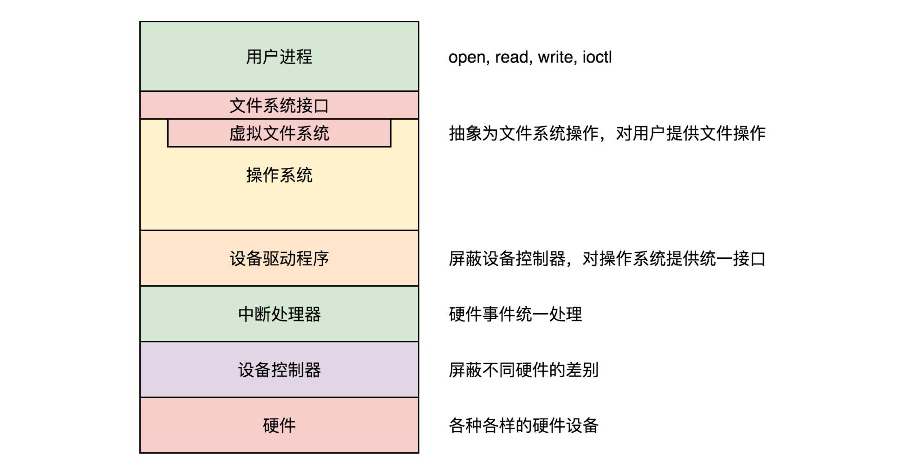

# 文件系统

主要需要弄清楚一下几个问题：

- 第一点，文件系统要有严格的组织形式，使得文件能够以块为单位进行存储
- 第二点，文件系统中要有索引区，用来方便查找一个文件分成的多个块都存放在了什么位置
- 第三点，如果文件系统中有的文件是热点文件，近期经常被读取和写入，文件系统应该有缓存层
- 第四点，文件应该用文件夹的形式组织起来，方便管理和查询
- 第五点，Linux 内核要在自己的内存里面维护一套数据结构，来保存哪些文件被哪些进程打开和使用


## 硬盘文件系统

### inode 与块的存储

硬盘分成相同大小的单元，我们称为**块**（Block）。一块的大小是扇区大小的整数倍**，默认是 4K**。在格式化的时候，这个值是可以设定的。一大块硬盘被分成了一个个小的块，用来存放文件的数据部分。


**inode**

但是这也带来一个新的问题，那就是文件的数据存放得太散，找起来就比较困难。我们是不是可以像图书馆那样，也设立一个索引区域，用来维护“某个文件分成几块、每一块在哪里“等等这些**基本信息**?另外，文件还有**元数据**部分，例如名字、权限等，这就需要一个结构**inode**来存放。

inode 的“i”是 index 的意思，其实就是“索引”，类似图书馆的索引区域。既然如此，我们**每个文件都会对应一个 inode；一个文件夹就是一个文件，也对应一个 inode**。

```c
struct ext4_inode {
	__le16	i_mode;		/* File mode */
	__le16	i_uid;		/* Low 16 bits of Owner Uid */
	__le32	i_size_lo;	/* Size in bytes */
	__le32	i_atime;	/* Access time */
	__le32	i_ctime;	/* Inode Change time */
	__le32	i_mtime;	/* Modification time */
	__le32	i_dtime;	/* Deletion Time */
	__le16	i_gid;		/* Low 16 bits of Group Id */
	__le16	i_links_count;	/* Links count */
	__le32	i_blocks_lo;	/* Blocks count */
	__le32	i_flags;	/* File flags */
......
	__le32	i_block[EXT4_N_BLOCKS];/* Pointers to blocks */
	__le32	i_generation;	/* File version (for NFS) */
	__le32	i_file_acl_lo;	/* File ACL */
	__le32	i_size_high;
......
};
```

- inode 里面有文件的读写权限 i_mode，属于哪个用户 i_uid，哪个组 i_gid，大小是多少 i_size_io，占用多少个块 i_blocks_io。咱们讲 ls 命令行的时候，列出来的权限、用户、大小这些信息，就是从这里面取出来的。

- 另外，这里面还有几个与文件相关的时间。i_atime 是 access time，是最近一次访问文件的时间；i_ctime 是 change time，是最近一次更改 inode 的时间；i_mtime 是 modify time，是最近一次更改文件的时间。

  这里需要注意区分几个地方

  - 首先，访问了，不代表修改了，也可能只是打开看看，就会改变 access time。
  - 其次，修改 inode，有可能修改的是用户和权限，没有修改数据部分，就会改变 change time。
  - 只有数据也修改了，才改变 modify time。


我们刚才说的“某个文件分成几块、每一块在哪里”，这些在 inode 里面，应该保存在 i_block 里面。

具体如何保存的呢？EXT4_N_BLOCKS 一共有 15 项。在 ext2 和 ext3 中，其中前 12 项直接保存了块的位置，也就是说，我们可以通过 i_block[0-11]，直接得到保存文件内容的块。


但是，如果一个文件比较大，12 块放不下。当我们用到 i_block[12] 的时候，就不能直接放数据块的位置了，要不然 i_block 很快就会用完了。我们可以让 i_block[12] 指向一个块，这个块里面不放数据块，而是放数据块的位置，这个块我们称为**间接块**。也就是说，我们在 i_block[12] 里面放间接块的位置，通过 i_block[12] 找到间接块后，间接块里面放数据块的位置，通过间接块可以找到数据块。

如果文件再大一些，i_block[13] 会指向一个块，我们可以用二次间接块。二次间接块里面存放了间接块的位置，间接块里面存放了数据块的位置，数据块里面存放的是真正的数据。如果文件再大一些，i_block[14] 会指向三次间接块。原理和上面都是一样的，就像一层套一层的俄罗斯套娃，一层一层打开，才能拿到最中心的数据块。

这里面有一个非常显著的问题，对于大文件来讲，我们要多次读取硬盘才能找到相应的块，这样访问速度就会比较慢。为了解决这个问题，ext4 做了一定的改变。它引入了一个新的概念，叫作**Extents**。

我们来解释一下 Extents。比方说，一个文件大小为 128M，如果使用 4k 大小的块进行存储，需要 32k 个块。如果按照 ext2 或者 ext3 那样散着放，数量太大了。但是 Extents 可以用于存放连续的块，也就是说，我们可以把 128M 放在一个 Extents 里面。这样的话，对大文件的读写性能提高了，文件碎片也减少了。


Exents 其实会保存成一棵树。树有一个个的节点，有叶子节点，也有分支节点。每个节点都有一个头，ext4_extent_header 可以用来描述某个节点。

```c
struct ext4_extent_header {
	__le16	eh_magic;	/* probably will support different formats */
	__le16	eh_entries;	/* number of valid entries */
	__le16	eh_max;		/* capacity of store in entries */
	__le16	eh_depth;	/* has tree real underlying blocks? */
	__le32	eh_generation;	/* generation of the tree */
};
```

- eh_entries 表示这个节点里面有多少项。

  这里的项分两种

  - 如果是叶子节点，这一项会直接指向硬盘上的连续块的地址，我们称为数据节点 ext4_extent；
  - 如果是分支节点，这一项会指向下一层的分支节点或者叶子节点，我们称为索引节点 ext4_extent_idx。

  这两种类型的项的大小都是 12 个 byte。

```c
/*
 * This is the extent on-disk structure.
 * It's used at the bottom of the tree.
 */
struct ext4_extent {
	__le32	ee_block;	/* first logical block extent covers */
	__le16	ee_len;		/* number of blocks covered by extent */
	__le16	ee_start_hi;	/* high 16 bits of physical block */
	__le32	ee_start_lo;	/* low 32 bits of physical block */
};
/*
 * This is index on-disk structure.
 * It's used at all the levels except the bottom.
 */
struct ext4_extent_idx {
	__le32	ei_block;	/* index covers logical blocks from 'block' */
	__le32	ei_leaf_lo;	/* pointer to the physical block of the next *
				 * level. leaf or next index could be there */
	__le16	ei_leaf_hi;	/* high 16 bits of physical block */
	__u16	ei_unused;
};
```

- 如果文件不大，inode 里面的 i_block 中，可以放得下一个 ext4_extent_header 和 4 项 ext4_extent。所以这个时候，eh_depth 为 0，也即 inode 里面的就是叶子节点，树高度为 0。

- 如果文件比较大，4 个 extent 放不下，就要分裂成为一棵树，eh_depth>0 的节点就是索引节点，**其中根节点深度最大**，在 inode 中。最底层 eh_depth=0 的是叶子节点。

除了根节点，其他的节点都保存在一个块 4k 里面，4k 扣除 ext4_extent_header 的 12 个 byte，剩下的能够放 340 项，每个 extent 最大能表示 128MB 的数据，340 个 extent 会使你的表示的文件达到 42.5GB。这已经非常大了，如果再大，我们可以增加树的深度。


### inode 位图和块位图

到这里，我们知道了，硬盘上肯定有一系列的 inode 和一系列的块排列起来。接下来的问题是，如果我要保存一个数据块，或者要保存一个 inode，我应该放在硬盘上的哪个位置呢？难道需要将所有的 inode 列表和块列表扫描一遍，找个空的地方随便放吗？

当然，这样效率太低了。所以在文件系统里面，我们专门弄了一个块来保存 inode 的位图。在这 4k 里面，每一位对应一个 inode。如果是 1，表示这个 inode 已经被用了；如果是 0，则表示没被用。同样，我们也弄了一个块保存 block 的位图。


### 文件系统的格式

数据块的位图是放在一个块里面的，共 4k。每位表示一个数据块，共可以表示 $4∗1024∗8=2^{15}$ 个数据块。如果每个数据块也是按默认的 4K，最大可以表示空间为 $2^{15}∗4∗1024=2^{27}$ 个 byte，也就是 128M。

也就是说按照上面的格式，如果采用“**一个块的位图 + 一系列的块**”，外加“**一个块的 inode 的位图 + 一系列的 inode 的结构**”，最多能够表示 128M。是不是太小了？现在很多文件都比这个大。我们先把这个结构称为一个**块组**。有 N 多的块组，就能够表示 N 大的文件。


**块组**

对于块组，我们也需要一个数据结构来表示为 ext4_group_desc。这里面对于一个块组里的 inode 位图 bg_inode_bitmap_lo、块位图 bg_block_bitmap_lo、inode 列表 bg_inode_table_lo，都有相应的成员变量。

这样一个个块组，就基本构成了我们整个文件系统的结构。因为块组有多个，块组描述符也同样组成一个列表，我们把这些称为**块组描述符表**。

当然，我们还需要有一个数据结构，对整个文件系统的情况进行描述，这个就是**超级块**ext4_super_block。这里面有整个文件系统一共有多少 inode，s_inodes_count；一共有多少块，s_blocks_count_lo，每个块组有多少 inode，s_inodes_per_group，每个块组有多少块，s_blocks_per_group 等。这些都是这类的全局信息。

对于整个文件系统，如果是一个启动盘，我们需要预留一块区域作为引导区，所以第一个块组的前面要留 1K，用于启动引导区。

最终，整个文件系统格式就是下面这个样子。


超级块和块组描述符表都是全局信息，而且这些数据很重要。如果这些数据丢失了，整个文件系统都打不开了，这比一个文件的一个块损坏更严重。所以，这两部分我们都需要备份，但是采取不同的策略。

默认情况下，超级块和块组描述符表**都有副本保存在每一个块组里**。如果开启了 sparse_super 特性，超级块和块组描述符表的副本只会保存在块组索引为 0、3、5、7 的整数幂里。除了块组 0 中存在一个超级块外，在块组 1（30=130=1）的第一个块中存在一个副本；在块组 3（31=331=3）、块组 5（51=551=5）、块组 7（71=771=7）、块组 9（32=932=9）、块组 25（52=2552=25）、块组 27（33=2733=27）的第一个 block 处也存在一个副本。

对于超级块来讲，由于超级块不是很大，所以就算我们备份多了也没有太多问题。但是，对于块组描述符表来讲，如果每个块组里面都保存一份完整的块组描述符表，一方面很浪费空间；另一个方面，由于一个块组最大 128M，而块组描述符表里面有多少项，这就限制了有多少个块组，128M * 块组的总数目是整个文件系统的大小，就被限制住了。


**Meta Block Groups 特性**

我们的改进的思路就是引入**Meta Block Groups 特性**。

首先，块组描述符表不会保存所有块组的描述符了，而是将块组分成多个组，我们称为元块组（Meta Block Group）。每个元块组里面的块组描述符表仅仅包括自己的，一个元块组包含 64 个块组，这样一个元块组中的块组描述符表最多 64 项。我们假设一共有 256 个块组，原来是一个整的块组描述符表，里面有 256 项，要备份就全备份，现在分成 4 个元块组，每个元块组里面的块组描述符表就只有 64 项了，这就小多了，而且四个元块组自己备份自己的。


根据图中，每一个元块组包含 64 个块组，块组描述符表也是 64 项，备份三份，在元块组的第一个，第二个和最后一个块组的开始处。

这样化整为零，我们就可以发挥出 ext4 的 48 位块寻址的优势了，在超级块 ext4_super_block 的定义中，我们可以看到块寻址分为高位和低位，均为 32 位，其中有用的是 48 位，2^48 个块是 1EB，足够用了。


### 目录的存储格式

目录本身也是个文件，也有 inode。inode 里面也是指向一些块。和普通文件不同的是，**普通文件的块里面保存的是文件数据，而目录文件的块里面保存的是目录里面一项一项的文件信息。这些信息我们称为 ext4_dir_entry**。从代码来看，有两个版本，在成员来讲几乎没有差别，只不过第二个版本 ext4_dir_entry_2 是将一个 16 位的 name_len，变成了一个 8 位的 name_len 和 8 位的 file_type。

```c
struct ext4_dir_entry {
	__le32	inode;			/* Inode number */
	__le16	rec_len;		/* Directory entry length */
	__le16	name_len;		/* Name length */
	char	name[EXT4_NAME_LEN];	/* File name */
};
struct ext4_dir_entry_2 {
	__le32	inode;			/* Inode number */
	__le16	rec_len;		/* Directory entry length */
	__u8	name_len;		/* Name length */
	__u8	file_type;
	char	name[EXT4_NAME_LEN];	/* File name */
};
```

在目录文件的块中，最简单的保存格式是列表，就是一项一项地将 ext4_dir_entry_2 列在那里。

每一项都会保存这个目录的下一级的文件的文件名和对应的 inode，通过这个 inode，就能找到真正的文件。第一项是“.”，表示当前目录，第二项是“…”，表示上一级目录，接下来就是一项一项的文件名和 inode。

有时候，如果一个目录下面的文件太多的时候，我们想在这个目录下找一个文件，按照列表一个个去找，太慢了，于是我们就添加了索引的模式。

如果在 inode 中设置 EXT4_INDEX_FL 标志，则目录文件的块的组织形式将发生变化，变成了下面定义的这个样子：

```c
struct dx_root
{
	struct fake_dirent dot;
	char dot_name[4];
	struct fake_dirent dotdot;
	char dotdot_name[4];
	struct dx_root_info
	{
		__le32 reserved_zero;
		u8 hash_version;
		u8 info_length; /* 8 */
		u8 indirect_levels;
		u8 unused_flags;
	}
	info;
	struct dx_entry	entries[0];
};
```

当然，首先出现的还是差不多的，第一项是“.”，表示当前目录；第二项是“…”，表示上一级目录，这两个不变。接下来就开始发生改变了。是一个 dx_root_info 的结构，其中最重要的成员变量是 indirect_levels，表示间接索引的层数。

接下来我们来看索引项 dx_entry。这个也很简单，其实就是文件名的哈希值和数据块的一个映射关系。

```c
struct dx_entry
{
	__le32 hash;
	__le32 block;
};
```

如果要查找一个目录下面的文件名，可以通过名称取哈希。如果哈希能够匹配上，就说明这个文件的信息在相应的块里面。然后打开这个块，如果里面不再是索引，而是索引树的叶子节点的话，那里面还是 ext4_dir_entry_2 的列表，我们只要一项一项找文件名就行。通过索引树，我们可以将一个目录下面的 N 多的文件分散到很多的块里面，可以很快地进行查找。


### 软链接和硬链接的存储格式

有一种特殊的文件格式，硬链接（Hard Link）和软链接（Symbolic Link）。所谓的链接（Link），我们可以认为是文件的别名，而链接又可分为两种，硬链接与软链接。


- 硬链接与原始文件共用一个 inode 的，但是 inode 是不跨文件系统的，每个文件系统都有自己的 inode 列表，因而硬链接是没有办法跨文件系统的。
- 而软链接不同，软链接相当于重新创建了一个文件。这个文件也有独立的 inode，只不过打开这个文件看里面内容的时候，内容指向另外的一个文件。这就很灵活了。我们可以跨文件系统，甚至目标文件被删除了，链接文件还是在的，只不过指向的文件找不到了而已。


### 总结

无论是文件夹还是文件，都有一个 inode。inode 里面会指向数据块，对于文件夹的数据块，里面是一个表，是下一层的文件名和 inode 的对应关系，文件的数据块里面存放的才是真正的数据。


## 虚拟文件系统

往文件系统里面读写数据的主要流程步骤：

- 在应用层，进程在进行文件读写操作时，可通过系统调用如 sys_open、sys_read、sys_write 等。
- 在内核，每个进程都需要为打开的文件，维护一定的数据结构。
- 在内核，整个系统打开的文件，也需要维护一定的数据结构。
- Linux 可以支持多达数十种不同的文件系统。它们的实现各不相同，因此 Linux 内核向用户空间提供了虚拟文件系统这个统一的接口，来对文件系统进行操作。它提供了常见的文件系统对象模型，例如 inode、directory entry、mount 等，以及操作这些对象的方法，例如 inode operations、directory operations、file operations 等。
- 然后就是对接的是真正的文件系统，例如 ext4 文件系统。
- 为了读写 ext4 文件系统，要通过块设备 I/O 层，也即 BIO 层。这是文件系统层和块设备驱动的接口。
- 为了加快块设备的读写效率，还有一个缓存层。
- 最下层是块设备驱动程序。


主要从4个系统调用入手，解析整个流程。

- mount 系统调用用于挂载文件系统；

- open 系统调用用于打开或者创建文件，创建要在 flags 中设置 O_CREAT，对于读写要设置 flags 为 O_RDWR；

- read 系统调用用于读取文件内容；

- write 系统调用用于写入文件内容。

  

### 挂载文件系统

内核是不是支持某种类型的文件系统，需要我们进行注册才能知道。例如 ext4 文件系统，就需要通过 register_filesystem 进行注册，传入的参数是 ext4_fs_type，表示注册的是 ext4 类型的文件系统。这里面最重要的一个成员变量就是 ext4_mount。如果一种文件系统的类型曾经在内核注册过，这就说明允许你挂载并且使用这个文件系统。


文件挂载系统从 mount 系统调用开始解析。调用链为 do_mount->do_new_mount->vfs_kern_mount

```c
struct vfsmount *
vfs_kern_mount(struct file_system_type *type, int flags, const char *name, void *data)
{
......
	mnt = alloc_vfsmnt(name);
......
	root = mount_fs(type, flags, name, data);
......
	mnt->mnt.mnt_root = root;
	mnt->mnt.mnt_sb = root->d_sb;
	mnt->mnt_mountpoint = mnt->mnt.mnt_root;
	mnt->mnt_parent = mnt;
	list_add_tail(&mnt->mnt_instance, &root->d_sb->s_mounts);
	return &mnt->mnt;
}
```

vfs_kern_mount 先是创建 struct mount 结构，**每个挂载的文件系统都对应于这样一个结构**。

```c
struct mount {
	struct hlist_node mnt_hash;
	struct mount *mnt_parent;
	struct dentry *mnt_mountpoint;
	struct vfsmount mnt;
	union {
		struct rcu_head mnt_rcu;
		struct llist_node mnt_llist;
	};
	struct list_head mnt_mounts;	/* list of children, anchored here */
	struct list_head mnt_child;	/* and going through their mnt_child */
	struct list_head mnt_instance;	/* mount instance on sb->s_mounts */
	const char *mnt_devname;	/* Name of device e.g. /dev/dsk/hda1 */
	struct list_head mnt_list;
......
} __randomize_layout;
 
 
struct vfsmount {
	struct dentry *mnt_root;	/* root of the mounted tree */
	struct super_block *mnt_sb;	/* pointer to superblock */
	int mnt_flags;
} __randomize_layout;
```

其中

- mnt_parent 是装载点所在的父文件系统
- mnt_mountpoint 是装载点在父文件系统中的 dentry；
- **struct dentry 表示目录，并和目录的 inode 关联；**
- mnt_root 是当前文件系统根目录的 dentry
- mnt_sb 是指向超级块的指针。


mount_fs 方法实际用来挂载文件系统，方法里调用的是 ext4_fs_type 的 mount 函数，也就是上面提到的 ext4_mount，从文件系统里面读取超级块。在文件系统的实现中，每个在硬盘上的结构，在内存中也对应相同格式的结构。当所有的数据结构都读到内存里面，内核就可以通过操作这些数据结构，来操作文件系统了。


例子：

假设根文件系统下面有一个目录 home，有另外一个文件系统 A 挂载在这个目录 home 下面。在文件系统 A 的根目录下面有另外一个文件夹 hello。由于文件系统 A 已经挂载到了目录 home 下面，所以我们就有了目录 /home/hello，然后有另外一个文件系统 B 挂在在 /home/hello 下面。在文件系统 B 的根目录下面有另外一个文件夹 world，在 world 下面有个文件夹 data。由于文件系统 B 已经挂载到了 /home/hello 下面，所以我们就有了目录 /home/hello/world/data。


[^疑问]: 这个图看的感觉不太对，文件系统B的挂载点呢？根文件系统挂载点与文件系统A的挂载点的层次对吗？

文件系统是树形关系。如果所有的文件夹都是几代单传，那就变成了一条线。你注意看图中的三条斜线。

- 第一条线是最左边的向左斜的**dentry 斜线**。每一个文件和文件夹都有 dentry，用于和 inode 关联。
- 第二条线是最右面的向右斜的**mount 斜线**，因为这个例子涉及两次文件系统的挂载，再加上启动的时候挂载的根文件系统，一共三个 mount。
- 第三条线是中间的向右斜的**file 斜线**，每个打开的文件都有一个 file 结构，它里面有两个变量，一个指向相应的 mount，一个指向相应的 dentry。


按层次来看

- 最上面往下看。根目录 / 对应一个 dentry，根目录是在根文件系统上的，根文件系统是系统启动的时候挂载的，因而有一个 mount 结构。这个 mount 结构的 mount point 指针和 mount root 指针都是指向根目录的 dentry。根目录对应的 file 的两个指针，一个指向根目录的 dentry，一个指向根目录的挂载结构 mount。

- 第二层。下一层目录 home 对应了两个 dentry，而且它们的 parent 都指向第一层的 dentry。这是为什么呢？这是因为文件系统 A 挂载到了这个目录下。这使得这个目录有两个用处。一方面，home 是根文件系统的一个挂载点；另一方面，home 是文件系统 A 的根目录。

  [^问题]: 文件系统 A 挂载到了 home 目录下，home 是根文件系统的一个挂载点？这个挂载点到底是A的挂载点还是根文件系统的挂载点？挂载点是怎么定义的？我在 home 目录下面再挂载一个 C 文件系统，又会是怎么样一个结构？

  因为还有一次挂载，因而又有了一个 mount 结构。这个 mount 结构的 mount point 指针指向作为挂载点的那个 dentry。mount root 指针指向作为根目录的那个 dentry，同时 parent 指针指向第一层的 mount 结构。home 对应的 file 的两个指针，一个指向文件系统 A 根目录的 dentry，一个指向文件系统 A 的挂载结构 mount。

- 第三层。目录 hello 又挂载了一个文件系统 B，所以第三层的结构和第二层几乎一样。
- 第四层。目录 world 就是一个普通的目录。只要它的 dentry 的 parent 指针指向上一层就可以了。我们来看 world 对应的 file 结构。由于挂载点不变，还是指向第三层的 mount 结构。
- 第五层。对于文件 data，是一个普通的文件，它的 dentry 的 parent 指向第四层的 dentry。对于 data 对应的 file 结构，由于挂载点不变，还是指向第三层的 mount 结构。


### 打开文件

打开文件从 Open 系统调用开始。open 系统调用打开文件，最终对调用到内核的系统调用实现 sys_open。

```c
SYSCALL_DEFINE3(open, const char __user *, filename, int, flags, umode_t, mode)
{
......
	return do_sys_open(AT_FDCWD, filename, flags, mode);
}
 
 
long do_sys_open(int dfd, const char __user *filename, int flags, umode_t mode)
{
......
	fd = get_unused_fd_flags(flags);
	if (fd >= 0) {
		struct file *f = do_filp_open(dfd, tmp, &op);
		if (IS_ERR(f)) {
			put_unused_fd(fd);
			fd = PTR_ERR(f);
		} else {
			fsnotify_open(f);
			fd_install(fd, f);
		}
	}
	putname(tmp);
	return fd;
}
```

- 打开一个文件，首先要通过 get_unused_fd_flags 得到一个没有用的文件描述符。
  - 在每一个进程的 task_struct 中，有一个指针 files，类型是 files_struct。
  - files_struct 里面最重要的是一个文件描述符列表，每打开一个文件，就会在这个列表中分配一项，下标就是文件描述符。
  - 对于任何一个进程，默认情况下，文件描述符 0 表示 stdin 标准输入，文件描述符 1 表示 stdout 标准输出，文件描述符 2 表示 stderr 标准错误输出。另外，再打开的文件，都会从这个列表中找一个空闲位置分配给它。
  - 文件描述符列表的每一项都是一个指向 struct file 的指针，也就是说，每打开一个文件，都会有一个 struct file 对应。

- do_sys_open 中调用 do_filp_open，就是创建这个 struct file 结构，然后 fd_install(fd, f) 是将文件描述符和这个结构关联起来。

```c
struct file *do_filp_open(int dfd, struct filename *pathname,
		const struct open_flags *op)
{
......
	set_nameidata(&nd, dfd, pathname);
	filp = path_openat(&nd, op, flags | LOOKUP_RCU);
......
	restore_nameidata();
	return filp;
}
```

do_filp_open 里面首先初始化了 struct nameidata 这个结构。我们知道，文件都是一串的路径名称，需要逐个解析。这个结构就是解析和查找路径的时候做辅助作用。

在 struct nameidata 里面有一个关键的成员变量 struct path。

```c
struct path {
	struct vfsmount *mnt;
	struct dentry *dentry;
} __randomize_layout;
```

其中

- struct vfsmount 和文件系统的挂载有关。
- 另一个 struct dentry，除了上面说的用于标识目录之外，还可以表示文件名，还会建立了文件名及其 inode 之间的关联。


接下来就调用 path_openat，主要做了以下几件事情：

- get_empty_filp 生成一个 struct file 结构；
- path_init 初始化 nameidata，准备开始节点路径查找；
- link_path_walk 对于路径名逐层进行节点路径查找，这里面有一个大的循环，用“/”分隔逐层处理；
- do_last 获取文件对应的 inode 对象，并且初始化 file 对象。


在这里面，我们需要先查找文件路径最后一部分对应的 dentry。

Linux 为了提高目录项对象的处理效率，设计与实现了目录项高速缓存 dentry cache，简称 dcache。它主要由两个数据结构组成：

- 哈希表 dentry_hashtable：dcache 中的所有 dentry 对象都通过 d_hash 指针链到相应的 dentry 哈希链表中；

- 未使用的 dentry 对象链表 s_dentry_lru：dentry 对象通过其 d_lru 指针链入 LRU 链表中。LRU 的意思是最近最少使用。只要有它，就说明长时间不使用，就应该释放了。

  这两个列表之间会产生复杂的关系：

  - 引用为 0：一个在散列表中的 dentry 变成没有人引用了，就会被加到 LRU 表中去；
  - 再次被引用：一个在 LRU 表中的 dentry 再次被引用了，则从 LRU 表中移除；
  - 分配：当 dentry 在散列表中没有找到，则从 Slub 分配器中分配一个；
  - 过期归还：当 LRU 表中最长时间没有使用的 dentry 应该释放回 Slub 分配器；
  - 文件删除：文件被删除了，相应的 dentry 应该释放回 Slub 分配器；
  - 结构复用：当需要分配一个 dentry，但是无法分配新的，就从 LRU 表中取出一个来复用。

所以，do_last() 在查找 dentry 的时候，当然先从缓存中查找，调用的是 lookup_fast。

如果缓存中没有找到，就需要真的到文件系统里面去找了，lookup_open 会创建一个新的 dentry，并且调用上一级目录的 Inode 的 inode_operations 的 lookup 函数，对于 ext4 来讲，调用的是 ext4_lookup，会到咱们上一节讲的文件系统里面去找 inode。最终找到后将新生成的 dentry 付给 path 变量。

do_last() 的最后一步是调用 vfs_open 真正打开文件。

- vfs_open 里面最终要做的一件事情是，调用 f_op->open，也就是调用 ext4_file_open。
- 另外一件重要的事情是将打开文件的所有信息，填写到 struct file 这个结构里面。


### 总结


- 对于每一个进程，打开的文件都有一个文件描述符，在 files_struct 里面会有文件描述符数组。每个一个文件描述符是这个数组的下标，里面的内容指向一个 file 结构，表示打开的文件。这个结构里面有这个文件对应的 inode，最重要的是这个文件对应的操作 file_operation。如果操作这个文件，就看这个 file_operation 里面的定义了。
- 对于每一个打开的文件，都有一个 dentry 对应，虽然叫作 directory entry，但是不仅仅表示文件夹，也表示文件。它最重要的作用就是指向这个文件对应的 inode。
- 如果说 file 结构是一个文件打开以后才创建的，dentry 是放在一个 dentry cache 里面的，文件关闭了，他依然存在，因而他可以更长期的维护内存中的文件的表示和硬盘上文件的表示之间的关系。
- inode 结构就表示硬盘上的 inode，包括块设备号等。
- 几乎每一种结构都有自己对应的 operation 结构，里面都是一些方法，因而当后面遇到对于某种结构进行处理的时候，如果不容易找到相应的处理函数，就先找这个 operation 结构，就清楚了。


## 文件缓存

重点关注文件的读写


> #### 系统调用层和虚拟文件系统层

文件系统的读写，其实就是调用系统函数 read 和 write。

- 对于 read 来讲，里面调用 `vfs_read->__vfs_read`。

- 对于 write 来讲，里面调用 `vfs_write->__vfs_write`。

每一个打开的文件，都有一个 struct file 结构。这里面有一个 struct file_operations f_op，用于定义对这个文件做的操作。__vfs_read 会调用相应文件系统的 file_operations 里面的 read 操作，__vfs_write 会调用相应文件系统 file_operations 里的 write 操作。


> #### ext4 文件系统层

对于 ext4 文件系统来讲，内核定义了一个 ext4_file_operations。

- 由于 ext4 没有定义 read 和 write 函数，于是会调用 ext4_file_read_iter 和 ext4_file_write_iter。
- ext4_file_read_iter 会调用 generic_file_read_iter，ext4_file_write_iter 会调用 __generic_file_write_iter。

```c
ssize_t
generic_file_read_iter(struct kiocb *iocb, struct iov_iter *iter)
{
......
    if (iocb->ki_flags & IOCB_DIRECT) {
......
        struct address_space *mapping = file->f_mapping;
......
        retval = mapping->a_ops->direct_IO(iocb, iter);
    }
......
    retval = generic_file_buffered_read(iocb, iter, retval);
}
 
 
ssize_t __generic_file_write_iter(struct kiocb *iocb, struct iov_iter *from)
{
......
    if (iocb->ki_flags & IOCB_DIRECT) {
......
        written = generic_file_direct_write(iocb, from);
......
    } else {
......
		written = generic_perform_write(file, from, iocb->ki_pos);
......
    }
}
```

generic_file_read_iter 和 __generic_file_write_iter 有相似的逻辑，就是要区分是否用缓存。缓存其实就是内存中的一块空间。因为内存比硬盘快的多，Linux 为了改进性能，有时候会选择不直接操作硬盘，而是将读写都在内存中，然后批量读取或者写入硬盘。一旦能够命中内存，读写效率就会大幅度提高。

因此，根据是否使用内存做缓存，我们可以把文件的 I/O 操作分为两种类型。

- 第一种类型是**缓存 I/O**。大多数文件系统的默认 I/O 操作都是缓存 I/O。

  - 对于读操作来讲，操作系统会先检查，内核的缓冲区有没有需要的数据。如果已经缓存了，那就直接从缓存中返回；否则从磁盘中读取，然后缓存在操作系统的缓存中。
  - 对于写操作来讲，操作系统会先将数据从用户空间复制到内核空间的缓存中。这时对用户程序来说，写操作就已经完成。至于什么时候再写到磁盘中由操作系统决定，除非显式地调用了 sync 同步命令。

- 第二种类型是**直接 IO**，就是应用程序直接访问磁盘数据，而不经过内核缓冲区，从而减少了在内核缓存和用户程序之间数据复制。

  - 如果在读的逻辑 generic_file_read_iter 里面，发现设置了 IOCB_DIRECT，则会调用 address_space 的 direct_IO 的函数，将数据直接读取硬盘。我们在 mmap 映射文件到内存的时候讲过 address_space，它主要用于在内存映射的时候将文件和内存页产生关联。

  - 同样，对于缓存来讲，也需要文件和内存页进行关联，这就要用到 address_space。address_space 的相关操作定义在 struct address_space_operations 结构中。对于 ext4 文件系统来讲， address_space 的操作定义在 ext4_aops，direct_IO 对应的函数是 ext4_direct_IO。

  - 如果在写的逻辑 __generic_file_write_iter 里面，发现设置了 IOCB_DIRECT，则调用 generic_file_direct_write，里面同样会调用 address_space 的 direct_IO 的函数，将数据直接写入硬盘。

  - ext4_direct_IO 最终会调用到 __blockdev_direct_IO->do_blockdev_direct_IO，这就跨过了缓存层，直接到了文件系统的设备驱动层。由于文件系统是块设备，所以这个调用的是 blockdev 相关的函数。


### 带缓存的写入操作

generic_perform_write

```c
ssize_t generic_perform_write(struct file *file,
				struct iov_iter *i, loff_t pos)
{
	struct address_space *mapping = file->f_mapping;
	const struct address_space_operations *a_ops = mapping->a_ops;
	do {
		struct page *page;
		unsigned long offset;	/* Offset into pagecache page */
		unsigned long bytes;	/* Bytes to write to page */
		status = a_ops->write_begin(file, mapping, pos, bytes, flags,
						&page, &fsdata);
		copied = iov_iter_copy_from_user_atomic(page, i, offset, bytes);
		flush_dcache_page(page);
		status = a_ops->write_end(file, mapping, pos, bytes, copied,
						page, fsdata);
		pos += copied;
		written += copied;
 
 
		balance_dirty_pages_ratelimited(mapping);
	} while (iov_iter_count(i));
}
```

这个函数里，是一个 while 循环。我们需要找出这次写入影响的所有的页，然后依次写入。对于每一个循环，主要做四件事情：

- 对于每一页，先调用 address_space 的 write_begin 做一些准备；
- 调用 iov_iter_copy_from_user_atomic，将写入的内容从用户态拷贝到内核态的页中；
- 调用 address_space 的 write_end 完成写操作；
- 调用 balance_dirty_pages_ratelimited，看脏页是否太多，需要写回硬盘。所谓脏页，就是写入到缓存，但是还没有写入到硬盘的页面。

我们依次来看这四个步骤：


**第一步，对于 ext4 来讲，调用的是 ext4_write_begin。**

- ext4 是一种日志文件系统，是为了防止突然断电的时候的数据丢失，引入了**日志（Journal）模式**。

  日志文件系统比非日志文件系统多了一个 Journal 区域。文件在 ext4 中分两部分存储，一部分是文件的元数据，另一部分是数据。元数据和数据的操作日志 Journal 也是分开管理的。你可以在挂载 ext4 的时候，选择 Journal 模式。这种模式在将数据写入文件系统前，必须等待元数据和数据的日志已经落盘才能发挥作用。这样性能比较差，但是最安全。

- 另一种模式是**order 模式**。这个模式不记录数据的日志，只记录元数据的日志，但是在写元数据的日志前，必须先确保数据已经落盘。这个折中，是默认模式。

- 还有一种模式是**writeback**，不记录数据的日志，仅记录元数据的日志，并且不保证数据比元数据先落盘。这个性能最好，但是最不安全。

在 ext4_write_begin，我们能看到对于 ext4_journal_start 的调用，就是在做日志相关的工作。


在 ext4_write_begin 中，还做了另外一件重要的事情，就是调用 grab_cache_page_write_begin 来，得到应该写入的缓存页。

```c
struct page *grab_cache_page_write_begin(struct address_space *mapping,
					pgoff_t index, unsigned flags)
{
	struct page *page;
	int fgp_flags = FGP_LOCK|FGP_WRITE|FGP_CREAT;
	page = pagecache_get_page(mapping, index, fgp_flags,
			mapping_gfp_mask(mapping));
	if (page)
		wait_for_stable_page(page);
	return page;
}
```

在内核中，缓存以页为单位放在内存里面，那我们如何知道，一个文件的哪些数据已经被放到缓存中了呢？每一个打开的文件都有一个 struct file 结构，每个 struct file 结构都有一个 struct address_space 用于关联文件和内存，就是在这个结构里面，有一棵树，用于保存所有与这个文件相关的的缓存页。

我们查找的时候，往往需要根据文件中的偏移量找出相应的页面，而基数树 radix tree 这种数据结构能够快速根据一个长整型查找到其相应的对象，因而这里缓存页就放在 radix 基数树里面。

```c
struct address_space {
	struct inode		*host;		/* owner: inode, block_device */
	struct radix_tree_root	page_tree;	/* radix tree of all pages */
	spinlock_t		tree_lock;	/* and lock protecting it */
......
}
```

pagecache_get_page 就是根据 pgoff_t index 这个长整型，在这棵树里面查找缓存页，如果找不到就会创建一个缓存页。


**第二步，调用 iov_iter_copy_from_user_atomic。**

先将分配好的页面调用 kmap_atomic 映射到内核里面的一个虚拟地址，然后将用户态的数据拷贝到内核态的页面的虚拟地址中，调用 kunmap_atomic 把内核里面的映射删除。

```c
size_t iov_iter_copy_from_user_atomic(struct page *page,
		struct iov_iter *i, unsigned long offset, size_t bytes)
{
	char *kaddr = kmap_atomic(page), *p = kaddr + offset;
	iterate_all_kinds(i, bytes, v,
		copyin((p += v.iov_len) - v.iov_len, v.iov_base, v.iov_len),
		memcpy_from_page((p += v.bv_len) - v.bv_len, v.bv_page,
				 v.bv_offset, v.bv_len),
		memcpy((p += v.iov_len) - v.iov_len, v.iov_base, v.iov_len)
	)
	kunmap_atomic(kaddr);
	return bytes;
}
```


**第三步，调用 ext4_write_end 完成写入。**

这里面会调用 ext4_journal_stop 完成日志的写入，会调用 block_write_end->__block_commit_write->mark_buffer_dirty，将修改过的缓存标记为脏页。可以看出，其实所谓的完成写入，并没有真正写入硬盘，仅仅是写入缓存后，标记为脏页。

但是这里有一个问题，数据很危险，一旦宕机就没有了，所以需要一种机制，将写入的页面真正写到硬盘中，我们称为回写（Write Back）。


**第四步，调用 balance_dirty_pages_ratelimited**

调用 balance_dirty_pages_ratelimited，是回写脏页的一个很好的时机。

```c
/**
 * balance_dirty_pages_ratelimited - balance dirty memory state
 * @mapping: address_space which was dirtied
 *
 * Processes which are dirtying memory should call in here once for each page
 * which was newly dirtied.  The function will periodically check the system's
 * dirty state and will initiate writeback if needed.
  */
void balance_dirty_pages_ratelimited(struct address_space *mapping)
{
	struct inode *inode = mapping->host;
	struct backing_dev_info *bdi = inode_to_bdi(inode);
	struct bdi_writeback *wb = NULL;
	int ratelimit;
......
	if (unlikely(current->nr_dirtied >= ratelimit))
		balance_dirty_pages(mapping, wb, current->nr_dirtied);
......
}
```

在 balance_dirty_pages_ratelimited 里面，发现脏页的数目超过了规定的数目，就调用 `balance_dirty_pages->wb_start_background_writeback`，启动一个背后线程开始回写。

```c
void wb_start_background_writeback(struct bdi_writeback *wb)
{
	/*
	 * We just wake up the flusher thread. It will perform background
	 * writeback as soon as there is no other work to do.
	 */
	wb_wakeup(wb);
}
 
 
static void wb_wakeup(struct bdi_writeback *wb)
{
	spin_lock_bh(&wb->work_lock);
	if (test_bit(WB_registered, &wb->state))
		mod_delayed_work(bdi_wq, &wb->dwork, 0);
	spin_unlock_bh(&wb->work_lock);
}
 
 
  (_tflags) | TIMER_IRQSAFE);		\
	} while (0)
 
 
/* bdi_wq serves all asynchronous writeback tasks */
struct workqueue_struct *bdi_wq;
 
 
/**
 * mod_delayed_work - modify delay of or queue a delayed work
 * @wq: workqueue to use
 * @dwork: work to queue
 * @delay: number of jiffies to wait before queueing
 *
 * mod_delayed_work_on() on local CPU.
 */
static inline bool mod_delayed_work(struct workqueue_struct *wq,
				    struct delayed_work *dwork,
				    unsigned long delay)
{....
```

通过上面的代码，我们可以看出，bdi_wq 是一个全局变量，所有回写的任务都挂在这个队列上。mod_delayed_work 函数负责将一个回写任务 bdi_writeback 挂在这个队列上。bdi_writeback 有个成员变量 struct delayed_work dwork，bdi_writeback 就是以 delayed_work 的身份挂到队列上的，并且把 delay 设置为 0，意思就是一刻不等，马上执行。

这里的 bdi 的意思是 backing device info，用于描述后端存储相关的信息。每个块设备都会有这样一个结构，并且在初始化块设备的时候，调用 bdi_init 初始化这个结构，在初始化 bdi 的时候，也会调用 wb_init 初始化 bdi_writeback。

```c
static int wb_init(struct bdi_writeback *wb, struct backing_dev_info *bdi,
		   int blkcg_id, gfp_t gfp)
{
	wb->bdi = bdi;
	wb->last_old_flush = jiffies;
	INIT_LIST_HEAD(&wb->b_dirty);
	INIT_LIST_HEAD(&wb->b_io);
	INIT_LIST_HEAD(&wb->b_more_io);
	INIT_LIST_HEAD(&wb->b_dirty_time);
	wb->bw_time_stamp = jiffies;
	wb->balanced_dirty_ratelimit = INIT_BW;
	wb->dirty_ratelimit = INIT_BW;
	wb->write_bandwidth = INIT_BW;
	wb->avg_write_bandwidth = INIT_BW;
	spin_lock_init(&wb->work_lock);
	INIT_LIST_HEAD(&wb->work_list);
	INIT_DELAYED_WORK(&wb->dwork, wb_workfn);
	wb->dirty_sleep = jiffies;
......
}
 
 
#define __INIT_DELAYED_WORK(_work, _func, _tflags)			\
	do {								\
		INIT_WORK(&(_work)->work, (_func));			\
		__setup_timer(&(_work)->timer, delayed_work_timer_fn,	\
			      (unsigned long)(_work),			\

```

这里面最重要的是 INIT_DELAYED_WORK。其实就是初始化一个 timer，也即定时器，到时候我们就执行 wb_workfn 这个函数。

接下来的调用链为：wb_workfn->wb_do_writeback->wb_writeback->writeback_sb_inodes->__writeback_single_inode->do_writepages，写入页面到硬盘。

在调用 write 的最后，当发现缓存的数据太多的时候，会触发回写，这仅仅是回写的一种场景。另外还有几种场景也会触发回写：

- 用户主动调用 sync，将缓存刷到硬盘上去，最终会调用 wakeup_flusher_threads，同步脏页；
- 当内存十分紧张，以至于无法分配页面的时候，会调用 free_more_memory，最终会调用 wakeup_flusher_threads，释放脏页；
- 脏页已经更新了较长时间，时间上超过了 timer，需要及时回写，保持内存和磁盘上数据一致性。


### 带缓存的读操作

对应的是函数 generic_file_buffered_read

```c
static ssize_t generic_file_buffered_read(struct kiocb *iocb,
		struct iov_iter *iter, ssize_t written)
{
	struct file *filp = iocb->ki_filp;
	struct address_space *mapping = filp->f_mapping;
	struct inode *inode = mapping->host;
	for (;;) {
		struct page *page;
		pgoff_t end_index;
		loff_t isize;
		page = find_get_page(mapping, index);
		if (!page) {
			if (iocb->ki_flags & IOCB_NOWAIT)
				goto would_block;
			page_cache_sync_readahead(mapping,
					ra, filp,
					index, last_index - index);
			page = find_get_page(mapping, index);
			if (unlikely(page == NULL))
				goto no_cached_page;
		}
		if (PageReadahead(page)) {
			page_cache_async_readahead(mapping,
					ra, filp, page,
					index, last_index - index);
		}
		/*
		 * Ok, we have the page, and it's up-to-date, so
		 * now we can copy it to user space...
		 */
		ret = copy_page_to_iter(page, offset, nr, iter);
    }
}
```

读取比写入总体而言简单一些，主要涉及预读的问题。

- 在 generic_file_buffered_read 函数中，我们需要先找到 page cache 里面是否有缓存页。如果没有找到，不但读取这一页，还要进行预读，这需要在 page_cache_sync_readahead 函数中实现。预读完了以后，再试一把查找缓存页，应该能找到了。
- 如果第一次找缓存页就找到了，我们还是要判断，是不是应该继续预读；如果需要，就调用 page_cache_async_readahead 发起一个异步预读。

- 最后，copy_page_to_iter 会将内容从内核缓存页拷贝到用户内存空间。


### 总结

调用过程

- 在系统调用层需要仔细学习 read 和 write。
- 在 VFS 层调用的是 vfs_read 和 vfs_write 并且调用 file_operation。
- 在 ext4 层调用的是 ext4_file_read_iter 和 ext4_file_write_iter。

接下来就是分叉。需要知道缓存 I/O 和直接 I/O。

- 直接 I/O 读写的流程是一样的，调用 ext4_direct_IO，再往下就调用块设备层了。
- 缓存 I/O 读写的流程不一样。
  - 对于读，从块设备读取到缓存中，然后从缓存中拷贝到用户态。
  - 对于写，从用户态拷贝到缓存，设置缓存页为脏，然后启动一个线程写入块设备。


# 输入与输出

计算机系统的输入和输出系统多种多样，我们能举出来的，例如键盘、鼠标、显示器、网卡、硬盘、打印机、CD/DVD 等等。这样，当然方便用户使用了，但是对于操作系统来讲，却是一件复杂的事情，因为这么多设备，形状、用法、功能都不一样，怎么才能统一管理起来呢？


> #### 用设备控制器屏蔽设备差异

CPU 并不直接和设备打交道，它们中间有一个叫作**设备控制器**（Device Control Unit）的组件，例如硬盘有磁盘控制器、USB 有 USB 控制器、显示器有视频控制器等。CPU 对于寄存器的读写，可比直接控制硬件，要标准和轻松很多。

输入输出设备我们大致可以分为两类：**块设备**（Block Device）和**字符设备**（Character Device）。

- 块设备将信息存储在固定大小的块中，**每个块都有自己的地址**。硬盘就是常见的块设备。
- 字符设备发送或接受的是字节流。而不用考虑任何块结构，**没有办法寻址**。鼠标就是常见的字符设备。

由于块设备传输的数据量比较大，控制器里往往会有缓冲区。CPU 写入缓冲区的数据攒够一部分，才会发给设备。CPU 读取的数据，也需要在缓冲区攒够一部分，才拷贝到内存。


**CPU 同控制器的寄存器和数据缓冲区进行通信的方式**

- 每个控制寄存器被分配一个 I/O 端口，我们可以通过特殊的汇编指令（例如 in/out 类似的指令）操作这些寄存器。
- 数据缓冲区，可内存映射 I/O，可以分配一段内存空间给它，就像读写内存一样读写数据缓冲区。如果你去看内存空间的话，有一个原来我们没有讲过的区域 ioremap，就是做这个的。


**消息通知**

对于 CPU 来讲，这些外部设备都有自己的大脑，可以自行处理一些事情，但是有个问题是，当你给设备发了一个指令，让它读取一些数据，它读完的时候，怎么通知你呢？

控制器的寄存器一般会有状态标志位，可以通过检测状态标志位，来确定输入或者输出操作是否完成。

- 第一种方式就是**轮询等待**，就是一直查，一直查，直到完成。当然这种方式很不好
- 于是我们有了第二种方式，就是可以通过**中断**的方式，通知操作系统输入输出操作已经完成。

为了响应中断，我们一般会有一个硬件的中断控制器，当设备完成任务后出发中断到中断控制器，中断控制器就通知 CPU，一个中断产生了，CPU 需要停下当前手里的事情来处理中断。中断有两种，一种**软中断**，例如代码调用 INT 指令触发，一种是**硬件中断**，就是硬件通过中断控制器触发的。


**DMA**

有的设备需要读取或者写入大量数据。如果所有过程都让 CPU 协调的话，就需要占用 CPU 大量的时间，比方说，磁盘就是这样的。这种类型的设备需要支持 DMA 功能，也就是说，允许设备在 CPU 不参与的情况下，能够自行完成对内存的读写。实现 DMA 机制需要有个 DMA 控制器帮你的 CPU 来做协调，就像下面这个图中显示的一样。

CPU 只需要对 DMA 控制器下指令，说它想读取多少数据，放在内存的某个地方就可以了，接下来 DMA 控制器会发指令给磁盘控制器，读取磁盘上的数据到指定的内存位置，传输完毕之后，DMA 控制器发中断通知 CPU 指令完成，CPU 就可以直接用内存里面现成的数据了。还记得咱们讲内存的时候，有个 DMA 区域，就是这个作用。


> #### 用驱动程序屏蔽设备控制器差异

设备控制器不属于操作系统的一部分，但是设备驱动程序属于操作系统的一部分。操作系统的内核代码可以像调用本地代码一样调用驱动程序的代码，而驱动程序的代码需要发出特殊的面向设备控制器的指令，才能操作设备控制器。

设备驱动程序中是一些面向特殊设备控制器的代码。不同的设备不同。但是对于操作系统其它部分的代码而言，设备驱动程序应该有统一的接口。不同的设备驱动程序，可以以同样的方式接入操作系统，而操作系统的其它部分的代码，也可以无视不同设备的区别，以同样的接口调用设备驱动程序。

上面说了，设备做完了事情要通过中断来通知操作系统。那操作系统就需要有一个地方处理这个中断，既然设备驱动程序是用来对接设备控制器的，**中断处理也应该在设备驱动里面完成**。然而中断的触发最终会到达 CPU，会中断操作系统当前运行的程序，所以操作系统也要有一个统一的流程来处理中断，使得不同设备的中断使用统一的流程。


另外，对于块设备来讲，在驱动程序之上，文件系统之下，还需要一层通用设备层。比如咱们上一章讲的文件系统，里面的逻辑和磁盘设备没有什么关系，可以说是通用的逻辑。在写文件的最底层，我们看到了 BIO 字眼的函数，但是好像和设备驱动也没有什么关系。是的，因为块设备类型非常多，而 Linux 操作系统里面一切是文件。我们也不想文件系统以下，就直接对接各种各样的块设备驱动程序，这样会使得文件系统的复杂度非常高。所以，我们在中间加了一层通用块层，将与块设备相关的通用逻辑放在这一层，维护与设备无关的块的大小，然后通用块层下面对接各种各样的驱动程序。


> #### 用文件系统接口屏蔽驱动程序的差异

上面我们从硬件设备到设备控制器，到驱动程序，到通用块层，到文件系统，层层屏蔽不同的设备的差别，最终到这里涉及对用户使用接口，也要统一。虽然我们操作设备，都是基于文件系统的接口，也要有一个统一的标准。

首先要统一的是设备名称。所有设备都在 /dev/ 文件夹下面创建一个特殊的设备文件。**这个设备特殊文件也有 inode**，但是它不关联到硬盘或任何其他存储介质上的数据，而是建立了与某个设备驱动程序的连接。

硬盘设备这里有一点绕。假设是 /dev/sdb，这是一个设备文件。这个文件本身和硬盘上的文件系统没有任何关系。这个设备本身也不对应硬盘上的任何一个文件，/dev/sdb 其实是在一个特殊的文件系统 devtmpfs 中。但是当我们将 /dev/sdb 格式化成一个文件系统 ext4 的时候，就会将它 mount 到一个路径下面。例如在 /mnt/sdb 下面。这个时候 /dev/sdb 还是一个设备文件在特殊文件系统 devtmpfs 中，而 /mnt/sdb 下面的文件才是在 ext4 文件系统中，只不这个设备是在 /dev/sdb 设备上的。


有了设备文件，我们就可以使用对于文件的操作命令和 API 来操作文件了。例如，使用 cat 命令，可以读取 /dev/random 和 /dev/urandom 的数据流，可以用 od 命令转换为十六进制后查看。这里还是要明确一下，如果用文件的操作作用于 /dev/sdb 的话，会无法操作文件系统上的文件，操作的这个设备。

在 Linux 上面，如果一个新的设备从来没有加载过驱动，也需要安装驱动。Linux 的驱动程序已经被写成和操作系统有标准接口的代码，可以看成一个标准的内核模块。在 Linux 里面，安装驱动程序，其实就是加载一个内核模块。

人家 Windows 都说插上设备后，一旦安装了驱动，就直接在设备列表中出来了，你这里怎么还要人来执行命令创建呀，能不能智能一点？

当然可以，这里就要用到另一个管理设备的文件系统，也就是 /sys 路径下面的 sysfs 文件系统。它把实际连接到系统上的设备和总线组成了一个分层的文件系统。这个文件系统是当前系统上实际的设备数的真实反映。

在 /sys 路径下有下列的文件夹：

- /sys/devices 是内核对系统中所有设备的分层次的表示；
- /sys/dev 目录下一个 char 文件夹，一个 block 文件夹，分别维护一个按字符设备和块设备的主次号码 (major:minor) 链接到真实的设备 (/sys/devices 下) 的符号链接文件；
- /sys/block 是系统中当前所有的块设备；
- /sys/module 有系统中所有模块的信息。

有了 sysfs 以后，我们还需要一个守护进程 udev。当一个设备新插入系统的时候，内核会检测到这个设备，并会创建一个内核对象 kobject 。 这个对象通过 sysfs 文件系统展现到用户层，同时内核还向用户空间发送一个热插拔消息。udevd 会监听这些消息，在 /dev 中创建对应的文件。


> #### 总结




## 字符设备


## 块设备


# 进程间通信

> #### 管道模型

最最传统的模型就是软件开发的**瀑布模型**（Waterfall Model）。所谓的瀑布模型，其实就是将整个软件开发过程分成多个阶段，往往是上一个阶段完全做完，才将输出结果交给下一个阶段。这种模型类似进程间通信的**管道模型**。

```shell
ps -ef | grep 关键字 | awk '{print $2}' | xargs kill -9
```

这里面的竖线“|”就是一个管道。它会将前一个命令的输出，作为后一个命令的输入。从管道的这个名称可以看出来，管道是一种单向传输数据的机制，它其实是一段缓存，里面的数据只能从一端写入，从另一端读出。如果想互相通信，我们需要创建两个管道才行。

管道分为两种类型：

- “|” 表示的管道称为**匿名管道**，意思就是这个类型的管道没有名字，用完了就销毁了。就像上面那个命令里面的一样，竖线代表的管道随着命令的执行自动创建、自动销毁。
- 另外一种类型是**命名管道**。这个类型的管道需要通过 mkfifo 命令显式地创建。

往管道中写入内容后，这个时候，管道里面的内容没有被读出，这个写入命令就是停在这里的，这说明这是堵塞式的。

我们可以看出，瀑布模型的开发流程效率比较低下，因为团队之间无法频繁地沟通。而且，管道的使用模式，也不适合进程间频繁的交换数据。


> #### 消息队列模型

这种模型类似进程间通信的消息队列模型。和管道将信息一股脑儿地从一个进程，倒给另一个进程不同，消息队列有点儿像邮件，发送数据时，会分成一个一个独立的数据单元，也就是消息体，每个消息体都是固定大小的存储块，在字节流上不连续。

需要创建一个消息队列，使用**msgget 函数**。这个函数需要有一个参数 key，这是消息队列的唯一标识，应该是唯一的。如何保持唯一性呢？这个还是和文件关联。我们可以指定一个文件，ftok 会根据这个文件的 inode，生成一个近乎唯一的 key。只要在这个消息队列的生命周期内，这个文件不要被删除就可以了。只要不删除，无论什么时刻，再调用 ftok，也会得到同样的 key。这种 key 的使用方式在这一章会经常遇到，这是因为它们都属于 System V IPC 进程间通信机制体系中。


> #### 共享内存 + 信号量模型

但是有时候，沟通需要特别紧密，而且要分享一些比较大的数据。如果使用邮件，就发现，一方面邮件的来去不及时；另外一方面，附件大小也有限制，所以，这个时候，我们经常采取的方式就是，把两个项目组在需要合作的期间，拉到一个会议室进行合作开发，这样大家可以直接交流文档呀，架构图呀，直接在白板上画或者直接扔给对方，就可以直接看到。

可以看出来，共享会议室这种模型，类似进程间通信的**共享内存模型**。前面咱们讲内存管理的时候，知道每个进程都有自己独立的虚拟内存空间，不同的进程的虚拟内存空间映射到不同的物理内存中去。这个进程访问 A 地址和另一个进程访问 A 地址，其实访问的是不同的物理内存地址，对于数据的增删查改互不影响。但是，咱们是不是可以变通一下，拿出一块虚拟地址空间来，映射到相同的物理内存中。这样这个进程写入的东西，另外一个进程马上就能看到了，都不需要拷贝来拷贝去，传来传去。

共享内存也是 System V IPC 进程间通信机制体系中的，所以从它使用流程可以看到熟悉的面孔。

我们可以创建一个共享内存，调用 shmget。在这个体系中，创建一个 IPC 对象都是 xxxget，这里面第一个参数是 key，和 msgget 里面的 key 一样，都是唯一定位一个共享内存对象，也可以通过关联文件的方式实现唯一性。第二个参数是共享内存的大小。第三个参数如果是 IPC_CREAT，同样表示创建一个新的。


**信号量**

如果两个进程 attach 同一个共享内存，大家都往里面写东西，很有可能就冲突了。例如两个进程都同时写一个地址，那先写的那个进程会发现内容被别人覆盖了。

所以，这里就需要一种保护机制，使得同一个共享的资源，同时只能被一个进程访问。在 System V IPC 进程间通信机制体系中，早就想好了应对办法，就是信号量（Semaphore）。因此，信号量和共享内存往往要配合使用。

信号量其实是一个计数器，主要用于实现进程间的互斥与同步，而不是用于存储进程间通信数据。

我们可以将信号量初始化为一个数值，来代表某种资源的总体数量。对于信号量来讲，会定义两种原子操作，一个是**P 操作**，我们称为**申请资源操作**。这个操作会申请将信号量的数值减去 N，表示这些数量被他申请使用了，其他人不能用了。另一个是**V 操作**，我们称为**归还资源操作**，这个操作会申请将信号量加上 M，表示这些数量已经还给信号量了，其他人可以使用了。


> #### 信号

信号没有特别复杂的数据结构，就是用一个代号一样的数字。Linux 提供了几十种信号，分别代表不同的意义。信号之间依靠它们的值来区分。信号可以在任何时候发送给某一进程，进程需要为这个信号配置信号处理函数。当某个信号发生的时候，就默认执行这个函数就可以了。


> #### Socket通信


## 信号

在 Linux 操作系统中，为了响应各种各样的事件，也是定义了非常多的信号。我们可以通过 kill -l 命令，查看所有的信号。

```shell
# kill -l
 1) SIGHUP       2) SIGINT       3) SIGQUIT      4) SIGILL       5) SIGTRAP
 6) SIGABRT      7) SIGBUS       8) SIGFPE       9) SIGKILL     10) SIGUSR1
11) SIGSEGV     12) SIGUSR2     13) SIGPIPE     14) SIGALRM     15) SIGTERM
16) SIGSTKFLT   17) SIGCHLD     18) SIGCONT     19) SIGSTOP     20) SIGTSTP
21) SIGTTIN     22) SIGTTOU     23) SIGURG      24) SIGXCPU     25) SIGXFSZ
26) SIGVTALRM   27) SIGPROF     28) SIGWINCH    29) SIGIO       30) SIGPWR
31) SIGSYS      34) SIGRTMIN    35) SIGRTMIN+1  36) SIGRTMIN+2  37) SIGRTMIN+3
38) SIGRTMIN+4  39) SIGRTMIN+5  40) SIGRTMIN+6  41) SIGRTMIN+7  42) SIGRTMIN+8
43) SIGRTMIN+9  44) SIGRTMIN+10 45) SIGRTMIN+11 46) SIGRTMIN+12 47) SIGRTMIN+13
48) SIGRTMIN+14 49) SIGRTMIN+15 50) SIGRTMAX-14 51) SIGRTMAX-13 52) SIGRTMAX-12
53) SIGRTMAX-11 54) SIGRTMAX-10 55) SIGRTMAX-9  56) SIGRTMAX-8  57) SIGRTMAX-7
58) SIGRTMAX-6  59) SIGRTMAX-5  60) SIGRTMAX-4  61) SIGRTMAX-3  62) SIGRTMAX-2
63) SIGRTMAX-1  64) SIGRTMAX
```

可以通过 man 7 signal 命令查看信号的作用，里面会有一个列表。就像应急预案里面给出的一样，每个信号都有一个唯一的 ID，还有遇到这个信号的时候的默认操作。

一旦有信号产生，我们就有下面这几种，用户进程对信号的处理方式。

1. **执行默认操作**。Linux 对每种信号都规定了默认操作，例如，上面列表中的 Term，就是终止进程的意思。Core 的意思是 Core Dump，也即终止进程后，通过 Core Dump 将当前进程的运行状态保存在文件里面，方便程序员事后进行分析问题在哪里。

2. **捕捉信号**。我们可以为信号定义一个信号处理函数。当信号发生时，我们就执行相应的信号处理函数。

3. **忽略信号**。当我们不希望处理某些信号的时候，就可以忽略该信号，不做任何处理。有两个信号是应用进程无法捕捉和忽略的，即 SIGKILL 和 SEGSTOP，它们用于在任何时候中断或结束某一进程。


### 注册信号处理函数

如果我们不想让某个信号执行默认操作，一种方法就是对特定的信号注册相应的信号处理函数，设置信号处理方式的是**signal 函数**。这其实就是定义一个方法，并且将这个方法和某个信号关联起来。当这个进程遇到这个信号的时候，就执行这个方法。

如果我们在 Linux 下面执行 man signal 的话，会发现 Linux 不建议我们直接用这个方法，而是改用 sigaction。这两者的区别在哪里呢？其实它还是将信号和一个动作进行关联，只不过这个动作由一个结构 struct sigaction 表示了。和 signal 类似的是，这里面还是有 __sighandler_t。但是，其他成员变量可以让你更加细致地控制信号处理的行为。而 signal 函数没有给你机会设置这些。

这里需要注意的是，**signal 不是系统调用，而是 glibc 封装的一个函数**。这样就像 man signal 里面写的一样，不同的实现方式，设置的参数会不同，会导致行为的不同。

```c
#  define signal __sysv_signal
__sighandler_t
__sysv_signal (int sig, __sighandler_t handler)
{
  struct sigaction act, oact;
......
  act.sa_handler = handler;
  __sigemptyset (&act.sa_mask);
  act.sa_flags = SA_ONESHOT | SA_NOMASK | SA_INTERRUPT;
  act.sa_flags &= ~SA_RESTART;
  if (__sigaction (sig, &act, &oact) < 0)
    return SIG_ERR;
  return oact.sa_handler;
}
weak_alias (__sysv_signal, sysv_signal)
```

在这里面，sa_flags 进行了默认的设置：

- SA_ONESHOT 意思就是，这里设置的信号处理函数，仅仅起作用一次。用完了一次后，就设置回默认行为。这其实并不是我们想看到的。毕竟我们一旦安装了一个信号处理函数，肯定希望它一直起作用，直到我显式地关闭它。

- **SA_NOMASK**。我们通过 __sigemptyset，将 sa_mask 设置为空。这样的设置表示在这个信号处理函数执行过程中，如果再有其他信号，哪怕相同的信号到来的时候，这个信号处理函数会被中断。

  如果一个信号处理函数真的被其他信号中断，其实问题也不大，因为当处理完了其他的信号处理函数后，还会回来接着处理这个信号处理函数的，但是对于相同的信号就有点尴尬了，这就需要这个信号处理函数写的比较有技巧了。

  例如，对于这个信号的处理过程中，要操作某个数据结构，因为是相同的信号，很可能操作的是同一个实例，这样的话，同步、死锁这些都要想好。其实一般的思路应该是，当某一个信号的信号处理函数运行的时候，我们暂时屏蔽这个信号。后面我们还会仔细分析屏蔽这个动作，屏蔽并不意味着信号一定丢失，而是暂存，这样能够做到信号处理函数对于相同的信号，处理完一个再处理下一个，这样信号处理函数的逻辑要简单得多。

- **SA_INTERRUPT，清除了 SA_RESTART**。我们知道，信号的到来时间是不可预期的，有可能程序正在调用某个漫长的系统调用的时候，这个时候一个信号来了，会中断这个系统调用，去执行信号处理函数，那执行完了以后呢？系统调用怎么办呢？这时候有两种处理方法：
  - 一种就是 SA_INTERRUPT，也即系统调用被中断了，就不再重试这个系统调用了，而是直接返回一个 -EINTR 常量，告诉调用方，这个系统调用被信号中断了，但是怎么处理你看着办。如果是这样的话，调用方可以根据自己的逻辑，重新调用或者直接返回，这会使得我们的代码非常复杂，在所有系统调用的返回值判断里面，都要特殊判断一下这个值。
  - 另外一种处理方法是 SA_RESTART。这个时候系统调用会被自动重新启动，不需要调用方自己写代码。当然也可能存在问题，例如从终端读入一个字符，这个时候用户在终端输入一个`'a'`字符，在处理`'a'`字符的时候被信号中断了，等信号处理完毕，再次读入一个字符的时候，如果用户不再输入，就停在那里了，需要用户再次输入同一个字符。

因而，建议使用 sigaction 函数，根据自己的需要定制参数。


在系统调用那一节的时候，我们知道，glibc 里面有个文件 syscalls.list。这里面定义了库函数调用哪些系统调用，在这里我们找到了 sigaction。

```
sigaction    -       sigaction       i:ipp   __sigaction     sigaction
```

接下来，在 glibc 中，`__sigaction` 会调用 `__libc_sigaction`，并最终调用的系统调用是 rt_sigaction。

在 rt_sigaction 里面，我们将用户态的 struct sigaction 结构，拷贝为内核态的 k_sigaction，然后调用 do_sigaction。do_sigaction 也很简单，还记得进程内核的数据结构里，struct task_struct 里面有一个成员 sighand，里面有一个 action。这是一个数组，下标是信号，内容就是信号处理函数，do_sigaction 就是设置 sighand 里的信号处理函数。

至此，信号处理函数的注册已经完成了。


> #### 总结

注册一个信号处理函数的整个过程：

- 在用户程序里面，有两个函数可以调用，一个是 signal，一个是 sigaction，推荐使用 sigaction。
- 用户程序调用的是 Glibc 里面的函数，signal 调用的是 `__sysv_signal`，里面默认设置了一些参数，使得 signal 的功能受到了限制，sigaction 调用的是 `__sigaction`，参数用户可以任意设定。
- 无论是 `__sysv_signal` 还是 `__sigaction`，调用的都是统一的一个系统调用 rt_sigaction。
- 在内核中，rt_sigaction 调用的是 do_sigaction 设置信号处理函数。在每一个进程的 task_struct 里面，都有一个 sighand 指向 struct sighand_struct，里面是一个数组，下标是信号，里面的内容是信号处理函数。


### 信号的发送

有时候，我们在终端输入某些组合键的时候，会给进程发送信号，例如，Ctrl+C 产生 SIGINT 信号，Ctrl+Z 产生 SIGTSTP 信号。有的时候，硬件异常也会产生信号。比如，执行了除以 0 的指令，CPU 就会产生异常，然后把 SIGFPE 信号发送给进程。再如，进程访问了非法内存，内存管理模块就会产生异常，然后把信号 SIGSEGV 发送给进程。


#### 中断与信号

这里同样是硬件产生的，对于**中断和信号**还是要加以区别。中断要注册中断处理函数，但是**中断处理函数是在内核驱动里面**的，信号也要注册信号处理函数，**信号处理函数是在用户态进程里面**的。

对于硬件触发的，无论是中断，还是信号，肯定是先到内核的，然后内核对于中断和信号处理方式不同。

- 一个是完全在内核里面处理完毕
- 一个是将信号放在对应的进程 task_struct 里信号相关的数据结构里面，然后等待进程在用户态去处理。

当然有些严重的信号，内核会把进程干掉。但是，这也能看出来，中断和信号的严重程度不一样，信号影响的往往是某一个进程，处理慢了，甚至错了，也不过这个进程被干掉，而中断影响的是整个系统。一旦中断处理中有了 bug，可能整个 Linux 都挂了。


有时候，内核在某些情况下，也会给进程发送信号。例如，向读端已关闭的管道写数据时产生 SIGPIPE 信号，当子进程退出时，我们要给父进程发送 SIG_CHLD 信号等。最直接的发送信号的方法就是，通过命令 kill 来发送信号了。例如，我们都知道的 kill -9 pid 可以发送信号给一个进程，杀死它。

另外，我们还可以通过 kill 或者 sigqueue 系统调用，发送信号给某个进程，也可以通过 tkill 或者 tgkill 发送信号给某个线程。虽然方式多种多样，但是最终都是**调用了 do_send_sig_info 函数，将信号放在相应的 task_struct 的信号数据结构中**。

- kill->kill_something_info->kill_pid_info->group_send_sig_info->do_send_sig_info
- tkill->do_tkill->do_send_specific->do_send_sig_info
- tgkill->do_tkill->do_send_specific->do_send_sig_info
- rt_sigqueueinfo->do_rt_sigqueueinfo->kill_proc_info->kill_pid_info->group_send_sig_info->do_send_sig_info

do_send_sig_info 会调用 send_signal，进而调用 __send_signal。

```c
SYSCALL_DEFINE2(kill, pid_t, pid, int, sig)
{
	struct siginfo info;
 
	info.si_signo = sig;
	info.si_errno = 0;
	info.si_code = SI_USER;
	info.si_pid = task_tgid_vnr(current);
	info.si_uid = from_kuid_munged(current_user_ns(), current_uid());
 
	return kill_something_info(sig, &info, pid);
}
 
 
static int __send_signal(int sig, struct siginfo *info, struct task_struct *t,
			int group, int from_ancestor_ns)
{
	struct sigpending *pending;
	struct sigqueue *q;
	int override_rlimit;
	int ret = 0, result;
......
	pending = group ? &t->signal->shared_pending : &t->pending;
......
	if (legacy_queue(pending, sig))
		goto ret;
 
	if (sig < SIGRTMIN)
		override_rlimit = (is_si_special(info) || info->si_code >= 0);
	else
		override_rlimit = 0;
 
	q = __sigqueue_alloc(sig, t, GFP_ATOMIC | __GFP_NOTRACK_FALSE_POSITIVE,
		override_rlimit);
	if (q) {
		list_add_tail(&q->list, &pending->list);
		switch ((unsigned long) info) {
		case (unsigned long) SEND_SIG_NOINFO:
			q->info.si_signo = sig;
			q->info.si_errno = 0;
			q->info.si_code = SI_USER;
			q->info.si_pid = task_tgid_nr_ns(current,
							task_active_pid_ns(t));
			q->info.si_uid = from_kuid_munged(current_user_ns(), current_uid());
			break;
		case (unsigned long) SEND_SIG_PRIV:
			q->info.si_signo = sig;
			q->info.si_errno = 0;
			q->info.si_code = SI_KERNEL;
			q->info.si_pid = 0;
			q->info.si_uid = 0;
			break;
		default:
			copy_siginfo(&q->info, info);
			if (from_ancestor_ns)
				q->info.si_pid = 0;
			break;
		}
 
		userns_fixup_signal_uid(&q->info, t);
 
	} 
......
out_set:
	signalfd_notify(t, sig);
	sigaddset(&pending->signal, sig);
	complete_signal(sig, t, group);
ret:
	return ret;
}
```

在这里，我们看到，在学习进程数据结构中 task_struct 里面的 sigpending。在上面的代码里面，我们先是要决定应该用哪个 sigpending。这就要看我们发送的信号，是给进程的还是线程的。

- 如果是 kill 发送的，也就是发送给整个进程的，就应该发送给 t->signal->shared_pending。这里面是整个进程所有线程共享的信号；
- 如果是 tkill 发送的，也就是发给某个线程的，就应该发给 t->pending。这里面是这个线程的 task_struct 独享的。

struct sigpending 里面有两个成员，一个是一个**集合 sigset_t**，表示都收到了哪些信号，还有一个**链表**，也表示收到了哪些信号。它的结构如下：

```c
struct sigpending {
	struct list_head list;
	sigset_t signal;
};
```

如果都表示收到了信号，这两者有什么区别呢？


> #### 不可靠信号

我们接着往下看 __send_signal 里面的代码。接下来，我们要调用 legacy_queue。如果满足条件，那就直接退出。那 legacy_queue 里面判断的是什么条件呢？我们来看它的代码。

```c
static inline int legacy_queue(struct sigpending *signals, int sig)
{
	return (sig < SIGRTMIN) && sigismember(&signals->signal, sig);
}
 
 
#define SIGRTMIN	32
#define SIGRTMAX	_NSIG
#define _NSIG		64
```

当信号小于 SIGRTMIN，也即 32 的时候，如果我们发现这个信号已经在集合里面了，就直接退出了。这样会造成什么现象呢？就是信号的丢失。

例如，我们发送给进程 100 个 SIGUSR1（对应的信号为 10），那最终能够被我们的信号处理函数处理的信号有多少呢？这就不好说了，比如总共 5 个 SIGUSR1，分别是 A、B、C、D、E。如果这五个信号来得太密。A 来了，但是信号处理函数还没来得及处理，B、C、D、E 就都来了。根据上面的逻辑，因为 A 已经将 SIGUSR1 放在 sigset_t 集合中了，因而后面四个都要丢失。 如果是另一种情况，A 来了已经被信号处理函数处理了，内核在调用信号处理函数之前，我们会将集合中的标志位清除，这个时候 B 再来，B 还是会进入集合，还是会被处理，也就不会丢。

这样信号能够处理多少，和信号处理函数什么时候被调用，信号多大频率被发送，都有关系，而且从后面的分析，我们可以知道，信号处理函数的调用时间也是不确定的。看小于 32 的信号如此不靠谱，我们就称它为**不可靠信号**。


> #### 可靠信号

如果大于 32 的信号是什么情况呢？我们接着看。

接下来，__sigqueue_alloc 会分配一个 struct sigqueue 对象，然后通过 list_add_tail 挂在 struct sigpending 里面的链表上。

这样就靠谱多了是不是？如果发送过来 100 个信号，变成链表上的 100 项，都不会丢，哪怕相同的信号发送多遍，也处理多遍。因此，大于 32 的信号我们称为**可靠信号**。当然，队列的长度也是有限制的，如果我们执行 ulimit 命令，可以看到，这个限制 `pending signals (-i) 15408`。


当信号挂到了 task_struct 结构之后，最后我们需要调用 complete_signal。这里面的逻辑也很简单，就是说，既然这个进程有了一个新的信号，赶紧找一个线程处理一下吧。在找到了一个进程或者线程的 task_struct 之后，我们要调用 signal_wake_up，来企图唤醒它，signal_wake_up 会调用 signal_wake_up_state。

```c
void signal_wake_up_state(struct task_struct *t, unsigned int state)
{
	set_tsk_thread_flag(t, TIF_SIGPENDING);
 
 
	if (!wake_up_state(t, state | TASK_INTERRUPTIBLE))
		kick_process(t);
}
```

signal_wake_up_state 里面主要做了两件事情。

- 第一，就是给这个线程设置 TIF_SIGPENDING，这就说明其实信号的处理和进程的调度是采取这样一种类似的机制。

  还记得咱们调度的时候是怎么操作的吗？

  当发现一个进程应该被调度的时候，我们并不直接把它赶下来，而是设置一个标识位 TIF_NEED_RESCHED，表示等待调度，然后等待系统调用结束或者中断处理结束，从内核态返回用户态的时候，调用 schedule 函数进行调度。

  信号也是类似的，当信号来的时候，我们并不直接处理这个信号，而是设置一个标识位 TIF_SIGPENDING，来表示已经有信号等待处理。同样等待系统调用结束，或者中断处理结束，从内核态返回用户态的时候，再进行信号的处理。

- 第二件事情，就是试图唤醒这个进程或者线程。

  wake_up_state 会调用 try_to_wake_up 方法。这个函数我们讲进程的时候讲过，就是将这个进程或者线程设置为 TASK_RUNNING，然后放在运行队列中，这个时候，当随着时钟不断的滴答，迟早会被调用。如果 wake_up_state 返回 0，说明进程或者线程已经是 TASK_RUNNING 状态了，如果它在另外一个 CPU 上运行，则调用 kick_process 发送一个处理器间中断，强制那个进程或者线程重新调度，重新调度完毕后，会返回用户态运行。这是一个时机会检查 TIF_SIGPENDING 标识位。


### 信号的处理

是在从系统调用或者中断返回的时候，咱们讲调度的时候讲过，无论是从系统调用返回还是从中断返回，都会调用 exit_to_usermode_loop，只不过我们上次主要关注了 _TIF_NEED_RESCHED 这个标识位，这次我们重点关注**\_TIF_SIGPENDING 标识位**。

```c
static void exit_to_usermode_loop(struct pt_regs *regs, u32 cached_flags)
{
	while (true) {
......
		if (cached_flags & _TIF_NEED_RESCHED)
			schedule();
......
		/* deal with pending signal delivery */
		if (cached_flags & _TIF_SIGPENDING)
			do_signal(regs);
......
		if (!(cached_flags & EXIT_TO_USERMODE_LOOP_FLAGS))
			break;
	}
}
```

如果在前一个环节中，已经设置了 _TIF_SIGPENDING，我们就调用 do_signal 进行处理。

```c
void do_signal(struct pt_regs *regs)
{
	struct ksignal ksig;
 
	if (get_signal(&ksig)) {
		/* Whee! Actually deliver the signal.  */
		handle_signal(&ksig, regs);
		return;
	}
 
	/* Did we come from a system call? */
	if (syscall_get_nr(current, regs) >= 0) {
		/* Restart the system call - no handlers present */
		switch (syscall_get_error(current, regs)) {
		case -ERESTARTNOHAND:
		case -ERESTARTSYS:
		case -ERESTARTNOINTR:
			regs->ax = regs->orig_ax;
			regs->ip -= 2;
			break;
 
		case -ERESTART_RESTARTBLOCK:
			regs->ax = get_nr_restart_syscall(regs);
			regs->ip -= 2;
			break;
		}
	}
	restore_saved_sigmask();
}
```

do_signal 会调用 handle_signal。按说，信号处理就是调用用户提供的信号处理函数，但是这事儿没有看起来这么简单，因为信号处理函数是在用户态的。

咱们又要来回忆系统调用的过程了。这个进程当时在用户态执行到某一行 Line A，调用了一个系统调用，在进入内核的那一刻，在内核 pt_regs 里面保存了用户态执行到了 Line A。现在我们从系统调用返回用户态了，按说应该从 pt_regs 拿出 Line A，然后接着 Line A 执行下去，但是为了响应信号，我们不能回到用户态的时候返回 Line A 了，而是应该返回信号处理函数的起始地址。

```c
static void
handle_signal(struct ksignal *ksig, struct pt_regs *regs)
{
	bool stepping, failed;
......
	/* Are we from a system call? */
	if (syscall_get_nr(current, regs) >= 0) {
		/* If so, check system call restarting.. */
		switch (syscall_get_error(current, regs)) {
		case -ERESTART_RESTARTBLOCK:
		case -ERESTARTNOHAND:
			regs->ax = -EINTR;
			break;
		case -ERESTARTSYS:
			if (!(ksig->ka.sa.sa_flags & SA_RESTART)) {
				regs->ax = -EINTR;
				break;
			}
		/* fallthrough */
		case -ERESTARTNOINTR:
			regs->ax = regs->orig_ax;
			regs->ip -= 2;
			break;
		}
	}
......
	failed = (setup_rt_frame(ksig, regs) < 0);
......
	signal_setup_done(failed, ksig, stepping);
}
```

这个时候，我们就需要干预和自己来定制 pt_regs 了。这个时候，我们要看，是否从系统调用中返回。如果是从系统调用返回的话，还要区分我们是从系统调用中正常返回，还是在一个非运行状态的系统调用中，因为会被信号中断而返回。


**例子**

我们这里解析一个最复杂的场景。还记得咱们解析进程调度的时候，我们举的一个例子，就是从一个 tap 网卡中读取数据。当时我们主要关注 schedule 那一行，也即如果当发现没有数据的时候，就调用 schedule，自己进入等待状态，然后将 CPU 让给其他进程。这里我们关注和信号相关的部分。这其实是一个信号中断系统调用的典型逻辑。

- 首先，我们把当前进程或者线程的状态设置为 TASK_INTERRUPTIBLE，这样才能是使这个系统调用可以被中断。

- 其次，可以被中断的系统调用往往是比较慢的调用，并且会因为数据不就绪而通过 schedule 让出 CPU 进入等待状态。在发送信号的时候，我们除了设置这个进程和线程的 _TIF_SIGPENDING 标识位之外，还试图唤醒这个进程或者线程，也就是将它从等待状态中设置为 TASK_RUNNING。

  当这个进程或者线程再次运行的时候，我们根据进程调度第一定律，从 schedule 函数中返回，然后再次进入 while 循环。由于这个进程或者线程是由信号唤醒的，而不是因为数据来了而唤醒的，因而是读不到数据的，但是在 signal_pending 函数中，我们检测到了 _TIF_SIGPENDING 标识位，这说明系统调用没有真的做完，于是返回一个错误 ERESTARTSYS，然后带着这个错误从系统调用返回。

- 然后，我们到了 exit_to_usermode_loop->do_signal->handle_signal。在这里面，当发现出现错误 ERESTARTSYS 的时候，我们就知道这是从一个没有调用完的系统调用返回的，设置系统调用错误码 EINTR。

- 接下来，我们就开始折腾 pt_regs 了，主要通过调用 setup_rt_frame->__setup_rt_frame。

```c
static int __setup_rt_frame(int sig, struct ksignal *ksig,
			    sigset_t *set, struct pt_regs *regs)
{
	struct rt_sigframe __user *frame;
	void __user *fp = NULL;
	int err = 0;
 
	frame = get_sigframe(&ksig->ka, regs, sizeof(struct rt_sigframe), &fp);
......
	put_user_try {
......
		/* Set up to return from userspace.  If provided, use a stub
		   already in userspace.  */
		/* x86-64 should always use SA_RESTORER. */
		if (ksig->ka.sa.sa_flags & SA_RESTORER) {
			put_user_ex(ksig->ka.sa.sa_restorer, &frame->pretcode);
		} 
	} put_user_catch(err);
 
	err |= setup_sigcontext(&frame->uc.uc_mcontext, fp, regs, set->sig[0]);
	err |= __copy_to_user(&frame->uc.uc_sigmask, set, sizeof(*set));
 
	/* Set up registers for signal handler */
	regs->di = sig;
	/* In case the signal handler was declared without prototypes */
	regs->ax = 0;
 
	regs->si = (unsigned long)&frame->info;
	regs->dx = (unsigned long)&frame->uc;
	regs->ip = (unsigned long) ksig->ka.sa.sa_handler;
 
	regs->sp = (unsigned long)frame;
	regs->cs = __USER_CS;
......
	return 0;
}
```

frame 的类型是 rt_sigframe。frame 的意思是帧。这个 frame 就是一个栈帧。

我们在 get_sigframe 中会得到 pt_regs 的 sp 变量，也就是原来这个程序在用户态的栈顶指针，然后 get_sigframe 中，我们会将 sp 减去 sizeof(struct rt_sigframe)，也就是把这个栈帧塞到了栈里面，然后我们又在 __setup_rt_frame 中把 regs->sp 设置成等于 frame。这就相当于强行在程序原来的用户态的栈里面插入了一个栈帧，并在最后将 regs->ip 设置为用户定义的信号处理函数 sa_handler。这意味着，本来返回用户态应该接着原来的代码执行的，现在不了，要执行 sa_handler 了。那执行完了以后呢？按照函数栈的规则，弹出上一个栈帧来，也就是弹出了 frame。

那如果我们假设 sa_handler 成功返回了，怎么回到程序原来在用户态运行的地方呢？玄机就在 frame 里面。要想恢复原来运行的地方，首先，原来的 pt_regs 不能丢，这个没问题，是在 setup_sigcontext 里面，将原来的 pt_regs 保存在了 frame 中的 uc_mcontext 里面。

另外，很重要的一点，程序如何跳过去呢？在 __setup_rt_frame 中，还有一个不引起重视的操作，那就是通过 put_user_ex，将 sa_restorer 放到了 frame->pretcode 里面，而且还是按照函数栈的规则。函数栈里面包含了函数执行完跳回去的地址。当 sa_handler 执行完之后，弹出的函数栈是 frame，也就应该跳到 sa_restorer 的地址。这是什么地址呢？

在 sigaction 介绍的时候就没有介绍它，在 Glibc 的 __libc_sigaction 函数中也没有注意到，它被赋值成了 restore_rt。这其实就是 sa_handler 执行完毕之后，马上要执行的函数。从名字我们就能感觉到，它将恢复原来程序运行的地方。

在 Glibc 中，我们可以找到它的定义，它竟然调用了一个系统调用，系统调用号为 __NR_rt_sigreturn。在这里面，把上次填充的那个 rt_sigframe 拿出来，然后 restore_sigcontext 将 pt_regs 恢复成为原来用户态的样子。从这个系统调用返回的时候，应用还误以为从上次的系统调用返回的呢。


### 总结时刻 :star:

信号的发送与处理是一个复杂的过程，这里来总结一下。

1. 假设我们有一个进程 A，main 函数里面调用系统调用进入内核。
2. 按照系统调用的原理，会将用户态栈的信息保存在 pt_regs 里面，也即记住原来用户态是运行到了 line A 的地方。
3. 在内核中执行系统调用读取数据。
4. 当发现没有什么数据可读取的时候，只好进入睡眠状态，并且调用 schedule 让出 CPU，这是进程调度第一定律。
5. 将进程状态设置为 TASK_INTERRUPTIBLE，可中断的睡眠状态，也即如果有信号来的话，是可以唤醒它的。
6. 其他的进程或者 shell 发送一个信号，有四个函数可以调用 kill，tkill，tgkill，rt_sigqueueinfo
7. 四个发送信号的函数，在内核中最终都是调用 do_send_sig_info
8. do_send_sig_info 调用 send_signal 给进程 A 发送一个信号，其实就是找到进程 A 的 task_struct，或者加入信号集合，为不可靠信号，或者加入信号链表，为可靠信号
9. do_send_sig_info 调用 signal_wake_up 唤醒进程 A。
10. 进程 A 重新进入运行状态 TASK_RUNNING，根据进程调度第一定律，一定会接着 schedule 运行。
11. 进程 A 被唤醒后，检查是否有信号到来，如果没有，重新循环到一开始，尝试再次读取数据，如果还是没有数据，再次进入 TASK_INTERRUPTIBLE，即可中断的睡眠状态。
12. 当发现有信号到来的时候，就返回当前正在执行的系统调用，并返回一个错误表示系统调用被中断了。
13. 系统调用返回的时候，会调用 exit_to_usermode_loop，这是一个处理信号的时机
14. 调用 do_signal 开始处理信号
15. 根据信号，得到信号处理函数 sa_handler，然后修改 pt_regs 中的用户态栈的信息，让 pt_regs 指向 sa_handler。同时修改用户态的栈，插入一个栈帧 sa_restorer，里面保存了原来的指向 line A 的 pt_regs，并且设置让 sa_handler 运行完毕后，跳到 sa_restorer 运行。
16. 返回用户态，由于 pt_regs 已经设置为 sa_handler，则返回用户态执行 sa_handler。
17. sa_handler 执行完毕后，信号处理函数就执行完了，接着根据第 15 步对于用户态栈帧的修改，会跳到 sa_restorer 运行。
18. sa_restorer 会调用系统调用 rt_sigreturn 再次进入内核。
19. 在内核中，rt_sigreturn 恢复原来的 pt_regs，重新指向 line A。
20. 从 rt_sigreturn 返回用户态，还是调用 exit_to_usermode_loop。
21. 这次因为 pt_regs 已经指向 line A 了，于是就到了进程 A 中，接着系统调用之后运行，当然这个系统调用返回的是它被中断了，没有执行完的错误。


## 管道

### **匿名管道**

管道的创建，需要通过 `int pipe(int fd[2])` 这个系统调用。这里创建了一个管道 pipe，返回了两个文件描述符，这表示管道的两端，一个是管道的读取端描述符 fd[0]，另一个是管道的写入端描述符 fd[1]。

在内核中，主要的逻辑在 pipe2 系统调用中。

```c
SYSCALL_DEFINE1(pipe, int __user *, fildes)
{
	return sys_pipe2(fildes, 0);
}
 
SYSCALL_DEFINE2(pipe2, int __user *, fildes, int, flags)
{
	struct file *files[2];
	int fd[2];
	int error;
 
	error = __do_pipe_flags(fd, files, flags);
	if (!error) {
		if (unlikely(copy_to_user(fildes, fd, sizeof(fd)))) {
......
			error = -EFAULT;
		} else {
			fd_install(fd[0], files[0]);
			fd_install(fd[1], files[1]);
		}
	}
	return error;
}
```

这里面要创建一个数组 files，用来存放管道的两端的打开文件，另一个数组 fd 存放管道的两端的文件描述符。如果调用 __do_pipe_flags 没有错误，那就调用 fd_install，**将两个 fd 和两个 struct file 关联起来**。这一点和打开一个文件的过程很像了。`__do_pipe_flags`。这里面调用了 create_pipe_files，然后生成了两个 fd。fd[0] 是用于读的，fd[1] 是用于写的。

```c
static int __do_pipe_flags(int *fd, struct file **files, int flags)
{
	int error;
	int fdw, fdr;
......
	error = create_pipe_files(files, flags);
......
	error = get_unused_fd_flags(flags);
......
	fdr = error;
 
	error = get_unused_fd_flags(flags);
......
	fdw = error;
 
	fd[0] = fdr;
	fd[1] = fdw;
	return 0;
......
}
```

创建一个管道，大部分的逻辑其实都是在 create_pipe_files 函数里面实现的。命名管道是创建在文件系统上的，从这里我们可以看出，匿名管道，也是创建在文件系统上的，只不过是一种特殊的文件系统，**创建一个特殊的文件，对应一个特殊的 inode，**就是这里面的 get_pipe_inode。

```c
int create_pipe_files(struct file **res, int flags)
{
	int err;
	struct inode *inode = get_pipe_inode();
	struct file *f;
	struct path path;
......
	path.dentry = d_alloc_pseudo(pipe_mnt->mnt_sb, &empty_name);
......
	path.mnt = mntget(pipe_mnt);
 
	d_instantiate(path.dentry, inode);
 
	f = alloc_file(&path, FMODE_WRITE, &pipefifo_fops);
......
	f->f_flags = O_WRONLY | (flags & (O_NONBLOCK | O_DIRECT));
	f->private_data = inode->i_pipe;
 
	res[0] = alloc_file(&path, FMODE_READ, &pipefifo_fops);
......
	path_get(&path);
	res[0]->private_data = inode->i_pipe;
	res[0]->f_flags = O_RDONLY | (flags & O_NONBLOCK);
	res[1] = f;
	return 0;
......
}
```


```c
static struct file_system_type pipe_fs_type = {
	.name		= "pipefs",
	.mount		= pipefs_mount,
	.kill_sb	= kill_anon_super,
};
 
static int __init init_pipe_fs(void)
{
	int err = register_filesystem(&pipe_fs_type);
 
	if (!err) {
		pipe_mnt = kern_mount(&pipe_fs_type);
	}
......
}
 
static struct inode * get_pipe_inode(void)
{
	struct inode *inode = new_inode_pseudo(pipe_mnt->mnt_sb);
	struct pipe_inode_info *pipe;
......
	inode->i_ino = get_next_ino();
 
	pipe = alloc_pipe_info();
......
	inode->i_pipe = pipe;
	pipe->files = 2;
	pipe->readers = pipe->writers = 1;
	inode->i_fop = &pipefifo_fops;
	inode->i_state = I_DIRTY;
	inode->i_mode = S_IFIFO | S_IRUSR | S_IWUSR;
	inode->i_uid = current_fsuid();
	inode->i_gid = current_fsgid();
	inode->i_atime = inode->i_mtime = inode->i_ctime = current_time(inode);
 
	return inode;
......
}
```

从 get_pipe_inode 的实现，我们可以看出，匿名管道来自一个特殊的文件系统 pipefs。这个文件系统被挂载后，我们就得到了 `struct vfsmount *pipe_mnt`。然后挂载的文件系统的 superblock 就变成了：`pipe_mnt->mnt_sb`。我们从 new_inode_pseudo 函数创建一个 inode。这里面开始填写 Inode 的成员，这里和文件系统的很像。这里值得注意的是 struct pipe_inode_info，这个结构里面有个成员是 struct pipe_buffer *bufs。我们可以知道，**所谓的匿名管道，其实就是内核里面的一串缓存**。

另外一个需要注意的是 pipefifo_fops，将来我们对于文件描述符的操作，在内核里面都是对应这里面的操作。

```c
const struct file_operations pipefifo_fops = {
	.open		= fifo_open,
	.llseek		= no_llseek,
	.read_iter	= pipe_read,
	.write_iter	= pipe_write,
	.poll		= pipe_poll,
	.unlocked_ioctl	= pipe_ioctl,
	.release	= pipe_release,
	.fasync		= pipe_fasync,
};
```


------

回到 create_pipe_files 函数，创建完了 inode，还需创建一个 dentry 和他对应。dentry 和 inode 对应好了，我们就要开始创建 struct file 对象了。先创建用于写入的，对应的操作为 pipefifo_fops；再创建读取的，对应的操作也为 pipefifo_fops。然后把 private_data 设置为 pipe_inode_info。这样从 struct file 这个层级上，就能直接操作底层的读写操作。

至此，一个匿名管道就创建成功了。如果对于 fd[1] 写入，调用的是 pipe_write，向 pipe_buffer 里面写入数据；如果对于 fd[0] 的读入，调用的是 pipe_read，也就是从 pipe_buffer 里面读取数据。

但是这个时候，两个文件描述符都是在一个进程里面的，并没有起到进程间通信的作用，怎么样才能使得管道是跨两个进程的呢？还记得创建进程调用的 fork 吗？在这里面，创建的子进程会复制父进程的 struct files_struct，在这里面 fd 的数组会复制一份，但是 **fd 指向的 struct file 对于同一个文件还是只有一份**，这样就做到了，**两个进程各有两个 fd 指向同一个 struct file 的模式**，两个进程就可以通过各自的 fd 写入和读取同一个管道文件实现跨进程通信了。


由于管道只能一端写入，另一端读出，所以上面的这种模式会造成混乱，因为父进程和子进程都可以写入，也都可以读出，通常的方法是父进程关闭读取的 fd，只保留写入的 fd，而子进程关闭写入的 fd，只保留读取的 fd，如果需要双向通行，则应该创建两个管道。

------

在 shell 里面的不是这样的。在 shell 里面运行 A|B 的时候，A 进程和 B 进程都是 shell 创建出来的子进程，A 和 B 之间不存在父子关系。

我们首先从 shell 创建子进程 A，然后在 shell 和 A 之间建立一个管道，其中 shell 保留读取端，A 进程保留写入端，然后 shell 再创建子进程 B。这又是一次 fork，所以，shell 里面保留的读取端的 fd 也被复制到了子进程 B 里面。这个时候，相当于 shell 和 B 都保留读取端，只要 shell 主动关闭读取端，就变成了一管道，写入端在 A 进程，读取端在 B 进程。

接下来要做的事情就是，将这个管道的两端和输入输出关联起来。这就要用到 dup2 系统调用了。

```c
int dup2(int oldfd, int newfd);
```

这个系统调用，将老的文件描述符赋值给新的文件描述符，让 newfd 的值和 oldfd 一样。在 files_struct 里面，有这样一个表，下标是 fd，内容指向一个打开的文件 struct file。在这个表里面，前三项是定下来的，其中第零项 STDIN_FILENO 表示标准输入，第一项 STDOUT_FILENO 表示标准输出，第三项 STDERR_FILENO 表示错误输出。

- 在 A 进程中，写入端可以做这样的操作：dup2(fd[1],STDOUT_FILENO)，将 STDOUT_FILENO（也即第一项）不再指向标准输出，而是指向创建的管道文件，那么以后往标准输出写入的任何东西，都会写入管道文件。
- 在 B 进程中，读取端可以做这样的操作，dup2(fd[0],STDIN_FILENO)，将 STDIN_FILENO 也即第零项不再指向标准输入，而是指向创建的管道文件，那么以后从标准输入读取的任何东西，都来自于管道文件。

至此，我们才将 A|B 的功能完成。


### 命名管道

命名管道需要事先通过命令 mkfifo，进行创建。如果是通过代码创建命名管道，也有一个函数，但是这不是一个系统调用，而是 Glibc 提供的函数。Glibc 的 mkfifo 函数会调用 mknodat 系统调用，还记得咱们学字符设备的时候，创建一个字符设备的时候，也是调用的 mknod。这里命名管道也是一个设备，因而我们也用 mknod。

mknod 先是通过 user_path_create 对于这个管道文件创建一个 dentry，然后因为是 S_IFIFO，所以调用 vfs_mknod。由于这个管道文件是创建在一个普通文件系统上的，假设是在 ext4 文件上，于是 vfs_mknod 会调用 ext4_dir_inode_operations 的 mknod，也即会调用 ext4_mknod。在 ext4_mknod 中，ext4_new_inode_start_handle 会调用 __ext4_new_inode，在 ext4 文件系统上真的创建一个文件，但是会调用 init_special_inode，创建一个内存中特殊的 inode，这个函数我们在字符设备文件中也遇到过，只不过当时 inode 的 i_fop 指向的是 def_chr_fops，这次换成管道文件了，inode 的 i_fop 变成指向 pipefifo_fops，这一点和匿名管道是一样的。

这样，管道文件就创建完毕了。

------

要打开这个管道文件，我们还是会调用文件系统的 open 函数。还是沿着文件系统的调用方式，一路调用到 pipefifo_fops 的 open 函数，也就是 fifo_open。

在 fifo_open 里面，创建 pipe_inode_info，这一点和匿名管道也是一样的。这个结构里面有个成员是 struct pipe_buffer *bufs。我们可以知道，**所谓的命名管道，其实是也是内核里面的一串缓存。**

接下来，对于命名管道的写入，我们还是会调用 pipefifo_fops 的 pipe_write 函数，向 pipe_buffer 里面写入数据。对于命名管道的读入，我们还是会调用 pipefifo_fops 的 pipe_read，也就是从 pipe_buffer 里面读取数据。


### 总结

- 无论是匿名管道，还是命名管道，在内核都是一个文件。只要是文件就要有一个 inode。这里我们又用到了特殊 inode、字符设备、块设备，其实都是这种特殊的 inode。

- 在这种特殊的 inode 里面，file_operations 指向管道特殊的 pipefifo_fops，这个 inode 对应内存里面的缓存。

- 当我们用文件的 open 函数打开这个管道设备文件的时候，会调用 pipefifo_fops 里面的方法创建 struct file 结构，他的 inode 指向特殊的 inode，也对应内存里面的缓存，file_operations 也指向管道特殊的 pipefifo_fops。

- 写入一个 pipe 就是从 struct file 结构找到缓存写入，读取一个 pipe 就是从 struct file 结构找到缓存读出。


## IPC

IPC （Inter-Process Communication，进程间通信）

> #### 共享内存

先来看里面对于共享内存的操作。

首先，创建之前，要有一个 key 来唯一标识这个共享内存。这个 key 可以根据文件系统上的一个文件的 inode 随机生成。

然后，我们需要创建一个共享内存，就像创建一个消息队列差不多，都是使用 xxxget 来创建。其中，创建共享内存使用的是下面这个函数：

```c
int shmget(key_t key, size_t size, int shmflag);
```

其中，key 就是前面生成的那个 key，shmflag 如果为 IPC_CREAT，就表示新创建，还可以指定读写权限 0777。

对于共享内存，需要指定一个大小 size，这个一般要申请多大呢？一个最佳实践是，将多个进程需要共享的数据放在一个 struct 里面，然后这里的 size 就应该是这个 struct 的大小。这样每一个进程得到这块内存后，只要强制将类型转换为这个 struct 类型，就能够访问里面的共享数据了。

生成了共享内存以后，接下来就是将这个共享内存映射到进程的虚拟地址空间中。使用下面这个函数来进行操作。

```c
void *shmat(int  shm_id, const  void *addr, int shmflg);
```

这里面的 shm_id，就是上面创建的共享内存的 id，addr 就是指定映射在某个地方。如果不指定，则内核会自动选择一个地址，作为返回值返回。得到了返回地址以后，我们需要将指针强制类型转换。

当共享内存使用完毕，我们可以通过 shmdt 解除它到虚拟内存的映射。

```c
int shmdt(const  void *shmaddr)；
```


> #### 信号量

看完了共享内存，接下来我们再来看信号量。信号量以集合的形式存在的。

首先，创建之前，我们同样需要有一个 key，来唯一标识这个信号量集合。这个 key 同样可以根据文件系统上的一个文件的 inode 随机生成。

然后，我们需要创建一个信号量集合，同样也是使用 xxxget 来创建，其中创建信号量集合使用的是下面这个函数。

```c
int semget(key_t key, int nsems, int semflg);
```

这里面的 key，就是前面生成的那个 key，shmflag 如果为 IPC_CREAT，就表示新创建，还可以指定读写权限 0777。这里，nsems 表示这个信号量集合里面有几个信号量，最简单的情况下，设置为 1。

信号量往往代表某种资源的数量，如果用信号量做互斥，那往往将信号量设置为 1。对于信号量，往往要定义两种操作，P 操作和 V 操作。我们可以用这个信号量，来保护共享内存中的 struct shm_data，使得同时只有一个进程可以操作这个结构。


通过程序创建的共享内存和信号量集合，我们可以通过命令 ipcs 查看。当然，我们也可以通过 ipcrm 进行删除。

```
# ipcs
------ Message Queues --------
key        msqid      owner      perms      used-bytes   messages    
------ Shared Memory Segments --------
key        shmid      owner      perms      bytes      nattch     status      
0x00016988 32768      root       777        516        0             
------ Semaphore Arrays --------
key        semid      owner      perms      nsems     
0x00016989 32768      root       777        1 
```


**总结**

- 无论是共享内存还是信号量，创建与初始化都遵循同样流程，通过 ftok 得到 key，通过 xxxget 创建对象并生成 id；
- 生产者和消费者都通过 shmat 将共享内存映射到各自的内存空间，在不同的进程里面映射的位置不同；
- 为了访问共享内存，需要信号量进行保护，信号量需要通过 semctl 初始化为某个值；
- 接下来生产者和消费者要通过 semop(-1) 来竞争信号量，如果生产者抢到信号量则写入，然后通过 semop(+1) 释放信号量，如果消费者抢到信号量则读出，然后通过 semop(+1) 释放信号量；
- 共享内存使用完毕，可以通过 shmdt 来解除映射。


// todo


## Socket

> #### 使用

socket 接口大多数情况下操作的是传输层，更底层的协议不用它来操心。在传输层有两个主流的协议 TCP 和 UDP，所以 socket 程序设计也是主要操作这两个协议。

一些基本问题：

- 所谓的连接，容易让人误以为，使用 TCP 会使得两端之间的通路和使用 UDP 不一样，那我们会在沿途建立一条线表示这个连接吗？
- 我从中国访问美国网站，中间这么多环节，我怎么保证连接不断呢？
- 中间有个网络管理员拔了一根网线不就断了吗？我不能控制它，它也不会通知我，我一个个人电脑怎么能够保持连接呢？
- 还让我做流量控制和拥塞控制，我既管不了中间的链路，也管不了对端的服务器呀，我怎么能够做到？
- 按照网络分层，TCP 和 UDP 都是基于 IP 协议的，IP 都不能保证可靠，说丢就丢，TCP 怎么能够保证呢？
- IP 层都是一个包一个包的发送，TCP 怎么就变成流了？


从本质上来讲，所谓的**建立连接**，其实是为了在客户端和服务端维护连接，而建立一定的数据结构来维护双方交互的状态，并用这样的数据结构来保证面向连接的特性。TCP 无法左右中间的任何通路，也没有什么虚拟的连接，中间的通路根本意识不到两端使用了 TCP 还是 UDP。所谓的**连接**，就是两端数据结构状态的协同，两边的状态能够对得上。符合 TCP 协议的规则，就认为连接存在；两面状态对不上，连接就算断了。

流量控制和拥塞控制其实就是根据收到的对端的网络包，调整两端数据结构的状态。TCP 协议的设计理论上认为，这样调整了数据结构的状态，就能进行流量控制和拥塞控制了，其实在通路上是不是真的做到了，谁也管不着。

所谓的**可靠**，也是两端的数据结构做的事情。不丢失其实是数据结构在“点名”，顺序到达其实是数据结构在“排序”，面向数据流其实是数据结构将零散的包，按照顺序捏成一个流发给应用层。总而言之，“连接”两个字让人误以为功夫在通路，其实功夫在两端。


无论是用 socket 操作 TCP，还是 UDP，首先都要调用 socket 函数。

```c
int socket(int domain, int type, int protocol);
```

socket 函数用于创建一个 socket 的文件描述符，唯一标识一个 socket。我们把它叫作文件描述符，因为在内核中，我们会创建类似文件系统的数据结构，并且后续的操作都有用到它。

socket 函数有三个参数。

- domain：表示使用什么 IP 层协议。AF_INET 表示 IPv4，AF_INET6 表示 IPv6。
- type：表示 socket 类型。SOCK_STREAM，顾名思义就是 TCP 面向流的，SOCK_DGRAM 就是 UDP 面向数据报的，SOCK_RAW 可以直接操作 IP 层，或者非 TCP 和 UDP 的协议。例如 ICMP。
- protocol 表示的协议，包括 IPPROTO_TCP、IPPTOTO_UDP。

通信结束后，我们还要像关闭文件一样，关闭 socket。


> #### TCP编程


- TCP 的服务端要先监听一个端口，一般是先调用 bind 函数，给这个 socket 赋予一个端口和 IP 地址。
  - 服务端所在的服务器可能有多个网卡、多个地址，可以选择监听在一个地址，也可以监听 0.0.0.0 表示所有的地址都监听。服务端一般要监听在一个众所周知的端口上，例如，Nginx 一般是 80，Tomcat 一般是 8080。
  - 客户端要访问服务端，肯定事先要知道服务端的端口。客户端不需要 bind，因为浏览器嘛，随机分配一个端口就可以了，只有你主动去连接别人，别人不会主动连接你，没有人关心客户端监听到了哪里。


> #### 大端与小端

如果在网络上传输超过 1 Byte 的类型，就要区分**大端**（Big Endian）和**小端**（Little Endian）。

假设，我们要在 32 位 4 Bytes 的一个空间存放整数 1，很显然只要 1 Byte 放 1，其他 3 Bytes 放 0 就可以了。那问题是，最后一个 Byte 放 1 呢，还是第一个 Byte 放 1 呢？或者说，1 作为最低位，应该放在 32 位的最后一个位置呢，还是放在第一个位置呢？

最低位放在最后一个位置，我们叫作小端，最低位放在第一个位置，叫作大端。**TCP/IP 栈是按照大端来设计的，而 x86 机器多按照小端来设计**，因而发出去时需要做一个转换。


- 接下来，服务端要调用 listen 进入 LISTEN 状态，等待客户端进行连接。
- 连接的建立过程，也即三次握手，是 TCP 层的动作，是在内核完成的，应用层不需要参与。
- 接着，服务端只需要调用 accept
  - 等待内核完成了至少一个连接的建立，才返回。
  - 如果没有一个连接完成了三次握手，accept 就一直等待；
  - 如果有多个客户端发起连接，并且在内核里面完成了多个三次握手，建立了多个连接，这些连接会被放在一个队列里面。accept 会从队列里面取出一个来进行处理。如果想进一步处理其他连接，需要调用多次 accept，所以 accept 往往在一个循环里面。

- 接下来，客户端可以通过 connect 函数发起连接。

  ```c
  int connect(int sockfd, const struct sockaddr *addr, socklen_t addrlen);
  ```

  我们先在参数中指明要连接的 IP 地址和端口号，然后发起三次握手。内核会给客户端分配一个临时的端口。**一旦握手成功，服务端的 accept 就会返回另一个 socket**。

  这里需要注意的是，监听的 socket 和真正用来传送数据的 socket，是**两个 socket**，一个叫作**监听 socket**，一个叫作**已连接 socket**。成功连接建立之后，双方开始通过 read 和 write 函数来读写数据，就像往一个文件流里面写东西一样。


整体流程：

- 服务端和客户端都调用 socket，得到文件描述符；
- 服务端调用 listen，进行监听；
- 服务端调用 accept，等待客户端连接；
- 客户端调用 connect，连接服务端；
- 服务端 accept 返回用于传输的 socket 的文件描述符；
- 客户端调用 write 写入数据；
- 服务端调用 read 读取数据。


> #### UDP编程


- UDP 是没有连接的，所以不需要三次握手，也就不需要调用 listen 和 connect，但是 UDP 的交互仍然需要 IP 地址和端口号，因而也需要 bind。

- 对于 UDP 来讲，没有所谓的连接维护，也没有所谓的连接的发起方和接收方，甚至都不存在客户端和服务端的概念，大家就都是客户端，也同时都是服务端。只要有一个 socket，多台机器就可以任意通信，不存在哪两台机器是属于一个连接的概念。因此，每一个 UDP 的 socket 都需要 bind。每次通信时，调用 sendto 和 recvfrom，都要传入 IP 地址和端口。


### socket 函数

从 Socket 系统调用开始

```c
SYSCALL_DEFINE3(socket, int family, int type, int protocol)
{
	int retval;
	struct socket *sock;
	int flags;
......
	if (SOCK_NONBLOCK != O_NONBLOCK && (flags & SOCK_NONBLOCK))
		flags = (flags & ~SOCK_NONBLOCK) | O_NONBLOCK;
 
	retval = sock_create(family, type, protocol, &sock);
......
	retval = sock_map_fd(sock, flags & (O_CLOEXEC | O_NONBLOCK));
......
	return retval;
}
```

Socket 系统调用会调用 sock_create 创建一个 struct socket 结构，然后通过 sock_map_fd 和文件描述符对应起来。

在创建 Socket 的时候，有三个参数：

- 一个是**family**，表示地址族。不是所有的 Socket 都要通过 IP 进行通信，还有其他的通信方式。domain sockets 就是通过本地文件进行通信的，不需要 IP 地址。只不过，通过 IP 地址只是最常用的模式，所以着重分析这种模式。

- 第二个参数是**type**，也即 Socket 的类型。类型是比较少的。

  常用的 Socket 类型有三种，分别是 SOCK_STREAM、SOCK_DGRAM 和 SOCK_RAW。

  - SOCK_STREAM 是面向数据流的，协议 IPPROTO_TCP 属于这种类型。
  - SOCK_DGRAM 是面向数据报的，协议 IPPROTO_UDP 属于这种类型。如果在内核里面看的话，IPPROTO_ICMP 也属于这种类型。
  - SOCK_RAW 是原始的 IP 包，IPPROTO_IP 属于这种类型。

- 第三个参数是**protocol**，是协议。协议数目是比较多的，也就是说，多个协议会属于同一种类型。


主要考察流式的tcp协议。


sock_create 它会调用 __sock_create。

```c
int __sock_create(struct net *net, int family, int type, int protocol,
			 struct socket **res, int kern)
{
	int err;
	struct socket *sock;
	const struct net_proto_family *pf;
......
	sock = sock_alloc();
......
	sock->type = type;
......
	pf = rcu_dereference(net_families[family]);
......
	err = pf->create(net, sock, protocol, kern);
......
	*res = sock;
 
	return 0;
}
```

先是分配了一个 struct socket 结构。这里有一个 net_families 数组，我们可以以 family 参数为下标，找到对应的 struct net_proto_family。

我们可以找到 net_families 的定义。每一个地址族在这个数组里面都有一项，里面的内容是 net_proto_family。每一种地址族都有自己的 net_proto_family，IP 地址族的 net_proto_family 定义如下，里面最重要的就是，create 函数指向 inet_create。

```c
//net/ipv4/af_inet.c
static const struct net_proto_family inet_family_ops = {
	.family = PF_INET,
	.create = inet_create,// 这个用于 socket 系统调用创建
......
}
```


接下来，在这里面，这个 inet_create 会被调用。

[^解释]: 应该是pf->create(net, sock, protocol, kern);这一句，实际调用的是inet_create方法

```c
static int inet_create(struct net *net, struct socket *sock, int protocol, int kern)
{
	struct sock *sk;
	struct inet_protosw *answer;
	struct inet_sock *inet;
	struct proto *answer_prot;
	unsigned char answer_flags;
	int try_loading_module = 0;
	int err;
 
	/* Look for the requested type/protocol pair. */
lookup_protocol:
	list_for_each_entry_rcu(answer, &inetsw[sock->type], list) {
		err = 0;
		/* Check the non-wild match. */
		if (protocol == answer->protocol) {
			if (protocol != IPPROTO_IP)
				break;
		} else {
			/* Check for the two wild cases. */
			if (IPPROTO_IP == protocol) {
				protocol = answer->protocol;
				break;
			}
			if (IPPROTO_IP == answer->protocol)
				break;
		}
		err = -EPROTONOSUPPORT;
	}
......
	sock->ops = answer->ops;
	answer_prot = answer->prot;
	answer_flags = answer->flags;
......
	sk = sk_alloc(net, PF_INET, GFP_KERNEL, answer_prot, kern);
......
	inet = inet_sk(sk);
	inet->nodefrag = 0;
	if (SOCK_RAW == sock->type) {
		inet->inet_num = protocol;
		if (IPPROTO_RAW == protocol)
			inet->hdrincl = 1;
	}
	inet->inet_id = 0;
	sock_init_data(sock, sk);
 
	sk->sk_destruct	   = inet_sock_destruct;
	sk->sk_protocol	   = protocol;
	sk->sk_backlog_rcv = sk->sk_prot->backlog_rcv;
 
	inet->uc_ttl	= -1;
	inet->mc_loop	= 1;
	inet->mc_ttl	= 1;
	inet->mc_all	= 1;
	inet->mc_index	= 0;
	inet->mc_list	= NULL;
	inet->rcv_tos	= 0;
 
	if (inet->inet_num) {
		inet->inet_sport = htons(inet->inet_num);
		/* Add to protocol hash chains. */
		err = sk->sk_prot->hash(sk);
	}
 
	if (sk->sk_prot->init) {
		err = sk->sk_prot->init(sk);
	}
......
}
```


# 常用命令

// todo 文章后面的留下的问题中还有大量的命令需要积累。


## TOP

> [linux top命令查看内存及多核CPU的使用讲述](https://www.cnblogs.com/dragonsuc/p/5512797.html)

Linux top命令用于实时显示 process 的动态。

**参数说明**：

- d : 改变显示的更新速度，或是在交谈式指令列( interactive command)按 s
- q : 没有任何延迟的显示速度，如果使用者是有 superuser 的权限，则 top 将会以最高的优先序执行
- c : 切换显示模式，共有两种模式，一是只显示执行档的名称，另一种是显示完整的路径与名称
- S : 累积模式，会将己完成或消失的子行程 ( dead child process ) 的 CPU time 累积起来
- s : 安全模式，将交谈式指令取消, 避免潜在的危机
- i : 不显示任何闲置 (idle) 或无用 (zombie) 的行程
- n : 更新的次数，完成后将会退出 top
- b : 批次档模式，搭配 "n" 参数一起使用，可以用来将 top 的结果输出到档案内
- -p: 监控特定的PID，你可以用-p选项监控指定的PID。PID的值为0将被作为top命令自身的PID。


例如：

`top -c`在查看命令（最后一栏）那一栏可以看到完成的执行命令路径。

`top -Hp 3033` 显示一个进程的线程运行信息列表。按下P,进程按照Cpu使用率排序


## PS

process status命令用于显示当前进程的状态，类似于 windows 的任务管理器。

**参数说明**：

- ps 的参数非常多, 在此仅列出几个常用的参数并大略介绍含义

- -A 列出所有的进程

- ps -e 此参数的效果和指定"A"参数相同

- -w 显示加宽可以显示较多的资讯

- -au 显示较详细的资讯

- -aux 显示所有包含其他使用者的行程

- -f 带有完整的命令行路径

- au(x) 输出格式 :

  ```
  USER PID %CPU %MEM VSZ RSS TTY STAT START TIME COMMAND
  ```

  - USER: 行程拥有者
  - PID: pid
  - %CPU: 占用的 CPU 使用率
  - %MEM: 占用的记忆体使用率
  - VSZ: 占用的虚拟记忆体大小
  - RSS: 占用的记忆体大小
  - TTY: 终端的次要装置号码 (minor device number of tty)
  - STAT: 该行程的状态:
    - D:  无法中断的休眠状态 (通常 IO 的进程)
    - R: 正在执行中
    - S: 静止状态
    - T: 暂停执行
    - Z: 不存在但暂时无法消除
    - W: 没有足够的记忆体分页可分配
    - <: 高优先序的行程
    - N: 低优先序的行程
    - L: 有记忆体分页分配并锁在记忆体内 (实时系统或捱A I/O)
  - START: 行程开始时间
  - TIME: 执行的时间
  - COMMAND:所执行的指令

  

最常用的`ps -ef|grep keyword`：显示所有命令，连带命令行


## 端口相关

> [Linux 查看端口占用情况](https://www.runoob.com/w3cnote/linux-check-port-usage.html)

### netstat

Linux netstat 命令用于显示网络状态。

**参数说明**：

- -a或--all   显示所有连线中的Socket。
- -A<网络类型>或--<网络类型>   列出该网络类型连线中的相关地址。
- -c或--continuous   持续列出网络状态。
- -C或--cache   显示路由器配置的快取信息。
- -e或--extend   显示网络其他相关信息。
- -F或--fib   显示路由缓存。
- -g或--groups   显示多重广播功能群组组员名单。
- -h或--help   在线帮助。
- -i或--interfaces   显示网络界面信息表单。
- -l或--listening   显示监控中的服务器的Socket。
- -M或--masquerade   显示伪装的网络连线。
- -n或--numeric   直接使用IP地址，而不通过域名服务器。
- -N或--netlink或--symbolic   显示网络硬件外围设备的符号连接名称。
- -o或--timers   显示计时器。
- -p或--programs   显示正在使用Socket的程序识别码和程序名称。
- -r或--route   显示Routing Table。
- -s或--statistics   显示网络工作信息统计表。
- -t或--tcp   显示TCP传输协议的连线状况。
- -u或--udp   显示UDP传输协议的连线状况。
- -v或--verbose   显示指令执行过程。
- -V或--version   显示版本信息。
- -w或--raw   显示RAW传输协议的连线状况。
- -x或--unix   此参数的效果和指定"-A unix"参数相同。
- --ip或--inet   此参数的效果和指定"-A inet"参数相同。


`netstat -tunlp|grep port`：其实可以展示tcp的源和目标ip:port，然后grep去查找


### lsof

lsof(list open files)是一个列出当前系统打开文件的工具。

**参数说明**：

-a 列出打开文件存在的进程

-c<进程名> 列出指定进程所打开的文件

-g 列出GID号进程详情

-d<文件号> 列出占用该文件号的进程

+d<目录> 列出目录下被打开的文件

+D<目录> 递归列出目录下被打开的文件

-n<目录> 列出使用NFS的文件

-i<条件> 列出符合条件的进程。（4、6、协议、:端口、 @ip ）

-p<进程号> 列出指定进程号所打开的文件

-u 列出UID号进程详情

-h 显示帮助信息

-v 显示版本信息


`lsof -i:端口号`：lsof  查看端口占用

```sh
# lsof -i:8000
COMMAND   PID USER   FD   TYPE   DEVICE SIZE/OFF NODE NAME
nodejs  26993 root   10u  IPv4 37999514      0t0  TCP *:8000 (LISTEN)
```

lsof输出各列信息的意义如下：

COMMAND：进程的名称 PID：进程标识符

USER：进程所有者

FD：文件描述符，应用程序通过文件描述符识别该文件。如cwd、txt等 TYPE：文件类型，如DIR、REG等

DEVICE：指定磁盘的名称

SIZE：文件的大小

NODE：索引节点（文件在磁盘上的标识）

NAME：打开文件的确切名称


## ip相关


## df

disk free 命令用于显示目前在 Linux 系统上的文件系统磁盘使用情况统计。

**参数说明**：

- 文件-a, --all 包含所有的具有 0 Blocks 的文件系统
- 文件--block-size={SIZE} 使用 {SIZE} 大小的 Blocks
- 文件-h, --human-readable 使用人类可读的格式(预设值是不加这个选项的...)
- 文件-H, --si 很像 -h, 但是用 1000 为单位而不是用 1024
- 文件-i, --inodes 列出 inode 资讯，不列出已使用 block
- 文件-k, --kilobytes 就像是 --block-size=1024
- 文件-l, --local 限制列出的文件结构
- 文件-m, --megabytes 就像 --block-size=1048576
- 文件--no-sync 取得资讯前不 sync (预设值)
- 文件-P, --portability 使用 POSIX 输出格式
- 文件--sync 在取得资讯前 sync
- 文件-t, --type=TYPE 限制列出文件系统的 TYPE
- 文件-T, --print-type 显示文件系统的形式
- 文件-x, --exclude-type=TYPE 限制列出文件系统不要显示 TYPE
- 文件-v (忽略)
- 文件--help 显示这个帮手并且离开
- 文件--version 输出版本资讯并且离开

`df -h`


## free

free指令会显示内存的使用情况，包括实体内存，虚拟的交换文件内存，共享内存区段，以及系统核心使用的缓冲区等。

**参数说明**：

- -b 　以Byte为单位显示内存使用情况。

- -k 　以KB为单位显示内存使用情况。

- -m 　以MB为单位显示内存使用情况。

- -h 　以合适的单位显示内存使用情况，最大为三位数，自动计算对应的单位值。单位有：

  ```
  B = bytes
  K = kilos
  M = megas
  G = gigas
  T = teras
  ```

- -o 　不显示缓冲区调节列。

- -s<间隔秒数> 　持续观察内存使用状况。

- -t 　显示内存总和列。

- -V 　显示版本信息。

`free -h`

