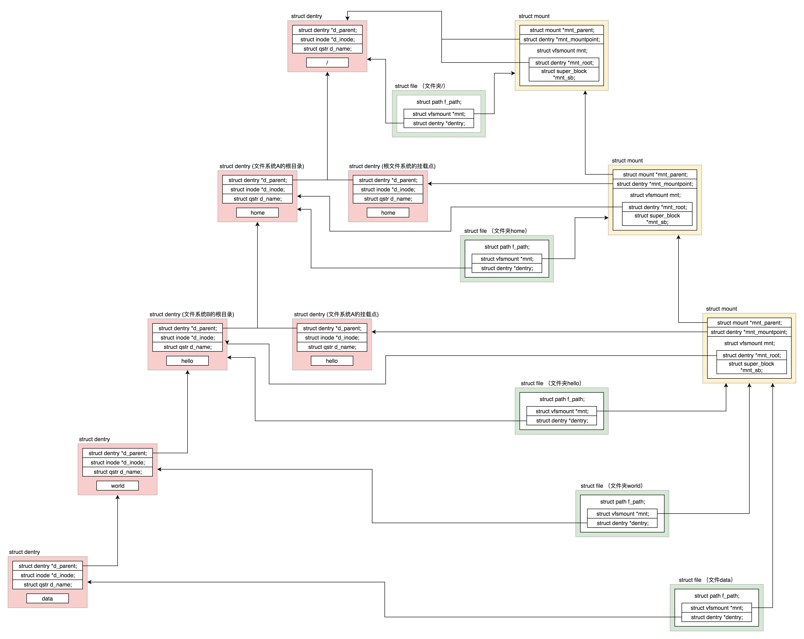
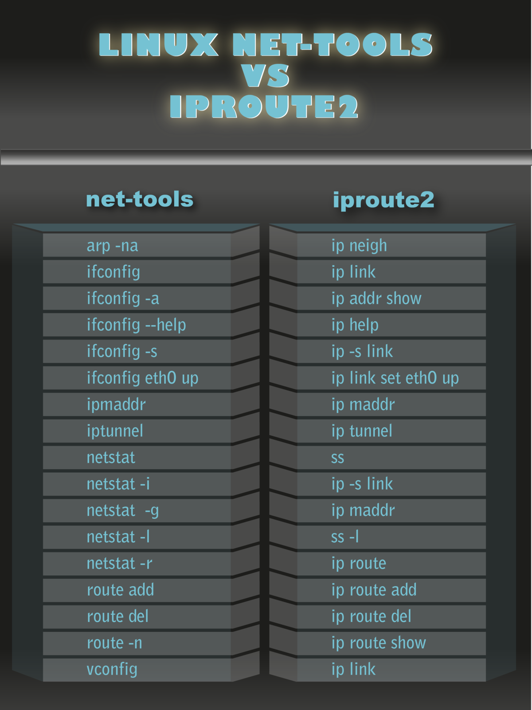

# 文件系统

主要需要弄清楚一下几个问题：

- 第一点，文件系统要有严格的组织形式，使得文件能够以块为单位进行存储
- 第二点，文件系统中要有索引区，用来方便查找一个文件分成的多个块都存放在了什么位置
- 第三点，如果文件系统中有的文件是热点文件，近期经常被读取和写入，文件系统应该有缓存层
- 第四点，文件应该用文件夹的形式组织起来，方便管理和查询
- 第五点，Linux 内核要在自己的内存里面维护一套数据结构，来保存哪些文件被哪些进程打开和使用


## 硬盘文件系统

### inode 与块的存储

硬盘分成相同大小的单元，我们称为**块**（Block）。一块的大小是扇区大小的整数倍**，默认是 4K**。在格式化的时候，这个值是可以设定的。一大块硬盘被分成了一个个小的块，用来存放文件的数据部分。


**inode**

但是这也带来一个新的问题，那就是文件的数据存放得太散，找起来就比较困难。我们是不是可以像图书馆那样，也设立一个索引区域，用来维护“某个文件分成几块、每一块在哪里“等等这些**基本信息**?另外，文件还有**元数据**部分，例如名字、权限等，这就需要一个结构**inode**来存放。

inode 的“i”是 index 的意思，其实就是“索引”，类似图书馆的索引区域。既然如此，我们**每个文件都会对应一个 inode；一个文件夹就是一个文件，也对应一个 inode**。

```c
struct ext4_inode {
	__le16	i_mode;		/* File mode */
	__le16	i_uid;		/* Low 16 bits of Owner Uid */
	__le32	i_size_lo;	/* Size in bytes */
	__le32	i_atime;	/* Access time */
	__le32	i_ctime;	/* Inode Change time */
	__le32	i_mtime;	/* Modification time */
	__le32	i_dtime;	/* Deletion Time */
	__le16	i_gid;		/* Low 16 bits of Group Id */
	__le16	i_links_count;	/* Links count */
	__le32	i_blocks_lo;	/* Blocks count */
	__le32	i_flags;	/* File flags */
......
	__le32	i_block[EXT4_N_BLOCKS];/* Pointers to blocks */
	__le32	i_generation;	/* File version (for NFS) */
	__le32	i_file_acl_lo;	/* File ACL */
	__le32	i_size_high;
......
};
```

- inode 里面有文件的读写权限 i_mode，属于哪个用户 i_uid，哪个组 i_gid，大小是多少 i_size_io，占用多少个块 i_blocks_io。咱们讲 ls 命令行的时候，列出来的权限、用户、大小这些信息，就是从这里面取出来的。

- 另外，这里面还有几个与文件相关的时间。i_atime 是 access time，是最近一次访问文件的时间；i_ctime 是 change time，是最近一次更改 inode 的时间；i_mtime 是 modify time，是最近一次更改文件的时间。

  这里需要注意区分几个地方

  - 首先，访问了，不代表修改了，也可能只是打开看看，就会改变 access time。
  - 其次，修改 inode，有可能修改的是用户和权限，没有修改数据部分，就会改变 change time。
  - 只有数据也修改了，才改变 modify time。


我们刚才说的“某个文件分成几块、每一块在哪里”，这些在 inode 里面，应该保存在 i_block 里面。

具体如何保存的呢？EXT4_N_BLOCKS 一共有 15 项。在 ext2 和 ext3 中，其中前 12 项直接保存了块的位置，也就是说，我们可以通过 i_block[0-11]，直接得到保存文件内容的块。


但是，如果一个文件比较大，12 块放不下。当我们用到 i_block[12] 的时候，就不能直接放数据块的位置了，要不然 i_block 很快就会用完了。我们可以让 i_block[12] 指向一个块，这个块里面不放数据块，而是放数据块的位置，这个块我们称为**间接块**。也就是说，我们在 i_block[12] 里面放间接块的位置，通过 i_block[12] 找到间接块后，间接块里面放数据块的位置，通过间接块可以找到数据块。

如果文件再大一些，i_block[13] 会指向一个块，我们可以用二次间接块。二次间接块里面存放了间接块的位置，间接块里面存放了数据块的位置，数据块里面存放的是真正的数据。如果文件再大一些，i_block[14] 会指向三次间接块。原理和上面都是一样的，就像一层套一层的俄罗斯套娃，一层一层打开，才能拿到最中心的数据块。

这里面有一个非常显著的问题，对于大文件来讲，我们要多次读取硬盘才能找到相应的块，这样访问速度就会比较慢。为了解决这个问题，ext4 做了一定的改变。它引入了一个新的概念，叫作**Extents**。

我们来解释一下 Extents。比方说，一个文件大小为 128M，如果使用 4k 大小的块进行存储，需要 32k 个块。如果按照 ext2 或者 ext3 那样散着放，数量太大了。但是 Extents 可以用于存放连续的块，也就是说，我们可以把 128M 放在一个 Extents 里面。这样的话，对大文件的读写性能提高了，文件碎片也减少了。


Exents 其实会保存成一棵树。树有一个个的节点，有叶子节点，也有分支节点。每个节点都有一个头，ext4_extent_header 可以用来描述某个节点。

```c
struct ext4_extent_header {
	__le16	eh_magic;	/* probably will support different formats */
	__le16	eh_entries;	/* number of valid entries */
	__le16	eh_max;		/* capacity of store in entries */
	__le16	eh_depth;	/* has tree real underlying blocks? */
	__le32	eh_generation;	/* generation of the tree */
};
```

- eh_entries 表示这个节点里面有多少项。

  这里的项分两种

  - 如果是叶子节点，这一项会直接指向硬盘上的连续块的地址，我们称为数据节点 ext4_extent；
  - 如果是分支节点，这一项会指向下一层的分支节点或者叶子节点，我们称为索引节点 ext4_extent_idx。

  这两种类型的项的大小都是 12 个 byte。

```c
/*
 * This is the extent on-disk structure.
 * It's used at the bottom of the tree.
 */
struct ext4_extent {
	__le32	ee_block;	/* first logical block extent covers */
	__le16	ee_len;		/* number of blocks covered by extent */
	__le16	ee_start_hi;	/* high 16 bits of physical block */
	__le32	ee_start_lo;	/* low 32 bits of physical block */
};
/*
 * This is index on-disk structure.
 * It's used at all the levels except the bottom.
 */
struct ext4_extent_idx {
	__le32	ei_block;	/* index covers logical blocks from 'block' */
	__le32	ei_leaf_lo;	/* pointer to the physical block of the next *
				 * level. leaf or next index could be there */
	__le16	ei_leaf_hi;	/* high 16 bits of physical block */
	__u16	ei_unused;
};
```

- 如果文件不大，inode 里面的 i_block 中，可以放得下一个 ext4_extent_header 和 4 项 ext4_extent。所以这个时候，eh_depth 为 0，也即 inode 里面的就是叶子节点，树高度为 0。

- 如果文件比较大，4 个 extent 放不下，就要分裂成为一棵树，eh_depth>0 的节点就是索引节点，**其中根节点深度最大**，在 inode 中。最底层 eh_depth=0 的是叶子节点。

除了根节点，其他的节点都保存在一个块 4k 里面，4k 扣除 ext4_extent_header 的 12 个 byte，剩下的能够放 340 项，每个 extent 最大能表示 128MB 的数据，340 个 extent 会使你的表示的文件达到 42.5GB。这已经非常大了，如果再大，我们可以增加树的深度。


### inode 位图和块位图

到这里，我们知道了，硬盘上肯定有一系列的 inode 和一系列的块排列起来。接下来的问题是，如果我要保存一个数据块，或者要保存一个 inode，我应该放在硬盘上的哪个位置呢？难道需要将所有的 inode 列表和块列表扫描一遍，找个空的地方随便放吗？

当然，这样效率太低了。所以在文件系统里面，我们专门弄了一个块来保存 inode 的位图。在这 4k 里面，每一位对应一个 inode。如果是 1，表示这个 inode 已经被用了；如果是 0，则表示没被用。同样，我们也弄了一个块保存 block 的位图。


### 文件系统的格式

数据块的位图是放在一个块里面的，共 4k。每位表示一个数据块，共可以表示 $4∗1024∗8=2^{15}$ 个数据块。如果每个数据块也是按默认的 4K，最大可以表示空间为 $2^{15}∗4∗1024=2^{27}$ 个 byte，也就是 128M。

也就是说按照上面的格式，如果采用“**一个块的位图 + 一系列的块**”，外加“**一个块的 inode 的位图 + 一系列的 inode 的结构**”，最多能够表示 128M。是不是太小了？现在很多文件都比这个大。我们先把这个结构称为一个**块组**。有 N 多的块组，就能够表示 N 大的文件。


**块组**

对于块组，我们也需要一个数据结构来表示为 ext4_group_desc。这里面对于一个块组里的 inode 位图 bg_inode_bitmap_lo、块位图 bg_block_bitmap_lo、inode 列表 bg_inode_table_lo，都有相应的成员变量。

这样一个个块组，就基本构成了我们整个文件系统的结构。因为块组有多个，块组描述符也同样组成一个列表，我们把这些称为**块组描述符表**。

当然，我们还需要有一个数据结构，对整个文件系统的情况进行描述，这个就是**超级块**ext4_super_block。这里面有整个文件系统一共有多少 inode，s_inodes_count；一共有多少块，s_blocks_count_lo，每个块组有多少 inode，s_inodes_per_group，每个块组有多少块，s_blocks_per_group 等。这些都是这类的全局信息。

对于整个文件系统，如果是一个启动盘，我们需要预留一块区域作为引导区，所以第一个块组的前面要留 1K，用于启动引导区。

最终，整个文件系统格式就是下面这个样子。


超级块和块组描述符表都是全局信息，而且这些数据很重要。如果这些数据丢失了，整个文件系统都打不开了，这比一个文件的一个块损坏更严重。所以，这两部分我们都需要备份，但是采取不同的策略。

默认情况下，超级块和块组描述符表**都有副本保存在每一个块组里**。如果开启了 sparse_super 特性，超级块和块组描述符表的副本只会保存在块组索引为 0、3、5、7 的整数幂里。除了块组 0 中存在一个超级块外，在块组 1（30=130=1）的第一个块中存在一个副本；在块组 3（31=331=3）、块组 5（51=551=5）、块组 7（71=771=7）、块组 9（32=932=9）、块组 25（52=2552=25）、块组 27（33=2733=27）的第一个 block 处也存在一个副本。

对于超级块来讲，由于超级块不是很大，所以就算我们备份多了也没有太多问题。但是，对于块组描述符表来讲，如果每个块组里面都保存一份完整的块组描述符表，一方面很浪费空间；另一个方面，由于一个块组最大 128M，而块组描述符表里面有多少项，这就限制了有多少个块组，128M * 块组的总数目是整个文件系统的大小，就被限制住了。


**Meta Block Groups 特性**

我们的改进的思路就是引入**Meta Block Groups 特性**。

首先，块组描述符表不会保存所有块组的描述符了，而是将块组分成多个组，我们称为元块组（Meta Block Group）。每个元块组里面的块组描述符表仅仅包括自己的，一个元块组包含 64 个块组，这样一个元块组中的块组描述符表最多 64 项。我们假设一共有 256 个块组，原来是一个整的块组描述符表，里面有 256 项，要备份就全备份，现在分成 4 个元块组，每个元块组里面的块组描述符表就只有 64 项了，这就小多了，而且四个元块组自己备份自己的。


根据图中，每一个元块组包含 64 个块组，块组描述符表也是 64 项，备份三份，在元块组的第一个，第二个和最后一个块组的开始处。

这样化整为零，我们就可以发挥出 ext4 的 48 位块寻址的优势了，在超级块 ext4_super_block 的定义中，我们可以看到块寻址分为高位和低位，均为 32 位，其中有用的是 48 位，2^48 个块是 1EB，足够用了。


### 目录的存储格式

目录本身也是个文件，也有 inode。inode 里面也是指向一些块。和普通文件不同的是，**普通文件的块里面保存的是文件数据，而目录文件的块里面保存的是目录里面一项一项的文件信息。这些信息我们称为 ext4_dir_entry**。从代码来看，有两个版本，在成员来讲几乎没有差别，只不过第二个版本 ext4_dir_entry_2 是将一个 16 位的 name_len，变成了一个 8 位的 name_len 和 8 位的 file_type。

```c
struct ext4_dir_entry {
	__le32	inode;			/* Inode number */
	__le16	rec_len;		/* Directory entry length */
	__le16	name_len;		/* Name length */
	char	name[EXT4_NAME_LEN];	/* File name */
};
struct ext4_dir_entry_2 {
	__le32	inode;			/* Inode number */
	__le16	rec_len;		/* Directory entry length */
	__u8	name_len;		/* Name length */
	__u8	file_type;
	char	name[EXT4_NAME_LEN];	/* File name */
};
```

在目录文件的块中，最简单的保存格式是列表，就是一项一项地将 ext4_dir_entry_2 列在那里。

每一项都会保存这个目录的下一级的文件的文件名和对应的 inode，通过这个 inode，就能找到真正的文件。第一项是“.”，表示当前目录，第二项是“…”，表示上一级目录，接下来就是一项一项的文件名和 inode。

有时候，如果一个目录下面的文件太多的时候，我们想在这个目录下找一个文件，按照列表一个个去找，太慢了，于是我们就添加了索引的模式。

如果在 inode 中设置 EXT4_INDEX_FL 标志，则目录文件的块的组织形式将发生变化，变成了下面定义的这个样子：

```c
struct dx_root
{
	struct fake_dirent dot;
	char dot_name[4];
	struct fake_dirent dotdot;
	char dotdot_name[4];
	struct dx_root_info
	{
		__le32 reserved_zero;
		u8 hash_version;
		u8 info_length; /* 8 */
		u8 indirect_levels;
		u8 unused_flags;
	}
	info;
	struct dx_entry	entries[0];
};
```

当然，首先出现的还是差不多的，第一项是“.”，表示当前目录；第二项是“…”，表示上一级目录，这两个不变。接下来就开始发生改变了。是一个 dx_root_info 的结构，其中最重要的成员变量是 indirect_levels，表示间接索引的层数。

接下来我们来看索引项 dx_entry。这个也很简单，其实就是文件名的哈希值和数据块的一个映射关系。

```c
struct dx_entry
{
	__le32 hash;
	__le32 block;
};
```

如果要查找一个目录下面的文件名，可以通过名称取哈希。如果哈希能够匹配上，就说明这个文件的信息在相应的块里面。然后打开这个块，如果里面不再是索引，而是索引树的叶子节点的话，那里面还是 ext4_dir_entry_2 的列表，我们只要一项一项找文件名就行。通过索引树，我们可以将一个目录下面的 N 多的文件分散到很多的块里面，可以很快地进行查找。


### 软链接和硬链接的存储格式

有一种特殊的文件格式，硬链接（Hard Link）和软链接（Symbolic Link）。所谓的链接（Link），我们可以认为是文件的别名，而链接又可分为两种，硬链接与软链接。


- 硬链接与原始文件共用一个 inode 的，但是 inode 是不跨文件系统的，每个文件系统都有自己的 inode 列表，因而硬链接是没有办法跨文件系统的。
- 而软链接不同，软链接相当于重新创建了一个文件。这个文件也有独立的 inode，只不过打开这个文件看里面内容的时候，内容指向另外的一个文件。这就很灵活了。我们可以跨文件系统，甚至目标文件被删除了，链接文件还是在的，只不过指向的文件找不到了而已。


### 总结

无论是文件夹还是文件，都有一个 inode。inode 里面会指向数据块，对于文件夹的数据块，里面是一个表，是下一层的文件名和 inode 的对应关系，文件的数据块里面存放的才是真正的数据。


## 虚拟文件系统

往文件系统里面读写数据的主要流程步骤：

- 在应用层，进程在进行文件读写操作时，可通过系统调用如 sys_open、sys_read、sys_write 等。
- 在内核，每个进程都需要为打开的文件，维护一定的数据结构。
- 在内核，整个系统打开的文件，也需要维护一定的数据结构。
- Linux 可以支持多达数十种不同的文件系统。它们的实现各不相同，因此 Linux 内核向用户空间提供了虚拟文件系统这个统一的接口，来对文件系统进行操作。它提供了常见的文件系统对象模型，例如 inode、directory entry、mount 等，以及操作这些对象的方法，例如 inode operations、directory operations、file operations 等。
- 然后就是对接的是真正的文件系统，例如 ext4 文件系统。
- 为了读写 ext4 文件系统，要通过块设备 I/O 层，也即 BIO 层。这是文件系统层和块设备驱动的接口。
- 为了加快块设备的读写效率，还有一个缓存层。
- 最下层是块设备驱动程序。


主要从4个系统调用入手，解析整个流程。

- mount 系统调用用于挂载文件系统；

- open 系统调用用于打开或者创建文件，创建要在 flags 中设置 O_CREAT，对于读写要设置 flags 为 O_RDWR；

- read 系统调用用于读取文件内容；

- write 系统调用用于写入文件内容。

  

### 挂载文件系统

内核是不是支持某种类型的文件系统，需要我们进行注册才能知道。例如 ext4 文件系统，就需要通过 register_filesystem 进行注册，传入的参数是 ext4_fs_type，表示注册的是 ext4 类型的文件系统。这里面最重要的一个成员变量就是 ext4_mount。如果一种文件系统的类型曾经在内核注册过，这就说明允许你挂载并且使用这个文件系统。


文件挂载系统从 mount 系统调用开始解析。调用链为 do_mount->do_new_mount->vfs_kern_mount

```c
struct vfsmount *
vfs_kern_mount(struct file_system_type *type, int flags, const char *name, void *data)
{
......
	mnt = alloc_vfsmnt(name);
......
	root = mount_fs(type, flags, name, data);
......
	mnt->mnt.mnt_root = root;
	mnt->mnt.mnt_sb = root->d_sb;
	mnt->mnt_mountpoint = mnt->mnt.mnt_root;
	mnt->mnt_parent = mnt;
	list_add_tail(&mnt->mnt_instance, &root->d_sb->s_mounts);
	return &mnt->mnt;
}
```

vfs_kern_mount 先是创建 struct mount 结构，**每个挂载的文件系统都对应于这样一个结构**。

```c
struct mount {
	struct hlist_node mnt_hash;
	struct mount *mnt_parent;
	struct dentry *mnt_mountpoint;
	struct vfsmount mnt;
	union {
		struct rcu_head mnt_rcu;
		struct llist_node mnt_llist;
	};
	struct list_head mnt_mounts;	/* list of children, anchored here */
	struct list_head mnt_child;	/* and going through their mnt_child */
	struct list_head mnt_instance;	/* mount instance on sb->s_mounts */
	const char *mnt_devname;	/* Name of device e.g. /dev/dsk/hda1 */
	struct list_head mnt_list;
......
} __randomize_layout;
 
 
struct vfsmount {
	struct dentry *mnt_root;	/* root of the mounted tree */
	struct super_block *mnt_sb;	/* pointer to superblock */
	int mnt_flags;
} __randomize_layout;
```

其中

- mnt_parent 是装载点所在的父文件系统
- mnt_mountpoint 是装载点在父文件系统中的 dentry；
- **struct dentry 表示目录，并和目录的 inode 关联；**
- mnt_root 是当前文件系统根目录的 dentry
- mnt_sb 是指向超级块的指针。


mount_fs 方法实际用来挂载文件系统，方法里调用的是 ext4_fs_type 的 mount 函数，也就是上面提到的 ext4_mount，从文件系统里面读取超级块。在文件系统的实现中，每个在硬盘上的结构，在内存中也对应相同格式的结构。当所有的数据结构都读到内存里面，内核就可以通过操作这些数据结构，来操作文件系统了。


例子：

假设根文件系统下面有一个目录 home，有另外一个文件系统 A 挂载在这个目录 home 下面。在文件系统 A 的根目录下面有另外一个文件夹 hello。由于文件系统 A 已经挂载到了目录 home 下面，所以我们就有了目录 /home/hello，然后有另外一个文件系统 B 挂在在 /home/hello 下面。在文件系统 B 的根目录下面有另外一个文件夹 world，在 world 下面有个文件夹 data。由于文件系统 B 已经挂载到了 /home/hello 下面，所以我们就有了目录 /home/hello/world/data。



[^疑问]: 这个图看的感觉不太对，文件系统B的挂载点呢？根文件系统挂载点与文件系统A的挂载点的层次对吗？

文件系统是树形关系。如果所有的文件夹都是几代单传，那就变成了一条线。你注意看图中的三条斜线。

- 第一条线是最左边的向左斜的**dentry 斜线**。每一个文件和文件夹都有 dentry，用于和 inode 关联。
- 第二条线是最右面的向右斜的**mount 斜线**，因为这个例子涉及两次文件系统的挂载，再加上启动的时候挂载的根文件系统，一共三个 mount。
- 第三条线是中间的向右斜的**file 斜线**，每个打开的文件都有一个 file 结构，它里面有两个变量，一个指向相应的 mount，一个指向相应的 dentry。


按层次来看

- 最上面往下看。根目录 / 对应一个 dentry，根目录是在根文件系统上的，根文件系统是系统启动的时候挂载的，因而有一个 mount 结构。这个 mount 结构的 mount point 指针和 mount root 指针都是指向根目录的 dentry。根目录对应的 file 的两个指针，一个指向根目录的 dentry，一个指向根目录的挂载结构 mount。

- 第二层。下一层目录 home 对应了两个 dentry，而且它们的 parent 都指向第一层的 dentry。这是为什么呢？这是因为文件系统 A 挂载到了这个目录下。这使得这个目录有两个用处。一方面，home 是根文件系统的一个挂载点；另一方面，home 是文件系统 A 的根目录。

  [^问题]: 文件系统 A 挂载到了 home 目录下，home 是根文件系统的一个挂载点？这个挂载点到底是A的挂载点还是根文件系统的挂载点？挂载点是怎么定义的？我在 home 目录下面再挂载一个 C 文件系统，又会是怎么样一个结构？

  因为还有一次挂载，因而又有了一个 mount 结构。这个 mount 结构的 mount point 指针指向作为挂载点的那个 dentry。mount root 指针指向作为根目录的那个 dentry，同时 parent 指针指向第一层的 mount 结构。home 对应的 file 的两个指针，一个指向文件系统 A 根目录的 dentry，一个指向文件系统 A 的挂载结构 mount。

- 第三层。目录 hello 又挂载了一个文件系统 B，所以第三层的结构和第二层几乎一样。
- 第四层。目录 world 就是一个普通的目录。只要它的 dentry 的 parent 指针指向上一层就可以了。我们来看 world 对应的 file 结构。由于挂载点不变，还是指向第三层的 mount 结构。
- 第五层。对于文件 data，是一个普通的文件，它的 dentry 的 parent 指向第四层的 dentry。对于 data 对应的 file 结构，由于挂载点不变，还是指向第三层的 mount 结构。


### 打开文件

打开文件从 Open 系统调用开始。open 系统调用打开文件，最终对调用到内核的系统调用实现 sys_open。

```c
SYSCALL_DEFINE3(open, const char __user *, filename, int, flags, umode_t, mode)
{
......
	return do_sys_open(AT_FDCWD, filename, flags, mode);
}
 
 
long do_sys_open(int dfd, const char __user *filename, int flags, umode_t mode)
{
......
	fd = get_unused_fd_flags(flags);
	if (fd >= 0) {
		struct file *f = do_filp_open(dfd, tmp, &op);
		if (IS_ERR(f)) {
			put_unused_fd(fd);
			fd = PTR_ERR(f);
		} else {
			fsnotify_open(f);
			fd_install(fd, f);
		}
	}
	putname(tmp);
	return fd;
}
```

- 打开一个文件，首先要通过 get_unused_fd_flags 得到一个没有用的文件描述符。
  - 在每一个进程的 task_struct 中，有一个指针 files，类型是 files_struct。
  - files_struct 里面最重要的是一个文件描述符列表，每打开一个文件，就会在这个列表中分配一项，下标就是文件描述符。
  - 对于任何一个进程，默认情况下，文件描述符 0 表示 stdin 标准输入，文件描述符 1 表示 stdout 标准输出，文件描述符 2 表示 stderr 标准错误输出。另外，再打开的文件，都会从这个列表中找一个空闲位置分配给它。
  - 文件描述符列表的每一项都是一个指向 struct file 的指针，也就是说，每打开一个文件，都会有一个 struct file 对应。

- do_sys_open 中调用 do_filp_open，就是创建这个 struct file 结构，然后 fd_install(fd, f) 是将文件描述符和这个结构关联起来。

```c
struct file *do_filp_open(int dfd, struct filename *pathname,
		const struct open_flags *op)
{
......
	set_nameidata(&nd, dfd, pathname);
	filp = path_openat(&nd, op, flags | LOOKUP_RCU);
......
	restore_nameidata();
	return filp;
}
```

do_filp_open 里面首先初始化了 struct nameidata 这个结构。我们知道，文件都是一串的路径名称，需要逐个解析。这个结构就是解析和查找路径的时候做辅助作用。

在 struct nameidata 里面有一个关键的成员变量 struct path。

```c
struct path {
	struct vfsmount *mnt;
	struct dentry *dentry;
} __randomize_layout;
```

其中

- struct vfsmount 和文件系统的挂载有关。
- 另一个 struct dentry，除了上面说的用于标识目录之外，还可以表示文件名，还会建立了文件名及其 inode 之间的关联。


接下来就调用 path_openat，主要做了以下几件事情：

- get_empty_filp 生成一个 struct file 结构；
- path_init 初始化 nameidata，准备开始节点路径查找；
- link_path_walk 对于路径名逐层进行节点路径查找，这里面有一个大的循环，用“/”分隔逐层处理；
- do_last 获取文件对应的 inode 对象，并且初始化 file 对象。


在这里面，我们需要先查找文件路径最后一部分对应的 dentry。

Linux 为了提高目录项对象的处理效率，设计与实现了目录项高速缓存 dentry cache，简称 dcache。它主要由两个数据结构组成：

- 哈希表 dentry_hashtable：dcache 中的所有 dentry 对象都通过 d_hash 指针链到相应的 dentry 哈希链表中；

- 未使用的 dentry 对象链表 s_dentry_lru：dentry 对象通过其 d_lru 指针链入 LRU 链表中。LRU 的意思是最近最少使用。只要有它，就说明长时间不使用，就应该释放了。

  这两个列表之间会产生复杂的关系：

  - 引用为 0：一个在散列表中的 dentry 变成没有人引用了，就会被加到 LRU 表中去；
  - 再次被引用：一个在 LRU 表中的 dentry 再次被引用了，则从 LRU 表中移除；
  - 分配：当 dentry 在散列表中没有找到，则从 Slub 分配器中分配一个；
  - 过期归还：当 LRU 表中最长时间没有使用的 dentry 应该释放回 Slub 分配器；
  - 文件删除：文件被删除了，相应的 dentry 应该释放回 Slub 分配器；
  - 结构复用：当需要分配一个 dentry，但是无法分配新的，就从 LRU 表中取出一个来复用。

所以，do_last() 在查找 dentry 的时候，当然先从缓存中查找，调用的是 lookup_fast。

如果缓存中没有找到，就需要真的到文件系统里面去找了，lookup_open 会创建一个新的 dentry，并且调用上一级目录的 Inode 的 inode_operations 的 lookup 函数，对于 ext4 来讲，调用的是 ext4_lookup，会到咱们上一节讲的文件系统里面去找 inode。最终找到后将新生成的 dentry 付给 path 变量。

do_last() 的最后一步是调用 vfs_open 真正打开文件。

- vfs_open 里面最终要做的一件事情是，调用 f_op->open，也就是调用 ext4_file_open。
- 另外一件重要的事情是将打开文件的所有信息，填写到 struct file 这个结构里面。


### 总结


- 对于每一个进程，打开的文件都有一个文件描述符，在 files_struct 里面会有文件描述符数组。每个一个文件描述符是这个数组的下标，里面的内容指向一个 file 结构，表示打开的文件。这个结构里面有这个文件对应的 inode，最重要的是这个文件对应的操作 file_operation。如果操作这个文件，就看这个 file_operation 里面的定义了。
- 对于每一个打开的文件，都有一个 dentry 对应，虽然叫作 directory entry，但是不仅仅表示文件夹，也表示文件。它最重要的作用就是指向这个文件对应的 inode。
- 如果说 file 结构是一个文件打开以后才创建的，dentry 是放在一个 dentry cache 里面的，文件关闭了，他依然存在，因而他可以更长期的维护内存中的文件的表示和硬盘上文件的表示之间的关系。
- inode 结构就表示硬盘上的 inode，包括块设备号等。
- 几乎每一种结构都有自己对应的 operation 结构，里面都是一些方法，因而当后面遇到对于某种结构进行处理的时候，如果不容易找到相应的处理函数，就先找这个 operation 结构，就清楚了。


# 常用命令

// todo 文章后面的留下的问题中还有大量的命令需要积累。


## TOP

> [linux top命令查看内存及多核CPU的使用讲述](https://www.cnblogs.com/dragonsuc/p/5512797.html)

Linux top命令用于实时显示 process 的动态。

**参数说明**：

- d : 改变显示的更新速度，或是在交谈式指令列( interactive command)按 s
- q : 没有任何延迟的显示速度，如果使用者是有 superuser 的权限，则 top 将会以最高的优先序执行
- c : 切换显示模式，共有两种模式，一是只显示执行档的名称，另一种是显示完整的路径与名称
- S : 累积模式，会将己完成或消失的子行程 ( dead child process ) 的 CPU time 累积起来
- s : 安全模式，将交谈式指令取消, 避免潜在的危机
- i : 不显示任何闲置 (idle) 或无用 (zombie) 的行程
- n : 更新的次数，完成后将会退出 top
- b : 批次档模式，搭配 "n" 参数一起使用，可以用来将 top 的结果输出到档案内
- -p: 监控特定的PID，你可以用-p选项监控指定的PID。PID的值为0将被作为top命令自身的PID。


例如：

`top -c`在查看命令（最后一栏）那一栏可以看到完成的执行命令路径。

`top -Hp 3033` 显示一个进程的线程运行信息列表。按下P,进程按照Cpu使用率排序


## PS

process status命令用于显示当前进程的状态，类似于 windows 的任务管理器。

**参数说明**：

- ps 的参数非常多, 在此仅列出几个常用的参数并大略介绍含义

- -A 列出所有的进程

- ps -e 此参数的效果和指定"A"参数相同

- -w 显示加宽可以显示较多的资讯

- -au 显示较详细的资讯

- -aux 显示所有包含其他使用者的行程

- -f 带有完整的命令行路径

- au(x) 输出格式 :

  ```
  USER PID %CPU %MEM VSZ RSS TTY STAT START TIME COMMAND
  ```

  - USER: 行程拥有者
  - PID: pid
  - %CPU: 占用的 CPU 使用率
  - %MEM: 占用的记忆体使用率
  - VSZ: 占用的虚拟记忆体大小
  - RSS: 占用的记忆体大小
  - TTY: 终端的次要装置号码 (minor device number of tty)
  - STAT: 该行程的状态:
    - D:  无法中断的休眠状态 (通常 IO 的进程)
    - R: 正在执行中
    - S: 静止状态
    - T: 暂停执行
    - Z: 不存在但暂时无法消除
    - W: 没有足够的记忆体分页可分配
    - <: 高优先序的行程
    - N: 低优先序的行程
    - L: 有记忆体分页分配并锁在记忆体内 (实时系统或捱A I/O)
  - START: 行程开始时间
  - TIME: 执行的时间
  - COMMAND:所执行的指令

  

最常用的`ps -ef|grep keyword`：显示所有命令，连带命令行


## 端口相关

> [Linux 查看端口占用情况](https://www.runoob.com/w3cnote/linux-check-port-usage.html)

### netstat

Linux netstat 命令用于显示网络状态。

**参数说明**：

- -a或--all   显示所有连线中的Socket。
- -A<网络类型>或--<网络类型>   列出该网络类型连线中的相关地址。
- -c或--continuous   持续列出网络状态。
- -C或--cache   显示路由器配置的快取信息。
- -e或--extend   显示网络其他相关信息。
- -F或--fib   显示路由缓存。
- -g或--groups   显示多重广播功能群组组员名单。
- -h或--help   在线帮助。
- -i或--interfaces   显示网络界面信息表单。
- -l或--listening   显示监控中的服务器的Socket。
- -M或--masquerade   显示伪装的网络连线。
- -n或--numeric   直接使用IP地址，而不通过域名服务器。
- -N或--netlink或--symbolic   显示网络硬件外围设备的符号连接名称。
- -o或--timers   显示计时器。
- -p或--programs   显示正在使用Socket的程序识别码和程序名称。
- -r或--route   显示Routing Table。
- -s或--statistics   显示网络工作信息统计表。
- -t或--tcp   显示TCP传输协议的连线状况。
- -u或--udp   显示UDP传输协议的连线状况。
- -v或--verbose   显示指令执行过程。
- -V或--version   显示版本信息。
- -w或--raw   显示RAW传输协议的连线状况。
- -x或--unix   此参数的效果和指定"-A unix"参数相同。
- --ip或--inet   此参数的效果和指定"-A inet"参数相同。


`netstat -tunlp|grep port`：其实可以展示tcp的源和目标ip:port，然后grep去查找


### lsof

lsof(list open files)是一个列出当前系统打开文件的工具。

**参数说明**：

-a 列出打开文件存在的进程

-c<进程名> 列出指定进程所打开的文件

-g 列出GID号进程详情

-d<文件号> 列出占用该文件号的进程

+d<目录> 列出目录下被打开的文件

+D<目录> 递归列出目录下被打开的文件

-n<目录> 列出使用NFS的文件

-i<条件> 列出符合条件的进程。（4、6、协议、:端口、 @ip ）

-p<进程号> 列出指定进程号所打开的文件

-u 列出UID号进程详情

-h 显示帮助信息

-v 显示版本信息


`lsof -i:端口号`：lsof  查看端口占用

```sh
# lsof -i:8000
COMMAND   PID USER   FD   TYPE   DEVICE SIZE/OFF NODE NAME
nodejs  26993 root   10u  IPv4 37999514      0t0  TCP *:8000 (LISTEN)
```

lsof输出各列信息的意义如下：

COMMAND：进程的名称 PID：进程标识符

USER：进程所有者

FD：文件描述符，应用程序通过文件描述符识别该文件。如cwd、txt等 TYPE：文件类型，如DIR、REG等

DEVICE：指定磁盘的名称

SIZE：文件的大小

NODE：索引节点（文件在磁盘上的标识）

NAME：打开文件的确切名称


## ip相关



## df

disk free 命令用于显示目前在 Linux 系统上的文件系统磁盘使用情况统计。

**参数说明**：

- 文件-a, --all 包含所有的具有 0 Blocks 的文件系统
- 文件--block-size={SIZE} 使用 {SIZE} 大小的 Blocks
- 文件-h, --human-readable 使用人类可读的格式(预设值是不加这个选项的...)
- 文件-H, --si 很像 -h, 但是用 1000 为单位而不是用 1024
- 文件-i, --inodes 列出 inode 资讯，不列出已使用 block
- 文件-k, --kilobytes 就像是 --block-size=1024
- 文件-l, --local 限制列出的文件结构
- 文件-m, --megabytes 就像 --block-size=1048576
- 文件--no-sync 取得资讯前不 sync (预设值)
- 文件-P, --portability 使用 POSIX 输出格式
- 文件--sync 在取得资讯前 sync
- 文件-t, --type=TYPE 限制列出文件系统的 TYPE
- 文件-T, --print-type 显示文件系统的形式
- 文件-x, --exclude-type=TYPE 限制列出文件系统不要显示 TYPE
- 文件-v (忽略)
- 文件--help 显示这个帮手并且离开
- 文件--version 输出版本资讯并且离开

`df -h`


## free

free指令会显示内存的使用情况，包括实体内存，虚拟的交换文件内存，共享内存区段，以及系统核心使用的缓冲区等。

**参数说明**：

- -b 　以Byte为单位显示内存使用情况。

- -k 　以KB为单位显示内存使用情况。

- -m 　以MB为单位显示内存使用情况。

- -h 　以合适的单位显示内存使用情况，最大为三位数，自动计算对应的单位值。单位有：

  ```
  B = bytes
  K = kilos
  M = megas
  G = gigas
  T = teras
  ```

- -o 　不显示缓冲区调节列。

- -s<间隔秒数> 　持续观察内存使用状况。

- -t 　显示内存总和列。

- -V 　显示版本信息。

`free -h`

