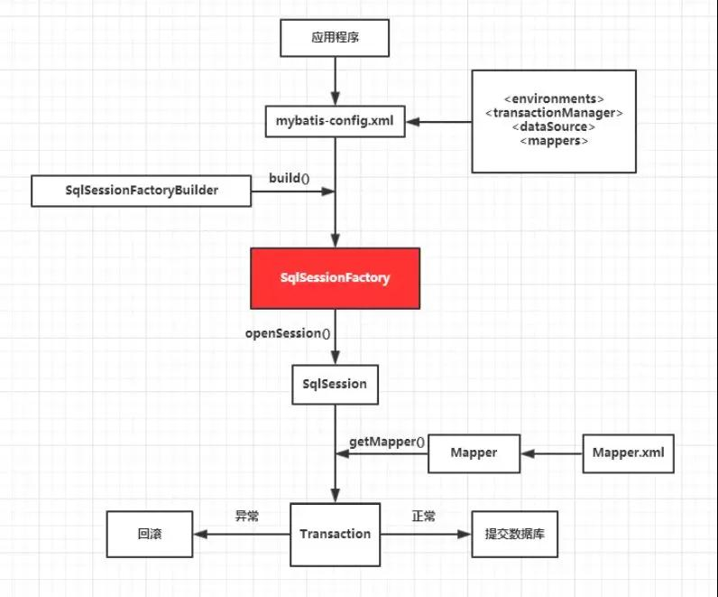

# 综述


# Mybati核心组件

- SqlSession：mybatis最核心的组件，可以发送sql去执行并返回结果，也可以获取Mapper接口。类似于jdbc的Connection对象
- SqlSessionFactory：创建SqlSession的工厂类，包含所有创建SqlSession实例的方法
- SqlSessionFactoryBuilder: 根据配置信息Configuration或代码构建SqlSessionFactory对象
- SQL Mapper：由Java接口和xml文件构成，并给出对应的sql和映射规则，负责发送sql执行并返回


> ## SqlSession

- 每个线程都应该有他自己的SqlSession实例
- 是一个接口类，扮演门面的作用，真正干活的是Executor接口
- 生命周期在请求数据库处理事务的过程中，**不是线程安全**的对象，不能作为类的静态变量。多线程要小心
- 每次使用时打开一个SqlSession，操作完就关闭它


# Mybatis Spring

> ## SqlSessionFactoryBean

- 原生Mybatis中，通过SqlSessionFactoryBuilder创建SqlSessionFactory。而mybati-spring中由SqlSessionFactoryBean创建
- SqlSessionFactoryBean实现了spring的FactoryBean接口
- 它必须注入dataSource属性


> ## SqlSession

- 原生mybatis中，通过SqlSessionFactory获取SqlSession，在mybatis-spring中，不再需要直接使用SqlSessionFactory，因为SqlSession已经以线程安全的Bean的方式自动注入了
- **SqlSessionTemplate**是mybatis-spring的核心，实现了SqlSession接口，负责管理SqlSession。它是线程安全的，可以被多个Dao调用。还负责SqlSession的的生命周期，包括关闭，提交和回滚操作
- SqlSessionTemplate被设计用于替换默认的DefaultSqlSession


> ## 注入映射器

- 为了代替手工调用SqlSessionTemplate编写DAO层业务代码，mybatis-spring提供了动态代理的实现类：MapperFactoryBean，该类是设计成泛型，将mapper接口类自动注入到service类中，无需自己写实现类，内部会自动创建代理

- MapperFactoryBean创建的代理类实现了UserMapper接口，并注入到应用程序中
- 为了代替手工注册每个映射器，可以使用MapperScannerConfigurer，它会创建路径下所有映射器，被自动创建MapperFactoryBean


# Mybatis SpringBoot Starter

- 基于springboot快速构建mybatis应用程序
- 使用mybatis-spring，我们需要在xml中配置SqlSessionFactory和mapper映射接口
- 使用mybatis-springboot-starter，会自动检测dataSource，并根据数据源，使用SqlSessionFactoryBean自动创建并注册一个SqlSessionFactory，同时将创建SqlSessionTemplate，自动扫描mapper，关联到SqlSessionTemplate并注入到容器中
- 默认扫描所有带@Mapper的接口，自定义扫描某些包，需要使用@MapperSacn注解

- 访问数据库层，最基本的接口是SqlSession，它的默认实现为DefaultSqlSession, 在mybatis-spring中使用SqlSessionTemplate
- SqlSession通过SqlSessionFactory工厂来创建，而sqlSessionFactory通过建造者SqlSessionFactoryBuilder创建

- SqlSessionFactoryBuilder是通用的构造类类，通过它构造出SqlSessionFactory。可以手工直接调用SqlSessionFactoryBuilder。

- mybatis为了和spring集成，提供了mybatis-spring这个jar包。提供的SqlSessionFactoryBean类，内部封装了对SqlSessionFactoryBuilder的调用

- springboot进一步提供了MybatisAutoConfiguration做自动配置，内部的sqlSessionFactory方法，最终调用了SqlSessionFactoryBean

- Configuration提供两类数据，一类是输入类：Environment，通过给定的配置文件，将配置信息


> ## SqlSessionFactory

1. buildSqlSessionFactory内部创建了XMLConfigBuilder，用于解析mybatis的配置文件
2. 解析的配置文件的根为configuration，然后依次解析子标签：包括最重要的mappers标签。这部分的解析和前面介绍的配置文件说明是一一对应的，所有标签都有对应的解析标签的代码
3. 对mapper文件的解析，内部又具体调用了XMLMapperBuilder类的parse方法。这部分的解析与前面介绍的mapper配置文件说明也是一一对应的
4. 解析mapper文件时，从根元素mapper开始，包括子节点cache，parameterMap，resultMap，select等。然后将解析的信息都保存到Configuration对象中。
5. 解析完之后，放入一个map中，每条sql语句对应一个MappedStatement对象。其他属性的解析类似，大多是放到map中。
6. 解析完所有的配置文件，得到Configuration对象，将它作为参数传给SqlSessionFactoryBuilder的build方法
7. SqlSessionFactoryBuilder内部根据Configuration参数，创建DefaultSqlSessionFactory类。
8. DefaultSqlSessionFactory构造函数只是将Configuration保存了下来，当需要获取session时，根据内部的configuration去具体创建


> ## SqlSessionTemplate

1. 得到SqlSessionFactory后，根据它去创建SqlSessionTemplate。
2. SqlSessionTemplate内部创建SqlSession的代理类，将没有加事务的SqlSession的操作做强制提交。


# Map 与 动态代理

Dao层都是是一些接口 它并没有实现类，为什么接口可以直接使用呢? 那是因为MyBbatis使用了JDK动态代理机制动态生成了代理类，那么代理类又是如何对SqlSession进行封装的呢?
> ## 注册mapper并创建代理类
1. MapperScanConfiguration这个bean，扫描给定包下所有的mapper文件，并注册到MapperRegistry中。
2. MapperRegistry中的addMappers方法将包名下**每个mapper类**创建一个MapperProxyFactory，放入map中。
3. 获取mapper时，从map中找到对应的MapperProxyFactory，并将sqlSession参数传给newInstance，创建出代理类
4. 创建代理类调用了JDK的动态代理方法，被代理类为DAO接口，代理类为MapperProxy。
5. MapperProxy实现了InvocationHandler，重写invoke方法。该方法主要调用MapperMethod的execute方法。
6. MapperMethod的创建需要三个参数：**DAO接口本身**，**方法类**，Configuration对象。
7. MapperMethod内部新建了两个类：**SqlCommand**，**MethodSignature**。
8. SqlCommand主要保存了要查询的这个接口方法的方法名称和SQL查询类型，这两个值都需要先查询MappedStatemen。
9. MethodSignature主要保存参数，返回值，返回类型等信息，主要解析Method类。
10. MapperMethod执行execute时，就是根据前面创建的SqlCommand和MethodSignature的一些属性执行不同的操作，这些操作都调用了SqlSession接口。


> ## 获取mapper并执行

1. mapper的注册前面介绍了是通过MapperRegistry的addMappers方法，而获取mapper的方法是getMapper，那么谁来调用这个getMapper方法呢？
2. 当我们再service中使用@Autowired注解获取某个mapper接口时，实际上是调用了spring为我们自动注入的bean，这个操作是由MapperFactoryBean泛型类来完成。同SqlSessionFactoryBean一样，MapperFactoryBean实现了FactoryBean接口，所以getBean获取实例时实际调用他的getObject方法。getObejct内部通过sqlSession调用getMapper方法，避免了原生mybatis中每次手动通过sqlSession调用getMapper方法。 
3. session对象是MapperFactoryBean的父类SqlSessionDaoSupport的属性，内部具体实现类是SqlSessionTemplate。
4. SqlSessionTemplate的getMapper方法，实际调用的是Configuration的getMapper方法。
5. Configuration中的getMapper方法调用的就是前面的MapperRegistry类中注册进去所有进行了动态代理后，放入一个map的对象


# 缓存

大体就是首先根据你的sqlid，参数的信息自己算出一个key值，然后你查询的时候，会先把这个key值去缓存中找看有没有value，如果有，直接返回出来，就不查询db了。如果没有，那么查询db，然后将key，value保存到缓存中，以便下次使用。


> ## mybatis的一级缓存是基于sqlsession为生命周期的

当你这个session没有了，缓存就没有了，其次当你sql执行！isselect语句的时候，缓存也会被直接全部清理掉以保证数据一致性。


> ## mybatis的二级缓存是基于application为生命周期的

**不推荐使用**

范围是按照每个namepace一个缓存来存贮和维护，同一个namespace放到一个缓存对象中，当这个namaspace中执行了！isselect语句的时候，整个namespace中的缓存全部清除掉。


例如：

在UserMapper.xml中有大多数针对user表的操作。但是在一个XXXMapper.xml中，还有针对user单表的操作。这会导致user在两个命名空间下的数据不一致。如果在UserMapper.xml中做了刷新缓存的操作，在XXXMapper.xml中缓存仍然有效，如果有针对user的单表查询，使用缓存的结果可能会不正确。

更危险的情况是在XXXMapper.xml做了insert,update,delete操作时，会导致UserMapper.xml中的各种操作充满未知和风险。


[mybatis 学习五 二级缓存不推荐使用](https://www.cnblogs.com/liouwei4083/p/6025929.html)


# Mybatis与设计模式

Builder模式，例如SqlSessionFactoryBuilder、XMLConfigBuilder、XMLMapperBuilder、XMLStatementBuilder、CacheBuilder；

工厂模式，例如SqlSessionFactory、ObjectFactory、MapperProxyFactory；

单例模式，例如ErrorContext和LogFactory；

代理模式，Mybatis实现的核心，比如MapperProxy、ConnectionLogger，用的jdk的动态代理；还有executor.loader包使用了cglib或者javassist达到延迟加载的效果；

组合模式，例如SqlNode和各个子类ChooseSqlNode等；

模板方法模式，例如BaseExecutor和SimpleExecutor，还有BaseTypeHandler和所有的子类例如IntegerTypeHandler；

适配器模式，例如Log的Mybatis接口和它对jdbc、log4j等各种日志框架的适配实现；

装饰者模式，例如Cache包中的cache.decorators子包中等各个装饰者的实现；

迭代器模式，例如迭代器模式PropertyTokenizer；


# 常见问题

> ####  Ibatis和Mybatis？

Ibatis：2010年，apache的Ibatis框架停止更新，并移交给了google团队，同时更名为MyBatis。从2010年后Ibatis在没更新过，彻底变成了一个孤儿框架。一个没人维护的框架注定被mybatis拍在沙滩上。

Mybatis：Ibatis的升级版本。


> ####  什么是Mybatis的接口绑定，有什么好处？

Mybatis实现了DAO接口与xml映射文件的绑定，自动为我们生成接口的具体实现，使用起来变得更加省事和方便。


> ####  什么情况用注解，什么情况用xml绑定？

注解使用情况：Sql语句简单时

xml绑定使用情况：xml绑定 (@RequestMap用来绑定xml文件)


> ####  Mybatis在核心处理类叫什么?

SqlSession 


> ####  查询表名和返回实体Bean对象不一致，如何处理？

映射键值对即可

```
<result column="title" property="title" javaType="java.lang.String"/>
```

column：数据库中表的列名

property：实体Bean中的属性名


> ####  Mybatis的好处？

把Sql语句从Java中独立出来。

封装了底层的JDBC，API的调用，并且能够将结果集自动转换成JavaBean对象，简化了Java数据库编程的重复工作。

自己编写Sql语句，更加的灵活。

入参无需用对象封装（或者map封装）,使用@Param注解


> #### Mybatis配置一对多？

```
<collection property="topicComment" column="id" ofType="com.tmf.bbs.pojo.Comment" select="selectComment" />
```

property：属性名

column：共同列

ofType：集合中元素的类型

select：要连接的查询


> #### Mybatis配置一对一？

```
<association property="topicType" select="selectType" column="topics_type_id" javaType="com.tmf.bbs.pojo.Type"/>
```

property：属性名

select：要连接的查询

column：共同列

javaType：集合中元素的类型


> #### ${} 和 #{}的区别？

  ${}：简单字符串替换，把${}直接替换成变量的值，不做任何转换，这种是取值以后再去编译SQL语句。

  \#{}：预编译处理，sql中的#{}替换成？，补全预编译语句，有效的防止Sql语句注入，这种取值是编译好SQL语句再取值。

  总结：一般用#{}来进行列的代替


> #### Xml映射文件中，除了常见的select|insert|updae|delete标签之外，还有哪些标签？

  还有很多其他的标签，<resultMap>、<parameterMap>、<sql>、<include>、<selectKey>，加上动态sql的9个标签，trim|where|set|foreach|if|choose|when|otherwise|bind等，其中<sql>为sql片段标签，通过<include>标签引入sql片段，<selectKey>为不支持自增的主键生成策略标签。


> #### 获取上一次自动生成的主键值？

```
select last _insert_id()
```


> #### Mybatis如何分页，分页原理？

- Mybatis使用RowBounds对象进行分页，它是针对ResultSet结果集执行的内存分页，而非物理分页，可以在sql内直接书写带有物理分页的参数来完成物理分页功能，也可以使用分页插件来完成物理分页。

- 分页插件的基本原理是使用Mybatis提供的插件接口，实现自定义插件，在插件的拦截方法内拦截待执行的sql，然后重写sql，根据dialect方言，添加对应的物理分页语句和物理分页参数。


1. 全部取出，内存中进行分页

2. sql，使用limit

3. 拦截器分页，使用插件

4. RowBounds实现分页

   通过RowBounds实现分页和通过数组方式分页原理差不多，都是一次获取所有符合条件的数据，然后在内存中对大数据进行操作，实现分页效果。只是数组分页需要我们自己去实现分页逻辑，这里更加简化而已。


> #### mybatis 是否支持延迟加载？延迟加载的原理是什么？

可以

[【MyBatis学习11】MyBatis中的延迟加载](https://blog.csdn.net/eson_15/article/details/51668523)


> #### mybatis 有哪些执行器（Executor）？

SimpleExecutor、ReuseExecutor、BatchExecutor。

**SimpleExecutor：**每执行一次update或select，就开启一个Statement对象，用完立刻关闭Statement对象。

**ReuseExecutor：**执行update或select，以sql作为key查找Statement对象，存在就使用，不存在就创建，用完后，不关闭Statement对象，而是放置于Map内，供下一次使用。简言之，就是重复使用Statement对象。

**BatchExecutor：**执行update（没有select，JDBC批处理不支持select），将所有sql都添加到批处理中（addBatch()），等待统一执行（executeBatch()），它缓存了多个Statement对象，每个Statement对象都是addBatch()完毕后，等待逐一执行executeBatch()批处理。与JDBC批处理相同。

作用范围：Executor的这些特点，都严格限制在SqlSession生命周期范围内。


[mybatis都有哪些Executor执行器？它们之间的区别是什么？](https://www.jianshu.com/p/96ddaec4aea7)


> #### 简单的说一下MyBatis的一级缓存和二级缓存？

- Mybatis首先去缓存中查询结果集，如果没有则查询数据库，如果有则从缓存取出返回结果集就不走数据库。Mybatis内部存储缓存使用一个HashMap，key为**hashCode+sqlId+Sql**语句。value为从查询出来映射生成的**java对象**
- Mybatis的二级缓存即查询缓存，它的作用域是一个mapper的namespace，即在同一个namespace中查询sql可以从缓存中获取数据。二级缓存是可以跨SqlSession的。


> #### Mybatis的Xml映射文件中，不同的Xml映射文件，id是否可以重复？

- 不同的Xml映射文件，如果配置了namespace，那么id可以重复；如果没有配置namespace，那么id不能重复；毕竟namespace不是必须的，只是最佳实践而已。
- 原因就是namespace+id是作为Map<String, MappedStatement>的key使用的，如果没有namespace，就剩下id，那么，id重复会导致数据互相覆盖。有了namespace，自然id就可以重复，namespace不同，namespace+id自然也就不同。


> #### 最佳实践中，通常一个Xml映射文件，都会写一个Dao接口与之对应，请问，这个Dao接口的工作原理是什么？Dao接口里的方法，参数不同时，方法能重载吗？

  答：Dao接口，就是人们常说的Mapper接口，接口的全限名，就是映射文件中的namespace的值，接口的方法名，就是映射文件中MappedStatement的id值，接口方法内的参数，就是传递给sql的参数。Mapper接口是没有实现类的，当调用接口方法时，**接口全限名+方法名**拼接字符串作为key值，可唯一定位一个MappedStatement，举例：com.mybatis3.mappers.StudentDao.findStudentById，可以唯一找到namespace为com.mybatis3.mappers.StudentDao下面id   = findStudentById的MappedStatement。在Mybatis中，每一个<select>、<insert>、<update>、<delete>标签，都会被解析为一个MappedStatement对象。

  Dao接口里的方法，是不能重载的，因为是全限名+方法名的保存和寻找策略。

  Dao接口的工作原理是JDK动态代理，Mybatis运行时会使用JDK动态代理为Dao接口生成代理proxy对象，代理对象proxy会拦截接口方法，转而执行MappedStatement所代表的sql，然后将sql执行结果返回。


> #### Mybatis工作原理？




[Mybatis常见面试题(转)](https://www.cnblogs.com/huajiezh/p/6415388.html)


> #### 源码解析

[mybatis原理，配置介绍及源码分析](https://juejin.im/post/5bd02b3d6fb9a05cee1e2478)

- mybatis核心组件有哪些？它是工作原理是什么？

- mybatis配置文件各个参数是什么含义？

- mybatis只添加了接口类，没有实现类，为什么可以直接查询呢？

- mybatis的mapper映射文件各个参数又是什么含义？

- mybatis-spring提供哪些机制简化了原生mybatis？

- mybatis-springboot-starter又是如何简化进一步让mybatis使用如此方便？代码调用流程是怎么样的？


## Mybatis 接口 Mapper 内的方法为啥不能重载？

原因：在投鞭断流时，Mybatis使用package+Mapper+method全限名作为key，去xml内寻找唯一sql来执行的。类似：key=x.y.UserMapper.getUserById，那么，重载方法时将导致矛盾。对于Mapper接口，Mybatis禁止方法重载（overLoad）。

