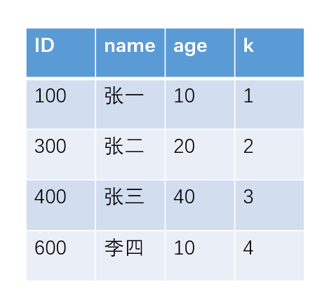
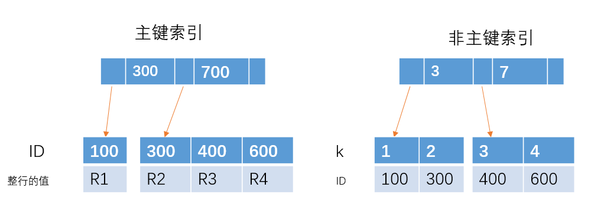
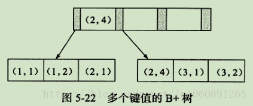
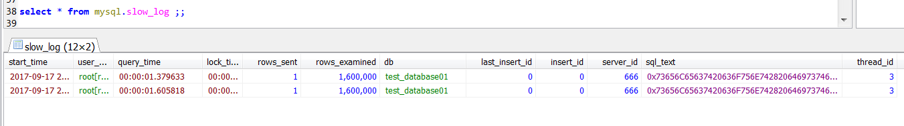
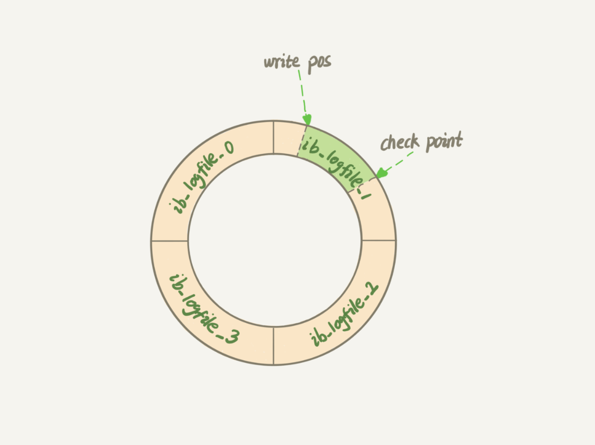

# 综述

其实是关系数据库，主要是mysql

文章大量参考《MySQL实战45讲》


# 逻辑架构


MySQL可以分为Server层和存储引擎层两部分。

Server层包括连接器、查询缓存、分析器、优化器、执行器等，涵盖MySQL的大多数核心服务功能，以及所有的内置函数（如日期、时间、数学和加密函数等），所有跨存储引擎的功能都在这一层实现，比如存储过程、触发器、视图等。

而存储引擎层负责数据的存储和提取。其架构模式是插件式的，支持InnoDB、MyISAM、Memory等多个存储引擎。现在最常用的存储引擎是InnoDB，它从MySQL 5.5.5版本开始成为了默认存储引擎。


# 存储引擎

## myisam

- 非事务的存储引擎，适合用于频繁查询的应用。支持表级别锁定，不会出现死锁，适合小数据，小并发。
- 没有提供对数据库事务的支持，也不支持行级锁和外键，因此当INSERT(插入)或UPDATE(更新)数据时即写操作需要锁定整个表，效率便会低一些。
- 不过和Innodb不同，MyIASM中存储了表的行数，于是SELECT COUNT(*) FROM TABLE时只需要直接读取已经保存好的值而不需要进行全表扫描。
- MyISAM引擎的默认**索引结构为B+Tree**，其中B+Tree的数据域存储的内容为实际数据的地址，也就是说它的索引和实际的数据是分开的，只不过是用索引指向了实际的数据，这种索引就是所谓的非聚集索引。
- 支持 B-tree、Full-text 等索引，不支持 Hash 索引


## innodb

- 支持事务的存储引擎，合于插入和更新操作比较多的应用，支持行级锁（最大区别就在锁的级别上），适合大数据，大并发。
- Innodb引擎的默认**索引结构**是B+Tree，支持 B-tree、Full-text 等索引，不支持 Hash 索引；
- Innodb的索引文件本身就是数据文件，即B+Tree的数据域存储的就是实际的数据，这种索引就是聚集索引。这个索引的key就是数据表的主键，因此InnoDB表数据文件本身就是主索引。


区别：

- InnoDB支持事务，而MyISAM不支持事务
- InnoDB支持行级锁，而MyISAM支持表级锁
- InnoDB支持MVCC, 而MyISAM不支持
- InnoDB支持外键，而MyISAM不支持
- InnoDB不支持全文索引，而MyISAM支持


> #### 基础结构

> [mysql中InnoDB引擎中页的概念](https://segmentfault.com/a/1190000008545713)

Page是Innodb存储的最基本结构，也是Innodb磁盘管理的最小单位，与数据库相关的所有内容都存储在Page结构里。Page分为几种类型：`数据页（B-Tree Node）`，`Undo页（Undo Log Page）`，`系统页（System Page）`，`事务数据页（Transaction System Page）`等；每个数据页的大小为`16kb`，每个Page使用一个32位（一位表示的就是0或1）的int值来表示，正好对应Innodb最大64TB的存储容量(16kb * 2^32=64tib)


# 索引（mysql）

> [mysql innodb索引原理](https://yq.aliyun.com/articles/692067) 推荐，里面详细的讲解了有哪些索引，以及索引的结构，以及数据在索引上是怎么存储的。


## 类型

MySQL目前主要有以下几种索引类型：

1. **普通索引**（index ）

   是最基本的索引，它没有任何限制。

2. **唯一索引**

   - **主键索引**（primary key）

     是一种特殊的唯一索引，一个表只能有一个主键，不允许有空值。一般是在建表的时候同时创建主键索引

   - **唯一索引**（unique）

     与前面的普通索引类似，不同的就是：索引列的值必须唯一，但允许有空值。如果是组合索引，则列值的组合必须唯一

3. **组合索引** 

   指多个字段上创建的索引，只有在查询条件中使用了创建索引时的第一个字段，索引才会被使用。使用组合索引时遵循**最左前缀集合**

   - primary key(id,name):联合主键索引
   - unique(id,name):联合唯一索引
   - index(id,name):联合普通索引


5. **全文索引**

   主要用来查找文本中的关键字，而不是直接与索引中的值相比较。fulltext索引跟其它索引大不相同，它更像是一个搜索引擎，而不是简单的where语句的参数匹配。fulltext索引配合match
   against操作使用，而不是一般的where语句加like。它可以在create table，alter table ，create 
   index使用，不过目前只有char、varchar，text 
   列上可以创建全文索引。值得一提的是，在数据量较大时候，现将数据放入一个没有全局索引的表中，然后再用CREATE 
   index创建fulltext索引，要比先为一张表建立fulltext然后再将数据写入的速度快很多。

   

6. **空间索引**

   几乎不用


## 名词解释

> ## 主键索引和非主键索引有什么区别？





从图中不难看出，主键索引和非主键索引的区别是：

- 非主键索引的叶子节点存放的是**主键的值**，而主键索引的叶子节点存放的是**整行数据**，其中非主键索引也被称为**二级索引**，而主键索引也被称为**聚簇索引**。
- 非主键的查询方式，则先搜索k索引树，得到ID=100,再到ID索引树搜索一次，这个过程也被称为**回表**。


[面试小知识：MySQL索引相关](https://mp.weixin.qq.com/s/yP25TAqHCN4umwDSN53qPQ)


> ## 聚簇索引 & 非聚簇索引

这两个名字虽然都叫做索引，但这并不是一种单独的索引类型，而是一种数据存储方式。对于聚簇索引存储来说，行数据和主键B+树存储在一起，辅助键B+树只存储辅助键和主键，主键和非主键B+树几乎是两种类型的树。对于非聚簇索引存储来说，主键B+树在叶子节点存储指向真正数据行的指针，而非主键。

- 所谓聚簇索引，就是指主**索引文件和数据文件为同一份文件**，聚簇索引主要用在Innodb存储引擎中。在该索引实现方式中B+Tree的叶子节点上的data就是数据本身，key为主键，如果是一般索引的话，data便会指向对应的主索引。
- 非聚簇索引就是指B+Tree的叶子节点上的data，并不是数据本身，而是数据存放的地址。主索引和辅助索引没啥区别，只是主索引中的key一定得是唯一的。


[B-tree/b+tree 原理以及聚簇索引和非聚簇索引](https://blog.csdn.net/u010727189/article/details/79399384)


> ## 覆盖索引

如果一个索引包含(或覆盖)所有需要查询的字段的值，称为**覆盖索引**。即只需扫描索引而无须回表。

例如：执行的语句是select ID from T where k between 3 and 5，这时只需要查ID的值，而ID的值已经在k索引树上了，因此可以直接提供查询结果，不需要回表。

只扫描索引而无需回表的优点：

1. 索引条目通常远小于数据行大小，只需要读取索引，则mysql会极大地减少数据访问量。
2. 因为索引是按照列值顺序存储的，所以对于IO密集的范围查找会比随机从磁盘读取每一行数据的IO少很多。
3. 一些存储引擎如myisam在内存中只缓存索引，数据则依赖于操作系统来缓存，因此要访问数据需要一次系统调用
4. innodb的聚簇索引，覆盖索引对innodb表特别有用。(innodb的二级索引在叶子节点中保存了行的主键值，所以如果二级主键能够覆盖查询，则可以避免对主键索引的二次查询)


> ## 联合索引

联合索引是指对表上的多个列进行索引，联合索引也是一棵B+树，不同的是联合索引的键值数量不是1，而是大于等于2。



遵循**最左匹配原则**


## 索引的缺点

1. 虽然索引大大提高了查询速度，同时却会降低更新表的速度，如对表进行insert、update和delete。因为更新表时，不仅要保存数据，还要保存一下索引文件。
2. 建立索引会占用磁盘空间的索引文件。一般情况这个问题不太严重，但如果你在一个大表上创建了多种组合索引，索引文件的会增长很快。索引只是提高效率的一个因素，如果有大数据量的表，就需要花时间研究建立最优秀的索引，或优化查询语句。


## 索引结构

> ## B+Tree索引

- B+Tree索引是最为常见的MySQL索引类型，一般谈论MySQL索引时，如果没有特别说明，就是指B+Tree索引。
- B+Tree索引使用B+Tree作为其存储数据的数据结构。一般来说，B+Tree索引适用于全键值、键值范围和键前缀查找，其中键前缀查找只适用于根据最左前缀查找。
- B+Tree索引支持的查询原则如下所示：
  - 全值匹配：全值匹配指的是和索引中的所有列进行匹配，
  - 匹配最左前缀：前边提到的索引可以用于查找所有姓Allen的人，即只使用索引中的第一列。
  - 匹配列前缀：也可以只匹配某一列的值的开头部分。例如前面提到的索引可用于查找所有以J开头的姓的人。这里也只用到了索引的第一列。
  - 匹配范围值：例如前边提到的索引可用于查找姓在Allen和Barrymore之间的人。这里也只使用了索引的第一列。
  - 精确匹配某一列并范围匹配另外一列：前边提到的索引也可用于查找所有姓为Allen，并且名字是字母K开头(比如Kim,Karl等)的人。即第一列last_name全匹配，第二列first_name范围匹配。


如上图，是一颗b+树，浅蓝色的块为一个磁盘块，可以看到每个磁盘块包含几个数据项（深蓝色所示）和指针（黄色所示），如磁盘块1包含数据项17和35，包含指针P1、P2、P3，P1表示小于17的磁盘块，P2表示在17和35之间的磁盘块，P3表示大于35的磁盘块。真实的数据存在于叶子节点即3、5、9、10、13、15、28、29、36、60、75、79、90、99。**非叶子节点只不存储真实的数据**，只存储指引搜索方向的数据项，如17、35并不真实存在于数据表中。


### b+ 树的查找过程

如图所示，如果要查找数据项29，那么首先会把磁盘块1由磁盘加载到内存，此时发生一次IO，在内存中用二分查找确定29在17和35之间，锁定磁盘块1的P2指针，内存时间因为非常短（相比磁盘的IO）可以忽略不计，通过磁盘块1的P2指针的磁盘地址把磁盘块3由磁盘加载到内存，发生第二次IO，29在26和30之间，锁定磁盘块3的P2指针，通过指针加载磁盘块8到内存，发生第三次IO，同时内存中做二分查找找到29，结束查询，总计三次IO。真实的情况是，3层的b+树可以表示上百万的数据，如果上百万的数据查找只需要三次IO，性能提高将是巨大的，如果没有索引，每个数据项都要发生一次IO，那么总共需要百万次的IO，显然成本非常非常高。


### b+ 树性质

1. **索引字段要尽量的小**：通过上面的分析，我们知道IO次数取决于b+树的高度h，假设当前数据表的数据为N，每个磁盘块的数据项的数量是m，则有h=㏒(m+1)N，当数据量N一定的情况下，m越大，h越小；而m = 磁盘块的大小 / 数据项的大小，磁盘块的大小也就是一个数据页的大小，是固定的，如果数据项占的空间越小，数据项的数量越多，树的高度越低。这就是为什么每个数据项，即索引字段要尽量的小，比如int占4字节，要比bigint8字节少一半。这也是为什么b+树要求把真实的数据放到叶子节点而不是内层节点，一旦放到内层节点，磁盘块的数据项会大幅度下降，导致树增高。当数据项等于1时将会退化成线性表。
2. **索引的最左匹配特性（即从左往右匹配）**：当b+树的数据项是复合的数据结构，比如(name,age,sex)的时候，b+数是按照从左到右的顺序来建立搜索树的，比如当(张三,20,F)这样的数据来检索的时候，b+树会优先比较name来确定下一步的所搜方向，如果name相同再依次比较age和sex，最后得到检索的数据；但当(20,F)这样的没有name的数据来的时候，b+树就不知道下一步该查哪个节点，因为建立搜索树的时候name就是第一个比较因子，必须要先根据name来搜索才能知道下一步去哪里查询。比如当(张三,F)这样的数据来检索时，b+树可以用name来指定搜索方向，但下一个字段age的缺失，所以只能把名字等于张三的数据都找到，然后再匹配性别是F的数据了，
   这个是非常重要的性质，即索引的最左匹配特性


> ## hash索引

//todo


> #### 唯一索引与普通索引

>  09 | 普通索引和唯一索引，应该怎么选择？ 

这里涉及到了一个change buffer的概念，以及一个select流程与update流程，应该不会问那么细，后面再补吧。

为了说明普通索引和唯一索引对更新语句性能的影响这个问题，我需要先跟你介绍一下change buffer。

当需要更新一个数据页时，如果数据页在内存中就直接更新，而如果这个数据页还没有在内存中的话，在不影响数据一致性的前提下，InooDB会将这些更新操作缓存在change buffer中，这样就不需要从磁盘中读入这个数据页了。在下次查询需要访问这个数据页的时候，将数据页读入内存，然后执行change  buffer中与这个页有关的操作。通过这种方式就能保证这个数据逻辑的正确性。

需要说明的是，虽然名字叫作change buffer，实际上它是可以持久化的数据。也就是说，change buffer在内存中有拷贝，也会被写入到磁盘上。

将change buffer中的操作应用到原数据页，得到最新结果的过程称为merge。除了访问这个数据页会触发merge外，系统有后台线程会定期merge。在数据库正常关闭（shutdown）的过程中，也会执行merge操作。

显然，如果能够将更新操作先记录在change buffer，减少读磁盘，语句的执行速度会得到明显的提升。而且，数据读入内存是需要占用buffer pool的，所以这种方式还能够避免占用内存，提高内存利用率。

那么，**什么条件下可以使用change buffer呢？**

对于唯一索引来说，所有的更新操作都要先判断这个操作是否违反唯一性约束。比如，要插入(4,400)这个记录，就要先判断现在表中是否已经存在k=4的记录，而这必须要将数据页读入内存才能判断。如果都已经读入到内存了，那直接更新内存会更快，就没必要使用change buffer了。

因此，**唯一索引的更新就不能使用change buffer，实际上也只有普通索引可以使用**。


[mysql索引最左匹配原则的理解](https://blog.csdn.net/u013164931/article/details/82386555)

## 注意事项

> 18 | 为什么这些SQL语句逻辑相同，性能却差异巨大 —— todo

1. **索引不会包含有null值的列。**只要列中包含有null值都将不会被包含在索引中，复合索引中只要有一列含有null值，那么这一列对于此复合索引就是无效的。所以我们在数据库设计时不要让字段的默认值为null。
2. **使用短索引**。对串列进行索引，如果可能应该指定一个前缀长度。例如，如果有一个char(255)的列，如果在前10个或20个字符内，多数值是惟一的，那么就不要对整个列进行索引。短索引不仅可以提高查询速度而且可以节省磁盘空间和I/O操作。
3. **索引列排序**。查询**只使用一个**索引，因此如果where子句中已经使用了索引的话，那么order by中的列是不会使用索引的。因此数据库默认排序可以符合要求的情况下不要使用排序操作；尽量不要包含多个列的排序，如果需要最好给这些列创建复合索引。
4. **like语句操作**。一般情况下不推荐使用like操作，如果非使用不可，如何使用也是一个问题。like “%aaa%” 不会使用索引而like “aaa%”可以使用索引。
5. **不要在列上进行运算**。这将导致索引失效而进行全表扫描，例如

```sql
SELECT * FROM table_name WHERE YEAR(column_name) < 2017;
```

6. **不使用not in和<>操作**


# 日志

> 23 | MySQL是怎么保证数据不丢的？ 

错误日志：记录出错信息，也记录一些警告信息或者正确的信息。
查询日志：记录所有对数据库请求的信息，不论这些请求是否得到了正确的执行。
慢查询日志：设置一个阈值，将运行时间超过该值的所有SQL语句都记录到慢查询的日志文件中。
二进制日志：记录对数据库执行更改的所有操作。
中继日志：
事务日志：数据库的事务功能基于此日志实现


> #### 慢查询日志

MySQL的慢查询日志是MySQL提供的一种日志记录，它用来记录在MySQL中响应时间超过阀值的语句，具体指运行时间超过long_query_time值的SQL，则会被记录到慢查询日志中。long_query_time的**默认值为10**，意思是运行10S以上的语句。默认情况下，Mysql数据库并不启动慢查询日志，需要我们手动来设置这个参数，当然，如果不是调优需要的话，一般不建议启动该参数，因为开启慢查询日志会或多或少带来一定的性能影响。慢查询日志支持将日志记录写入文件，也支持将日志记录写入数据库表。


查看是否开启，slow_query_log 为 on则为开启。

```
mysql> show variables like 'slow_query%';
+---------------------------+----------------------------------+
| Variable_name             | Value                            |
+---------------------------+----------------------------------+
| slow_query_log            | OFF                              |
| slow_query_log_file       | /mysql/data/localhost-slow.log   |
+---------------------------+----------------------------------+

mysql> show variables like 'long_query_time';
+-----------------+-----------+
| Variable_name   | Value     |
+-----------------+-----------+
| long_query_time | 10.000000 |
+-----------------+-----------+
```


开启方法

1. 方法一：全局变量设置
   将 slow_query_log 全局变量设置为“ON”状态

   ```
   mysql> set global slow_query_log='ON'; 
   ```

   设置慢查询日志存放的位置

   ```
   mysql> set global slow_query_log_file='/usr/local/mysql/data/slow.log';
   ```

   查询超过1秒就记录

   ```
   mysql> set global long_query_time=1;
   ```


2. 配置文件设置
   修改配置文件my.cnf，在[mysqld]下的下方加入

   ```
   [mysqld]
   slow_query_log = ON
   slow_query_log_file = /usr/local/mysql/data/slow.log
   long_query_time = 1
   ```

   重启MySQL服务

   ```
   service mysqld restart
   ```





## redo log（重做日志）

> #### WAL(write-Ahead Logging)

先写日志，再写磁盘。具体来说，当有一条记录需要更新的时候，InnoDB引擎就会先把记录写到redo log里面，并更新内存，这个时候更新就算完成了。同时，InnoDB引擎会在适当的时候，将这个操作记录更新到磁盘里面，而这个更新往往是在系统比较空闲的时候做。

InnoDB的redo log是固定大小的，比如可以配置为一组4个文件，每个文件的大小是1GB，那么总共就可以记录4GB的操作。从头开始写，写到末尾就又回到开头循环写，如下面这个图所示。



write pos是当前记录的位置，一边写一边后移，写到第3号文件末尾后就回到0号文件开头。checkpoint是当前要擦除的位置，也是往后推移并且循环的，擦除记录前要把记录更新到数据文件。

write pos和checkpoint之间的是“粉板”上还空着的部分，可以用来记录新的操作。如果write pos追上checkpoint，表示“粉板”满了，这时候不能再执行新的更新，得停下来先擦掉一些记录，把checkpoint推进一下。

有了redo log，InnoDB就可以保证即使数据库发生异常重启，之前提交的记录都不会丢失，这个能力称为**crash-safe**。


> #### redo log的写入机制

事务在执行过程中，生成的redo log是要先写到redo log buffer的。


日志写到redo log buffer是很快的，wirte到page cache也差不多，但是持久化到磁盘的速度就慢多了。

为了控制redo log的写入策略，InnoDB提供了innodb_flush_log_at_trx_commit参数，它有三种可能取值：

1. 设置为0的时候，表示每次事务提交时都只是把redo log留在redo log buffer中;
2. 设置为1的时候，表示每次事务提交时都将redo log直接持久化到磁盘；
3. 设置为2的时候，表示每次事务提交时都只是把redo log写到page cache。

InnoDB有一个后台线程，每隔1秒，就会把redo log buffer中的日志，调用write写到文件系统的page cache，然后调用fsync持久化到磁盘。

注意，事务执行中间过程的redo log也是直接写在redo log buffer中的，这些redo log也会被后台线程一起持久化到磁盘。也就是说，一个没有提交的事务的redo log，也是可能已经持久化到磁盘的。

实际上，除了后台线程每秒一次的轮询操作外，还有两种场景会让一个没有提交的事务的redo log写入到磁盘中。

1. **一种是，redo log buffer占用的空间即将达到 innodb_log_buffer_size一半的时候，后台线程会主动写盘。**注意，由于这个事务并没有提交，所以这个写盘动作只是write，而没有调用fsync，也就是只留在了文件系统的page cache。
2. **另一种是，并行的事务提交的时候，顺带将这个事务的redo log buffer持久化到磁盘。**假设一个事务A执行到一半，已经写了一些redo  log到buffer中，这时候有另外一个线程的事务B提交，如果innodb_flush_log_at_trx_commit设置的是1，那么按照这个参数的逻辑，事务B要把redo log buffer里的日志全部持久化到磁盘。这时候，就会带上事务A在redo log buffer里的日志一起持久化到磁盘。


## binlog（归档日志）

redo log是InnoDB引擎特有的日志，而Server层也有自己的日志，称为binlog（归档日志）

这两种日志有以下三点不同。

1. redo log是InnoDB引擎特有的；binlog是MySQL的Server层实现的，所有引擎都可以使用。
2. redo log是物理日志，记录的是“在某个数据页上做了什么修改”；binlog是逻辑日志，记录的是这个语句的原始逻辑，比如“给ID=2这一行的c字段加1 ”。
3. redo log是循环写的，空间固定会用完；binlog是可以追加写入的。“追加写”是指binlog文件写到一定大小后会切换到下一个，并不会覆盖以前的日志。


### binlog的写入机制

其实，binlog的写入逻辑比较简单：事务执行过程中，先把日志写到binlog cache，事务提交的时候，再把binlog cache写到binlog文件中。

一个事务的binlog是不能被拆开的，因此不论这个事务多大，也要确保一次性写入。这就涉及到了binlog cache的保存问题。

系统给binlog cache分配了一片内存，每个线程一个，参数 binlog_cache_size用于控制单个线程内binlog cache所占内存的大小。如果超过了这个参数规定的大小，就要暂存到磁盘。

事务提交的时候，执行器把binlog cache里的完整事务写入到binlog中，并清空binlog cache。状态如图1所示。


可以看到，每个线程有自己binlog cache，但是共用同一份binlog文件。

- 图中的write，指的就是指把日志写入到文件系统的page cache，并没有把数据持久化到磁盘，所以速度比较快。
- 图中的fsync，才是将数据持久化到磁盘的操作。一般情况下，我们认为fsync才占磁盘的IOPS。

write 和fsync的时机，是由参数sync_binlog控制的：

1. sync_binlog=0的时候，表示每次提交事务都只write，不fsync；
2. sync_binlog=1的时候，表示每次提交事务都会执行fsync；
3. sync_binlog=N(N>1)的时候，表示每次提交事务都write，但累积N个事务后才fsync。

因此，在出现IO瓶颈的场景里，将sync_binlog设置成一个比较大的值，可以提升性能。在实际的业务场景中，考虑到丢失日志量的可控性，一般不建议将这个参数设成0，比较常见的是将其设置为100~1000中的某个数值。

但是，将sync_binlog设置为N，对应的风险是：如果主机发生异常重启，会丢失最近N个事务的binlog日志。


## undolog（回滚日志）

### 格式

> 24 | MySQL是怎么保证主备一致的？ 

> #### binlog的三种格式对比

一种是**statement**，一种是**row**。可能你在其他资料上还会看到有第三种格式，叫作**mixed**，其实它就是前两种格式的混合。

当binlog_format=statement时，binlog里面记录的就是SQL语句的原文。

与statement格式的binlog相比，row格式的binlog里没有了SQL语句的原文，而是替换成了event


> #### 为什么会有mixed格式的binlog？

基于上面的信息，我们来讨论一个问题：**为什么会有mixed这种binlog格式的存在场景？**推论过程是这样的：

- 因为有些statement格式的binlog可能会导致主备不一致，所以要使用row格式。
- 但row格式的缺点是，很占空间。比如你用一个delete语句删掉10万行数据，用statement的话就是一个SQL语句被记录到binlog中，占用几十个字节的空间。但如果用row格式的binlog，就要把这10万条记录都写到binlog中。这样做，不仅会占用更大的空间，同时写binlog也要耗费IO资源，影响执行速度。
- 所以，MySQL就取了个折中方案，也就是有了mixed格式的binlog。mixed格式的意思是，MySQL自己会判断这条SQL语句是否可能引起主备不一致，如果有可能，就用row格式，否则就用statement格式。

也就是说，mixed格式可以利用statment格式的优点，同时又避免了数据不一致的风险。


> #### 循环复制问题

MySQL在binlog中记录了这个命令第一次执行时所在实例的server id。因此，我们可以用下面的逻辑，来解决两个节点间的循环复制的问题：

1. 规定两个库的server id必须不同，如果相同，则它们之间不能设定为主备关系；
2. 一个备库接到binlog并在重放的过程中，生成与原binlog的server id相同的新的binlog；
3. 每个库在收到从自己的主库发过来的日志后，先判断server id，如果跟自己的相同，表示这个日志是自己生成的，就直接丢弃这个日志。

按照这个逻辑，如果我们设置了双M结构，日志的执行流就会变成这样：

1. 从节点A更新的事务，binlog里面记的都是A的server id；
2. 传到节点B执行一次以后，节点B生成的binlog 的server id也是A的server id；
3. 再传回给节点A，A判断到这个server id与自己的相同，就不会再处理这个日志。所以，死循环在这里就断掉了。


# 提交流程

## 两阶段提交

> #### update语句执行的内部流程

1. 执行器先找引擎取ID=2这一行。ID是主键，引擎直接用树搜索找到这一行。如果ID=2这一行所在的数据页本来就在内存中，就直接返回给执行器；否则，需要先从磁盘读入内存，然后再返回。
2. 执行器拿到引擎给的行数据，把这个值加上1，比如原来是N，现在就是N+1，得到新的一行数据，再调用引擎接口写入这行新数据。
3. 引擎将这行新数据更新到内存中，同时将这个更新操作记录到redo log里面，此时redo log处于prepare状态。然后告知执行器执行完成了，随时可以提交事务。
4. 执行器生成这个操作的binlog，并把binlog写入磁盘。
5. 执行器调用引擎的提交事务接口，引擎把刚刚写入的redo log改成提交（commit）状态，更新完成。

将redo log的写入拆成了两个步骤：prepare和commit，这就是"两阶段提交"。


## 奔溃恢复

// todo


# 事务

事务是通过日志来实现的。事务日志是通过redo和innodb的存储引擎日志缓冲（Innodb log buffer）来实现的，当开始一个事务的时候，会记录该事务的lsn(log sequence number)号; 当事务执行时，会往InnoDB存储引擎日志缓存里面插入事务日志；当事务提交时，必须将存储引擎的日志缓冲写入磁盘（通过innodb_flush_log_at_trx_commit来控制），也就是写数据前，需要先写日志。这种方式称为“预写日志方式”


## 隔离级别

| 事务隔离级别                   | 脏读 | 不可重复读 | 幻读 |
| ------------------------------ | ---- | ---------- | ---- |
| 读未提交（read-uncommitted）   | 是   | 是         | 是   |
| 读取提交内容（read-committed） | 否   | 是         | 是   |
| 可重复读（repeatable-read）    | 否   | 否         | 是   |
| 串行化（serializable）         | 否   | 否         | 否   |

Mysql 默认:可重复读 
Oracle默认:读已提交


- 读未提交是指，一个事务还没提交时，它做的变更就能被别的事务看到。
- 读提交是指，一个事务提交之后，它做的变更才会被其他事务看到。
- 可重复读是指，一个事务执行过程中看到的数据，总是跟这个事务在启动时看到的数据是一致的。当然在可重复读隔离级别下，未提交变更对其他事务也是不可见的。
- 串行化，顾名思义是对于同一行记录，“写”会加“写锁”，“读”会加“读锁”。当出现读写锁冲突的时候，后访问的事务必须等前一个事务执行完成，才能继续执行。


1. 脏读：事务A读取了事务B更新的数据，然后B回滚操作，那么A读取到的数据是脏数，一个事务读到了另一个事务的未提交的数据 。
2. 不可重复读：事务 A 多次读取同一数据，事务 B 在事务A多次读取的过程中，对数据作了更新并提交，导致事务A多次读取同一数据时，结果不一致。一个事务读到了另一个事务已经提交的 update 的数据导致多次查询结果不一致. 
3. 幻读：系统管理员A将数据库中所有学生的成绩从具体分数改为ABCDE等级，但是系统管理员B就在这个时候插入了一条具体分数的记录，当系统管理员A改结束后发现还有一条记录没有改过来，就好像发生了幻觉一样，这就叫幻读。一个事务读到了另一个事务已经提交的 insert 的数据导致多次查询结果不一致.

**小结：不可重复读的和幻读很容易混淆，不可重复读侧重于修改，幻读侧重于新增或删除。解决不可重复读的问题只需锁住满足条件的行，解决幻读需要锁表**


## 事务隔离的实现

主要看“可重复读”。在MySQL中，实际上每条记录在更新的时候都会同时记录一条回滚操作。记录上的最新值，通过回滚操作，都可以得到前一个状态的值。

假设一个值从1被按顺序改成了2、3、4，在回滚日志里面就会有类似下面的记录。


当前值是4，但是在查询这条记录的时候，不同时刻启动的事务会有不同的read-view。如图中看到的，在视图A、B、C里面，这一个记录的值分别是1、2、4，同一条记录在系统中可以存在多个版本，就是数据库的**多版本并发控制（MVCC）**。对于read-view A，要得到1，就必须将当前值依次执行图中所有的回滚操作得到。

同时你会发现，即使现在有另外一个事务正在将4改成5，这个事务跟read-view A、B、C对应的事务是不会冲突的。

你一定会问，回滚日志总不能一直保留吧，什么时候删除呢？答案是，在不需要的时候才删除。也就是说，系统会判断，当没有事务再需要用到这些回滚日志时，回滚日志会被删除。

什么时候才不需要了呢？就是当系统里没有比这个回滚日志更早的read-view的时候。

基于上面的说明，我们来讨论一下为什么建议你尽量不要使用长事务。

长事务意味着系统里面会存在很老的事务视图。由于这些事务随时可能访问数据库里面的任何数据，所以这个事务提交之前，数据库里面它可能用到的回滚记录都必须保留，这就会导致大量占用存储空间。


> [MySQL的可重复读级别能解决幻读吗](https://www.cnblogs.com/liyus/p/10556563.html)


## *MVCC

> 08 | 事务到底是隔离的还是不隔离的？ 

*事务的数据隔离的实现原理，比较重要。*

事务的启动时机：

begin/start transaction  命令并不是一个事务的起点，在执行到它们之后的第一个操作InnoDB表的语句，事务才真正启动。如果你想要马上启动一个事务，可以使用start  transaction with consistent snapshot 这个命令。

> 第一种启动方式，一致性视图是在第执行第一个快照读语句时创建的；
> 第二种启动方式，一致性视图是在执行start transaction with consistent snapshot时创建的。

在MySQL里，有两个“视图”的概念：

- 一个是view。它是一个用查询语句定义的虚拟表，在调用的时候执行查询语句并生成结果。创建视图的语法是create view … ，而它的查询方法与表一样。
- 另一个是InnoDB在实现MVCC时用到的一致性读视图，即consistent read view，用于支持RC（Read Committed，读提交）和RR（Repeatable Read，可重复读）隔离级别的实现。

它没有物理结构，作用是事务执行期间用来定义“我能看到什么数据”。

> #### “快照”在MVCC里是怎么工作的？

在**可重复读隔离级别**下，事务在启动的时候就“拍了个快照”。注意，这个快照是基于整库的。

快照是怎么实现的？

InnoDB里面每个事务有一个唯一的事务ID，叫作transaction id。它是在事务开始的时候向InnoDB的事务系统申请的，是按申请顺序严格递增的。

而每行数据也都是有多个版本的。每次事务更新数据的时候，都会生成一个新的数据版本，并且把transaction id赋值给这个数据版本的事务ID，记为row trx_id。同时，旧的数据版本要保留，并且在新的数据版本中，能够有信息可以直接拿到它。

也就是说，数据表中的一行记录，其实可能有多个版本(row)，每个版本有自己的row trx_id。

如下图所示，就是一个记录被多个事务连续更新后的状态。


图中的三个虚线箭头，就是undo log；而V1、V2、V3并不是物理上真实存在的，而是每次需要的时候根据当前版本和undo log计算出来的。比如，需要V2的时候，就是通过V4依次执行U3、U2算出来。

按照可重复读的定义，一个事务启动的时候，能够看到所有已经提交的事务结果。但是之后，这个事务执行期间，其他事务的更新对它不可见。

因此，一个事务只需要在启动的时候声明说，“以我启动的时刻为准，如果一个数据版本是在我启动之前生成的，就认；如果是我启动以后才生成的，我就不认，我必须要找到它的上一个版本”。

当然，如果“上一个版本”也不可见，那就得继续往前找。还有，如果是这个事务自己更新的数据，它自己还是要认的。

在实现上， InnoDB为每个事务构造了一个数组，用来保存这个事务启动瞬间，当前正在“活跃”的所有事务ID。“活跃”指的就是，启动了但还没提交。

数组里面事务ID的最小值记为低水位，当前系统里面已经创建过的事务ID的最大值加1记为高水位。

**这个视图数组和高水位，就组成了当前事务的一致性视图（read-view）。**

而数据版本的可见性规则，就是基于数据的row trx_id和这个一致性视图的对比结果得到的。

这个视图数组把所有的row trx_id 分成了几种不同的情况。


这样，对于当前事务的启动瞬间来说，一个数据版本的row trx_id，有以下几种可能：

1. 如果落在绿色部分，表示这个版本是已提交的事务或者是当前事务自己生成的，这个数据是可见的；
2. 如果落在红色部分，表示这个版本是由将来启动的事务生成的，是肯定不可见的；
3. 如果落在黄色部分，那就包括两种情况
    a.  若 row trx_id在数组中，表示这个版本是由还没提交的事务生成的，不可见；
    b.  若 row trx_id不在数组中，表示这个版本是已经提交了的事务生成的，可见。???????????


一个数据版本，对于一个事务视图来说，除了自己的更新总是可见以外，有三种情况：

1. 版本未提交，不可见；
2. 版本已提交，但是是在视图创建后提交的，不可见；
3. 版本已提交，而且是在视图创建前提交的，可见。


**InnoDB利用了“所有数据都有多个版本”的这个特性，实现了“秒级创建快照”的能力。**


> **事务的可重复读的能力是怎么实现的**

一条规则：**更新数据都是先读后写的，而这个读，只能读当前的值，称为“当前读”（current read）。**除了update语句外，select语句如果加锁，也是当前读。

可重复读的核心就是一致性读（consistent read）；而事务更新数据的时候，只能用当前读。如果当前的记录的行锁被其他事务占用的话，就需要进入锁等待。

而读提交的逻辑和可重复读的逻辑类似，它们最主要的区别是：

- 在可重复读隔离级别下，只需要在事务开始的时候创建一致性视图，之后事务里的其他查询都共用这个一致性视图；
- 在读提交隔离级别下，每一个语句执行前都会重新算出一个新的视图。

所以

- 对于可重复读，查询只承认在事务启动前就已经提交完成的数据；
- 对于读提交，查询只承认在语句启动前就已经提交完成的数据；


# 锁 

根据加锁的范围，MySQL里面的锁大致可以分成全局锁、表级锁和行锁三类。


> #### 全局锁

顾名思义，全局锁就是对整个数据库实例加锁。MySQL提供了一个加全局读锁的方法，命令是 Flush tables  with read lock  (FTWRL)。当你需要让整个库处于只读状态的时候，可以使用这个命令，之后其他线程的以下语句会被阻塞：数据更新语句（数据的增删改）、数据定义语句（包括建表、修改表结构等）和更新类事务的提交语句。

**全局锁的典型使用场景是，做全库逻辑备份。**也就是把整库每个表都select出来存成文本。


> #### 表级锁

MySQL里面表级别的锁有两种：一种是**表锁**，一种是**元数据锁（meta data lock，MDL)**。

**表锁的语法是 lock tables … read/write。**与FTWRL类似，可以用unlock tables主动释放锁，也可以在客户端断开的时候自动释放。需要注意，lock tables语法除了会限制别的线程的读写外，也限定了本线程接下来的操作对象。

举个例子, 如果在某个线程A中执行lock tables t1 read, t2 write;  这个语句，则其他线程写t1、读写t2的语句都会被阻塞。同时，线程A在执行unlock  tables之前，也只能执行读t1、读写t2的操作。连写t1都不允许，自然也不能访问其他表。

在还没有出现更细粒度的锁的时候，表锁是最常用的处理并发的方式。而对于InnoDB这种支持行锁的引擎，一般不使用lock tables命令来控制并发，毕竟锁住整个表的影响面还是太大。

**另一类表级的锁是MDL（metadata lock)。**MDL不需要显式使用，在访问一个表的时候会被自动加上。MDL的作用是，保证读写的正确性。你可以想象一下，如果一个查询正在遍历一个表中的数据，而执行期间另一个线程对这个表结构做变更，删了一列，那么查询线程拿到的结果跟表结构对不上，肯定是不行的。

因此，在MySQL 5.5版本中引入了MDL，当对一个表做增删改查操作的时候，加MDL读锁；当要对表做结构变更操作的时候，加MDL写锁。

- 读锁之间不互斥，因此可以有多个线程同时对一张表增删改查。
- 读写锁之间、写锁之间是互斥的，用来保证变更表结构操作的安全性。因此，如果有两个线程要同时给一个表加字段，其中一个要等另一个执行完才能开始执行。


> #### 行锁

**两阶段锁**：在InnoDB事务中，行锁是在需要的时候才加上的，但并不是不需要了就立刻释放，而是要等到事务结束时才释放。这个就是两阶段锁协议。


## 共享锁

1. 共享锁（Shared Lock，也叫S锁）又称**读锁**，是读取操作创建的锁。因此多个事务可以同时为一个对象加共享锁。
2. 用户可以并发读取数据，但任何事务都不能对数据进行修改（获取数据上的排他锁），直到已释放所有共享锁。
3. 如果事务T对数据A加上共享锁后，则其他事务只能对A再加共享锁，不能加排他锁。获准共享锁的事务只能读数据，不能修改数据。


  　　SELECT ... LOCK IN SHARE MODE走的是IS锁(意向共享锁)，即在符合条件的rows上都加了共享锁，这样的话，其他人**可以读取**这些记录，也可以继续添加IS锁，但是**无法修改**这些记录直到你这个加锁的过程执行完成(完成的情况有：事务的提交，事务的回滚，否则直接锁等待超时)。


**共享锁的使用场景**

  　　SELECT ... LOCK IN SHARE  MODE的应用场景适合于两张表存在关系时的写操作，拿mysql官方文档的例子来说，一个表是child表，一个是parent表，假设child表的某一列child_id映射到parent表的c_child_id列，那么从业务角度讲，此时我直接insert一条child_id=100记录到child表是存在风险的，因为刚insert的时候可能在parent表里删除了这条c_child_id=100的记录，那么业务数据就存在不一致的风险。正确的方法是再插入时执行

`select * from parent where c_child_id=100 lock in share mode`,锁定了parent表的这条记录，然后执行insert into child(child_id) values (100)就不会存在这种问题了。


## 排他锁

1. 排他锁(Exclusive Lock，也叫X锁)也叫**写锁**(X)。

2. 如果事务T对数据A加上排他锁后，则其他事务不能再对A加任何类型的封锁。获准排他锁的事务既能读数据，又能修改数据。

    

**排他锁的使用场景：**

**使用场景一：订单的商品数量**

​	但是如果是同一张表的应用场景，举个例子，电商系统中计算一种商品的剩余数量，在产生订单之前需要确认商品数量>=1,产生订单之后应该将商品数量减1。

​	显然做法是是有问题，因为如果1查询出amount为1，但是这时正好其他session也买了该商品并产生了订单，那么amount就变成了0，那么这时第二步再执行就有问题。那么采用lock in share mode可行吗，也是不合理的，因为两个session同时锁定该行记录时，这时两个session再update时必然会产生死锁导致事务回滚。

**使用场景二：数据表的状态**


## 意向锁

InnoDB还有两个表锁：

- 意向共享锁（IS）：表示事务准备给数据行加入共享锁，也就是说一个数据行加共享锁前必须先取得该表的IS锁
- 意向排他锁（IX）：类似上面，表示事务准备给数据行加入排他锁，说明事务在一个数据行加排他锁前必须先取得该表的IX锁。

意向锁是InnoDB自动加的，不需要用户干预。

对于insert、update、delete，InnoDB会自动给涉及的数据加排他锁（X）；对于一般的Select语句，InnoDB不会加任何锁，事务可以通过以下语句给显示加共享锁或排他锁。

共享锁：`SELECT ... LOCK IN SHARE MODE;`

排他锁：`SELECT ... FOR UPDATE;`


**InnoDB行锁实现方式**

InnoDB行锁是通过索引上的索引项来实现的，这一点ＭySQL与Oracle不同，后者是通过在数据中对相应数据行加锁来实现的。InnoDB这种行锁实现特点意味者：只有通过索引条件检索数据，InnoDB才会使用行级锁，否则，InnoDB将使用表锁！

在实际应用中，要特别注意InnoDB行锁的这一特性，不然的话，可能导致大量的锁冲突，从而影响并发性能。

例: select * from tab_with_index where id = 1 for update;
for update 可以根据条件来完成行锁锁定,并且 id 是有索引键的列,
如果 **id 不是索引键那么InnoDB将完成表锁**，并发将无从谈起


## 乐观锁

​	乐观锁**不是数据库自带的**，需要我们自己去实现。乐观锁是指操作数据库时(更新操作)，想法很乐观，认为这次的操作不会导致冲突，在操作数据时，并不进行任何其他的特殊处理（也就是不加锁），而在进行更新后，再去判断是否有冲突了。

通常实现是这样的：在表中的数据进行操作时(更新)，先给数据表加一个**版本(version)**字段，每操作一次，将那条记录的版本号加1。也就是先查询出那条记录，获取出version字段,如果要对那条记录进行操作(更新),则先判断此刻version的值是否与刚刚查询出来时的version的值相等，如果相等，则说明这段期间，没有其他程序对其进行操作，则可以执行更新，将version字段的值加1；如果更新时发现此刻的version值与刚刚获取出来的version的值不相等，则说明这段期间已经有其他程序对其进行操作了，则不进行更新操作。

**时间戳（使用数据库服务器的时间戳）**、**待更新字段**、**所有字段** 


悲观锁

​	与乐观锁相对应的就是悲观锁了。悲观锁就是在操作数据时，认为此操作会出现数据冲突，所以在进行每次操作时都要通过获取锁才能进行对相同数据的操作，这点跟java中的synchronized很相似，所以悲观锁需要耗费较多的时间。另外与乐观锁相对应的，悲观锁是由数据库自己实现了的，要用的时候，我们直接调用数据库的相关语句就可以了。

说到这里，由悲观锁涉及到的另外两个锁概念就出来了，它们就是共享锁与排它锁。**共享锁和排它锁是悲观锁的不同的实现，它俩都属于悲观锁的范畴**。


## 间隙锁(Gap Lock)

>  20 | 幻读是什么，幻读有什么问题？ 

间隙锁是在可重复读隔离级别下才会生效的

间隙锁主要是为了解决幻读问题。

产生幻读原因很简单。在T3时刻，我们给所有行加锁的时候，id=1这一行还不存在，不存在也就加不上锁。**也就是说，即使把所有的记录都加上锁，还是阻止不了新插入的记录。**

所以产生幻读的原因是，行锁只能锁住行，但是新插入记录这个动作，要更新的是记录之间的“间隙”。因此，为了解决幻读问题，InnoDB只好引入新的锁，也就是间隙锁(Gap Lock)。

数据行是可以加上锁的实体，数据行之间的间隙，也是可以加上锁的实体。但是间隙锁跟我们之前碰到过的锁都不太一样。比如行锁，分成读锁和写锁。也就是说，跟行锁有冲突关系的是“另外一个行锁”。但是间隙锁不一样，**跟间隙锁存在冲突关系的，是“往这个间隙中插入一个记录”这个操作。**间隙锁之间都不存在冲突关系。

间隙锁和行锁合称next-key lock，每个next-key lock是前开后闭区间。**间隙锁和next-key lock的引入，帮我们解决了幻读的问题，但同时也带来了一些“困扰”。**—— 死锁更严重了同时**间隙锁的引入，可能会导致同样的语句锁住更大的范围，这其实是影响了并发度的**。


如果把隔离级别设置为**读提交的话，就没有间隙锁了**。但同时，你要解决可能出现的数据和日志不一致问题，需要把binlog格式设置为row。这，也是现在不少公司使用的配置组合。


## 死锁和死锁检测

当出现死锁以后，有两种策略：

- 一种策略是，直接进入等待，直到超时。这个超时时间可以通过参数innodb_lock_wait_timeout来设置。
- 另一种策略是，发起死锁检测，发现死锁后，主动回滚死锁链条中的某一个事务，让其他事务得以继续执行。将参数innodb_deadlock_detect设置为on，表示开启这个逻辑。

在InnoDB中，innodb_lock_wait_timeout的默认值是50s，意味着如果采用第一个策略，当出现死锁以后，第一个被锁住的线程要过50s才会超时退出，然后其他线程才有可能继续执行。对于在线服务来说，这个等待时间往往是无法接受的。

但是，我们又不可能直接把这个时间设置成一个很小的值，比如1s。这样当出现死锁的时候，确实很快就可以解开，但如果不是死锁，而是简单的锁等待呢？所以，超时时间设置太短的话，会出现很多误伤。

所以，正常情况下我们还是要采用第二种策略，即：主动死锁检测，而且innodb_deadlock_detect的默认值本身就是on。主动死锁检测在发生死锁的时候，是能够快速发现并进行处理的，但是它也是有额外负担的。


# order by

> 16 | “order by”是怎么工作的？ 


# 优化

> #### explain

通过 Explain 命令来分析低效SQL的执行计划。

示例 explain select * from adminlog

执行结果:

| id   | select_type | table    | partitjons | type | possible_keys | key  | key_len | ref  | row  | filtered | Extra |
| ---- | ----------- | -------- | ---------- | ---- | ------------- | ---- | ------- | ---- | ---- | -------- | ----- |
| 1    | SIMPLE      | adminlog |            | ALL  |               |      |         |      | 2    | 100      |       |

mysql查看是否使用索引，简单的看type类型就可以。如果它是all，那说明这条查询语句遍历了所有的行，并没有使用到索引。


执行结果每一列的说明:

1. select_type : 查询类型，常见的值:

   - SIMPLE：简单表，不使用表连接或子查询。
   - PRIMARY : 主查询，外层的查询。UNION 第二个或者后面的查询语句。
   - SUBQUERY : 子查询中的第一个select

2. table : 输出结果的表

3. type : 表示MySql在表中找到所需行的方式，或者叫访问类型。常见的类型：

   | ALL  | index | range | ref  | eq_ref | const | system | NULL |
   | ---- | ----- | ----- | ---- | ------ | ----- | ------ | ---- |
   |      |       |       |      |        |       |        |      |

   从左到右，性能由最差到最好。

   - type＝ALL全表扫描

   - type＝index 索引全扫描，遍历整个索引来查询匹配的行

   - type = range 索引范围扫描，常见于　<,<=,>,>=,between,in等操作符。

     ```
     　例: 
     　	  explain select * from adminlog where id>0 , 
     　　　　explain select * from adminlog where id>0 and id<=100
     　　　　explain select * from adminlog where id in (1,2) 
     ```

   - type=ref　使用非唯一索引或唯一索引的前缀扫描，返回匹配某个单独值的记录行。ref还经常出现在JOIN操作中

   - type=eq_ref 类似于ref，区别就在使用的索引是唯一索引，对于每个索引键值，表中有一条记录匹配；简单来说，说是多表连接中使用　主建或唯一健作为关联条件

   - type=const/system 单表中最多有一个匹配行。主要用于比较primary key [主键索引]或者unique[唯一]索引,因为数据都是唯一的，所以性能最优。条件使用=。 

   - type=NULL　不用访问表或者索引，直接就能够得到结果　


5. possible_keys
   查询可能使用到的索引都会在这里列出来

6. key
   查询真正使用到的索引，select_type为index_merge时，这里可能出现两个以上的索引，其他的select_type这里只会出现一个。

7. key_len
   用于处理查询的索引长度，如果是单列索引，那就整个索引长度算进去，如果是多列索引，那么查询不一定都能使用到所有的列，具体使用到了多少个列的索引，这里就会计算进去，没有使用到的列，这里不会计算进去。留意下这个列的值，算一下你的多列索引总长度就知道有没有使用到所有的列了。要注意，mysql的ICP特性使用到的索引不会计入其中。另外，key_len只计算where条件用到的索引长度，而排序和分组就算用到了索引，也不会计算到key_len中。

8. ref
   如果是使用的常数等值查询，这里会显示const，如果是连接查询，被驱动表的执行计划这里会显示驱动表的关联字段，如果是条件使用了表达式或者函数，或者条件列发生了内部隐式转换，这里可能显示为func

9. rows
   这里是执行计划中估算的扫描行数，不是精确值

10. Extra

    该列包含MySQL解决查询的详细信息。


[MySql优化-你的SQL命中索引了吗](https://www.cnblogs.com/stevenchen2016/p/5770214.html)

[MySQL的Explain关键字查看是否使用索引](https://www.cnblogs.com/acm-bingzi/p/mysqlExplain.html)

[mysql explain用法和结果的含义](https://www.cnblogs.com/yycc/p/7338894.html)


> #### profile

Show profile 是mysql 提供可以用来分析当前会话中语句执行的资源消耗情况。


查看当前的mysql版本是否开启，默认关闭，使用前需要开启；

```
show variables like ‘profiling%’;

set profiling=on
```


**使用**：

```
select goods_name from ecs_goods where goods_id <5000;
show  profiles;
show profile cpu, block io for query1 
```


**show profile 的格式如下：**

SHOW PROFILE [type [, type] ... ]

​    [FOR QUERY n]

​    [LIMIT row_count [OFFSET offset]]

 

type:

​    ALL

| BLOCK IO

| CONTEXT SWITCHES

| CPU

| IPC

| MEMORY

| PAGE FAULTS

| SOURCE

| SWAPS 


> #### 查询优化几个方向

1. 尽量避免全文扫描，给相应字段增加索引，应用索引来查询
2. 删除不用或者重复的索引
3. 查询重写，等价转换（谓词、子查询、连接查询）
4. 删除内容重复不必要的语句，精简语句
5. 整合重复执行的语句
6. 缓存查询结果


> #### SQL语句优化

1. 连接效率大于子查询

   查询优化器对子查询一般采用嵌套执行的方式，即对父查询中的每一行，都执行一次子查询，这样子查询会执行很多次。这种执行方式效率很低。

2. 别用*

3. explain、profile分析一下

4. join小标驱动大表

5. 千万级分页用limit

6. BETWEEEN AND改写为 >= 、<=之类的。实测：十万条数据，重写前后时间，1.45s、0.06s

7. in转换多个or。字段为索引时，两个都能用到索引，or效率相对in好一点

8. name like ‘abc%’改写成name>=’abc’ and name<’abd’;


> #### 索引优化

对查询进行优化，应尽量避免全表扫描，首先应考虑在 where 及 order by涉及的列上建立索引

1. 字段尽可能not null

2. 避免在 where 子句中使用 !=或<> 操作符，否则将引擎放弃使用索引而进行全表扫描。

3. 应尽量避免在 where 子句中对字段进行 null 值 判断，否则将导致引擎放弃使用索引而进行全表扫描，可以设置0。

4. 应尽量避免在 where 子句中使用 or 来连接条件，否则将导致引擎放弃使用索引而进行全表扫描

   ```
      select id from t where num=10 or num=20
   　　可以这样查询：
   　　select id from t where num=10
   　　union all
   　　select id from t where num=20
   ```

5. %abc 也会导致全表扫描

6. in 和 not in 也要慎用，否则会导致全表扫描，对于连续的数值，能用 between 就不要用 in 了。

7. 如果在 where 子句中使用参数，也会导致全表扫描。因为SQL只有在运行时才会解析局部变量，但优化程序不能将访问计划的选择推迟到运行时;它必须在编译时进行选择。然而，如果在编译时建立访问计划，变量的值还是未知的，因而无法作为索引选择的输入项。

8. 应尽量避免在 where 子句中对字段进行表达式操作，这将导致引擎放弃使用索引而进行全表扫描。

9. 在使用索引字段作为条件时，如果该索引是【复合索引】，那么必须使用到该索引中的【第一个字段】作为条件时才能保证系统使用该索引，否则该索引将不会被使用。

10. 数据高度重复时，加了索引但是也不起什么作用。

11. 查询取出数据大于20%，将采用全文扫描，不用索引


> #### 表优化

1. 字段长度固定。
2. 字段长度能小就小。
3. 尽量避免使用游标，因为游标的效率较差，如果游标操作的数据超过1万行，那么就应该考虑改写。
4. 尽量避免向客户端返回大数据量，若数据量过大，应该考虑相应需求是否合理。
5. 尽量避免大事务操作，提高系统并发能力。


[MySQL查询优化](https://www.cnblogs.com/phpstudy2015-6/p/6509331.html)


> #### processlist

查询结果长时间不返回。一般碰到这种情况的话，大概率是表t被锁住了。接下来分析原因的时候，一般都是首先执行一下show processlist命令，看看当前语句处于什么状态。


# 集群

## 主备

> 24 | MySQL是怎么保证主备一致的？ 

> #### MySQL主备的基本原理

图中画出的就是一个update语句在节点A执行，然后同步到节点B的完整流程图。


主库接收到客户端的更新请求后，执行内部事务的更新逻辑，同时写binlog。

备库B跟主库A之间维持了一个长连接。主库A内部有一个线程，专门用于服务备库B的这个长连接。一个事务日志同步的完整过程是这样的：

1. 在备库B上通过change master命令，设置主库A的IP、端口、用户名、密码，以及要从哪个位置开始请求binlog，这个位置包含文件名和日志偏移量。
2. 在备库B上执行start slave命令，这时候备库会启动两个线程，就是图中的io_thread和sql_thread。其中io_thread负责与主库建立连接。
3. 主库A校验完用户名、密码后，开始按照备库B传过来的位置，从本地读取binlog，发给B。
4. 备库B拿到binlog后，写到本地文件，称为中转日志（relay log）。
5. sql_thread读取中转日志，解析出日志里的命令，并执行。


## 高可用

> 25 | MySQL是怎么保证高可用的？


# 面试问题

1. mysql底层引擎数据存储结构，索引实现的存储结构。

2. MySQL 分页查询语句

   `select * from table limit (startPage-1)*limit,limit`

3. MySQL 事务特性和隔离级别

4. 可重复读会出现在什么场景？

   在A事务进行读取的时候，B事务更改了这一条数据。

5. sql  having 的使用场景

   - “Having”是一个过滤声明，是在查询返回结果集以后对查询结果进行的过滤操作，在Having中可以使用聚合函数。
   - “Where” 是一个约束声明，使用Where来约束来之数据库的数据，Where是在结果返回之前起作用的，且Where中不能使用聚合函数。

6. mysql的存储过程

7. sql 语句

8. sql底层些东西 最好了解


- ## MySQL的复制原理以及流程

  基本原理流程，3个线程以及之间的关联；

  1. 主：binlog线程——记录下所有改变了数据库数据的语句，放进master上的binlog中；
  2. 从：io线程——在使用start slave 之后，负责从master上拉取 binlog 内容，放进 自己的relay log中；
  3. 从：sql执行线程——执行relay log中的语句；

- ## innodb引擎的4大特性

  插入缓冲（insert buffer),二次写(double write),自适应哈希索引(ahi),预读(read ahead)


> ## 文件索引和数据库索引为什么使用B+树?

- 文件与数据库都是需要较大的存储，也就是说，它们都不可能全部存储在内存中，故需要存储到磁盘上。而所谓索引，则为了数据的快速定位与查找，那么索引的结构组织要尽量减少查找过程中磁盘I/O的存取次数，因此B+树相比B树更为合适。数据库系统巧妙利用了局部性原理与磁盘预读原理，将一个节点的大小设为等于一个页，这样每个节点只需要一次I/O就可以完全载入
- 而红黑树这种结构，高度明显要深的多，并且由于逻辑上很近的节点(父子)物理上可能很远，无法利用局部性。最重要的是，B+树还有一个最大的好处：方便扫库。B树必须用中序遍历的方法按序扫库，而B+树直接从叶子结点挨个扫一遍就完了，B+树支持range-query非常方便，而B树不支持，这是数据库选用B+树的最主要原因。


> ## 为什么Mysql用B+树做索引而不用B-树

B-树和B+树最重要的一个区别就是B+树只有叶节点存放数据，其余节点用来索引，而B-树是每个索引节点都会有Data域。这就决定了B+树更适合用来存储外部数据，也就是所谓的磁盘数据。

1. 从Mysql的角度来看，B+树是用来充当索引的，一般来说索引非常大，尤其是关系性数据库这种数据量大的索引能达到亿级别，所以为了减少内存的占用，索引也会被存储在磁盘上。
   那么Mysql如何衡量查询效率呢？磁盘IO次数，B-树（B类树）的特定就是每层节点数目非常多，层数很少，目的就是为了就少磁盘IO次数，当查询数据的时候，最好的情况就是很快找到目标索引，然后读取数据，使用B+树就能很好的完成这个目的，但是B-树的每个节点都有data域（指针），这无疑增大了节点大小，增加了磁盘IO次数（磁盘IO一次读出的数据量大小是固定的，单个数据变大，每次读出的就少，IO次数增多），而B+树除了叶子节点其它节点并不存储数据，节点小，磁盘IO次数就少。这是优点之一。
2. B+树所有的Data域在叶子节点，一般来说都会进行一个优化，就是将所有的叶子节点用指针串起来。这样遍历叶子节点就能获得全部数据，这样就能进行区间访问啦。


> ## 为什么MongoDB采用B树索引，而Mysql用B+树做索引

先从数据结构的角度来答。

题主应该知道B树和B+树最重要的一个区别就是B+树只有叶节点存放数据，其余节点用来索引，而B树是每个索引节点都会有Data域。

Mysql用B+的理由见上题。

至于MongoDB为什么使用B-树而不是B+树，可以从它的设计角度来考虑，它并不是传统的关系性数据库，而是以Json格式作为存储的nosql，目的就是高性能，高可用，易扩展。首先它摆脱了关系模型，上面所述的优点2需求就没那么强烈了，其次Mysql由于使用B+树，数据都在叶节点上，每次查询都需要访问到叶节点，而MongoDB使用B-树，所有节点都有Data域，只要找到指定索引就可以进行访问，无疑单次查询平均快于Mysql（但侧面来看Mysql至少平均查询耗时差不多）。


> ## 为什么说B+tree比B 树更适合实际应用中操作系统的文件索引和数据库索引？


- B+tree的磁盘读写代价更低：B+tree的内部结点并没有指向关键字具体信息的指针(红色部分)，因此其内部结点相对B 树更小。如果把所有同一内部结点的关键字存放在同一盘块中，那么盘块所能容纳的关键字数量也越多。一次性读入内存中的需要查找的关键字也就越多，相对来说IO读写次数也就降低了；
- B+tree的查询效率更加稳定：由于内部结点并不是最终指向文件内容的结点，而只是叶子结点中关键字的索引，所以，任何关键字的查找必须走一条从根结点到叶子结点的路。所有关键字查询的路径长度相同，导致每一个数据的查询效率相当；
- **数据库索引采用B+树而不是B树的主要原因：**B+树只要遍历叶子节点就可以实现整棵树的遍历，而且在数据库中基于范围的查询是非常频繁的，而B树只能中序遍历所有节点，效率太低。


> ## char，varchar，text，blob的关系和区别

- **char**:
  - 定长格式的，但是长度范围是0~255. 当你想要储存一个长度不足255的**字符**时，MySQL会用空格来填充剩下的字符。因此在读取数据时，char类型的数据要进行处理，把后面的空格去除。
- **varchar**: 
  - 关于varchar，有的说最大长度是255，也有的说是65535，查阅很多资料后发现是这样的：varchar类型在5.0.3以下的版本中的最大长度限制为255，而在5.0.3及以上的版本中，varchar数据类型的长度支持到了65535，也就是说可以存放65532个字节（注意是字节而不是字符！！！）的数据（起始位和结束位占去了3个字节），也就是说，在5.0.3以下版本中需要使用固定的TEXT或BLOB格式存放的数据可以在高版本中使用可变长的varchar来存放，这样就能有效的减少数据库文件的大小。
  - varchar(n)，如果字符数小于n，则只会占用字符加上1到2字节的空间，加上的几个字节用来存储数据大小。没有空间浪费。
- text:
  - 变长，有字符集的大对象，并根据字符集进行排序和校验，大小写不敏感
  - 与char和varchar不同的是，text不可以有默认值，其最大长度是2的16次方-1。
  - 按照字符数量来占用空间，用2字节记录存储数据大小，这2字节不占用text数据的空间。没有空间浪费。速度慢
- blob
  - 变长，无字符集的二进制大对象，大小写敏感
- double
  - 精度高，有效数字16位
  - double数值类型用于表示双精度浮点数值
- float
  - 精度7位
  - float数值类型用于表示单精度浮点数值


[mysql中char，varchar与text类型的区别和选用](https://blog.csdn.net/geniussnail/article/details/7753256)

[mysql的char，varchar，text类型的区别总结](https://blog.csdn.net/lkforce/article/details/79006838)


[数据库面试问题集锦](https://blog.csdn.net/si444555666777/article/details/82111355)

[mysql面试题的一些记录](https://www.jianshu.com/p/08618d256a97)


> ### oracle与mysql的区别

1. Oracle是大型数据库而Mysql是中小型数据库，Oracle市场占有率达40%，Mysql只有20%左右，同时Mysql是开源的而Oracle价格非常高。

2. Oracle支持大并发，大访问量，是OLTP最好的工具。

3. 安装所用的空间差别也是很大的，Mysql安装完后才152M而Oracle有3G左右，且使用的时候Oracle占用特别大的内存空间和其他机器性能。

4. 锁

   1. mysql以表级锁为主，对资源锁定的粒度很大，如果一个session对一个表加锁时间过长，会让其他session无法更新此表中的数据。虽然InnoDB引擎的表可以用行级锁，但这个行级锁的机制依赖于表的索引，如果表没有索引，或者sql语句没有使用索引，那么仍然使用表级锁。
   2. oracle使用行级锁，对资源锁定的粒度要小很多，只是锁定sql需要的资源，并且加锁是在数据库中的数据行上，不依赖与索引。所以oracle对并发性的支持要好很多。

5. 一致性

   1. oracle:
      oracle支持serializable的隔离级别，可以实现最高级别的读一致性。每个session提交后其他session才能看到提交的更改。oracle通过在undo表空间中构造多版本数据块来实现读一致性，
      每个session查询时，如果对应的数据块发生变化，oracle会在undo表空间中为这个session构造它查询时的旧的数据块。
   2. mysql:
      mysql没有类似oracle的构造多版本数据块的机制，只支持read commited的隔离级别。一个session读取数据时，其他session不能更改数据，但可以在表最后插入数据。
      session更新数据时，要加上排它锁，其他session无法访问数据。

6. 逻辑备份

   1. oracle逻辑备份时不锁定数据，且备份的数据是一致的。
   2. mysql逻辑备份时要锁定数据，才能保证备份的数据是一致的，影响业务正常的dml使用。

7. 热备份

   1. oracle有成熟的热备工具rman，热备时，不影响用户使用数据库。即使备份的数据库不一致，也可以在恢复时通过归档日志和联机重做日志进行一致的回复。
   2. mysql:
      myisam的引擎，用mysql自带的mysqlhostcopy热备时，需要给表加读锁，影响dml操作。
      innodb的引擎，它会备份innodb的表和索引，但是不会备份.frm文件。用ibbackup备份时，会有一个日志文件记录备份期间的数据变化，因此可以不用锁表，不影响其他用户使用数据库。但此工具是收费的。
      innobackup是结合ibbackup使用的一个脚本，他会协助对.frm文件的备份。

8. Oracle也Mysql操作上的区别

   - 主键

     Mysql一般使用自动增长类型，在创建表时只要指定表的主键为auto increment，插入记录时，不需要再指定该记录的主键值，Mysql将自动增长；

     Oracle没有自动增长类型，主 键一般使用序列，插入记录时将序列号的下一个值付给该字段即可；

   - 单引号的处理

     MYSQL里可以用双引号包起字符串；

     ORACLE里只可以用单引号包起字符串。在插入和修改字符串前必须做单引号的替换：把所有出现的一个单引号替换成两个单引号。

   - 翻页的SQL语句的处理

     MYSQL处理翻页的SQL语句比较简单，用LIMIT 开始位置, 记录个数；

     ORACLE处理翻页的SQL语句就比较繁琐了。每个结果集只有一个ROWNUM字段标明它的位置, 并且只能用ROWNUM<100, 不能用ROWNUM>80

   - 长字符串的处理

     长字符串的处理ORACLE也有它特殊的地方。INSERT和UPDATE时最大可操作的字符串长度小于等于4000个单字节, 如果要插入更长的字符串, 请考虑字段用CLOB类型，方法借用ORACLE里自带的DBMS_LOB程序包。插入修改记录前一定要做进行非空和长度判断，不能为空的字段值和超出长度字段值都应该提出警告,返回上次操作。


[mysql与Oracle的区别](https://blog.csdn.net/baidu_37107022/article/details/77043959)


插入一条记录时，聚集索引和非聚集索引是如何修改的

建立索引的标准是什么

SQL 索引的顺序，字段的顺序

MySQL 分页查询语句,mysql分页有什么优化