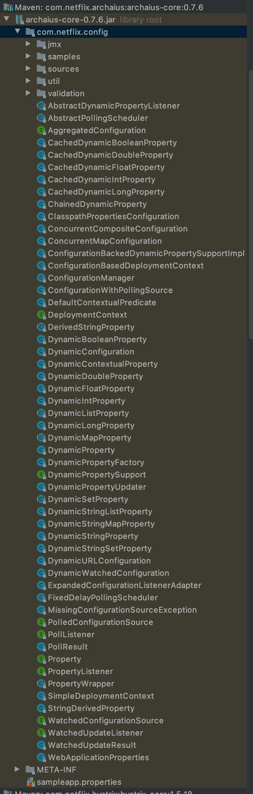

# 综述

1. archaius使用的版本为0.7.6，maven依赖如下

   ```xml
   				<dependency>
               <groupId>com.netflix.archaius</groupId>
               <artifactId>archaius-core</artifactId>
               <version>0.7.6</version>
           </dependency>
   ```

2. 为了与Spring更好的结合，引入了spring-cloud-starter-netflix-archaius包，在这个包中有官方的使用案例，为了配合Spring，官方扩展了一些数据源类型。

   ```xml
   <dependency>
       <groupId>org.springframework.cloud</groupId>
       <artifactId>spring-cloud-starter-netflix-archaius</artifactId>
       <version>2.2.2.RELEASE</version>
   </dependency>
   ```

3. 本文主要讨论archaius，不详细说明zuul/hrystrix如何进行热更新。

4. 文章分为3部分

   1. 组件的整体解析
   2. 使用例子
   3. 关键代码跟看

   

## 起因

在实际的项目中使用到了springcloud进行开发，选择的是Netflix提供的微服务解决方案，其中使用了zuul1作为网关。现在我需要让网关可以在配置中心的配置修改后进行热加载，而不必重启。

zuul提供了相关的api配置，但是有点不满足我的使用需求，所以我决定自己去对zuul进行一个扩展，看了一下相关的代码，发现zuul底层使用了archaius组件对对象的生命周期进行管理。


# archaius

主要顺着以下问题来展开

- archaius是什么？能做什么？怎么用？
- archaius可以从哪里获取数据，是如何获取的，相关的获取方法、数据源类型是否有提供扩展点
- 内部如何维护对象的生命周期，对一个值的增删改查操作是怎么实现的
- 如何实现值的热更新的


## 概述

先去看官网是怎么描述此组件的

>  Archaius includes a set of java configuration management APIs used at Netflix. It is primarily implemented as an extension of [Apache's Commons Configuration Library](http://commons.apache.org/configuration/). Notable features are:
>
> - Dynamic, Typed Properties
> - High throughput and Thread Safe Configuration operations
> - A polling framework that allows users to obtain property changes to a Configuration Source
> - A Callback mechanism that gets invoked on effective/“winning” property mutations (in the ordered hierarchy of Configurations)
> - A JMX MBean that can be accessed via JConsole to inspect and invoke operations on properties
> - Out of the box, Composite Configurations (with ordered hierarchy)  for applications (and most web applications) willing to use convention  based property file locations
>
> A more detailed description of the features can be found at [Archaius Features](https://github.com/Netflix/archaius/wiki/Features)
>
> 1. Sample Composite Configuration
>
>    
>
>    At the heart of Archaius is the concept of a Composite Configuration  which can hold one or more Configurations. Each Configuration can be  sourced from a Configuration Source such as: JDBC, REST, .properties file etc. Configuration Sources can optionally be polled at runtime for changes (In the above diagram, the Persisted DB  Configuration Source; an RDBMS containing properties in a table, is polled every so often for changes).
>
>    The final value of a property is determined based on the top most  Configuration that contains that property. i.e. If a property is present in multiple configurations, the actual value seen by the application  will be the value that is present in the topmost slot in the hierarchy  of Configurations. The hierarchy can be configured.
>
>    For more information please read the [Features](https://github.com/Netflix/archaius/wiki/Features) and [Users Guide](https://github.com/Netflix/archaius/wiki/Users-Guide) sections.
>
>    ​                     													—— https://github.com/Netflix/archaius/wiki/Overview

以上就是官方的介绍，关键是后面的两段，我来划一下重点：

- Archaius是对Apache's Commons Configuration的二次封装
- 高吞吐，线程安全的取值、存值操作
- 动态更新值，每次更新允许自定义回调函数
- 适配多种数据源，当多少数据源内有同一个值时，取最先加入数据源list的那个数据源的值


## 包结构

包的名为archaius-core-0.7.6.jar，结构如下图。



包的结构比较简单，其中jmx是管理工具不用管他，samples里面是样例，sources中定义了两种类型的数据源，util包中是工具类，validation包中是一些校验类。


##  数据源

此模块定义了数据可以从哪里获取，如何获取。数据源分为两种类型，主动拉取型与被动监听型。

### 主动拉取型


在sources包中定义了2中类型的数据源，分别是URL与JDBC的，他们实现了PolledConfigurationSource接口。URL可以指向一个网络地址，可以指向一个接口，也可以指向一个本地文件。


### 被动监听

被动监听型的数据源需要实现WatchedConfigurationSource接口，他会监听配置的动态变化，但是很可惜archaius没有提供默认实现。


## 配置集合

有了数据源，那么读取到数据之后该如何方便的进行crud操作？archaius会把从同一类数据源获取到的数据封装成一个集合，方便统一管理。archaius是基于Apache's Commons Configuration开发的，所以archaius自己的配置也都继承自AbstractConfiguration


从继承关系上看，发现Netflix对增加一个类ConcurrentMapConfiguration，在对接了spring之后又增加了一个 ，ConfigurableEnvironmentConfiguration，从名字可以知道archaius是靠着ConcurrentHasMap实现了高吞吐与线程安全。这里主要关注Netflix自己实现的几个配置类。


- **ClasspathPropertiesConfiguration**
  
  负责加载类路径下面的配置文件，他只负责加载，并不管理配置。
  
  
  
  
  
- **DynamicWatchedConfiguration**

  负责加载由监听器方式注册的数据源，需要提供一个可被监听的数据源和一个数据更新器。

  

  这边的做法就已经不是通过ConfigurationManager来管理数据了，所有配置的获取与更新都是通过DynamicPropertyUpdater类来实现了，DynamicPropertyUpdater类中有对应增删改的方法。

  

- **！ConcurrentCompositeConfiguration**

  这是一个非常重要的配置类，其中定义了一个configList，用来保存多个configuration并维护了他们加载的顺序，依靠加载顺序确定在同key情况下如何取值。当然容器也提供了对configuration的增删改查、对当前使用配置的增删改查。除此之外，还提供了配置变更时触发的回调函数，由此回调函数决定到底是否更新容器内的值。

  值得注意的是，类中出了定义了configList之外，还定义了一个overrideProperties和一个containerConfiguration。containerConfiguration是用来存放具体数据的，例如添加了新的键值对，对原有的key进行更新，其实都是操作这个对象，他是在类的初始化的时候被初始化的。overrideProperties通过查看调用链，发现只有BaseConfigMBean类使用了，也就是说只有在用JMX进行更新数据的时候才会去更新这个对象。

  

- **！DynamicURLConfiguration**

  动态URL数据源配置，官方给出的例子中就是使用了这个配置类来实现动态刷新键值对。这个类初始化需要一个AbstractPollingScheduler调度器与一个PolledConfigurationSource数据源，具体的增删改查操作都在AbstractPollingScheduler中实现。

  

- ConfigurableEnvironmentConfiguration

  这个不是原生包中的，为了方便与spring整合，在spring-cloud-netflix-archaius-2.2.2.RELEASE.jar中定义了这个配置管理类。按照springboot的一贯套路，一般还可以找到一个AutoConfigeration配置类，在这个配置类中就是用的ConfigurableEnvironmentConfiguration类来与spring自己的ConfigerableEnviroment对象整合。ConfigurableEnvironmentConfiguration有个唯一构造器，需要一个ConfigerableEnviroment实例，容器重写了父类容器的取值方法，他是直接从ConfigerableEnviroment中去取值的。

  
  
  这个ConfigurableEnvironment就是从Spring那边拿到的了。


## 配置管理器 - ConfigurationManager

当配置多了之后，需要一个统一的管理类以方便对配置进行操作，此类是个很重要的类，他实现了对各种配置集合类的管理。Manager类的所有成员变量都是静态的，所有的方法也都是静态的，其实就是一个单例的工具类。

这个类的主要功能是

1. 尝试根据系统中提前配置的4个参数，初始化默认的Configeration，初始化默认的DeploymentContext。
2. 根据要求初始化指定类型的Configeration
3. 从指定的位置或者资源对象中把配置加载进容器的上下文中
4. 获取manager类中注册的主配置
5. 从容器中获取当前AbstractConfiguration对象


显然，如果想要创建一个默认的AbstractConfiguration实例对象，那么可以创建一个ConcurrentCompositeConfiguration类实例，然后接着往实例中加入DynamicURLConfiguration类的实例，加入ConfigurableEnvironmentConfiguration类的实例，之后又加入了一个ConcurrentCompositeConfiguration类的实例，这时容器内部其实就有了多层嵌套，而且只有内层的才是真正有用的。

当然，完全可以不使用默认的，可以调用com.netflix.config.ConfigurationManager#install方法把自己组装的AbstractConfiguration实例加入到容器内，相关操作可以参考官方示例。


# 动态属性对象

