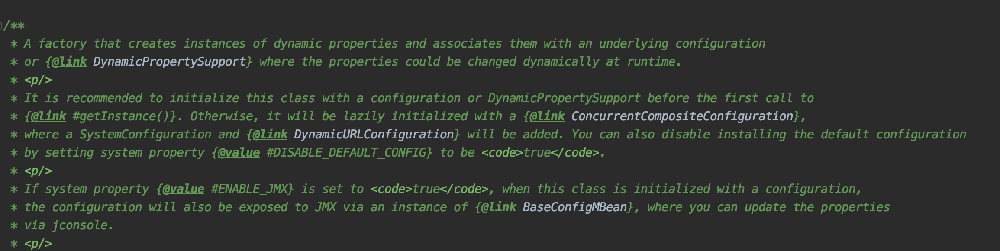

# 综述

1. archaius使用的版本为0.7.6，maven依赖如下

   ```xml
   				<dependency>
               <groupId>com.netflix.archaius</groupId>
               <artifactId>archaius-core</artifactId>
               <version>0.7.6</version>
           </dependency>
   ```

2. 为了与Spring更好的结合，引入了spring-cloud-starter-netflix-archaius包，在这个包中有官方的使用案例，为了配合Spring，官方扩展了一些数据源类型。

   ```xml
   <dependency>
       <groupId>org.springframework.cloud</groupId>
       <artifactId>spring-cloud-starter-netflix-archaius</artifactId>
       <version>2.2.2.RELEASE</version>
   </dependency>
   ```

   


在实际的项目中使用到了springcloud，选择的是Netflix提供的微服务解决方案，使用了zuul1作为网关。现在我需要让网关可以在配置中心的配置修改后，自行对修改的配置进行热加载，而不必重启。

zuul提供了相关的api配置，但是不满足我的使用需求，所以我决定自己对zuul进行一个扩展，看了一下相关的代码，发现zuul底层使用了archaius组件对对象的生命周期进行管理。


# 概述

主要顺着以下问题来展开

- archaius是什么？能做什么？怎么用？
- archaius可以从哪里获取数据，是如何获取的，相关的获取方法、数据源类型是否有提供扩展点
- 内部如何维护对象的生命周期，对一个值的增删改查操作是怎么实现的
- 如何实现值的热更新的


先去看官网是怎么描述此组件的

>  Archaius includes a set of java configuration management APIs used at Netflix. It is primarily implemented as an extension of [Apache's Commons Configuration Library](http://commons.apache.org/configuration/). Notable features are:
>
> - Dynamic, Typed Properties
> - High throughput and Thread Safe Configuration operations
> - A polling framework that allows users to obtain property changes to a Configuration Source
> - A Callback mechanism that gets invoked on effective/“winning” property mutations (in the ordered hierarchy of Configurations)
> - A JMX MBean that can be accessed via JConsole to inspect and invoke operations on properties
> - Out of the box, Composite Configurations (with ordered hierarchy)  for applications (and most web applications) willing to use convention  based property file locations
>
> A more detailed description of the features can be found at [Archaius Features](https://github.com/Netflix/archaius/wiki/Features)
>
> 1. Sample Composite Configuration
>
>    
>
>    At the heart of Archaius is the concept of a Composite Configuration  which can hold one or more Configurations. Each Configuration can be  sourced from a Configuration Source such as: JDBC, REST, .properties file etc. Configuration Sources can optionally be polled at runtime for changes (In the above diagram, the Persisted DB  Configuration Source; an RDBMS containing properties in a table, is polled every so often for changes).
>
>    The final value of a property is determined based on the top most  Configuration that contains that property. i.e. If a property is present in multiple configurations, the actual value seen by the application  will be the value that is present in the topmost slot in the hierarchy  of Configurations. The hierarchy can be configured.
>
>    For more information please read the [Features](https://github.com/Netflix/archaius/wiki/Features) and [Users Guide](https://github.com/Netflix/archaius/wiki/Users-Guide) sections.
>
>    ​                     													—— https://github.com/Netflix/archaius/wiki/Overview

以上就是官方的介绍，关键是后面的两段，我来划一下重点：

- Archaius是对Apache's Commons Configuration的二次封装
- 高吞吐，线程安全的取值、存值操作
- 动态更新值，每次更新允许自定义回调函数
- 适配多种数据源，当多少数据源内有同一个值时，取最先加入数据源list的那个数据源的值


# 包结构

包的名为archaius-core-0.7.6.jar，结构如下图。


包的结构比较简单，其中jmx是管理工具，samples包存放样例，sources包中定义了两种类型的数据源，util包中是工具类，validation包中是一些校验类。


#  数据源

此模块定义了数据可以从哪里获取，如何获取。数据源分为两种类型，主动拉取型与被动监听型。

## 主动拉取型


在sources包中定义了2中类型的数据源，分别是URL与JDBC的，他们都实现了PolledConfigurationSource接口。URL类型的可以指向一个网络地址，可以指向一个接口，也可以指向一个本地文件。JDBC用于从数据库中获取数据源。


## 被动监听

被动监听型的数据源需要实现WatchedConfigurationSource接口，他会监听配置的动态变化，但是很可惜archaius没有提供默认实现。


# 配置集合

有了数据源，那么读取到数据之后该如何方便的进行crud操作？archaius会把同一类型的数据封装成一个集合，方便统一管理。archaius是基于Apache's Commons Configuration开发的，所以archaius自己的配置也都继承自AbstractConfiguration


从继承关系上看，会发现Netflix增加了一个类ConcurrentMapConfiguration，在对接了spring之后又增加了一个 ConfigurableEnvironmentConfiguration，从名字上知道archaius是通过ConcurrentHasMap实现了高吞吐与线程安全。

这里主要关注Netflix自己实现的几个配置类。


- **ClasspathPropertiesConfiguration**
  
  负责加载类路径下面的配置文件，他只负责加载，并不管理配置。
  
  
  
  
  
- **DynamicWatchedConfiguration**

  负责加载由监听器方式注册的数据源，需要提供一个数据源和一个数据更新器。

  

  这边的做法已经不是通过ConfigurationManager来管理数据了，所有配置的获取与更新都是通过DynamicPropertyUpdater类来实现了，DynamicPropertyUpdater类中有对应增删改的方法。

  

- **！ConcurrentCompositeConfiguration**

  这是一个非常重要的配置类，其中定义了一个configList，用来保存多个configuration并维护了他们加载的顺序，依靠加载顺序确定在同key情况下如何取值。当然容器也提供了对configuration的增删改查、对当前使用配置的增删改查。除此之外，还提供了配置变更时触发的回调函数，由此回调函数决定到底是否更新容器内的值。

  值得注意的是，类中出了定义了configList之外，还定义了一个overrideProperties和一个containerConfiguration。containerConfiguration是用来存放具体数据的，例如添加了新的键值对，对原有的key进行更新，其实都是操作这个对象，他是在类的初始化的时候被初始化的。overrideProperties通过查看调用链，发现只有BaseConfigMBean类使用了，也就是说只有在用JMX进行更新数据的时候才会去更新这个对象。

  

- **！DynamicURLConfiguration**

  动态URL数据源配置，官方给出的例子中就是使用了这个配置类来实现动态刷新键值对。这个类初始化需要一个AbstractPollingScheduler调度器与一个PolledConfigurationSource数据源，具体的增删改查操作都在AbstractPollingScheduler中实现。

  

- ConfigurableEnvironmentConfiguration

  这个不是原生包中的，为了方便与spring整合，在spring-cloud-netflix-archaius-2.2.2.RELEASE.jar中定义了这个配置管理类。按照springboot的一贯套路，一般还可以找到一个AutoConfigeration配置类，在这个配置类中就是用的ConfigurableEnvironmentConfiguration类来与spring自己的ConfigerableEnviroment对象整合。ConfigurableEnvironmentConfiguration有个唯一构造器，需要一个ConfigerableEnviroment实例，容器重写了父类容器的取值方法，他是直接从ConfigerableEnviroment中去取值的。

  
  
  这个ConfigurableEnvironment就是从Spring那边拿到的了。


# 配置管理器 - ConfigurationManager

当配置多了之后，需要一个统一的管理类以方便对配置进行统一操作，此类是个很重要的类，他实现了对各种配置集合类的管理。Manager类的所有成员变量都是静态的，所有的方法也都是静态的，其实是一个单例的工具类。

这个类的主要功能是

1. 尝试根据系统中提前配置的4个参数，初始化默认的Configeration，初始化默认的DeploymentContext。
2. 根据要求初始化指定类型的Configeration
3. 从指定的位置或者资源对象中把配置加载进容器的上下文中
4. 获取manager类中注册的主配置
5. 从容器中获取当前AbstractConfiguration对象


显然，如果想要创建一个默认的AbstractConfiguration实例对象，那么可以创建一个ConcurrentCompositeConfiguration类实例，然后接着往实例中加入DynamicURLConfiguration类的实例，加入ConfigurableEnvironmentConfiguration类的实例，之后又加入了一个ConcurrentCompositeConfiguration类的实例，这时容器内部其实就有了多层嵌套，而且只有内层的才是真正有用的。

当然，完全可以不使用默认的，可以调用com.netflix.config.ConfigurationManager#install方法把自己组装的AbstractConfiguration实例加入到容器内，相关操作可以参考官方示例。


# 动态属性对象

我们已经可以从ConfigurationManager中拿到AbstractConfiguration集合了，但是由于各个集合内部实现不同，不太可能自己去操作集合接口获取值，况且取出值后还需要进行类型转换，是在过于麻烦，所以archaius提供了一个统一的方法，例如：

 ```java

DynamicPropertyFactory
				.getInstance()
				.getStringProperty(
						"com.netflix.config.samples.SampleApp.SampleBean.name",
						"Sample Bean").get();
 ```

从动态变量工厂中直接获取一个string类型的变量，变量的类型有用户自己决定。


## DynamicPropertyFactory



简单看一下类上方作者留下说明。这个工厂创建了动态变量并把动态变量关联了一些基本的配置集合或者关联了DynamicPropertySupport，使得这些变量可以在运行期间动态更新。

这个类有一些特点

1. 所有成员对象都是静态的。

2. 构造方法私有化，只提供了几个对外的初始化方法

3. 提供了大量的样板方法，可以获取各种类型的参数值

   ```java
   		/**
        * Create a new property whose value is a string and subject to change on-the-fly.
        *
        * @param propName               property name
        * @param defaultValue           default value if the property is not defined in underlying configuration
        * @param propertyChangeCallback a Runnable to be called when the property is changed
        */
       public DynamicStringProperty getStringProperty(String propName, String defaultValue, final Runnable propertyChangeCallback) {
           checkAndWarn(propName);
           DynamicStringProperty property = new DynamicStringProperty(propName, defaultValue);
           addCallback(propertyChangeCallback, property);
           return property;
       }
   ```


**问题：**

思考一下，在上面的方法中，所有的取值对象都是直接返回的new出来的对象，那么他是如何取到的配置文件中的值的？

这里需要先看一下DynamicPropertyFactory类的初始化过程


前半部分都是校验，把刚刚放入ConfigurationBackedDynamicPropertySupportImpl中的AbstractConfiguration又拿出来各种校验，最后setDirect(configuration)。


注意此处support被赋值给了当前工厂类的静态对象，并且还在DynamicProperty中注册了

我们看到第一个init方法中的ConfigurationBackedDynamicPropertySupportImpl类，首先它是DynamicPropertySupport接口的一个具体实现，这个接口只定义了2个方法


一个用来获取值，一个用来增加监听器，这个接口设计出来就是为了屏蔽底层具体实现，比如换了底层配置使用了原生的如Apache's Commons Configuration，上层业务代码不必改。接口的唯一实现类定义了一个私有的成员对象AbstractConfiguration config；ConfigurationBackedDynamicPropertySupportImpl只是套了一层皮而已。

接着往上挖，可以看到从配置管理器中加载了最初的AbstractConfiguration。

好的，那么继续，在工厂类的初始化方法中，除了对工厂类中的静态变量进行赋值，还调用了DynamicProperty中的注册方法，注册了DynamicPropertySupport，注册方法中只调用了DynamicProperty的静态初始化方法，这里需要对几个关键类进行一个说明。


## DynamicProperty&PropertyWrapper


重点关注一下DynamicProperty、PropertyWrapper、Property、DynamicStringProperty这个几个类的关系。PropertyWrapper是个抽象类，他是Property接口的一个具体实现。从名字上看，PropertyWrapper是Property的包装类，他有一个重要的成员变量是DynamicProperty，他对属性的操作是通过操作DynamicProperty对象完成的，而DynamicStringProperty继承了PropertyWrapper，从类名可以知道这个类只做字符串相关的操作。其实还有一大票的具体类继承自PropertyWrapper，但都是专注与某一种具体的类型。


### PropertyWrapper

PropertyWrapper类最主要的功能就是负责构造子类对象，负责管理对象的回调函数，其中主要的逻辑就在构造方法中。

通过静态方法`DynamicProperty.getInstance(propName)`获取了相应的key的对象，这个对象里面的值可能是null，也可能是个缓存，这取决于你是否是第一次调用。下面if中的代码是判断相应的实现类中是否有加回调方法，如果有就把回调方法注册到具体的属性对象上，同时，在回调记录列表中增加一条记录，方便以后移除。


### DynamicProperty

DynamicProperty是在archaius中存放配置的数据结构，实现了高效、安全的数据存取，这个类才是干活的主要类，先看一下DynamicProperty类的结构：

- 首先，他有两个内部类，一个抽象类CachedValue，一个静态类DynamicPropertyListener
  - 关于抽象类CachedValue，在DynamicProperty中就有7个实现类，分别对应了7种数据类型，他们缓存了这个key的value值。
  - DynamicPropertyListener是此DynamicProperty的回调类，这部分在值得热更新部分再说。
- 定义了一些私有成员变量，包括key、value、callbackSet等。
- 一个静态的ConcurrentHashMap，保存了所有的DynamicProperty。
- 两个私有的构造方法，提供了一个对外的静态初始化方法`com.netflix.config.DynamicProperty#getInstance`
- 提供了值的获取、更新等操作。
- 提供了操作回调函数的相关操作。


我们任然从唯一的入口`getInstance`开始，所有的取值操作都是通过这个方法获取到相应的Property的


1. 先判断内部存配置的容器是否初始化了，为空就初始化。
2. 从ALL_PROPS缓存中看看有没有缓存，有缓存就用缓存，没有的话就构建一个新的。


```java
		com.netflix.config.DynamicProperty    

		//DynamicProperty类具体的构造方法
		private DynamicProperty(String propName) {
        this.propName = propName;
        updateValue();
    }

		//尝试从容器中根据key取出value值，需要注意的是，此方法只是尝试取出值后更新缓存，并不是把最新的值返回
		//值其实还是存在了类的成员变量中，需要调用相应的get()方法才能拿到
 		private boolean updateValue() {
        String newValue;
        try {
            if (dynamicPropertySupportImpl != null) {
                newValue = dynamicPropertySupportImpl.getString(propName);
            } else {
                return false;
            }
        } catch (Exception e) {
            e.printStackTrace();
            logger.error("Unable to update property: " + propName, e);
            return false;
        }
        return updateValue(newValue);
    }

		//如果查询到缓存中有，对比一下新值旧值是否一样，不一样就刷新一下各个类型的值得缓存
    boolean updateValue(Object newValue) {
        String nv = (newValue == null) ? null : newValue.toString();
        synchronized (lock) {
            if ((nv == null && stringValue == null)
               || (nv != null && nv.equals(stringValue))) {
                return false;
            }
            stringValue = nv;
            setStatusForValues();
            changedTime = System.currentTimeMillis();
            return true;
        }
    }
```

至此，我们通过getInstance方法拿到了一个DynamicProperty对象，他内部存储的是键值对，并且值可能还是空的，如果想要获得值，需要调用get()方法。

```java
    com.netflix.config.DynamicStringProperty
    //这里还是调用父类的方法，不过在子类中确定了类型，是调用父类的string方法了
    public String get() {
        return prop.getString(defaultValue);
    }

		com.netflix.config.DynamicProperty
    public String getString(String defaultValue) {
        return cachedStringValue.getValue(defaultValue);
    }
    
    public T getValue(T defaultValue) {
            try {
                T result = getValue();
                return (result == null) ? defaultValue : result;
            } catch (IllegalArgumentException e) {
                return defaultValue;
            }
     }
     
     //取值，有值旧返回，无值返回默认
     public T getValue() throws IllegalArgumentException {
            // Not quite double-check locking -- since isCached is marked as volatile
            if (!isCached) {
                synchronized (lock) {
                    try {
                        value = (stringValue == null) ? null : parse(stringValue);
                        exception = null;
                    } catch (Exception e) {
                        value = null;
                        exception = new IllegalArgumentException(e);
                    } finally {
                        isCached = true;
                    }
                }
            }
            if (exception != null) {
                throw exception;
            } else {
                return value;
            }
        }
```

如果无变更，代表的是第一次调用，那么取主类成员变量赋值给缓存类的value变量，调用各个不同子类实现的parse方法，转换数据类型。

如果有变更那么直接返回缓存的value，因为热更新操作变更的是缓存内的值，主类的stringValue值已经过期不对了。

那么其实每次的get()方法都是访问的缓存对象，缓存只有在初始化时会为空，去读父类的value值，后面与父类的值都无关了，直接读的缓存。

到此，其实已经说明白了archaius是如何取值的了。


# 热更新

如果定义的数据源内的配置变了，那么各个configuration内的值是如何更新的呢？我们已经知道，当我们通过get()方法尝试取值时，其实访问的是缓存内部类，那么如果有变更肯定是直接更新缓存。


关注**DynamicURLConfiguration**动态URL配置类


不管是哪个构造方法，最后都会去调用父类的`startPolling()`方法


在初始化后调度器加载数据源开始轮询调度。

```java
com.netflix.config.AbstractPollingScheduler

public void startPolling(final PolledConfigurationSource source, final Configuration config) {
    //完成第一次数据初始化工作
    initialLoad(source, config);
  	//之后的更新操作创建一个独立的线程来做	
    Runnable r = getPollingRunnable(source, config);
    schedule(r);
}

protected synchronized void initialLoad(final PolledConfigurationSource source, final Configuration config) {      
        PollResult result = null;
        try {
            //往指定的URL数据源建立输入流，并把从远端获取到的配置信息封装成PollResult返回
            result = source.poll(true, null); 
            checkPoint = result.getCheckPoint();
            //触发接口回调
            fireEvent(EventType.POLL_SUCCESS, result, null);
        } catch (Throwable e) {
            throw new RuntimeException("Unable to load Properties source from " + source, e);
        }
        try {
          	//更新容器内的值
            populateProperties(result, config);
        } catch (Throwable e) {                        
            throw new RuntimeException("Unable to load Properties", e);            
        }
    }

//轮询监听器列表，挨个触发回调接口的配置变更方法
private void fireEvent(PollListener.EventType eventType, PollResult result, Throwable e) {
        for (PollListener l: listeners) {
            try {
                l.handleEvent(eventType, result, e);
            } catch(Throwable ex) {
                log.error("Error in invoking listener", ex);
            }
        }
    }
```


细看一下定时任务中到底有哪些工作

```java
protected Runnable getPollingRunnable(final PolledConfigurationSource source, final Configuration config) {
    return new Runnable() {
        public void run() {
            log.debug("Polling started");
            PollResult result = null;
            try {
              	//从数据源拉取数据
                result = source.poll(false, getNextCheckPoint(checkPoint));
                checkPoint = result.getCheckPoint();
              	//触发回调函数
                fireEvent(EventType.POLL_SUCCESS, result, null);
            } catch (Throwable e) {
                log.error("Error getting result from polling source", e);
                fireEvent(EventType.POLL_FAILURE, null, e);
                return;
            }
            try {
              	//更新容器内的值
                populateProperties(result, config);
            } catch (Throwable e) {
                log.error("Error occured applying properties", e);
            }                 
        }
        
    };   
}

 //判断是全量还是增量，循环结果集，调用相应的propertyUpdater辅助类来完成对值得更新
 protected void populateProperties(final PollResult result, final Configuration config) {
        if (result == null || !result.hasChanges()) {
            return;
        }
        if (!result.isIncremental()) {
            Map<String, Object> props = result.getComplete();
            if (props == null) {
                return;
            }
            for (Entry<String, Object> entry: props.entrySet()) {
                propertyUpdater.addOrChangeProperty(entry.getKey(), entry.getValue(), config);
            }
            HashSet<String> existingKeys = new HashSet<String>();
            for (Iterator<String> i = config.getKeys(); i.hasNext();) {
                existingKeys.add(i.next());
            }
            if (!ignoreDeletesFromSource) {
                for (String key: existingKeys) {
                    if (!props.containsKey(key)) {
                        propertyUpdater.deleteProperty(key, config);
                    }
                }
            }
        } else {
            Map<String, Object> props = result.getAdded();
            if (props != null) {
                for (Entry<String, Object> entry: props.entrySet()) {
                    propertyUpdater.addOrChangeProperty(entry.getKey(), entry.getValue(), config);
                }
            }
            props = result.getChanged();
            if (props != null) {
                for (Entry<String, Object> entry: props.entrySet()) {
                    propertyUpdater.addOrChangeProperty(entry.getKey(), entry.getValue(), config);
                }
            }
            if (!ignoreDeletesFromSource) {
                props = result.getDeleted();
                if (props != null) {
                    for (String name: props.keySet()) {
                        propertyUpdater.deleteProperty(name, config);
                    }
                }            
            }
        }
    }
```