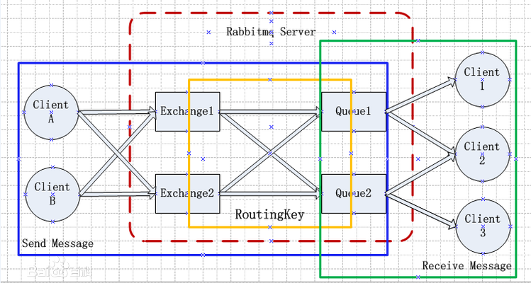
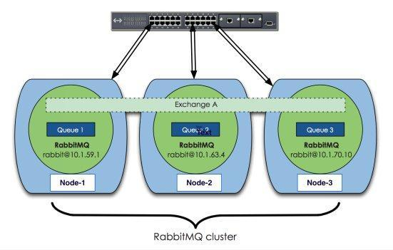
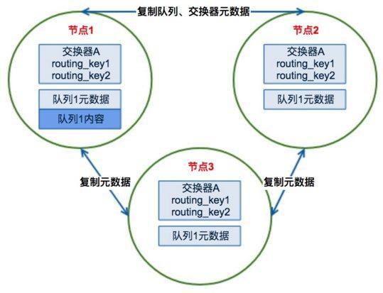

# 系统架构




Rabbitmq系统最核心的组件是Exchange和Queue。


# RabbitMQ 基本概念

1. Message 消息，消息是不具名的，它由消息头和消息体组成，payload（有效载荷）和label（标签）。消息体是不透明的，而消息头则由一系列的可选属性组成，这些属性包括routing-key（路由键）、priority（相对于其他消息的优先权）、delivery-mode（指出该消息可能需要持久性存储）等。
2. Publisher 消息的生产者，也是一个向交换器发布消息的客户端应用程序。
3. Exchange 交换器，用来接收生产者发送的消息并将这些消息路由给服务器中的队列。
4. Binding 绑定，用于消息队列和交换器之间的关联。一个绑定就是基于路由键将交换器和消息队列连接起来的路由规则，所以可以将交换器理解成一个由绑定构成的路由表。
5. Queue 消息队列，用来保存消息直到发送给消费者。它是消息的容器，也是消息的终点。一个消息可投入一个或多个队列。消息一直在队列里面，等待消费者连接到这个队列将其取走。
6. Connection 网络连接，就是一个TCP的连接。Producer和Consumer都是通过TCP连接到RabbitMQ Server的。
7. Channel 信道，多路复用连接中的一条独立的双向数据流通道。信道是建立在真实的TCP连接内地虚拟连接，AMQP 命令都是通过信道发出去的，不管是发布消息、订阅队列还是接收消息，这些动作都是通过信道完成。因为对于操作系统来说建立和销毁 TCP 都是非常昂贵的开销，所以引入了信道的概念，以复用一条 TCP 连接，在客户端的每个连接里，可建立多个channel，每个channel代表一个会话任务。
8. Consumer 消息的消费者，表示一个从消息队列中取得消息的客户端应用程序。
9. Virtual Host 虚拟主机，表示一批交换器、消息队列和相关对象。虚拟主机是共享相同的身份认证和加密环境的独立服务器域。每个 vhost 本质上就是一个 mini 版的 RabbitMQ 服务器，拥有自己的队列、交换器、绑定和权限机制。vhost 是 AMQP 概念的基础，必须在连接时指定，RabbitMQ 默认的 vhost 是 / 。
10. RabbitMQ Server也叫Broker Server，Broker 表示消息队列服务器实体。


# Queue

- Queue（队列）是RabbitMQ的内部对象，用于存储消息。

- Queue具有自己的 erlang 进程。

- RabbitMQ中的消息都只能存储在Queue中，生产者将消息发送到Exchange，由Exchange将消息路由到一个或多个Queue中，消费者可以从Queue中获取消息并消费。

- 多个消费者可以订阅同一个Queue，这时Queue中的消息会被**平均分摊**给多个消费者进行处理，而不是每个消费者都收到所有的消息并处理。

- 对于多个Consumer来说，RabbitMQ 使用循环的方式（round-robin）的方式均衡的发送给不同的Consumer。

- queue也可以自动删除，被标为auto-delete的queue在最后一个Consumer unsubscribe后就会被自动删除。

- 创建已经存在的queue，将不会有任何影响。第二次创建如果参数和第一次不一样，那么该操作虽然成功，但是queue的属性并不会被修改。

- Consumer和Procuder都可以通过 queue.declare 创建queue，实际使用的时候都尝试创建为好。

- 在queue创建时，它会自动的以queue的名字作为routing key来绑定那个exchange。


# 死信队列

**“dead letter” queue 死信队列**：当消息被 RabbitMQ server 投递到 consumer 后，但 consumer 却通过 Basic.Reject 进行了拒绝时（同时设置 requeue=false），那么该消息会被放入“dead letter”queue 中。该 queue 可用于排查 message 被 reject 或 undeliver 的原因。 


以下情况会导致消息进入死信队列：

- basic.reject/basic.nack 并且 requeue为false(不重回队列)的时候，消息就是死信
- 消息TTL过期
- 队列达到最大的长度


设置死信队列包括：

- 设置Exchange(dlx.exchange名称随意),设置Queue(dlx.queue),设置RoutingKey(#)
- 创建正常的交换机，队列，绑定，只不过加上一个参数 arguments.put(“x-dead-letter-exchange”,“dlx.exchange”)


```java
   		// 这就是一个普通的交换机 和 队列 以及路由
		String exchangeName = "test_dlx_exchange";
		String routingKey = "dlx.#";
		String queueName = "test_dlx_queue";
		
		channel.exchangeDeclare(exchangeName, "topic", true, false, null);
		
		Map<String, Object> agruments = new HashMap<String, Object>();
		agruments.put("x-dead-letter-exchange", "dlx.exchange");
		//这个agruments属性，要设置到声明队列上
		channel.queueDeclare(queueName, true, false, false, agruments);
		channel.queueBind(queueName, exchangeName, routingKey);
		
		//要进行死信队列的声明:
		channel.exchangeDeclare("dlx.exchange", "topic", true, false, null);
		channel.queueDeclare("dlx.queue", true, false, false, null);
		channel.queueBind("dlx.queue", "dlx.exchange", "#");
```


# 消息不可达

生产者通过指定交换机和路由键来把消息送到队列中，但有时候指定的路由键不存在，或者交换机不存在，那么消息就会return，我们可以通过添加return listener来实现：

```java
		channel.addReturnListener(new ReturnListener() {
			@Override
			public void handleReturn(int replyCode, String replyText, String exchange,
					String routingKey, BasicProperties properties, byte[] body) throws IOException {
				
				System.err.println("---------handle  return----------");
				
			}
		});
		
		channel.basicPublish(exchange, routingKeyError, true, null, msg.getBytes());
```

在basicPublish中的Mandatory要设置为true才会生效，否则broker会删除该消息。


# ACK

- Message acknowledgment（消息回执）。消费者在消费完消息后发送一个回执给RabbitMQ，这个回执就叫做ACK。
- 如果RabbitMQ没有收到回执并检测到消费者的RabbitMQ连接断开，则RabbitMQ会将该消息发送给其他消费者（如果存在多个消费者）进行处理。这里**不存在timeout**，一个消费者处理消息时间再长也不会导致该消息被发送给其他消费者，除非它的RabbitMQ连接断开。
- publish message 是没有ACK的。


# Reject

- 第一种若在该信令中设置 requeue=true，的Reject可以让RabbitMQ Server将该Message 发送到下一个Consumer。
- 第二种设置 requeue=false ，从Queue中立即删除该Message。


# 持久化

- RabbitMQ服务重启后不会丢失消息，可以将Queue与Message都设置为可持久化的（durable）。
- 要求queue 和 exchange 具有 durable 属性，同时 message 具有 persistent 属性。

```java
		 //声明消息队列，且为可持久化的     	 
		 channel.queueDeclare(queue_name, durable, false, false, null); 
         String message = "Hello world" + Math.random();
         //将队列设置为持久化之后，还需要将消息也设为可持久化的，	MessageProperties.PERSISTENT_TEXT_PLAIN
         channel.basicPublish("", queue_name, MessageProperties.PERSISTENT_TEXT_PLAIN,message.getBytes());
```


消息什么时候会刷到磁盘？

- 写入文件前会有一个Buffer，大小为1M（1048576），数据在写入文件时，首先会写入到这个Buffer，如果Buffer已满，则会将Buffer写入到文件（未必刷到磁盘）；
- 有个固定的刷盘时间：25ms，也就是不管Buffer满不满，每隔25ms，Buffer里的数据及未刷新到磁盘的文件内容必定会刷到磁盘；
- 每次消息写入后，如果没有后续写入请求，则会直接将已写入的消息刷到磁盘：使用Erlang的receive x after 0来实现，只要进程的信箱里没有消息，则产生一个timeout消息，而timeout会触发刷盘操作。


消息在磁盘文件中的格式？

- 消息保存于$MNESIA/msg_store_persistent/x.rdq文件中，其中x为数字编号，从1开始，每个文件最大为16M（16777216），超过这个大小会生成新的文件，文件编号加1。消息以以下格式存在于文件中：`Size:64, MsgId:16/binary, MsgBody`

- MsgId为RabbitMQ通过rabbit_guid:gen()每一个消息生成的GUID，MsgBody会包含消息对应的exchange，routing_keys，消息的内容，消息对应的协议版本，消息内容格式（二进制还是其它）等等。


文件何时删除？

- 当所有文件中的垃圾消息（已经被删除的消息）比例大于阈值（GARBAGE_FRACTION = 0.5）时，会触发文件合并操作（至少有三个文件存在的情况下），以提高磁盘利用率。

- publish消息时写入内容，ack消息时删除内容（更新该文件的有用数据大小），当一个文件的有用数据等于0时，删除该文件。


消息索引什么时候需要持久化？

- 索引的持久化与消息的持久化类似，也是在两种情况下需要写入到磁盘中：要么本身需要持久化，要么因为内存紧张，需要释放部分内存。


消息索引什么时候会刷到磁盘？
- 有个固定的刷盘时间：25ms，索引文件内容必定会刷到磁盘；

- 每次消息（及索引）写入后，如果没有后续写入请求，则会直接将已写入的索引刷到磁盘，实现上与消息的timeout刷盘一致。


# Prefetch count

- Prefetch count会限制Queue每次发送给每个消费者的消息数，比如我们设置prefetchCount=1，则Queue每次给每个消费者发送一条消息；消费者处理完这条消息后Queue会再给该消费者发送一条消息。


# Exchange

 内部实现为保存 binding 关系的查找表。

- **Binding key**
  - 绑定规则或者路由规则。绑定（Binding）Exchange与Queue的同时，指定一个Binding key。生产者将消息发送给Exchange时，一般会指定一个Routing Key。当Binding key与Routing Key相匹配时，消息将会被路由到对应的Queue中。
  - 在绑定多个Queue到同一个Exchange的时候，这些Binding允许使用相同的Binding key。<!--//todo 需要看一下在direct下，多个队列绑定相同的key，数据是怎么发的。-->
  - Binding key并不是在所有情况下都生效，它依赖于Exchange Type，比如fanout类型的Exchange就会无视Binding key，而是将消息路由到所有绑定到该Exchange的Queue。
- **Exchange Types**
  - **fanout**
    - 广播。把所有发送到该Exchange的消息路由到所有与它绑定的Queue中。
  - **direct**
    - 字符串全匹配。它会把消息路由到那些Binding key与Routing key完全匹配的Queue中。
  - **topic**
    - 模糊匹配。Routing Key为一个句点号“.”分隔的字符串，其中"*"用于匹配一个单词，"#"用于匹配多个单词（可以是零个）。
  - **headers**
    - headers类型的Exchange不依赖于Routing Key与Binding Key的匹配规则来路由消息，而是根据发送的消息内容中的headers属性进行匹配。
    - 在绑定Queue与Exchange时指定一组键值对；当消息发送到Exchange时，RabbitMQ会取到该消息的headers（也是一个键值对的形式），对比其中的键值对是否完全匹配Queue与Exchange绑定时指定的键值对。如果完全匹配则消息会路由到该Queue，否则不会路由到该Queue。
    - headers 交换器和 direct 交换器完全一致，但性能差很多，目前几乎用不到了
  - **RPC**
    - 用不上


# 集群

## 普通的集群

原理：

RabbitMQ这款消息队列中间件产品本身是基于Erlang编写，Erlang语言天生具备分布式特性（通过同步Erlang集群各节点的magic cookie来实现）。因此，RabbitMQ天然支持Clustering。这使得RabbitMQ本身不需要像ActiveMQ、Kafka那样通过ZooKeeper分别来实现HA方案和保存集群的元数据。集群是保证可靠性的一种方式，同时可以通过水平扩展以达到增加消息吞吐量能力的目的。 下面先来看下RabbitMQ集群的整体方案：




- RabbitMQ集群元数据的同步

  RabbitMQ集群会始终同步四种类型的内部元数据（类似索引）：

1. 队列元数据：队列名称和它的属性；

2. 交换器元数据：交换器名称、类型和属性；

3. 绑定元数据：一张简单的表格展示了如何将消息路由到队列；

4. vhost元数据：为vhost内的队列、交换器和绑定提供命名空间和安全属性；

   因此，当用户访问其中任何一个RabbitMQ节点时，通过rabbitmqctl查询到的queue／user／exchange/vhost等信息都是相同的。


- 为何RabbitMQ集群仅采用元数据同步的方式

  1. 第一，存储空间，如果每个集群节点都拥有所有Queue的完全数据拷贝，那么每个节点的存储空间会非常大，集群的消息积压能力会非常弱（**无法通过集群节点的扩容提高消息积压能力**）；
  2. 第二，性能，消息的发布者需要将消息复制到每一个集群节点，对于持久化消息，网络和磁盘同步复制的开销都会明显增加。

- 工作原理




- 场景1、客户端直接连接队列所在节点

  如果有一个消息生产者或者消息消费者通过amqp-client的客户端连接至节点1进行消息的发布或者订阅，那么此时的集群中的消息收发只与节点1相关，这个没有任何问题；


- 场景2、客户端连接的是非队列数据所在节点

  如果消息生产者所连接的是节点2或者节点3，此时队列1的完整数据不在该两个节点上，那么在发送消息过程中这两个节点主要起了一个**路由转发**作用，根据这两个节点上的元数据（也就是上文提到的：**指向queue的owner node的指针**）转发至节点1上，最终发送的消息还是会存储至节点1的队列1上。
  同样，如果消息消费者所连接的节点2或者节点3，那这两个节点也会作为路由节点起到转发作用，将会从节点1的队列1中拉取消息进行消费。

  所以

  - 创建队列都连到了一个节点上，所有的队列都存储在一个节点上。 
  - 存消息的节点挂掉了，consumer只能等到节点恢复后才能读到消息。
  - 设A,B节点，queue数据在A上：可以向A或B生产或消费消息。但是一旦往B生产消息时A挂了，client是不会收到任何错误信息的并可以继续发送，而实际上消息是被丢弃了。一旦此时client挂了后在连接B会报节点A不存在而失败。在B读也是类似的，在client批量取到的数据读完之前是不会感知A有没有挂掉，等到读取下一批数据时一旦A挂掉会报错。 


- 集群节点类型
  - 磁盘节点
  - 内存节点


  1. **单节点系统必须是磁盘节点**，否则每次你重启RabbitMQ之后所有的系统配置信息都会丢失。
  2. **RabbitMQ要求集群中至少有一个磁盘节点**，当节点加入和离开集群时，必须通知磁盘节点。

- 特殊异常：集群中唯一的磁盘节点崩溃了

    如果集群中的唯一一个磁盘节点，结果这个磁盘节点还崩溃了，那会发生什么情况？

    如果唯一磁盘的磁盘节点崩溃了，不能进行如下操作：

    - 不能创建队列
    - 不能创建交换器
    - 不能创建绑定
    - 不能添加用户
    - 不能更改权限
    - 不能添加和删除集群几点

    **总结：如果唯一磁盘的磁盘节点崩溃，集群是可以保持运行的，但你不能更改任何东西。**

    **解决方案：**在集群中设置两个磁盘节点，只要一个可以，你就能正常操作。

  


特点：高吞吐，非高可用。


## 镜像队列

队列的数据都镜像了一份到所有的节点上。这样任何一个节点失效，不会影响整个集群的使用。 

在实现上，mirror queue内部有一套选举算法，会选出一个master，和若干个slaver。master和slaver 
通过相互间不断发送心跳来检查是否连接断开。可以通过指定net_ticktime来控制心跳检查频率。注意一个单位时间net_ticktime实际上做了4次交互，故当超过net_ticktime(± 25%) 秒没有响应的话则认为节点挂掉。


例子：

- consumer，任意连接一个节点，若连上的不是master，请求会转发给master，为了保证消息的可靠性，consumer回复ack给master后，master删除消息并广播所有的slaver去删除。 
- publisher ，任意连接一个节点，若连上的不是master，则转发给master，由master存储并转发给其他的slaver存储。 
- 如果master挂掉，则从slaver中选择消息队列最长的为master，在这种情况下可能存在未同步ack消息的情况，会造成消息重发（默认是异步同步的）。
- 总共有以下几件事情发生： 
  - 1个最老的（队列最长的）的slaver提升为master，如果没有一个slaver是和master同步的则会造成消息丢失。 
  - 要提升为master的slaver会认为以前所有连接挂掉的master的消费者都断开了连接。那么存在client发送了ack的消息单还在路上时master挂掉的情况，或者master收到了ack但是在广播给slaver的时候master挂掉的情况，所以新的master别无选择，只能认为消息没有被确认。他会requeue他认为没有ack的消息。那么client可能就收到了重复的消息，并要再次发送ack。 
  - 从镜像队列中消费的client支持了consumer Cancellation通知的，将收到通知并订阅的mirrored-queue被取消了，这是因为该mirrored-queue 升级成了master，这是client需要重现去找mirrored-queue上消费，这样就避免了client继续发送ack到老的挂掉的master上。避免收到新的master发送的相同的消息。 
  - 如果noAck=true，且在mirrored-queue上消费，那么在切换时由于服务器是先ack然后发送到noAck=true的消费者，这时连接断开可能导致该数据丢失 
- 如果slaver挂掉，则集群的节点状态没有任何变化。只要client没有连到这个节点上，也不会给client发送失败的通知。在检测到slaver挂掉的期间publish消息会有延迟。如果配置了高可用策略是自动同步，当slaver起来后，队列中有大量的消息需要同步，将会整个集群阻塞长时间的不能读写直到同步结束。 


<!--//todo 需要手动配置一下-->

<!--//todo 最好是在docker里面进行一下配置-->


# 常见题目

**什么是元数据？元数据分为哪些类型？包括哪些内容？与 cluster 相关的元数据有哪些？元数据是如何保存的？元数据在 cluster 中是如何分布的？** 

- 在非 cluster 模式下，元数据主要分为 Queue 元数据（queue 名字和属性等）、Exchange 元数据（exchange 名字、类型和属性等）、Binding 元数据（存放路由关系的查找表）、Vhost 元数据（vhost 范围内针对前三者的名字空间约束和安全属性设置）。
- 在 cluster 模式下，还包括 cluster 中 node 位置信息和 node 关系信息。元数据按照 erlang node 的类型确定是仅保存于 RAM 中，还是同时保存在 RAM 和 disk 上。元数据在 cluster 中是全 node 分布的。 


**什么情况下会出现 blackholed 问题？** 
答：blackholed 问题是指，向 exchange 投递了 message ，而由于各种原因导致该 message 丢失，但发送者却不知道。可导致 blackholed 的情况：1.向未绑定 queue 的 exchange 发送 message；2.exchange 以 binding_key key_A绑定了 queue queue_A，但向该 exchange 发送 message 使用的 routing_key 却是 key_B。 


[RabbitMQ高可用方案总结](https://www.cnblogs.com/dreamroute/p/6251180.html)
[消息中间件—RabbitMQ（集群原理与搭建篇)](https://www.jianshu.com/p/6376936845ff)
[干货：这也许是最全面透彻的一篇RabbitMQ指南！](https://mp.weixin.qq.com/s/OABseRR0BnbK9svIPyLKXw)
[消息队列之 RabbitMQ](https://juejin.im/post/5a67f7836fb9a01cb74e8931)


> #### rabbitmq 怎么实现延迟消息队列？

延迟任务通过消息的TTL和Dead Letter Exchange来实现。我们需要建立2个队列，一个用于发送消息，一个用于消息过期后的转发目标队列。


> #### rabbitmq 节点的类型有哪些？

集群节点类型

- 磁盘节点
- 内存节点