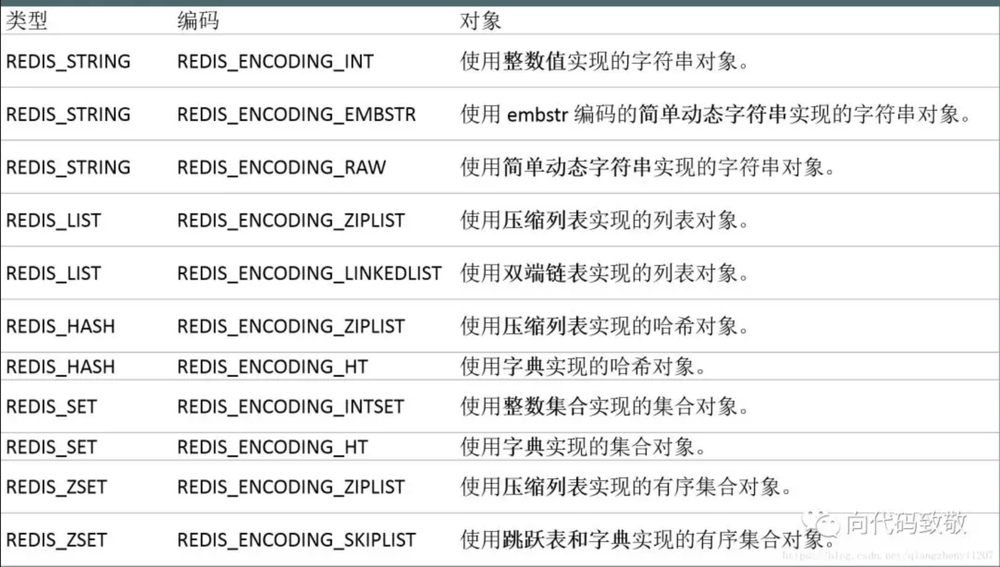
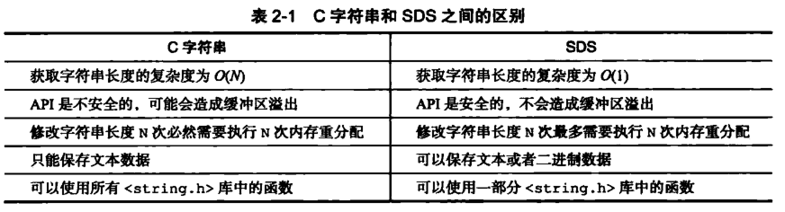
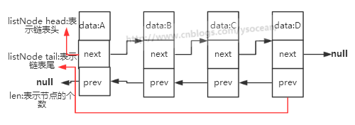
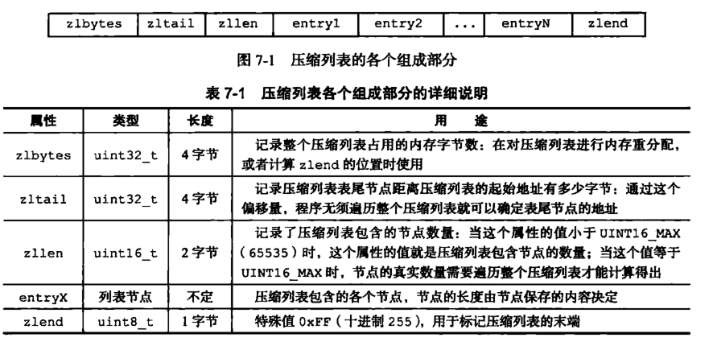
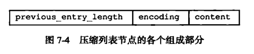
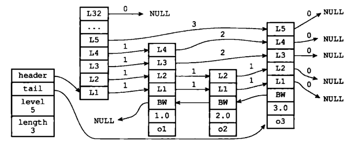
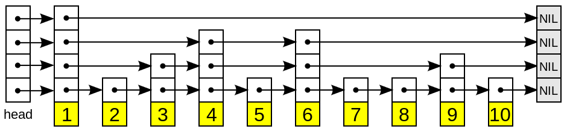
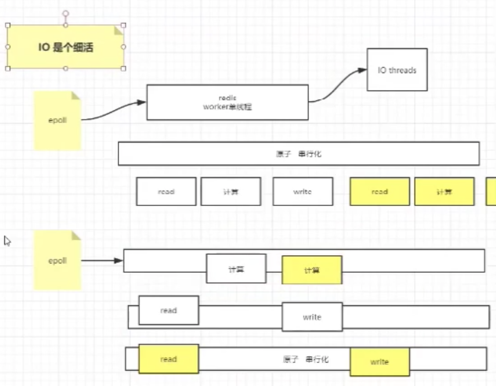

# 综述

# KEY

```sql
//关于key的常用命令
redis 127.0.0.1:6379> DEL runoobkey
(integer) 1

redis 127.0.0.1:6379> EXISTS runoob-new-key
(integer) 0

//为 key 设置过期时间
redis> EXPIRE key 10086
(integer) 1

//以秒为单位返回 key 的剩余过期时间
redis> TTL key
(integer) 10084

redis> type key
string
```


## 过期时间

当我们对某些 key 设置了 expire 时，数据到了时间会自动删除。如果一个键过期了，它会在什么时候删除呢？

下面介绍三种删除策略：

- **定时删除：**在这是设置键的过期时间的同时，创建一个定时器 Timer，让定时器在键过期时间来临时立即执行对过期键的删除。
- **惰性删除：**键过期后不管，每次读取该键时，判断该键是否过期，如果过期删除该键返回空。
- **定期删除：**每隔一段时间对数据库中的过期键进行一次检查。


**定时删除：**对内存友好，对 CPU 不友好。如果过期删除的键比较多的时候，删除键这一行为会占用相当一部分 CPU 性能，会对 Redis 的吞吐量造成一定影响。

**惰性删除：**对 CPU 友好，内存不友好。如果很多键过期了，但在将来很长一段时间内没有很多客户端访问该键导致过期键不会被删除，占用大量内存空间。

**定期删除：**是定时删除和惰性删除的一种折中。每隔一段时间执行一次删除过期键的操作，并且限制删除操作执行的时长和频率。


具体的操作如下：

- **Redis 会将每一个设置了 expire 的键存储在一个独立的字典中**，以后会定时遍历这个字典来删除过期的 key。除了定时遍历外，它还会使用惰性删除策略来删除过期的 key。

- Redis 默认每秒进行十次过期扫描，过期扫描不会扫描所有过期字典中的 key，而是采用了一种简单的贪心策略。

  从过期字典中随机选择 20 个 key；删除这 20 个 key 中已过期的 key；如果过期 key 比例超过 1/4，那就重复步骤 1。

- 同时，为了保证在过期扫描期间不会出现过度循环，导致线程卡死，算法还增加了扫描时间上限，默认不会超过 25ms。


## Key - Value 存储模型

redis的基本数据结构都是值的底层实现，键和值本身之间，Redis 使用了一个哈希表来保存所有键值对。

一个哈希表，其实就是一个数组，数组的每个元素称为一个哈希桶。所以一个哈希表是由多个哈希桶组成的，每个哈希桶中保存了键值对数据。哈希桶中的元素保存的并不是值本身，而是保存了\*key和\*value指针，分别指向了实际的键和值。这也就是说，不管值是 String，还是集合类型，哈希桶中的元素都是指向它们的指针。


# 编码转化

Redis 使用对象（redisObject）来表示数据库中的键值，当我们在 Redis 中创建一个键值对时，至少创建两个对象，一个对象是**键对象**，另一个是**值对象**。

例如我们执行 SET MSG XXX 时，键值对的键是一个包含了字符串“MSG“的对象，键值对的值对象是包含字符串"XXX"的对象。

```c
typedef struct redisObject{
    //类型包含字符串对象、列表对象、哈希对象、集合对象、有序集合对象。
   unsigned type:4;
   //编码
   unsigned encoding:4;
   //指向底层数据结构的指针
   void *ptr;
   //引用计数
   int refcount;
   //记录最后一次被程序访问的时间
   unsigned lru:22;
 }robj;
```

ptr 指针字段指向对象底层实现的数据结构，而这些数据结构是由 encoding 字段决定的，每种对象至少有两种数据编码：



可以通过 `OBJECT ENCODING key ` 来查看对象所使用的编码：


# 基本数据类型


这里需要分清楚编码与结构。


## String: 字符串

```log
常用命令:  set,get,decr,incr,mget 等。

redis 127.0.0.1:6379> SET runoobkey redis
OK
redis 127.0.0.1:6379> GET runoobkey
"redis"
redis > del foo
```

> #### 实现方式

如果存储的是纯数字，Redis 底层采用的是 int 类型的编码，如果其中包括非数字，则会立即转为 raw 编码：


## Hash: 散列

```
常用命令：hget,hset,hgetall 等。

redis> HSET site redis redis.com
(integer) 1

redis> HGET site redis
"redis.com"

redis> HDEL key field1 
```

>  #### 实现方式

Hash 对象的编码可以是 ziplist 或 hashtable（字典），当 Hash 以 ziplist 编码存储的时候，保存同一键值对的两个节点总是紧挨在一起，键节点在前，值节点在后：


当 Hash 对象同时满足以下两个条件时，Hash 对象采用 ziplist 编码：

- **Hash 对象保存的所有键值对的键和值的字符串长度均小于 64 字节。**
- **Hash 对象保存的键值对数量小于 512 个。**

如果不满足以上条件的任意一个，ziplist 就会转化为 hashtable 编码。注意：这两个条件是可以修改的，在 redis.conf 中：


## List: 列表

```java
	常用命令：lpush,rpush,lpop,rpop,lrange等。	
	BLPOP key1 [key2 ] timeout
	LPOP key
	LREM key count value
```

> #### 实现方式

List 对象的编码可以是 ziplist 或 linkedlist，对于 List 类型的键值，当列表对象同时满足以下两个条件时，采用 ziplist 编码：

- **列表对象保存的所有字符串元素的长度都小于 64 字节。**
- **列表对象保存的元素个数小于 512 个。**


如果不满足这两个条件的任意一个，就会转化为 linkedlist 编码。注意：这两个条件是可以修改的，在 redis.conf 中：


## Set: 集合

```
	常用命令：sadd,spop,smembers,sunion 等。
	SADD key member1 [member2]
	SSCAN key cursor [MATCH pattern] [COUNT count]
```

>  #### 实现方式

Set 对象的编码可以是 intset 或 hashtable，intset 编码的对象使用整数集合作为底层实现，把所有元素都保存在一个整数集合里面。如果 set 集合中保存了非整数类型的数据时，Redis 会将 intset 转化为 hashtable（字典）：

当 Set 对象同时满足以下两个条件时，对象采用 intset 编码：

- **保存的所有元素都是整数值（小数不行）。**
- **Set 对象保存的所有元素个数小于 512 个。**

不能满足这两个条件的任意一个，Set 都会采用 hashtable 存储。注意：第两个条件是可以修改的，在 redis.conf 中：


## Sorted Set: 有序集合

```java
	常用命令：zadd,zrange,zrem,zcard等
	ZADD key score1 member1 [score2 member2]
	ZRANK key member
  ZREM key member [member ...]
```

> #### 实现方式：

Zset 对象的编码可以是 ziplist 或 zkiplist，当采用 ziplist 编码存储时，每个集合元素使用两个紧挨在一起的压缩列表来存储。

第一个节点存储元素的成员，第二个节点存储元素的分值，并且按分值大小从小到大有序排列。


当 Zset 对象同时满足一下两个条件时，采用 ziplist 编码：

- **Zset 保存的元素个数小于 128。**
- **Zset 元素的成员长度都小于 64 字节。**


如果不满足以上条件的任意一个，ziplist 就会转化为 zkiplist 编码。注意：这两个条件是可以修改的，在 redis.conf 中：

```
zset-max-ziplist-entries 128
zset-max-ziplist-value 64
```


思考：Zset 如何做到 O(1) 复杂度内元素并且快速进行范围操作？Zset 采用 skiplist 编码时使用 zset 结构作为底层实现，该数据结构同时包含了一个跳跃表和一个字典。

其结构如下：

```c
typedef struct zset{
    zskiplist *zsl;
    dict *dict;
}
```


Zset 中的 dict 字典为集合创建了一个从成员到分值之间的映射，字典中的键保存了成员，字典中的值保存了成员的分值，这样定位元素时时间复杂度是 O(1)。

Zset 中的 zsl 跳跃表适合范围操作，比如 ZRANK、ZRANGE 等，程序使用 zkiplist。

另外，虽然 Zset 中使用了 dict 和 skiplist 存储数据，但这两种数据结构都会通过指针来共享相同的内存，所以没有必要担心内存的浪费。


## 扩展数据类型

### Bitmap

Bitmap 本身是用 String  类型作为底层数据结构实现的一种统计二值状态的数据类型。String 类型是会保存为二进制的字节数组，所以，Redis 就把字节数组的每个 bit 位利用起来，用来表示一个元素的二值状态。你可以把 Bitmap 看作是一个 bit 数组。

Bitmap 提供了 GETBIT/SETBIT 操作，使用一个偏移值 offset 对 bit 数组的某一个 bit 位进行读和写。不过，需要注意的是，Bitmap 的偏移量是从 0  开始算的，也就是说 offset 的最小值是 0。当使用 SETBIT 对一个 bit 位进行写操作时，这个 bit 位会被设置为  1。Bitmap 还提供了 BITCOUNT 操作，用来统计这个 bit 数组中所有“1”的个数。


### HyperLogLog

HyperLogLog 是一种用于统计基数的数据集合类型，它的最大优势就在于，当集合元素数量非常多时，它计算基数所需的空间总是固定的，而且还很小。不过，有一点需要注意一下，HyperLogLog 的统计规则是基于概率完成的，所以它给出的统计结果是有一定误差的，标准误算率是 0.81%。这也就意味着，你使用 HyperLogLog 统计的 UV 是 100 万，但实际的 UV 可能是 101 万。虽然误差率不算大，但是，如果你需要精确统计结果的话，最好还是继续用 Set 或  Hash 类型。


### GEO


## 自定义类型

> 13 | GEO是什么？还可以定义新的数据类型吗？


# 存储结构

##  简单动态字符串

Redis 是用 C 语言写的，但是对于Redis的字符串，却不是 C 语言中的字符串（即以空字符’\0’结尾的字符数组），它是自己构建了一种名为 简单动态字符串（simple dynamic string，SDS）的抽象类型，并将 SDS 作为 Redis的默认字符串表示。

```
struct sdshdr{
     //记录buf数组中已使用字节的数量
     //等于 SDS 保存字符串的长度
     int len;
     //记录 buf 数组中未使用字节的数量
     int free;
     //字节数组，用于保存字符串
     char buf[];
}
```


> #### SDS 与 C 字符串的区别

- **常数时间内获得字符串长度**

  C 字符串本身不记录长度信息，每次获取长度信息都需要遍历整个字符串，复杂度为 O(n)；C 字符串遍历时遇到 '\0' 时结束。

  SDS 中 len 字段保存着字符串的长度，所以总能在常数时间内获取字符串长度，复杂度是 O(1)。

- **避免缓冲区溢出**

  我们知道在 C 语言中使用 strcat  函数来进行两个字符串的拼接，一旦没有分配足够长度的内存空间，就会造成缓冲区溢出。

  而对于 SDS 数据类型，在进行字符修改的时候，会首先根据记录的 len 属性检查内存空间是否满足需求，如果不满足，会进行相应的空间扩展，然后在进行修改操作，所以不会出现缓冲区溢出。

- **减少字符串修改时带来的内存重新分配的次数**

  C语言由于不记录字符串的长度，所以如果要修改字符串，必须要重新分配内存（先释放再申请），因为如果没有重新分配，字符串长度增大时会造成内存缓冲区溢出，字符串长度减小时会造成内存泄露。

  而对于SDS，由于len属性和free属性的存在，对于修改字符串SDS实现了空间预分配和惰性空间释放两种策略：

  1. 空间预分配：对字符串进行空间扩展的时候，扩展的内存比实际需要的多，这样可以减少连续执行字符串增长操作所需的内存重分配次数。
  2. 惰性空间释放：对字符串进行缩短操作时，程序不立即使用内存重新分配来回收缩短后多余的字节，而是使用 free 属性将这些字节的数量记录下来，等待后续使用。（当然SDS也提供了相应的API，当我们有需要时，也可以手动释放这些未使用的空间。）

- **二进制安全**

  在 Redis 中不仅可以存储 String 类型的数据，也可能存储一些二进制数据。

  二进制数据并不是规则的字符串格式，其中会包含一些特殊的字符如 '\0'，在 C 中遇到 '\0' 则表示字符串的结束，但在 SDS 中，标志字符串结束的是 len 属性。




一般来说，SDS 除了保存数据库中的字符串值以外，SDS 还可以作为缓冲区（buffer）：包括 AOF 模块中的AOF缓冲区以及客户端状态中的输入缓冲区。


## 整数集合

整数集合（intset）是Redis用于保存整数值的集合抽象数据类型，它可以保存类型为int16_t、int32_t 或者int64_t 的整数值，并且保证集合中不会出现重复元素。

```c
typedef struct intset{
     //编码方式
     uint32_t encoding;
     //集合包含的元素数量
     uint32_t length;
     //保存元素的数组
     int8_t contents[];
}intset;
```

整数集合的每个元素都是 contents 数组的一个数据项，它们按照从小到大的顺序排列，并且不包含任何重复项。length 属性记录了 contents 数组的大小。需要注意的是虽然 contents 数组声明为 int8_t 类型，但是实际上contents 数组并不保存任何 int8_t 类型的值，其真正类型有 encoding 来决定。

**升级**

当我们新增的元素类型比原集合元素类型的长度要大时，需要对整数集合进行升级，才能将新元素放入整数集合中。具体步骤：

　　1. 根据新元素类型，扩展整数集合底层数组的大小，并为新元素分配空间。

　　2. 将底层数组现有的所有元素都转成与新元素相同类型的元素，并将转换后的元素放到正确的位置，放置过程中，维持整个元素顺序都是有序的。

　　3. 将新元素添加到整数集合中（保证有序）。

　　升级能极大地节省内存。

**降级**

整数集合不支持降级操作，一旦对数组进行了升级，编码就会一直保持升级后的状态。


## 链表

C 语言内部是没有内置这种数据结构的实现，所以Redis自己构建了链表的实现。

```c
typedef  struct listNode{
       //前置节点
       struct listNode *prev;
       //后置节点
       struct listNode *next;
       //节点的值
       void *value;  
}listNode
```

```c
typedef struct list{
     //表头节点
     listNode *head;
     //表尾节点
     listNode *tail;
     //链表所包含的节点数量
     unsigned long len;
     //节点值复制函数
     void (*free) (void *ptr);
     //节点值释放函数
     void (*free) (void *ptr);
     //节点值对比函数
     int (*match) (void *ptr,void *key);
}list;
```




Redis链表特性：

1. 双端：链表具有前置节点和后置节点的引用，获取这两个节点时间复杂度都为O(1)。
2. 无环：表头节点的 prev 指针和表尾节点的 next 指针都指向 NULL，对链表的访问都是以 NULL 结束。　　
3. 带链表长度计数器：通过 len 属性获取链表长度的时间复杂度为 O(1)。
4. 多态：链表节点使用 void* 指针来保存节点值，可以保存各种不同类型的值。


## 压缩列表

压缩列表 ziplist 是为 Redis 节约内存而开发的，是列表键和字典键的底层实现之一。

当元素个数较少时，Redis 用 ziplist 来存储数据，当元素个数超过某个值时，链表键中会把 ziplist 转化为 linkedlist，字典键中会把 ziplist 转化为 hashtable。 

ziplist 是由一系列特殊编码的连续内存块组成的顺序型的数据结构，并不是对数据利用某种算法进行压缩，ziplist 中可以包含多个 entry 节点，每个节点可以存放整数或者字符串。由于内存是连续分配的，所以遍历速度很快。





1. previous_entry_ength：记录压缩列表前一个字节的长度。previous_entry_ength的长度可能是1个字节或者是5个字节，如果上一个节点的长度小于254，则该节点只需要一个字节就可以表示前一个节点的长度了，如果前一个节点的长度大于等于254，则previous   length的第一个字节为254，后面用四个字节表示当前节点前一个节点的长度。利用此原理即当前节点位置减去上一个节点的长度即得到上一个节点的起始位置，压缩列表可以从尾部向头部遍历。这么做很有效地减少了内存的浪费。
2. encoding：节点的encoding保存的是节点的content的内容类型以及长度，encoding类型一共有两种，一种字节数组一种是整数，encoding区域长度为1字节、2字节或者5字节长。
3. content：content区域用于保存节点的内容，节点内容类型和长度由encoding决定。


## 字典

字典又称为符号表或者关联数组、或映射（map），是一种用于保存键值对的抽象数据结构。字典中的每一个键 key 都是唯一的，通过 key 可以对值来进行查找或修改。C 语言中没有内置这种数据结构的实现，所以字典依然是 Redis自己构建的。

字典的数据结构如下所示：

```
typedef struct dict{
    dictType *type;
    void *privdata;
    dictht ht[2];
    int trehashidx;
}
```

```c
typedef struct dictht{
    //哈希表数组
    dectEntrt **table;
    //哈希表大小
    unsigned long size;
    //哈希表大小掩码,用于计算索引值,总是等于 size-1
    unsigned long sizemask;
    //哈希表已有节点数量
    unsigned long used;
}
```

```c
typedef struct dictEntry{
     //键
     void *key;
     //值
     union{
          void *val;
          uint64_tu64;
          int64_ts64;
     }v;
 
     //指向下一个哈希表节点，形成链表
     struct dictEntry *next;
}dictEntry
```

注意这里还有一个指向下一个哈希表节点的指针，我们知道哈希表最大的问题是存在哈希冲突，如何解决哈希冲突，有开放地址法和链地址法。这里采用的便是链地址法，通过next这个指针可以将多个哈希值相同的键值对连接在一起，用来解决**哈希冲突**。


**渐进式hash说明**

dict中ht[2]中有两个hash表, 我们第一次存储数据的数据时, ht[0]会创建一个最小为4的hash表,  一旦ht[0]中的size和used相等, 则dict中会在ht[1]创建一个size*2大小的hash表,  此时并不会直接将ht[0]中的数据copy进ht[0]中, 执行的是**渐进式rehash**, 即在以后的操作(find, set,  get等)中慢慢的copy进去，以后新添加的元素会添加进ht[0],  因此在ht[1]被占满的时候定能确保ht[0]中所有的数据全部copy到ht[1]中.


所以在删除、查找、更新时会在两张表中操作，在查询时会现在第一张表中查询，如果第一张表中没有，则会在第二张表中查询。但新增时一律会在 ht[1] 中进行，确保 ht[0] 中的数据只会减少不会增加。


## 跳跃表

**跳跃表:**

```c
 typedef struct zskiplistNode {
    //成员对象
   robj *obj;
    //分值
   double score;
    //后退指针
   struct zskiplistNode *backward;
    //层
   struct zskiplistLevel {
        struct zskiplistNode *forward;//前进指针
        unsigned int span;//跨度
   } level[];
 } zskiplistNode;
```

```c
 typedef struct zskiplist {
    //表头节点和表尾节点
   struct zskiplistNode *header, *tail;
    //表中节点的的数量
   unsigned long length;
    //表中层数最大的节点层数
   int level;
 } zskiplist;
```







搜索：从最高层的链表节点开始，如果比当前节点要大和比当前层的下一个节点要小，那么则往下找，也就是和当前层的下一层的节点的下一个节点进行比较，以此类推，一直找到最底层的最后一个节点，如果找到则返回，反之则返回空。

插入：首先确定插入的层数，有一种方法是假设抛一枚硬币，如果是正面就累加，直到遇见反面为止，最后记录正面的次数作为插入的层数。当确定插入的层数k后，则需要将新元素插入到从底层到k层。

删除：在各个层中找到包含指定值的节点，然后将节点从链表中删除即可，如果删除以后只剩下头尾两个节点，则删除这一层。


[Redis详解（四）------ redis的底层数据结构](https://www.cnblogs.com/ysocean/p/9080942.html)

[一文揭秘单线程的Redis为什么这么快?](https://mp.weixin.qq.com/s/4ndQI4CyqtjaYJKts8ChdA)


# 内存淘汰机制

> [如何解决引用计数的循环引用问题](https://blog.csdn.net/weixin_43958091/article/details/105163643)

因为 C 语言不具备自动回收内存功能，那么该如何回收内存呢？于是 Redis自己构建了一个内存回收机制，通过在 redisObject 结构中的 refcount 属性实现。这个属性会随着对象的使用状态而不断变化：

1. 创建一个新对象，属性 refcount 初始化为1

2. 对象被一个新程序使用，属性 refcount 加 1

3. 对象不再被一个程序使用，属性 refcount 减 1

4. 当对象的引用计数值变为 0 时，对象所占用的内存就会被释放。

那么 Redis 既然采用引用计数的垃圾回收机制，如何解决循环引用这个问题呢？

因为redis对象之间没有深层次的嵌套，因此也就不存在循环引用的隐患。这个地方要好好看看redis对象结构，才能理解。

纵观redis的对象，发现他们用不同的数据结构来实现，所以顶多有一个指向底层的实现数据结构的指针，既然redis对象里面不可以再定义一个别的引用，那么就不会出现循环引用的问题了，因为redis只共享0-9999的数值字符串对象，对于别的对象，ptr指针是不会去寻找是否有相同的，然后指向，所以不存在循环引用。


最大内存的设置是通过设置maxmemory来完成的，格式为maxmemory  bytes ,当目前使用的内存超过了设置的最大内存，就要进行内存释放了，当需要进行内存释放的时候，需要用某种策略对保存的的对象进行删除。Redis有六种策略（默认的策略是volatile-lru）

redis中当内存超过限制时，按照配置的策略，淘汰掉相应的key-value，使得内存可以继续留有足够的空间保存新的数据。redis 确定驱逐某个键值对后，会删除这个数据，并将这个数据变更消息发布到本地（AOF 持久化）和从机（主从连接）。

1. volatile-lru：从已设置过期时间的数据集（server.db[i].expires）中挑选**最近最少**使用的数据淘汰。(LRU:最近使用 Least Recently Used ) 
2. volatile-ttl：从已设置过期时间的数据集（server.db[i].expires）中挑选将要过期的数据淘汰
3. volatile-random：从已设置过期时间的数据集（server.db[i].expires）中任意选择数据淘汰
4. allkeys-lru：从数据集（server.db[i].dict）中挑选最近最少使用的数据淘汰
5. allkeys-random：从数据集（server.db[i].dict）中任意选择数据淘汰
6. no-enviction：禁止淘汰数据， 不移除任何key，只是返回一个写错误 ，**默认选项**

[^问题]: 内存淘汰，是直接把数据删除，还是把这块数据置换到硬盘？感觉应该是直接删除


**TTL 数据淘汰机制 :**

redis 数据集数据结构中保存了键值对过期时间的表，即 redisDb.expires。定义：

```
从过期时间的表中随机挑选几个键值对，取出其中 ttl 最大的键值对淘汰。同样你会发现，
redis 并不是保证取得所有过期时间的表中最快过期的键值对，而只是随机挑选的几个键值对中的。
```


**LRU 数据淘汰机制 :**

在服务器配置中保存了 lru 计数器 server.lrulock，会定时（redis 定时程序 serverCorn()）更新，server.lrulock  的值是根据 server.unixtime 计算出来的。另外，从 struct redisObject 中可以发现，每一个 redis  对象都会设置相应的 lru。可以想象的是，每一次访问数据的时候，会更新 redisObject.lru。

 LRU 数据淘汰机制定义：　

```
在数据集中随机挑选几个键值对，取出其中 lru 最小的键值对淘汰。所以，你会发现，redis 
并不是保证取得所有数据集中最近最少使用（LRU）的键值对，而只是随机挑选的几个键值对中的键值对。
```


[Redis详解（五）------ redis的五大数据类型实现原理](https://www.cnblogs.com/ysocean/p/9102811.html)

[内存淘汰机制（含单机版内存优化建议）](https://www.cnblogs.com/alsf/p/9399009.html)


# 发布订阅

``` bash
#创建了订阅频道名为 redisChat
redis 127.0.0.1:6379> SUBSCRIBE redisChat

Reading messages... (press Ctrl-C to quit)
1) "subscribe"
2) "redisChat"
3) (integer) 1

#重新开启个 redis 客户端，然后在同一个频道 redisChat 发布两次消息，订阅者就能接收到消息。
redis 127.0.0.1:6379> PUBLISH redisChat "Redis is a great caching technique"

(integer) 1

redis 127.0.0.1:6379> PUBLISH redisChat "Learn redis by runoob.com"

(integer) 1

# 订阅者的客户端会显示如下消息
1) "message"
2) "redisChat"
3) "Redis is a great caching technique"
1) "message"
2) "redisChat"
3) "Learn redis by runoob.com"
```


# 事务

Redis 事务可以一次执行多个命令， 并且带有以下两个重要的保证：

- 批量操作在发送 EXEC 命令前被放入队列缓存。 
- 收到 EXEC 命令后进入事务执行，事务中任意命令执行失败，其余的命令依然被执行。
-  在事务执行过程，其他客户端提交的命令请求不会插入到事务执行命令序列中。

一个事务从开始到执行会经历以下三个阶段： 

-  开始事务。
-  命令入队。
-  执行事务。


单个 Redis 命令的执行是原子性的，但 Redis 没有在事务上增加任何维持原子性的机制，所以 Redis 事务的执行并不是原子性的。

事务可以理解为一个打包的批量执行脚本，但批量指令并非原子化的操作，中间某条指令的失败**不会**导致前面已做指令的**回滚**，也不会造成后续的指令不做。


# 持久化

Redis持久化分为RDB持久化和AOF持久化**：前者将当前数据保存到硬盘，后者则是将每次执行的写命令保存到硬盘（类似于MySQL的binlog）；**由于AOF持久化的实时性更好，即当进程意外退出时丢失的数据更少，因此AOF是目前主流的持久化方式，不过RDB持久化仍然有其用武之地。


## RDB持久化

RDB持久化是将当前进程中的数据生成快照保存到硬盘(因此也称作快照持久化)，保存的文件后缀是rdb；当Redis重新启动时，可以读取快照文件恢复数据。

RDB持久化的触发分为手动触发和自动触发两种。

- 手动触发

  save命令和bgsave命令都可以生成RDB文件。

  save命令会阻塞Redis服务器进程，直到RDB文件创建完毕为止，在Redis服务器阻塞期间，服务器不能处理任何命令请求，因此save已基本被废弃。

  而bgsave命令会创建一个子进程，由子进程来负责创建RDB文件，父进程(即Redis主进程)则继续处理请求。

- 自动触发

  自动触发最常见的情况是在配置文件中通过**save m n，指定当m秒内发生n次变化时**，会触发bgsave。

  save m n的原理如下：每隔100ms，执行serverCron函数；在serverCron函数中，遍历save m n配置的保存条件，只要有一个条件满足，就进行bgsave。

- 在主从复制场景下，如果从节点执行全量复制操作，则主节点会执行bgsave命令，并将rdb文件发送给从节点

- 执行shutdown命令时，自动执行rdb持久化，如下图所示：


## AOF持久化

Redis服务器默认开启RDB，关闭AOF；要开启AOF，需要在配置文件中配置：

```
appendonly yes

appendfsync always    #每次有数据修改发生时都会写入AOF文件。
appendfsync everysec  #每秒钟同步一次，该策略为AOF的缺省策略。
appendfsync no        #从不同步。高效但是数据不会被持久化。
```


AOF缓存区的同步文件策略由参数appendfsync控制，各个值的含义如下：

- always：命令写入aof_buf后立即调用系统fsync操作同步到AOF文件，fsync完成后线程返回。这种情况下，每次有写命令都要同步到AOF文件，硬盘IO成为性能瓶颈，Redis只能支持大约几百TPS写入，严重降低了Redis的性能；即便是使用固态硬盘（SSD），每秒大约也只能处理几万个命令，而且会大大降低SSD的寿命。
- no：命令写入aof_buf后调用系统write操作，不对AOF文件做fsync同步；同步由操作系统负责，通常同步周期为30秒。这种情况下，文件同步的时间不可控，且缓冲区中堆积的数据会很多，数据安全性无法保证。
- everysec：命令写入aof_buf后调用系统write操作，write完成后线程返回；fsync同步文件操作由专门的线程**每秒**调用一次。**everysec是前述两种策略的折中，是性能和数据安全性的平衡，因此是Redis的默认配置，也是我们推荐的配置。**

​	

# 集群

分为3种：主从复制、哨兵模式、Redis Cluster。


## 主从复制

数据的复制是单向的，只能由主节点到从节点。一个主节点可以有多个从节点(或没有从节点)，但一个从节点只能有一个主节点。默认端口6379


- 建立步骤

  **主从复制的开启，完全是在从节点发起的；不需要我们在主节点做任何事情。**

  从节点开启主从复制，有3种方式：

  （1）配置文件

  在从服务器的配置文件中加入：slaveof <masterip> <masterport>

  （2）启动命令

  redis-server启动命令后加入 --slaveof <masterip> <masterport>

  （3）客户端命令

  Redis服务器启动后，直接通过客户端执行命令：slaveof <masterip> <masterport>，则该Redis实例成为从节点。

- 断开复制

  通过slaveof <masterip> <masterport>命令建立主从复制关系以后，可以通过slaveof no one断开。需要注意的是，从节点断开复制后，**不会删除已有的数据**，只是不再接受主节点新的数据变化。


- 主从复制的实现原理

  主从复制过程大体可以分为3个阶段：连接建立阶段（即准备阶段）、数据同步阶段、命令传播阶段。

  - 准备阶段

  - 数据同步阶段

    数据同步阶段是主从复制最核心的阶段，根据主从节点当前状态的不同，可以分为全量复制和部分复制。

    - 全量复制：使用psync命令，用于**初次复制**或其他无法进行部分复制的情况，将主节点中的所有数据都发送给从节点，是一个非常重型的操作。

    - 部分复制：用于网络中断等情况后的复制，只将中断期间主节点执行的写命令发送给从节点，与全量复制相比更加高效。需要注意的是，如果网络中断时间过长，导致主节点没有能够完整地保存中断期间执行的写命令，则无法进行部分复制，仍使用全量复制。

  - **心跳【命令传播阶段】**

    在命令传播阶段，除了发送写命令，主从节点还维持着心跳机制：PING和REPLCONF ACK。心跳机制对于主从复制的超时判断、数据安全等有作用。

    - 每隔指定的时间，**主节点会向从节点发送PING命令**，这个PING命令的作用，主要是为了让从节点进行超时判断。
    - 在命令传播阶段，**从节点会向主节点发送REPLCONF ACK命令**，频率是每秒1次。


- 读写分离以及其中问题

  在主从复制基础上实现的读写分离，可以实现Redis的读负载均衡：由主节点提供写服务，由一个或多个从节点提供读服务（多个从节点既可以提高数据冗余程度，也可以最大化读负载能力）；在读负载较大的应用场景下，可以大大提高Redis服务器的并发量。

  1. 延迟与不一致问题

  - 优化主从节点之间的网络环境（如在同机房部署）
  - 监控主从节点延迟（通过offset）判断，如果从节点延迟过大，通知应用不再通过该从节点读取数据
  - 用集群同时扩展写负载和读负载等

  

  2. 数据过期问题

     在单机版Redis中，存在两种删除策略：

     - 惰性删除：服务器不会主动删除数据，只有当客户端查询某个数据时，服务器判断该数据是否过期，如果过期则删除。
     - 定期删除：服务器执行定时任务删除过期数据，但是考虑到内存和CPU的折中（删除会释放内存，但是频繁的删除操作对CPU不友好），该删除的频率和执行时间都受到了限制。

     在主从复制场景下，为了主从节点的数据一致性，从节点不会主动删除数据，而是由主节点控制从节点中过期数据的删除。由于主节点的惰性删除和定期删除策略，都不能保证主节点及时对过期数据执行删除操作，因此，当客户端通过Redis从节点读取数据时，很容易读取到已经过期的数据。

     Redis 3.2中，从节点在读取数据时，增加了对数据是否过期的判断：如果该数据已过期，则不返回给客户端；将Redis升级到3.2可以解决数据过期问题。

  

  3. 故障切换问题

     在没有使用哨兵的读写分离场景下，应用针对读和写分别连接不同的Redis节点；当主节点或从节点出现问题而发生更改时，需要及时修改应用程序读写Redis数据的连接；连接的切换可以手动进行，或者自己写监控程序进行切换，但前者响应慢、容易出错，后者实现复杂，成本都不算低。


- 复制超时问题
- 复制中断问题


缺陷：故障恢复无法自动化；写操作无法负载均衡；存储能力受到单机的限制。


## 哨兵

在Redis 2.8版本开始引入。**哨兵的核心功能是主节点的自动故障转移**


它由两部分组成，哨兵节点和数据节点：

- 哨兵节点：哨兵系统由一个或多个哨兵节点组成，哨兵节点是特殊的redis节点，**不存储数据**。
- 数据节点：主节点和从节点都是数据节点。


哨兵系统的搭建过程，有几点需要注意：

1. 哨兵系统中的主从节点，与普通的主从节点并没有什么区别，故障发现和转移是由哨兵来控制和完成的。
2. 哨兵节点本质上是redis节点。
3. 每个哨兵节点，只需要配置监控主节点，便可以自动发现其他的哨兵节点和从节点。
4. 在哨兵节点启动和故障转移阶段，各个节点的配置文件会被重写(config rewrite)。
5. 本章的例子中，一个哨兵只监控了一个主节点；实际上，一个哨兵可以监控多个主节点，通过配置多条sentinel monitor即可实现。
6. Jedis客户端可以通过哨兵节点+masterName获取主节点信息，**需要注意的是，哨兵只是配置提供者，而不是代理**
7. 当发生故障转移时，Jedis客户端可以收到哨兵的通知，从而完成主节点的切换。具体做法是：利用redis提供的发布订阅功能，为每一个哨兵节点开启一个单独的线程，订阅哨兵节点的+switch-master频道，当收到消息时，重新初始化连接池。


- 基本原理

  关于哨兵的原理，关键是了解以下几个概念。

  （1）定时任务：每个哨兵节点维护了3个定时任务。定时任务的功能分别如下：通过向主从节点发送info命令获取最新的主从结构；通过发布订阅功能获取其他哨兵节点的信息；通过向其他节点发送ping命令进行心跳检测，判断是否下线。

  （2）主观下线：在心跳检测的定时任务中，如果其他节点超过一定时间没有回复，哨兵节点就会将其进行主观下线。顾名思义，主观下线的意思是一个哨兵节点“主观地”判断下线；与主观下线相对应的是客观下线。

  （3）客观下线：哨兵节点在对主节点进行主观下线后，会通过sentinel is-master-down-by-addr命令询问其他哨兵节点该主节点的状态；如果判断主节点下线的哨兵数量达到一定数值，则对该主节点进行客观下线。

  **需要特别注意的是，客观下线是主节点才有的概念；如果从节点和哨兵节点发生故障，被哨兵主观下线后，不会再有后续的客观下线和故障转移操作。**

  （4）选举领导者哨兵节点：当主节点被判断客观下线以后，各个哨兵节点会进行协商，选举出一个领导者哨兵节点，并由该领导者节点对其进行故障转移操作。

  监视该主节点的所有哨兵都有可能被选为领导者，选举使用的算法是Raft算法；Raft算法的基本思路是先到先得：即在一轮选举中，哨兵A向B发送成为领导者的申请，如果B没有同意过其他哨兵，则会同意A成为领导者。选举的具体过程这里不做详细描述，一般来说，哨兵选择的过程很快，谁先完成客观下线，一般就能成为领导者。

  （5）故障转移：选举出的领导者哨兵，开始进行故障转移操作，该操作大体可以分为3个步骤：

  - 在从节点中选择新的主节点：选择的原则是，首先过滤掉不健康的从节点；然后选择优先级最高的从节点(由slave-priority指定)；如果优先级无法区分，则选择复制偏移量最大的从节点；如果仍无法区分，则选择runid最小的从节点。
  - 更新主从状态：通过slaveof no one命令，让选出来的从节点成为主节点；并通过slaveof命令让其他节点成为其从节点。
  - 将已经下线的主节点(即6379)设置为新的主节点的从节点，当6379重新上线后，它会成为新的主节点的从节点。


缺陷：写操作无法负载均衡；存储能力受到单机的限制。


## Cluster

一般都用这个了，哨兵的定位十分尴尬。

集群，即Redis Cluster，是Redis 3.0开始引入的分布式存储方案。

集群由多个节点(Node)组成，Redis的数据分布在这些节点中。集群中的节点分为主节点和从节点：**只有主节点负责读写请求和集群信息的维护**；从节点只进行主节点数据和状态信息的**复制**。

集群的作用，可以归纳为两点：

1. 数据分区：数据分区(或称数据分片)是集群最核心的功能。

   集群将数据分散到多个节点，一方面突破了Redis单机内存大小的限制，存储容量大大增加；另一方面每个主节点都可以对外提供读服务和写服务，大大提高了集群的响应能力。

2. 高可用：集群支持主从复制和主节点的自动故障转移（与哨兵类似）；当任一节点发生故障时，集群仍然可以对外提供服务。


### 集群的基本原理

集群最核心的功能是**数据分区，通信机制和数据结构**。

数据分区有顺序分区、哈希分区等，其中哈希分区由于其天然的随机性，使用广泛；集群的分区方案便是哈希分区的一种。哈希分区的基本思路是：对数据的特征值（如key）进行哈希，然后根据哈希值决定数据落在哪个节点。在选择hash分区的实现方法时，要考虑**数据分布是否均匀；增加或删减节点对数据分布的影响。**一般有以下几种分法：

- 哈希取余分区

  - 哈希取余分区思路非常简单：计算key的hash值，然后对节点数量进行取余，从而决定数据映射到哪个节点上。

  - 该方案最大的问题是，当新增或删减节点时，节点数量发生变化，系统中所有的数据都需要重新计算映射关系，引发大规模数据迁移。

- 一致性哈希分区

  - 一致性哈希算法将整个哈希值空间组织成一个虚拟的圆环，范围为$0 — (2^{32}-1)$；对于每个数据，根据key计算hash值，确定数据在环上的位置，然后从此位置沿环顺时针行走，找到的第一台服务器就是其应该映射到的服务器。

  - 与哈希取余分区相比，一致性哈希分区将增减节点的**影响限制在相邻节点**。

  - 主要问题在于，当节点数量较少时，增加或删减节点，对单个节点的影响可能很大，**造成数据的严重不平衡**。

- **带虚拟节点的一致性哈希分区**
  - 该方案在一致性哈希分区的基础上，引入了虚拟节点的概念。**Redis集群使用的便是该方案，其中的虚拟节点称为槽（slot**）。槽是介于数据和实际节点之间的虚拟概念；每个实际节点包含一定数量的槽，每个槽包含哈希值在一定范围内的数据。引入槽以后，数据的映射关系由数据hash->实际节点，变成了数据hash->槽->实际节点。**在使用了槽的一致性哈希分区中，槽是数据管理和迁移的基本单位。槽解耦了数据和实际节点之间的关系，增加或删除节点对系统的影响很小。**槽的数量一般远小于$2^{32}$，远大于实际节点的数量；在Redis集群中，槽的数量为16384（$2^{14}$）。

  - redis计算key到节点的步骤

    1. Redis对数据的特征值（一般是key）计算哈希值，使用的算法是CRC16。

    2. 根据哈希值，计算数据属于哪个槽。

    3. 根据槽与节点的映射关系，计算数据属于哪个节点。


集群内部将所有的key映射到16384个Slot中，集群中的每个Redis Instance负责其中的一部分的Slot的读写。集群客户端连接集群中任一Redis Instance即可发送命令，当Redis Instance收到自己不负责的Slot的请求时，会将负责请求Key所在Slot的Redis Instance地址返回给客户端，客户端收到后自动将原请求重新发往这个地址，对外部透明。一个Key到底属于哪个Slot由$crc16(key)\%16384 $决定。

关于负载均衡，集群的Redis Instance之间可以迁移数据，以Slot为单位，但不是自动的，需要外部命令触发。

关于集群成员管理，集群的节点(Redis  Instance)和节点之间两两定期交换集群内节点信息并且更新，从发送节点的角度看，这些信息包括：

- 集群内有哪些节点
- IP和PORT是什么
- 节点名字是什么
- 节点的状态(比如OK，PFAIL，FAIL，后面详述)是什么，包括节点角色(master  或者 slave)等。

关于可用性，集群由N组主从Redis Instance组成。主可以没有从，但是没有从 意味着主宕机后主负责的Slot读写服务不可用。一个主可以有多个从，主宕机时，某个从会被提升为主，具体哪个从被提升为主，协议类似于Raft。

如何检测主宕机？Redis Cluster采用quorum+心跳的机制。从节点的角度看，节点会定期给其他所有的节点发送Ping，cluster-node-timeout(可配置，秒级)时间内没有收到对方的回复，则单方面认为对端节点宕机，将该节点标为PFAIL状态。通过节点之间交换信息收集到quorum个节点都认为这个节点为PFAIL，则将该节点标记为FAIL，并且将其发送给其他所有节点，其他所有节点收到后立即认为该节点宕机。从这里可以看出，主宕机后，至少cluster-node-timeout时间内该主所负责的Slot的读写服务不可用。

每一个节点都存有这个集群所有主节点以及从节点的信息。它们之间通过互相的ping-pong判断是否节点可以连接上。如果有一半以上的节点去ping一个节点的时候没有回应，集群就认为这个节点宕机了，然后去连接它的备用节点。


**集群进入fail状态的必要条件**

- 某个主节点和所有从节点全部挂掉，我们集群就进入faill状态。
- 如果集群超过半数以上master挂掉，无论是否有slave，集群进入fail状态。
- 如果集群任意master挂掉，且当前master没有slave。集群进入fail状态。

当集群不可用时,所有对集群的操作做都不可用，收到((error) CLUSTERDOWN The cluster is down)错误


集群内slot对应的redis服务挂了，数据是否有备份，能否自动恢复？

如果对应slot的redis主从服务都挂了，数据是没有冗余保存的，所以没法自动恢复，集群直接进入faill状态。


[Redis Cluster原理](https://www.cnblogs.com/foxmailed/p/3630875.html)

[redis集群原理](https://www.cnblogs.com/liyasong/p/redis_jiqun.html)


### slots 迁移过程

将一个Redis节点上指定的slot下的所有key迁移到其他redis节点上，需要两步：

1. 先获取这个slot下所有的key
2. 对每个key发送迁移命令

Redis cluster直接使用 **migrate 命令**进行key的迁移，这个命令是**同步阻塞**的，redis是单线程的，当migrate过程耗时太久（比如网络慢、迁移bigkey）时，会导致主线程无法处理用户请求。


**slot迁移的难点**

- 如使用同步阻塞的方式，bigkey或网络慢，会阻塞主线程正常服务
- 对bigkey迁移需要特殊处理，否则bigkey的序列号、发送、反序列号时，都可能导致源redis实例和目标redis实例主线程阻塞。
- 单个key的迁移过程需要保证原子性，即要么一个key全部迁移成功，要么全部迁移失败，不能存在中间状态
- 对迁移中slot的读写出出力，即一个slot如果正处于迁移过程中，其中的key（已经迁移走、迁移中、或等待迁移）是否可以被正常读写。


> #### Redis Cluster的slot迁移实现

**slot分配**

redis-cluster为了支持slot迁移，改造引擎加入了key和slot的映射关系。Redis-cluster使用rax树来维护key和slot的映射关系。因此在新建集群、集群扩缩容的时候，都会涉及到slot分配、删除等操作，这些操作通过以下命令实现：

- cluster addslots [slot …] 将一个或多个槽（slot）指派（assign）给当前节点。
- cluster delslots [slot …] 移除一个或多个槽对当前节点的指派。
- cluster flushslots 移除指派给当前节点的所有槽，让当前节点变成一个没有指派任何槽的节点。
- cluster setslot node <node_id> 将槽 slot 指派给 node_id 指定的节点，如果槽已经指派给另一个节点，那么先让另一个节点删除该槽>，然后再进行指派。
  

**key-slot操作**

一旦key和slot的映射关系建立好，就可以执行key相关的slot命令，redis-cluster提供了以下命令：

- cluster slot 计算键 key 应该被放置在哪个槽上。
- cluster countkeysinslot 返回槽 slot 目前包含的键值对数量。
- cluster getkeysinslot 返回 count 个 slot 槽中的键。


**slot的迁移流程**

- 对目标节点发送 cluster setslot importing 命令，让目标节点准备导入槽的数据。
- 对源节点发送 cluster setslot migrating 命令，让源节点准备迁出槽的数据。
- 源节点循环执行 cluster getkeysinslot 命令，获取count个属于槽slot的键。
- 在源节点上执行 migrate “” 0 keys <keys…> 命令，把获取的键通过流水线（pipeline）机制批量迁移到目标节点。
- 重复执行步骤3和步骤4直到槽下所有的键值数据迁移到目标节点。
- 向集群内所有主节点发送cluster setslot node 命令，通知槽分配给目标节点。为了保证槽节点映射变更及时传播，需要遍历发送给所有主节点更新被迁移的槽指向新节点。
  

**key迁移的原子性**

由于migrate命令是同步阻塞的（同步发送同步接收），迁移过程中**会阻塞该引擎上的所有key的读写**，只有在迁移响应成功之后，才会将本地的key删除，因此在redis cluster中**迁移是原子的**。


**迁移过程中的读写冲突**

因为migrate命令是同步阻塞的，因此不会存在一个key正在被迁移又同时被读写的情况，但由于一个slot下可能有部分key被迁移完成，部分key正在等待迁移的情况，因此如果读写的key所属的slot正在被迁移，redis-cluster做如下处理：

- 客户端根据本地slots缓存发送命令到源节点，如果存在键对象则直接指向并返回结果给客户端。
- 如果key对象不存在，但key所在的slot属于本节点，则可能存在于目标节点，这时源节点会回复ASK重定向异常。例如如：error）ASK :。
- 客户端从ASK重定向异常提取出目标节点的信息，发送asking命令到目标节点打开客户端连接标识，再执行key命令。如果存在则执行，不存在则返回不存在信息。
- 如果key所在的slot不属于本节点，则返回MOVE重定向。格式如下：（error）ASK :。
- 客户端从ASK重定向异常提取出目标节点信息，发送asking命令到目标节点打开客户端连接标识，再执行键命令。如果存在则执行，不存在则返回不存在信息
  


### 节点通信机制

**端口**

在集群中，没有数据节点与非数据节点之分：所有的节点都存储数据，也都参与集群状态的维护。为此，集群中的每个节点，都提供了两个TCP端口：

- 普通端口：即我们在前面指定的端口(7000等)。普通端口主要用于为客户端提供服务（与单机节点类似）；但在节点间数据迁移时也会使用。6379
- 集群端口：端口号是普通端口+10000（10000是固定值，无法改变），如7000节点的集群端口为17000。集群端口只用于节点之间的通信，如搭建集群、增减节点、故障转移等操作时节点间的通信；不要使用客户端连接集群接口。为了保证集群可以正常工作，在配置防火墙时，要同时开启普通端口和集群端口。


**通讯协议**

节点间通信，按照通信协议可以分为几种类型：单对单、广播、Gossip协议等。重点是广播和Gossip的对比。

广播是指向集群内所有节点发送消息；优点是集群的收敛速度快(集群收敛是指集群内所有节点获得的集群信息是一致的)，缺点是每条消息都要发送给所有节点，CPU、带宽等消耗较大。

Gossip协议的特点是：在节点数量有限的网络中，每个节点都“随机”的与部分节点通信（并不是真正的随机，而是根据特定的规则选择通信的节点），经过一番杂乱无章的通信，每个节点的状态很快会达到一致。Gossip协议的优点有负载(比广播)低、去中心化、容错性高(因为通信有冗余)等；缺点主要是集群的收敛速度慢。


**消息类型**

集群中的节点采用固定频率（每秒10次）的定时任务进行通信相关的工作：判断是否需要发送消息及消息类型、确定接收节点、发送消息等。如果集群状态发生了变化，如增减节点、槽状态变更，通过节点间的通信，所有节点会很快得知整个集群的状态，使集群收敛。

节点间发送的消息主要分为5种：meet消息、ping消息、pong消息、fail消息、publish消息。不同的消息类型，通信协议、发送的频率和时机、接收节点的选择等是不同的。

- MEET消息：在节点握手阶段，当节点收到客户端的CLUSTER MEET命令时，会向新加入的节点发送MEET消息，请求新节点加入到当前集群；新节点收到MEET消息后会回复一个PONG消息。
- PING消息：集群里每个节点每秒钟会选择部分节点发送PING消息，接收者收到消息后会回复一个PONG消息。PING消息的内容是自身节点和部分其他节点的状态信息；作用是彼此交换信息，以及检测节点是否在线。PING消息使用Gossip协议发送，接收节点的选择兼顾了收敛速度和带宽成本，具体规则如下：(1)随机找5个节点，在其中选择最久没有通信的1个节点(2)扫描节点列表，选择最近一次收到PONG消息时间大于cluster_node_timeout/2的所有节点，防止这些节点长时间未更新。
- PONG消息：PONG消息封装了自身状态数据。可以分为两种：第一种是在接到MEET/PING消息后回复的PONG消息；第二种是指节点向集群广播PONG消息，这样其他节点可以获知该节点的最新信息，例如故障恢复后新的主节点会广播PONG消息。
- FAIL消息：当一个主节点判断另一个主节点进入FAIL状态时，会向集群广播这一FAIL消息；接收节点会将这一FAIL消息保存起来，便于后续的判断。
- PUBLISH消息：节点收到PUBLISH命令后，会先执行该命令，然后向集群广播这一消息，接收节点也会执行该PUBLISH命令。


**数据结构（有兴趣直接查看下方引用的作者原文，个人认为一般情况不需要掌握到这里）**

​	节点为了存储集群状态而提供的数据结构中，最关键的是**clusterNode**和**clusterState**结构：前者记录了一个节点的状态，后者记录了集群作为一个整体的状态。


### Jedis操作

基本原理：

1. JedisCluster初始化时，在内部维护slot->node的缓存，方法是连接任一节点，执行cluster slots命令。
2. JedisCluster为每个节点创建连接池(即JedisPool)。
3. 当执行命令时，JedisCluster根据key->slot->node选择需要连接的节点，发送命令。如果成功，则命令执行完毕。如果执行失败，则会随机选择其他节点进行重试，并在出现MOVED错误时，使用cluster
   slots重新同步slot->node的映射关系。


```java
public static void test() {
   Set<HostAndPort> nodes = new HashSet<>();
   nodes.add(new HostAndPort("192.168.72.128", 7000));
   nodes.add(new HostAndPort("192.168.72.128", 7001));
   nodes.add(new HostAndPort("192.168.72.128", 7002));
   nodes.add(new HostAndPort("192.168.72.128", 8000));
   nodes.add(new HostAndPort("192.168.72.128", 8001));
   nodes.add(new HostAndPort("192.168.72.128", 8002));
   JedisCluster cluster = new JedisCluster(nodes);
   System.out.println(cluster.get("key1"));
   cluster.close();
}
```

注意事项如下：

1. JedisCluster中已经包含所有节点的连接池，因此JedisCluster要使用单例。
2. 客户端维护了slot->node映射关系以及为每个节点创建了连接池，当节点数量较多时，应注意客户端内存资源和连接资源的消耗。
3. Jedis较新版本针对JedisCluster做了一些性能方面的优化，如cluster slots缓存更新和锁阻塞等方面的优化，应尽量使用2.8.2及以上版本的Jedis。


# Redis 6.0

> #### Redis6.0之前的版本真的是单线程吗？

Redis在处理客户端的请求时，包括获取 (socket 读)、解析、执行、内容返回 (socket 写)  等都由一个顺序串行的主线程处理，这就是所谓的“单线程”。但如果严格来讲从Redis4.0之后并不是单线程，除了主线程外，它也有后台线程在处理一些较为缓慢的操作，例如清理脏数据、无用连接的释放、大 key 的删除等等。


> #### Redis6.0为什么要引入多线程呢？

Redis将所有数据放在内存中，内存的响应时长大约为100纳秒，对于小数据包，Redis服务器可以处理80,000到100,000 QPS，这也是Redis处理的极限了，对于80%的公司来说，单线程的Redis已经足够使用了。

但随着越来越复杂的业务场景，有些公司动不动就上亿的交易量，因此需要更大的QPS。常见的解决方案是在分布式架构中对数据进行分区并采用多个服务器，但该方案有非常大的缺点，例如要管理的Redis服务器太多，维护代价大；某些适用于单个Redis服务器的命令不适用于数据分区；数据分区无法解决热点读/写问题；数据偏斜，重新分配和放大/缩小变得更加复杂等等。

从Redis自身角度来说，因为读写网络的read/write系统调用占用了Redis执行期间大部分CPU时间，瓶颈主要在于网络的 IO 消耗，优化主要有两个方向:

- 提高网络 IO 性能，典型的实现比如使用 DPDK 来替代内核网络栈的方式
- 使用多线程充分利用多核，典型的实现比如 Memcached。

协议栈优化的这种方式跟 Redis 关系不大，支持多线程是一种最有效最便捷的操作方式。所以总结起来，redis支持多线程主要就是两个原因：

- 可以充分利用服务器 CPU 资源，目前主线程只能利用一个核
- 多线程任务可以分摊 Redis 同步 IO 读写负荷

**Redis的多线程部分只是用来处理网络数据的读写和协议解析，执行命令仍然是单线程顺序执行**。所以我们不需要去考虑控制 key、lua、事务，LPUSH/LPOP 等等的并发及线程安全问题。



在6之前，redis是使用单线程来读取epoll的网络事件，同时这个线程也要完成网络流的读取，内容序列化，命令执行，返回内容的写回。所以他是在循环的调用epoll_wait方法，因为主线程还需要去干别的事，例如aof，删除过期的key等等。对比nginx，他的master线程是一直等待epoll事件。

在6之后，在epoll的事件到达之后，有多个线程进行网络的read工作，但是计算的工作仍然是单线程的。


> [Redis 6.0 新特性-多线程连环13问！](https://www.cnblogs.com/madashu/p/12832766.html)


# 使用场景

- **String：**缓存、计数器、分布式锁等。
- **List：**链表、队列、微博关注人时间轴列表等。
- **Hash：**用户信息、Hash 表等。
- **Set：**去重、赞、踩、共同好友等。
- **Zset：**访问量排行榜、点击量排行榜等。


- 缓存——热数据

- 分布式锁

  1. `exists myLock`，若 `key` 存在，返回 `1` ，否则返回 `0` 。

  2. 如果不存在就尝试加锁。` HSET myLock 客户端的ID:1 1`

  3. 然后给myLock 加一个过期时间`pexpire myLock 30000`，设置myLock这个锁key的**生存时间是30秒**

  4. 在这个时候，客户端2来尝试加锁，执行`exists myLock`，发现myLock这个锁key已经存在了。

  5. 之后判断一下这个锁是不是自己加的`HEXISTS myLock 客户端的ID:1`如果哈希表含有给定域，返回 `1` 。

     如果哈希表不含有给定域，或 `key` 不存在，返回 `0` 。

  6. 这个时候会发现不是，是客户端1的，那么再使用命令`PTTL myLock `。这个锁key的**剩余生存时间。**此时客户端2会进入一个while循环，不停的尝试加锁。

  7. 如果发现这把锁是自己加的，那么`incrby myLock 8743c9c0-0795-4907-87fd-6c71a6b4586:1 1`通过这个命令，对客户端1的加锁次数，累加1

  8. 如果需要释放锁则直接删除`del myLock`


延期机制

客户端1加锁的锁key默认生存时间才30秒，如果超过了30秒，客户端1还想一直持有这把锁，怎么办呢？简单！只要客户端1一旦加锁成功，就会启动一个watch dog看门狗，**他是一个后台线程，会每隔10秒检查一下**，如果客户端1还持有锁key，那么就会不断的延长锁key的生存时间。


上述Redis分布式锁的缺点

**在redis master实例宕机的时候，可能导致多个客户端同时完成加锁**。


[拜托，面试请不要再问我Redis分布式锁的实现原理！【石杉的架构笔记】](https://juejin.im/post/5bf3f15851882526a643e207)


- 构建最新列表

  `SELECT FROM foo WHERE ... ORDER BY time DESC LIMIT 10  `，数据量大了就会变慢，使用一个定长队列，往里压数据。超出部分再去查询数据库，否则走redis缓存。


- 排行榜

  关系型数据库一般数据并非存储在内存中，在按得分排序以及实时更新这些几乎每秒钟都需要更新的功能上，数据库的性能不够理想。

  比如：        

  - 列出前100名高分选手
- 列出某用户当前的全球排名

直接使用ZSET`  ZADD leaderboard  <score>  <username> `


- 计数器

  比如计算出最近用户在页面间停顿不超过60秒的页面浏览量，当计数达到比如20时，就可以显示出提示，或是其它东西。

- Map，存结构化的对象。比如用户的登录后用户信息。
- 字符串记录状态，数组（位图）记录用户登录状态。


# 优化

> #### redis 如何做内存优化？

- 缩减键值对象

  降低Redis内存使用最直接的方式就是缩减键（key）和值（value）的长度。

- 共享对象池

  对象共享池指Redis内部维护[0-9999]的整数对象池。因此开发中在满足需求的前提下，尽量使用整数对象以节省内存。


[Redis的内存优化 ](https://cachecloud.github.io/2017/02/16/Redis%E5%86%85%E5%AD%98%E4%BC%98%E5%8C%96/?utm_source=tuicool&utm_medium=referral)


# 常见问题

- redis有没有用过，常用的数据结构以及在业务中使用的场景，redis的hash怎么实现的，rehash过程讲一下和Java HashMap的rehash有什么区别？

  最大的区别就是redis rehash是渐进式的，他会在后续操作(find, set,  get等)中慢慢的完成rehash操作。jdk的rehash是在扩容的过程中直接完成的。


- redis cluster有没有了解过，怎么做到高可用的？


- redis的存储策略？redis的持久化机制，为啥不能用redis做专门的持久化数据库存储？

  有RDB和AOF两种持久化策略。因为redis的存储是存在内存，机器内存有限。并且多条件关联查找与事务相比与一般关系型数据库还有距离，不能保证事务的原子性。


- redis的有个map 数据类型 key 是否可以是任意类型？还有它的长度有无限制
  - HashMap 的 key 和 value 都可以是 null
  - Map 的 key 和 value 都 **不允许** 是 基本数据类型，这个是指不能用int，要用包装类型integer。
  - HashMap 的 key 可以是 任意对象，但如果 对象的 hashCode 改变了，那么将找不到原来该 key 。


- 在HashMap中，为什么不能使用基本数据类型作为key？

  其实和HashMap底层的存储原理有关，HashMap存储数据的特点是：无序、无索引、不能存储重复元素。

  存储元素采用的是hash表存储数据，每存储一个对象的时候，都会调用其hashCode()方法，算出其hash值，如果相同，则认为是相同的数据，直接不存储，如果hash值不同，则再调用其equals方法进行比较，如果返回true，则认为是相同的对象，不存储，如果返回false，则认为是不同的对象，可以存储到HashMap集合中。

  之所以key不能为基本数据类型，则是因为基本数据类型不能调用其hashcode()方法和equals()方法，进行比较，所以HashMap集合的key只能为引用数据类型，不能为基本数据类型，可以使用基本数据类型的包装类，例如Integer Double等。

  当然，在HashMap存储自定义对象的时候，需要自己再自定义的对象中重写其hashCode()方法和equals方法，才能保证其存储不重复的元素，否则将存储多个重复的对象，因为每new一次，其就创建一个对象，内存地址是不同的。


> #### Redis为什么这么快

1. 完全基于内存，绝大部分请求是纯粹的内存操作，非常快速。数据存在内存中，类似于HashMap，HashMap的优势就是查找和操作的时间复杂度都是O(1)；

2. 数据结构简单，对数据操作也简单，Redis中的数据结构是专门进行设计的；

3. 采用单线程，避免了不必要的上下文切换和竞争条件，也不存在多进程或者多线程导致的切换而消耗 CPU，不用去考虑各种锁的问题，不存在加锁释放锁操作，没有因为可能出现死锁而导致的性能消耗；单线程指的是网络请求模块使用了一个线程（所以不需考虑并发安全性），其他模块仍用了多个线程。

4. 使用多路I/O复用模型，非阻塞IO；

   这里“多路”指的是多个网络连接，“复用”指的是复用同一个线程。采用多路 I/O 复用技术可以让单个线程高效的处理多个连接请求（尽量减少网络 IO 的时间消耗），且 Redis 在内存中操作数据的速度非常快，也就是说内存内的操作不会成为影响Redis性能的瓶颈

5. 使用底层模型不同，它们之间底层实现方式以及与客户端之间通信的应用协议不一样，Redis直接自己构建了VM 机制 ，因为一般的系统调用系统函数的话，会浪费一定的时间去移动和请求；


> #### Redis为什么是单线程的？

因为CPU不是Redis的瓶颈。Redis的瓶颈最有可能是机器内存或者网络带宽。（以上主要来自官方FAQ）既然单线程容易实现，而且CPU不会成为瓶颈，那就顺理成章地采用单线程的方案了。


> #### 单线程处理的优缺点？

- 优点：

  - 多线程处理可能涉及到锁 
  - 多线程处理会涉及到线程切换而消耗CPU

- 缺点：

  -  无法发挥多核CPU性能，不过可以通过在单机开多个Redis实例来完善


[一文揭秘单线程的Redis为什么这么快?](https://mp.weixin.qq.com/s/4ndQI4CyqtjaYJKts8ChdA)

[为什么说Redis是单线程的以及Redis为什么这么快！](https://blog.csdn.net/chenyao1994/article/details/79491337)

[单进程单线程的Redis如何能够高并发](https://www.cnblogs.com/darknebula/p/10072658.html)


[深入学习Redis（1）：Redis内存模型](https://www.cnblogs.com/kismetv/p/8654978.html)

[深入学习Redis（2）：持久化](https://www.cnblogs.com/kismetv/p/9137897.html)

[深入学习Redis（3）：主从复制](https://www.cnblogs.com/kismetv/p/9236731.html)

[深入学习Redis（4）：哨兵](https://www.cnblogs.com/kismetv/p/9609938.html)

[深入学习Redis（5）：集群](https://www.cnblogs.com/kismetv/p/9853040.html)

[Redis Hash数据结构的底层实现](https://blog.csdn.net/yanshuanche3765/article/details/82121037)

[浅谈Redis中的Rehash机制](https://blog.csdn.net/cqk0100/article/details/80400811)

[单进程单线程的Redis如何能够高并发](https://www.cnblogs.com/darknebula/p/10072658.html)


> #### redis 常见的性能问题有哪些？该如何解决？

1. Master写内存快照

   save命令调度rdbSave函数，会阻塞主线程的工作，当快照比较大时对性能影响是非常大的，会间断性暂停服务，所以Master最好不要写内存快照。

2. Master AOF持久化

   如果不重写AOF文件，这个持久化方式对性能的影响是最小的，但是AOF文件会不断增大，AOF文件过大会影响Master重启的恢复速度。

3. Master调用BGREWRITEAOF

   Master调用BGREWRITEAOF重写AOF文件，AOF在重写的时候会占大量的CPU和内存资源，导致服务load过高，出现短暂服务暂停现象。

4. Redis主从复制的性能问题

   第一次Slave向Master同步的实现是：Slave向Master发出同步请求，Master先dump出rdb文件，然后将rdb文件全量传输给slave，然后Master把缓存的命令转发给Slave，初次同步完成。第二次以及以后的同步实现是：Master将变量的快照直接实时依次发送给各个Slave。不管什么原因导致Slave和Master断开重连都会重复以上过程。Redis的主从复制是建立在内存快照的持久化基础上，只要有Slave就一定会有内存快照发生。虽然Redis宣称主从复制无阻塞，但由于Redis使用单线程服务，如果Master快照文件比较大，那么第一次全量传输会耗费比较长时间，且文件传输过程中Master可能无法提供服务，也就是说服务会中断，对于关键服务，这个后果也是很可怕的。

