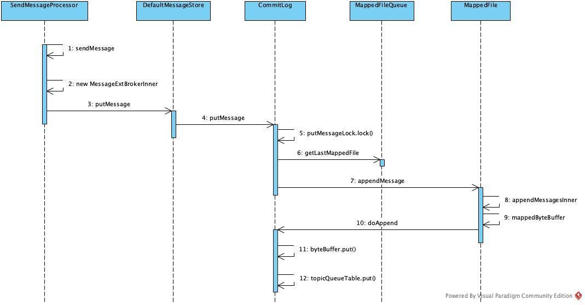

# 综述

1. 版本使用release-4.7.0
2. [官网地址](http://rocketmq.apache.org/)
3. [GitHub地址](https://github.com/apache/rocketmq/)


broker与consumer都是临时引用晴天哥_374的相关文章，后续还是要自己逐行整理逻辑。

> [rocketMq理论与实践](https://www.jianshu.com/c/642c9e43bc60)

## 结构图


先看一下官方给出的结构图，图中分为了4个大的模块，producer、namesrv、broker、consumer，这4个模块都是可以集群部署。


# NameServer

引入：

1. 为什么要单独写一个注册中心，为什么不采用网上现有的解决方案，例如zk，eureka
2. nameServer有什么优点？架构是怎么样的？与zk，eureka差异。
3. 启动流程
4. client的注册流程，nameServer故障发现，故障排除
5. 集群的实现方式，各节点间关系，怎样同步各个节点间数据
6. nameServer中储存了一些什么信息，储存结构是怎么样的，生命周期如何维护
7. nameServer提供了broker discovery功能，存储了routing info信息，相关功能是怎么用的


# Producer

引入

- 启动流程
- 消息发送流程
- 消息重发
- 事务消息


## 启动流程

在官方源码`org.apache.rocketmq.example.simple`包中都是一些使用例子，其中`Producer`类是生产者的Test类。

```java
 				DefaultMQProducer producer = new DefaultMQProducer("ProducerGroupName");
        producer.start();

        for (int i = 0; i < 128; i++)
            try {
                {
                    Message msg = new Message("TopicTest",
                        "TagA",
                        "OrderID188",
                        "Hello world".getBytes(RemotingHelper.DEFAULT_CHARSET));
                    SendResult sendResult = producer.send(msg);
                    System.out.printf("%s%n", sendResult);
                }

            } catch (Exception e) {
                e.printStackTrace();
            }

        producer.shutdown();
```


看一下`DefaultMQProducer`类的构造方法

```java
org.apache.rocketmq.client.producer.DefaultMQProducer
	
    1.调用单参构造，没有给默认的命名空间和钩子函数
  	public DefaultMQProducer(final String producerGroup) {
        this(null, producerGroup, null);
    }

		2.继续实例化defaultMQProducerImpl
    public DefaultMQProducer(final String namespace, final String producerGroup, RPCHook rpcHook) {
        this.namespace = namespace;
        this.producerGroup = producerGroup;
        defaultMQProducerImpl = new DefaultMQProducerImpl(this, rpcHook);
    }

    3. 初始化了asyncSenderThreadPoolQueue 异步的发送线程池队列
       初始化了一个发送消息用的线程池
      
    public DefaultMQProducerImpl(final DefaultMQProducer defaultMQProducer, RPCHook rpcHook) {
        this.defaultMQProducer = defaultMQProducer;
        this.rpcHook = rpcHook;

        this.asyncSenderThreadPoolQueue = new LinkedBlockingQueue<Runnable>(50000);
        this.defaultAsyncSenderExecutor = new ThreadPoolExecutor(
            Runtime.getRuntime().availableProcessors(),
            Runtime.getRuntime().availableProcessors(),
            1000 * 60,
            TimeUnit.MILLISECONDS,
            this.asyncSenderThreadPoolQueue,
            new ThreadFactory() {
                private AtomicInteger threadIndex = new AtomicInteger(0);

                @Override
                public Thread newThread(Runnable r) {
                    return new Thread(r, "AsyncSenderExecutor_" + this.threadIndex.incrementAndGet());
                }
            });
    }

```

对一些变量进行了初始化操作，初始化了一个发送消息用的线程池。`DefaultMQProducer`实例化完成后，调用了`start`方法

```java
org.apache.rocketmq.client.producer.DefaultMQProducer

@Override
public void start() throws MQClientException {
    this.setProducerGroup(withNamespace(this.producerGroup));
    this.defaultMQProducerImpl.start();
    if (null != traceDispatcher) {
        try {
            traceDispatcher.start(this.getNamesrvAddr(), this.getAccessChannel());
        } catch (MQClientException e) {
            log.warn("trace dispatcher start failed ", e);
        }
    }
}
```

1. 生成了producerGroup名

2. 调用`start`方法

3. 启动跟踪器

   

继续看`start`方法

```java
org.apache.rocketmq.client.producer.DefaultMQProducer

public void start() throws MQClientException {
    this.start(true);
}

public void start(final boolean startFactory) throws MQClientException {
        switch (this.serviceState) {
            case CREATE_JUST:
                this.serviceState = ServiceState.START_FAILED;

								//使用Validators类中静态方法检查配置项
                this.checkConfig();

                if (!this.defaultMQProducer.getProducerGroup().equals(MixAll.CLIENT_INNER_PRODUCER_GROUP)) {
                    this.defaultMQProducer.changeInstanceNameToPID();
                }

								//①通过MQClientManager静态对象，创建或获取一个MQClientInstance(mQClientFactory对象名有点误导)
                this.mQClientFactory = MQClientManager.getInstance().getOrCreateMQClientInstance(this.defaultMQProducer, rpcHook);

								//注册一下此producer，其实就是把此producer对象加入到mQClientFactory中一个table缓存中
                boolean registerOK = mQClientFactory.registerProducer(this.defaultMQProducer.getProducerGroup(), this);
                if (!registerOK) {
                    this.serviceState = ServiceState.CREATE_JUST;
                    throw new MQClientException("The producer group[" + this.defaultMQProducer.getProducerGroup()
                        + "] has been created before, specify another name please." + FAQUrl.suggestTodo(FAQUrl.GROUP_NAME_DUPLICATE_URL),
                        null);
                }

								//缓存一下需要发送的目标topic
                this.topicPublishInfoTable.put(this.defaultMQProducer.getCreateTopicKey(), new TopicPublishInfo());

								//②第一次，需要先启动MQClientInstance
                if (startFactory) {
                    mQClientFactory.start();
                }

                log.info("the producer [{}] start OK. sendMessageWithVIPChannel={}", this.defaultMQProducer.getProducerGroup(),
                    this.defaultMQProducer.isSendMessageWithVIPChannel());
                this.serviceState = ServiceState.RUNNING;
                break;
            case RUNNING:
            case START_FAILED:
            case SHUTDOWN_ALREADY:
                throw new MQClientException("The producer service state not OK, maybe started once, "
                    + this.serviceState
                    + FAQUrl.suggestTodo(FAQUrl.CLIENT_SERVICE_NOT_OK),
                    null);
            default:
                break;
        }
				
				//发送心跳给所有的broker
        this.mQClientFactory.sendHeartbeatToAllBrokerWithLock();

				//创建一个定时任务，每3秒扫描一下过期的请求
        this.timer.scheduleAtFixedRate(new TimerTask() {
            @Override
            public void run() {
                try {
                    RequestFutureTable.scanExpiredRequest();
                } catch (Throwable e) {
                    log.error("scan RequestFutureTable exception", e);
                }
            }
        }, 1000 * 3, 1000);
    }
```

1. 创建或获取一个MQClientInstance。
2. 在MQClientInstance中注册一下producer
3. 启动MQClientInstance
4. 维护心跳给所有的broker
5. 创建一个定时任务，定时扫描过期的请求


#  Broker

引入

- broker物理、逻辑结构，broker与queue的关系
- 启动流程
- 消息的存储结构与发送消息的接受流程
- 请求路由、负载均衡、动态扩容
- 消息的持久化机制
- 集群结构，节点间关系、节点间高可用


## 启动流程

> [RocketMq broker 启动流程](https://www.jianshu.com/p/0b5940fb7bcc)

// todo 待分析


## 消息存储

> [RocketMq broker CommitLog介绍](https://www.jianshu.com/p/5f8b93f95842)

// todo 以下内容直接引用自上面的文章，后续还是需要自己分析一遍的。

**CommitLog**

消息主体以及元数据的存储主体，存储Producer端写入的消息主体内容，消息内容不是定长的。单个文件大小默认1G ，文件名长度为20位，左边补零，剩余为起始偏移量，比如00000000000000000000代表了第一个文件，起始偏移量为0，文件大小为1G=1073741824；当第一个文件写满了，第二个文件为00000000001073741824，起始偏移量为1073741824，以此类推。消息主要是顺序写入日志文件，当文件满了，写入下一个文件。


**消息存储流程**



- 消息接收入口 SendMessageProcessor。

- 消息保存入口 DefaultMessageStore。

- 消息的保存流程按照CommitLog、MappedFileQueue、MappedFile的顺序依次保存。


**DefaultMessageStore**

- 创建MessageExtBrokerInner对象，是broker内部消息传递的对象。

- 针对延迟和重试消息额外创建对应的topic对象。


**DefaultMessageStore**

putMessage的核心在于执行commitLog.putMessage。


**CommitLog**

- 针对延迟消息进行额外处理、设置topic和queueId。
- **通过mappedFileQueue获取最新的MappedFile文件，如果不存在会新建MappedFile对象**。
- **加锁准备写入消息**。
- 通过mappedFile.appendMessage将消息添加到mappedFile当中，**参数当中的回调函数是DefaultAppendMessageCallback**。
- CommitLog保存着MappedFileQueue对象。
- **CommitLog写入消息后handleDiskFlush执行刷新操作**。


**MappedFileQueue**

- MappedFileQueue内部包含MappedFile的列表mappedFiles。
- MappedFileQueue在getLastMappedFile会按需创建MappedFile对象。


**MappedFile**

- MappedFile会把磁盘文件map成内存文件。

- appendMessagesInner内部会区分批量/单条消息的存储。

- 真正执行的是回调函数DefaultAppendMessageCallback。

- **重要变量wrotePosition，保存保存已写入的数据的位置**


## 消息消费

> [RocketMq broker consumeQueue介绍](https://www.jianshu.com/p/5835c9e092ac)

- ConsumeQueue：消息消费队列，引入的目的主要是提高消息消费的性能，由于RocketMQ是基于主题topic的订阅模式，消息消费是针对主题进行的，如果要遍历commitlog文件中根据topic检索消息是非常低效的。Consumer即可根据ConsumeQueue来查找待消费的消息。其中，ConsumeQueue（逻辑消费队列）作为消费消息的索引，保存了指定Topic下的队列消息在CommitLog中的起始物理偏移量offset，消息大小size和消息Tag的HashCode值。
- consumequeue文件可以看成是基于topic的commitlog索引文件，故consumequeue文件夹的组织方式如下：topic/queue/file三层组织结构，具体存储路径为：$HOME/store/consumequeue/{topic}/{queueId}/{fileName}。同样consumequeue文件采取定长设计，每一个条目共20个字节，分别为8字节的commitlog物理偏移量、4字节的消息长度、8字节tag hashcode，单个文件由30W个条目组成，可以像数组一样随机访问每一个条目，每个ConsumeQueue文件大小约5.72M。


**DefaultMessageStore#start**

reputMessageService.start()负责启动reputMessageService，负责读取commitLog信息并添加到consumeQueue当中。


**ReputMessageService**

- ReputMessageService#run内部执行doReput方法。

- doReput方法负责从commitLog获取消息并将位移等相关信息保存到consumeQueue。
- 每次从reputFromOffset位置开始读取commitLog。


**CommitLog数据读取**

- CommitLog#getData根据起始offset的位移去mappedFileQueue确定mappedFile文件。

- MappedFile.selectMappedBuffer获取目前数据写入的最大位移，根据起始offset和结束位移。

- MappedFile的目前数据写入的最大位移wrotePosition会在消息写入后变更，每次数据添加后同步更新wrotePosition的值。

- getData返回SelectMappedBufferResult对象，包括byteBuffer（数据缓存）、startOffset（起始位移）、size（数据大小）、mappedFile（对应的mappedFile）。


**consumeQueue的写入**

- commitLog.checkMessageAndReturnSize负责解析报文。

- DefaultMessageStore.this.doDispatch(dispatchRequest)负责保存解析结果。


**commitLog解析**

- checkMessageAndReturnSize实现commitLog的解析，按照commitLog的报文格式进行解析，解析的生成的DispatchRequest对象。

- commitLogOffset保存commitLog实际的偏移。

- consumeQueueOffset保存在consumeQueue的位移。

- consumeQueue这个关键字段是保存在CommitLog类的topicQueueTable当中，
   HashMap<String/* topic-queueid */, Long/* offset */> topicQueueTable，相当于指定topic下的指定queueId下已保存的消息各数。


**doDispatch分发任务**

- doDispatch负责执行分发任务。
- CommitLogDispatcherBuildConsumeQueue负责生成consumeQueue。
- CommitLogDispatcherBuildIndex负责生成Index。


**CommitLogDispatcherBuildConsumeQueue**

- dispatch执行DefaultMessageStore#putMessagePositionInfo。

- putMessagePositionInfo核心逻辑是寻找ConsumeQueue对象。

- consumeQueueTable保存的以topic+queueId保存ConsumeQueue。

- ConsumeQueue保存mappedFileQueue，mappedFileQueue保存mappedFiles。

- **ConsumeQueue本质上还是通过mappedFile来保存的**。

- ConsumeQueue保存的数据每一个条目共20个字节，分别为8字节的commitlog物理偏移量、4字节的消息长度、8字节tag hashcode。


**CommitLogDispatcherBuildIndex**

- dispatch执行DefaultMessageStore.this.indexService.buildIndex。
- IndexFile：IndexFile（索引文件）提供了一种可以通过key或时间区间来查询消息的方法。Index的文件名fileName是以创建时的时间戳命名的，固定的单个IndexFile文件大小约为400M，一个IndexFile可以保存 2000W个索引，IndexFile的底层存储设计为在文件系统中实现HashMap结构，故rocketmq的索引文件其底层实现为hash索引。
- 如果消息的properties中设置了UNIQ_KEY这个属性，就用 topic + “#” + UNIQ_KEY的value作为  key 来做写入操作。如果消息设置了KEYS属性（多个KEY以空格分隔），也会用 topic + “#” + KEY 来做索引。


​       


## 死信队列

> [RocketMq broker 重试和死信队列](https://www.jianshu.com/p/0b3d0b709424)
>
> [RocketMq 死信队列](https://www.jianshu.com/p/6cc25cd42185)

一般应用在当正常业务处理时出现异常时，将消息拒绝则会进入到死信队列中，重试队列在重试16次（默认次数）将消息放入死信队列。

本质上所有的数据都是存在commitLog文件的，只是consumeQueue根据topic的不同进行了区分，重试队列和死信队列本质上进入到了对应topic下的consumeQueue而已。

- 重试队列是以%RETRY%+consumerGroup作为维度的生成consumeQueue。

- 死信队列是以%DLQ%+consumerGroup作为维度的生成consumeQueue。

- 进入死信队列的条件是重试次数超过了最大重试次数。

- 死信队列的topic是在消息发送过程中判断对应的topic是否存在，不存在就动态进行创建。


## 延迟消息

> [RocketMq broker 延迟消息](https://www.jianshu.com/p/48725af8c187)

本质上所有的数据都是存在commitLog文件的，只是consumeQueue根据topic的不同进行了区分。延迟消息本质上进入到了对应topic下的consumeQueue而已，延迟消息consumeQueue下的queueId是根据延迟粒度来分组的。


**延迟消息Topic变更**

- 延迟消息数据本质依然是存在commitLog当中，对应的consumeQueue变成了SCHEDULE_TOPIC_XXXX，queueId根据延迟粒度重新生成。

- 整个延迟消息的处理逻辑包括：转换延迟队列粒度、生成延迟消息的topic和queueId、 备份原来的topic和对应的queueId，其他的逻辑统一走消息写入流程。

- 延迟消息对应的consumeQueue是没有办法被直接订阅消费的，所有延迟消息的消费前提是将消息重新添加到commitLog同时在topic对应的consumeQueue当中可见。

- 从SCHEDULE_TOPIC_XXXX的consumeQueue迁移到topic对应的consumeQueue是通过ScheduleMessageService来实现的。


**ScheduleMessageService**

- ScheduleMessageService的load过程中会针对配置文件的中的延迟粒度进行解析，生成延迟消息配置表delayLevelTable。

- ScheduleMessageService根据delayLevelTable生成不同延迟粒度任务来处理对应的延迟任务。


**DeliverDelayedMessageTimerTask**

- 查找SCHEDULE_TOPIC下对应的延迟粒度的consumeQueue。

- 从指定位置开始获取并返回SelectMappedBufferResult结果。

- 遍历SelectMappedBufferResult并按照固定长度CQ_STORE_UNIT_SIZE进行遍历。

- 针对SelectMappedBufferResult下的每个对象计算过期时间并于当前进行对比，如果过期就重新构建MessageExtBrokerInner对象并投递到commitLog当中。

- 如果发现当前对象还未到过期时间那么就重新启动该延迟粒度下的定时任务，启动时间为 **到期时间-当前时间的差值**。

- **延迟消息通过重新投递到commitLog并重新构建对应topic的consumeQueue来实现延迟消息消费**。


## 过期文件删除

> [RocketMq broker过期文件删除](https://www.jianshu.com/p/39c51e6ac1bd)

- RocketMQ操作CommitLog、ConsumeQueue文件是基于文件内存映射机制，并且在启动的时候会将所有的文件加载，为了避免内存与磁盘的浪费、能够让磁盘能够循环利用、避免因为磁盘不足导致消息无法写入等引入了文件过期删除机制。

- commitLog的文件删除逻辑根据commitLog的MappedFile的最新写入时间和文件的过期时间进行比较，如果超过就会删除该文件。

- consumeQueue的文件删除逻辑基于commitLog，基于commitLog的最早文件的最小物理偏移和consumeQueue的单个文件的最后偏移的物理偏移进行比较，如果consumeQueue最新的物理偏移小于comitLog的最早物理偏移那么该cosumeQueue文件就可以删除。


# Consumer

> [rocketMq-consumer介绍](https://www.jianshu.com/p/7f772c3eccd6)

引入

- 启动流程
- 消息拉取过程
  - 主动拉取
  - 被动拉取
- 消费的具体流程
- 消费队列的负载均衡与rebalance
- 定时消费的具体实现
- 如果需要有严格消费顺序，该怎么做？


## 并发消费流程

> [rocketMq - 并发消费过程](https://www.jianshu.com/p/fdd7a8ab90fb)


1. Rebalance负责生成pullRequest放置到pullRequestQueue当中。

2. PullMessageService负责消费pullRequest来完成数据的拉取。

3. 数据拉取后生成ConsumeRequest对象投递到consumeExecutor的线程池当中

4. ConsumeRequest是一个线程实例，负责消费拉取的消息。

5. 消费消息成功就从ConsumeRequest的ProcessQueue中删除，消费失败就投递到broker的重试队列中，重试次数和延迟粒度在broker端处理。

6. consumeRequest内部维持的processQueue作为一个TreeMap对象可以维持消息的有序性，用于判断消费进度。

7. pullRequest在消费完以后还是再次投递到pullRequestQueue当中。


## 串行消费流程

> [rocketMq - 串行消费过程](https://www.jianshu.com/p/b6cfa153d58b)


为什么有序消费能够保证消息被顺序消费？

答案是：

1. 顺序消费的顺序是有序保存在ProcessQueue的TreeMap对象中，key为消息的偏移量，也就是一个messageQueue拉取的消息有序放置在ProcessQueue当中

2. 每次消费的时候都是按序从ProcessQueue中按顺序拷贝待消费任务到临时的TreeMap对象当中

3. 消费失败后依旧会重新消费刚刚消费失败的那部分任务

4. 每次pullRequest执行完成后都会触发一次ConsumeRequest任务，会在原来的TreeMap对象中加入新的待消费的消息


# 常见面试题

> [RocketMQ在面试中那些常见问题及答案+汇总](https://www.cnblogs.com/javazhiyin/p/13327925.html)

来不及去分段爬源码了，找找捷径了，后续要补全源码解析。


> #### 消费消息是push还是pull？

RocketMQ没有真正意义的push，都是pull，虽然有push类，但实际底层实现采用的是**长轮询机制**，即拉取方式。


> #### 为什么要主动拉取消息而不使用事件监听方式？

事件驱动方式是建立好长连接，由事件（发送数据）的方式来实时推送。

如果broker主动推送消息的话有可能push速度快，消费速度慢的情况，那么就会造成消息在consumer端堆积过多，同时又不能被其他consumer消费的情况。而pull的方式可以根据当前自身情况来pull，不会造成过多的压力而造成瓶颈。所以采取了pull的方式。


> #### broker如何处理拉取请求的？

Consumer首次请求Broker

- Broker中是否有符合条件的消息

- 有

- - 响应Consumer
  - 等待下次Consumer的请求

- 没有

- - DefaultMessageStore#ReputMessageService#run方法
  - PullRequestHoldService 来Hold连接，每个5s执行一次检查pullRequestTable有没有消息，有的话立即推送
  - 每隔1ms检查commitLog中是否有新消息，有的话写入到pullRequestTable
  - 当有新消息的时候返回请求
  - 挂起consumer的请求，即不断开连接，也不返回数据
  - 使用consumer的offset，


> #### RocketMQ如何做负载均衡

**默认策略是随机选择：**

- producer维护一个index
- 每次取节点会自增
- index向所有broker个数取余
- 自带容错策略


> #### RocketMQ在分布式事务支持这块机制的底层原理?

**Half Message：**预处理消息，当broker收到此类消息后，会存储到RMQ_SYS_TRANS_HALF_TOPIC的消息消费队列中

**检查事务状态：**Broker会开启一个定时任务，消费RMQ_SYS_TRANS_HALF_TOPIC队列中的消息，每次执行任务会向消息发送者确认事务执行状态（提交、回滚、未知），如果是未知，Broker会定时去回调在重新检查。

**超时：**如果超过回查次数，默认回滚消息。

也就是他并未真正进入Topic的queue，而是用了临时queue来放所谓的half message，等提交事务后才会真正的将half message转移到topic下的queue。