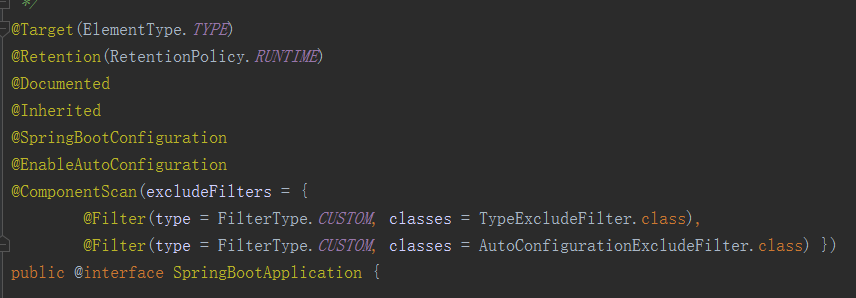
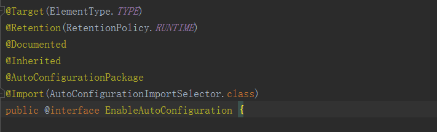
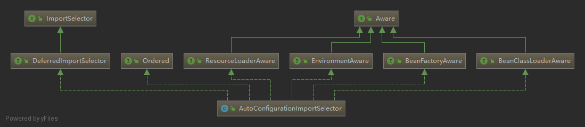
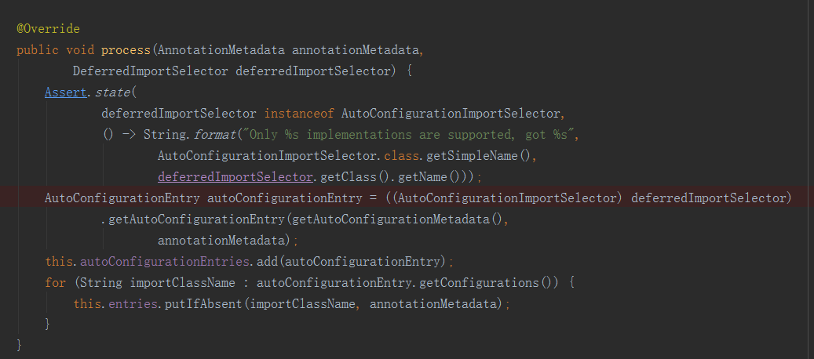
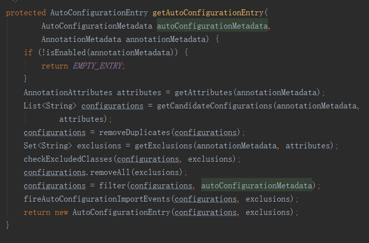
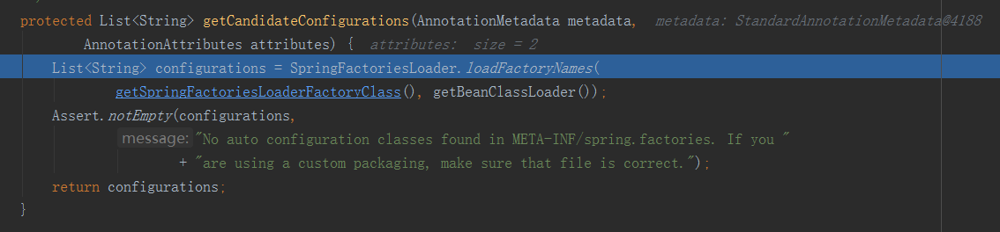
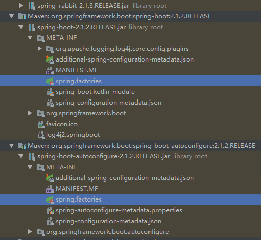
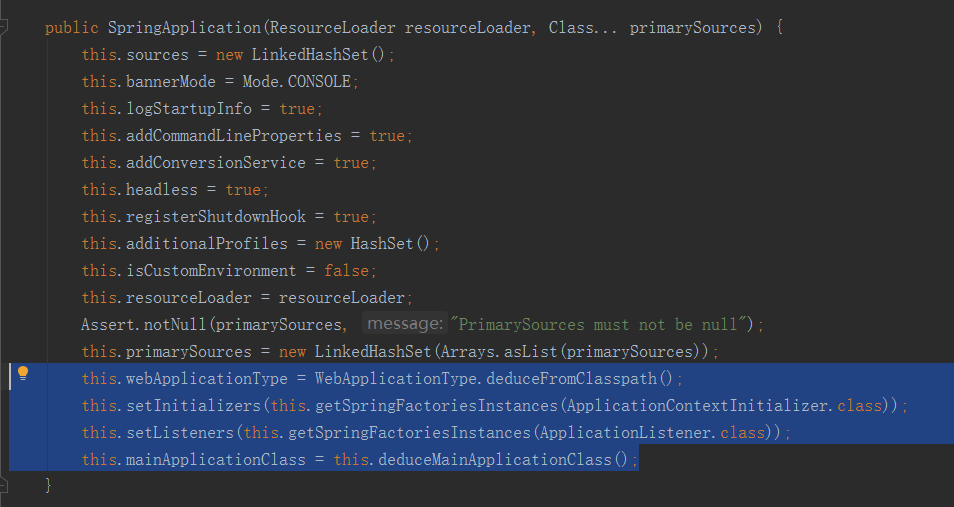

# 综述

本文SpringBoot版本为2.1.2.RELEASE

```java
import org.springframework.boot.SpringApplication;
import org.springframework.boot.autoconfigure.SpringBootApplication;

@SpringBootApplication
public class DemoApplication {

    public static void main(String[] args) {
        SpringApplication.run(DemoApplication.class, args);
    }

}

```

这是springboot的主类，整个程序是从这个main方法开始的。`@SpringBootApplication`注解实现了自动装配，

`SpringApplication.run()`方法是启动流程。


# 自动配置原理

点开`@SpringBootApplication`会发现这是一个复合注解




- `@SpringBootConfiguration`是个空注解。
- `@EnableAutoConfiguration`是开启自动配置。
- `@ComponentScan`bean扫描，有两个排除的。


点开`@EnableAutoConfiguration`，发现里面Import了另一个类。




这里发现和网上大多数说的流程有了点差别，之后的程序入口并不是`selectImports`方法，而是`process`方法，先看一下这个类的继承关系图：



`AutoConfigurationImportSelector`实现了`ImportSelector`接口中唯一的方法`selectImports()`

而`process()`方法定义在`DeferredImportSelector`接口中的内部接口`Group`接口中。这是一个比较少见的写法，一般都是定义一个内部类，只在内部使用，防止暴露一些方法给类的外部。这个内部接口，之后又被继承，这就不是很懂为啥要这样写，导致实现类里面还要实现这个接口，而具体的实现又是个静态的内部类。。。

不管这个，根据断点，后续步骤来到了`process()`方法



第一块是个断言，可以不管。主要是下面这个`getAutoConfigurationEntry`方法。


`getAutoConfigurationEntry()`




`getAttributes(annotationMetadata);`方法返回了AnnotationAttributes，他里面记载了标签中exclude的类。之后`getCandidateConfigurations`方法尝试获取候选配置。


`getCandidateConfigurations`




这里的2个参数分别是两个函数的返回值，特地的封装了一下没有写死，怕不是以后还要加东西。

```java
	protected Class<?> getSpringFactoriesLoaderFactoryClass() {
		return EnableAutoConfiguration.class;
	}

	protected ClassLoader getBeanClassLoader() {
		return this.beanClassLoader;
	}
```


`loadFactoryNames`

```java
	public static List<String> loadFactoryNames(Class<?> factoryClass, @Nullable ClassLoader classLoader) {
        String factoryClassName = factoryClass.getName();
        return (List)loadSpringFactories(classLoader).getOrDefault(factoryClassName, Collections.emptyList());
    }

	private static Map<String, List<String>> loadSpringFactories(@Nullable ClassLoader classLoader) {
        MultiValueMap<String, String> result = (MultiValueMap)cache.get(classLoader);
        if (result != null) {
            return result;
        } else {
            try {
                Enumeration<URL> urls = classLoader != null ? classLoader.getResources("META-INF/spring.factories") : ClassLoader.getSystemResources("META-INF/spring.factories");
                LinkedMultiValueMap result = new LinkedMultiValueMap();

                while(urls.hasMoreElements()) {
                    URL url = (URL)urls.nextElement();
                    UrlResource resource = new UrlResource(url);
                    Properties properties = PropertiesLoaderUtils.loadProperties(resource);
                    Iterator var6 = properties.entrySet().iterator();

                    while(var6.hasNext()) {
                        Entry<?, ?> entry = (Entry)var6.next();
                        String factoryClassName = ((String)entry.getKey()).trim();
                        String[] var9 = StringUtils.commaDelimitedListToStringArray((String)entry.getValue());
                        int var10 = var9.length;

                        for(int var11 = 0; var11 < var10; ++var11) {
                            String factoryName = var9[var11];
                            result.add(factoryClassName, factoryName.trim());
                        }
                    }
                }

                cache.put(classLoader, result);
                return result;
            } catch (IOException var13) {
                throw new IllegalArgumentException("Unable to load factories from location [META-INF/spring.factories]", var13);
            }
        }
    }
```


- `factoryClassName`的值是`org.springframework.boot.autoconfigure.EnableAutoConfiguration`

- 尝试读取项目各个包下的 META-INF/spring.factories 文件。
- 读取之后再把配置文件中的值给封装到一个`LinkedMultiValueMap`中去


然后我在项目的包下面找到了这3个文件，还有一个文件是在`jar:file:/C:/Users/idelo/.m2/repository/org/springframework/spring-beans/5.1.4.RELEASE/spring-beans-5.1.4.RELEASE.jar!/META-INF/spring.factories`



 

看一下下面那个文件里面写了什么

```factories
# Initializers
org.springframework.context.ApplicationContextInitializer=/
org.springframework.boot.autoconfigure.SharedMetadataReaderFactoryContextInitializer,/
org.springframework.boot.autoconfigure.logging.ConditionEvaluationReportLoggingListener

# Application Listeners
org.springframework.context.ApplicationListener=/
org.springframework.boot.autoconfigure.BackgroundPreinitializer

# Auto Configuration Import Listeners
org.springframework.boot.autoconfigure.AutoConfigurationImportListener=/
org.springframework.boot.autoconfigure.condition.ConditionEvaluationReportAutoConfigurationImportListener

# Auto Configuration Import Filters
org.springframework.boot.autoconfigure.AutoConfigurationImportFilter=/
org.springframework.boot.autoconfigure.condition.OnBeanCondition,/
org.springframework.boot.autoconfigure.condition.OnClassCondition,/
org.springframework.boot.autoconfigure.condition.OnWebApplicationCondition

# Auto Configure
org.springframework.boot.autoconfigure.EnableAutoConfiguration=/
org.springframework.boot.autoconfigure.admin.SpringApplicationAdminJmxAutoConfiguration,/
org.springframework.boot.autoconfigure.aop.AopAutoConfiguration,/
org.springframework.boot.autoconfigure.amqp.RabbitAutoConfiguration,/
org.springframework.boot.autoconfigure.batch.BatchAutoConfiguration,/
org.springframework.boot.autoconfigure.cache.CacheAutoConfiguration,/
org.springframework.boot.autoconfigure.cassandra.CassandraAutoConfiguration,/
org.springframework.boot.autoconfigure.cloud.CloudServiceConnectorsAutoConfiguration,/
org.springframework.boot.autoconfigure.context.ConfigurationPropertiesAutoConfiguration,/
org.springframework.boot.autoconfigure.context.MessageSourceAutoConfiguration,/
org.springframework.boot.autoconfigure.context.PropertyPlaceholderAutoConfiguration,/
org.springframework.boot.autoconfigure.couchbase.CouchbaseAutoConfiguration,/
org.springframework.boot.autoconfigure.dao.PersistenceExceptionTranslationAutoConfiguration,/
org.springframework.boot.autoconfigure.data.cassandra.CassandraDataAutoConfiguration,/
org.springframework.boot.autoconfigure.data.cassandra.CassandraReactiveDataAutoConfiguration,/
org.springframework.boot.autoconfigure.data.cassandra.CassandraReactiveRepositoriesAutoConfiguration,/
org.springframework.boot.autoconfigure.data.cassandra.CassandraRepositoriesAutoConfiguration,/
org.springframework.boot.autoconfigure.data.couchbase.CouchbaseDataAutoConfiguration,/
org.springframework.boot.autoconfigure.data.couchbase.CouchbaseReactiveDataAutoConfiguration,/
org.springframework.boot.autoconfigure.data.couchbase.CouchbaseReactiveRepositoriesAutoConfiguration,/
org.springframework.boot.autoconfigure.data.couchbase.CouchbaseRepositoriesAutoConfiguration,/
org.springframework.boot.autoconfigure.data.elasticsearch.ElasticsearchAutoConfiguration,/
org.springframework.boot.autoconfigure.data.elasticsearch.ElasticsearchDataAutoConfiguration,/
org.springframework.boot.autoconfigure.data.elasticsearch.ElasticsearchRepositoriesAutoConfiguration,/
org.springframework.boot.autoconfigure.data.jdbc.JdbcRepositoriesAutoConfiguration,/
org.springframework.boot.autoconfigure.data.jpa.JpaRepositoriesAutoConfiguration,/
org.springframework.boot.autoconfigure.data.ldap.LdapRepositoriesAutoConfiguration,/
org.springframework.boot.autoconfigure.data.mongo.MongoDataAutoConfiguration,/
org.springframework.boot.autoconfigure.data.mongo.MongoReactiveDataAutoConfiguration,/
org.springframework.boot.autoconfigure.data.mongo.MongoReactiveRepositoriesAutoConfiguration,/
org.springframework.boot.autoconfigure.data.mongo.MongoRepositoriesAutoConfiguration,/
org.springframework.boot.autoconfigure.data.neo4j.Neo4jDataAutoConfiguration,/
org.springframework.boot.autoconfigure.data.neo4j.Neo4jRepositoriesAutoConfiguration,/
org.springframework.boot.autoconfigure.data.solr.SolrRepositoriesAutoConfiguration,/
org.springframework.boot.autoconfigure.data.redis.RedisAutoConfiguration,/
org.springframework.boot.autoconfigure.data.redis.RedisReactiveAutoConfiguration,/
org.springframework.boot.autoconfigure.data.redis.RedisRepositoriesAutoConfiguration,/
org.springframework.boot.autoconfigure.data.rest.RepositoryRestMvcAutoConfiguration,/
org.springframework.boot.autoconfigure.data.web.SpringDataWebAutoConfiguration,/
org.springframework.boot.autoconfigure.elasticsearch.jest.JestAutoConfiguration,/
org.springframework.boot.autoconfigure.elasticsearch.rest.RestClientAutoConfiguration,/
org.springframework.boot.autoconfigure.flyway.FlywayAutoConfiguration,/
org.springframework.boot.autoconfigure.freemarker.FreeMarkerAutoConfiguration,/
org.springframework.boot.autoconfigure.gson.GsonAutoConfiguration,/
org.springframework.boot.autoconfigure.h2.H2ConsoleAutoConfiguration,/
org.springframework.boot.autoconfigure.hateoas.HypermediaAutoConfiguration,/
org.springframework.boot.autoconfigure.hazelcast.HazelcastAutoConfiguration,/
org.springframework.boot.autoconfigure.hazelcast.HazelcastJpaDependencyAutoConfiguration,/
org.springframework.boot.autoconfigure.http.HttpMessageConvertersAutoConfiguration,/
org.springframework.boot.autoconfigure.http.codec.CodecsAutoConfiguration,/
org.springframework.boot.autoconfigure.influx.InfluxDbAutoConfiguration,/
org.springframework.boot.autoconfigure.info.ProjectInfoAutoConfiguration,/
org.springframework.boot.autoconfigure.integration.IntegrationAutoConfiguration,/
org.springframework.boot.autoconfigure.jackson.JacksonAutoConfiguration,/
org.springframework.boot.autoconfigure.jdbc.DataSourceAutoConfiguration,/
org.springframework.boot.autoconfigure.jdbc.JdbcTemplateAutoConfiguration,/
org.springframework.boot.autoconfigure.jdbc.JndiDataSourceAutoConfiguration,/
org.springframework.boot.autoconfigure.jdbc.XADataSourceAutoConfiguration,/
org.springframework.boot.autoconfigure.jdbc.DataSourceTransactionManagerAutoConfiguration,/
org.springframework.boot.autoconfigure.jms.JmsAutoConfiguration,/
org.springframework.boot.autoconfigure.jmx.JmxAutoConfiguration,/
org.springframework.boot.autoconfigure.jms.JndiConnectionFactoryAutoConfiguration,/
org.springframework.boot.autoconfigure.jms.activemq.ActiveMQAutoConfiguration,/
org.springframework.boot.autoconfigure.jms.artemis.ArtemisAutoConfiguration,/
org.springframework.boot.autoconfigure.groovy.template.GroovyTemplateAutoConfiguration,/
org.springframework.boot.autoconfigure.jersey.JerseyAutoConfiguration,/
org.springframework.boot.autoconfigure.jooq.JooqAutoConfiguration,/
org.springframework.boot.autoconfigure.jsonb.JsonbAutoConfiguration,/
org.springframework.boot.autoconfigure.kafka.KafkaAutoConfiguration,/
org.springframework.boot.autoconfigure.ldap.embedded.EmbeddedLdapAutoConfiguration,/
org.springframework.boot.autoconfigure.ldap.LdapAutoConfiguration,/
org.springframework.boot.autoconfigure.liquibase.LiquibaseAutoConfiguration,/
org.springframework.boot.autoconfigure.mail.MailSenderAutoConfiguration,/
org.springframework.boot.autoconfigure.mail.MailSenderValidatorAutoConfiguration,/
org.springframework.boot.autoconfigure.mongo.embedded.EmbeddedMongoAutoConfiguration,/
org.springframework.boot.autoconfigure.mongo.MongoAutoConfiguration,/
org.springframework.boot.autoconfigure.mongo.MongoReactiveAutoConfiguration,/
org.springframework.boot.autoconfigure.mustache.MustacheAutoConfiguration,/
org.springframework.boot.autoconfigure.orm.jpa.HibernateJpaAutoConfiguration,/
org.springframework.boot.autoconfigure.quartz.QuartzAutoConfiguration,/
org.springframework.boot.autoconfigure.reactor.core.ReactorCoreAutoConfiguration,/
org.springframework.boot.autoconfigure.security.servlet.SecurityAutoConfiguration,/
org.springframework.boot.autoconfigure.security.servlet.SecurityRequestMatcherProviderAutoConfiguration,/
org.springframework.boot.autoconfigure.security.servlet.UserDetailsServiceAutoConfiguration,/
org.springframework.boot.autoconfigure.security.servlet.SecurityFilterAutoConfiguration,/
org.springframework.boot.autoconfigure.security.reactive.ReactiveSecurityAutoConfiguration,/
org.springframework.boot.autoconfigure.security.reactive.ReactiveUserDetailsServiceAutoConfiguration,/
org.springframework.boot.autoconfigure.sendgrid.SendGridAutoConfiguration,/
org.springframework.boot.autoconfigure.session.SessionAutoConfiguration,/
org.springframework.boot.autoconfigure.security.oauth2.client.servlet.OAuth2ClientAutoConfiguration,/
org.springframework.boot.autoconfigure.security.oauth2.client.reactive.ReactiveOAuth2ClientAutoConfiguration,/
org.springframework.boot.autoconfigure.security.oauth2.resource.servlet.OAuth2ResourceServerAutoConfiguration,/
org.springframework.boot.autoconfigure.security.oauth2.resource.reactive.ReactiveOAuth2ResourceServerAutoConfiguration,/
org.springframework.boot.autoconfigure.solr.SolrAutoConfiguration,/
org.springframework.boot.autoconfigure.task.TaskExecutionAutoConfiguration,/
org.springframework.boot.autoconfigure.task.TaskSchedulingAutoConfiguration,/
org.springframework.boot.autoconfigure.thymeleaf.ThymeleafAutoConfiguration,/
org.springframework.boot.autoconfigure.transaction.TransactionAutoConfiguration,/
org.springframework.boot.autoconfigure.transaction.jta.JtaAutoConfiguration,/
org.springframework.boot.autoconfigure.validation.ValidationAutoConfiguration,/
org.springframework.boot.autoconfigure.web.client.RestTemplateAutoConfiguration,/
org.springframework.boot.autoconfigure.web.embedded.EmbeddedWebServerFactoryCustomizerAutoConfiguration,/
org.springframework.boot.autoconfigure.web.reactive.HttpHandlerAutoConfiguration,/
org.springframework.boot.autoconfigure.web.reactive.ReactiveWebServerFactoryAutoConfiguration,/
org.springframework.boot.autoconfigure.web.reactive.WebFluxAutoConfiguration,/
org.springframework.boot.autoconfigure.web.reactive.error.ErrorWebFluxAutoConfiguration,/
org.springframework.boot.autoconfigure.web.reactive.function.client.ClientHttpConnectorAutoConfiguration,/
org.springframework.boot.autoconfigure.web.reactive.function.client.WebClientAutoConfiguration,/
org.springframework.boot.autoconfigure.web.servlet.DispatcherServletAutoConfiguration,/
org.springframework.boot.autoconfigure.web.servlet.ServletWebServerFactoryAutoConfiguration,/
org.springframework.boot.autoconfigure.web.servlet.error.ErrorMvcAutoConfiguration,/
org.springframework.boot.autoconfigure.web.servlet.HttpEncodingAutoConfiguration,/
org.springframework.boot.autoconfigure.web.servlet.MultipartAutoConfiguration,/
org.springframework.boot.autoconfigure.web.servlet.WebMvcAutoConfiguration,/
org.springframework.boot.autoconfigure.websocket.reactive.WebSocketReactiveAutoConfiguration,/
org.springframework.boot.autoconfigure.websocket.servlet.WebSocketServletAutoConfiguration,/
org.springframework.boot.autoconfigure.websocket.servlet.WebSocketMessagingAutoConfiguration,/
org.springframework.boot.autoconfigure.webservices.WebServicesAutoConfiguration,/
org.springframework.boot.autoconfigure.webservices.client.WebServiceTemplateAutoConfiguration

# Failure analyzers
org.springframework.boot.diagnostics.FailureAnalyzer=/
org.springframework.boot.autoconfigure.diagnostics.analyzer.NoSuchBeanDefinitionFailureAnalyzer,/
org.springframework.boot.autoconfigure.jdbc.DataSourceBeanCreationFailureAnalyzer,/
org.springframework.boot.autoconfigure.jdbc.HikariDriverConfigurationFailureAnalyzer,/
org.springframework.boot.autoconfigure.session.NonUniqueSessionRepositoryFailureAnalyzer

# Template availability providers
org.springframework.boot.autoconfigure.template.TemplateAvailabilityProvider=/
org.springframework.boot.autoconfigure.freemarker.FreeMarkerTemplateAvailabilityProvider,/
org.springframework.boot.autoconfigure.mustache.MustacheTemplateAvailabilityProvider,/
org.springframework.boot.autoconfigure.groovy.template.GroovyTemplateAvailabilityProvider,/
org.springframework.boot.autoconfigure.thymeleaf.ThymeleafTemplateAvailabilityProvider,/
org.springframework.boot.autoconfigure.web.servlet.JspTemplateAvailabilityProvider

```

根据上面的代码，其实他以`org.springframework.boot.autoconfigure.EnableAutoConfiguration`为key从map中获取一些类的名称，从上面的配置中也可以看到这个key下面有配置了一群类。debug看了一下共获取到了	118个，之后就开始一个个加载这些类里面定义的bean。

所以，@EnableAutoConfiguration自动配置就是，从classpath中搜寻所有的META-INF/spring.factories配置文件，并将其中org.springframework.boot.autoconfigure.EnableutoConfiguration对应的配置项通过反射（Java
Refletion）实例化为对应的标注了@Configuration的JavaConfig形式的IoC容器配置类，然后汇总为一个并加载到IoC容器。


[Spring Boot自动配置原理、实战](https://mp.weixin.qq.com/s/gs2zLSH6m9ijO0-pP2sr9Q)

[SpringBoot实战之SpringBoot自动配置原理](https://www.cnblogs.com/leihuazhe/p/7743479.html)


# 实现一个自定义startor


//todo


# 启动流程

// todo 使用源码分析，重写一下

run方法最后调用的是`SpringApplication.run()`，首先会创建一个SpringApplication对象实例，然后调用这个创建好的SpringApplication的run方法。

```java
 	public static ConfigurableApplicationContext run(Class<?>[] primarySources, String[] args) {
        return (new SpringApplication(primarySources)).run(args);
    }
```


SpringApplication的构造方法如下



```java
	public SpringApplication(ResourceLoader resourceLoader, Class<?>... primarySources) {
		this.resourceLoader = resourceLoader;
		Assert.notNull(primarySources, "PrimarySources must not be null");
		this.primarySources = new LinkedHashSet<>(Arrays.asList(primarySources));
		this.webApplicationType = WebApplicationType.deduceFromClasspath();
		setInitializers((Collection) getSpringFactoriesInstances(
				ApplicationContextInitializer.class));
		setListeners((Collection) getSpringFactoriesInstances(ApplicationListener.class));
		this.mainApplicationClass = deduceMainApplicationClass();
	}
```


两段代码是同一段，上面那个是编译后的.class文件的。感觉还是class文件看的更舒服


蓝色选中部分为重点，他做了这么4件事

1. 服务应用类型推断：根据classpath里面是否存在某个特征类（org.springframework.web.context.ConfigurableWebApplicationContext）来决定是否应该创建一个为Web应用使用的ApplicationContext类型。
2. 使用SpringFactoriesLoader在应用的classpath中查找并加载所有可用的ApplicationContextInitializer。
3. 使用SpringFactoriesLoader在应用的classpath中查找并加载所有可用的ApplicationListener。
4. 推断并设置main方法的定义类。


`run`方法

```java
	 public ConfigurableApplicationContext run(String... args) {
        StopWatch stopWatch = new StopWatch();
        stopWatch.start();
        ConfigurableApplicationContext context = null;
        Collection<SpringBootExceptionReporter> exceptionReporters = new ArrayList();
        this.configureHeadlessProperty();
        SpringApplicationRunListeners listeners = this.getRunListeners(args);
        listeners.starting();

        Collection exceptionReporters;
        try {
            ApplicationArguments applicationArguments = new DefaultApplicationArguments(args);
            ConfigurableEnvironment environment = this.prepareEnvironment(listeners, applicationArguments);
            this.configureIgnoreBeanInfo(environment);
            Banner printedBanner = this.printBanner(environment);
            context = this.createApplicationContext();
            exceptionReporters = this.getSpringFactoriesInstances(SpringBootExceptionReporter.class, new Class[]{ConfigurableApplicationContext.class}, context);
            this.prepareContext(context, environment, listeners, applicationArguments, printedBanner);
            this.refreshContext(context);
            this.afterRefresh(context, applicationArguments);
            stopWatch.stop();
            if (this.logStartupInfo) {
                (new StartupInfoLogger(this.mainApplicationClass)).logStarted(this.getApplicationLog(), stopWatch);
            }

            listeners.started(context);
            this.callRunners(context, applicationArguments);
        } catch (Throwable var10) {
            this.handleRunFailure(context, var10, exceptionReporters, listeners);
            throw new IllegalStateException(var10);
        }

        try {
            listeners.running(context);
            return context;
        } catch (Throwable var9) {
            this.handleRunFailure(context, var9, exceptionReporters, (SpringApplicationRunListeners)null);
            throw new IllegalStateException(var9);
        }
    }

```


[spring boot(二)：启动原理解析](https://www.cnblogs.com/xiaoxi/p/7999885.html)

[springboot之启动原理解析及源码阅读](https://www.cnblogs.com/shamo89/p/8184960.html)

[springboot启动流程（目录）](https://www.cnblogs.com/lay2017/p/11478237.html)


# 配置文件与环境切换

假设环境是本地 + 测试 + 生产

方一：

在本地开发的时候,springboot 可以在配置文件中添加多个属性文件,比如

application.properties
application-dev.proterties
application-test.proterties
application-prod.proterties

spring-boot不同环境配置文件格式为application-{profile}.proterties。

如果application.proterties中的配置和application-{profile}.proterties相冲突时，application.proterties中的配置会被覆盖掉。

当然也可以把多个文件放在一个文件中，各环境通过“---”来隔开。

其中application.properties，是总的通用的配置文件，其中有这么一个配置

`spring.profiles.active=dev`

在测试环境运行就改成test，生产就改成prod。发布版本的时候，程序员先在本地进行打包，打成jar包。上测试了，就用压缩软件把jar包打开，修改spring.profiles.active=test。上生产环境了，就用压缩软件把jar包打开，修改spring.profiles.active=prod


方二：

别手动改了，直接在部署命令后面加配置项

`java -jar x.jar --spring.profiles.active=xxx`


# 配置文件加载位置与优先级

> ## 项目内部配置文件

spring boot 启动会扫描以下位置的application.properties或者application.yml文件作为Spring boot的默认配置文件

```properties
–file:./config/				#项目根目录下config文件夹内
–file:./                    #项目根目录下，一般与pom文件同级，与src文件夹同级
–classpath:/config/			#项目资源目录下，即放在src/main/resources/config/ 文件夹内
–classpath:/				#项目资源目录下，即放在src/main/resources/ 文件夹内
```

优先顺序从上到下，所有位置的文件都会被加载，高优先级配置内容会覆盖低优先级配置内容。如果高优先级中配置文件属性与低优先级配置文件不冲突的属性，则会共同存在—互补配置。


也可以修改默认的配置，来指定配置文件的位置。指定配置文件和默认加载的这些配置文件共同起作用形成互补配置。

```bash
java -jar xxx-SNAPSHOT.jar --spring.config.location=D:/application.properties
```


> ## 外部配置加载顺序

1. 开发者工具 `Devtools` 全局配置参数；

2. 单元测试上的 `@TestPropertySource` 注解指定的参数；

3. 单元测试上的 `@SpringBootTest` 注解指定的参数；

4. 命令行指定的参数，如 `java -jar springboot.jar --name="Java"`；

5. 命令行中的 `SPRING_APPLICATION_JSONJSON` 指定参数, 如 `java -Dspring.application.json='{"name":"Java"}' -jar springboot.jar`

6. `ServletConfig` 初始化参数；

7. `ServletContext` 初始化参数；

8. JNDI参数（如 `java:comp/env/spring.application.json`）；

9. Java系统参数（来源：`System.getProperties()`）；

10. 操作系统环境变量参数；

11. `RandomValuePropertySource` 随机数，仅匹配：`ramdom.*`；

12. JAR包外面的配置文件参数（`application-{profile}.properties（YAML）`）

13. JAR包里面的配置文件参数（`application-{profile}.properties（YAML）`）

14. JAR包外面的配置文件参数（`application.properties（YAML）`）

15. JAR包里面的配置文件参数（`application.properties（YAML）`）

16. `@Configuration`配置文件上 `@PropertySource` 注解加载的参数；

17. 默认参数（通过 `SpringApplication.setDefaultProperties` 指定）；


官网是这么写的


[Externalized Configuration](https://docs.spring.io/spring-boot/docs/2.1.2.RELEASE/reference/htmlsingle/#boot-features-external-config)

[Spring Boot 配置加载顺序详解](https://mp.weixin.qq.com/s/tFrRMM25LVE_2AG23lK5qQ)

[SpringBoot - 配置文件加载位置与优先级](https://blog.csdn.net/j080624/article/details/80508606)

[从一道简单的“SpringBoot配置文件”相关面试题，我就能知道你的水平 ](https://juejin.im/post/5c07ce306fb9a049f06a0c62)


# 面试题

> #### spring boot 有哪些方式可以实现热部署?

spring-boot-devtools

jRebel

