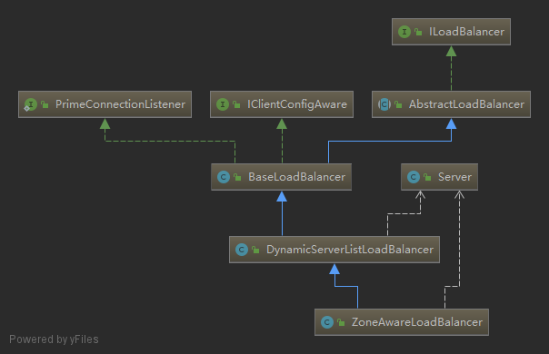
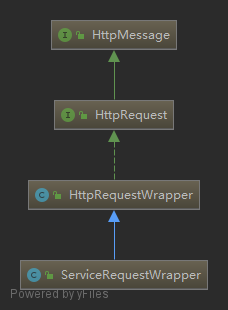
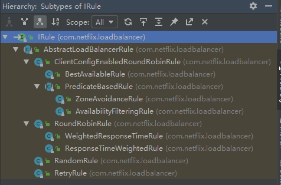
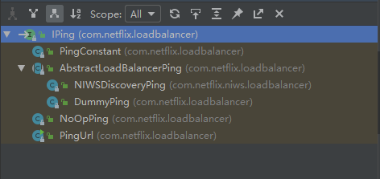

# 综述

大量参考了↓

[史上最简单的 SpringCloud 教程 | 终章](https://blog.csdn.net/forezp/article/details/70148833)


```pom
	<parent>
        <groupId>org.springframework.boot</groupId>
        <artifactId>spring-boot-starter-parent</artifactId>
        <version>2.1.2.RELEASE</version>
        <relativePath/> <!-- lookup parent from repository -->
    </parent>
	
	<properties>
        <java.version>11</java.version>
        <spring-cloud.version>Finchley.RELEASE</spring-cloud.version>
    </properties>
```


# Eureka


先从细节的问题来看

1. Eureka注册中心使用什么样的方式来储存各个服务注册时发送过来的机器地址和端口号？

   `private final CocurrentHashMap<String, Map<String, Lease<InstanceInfo>>> registry = new  CocurrentHashMap<String, Map<String, Lease<InstanceInfo>>>();`

   从代码中可以看到，Eureka Server的注册表直接基于**纯内存**，即在内存里维护了一个数据结构。各个服务的注册、服务下线、服务故障，全部会在内存里维护和更新这个注册表。各个服务每隔30秒拉取注册表的时候，Eureka Server就是直接提供内存里存储的有变化的注册表数据给他们就可以了。

   - 这个ConcurrentHashMap的key就是服务名称，比如“inventory-service”，就是一个服务名称。

   - value则代表了一个服务的多个服务实例。举例：比如“inventory-service”是可以有3个服务实例的，每个服务实例部署在一台机器上。

   - 里面这个Map的key就是**服务实例的id**。

   - value是一个叫做**Lease**的类，它的泛型是一个InstanceInfo。

   - InstanceInfo就代表了**服务实例的具体信息**，比如机器的ip地址、hostname以及端口号。

   - Lease，里面则会维护每个服务**最近一次发送心跳的时间**

     

2. 服务注册，client如何向server进行注册的？

   当Eureka客户端向Eureka Server注册时，它提供自身的元数据。

   比如IP地址、端口，service ID，运行状况指示符URL，主页等。

   

3. 服务注册时提交的元数据的数据结构

   
   
4. 各个服务找Eureka Server拉取注册表的时候，是什么样的频率？

   - 各个服务内的Eureka Client组件，默认情况下，每隔30秒会发送一个请求到Eureka Server，来拉取最近有变化的服务信息。
   - 除此之外，Eureka还有一个心跳机制，各个Eureka Client每隔30秒会发送一次心跳到Eureka Server。（服务续约）
   - 正常情况下，如果Eureka Server在90秒没有收到Eureka客户的续约，它会将实例从其注册表中删除。 建议不要更改续约间隔。
   - 可以保证一个大规模的系统每秒请求Eureka Server的次数在几百次。


4. 各个服务是如何拉取注册表的？

   - 在拉取注册表的时候：

   - - 首先从**ReadOnlyCacheMap**里查缓存的注册表。
     - 若没有，就找**ReadWriteCacheMap**里缓存的注册表。
     - 如果还没有，就从**内存中获取实际的注册表数据。**

   

   - 在注册表发生变更的时候：

   - - 会在内存中更新变更的注册表数据，同时**过期掉ReadWriteCacheMap**。
     
     - 此过程不会影响**ReadOnlyCacheMap**提供人家查询注册表。
     
     - 一段时间内（默认30秒），各服务拉取注册表会直接读**ReadOnlyCacheMap**
     
     - 30秒过后，Eureka Server的后台线程发现**ReadWriteCacheMap**已经清空了，也会清空**ReadOnlyCacheMap**中的缓存
     
     - 下次有服务拉取注册表，又会从内存中获取最新的数据了，同时填充各个缓存。
     
       

4. 服务下线

   Eureka客户端在程序关闭时向Eureka服务器发送取消请求。 发送请求后，该客户端实例信息将从服务器的实例注册表中删除。该下线请求不会自动完成，它需要调用以下内容：
   `DiscoveryManager.getInstance().shutdownComponent()；`


5. 一个有几百个服务，部署了上千台机器的大型分布式系统，会对Eureka Server造成多大的访问压力？

   一共100个服务，每个服务部署在20台机器上，1分钟4次请求，2000个服务实例每分钟请求8000次，换算到每秒，则是8000 / 60 = 133次左右，一天的话，就是8000 * 60 * 24 = 1152万。


6. Eureka Server从技术层面是如何抗住日千万级访问量的？
   - 维护注册表、拉取注册表、更新心跳时间，全部发生在内存里！这是Eureka Server非常核心的一个点。
   - 采用了**多级缓存机制**来进一步提升服务请求的响应速度，确保了不会针对内存数据结构发生频繁的读写并发冲突操作，进一步提升性能。


## 引用


https://blog.csdn.net/majinan3456/article/details/99563501?utm_medium=distribute.pc_aggpage_search_result.none-task-blog-2~all~top_click~default-1-99563501.nonecase


[【双11狂欢的背后】微服务注册中心如何承载大型系统的千万级访问？](https://juejin.im/post/5be3f8dcf265da613a5382ca)

[深入理解Eureka之源码解析](https://blog.csdn.net/forezp/article/details/73017664)


# Ribbon

在微服务架构中，业务都会被拆分成一个独立的服务，服务与服务的通讯是基于http restful的。Spring 
cloud有两种服务调用方式，一种是ribbon+restTemplate，另一种是feign。这里分析第一种，fegin单独列开了。


带着问题去看源码会好很多

1. 如何使用？
2. 为什么加了`  @LoadBalanced `就能用了。负载代码入口在哪
3. ribbon进行负载，他最起码得获取服务器列表才能进行选择吧，他是怎么获取的，从哪获取的，什么时候获取的，怎么进行更新的，什么时候进行更新，内部以怎样的数据结构保存的？
4. 使用的时候，我们是用的serverId进行的访问，他如何替换成了url？
5. 负载的策略，以及如何扩展自定义的负载策略？


//todo 应该补上一张思维导图，说明请求的处理流程


使用样例

```java
@SpringBootApplication
@EnableEurekaClient
@EnableDiscoveryClient //向服务中心注册
public class ServiceRibbonApplication {
    public static void main(String[] args) { 
        SpringApplication.run( ServiceRibbonApplication.class, args );
    } 
    
    @Bean 
    @LoadBalanced //表明这个restRemplate开启负载均衡的功能。
    RestTemplate restTemplate() { 
        return new RestTemplate();
    } 
} 

@Service 
public class HelloService {
    @Autowired 
    RestTemplate restTemplate; 
    public String hiService(String name) { 
        //直接用的程序名替代了具体的url地址，在ribbon中它会根据服务名来选择具体的服务实例		 
        //根据服务实例在请求的时候会用具体的url替换掉服务名
        return restTemplate.getForObject("http://SERVICE-HI/hi?name="+name,String.class);
    }
}

```


程序分析入口在`@LoadBalanced`标签，这个注解没有什么特别之处，也没有像往常的注解引入其他类，这是一个空标签，功能是给`RestTemplate`做标记，以使用`LoadBalancerClient`来配置它。`LoadBalancerClient`其实就是ribbon的核心类了。

```java
/**
 * Annotation to mark a RestTemplate bean to be configured to use a LoadBalancerClient
 * @author Spencer Gibb
 */
@Target({ ElementType.FIELD, ElementType.PARAMETER, ElementType.METHOD })
@Retention(RetentionPolicy.RUNTIME)
@Documented
@Inherited
@Qualifier
public @interface LoadBalanced {
}
```


那么具体的配置是在哪里执行的呢？按照常规惯例，我们就到引入的jar包下看下META-INF/spring.factories文件有没有引入什么特别的类。到@LoadBalanced所在的jar包spring-cloud-commons-1.2.2.RELEASE-sources.jar来看下其spring.factories文件

```factories
# AutoConfiguration
org.springframework.boot.autoconfigure.EnableAutoConfiguration=\
org.springframework.cloud.client.CommonsClientAutoConfiguration,\
org.springframework.cloud.client.discovery.composite.CompositeDiscoveryClientAutoConfiguration,\
org.springframework.cloud.client.discovery.noop.NoopDiscoveryClientAutoConfiguration,\
org.springframework.cloud.client.discovery.simple.SimpleDiscoveryClientAutoConfiguration,\
org.springframework.cloud.client.hypermedia.CloudHypermediaAutoConfiguration,\
org.springframework.cloud.client.loadbalancer.AsyncLoadBalancerAutoConfiguration,\
org.springframework.cloud.client.loadbalancer.LoadBalancerAutoConfiguration,\
org.springframework.cloud.client.loadbalancer.reactive.ReactiveLoadBalancerAutoConfiguration,\
org.springframework.cloud.client.serviceregistry.ServiceRegistryAutoConfiguration,\
org.springframework.cloud.commons.httpclient.HttpClientConfiguration,\
org.springframework.cloud.commons.util.UtilAutoConfiguration,\
org.springframework.cloud.client.serviceregistry.AutoServiceRegistrationAutoConfiguration


# Environment Post Processors
org.springframework.boot.env.EnvironmentPostProcessor=\
org.springframework.cloud.client.HostInfoEnvironmentPostProcessor

```

这里观察到与`LoadBalancer`关键字有关的是`AsyncLoadBalancerAutoConfiguration`、`LoadBalancerAutoConfiguration`与`ReactiveLoadBalancerAutoConfiguration`。其中LoadBalancerAutoConfiguration是入口类。

LoadBalancerAutoConfiguration类

```java
@Configuration
@ConditionalOnClass(RestTemplate.class)
@ConditionalOnBean(LoadBalancerClient.class)
@EnableConfigurationProperties(LoadBalancerRetryProperties.class)
public class LoadBalancerAutoConfiguration {

    @LoadBalanced
    @Autowired(required = false)
    private List<RestTemplate> restTemplates = Collections.emptyList();

    @Bean
    public SmartInitializingSingleton loadBalancedRestTemplateInitializer(
            final List<RestTemplateCustomizer> customizers) {
        return new SmartInitializingSingleton() {
            @Override
            public void afterSingletonsInstantiated() {
                for (RestTemplate restTemplate : LoadBalancerAutoConfiguration.this.restTemplates) {
                    for (RestTemplateCustomizer customizer : customizers) {
                        customizer.customize(restTemplate);
                    }
                }
            }
        };
    }

    @Autowired(required = false)
    private List<LoadBalancerRequestTransformer> transformers = Collections.emptyList();

    @Bean
    @ConditionalOnMissingBean
    public LoadBalancerRequestFactory loadBalancerRequestFactory(
            LoadBalancerClient loadBalancerClient) {
        return new LoadBalancerRequestFactory(loadBalancerClient, transformers);
    }

    @Configuration
    @ConditionalOnMissingClass("org.springframework.retry.support.RetryTemplate")
    static class LoadBalancerInterceptorConfig {
        @Bean
        public LoadBalancerInterceptor ribbonInterceptor(
                LoadBalancerClient loadBalancerClient,
                LoadBalancerRequestFactory requestFactory) {
            return new LoadBalancerInterceptor(loadBalancerClient, requestFactory);
        }

        @Bean
        @ConditionalOnMissingBean
        public RestTemplateCustomizer restTemplateCustomizer(
                final LoadBalancerInterceptor loadBalancerInterceptor) {
            return new RestTemplateCustomizer() {
                @Override
                public void customize(RestTemplate restTemplate) {
                    List<ClientHttpRequestInterceptor> list = new ArrayList<>(
                            restTemplate.getInterceptors());
                    list.add(loadBalancerInterceptor);
                    restTemplate.setInterceptors(list);
                }
            };
        }
    }

    @Configuration
    @ConditionalOnClass(RetryTemplate.class)
    public static class RetryAutoConfiguration {
        @Bean
        public RetryTemplate retryTemplate() {
            RetryTemplate template =  new RetryTemplate();
            template.setThrowLastExceptionOnExhausted(true);
            return template;
        }

        @Bean
        @ConditionalOnMissingBean
        public LoadBalancedRetryPolicyFactory loadBalancedRetryPolicyFactory() {
            return new LoadBalancedRetryPolicyFactory.NeverRetryFactory();
        }
    }

    @Configuration
    @ConditionalOnClass(RetryTemplate.class)
    public static class RetryInterceptorAutoConfiguration {
        @Bean
        @ConditionalOnMissingBean
        public RetryLoadBalancerInterceptor ribbonInterceptor(
                LoadBalancerClient loadBalancerClient, LoadBalancerRetryProperties properties,
                LoadBalancedRetryPolicyFactory lbRetryPolicyFactory,
                LoadBalancerRequestFactory requestFactory) {
            return new RetryLoadBalancerInterceptor(loadBalancerClient, properties,
                    lbRetryPolicyFactory, requestFactory);
        }

        @Bean
        @ConditionalOnMissingBean
        public RestTemplateCustomizer restTemplateCustomizer(
                final RetryLoadBalancerInterceptor loadBalancerInterceptor) {
            return new RestTemplateCustomizer() {
                @Override
                public void customize(RestTemplate restTemplate) {
                    List<ClientHttpRequestInterceptor> list = new ArrayList<>(
                            restTemplate.getInterceptors());
                    list.add(loadBalancerInterceptor);
                    restTemplate.setInterceptors(list);
                }
            };
        }
    }
```

1. LoadBalancerAutoConfiguration类上有两个关键注解，分别是@ConditionalOnClass(RestTemplate.class)和@ConditionalOnBean(LoadBalancerClient.class)，说明Ribbon如果想要实现负载均衡的自动化配置需要满足两个条件：第一个，RestTemplate类必须存在于当前工程的环境中；第二个，在Spring容器中必须有LoadBalancerClient的实现Bean。   
2. ribbonInterceptor方法返回了一个拦截器叫做LoadBalancerInterceptor，这个拦截器的作用主要是在客户端发起请求时进行拦截，进而实现客户端负载均衡功能。  
3. restTemplateCustomizer方法返回了一个RestTemplateCustomizer，这个方法主要用来给RestTemplate添加LoadBalancerInterceptor拦截器。  
4. restTemplates是一个被@LoadBalanced注解修饰的RestTemplate对象列表，在loadBalancedRestTemplateInitializer方法中通过调用RestTemplateCustomizer中的customizef方法来给RestTemplate添加上LoadBalancerInterceptor拦截器。   


一句话说就是：

​	在该类中，首先维护了一个被`@LoadBalanced`修饰的`RestTemplate`对象的List列表，在初始化的过程中，通过调用`customizer.customize(restTemplate)`方法来给`RestTemplate`增加拦截器`LoadBalancerInterceptor`。而`LoadBalancerInterceptor`，用于实时拦截，在`LoadBalancerInterceptor`这里实现来负载均衡。

接下来看看这个拦截器里的具体实现：

```java
public class LoadBalancerInterceptor implements ClientHttpRequestInterceptor {

	private LoadBalancerClient loadBalancer;
	private LoadBalancerRequestFactory requestFactory;

	public LoadBalancerInterceptor(LoadBalancerClient loadBalancer, LoadBalancerRequestFactory requestFactory) {
		this.loadBalancer = loadBalancer;
		this.requestFactory = requestFactory;
	}

	public LoadBalancerInterceptor(LoadBalancerClient loadBalancer) {
		// for backwards compatibility
		this(loadBalancer, new LoadBalancerRequestFactory(loadBalancer));
	}

	@Override
	public ClientHttpResponse intercept(final HttpRequest request, final byte[] body,
			final ClientHttpRequestExecution execution) throws IOException {
		final URI originalUri = request.getURI();
		String serviceName = originalUri.getHost();
		Assert.state(serviceName != null, "Request URI does not contain a valid hostname: " + originalUri);
		return this.loadBalancer.execute(serviceName, requestFactory.createRequest(request, body, execution));
	}
}
```

最后是调用`LoadBalancerClient`的execute方法进行请求的。


## LoadBalancerClient


这两个接口中的方法

```java
public interface ServiceInstanceChooser {
    ServiceInstance choose(String serviceId);
}
public interface LoadBalancerClient extends ServiceInstanceChooser {

    <T> T execute(String serviceId, LoadBalancerRequest<T> request) throws IOException;

    <T> T execute(String serviceId, ServiceInstance serviceInstance, LoadBalancerRequest<T> request) throws IOException;

    URI reconstructURI(ServiceInstance instance, URI original);
}
```


然后看一下具体的实现类

RibbonLoadBalancerClient

```java
public class RibbonLoadBalancerClient implements LoadBalancerClient {

    @Override
    public <T> T execute(String serviceId, LoadBalancerRequest<T> request) throws IOException {
        ILoadBalancer loadBalancer = getLoadBalancer(serviceId);
        Server server = getServer(loadBalancer);
        if (server == null) {
            throw new IllegalStateException("No instances available for " + serviceId);
        }
        RibbonServer ribbonServer = new RibbonServer(serviceId, server, isSecure(server,
                serviceId), serverIntrospector(serviceId).getMetadata(server));

        return execute(serviceId, ribbonServer, request);
    }
    
     @Override
    public <T> T execute(String serviceId, ServiceInstance serviceInstance, LoadBalancerRequest<T> request) throws IOException {
        Server server = null;
        if(serviceInstance instanceof RibbonServer) {
            server = ((RibbonServer)serviceInstance).getServer();
        }
        if (server == null) {
            throw new IllegalStateException("No instances available for " + serviceId);
        }

        RibbonLoadBalancerContext context = this.clientFactory
                .getLoadBalancerContext(serviceId);
        RibbonStatsRecorder statsRecorder = new RibbonStatsRecorder(context, server);

        try {
            T returnVal = request.apply(serviceInstance);
            statsRecorder.recordStats(returnVal);
            return returnVal;
        }
        // catch IOException and rethrow so RestTemplate behaves correctly
        catch (IOException ex) {
            statsRecorder.recordStats(ex);
            throw ex;
        }
        catch (Exception ex) {
            statsRecorder.recordStats(ex);
            ReflectionUtils.rethrowRuntimeException(ex);
        }
        return null;
    }

    protected Server getServer(ILoadBalancer loadBalancer) {
        if (loadBalancer == null) {
            return null;
        }
        return loadBalancer.chooseServer("default"); // TODO: better handling of key
    }

    protected ILoadBalancer getLoadBalancer(String serviceId) {
        return this.clientFactory.getLoadBalancer(serviceId);
    }

}
```


1. 首先根据serviceId获取一个负载均衡器ILoadBalancer；它是定义了实现软件负载均衡的一个接口，它需要一组可供选择的服务注册列表信息，以及根据特定方法去选择服务。

2. 然后调用ILoadBalancer接口中的getServer方法去获取一个服务实例。但是在getServer方法中，我们看到并没有调用父接口`ServiceInstanceChooser`中的choose()方法。而是调用了另一个叫做ILoadBalancer接口中的中定义的chooseServer方法。

3. 当获取到一个Server对象之后，将之包装成一个RibbonServer对象（从包装的过程我们可以发现，RibbonServer对象中保存了Server的所有信息，同时还保存了服务名serviceId、是否需要HTTPS等其他信息）

4. 在另一个重载的execute方法中最终调用到了LoadBalancerRequest中的apply方法，该方法向一个具体的服务实例发送请求，从而实现了从`http://服务名/hello`到`http://域名/hello`的转换

5. apply方法是LoadBalancerRequest接口中的一个方法，且LoadBalancerRequest接口没有实现类，那么apply方法的实现是在哪里实现的呢？这一点放在后面。


## ILoadBalancer 


> #### 如何获取ILoadBalancer 

先看第一句`ILoadBalancer loadBalancer = getLoadBalancer(serviceId);`

```java
	protected ILoadBalancer getLoadBalancer(String serviceId) {
		return this.clientFactory.getLoadBalancer(serviceId);
	}

	//SpringClientFactory类    
	public ILoadBalancer getLoadBalancer(String name) {
       return getInstance(name, ILoadBalancer.class);
    }

	@Override
	public <C> C getInstance(String name, Class<C> type) {
		C instance = super.getInstance(name, type);
		if (instance != null) {
			return instance;
		}
		IClientConfig config = getInstance(name, IClientConfig.class);
		return instantiateWithConfig(getContext(name), type, config);
	}

	// NamedContextFactory.getInstance()
	public <T> T getInstance(String name, Class<T> type) {
        AnnotationConfigApplicationContext context = this.getContext(name);
        return BeanFactoryUtils.beanNamesForTypeIncludingAncestors(context, type).length > 0 ? context.getBean(type) : null;
    }

```

最后一个方法的return语句是直接从spring bean容器中根据type去取了，type的值就是`ILoadBalancer.class`。先看看取出的ILoadBalancer接口里有些什么。


ILoadBalancer接口

```java
package com.netflix.loadbalancer;

import java.util.List;

public interface ILoadBalancer {
    //表示向负载均衡器中维护的实例列表增加服务实例 
    void addServers(List<Server> var1);
	//表示通过某种策略，从负载均衡服务器中挑选出一个具体的服务实例 
    Server chooseServer(Object var1);
	//用来标记某个服务下线
    void markServerDown(Server var1);

    /** @deprecated */
    @Deprecated
    List<Server> getServerList(boolean var1);
	//获取可用的Server集合
    List<Server> getReachableServers();
	//获取所有的Server集合
    List<Server> getAllServers();
}

```

这里的Server对象就是一个传统的服务端节点，这个对象中存储了服务端节点的一些元数据信息，包括host，port以及其他一些部署信息。这就是ribbon中存服务的数据结构了。

看一下具体的实现类




1. BaseLoadBalancer类实现了基础的负载均衡
2. 而DynamicServerListLoadBalancer和ZoneAwareLoadBalancer则在负载均衡的策略上做了一些功能的扩展


既然他能从容器中取，肯定是有哪里进行了注入的，而且实现了这个接口的类这么多，Spring Cloud默认采用了哪个具体的实现呢？

但是从`RibbonClientConfiguration`配置类中可以看到默认采用了`ZoneAwareLoadBalancer`负载均衡器

RibbonClientConfiguration类

```java
@Configuration
@EnableConfigurationProperties
@Import({HttpClientConfiguration.class, OkHttpRibbonConfiguration.class, RestClientRibbonConfiguration.class, HttpClientRibbonConfiguration.class})
public class RibbonClientConfiguration {
    public static final int DEFAULT_CONNECT_TIMEOUT = 1000;
    public static final int DEFAULT_READ_TIMEOUT = 1000;
    @RibbonClientName
    private String name = "client";
    @Autowired
    private PropertiesFactory propertiesFactory;

    public RibbonClientConfiguration() {
    }

    ……
    @Bean
	@ConditionalOnMissingBean
	public ILoadBalancer ribbonLoadBalancer(IClientConfig config,
			ServerList<Server> serverList, ServerListFilter<Server> serverListFilter,
			IRule rule, IPing ping, ServerListUpdater serverListUpdater) {
		if (this.propertiesFactory.isSet(ILoadBalancer.class, name)) {
			return this.propertiesFactory.get(ILoadBalancer.class, config, name);
		}
        //在这里new了一个ZoneAwareLoadBalancer实例，注意这里传入了rule、ping、serverList
		return new ZoneAwareLoadBalancer<>(config, rule, ping, serverList,
				serverListFilter, serverListUpdater);
	}
}
```

这个`RibbonClientConfiguration`类中还有很多默认的配置bean，后面还要回来看这个bean。简单看一下，初始化一个`ILoadBalancer`需要的这些参数是什么。

- IClientConfig 

  用于对客户端或者负载均衡的配置，它的默认实现类为DefaultClientConfigImpl。

- ServerList

  定义获取所有的server的注册列表信息的接口

- IRule

  定义负载均衡的策略的接口

- ServerListFilter

  定义了可根据配置去过滤或者根据特性动态获取符合条件的server列表的方法

- IPing

  是用来想server发生"ping"，来判断该server是否有响应，从而判断该server是否可用

- ServerListUpdater

  看名字应该是server的注册列表的更新器。

同样，在这个配置类中，完成了这些bean的主动注入。


> #### 接着往下看，获取到`ILoadBalancer`之后，是如何选出一个server的呢？

```java
	//RibbonLoadBalancerClient
	protected Server getServer(ILoadBalancer loadBalancer) {
		if (loadBalancer == null) {
			return null;
		}
		return loadBalancer.chooseServer("default"); // TODO: better handling of key
	}

	//ZoneAwareLoadBalancer
public Server chooseServer(Object key) {
        if (ENABLED.get() && this.getLoadBalancerStats().getAvailableZones().size() > 1) {
            //多个Zone的时候走这里
            ……
            
        } else {
            logger.debug("Zone aware logic disabled or there is only one zone");
            return super.chooseServer(key);
        }
    }

	//BaseLoadBalancer
	public Server chooseServer(Object key) {
        if (this.counter == null) {
            this.counter = this.createCounter();
        }

        this.counter.increment();
        if (this.rule == null) {
            return null;
        } else {
            try {
                return this.rule.choose(key);
            } catch (Exception var3) {
                logger.warn("LoadBalancer [{}]:  Error choosing server for key {}", new Object[]{this.name, key, var3});
                return null;
            }
        }
    }
```

现在使用的实例是`ZoneAwareLoadBalancer`，最终调用的是父类`BaseLoadBalancer`的`chooseServer(Object key)`方法。使用的是IRule的choose方法获取到了一个server对象。

至此，2个重要的东西就都拿到了，之后就是一些数据的封装了。


> #### 这里回到第5点接着看，`LoadBalancerRequest`接口中的`applay()`方法的具体实现在哪？

先看看这个接口的来源，这个接口对象是由方法传入的，根源在最初restTemplate的拦截器类LoadBalancerInterceptor的拦截方法中`return this.loadBalancer.execute(serviceName, requestFactory.createRequest(request, body, execution));`


LoadBalancerRequestFactory类

```java
public class LoadBalancerRequestFactory {

	private LoadBalancerClient loadBalancer;
	private List<LoadBalancerRequestTransformer> transformers;

	public LoadBalancerRequestFactory(LoadBalancerClient loadBalancer,
			List<LoadBalancerRequestTransformer> transformers) {
		this.loadBalancer = loadBalancer;
		this.transformers = transformers;
	}

	public LoadBalancerRequestFactory(LoadBalancerClient loadBalancer) {
		this.loadBalancer = loadBalancer;
	}

	public LoadBalancerRequest<ClientHttpResponse> createRequest(final HttpRequest request,
			final byte[] body, final ClientHttpRequestExecution execution) {
		return instance -> {
            HttpRequest serviceRequest = new ServiceRequestWrapper(request, instance, loadBalancer);
            if (transformers != null) {
                for (LoadBalancerRequestTransformer transformer : transformers) {
                    serviceRequest = transformer.transformRequest(serviceRequest, instance);
                }
            }
            return execution.execute(serviceRequest, body);
        };
	}

}

```

这个工厂类中的createRequest方法，创造出了一个个的LoadBalancerRequest实例。这里是一个lambda表达式，非常具有迷惑性instance对象是LoadBalancerRequest类的对象，他只有一个接口需要实现，所以这个lambda表达式实现了这个接口。


在这个类中要注意2个地方一个是经过`ServiceRequestWrapper`包装后的`HttpRequest`，这里使用了`HttpRequest`父接口来接收ServiceRequestWrapper类的对象。

这个ServiceRequestWrapper实际上就是HttpRequestWrapper的一个子类，ServiceRequestWrapper重写了HttpRequestWrapper的getURI()方法



```java
public class ServiceRequestWrapper extends HttpRequestWrapper {
	private final ServiceInstance instance;
	private final LoadBalancerClient loadBalancer;

	public ServiceRequestWrapper(HttpRequest request, ServiceInstance instance,
								 LoadBalancerClient loadBalancer) {
		super(request);
		this.instance = instance;
		this.loadBalancer = loadBalancer;
	}

	@Override
	public URI getURI() {
		URI uri = this.loadBalancer.reconstructURI(
				this.instance, getRequest().getURI());
		return uri;
	}
}
```

重写的URI通过调用LoadBalancerClient接口的reconstructURI函数来重新构建一个URI进行访问。到这里基本上晕了，那么回顾一下LoadBalancerClient接口，restTemp的拦截器就是调用的LoadBalancerClient接口的execute函数触发的请求，这个接口只有一个实现类`RibbonLoadBalancerClient`，这个是Ribbon的核心类。这里调用了`LoadBalancerClient`接口中最后一个方法


RibbonLoadBalancerClient补充

```java
public class RibbonLoadBalancerClient implements LoadBalancerClient {
    private SpringClientFactory clientFactory;

    public RibbonLoadBalancerClient(SpringClientFactory clientFactory) {
        this.clientFactory = clientFactory;
    }

    public URI reconstructURI(ServiceInstance instance, URI original) {
        Assert.notNull(instance, "instance can not be null");
        String serviceId = instance.getServiceId();
        RibbonLoadBalancerContext context = this.clientFactory.getLoadBalancerContext(serviceId);
        URI uri;
        Server server;
        if (instance instanceof RibbonLoadBalancerClient.RibbonServer) {
            RibbonLoadBalancerClient.RibbonServer ribbonServer = (RibbonLoadBalancerClient.RibbonServer)instance;
            server = ribbonServer.getServer();
            uri = RibbonUtils.updateToSecureConnectionIfNeeded(original, ribbonServer);
        } else {
            server = new Server(instance.getScheme(), instance.getHost(), instance.getPort());
            IClientConfig clientConfig = this.clientFactory.getClientConfig(serviceId);
            ServerIntrospector serverIntrospector = this.serverIntrospector(serviceId);
            uri = RibbonUtils.updateToSecureConnectionIfNeeded(original, clientConfig, serverIntrospector, server);
        }

        return context.reconstructURIWithServer(server, uri);
    }
    ......
}
```

1. 首先获取到了一个serviceId
2. 然后根据这个id获取到RibbonLoadBalancerContext对象（RibbonLoadBalancerContext类用来存储一些被负载均衡器使用的上下文内容和API操作）
3. 然后这里会根据ServiceInstance的信息来构造一个具体的服务实例信息的Server对象
4. 最后再调用reconstructURIWithServer方法来构建服务实例的URI


LoadBalancerContext类

```java
public URI reconstructURIWithServer(Server server, URI original) {
        String host = server.getHost();
        int port = server.getPort();
        String scheme = server.getScheme();
        if (host.equals(original.getHost()) && port == original.getPort() && scheme == original.getScheme()) {
            return original;
        } else {
            if (scheme == null) {
                scheme = original.getScheme();
            }

            if (scheme == null) {
                scheme = (String)this.deriveSchemeAndPortFromPartialUri(original).first();
            }

            try {
                StringBuilder sb = new StringBuilder();
                sb.append(scheme).append("://");
                if (!Strings.isNullOrEmpty(original.getRawUserInfo())) {
                    sb.append(original.getRawUserInfo()).append("@");
                }

                sb.append(host);
                if (port >= 0) {
                    sb.append(":").append(port);
                }

                sb.append(original.getRawPath());
                if (!Strings.isNullOrEmpty(original.getRawQuery())) {
                    sb.append("?").append(original.getRawQuery());
                }

                if (!Strings.isNullOrEmpty(original.getRawFragment())) {
                    sb.append("#").append(original.getRawFragment());
                }

                URI newURI = new URI(sb.toString());
                return newURI;
            } catch (URISyntaxException var8) {
                throw new RuntimeException(var8);
            }
        }
    }
```

1. 首先它从Server对象中获取host和port信息
2. 然后根据以服务名为host的URI对象original中获取其他请求信息，将这两者的内容进行拼接整合，形成最终要访问的服务实例地址
3. 至此，我们就拿到了一个组装之后的URI。  


##  IRule

从上面获取server的方法中，我们看到，最终调用的还是IRule接口的` Server choose(Object var1);`方法。

先看看IRule接口有哪些实现类。




- BestAvailableRule 选择最小请求数
- ClientConfigEnabledRoundRobinRule 轮询
- RandomRule 随机选择一个server
- RoundRobinRule 轮询选择server
- RetryRule 根据轮询的方式重试
- WeightedResponseTimeRule 根据响应时间去分配一个weight ，weight越低，被选择的可能性就越低
- ZoneAvoidanceRule 根据server的zone区域和可用性来轮询选择


那么spring clond默认使用哪种负载策略呢？

RibbonClientConfiguration类

```java
	@Bean
	@ConditionalOnMissingBean
	public IRule ribbonRule(IClientConfig config) {
		if (this.propertiesFactory.isSet(IRule.class, name)) {
			return this.propertiesFactory.get(IRule.class, config, name);
		}
		ZoneAvoidanceRule rule = new ZoneAvoidanceRule();
		rule.initWithNiwsConfig(config);
		return rule;
	}
```


明显是`ZoneAvoidanceRule`类，他没有覆盖父类的choose方法，所以默认使用的是`PredicateBasedRule`的

PredicateBasedRule类

```java
	/**
     * Get a server by calling {@link AbstractServerPredicate#chooseRandomlyAfterFiltering(java.util.List, Object)}.
     * The performance for this method is O(n) where n is number of servers to be filtered.
     */
    @Override
    public Server choose(Object key) {
        ILoadBalancer lb = getLoadBalancer();
        Optional<Server> server = getPredicate().chooseRoundRobinAfterFiltering(lb.getAllServers(), key);
        if (server.isPresent()) {
            return server.get();
        } else {
            return null;
        }       
    }
```


[spring cloud ribbon学习四：负载均衡策略](https://www.jianshu.com/p/186b4ceea6fc)


总结一下，目前为止流程应该是没有问题了。现在关注几个额外问题

> #### ribbon从哪里获取的服务信息

这个需要分析`ZoneAwareLoadBalancer`的初始化函数了，他是直接调用父类的构造方法

```
public ZoneAwareLoadBalancer(IClientConfig clientConfig, IRule rule,
                             IPing ping, ServerList<T> serverList, ServerListFilter<T> filter,
                             ServerListUpdater serverListUpdater) {
    super(clientConfig, rule, ping, serverList, filter, serverListUpdater);
}
```


DynamicServerListLoadBalancer类

```java
	public DynamicServerListLoadBalancer(IClientConfig clientConfig, IRule rule, IPing ping,
                                         ServerList<T> serverList, ServerListFilter<T> filter,
                                         ServerListUpdater serverListUpdater) {
        super(clientConfig, rule, ping);
        this.serverListImpl = serverList;
        this.filter = filter;
        this.serverListUpdater = serverListUpdater;
        if (filter instanceof AbstractServerListFilter) {
            ((AbstractServerListFilter) filter).setLoadBalancerStats(getLoadBalancerStats());
        }
        //上面都是一些赋值操作，super暂且不说
        restOfInit(clientConfig);
    }

	void restOfInit(IClientConfig clientConfig) {
        boolean primeConnection = this.isEnablePrimingConnections();
        // turn this off to avoid duplicated asynchronous priming done in BaseLoadBalancer.setServerList()
        this.setEnablePrimingConnections(false);
        enableAndInitLearnNewServersFeature();
        //更新服务列表
        updateListOfServers();
        if (primeConnection && this.getPrimeConnections() != null) {
            this.getPrimeConnections()
                    .primeConnections(getReachableServers());
        }
        this.setEnablePrimingConnections(primeConnection);
        LOGGER.info("DynamicServerListLoadBalancer for client {} initialized: {}", clientConfig.getClientName(), this.toString());
    }

	@VisibleForTesting
    public void updateListOfServers() {
        List<T> servers = new ArrayList<T>();
        if (serverListImpl != null) {
            servers = serverListImpl.getUpdatedListOfServers();
            LOGGER.debug("List of Servers for {} obtained from Discovery client: {}",
                    getIdentifier(), servers);

            if (filter != null) {
                servers = filter.getFilteredListOfServers(servers);
                LOGGER.debug("Filtered List of Servers for {} obtained from Discovery client: {}",
                        getIdentifier(), servers);
            }
        }
        updateAllServerList(servers);
    }
```

1. 进入父类初始化函数中，查看` restOfInit(clientConfig);`方法。
2. 其中有调用一个`updateListOfServers();`方法，根据方法名可知是更新服务列表。
3. 使用` servers = serverListImpl.getUpdatedListOfServers();`获取服务列表，serverListImpl是ServerList的默认实现，之前在配置文件中定义的，传入了构造函数。


## ServerList

这个接口里面2个方法，一个是获取初始化的服务列表，一个是用来更新服务列表的。

```java
public interface ServerList<T extends Server> {

    public List<T> getInitialListOfServers();
    
    /**
     * Return updated list of servers. This is called say every 30 secs
     * (configurable) by the Loadbalancer's Ping cycle
     * 
     */
    public List<T> getUpdatedListOfServers();   

}
```


那么，spring clond是使用的哪个实现类呢？回头看一下配置吧

RibbonClientConfiguration类

```java
	@Bean
	@ConditionalOnMissingBean
	@SuppressWarnings("unchecked")
	public ServerList<Server> ribbonServerList(IClientConfig config) {
		if (this.propertiesFactory.isSet(ServerList.class, name)) {
			return this.propertiesFactory.get(ServerList.class, config, name);
		}
		ConfigurationBasedServerList serverList = new ConfigurationBasedServerList();
		serverList.initWithNiwsConfig(config);
		return serverList;
	}
```

这里还需要一份自定义的配置类IClientConfig config，使用配置的server。


-----------------------------------------

>  # 注意

//todo 这里与《深入理解Ribbon之源码解析》 这篇文章里说的不一样了，文中说

> ServerList的实现类为DiscoveryEnabledNIWSServerList，在ribbon-eureka.jar的com.netflix.niws.loadbalancer下

不知道这个结论是怎么样推出来的。

-----------------------------------


继续看ConfigurationBasedServerList的获取方法是如何实现的。

ConfigurationBasedServerList

```java
public class ConfigurationBasedServerList extends AbstractServerList<Server>  {

   private IClientConfig clientConfig;
      
   @Override
   public List<Server> getInitialListOfServers() {
       return getUpdatedListOfServers();
   }

   @Override
   public List<Server> getUpdatedListOfServers() {
        String listOfServers = clientConfig.get(CommonClientConfigKey.ListOfServers);
        return derive(listOfServers);
   }

   @Override
   public void initWithNiwsConfig(IClientConfig clientConfig) {
       this.clientConfig = clientConfig;
   }
   
   protected List<Server> derive(String value) {
       List<Server> list = Lists.newArrayList();
      if (!Strings.isNullOrEmpty(value)) {
         for (String s: value.split(",")) {
            list.add(new Server(s.trim()));
         }
      }
        return list;
   }
}
```

看最后一个方法，发现是使用逗号分割配置中的服务列表。

那么我们就可以覆盖配置文件中的默认`ServerList<Server>`bean了，如：

```java
@RibbonClient(name = "xxx",configuration = XxxRibbonConfig.class)
public class XxxRibbonConfig {

    String listOfServers = "http://192.168.99.100:8080,http://192.168.99.101:8080";

    @Bean
    public ServerList<Server> ribbonServerList() {
        List<Server> list = Lists.newArrayList();
        if (!Strings.isNullOrEmpty(listOfServers)) {
            for (String s: listOfServers.split(",")) {
                list.add(new Server(s.trim()));
            }
        }
        return new StaticServerList<Server>(list);
    }
}
```


-----------------------------------

//todo 这里默认是个空列表，得到一个空的了list，与我的期待不符合。我希望看到他从注册中心拿服务列表，后面的需要看《深入理解Ribbon之源码解析》了。

----------------------------------


> #### 负载均衡器多久从Eureka Client获取一次注册信息（更新）

再看DynamicServerListLoadBalancer类的构造方法

```java
public DynamicServerListLoadBalancer(IClientConfig clientConfig, IRule rule, IPing ping,
                                     ServerList<T> serverList, ServerListFilter<T> filter,
                                     ServerListUpdater serverListUpdater) {
    super(clientConfig, rule, ping);
    this.serverListImpl = serverList;
    this.filter = filter;
    this.serverListUpdater = serverListUpdater;
    if (filter instanceof AbstractServerListFilter) {
        ((AbstractServerListFilter) filter).setLoadBalancerStats(getLoadBalancerStats());
    }
    restOfInit(clientConfig);
}
```

调用了父类的构造，把rule、ping传进去了。

BaseLoadBalancer类

```java
	public BaseLoadBalancer(IClientConfig config, IRule rule, IPing ping) {
        initWithConfig(config, rule, ping);
    }

    void initWithConfig(IClientConfig clientConfig, IRule rule, IPing ping) {
        this.config = clientConfig;
        String clientName = clientConfig.getClientName();
        this.name = clientName;
        int pingIntervalTime = Integer.parseInt(""
                + clientConfig.getProperty(
                        CommonClientConfigKey.NFLoadBalancerPingInterval,
                        Integer.parseInt("30")));
        int maxTotalPingTime = Integer.parseInt(""
                + clientConfig.getProperty(
                        CommonClientConfigKey.NFLoadBalancerMaxTotalPingTime,
                        Integer.parseInt("2")));

        setPingInterval(pingIntervalTime);
        setMaxTotalPingTime(maxTotalPingTime);

        // cross associate with each other
        // i.e. Rule,Ping meet your container LB
        // LB, these are your Ping and Rule guys ...
        setRule(rule);
        setPing(ping);
        setLoadBalancerStats(new LoadBalancerStats(clientName));
        rule.setLoadBalancer(this);
        if (ping instanceof AbstractLoadBalancerPing) {
            ((AbstractLoadBalancerPing) ping).setLoadBalancer(this);
        }
        logger.info("Client: {} instantiated a LoadBalancer: {}", name, this);
        boolean enablePrimeConnections = clientConfig.get(
                CommonClientConfigKey.EnablePrimeConnections, DefaultClientConfigImpl.DEFAULT_ENABLE_PRIME_CONNECTIONS);

        if (enablePrimeConnections) {
            this.setEnablePrimingConnections(true);
            PrimeConnections primeConnections = new PrimeConnections(
                    this.getName(), clientConfig);
            this.setPrimeConnections(primeConnections);
        }
        init();

    }

 	public void setPing(IPing ping) {
        if (ping != null) {
            if (!ping.equals(this.ping)) {
                this.ping = ping;
                setupPingTask(); // since ping data changed
            }
        } else {
            this.ping = null;
            // cancel the timer task
            lbTimer.cancel();
        }
    }

	void setupPingTask() {
        if (canSkipPing()) {
            return;
        }
        if (lbTimer != null) {
            lbTimer.cancel();
        }
        lbTimer = new ShutdownEnabledTimer("NFLoadBalancer-PingTimer-" + name,
                true);
        lbTimer.schedule(new PingTask(), 0, pingIntervalSeconds * 1000);
        forceQuickPing();
    }

	//这是一个内部类
	class PingTask extends TimerTask {
        public void run() {
            try {
            	new Pinger(pingStrategy).runPinger();
            } catch (Exception e) {
                logger.error("LoadBalancer [{}]: Error pinging", name, e);
            }
        }
    }

	//这也是一个内部类
	class Pinger {

        private final IPingStrategy pingerStrategy;

        public Pinger(IPingStrategy pingerStrategy) {
            this.pingerStrategy = pingerStrategy;
        }

        public void runPinger() throws Exception {
            if (!pingInProgress.compareAndSet(false, true)) { 
                return; // Ping in progress - nothing to do
            }
            
            // we are "in" - we get to Ping

            Server[] allServers = null;
            boolean[] results = null;

            Lock allLock = null;
            Lock upLock = null;

            try {
                /*
                 * The readLock should be free unless an addServer operation is
                 * going on...
                 */
                allLock = allServerLock.readLock();
                allLock.lock();
                allServers = allServerList.toArray(new Server[allServerList.size()]);
                allLock.unlock();

                int numCandidates = allServers.length;
                //使用ping，坚持server的状态
                results = pingerStrategy.pingServers(ping, allServers);

                final List<Server> newUpList = new ArrayList<Server>();
                final List<Server> changedServers = new ArrayList<Server>();

                for (int i = 0; i < numCandidates; i++) {
                    boolean isAlive = results[i];
                    Server svr = allServers[i];
                    boolean oldIsAlive = svr.isAlive();

                    svr.setAlive(isAlive);

                    if (oldIsAlive != isAlive) {
                        changedServers.add(svr);
                        logger.debug("LoadBalancer [{}]:  Server [{}] status changed to {}", 
                    		name, svr.getId(), (isAlive ? "ALIVE" : "DEAD"));
                    }

                    if (isAlive) {
                        newUpList.add(svr);
                    }
                }
                upLock = upServerLock.writeLock();
                upLock.lock();
                upServerList = newUpList;
                upLock.unlock();
				//通知服务器状态改变的监听器
                notifyServerStatusChangeListener(changedServers);
            } finally {
                pingInProgress.set(false);
            }
        }    
    }

	private void notifyServerStatusChangeListener(final Collection<Server> changedServers) {
        if (changedServers != null && !changedServers.isEmpty() && !serverStatusListeners.isEmpty()) {
            for (ServerStatusChangeListener listener : serverStatusListeners) {
                try {
                    listener.serverStatusChanged(changedServers);
                } catch (Exception e) {
                    logger.error("LoadBalancer [{}]: Error invoking server status change listener", name, e);
                }
            }
        }
    }

```

在BaseLoadBalancer类下，BaseLoadBalancer的构造函数，该构造函数开启了一个PingTask任务。它开启了ShutdownEnabledTimer执行PingTask任务，在默认情况下pingIntervalSeconds为10，即每10秒钟，向EurekaClient发送一次"ping"。

PingTask任务是执行了Pinger内部类的runPinger()方法，` results = pingerStrategy.pingServers(ping, allServers);`这句话是用来获取服务的可用性的。如果该返回结果，与之前相同，则不去向EurekaClient获取注册列表，如果不同则通知ServerStatusChangeListener或者changeListeners，服务列表已经发生了改变，进行更新或者重新拉取。


--------------------------------

//todo 

这个`notifyServerStatusChangeListener`方法里面可以看到是在循环处理每个改变了的server，`ServerStatusChangeListener`是一个接口，但是没有找到接口的实现类，看不到具体是怎么进行更新操作的。上面的Iping的操作，只是获取一下状态而已，并没有进行更新。

------------------------------


## Iping



- PingUrl 真实的去ping 某个url，判断其是否alive

- PingConstant 固定返回某服务是否可用，默认返回true，即可用
- NoOpPing 不去ping,直接返回true,即可用。
- DummyPing 直接返回true，并实现了initWithNiwsConfig方法。
- NIWSDiscoveryPing，根据DiscoveryEnabledServer的InstanceInfo的InstanceStatus去判断，如果为InstanceStatus.UP，则为可用，否则不可用。


那么默认的是什么？回看一下RibbonClientConfiguration类

RibbonClientConfiguration类

```java
@Bean
@ConditionalOnMissingBean
public IPing ribbonPing(IClientConfig config) {
   if (this.propertiesFactory.isSet(IPing.class, name)) {
      return this.propertiesFactory.get(IPing.class, config, name);
   }
   return new DummyPing();
}
```


**总结：**

综上所述，Ribbon的负载均衡，主要通过LoadBalancerClient来实现的，而LoadBalancerClient具体交给了ILoadBalancer来处理，ILoadBalancer通过配置IRule、IPing等信息，并向EurekaClient获取注册列表的信息，并默认10秒一次向EurekaClient发送“ping”,进而检查是否更新服务列表，最后，得到注册列表后，ILoadBalancer根据IRule的策略进行负载均衡。

而RestTemplate 被@LoadBalance注解后，能过用负载均衡，主要是维护了一个被@LoadBalance注解的RestTemplate列表，并给列表中的RestTemplate添加拦截器LoadBalancerInterceptor，进而交给负载均衡器去处理。


[RestTemplate与@LoadBalanced](https://blog.csdn.net/u011063112/article/details/81295376)

[深入理解Ribbon之源码解析](https://blog.csdn.net/forezp/article/details/74820899)

[Ribbon源码深度解析](https://blog.csdn.net/qq_26323323/article/details/81327669)


# Feign

使用Feign，需要创建一个接口并注解。Feign默认集成了Ribbon，并和Eureka结合，默认实现了负载均衡的效果。


同样总结一些问题：

1. 怎么用？

2. @FeignClient是如何完成的接口注册、调用？

3. 一次接口调用失败了、超时了是怎么处理的？是不是有重试机制？

4. 如果真的掉不通了，是怎么处理的，如何写自己的处理方法。

5. feign与ribbon是如何结合起来实现负载均衡？


使用样例

```java
@SpringBootApplication
@EnableEurekaClient
@EnableDiscoveryClient	//让注册中心能够发现，扫描到该服务
@EnableFeignClients 	//开启Feign的功能
public class ServiceFeignApplication {
    public static void main(String[] args) {
        SpringApplication.run( ServiceFeignApplication.class, args );
    }
}

```


定义一个接口

```java
@FeignClient(value = "service-hi")
public interface SchedualServiceHi {
    @RequestMapping(value = "/hi",method = RequestMethod.GET)
    String sayHiFromClientOne(@RequestParam(value = "name") String name);
}
```


然后调用一下

```java
@RestController
public class HiController {
    //编译器报错，无视。 因为这个Bean是在程序启动的时候注入的，编译器感知不到，所以报错。
    @Autowired
    SchedualServiceHi schedualServiceHi;
    
    @GetMapping(value = "/hi")
    public String sayHi(@RequestParam String name) {
        return schedualServiceHi.sayHiFromClientOne( name );
    }
}
```


## 注册流程

之后找一下入口，2个思路，先看看加的标签里是不是有Import什么奇怪的东西。如果没有的话就是去spring.factories文件里看看自动配置类里注入了哪些bean。一般就是这两个方法了。


EnableFeignClients接口

```java
@Retention(RetentionPolicy.RUNTIME)
@Target(ElementType.TYPE)
@Documented
@Import(FeignClientsRegistrar.class)
public @interface EnableFeignClients {

	/**
	 * Alias for the {@link #basePackages()} attribute. Allows for more concise annotation
	 * declarations e.g.: {@code @ComponentScan("org.my.pkg")} instead of
	 * {@code @ComponentScan(basePackages="org.my.pkg")}.
	 * @return the array of 'basePackages'.
	 */
	String[] value() default {};

	/**
	 * Base packages to scan for annotated components.
	 * <p>
	 * {@link #value()} is an alias for (and mutually exclusive with) this attribute.
	 * <p>
	 * Use {@link #basePackageClasses()} for a type-safe alternative to String-based
	 * package names.
	 *
	 * @return the array of 'basePackages'.
	 */
	String[] basePackages() default {};

	/**
	 * Type-safe alternative to {@link #basePackages()} for specifying the packages to
	 * scan for annotated components. The package of each class specified will be scanned.
	 * <p>
	 * Consider creating a special no-op marker class or interface in each package that
	 * serves no purpose other than being referenced by this attribute.
	 *
	 * @return the array of 'basePackageClasses'.
	 */
	Class<?>[] basePackageClasses() default {};

	/**
	 * A custom <code>@Configuration</code> for all feign clients. Can contain override
	 * <code>@Bean</code> definition for the pieces that make up the client, for instance
	 * {@link feign.codec.Decoder}, {@link feign.codec.Encoder}, {@link feign.Contract}.
	 *
	 * @see FeignClientsConfiguration for the defaults
	 */
	Class<?>[] defaultConfiguration() default {};

	/**
	 * List of classes annotated with @FeignClient. If not empty, disables classpath scanning.
	 * @return
	 */
	Class<?>[] clients() default {};
}
```


他import了一个注册类，看看细节。

FeignClientsRegistrar类

```java
class FeignClientsRegistrar implements ImportBeanDefinitionRegistrar,
		ResourceLoaderAware, EnvironmentAware {

	private ResourceLoader resourceLoader;
	private Environment environment;


	@Override
	public void registerBeanDefinitions(AnnotationMetadata metadata,
			BeanDefinitionRegistry registry) {
        //注册默认的配置
		registerDefaultConfiguration(metadata, registry);
        //扫描你填写的basepackage下的所有@FeignClient注解的接口
		registerFeignClients(metadata, registry);
	}
}
```

他实现了ImportBeanDefinitionRegistrar接口，所以可以被import进去。

他做了2个操作

1. 是加载配置
2. 扫描你填写的basepackage下的所有@FeignClient注解的接口。


看一下拿到注解后的接口后怎么处理

```java
public void registerFeignClients(AnnotationMetadata metadata,
			BeanDefinitionRegistry registry) {
		ClassPathScanningCandidateComponentProvider scanner = getScanner();
		scanner.setResourceLoader(this.resourceLoader);

		Set<String> basePackages;

		Map<String, Object> attrs = metadata
				.getAnnotationAttributes(EnableFeignClients.class.getName());
		AnnotationTypeFilter annotationTypeFilter = new AnnotationTypeFilter(
				FeignClient.class);
		final Class<?>[] clients = attrs == null ? null
				: (Class<?>[]) attrs.get("clients");
		if (clients == null || clients.length == 0) {
			scanner.addIncludeFilter(annotationTypeFilter);
			basePackages = getBasePackages(metadata);
		}
		else {
			final Set<String> clientClasses = new HashSet<>();
			basePackages = new HashSet<>();
			for (Class<?> clazz : clients) {
				basePackages.add(ClassUtils.getPackageName(clazz));
				clientClasses.add(clazz.getCanonicalName());
			}
			AbstractClassTestingTypeFilter filter = new AbstractClassTestingTypeFilter() {
				@Override
				protected boolean match(ClassMetadata metadata) {
					String cleaned = metadata.getClassName().replaceAll("\\$", ".");
					return clientClasses.contains(cleaned);
				}
			};
			scanner.addIncludeFilter(
					new AllTypeFilter(Arrays.asList(filter, annotationTypeFilter)));
		}

		for (String basePackage : basePackages) {
			Set<BeanDefinition> candidateComponents = scanner
					.findCandidateComponents(basePackage);
			for (BeanDefinition candidateComponent : candidateComponents) {
				if (candidateComponent instanceof AnnotatedBeanDefinition) {
					// verify annotated class is an interface
					AnnotatedBeanDefinition beanDefinition = (AnnotatedBeanDefinition) candidateComponent;
					AnnotationMetadata annotationMetadata = beanDefinition.getMetadata();
					Assert.isTrue(annotationMetadata.isInterface(),
							"@FeignClient can only be specified on an interface");

					Map<String, Object> attributes = annotationMetadata
							.getAnnotationAttributes(
									FeignClient.class.getCanonicalName());

					String name = getClientName(attributes);
					registerClientConfiguration(registry, name,
							attributes.get("configuration"));

					registerFeignClient(registry, annotationMetadata, attributes);
				}
			}
		}
	}

	private void registerFeignClient(BeanDefinitionRegistry registry,
			AnnotationMetadata annotationMetadata, Map<String, Object> attributes) {
		String className = annotationMetadata.getClassName();
		BeanDefinitionBuilder definition = BeanDefinitionBuilder
				.genericBeanDefinition(FeignClientFactoryBean.class);
		validate(attributes);
		definition.addPropertyValue("url", getUrl(attributes));
		definition.addPropertyValue("path", getPath(attributes));
		String name = getName(attributes);
		definition.addPropertyValue("name", name);
		definition.addPropertyValue("type", className);
		definition.addPropertyValue("decode404", attributes.get("decode404"));
		definition.addPropertyValue("fallback", attributes.get("fallback"));
		definition.addPropertyValue("fallbackFactory", attributes.get("fallbackFactory"));
		definition.setAutowireMode(AbstractBeanDefinition.AUTOWIRE_BY_TYPE);

		String alias = name + "FeignClient";
		AbstractBeanDefinition beanDefinition = definition.getBeanDefinition();

		boolean primary = (Boolean)attributes.get("primary"); // has a default, won't be null

		beanDefinition.setPrimary(primary);

		String qualifier = getQualifier(attributes);
		if (StringUtils.hasText(qualifier)) {
			alias = qualifier;
		}

		BeanDefinitionHolder holder = new BeanDefinitionHolder(beanDefinition, className,
				new String[] { alias });
		BeanDefinitionReaderUtils.registerBeanDefinition(holder, registry);
	}

```

看到`registerFeignClients`方法最后的那个双层for循环，`registerFeignClient(registry, annotationMetadata, attributes);`进行bean注册，方法将注解的信息取出，连同类名一起取出，赋给BeanDefinitionBuilder，然后根据BeanDefinitionBuilder得到beanDefinition，最后beanDefinition式注入到ioc容器中。

到此，feign注册流程就已经结束了。


## 调用流程

注入bean之后，通过jdk的代理，当请求Feign Client的方法时会被拦截，代码在ReflectiveFeign类。

-----------------------------

//todo 网上都是直接给出了ReflectiveFeign类，不知道是怎么看到这个类的


```java
public class ReflectiveFeign extends Feign {

  private final ParseHandlersByName targetToHandlersByName;
  private final InvocationHandlerFactory factory;

  ReflectiveFeign(ParseHandlersByName targetToHandlersByName, InvocationHandlerFactory factory) {
    this.targetToHandlersByName = targetToHandlersByName;
    this.factory = factory;
  }

  /**
   * creates an api binding to the {@code target}. As this invokes reflection, care should be taken
   * to cache the result.
   */
  @SuppressWarnings("unchecked")
  @Override
  public <T> T newInstance(Target<T> target) {
    Map<String, MethodHandler> nameToHandler = targetToHandlersByName.apply(target);
    Map<Method, MethodHandler> methodToHandler = new LinkedHashMap<Method, MethodHandler>();
    List<DefaultMethodHandler> defaultMethodHandlers = new LinkedList<DefaultMethodHandler>();

    for (Method method : target.type().getMethods()) {
      if (method.getDeclaringClass() == Object.class) {
        continue;
      } else if(Util.isDefault(method)) {
        DefaultMethodHandler handler = new DefaultMethodHandler(method);
        defaultMethodHandlers.add(handler);
        methodToHandler.put(method, handler);
      } else {
        methodToHandler.put(method, nameToHandler.get(Feign.configKey(target.type(), method)));
      }
    }
    InvocationHandler handler = factory.create(target, methodToHandler);
    T proxy = (T) Proxy.newProxyInstance(target.type().getClassLoader(), new Class<?>[]{target.type()}, handler);

    for(DefaultMethodHandler defaultMethodHandler : defaultMethodHandlers) {
      defaultMethodHandler.bindTo(proxy);
    }
    return proxy;
  }
    .........
}
```

可以看到，这里使用了JDK的动态代理，看一下他的方法增强里写了什么，实现类在`SynchronousMethodHandler`中。


SynchronousMethodHandler类

```java
  @Override
  public Object invoke(Object[] argv) throws Throwable {
    RequestTemplate template = buildTemplateFromArgs.create(argv);
    Retryer retryer = this.retryer.clone();
    while (true) {
      try {
        return executeAndDecode(template);
      } catch (RetryableException e) {
        retryer.continueOrPropagate(e);
        if (logLevel != Logger.Level.NONE) {
          logger.logRetry(metadata.configKey(), logLevel);
        }
        continue;
      }
    }
  }

  Object executeAndDecode(RequestTemplate template) throws Throwable {
    Request request = targetRequest(template);

    if (logLevel != Logger.Level.NONE) {
      logger.logRequest(metadata.configKey(), logLevel, request);
    }

    Response response;
    long start = System.nanoTime();
    try {
      response = client.execute(request, options);
      // ensure the request is set. TODO: remove in Feign 10
      response.toBuilder().request(request).build();
    } catch (IOException e) {
      if (logLevel != Logger.Level.NONE) {
        logger.logIOException(metadata.configKey(), logLevel, e, elapsedTime(start));
      }
      throw errorExecuting(request, e);
    }
    long elapsedTime = TimeUnit.NANOSECONDS.toMillis(System.nanoTime() - start);

    boolean shouldClose = true;
    try {
      if (logLevel != Logger.Level.NONE) {
        response =
            logger.logAndRebufferResponse(metadata.configKey(), logLevel, response, elapsedTime);
        // ensure the request is set. TODO: remove in Feign 10
        response.toBuilder().request(request).build();
      }
      if (Response.class == metadata.returnType()) {
        if (response.body() == null) {
          return response;
        }
        if (response.body().length() == null ||
                response.body().length() > MAX_RESPONSE_BUFFER_SIZE) {
          shouldClose = false;
          return response;
        }
        // Ensure the response body is disconnected
        byte[] bodyData = Util.toByteArray(response.body().asInputStream());
        return response.toBuilder().body(bodyData).build();
      }
      if (response.status() >= 200 && response.status() < 300) {
        if (void.class == metadata.returnType()) {
          return null;
        } else {
          return decode(response);
        }
      } else if (decode404 && response.status() == 404 && void.class != metadata.returnType()) {
        return decode(response);
      } else {
        throw errorDecoder.decode(metadata.configKey(), response);
      }
    } catch (IOException e) {
      if (logLevel != Logger.Level.NONE) {
        logger.logIOException(metadata.configKey(), logLevel, e, elapsedTime);
      }
      throw errorReading(request, response, e);
    } finally {
      if (shouldClose) {
        ensureClosed(response.body());
      }
    }
  }
```

当被FeignClient的方法被拦截会根据参数生成RequestTemplate对象，通RequestTemplate生成Request请求对象，然后根据用client获取response。

到此feign的调用流程结束


## feign的负载均衡

查看标签同包下的`spring.factories`文件

```factories
org.springframework.boot.autoconfigure.EnableAutoConfiguration=\
org.springframework.cloud.openfeign.ribbon.FeignRibbonClientAutoConfiguration,\
org.springframework.cloud.openfeign.FeignAutoConfiguration,\
org.springframework.cloud.openfeign.encoding.FeignAcceptGzipEncodingAutoConfiguration,\
org.springframework.cloud.openfeign.encoding.FeignContentGzipEncodingAutoConfiguration
```

根据自动配置类的类名，可以猜测`FeignRibbonClientAutoConfiguration`是fegin与ribbon配合的类


FeignRibbonClientAutoConfiguration类

```java
@ConditionalOnClass({ ILoadBalancer.class, Feign.class })
@Configuration
@AutoConfigureBefore(FeignAutoConfiguration.class)
@EnableConfigurationProperties({ FeignHttpClientProperties.class })
//Order is important here, last should be the default, first should be optional
// see https://github.com/spring-cloud/spring-cloud-netflix/issues/2086#issuecomment-316281653
@Import({ HttpClientFeignLoadBalancedConfiguration.class,
      OkHttpFeignLoadBalancedConfiguration.class,
      DefaultFeignLoadBalancedConfiguration.class })
public class FeignRibbonClientAutoConfiguration {

   @Bean
   @Primary
   @ConditionalOnMissingClass("org.springframework.retry.support.RetryTemplate")
   public CachingSpringLoadBalancerFactory cachingLBClientFactory(
         SpringClientFactory factory) {
      return new CachingSpringLoadBalancerFactory(factory);
   }

   @Bean
   @Primary
   @ConditionalOnClass(name = "org.springframework.retry.support.RetryTemplate")
   public CachingSpringLoadBalancerFactory retryabeCachingLBClientFactory(
      SpringClientFactory factory,
      LoadBalancedRetryFactory retryFactory) {
      return new CachingSpringLoadBalancerFactory(factory, retryFactory);
   }

   @Bean
   @ConditionalOnMissingBean
   public Request.Options feignRequestOptions() {
      return LoadBalancerFeignClient.DEFAULT_OPTIONS;
   }
}
```

这里实例化了一个CachingSpringLoadBalancerFactory对象，最后还返回了请求的默认配置`Request.Options`

```java
//LoadBalancerFeignClient类
static final Request.Options DEFAULT_OPTIONS = new Request.Options();

//Request
public Options() {
   //connectTimeoutMiles = 10 * 1000
   //readTimeoutMiles = 60 * 1000
  this(10 * 1000, 60 * 1000);
}
```


回到配置类，在使用默认配置的情况下，import标签会把`DefaultFeignLoadBalancedConfiguration.class`类进行导入。

DefaultFeignLoadBalancedConfiguration.class类

```java
@Configuration
class DefaultFeignLoadBalancedConfiguration {
	@Bean
	@ConditionalOnMissingBean
	public Client feignClient(CachingSpringLoadBalancerFactory cachingFactory,
							  SpringClientFactory clientFactory) {
		return new LoadBalancerFeignClient(new Client.Default(null, null),
				cachingFactory, clientFactory);
	}
}
```

这里把一个Client类注入了spring容器，Client组件是一个非常重要的组件，Feign最终发送request请求以及接收response响应，都是由Client组件完成的。


LoadBalancerFeignClient类

```java
public class LoadBalancerFeignClient implements Client {

   static final Request.Options DEFAULT_OPTIONS = new Request.Options();

   private final Client delegate;
   private CachingSpringLoadBalancerFactory lbClientFactory;
   private SpringClientFactory clientFactory;

   public LoadBalancerFeignClient(Client delegate,
                           CachingSpringLoadBalancerFactory lbClientFactory,
                           SpringClientFactory clientFactory) {
      this.delegate = delegate;
      this.lbClientFactory = lbClientFactory;
      this.clientFactory = clientFactory;
   }

   @Override
   public Response execute(Request request, Request.Options options) throws IOException {
      try {
         URI asUri = URI.create(request.url());
         String clientName = asUri.getHost();
         URI uriWithoutHost = cleanUrl(request.url(), clientName);
         FeignLoadBalancer.RibbonRequest ribbonRequest = new FeignLoadBalancer.RibbonRequest(
               this.delegate, request, uriWithoutHost);

         IClientConfig requestConfig = getClientConfig(options, clientName);
         return lbClient(clientName).executeWithLoadBalancer(ribbonRequest,
               requestConfig).toResponse();
      }
      catch (ClientException e) {
         IOException io = findIOException(e);
         if (io != null) {
            throw io;
         }
         throw new RuntimeException(e);
      }
   }
}
```

看到这个return语句` return lbClient(clientName).executeWithLoadBalancer(ribbonRequest,
​               requestConfig).toResponse();`根据方法名猜测是在这里进行了负载均衡处理。


AbstractLoadBalancerAwareClient类

```java
	public T executeWithLoadBalancer(final S request, final IClientConfig requestConfig) throws ClientException {
        LoadBalancerCommand<T> command = buildLoadBalancerCommand(request, requestConfig);

        try {
            return command.submit(
                new ServerOperation<T>() {
                    @Override
                    public Observable<T> call(Server server) {
                        URI finalUri = reconstructURIWithServer(server, request.getUri());
                        S requestForServer = (S) request.replaceUri(finalUri);
                        try {
                            return Observable.just(AbstractLoadBalancerAwareClient.this.execute(requestForServer, requestConfig));
                        } 
                        catch (Exception e) {
                            return Observable.error(e);
                        }
                    }
                })
                .toBlocking()
                .single();
        } catch (Exception e) {
            Throwable t = e.getCause();
            if (t instanceof ClientException) {
                throw (ClientException) t;
            } else {
                throw new ClientException(e);
            }
        }
        
    }
```

整个方法是一个巨大的return语句，内部是一个`ServerOperation`。这里关注`submit()`方法的具体实现


LoadBalancerCommand类

```java
//public Observable<T> submit(final ServerOperation<T> operation)方法
	Observable<T> o = 
                (server == null ? selectServer() : Observable.just(server))
    
    
	private Observable<Server> selectServer() {
        return Observable.create(new OnSubscribe<Server>() {
            @Override
            public void call(Subscriber<? super Server> next) {
                try {
                    Server server = loadBalancerContext.getServerFromLoadBalancer(loadBalancerURI, loadBalancerKey);   
                    next.onNext(server);
                    next.onCompleted();
                } catch (Exception e) {
                    next.onError(e);
                }
            }
        });
    }
```

最终负载均衡交给loadBalancerContext来处理，即之前讲述的Ribbon。


## 总结

Feign的源码实现的过程如下：

- 首先通过@EnableFeignCleints注解开启FeignCleint

- 根据Feign的规则实现接口，并加@FeignCleint注解
- 程序启动后，会进行包扫描，扫描所有的@ FeignCleint的注解的类，并将这些信息注入到ioc容器中。
- 当接口的方法被调用，通过jdk的代理，来生成具体的RequesTemplate
- RequesTemplate生成Request
- Request交给Client去处理，其中Client可以是HttpUrlConnection、HttpClient也可以是Okhttp
- 最后Client被封装到LoadBalanceClient类，这个类结合类Ribbon做到了负载均衡。


[深入理解Feign之源码解析](https://blog.csdn.net/forezp/article/details/73480304)

[Feign源码解析](https://blog.csdn.net/qq1805696978/article/details/82938018)


# Hystrix

断路器。Hystrix是一个库，它提供了服务与服务之间的容错功能，主要体现在延迟容错和容错，从而做到控制分布式系统中的联动故障。Hystrix通过隔离服务的访问点，阻止联动故障，并提供故障的解决方案，从而提高了这个分布式系统的弹性。

Hystrix有两种使用方式，一种是ribbon+restTemplate+Hystrix，另一种是feign+Hystrix。


假设一些问题吧

1. @HystrixCommand标签是怎么指定失败返回的回调的？
2. @EnableHystrix是怎么开启的熔断器？
3. Hystrix是怎么工作的


与restTemplate使用样例

```java
@SpringBootApplication
@EnableEurekaClient
@EnableDiscoveryClient
@EnableHystrix
public class ServiceRibbonApplication {
     public static void main(String[] args) {
        SpringApplication.run( ServiceRibbonApplication.class, args );
    }
    
    @Bean
    @LoadBalanced
    RestTemplate restTemplate() {
        return new RestTemplate();
    }
}

@Service
public class HelloService {
    @Autowired
    RestTemplate restTemplate;
    
    @HystrixCommand(fallbackMethod = "hiError")
    public String hiService(String name) {
        return restTemplate.getForObject("http://SERVICE-HI/hi?name="+name,String.class);
    }
    
    public String hiError(String name) {
        return "hi,"+name+",sorry,error!";
    }
}
```


与Fegin使用样例

Feign是自带断路器的，在D版本的Spring Cloud之后，它没有默认打开。需要在配置文件中配置打开它。

```properties
feign.hystrix.enabled=true
```

```java
@FeignClient(value = "service-hi",fallback = SchedualServiceHiHystric.class)
public interface SchedualServiceHi {
    @RequestMapping(value = "/hi",method = RequestMethod.GET)
    String sayHiFromClientOne(@RequestParam(value = "name") String name);
}

/*
 * SchedualServiceHiHystric需要实现SchedualServiceHi 接口，并注入到Ioc容器中
 */
@Component
public class SchedualServiceHiHystric implements SchedualServiceHi {
    @Override
    public String sayHiFromClientOne(String name) {
        return "sorry "+name;
    }
}
```


//todo 没有找到好的clond的结合解析


**Hystrix是如何通过线程池实现线程隔离的？**

Hystrix通过命令模式，将每个类型的业务请求封装成对应的命令请求，比如查询订单->订单Command，。每个类型的Command对应一个线程池。创建好的线程池是被放入到ConcurrentHashMap中，第二次查询订单请求过来的时候，则可以直接从Map中获取该线程池

```java
final static ConcurrentHashMap<String, HystrixThreadPool> threadPools = new ConcurrentHashMap<String, HystrixThreadPool>();

threadPools.put(“hystrix-order”, new HystrixThreadPoolDefault(threadPoolKey, propertiesBuilder));
```


[史上最简单的SpringCloud教程 | 第四篇:断路器（Hystrix）(Finchley版本)](https://blog.csdn.net/forezp/article/details/81040990)

[Hystrix源码解析](https://blog.csdn.net/everyok/article/details/81350908)

[王新栋 | Hystrix技术解析     ](https://yq.aliyun.com/articles/183592)