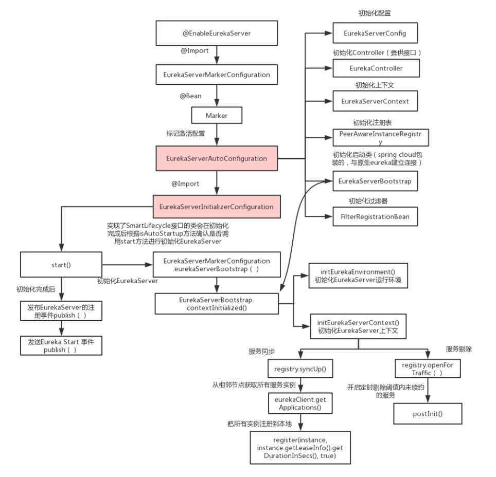
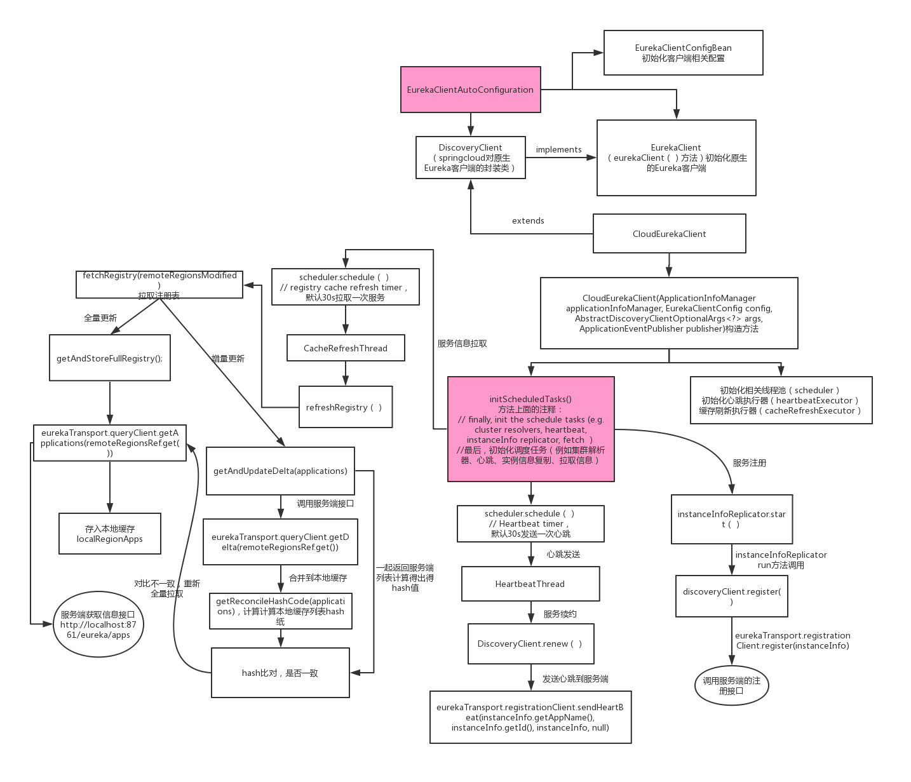
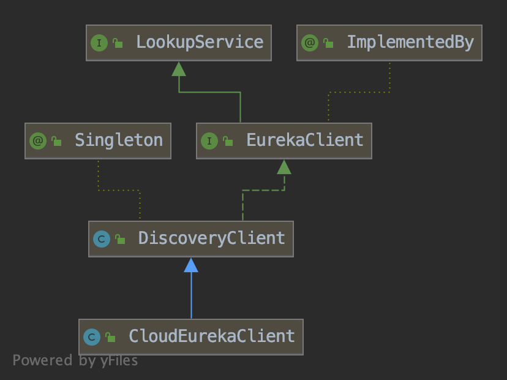

# 综述

本文大量引用[Eureka服务端源码流程梳理](https://www.cnblogs.com/nijunyang/p/10745730.html)此文章，感谢！


结合springcloud框架一起看更加贴合实际情况，使用的版本为

```pom
    <properties>
        <java.version>1.8</java.version>
        <spring-cloud.version>Hoxton.SR6</spring-cloud.version>
    </properties>

    <dependencies>
        <dependency>
            <groupId>org.springframework.cloud</groupId>
            <artifactId>spring-cloud-starter-netflix-eureka-server</artifactId>
        </dependency>
    </dependencies>
```


以下几个方面基本覆盖了eureka大部分功能，足以应付日常工作与面试了。

**Server**

- eureka server启动：注册中心
- eureka server集群：注册表的同步，多级队列的任务批处理机制 

- 服务故障：expiration，eviction 
- 自我保护：自动识别eureka server出现网络故障了 


**Client**

- eureka client启动：服务实例
- 服务注册：系统启动时，状态改变监听器触发。定时任务，状态改变触发
- 全量拉取注册表：多级缓存机制
- 增量拉取注册表：一致性hash比对机制
- 心跳机制：服务续约，renew
- 服务下线：cancel


## 引入问题

1. Eureka注册中心使用什么样的方式来储存各个服务注册时发送过来的机器地址和端口号？

   `private final CocurrentHashMap<String, Map<String, Lease<InstanceInfo>>> registry = new  CocurrentHashMap<String, Map<String, Lease<InstanceInfo>>>();`

   从代码中可以看到，Eureka Server的注册表直接基于**纯内存**，即在内存里维护了一个数据结构。各个服务的注册、服务下线、服务故障，全部会在内存里维护和更新这个注册表。各个服务每隔30秒拉取注册表的时候，Eureka Server就是直接提供内存里存储的有变化的注册表数据给他们就可以了。

   - 这个ConcurrentHashMap的key就是服务名称，比如“inventory-service”，就是一个服务名称。

   - value则代表了一个服务的多个服务实例。举例：比如“inventory-service”是可以有3个服务实例的，每个服务实例部署在一台机器上。

   - 里面这个Map的key就是**服务实例的id**。

   - value是一个叫做**Lease**的类，它的泛型是一个InstanceInfo。

   - InstanceInfo就代表了**服务实例的具体信息**，比如机器的ip地址、hostname以及端口号。

   - Lease，里面则会维护每个服务**最近一次发送心跳的时间**

   

2. 服务注册，client如何向server进行注册的？

   当Eureka客户端向Eureka Server注册时，它提供自身的元数据。
   
   比如IP地址、端口，service ID，运行状况指示符URL，主页等。

   

3. 服务注册时提交的元数据的数据结构

   >OST **/eureka/apps/应用名** HTTP/1.1
   >Accept-Encoding: gzip
   >Content-Type: application/json
   > Accept: application/json
   > DiscoveryIdentity-Name: DefaultClient
   > DiscoveryIdentity-Version: 1.4
   > DiscoveryIdentity-Id: 192.168.70.132
   > Transfer-Encoding: chunked
   > Host: localhost:8001
   > Connection: Keep-Alive
   > User-Agent: Java-EurekaClient/v1.6.2
   > 
   > 1a0
   >{"instance":{
   >​    "instanceId":"192.168.70.132:应用名:10001",
   > ​    "hostName":"192.168.70.132",
   > ​    "app":"应用名",
   > ​    "ipAddr":"192.168.70.132",
   > ​    "status":"UP",
   > ​    "overriddenstatus":"UNKNOWN",
   > ​    "port": { "":443, "@enabled" : "false"},
   > ​    "countryId":1,
   > ​    "dataCenterInfo":{"@class":"com.netflix.appinfo.InstanceInfo$DefaultDataCenterInfo",
   > ​    "name":"MyOwn"
   > }
   
   
   
4. 各个服务找Eureka Server拉取注册表的时候，是什么样的频率？

   - 各个服务内的Eureka Client组件，默认情况下，每隔30秒会发送一个请求到Eureka Server，来拉取最近有变化的服务信息。
   - 除此之外，Eureka还有一个心跳机制，各个Eureka Client每隔30秒会发送一次心跳到Eureka Server。（服务续约）
   - 正常情况下，如果Eureka Server在90秒没有收到Eureka客户的续约，它会将实例从其注册表中删除。 建议不要更改续约间隔。
   - 可以保证一个大规模的系统每秒请求Eureka Server的次数在几百次。


4. 各个服务是如何拉取注册表的？

   - 在拉取注册表的时候：

   - - 首先从**ReadOnlyCacheMap**里查缓存的注册表。
     - 若没有，就找**ReadWriteCacheMap**里缓存的注册表。
     - 如果还没有，就从**内存中获取实际的注册表数据。**

   

   - 在注册表发生变更的时候：

   - - 会在内存中更新变更的注册表数据，同时**过期掉ReadWriteCacheMap**。

     - 此过程不会影响**ReadOnlyCacheMap**提供人家查询注册表。

     - 一段时间内（默认30秒），各服务拉取注册表会直接读**ReadOnlyCacheMap**

     - 30秒过后，Eureka Server的后台线程发现**ReadWriteCacheMap**已经清空了，也会清空**ReadOnlyCacheMap**中的缓存

     - 下次有服务拉取注册表，又会从内存中获取最新的数据了，同时填充各个缓存。

       

4. 服务下线

   Eureka客户端在程序关闭时向Eureka服务器发送取消请求。 发送请求后，该客户端实例信息将从服务器的实例注册表中删除。该下线请求不会自动完成，它需要调用以下内容：
   `DiscoveryManager.getInstance().shutdownComponent()；`


5. 一个有几百个服务，部署了上千台机器的大型分布式系统，会对Eureka Server造成多大的访问压力？

   一共100个服务，每个服务部署在20台机器上，1分钟4次请求，2000个服务实例每分钟请求8000次，换算到每秒，则是8000 / 60 = 133次左右，一天的话，就是8000 * 60 * 24 = 1152万。


6. Eureka Server从技术层面是如何抗住日千万级访问量的？
   - 维护注册表、拉取注册表、更新心跳时间，全部发生在内存里！这是Eureka Server非常核心的一个点。
   - 采用了**多级缓存机制**来进一步提升服务请求的响应速度，确保了不会针对内存数据结构发生频繁的读写并发冲突操作，进一步提升性能。


## 类介绍

`com.netflix.appinfo.InstanceInfo`

实例信息，每一个eureka对应一个InstanceInfo。

> 在Guice下注入该实例时由`EurekaConfigBasedInstanceInfoProvider`负责创建；
>
> 但是在`Spring Cloud`下该实例由自己提供的`InstanceInfoFactory`完成创建的。


`com.netflix.appinfo.LeaseInfo`

租约信息，当client向server注册后会生成一个租约，成员变量如下

```java
    public static final int DEFAULT_LEASE_RENEWAL_INTERVAL = 30;
    public static final int DEFAULT_LEASE_DURATION = 90;

    // Client settings
		// 续租间隔时间（多长时间续约一次），默认是30s
    private int renewalIntervalInSecs = DEFAULT_LEASE_RENEWAL_INTERVAL;
		// 续约持续时间（过期时间），默认是90s
    private int durationInSecs = DEFAULT_LEASE_DURATION;

    // Server populated
		// 租约的注册时间
    private long registrationTimestamp;
		// 最近一次的续约时间
    private long lastRenewalTimestamp;
		// 下线时间
    private long evictionTimestamp;
		// 上线时间
    private long serviceUpTimestamp;
```


`com.netflix.eureka.lease.Lease`

一个包装类，`Lease<InstanceInfo>`用来简单记录一个实例的租约信息

```java
    enum Action {
        Register, Cancel, Renew
    };

    public static final int DEFAULT_DURATION_IN_SECS = 90;

    private T holder;
    private long evictionTimestamp;
    private long registrationTimestamp;
    private long serviceUpTimestamp;
    // Make it volatile so that the expiration task would see this quicker
    private volatile long lastUpdateTimestamp;
    private long duration;
```


`com.netflix.discovery.shared.Application`

应用信息。在微服务下，同一个应用会有很多的实例，用来保证服务的高可用。换着花样存储了3份`instance`信息

```java
    @XStreamOmitField
    private volatile boolean isDirty = false;

    @XStreamImplicit
    private final Set<InstanceInfo> instances;

    private final AtomicReference<List<InstanceInfo>> shuffledInstances;

    private final Map<String, InstanceInfo> instancesMap;
```


`com.netflix.discovery.shared.Applications`

应用集合。包装了从`eureka server`返回的应用信息


> The class that wraps all the registry information returned by eureka server.

```java
public class Applications {		
		private static class VipIndexSupport {
        final AbstractQueue<InstanceInfo> instances = new ConcurrentLinkedQueue<>();
        final AtomicLong roundRobinIndex = new AtomicLong(0);
        final AtomicReference<List<InstanceInfo>> vipList = new AtomicReference<List<InstanceInfo>>(Collections.emptyList());

        public AtomicLong getRoundRobinIndex() {
            return roundRobinIndex;
        }

        public AtomicReference<List<InstanceInfo>> getVipList() {
            return vipList;
        }
    }

    private static final String STATUS_DELIMITER = "_";

    private String appsHashCode;
    private Long versionDelta;
    @XStreamImplicit
    private final AbstractQueue<Application> applications;
    private final Map<String, Application> appNameApplicationMap;
    private final Map<String, VipIndexSupport> virtualHostNameAppMap;
    private final Map<String, VipIndexSupport> secureVirtualHostNameAppMap;
  	……
}
```


`com.netflix.eureka.EurekaServerConfig`

他是一个接口，定义了一些值得get方法。一般使用EurekaServerConfigBean作为具体实现类，用来读取配置文件中eureka.server开头的配置


`region`、`zone` 

这是两个逻辑概念，可以把`region`简单的理解为地区，而`zone`理解为一个机房。一个`region`可以有多个`zone`，一个`zone`内有多个`eureka server`

[eureka分区的深入讲解](https://www.cnblogs.com/itplay/p/9973977.html)


`com.netflix.appinfo.InstanceInfo.InstanceStatus`

```java
    public enum InstanceStatus {
        UP, // Ready to receive traffic
        DOWN, // Do not send traffic- healthcheck callback failed
        STARTING, // Just about starting- initializations to be done - do not
        // send traffic
        OUT_OF_SERVICE, // Intentionally shutdown for traffic
        UNKNOWN;

        public static InstanceStatus toEnum(String s) {
            if (s != null) {
                try {
                    return InstanceStatus.valueOf(s.toUpperCase());
                } catch (IllegalArgumentException e) {
                    // ignore and fall through to unknown
                    logger.debug("illegal argument supplied to InstanceStatus.valueOf: {}, defaulting to {}", s, UNKNOWN);
                }
            }
            return UNKNOWN;
        }
    }
```

用于外部的一些操作，例如用于red/black部署的时候，先把指定服务设置为OUT_OF_SERVICE来故意关闭请求流量。


# 服务端

## 启动流程



流程图引用自上方链接文章，从整体上看，启动流程是十分清晰的。

一切的起点是从主类上的标签`@EnableEurekaServer`开始，但是spring cloud中基本上都是一样的逻辑，所以依照惯例，找到`spring-cloud-netflix-eureka-server-2.2.3.RELEASE.jar`包中的`spring.factories`文件，找到server启动流程的入口类`org.springframework.cloud.netflix.eureka.server.EurekaServerAutoConfiguration`。观察到类的上方通过`@Import(EurekaServerInitializerConfiguration.class)`标签注入了一个类，这个配置类实现了`ServletContextAware, SmartLifecycle`两个接口，所以主要看一下start方法中的内容。

初始化主要的内容是在`EurekaServerInitializerConfiguration`中。`EurekaServerAutoConfiguration`类中定义了大量的bean，加载了各种地方的参数到上下文中。


### EurekaServerInitializerConfiguration

`org.springframework.cloud.netflix.eureka.server.EurekaServerInitializerConfiguration#start`

```java
  @Override
	public void start() {
		new Thread(() -> {
			try {
				// TODO: is this class even needed now?
				// eureka 上下文初始化
				eurekaServerBootstrap.contextInitialized(
						EurekaServerInitializerConfiguration.this.servletContext);
				log.info("Started Eureka Server");

				//发布Eureka注册成功事件
				publish(new EurekaRegistryAvailableEvent(getEurekaServerConfig()));
				EurekaServerInitializerConfiguration.this.running = true;
				//发布Eureka启动成功事件
				publish(new EurekaServerStartedEvent(getEurekaServerConfig()));
			}
			catch (Exception ex) {
				// Help!
				log.error("Could not initialize Eureka servlet context", ex);
			}
		}).start();
	}
```

1. 初始化上下文。
2. 成功后发布2个事件，方便spring环境中其他组件使用
3. 修改一下状态


`org.springframework.cloud.netflix.eureka.server.EurekaServerBootstrap#contextInitialized`

```java
	public void contextInitialized(ServletContext context) {
		try {
			//初始化配置参数 单纯就是一些赋值操作
			initEurekaEnvironment();
			//初始化上下文
			initEurekaServerContext();

			context.setAttribute(EurekaServerContext.class.getName(), this.serverContext);
		}
		catch (Throwable e) {
			log.error("Cannot bootstrap eureka server :", e);
			throw new RuntimeException("Cannot bootstrap eureka server :", e);
		}
	}
```

启动流程主要完成2件事

1. 把配置文件中的配置读到相应的数据结构中
2. 初始化上下文

主要看初始化上下文做了什么操作


`org.springframework.cloud.netflix.eureka.server.EurekaServerBootstrap#initEurekaServerContext`

```java
protected void initEurekaServerContext() throws Exception {
		// For backward compatibility
		// 注册json格式的转换器
		JsonXStream.getInstance().registerConverter(new V1AwareInstanceInfoConverter(),
				XStream.PRIORITY_VERY_HIGH);
		// 注册xml格式的转换器
		XmlXStream.getInstance().registerConverter(new V1AwareInstanceInfoConverter(),
				XStream.PRIORITY_VERY_HIGH);
		//判断是否是亚马逊云
		if (isAws(this.applicationInfoManager.getInfo())) {
			this.awsBinder = new AwsBinderDelegate(this.eurekaServerConfig,
					this.eurekaClientConfig, this.registry, this.applicationInfoManager);
			this.awsBinder.start();
		}

		//创建了一个EurekaServerContextHolder对象用来保存serverContext上下文
		//以提供给非spring容器内部的类使用 
		EurekaServerContextHolder.initialize(this.serverContext);

		log.info("Initialized server context");

		// Copy registry from neighboring eureka node
		// 从相邻的节点中同步注册信息
		int registryCount = this.registry.syncUp();
		// 服务状态检查，剔除失效的注册信息
		this.registry.openForTraffic(this.applicationInfoManager, registryCount);

		// Register all monitoring statistics.
		EurekaMonitors.registerAllStats();
	}
```

初始化上下文主要也是两件事

1. 从相邻节点中读取客户端的注册信息
2. 剔除失效的客户端


### syncUp（相邻节点同步注册信息）

好奇他是怎么读取的

`com.netflix.eureka.registry.PeerAwareInstanceRegistryImpl#syncUp`

```java
    @Override
    public int syncUp() {
        // Copy entire entry from neighboring DS node
        int count = 0;

        // 可以多次重试
        for (int i = 0; ((i < serverConfig.getRegistrySyncRetries()) && (count == 0)); i++) {
            if (i > 0) {
                try {
                    Thread.sleep(serverConfig.getRegistrySyncRetryWaitMs());
                } catch (InterruptedException e) {
                    logger.warn("Interrupted during registry transfer..");
                    break;
                }
            }
          
            //从eureka客户端获取到所有的服务器注册信息
            Applications apps = eurekaClient.getApplications();
            for (Application app : apps.getRegisteredApplications()) {
                //遍历各个服务器上注册的节点
                for (InstanceInfo instance : app.getInstances()) {
                    try {
                        if (isRegisterable(instance)) {
                            //注册到自己的容器中 - 方法内容较多
                            register(instance, instance.getLeaseInfo().getDurationInSecs(), true);
                            count++;
                        }
                    } catch (Throwable t) {
                        logger.error("During DS init copy", t);
                    }
                }
            }
        }
        return count;
    }
```

`register(instance, instance.getLeaseInfo().getDurationInSecs(), true);`是一个注册方法，其实很重要的，与后面客户端注册时是调用的同一个方法，统一放在“注册接口”中说明。


再来看一下他是如何失效服务的

### openForTraffic（过期服务）

`com.netflix.eureka.registry.PeerAwareInstanceRegistryImpl#openForTraffic`

```java
    @Override
    public void openForTraffic(ApplicationInfoManager applicationInfoManager, int count) {
        // Renewals happen every 30 seconds and for a minute it should be a factor of 2.
        // 理论上应该要renew的客户端个数
        this.expectedNumberOfClientsSendingRenews = count;
        // 计算每分钟要renew的阈值
        updateRenewsPerMinThreshold();
        logger.info("Got {} instances from neighboring DS node", count);
        logger.info("Renew threshold is: {}", numberOfRenewsPerMinThreshold);
        this.startupTime = System.currentTimeMillis();
        if (count > 0) {
            this.peerInstancesTransferEmptyOnStartup = false;
        }
      
        // 获取数据中心的名字 检查是否是亚马逊的
        DataCenterInfo.Name selfName = applicationInfoManager.getInfo().getDataCenterInfo().getName();
        boolean isAws = Name.Amazon == selfName;
        if (isAws && serverConfig.shouldPrimeAwsReplicaConnections()) {
            logger.info("Priming AWS connections for all replicas..");
            primeAwsReplicas(applicationInfoManager);
        }
        logger.info("Changing status to UP");
        // 把自身状态标记为up
        applicationInfoManager.setInstanceStatus(InstanceStatus.UP);
        // 创建定时任务
        super.postInit();
    }


    protected void postInit() {
        renewsLastMin.start();
        //如果已经存在了任务，则取消他
        if (evictionTaskRef.get() != null) {
            evictionTaskRef.get().cancel();
        }
      
        //创建一个新的定时任务 定时任务具体的逻辑在EvictionTask类中
        evictionTaskRef.set(new EvictionTask());
        evictionTimer.schedule(evictionTaskRef.get(),
                serverConfig.getEvictionIntervalTimerInMs(),
                serverConfig.getEvictionIntervalTimerInMs());
    }
```

这段代码的重点是创建了一个定时器，默认60s执行一次，延迟60s执行。


往下看一下定时器中到底是如何清理过期的实例的。

`new EvictionTask()`方法中具体是现实

`com.netflix.eureka.registry.AbstractInstanceRegistry#evict(long)`

```java
    public void evict(long additionalLeaseMs) {
        logger.debug("Running the evict task");

      	// 设置了开关 还可以关闭自动过期功能的
        if (!isLeaseExpirationEnabled()) {
            logger.debug("DS: lease expiration is currently disabled.");
            return;
        }

        // We collect first all expired items, to evict them in random order. For large eviction sets,
        // if we do not that, we might wipe out whole apps before self preservation kicks in. By randomizing it,
        // the impact should be evenly distributed across all applications.
        List<Lease<InstanceInfo>> expiredLeases = new ArrayList<>();
      	// 遍历核心容器中的每个租约
        for (Entry<String, Map<String, Lease<InstanceInfo>>> groupEntry : registry.entrySet()) {
            Map<String, Lease<InstanceInfo>> leaseMap = groupEntry.getValue();
            if (leaseMap != null) {
                for (Entry<String, Lease<InstanceInfo>> leaseEntry : leaseMap.entrySet()) {
                    Lease<InstanceInfo> lease = leaseEntry.getValue();
                  	// 判断每个租约是否还有效
                    if (lease.isExpired(additionalLeaseMs) && lease.getHolder() != null) {
                        expiredLeases.add(lease);
                    }
                }
            }
        }

        // To compensate for GC pauses or drifting local time, we need to use current registry size as a base for
        // triggering self-preservation. Without that we would wipe out full registry.
      	// 计算需要剔除的最小限制
        int registrySize = (int) getLocalRegistrySize();
        int registrySizeThreshold = (int) (registrySize * serverConfig.getRenewalPercentThreshold());
        int evictionLimit = registrySize - registrySizeThreshold;

      	// 并不是把所有需要剔除的实例一口气全部剔除，而是有一个最小阈值
        int toEvict = Math.min(expiredLeases.size(), evictionLimit);
        if (toEvict > 0) {
            logger.info("Evicting {} items (expired={}, evictionLimit={})", toEvict, expiredLeases.size(), evictionLimit);

            Random random = new Random(System.currentTimeMillis());
            for (int i = 0; i < toEvict; i++) {
                // Pick a random item (Knuth shuffle algorithm)
              	// 随机混淆待T除的集合
                int next = i + random.nextInt(expiredLeases.size() - i);
                Collections.swap(expiredLeases, i, next);
                Lease<InstanceInfo> lease = expiredLeases.get(i);

                String appName = lease.getHolder().getAppName();
                String id = lease.getHolder().getId();
                EXPIRED.increment();
                logger.warn("DS: Registry: expired lease for {}/{}", appName, id);
              	// 调用下线方法
                internalCancel(appName, id, false);
            }
        }
    }
```

1. 检查下线开关是否打开
2. 遍历核心容器中的每个租约，检查是否过期，标准是`(evictionTimestamp > 0 || System.currentTimeMillis() > (lastUpdateTimestamp + duration + additionalLeaseMs));`当前时间 > 最后更新时间 + 更新周期 + 额外的补偿时间。这个补偿时间是用来补偿类似与gc用时之类的。
3. 把需要剔除的租约加入一个临时集合中。
4. 计算剔除最大阈值，为了安全期间不会一次性把所有的租约都剔除了，因为可能是server服务器自己的网络出现了抖动之类的问题。
5. 把待剔除集合随机打乱，取出随机的一个租约，把它踢下线。


## Restful Api

Eureka 在 GitHub 的 wiki 上专门写了一篇[《 Eureka REST operations》](https://github.com/Netflix/eureka/wiki/Eureka-REST-operations)来介绍 Eureka Server 的 REST API 接口，Netfix Eureka 跟 Spring  Cloud 适配之后，提供的 REST API 与原始的 REST API 有一点点不同，其路径中的 `{version}` 值固定为 `eureka`。

Eureka 使用Jersey作为servlet容器，提供rest服务，使用了`javax.ws.rs`内的注解构建restful风格的接口。接口定义在`com.netflix.eureka.resources`目录下，常用的方法定义在`com.netflix.eureka.resources.ApplicationResource`、`com.netflix.eureka.resources.InstanceResource`文件内


| **Operation**                                                | **HTTP action**                                              | **Description**                                              |
| ------------------------------------------------------------ | ------------------------------------------------------------ | ------------------------------------------------------------ |
| Register new application instance                            | POST /eureka/v2/apps/**appID**                               | Input: JSON/XML payload HTTP Code: 204 on success            |
| De-register application instance                             | DELETE /eureka/v2/apps/**appID**/**instanceID**              | HTTP Code: 200 on success                                    |
| Send application instance heartbeat                          | PUT /eureka/v2/apps/**appID**/**instanceID**                 | HTTP Code:  * 200 on success  * 404 if **instanceID** doesn’t exist |
| Query for all instances                                      | GET /eureka/v2/apps                                          | HTTP Code: 200 on success Output: JSON/XML                   |
| Query for all **appID** instances                            | GET /eureka/v2/apps/**appID**                                | HTTP Code: 200 on success Output: JSON/XML                   |
| Query for a specific **appID**/**instanceID**                | GET /eureka/v2/apps/**appID**/**instanceID**                 | HTTP Code: 200 on success Output: JSON/XML                   |
| Query for a specific **instanceID**                          | GET /eureka/v2/instances/**instanceID**                      | HTTP Code: 200 on success Output: JSON/XML                   |
| Take instance out of service                                 | PUT /eureka/v2/apps/**appID**/**instanceID**/status?value=OUT_OF_SERVICE | HTTP Code:  * 200 on success  * 500 on failure               |
| Move instance back into service (remove override)            | DELETE /eureka/v2/apps/**appID**/**instanceID**/status?value=UP  (The value=UP is optional, it is used as a suggestion for the fallback status due to removal of the override) | HTTP Code:  * 200 on success  * 500 on failure               |
| Update metadata                                              | PUT /eureka/v2/apps/**appID**/**instanceID**/metadata?key=value | HTTP Code:  * 200 on success  * 500 on failure               |
| Query for all instances under a particular **vip address**   | GET /eureka/v2/vips/**vipAddress**                           | * HTTP Code: 200 on success Output: JSON/XML   * 404 if the **vipAddress** does not exist. |
| Query for all instances under a particular **secure vip address** | GET /eureka/v2/svips/**svipAddress**                         | * HTTP Code: 200 on success Output: JSON/XML   * 404 if the **svipAddress** does not exist. |


### 注册接口

根据官网给的接口路径前缀名称定位到`com.netflix.eureka.resources.ApplicationsResource`类上方的`@Path("/{version}/apps")`标签，从而发现位于`com.netflix.eureka.resources.ApplicationResource#addInstance`方法是注册接口，此接口除了供client注册外，集群间的client信息同步也是调用它。

```java
		@POST
    @Consumes({"application/json", "application/xml"})
    public Response addInstance(InstanceInfo info,
                                @HeaderParam(PeerEurekaNode.HEADER_REPLICATION) String isReplication) {
        logger.debug("Registering instance {} (replication={})", info.getId(), isReplication);
        // validate that the instanceinfo contains all the necessary required fields
      	// 各种校验
        if (isBlank(info.getId())) {
            return Response.status(400).entity("Missing instanceId").build();
        } else if (isBlank(info.getHostName())) {
            return Response.status(400).entity("Missing hostname").build();
        } else if (isBlank(info.getIPAddr())) {
            return Response.status(400).entity("Missing ip address").build();
        } else if (isBlank(info.getAppName())) {
            return Response.status(400).entity("Missing appName").build();
        } else if (!appName.equals(info.getAppName())) {
            return Response.status(400).entity("Mismatched appName, expecting " + appName + " but was " + info.getAppName()).build();
        } else if (info.getDataCenterInfo() == null) {
            return Response.status(400).entity("Missing dataCenterInfo").build();
        } else if (info.getDataCenterInfo().getName() == null) {
            return Response.status(400).entity("Missing dataCenterInfo Name").build();
        }

        // handle cases where clients may be registering with bad DataCenterInfo with missing data
      	// 检查一下client端是不是用了错误的数据中心
        DataCenterInfo dataCenterInfo = info.getDataCenterInfo();
        if (dataCenterInfo instanceof UniqueIdentifier) {
            String dataCenterInfoId = ((UniqueIdentifier) dataCenterInfo).getId();
            if (isBlank(dataCenterInfoId)) {
                boolean experimental = "true".equalsIgnoreCase(serverConfig.getExperimental("registration.validation.dataCenterInfoId"));
                if (experimental) {
                    String entity = "DataCenterInfo of type " + dataCenterInfo.getClass() + " must contain a valid id";
                    return Response.status(400).entity(entity).build();
                } else if (dataCenterInfo instanceof AmazonInfo) {
                    AmazonInfo amazonInfo = (AmazonInfo) dataCenterInfo;
                    String effectiveId = amazonInfo.get(AmazonInfo.MetaDataKey.instanceId);
                    if (effectiveId == null) {
                        amazonInfo.getMetadata().put(AmazonInfo.MetaDataKey.instanceId.getName(), info.getId());
                    }
                } else {
                    logger.warn("Registering DataCenterInfo of type {} without an appropriate id", dataCenterInfo.getClass());
                }
            }
        }

      	// 实现注册功能 registry是由容器注进来的PeerAwareInstanceRegistry类对象
        registry.register(info, "true".equals(isReplication));
        return Response.status(204).build();  // 204 to be backwards compatible
    }
```

由于使用的cloud框架所以`PeerAwareInstanceRegistry`的具体实现类是`org.springframework.cloud.netflix.eureka.server.InstanceRegistry`，但是这个类继承自eureka的原生实现类`com.netflix.eureka.registry.PeerAwareInstanceRegistryImpl`，spring在此基础上只增加了一个发布消息的功能。


`org.springframework.cloud.netflix.eureka.server.InstanceRegistry`

```java
	@Override
	public void register(final InstanceInfo info, final boolean isReplication) {
		handleRegistration(info, resolveInstanceLeaseDuration(info), isReplication);
		super.register(info, isReplication);
	}

	private void handleRegistration(InstanceInfo info, int leaseDuration,
			boolean isReplication) {
		log("register " + info.getAppName() + ", vip " + info.getVIPAddress()
				+ ", leaseDuration " + leaseDuration + ", isReplication "
				+ isReplication);
		publishEvent(new EurekaInstanceRegisteredEvent(this, info, leaseDuration,
				isReplication));
	}
```

没有任何多余的操作，还是调用父类中的方法。


`com.netflix.eureka.registry.PeerAwareInstanceRegistryImpl`

```java
    @Override
    public void register(final InstanceInfo info, final boolean isReplication) {
      	// 租约的有效期默认90s
        int leaseDuration = Lease.DEFAULT_DURATION_IN_SECS;
      	// 非首次注册
        if (info.getLeaseInfo() != null && info.getLeaseInfo().getDurationInSecs() > 0) {
            leaseDuration = info.getLeaseInfo().getDurationInSecs();
        }
      	// 注册
        super.register(info, leaseDuration, isReplication);
      	// 把注册信息同步到集群内其他server
        replicateToPeers(Action.Register, info.getAppName(), info.getId(), info, null, isReplication);
    }
```

1. 调用注册方法。这个`register`注册方法就和启动流程中，从相邻server节点拉取到客户端信息后调用的注册方法是同一个方法了。
2. 注册成功后，把InstanceInfo信息同步给相邻server节点。


`com.netflix.eureka.registry.AbstractInstanceRegistry#register`

```java
    public void register(InstanceInfo registrant, int leaseDuration, boolean isReplication) {
        try {
          	// 加读锁 逻辑上接口会被多个地方调用
            read.lock();
          	// 这个registry就是eureka 存储注册信息的数据结构了
          	// 找到对应app的集合 微服务中一个服务启动多个实例是正常操作
            Map<String, Lease<InstanceInfo>> gMap = registry.get(registrant.getAppName());
            REGISTER.increment(isReplication);
          	// 此服务是第一次注册 初始化
            if (gMap == null) {
                final ConcurrentHashMap<String, Lease<InstanceInfo>> gNewMap = new ConcurrentHashMap<String, Lease<InstanceInfo>>();
                gMap = registry.putIfAbsent(registrant.getAppName(), gNewMap);
                if (gMap == null) {
                    gMap = gNewMap;
                }
            }
          	// 取出对应instance的包装信息
            Lease<InstanceInfo> existingLease = gMap.get(registrant.getId());
            // Retain the last dirty timestamp without overwriting it, if there is already a lease
            if (existingLease != null && (existingLease.getHolder() != null)) {
              	// instance已经存在和客户端的instance的信息做比较，时间最新的那个，为有效instance信息
                Long existingLastDirtyTimestamp = existingLease.getHolder().getLastDirtyTimestamp();
                Long registrationLastDirtyTimestamp = registrant.getLastDirtyTimestamp();
                logger.debug("Existing lease found (existing={}, provided={}", existingLastDirtyTimestamp, registrationLastDirtyTimestamp);

                // this is a > instead of a >= because if the timestamps are equal, we still take the remote transmitted
                // InstanceInfo instead of the server local copy.
                if (existingLastDirtyTimestamp > registrationLastDirtyTimestamp) {
                    logger.warn("There is an existing lease and the existing lease's dirty timestamp {} is greater" +
                            " than the one that is being registered {}", existingLastDirtyTimestamp, registrationLastDirtyTimestamp);
                    logger.warn("Using the existing instanceInfo instead of the new instanceInfo as the registrant");
                    registrant = existingLease.getHolder();
                }
            } else {
              	// 首次注册
            		// Eureka-Server的自我保护机制做的操作，为每分钟最大续约数+1 ，同时重新计算每分钟最小续约数
           
                // The lease does not exist and hence it is a new registration
                synchronized (lock) {
                    if (this.expectedNumberOfClientsSendingRenews > 0) {
                        // Since the client wants to register it, increase the number of clients sending renews
                        this.expectedNumberOfClientsSendingRenews = this.expectedNumberOfClientsSendingRenews + 1;
                        updateRenewsPerMinThreshold();
                    }
                }
                logger.debug("No previous lease information found; it is new registration");
            }
            Lease<InstanceInfo> lease = new Lease<InstanceInfo>(registrant, leaseDuration);
            if (existingLease != null) {
                lease.setServiceUpTimestamp(existingLease.getServiceUpTimestamp());
            }
            gMap.put(registrant.getId(), lease);
          	// 加入到最近注册队列中
            recentRegisteredQueue.add(new Pair<Long, String>(
                    System.currentTimeMillis(),
                    registrant.getAppName() + "(" + registrant.getId() + ")"));
            // This is where the initial state transfer of overridden status happens
            if (!InstanceStatus.UNKNOWN.equals(registrant.getOverriddenStatus())) {
                logger.debug("Found overridden status {} for instance {}. Checking to see if needs to be add to the "
                                + "overrides", registrant.getOverriddenStatus(), registrant.getId());
                if (!overriddenInstanceStatusMap.containsKey(registrant.getId())) {
                    logger.info("Not found overridden id {} and hence adding it", registrant.getId());
                    overriddenInstanceStatusMap.put(registrant.getId(), registrant.getOverriddenStatus());
                }
            }
            InstanceStatus overriddenStatusFromMap = overriddenInstanceStatusMap.get(registrant.getId());
            if (overriddenStatusFromMap != null) {
                logger.info("Storing overridden status {} from map", overriddenStatusFromMap);
                registrant.setOverriddenStatus(overriddenStatusFromMap);
            }

            // Set the status based on the overridden status rules
            InstanceStatus overriddenInstanceStatus = getOverriddenInstanceStatus(registrant, existingLease, isReplication);
            registrant.setStatusWithoutDirty(overriddenInstanceStatus);

            // If the lease is registered with UP status, set lease service up timestamp
            if (InstanceStatus.UP.equals(registrant.getStatus())) {
                lease.serviceUp();
            }
            registrant.setActionType(ActionType.ADDED);
          	// 加入到最近变更队列
            recentlyChangedQueue.add(new RecentlyChangedItem(lease));
            registrant.setLastUpdatedTimestamp();
          	// 失效缓存
            invalidateCache(registrant.getAppName(), registrant.getVIPAddress(), registrant.getSecureVipAddress());
            logger.info("Registered instance {}/{} with status {} (replication={})",
                    registrant.getAppName(), registrant.getId(), registrant.getStatus(), isReplication);
        } finally {
            read.unlock();
        }
    }

    private void invalidateCache(String appName, @Nullable String vipAddress, @Nullable String secureVipAddress) {
        // invalidate cache
        responseCache.invalidate(appName, vipAddress, secureVipAddress);
    }
```

1. 首先尝试从缓存中取出目标对象，如果不存在则认为是新注册的对象，初始化一个新的。
2. 如果缓存中存在则与客户端的对比一下，看看哪边的最新，取最新的`InstanceInfo`
3. 各种计算时间，之后更新`InstanceInfo`对象，并重新存入缓存中。
4. 把当前实例加入`recentRegisteredQueue`队列中，同时也加入`recentlyChangedQueue`队列中
5. 失效缓存，这也是重点方法


此处涉及到一个定义在本类中的**核心容器**，

```java
    private final ConcurrentHashMap<String, Map<String, Lease<InstanceInfo>>> registry
            = new ConcurrentHashMap<String, Map<String, Lease<InstanceInfo>>>();
```

这个Map是eureka用来存储注册信息的容器，一个双层ConcurrentHashMap，外层的key为appName，内层的key为InstanceInfo对象的id。


接下来就是缓存的失效操作。

`com.netflix.eureka.registry.ResponseCacheImpl#invalidate`

```java
    @Override
    public void invalidate(String appName, @Nullable String vipAddress, @Nullable String secureVipAddress) {
        for (Key.KeyType type : Key.KeyType.values()) {
            for (Version v : Version.values()) {
                invalidate(
                        new Key(Key.EntityType.Application, appName, type, v, EurekaAccept.full),
                        new Key(Key.EntityType.Application, appName, type, v, EurekaAccept.compact),
                        new Key(Key.EntityType.Application, ALL_APPS, type, v, EurekaAccept.full),
                        new Key(Key.EntityType.Application, ALL_APPS, type, v, EurekaAccept.compact),
                        new Key(Key.EntityType.Application, ALL_APPS_DELTA, type, v, EurekaAccept.full),
                        new Key(Key.EntityType.Application, ALL_APPS_DELTA, type, v, EurekaAccept.compact)
                );
                if (null != vipAddress) {
                    invalidate(new Key(Key.EntityType.VIP, vipAddress, type, v, EurekaAccept.full));
                }
                if (null != secureVipAddress) {
                    invalidate(new Key(Key.EntityType.SVIP, secureVipAddress, type, v, EurekaAccept.full));
                }
            }
        }
    }


		//其中 Key类中定义了2个枚举
    public enum KeyType {
        JSON, XML
    }

    public enum EntityType {
        Application, VIP, SVIP
    }

		// 先失效readWriteCacheMap缓存
    public void invalidate(Key... keys) {
        for (Key key : keys) {
            logger.debug("Invalidating the response cache key : {} {} {} {}, {}",
                    key.getEntityType(), key.getName(), key.getVersion(), key.getType(), key.getEurekaAccept());

            readWriteCacheMap.invalidate(key);
            Collection<Key> keysWithRegions = regionSpecificKeys.get(key);
            if (null != keysWithRegions && !keysWithRegions.isEmpty()) {
                for (Key keysWithRegion : keysWithRegions) {
                    logger.debug("Invalidating the response cache key : {} {} {} {} {}",
                            key.getEntityType(), key.getName(), key.getVersion(), key.getType(), key.getEurekaAccept());
                    readWriteCacheMap.invalidate(keysWithRegion);
                }
            }
        }
    }
```

1. 按照类型，分别失效缓存
2. 这里缓存对象使用了google guava工具包中的缓存对象。


到此，注册操作的前半段就结束了，后半段是把注册信息同步到相邻节点，回到之前的`replicateToPeers`方法。

`com.netflix.eureka.registry.PeerAwareInstanceRegistryImpl#replicateToPeers`

```java
    private void replicateToPeers(Action action, String appName, String id,
                                  InstanceInfo info /* optional */,
                                  InstanceStatus newStatus /* optional */, boolean isReplication) {
        Stopwatch tracer = action.getTimer().start();
        try {
          	// 判断这是别的server同步过来，还是client注册的
            if (isReplication) {
                numberOfReplicationsLastMin.increment();
            }
            // If it is a replication already, do not replicate again as this will create a poison replication
          	// 如果是单机则不用同步了
            if (peerEurekaNodes == Collections.EMPTY_LIST || isReplication) {
                return;
            }

          	// 从peerEurekaNodes对象中取出相邻节点列表 遍历同步
            for (final PeerEurekaNode node : peerEurekaNodes.getPeerEurekaNodes()) {
                // If the url represents this host, do not replicate to yourself.
                if (peerEurekaNodes.isThisMyUrl(node.getServiceUrl())) {
                    continue;
                }
              	// 调用同步方法
                replicateInstanceActionsToPeers(action, appName, id, info, newStatus, node);
            }
        } finally {
            tracer.stop();
        }
    }


		// 同步方法 一个复合方法 所有需要同步给相邻节点的操作都在此方法中实现
		// 例如注册、心跳等
    private void replicateInstanceActionsToPeers(Action action, String appName,
                                                 String id, InstanceInfo info, InstanceStatus newStatus,
                                                 PeerEurekaNode node) {
        try {
            InstanceInfo infoFromRegistry;
            CurrentRequestVersion.set(Version.V2);
            switch (action) {
                case Cancel:
                    node.cancel(appName, id);
                    break;
                case Heartbeat:
                    InstanceStatus overriddenStatus = overriddenInstanceStatusMap.get(id);
                    infoFromRegistry = getInstanceByAppAndId(appName, id, false);
                    node.heartbeat(appName, id, infoFromRegistry, overriddenStatus, false);
                    break;
                case Register:
                    node.register(info);
                    break;
                case StatusUpdate:
                    infoFromRegistry = getInstanceByAppAndId(appName, id, false);
                    node.statusUpdate(appName, id, newStatus, infoFromRegistry);
                    break;
                case DeleteStatusOverride:
                    infoFromRegistry = getInstanceByAppAndId(appName, id, false);
                    node.deleteStatusOverride(appName, id, infoFromRegistry);
                    break;
            }
        } catch (Throwable t) {
            logger.error("Cannot replicate information to {} for action {}", node.getServiceUrl(), action.name(), t);
        } finally {
            CurrentRequestVersion.remove();
        }
    }
```

从缓存中取出所有的相邻节点列表，循环列表，给每个服务发送消息，发送消息的代码被单独抽取出来了，多个地方复用。


总结一下注册接口做了哪些操作

- 接口参数校验
- 进行注册流程
  - 从核心容器中取出对应客户端对象，没有则新建
  - 重新计算各种超时时间
  - 把客户端对象对象重新保存到容器中去
  - 把客户端对象加入最近注册队列、变更队列中去
  - 失效缓存
- 把注册好的信息同步给相邻的服务节点


### 获取服务接口

数据拉取分为一次性全量拉取与单个服务信息拉取。请求地址分别是`/eureka/v2/apps` ，`/eureka/v2/apps/{appID}` ，对应的方法为`com.netflix.eureka.resources.ApplicationsResource#getContainers`、`com.netflix.eureka.resources.ApplicationsResource#getApplicationResource`


先看**全量拉取**的内容

`com.netflix.eureka.resources.ApplicationsResource#getContainers`

```java
    @GET
    public Response getContainers(@PathParam("version") String version,
                                  @HeaderParam(HEADER_ACCEPT) String acceptHeader,
                                  @HeaderParam(HEADER_ACCEPT_ENCODING) String acceptEncoding,
                                  @HeaderParam(EurekaAccept.HTTP_X_EUREKA_ACCEPT) String eurekaAccept,
                                  @Context UriInfo uriInfo,
                                  @Nullable @QueryParam("regions") String regionsStr) {
				// 检查请求的来源 统计记数
        boolean isRemoteRegionRequested = null != regionsStr && !regionsStr.isEmpty();
        String[] regions = null;
        if (!isRemoteRegionRequested) {
            EurekaMonitors.GET_ALL.increment();
        } else {
            regions = regionsStr.toLowerCase().split(",");
            Arrays.sort(regions); // So we don't have different caches for same regions queried in different order.
            EurekaMonitors.GET_ALL_WITH_REMOTE_REGIONS.increment();
        }

        // Check if the server allows the access to the registry. The server can
        // restrict access if it is not
        // ready to serve traffic depending on various reasons.
        if (!registry.shouldAllowAccess(isRemoteRegionRequested)) {
            return Response.status(Status.FORBIDDEN).build();
        }
      	// 设置返回格式 其实也可以返回xml的
        CurrentRequestVersion.set(Version.toEnum(version));
        KeyType keyType = Key.KeyType.JSON;
        String returnMediaType = MediaType.APPLICATION_JSON;
        if (acceptHeader == null || !acceptHeader.contains(HEADER_JSON_VALUE)) {
            keyType = Key.KeyType.XML;
            returnMediaType = MediaType.APPLICATION_XML;
        }

      	// 生成缓存key
        Key cacheKey = new Key(Key.EntityType.Application,
                ResponseCacheImpl.ALL_APPS,
                keyType, CurrentRequestVersion.get(), EurekaAccept.fromString(eurekaAccept), regions
        );

      	// 从缓存拿取客户端信息内容
        Response response;
        if (acceptEncoding != null && acceptEncoding.contains(HEADER_GZIP_VALUE)) {
            response = Response.ok(responseCache.getGZIP(cacheKey))
                    .header(HEADER_CONTENT_ENCODING, HEADER_GZIP_VALUE)
                    .header(HEADER_CONTENT_TYPE, returnMediaType)
                    .build();
        } else {
            response = Response.ok(responseCache.get(cacheKey))
                    .build();
        }
        CurrentRequestVersion.remove();
        return response;
    }
```

至于这个`responseCache`是什么，里面的数据是怎么样维护的，放在后面多级缓存章中说明。

1. 检查请求来源，统计记数
2. 设置返回格式
3. 创建缓存key，从缓存中拿取全量的客户端信息。


获取**指定appId**的客户端信息

`com.netflix.eureka.resources.ApplicationResource#getApplication`

```java
    @GET
    public Response getApplication(@PathParam("version") String version,
                                   @HeaderParam("Accept") final String acceptHeader,
                                   @HeaderParam(EurekaAccept.HTTP_X_EUREKA_ACCEPT) String eurekaAccept) {
      	// 判断是否允许
        if (!registry.shouldAllowAccess(false)) {
            return Response.status(Status.FORBIDDEN).build();
        }

        EurekaMonitors.GET_APPLICATION.increment();

        CurrentRequestVersion.set(Version.toEnum(version));
      	// 设置返回类型
        KeyType keyType = Key.KeyType.JSON;
        if (acceptHeader == null || !acceptHeader.contains("json")) {
            keyType = Key.KeyType.XML;
        }

        Key cacheKey = new Key(
                Key.EntityType.Application,
          			// 这个是请求url后面的appId
                appName,
                keyType,
                CurrentRequestVersion.get(),
                EurekaAccept.fromString(eurekaAccept)
        );

      	// 从缓存中拿取指定的客户端信息
        String payLoad = responseCache.get(cacheKey);
        CurrentRequestVersion.remove();

        if (payLoad != null) {
            logger.debug("Found: {}", appName);
            return Response.ok(payLoad).build();
        } else {
            logger.debug("Not Found: {}", appName);
            return Response.status(Status.NOT_FOUND).build();
        }
    }
```

与全量获取是相同的流程，从缓存中拿


### 服务续约

根据官方提供的url定位到`InstanceResource`类

`com.netflix.eureka.resources.InstanceResource#renewLease`

```java
		@PUT
    public Response renewLease(
            @HeaderParam(PeerEurekaNode.HEADER_REPLICATION) String isReplication,
            @QueryParam("overriddenstatus") String overriddenStatus,
            @QueryParam("status") String status,
            @QueryParam("lastDirtyTimestamp") String lastDirtyTimestamp) {
      	// 判断消息是client发的还是相邻的server发的
        boolean isFromReplicaNode = "true".equals(isReplication);
      	// 续约
        boolean isSuccess = registry.renew(app.getName(), id, isFromReplicaNode);

        // Not found in the registry, immediately ask for a register
        if (!isSuccess) {
            logger.warn("Not Found (Renew): {} - {}", app.getName(), id);
            return Response.status(Status.NOT_FOUND).build();
        }
        // Check if we need to sync based on dirty time stamp, the client
        // instance might have changed some value
      	// 翻译一下 判断是否需要同步客户端的信息，在脏时间的范围内，客户端信息有可能会变
        Response response;
        if (lastDirtyTimestamp != null && serverConfig.shouldSyncWhenTimestampDiffers()) {
            response = this.validateDirtyTimestamp(Long.valueOf(lastDirtyTimestamp), isFromReplicaNode);
            // Store the overridden status since the validation found out the node that replicates wins
            if (response.getStatus() == Response.Status.NOT_FOUND.getStatusCode()
                    && (overriddenStatus != null)
                    && !(InstanceStatus.UNKNOWN.name().equals(overriddenStatus))
                    && isFromReplicaNode) {
              	// 保存更新客户端状态
                registry.storeOverriddenStatusIfRequired(app.getAppName(), id, InstanceStatus.valueOf(overriddenStatus));
            }
        } else {
            response = Response.ok().build();
        }
        logger.debug("Found (Renew): {} - {}; reply status={}", app.getName(), id, response.getStatus());
        return response;
    }
```

续约，成功续约后判断一下是否要重新更新客户端状态。


还是重点关注`renew`方法。

`org.springframework.cloud.netflix.eureka.server.InstanceRegistry#renew`

```java
	@Override
	public boolean renew(final String appName, final String serverId,
			boolean isReplication) {
		log("renew " + appName + " serverId " + serverId + ", isReplication {}"
				+ isReplication);
    //从缓存中拿到所有的服务信息
		List<Application> applications = getSortedApplications();
		for (Application input : applications) {
      // 判断心跳是从哪个服务发来的
			if (input.getName().equals(appName)) {
				InstanceInfo instance = null;
				for (InstanceInfo info : input.getInstances()) {
          // 判断心跳是服务中的哪台实例发来的
					if (info.getId().equals(serverId)) {
						instance = info;
						break;
					}
				}
        // 往消息总线中发条消息
				publishEvent(new EurekaInstanceRenewedEvent(this, appName, serverId,
						instance, isReplication));
				break;
			}
		}
    // 调用Netflix原生的实现
		return super.renew(appName, serverId, isReplication);
	}
```

1. 拿到本地缓存的所有应用信息。
2. 判断是缓存中的哪一个应用、哪一个实例发的心跳。
3. 往spring cloud消息总线中发一条消息
4. 调用父类Netflix原生的方法实现


`com.netflix.eureka.registry.PeerAwareInstanceRegistryImpl#renew`

```java
    public boolean renew(final String appName, final String id, final boolean isReplication) {
      	// 调用父类抽象类中的具体实现
        if (super.renew(appName, id, isReplication)) {
          	// 如果本地续约成功，则通知集群中相邻的节点
            replicateToPeers(Action.Heartbeat, appName, id, null, null, isReplication);
            return true;
        }
        return false;
    }
```


父类中的方法才是最终本地续约的实现

`com.netflix.eureka.registry.AbstractInstanceRegistry#renew`

```java
    public boolean renew(String appName, String id, boolean isReplication) {
      	// 续约次数自增
        RENEW.increment(isReplication);
      	// 从核心的缓存容器中取出对应的instance
        Map<String, Lease<InstanceInfo>> gMap = registry.get(appName);
        Lease<InstanceInfo> leaseToRenew = null;
        if (gMap != null) {
            leaseToRenew = gMap.get(id);
        }
        if (leaseToRenew == null) {
            RENEW_NOT_FOUND.increment(isReplication);
            logger.warn("DS: Registry: lease doesn't exist, registering resource: {} - {}", appName, id);
            return false;
        } else {
            InstanceInfo instanceInfo = leaseToRenew.getHolder();
            if (instanceInfo != null) {
                // touchASGCache(instanceInfo.getASGName());
                InstanceStatus overriddenInstanceStatus = this.getOverriddenInstanceStatus(
                        instanceInfo, leaseToRenew, isReplication);
                if (overriddenInstanceStatus == InstanceStatus.UNKNOWN) {
                    logger.info("Instance status UNKNOWN possibly due to deleted override for instance {}"
                            + "; re-register required", instanceInfo.getId());
                    RENEW_NOT_FOUND.increment(isReplication);
                    return false;
                }
                if (!instanceInfo.getStatus().equals(overriddenInstanceStatus)) {
                    logger.info(
                            "The instance status {} is different from overridden instance status {} for instance {}. "
                                    + "Hence setting the status to overridden status", instanceInfo.getStatus().name(),
                                    instanceInfo.getOverriddenStatus().name(),
                                    instanceInfo.getId());
                    instanceInfo.setStatusWithoutDirty(overriddenInstanceStatus);

                }
            }
            renewsLastMin.increment();
          	// renew的操作其实就是更新一下最后update时间戳
          	// lastUpdateTimestamp = System.currentTimeMillis() + duration;
            leaseToRenew.renew();
            return true;
        }
    }
```

1. 从缓存中取出对应instance的租约信息，如果没有就新建。
2. 判断目标租约的状态（没看懂这状态是怎么取的，干什么用的）。
3. 更新核心容器中租约信息。
4. 更新租约中的最近更新时间戳。


看完了`com.netflix.eureka.registry.AbstractInstanceRegistry#renew`方法的实现细节，回到`com.netflix.eureka.registry.PeerAwareInstanceRegistryImpl#renew`方法，如果续租成功，则还需要调用`replicateToPeers`方法，通知相邻的节点。`replicateToPeers`方法大家都是共用一个，与注册接口时调用的是同一个方法`com.netflix.eureka.registry.PeerAwareInstanceRegistryImpl#replicateToPeers`。


### 下线

根据官方提供的url定位到`InstanceResource`类

`com.netflix.eureka.resources.InstanceResource#cancelLease`

```java
    @DELETE
    public Response cancelLease(
            @HeaderParam(PeerEurekaNode.HEADER_REPLICATION) String isReplication) {
        try {
          	// 调用registry的下线方法
            boolean isSuccess = registry.cancel(app.getName(), id,
                "true".equals(isReplication));

            if (isSuccess) {
                logger.debug("Found (Cancel): {} - {}", app.getName(), id);
                return Response.ok().build();
            } else {
                logger.info("Not Found (Cancel): {} - {}", app.getName(), id);
                return Response.status(Status.NOT_FOUND).build();
            }
        } catch (Throwable e) {
            logger.error("Error (cancel): {} - {}", app.getName(), id, e);
            return Response.serverError().build();
        }

    }
```

调用`registry`方法的下线功能，后面又是老一套了。


先调用spring cloud自己的包装类

`org.springframework.cloud.netflix.eureka.server.InstanceRegistry#cancel`

```java
	@Override
	public boolean cancel(String appName, String serverId, boolean isReplication) {
    // 发送总线消息
		handleCancelation(appName, serverId, isReplication);
    // 调用父类的具体方法
		return super.cancel(appName, serverId, isReplication);
	}

	private void handleCancelation(String appName, String id, boolean isReplication) {
		log("cancel " + appName + ", serverId " + id + ", isReplication "
				+ isReplication);
		publishEvent(new EurekaInstanceCanceledEvent(this, appName, id, isReplication));
	}
```

还是spring cloud自己加了个包装类，在下线操作之前，往消息总线中发送消息，之后调用原生的实现方法。


`com.netflix.eureka.registry.PeerAwareInstanceRegistryImpl#cancel`

```java
    @Override
    public boolean cancel(final String appName, final String id,
                          final boolean isReplication) {
      	// 调用抽象类中下线方法
        if (super.cancel(appName, id, isReplication)) {
          	// 同步给相邻节点
            replicateToPeers(Action.Cancel, appName, id, null, null, isReplication);

            return true;
        }
        return false;
    }
```

与之前的套路完全相同，先调用抽象类中下线方法，如果没有报错则把下线的消息同步给相邻的server节点，`replicateToPeers`方法也是用的同一个。


`com.netflix.eureka.registry.AbstractInstanceRegistry#cancel`

```java
    @Override
    public boolean cancel(String appName, String id, boolean isReplication) {
        return internalCancel(appName, id, isReplication);
    }

    protected boolean internalCancel(String appName, String id, boolean isReplication) {
        try {
          	// 加读锁
            read.lock();
            CANCEL.increment(isReplication);
          	// 从核心容器中拿到相应的租约信息 
            Map<String, Lease<InstanceInfo>> gMap = registry.get(appName);
            Lease<InstanceInfo> leaseToCancel = null;
            if (gMap != null) {
              	// 移除指定instance的租约信息
                leaseToCancel = gMap.remove(id);
            }
          	// 往最近下线的队列中添加消息
            recentCanceledQueue.add(new Pair<Long, String>(System.currentTimeMillis(), appName + "(" + id + ")"));
          	// 从实例状态缓存容器中移除
            InstanceStatus instanceStatus = overriddenInstanceStatusMap.remove(id);
            if (instanceStatus != null) {
                logger.debug("Removed instance id {} from the overridden map which has value {}", id, instanceStatus.name());
            }
            if (leaseToCancel == null) {
                CANCEL_NOT_FOUND.increment(isReplication);
                logger.warn("DS: Registry: cancel failed because Lease is not registered for: {}/{}", appName, id);
                return false;
            } else {
              	// 更新evictionTimestamp字段
                leaseToCancel.cancel();
                InstanceInfo instanceInfo = leaseToCancel.getHolder();
                String vip = null;
                String svip = null;
                if (instanceInfo != null) {
                  	// 维护实例状态 现在还在维护状态还有什么意义吗？
                    instanceInfo.setActionType(ActionType.DELETED);
                    recentlyChangedQueue.add(new RecentlyChangedItem(leaseToCancel));
                    instanceInfo.setLastUpdatedTimestamp();
                    vip = instanceInfo.getVIPAddress();
                    svip = instanceInfo.getSecureVipAddress();
                }
              	// 失效缓存
                invalidateCache(appName, vip, svip);
                logger.info("Cancelled instance {}/{} (replication={})", appName, id, isReplication);
            }
        } finally {
            read.unlock();
        }

      	// 更新一下每分钟心跳的阈值 这其实是属于自我保护机制的一部分 防止一个服务反复的上下线
        synchronized (lock) {
            if (this.expectedNumberOfClientsSendingRenews > 0) {
                // Since the client wants to cancel it, reduce the number of clients to send renews.
                this.expectedNumberOfClientsSendingRenews = this.expectedNumberOfClientsSendingRenews - 1;
                updateRenewsPerMinThreshold();
            }
        }

        return true;
    }
```

其实下线的流程与注册的流程高度相似。

1. 首先尝试从缓存中取出目标对象
2. 从`registry`、`overriddenInstanceStatusMap`各种容器中移除。
3. 把当前实例加入`recentCanceledQueue`队列中，同时也加入`recentlyChangedQueue`队列中
4. 失效缓存，这也是重点方法，与接口注册时调用的同一个失效方法。
5. 更新每分钟心跳的阈值，实现eureka相关自我保护功能。


## 多级缓存

通常我们说有三级缓存，数据的流向是`registry` -> `readWriteCacheMap` ->`readOnlyCacheMap`，`registry`也就是常说的核心容器，eureka把所有的注册信息都保存在这个Map中了

同步readWriteCacheMap到readOnlyCacheMap


## 总结

1. 在启动的过程中使用@import标签引入了一个主要干活的类`EurekaServerInitializerConfiguration.class`

2. 类中首先从各种地方读取参数，配置文件，环境变量等等。

3. 从集群相邻节点中拉取客户端信息，注册到本地。

4. 修改eureka状态为up。创建定时任务，用于清理 60秒没有心跳的客户端，自动下线。同时默认每30秒发送心跳， 

   


## 参考

[Eureka服务端源码流程梳理](https://www.cnblogs.com/nijunyang/p/10745730.html)

[Spring Cloud Eureka 全解 （1） - 总览篇](https://my.oschina.net/u/3747772/blog/3099629)

[Spring Cloud Eureka源代码解析（1）Eureka启动，原生启动与SpringCloudEureka启动异同](https://my.oschina.net/u/3747772/blog/1588933)(学习如何写胶水代码，也就是autoConfig类，把servlet项目合并到springcloud中)

[eureka rest api](https://www.jianshu.com/p/c24e622f3f45)


[eureka(三)-注册中心之多级缓存机制](https://www.jianshu.com/p/22219408b382)

[详解Eureka 缓存机制](https://www.cnblogs.com/shihaiming/p/11590748.html) 		


# 客户端

本部分还大量参考了[【SpringCloud Eureka源码】从Eureka Client发起注册请求到Eureka Server处理的整个服务注册过程（上）](https://www.jianshu.com/p/d4cfd73e47e5)，特此感谢。

## 启动流程



仍然是依照惯例，找到`spring.factories`文件，地址为`spring-cloud-netflix-eureka-client-2.2.3.RELEASE.jar!/META-INF/spring.factories`。

```factory
org.springframework.boot.autoconfigure.EnableAutoConfiguration=\
org.springframework.cloud.netflix.eureka.config.EurekaClientConfigServerAutoConfiguration,\
org.springframework.cloud.netflix.eureka.config.DiscoveryClientOptionalArgsConfiguration,\
org.springframework.cloud.netflix.eureka.EurekaClientAutoConfiguration,\
org.springframework.cloud.netflix.ribbon.eureka.RibbonEurekaAutoConfiguration,\
org.springframework.cloud.netflix.eureka.EurekaDiscoveryClientConfiguration,\
org.springframework.cloud.netflix.eureka.reactive.EurekaReactiveDiscoveryClientConfiguration,\
org.springframework.cloud.netflix.eureka.loadbalancer.LoadBalancerEurekaAutoConfiguration

org.springframework.cloud.bootstrap.BootstrapConfiguration=\
org.springframework.cloud.netflix.eureka.config.EurekaConfigServerBootstrapConfiguration
```

重点在`EurekaClientAutoConfiguration`类，其他的基本都是创建一些bean，加载一些配置。


###  EurekaClientAutoConfiguration

类中初始化了一堆bean

1. 初始化了`EurekaClientConfigBean`，这是个对netflix的`EurekaClientConfig`客户端配置接口的实现，用来加载配置文件中`eureka.client`为前缀的配置项。
2. 初始化了`EurekaInstanceConfigBean`，这是个对netflix的`EurekaInstanceConfig`实例信息配置接口的实现，从spring上下文中加载了大量的配置。
3. 初始化了一些AutoServiceRegistration，即客户端自动注册的组件，如

- `EurekaRegistration`： Eureka实例的服务注册信息（在开启客户端自动注册时才会注册）
- `EurekaServiceRegistry`： Eureka服务注册器
- `EurekaAutoServiceRegistration`： Eureka服务自动注册器，实现了SmartLifecycle，会在Spring容器的refresh的最后阶段被调用，通过`EurekaServiceRegistry`注册器注册`EurekaRegistration`信息
- 两个内部的Configuration配置类，按照是否可以刷新分类，两个类初始化二选一。但是其实创建的内容完全相同，只是多了一个刷新配置的能力。
  - **创建了`EurekaClient`对象，这是我们主要分析的对象，他是负责与`EurekaServer`交互的客户端**。
  - 创建了`ApplicationInfoManager`对象，用来初始化一些向Eureka Server注册时需要的信息
  - 创建了`EurekaRegistration`对象，Eureka专用的注册器，一个包装类，内部有`EurekaClient`、`ApplicationInfoManager`、`CloudEurekaInstanceConfig`对象，通过他可以拿到当前实例的相关信息。

4. 初始化了`EurekaHealthIndicator`，为/health端点提供Eureka相关信息，主要有Status当前实例状态和applications服务列表。


接下来主要看客户端`EurekaClient`对象的初始化流程




`CloudEurekaClient`是springcloud进行封装的，他继承自Netflix原生的`com.netflix.discovery.DiscoveryClient`。`EurekaClient`是Netflix对服务发现客户端抽象的接口。`EurekaClient`接口定义了以下几个功能

- 向`Eureka Server`注册实例
- 向`Eureka Server`刷新租约
- 向`Eureka Server`取消注册

根据`CloudEurekaClient`类上注释，其主要重写了`onCacheRefreshed()方法`，这个方法主要是从Eureka Server `fetchRegistry()`获取服务列表之后，用以广播方式通知缓存刷新事件的，其实`DiscoveryClient`也有`onCacheRefreshed()方法`的实现，但由于`DiscoveryClient`是Netflix的类，只发送了com.netflix.discovery.EurekaEvent，而`CloudEurekaClient`使用Spring的`ApplicationEventPublisher`，发送了HeartbeatEvent。


`org.springframework.cloud.netflix.eureka.CloudEurekaClient#CloudEurekaClient`

```java
	public CloudEurekaClient(ApplicationInfoManager applicationInfoManager,
			EurekaClientConfig config, AbstractDiscoveryClientOptionalArgs<?> args,
			ApplicationEventPublisher publisher) {
    //调用父类的构造方法，逻辑全在父类
		super(applicationInfoManager, config, args);
		this.applicationInfoManager = applicationInfoManager;
		this.publisher = publisher;
		this.eurekaTransportField = ReflectionUtils.findField(DiscoveryClient.class,
				"eurekaTransport");
		ReflectionUtils.makeAccessible(this.eurekaTransportField);
	}
```


`com.netflix.discovery.DiscoveryClient#DiscoveryClient`

主要的逻辑全在类的初始化函数内了

```java
    @Inject
    DiscoveryClient(ApplicationInfoManager applicationInfoManager, EurekaClientConfig config, AbstractDiscoveryClientOptionalArgs args,
                    Provider<BackupRegistry> backupRegistryProvider, EndpointRandomizer endpointRandomizer) {
        ……
          
        //如果要拉取服务列表则定义拉取频率
        if (config.shouldFetchRegistry()) {
            this.registryStalenessMonitor = new ThresholdLevelsMetric(this, METRIC_REGISTRY_PREFIX + "lastUpdateSec_", new long[]{15L, 30L, 60L, 120L, 240L, 480L});
        } else {
            this.registryStalenessMonitor = ThresholdLevelsMetric.NO_OP_METRIC;
        }

      	//如果要向eureka server注册则定义一下心跳频率
        if (config.shouldRegisterWithEureka()) {
            this.heartbeatStalenessMonitor = new ThresholdLevelsMetric(this, METRIC_REGISTRATION_PREFIX + "lastHeartbeatSec_", new long[]{15L, 30L, 60L, 120L, 240L, 480L});
        } else {
            this.heartbeatStalenessMonitor = ThresholdLevelsMetric.NO_OP_METRIC;
        }

        logger.info("Initializing Eureka in region {}", clientConfig.getRegion());

        ……
        
        //定义了一个只有2个线程的线程池，一个线程用来发心跳，一个用来刷新缓存
        try {
            // default size of 2 - 1 each for heartbeat and cacheRefresh
            scheduler = Executors.newScheduledThreadPool(2,
                    new ThreadFactoryBuilder()
                            .setNameFormat("DiscoveryClient-%d")
                            .setDaemon(true)
                            .build());

          	//心跳执行器
            heartbeatExecutor = new ThreadPoolExecutor(
                    1, clientConfig.getHeartbeatExecutorThreadPoolSize(), 0, TimeUnit.SECONDS,
                    new SynchronousQueue<Runnable>(),
                    new ThreadFactoryBuilder()
                            .setNameFormat("DiscoveryClient-HeartbeatExecutor-%d")
                            .setDaemon(true)
                            .build()
            );  // use direct handoff

          	//刷新缓存的执行器
            cacheRefreshExecutor = new ThreadPoolExecutor(
                    1, clientConfig.getCacheRefreshExecutorThreadPoolSize(), 0, TimeUnit.SECONDS,
                    new SynchronousQueue<Runnable>(),
                    new ThreadFactoryBuilder()
                            .setNameFormat("DiscoveryClient-CacheRefreshExecutor-%d")
                            .setDaemon(true)
                            .build()
            );  // use direct handoff

            ……
        } catch (Throwable e) {
            throw new RuntimeException("Failed to initialize DiscoveryClient!", e);
        }

      	……
          
        //如果符合条件则进行注册 第二个条件默认值是false 
        if (clientConfig.shouldRegisterWithEureka() && clientConfig.shouldEnforceRegistrationAtInit()) {
            try {
              	//向eureka server注册
                if (!register() ) {
                    throw new IllegalStateException("Registration error at startup. Invalid server response.");
                }
            } catch (Throwable th) {
                logger.error("Registration error at startup: {}", th.getMessage());
                throw new IllegalStateException(th);
            }
        }

        // finally, init the schedule tasks (e.g. cluster resolvers, heartbeat, instanceInfo replicator, fetch
      	// 初始化定时任务
        initScheduledTasks();

        ……
    }

```


要记住的主要工作有2个：

1. 定义了发送心跳的定时任务，定义了刷新本地缓存的定时任务
2. 向eureka server注册


### initScheduledTasks

接下来主要看看`initScheduledTasks();`方法

`com.netflix.discovery.DiscoveryClient#initScheduledTasks`

```java
    private void initScheduledTasks() {
      	//启动cacheRefreshTask 从Eureka Server获取服务列表
        if (clientConfig.shouldFetchRegistry()) {
            // registry cache refresh timer
          	// 从eureka服务器获取注册表信息的频率（默认30s） 同时也是单次获取服务列表的超时时间
            int registryFetchIntervalSeconds = clientConfig.getRegistryFetchIntervalSeconds();
          	// 一个倍数值（默认10），用来计算最大的延迟时间 
          	// this.maxDelay = registryFetchIntervalSeconds * expBackOffBound; 
            // 当前的延迟为registryFetchIntervalSeconds，每次执行延迟变为上一次的2倍
            int expBackOffBound = clientConfig.getCacheRefreshExecutorExponentialBackOffBound();
            cacheRefreshTask = new TimedSupervisorTask(
                    "cacheRefresh",
                    scheduler,
                    cacheRefreshExecutor,
                    registryFetchIntervalSeconds,
                    TimeUnit.SECONDS,
                    expBackOffBound,
              			// 主要的刷新逻辑类
                    new CacheRefreshThread()
            );
            scheduler.schedule(
                    cacheRefreshTask,
                    registryFetchIntervalSeconds, TimeUnit.SECONDS);
        }

      	// 启动心跳任务
        if (clientConfig.shouldRegisterWithEureka()) {
          	// 续租的时间间隔（默认30s）
            int renewalIntervalInSecs = instanceInfo.getLeaseInfo().getRenewalIntervalInSecs();
          	// 如果任务超时，下次延迟的倍数
            int expBackOffBound = clientConfig.getHeartbeatExecutorExponentialBackOffBound();
            logger.info("Starting heartbeat executor: " + "renew interval is: {}", renewalIntervalInSecs);

            // Heartbeat timer
            heartbeatTask = new TimedSupervisorTask(
                    "heartbeat",
                    scheduler,
                    heartbeatExecutor,
                    renewalIntervalInSecs,
                    TimeUnit.SECONDS,
                    expBackOffBound,
              			// 心跳具体逻辑类
                    new HeartbeatThread()
            );
            scheduler.schedule(
                    heartbeatTask,
                    renewalIntervalInSecs, TimeUnit.SECONDS);

            // InstanceInfo replicator
          	/** 
             * InstanceInfo复制器 启动后台定时任务scheduler
             * 默认每30s执行一次定时任务，查看Instance信息（DataCenterInfo、LeaseInfo、InstanceStatus）是否有变化
             * 如果有变化，执行 discoveryClient.register()
             */
            instanceInfoReplicator = new InstanceInfoReplicator(
                    this,
                    instanceInfo,
                    clientConfig.getInstanceInfoReplicationIntervalSeconds(),
                    2); // burstSize

          	// 状态改变的监听器
          	// 例如启动或下线之后
            statusChangeListener = new ApplicationInfoManager.StatusChangeListener() {
                @Override
                public String getId() {
                    return "statusChangeListener";
                }

                @Override
                public void notify(StatusChangeEvent statusChangeEvent) {
                    if (InstanceStatus.DOWN == statusChangeEvent.getStatus() ||
                            InstanceStatus.DOWN == statusChangeEvent.getPreviousStatus()) {
                        // log at warn level if DOWN was involved
                        logger.warn("Saw local status change event {}", statusChangeEvent);
                    } else {
                        logger.info("Saw local status change event {}", statusChangeEvent);
                    }
                  	// 状态变化
                    instanceInfoReplicator.onDemandUpdate();
                }
            };

          	//默认开启
            if (clientConfig.shouldOnDemandUpdateStatusChange()) {
                applicationInfoManager.registerStatusChangeListener(statusChangeListener);
            }

          	//启动InstanceInfo复制器 周期性的把自身信息上报
            instanceInfoReplicator.start(clientConfig.getInitialInstanceInfoReplicationIntervalSeconds());
        } else {
            logger.info("Not registering with Eureka server per configuration");
        }
    }
```


到此为止，client端的启动流程主体就完成了，一般的面试也就问到这种程度就过了，但是架不住就是有一些面试官喜欢一条路问到底的。所以针对3个主要逻辑，看看一下他的具体实现。


#### cacheRefreshTask

服务器信息拉取任务 `cacheRefreshTask`

`com.netflix.discovery.DiscoveryClient.CacheRefreshThread`

```java
    class CacheRefreshThread implements Runnable {
        public void run() {
            refreshRegistry();
        }
    }

    @VisibleForTesting
    void refreshRegistry() {
        try {
          	// 是否需要获取远端服务器信息
            boolean isFetchingRemoteRegionRegistries = isFetchingRemoteRegionRegistries();

          	// 远端的服务器信息是否改变标志
            boolean remoteRegionsModified = false;
            // This makes sure that a dynamic change to remote regions to fetch is honored.
            String latestRemoteRegions = clientConfig.fetchRegistryForRemoteRegions();
            if (null != latestRemoteRegions) {
                String currentRemoteRegions = remoteRegionsToFetch.get();
                if (!latestRemoteRegions.equals(currentRemoteRegions)) {
                    // Both remoteRegionsToFetch and AzToRegionMapper.regionsToFetch need to be in sync
                    synchronized (instanceRegionChecker.getAzToRegionMapper()) {
                        if (remoteRegionsToFetch.compareAndSet(currentRemoteRegions, latestRemoteRegions)) {
                            String[] remoteRegions = latestRemoteRegions.split(",");
                            remoteRegionsRef.set(remoteRegions);
                            instanceRegionChecker.getAzToRegionMapper().setRegionsToFetch(remoteRegions);
                            remoteRegionsModified = true;
                        } else {
                            logger.info("Remote regions to fetch modified concurrently," +
                                    " ignoring change from {} to {}", currentRemoteRegions, latestRemoteRegions);
                        }
                    }
                } else {
                    // Just refresh mapping to reflect any DNS/Property change
                    instanceRegionChecker.getAzToRegionMapper().refreshMapping();
                }
            }
          
          	// 拉取远端服务器信息
            boolean success = fetchRegistry(remoteRegionsModified);
            ……
        } catch (Throwable e) {
            logger.error("Cannot fetch registry from server", e);
        }
    }


		// 拉取远端服务器信息
    private boolean fetchRegistry(boolean forceFullRegistryFetch) {
        Stopwatch tracer = FETCH_REGISTRY_TIMER.start();

        try {
            // If the delta is disabled or if it is the first time, get all
            // applications
            Applications applications = getApplications();

            if (clientConfig.shouldDisableDelta()
                    || (!Strings.isNullOrEmpty(clientConfig.getRegistryRefreshSingleVipAddress()))
                    || forceFullRegistryFetch
                    || (applications == null)
                    || (applications.getRegisteredApplications().size() == 0)
                    || (applications.getVersion() == -1)) //Client application does not have latest library supporting delta
            {
                logger.info("Disable delta property : {}", clientConfig.shouldDisableDelta());
                logger.info("Single vip registry refresh property : {}", clientConfig.getRegistryRefreshSingleVipAddress());
                logger.info("Force full registry fetch : {}", forceFullRegistryFetch);
                logger.info("Application is null : {}", (applications == null));
                logger.info("Registered Applications size is zero : {}",
                        (applications.getRegisteredApplications().size() == 0));
                logger.info("Application version is -1: {}", (applications.getVersion() == -1));
              	// 全量拉取
                getAndStoreFullRegistry();
            } else {
              	// 增量更新
                getAndUpdateDelta(applications);
            }
          	// 保存本地缓存的hash值
            applications.setAppsHashCode(applications.getReconcileHashCode());
            logTotalInstances();
        } catch (Throwable e) {
            logger.error(PREFIX + "{} - was unable to refresh its cache! status = {}", appPathIdentifier, e.getMessage(), e);
            return false;
        } finally {
            if (tracer != null) {
                tracer.stop();
            }
        }

        // Notify about cache refresh before updating the instance remote status
      	// 发送一个cache刷新时间
        onCacheRefreshed();

        // Update remote status based on refreshed data held in the cache
      	// 发出一个本地instance状态变化事件
        updateInstanceRemoteStatus();

        // registry was fetched successfully, so return true
        return true;
    }
```

- 拉取远端服务器信息，又分为两种拉取方法，全量拉取与增量拉取，如果`clientConfig.shouldDisableDelta()`值为false，或者是第一次拉取，或者本地的缓存与远端的数据hash值不一致则进行全量拉取
- 发完后发两个事件，方便cloud其他组件使用


**先看一下全量拉取逻辑**

`com.netflix.discovery.DiscoveryClient#getAndStoreFullRegistry`

```java
    private void getAndStoreFullRegistry() throws Throwable {
      	// 一个单调递增的值 确保旧的线程不会设置旧的注册信息
        long currentUpdateGeneration = fetchRegistryGeneration.get();

        logger.info("Getting all instance registry info from the eureka server");

        Applications apps = null;
      	// 发请求 
        EurekaHttpResponse<Applications> httpResponse = clientConfig.getRegistryRefreshSingleVipAddress() == null
                ? eurekaTransport.queryClient.getApplications(remoteRegionsRef.get())
                : eurekaTransport.queryClient.getVip(clientConfig.getRegistryRefreshSingleVipAddress(), remoteRegionsRef.get());
        if (httpResponse.getStatusCode() == Status.OK.getStatusCode()) {
            apps = httpResponse.getEntity();
        }
        logger.info("The response status is {}", httpResponse.getStatusCode());

        if (apps == null) {
            logger.error("The application is null for some reason. Not storing this information");
        } else if (fetchRegistryGeneration.compareAndSet(currentUpdateGeneration, currentUpdateGeneration + 1)) {
          	// 把远端拿到的信息缓存在本地
            localRegionApps.set(this.filterAndShuffle(apps));
            logger.debug("Got full registry with apps hashcode {}", apps.getAppsHashCode());
        } else {
            logger.warn("Not updating applications as another thread is updating it already");
        }
    }
```

- 全量拉取 调用server端的/eureka/apps接口，拿到所有注册的服务器信息，返回了一个包装类**Applications**，服务相关信息存在map对象中

  `com.netflix.discovery.shared.Applications`

  ```java
      private String appsHashCode;
      private Long versionDelta;
      @XStreamImplicit
      private final AbstractQueue<Application> applications;
      private final Map<String, Application> appNameApplicationMap;
      private final Map<String, VipIndexSupport> virtualHostNameAppMap;
      private final Map<String, VipIndexSupport> secureVirtualHostNameAppMap;
  ```

- 拿到之后缓存在本地，是一个`AtomicReference<Applications> localRegionApps`对象，有效的进行原子操作，防止多线程问题。


**再看一下增量拉取**

`com.netflix.discovery.DiscoveryClient#getAndUpdateDelta`

```java
    private void getAndUpdateDelta(Applications applications) throws Throwable {
        long currentUpdateGeneration = fetchRegistryGeneration.get();

      	// 发送请求到服务端 拉取信息
        Applications delta = null;
        EurekaHttpResponse<Applications> httpResponse = eurekaTransport.queryClient.getDelta(remoteRegionsRef.get());
        if (httpResponse.getStatusCode() == Status.OK.getStatusCode()) {
            delta = httpResponse.getEntity();
        }

        if (delta == null) {
            logger.warn("The server does not allow the delta revision to be applied because it is not safe. "
                    + "Hence got the full registry.");
            getAndStoreFullRegistry();
        } else if (fetchRegistryGeneration.compareAndSet(currentUpdateGeneration, currentUpdateGeneration + 1)) {
            logger.debug("Got delta update with apps hashcode {}", delta.getAppsHashCode());
            String reconcileHashCode = "";
            if (fetchRegistryUpdateLock.tryLock()) {
                try {
                  	// 更新本地缓存
                    updateDelta(delta);
                  	// 重新计算本地缓存的hashcode
                    reconcileHashCode = getReconcileHashCode(applications);
                } finally {
                    fetchRegistryUpdateLock.unlock();
                }
            } else {
                logger.warn("Cannot acquire update lock, aborting getAndUpdateDelta");
            }
            // There is a diff in number of instances for some reason
          	// 如果两次的hashcode不一致，则重新请求server 获取全量的数据 缓存在本地
            if (!reconcileHashCode.equals(delta.getAppsHashCode()) || clientConfig.shouldLogDeltaDiff()) {
                reconcileAndLogDifference(delta, reconcileHashCode);  // this makes a remoteCall
            }
        } else {
            logger.warn("Not updating application delta as another thread is updating it already");
            logger.debug("Ignoring delta update with apps hashcode {}, as another thread is updating it already", delta.getAppsHashCode());
        }
    }
```

1. 从server端拿到相关信息后，更新本地缓存。
2. 返回的信息中已经标注了一些服务器的状态，分为新增、修改、删除3种类型，按类型更新缓存


#### heartbeatTask

心跳任务`heartbeatTask`，他是`DiscoveryClient`类的一个内部类。`run（）`方法的实际内容是写在`DiscoveryClient`中的，不知道为啥这样写。

`com.netflix.discovery.DiscoveryClient.HeartbeatThread`

```java
		private class HeartbeatThread implements Runnable {

        public void run() {
            if (renew()) {
                lastSuccessfulHeartbeatTimestamp = System.currentTimeMillis();
            }
        }
    }

		// client需要往服务端发送appName id status lastDirtyTimestamp
    boolean renew() {
        EurekaHttpResponse<InstanceInfo> httpResponse;
        try {
          	// 发送心跳 
          	// 这个参数为什么要这样设计 真是参不透啊
            httpResponse = eurekaTransport.registrationClient.sendHeartBeat(instanceInfo.getAppName(), instanceInfo.getId(), instanceInfo, null);
            logger.debug(PREFIX + "{} - Heartbeat status: {}", appPathIdentifier, httpResponse.getStatusCode());
            if (httpResponse.getStatusCode() == Status.NOT_FOUND.getStatusCode()) {
                REREGISTER_COUNTER.increment();
                logger.info(PREFIX + "{} - Re-registering apps/{}", appPathIdentifier, instanceInfo.getAppName());
                long timestamp = instanceInfo.setIsDirtyWithTime();
                boolean success = register();
                if (success) {
                    instanceInfo.unsetIsDirty(timestamp);
                }
                return success;
            }
            return httpResponse.getStatusCode() == Status.OK.getStatusCode();
        } catch (Throwable e) {
            logger.error(PREFIX + "{} - was unable to send heartbeat!", appPathIdentifier, e);
            return false;
        }
    }
```

简单的一个定时任务，从instanceInfo中拿出相应的值，向server发送心跳。


#### instanceInfoReplicator

InstanceInfo复制器

`com.netflix.discovery.InstanceInfoReplicator`

```java
    public void run() {
        try {
          	// 更新信息，用于稍后的注册
            discoveryClient.refreshInstanceInfo();

            Long dirtyTimestamp = instanceInfo.isDirtyWithTime();
            if (dirtyTimestamp != null) {
              	// 注册自身
                discoveryClient.register();
                instanceInfo.unsetIsDirty(dirtyTimestamp);
            }
        } catch (Throwable t) {
            logger.warn("There was a problem with the instance info replicator", t);
        } finally {
            // 每次执行完毕都会创建一个延时执行的任务，就这样实现了周期性执行的逻辑
            Future next = scheduler.schedule(this, replicationIntervalSeconds, TimeUnit.SECONDS);
          	// 留一个对结果的引用 方便外部对象查询结果
            scheduledPeriodicRef.set(next);
        }
    }
```

1. instanceInfoReplicator周期性的运行，不断的手动创建延时任务。思路与Netflix自己封装的`TimedSupervisorTask`类一致，那么为什么不直接用呢？
2. 当自身状态发送变化时，也会触发消息上报。
3. 上报信息是直接把自身的`instanceInfo`对象整个传给server端。


## 下线

注销方法通过标签`@PreDestroy`触发

`com.netflix.discovery.DiscoveryClient`

```java
    @PreDestroy
    @Override
    public synchronized void shutdown() {
        if (isShutdown.compareAndSet(false, true)) {
            logger.info("Shutting down DiscoveryClient ...");

            if (statusChangeListener != null && applicationInfoManager != null) {
              	// 从map中移除状态变化监听器
                applicationInfoManager.unregisterStatusChangeListener(statusChangeListener.getId());
            }

          	// 取消之前创建的3个task 与 3个线程池
            cancelScheduledTasks();

            // If APPINFO was registered
            if (applicationInfoManager != null
                    && clientConfig.shouldRegisterWithEureka()
                    && clientConfig.shouldUnregisterOnShutdown()) {
                applicationInfoManager.setInstanceStatus(InstanceStatus.DOWN);
              	// 发送下线消息给server端
                unregister();
            }

            if (eurekaTransport != null) {
                eurekaTransport.shutdown();
            }

            heartbeatStalenessMonitor.shutdown();
            registryStalenessMonitor.shutdown();

            Monitors.unregisterObject(this);

            logger.info("Completed shut down of DiscoveryClient");
        }
    }
```


## 总结

1. 从入口`EurekaClientAutoConfiguration`开始流程，创建eureka客户端。
2. 客户端中创建了3个周期运行的定时任务
   1. 默认每隔30秒从服务器定时拉取注册信息，从server端获取到一个`com.netflix.discovery.shared.Applications`对象。
   2. 默认每隔30秒给服务器发送心跳信息。
   3. 默认每隔30秒检查自身的信息是否变化，有变化则上报给服务器，上报时会把自身`com.netflix.appinfo.InstanceInfo`对象传递过去。

3. 注销的时候，关闭各种线程池，取消各种监听器，向服务器发一条下线消息。


## 参考

[【SpringCloud Eureka源码】从Eureka Client发起注册请求到Eureka Server处理的整个服务注册过程（上）](https://www.jianshu.com/p/d4cfd73e47e5)

[Eureka客户端源码流程梳理](https://www.cnblogs.com/nijunyang/p/10805759.html)

[Spring Cloud Eureka 全解 （4） - 核心流程-服务与实例列表获取详解](https://zhuanlan.zhihu.com/p/34976352)


[eureka服务注册于发现流程](https://blog.csdn.net/majinan3456/article/details/99563501?utm_medium=distribute.pc_aggpage_search_result.none-task-blog-2~all~top_click~default-1-99563501.nonecase)

[【双11狂欢的背后】微服务注册中心如何承载大型系统的千万级访问？](https://juejin.im/post/5be3f8dcf265da613a5382ca)

[深入理解Eureka之源码解析](https://blog.csdn.net/forezp/article/details/73017664)

