# 综述

IOC容器部分是网上别人的文章的一个自己的总结，基本与别人的总结一致，原文发于2014年，此文写于2019年，现在Spring 5已正式使用，差别肯定很大，但是原理是相通的，后面会自己再根据最新版本总结一遍。文章应该遵循首先列出考点，之后画出流程图或者结构图、说明关键知识点，最后源码解析。

// todo另一条路的容器初始化

[剑指Spring源码（一）](https://juejin.im/post/5c637df35188256282695a8c)


2021年02月新写的一部分。版本为

```xml
    <spring-framework.version>5.3.3</spring-framework.version>
    <parent>
        <groupId>org.springframework.boot</groupId>
        <artifactId>spring-boot-starter-parent</artifactId>
        <version>2.4.2</version>
        <relativePath/> <!-- lookup parent from repository -->
    </parent>
```

文中参考了《小马哥讲Spring核心编程思想》，把250多集的内容裁剪出了核心的内容。


# 重点类解析

`org.springframework.beans.factory.support.DefaultListableBeanFactory`


# Spring IOC容器


## 依赖注入

> #### 依赖注入的模式和类型

**依赖注入模式**

手动模式 - 配置或者编程的方式，提前安排注入规则

- XML 资源配置元信息 
- Java 注解配置元信息 
- API 配置元信息

自动模式 - 实现方提供依赖自动关联的方式，按照內建的注入规则

- Autowiring（自动绑定）


**依赖注入类型**

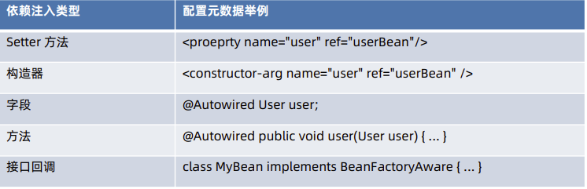


> #### 限定注入

使用注解 @Qualifier 限定

- 通过 Bean 名称限定
- 通过分组限定

基于注解 @Qualifier 扩展限定

- 自定义注解 - 如 Spring Cloud @LoadBalanced


> #### 延迟依赖注入

- 使用 API ObjectFactory 延迟注入

- 使用 API ObjectProvider 延迟注入（推荐）


### 依赖处理过程

- 入口 - DefaultListableBeanFactory#resolveDependency
- 依赖描述符 - DependencyDescriptor
- 自定绑定候选对象处理器 - AutowireCandidateResolver


### 注解注入

#### @Autowired 注入

> #### @Autowired 注入规则

- 非静态字段
- 非静态方法
- 构造器


> #### @Autowired 注入过程 

> 66 | @Autowired注入：@Autowired注入的规则和原理有哪些？

- 元信息解析
- 依赖查找
- 依赖注入（字段、方法）


在bean的创建阶段中，存在一个合并的过程，在`org.springframework.beans.factory.support.AbstractAutowireCapableBeanFactory#doCreateBean`方法中调用了`applyMergedBeanDefinitionPostProcessors`方法

```java
protected void applyMergedBeanDefinitionPostProcessors(RootBeanDefinition mbd, Class<?> beanType, String beanName) {
   for (BeanPostProcessor bp : getBeanPostProcessors()) {
      if (bp instanceof MergedBeanDefinitionPostProcessor) {
         MergedBeanDefinitionPostProcessor bdp = (MergedBeanDefinitionPostProcessor) bp;
         bdp.postProcessMergedBeanDefinition(mbd, beanType, beanName);
      }
   }
}
```

此方法开始处理`MergedBeanDefinitionPostProcessor`，其中`org.springframework.beans.factory.annotation.AutowiredAnnotationBeanPostProcessor`类实现了此PostProcessor接口，所以开始处理


`org.springframework.beans.factory.annotation.AutowiredAnnotationBeanPostProcessor`

```java


  /**
   * 依赖注入的调用入口
   */
	@Override
	public void postProcessMergedBeanDefinition(RootBeanDefinition beanDefinition, Class<?> beanType, String beanName) {
		InjectionMetadata metadata = findAutowiringMetadata(beanName, beanType, null);
		metadata.checkConfigMembers(beanDefinition);
	}

  /**
   * 首先尝试从缓存中拿元信息，如果没有就创建一个
   */
	private InjectionMetadata findAutowiringMetadata(String beanName, Class<?> clazz, @Nullable PropertyValues pvs) {
		// Fall back to class name as cache key, for backwards compatibility with custom callers.
		String cacheKey = (StringUtils.hasLength(beanName) ? beanName : clazz.getName());
		// Quick check on the concurrent map first, with minimal locking.
		InjectionMetadata metadata = this.injectionMetadataCache.get(cacheKey);
		if (InjectionMetadata.needsRefresh(metadata, clazz)) {
			synchronized (this.injectionMetadataCache) {
				metadata = this.injectionMetadataCache.get(cacheKey);
				if (InjectionMetadata.needsRefresh(metadata, clazz)) {
					if (metadata != null) {
						metadata.clear(pvs);
					}
					metadata = buildAutowiringMetadata(clazz);
					this.injectionMetadataCache.put(cacheKey, metadata);
				}
			}
		}
		return metadata;
	}

  /**
   * 创建一个InjectionMetadata
   */
	private InjectionMetadata buildAutowiringMetadata(final Class<?> clazz) {
		if (!AnnotationUtils.isCandidateClass(clazz, this.autowiredAnnotationTypes)) {
			return InjectionMetadata.EMPTY;
		}

		List<InjectionMetadata.InjectedElement> elements = new ArrayList<>();
		Class<?> targetClass = clazz;

    // 依次递归的对成员变量进行注入，找寻父类，父类的父类，递归下去找，（这是个do-while，看循环最后一行）
		do {
			final List<InjectionMetadata.InjectedElement> currElements = new ArrayList<>();

			ReflectionUtils.doWithLocalFields(targetClass, field -> {
				MergedAnnotation<?> ann = findAutowiredAnnotation(field);
				if (ann != null) {
					if (Modifier.isStatic(field.getModifiers())) {
						if (logger.isInfoEnabled()) {
							logger.info("Autowired annotation is not supported on static fields: " + field);
						}
						return;
					}
					boolean required = determineRequiredStatus(ann);
					currElements.add(new AutowiredFieldElement(field, required));
				}
			});

			ReflectionUtils.doWithLocalMethods(targetClass, method -> {
				Method bridgedMethod = BridgeMethodResolver.findBridgedMethod(method);
				if (!BridgeMethodResolver.isVisibilityBridgeMethodPair(method, bridgedMethod)) {
					return;
				}
				MergedAnnotation<?> ann = findAutowiredAnnotation(bridgedMethod);
				if (ann != null && method.equals(ClassUtils.getMostSpecificMethod(method, clazz))) {
					if (Modifier.isStatic(method.getModifiers())) {
						if (logger.isInfoEnabled()) {
							logger.info("Autowired annotation is not supported on static methods: " + method);
						}
						return;
					}
					if (method.getParameterCount() == 0) {
						if (logger.isInfoEnabled()) {
							logger.info("Autowired annotation should only be used on methods with parameters: " +
									method);
						}
					}
					boolean required = determineRequiredStatus(ann);
					PropertyDescriptor pd = BeanUtils.findPropertyForMethod(bridgedMethod, clazz);
					currElements.add(new AutowiredMethodElement(method, required, pd));
				}
			});

			elements.addAll(0, currElements);
			targetClass = targetClass.getSuperclass();
		}
		while (targetClass != null && targetClass != Object.class);

		return InjectionMetadata.forElements(elements, clazz);
	}

	private final Set<Class<? extends Annotation>> autowiredAnnotationTypes = new LinkedHashSet<>(4);

/**
 * 启动的时候，往autowiredAnnotationTypes这个LinkedHashSet里面初始化了2个注解，以后扫描的时候就会去处理这两个注解
 * Create a new {@code AutowiredAnnotationBeanPostProcessor} for Spring's
 * standard {@link Autowired @Autowired} and {@link Value @Value} annotations.
 * <p>Also supports JSR-330's {@link javax.inject.Inject @Inject} annotation,
 * if available.
 */
@SuppressWarnings("unchecked")
public AutowiredAnnotationBeanPostProcessor() {
   this.autowiredAnnotationTypes.add(Autowired.class);
   this.autowiredAnnotationTypes.add(Value.class);
   try {
      this.autowiredAnnotationTypes.add((Class<? extends Annotation>)
            ClassUtils.forName("javax.inject.Inject", AutowiredAnnotationBeanPostProcessor.class.getClassLoader()));
      logger.trace("JSR-330 'javax.inject.Inject' annotation found and supported for autowiring");
   }
   catch (ClassNotFoundException ex) {
      // JSR-330 API not available - simply skip.
   }
}
```


#### @Inject 注入

> #### @Inject **注入过程**

如果 JSR-330 存在于 ClassPath 中，复用 AutowiredAnnotationBeanPostProcessor 实现


#### Java通用注解注入原理

CommonAnnotationBeanPostProcessor

- 注入注解
  - javax.xml.ws.WebServiceRef 
  - javax.ejb.EJB 
  - javax.annotation.Resource 
- 生命周期注解
  - javax.annotation.PostConstruct
  - javax.annotation.PreDestroy


> ####  @PostConstruct注入原理

> 99 | Spring Bean初始化阶段：@PostConstruct、InitializingBean以及自定义方法

- 在bean初始化前阶段initializeBean()对应的applyBeanPostProcessorsBeforeInitialization()方法中执行完自定义的MyInstantiationAwareBeanPostProcessor的postProcessBeforeInitialization()方法
- 同时会执行CommonAnnotationBeanPostProcessor的postProcessBeforeInitialization方法
- 最后执行@PostConstruct修饰的initPostConstructor方法


`org.springframework.beans.factory.support.AbstractAutowireCapableBeanFactory`

```java
	protected Object initializeBean(String beanName, Object bean, @Nullable RootBeanDefinition mbd) {
		if (System.getSecurityManager() != null) {
			AccessController.doPrivileged((PrivilegedAction<Object>) () -> {
				invokeAwareMethods(beanName, bean);
				return null;
			}, getAccessControlContext());
		}
		else {
			invokeAwareMethods(beanName, bean);
		}

		Object wrappedBean = bean;
		if (mbd == null || !mbd.isSynthetic()) {
      // BeanPostProcessors回调
			wrappedBean = applyBeanPostProcessorsBeforeInitialization(wrappedBean, beanName);
		}

		try {
			invokeInitMethods(beanName, wrappedBean, mbd);
		}
		catch (Throwable ex) {
			throw new BeanCreationException(
					(mbd != null ? mbd.getResourceDescription() : null),
					beanName, "Invocation of init method failed", ex);
		}
		if (mbd == null || !mbd.isSynthetic()) {
			wrappedBean = applyBeanPostProcessorsAfterInitialization(wrappedBean, beanName);
		}

		return wrappedBean;
	}

@Override
public Object applyBeanPostProcessorsBeforeInitialization(Object existingBean, String beanName)
      throws BeansException {

   Object result = existingBean;
   for (BeanPostProcessor processor : getBeanPostProcessors()) {
     // 遍历所有的BeanPostProcessor实现类
      Object current = processor.postProcessBeforeInitialization(result, beanName);
      if (current == null) {
         return result;
      }
      result = current;
   }
   return result;
}
```


`org.springframework.beans.factory.annotation.InitDestroyAnnotationBeanPostProcessor`类实现了`MergedBeanDefinitionPostProcessor`，而`MergedBeanDefinitionPostProcessor extends BeanPostProcessor`

```java
@Override
public Object postProcessBeforeInitialization(Object bean, String beanName) throws BeansException {
   LifecycleMetadata metadata = findLifecycleMetadata(bean.getClass());
   try {
     //
      metadata.invokeInitMethods(bean, beanName);
   }
   catch (InvocationTargetException ex) {
      throw new BeanCreationException(beanName, "Invocation of init method failed", ex.getTargetException());
   }
   catch (Throwable ex) {
      throw new BeanCreationException(beanName, "Failed to invoke init method", ex);
   }
   return bean;
}


// LifecycleMetadata是本类的内部类
public void invokeInitMethods(Object target, String beanName) throws Throwable {
  Collection<LifecycleElement> checkedInitMethods = this.checkedInitMethods;
  Collection<LifecycleElement> initMethodsToIterate =
    (checkedInitMethods != null ? checkedInitMethods : this.initMethods);
  if (!initMethodsToIterate.isEmpty()) {
    for (LifecycleElement element : initMethodsToIterate) {
      if (logger.isTraceEnabled()) {
        logger.trace("Invoking init method on bean '" + beanName + "': " + element.getMethod());
      }
      // 反射调用
      element.invoke(target);
    }
  }
}
```


`org.springframework.context.annotation.CommonAnnotationBeanPostProcessor`

```java
public CommonAnnotationBeanPostProcessor() {
   setOrder(Ordered.LOWEST_PRECEDENCE - 3);
   setInitAnnotationType(PostConstruct.class);
   setDestroyAnnotationType(PreDestroy.class);
   ignoreResourceType("javax.xml.ws.WebServiceContext");
}
```

同时`CommonAnnotationBeanPostProcessor`继承自`InitDestroyAnnotationBeanPostProcessor`


#### 自定义依赖注入注解

- 基于 AutowiredAnnotationBeanPostProcessor 实现
- 自定义实现
  - 生命周期处理
    - InstantiationAwareBeanPostProcessor 
    - MergedBeanDefinitionPostProcessor
  - 元数据
    - InjectedElement
    - InjectionMetadata


## 依赖查找

> #### 单一类型依赖查找

单一类型依赖查找接口 - BeanFactory

- 根据 Bean 名称查找	

  - getBean(String)
  - Spring 2.5 覆盖默认参数：getBean(String,Object...) 

- 根据 Bean 类型查找

  - Bean 实时查找 
    - Spring 3.0 getBean(Class) 
    - Spring 4.1 覆盖默认参数：getBean(Class,Object...)
  - Spring 5.1 Bean 延迟查找 
    - getBeanProvider(Class)
    - getBeanProvider(ResolvableType) 

- 根据 Bean 名称 + 类型查找

  - getBean(String,Class)


// todo 搞明白具体查找的流程，是去哪里查的


> #### 集合类型依赖查找

集合类型依赖查找接口 - ListableBeanFactory

- 根据 Bean 类型查找
  - 获取同类型 Bean 名称列
    - getBeanNamesForType(Class)
    - Spring 4.2 getBeanNamesForType(ResolvableType)
  - 获取同类型 Bean 实例列表
    - getBeansOfType(Class) 以及重载方法
- 通过注解类型查找
  - Spring 3.0 获取标注类型 Bean 名称列表
    - getBeanNamesForAnnotation(Class)
  - Spring 3.0 获取标注类型 Bean 实例列表
    - getBeansWithAnnotation(Class)
  - Spring 3.0 获取指定名称 + 标注类型 Bean 实例 
    - findAnnotationOnBean(String,Class)


> #### 层次性依赖查找

层次性依赖查找接口 - HierarchicalBeanFactory

- 双亲 BeanFactory：getParentBeanFactory()
- 层次性查找
  - 根据 Bean 名称查找
    - 基于 containsLocalBean 方法实现
  - 根据 Bean 类型查找实例列表
    - 单一类型：BeanFactoryUtils#beanOfType
    - 集合类型：BeanFactoryUtils#beansOfTypeIncludingAncestors
  - 根据 Java 注解查找名称列表
    - BeanFactoryUtils#beanNamesForTypeIncludingAncestors


// 双亲委派的查找模式？


> #### 延迟依赖查找

Bean 延迟依赖查找接口

- org.springframework.beans.factory.ObjectFactory
- org.springframework.beans.factory.ObjectProvider
  - Spring 5 对 Java 8 特性扩展
    -  函数式接口
      - getIfAvailable(Supplier) 
      - ifAvailable(Consumer) 
    - Stream 扩展 - stream()


## 容器

### BeanFactory

### ApplicationContext

// todo 太长了，整理一下

// @PostConstruct的实现


### 生命周期

> #### Spring 应用上下文启动准备阶段

AbstractApplicationContext#prepareRefresh()方法

- 启动时间-startup Date
- 状态标识-closed(false)s active(true)
- 初始化 Propertysources - initPropertySources()
- 检验Environment中必须属性
- 初始化事件监听器集合
- 初始化早期Spring事件集合


> #### BeanFactory创建阶段

AbstractApplicati onCon text#obta inF reshBea nF actory()方法

- 刷新 Spring 应用上下文底层 BeanFactory - refreshBeanFactory()
  - 销毁或关闭BeanFactory,如果已存在的话
  - 创建 BeanFactory - createBeanFactory()
  - 设置 BeanFactory Id
  - 设置"是否允许 BeanDefinition 重复定义〃 -customizeBeanFactory(DefaultListableBeanFactory)
  - 设置"是否允许循环引用(依赖)“ -customizeBeanFactory(DefauLtListabLeBeanFactory)
  - 加载 BeanDefinition - loadBeanDefinitions(DefaultListableBeanFactory) 方法
  - 关联新建BeanFactory到Spring应用上下文
-   返回 Spring 应用上下文底层 BeanFactory - getBeanFactory()


> #### BeanFactory准备阶段

AbstractApplicationContext#prepareBeanFactory(ConfigurableListableBeanFactory)方法

- 关联 ClassLoader
- 设置Bean表达式处理器
- 添力口 PropertyEditorRegistrar 实现-ResourceEditorRegistrar

- 添加 Aware 回调接口 BeanPostProcessor 实现-ApplicationContextAwareProcessor

- 忽略Aware回调接口作为依赖注入接口

- 注册 ResolvableDependency 对象-BeanFactory、ResourceLoader. ApplicationEventPublisher 以及

Applicationcontext

- 注册 ApplicationListenerDetector 对象

- 注册 LoadTimeWeaverAwareProcessor 对象

- 注册单例对象-Environments Java System Properties以及OS环境变量


> #### BeanFactory后置处理阶段

AbstractApplicati onCon text#postProcessBea nF actory(C on figurableListableBea nF actory)方法

- 由子类覆盖该方法

AbstractApplicati onCon text#i nvokeBea nF actoryPostProcessors(C on figurableListableBea nF act

ory方法

- 调用 BeanFactoryPostProcessor 或 BeanDefinitionRegistry 后置处理方法

- 注册 LoadTimeWeaverAwareProcessor 对象


> #### BeanFactory 注册 BeanPostProcessor 阶段

 AbstractApplicationContext#registerBeanPostProcessors(ConfigurableListableBeanFactory)方法

- 注册 PriorityOrdered 类型的 BeanPostProcessor Beans

- 注册 Ordered 类型的 BeanPostProcessor Beans

- 注册普通 BeanPostProcessor Beans

- 注册 MergedBeanDefinitionPostProcessor Beans

- 注册 ApplicationListenerDetector 对象


> #### 初始化內建 Bean: Messagesource

AbstractApplicationContext#initMessageSource()方法


> #### 初始化內建Bean: Spring事件广播器

AbstractApplicationContext#initAppLicationEventMulticaster()方法


> #### Spring 应用上下文刷新阶段

AbstractApplicationContext#onRefresh()方法

- 子类覆盖该方法 
  - org .springframework .web. context .support・AbstractRefreshableWebApplicationContext#onRefres h()

  - org .springframework .web .context .support ・GenericWebApplicationContext#onRefresh()

  - org .springframework .boot, web .reactive .context ・ReactiveWebServerApplicationContext#onRefres h()

  - org .springframework .boot, web .servlet .context ・ServletWebServerApplicationContext#onRefresh() org .springframework .web .context .support ・StaticWebApplicationContext#onRefresh()

    

> #### Spring事件监听器注册阶段

AbstractApplicationContext#registerListeners()方法

- 添加当前应用上下文所关联的ApplicationListener对象(集合)

- 添力口 BeanFactory 所注册 ApplicationListener Beans

- 广播早期Spring事件


> #### BeanFactory初始化完成阶段

AbstractApplicati onCon text#fi nishBea nF actoryl nitializati on (Con figurableListableBea nF actory) 方法

- BeanFactory 关联 Conversionservice Bean,如果存在

- 添加 StringValueResolver 对象

- 依赖查找 LoadTimeWeaverAware Bean

- BeanFactory 临时 ClassLoader 置为 null

- BeanFactory冻结配置

- BeanFactory初始化非延迟单例Beans


> #### Spring应用上下文刷新完成阶段

AbstractApplicati onCon text#finishRefresh()方法

- 清除 ResourceLoader 缓存-clearResourceCaches() @since 5.0

- 初始化 LifecycleProcessor 对象-initLifecycleProcessor()

- 调用 LifecycleProcessor#onRefresh()方法

- 发布Spring应用上下文已刷新事件-ContextRefreshedEvent

- 向 MBeanServer 托管 Live Beans


> #### Spring应用上下文启动阶段

AbstractApplicationContext#start()方法

- 启动 LifecycleProcessor
  - 依赖查找 Lifecycle Beans
  - 启动 Lifecycle Beans

- 发布Spring应用上下文已启动事件-ContextStartedEvent


> #### Spring应用上下文停止阶段

AbstractApplicationContext#stop()方法

- 停止 LifecycleProcessor
  - 依赖查找 Lifecycle Beans
  - 停止 Lifecycle Beans

- 发布Spring应用上下文已停止事件-ContextStoppedEvent


> #### Spring应用上下文关闭阶段

AbstractApplicationContext#close()方法

- 状态标识：active(false)s closed(true)

- Live Beans JMX 撤销托管
  - LiveBeansView .unregisterApplicationContext(ConfigurableApplicationContext)

- 发布Spring应用上下文已关闭事件-ContextCLosedEvent

- 关闭 LifecycleProcessor
  - 依赖查找 Lifecycle Beans
  - 停止 Lifecycle Beans

- 销毁 Spring Beans

- 关闭 BeanFactory

- 回调 onCLose()

- 注册Shutdown Hook线程(如果曾注册)


# Spring Bean

## 结构（BeanDefinition）

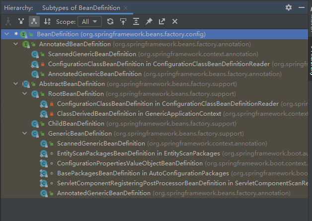

其中有2大分支，一个是基于注解的BeanDefinition ，一个是有继承结构的BeanDefinition。

BeanDefinition 是Spring Framework 中定义Bean 的配置元信息接口，包含：

- Bean 的类名

- Bean 行为配置元素

  如作用域、自动绑定的模式，生命周期回调等

- 其他Bean 引用，又可称作合作者（collaborators）或者依赖（dependencies）

- 配置设置，比如Bean 属性（Properties）

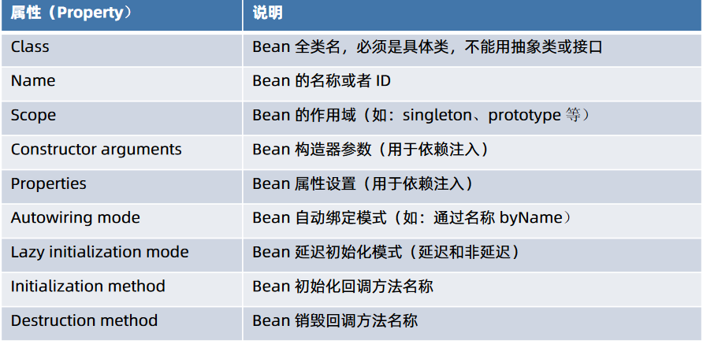


> #### 手动构建BeanDefinition

```java
// 使用 BeanDefinitionBuilder
BeanDefinitionBuilder beanDefinitionBuilder = BeanDefinitionBuilder.genericBeanDefinition(clazz);
beanDefinitionBuilder.addPropertyValue("key", "value");

// 直接硬new
GenericBeanDefinition genericBeanDefinition = new GenericBeanDefinition();
genericBeanDefinition.setBeanClass(Main.class);
MutablePropertyValues mutablePropertyValues = new MutablePropertyValues();
mutablePropertyValues.addPropertyValue("key", "value");
genericBeanDefinition.setPropertyValues(mutablePropertyValues);
```


> #### BeanDefinition 注册

- XML 配置元信息- <bean name=”...” ... />

- Java 注解配置元信息

  @Bean、@Component、@Import

- Java API 配置元信息

  - 命名方式：BeanDefinitionRegistry#registerBeanDefinition(String,BeanDefinition)
  - 非命名方式：BeanDefinitionReaderUtils#registerWithGeneratedName(AbstractBeanDefinition,BeanDefinitionRegistry)
  - 配置类方式：AnnotatedBeanDefinitionReader#register(Class...)

- 外部单例对象注册

  Java API 配置元信息SingletonBeanRegistry#registerSingleton


> ####  Bean实例化

- 常规方式
  - 通过构造器（配置元信息：XML、Java 注解和Java API ）
  - 通过静态工厂方法（配置元信息：XML 和Java API ）
  - 通过Bean 工厂方法（配置元信息：XML和Java API ）
  - 通过FactoryBean（配置元信息：XML、Java 注解和Java API ）
- 特殊方式
  - 通过ServiceLoaderFactoryBean（配置元信息：XML、Java 注解和Java API ）
  - 通过AutowireCapableBeanFactory#createBean(java.lang.Class, int, boolean)
  - 通过BeanDefinitionRegistry#registerBeanDefinition(String,BeanDefinition) 


> ####  Bean 初始化（Initialization） 

- `@PostConstruct`标注方法 
- 实现 `InitializingBean` 接口的 `afterPropertiesSet()` 方法 
- 自定义初始化方法 
  - XML 配置： ` <bean init-method=”init” ... />`
  -  Java 注解：`@Bean(initMethod=”init”) `
  -  Java API：`AbstractBeanDefinition#setInitMethodName(String) `

思考：假设以上三种方式均在同一 Bean 中定义，那么这些方法的执行顺序是怎样？ 

> #### Bean 延迟初始化（Lazy Initialization）

- XML 配置： 
- Java 注解：`@Lazy(true) `

思考：当某个 Bean 定义为延迟初始化，那么，Spring 容器返回的对象与非延迟的对象存在怎样的差异？


## 存储

## 生命周期

> #### BeanFactory 是怎样处理 Bean 生命周期？

BeanFactory 的默认实现为 DefaultListableBeanFactory，其中 Bean生命周期与方法映射如下： 

- BeanDefinition 注册阶段 - registerBeanDefinition 
- BeanDefinition 合并阶段 - getMergedBeanDefinition 
- Bean 实例化前阶段 - resolveBeforeInstantiation 
- Bean 实例化阶段 - createBeanInstance 
- Bean 初始化后阶段 - populateBean 
- Bean 属性赋值前阶段 - populateBean 
- Bean 属性赋值阶段 - populateBean 
- Bean Aware 接口回调阶段 - initializeBean 
- Bean 初始化前阶段 - initializeBean
- Bean 初始化阶段 - initializeBean 
- Bean 初始化后阶段 - initializeBean 
- Bean 初始化完成阶段 - preInstantiateSingletons 
- Bean 销毁前阶段 - destroyBean 
- Bean 销毁阶段 - destroyBean


> #### Spring Bean 元信息配置阶段 

- BeanDefinition 配置 
  - 面向资源 
    - XML 配置  
    - Properties 资源配置 
  - 面向注解 
  - 面向 API


> #### Spring Bean 元信息解析阶段 

- 面向资源 BeanDefinition 解析 
  - BeanDefinitionReader
  - XML 解析器 - BeanDefinitionParser 
- 面向注解 BeanDefinition 解析 
  - AnnotatedBeanDefinitionReader


> #### Spring Bean 注册阶段 

- BeanDefinition 注册接口 
  - BeanDefinitionRegistry


> #### Spring BeanDefinition 合并阶段

- BeanDefinition 合并 
  - 父子 BeanDefinition 合并
    - 当前 BeanFactory 查找 
    - 层次性 BeanFactory 查找


> #### Spring Bean Class 加载阶段 

- ClassLoader 类加载 
- Java Security 安全控制 
- ConfigurableBeanFactory 临时 ClassLoader


> #### Spring Bean 实例化前阶段

- 非主流生命周期 - Bean 实例化前阶段
  - InstantiationAwareBeanPostProcessor#postProcessBeforeInstantiation


> #### Spring Bean 实例化阶段 

- 实例化方式
  - 传统实例化方式
    - 实例化策略 - InstantiationStrategy 
  - 构造器依赖注入


> #### Spring Bean 实例化后阶段

- Bean 属性赋值（Populate）判断 
  - InstantiationAwareBeanPostProcessor#postProcessAfterInstantiation


> #### Spring Bean 属性赋值前阶段

- Bean 属性值元信息  
  - PropertyValues 
- Bean 属性赋值前回调 
  - Spring 1.2 - 5.0：InstantiationAwareBeanPostProcessor#postProcessPropertyValues 
  - Spring 5.1：InstantiationAwareBeanPostProcessor#postProcessProperties


> #### Spring Bean Aware 接口回调阶段

- Spring Aware 接口 
  - BeanNameAware 
  - BeanClassLoaderAware 
  - BeanFactoryAware 
  - EnvironmentAware 
  - EmbeddedValueResolverAware 
  - ResourceLoaderAware 
  - ApplicationEventPublisherAware 
  - MessageSourceAware 
  - ApplicationContextAware


> #### Spring Bean 初始化前阶段

- 已完成 
  - Bean 实例化 
  - Bean 属性赋值 
  - Bean Aware 接口回调 
- 方法回调 
  - BeanPostProcessor#postProcessBeforeInitialization


> #### Spring Bean 初始化阶段

- Bean 初始化（Initialization） 
  - @PostConstruct 标注方法
  - 实现 InitializingBean 接口的 afterPropertiesSet() 方法 
  - 自定义初始化方法


> #### Spring Bean 初始化后阶段

- 方法回调 
  - BeanPostProcessor#postProcessAfterInitialization


> #### Spring Bean 初始化完成阶段

- 方法回调 
  - Spring 4.1 +：SmartInitializingSingleton#afterSingletonsInstantiated


> #### Spring Bean 销毁前阶段

- 方法回调 
  - DestructionAwareBeanPostProcessor#postProcessBeforeDestruction


> #### Spring Bean 销毁阶段

- Bean 销毁（Destroy） 
  - @PreDestroy 标注方法 
  - 实现 DisposableBean 接口的 destroy() 方法 
  - 自定义销毁方法


# 启动流程


# Spring IOC容器解析（旧-待整合）

- IOC 容器：最主要是完成了完成对象的创建和依赖的管理注入等等。
- 所谓控制反转，就是把原先我们代码里面需要实现的对象创建、依赖的代码，反转给容器来帮忙实现。


## IoC体系结构

> ### BeanFactory

Spring Bean的创建是典型的工厂模式。

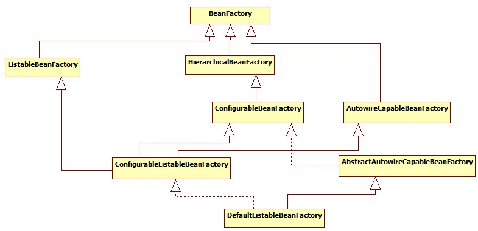


- BeanFactory：只对IOC容器的基本行为作了定义，不关心bean是如何定义、怎样加载的。
- ListableBeanFactory： 可以列表的bean。
- HierarchicalBeanFactory ：是有继承关系的bean，存在父类。
- AutowireCapableBeanFactory ：定义 Bean 的自动装配规则。


> ### BeanDefinition

Bean对象在Spring实现中是以BeanDefinition来描述的。

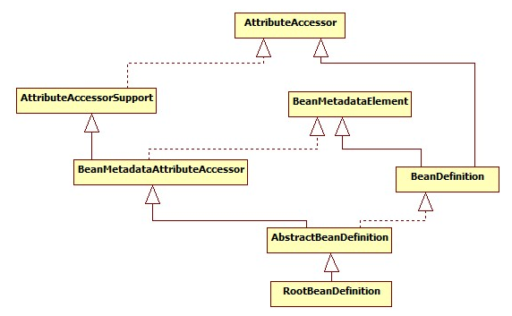


Spring 定义了一些类来实现配置文件的解析

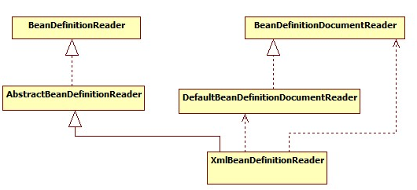


## IoC容器的初始化

IoC容器的初始化包括BeanDefinition的Resource定位、载入和注册这三个基本的过程。简单来说就是定位、读取配置文件，读取配置文件中内容并且以一定的数据结构保存，把保存的内容注册为bean保存在IoC容器中。


Spring提供了许多IOC容器的实现。比如XmlBeanFactory(Deprecated)，ApplicationContext、ClasspathXmlApplicationContext等等。其中XmlBeanFactory就是针对最基本的ioc容器的实现，这个IOC容器可以读取XML文件定义的BeanDefinition（XML文件中对bean的描述）。ApplicationContext是Spring提供的一个高级的IoC容器，除了能够提供IoC容器的基本功能外，还为用户提供了附加服务。


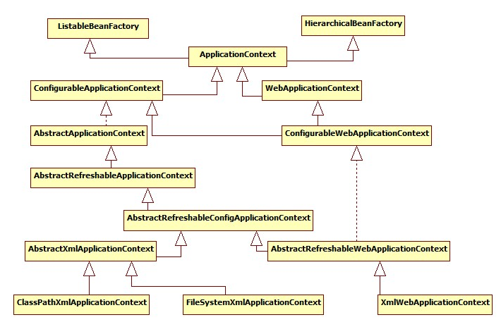


以ApplicationContext 为例子。初始化

`ApplicationContext = new FileSystemXmlApplicationContext(xmlPath);`


最后调用的构造方法如下，实际上是`refresh()`方法在干事。

```java
public FileSystemXmlApplicationContext(String[] configLocations, boolean refresh, @Nullable ApplicationContext parent) throws BeansException {
        super(parent);
        this.setConfigLocations(configLocations);
        if (refresh) {
            this.refresh();
        }

    }
```


- `super(parent)`：调用父类容器的构造方法为容器设置好Bean设置资源加载器和进行资源定位。
- `refresh()`：对容器进行初始化，对Bean定义资源进行载入。


简单再看一下FileSystemXmlApplicationContext的继承关系图，FileSystemXmlApplicationContext是一路继承下来的。

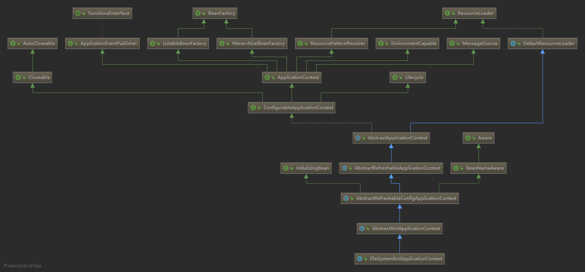


> **第一步**

这个`super(parent)`方法，最后是调用的`AbstractApplicationContext`这个抽象类的构造方法：

```java
    public AbstractApplicationContext(@Nullable ApplicationContext parent) {
        this();
        this.setParent(parent);
    }

	//this调用的是这个构造方法
	public AbstractApplicationContext() {
        this.logger = LogFactory.getLog(this.getClass());
        this.id = ObjectUtils.identityToString(this);
        this.displayName = ObjectUtils.identityToString(this);
        this.beanFactoryPostProcessors = new ArrayList();
        this.active = new AtomicBoolean();
        this.closed = new AtomicBoolean();
        this.startupShutdownMonitor = new Object();
        this.applicationListeners = new LinkedHashSet();
        this.resourcePatternResolver = this.getResourcePatternResolver();
    }

    protected ResourcePatternResolver getResourcePatternResolver() {
        return new PathMatchingResourcePatternResolver(this);
    }

    public void setParent(@Nullable ApplicationContext parent) {
        this.parent = parent;
        if (parent != null) {
            Environment parentEnvironment = parent.getEnvironment();
            if (parentEnvironment instanceof ConfigurableEnvironment) {
               this.getEnvironment().merge((ConfigurableEnvironment)parentEnvironment);
            }
        }
    }
```


- 这个方法初始化了一些参数的默认值，id和displayName是一个很长的全类名：`org.springframework.boot.web.servlet.context.AnnotationConfigServletWebServerApplicationContext@1fb669c3`。

- resourcePatternResolver是一个资源加载器，用来用于载入资源  。

- 之后把父类的上下文信息也合并到自己的上下文中。


> **第二步**

` this.setConfigLocations(configLocations);` 加载配置文件。

```java
    public void setConfigLocation(String location) {
        this.setConfigLocations(StringUtils.tokenizeToStringArray(location, ",; /t/n"));
    }

    public void setConfigLocations(@Nullable String... locations) {
        if (locations != null) {
            Assert.noNullElements(locations, "Config locations must not be null");
            this.configLocations = new String[locations.length];

            for(int i = 0; i < locations.length; ++i) {
                this.configLocations[i] = this.resolvePath(locations[i]).trim();
            }
        } else {
            this.configLocations = null;
        }
    }
```

从这两个构造方法来看，可以使用数组的方式，或者传一个用`,; /t/n`分割开的字符串，他会帮你进行切割转成数组。之后把所有的路径都保存在`configLocations[i]`数组里面。


> **第三步**

`refresh();`：在创建IoC容器前，如果已经有容器存在，则需要把已有的容器销毁和关闭，以保证在refresh之后使用的是新建立起来的IoC容器。refresh的作用类似于对IoC容器的重启，在新建立好的容器中对容器进行初始化，对Bean定义资源进行载入

这个方法也是调用的`AbstractApplicationContext`这个抽象类的。

```java
 public void refresh() throws BeansException, IllegalStateException {
        synchronized(this.startupShutdownMonitor) {
            this.prepareRefresh();
            ConfigurableListableBeanFactory beanFactory = this.obtainFreshBeanFactory();
            this.prepareBeanFactory(beanFactory);

            try {
                this.postProcessBeanFactory(beanFactory);
                this.invokeBeanFactoryPostProcessors(beanFactory);
                this.registerBeanPostProcessors(beanFactory);
                this.initMessageSource();
                this.initApplicationEventMulticaster();
                this.onRefresh();
                this.registerListeners();
                this.finishBeanFactoryInitialization(beanFactory);
                this.finishRefresh();
            } catch (BeansException var9) {
                if (this.logger.isWarnEnabled()) {
                    this.logger.warn("Exception encountered during context initialization - cancelling refresh attempt: " + var9);
                }

                this.destroyBeans();
                this.cancelRefresh(var9);
                throw var9;
            } finally {
                this.resetCommonCaches();
            }

        }
    }
```

这个方法是核心，Spring IoC容器载入Bean定义资源文件从其子类容器的refreshBeanFactory()方法启动，所以整个refresh()中`ConfigurableListableBeanFactory beanFactory = this.obtainFreshBeanFactory();`这句以后的代码都是注册容器的信息源和生命周期事件，载入过程就是从这句代码启动。

太复杂了不一句句看了，直接上总结。


>  ### 总结IOC容器初始化的基本步骤：

1. 初始化的入口在容器实现中的 refresh()调用来完成。
2. 对 bean 定义载入 IOC 容器使用的方法是 loadBeanDefinition，其中的大致过程如下
   1. 通过 ResourceLoader 来完成资源文件位置的定位，DefaultResourceLoader 是默认的实现。
   2. 同时上下文本身就给出了 ResourceLoader 的实现，可以从类路径，文件系统， URL 等方式来定位资源位置。
   3. 如果是 XmlBeanFactory作为 IOC 容器，那么需要为它指定 bean 定义的资源，也就是说 bean 定义文件时，通过抽象成 Resource 来被 IOC 容器处理
   4. 容器通过 BeanDefinitionReader来完成定义信息的解析和 Bean 信息的注册
   5. 使用的是XmlBeanDefinitionReader 来解析 bean 的 xml 定义文件 - 实际的处理过程是委托给 BeanDefinitionParserDelegate 来完成的，从而得到 bean 的定义信息，
   6. 这些信息在 Spring 中使用 BeanDefinition 对象来表示 - 这个名字可以让我们想到loadBeanDefinition，RegisterBeanDefinition  这些相关的方法 - 他们都是为处理 BeanDefinitin 服务的
   7.  容器解析得到 BeanDefinitionIoC 以后，需要把它在 IOC 容器中注册，这由 IOC 实现的BeanDefinitionRegistry 接口来完成。
   8. 注册过程就是在 IOC 容器内部维护一个HashMap 来保存得到的 BeanDefinition 的过程。这个 HashMap 是 IoC 容器持有 bean 信息的场所，以后对 bean 的操作都是围绕这个HashMap 来实现的.

3. 然后我们就可以通过 BeanFactory 和 ApplicationContext 来享受到 Spring IOC 的服务了
4. 在使用 IOC 容器的时候，我们注意到除了少量粘合代码，绝大多数以正确 IoC 风格编写的应用程序代码完全不用关心如何到达工厂，因为容器将把这些对象与容器管理的其他对象钩在一起。
5. 基本的策略是把工厂放到已知的地方，最好是放在对预期使用的上下文有意义的地方，以及代码将实际需要访问工厂的地方。
6.  Spring 本身提供了对声明式载入 web 应用程序用法的应用程序上下文,并将其存储在ServletContext 中的框架实现。


## IOC容器的依赖注入

> ## 依赖注入发生的时间

当Spring IoC容器完成了Bean定义资源的定位、载入和解析注册以后，IoC容器中已经管理Bean定义的相关数据，但是此时IoC容器还没有对所管理的Bean进行依赖注入，依赖注入在以下两种情况发生：

1. 用户第一次通过getBean方法向IoC容索要Bean时，IoC容器触发依赖注入。

2. 当用户在Bean定义资源中为<Bean>元素配置了lazy-init属性，即让容器在解析注册Bean定义时进行预实例化，触发依赖注入。


> ## 向IoC容器获取被管理的Bean

BeanFactory接口定义了Spring IoC容器的基本功能规范，是Spring IoC容器所应遵守的最底层和最基本的编程规范。BeanFactory接口中定义了几个getBean方法，就是用户向IoC容器索取管理的Bean的方法，我们通过分析其子类的具体实现，理解Spring IoC容器在用户索取Bean时如何完成依赖注入。BeanFactory接口中的getBean方法有多种实现，这里分析`AbstractBeanFactory`中的方法。

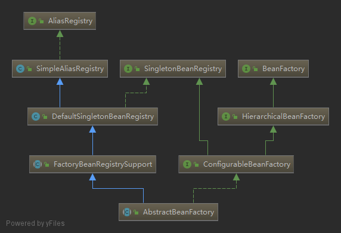


```java
 	public Object getBean(String name) throws BeansException {
        return this.doGetBean(name, (Class)null, (Object[])null, false);
    }

	//核心方法
 	protected <T> T doGetBean(String name, @Nullable Class<T> requiredType, @Nullable Object[] args, boolean typeCheckOnly) throws BeansException {
        String beanName = this.transformedBeanName(name);
        Object sharedInstance = this.getSingleton(beanName);
        Object bean;
        if (sharedInstance != null && args == null) {
            if (this.logger.isTraceEnabled()) {
                if (this.isSingletonCurrentlyInCreation(beanName)) {
                    this.logger.trace("Returning eagerly cached instance of singleton bean '" + beanName + "' that is not fully initialized yet - a consequence of a circular reference");
                } else {
                    this.logger.trace("Returning cached instance of singleton bean '" + beanName + "'");
                }
            }

            bean = this.getObjectForBeanInstance(sharedInstance, name, beanName, (RootBeanDefinition)null);
        } else {
            if (this.isPrototypeCurrentlyInCreation(beanName)) {
                throw new BeanCurrentlyInCreationException(beanName);
            }

            BeanFactory parentBeanFactory = this.getParentBeanFactory();
            if (parentBeanFactory != null && !this.containsBeanDefinition(beanName)) {
                String nameToLookup = this.originalBeanName(name);
                if (parentBeanFactory instanceof AbstractBeanFactory) {
                    return ((AbstractBeanFactory)parentBeanFactory).doGetBean(nameToLookup, requiredType, args, typeCheckOnly);
                }

                if (args != null) {
                    return parentBeanFactory.getBean(nameToLookup, args);
                }

                if (requiredType != null) {
                    return parentBeanFactory.getBean(nameToLookup, requiredType);
                }

                return parentBeanFactory.getBean(nameToLookup);
            }

            if (!typeCheckOnly) {
                this.markBeanAsCreated(beanName);
            }

            try {
                RootBeanDefinition mbd = this.getMergedLocalBeanDefinition(beanName);
                this.checkMergedBeanDefinition(mbd, beanName, args);
                String[] dependsOn = mbd.getDependsOn();
                String[] var11;
                if (dependsOn != null) {
                    var11 = dependsOn;
                    int var12 = dependsOn.length;

                    for(int var13 = 0; var13 < var12; ++var13) {
                        String dep = var11[var13];
                        if (this.isDependent(beanName, dep)) {
                            throw new BeanCreationException(mbd.getResourceDescription(), beanName, "Circular depends-on relationship between '" + beanName + "' and '" + dep + "'");
                        }

                        this.registerDependentBean(dep, beanName);

                        try {
                            this.getBean(dep);
                        } catch (NoSuchBeanDefinitionException var24) {
                            throw new BeanCreationException(mbd.getResourceDescription(), beanName, "'" + beanName + "' depends on missing bean '" + dep + "'", var24);
                        }
                    }
                }

                if (mbd.isSingleton()) {
                    sharedInstance = this.getSingleton(beanName, () -> {
                        try {
                            return this.createBean(beanName, mbd, args);
                        } catch (BeansException var5) {
                            this.destroySingleton(beanName);
                            throw var5;
                        }
                    });
                    bean = this.getObjectForBeanInstance(sharedInstance, name, beanName, mbd);
                } else if (mbd.isPrototype()) {
                    var11 = null;

                    Object prototypeInstance;
                    try {
                        this.beforePrototypeCreation(beanName);
                        prototypeInstance = this.createBean(beanName, mbd, args);
                    } finally {
                        this.afterPrototypeCreation(beanName);
                    }

                    bean = this.getObjectForBeanInstance(prototypeInstance, name, beanName, mbd);
                } else {
                    String scopeName = mbd.getScope();
                    Scope scope = (Scope)this.scopes.get(scopeName);
                    if (scope == null) {
                        throw new IllegalStateException("No Scope registered for scope name '" + scopeName + "'");
                    }

                    try {
                        Object scopedInstance = scope.get(beanName, () -> {
                            this.beforePrototypeCreation(beanName);

                            Object var4;
                            try {
                                var4 = this.createBean(beanName, mbd, args);
                            } finally {
                                this.afterPrototypeCreation(beanName);
                            }

                            return var4;
                        });
                        bean = this.getObjectForBeanInstance(scopedInstance, name, beanName, mbd);
                    } catch (IllegalStateException var23) {
                        throw new BeanCreationException(beanName, "Scope '" + scopeName + "' is not active for the current thread; consider defining a scoped proxy for this bean if you intend to refer to it from a singleton", var23);
                    }
                }
            } catch (BeansException var26) {
                this.cleanupAfterBeanCreationFailure(beanName);
                throw var26;
            }
        }

        if (requiredType != null && !requiredType.isInstance(bean)) {
            try {
                T convertedBean = this.getTypeConverter().convertIfNecessary(bean, requiredType);
                if (convertedBean == null) {
                    throw new BeanNotOfRequiredTypeException(name, requiredType, bean.getClass());
                } else {
                    return convertedBean;
                }
            } catch (TypeMismatchException var25) {
                if (this.logger.isTraceEnabled()) {
                    this.logger.trace("Failed to convert bean '" + name + "' to required type '" + ClassUtils.getQualifiedName(requiredType) + "'", var25);
                }

                throw new BeanNotOfRequiredTypeException(name, requiredType, bean.getClass());
            }
        } else {
            return bean;
        }
    }

```


- 通过上面对向IoC容器获取Bean方法的分析，我们可以看到在Spring中，如果Bean定义的单态模式(Singleton)，则容器在创建之前先从缓存中查找，以确保整个容器中只存在一个实例对象。
- 如果Bean定义的是原型模式(Prototype)，则容器每次都会创建一个新的实例对象。除此之外，Bean定义还可以扩展为指定其生命周期范围。

上面的源码只是定义了根据Bean定义的模式，采取的不同创建Bean实例对象的策略，具体的Bean实例对象的创建过程由实现了ObejctFactory接口的匿名内部类的createBean方法完成。


> ## 创建Bean

`createBean`方法的具体实现在`AbstractAutowireCapableBeanFactory`中。

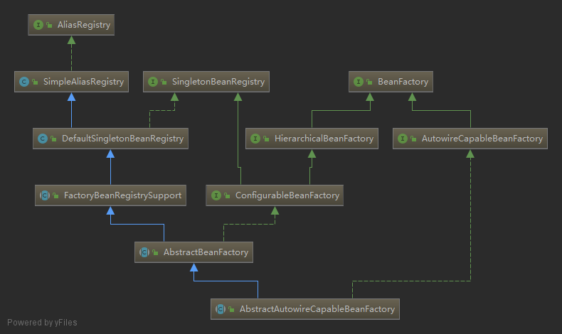


```java
	protected Object createBean(String beanName, RootBeanDefinition mbd, @Nullable Object[] args) throws BeanCreationException {
        if (this.logger.isTraceEnabled()) {
            this.logger.trace("Creating instance of bean '" + beanName + "'");
        }

        RootBeanDefinition mbdToUse = mbd;
        Class<?> resolvedClass = this.resolveBeanClass(mbd, beanName, new Class[0]);
        if (resolvedClass != null && !mbd.hasBeanClass() && mbd.getBeanClassName() != null) {
            mbdToUse = new RootBeanDefinition(mbd);
            mbdToUse.setBeanClass(resolvedClass);
        }

        try {
            mbdToUse.prepareMethodOverrides();
        } catch (BeanDefinitionValidationException var9) {
            throw new BeanDefinitionStoreException(mbdToUse.getResourceDescription(), beanName, "Validation of method overrides failed", var9);
        }

        Object beanInstance;
        try {
            beanInstance = this.resolveBeforeInstantiation(beanName, mbdToUse);
            if (beanInstance != null) {
                return beanInstance;
            }
        } catch (Throwable var10) {
            throw new BeanCreationException(mbdToUse.getResourceDescription(), beanName, "BeanPostProcessor before instantiation of bean failed", var10);
        }

        try {
            beanInstance = this.doCreateBean(beanName, mbdToUse, args);
            if (this.logger.isTraceEnabled()) {
                this.logger.trace("Finished creating instance of bean '" + beanName + "'");
            }

            return beanInstance;
        } catch (ImplicitlyAppearedSingletonException | BeanCreationException var7) {
            throw var7;
        } catch (Throwable var8) {
            throw new BeanCreationException(mbdToUse.getResourceDescription(), beanName, "Unexpected exception during bean creation", var8);
        }
    }
```


其中`doCreateBean`方法才是真正创建bean的地方

```java
	protected Object doCreateBean(String beanName, RootBeanDefinition mbd, @Nullable Object[] args) throws BeanCreationException {
        BeanWrapper instanceWrapper = null;
        if (mbd.isSingleton()) {
            instanceWrapper = (BeanWrapper)this.factoryBeanInstanceCache.remove(beanName);
        }

        if (instanceWrapper == null) {
            instanceWrapper = this.createBeanInstance(beanName, mbd, args);
        }

        Object bean = instanceWrapper.getWrappedInstance();
        Class<?> beanType = instanceWrapper.getWrappedClass();
        if (beanType != NullBean.class) {
            mbd.resolvedTargetType = beanType;
        }

        synchronized(mbd.postProcessingLock) {
            if (!mbd.postProcessed) {
                try {
                    this.applyMergedBeanDefinitionPostProcessors(mbd, beanType, beanName);
                } catch (Throwable var17) {
                    throw new BeanCreationException(mbd.getResourceDescription(), beanName, "Post-processing of merged bean definition failed", var17);
                }

                mbd.postProcessed = true;
            }
        }

        boolean earlySingletonExposure = mbd.isSingleton() && this.allowCircularReferences && this.isSingletonCurrentlyInCreation(beanName);
        if (earlySingletonExposure) {
            if (this.logger.isTraceEnabled()) {
                this.logger.trace("Eagerly caching bean '" + beanName + "' to allow for resolving potential circular references");
            }

            this.addSingletonFactory(beanName, () -> {
                return this.getEarlyBeanReference(beanName, mbd, bean);
            });
        }

        Object exposedObject = bean;

        try {
            this.populateBean(beanName, mbd, instanceWrapper);
            exposedObject = this.initializeBean(beanName, exposedObject, mbd);
        } catch (Throwable var18) {
            if (var18 instanceof BeanCreationException && beanName.equals(((BeanCreationException)var18).getBeanName())) {
                throw (BeanCreationException)var18;
            }

            throw new BeanCreationException(mbd.getResourceDescription(), beanName, "Initialization of bean failed", var18);
        }

        if (earlySingletonExposure) {
            Object earlySingletonReference = this.getSingleton(beanName, false);
            if (earlySingletonReference != null) {
                if (exposedObject == bean) {
                    exposedObject = earlySingletonReference;
                } else if (!this.allowRawInjectionDespiteWrapping && this.hasDependentBean(beanName)) {
                    String[] dependentBeans = this.getDependentBeans(beanName);
                    Set<String> actualDependentBeans = new LinkedHashSet(dependentBeans.length);
                    String[] var12 = dependentBeans;
                    int var13 = dependentBeans.length;

                    for(int var14 = 0; var14 < var13; ++var14) {
                        String dependentBean = var12[var14];
                        if (!this.removeSingletonIfCreatedForTypeCheckOnly(dependentBean)) {
                            actualDependentBeans.add(dependentBean);
                        }
                    }

                    if (!actualDependentBeans.isEmpty()) {
                        throw new BeanCurrentlyInCreationException(beanName, "Bean with name '" + beanName + "' has been injected into other beans [" + StringUtils.collectionToCommaDelimitedString(actualDependentBeans) + "] in its raw version as part of a circular reference, but has eventually been wrapped. This means that said other beans do not use the final version of the bean. This is often the result of over-eager type matching - consider using 'getBeanNamesOfType' with the 'allowEagerInit' flag turned off, for example.");
                    }
                }
            }
        }

        try {
            this.registerDisposableBeanIfNecessary(beanName, bean, mbd);
            return exposedObject;
        } catch (BeanDefinitionValidationException var16) {
            throw new BeanCreationException(mbd.getResourceDescription(), beanName, "Invalid destruction signature", var16);
        }
    }
```

太复杂了，其中涉及了bean的创建、初始化，还有许多防止bean之间循环引用的代码。其中有2个关键的方法

1. `createBeanInstance`：生成Bean所包含的java对象实例。
2. `populateBean `：对Bean属性的依赖注入进行处理。


> ### Bean的实例化

在createBeanInstance方法中，根据指定的初始化策略，使用静态工厂、工厂方法或者容器的自动装配特性生成java实例对象。

```java
	protected BeanWrapper createBeanInstance(String beanName, RootBeanDefinition mbd, @Nullable Object[] args) {
        Class<?> beanClass = this.resolveBeanClass(mbd, beanName, new Class[0]);
        if (beanClass != null && !Modifier.isPublic(beanClass.getModifiers()) && !mbd.isNonPublicAccessAllowed()) {
            throw new BeanCreationException(mbd.getResourceDescription(), beanName, "Bean class isn't public, and non-public access not allowed: " + beanClass.getName());
        } else {
            Supplier<?> instanceSupplier = mbd.getInstanceSupplier();
            if (instanceSupplier != null) {
                return this.obtainFromSupplier(instanceSupplier, beanName);
            } else if (mbd.getFactoryMethodName() != null) {
                return this.instantiateUsingFactoryMethod(beanName, mbd, args);
            } else {
                boolean resolved = false;
                boolean autowireNecessary = false;
                if (args == null) {
                    synchronized(mbd.constructorArgumentLock) {
                        if (mbd.resolvedConstructorOrFactoryMethod != null) {
                            resolved = true;
                            autowireNecessary = mbd.constructorArgumentsResolved;
                        }
                    }
                }

                if (resolved) {
                    return autowireNecessary ? this.autowireConstructor(beanName, mbd, (Constructor[])null, (Object[])null) : this.instantiateBean(beanName, mbd);
                } else {
                    Constructor<?>[] ctors = this.determineConstructorsFromBeanPostProcessors(beanClass, beanName);
                    if (ctors == null && mbd.getResolvedAutowireMode() != 3 && !mbd.hasConstructorArgumentValues() && ObjectUtils.isEmpty(args)) {
                        ctors = mbd.getPreferredConstructors();
                        return ctors != null ? this.autowireConstructor(beanName, mbd, ctors, (Object[])null) : this.instantiateBean(beanName, mbd);
                    } else {
                        return this.autowireConstructor(beanName, mbd, ctors, args);
                    }
                }
            }
        }
    }

	//使用默认的无参构造方法实例化Bean对象  
	protected BeanWrapper instantiateBean(String beanName, RootBeanDefinition mbd) {
        try {
            Object beanInstance;
            if (System.getSecurityManager() != null) {
                beanInstance = AccessController.doPrivileged(() -> {
                    return thisx.getInstantiationStrategy().instantiate(mbd, beanName, this);
                }, this.getAccessControlContext());
            } else {
                beanInstance = this.getInstantiationStrategy().instantiate(mbd, beanName, this);
            }

            BeanWrapper bw = new BeanWrapperImpl(beanInstance);
            this.initBeanWrapper(bw);
            return bw;
        } catch (Throwable var6) {
            throw new BeanCreationException(mbd.getResourceDescription(), beanName, "Instantiation of bean failed", var6);
        }
    }
```


我们可以看出，对使用工厂方法和自动装配特性的Bean的实例化比较清楚，调用相应的工厂方法或者参数匹配的构造方法即可完成实例化对象的工作，但是对于我们最常使用的默认无参构造方法就需要使用相应的初始化策略(JDK的反射机制或者CGLIB)来进行初始化了，在方法`getInstantiationStrategy().instantiate`中就具体实现类使用初始策略实例化对象。


SimpleInstantiationStrategy实现了InstantiationStrategy接口，是调用了他的instantiate方法。

```java
	public Object instantiate(RootBeanDefinition bd, @Nullable String beanName, BeanFactory owner) {
        if (!bd.hasMethodOverrides()) {
            Constructor constructorToUse;
            synchronized(bd.constructorArgumentLock) {
                constructorToUse = (Constructor)bd.resolvedConstructorOrFactoryMethod;
                if (constructorToUse == null) {
                    Class<?> clazz = bd.getBeanClass();
                    if (clazz.isInterface()) {
                        throw new BeanInstantiationException(clazz, "Specified class is an interface");
                    }

                    try {
                        if (System.getSecurityManager() != null) {
                            clazz.getClass();
                            constructorToUse = (Constructor)AccessController.doPrivileged(() -> {
                                return clazz.getDeclaredConstructor();
                            });
                        } else {
                            constructorToUse = clazz.getDeclaredConstructor();
                        }

                        bd.resolvedConstructorOrFactoryMethod = constructorToUse;
                    } catch (Throwable var9) {
                        throw new BeanInstantiationException(clazz, "No default constructor found", var9);
                    }
                }
            }

            return BeanUtils.instantiateClass(constructorToUse, new Object[0]);
        } else {
            return this.instantiateWithMethodInjection(bd, beanName, owner);
        }
    }
```


我们看到了如果Bean有方法被覆盖了，则使用JDK的反射机制进行实例化，否则，使用CGLIB进行实例化。


> ### Bean属性的依赖注入

在`populateBean `方法中，把Bean的属性依赖关系注入Bean实例对象中并设置好。


```java
	protected void populateBean(String beanName, RootBeanDefinition mbd, @Nullable BeanWrapper bw) {
        if (bw == null) {
            if (mbd.hasPropertyValues()) {
                throw new BeanCreationException(mbd.getResourceDescription(), beanName, "Cannot apply property values to null instance");
            }
        } else {
            boolean continueWithPropertyPopulation = true;
            if (!mbd.isSynthetic() && this.hasInstantiationAwareBeanPostProcessors()) {
                Iterator var5 = this.getBeanPostProcessors().iterator();

                while(var5.hasNext()) {
                    BeanPostProcessor bp = (BeanPostProcessor)var5.next();
                    if (bp instanceof InstantiationAwareBeanPostProcessor) {
                        InstantiationAwareBeanPostProcessor ibp = (InstantiationAwareBeanPostProcessor)bp;
                        if (!ibp.postProcessAfterInstantiation(bw.getWrappedInstance(), beanName)) {
                            continueWithPropertyPopulation = false;
                            break;
                        }
                    }
                }
            }

            if (continueWithPropertyPopulation) {
                PropertyValues pvs = mbd.hasPropertyValues() ? mbd.getPropertyValues() : null;
                if (mbd.getResolvedAutowireMode() == 1 || mbd.getResolvedAutowireMode() == 2) {
                    MutablePropertyValues newPvs = new MutablePropertyValues((PropertyValues)pvs);
                    if (mbd.getResolvedAutowireMode() == 1) {
                        this.autowireByName(beanName, mbd, bw, newPvs);
                    }

                    if (mbd.getResolvedAutowireMode() == 2) {
                        this.autowireByType(beanName, mbd, bw, newPvs);
                    }

                    pvs = newPvs;
                }

                boolean hasInstAwareBpps = this.hasInstantiationAwareBeanPostProcessors();
                boolean needsDepCheck = mbd.getDependencyCheck() != 0;
                PropertyDescriptor[] filteredPds = null;
                if (hasInstAwareBpps) {
                    if (pvs == null) {
                        pvs = mbd.getPropertyValues();
                    }

                    Iterator var9 = this.getBeanPostProcessors().iterator();

                    while(var9.hasNext()) {
                        BeanPostProcessor bp = (BeanPostProcessor)var9.next();
                        if (bp instanceof InstantiationAwareBeanPostProcessor) {
                            InstantiationAwareBeanPostProcessor ibp = (InstantiationAwareBeanPostProcessor)bp;
                            PropertyValues pvsToUse = ibp.postProcessProperties((PropertyValues)pvs, bw.getWrappedInstance(), beanName);
                            if (pvsToUse == null) {
                                if (filteredPds == null) {
                                    filteredPds = this.filterPropertyDescriptorsForDependencyCheck(bw, mbd.allowCaching);
                                }

                                pvsToUse = ibp.postProcessPropertyValues((PropertyValues)pvs, filteredPds, bw.getWrappedInstance(), beanName);
                                if (pvsToUse == null) {
                                    return;
                                }
                            }

                            pvs = pvsToUse;
                        }
                    }
                }

                if (needsDepCheck) {
                    if (filteredPds == null) {
                        filteredPds = this.filterPropertyDescriptorsForDependencyCheck(bw, mbd.allowCaching);
                    }

                    this.checkDependencies(beanName, mbd, filteredPds, (PropertyValues)pvs);
                }

                if (pvs != null) {
                    this.applyPropertyValues(beanName, mbd, bw, (PropertyValues)pvs);
                }

            }
        }
    }


	protected void applyPropertyValues(String beanName, BeanDefinition mbd, BeanWrapper bw, PropertyValues pvs) {
        if (!pvs.isEmpty()) {
            if (System.getSecurityManager() != null && bw instanceof BeanWrapperImpl) {
                ((BeanWrapperImpl)bw).setSecurityContext(this.getAccessControlContext());
            }

            MutablePropertyValues mpvs = null;
            List original;
            if (pvs instanceof MutablePropertyValues) {
                mpvs = (MutablePropertyValues)pvs;
                if (mpvs.isConverted()) {
                    try {
                        bw.setPropertyValues(mpvs);
                        return;
                    } catch (BeansException var18) {
                        throw new BeanCreationException(mbd.getResourceDescription(), beanName, "Error setting property values", var18);
                    }
                }

                original = mpvs.getPropertyValueList();
            } else {
                original = Arrays.asList(pvs.getPropertyValues());
            }

            TypeConverter converter = this.getCustomTypeConverter();
            if (converter == null) {
                converter = bw;
            }

            BeanDefinitionValueResolver valueResolver = new BeanDefinitionValueResolver(this, beanName, mbd, (TypeConverter)converter);
            List<PropertyValue> deepCopy = new ArrayList(original.size());
            boolean resolveNecessary = false;
            Iterator var11 = original.iterator();

            while(true) {
                while(var11.hasNext()) {
                    PropertyValue pv = (PropertyValue)var11.next();
                    if (pv.isConverted()) {
                        deepCopy.add(pv);
                    } else {
                        String propertyName = pv.getName();
                        Object originalValue = pv.getValue();
                        Object resolvedValue = valueResolver.resolveValueIfNecessary(pv, originalValue);
                        Object convertedValue = resolvedValue;
                        boolean convertible = bw.isWritableProperty(propertyName) && !PropertyAccessorUtils.isNestedOrIndexedProperty(propertyName);
                        if (convertible) {
                            convertedValue = this.convertForProperty(resolvedValue, propertyName, bw, (TypeConverter)converter);
                        }

                        if (resolvedValue == originalValue) {
                            if (convertible) {
                                pv.setConvertedValue(convertedValue);
                            }

                            deepCopy.add(pv);
                        } else if (convertible && originalValue instanceof TypedStringValue && !((TypedStringValue)originalValue).isDynamic() && !(convertedValue instanceof Collection) && !ObjectUtils.isArray(convertedValue)) {
                            pv.setConvertedValue(convertedValue);
                            deepCopy.add(pv);
                        } else {
                            resolveNecessary = true;
                            deepCopy.add(new PropertyValue(pv, convertedValue));
                        }
                    }
                }

                if (mpvs != null && !resolveNecessary) {
                    mpvs.setConverted();
                }

                try {
                    bw.setPropertyValues(new MutablePropertyValues(deepCopy));
                    return;
                } catch (BeansException var19) {
                    throw new BeanCreationException(mbd.getResourceDescription(), beanName, "Error setting property values", var19);
                }
            }
        }
    }

```


通过上述代码，我们可以看出，对属性的注入过程分以下两种情况：

1. 属性值类型不需要转换时，不需要解析属性值，直接准备进行依赖注入。

2. 属性值需要进行类型转换时，如对其他对象的引用等，首先需要解析属性值，然后对解析后的属性值进行依赖注入。

对属性值的解析是在BeanDefinitionValueResolver类中的resolveValueIfNecessary方法中进行的，对属性值的依赖注入是通过bw.setPropertyValues方法实现的。

当容器在对属性进行依赖注入时，如果发现属性值需要进行类型转换，例如属性值是容器中另一个Bean实例对象的引用，则容器首先需要根据属性值解析出所引用的对象，然后才能将该引用对象注入到目标实例对象的属性上去。


 `BeanDefinitionValueResolver`类中的`resolveValueIfNecessary`方法

```java
	@Nullable
   	public Object resolveValueIfNecessary(Object argName, @Nullable Object value) {
        if (value instanceof RuntimeBeanReference) {
            RuntimeBeanReference ref = (RuntimeBeanReference)value;
            return this.resolveReference(argName, ref);
        } else if (value instanceof RuntimeBeanNameReference) {
            String refName = ((RuntimeBeanNameReference)value).getBeanName();
            refName = String.valueOf(this.doEvaluate(refName));
            if (!this.beanFactory.containsBean(refName)) {
                throw new BeanDefinitionStoreException("Invalid bean name '" + refName + "' in bean reference for " + argName);
            } else {
                return refName;
            }
        } else if (value instanceof BeanDefinitionHolder) {
            BeanDefinitionHolder bdHolder = (BeanDefinitionHolder)value;
            return this.resolveInnerBean(argName, bdHolder.getBeanName(), bdHolder.getBeanDefinition());
        } else if (value instanceof BeanDefinition) {
            BeanDefinition bd = (BeanDefinition)value;
            String innerBeanName = "(inner bean)#" + ObjectUtils.getIdentityHexString(bd);
            return this.resolveInnerBean(argName, innerBeanName, bd);
        } else if (value instanceof ManagedArray) {
            ManagedArray array = (ManagedArray)value;
            Class<?> elementType = array.resolvedElementType;
            if (elementType == null) {
                String elementTypeName = array.getElementTypeName();
                if (StringUtils.hasText(elementTypeName)) {
                    try {
                        elementType = ClassUtils.forName(elementTypeName, this.beanFactory.getBeanClassLoader());
                        array.resolvedElementType = elementType;
                    } catch (Throwable var7) {
                        throw new BeanCreationException(this.beanDefinition.getResourceDescription(), this.beanName, "Error resolving array type for " + argName, var7);
                    }
                } else {
                    elementType = Object.class;
                }
            }

            return this.resolveManagedArray(argName, (List)value, elementType);
        } else if (value instanceof ManagedList) {
            return this.resolveManagedList(argName, (List)value);
        } else if (value instanceof ManagedSet) {
            return this.resolveManagedSet(argName, (Set)value);
        } else if (value instanceof ManagedMap) {
            return this.resolveManagedMap(argName, (Map)value);
        } else if (value instanceof ManagedProperties) {
            Properties original = (Properties)value;
            Properties copy = new Properties();
            original.forEach((propKey, propValue) -> {
                if (propKey instanceof TypedStringValue) {
                    propKey = this.evaluate((TypedStringValue)propKey);
                }

                if (propValue instanceof TypedStringValue) {
                    propValue = this.evaluate((TypedStringValue)propValue);
                }

                if (propKey != null && propValue != null) {
                    copy.put(propKey, propValue);
                } else {
                    throw new BeanCreationException(this.beanDefinition.getResourceDescription(), this.beanName, "Error converting Properties key/value pair for " + argName + ": resolved to null");
                }
            });
            return copy;
        } else if (value instanceof TypedStringValue) {
            TypedStringValue typedStringValue = (TypedStringValue)value;
            Object valueObject = this.evaluate(typedStringValue);

            try {
                Class<?> resolvedTargetType = this.resolveTargetType(typedStringValue);
                return resolvedTargetType != null ? this.typeConverter.convertIfNecessary(valueObject, resolvedTargetType) : valueObject;
            } catch (Throwable var8) {
                throw new BeanCreationException(this.beanDefinition.getResourceDescription(), this.beanName, "Error converting typed String value for " + argName, var8);
            }
        } else {
            return value instanceof NullBean ? null : this.evaluate(value);
        }
    }
```


- 通过上面的代码，明白了Spring是如何将引用类型，内部类以及集合类型等属性进行解析的
- 属性值解析完成后就可以进行依赖注入了，依赖注入的过程就是Bean对象实例设置到它所依赖的Bean对象属性上去，依赖注入是通过`bw.setPropertyValues`方法实现的
- 该方法也使用了委托模式，在BeanWrapper接口中只定义了方法声明，依赖注入的具体实现交由其实现类BeanWrapperImpl来完成，下面我们就分析依BeanWrapperImpl中赖注入相关的源码。


BeanWrapper接口继承自PropertyAccessor接口，setPropertyValues方法是定义在PropertyAccessor中，而此方法的具体实现是在AbstractPropertyAccessor抽象类中，BeanWrapperImpl继承了AbstractPropertyAccessor抽象类

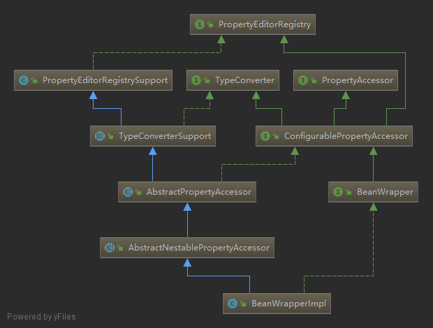


`AbstractPropertyAccessor`

```java
	public void setPropertyValues(PropertyValues pvs, boolean ignoreUnknown, boolean ignoreInvalid) throws BeansException {
        List<PropertyAccessException> propertyAccessExceptions = null;
        List<PropertyValue> propertyValues = pvs instanceof MutablePropertyValues ? ((MutablePropertyValues)pvs).getPropertyValueList() : Arrays.asList(pvs.getPropertyValues());
        Iterator var6 = propertyValues.iterator();

        while(var6.hasNext()) {
            PropertyValue pv = (PropertyValue)var6.next();

            try {
                this.setPropertyValue(pv);
            } catch (NotWritablePropertyException var9) {
                if (!ignoreUnknown) {
                    throw var9;
                }
            } catch (NullValueInNestedPathException var10) {
                if (!ignoreInvalid) {
                    throw var10;
                }
            } catch (PropertyAccessException var11) {
                if (propertyAccessExceptions == null) {
                    propertyAccessExceptions = new ArrayList();
                }

                propertyAccessExceptions.add(var11);
            }
        }

        if (propertyAccessExceptions != null) {
            PropertyAccessException[] paeArray = (PropertyAccessException[])propertyAccessExceptions.toArray(new PropertyAccessException[0]);
            throw new PropertyBatchUpdateException(paeArray);
        }
    }
```

其中的关键方法`this.setPropertyValue(pv);`方法在本类中是个抽象方法，具体实现是在`AbstractNestablePropertyAccessor`抽象类中


`AbstractNestablePropertyAccessor`

```java
 	public void setPropertyValue(String propertyName, @Nullable Object value) throws BeansException {
        AbstractNestablePropertyAccessor nestedPa;
        try {
            nestedPa = this.getPropertyAccessorForPropertyPath(propertyName);
        } catch (NotReadablePropertyException var5) {
            throw new NotWritablePropertyException(this.getRootClass(), this.nestedPath + propertyName, "Nested property in path '" + propertyName + "' does not exist", var5);
        }

        AbstractNestablePropertyAccessor.PropertyTokenHolder tokens = this.getPropertyNameTokens(this.getFinalPath(nestedPa, propertyName));
        nestedPa.setPropertyValue(tokens, new PropertyValue(propertyName, value));
    }


 protected void setPropertyValue(AbstractNestablePropertyAccessor.PropertyTokenHolder tokens, PropertyValue pv) throws BeansException {
        if (tokens.keys != null) {
            this.processKeyedProperty(tokens, pv);
        } else {
            this.processLocalProperty(tokens, pv);
        }

    }


private void processKeyedProperty(AbstractNestablePropertyAccessor.PropertyTokenHolder tokens, PropertyValue pv) {
        Object propValue = this.getPropertyHoldingValue(tokens);
        AbstractNestablePropertyAccessor.PropertyHandler ph = this.getLocalPropertyHandler(tokens.actualName);
        if (ph == null) {
            throw new InvalidPropertyException(this.getRootClass(), this.nestedPath + tokens.actualName, "No property handler found");
        } else {
            Assert.state(tokens.keys != null, "No token keys");
            String lastKey = tokens.keys[tokens.keys.length - 1];
            Class requiredType;
            Object convertedValue;
            Object newArray;
            if (propValue.getClass().isArray()) {
                requiredType = propValue.getClass().getComponentType();
                int arrayIndex = Integer.parseInt(lastKey);
                Object oldValue = null;

                try {
                    if (this.isExtractOldValueForEditor() && arrayIndex < Array.getLength(propValue)) {
                        oldValue = Array.get(propValue, arrayIndex);
                    }

                    convertedValue = this.convertIfNecessary(tokens.canonicalName, oldValue, pv.getValue(), requiredType, ph.nested(tokens.keys.length));
                    int length = Array.getLength(propValue);
                    if (arrayIndex >= length && arrayIndex < this.autoGrowCollectionLimit) {
                        Class<?> componentType = propValue.getClass().getComponentType();
                        newArray = Array.newInstance(componentType, arrayIndex + 1);
                        System.arraycopy(propValue, 0, newArray, 0, length);
                        this.setPropertyValue(tokens.actualName, newArray);
                        propValue = this.getPropertyValue(tokens.actualName);
                    }

                    Array.set(propValue, arrayIndex, convertedValue);
                } catch (IndexOutOfBoundsException var16) {
                    throw new InvalidPropertyException(this.getRootClass(), this.nestedPath + tokens.canonicalName, "Invalid array index in property path '" + tokens.canonicalName + "'", var16);
                }
            } else {
                Object convertedValue;
                if (propValue instanceof List) {
                    requiredType = ph.getCollectionType(tokens.keys.length);
                    List<Object> list = (List)propValue;
                    int index = Integer.parseInt(lastKey);
                    convertedValue = null;
                    if (this.isExtractOldValueForEditor() && index < list.size()) {
                        convertedValue = list.get(index);
                    }

                    convertedValue = this.convertIfNecessary(tokens.canonicalName, convertedValue, pv.getValue(), requiredType, ph.nested(tokens.keys.length));
                    int size = list.size();
                    if (index >= size && index < this.autoGrowCollectionLimit) {
                        for(int i = size; i < index; ++i) {
                            try {
                                list.add((Object)null);
                            } catch (NullPointerException var15) {
                                throw new InvalidPropertyException(this.getRootClass(), this.nestedPath + tokens.canonicalName, "Cannot set element with index " + index + " in List of size " + size + ", accessed using property path '" + tokens.canonicalName + "': List does not support filling up gaps with null elements");
                            }
                        }

                        list.add(convertedValue);
                    } else {
                        try {
                            list.set(index, convertedValue);
                        } catch (IndexOutOfBoundsException var14) {
                            throw new InvalidPropertyException(this.getRootClass(), this.nestedPath + tokens.canonicalName, "Invalid list index in property path '" + tokens.canonicalName + "'", var14);
                        }
                    }
                } else {
                    if (!(propValue instanceof Map)) {
                        throw new InvalidPropertyException(this.getRootClass(), this.nestedPath + tokens.canonicalName, "Property referenced in indexed property path '" + tokens.canonicalName + "' is neither an array nor a List nor a Map; returned value was [" + propValue + "]");
                    }

                    requiredType = ph.getMapKeyType(tokens.keys.length);
                    Class<?> mapValueType = ph.getMapValueType(tokens.keys.length);
                    Map<Object, Object> map = (Map)propValue;
                    TypeDescriptor typeDescriptor = TypeDescriptor.valueOf(requiredType);
                    convertedValue = this.convertIfNecessary((String)null, (Object)null, lastKey, requiredType, typeDescriptor);
                    Object oldValue = null;
                    if (this.isExtractOldValueForEditor()) {
                        oldValue = map.get(convertedValue);
                    }

                    newArray = this.convertIfNecessary(tokens.canonicalName, oldValue, pv.getValue(), mapValueType, ph.nested(tokens.keys.length));
                    map.put(convertedValue, newArray);
                }
            }

        }
    }


private void processLocalProperty(AbstractNestablePropertyAccessor.PropertyTokenHolder tokens, PropertyValue pv) {
        AbstractNestablePropertyAccessor.PropertyHandler ph = this.getLocalPropertyHandler(tokens.actualName);
        if (ph != null && ph.isWritable()) {
            Object oldValue = null;

            PropertyChangeEvent propertyChangeEvent;
            try {
                Object originalValue = pv.getValue();
                Object valueToApply = originalValue;
                if (!Boolean.FALSE.equals(pv.conversionNecessary)) {
                    if (pv.isConverted()) {
                        valueToApply = pv.getConvertedValue();
                    } else {
                        if (this.isExtractOldValueForEditor() && ph.isReadable()) {
                            try {
                                oldValue = ph.getValue();
                            } catch (Exception var8) {
                                Exception ex = var8;
                                if (var8 instanceof PrivilegedActionException) {
                                    ex = ((PrivilegedActionException)var8).getException();
                                }

                                if (logger.isDebugEnabled()) {
                                    logger.debug("Could not read previous value of property '" + this.nestedPath + tokens.canonicalName + "'", ex);
                                }
                            }
                        }

                        valueToApply = this.convertForProperty(tokens.canonicalName, oldValue, originalValue, ph.toTypeDescriptor());
                    }

                    pv.getOriginalPropertyValue().conversionNecessary = valueToApply != originalValue;
                }

                ph.setValue(valueToApply);
            } catch (TypeMismatchException var9) {
                throw var9;
            } catch (InvocationTargetException var10) {
                propertyChangeEvent = new PropertyChangeEvent(this.getRootInstance(), this.nestedPath + tokens.canonicalName, oldValue, pv.getValue());
                if (var10.getTargetException() instanceof ClassCastException) {
                    throw new TypeMismatchException(propertyChangeEvent, ph.getPropertyType(), var10.getTargetException());
                } else {
                    Throwable cause = var10.getTargetException();
                    if (cause instanceof UndeclaredThrowableException) {
                        cause = cause.getCause();
                    }

                    throw new MethodInvocationException(propertyChangeEvent, cause);
                }
            } catch (Exception var11) {
                propertyChangeEvent = new PropertyChangeEvent(this.getRootInstance(), this.nestedPath + tokens.canonicalName, oldValue, pv.getValue());
                throw new MethodInvocationException(propertyChangeEvent, var11);
            }
        } else if (pv.isOptional()) {
            if (logger.isDebugEnabled()) {
                logger.debug("Ignoring optional value for property '" + tokens.actualName + "' - property not found on bean class [" + this.getRootClass().getName() + "]");
            }

        } else {
            throw this.createNotWritablePropertyException(tokens.canonicalName);
        }
    }
```


通过上面注入依赖代码，我们已经明白了Spring IoC容器是如何将属性的值注入到Bean实例对象中去的：

1. 对于集合类型的属性，将其属性值解析为目标类型的集合后直接赋值给属性。

2. 对于非集合类型的属性，大量使用了JDK的反射和内省机制，通过属性的getter方法(reader method)获取指定属性注入以前的值，同时调用属性的setter方法(writer method)为属性设置注入后的值。


看到这里相信很多人都明白了Spring的setter注入原理。

至此Spring IoC容器对Bean定义资源文件的定位，载入、解析和依赖注入已经全部分析完毕，现在Spring IoC容器中管理了一系列靠依赖关系联系起来的Bean，程序不需要应用自己手动创建所需的对象，Spring IoC容器会在我们使用的时候自动为我们创建，并且为我们注入好相关的依赖，这就是Spring核心功能的控制反转和依赖注入的相关功能。


Spring IOC容器解析，基本摘抄至下面这个文章，只不过我在看源码时使用的版本是5.1.4.RELEASE版，多多少少有不一样。

[Spring：源码解读Spring IOC原理](https://www.cnblogs.com/ITtangtang/p/3978349.html)


## Bean的生命周期

思考一下Servlet的生命周期：实例化，初始init，接收请求service，销毁destroy；Spring上下文中的Bean也类似

1. 实例化一个Bean也就是我们常说的new；
2. 按照Spring上下文对实例化的Bean进行配置也就是IOC注入；

3. 如果这个Bean已经实现了BeanNameAware接口，会调用它实现的setBeanName(String)方法，此处传递的就是Spring配置文件中Bean的id值

4. 如果这个Bean已经实现了BeanFactoryAware接口，会调用它实现的setBeanFactory(setBeanFactory(BeanFactory)传递的是Spring工厂自身（可以用这个方式来获取其它Bean，只需在Spring配置文件中配置一个普通的Bean就可以）；

5. 如果这个Bean已经实现了ApplicationContextAware接口，会调用setApplicationContext(ApplicationContext)方法，传入Spring上下文（同样这个方式也可以实现步骤4的内容，但比4更好，因为ApplicationContext是BeanFactory的子接口，有更多的实现方法）；

6. 如果这个Bean关联了BeanPostProcessor接口，将会调用postProcessBeforeInitialization(Object  obj, String  s)方法，BeanPostProcessor经常被用作是Bean内容的更改，并且由于这个是在Bean初始化结束时调用那个的方法，也可以被应用于内存或缓存技术；

7. 如果Bean在Spring配置文件中配置了init-method属性会自动调用其配置的初始化方法。

8. 如果这个Bean关联了BeanPostProcessor接口，将会调用postProcessAfterInitialization(Object obj, String s)方法、；

    注：以上工作完成以后就可以应用这个Bean了，那这个Bean是一个Singleton的，所以一般情况下我们调用同一个id的Bean会是在内容地址相同的实例，当然在Spring配置文件中也可以配置非Singleton，这里我们不做赘述。

9. 当Bean不再需要时，会经过清理阶段，如果Bean实现了DisposableBean这个接口，会调用那个其实现的destroy()方法；

10. 最后，如果这个Bean的Spring配置中配置了destroy-method属性，会自动调用其配置的销毁方法。

 

以上10步骤可以作为面试或者笔试的模板，另外我们这里描述的是应用Spring上下文Bean的生命周期，如果应用Spring的工厂也就是BeanFactory的话去掉第5步就Ok了。

https://www.cnblogs.com/kenshinobiy/p/4652008.html 


## Bean的作用域

Spring容器中的bean可以分为5个范围。

- singleton：这种bean范围是默认的，这种范围确保不管接受到多少个请求，每个容器中只有一个bean的实例，单例的模式由bean factory自身来维护。
- prototype：原形范围与单例范围相反，为每一个bean请求提供一个实例。
- request：在请求bean范围内会每一个来自客户端的网络请求创建一个实例，在请求完成以后，bean会失效并被垃圾回收器回收。
- Session：与请求范围类似，确保每个session中有一个bean的实例，在session过期后，bean会随之失效。
- global-session：global-session和Portlet应用相关。当你的应用部署在Portlet容器中工作时，它包含很多portlet。如果你想要声明让所有的portlet共用全局的存储变量的话，那么这全局变量需要存储在global-session中。全局作用域与Servlet中的session作用域效果相同。


这里引申一个问题取至org.mybatis.spring.boot.autoconfigure中方法

```java
 	@Bean
    @ConditionalOnMissingBean
    public SqlSessionTemplate sqlSessionTemplate(SqlSessionFactory sqlSessionFactory) {
        ExecutorType executorType = this.properties.getExecutorType();
        return executorType != null ? new SqlSessionTemplate(sqlSessionFactory, executorType) : new SqlSessionTemplate(sqlSessionFactory);
    }
```


在mybatis进行自动装配的时候会先创建SqlSessionFactory，之后再创建SqlSessionTemplate。此时通过sqlSessionTemplate函数申明了一个bean。问题是此函数的参数sqlSessionFactory上没有任何标签如@autowired或者@Qualifier，为什么会被spring注入，又是在什么时候被注入？


为此查看@bean里发现了一个枚举。

```java
@Target({ElementType.METHOD, ElementType.ANNOTATION_TYPE})
@Retention(RetentionPolicy.RUNTIME)
@Documented
public @interface Bean {
    @AliasFor("name")
    String[] value() default {};

    @AliasFor("value")
    String[] name() default {};

    Autowire autowire() default Autowire.NO;

    String initMethod() default "";

    String destroyMethod() default "(inferred)";
}

public enum Autowire {
    NO(0),
    BY_NAME(1),
    BY_TYPE(2);
}
```

也就是说在生成这个bean的时候是不会把bean内部的值也随便注入的。嗯这个与上面的问题没有关系。


# AOP

**什么是AOP**

简单一句话概括：**在运行时，动态地将代码切入到类的指定方法、指定位置上的编程思想。**

上面的概括可以通俗的了解到什么是AOP，但是并**不严谨**，AOP不一定都在运行时生成代理对象来织入的，也可以在编译期，类加载期织入，这一点Spring AOP和AspectJ就不完全相同。


## 术语解释

**连接点（Joinpoint）**

Spring仅支持方法的连接点，即仅能在方法调用前、方法调用后、方法抛出异常时以及方法调用前后这些程序执行点织入通知。


**切点（Pointcut）**

切点就是定义了通知被应用的位置 （配合通知的方位信息，可以确定具体连接点），切点和连接点不是一对一的关系，一个切点可以匹配多个连接点。


**通知（Advice）**

Spring切面可以应用5种类型的通知：

​        前置通知（Before）：在目标方法被调用之前调用通知功能；

​        后置通知（After）：在目标方法完成之后调用通知，此时不会关心方法的输出是什么；

​        返回通知（After-returning）：在目标方法成功执行之后调用通知；

​        异常通知（After-throwing）：在目标方法抛出异常后调用通知；

​        环绕通知（Around）：通知包裹了被通知的方法，在被通知的方法调用之前和调用之后执行自定义的行为。

​        **通知就定义了，需要做什么，以及在某个连接点的什么时候做。 上面的切点定义了在哪里做。**


**目标对象（Target）**

通知逻辑的织入目标类。


**引介（Introduction）**

**织入（Weaving）**

织入是将通知添加对目标类具体连接点上的过程。

根据不同的实现技术，AOP有三种织入的方式：

​    a、编译期织入，这要求使用特殊的Java编译器。

​    b、类装载期织入，这要求使用特殊的类装载器。

​    c、动态代理织入，在运行期为目标类添加通知生成子类的方式。

**把切面应用到目标对象来创建新的代理对象的过程，Spring采用动态代理织入，而AspectJ采用编译期织入和类装载期织入。**


**代理（Proxy）**

个类被AOP织入通知后，就产出了一个结果类，它是融合了原类和通知逻辑的代理类


**切面（Aspect）**

切面由切点和通知组成，它既包括了横切逻辑的定义，也包括了连接点的定义，Spring AOP就是负责实施切面的框架，它将切面所定义的横切逻辑织入到切面所指定的连接点中。

**切点的通知的结合，切面知道所有它需要做的事：何时/何处/做什么**


[Spring - AOP简单理解及术语解释](https://www.jianshu.com/p/5015f212e4e4)


## 应用

比如事务，通知，aspectJ，slf4j的原理


# Spring 注解

## 原理

//todo


## 如何自定义注解

//todo


## @Autowired、@Controller、@Service

Spring MVC 解读——@Autowired、@Controller、@Service从原理层面来分析

[Spring MVC 解读——@Autowired、@Controller、@Service从原理层面来分析](https://blog.csdn.net/mack415858775/article/details/47721909)


# 事务 @Transactional 

1. Spring事务管理分为编码式和声明式的两种方式。
2. 编程式事务管理使用TransactionTemplate或者直接使用底层的PlatformTransactionManager。对于编程式事务管理，spring推荐使用TransactionTemplate。
3. 声明式事务管理建立在AOP之上的。其本质是对方法前后进行拦截，然后在目标方法开始之前创建或者加入一个事务，在执行完目标方法之后根据执行情况提交或者回滚事务。


> ## 注解方式的事务实现机制

​	在应用系统调用声明@Transactional 的目标方法时，Spring Framework 默认使用 AOP 代理，在代码运行时生成一个代理对象，根据@Transactional的属性配置信息，这个代理对象决定该声明@Transactional 的目标方法是否由拦截器 TransactionInterceptor 来使用拦截，在TransactionInterceptor 拦截时，会在在目标方法开始执行之前创建并加入事务，并执行目标方法的逻辑, 最后根据执行情况是否出现异常，利用抽象事务管理器AbstractPlatformTransactionManager 操作数据源 DataSource 提交或回滚事务。


Spring AOP 代理有 CglibAopProxy 和 JdkDynamicAopProxy 两种，图 1 是以 CglibAopProxy 为例，对于
CglibAopProxy，需要调用其内部类的 DynamicAdvisedInterceptor 的 intercept 方法。对于 JdkDynamicAopProxy，需要调用其 invoke 方法。

正如上文提到的，事务管理的框架是由抽象事务管理器 AbstractPlatformTransactionManager 来提供的，而具体的底层事务处理实现，由PlatformTransactionManager 的具体实现类来实现，如事务管理器 DataSourceTransactionManager。不同的事务管理器管理不同的数据资源DataSource，比如 DataSourceTransactionManager 管理 JDBC 的 Connection。

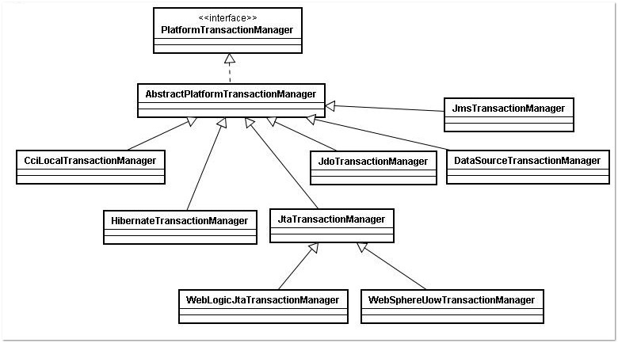


手动提交事务

```java
@Resource(name="transactionManager")
private DataSourceTransactionManager transactionManager;

DefaultTransactionDefinition transDefinition = new DefaultTransactionDefinition();
//开启新事物
transDefinition.setPropagationBehavior(DefaultTransactionDefinition.PROPAGATION_REQUIRES_NEW);
TransactionStatus transStatus = transactionManager.getTransaction(transDefinition);
try {
    //TODO
    transactionManager.commit(transStatus);
} catch (Exception e) {
    transactionManager.rollback(transStatus);
}
```


## 线程安全

Spring 的事务管理器是通过线程相关的 ThreadLocal 来保存数据访问基础设施，再结合 IOC 和 AOP 实现高级声明式事务的功能，所以spring的事务是线程安全的。

我们知道 Web 容器本身就是多线程的，Web 容器为一个 Http 请求创建一个独立的线程，所以由此请求所牵涉到的 Spring 容器中的 Bean 也是运行于多线程的环境下。在绝大多数情况下，Spring 的 Bean 都是单实例的（singleton），单实例 Bean 的最大的好处是线程无关性，不存在多线程并发访问的问题，也即是线程安全的。

一个类能够以单实例的方式运行的前提是“无状态”：即一个类不能拥有状态化的成员变量。我们知道，在传统的编程中，DAO 必须执有一个  Connection，而 **Connection 即是状态化的对象**。所以传统的 DAO 不能做成单实例的，每次要用时都必须 new  一个新的实例。传统的 Service 由于将有状态的 DAO 作为成员变量，所以传统的 Service 本身也是有状态的。

但是在  Spring 中，DAO 和 Service 都以单实例的方式存在。Spring 是通过 **ThreadLocal** 将有状态的变量（如  Connection 等）本地线程化，达到另一个层面上的“线程无关”，从而实现线程安全。Spring  不遗余力地将状态化的对象无状态化，就是要达到单实例化 Bean 的目的。

由于 Spring 已经通过 ThreadLocal  的设施将 Bean 无状态化，所以 Spring 中单实例 Bean 对线程安全问题拥有了一种天生的免疫能力。不但单实例的 Service  可以成功运行于多线程环境中，Service 本身还可以自由地启动独立线程以执行其它的 Service。


## 传播行为

Spring在`TransactionDefinition`接口中规定了7种类型的事务传播行为，它们规定了事务方法和事务方法发生嵌套调用时事务如何进行传播，即协调已经有事务标识的方法之间的发生调用时的事务上下文的规则（是否要有独立的事务隔离级别和锁）

| 事务传播行为类型          | 说明                                                         |
| ------------------------- | ------------------------------------------------------------ |
| PROPAGATION_REQUIRED      | 如果当前没有事务，就新建一个事务，如果已经存在一个事务中，加入到这个事务中。这是最常见的选择。 |
| PROPAGATION_SUPPORTS      | 支持当前事务，如果当前没有事务，就以非事务方式执行。         |
| PROPAGATION_MANDATORY     | 使用当前的事务，如果当前没有事务，就抛出异常。               |
| PROPAGATION_REQUIRES_NEW  | 新建事务，如果当前存在事务，把当前事务挂起。                 |
| PROPAGATION_NOT_SUPPORTED | 以非事务方式执行操作，如果当前存在事务，就把当前事务挂起。   |
| PROPAGATION_NEVER         | 以非事务方式执行，如果当前存在事务，则抛出异常。             |
| PROPAGATION_NESTED        | 如果当前存在事务，则在嵌套事务内执行。如果当前没有事务，则执行与PROPAGATION_REQUIRED类似的操作。 |


嵌套事务：即通过创建Savepoint实现嵌套事务，达到内层事务若抛出异常(unchecked exception)则回滚到savepoint处，但不影响外层事务；外层事务的回滚会一起回滚内层事务；


## 隔离级别

TransactionDefinition 接口中定义了五个表示隔离级别的常量：

- **TransactionDefinition.ISOLATION_DEFAULT:**  使用后端数据库默认的隔离级别，Mysql 默认采用的 REPEATABLE_READ隔离级别 Oracle 默认采用的 READ_COMMITTED隔离级别.
- **TransactionDefinition.ISOLATION_READ_UNCOMMITTED:** 最低的隔离级别，允许读取尚未提交的数据变更，可能会导致脏读、幻读或不可重复读
- **TransactionDefinition.ISOLATION_READ_COMMITTED:**   允许读取并发事务已经提交的数据，可以阻止脏读，但是幻读或不可重复读仍有可能发生
- **TransactionDefinition.ISOLATION_REPEATABLE_READ:**  对同一字段的多次读取结果都是一致的，除非数据是被本身事务自己所修改，可以阻止脏读和不可重复读，但幻读仍有可能发生。
- **TransactionDefinition.ISOLATION_SERIALIZABLE:**   最高的隔离级别，完全服从ACID的隔离级别。所有的事务依次逐个执行，这样事务之间就完全不可能产生干扰，也就是说，该级别可以防止脏读、不可重复读以及幻读。但是这将严重影响程序的性能。通常情况下也不会用到该级别。


## 注意事项

1. **propagation** 属性的设置。

   1.1 TransactionDefinition.PROPAGATION_SUPPORTS：如果当前存在事务，则加入该事务；如果当前没有事务，则以非事务的方式继续运行。

   1.2 TransactionDefinition.PROPAGATION_NOT_SUPPORTED：以非事务方式运行，如果当前存在事务，则把当前事务挂起。

   1.3 TransactionDefinition.PROPAGATION_NEVER：以非事务方式运行，如果当前存在事务，则抛出异常

2. **rollbackFor** 属性的设置。

   默认情况下，如果在事务中抛出了未检查异常（继承自 RuntimeException 的异常）或者 Error，则 Spring 将回滚事务；除此之外，Spring 不会回滚事务。

   如果在事务中抛出其他类型的异常，并期望 Spring 能够回滚事务，可以指定 rollbackFor。org.springframework.transaction.interceptor.RollbackRuleAttribute#getDepth(java.lang.Class<?>, int)里具体实现了回滚规则。

   ```java
   private int getDepth(Class<?> exceptionClass, int depth) {
           if (exceptionClass.getName().contains(this.exceptionName)) {
               // Found it!
               return depth;
   }
           // If we've gone as far as we can go and haven't found it...
           if (exceptionClass == Throwable.class) {
               return -1;
   }
   return getDepth(exceptionClass.getSuperclass(), depth + 1);
   }
   ```

3. @Transactional  **只能应用到 public 方法才有效**。

   只有@Transactional 注解应用到 public 方法，才能进行事务管理。这是因为在使用 Spring AOP 代理时，Spring 在调用在图 1 中的TransactionInterceptor 在目标方法执行前后进行拦截之前，DynamicAdvisedInterceptor（CglibAopProxy 的内部类）的的 intercept方法或 JdkDynamicAopProxy 的 invoke 方法会间接调用 AbstractFallbackTransactionAttributeSource的 computeTransactionAttribute 方法。

   ```java
   protected TransactionAttribute computeTransactionAttribute(Method method,
       Class<?> targetClass) {
           // Don't allow no-public methods as required.
           if (allowPublicMethodsOnly() && !Modifier.isPublic(method.getModifiers())) {
   return null;}
   ```

4. **避免Spring的AOP的自调用问题**

   在 Spring 的 AOP 代理下，只有目标方法由外部调用，目标方法才由 Spring 生成的代理对象来管理，这会造成自调用问题。若同一类中的其他没有@Transactional注解的方法内部调用有@Transactional 注解的方法，有@Transactional 注解的方法的事务被忽略，不会发生回滚。

   ```java
   @Service
   public class OrderService {
       private void insert() {
       	insertOrder();
       }
       
   	@Transactional
       public void insertOrder() {
           //insert log info
           //insertOrder
           //updateAccount
       }
   }
   ```


[spring 官方 Data Access version 5.1.2.RELEASE](https://docs.spring.io/spring/docs/5.1.2.RELEASE/spring-framework-reference/data-access.html#spring-data-tier)

[透彻的掌握 Spring 中@transactional 的使用](https://www.ibm.com/developerworks/cn/java/j-master-spring-transactional-use/index.html?mhq=Spring%20%20%E4%BA%8B%E5%8A%A1&mhsrc=ibmsearch_a)

[spring声明式事务 同一类内方法调用事务失效](https://www.cnblogs.com/softidea/p/5962597.html)

[Spring @Transactional踩坑记](https://www.cnblogs.com/Kidezyq/p/8541199.html)

[spring的@Transactional注解详细用法](https://www.cnblogs.com/yepei/p/4716112.html)


# MVC


步骤：

- 1.发起请求到前端控制器(`DispatcherServlet`)
- 2.前端控制器请求处理器映射器(`HandlerMapping`)查找`Handler`(可根据xml配置、注解进行查找)
- 3.处理器映射器(`HandlerMapping`)向前端控制器返回`Handler`
- 4.前端控制器调用处理器适配器(`HandlerAdapter`)执行`Handler`
- 5.处理器适配器(HandlerAdapter)去执行Handler
- 6.Handler执行完，给适配器返回ModelAndView(Springmvc框架的一个底层对象)
- 7.处理器适配器(`HandlerAdapter`)向前端控制器返回`ModelAndView`
- 8.前端控制器(`DispatcherServlet`)请求视图解析器(`ViewResolver`)进行视图解析，根据逻辑视图名解析成真正的视图(jsp)
- 9.视图解析器(ViewResolver)向前端控制器(`DispatcherServlet`)返回View
- 10.前端控制器进行视图渲染，即将模型数据(在`ModelAndView`对象中)填充到request域
- 11.前端控制器向用户响应结果


# 常见面试题

> ## Beanfactory 和 Factory bean

- BeanFactory 指的是 IOC 容器的编程抽象，比如 ApplicationContext， XmlBeanFactory 等，这些都是 IOC 容器的具体表现，需要使用什么样的容器由客户决定，但 Spring 为我们提供了丰富的选择。
- FactoryBean 只是一个可以在 IOC而容器中被管理的一个 bean,是对各种处理过程和资源使用的抽象，Factory bean 在需要时产生另一个对象，而不返回 FactoryBean本身,我们可以把它看成是一个抽象工厂，对它的调用返回的是工厂生产的产品。所有的 Factory bean 都实现特殊的org.springframework.beans.factory.FactoryBean 接口，当使用容器中 factory bean 的时候，该容器不会返回 factory bean 本身，而是返回其生成的对象。


> ## BeanFactory和ApplicationContext有什么区别？

- BeanFactory 可以理解为含有bean集合的工厂类。BeanFactory 包含了种bean的定义，以便在接收到客户端请求时将对应的bean实例化。
- BeanFactory还能在实例化对象的时生成协作类之间的关系。此举将bean自身与bean客户端的配置中解放出来。BeanFactory还包含了bean生命周期的控制，调用客户端的初始化方法（initialization  methods）和销毁方法（destruction methods）。

从表面上看，application context如同bean factory一样具有bean定义、bean关联关系的设置，根据请求分发bean的功能。但application context在此基础上还提供了其他的功能。

- 提供了支持国际化的文本消息
- 统一的资源文件读取方式
- 已在监听器中注册的bean的事件


-----------------

- ApplicationContext 接口继承BeanFactory接口，Spring核心工厂是BeanFactory ,BeanFactory采取延迟加载，第一次getBean时才会初始化Bean, ApplicationContext是会在加载配置文件时初始化Bean。

- ApplicationContext是对BeanFactory扩展，它可以进行国际化处理、事件传递和bean自动装配以及各种不同应用层的Context实现 

  开发中基本都在使用ApplicationContext, web项目使用WebApplicationContext ，很少用到BeanFactory 


> ## spring配置bean实例化有哪些方式？

​    1）使用类构造器实例化(默认无参数)

```
<bean id="bean1" class="cn.itcast.spring.b_instance.Bean1"></bean>
```

​    2）使用静态工厂方法实例化(简单工厂模式) 

```
//下面这段配置的含义：调用Bean2Factory的getBean2方法得到bean2
<bean id="bean2" class="cn.itcast.spring.b_instance.Bean2Factory" factory-method="getBean2"></bean>
```

​    3）使用实例工厂方法实例化(工厂方法模式) 

```
//先创建工厂实例bean3Facory，再通过工厂实例创建目标bean实例
<bean id="bean3Factory" class="cn.itcast.spring.b_instance.Bean3Factory"></bean>
<bean id="bean3" factory-bean="bean3Factory" factory-method="getBean3"></bean>
```


> ## bean属性的注入方式

1. 属性注入setter
2. 构造函数注入
3. 接口注入


> ## Spring的核心类有哪些，各有什么作用？

BeanFactory：产生一个新的实例，可以实现单例模式

BeanWrapper：提供统一的get及set方法

ApplicationContext:提供框架的实现，包括BeanFactory的所有功能

[69道Spring面试题和答案](http://www.importnew.com/19538.html)


> ## Spring的AOP拦截private方法

**原因**：因为aop底层是代理

- jdk是代理接口，私有方法必然不会存在在接口里，所以就不会被拦截到；
- cglib是子类，private的方法照样不会出现在子类里，子类无法覆盖，也不能被拦截。


在Spring使用纯Spring AOP（只能拦截public/protected/包），包级别能被拦截的原因是，如果子类和父类在同一个包中是能覆盖的。

如果想要实现拦截private方法的 可以使用原生AspectJ 编译期/运行期织入。


**同时需要注意**

- 无法通知（advise）final方法，因为他们不能被覆写。

- 代理对象的构造器会被调用两次。因为在CGLIB代理模式下每一个代理对象都会 产生一个子类。每一个代理实例会生成两个对象：实际代理对象和它的一个实现了通知的子类实例 而是用JDK代理时不会出现这样的行为。通常情况下，调用代理类型的构造器两次并不是问题， 因为除了会发生指派外没有任何真正的逻辑被实现。

- CGLib的效率没有使用JDK代理机制高，速度平均要慢8倍左右。

  

  [关于spring的aop拦截的问题 protected方法代理问题](https://www.cnblogs.com/protected/p/6652188.html)

  [【知识库】--spring aop 动态代理--inner private protected 方法失效（212）](https://blog.csdn.net/qfzhangwei/article/details/72784348)


> #### Spring循环依赖的三种方式

Spring容器会将每一个正在创建的Bean 标识符放在一个“当前创建Bean池”中，Bean标识符在创建过程中将一直保持在这个池中。

因此如果在创建Bean过程中发现自己已经在“当前创建Bean池”里时将抛出BeanCurrentlyInCreationException异常表示循环依赖；而对于创建完毕的Bean将从“当前创建Bean池”中清除掉。


bean几种常见的实例化方式：

第一种：构造器参数循环依赖。一般是无解，直接抛出异常。

第二种：setter方式单例，默认方式。

从bean的实例化流程中可知，Spring是先将Bean对象实例化之后再设置对象属性的。Spring先是用构造函数实例化Bean对象 ，此时Spring会将这个实例化结束的对象放到一个Map中，并且Spring提供了获取这个未设置属性的实例化对象引用的方法。 

第三种：setter方式原型，prototype。

原型模式就报错了呢，对于“prototype”作用域Bean，Spring容器无法完成依赖注入，因为“prototype”作用域的Bean，Spring容器不进行缓存，因此无法提前暴露一个创建中的Bean。


[面试必问：Spring循环依赖的三种方式](https://mp.weixin.qq.com/s/hoTBijL1mG0uFM39zDtYMA)


>  #### Spring 如何保证 Controller 并发的安全？

默认bean是单例的，非线程安全。

**那有没有办法让Controller不以单例而以每次请求都重新创建的形式存在呢？**
答案是当然可以，只需要在类上添加注解@Scope("prototype")即可，这样每次请求调用的类都是重新生成的（每次生成会影响效率）使用**ThreadLocal**来保存类变量，将类变量保存在线程的变量域中，让不同的请求隔离开来。虽然这样可以解决问题，但增加了时间成本，


> #### spring 自动装配 bean 有哪些方式？


XML

注解：@Autowired默认按类型装配

- no：不进行自动装配，手动设置Bean的依赖关系。
- byName：根据Bean的名字进行自动装配。
- byType：根据Bean的类型进行自动装配。
- constructor：类似于byType，不过是应用于构造器的参数，如果正好有一个Bean与构造器的参数类型相同则可以自动装配，否则会导致错误。
- autodetect：如果有默认的构造器，则通过constructor的方式进行自动装配，否则使用byType的方式进行自动装配。


@Resource这是javaEE的


> #### 容器个数，sprong容器启动后有什么方法来进行配置