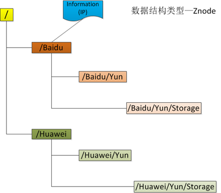
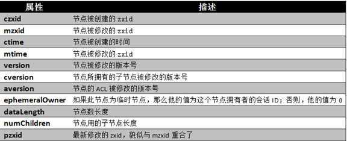
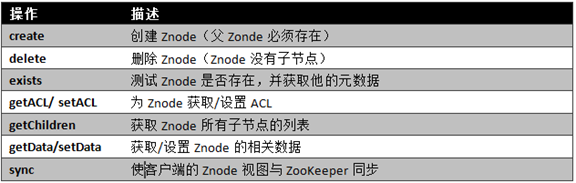
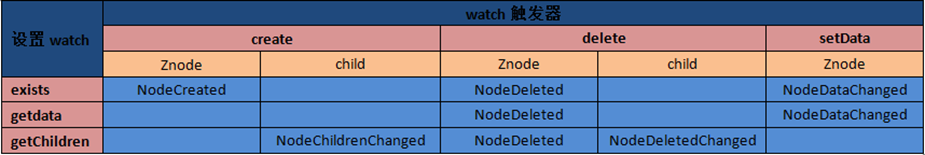
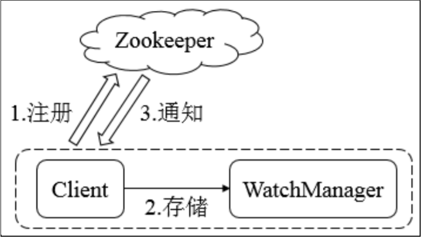
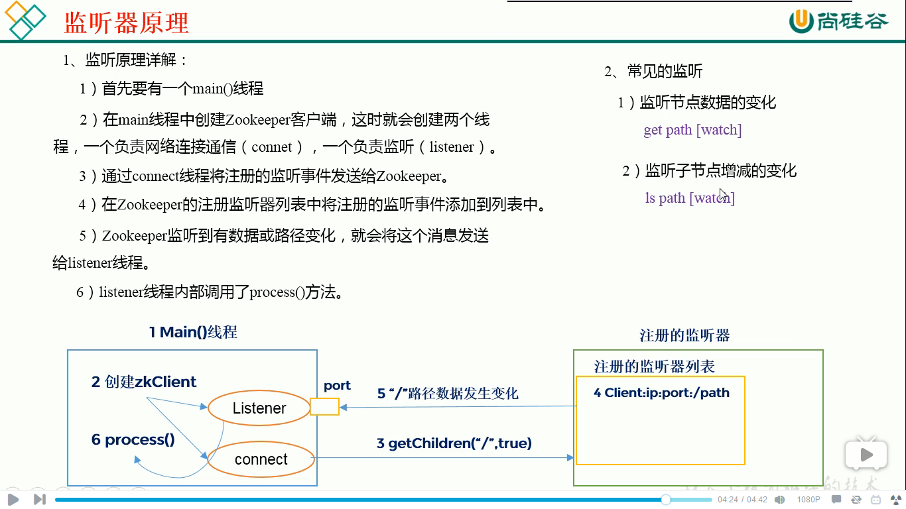
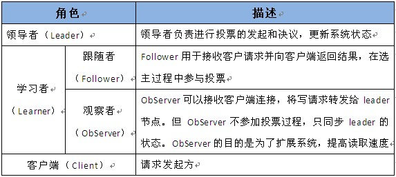
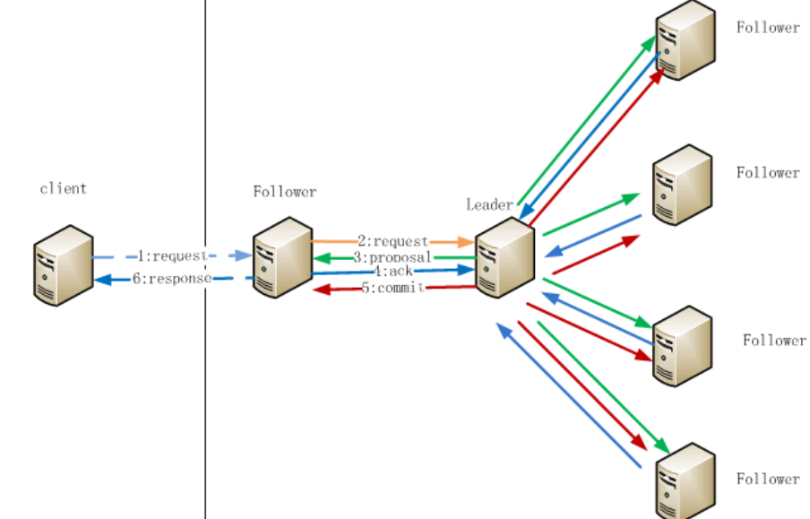

# 综述

基本上来自这个系列

[Zookeeper学习之路 （一）初识](https://www.cnblogs.com/qingyunzong/p/8618965.html)


视频教程

[尚硅谷大数据之Zookeeper](https://www.bilibili.com/video/av32093417/?p=14)


# 数据模型Znode

树形层次结构，ZooKeeper树中的每个节点被称为—Znode，并且其有一个唯一的路径标识。



- **引用方式**

  Zonde通过**路径引用**。**路径必须是绝对的，因此他们必须由斜杠字符来开头。**除此以外，他们必须是唯一的，也就是说每一个路径只有一个表示，因此这些路径不能改变。

- **Znode结构**

  每个**Znode由3部分组成**

  1. stat：此为状态信息，描述该Znode的版本，权限等信息。
  2. data：与该Znode关联的数据
  3. children：该Znode下的子节点

  每个Znode的数据大小至多1M，但常规使用中应该远小于此值。

- **数据访问**

  ZooKeeper中的每个节点存储的数据要被**原子性的操作**。也就是说读操作将获取与节点相关的所有数据，写操作也将替换掉节点的所有数据。另外，每一个节点都拥有自己的ACL(访问控制列表)，这个列表规定了用户的权限，即限定了特定用户对目标节点可以执行的操作。

- **节点类型**

  ZooKeeper中的节点有两种，分别为**临时节点**和**永久节点**。节点的类型在**创建时即被确定**，并且**不能改变**。

  - **临时节点**

    该节点的生命周期依赖于创建它们的会话。一旦会话(Session)结束，临时节点将被自动删除，当然可以也可以手动删除。虽然每个临时的Znode都会绑定到一个客户端会话，但他们对所有的客户端还是可见的。另外，ZooKeeper的临时节点不允许拥有子节点。

  - **永久节点**

    该节点的生命周期不依赖于会话，并且只有在客户端显示执行删除操作的时候，他们才能被删除。

- **计数**

  当创建Znode的时候，用户可以请求在ZooKeeper的路径结尾添加一个**递增的计数**。这个计数**对于此节点的父节点来说**是唯一的

- **节点属性**

   

   ZooKeeper节点状态改变的每一个操作都将使节点接收到一个Zxid格式的时间戳，并且这个时间戳全局有序。也就是说，每个对节点的改变都将产生一个唯一的Zxid。

   实现中Zxid是一个64位的数字，它高32位是epoch用来标识leader关系是否改变，每次一个leader被选出来，它都会有一个新的epoch。低32位是个**递增计数**。

   对节点的每一个操作都将致使这个节点的版本号增加。每个节点维护着三个版本号，他们分别为：

   **① version**：节点数据版本号
   **② cversion**：子节点版本号
   **③ aversion**：节点所拥有的ACL(访问控制列表)版本号

- **操作**

   

   - 更新ZooKeeper操作是有限制的。delete或setData必须明确要更新的Znode的版本号，我们可以调用exists找到。如果版本号不匹配，更新将会失败。

   - 更新ZooKeeper操作是非阻塞式的。因此客户端如果失去了一个更新(由于另一个进程在同时更新这个Znode)，他可以在不阻塞其他进程执行的情况下，选择重新尝试或进行其他操作。


shell脚本操作

```shell
//连接
[hadoop@hadoop1 ~]$ zkCli.sh -server hadoop2:2181
Connecting to hadoop2:2181

//查看
[zk: hadoop2:2181(CONNECTED) 1] ls /
[zookeeper]
[zk: hadoop2:2181(CONNECTED) 2] 

//创建一个节点"aa"，默认是不带编号的
[zk: hadoop2:2181(CONNECTED) 2] create /aa "my first zk"
Created /aa
[zk: hadoop2:2181(CONNECTED) 3] 

//创建带编号的持久性节点"bb"
[zk: localhost:2181(CONNECTED) 1] create -s /bb "bb"
Created /bb0000000001
[zk: localhost:2181(CONNECTED) 2] 

//创建不带编号的临时节点"cc"
[zk: localhost:2181(CONNECTED) 2] create -e /cc "cc"
Created /cc
[zk: localhost:2181(CONNECTED) 3] 

//创建带编号的临时节点"dd"
[zk: localhost:2181(CONNECTED) 3] create -s -e /dd "dd"
Created /dd0000000003
[zk: localhost:2181(CONNECTED) 4] 

//查看 /aa结点
[zk: hadoop2:2181(CONNECTED) 4] get /aa
my first zk
cZxid = 0x100000002
ctime = Wed Mar 21 20:01:02 CST 2018
mZxid = 0x100000002
mtime = Wed Mar 21 20:01:02 CST 2018
pZxid = 0x100000002
cversion = 0
dataVersion = 0
aclVersion = 0
ephemeralOwner = 0x0
dataLength = 11
numChildren = 0
[zk: hadoop2:2181(CONNECTED) 5]

//设置 /aa结点
[zk: hadoop2:2181(CONNECTED) 6] set /aa haha123 
cZxid = 0x100000002
ctime = Wed Mar 21 20:01:02 CST 2018
mZxid = 0x100000004
mtime = Wed Mar 21 20:04:10 CST 2018
pZxid = 0x100000002
cversion = 0
dataVersion = 1
aclVersion = 0
ephemeralOwner = 0x0
dataLength = 7
numChildren = 0
[zk: hadoop2:2181(CONNECTED) 7]

//删除
[zk: hadoop2:2181(CONNECTED) 8] delete /aa
[zk: hadoop2:2181(CONNECTED) 9] 

//退出
[zk: hadoop2:2181(CONNECTED) 10] quit

//查看文件的状态信息
[zk: localhost:2181(CONNECTED) 1] stat /a
cZxid = 0x200000009
ctime = Thu Mar 22 13:07:19 CST 2018
mZxid = 0x200000009
mtime = Thu Mar 22 13:07:19 CST 2018
pZxid = 0x200000009
cversion = 0
dataVersion = 0
aclVersion = 0
ephemeralOwner = 0x0
dataLength = 1
numChildren = 0
[zk: localhost:2181(CONNECTED) 2]
```


java api

```java
public class ZKDemo {
    
    private static final String CONNECT_STRING ="hadoop1:2181,hadoop2:2181,hadoop3:2181";
    //如果zookeeper使用的是默认端口的话，此处可以省略端口号
    //private static final String CONNECT_STRING = "hadoop1,hadoop2,hadoop3";
    
    //设置超时时间
    private static final int SESSION_TIMEOUT = 5000;
    
    public static void main(String[] args) throws Exception {
        //获取zookeeper的连接
        //没有配置监听的话，最后一个参数设为null
        ZooKeeper zk = new ZooKeeper(CONNECT_STRING, SESSION_TIMEOUT, null);
        
        //创建一个节点
        /**
         * 四个参数path, data, acl, createMode
         * path:创建节点的绝对路径
         * data：节点存储的数据
         * acl:权限控制
         * createMode：节点的类型----永久、临时    有编号的、没有编号的
         * 
         * */
        String create = zk.create("/xx", "xx".getBytes(), Ids.OPEN_ACL_UNSAFE, CreateMode.PERSISTENT_SEQUENTIAL);
        System.out.println(create);//输出的结果是：/xx0000000008
        
        /**
         * 判断节点是否存在
         * */
        Stat exists = zk.exists("/xx0000000008", null);
        if(exists == null) {
            System.out.println("节点不存在");
        }else {
            System.out.println("节点存在");
        }
        
        /**
         * 查看节点的数据
         * 
         * */
        byte[] data = zk.getData("/xx0000000008", false, null);
        System.out.println(new String(data));  
        
        /**
         * 修改节点的数据
         * */
        Stat setData = zk.setData("/xx0000000008", "xyz".getBytes(), -1);
        if(setData == null) {
            System.out.println("节点不存在 --- 修改不成功");
        }else {
            System.out.println("节点存在 --- 修改成功");
        }
        
        /**
         * 删除节点
         * */
        zk.delete("/xx0000000008", -1);
        
        //关闭zookeeper的连接
        zk.close();
    }
}


```


# 监听机制

## 概述

ZooKeeper可以为所有的**读操作**设置watch，这些读操作包括：exists()、getChildren()及getData()。watch事件是**一次性的触发器**，当watch的对象状态发生改变时，将会触发此对象上watch所对应的事件。watch事件将被**异步**地发送给客户端，并且ZooKeeper为watch机制提供了有序的**一致性保证**。理论上，客户端接收watch事件的时间要快于其看到watch对象状态变化的时间。


## 类型

ZooKeeper所管理的watch可以分为两类：

1. 数据watch(data  watches)：**getData**和**exists**负责设置数据watch

2. 孩子watch(child watches)：**getChildren**负责设置孩子watch


**watch注册与处触发**



1. exists操作上的watch，在被监视的Znode**创建**、**删除**或**数据更新**时被触发。
2. getData操作上的watch，在被监视的Znode**删除**或**数据更新**时被触发。在被创建时不能被触发，因为只有Znode一定存在，getData操作才会成功。
3. getChildren操作上的watch，在被监视的Znode的子节点**创建**或**删除**，或是这个Znode自身被**删除**时被触发。可以通过查看watch事件类型来区分是Znode，还是他的子节点被删除：NodeDelete表示Znode被删除，NodeDeletedChanged表示子节点被删除。

Watch由客户端所连接的ZooKeeper服务器在本地维护。当客户端连接到一个新的服务器时，任何的会话事件都将可能触发watch。另外，当从服务器断开连接的时候，watch将不会被接收。但是，当一个客户端重新建立连接的时候，任何先前注册过的watch都会被重新注册。


//todo watch操作是不是会失败，通知失败是否有重试操作？ 还需要补充监听代码


## 监听原理

ZooKeeper 的 Watcher 机制主要包括**客户端线程、客户端 WatcherManager、Zookeeper 服务器**三部分。客户端在向 ZooKeeper 服务器注册的同时，会将 Watcher 对象存储在客户端的 WatcherManager 当中。当 ZooKeeper 服务器触发 Watcher 事件后，会向客户端发送通知， 客户端线程从 WatcherManager 中取出对应的 Watcher 对象来执行回调逻辑。






```java
public class ZKDemo {
    private static final String CONNECT_STRING = "hadoop1,hadoop2,hadoop3";
    private static final int SESSION_TIMEOUT = 5000;
    
    public static void main(String[] args) throws Exception {
        // 获取连接
        // 当前的这个匿名内部类不是已经添加好的监听， 以后只要是当前这个zk对象添加了任何的监听器响应了之后，都会调用这个process方法
        ZooKeeper zk = new ZooKeeper(CONNECT_STRING, SESSION_TIMEOUT, new Watcher() {
            @Override
            public void process(WatchedEvent event) {          
                KeeperState state = event.getState();
                String path = event.getPath();
                EventType type = event.getType(); 
                System.out.println(state+"\t"+path+"\t"+type);
            }
        });
        
        /**
         * 注册监听
         * 第二个参数有三种传法：
         * 1、false, 表示不使用监听器
         * 2、watcher对象， 表示当前的这次监听如果响应不了的话，就会回调当前这个watcher的process方法
         * 3、true,  表示如果当前的会话/zk 所注册或者添加的所有的监听器的响应，都会会调用 获取连接时  初始化的 监听器对象中 的 process 方法
         */
        zk.getData("/a/c", true, null);
        Thread.sleep(5000);  
        zk.setData("/a/c", "hehe666".getBytes(), -1);
        zk.close();
    }
}
```


# 持久化

1. `内存数据`与`磁盘数据`间的关系：

   - 内存数据，是真正提供服务的数据
   - 磁盘数据，作用：
     - 恢复内存数据，恢复现场
     - 数据同步：集群内，不同节点间的数据同步（另，内存中的提议缓存队列 proposals）
     - 磁盘数据，为什么同时包含：快照、事务日志？出于数据粒度的考虑
       - 如果只包含快照，那恢复现场的时候，会有数据丢失，因为生成快照的时间间隔太大，即，快照的粒度太粗了
       - 事务日志，针对每条提交的事务都会 flush 到磁盘，因此粒度很细，恢复现场时，能够恢复到事务粒度上

2. 快照生成的时机：基于阈值，引入随机因素

   - 解决的关键问题：避免所有节点同时 dump snapshot，因为 dump snapshot 耗费大量的 磁盘 IO、CPU，所有节点同时 dump 会严重影响集群的对外服务能力

   - `countLog > snapCount/2 + randRoll`，其中：
     - countLog 为累计执行事务个数
     - snapCount 为配置的阈值
     - randRoll 为随机因素（取值：0～snapCount/2）

3. ZK 的 快照文件是 Fuzzy 快照，不是精确到某一时刻的快照，而是某一时间段内的快照

   - ZK 使用「异步线程」生成快照：
     - 线程之间共享内存空间，导致 Fuzzy 快照
     - 这就要求 ZK 的所有事务操作是幂等的，否则产生数据不一致的问题
     - 实际上 ZK 的所有操作都是幂等的
   - 类比：Redis 中使用「异步进程」生成快照 RDB（Redis Dump Binary）
     - RDB 文件是精确的快照，原因：进程之间内存空间隔离
     - 系统内核使用「写时复制」（Copy-On-Write）技术，节省大量内存空间


# 集群

## 角色




- 每个Server在工作过程中有三种状态：
  - LOOKING：当前Server不知道leader是谁，正在搜寻
  - LEADING：当前Server即为选举出来的leader
  - FOLLOWING：leader已经选举出来，当前Server与之同步

　　其他文档：http://www.cnblogs.com/lpshou/archive/2013/06/14/3136738.html


[Zookeeper 3、Zookeeper工作原理（详细）](https://www.cnblogs.com/raphael5200/p/5285583.html)


##  数据操作流程




1. 在Client向Follwer1发出一个写的请求

2. Follwer1把请求发送给Leader

3. Leader接收到以后开始发起投票并通知Follwer进行投票，也就是将写请求广播给各个Server，比如Server1和Server2， 各个Server写成功后就会通知Leader。

4. Follwer把投票结果发送给Leader

5. Leader将结果汇总后如果需要写入，也就是当Leader收到大多数 Server 数据写成功了，那么就说明数据写成功了，则开始写入，同时把写入操作通知给Follower1，然后commit;

6. Follwer1把请求结果返回给Client，这时就认为整个写操作成功。


 Follower主要有四个功能：

　　1. 向Leader发送请求（PING消息、REQUEST消息、ACK消息、REVALIDATE消息）；

2. 接收Leader消息并进行处理；

3. 接收Client的请求，如果为写请求，发送给Leader进行投票；

4. 返回Client结果。

Follower的消息循环处理如下几种来自Leader的消息：

1. PING消息： 心跳消息；

2. PROPOSAL消息：Leader发起的提案，要求Follower投票；

3. COMMIT消息：服务器端最新一次提案的信息；

4. UPTODATE消息：表明同步完成；

5. REVALIDATE消息：根据Leader的REVALIDATE结果，关闭待revalidate的session还是允许其接受消息；

6. SYNC消息：返回SYNC结果到客户端，这个消息最初由客户端发起，用来强制得到最新的更新。


## Paxos 算法概述（ZAB 协议） 

ZooKeeper 的选举算法有两种：一种是基于 **Basic Paxos**（Google Chubby 采用）实现的，另外 一种是基于 **Fast Paxos**（ZooKeeper 采用）算法实现的。系统默认的选举算法为 Fast Paxos。 并且 ZooKeeper 在 3.4.0 版本后只保留了 FastLeaderElection 算法。

ZooKeeper 的核心是原子广播，这个机制保证了各个 Server 之间的同步。实现这个机制的协议叫做 ZAB 协议（Zookeeper Atomic BrodCast）。ZAB 协议有两种模式，它们分别是**崩溃恢复模式（选主）和原子广播模式（同步）**。

　　1. 当服务启动或者在领导者崩溃后，ZAB 就进入了恢复模式，当领导者被选举出来，且大多数 Server 完成了和 leader 的状态同步以后，恢复模式就结束了。状态同步保证了 leader 和 follower 之间具有相同的系统状态。

 　   2. 当 ZooKeeper集群选举出 leader同步完状态退出恢复模式之后，便进入了原子广播模式。所有的写请求都被转发给 leader，再由 leader 将更新 proposal广播给 follower。

 　　为了保证事务的顺序一致性，zookeeper 采用了递增的事务 id 号（zxid）来标识事务。所有的提议（proposal）都在被提出的时候加上了 zxid。实现中 zxid 是一个 64 位的数字，它高 32 位是 epoch 用来标识  leader 关系是否改变，每次一个 leader 被选出来，它都会有一个新 的 epoch，标识当前属于那个 leader 的统治时期。低  32 位用于递增计数。　　

以下是 Basic Paxos 流程：

> 1、选举线程由当前 Server 发起选举的线程担任，其主要功能是对投票结果进行统计，并选出推荐的Server 
>
> 2、选举线程首先向所有 Server 发起一次询问(包括自己) 
>
> 3、选举线程收到回复后，验证是否是自己发起的询问(验证 zxid 是否一致)，然后获取对方 的  serverid(myid)，并存储到当前询问对象列表中，最后获取对方提议的 leader 相关信息  (serverid,zxid)，并将这些信息存储到当次选举的投票记录表中 
>
> 4、收到所有 Server 回复以后，就计算出 id 最大的那个 Server，并将这个 Server 相关信息设 置成下一次要投票的 Server 
>
> 5、线程将当前 id 最大的 Server 设置为当前 Server 要推荐的 Leader，如果此时获胜的 Server 获得 n/2 +  1 的 Server 票数， 设置当前推荐的 leader 为获胜的 Server，将根据获胜的 Server  相关信息设置自己的状态，否则，继续这个过程，直到 leader 被选举出来。

 　　通过流程分析我们可以得出：要使 Leader 获得多数 Server 的支持，则 Server 总数必须是奇 数 2n+1，且存活的  Server 的数目不得少于 n+1。 每个 Server 启动后都会重复以上流程。在恢复模式下，如果是刚从崩溃状态恢复的或者刚 启动的  server 还会从磁盘快照中恢复数据和会话信息，zk 会记录事务日志并定期进行快照， 方便在恢复时进行状态恢复。 Fast Paxos  流程是在选举过程中，某 Server 首先向所有 Server 提议自己要成为 leader，当其 它 Server 收到提议以后，解决  epoch 和 zxid 的冲突，并接受对方的提议，然后向对方发送 接受提议完成的消息，重复这个流程，最后一定能选举出 Leader


> #### 举个例子

假设一共有ABCDE5台服务，依次启动。

1. A启动，然后给自己投一票，一共5台，只有一票不行。
2. B启动，然后给自己投一票，同时A与B会进行通信，由于A投自己选举失败，所以A会往序号大的机器投一票，所以给B投一票，此时B有两票，但是票数任然小于5/2 + 1 = 3票，所以任然失败。
3. C启动，然后给自己投一票，同时A和B都会往序号大的投一票，往C投一票，此时C有3票，成为Leader 


# 应用场景

> #### 对集群进行**Master选举**，来解决分布式系统中的单点故障

传统解决方案：

​	采用一个备用节点，这个备用节点定期给当前主节点发送ping包，主节点收到ping包以后向备用节点发送回复Ack，当备用节点收到回复的时候就会认为当前主节点还活着，让他继续提供服务。

问题：网络问题导致备用结点认为主结点挂了，出现**双Master**


Zookeeper解决方案：

​	启动了两个主节点，"主节点-A"和"主节点-B"他们启动以后，都向ZooKeeper去注册一个节点。注册完以后进行选举，编号最小的节点将在选举中获胜获得锁成为主节点，也就是我们的"主节点-A"将会获得锁成为主节点，然后"主节点-B"将被阻塞成为一个备用节点。


[Zookeeper学习之路 （一）初识](https://www.cnblogs.com/qingyunzong/p/8618965.html)


> #### 命名服务

> #### 配置管理 

> #### 集群管理 

所谓集群管理无在乎两点：**是否有机器退出和加入、选举 master**。 

对于第一点，所有机器约定在父目录 GroupMembers 下创建临时目录节点，然后监听父目录节点的子节点变化消息。一旦有机器挂掉，该机器与ZooKeeper 的连接断开，其所创建的临时目录节点被删除，所有其他机器都收到通知。新机器加入也是类似，所有机器收到通知。 

　　对于第二点，所有机器创建临时顺序编号目录节点，每次选取编号最小 的机器作为 master 就好。当然，这只是其中的一种策略而已，选举策略完全可以由管理员 自己制定。

> #### 分布式锁 

- **写锁，对写加锁，保持独占，或者叫做排它锁，独占锁** 

  我们将 ZooKeeper 上的一个 znode 看作是一把锁，通过 createznode 的方式来实现。所有客户端都去创建 
  /distribute_lock 节点，最终成功创建的那个客户端也即拥有了这把锁。用完删除掉自己创建的 distribute_lock 节点就释放出锁 。

- **读锁，对读加锁，可共享访问，释放锁之后才可进行事务操作，也叫共享锁**

   /distribute_lock 已经预先存在，所有客户端在它下面创建临时顺序编号目录节点，和选 master 一样，编号最小的获得锁，用完删除，依次有序

- **控制时序，叫时序锁** 

   /distribute_lock 已经预先存在，所有客户端在它下面创建临时顺序编号目录节点，取出子结点中最小的结点并比较是否是自己，如果是则获得锁，否则则监听自己前一个结点。

> #### 队列管理


# 面试题

> #### 说一下 zookeeper 的通知机制？


[zookeeper 中 Watcher 通知机制的一点理解](https://blog.csdn.net/hohoo1990/article/details/78617336)


> #### zookeeper 怎么保证主从节点的状态同步？

原子广播


