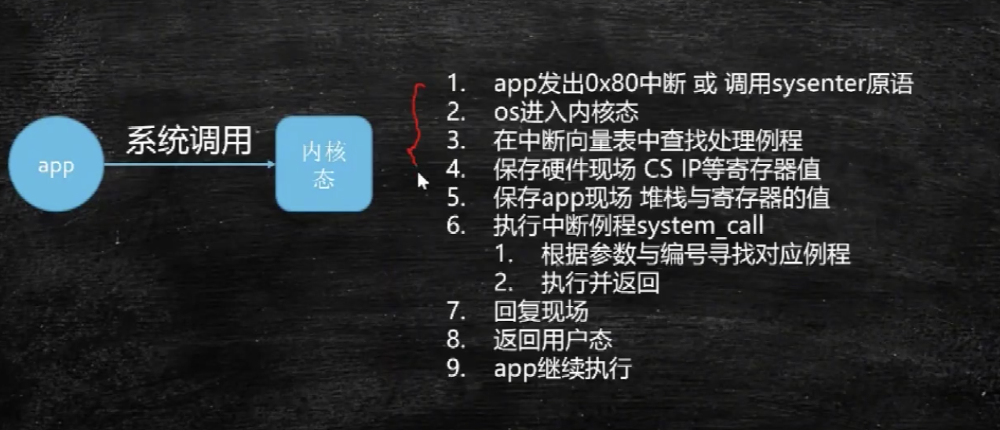

# 综述

操作系统相关问题

# 堆和栈的区别

> 1、堆栈空间分配区别
>
> 栈（操作系统）：由操作系统（编译器）自动分配释放 ，存放函数的参数值，局部变量的值等。其操作方式类似于数据结构中的栈。
>
> 堆（操作系统）： 一般由程序员分配释放， 若程序员不释放，程序结束时可能由OS回收，分配方式倒是类似于链表。
>
> 2、堆栈缓存方式区别
>
> 栈使用的是一级缓存， 它们通常都是被调用时处于存储空间中，调用完毕立即释放。
>
> 堆则是存放在二级缓存中，生命周期由虚拟机的垃圾回收算法来决定（并不是一旦成为孤儿对象就能被回收）。所以调用这些对象的速度要相对来得低一些。
>
> 3、堆栈数据结构区别
>
> 堆（数据结构）：堆可以被看成是一棵树，如：堆排序。
>
> 栈（数据结构）：一种先进后出的数据结构。
>
> https://www.php.cn/faq/418027.html

> # 堆和栈的理论知识
>
> ## 2.1申请方式
>
> stack: 
>  由系统自动分配。 例如，声明在函数中一个局部变量 int b; 系统自动在栈中为b开辟空间 
>  heap: 
>  需要程序员自己申请，并指明大小，在c中malloc函数 
>  如`p1 = (char *)malloc(10);` 
>  在C++中用new运算符 
>  如`p2 = (char *)malloc(10);` 
>  但是注意p1、p2本身是在栈中的。
>
> ## 2.2 申请后系统的响应
>
> 栈：只要栈的剩余空间大于所申请空间，系统将为程序提供内存，否则将报异常提示栈溢出。 
>  堆：首先应该知道操作系统有一个记录空闲内存地址的链表，当系统收到程序的申请时， 
>   会遍历该链表，寻找第一个空间大于所申请空间的堆结点，然后将该结点从空闲结点链表中删除，并将该结点的空间分配给程序，另外，对于大多数系统，会在这块内存空间中的首地址处记录本次分配的大小，这样，代码中的delete语句才能正确的释放本内存空间。另外，由于找到的堆结点的大小不一定正好等于申请的大小，系统会自动的将多余的那部分重新放入空闲链表中。
>
> ## 2.3 申请大小的限制
>
> 栈：在Windows下,栈是向低地址扩展的数据结构，是一块连续的内存的区域。这句话的意思是栈顶的地址和栈的最大容量是系统预先规定好的，在WINDOWS下，栈的大小是2M（也有的说是1M，总之是一个编译时就确定的常数），如果申请的空间超过栈的剩余空间时，将提示overflow。因此，能从栈获得的空间较小。 
>  堆：堆是向高地址扩展的数据结构，是不连续的内存区域。这是由于系统是用链表来存储的空闲内存地址的，自然是不连续的，而链表的遍历方向是由低地址向高地址。堆的大小受限于计算机系统中有效的虚拟内存。由此可见，堆获得的空间比较灵活，也比较大。
>
> ## 2.4 申请效率的比较：
>
> 栈由系统自动分配，速度较快。但程序员是无法控制的。 
>  堆是由new分配的内存，一般速度比较慢，而且容易产生内存碎片,不过用起来最方便. 
>  另外，在WINDOWS下，最好的方式是用VirtualAlloc分配内存，他不是在堆，也不是在栈是直接在进程的地址空间中保留一快内存，虽然用起来最不方便。但是速度快，也最灵活。
>
> ## 2.5 堆和栈中的存储内容
>
> 栈： 在函数调用时，第一个进栈的是主函数中后的下一条指令（函数调用语句的下一条可执行语句）的地址，然后是函数的各个参数，在大多数的C编译器中，参数是由右往左入栈的，然后是函数中的局部变量。注意静态变量是不入栈的。 
>  当本次函数调用结束后，局部变量先出栈，然后是参数，最后栈顶指针指向最开始存的地址，也就是主函数中的下一条指令，程序由该点继续运行。 
>  堆：一般是在堆的头部用一个字节存放堆的大小。堆中的具体内容有程序员安排。
>
> [关于堆栈的讲解(我见过的最经典的)](https://blog.csdn.net/yingms/article/details/53188974)

> https://blog.csdn.net/pt666/article/details/70876410/

# 进程与线程

> 什么是进程？什么是线程？

进程：分配资源最基本的单位。当一个程序启动的时候，操作系统会给他分配一些资源，内存啊，端口啊，文件描述符啊之类的，此时分配好的这些资源可以叫做一个进程，此时程序还没有运行。

线程：调度执行的最基本的单元。程序要开始运行了，会把指令读到cpu的寄存器中，例如找到main函数，其实也就是主线程。

纤程(协程 fiber)：线程可以理解为栈 + 程序计数器（pc），所以java自己可以模拟线程，而不用通过os来创建线程。**一般用在回调函数上**，用户空间的异步编程，例如callable + future，响应式编程Rxjava

# 用户态与内核态

为啥切换状态会慢呢？因为做的事太多了

https://www.bilibili.com/video/BV1hK4y1N7Ky?p=14