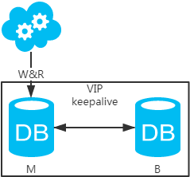
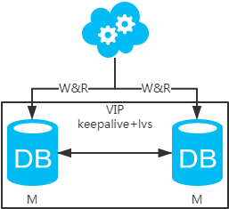
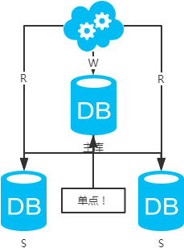
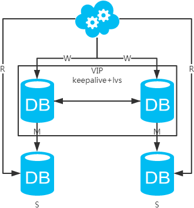

# 综述

#  数据库架构

## 1.  数据库架构原则

- 高可用
- 高性能
- 一致性
- 扩展性

## 2. 常见的架构方案

- **方案一：主备架构，只有主库提供读写服务，备库冗余作故障转移用**
 

**高可用分析：**高可用，主库挂了，keepalive（只是一种工具）会自动切换到备库。这个过程对业务层是透明的，无需修改代码或配置。

**高性能分析：**读写都操作主库，很容易产生瓶颈。大部分互联网应用读多写少，读会先成为瓶颈，进而影响写性能。另外，备库只是单纯的备份，资源利用率50%，这点方案二可解决。

**一致性分析：**读写都操作主库，不存在数据一致性问题。  

**扩展性分析：**无法通过加从库来扩展读性能，进而提高整体性能。

**可落地分析：**两点影响落地使用。第一，性能一般，这点可以通过建立高效的索引和引入缓存来增加读性能，进而提高性能。这也是通用的方案。第二，扩展性差，这点可以通过**分库分表**来扩展。

- **方案二：双主架构，两个主库同时提供服务，负载均衡**

高可用分析：**

高可用，一个主库挂了，不影响另一台主库提供服务。这个过程对业务层是透明的，无需修改代码或配置。

**高性能分析：**读写性能相比于方案一都得到提升，提升一倍。

**一致性分析：**存在数据一致性问题。请看，**一致性解决方案**。

**扩展性分析：**当然可以扩展成三主循环，但笔者不建议（会多一层**数据同步**，这样同步的时间会更长）。如果非得在数据库架构层面扩展的话，扩展为方案四。

**可落地分析：**两点影响落地使用。第一，数据一致性问题，**一致性解决方案**可解决问题**。**第二，主键冲突问题，ID统一地由分布式ID生成服务来生成可解决问题。

- **方案三：主从架构，一主多从，读写分离**

**高可用分析：**主库单点，从库高可用。一旦主库挂了，写服务也就无法提供。

**高性能分析：**大部分互联网应用读多写少，读会先成为瓶颈，进而影响整体性能。读的性能提高了，整体性能也提高了。另外，主库可以不用索引，线上从库和线下从库也可以建立不同的索引（线上从库如果有多个还是要建立相同的索引，不然得不偿失；线下从库是平时开发人员排查线上问题时查的库，可以建更多的索引）。

**一致性分析：**存在数据一致性问题。请看，**一致性解决方案**。

**扩展性分析：**可以通过加从库来扩展读性能，进而提高整体性能。（带来的问题是，从库越多需要从主库拉取binlog日志的端就越多，进而影响主库的性能，并且**数据同步**完成的时间也会更长）

**可落地分析：**两点影响落地使用。第一，数据一致性问题，**一致性解决方案**可解决问题**。**第二，主库单点问题，笔者暂时没想到很好的解决方案。

注：思考一个问题，一台从库挂了会怎样？读写分离之读的负载均衡策略怎么容错？

- **方案四：双主+主从架构，看似完美的方案**

**高可用分析：**高可用。

**高性能分析：**高性能。

**一致性分析：**存在数据一致性问题。请看，**一致性解决方案**。

**扩展性分析：**可以通过加从库来扩展读性能，进而提高整体性能。（带来的问题**同方案二**）

**可落地分析：同方案二**，但**数据同步**又多了一层，数据延迟更严重。

## 3. 一致性解决方案

- **第一类：主库和从库一致性解决方案**

1. 直接忽略，如果业务允许延时存在，那么就不去管它。

2. 强制读主，采用**主备架构**方案，读写都走主库。用缓存来扩展数据库读性能 。有一点需要知道：如果缓存挂了，可能会产生雪崩现象，不过一般分布式缓存都是高可用的。

3. 选择读主，写操作时根据库+表+业务特征生成一个key放到Cache里并设置超时时间（大于等于主从数据同步时间）。读请求时，同样的方式生成key先去查Cache，再判断是否命中。若命中，则读主库，否则读从库。代价是多了一次缓存读写，基本可以忽略。

4. 半同步复制，等主从同步完成，写请求才返回。就是大家常说的“半同步复制”semi-sync。这可以利用数据库原生功能，实现比较简单。代价是写请求时延增长，吞吐量降低。
5. 数据库中间件，引入开源（mycat等）或自研的数据库中间层。个人理解，思路同**选择读主。**数据库中间件的成本比较高，并且还多引入了一层。
6. <!--多主之间如何进行数据同步？-->

- **第二类：DB和缓存一致性解决方案**

  //todo 

[数据库之架构：主备+分库？主从+读写分离？](https://www.cnblogs.com/littlecharacter/p/9084291.html)

# 分表分库

- **数据库瓶颈**

1. IO瓶颈

   第一种：磁盘读IO瓶颈，热点数据太多，数据库缓存放不下，每次查询时会产生大量的IO，降低查询速度 -> **分库和垂直分表**。

   第二种：网络IO瓶颈，请求的数据太多，网络带宽不够 -> **分库**。

2. CPU瓶颈

   第一种：SQL问题，如SQL中包含join，group by，order by，非索引字段条件查询等，增加CPU运算的操作  -> SQL优化，建立合适的索引，在业务Service层进行业务计算。

   第二种：单表数据量太大，查询时扫描的行太多，SQL效率低，增加CPU运算的操作 -> **水平分表**。

- **分表分库**

## 1. 水平分库

1. 概念：以**字段**为依据，按照一定策略（hash、range等），将一个**库**中的数据拆分到多个**库**中。
2. 结果：
   - 每个**库**的**结构**都一样；
   - 每个**库**的**数据**都不一样，没有交集；
   - 所有**库**的**并集**是全量数据；
3. 场景：系统**绝对并发量**上来了，分表难以根本上解决问题，并且还没有明显的业务归属来垂直分库。
4. 分析：库多了，io和cpu的压力自然可以成倍缓解。

## 2. 水平分表

1. 概念：以**字段**为依据，按照一定策略（hash、range等），将一个**表**中的数据拆分到多个**表**中。
2. 结果：
   - 每个**表**的**结构**都一样；
   - 每个**表**的**数据**都不一样，没有交集；
   - 所有**表**的**并集**是全量数据；
3. 场景：系统绝对并发量并没有上来，只是单表的数据量太多，影响了SQL效率，加重了CPU负担，以至于成为瓶颈。
4. 分析：表的数据量少了，单次SQL执行效率高，自然减轻了CPU的负担。

## 3. 垂直分库

1. 概念：以**表**为依据，按照业务归属不同，将不同的**表**拆分到不同的**库**中。
2. 结果：
   - 每个**库**的**结构**都不一样；
   - 每个**库**的**数据**也不一样，没有交集；
   - 所有**库**的**并集**是全量数据；
3. 场景：系统绝对并发量上来了，并且可以抽象出单独的业务模块。
4. 分析：到这一步，基本上就可以服务化了。例如，随着业务的发展一些公用的配置表、字典表等越来越多，这时可以将这些表拆到单独的库中，甚至可以服务化。再有，随着业务的发展孵化出了一套业务模式，这时可以将相关的表拆到单独的库中，甚至可以服务化。

## 4. 垂直分表

概念：以**字段**为依据，按照字段的活跃性，将**表**中字段拆到不同的**表**（主表和扩展表）中。

结果：

- 每个**表**的**结构**都不一样；
- 每个**表**的**数据**也不一样，一般来说，每个表的**字段**至少有一列交集，一般是主键，用于关联数据；
- 所有**表**的**并集**是全量数据；

场景：系统绝对并发量并没有上来，表的记录并不多，但是字段多，并且热点数据和非热点数据在一起，单行数据所需的存储空间较大。以至于数据库缓存的数据行减少，查询时会去读磁盘数据产生大量的随机读IO，产生IO瓶颈。

分析：可以用列表页和详情页来帮助理解。垂直分表的拆分原则是将热点数据（可能会冗余经常一起查询的数据）放在一起作为主表，非热点数据放在一起作为扩展表。这样更多的热点数据就能被缓存下来，进而减少了随机读IO。拆了之后，要想获得全部数据就需要关联两个表来取数据。但记住，千万别用join，因为join不仅会增加CPU负担并且会讲两个表耦合在一起（必须在一个数据库实例上）。关联数据，应该在业务Service层做文章，分别获取主表和扩展表数据然后用关联字段关联得到全部数据。

----------------------

- 分库分表工具

1. sharding-sphere：jar，前身是sharding-jdbc；
2. TDDL：jar，Taobao Distribute Data Layer；
3. Mycat：中间件。

## 5. 存在问题

- 非partition key的查询问题（水平分库分表，拆分策略为常用的hash法）

  **端上**除了partition key只有一个非partition key作为条件查询

  **映射法**

  

**基因法**

注：写入时，基因法生成user_id，如图。关于xbit基因，例如要分8张表，23=8，故x取3，即3bit基因。根据user_id查询时可直接取模路由到对应的分库或分表。根据user_name查询时，先通过user_name_code生成函数生成user_name_code再对其取模路由到对应的分库或分表。id生成常用**snowflake算法**。

