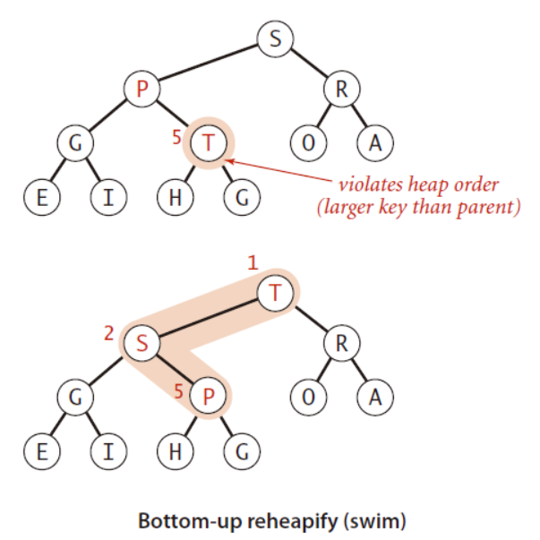
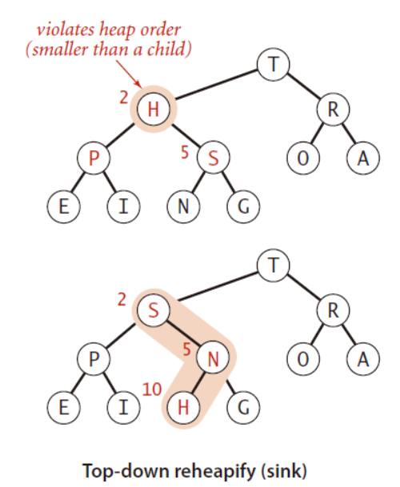

# 综述

- 发现数据结构虽然是算法的先导内容，但是内容是在是太多了，干脆单独拿出来整理，这样看起来会显得更加的有条理一些。
- 单纯的记录比较常用的结构，与算法中的结构相比，这些容器容易在面试中被问到，在工作中也常常会使用，他们或者他们用到的一些思想在各种组件中被使用，但是他们在LeetCode上几乎不会用到。
- 简述具体的实现原理，如果在面试中真的遇到了问细节的情况再继续深入。
- 基本的数据结构最好还是需要补全具体实现的。


# 目录

- ArrayDeque, （数组双端队列）

- PriorityQueue, （优先级队列）

- ConcurrentLinkedQueue, （基于链表的并发队列）

- DelayQueue, （延期阻塞队列）（阻塞队列实现了BlockingQueue接口）

- ArrayBlockingQueue, （基于数组的并发阻塞队列）

- LinkedBlockingQueue, （基于链表的FIFO阻塞队列）

- LinkedBlockingDeque, （基于链表的FIFO双端阻塞队列）

- PriorityBlockingQueue, （带优先级的无界阻塞队列）

- SynchronousQueue （并发同步阻塞队列） 

- BlockingQueue: 这是一个接口，JDK内部通过链表、数组等方式实现了这个接口。表示阻塞队列，非常适合用于作为数据共享的通道。

- ConcurrentSkipListMap: 跳表的实现。这是一个Map，使用跳表的数据结构进行快速查找


# Queue

首先明确一下概念，Deque与Queue的区别，这两个单词实在是太像了。

- Deque是double ended queue，将其理解成双端结束的队列，双端队列，可以在首尾插入或删除元素。
- Queue是简单的FIFO队列，在概念上来说，Queue是FIFO的单端队列，Deque是双端队列。


> ## BlockingQueue

- ArrayBlockingQueue 数组型阻塞队列
- LinkedBlockingQueue 链表型阻塞队列
- DelayQueue 延时队列
- SynchronousQueue 同步队列
- PriorityBlockingQueue 优先阻塞队列

Java中的`BlockingQueue`被定义为一个接口`java.util.concurrent.BlockingQueue`，接口中定义了一些队列的常见操作，例如`add`，`poll`等等，接口主要有两种实现，分别是`ArrayBlockingQueue` 和 `LinkedBlockingQueue`。


## ArrayBlockingQueue

ArrayBlockingQueue是一种**有界阻塞队列**，在初始构造的时候需要指定队列的容量。具有如下特点：

1. 使用`Object[]`数组作为底层队列的实现结果，队列的容量一旦在构造时指定，后续**不能改变**；

2. 插入元素时，在队尾进行；删除元素时，在队首进行；

3. ArrayBlockingQueue的内部数组其实是一种环形结构，类内部有两个指针对象，分别指向数组的头部与尾部，count记录已有的数据数量。

   ```java
       /** items index for next take, poll, peek or remove */
       int takeIndex;
   
       /** items index for next put, offer, or add */
       int putIndex;
   
       /** Number of elements in the queue */
       int count;
   ```

   

   队列已经满时，如果再有线程尝试插入元素，并不会覆盖原有值，而是被阻塞。

   队列已经空了（count==0）是，如果再有线程尝试出队元素，则会被阻塞。

   

4. ArrayBlockingQueue利用了**ReentrantLock**来保证线程的安全性，针对队列的修改都需要加**全局锁**。无论是出队还是入队，都共用这把锁，这就导致任一时间点只有一个线程能够执行。那么对于“生产者-消费者”模式来说，意味着生产者和消费者不能并发执行。

5. 支持公平/非公平策略，默认为非公平策略。

6. ArrayBlockingQueue的公平/非公平策略其实就是内部ReentrantLock对象的策略，此外构造时还创建了两个Condition对象。在队列满时，插入线程需要在notFull上等待；当队列空时，删除线程会在notEmpty上等待：


## LinkedBlockingQueue

LinkedBlockingQueue是一种**近似有界阻塞队列**，可以指定长度，也可以不指定，如果不指定，那么它的容量大小默认为`Integer.MAX_VALUE`。

1. 底层基于单链表实现，内部定义了静态内部类。

2. 它维护了两把锁——`takeLock`和`putLock`。

   ```java
       /**
        * 出队锁
        */
       private final ReentrantLock takeLock = new ReentrantLock();
   
       /**
        * 队列空时，出队线程在该条件队列等待
        */
       private final Condition notEmpty = takeLock.newCondition();
   
       /**
        * 入队锁
        */
       private final ReentrantLock putLock = new ReentrantLock();
   
       /**
        * 队列满时，入队线程在该条件队列等待
        */
       private final Condition notFull = putLock.newCondition();
   ```

   takeLock用于控制出队的并发，putLock用于入队的并发。这也就意味着，同一时刻，只能只有一个线程能执行入队/出队操作，其余入队/出队线程会被阻塞；但是，入队和出队之间可以并发执行，即同一时刻，可以同时有一个线程进行入队，另一个线程进行出队，这样就可以提升吞吐量。


归纳一下，**LinkedBlockingQueue**和**ArrayBlockingQueue**比较主要有以下区别：

1. 队列大小不同。ArrayBlockingQueue初始构造时必须指定大小，而LinkedBlockingQueue构造时既可以指定大小，也可以不指定（默认为`Integer.MAX_VALUE`，近似于无界）；
2. 底层数据结构不同。ArrayBlockingQueue底层采用**数组**作为数据存储容器，而LinkedBlockingQueue底层采用**单链表**作为数据存储容器；
3. 两者的加锁机制不同。ArrayBlockingQueue使用一把**全局锁**，即入队和出队使用同一个ReentrantLock锁；而LinkedBlockingQueue进行了**锁分离**，入队使用一个ReentrantLock锁（putLock），出队使用另一个ReentrantLock锁（takeLock）；
4. LinkedBlockingQueue不能指定公平/非公平策略（默认都是非公平），而ArrayBlockingQueue可以指定策略。


参考：

> [Java多线程进阶（三二）—— J.U.C之collections框架：ArrayBlockingQueue](https://segmentfault.com/a/1190000016311925)
>
> [Java多线程进阶（三三）—— J.U.C之collections框架：LinkedBlockingQueue](https://segmentfault.com/a/1190000016315487)


## PriorityBlockingQueue

PriorityBlockingQueue是一种**无界阻塞队列**，在构造的时候可以指定队列的初始容量。具有如下特点：

1. PriorityBlockingQueue与之前介绍的阻塞队列最大的不同之处就是：它是一种**优先级队列**，也就是说元素并不是以FIFO的方式出/入队，而是以按照权重大小的顺序出队；

2. PriorityBlockingQueue是真正的无界队列（仅受内存大小限制），它不像ArrayBlockingQueue那样构造时必须指定最大容量，也不像LinkedBlockingQueue默认最大容量为`Integer.MAX_VALUE`；

3. 由于PriorityBlockingQueue是按照元素的权重进入排序，所以队列中的元素必须是可以比较的，也就是说元素必须实现`Comparable`接口；

4. 由于PriorityBlockingQueue无界队列，所以**插入元素**永远**不会**阻塞线程；

5. 当然，可以在初始化的时候指定队列的大小，插入数据时会进行判断，如果超过大小则会自动扩容，使用CAS的方式修改`allocationSpinLock`变量来保证扩容的线程安全。

6. PriorityBlockingQueue底层是一种**基于数组实现的二叉堆结构**。任然使用**`ReentrantLock`**作为全局锁，同时由于没有上限，所以只有一个`notEmpty`对象

   ```java
   /**
    * Priority queue represented as a balanced binary heap: the two
    * children of queue[n] are queue[2*n+1] and queue[2*(n+1)].  The
    * priority queue is ordered by comparator, or by the elements'
    * natural ordering, if comparator is null: For each node n in the
    * heap and each descendant d of n, n <= d.  The element with the
    * lowest value is in queue[0], assuming the queue is nonempty.
    */
   private transient Object[] queue;
   
   /**
    * The number of elements in the priority queue.
    */
   private transient int size;
   
   /**
    * The comparator, or null if priority queue uses elements'
    * natural ordering.
    */
   private transient Comparator<? super E> comparator;
   
   /**
    * Lock used for all public operations
    */
   private final ReentrantLock lock;
   
   /**
    * Condition for blocking when empty
    */
   private final Condition notEmpty;
   
   /**
    * Spinlock for allocation, acquired via CAS.
    */
   private transient volatile int allocationSpinLock;
   ```


> [Java多线程进阶（三四）—— J.U.C之collections框架：PriorityBlockingQueue](https://segmentfault.com/a/1190000016353839)


## SynchronousQueue

1. 底层基于**栈**和**队列**实现。
2. 入队线程和出队线程必须一一匹配，否则任意先到达的线程会阻塞。比如ThreadA进行入队操作，在有其它线程执行出队操作之前，ThreadA会一直等待，反之亦然；
3. SynchronousQueue内部不保存任何元素，也就是说它的容量为0，数据直接在配对的生产者和消费者线程之间传递，不会将数据缓冲到队列中。
4. SynchronousQueue支持公平/非公平策略。其中非公平模式，基于内部数据结构——“栈”来实现，公平模式，基于内部数据结构——“队列”来实现；
5. SynchronousQueue基于一种名为“[Dual stack and Dual queue](http://www.cs.rochester.edu/research/synchronization/pseudocode/duals.html)”的无锁算法实现。


> [Java多线程进阶（三五）—— J.U.C之collections框架：SynchronousQueue](https://segmentfault.com/a/1190000016359551)


## DelayQueue

1. 底层基于已有的**PriorityBlockingQueue**实现
2. DelayQueue是无界阻塞队列；
3. 队列中的元素必须实现Delayed接口，元素过期后才会从队列中取走；
4. 使用`ReentrantLock`作为全局锁

```java
private final transient ReentrantLock lock = new ReentrantLock();
private final PriorityQueue<E> q = new PriorityQueue<E>();

/**
 * Thread designated to wait for the element at the head of
 * the queue.  This variant of the Leader-Follower pattern
 * (http://www.cs.wustl.edu/~schmidt/POSA/POSA2/) serves to
 * minimize unnecessary timed waiting.  When a thread becomes
 * the leader, it waits only for the next delay to elapse, but
 * other threads await indefinitely.  The leader thread must
 * signal some other thread before returning from take() or
 * poll(...), unless some other thread becomes leader in the
 * interim.  Whenever the head of the queue is replaced with
 * an element with an earlier expiration time, the leader
 * field is invalidated by being reset to null, and some
 * waiting thread, but not necessarily the current leader, is
 * signalled.  So waiting threads must be prepared to acquire
 * and lose leadership while waiting.
 */
    /**
     * leader线程是首个尝试出队元素（队列不为空）但被阻塞的线程.
     * 该线程会限时等待（队首元素的剩余有效时间），用于唤醒其它等待线程
     */
private Thread leader = null;

/**
 * Condition signalled when a newer element becomes available
 * at the head of the queue or a new thread may need to
 * become leader.
 */

    /**
     * 出队线程条件队列, 当有多个线程, 会在此条件队列上等待.
     */
private final Condition available = lock.newCondition();
```

上述比较特殊的是`leader`字段，DelayQueue每次只会出队一个过期的元素，如果队首元素没有过期，就会阻塞出队线程，让线程在`available`这个条件队列上无限等待。为了提升性能，DelayQueue并不会让所有出队线程都无限等待，而是用`leader`保存了第一个尝试出队的线程，该线程的等待时间是队首元素的剩余有效期。这样，一旦leader线程被唤醒（此时队首元素也失效了），就可以出队成功，然后唤醒一个其它在`available`条件队列上等待的线程。之后，会重复上一步，新唤醒的线程可能取代成为新的leader线程。这样，就避免了无效的等待，提升了性能。这其实是一种名为“[Leader-Follower pattern](https://www.cse.wustl.edu/~schmidt/POSA/POSA2/)”的多线程设计模式。


> [Java多线程进阶（三六）—— J.U.C之collections框架：DelayQueue](https://segmentfault.com/a/1190000016388106)


# 树

- 课本上的基本数据结构，种类比较多，这里主要区分概念。


## 二叉树

二叉树使用链表或者数据来进行存储

### 完全二叉树


### 二插平衡树


# 堆

堆分为大/小顶堆，一般使用二叉树的形式，一般堆可以用来实现优先队列。


> #### 插入

新增元素添加到树的底层最右侧，然后上浮。


> #### 调平 - 上浮和下沉

- 上浮（siftup）
  在堆中插入元素后（完全二叉树的最右下方插入），需要进行上浮操作，重新使得堆有序。

  

- 下沉（siftdown）

  当删除一个堆元素（堆顶）时，首先将堆顶元素与最右下方元素交换，然后删除。此时堆顶元素需要进行下沉操作，重新使得堆有序。

  

> #### 删除

将树的最后一个元素与第一个元素交换，删除最后一个元素，然后从堆顶开始下沉。


> [优先级队列](https://www.jianshu.com/p/7acd000e9a47)
>
> [Java多线程进阶（三四）—— J.U.C之collections框架：PriorityBlockingQueue](https://segmentfault.com/a/1190000016353839)