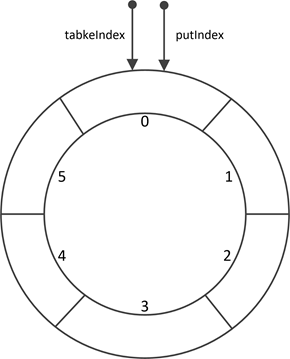

# 综述

- 发现数据结构虽然是算法的先导内容，但是内容是在是太多了，干脆单独拿出来整理，这样看起来会显得更加的有条理一些。
- 单纯的记录比较常用的结构，与算法中的结构相比，这些容器容易在面试中被问到，在工作中也常常会使用，他们或者他们用到的一些思想在各种组件中被使用，但是他们在LeetCode上几乎不会用到。
- 先简述具体的实现原理，如果在面试中真的遇到了问细节的情况再继续深入。


# 目录

- ArrayDeque, （数组双端队列）

- PriorityQueue, （优先级队列）

- ConcurrentLinkedQueue, （基于链表的并发队列）

- DelayQueue, （延期阻塞队列）（阻塞队列实现了BlockingQueue接口）

- ArrayBlockingQueue, （基于数组的并发阻塞队列）

- LinkedBlockingQueue, （基于链表的FIFO阻塞队列）

- LinkedBlockingDeque, （基于链表的FIFO双端阻塞队列）

- PriorityBlockingQueue, （带优先级的无界阻塞队列）

- SynchronousQueue （并发同步阻塞队列） 

- BlockingQueue: 这是一个接口，JDK内部通过链表、数组等方式实现了这个接口。表示阻塞队列，非常适合用于作为数据共享的通道。

- ConcurrentSkipListMap: 跳表的实现。这是一个Map，使用跳表的数据结构进行快速查找


# Queue

首先明确一下概念，Deque与Queue的区别，这两个单词实在是太像了。

- Deque是double ended queue，将其理解成双端结束的队列，双端队列，可以在首尾插入或删除元素。
- Queue是简单的FIFO队列，在概念上来说，Queue是FIFO的单端队列，Deque是双端队列。


## BlockingQueue

- ArrayBlockingQueue 数组型阻塞队列
- LinkedBlockingQueue 链表型阻塞队列
- DelayQueue 延时队列
- SynchronousQueue 同步队列
- PriorityBlockingQueue 优先阻塞队列

Java中的`BlockingQueue`被定义为一个接口`java.util.concurrent.BlockingQueue`，接口中定义了一些队列的常见操作，例如`add`，`poll`等等，接口主要有两种实现，分别是`ArrayBlockingQueue` 和 `LinkedBlockingQueue`。


- **ArrayBlockingQueue**

  ArrayBlockingQueue是一种**有界阻塞队列**，在初始构造的时候需要指定队列的容量。具有如下特点：

  1. 使用`Object[]`数组作为底层队列的实现结果，队列的容量一旦在构造时指定，后续**不能改变**；

  2. 插入元素时，在队尾进行；删除元素时，在队首进行；

  3. ArrayBlockingQueue的内部数组其实是一种环形结构，类内部有两个指针对象，分别指向数组的头部与尾部，count记录已有的数据数量。

     ```java
   /** items index for next take, poll, peek or remove */
     int takeIndex;
   
     /** items index for next put, offer, or add */
   int putIndex;
     
     /** Number of elements in the queue */
     int count;
     ```
  
     
  
     队列已经满时，如果再有线程尝试插入元素，并不会覆盖原有值，而是被阻塞。
  
     队列已经空了（count==0）是，如果再有线程尝试出队元素，则会被阻塞。
  
     
  
  4. ArrayBlockingQueue利用了**ReentrantLock**来保证线程的安全性，针对队列的修改都需要加全局锁。可能出现性能瓶颈。
  
  5. 支持公平/非公平策略，默认为非公平策略。
  
  6. ArrayBlockingQueue的公平/非公平策略其实就是内部ReentrantLock对象的策略，此外构造时还创建了两个Condition对象。在队列满时，插入线程需要在notFull上等待；当队列空时，删除线程会在notEmpty上等待：


- **LinkedBlockingQueue**

  LinkedBlockingQueue是一种**近似有界阻塞队列**，可以指定长度，也可以不指定，如果不指定，那么它的容量大小默认为`Integer.MAX_VALUE`。

  它维护了两把锁——`takeLock`和`putLock`。
  takeLock用于控制出队的并发，putLock用于入队的并发。这也就意味着，同一时刻，只能只有一个线程能执行入队/出队操作，其余入队/出队线程会被阻塞；但是，入队和出队之间可以并发执行，即同一时刻，可以同时有一个线程进行入队，另一个线程进行出队，这样就可以提升吞吐量。


归纳一下，**LinkedBlockingQueue**和**ArrayBlockingQueue**比较主要有以下区别：

1. 队列大小不同。ArrayBlockingQueue初始构造时必须指定大小，而LinkedBlockingQueue构造时既可以指定大小，也可以不指定（默认为`Integer.MAX_VALUE`，近似于无界）；
2. 底层数据结构不同。ArrayBlockingQueue底层采用**数组**作为数据存储容器，而LinkedBlockingQueue底层采用**单链表**作为数据存储容器；
3. 两者的加锁机制不同。ArrayBlockingQueue使用一把**全局锁**，即入队和出队使用同一个ReentrantLock锁；而LinkedBlockingQueue进行了**锁分离**，入队使用一个ReentrantLock锁（putLock），出队使用另一个ReentrantLock锁（takeLock）；
4. LinkedBlockingQueue不能指定公平/非公平策略（默认都是非公平），而ArrayBlockingQueue可以指定策略。


[Java多线程进阶（三二）—— J.U.C之collections框架：ArrayBlockingQueue](https://segmentfault.com/a/1190000016311925)

[Java多线程进阶（三三）—— J.U.C之collections框架：LinkedBlockingQueue](https://segmentfault.com/a/1190000016315487)