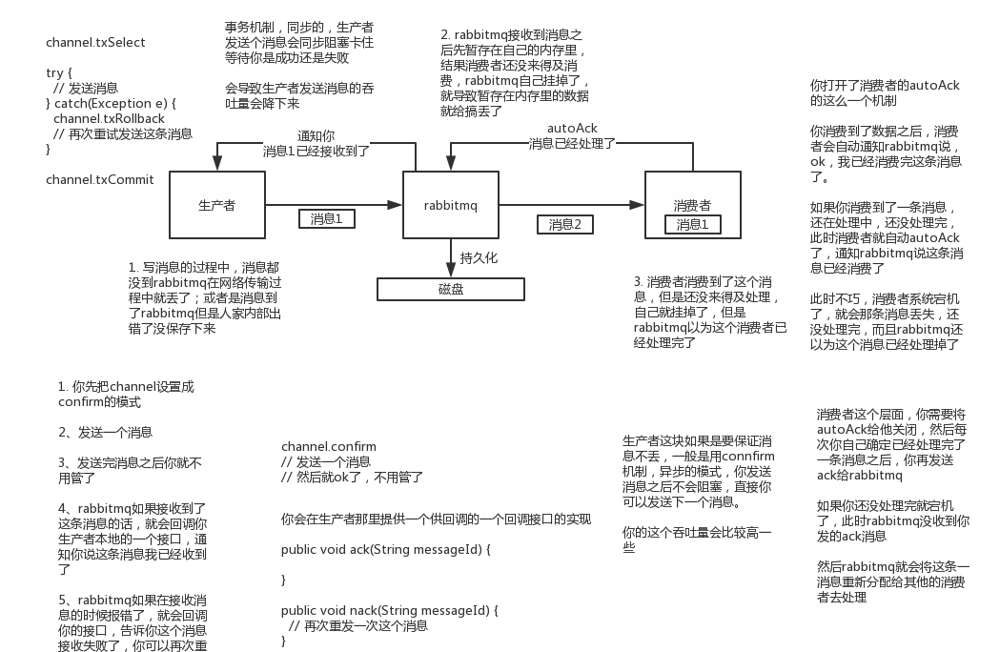

# 综述

MQ常用的场景讨论，基于报文交换进行了一些分析，主要还是使用的rabbitMQ，后面需要改成rocketMQ。

本文档需要大改。


# 使用场景

1. **系统解耦**
2. **异步调用**
3. **流量削峰**


# 选型分析

ActiveMQ是老牌的消息中间件，国内很多公司过去运用的还是非常广泛的，功能很强大。但是**问题**在于没法确认ActiveMQ可以支撑互联网公司的**高并发、高负载以及高吞吐的复杂场景**，在国内**互联网公司落地较少**。而且使用较多的是一些传统企业，用ActiveMQ做**异步调用和系统解耦**。

RabbitMQ，他的好处在于**可以支撑高并发、高吞吐、性能很高**，同时有非常完善便捷的后台管理界面可以使用。另外，他还**支持集群化、高可用部署架构、消息高可靠支持**，功能较为完善。国内各大互联网公司落地大规模RabbitMQ集群支撑自身业务的case较多，国内各种中小型互联网公司使用RabbitMQ的实践也比较多。RabbitMQ也有一点缺陷，就是他自身是基于erlang语言开发的，所以导致**较为难以分析里面的源码**，也较难进行深层次的源码定制和改造


## RocketMQ

RocketMQ，是阿里开源的，经过阿里的生产环境的**超高并发、高吞吐的考验，性能卓越**，同时**还支持分布式事务**等特殊场景。而且RocketMQ是基于Java语言开发的，适合深入阅读源码，有需要可以站在源码层面解决线上生产问题，包括源码的二次开发和改造。

RocketMQ的优缺点：

RocketMQ是阿里巴巴开源的消息中间件，各方面也表现的比较优越，几乎同时解决了Kafka和RabbitMQ它们两个的缺点。

优点： 
- 吞吐量很高，大概普通机器有十万QPS往上。
- 保证高可用，高性能。
- 保证数据绝对不丢失
- 支持大规模集群部署，线性扩展方便支持各种高级的功能，如延迟消息、消息回朔等
- java语言开发，满足了国内绝大部分公司技术栈

缺点：

目前我觉得唯一的缺点就是文档没有前面两种文档详细，写的稍微简单了点。


## kafka

Kafka提供的消息中间件的**功能明显较少**一些，相对上述几款MQ中间件要少很多。但是Kafka的优势在于专为**超高吞吐量的实时日志采集、实时数据同步、实时数据计算**等场景来设计。因此Kafka在大数据领域中配合实时计算技术（比如Spark Streaming、Storm、Flink）使用的较多。但是在传统的MQ中间件使用场景中较少采用。

优点：

- 首先，Kafka的最大优势就在于它的高吞吐量，在普通机器4CPU8G的配置下，一台机器可以抗住十几万的QPS，这一点还是相当优越的。
- 其次，Kafka的性能同样很高，发送消息过去基本都是毫秒级别的。
- Kafka支持集群部署，如果部分机器宕机不可用，则不影响Kafka的正常使用。

缺点：

- Kafka有可能会造成数据丢失，因为它在收到消息的时候，并不是直接写到物理磁盘的，而是先写入到磁盘缓冲区里面的。
- Kafka功能比较的单一 主要的就是支持收发消息，高级功能基本没有，就会造成适用场景受限。

业界里一般将kafka用来处理用户的行为日志的采集的传输，用在大数据团队较多，就只是用来收发消息这种的场景，如用户行为日志等。因为，可以接受数据的丢失，而且要求吞吐量要极高。


  问题：

  ① RabbitMQ与RocketMQ的高并发与高吞吐体现在哪的设计，为啥他们两可以高吞吐。

  ② RocketMQ 对分布式的支持体现在哪

  ③ Kafka 的优势是靠什么保证的


# 缺点

1. **复杂度上升，系统可用性降低** 

   - **MQ挂掉之后的高可用保障方案**

2. **系统稳定性降低**

   - **消息高可靠传递（0丢失）**
   - **消息幂等性传递（绝对不重复）**
   - **百万消息积压的线上故障处理**

3. **分布式一致性问题**

   - 情况1：是一个分布式系统中的多个子系统（或者服务）协作处理一份数据，但是最后这个数据的最终结果却没有符合期望。

     出现了以下痛点问题：

     - 自己基本无法主动提前感知到数据问题，要被动等待用户发现。
     - 没法还原现场，没有留存证据，基本就是一群工程师对着代码想象，猜测。
     - 即使你解决了一次数据不一致的问题，但是以后也许还有下一次。

   - 情况2：多个系统都要维护一份数据的多个副本，结果某个系统中的数据副本跟其他的副本不一致，这也是数据不一致。


# 常见问题

- 说说你们公司线上生产环境用的是什么消息中间件？

  以RabbitMQ为例子说明。


- 那你们线上系统是有哪些技术挑战，为什么必须要在系统里引入消息中间件？
  - 线上系统有两个处于不同网络环境的数据库需要进行数据同步，所以为了解耦所有的同步操作都写入MQ由另一个程序负责对数据库的同步。
  - 同时在高峰时段会有大量的商品申报单涌入系统，为了缓解流量压力使用了MQ。
  - 手机验证码。
  - 日志采集。


- 你们的消息中间件技术选型为什么是RabbitMQ？为什么不用RocketMQ或者是Kafka？技术选型的依据是什么？

  RocketMQ不了解。RabbitMQ是高级AMQP协议，方便操作。支持高并发高吞吐高负载，也支持集群部署，功能较为完善，还有图形管理界面。各大公司使用的例子也比较多，社区活跃。


- 你们怎么保证消息中间件的**高可用性**？避免消息中间件故障后引发系统整体故障？

  1. 集群部署MQ环境。//todo 说明MQ集群的基本结构。数据在集群内是如何存放的？集群是如何对外提供一致服务的？集群内机器出现故障下线，集群是如何自动感知、自动切换的？

  2. 设计降级方案。当系统检测到MQ集群在规定时间内无响应，数据应走降级的处理方案而不再发往MQ。<!--//todo-->这一块的设计可以参考hystrix 


- 使用消息中间件技术的时候，你们怎么保证投递出去的**消息一定不会丢失**？

  消息丢失有这3个地方。

  - 第一是消费者获取到消息之后，没有来得及处理完毕，自己直接宕机了。

    通过在消费者服务中调整为**手动ack机制**，来确保消息一定是已经成功处理完了，才会发送ack通知给MQ集群。否则没发送ack之前消费者服务宕机，此时MQ集群会自动感知到，然后重发消息给其他的消费者服务实例。当然也是可以使用MQ提供的**事务机制**，但是此机制太重，大大降低了MQ的吞吐量。

  

  - 第二是MQ集群自身如果突然宕机。

    采用持久化的方式来创建queue，同时采用持久化的方式来投递消息到MQ集群，这样MQ集群会将消息持久化到磁盘上去。在MQ集群重启之后会自动从磁盘文件里加载出来没投递出去的消息，然后继续投递给消费者服务

  

  - 第三是生产者消息投递到MQ集群之后，暂时还驻留在MQ的内存里，还没来得及持久化到磁盘上，同时也还没来得及投递到消费者，此时要MQ集群自身突然宕机。

    ​	<!--//todo--> 未完成

    此处要是要求MQ使用confirm模式，一旦channel进入confirm模式，所有在该信道上面发布的消息都将会被指派一个唯一的ID(从1开始)，一旦消息被投递到所有匹配的队列之后，rabbitMQ就会发送一个Ack给生产者(包含消息的唯一ID)，这就使得生产者知道消息已经正确到达目的队列了.如果rabiitMQ没能处理该消息，则会发送一个Nack消息给你，你可以进行重试操作。或者开启事务功能（(channel.txSelect())同样的，会大幅度降低吞吐率）。





- 你们怎么保证投递出去的消息只有一条且仅仅一条，不会出现**重复的数据**？如果消费了重复的消息怎么保证数据的准确性？

  

  重复消费原因：

  1. 客户端消费一条消息后，在返回Ack的过程中，可能由于网络或其它原因没有到达服务器，导致服务端接收ACK超时，再次将消息放入消费队列造成消息重复。
  2. 生产者往消息系统中投递消息时，会重复投递消息吗？由于网络原因在投递时，消息系统没有及时进行confirm，或者confirm信号丢失，造成生产者重复投递。由于MQ中的唯一ID不同，此处认为是2条不同的消息，但是在业务层面只有一条消息。

  

  重复消费解决：

  如果出现重复数据或者重复消费的情况，需要保证消息队列的幂等性，这一块最好是业务系统自己实现，而不是消息系统来处理重复问题，因为这会影响到吞吐量和高可用。

  - 如果此数据最终是需要在数据库做insert操作，则定义一个唯一键或者唯一索引，保证不会重复插入数据避免数据库脏数据。
  - 如果是update操作，如果update是幂等的，那就不用进行任何处理。
  - 使用第三方来做消费记录。以redis为例，给消息分配一个全局id，只要消费过该消息，将<id,message>以K-V形式写入redis。那消费者开始消费前，先去redis中查询有没消费记录即可。需要保证每条消息都有唯一编号且保证消息处理成功与去重表的日志同时出现


​	**结论：不保证消息不重复，如果你的业务需要保证严格的不重复消息，需要你自己在业务端去重。**


- 你们线上业务用消息中间件的时候，是否需要保证**消息的顺序性**？如果不需要保证消息顺序是为什么？假如我有一个场景要保证消息的顺序，你应该如何保证？

  - 业务上是需要消息保持顺序，但是消息系统并不要求消息顺序，而是由业务层来保证顺序。

    方法有：

    - 操作时查看数据的时间戳，并与当前时间对比。
    - 版本号
    - 自定义传输协议，在消息中自带顺序，在消费端进行消息重排后再处理。
    - 依赖于第三方。比如把顺序记录记在redis中。
    - <!--//todo-->

  - 假如生产者产生了2条消息：M1、M2，要消息系统保证这两条消息的顺序，应该怎样做？

    1. 假定M1发送到S1，M2发送到S2，如果要保证M1先于M2被消费，那么需要M1到达消费端被消费后，通知S2，然后S2再将M2发送到消费端。

         这个模型存在的问题是，如果M1和M2分别发送到两台Server上，就不能保证M1先达到MQ集群，也不能保证M1被先消费。换个角度看，如果M2先于M1达到MQ集群，甚至M2被消费后，M1才达到消费端，这时消息也就乱序了，说明以上模型是不能保证消息的顺序的。如何才能在MQ集群保证消息的顺序？一种简单的方式就是将M1、M2发送到同一个Server上：（此处存疑，M2先到应该也是发不出去的，因为S2要等待M1消费后的通知才能发送）

    2. 将M1、M2发送到同一个Server上，这样可以保证M1先于M2到达MQServer（生产者等待M1发送成功后再发送M2），根据先达到先被消费的原则，M1会先于M2被消费，这样就保证了消息的顺序。

         这个模型也仅仅是理论上可以保证消息的顺序，在实际场景中可能会遇到下面的问题：

         只要将消息从一台服务器发往另一台服务器，就会存在网络延迟问题。如果发送M1耗时大于发送M2的耗时，那么M2就仍将被先消费，仍然不能保证消息的顺序。即使M1和M2同时到达消费端，由于不清楚消费端1和消费端2的负载情况，仍然有可能出现M2先于M1被消费的情况。

    3. 将M1和M2发往同一个消费者，且发送M1后，需要消费端响应成功后才能发送M2。

         那么如果M1被发送到消费端后，消费端1没有响应，那是继续发送M2呢，还是重新发送M1？一般为了保证消息一定被消费，肯定会选择重发M1到另外一个消费端2，这样就容易造成M1被重复消费。

         > 保证`生产者 - MQServer - 消费者`是一对一对一的关系，保证入队有序
         >
         > 严重的问题：
         >
         >  1. 并行度就会成为消息系统的瓶颈（吞吐量不够）
         >  2. 更多的异常处理，比如：只要消费端出现问题，就会导致整个处理流程阻塞，我们不得不花费更多的精力来解决阻塞的问题。


​	**结论：业务层面来保证消息的顺序而不仅仅是依赖于消息系统。**


- 下游消费系统如果宕机了，导致几百万条消息在消息中间件里**积压**了，此时该怎么处理？如何解决消息队列的延时以及过期失效问题？消息队列满了以后该怎么处理？有几百万消息持续积压几小时，说说怎么解决？你们线上是否遇到过消息积压的生产故障？如果没遇到过，你考虑一下如何应对？

  这个具体问题需要具体分析。

  - 寻找原因
    - 消费者太少？
    - ACK 回执速度太慢？
    - 消费者太多？
    - 消息持久化用时太多？（持久化和非持久化大约有 10 倍的性能差异）
    - 广播了太多的队列？
    - rabbitMQ参数配置是否合适？
  - 解决
    - 重建了 Exchange 和 Queue，采用 direct 模式且非持久化的方式，对同一个 Exchange 绑定了 多个 个 Queue，生产者随机的将消息分发到某个队列，每个 Queue 会对应一个消费者。
    - 关闭ack
    - 关闭持久化
    - 横向扩展，增加更多的MQ
    - 增加更过的消费者
    - prefetch 是每次从一次性从 broker 里面取的待消费的消息的个数，值太大会增加延迟，太小会导致消息积压。
    - vm_memory_high_watermark 内存流量控制，默认 0.4（还可以是绝对值），当占用物理内存的 40% 时，它会引起一个内存报警并且阻塞所有连接。 百分比情况下可使用内存 `vm_memory_limit = vm_memory_high_watermark * 物理内存`，绝对值情况下 `vm_memory_limit = vm_memory_high_watermark`。


例子1：

假如说是消费者出现了问题，导致不处理数据了，积压了大量的数据，之后消费者bug fix后恢复正常，积压的大量数据如何处理？

线上故障了，这个时候要不然就是修复consumer的问题，让他恢复消费速度，然后傻傻的等待几个小时消费完毕。先不说还要等多久才能处理完积压，在消费的同时，新的任务又进入了队列，容易直接撑爆了。

一般这个时候，只能操作临时紧急扩容了：

1）先修复consumer的问题，确保其恢复消费速度，然后将现有cnosumer都停掉

2）新建一个topic，partition是原来的10倍，临时建立好原先10倍或者20倍的queue数量

3）然后写一个临时的分发数据的consumer程序，这个程序部署上去消费积压的数据，消费之后不做耗时的处理，直接均匀轮询写入临时建立好的10倍数量的queue

4）接着临时征用10倍的机器来部署consumer，每一批consumer消费一个临时queue的数据

5）这种做法相当于是临时将queue资源和consumer资源扩大10倍，以正常的10倍速度来消费数据

6）等快速消费完积压数据之后，得恢复原先部署架构，重新用原先的consumer机器来消费消息


例子2：

假设你用的是rabbitmq，rabbitmq是可以设置过期时间的，就是TTL，如果消息在queue中积压超过一定的时间就会被rabbitmq给清理掉，这个数据就没了。

这个情况下，就不是说要增加consumer消费积压的消息，因为实际上没啥积压，而是丢了大量的消息。我们可以采取一个方案，就是批量重导。就是大量积压的时候，我们当时就直接丢弃数据了，然后等过了高峰期以后。写个临时程序，将丢失的那批数据，一点一点的查出来，然后重新灌入mq里面去，把白天丢的数据给他补回来。也只能是这样了。


例子3：

如果走的方式是消息积压在mq里，那么如果你很长时间都没处理掉，此时导致mq都快写满了，咋办？这个还有别的办法吗？

没有，谁让你第一个方案执行的太慢了，你临时写程序，接入数据来消费，消费一个丢弃一个，都不要了，快速消费掉所有的消息。然后走第二个方案，到了晚上再补数据吧。


- 你们用的是RabbitMQ？那你说说RabbitMQ的底层架构原理，逻辑架构、物理架构以及数据持久化机制？集群部署架构？你们RabbitMQ的最高峰QPS每秒是多少？线上如何部署的，部署了多少台机器，机器的配置如何？

   - rabbitmq是AMQP协议的底层架构。主要是由exchange交换器和queue队列组成。消费者把消息投递到exchange中，由exchange决定把消息具体投递到哪个队列，消费者连上队列开始消费数据。

   - 逻辑架构。集群模式，其中每个队列再配备一个镜像队列。一个启动4个MQ实例。

   - 线上部署了3台MQ分别在3台不同的机器，一主二从结构。一个小时大概10W条消息。每分钟大概200条。

   - 讲exchange和queue同时设置成为durable，可以保存他们的持久化，为了能够在重启之后也回复队列中的消息也需要把消息定义为持久化的。在往MQ中投递了持久化属性的消息后会首先写入缓冲区，当缓冲区已满，则溢写到磁盘。同时也有个固定时间间隔，每隔25ms，不管缓冲器满了没都会溢写到磁盘。消息写入后，如果没有后续写入请求，也会写入磁盘。

     

- 消费者unack消息的积压问题

  对每个channel，RabbitMQ投递消息的时候，都是会带上本次消息投递的一个delivery tag的，唯一标识一次消息投递，进行ack时，也会带上这个delivery tag，基于同一个channel进行ack，ack消息里会带上delivery tag让RabbitMQ知道是对哪一次消息投递进行了ack，此时就可以对那条消息进行删除了。如果RabbitMQ给你的消费者服务实例推送的消息过多过快，比如都有几千条消息积压在某个消费者服务实例的内存中，有可能会导致消费者服务实例的内存溢出。

  

  RabbitMQ基于一个**prefetch count**来控制这个unack message的数量。通过 `channel.basicQos(num)` 这个方法来设置当前channel的prefetch count，如果一个channel里的unack message超过了prefetch count指定的数量，此时RabbitMQ就会停止给这个channel投递消息了，必须要等待已经投递过去的消息被ack了，此时才能继续投递下一个消息。RabbitMQ官方给出的建议是prefetch count一般设置在100~300之间	


- 你们用的是Kafka？那你说说Kafka的底层架构原理，磁盘上数据如何存储的，整体分布式架构是如何实现的，如何保证数据的高容错性，零拷贝等技术是如何运用的，高吞吐量下如何优化生产者和消费者的性能？那你看过Kafka的源码没有，说说你对Kafka源码的理解？
- 你们用的是RocketMQ？RocketMQ很大的一个特点是对分布式事务的支持，你说说他在分布式事务支持这块机制的底层原理？RocketMQ的源码看过么，聊聊你对RocketMQ源码的理解？
- 如果让你来动手实现一个分布式消息中间件，整体架构你会如何设计实现？(上kafka的整体架构)

1. 首先这个mq得支持可伸缩性吧，就是需要的时候快速扩容，就可以增加吞吐量和容量，那怎么搞？设计个分布式的系统呗，参照一下kafka的设计理念，broker -> topic -> partition，每个partition放一个机器，就存一部分数据。如果现在资源不够了，简单啊，给topic增加partition，然后做数据迁移，增加机器，不就可以存放更多数据，提供更高的吞吐量了？
2. 其次你得考虑一下这个mq的数据要不要落地磁盘吧？那肯定要了，落磁盘，才能保证别进程挂了数据就丢了。那落磁盘的时候怎么落啊？顺序写，这样就没有磁盘随机读写的寻址开销，磁盘顺序读写的性能是很高的，这就是kafka的思路。
3. 其次你考虑一下你的mq的可用性啊？这个事儿，具体参考我们之前可用性那个环节讲解的kafka的高可用保障机制。多副本 -> leader & follower -> broker挂了重新选举leader即可对外服务。
4. 能不能支持数据0丢失啊？可以的，参考我们之前说的那个kafka数据零丢失方案


- 消息队列如何保证顺序消费？如何保证at least once特性？

  术语解释：

  **At Most once**: 对于一条message,receiver最多收到一次(0次或1次).

  可以达成At Most Once的策略:

  sender把message发送给receiver.无论receiver是否收到message,sender都不再重发message.

   

  **At Least once**: 对于一条message,receiver最少收到一次(1次及以上).

  可以达成At Least Once的策略:

  sender把message发送给receiver.当receiver在规定时间内没有回复ACK或回复了error信息,那么sender重发这条message给receiver,直到sender收到receiver的ACK.

  

  **Exactly once**: 对于一条message,receiver确保只收到一次


- 数据是通过push还是pull方式给到消费端，各自有什么弊端？如果消费失败，可能是哪些原因引起？如果是因为网络原因引起，该如何解决？

  RabbitMQ

  RabbitMQ的消费模式就是兼具Push和Pull。 

  1、push模式，又称为**Subscribe订阅**方式，使用监听器等待数据。

  > The easiest way to implement a Consumer is to
  > subclass the convenience class DefaultConsumer.
  > An object of this subclass can be passed on a basicConsume
  > call to set up the subscription:

  ```java
  boolean autoAck = false;
  channel.basicConsume(queueName, autoAck, "myConsumerTag",
       new DefaultConsumer(channel) {
           @Override
           public void handleDelivery(String consumerTag,
                                      Envelope envelope,
                                      AMQP.BasicProperties properties,
                                      byte[] body)
               throws IOException
           {
               String routingKey = envelope.getRoutingKey();
               String contentType = properties.getContentType();
               long deliveryTag = envelope.getDeliveryTag();
               // (process the message components here ...)
               channel.basicAck(deliveryTag, false);
           }
       });
  ```

  

  2、pull模式，又称为poll API方式(轮询方式)，从rabbitmq服务器中手动读取数据。

  > ## [Retrieving Individual Messages ("Pull API")](http://www.rabbitmq.com/api-guide.html#getting)
  >
  >  To explicitly retrieve messages, use Channel.basicGet. The returned value is an instance of GetResponse, from which the header information (properties) and message body can be extracted: 

  ```java
  boolean autoAck = false;
  GetResponse response = channel.basicGet(queueName, autoAck);
  if (response == null) {
      // No message retrieved.
  } else {
      AMQP.BasicProperties props = response.getProps();
      byte[] body = response.getBody();
      long deliveryTag = response.getEnvelope().getDeliveryTag();
       ...
      channel.basicAck(method.deliveryTag, false); // acknowledge receipt of the 																			message
  }
  ```


push方式：

    1. 消息保存在服务端。容易造成消息堆积。
    2. 服务端需要维护每次传输状态，遇到问题需要重试
    3. 非常实时
    4. 服务端需要依据订阅者消费能力做流控(流转机制)

pull方式：

  1. 保存在消费端。获取消息方便。
  2. 传输失败，不需要重试
  3. 默认的端短询方式的实时性依赖于pull间隔时间，间隔越大，实时性越低，长轮询方式和push一致
  4. 消费端可以根据自身消费能力决定是否pull(流转机制)


官方文档：<http://www.rabbitmq.com/api-guide.html#consuming>


Kafka

Kafka遵循了传统的方式，选择由producer向broker push消息并由consumer使用long polling从broker pull消息。


- 如果这个消息要执行很久。手动ack，超时，如何处理？
- 手动发送ack时异常怎么处理？
- 是否出现过手动ack之前，消息取出太久，没有进行ack，这个消息会重入的问题？
  - 一旦RabbitMQ发现代表消费者的某个仓储服务实例突然宕机了...RabbitMQ会自动对这条订单消息重发推送给其他在运行中的仓储服务实例...” 我觉得只有消费者被发现挂了，这种“消费过”的消息才会重发给其他消费者

- 应用层超时、重传、确认、去重的机制，以保证消息的可靠投递


[分布式开放消息系统(RocketMQ)的原理与实践](https://www.jianshu.com/p/453c6e7ff81c)

[互联网公司的面试官是如何360°无死角考察候选人的？（上篇）【石杉的架构笔记】](https://juejin.im/post/5c0e47ebf265da614e2be9a7)

[【Java进阶面试系列之一】：哥们，你们的系统架构中为什么要引入消息中间件？](https://juejin.im/post/5c0fbaf8f265da616f6fd0c3)
[【Java进阶面试系列之二】：哥们，那你说说系统架构引入消息中间件有什么缺点？](https://juejin.im/post/5c1214a66fb9a049bb7c3410)

[消息队列的面试题4](https://www.cnblogs.com/daiwei1981/p/9403816.html)


