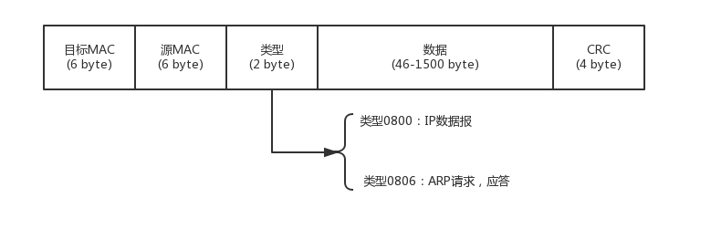
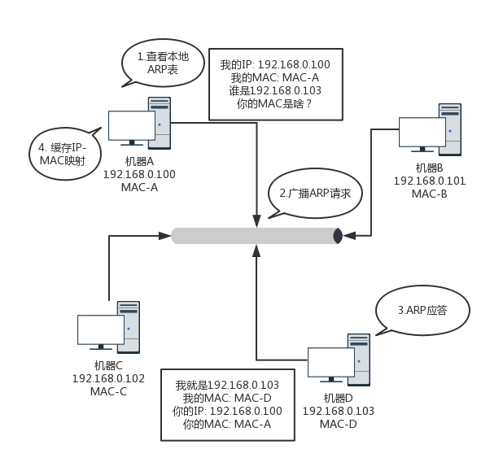
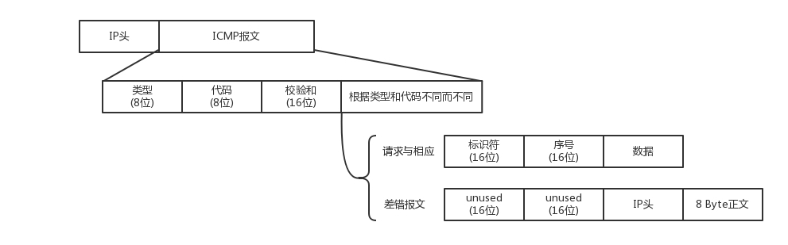
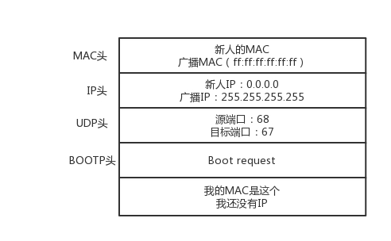

# 综述

大量参考刘超老师的专栏《趣谈协议》


# 7层模型

参考:

[OSI七层模型与TCP/IP五层模型](https://www.cnblogs.com/qishui/p/5428938.html)


按照不同的标准可以分为7层模型与5层模型


其中主要的协议


主要需要重点掌握的包括以下部分。


# 物理层

> #### 集线器(hub)

它完全在物理层工作。它会将自己收到的每一个字节，都复制到其他端口上去。这是第一层物理层联通的方案。


# 数据链路层

也即 MAC 层要解决的问题。**MAC**的全称是**Medium Access Control**，即**媒体访问控制。**

主要解决

1. 这个包是发给谁的？谁应该接收？
2. 大家都在发，会不会产生混乱？有没有谁先发、谁后发的规则？（**多路访问**的堵车问题）
3. 如果发送的时候出现了错误，怎么办？


> #### 多路访问方式

- 方式一：分多个车道。每个车一个车道，你走你的，我走我的。这在计算机网络里叫作**信道划分；**
- 方式二：今天单号出行，明天双号出行，轮着来。这在计算机网络里叫作**轮流协议；**
- 方式三：不管三七二十一，有事儿先出门，发现特堵，就回去。错过高峰再出。我们叫作**随机接入协议。**著名的以太网，用的就是这个方式。


> #### 发给谁，谁接收？

物理地址，叫作**链路层地址。**但是因为第二层主要解决媒体接入控制的问题，所以它常被称为**MAC 地址**。

第二层的网络包格式如下图



对于以太网，第二层的最开始，就是目标的 MAC 地址和源的 MAC 地址。接下来是**类型**，大部分的类型是 IP 数据包，然后 IP 里面包含 TCP、UDP，以及 HTTP 等，这都是里层封装的事情。

有了这个目标 MAC 地址，数据包在链路上广播，MAC 的网卡才能发现，这个包是给它的。MAC 的网卡把包收进来，然后打开 IP 包，发现 IP 地址也是自己的，再打开 TCP 包，发现端口是自己，也就是 80，而 nginx 就是监听 80。


> #### 数据校验

对于以太网，第二层的最后面是**CRC**，也就是**循环冗余检测**。通过 XOR 异或的算法，来计算整个包是否在发送的过程中出现了错误。

//todo 待解释CRC细节


> #### 交换机

Hub 是广播的，不管某个接口是否需要，所有的 Bit 都会被发送出去，然后让主机来判断是不是需要。这种方式路上的车少就没问题，车一多，产生冲突的概率就提高了。而且把不需要的包转发过去，纯属浪费。交换机把MAC 头拿下来，检查一下目标 MAC 地址，然后根据策略转发。

**工作原理**

一台 MAC1 电脑将一个包发送给另一台 MAC2 电脑，当这个包到达交换机的时候，一开始交换机也不知道 MAC2  的电脑在哪个口，所以没办法，它只能将包转发给除了来的那个口之外的其他所有的口。这个时候交换机会记住，MAC1 是来自一个明确的口。以后有包的目的地址是 MAC1 的，直接发送到这个口就可以了。

当交换机作为一个关卡一样，过了一段时间之后，就有了整个网络的一个结构了，这个时候，基本上不用广播了，全部可以准确转发。当然，每个机器的 IP 地址会变，所在的口也会变，因而交换机上的学习的结果，我们称为**转发表**，是有一个过期时间的。


## ARP 协议

已知 IP 地址，求 MAC 地址的协议。

在一个局域网里面，当知道了 IP 地址，不知道 MAC 怎么办呢？广而告之，发送一个广播包，谁是这个 IP 谁来回答。为了避免每次都用 ARP 请求，机器本地也会进行 ARP 缓存。当然机器会不断地上线下线，IP 也可能会变，所以 ARP 的 MAC 地址缓存过一段时间就会过期。

整个流程如下：




具体询问和回答的报文就像下面这样：


## STP 协议

> 第6讲 | 交换机与VLAN：办公室太复杂，我要回学校

网络拓扑结构相关内容。


> #### 如何解决常见的环路问题？

当交换机的数目越来越多的时候，会遭遇环路问题，让网络包迷路，这就需要使用 STP 协议，将有环路的图变成没有环路的树，从而解决环路问题。


> #### 如何解决广播问题和安全问题？

有两种分的方法，一个是**物理隔离**。单独的交换机，配置单独的子网。另外一种方式是**虚拟隔离**，就是用我们常说的**VLAN**，或者叫**虚拟局域网**。

使用 VLAN，一个交换机上会连属于多个局域网的机器，那交换机怎么区分哪个机器属于哪个局域网呢？


我们只需要在原来的二层的头上加一个 TAG，里面有一个 VLAN ID，一共 12 位，12 位可以划分  4096 个 VLAN。这样是不是还不够啊。现在的情况证明，目前云计算厂商里面绝对不止 4096 个用户。当然每个用户需要一个 VLAN  了啊，怎么办呢？//todo 

当这个交换机把二层的头取下来的时候，就能够识别这个 VLAN ID。这样只有相同 VLAN 的包，才会互相转发，不同 VLAN 的包，是看不到的。这样广播问题和安全问题就都能够解决了。

交换机之间怎么连接呢？将两个交换机连接起来的口应该设置成什么 VLAN 呢？对于支持 VLAN 的交换机，有一种口叫作**Trunk 口**。它可以转发属于任何 VLAN 的口。交换机之间可以通过这种口相互连接。


# 网络层

## ICMP 协议

> 第7讲 | ICMP与ping：投石问路的侦察兵      

**ICMP**全称**Internet Control Message Protocol**，就是**互联网控制报文协议**。这里面的关键词是“控制”。ping 是基于 ICMP 协议工作的。ICMP 报文是封装在 IP 包里面的。因为传输指令的时候，肯定需要源地址和目标地址。它本身非常简单。



ICMP 报文有很多的类型，不同的类型有不同的代码。**最常用的类型是主动请求为 8，主动请求的应答为 0**。

> #### 查询报文类型

常用的**ping 就是查询报文，是一种主动请求，并且获得主动应答的 ICMP 协议。**对 ping 的主动请求，称为**ICMP ECHO REQUEST。**同理主动请求的回复，称为**ICMP ECHO REPLY**。

比起原生的 ICMP，这里面多了两个字段，一个是**标识符**。这个很好理解，你派出去两队侦查兵，一队是侦查战况的，一队是去查找水源的，要有个标识才能区分。另一个是**序号**，你派出去的侦查兵，都要编个号。在选项数据中，ping 还会存放发送请求的时间值，来计算往返时间，说明路程的长短。


> #### 差错报文类型

这种是异常情况发起的，来报告发生了不好的事情，对应 ICMP 的**差错报文类型**。

几个 ICMP 差错报文的例子：**终点不可达为 3，源抑制为 4，超时为 11，重定向为 5**。

**第一种是终点不可达**。

结果没有送到。具体的原因在代码中表示就是，网络不可达代码为 0，主机不可达代码为 1，协议不可达代码为 2，端口不可达代码为 3，需要进行分片但设置了不分片位代码为 4。

**第二种是源站抑制**，也就是让源站放慢发送速度。

**第三种是时间超时**，也就是超过网络包的生存时间还是没到。

**第四种是路由重定向**，也就是让下次发给另一个路由器。

差错报文的结构相对复杂一些。除了前面还是 IP，ICMP 的前 8 字节不变，后面则跟上出错的那个 IP 包的 IP 头和 IP 正文的前 8 个字节。


**Traceroutem命令**

ping 使用查询报文，Traceroute 使用差错报文。

**Traceroute 的第一个作用就是故意设置特殊的 TTL，来追踪去往目的地时沿途经过的路由器**。

**Traceroute 还有一个作用是故意设置不分片，从而确定路径的 MTU。**


## IP协议


上面这个表格，详细地展示了 A、B、C 三类地址所能包含的主机的数量。


> #### 无类型域间选路（CIDR）

由于C类地址实在太少，于是有了一个折中的方式叫作**无类型域间选路**，简称**CIDR**。这种方式打破了原来设计的几类地址的做法，将 32 位的 IP 地址一分为二，前面是**网络号**，后面是**主机号**。从哪里分呢？你如果注意观察的话可以看到，10.100.122.2/24，这个 IP 地址中有一个斜杠，斜杠后面有个数字 24。这种地址表示形式，就是 CIDR。后面 24 的意思是，32 位中，前 24 位是网络号，后 8 位是主机号。

伴随着 CIDR 存在的，一个是**广播地址**，10.100.122.255。如果发送这个地址，所有 10.100.122 网络里面的机器都可以收到。另一个是**子网掩码**，255.255.255.0。

将子网掩码和 IP 地址进行 AND 计算。前面三个 255，转成二进制都是 1。1 和任何数值取  AND，都是原来数值，因而前三个数不变，为 10.100.122。后面一个 0，转换成二进制是 0，0 和任何数值取 AND，都是  0，因而最后一个数变为 0，合起来就是 10.100.122.0。这就是**网络号**。**将子网掩码和 IP 地址按位计算 AND，就可得到网络号。**


> #### 多播与组播的区别

// todo


> #### 随便填一个ip会发送什么？
>
> 第04讲丨DHCP与PXE：IP是怎么来的，又是怎么没的？—— 《趣谈协议》

不会出现任何现象，就是包发不出去呗。

192.168.1.6 就在你这台机器的旁边，甚至是在同一个交换机上，而你把机器的地址设为了 16.158.23.6。在这台机器上，你企图去 ping192.168.1.6。

这个包它有自己的源 IP 地址 16.158.23.6，也有目标 IP 地址 192.168.1.6，但是包发不出去，这是因为 MAC 层还没填。自己的 MAC 地址自己知道，这个容易。但是目标 MAC 填什么呢？是不是填 192.168.1.6 这台机器的 MAC 地址呢？

当然不是。Linux 首先会判断，要去的这个地址和我是一个网段的吗，或者和我的一个网卡是同一网段的吗？只有是一个网段的，它才会发送 ARP 请求，获取 MAC 地址。如果发现不是呢？**Linux 默认的逻辑是，如果这是一个跨网段的调用，它便不会直接将包发送到网络上，而是企图将包发送到网关。**

如果你配置了网关的话，Linux 会获取网关的 MAC 地址，然后将包发出去。对于 192.168.1.6 这台机器来讲，目标 IP 是它，但是无奈 MAC 地址不是它的，所以它的网卡是不会把包收进去的。

如果没有配置网关呢？那包压根就发不出去。如果将网关配置为 192.168.1.6 呢？不可能，Linux 不会让你配置成功的，因为网关要和当前的网络至少一个网卡是同一个网段的，怎么可能 16.158.23.6 的网关是 192.168.1.6 呢？


### IP头

> 第8讲 | 世界这么大，我想出网关：欧洲十国游与玄奘西行      


在 MAC 头里面，先是目标 MAC 地址，然后是源 MAC 地址，然后有一个协议类型，用来说明里面是 IP 协议。IP  头里面的版本号，目前主流的还是 IPv4，服务类型 TOS 在第三节讲 ip addr 命令的时候讲过，TTL 在第 7 节讲 ICMP  协议的时候讲过。另外，还有 8 位标识协议。这里到了下一层的协议，也就是，是 TCP 还是 UDP。最重要的就是源 IP 和目标 IP。先是源  IP 地址，然后是目标 IP 地址。

在任何一台机器上，当要访问另一个 IP 地址的时候，都会先判断，这个目标 IP 地址，和当前机器的 IP 地址，是否在同一个网段。怎么判断同一个网段呢？需要 CIDR 和子网掩码，这个在第三节的时候也讲过了。

**如果是同一个网段**，那就没网关什么事情，直接将源地址和目标地址放入 IP 头中，然后通过 ARP 获得 MAC 地址，将源 MAC 和目的 MAC 放入 MAC 头中，发出去就可以了。

**如果不是同一网段**，这就需要发往默认网关  Gateway。Gateway 的地址一定是和源 IP 地址是一个网段的。往往不是第一个，就是第二个。例如 192.168.1.0/24  这个网段，Gateway 往往会是 192.168.1.1/24 或者 192.168.1.2/24。

如何发往默认网关呢？网关不是和源 IP 地址是一个网段的么？这个过程就和发往同一个网段的其他机器是一样的：将源地址和目标 IP 地址放入  IP 头中，通过 ARP 获得网关的 MAC 地址，将源 MAC 和网关的 MAC 放入 MAC 头中，发送出去。网关所在的端口，例如  192.168.1.1/24 将网络包收进来，然后接下来怎么做，就完全看网关的了。

**网关往往是一个路由器，是一个三层转发的设备。**啥叫三层设备？前面也说过了，就是把 MAC 头和 IP 头都取下来，然后根据里面的内容，看看接下来把包往哪里转发的设备。

很多情况下，人们把网关就叫作路由器。其实不完全准确，而另一种比喻更加恰当：**路由器是一台设备，它有五个网口或者网卡，相当于有五只手，分别连着五个局域网。每只手的 IP 地址都和局域网的 IP 地址相同的网段，每只手都是它握住的那个局域网的网关。**

任何一个想发往其他局域网的包，都会到达其中一只手，被拿进来，拿下 MAC 头和 IP 头，看看，根据自己的路由算法，选择另一只手，加上 IP 头和 MAC 头，然后扔出去。


### 静态路由

**静态路由，其实就是在路由器上，配置一条一条规则。**每当要选择从哪抛出去的时候，就一条一条的匹配规则，找到符合的规则，就按规则中设置的那样，从某个口抛出去，找下一跳 IPX。

> #### IP 头和 MAC 头哪些变、哪些不变？

MAC 地址是一个局域网内才有效的地址。因而，MAC 地址只要过网关，就必定会改变，因为已经换了局域网。两者主要的区别在于 IP 地址是否改变。不改变 IP 地址的网关，我们称为**转发网关；**改变 IP 地址的网关，我们称为**NAT 网关**。


**转发网关**

每到一个新的局域网，MAC 都是要变的，但是 IP 地址都不变。在 IP 头里面，不会保存任何网关的 IP 地址。**所谓的下一跳是，某个 IP 要将这个 IP 地址转换为 MAC 放入 MAC 头。在整个过程中，IP 头里面的地址都是不变的。IP 地址在三个局域网都可见，在三个局域网之间的网段都不会冲突。在三个网段之间传输包，IP 头不改变。


**NAT 网关**

IP 地址也变，这个过程用英文说就是**Network Address Translation**，简称**NAT**。

转发网关遇见的第一个问题是，局域网之间没有商量过，各定各的网段，因而 IP 段冲突了。最左面大唐的地址是  192.168.1.101，最右面印度的地址也是 192.168.1.101，如果单从 IP 地址上看，简直是自己访问自己，其实是大唐的  192.168.1.101 要访问印度的 192.168.1.101。

包在公网与私网传递时需要进行IP转换，转换规则是在路由器里面写定了的。


### 动态路由

> 第9讲 | 路由协议：西出网关无故人，敢问路在何方      


> #### 如何配置路由？

路由器就是一台网络设备，它有多张网卡。当一个入口的网络包送到路由器时，它会根据一个本地的转发信息库，来决定如何正确地转发流量。这个转发信息库通常被称为**路由表**。


一张路由表中会有多条路由规则。每一条规则至少包含这三项信息。

- 目的网络：这个包想去哪儿？
- 出口设备：将包从哪个口扔出去？
- 下一跳网关：下一个路由器的地址。

通过 route 命令和 ip route 命令都可以进行查询或者配置。


> #### 动态路由算法

使用动态路由路由器，可以根据路由协议算法生成动态路由表，随网络运行状况的变化而变化。我们都可以将复杂的路径，抽象为一种叫作图的数据结构。路越少越好，道路越短越好，因而这就转化成为**如何在途中找到最短路径**的问题，最短路径常用的有两种方法，一种是 Bellman-Ford 算法，一种是 Dijkstra 算法。


> #### 距离矢量路由算法

第一大类的算法称为**距离矢量路由**（**distance vector routing**）。它是基于 Bellman-Ford 算法的。

这种算法的基本思路是，每个路由器都保存一个路由表，包含多行，每行对应网络中的一个路由器，每一行包含两部分信息，一个是要到目标路由器，从那条线出去，另一个是到目标路由器的距离。

由此可以看出，每个路由器都是知道全局信息的。那这个信息如何更新呢？每个路由器都知道自己和邻居之间的距离，每过几秒，每个路由器都将自己所知的到达所有的路由器的距离告知邻居，每个路由器也能从邻居那里得到相似的信息。

每个路由器根据新收集的信息，计算和其他路由器的距离，比如自己的一个邻居距离目标路由器的距离是 M，而自己距离邻居是 x，则自己距离目标路由器是 x+M。


**存在问题：**

**第一个问题就是好消息传得快，坏消息传得慢。**如果有个路由器加入了这个网络，它的邻居就能很快发现它，然后将消息广播出去。要不了多久，整个网络就都知道了。但是一旦一个路由器挂了，挂的消息是没有广播的。当每个路由器发现原来的道路到不了这个路由器的时候，感觉不到它已经挂了，而是试图通过其他的路径访问，直到试过了所有的路径，才发现这个路由器是真的挂了。

**第二个问题是，每次发送的时候，要发送整个全局路由表。**网络大了，谁也受不了，所以最早的路由协议 RIP 就是这个算法。它适用于小型网络（小于 15 跳）。当网络规模都小的时候，没有问题。现在一个数据中心内部路由器数目就很多，因而不适用了。


#### BGP协议

基于距离矢量路由算法的 BGP。外网的路由协议，也即国家之间的。我们称为**外网路由协议**（**Border Gateway Protocol**，简称**BGP**）。

国家之间，不光远近的问题，还有政策的问题。对于网络包同样，每个数据中心都设置自己的 Policy。例如，哪些外部的 IP 可以让内部知晓，哪些内部的 IP 可以让外部知晓，哪些可以通过，哪些不能通过。这就好比，虽然从我家里到目的地最近，但是不能谁都能从我家走啊！在网络世界，这一个个国家成为自治系统**AS**（Autonomous System）。自治系统分几种类型。

- Stub AS：对外只有一个连接。这类 AS 不会传输其他 AS 的包。例如，个人或者小公司的网络。
- Multihomed AS：可能有多个连接连到其他的 AS，但是大多拒绝帮其他的 AS 传输包。例如一些大公司的网络。
- Transit AS：有多个连接连到其他的 AS，并且可以帮助其他的 AS 传输包。例如主干网。

每个自治系统都有边界路由器，通过它和外面的世界建立联系。

**BGP 又分为两类，eBGP 和 iBGP。**自治系统间，边界路由器之间使用 eBGP 广播路由。内部网络也需要访问其他的自治系统。边界路由器如何将 BGP 学习到的路由导入到内部网络呢？就是通过运行 iBGP，使得内部的路由器能够找到到达外网目的地的最好的边界路由器。

BGP 协议使用的算法是**路径矢量路由协议**（path-vector protocol）。它是距离矢量路由协议的升级版。

前面说了距离矢量路由协议的缺点。其中一个是收敛慢。在 BGP 里面，除了下一跳 hop 之外，还包括了自治系统 AS  的路径，从而可以避免坏消息传的慢的问题，也即上面所描述的，B 知道 C 原来能够到达 A，是因为通过自己，一旦自己都到达不了 A 了，就不用假设 C 还能到达 A 了。

另外，在路径中将一个自治系统看成一个整体，不区分自治系统内部的路由器，这样自治系统的数目是非常有限的。就像大家都能记住出去玩，从中国出发先到韩国然后到日本，只要不计算细到具体哪一站，就算是发送全局信息，也是没有问题的。


> #### 链路状态路由算法

第二大类算法是**链路状态路由**（**link state routing**），基于 Dijkstra 算法。

这种算法的基本思路是：当一个路由器启动的时候，首先是发现邻居，向邻居 say hello，邻居都回复。然后计算和邻居的距离，发送一个  echo，要求马上返回，除以二就是距离。然后将自己和邻居之间的链路状态包广播出去，发送到整个网络的每个路由器。这样每个路由器都能够收到它和邻居之间的关系的信息。因而，每个路由器都能在自己本地构建一个完整的图，然后针对这个图使用 Dijkstra 算法，找到两点之间的最短路径。

不像距离距离矢量路由协议那样，更新时发送整个路由表。链路状态路由协议只广播更新的或改变的网络拓扑，这使得更新信息更小，节省了带宽和 CPU 利用率。而且一旦一个路由器挂了，它的邻居都会广播这个消息，可以使得坏消息迅速收敛。


#### OSPF协议

基于链路状态路由算法的 **OSPF**（**Open Shortest Path First**，**开放式最短路径优先**）就是这样一个基于链路状态路由协议，广泛应用在数据中心中的协议。由于主要用在数据中心内部，用于路由决策，因而称为**内部网关协议**（**Interior Gateway Protocol**，简称**IGP**）。内部网关协议的重点就是找到最短的路径。在一个组织内部，路径最短往往最优。当然有时候 OSPF 可以发现多个最短的路径，可以在这多个路径中进行负载均衡，这常常被称为**等价路由**。


# 传输层

> 第10讲讲UDP协议：因性善而简单，难免碰到“城会玩”

传输层主要就是TCP与UDP被问的最多。


> #### TCP和UDP有哪些区别？

- TCP是面向连接的，UDP是面向无连接的。什么叫面向连接，什么叫无连接呢？

  在互通之前，面向连接的协议会先建立连接。例如，TCP会三次握手，而UDP不会。

- 为什么要建立连接呢？你TCP三次握手，我UDP也可以发三个包玩玩，有什么区别吗？

  **所谓的建立连接，是为了在客户端和服务端维护连接，而建立一定的数据结构来维护双方交互的状态，用这样的数据结构来保证所谓的面向连接的特性。**

例如，**TCP提供可靠交付**。通过TCP连接传输的数据，无差错、不丢失、不重复、并且按序到达。我们都知道IP包是没有任何可靠性保证的。但是TCP号称能做到那个连接维护的程序做的事情。而**UDP继承了IP包的特性，不保证不丢失，不保证按顺序到达。**

再如，**TCP是面向字节流的**。发送的时候发的是一个流，没头没尾。IP包可不是一个流，而是一个个的IP包。之所以变成了流，这也是TCP自己的状态维护做的事情。而**UDP继承了IP的特性，基于数据报的，一个一个地发，一个一个地收。**

还有**TCP是可以有拥塞控制的**。它意识到包丢弃了或者网络的环境不好了，就会根据情况调整自己的行为，看看是不是发快了，要不要发慢点。**UDP就不会，应用让我发，我就发，管它洪水滔天。**

因而**TCP其实是一个有状态服务**，通俗地讲就是有脑子的，里面精确地记着发送了没有，接收到没有，发送到哪个了，应该接收哪个了，错一点儿都不行。而**UDP则是无状态服务。**通俗地说是没脑子的，天真无邪的，发出去就发出去了。

我们可以这样比喻，如果MAC层定义了本地局域网的传输行为，IP层定义了整个网络端到端的传输行为，这两层基本定义了这样的基因：网络传输是以包为单位的，**二层叫帧，网络层叫包，传输层叫段**。我们笼统地称为包。包单独传输，自行选路，在不同的设备封装解封装，不保证到达。基于这个基因，生下来的孩子UDP完全继承了这些特性，几乎没有自己的思想。


## TCP

> 第11讲讲TCP协议（上）：因性恶而复杂，先恶后善反轻松

TCP是在不可靠的IP层上实现的可靠的数据传输协议，它主要解决传输的**可靠、有序、无丢失和不重复问题**。

1. TCP是**面向链接**的**传输层**协议。
2. 每一条TCP连接只能有2个端点。
3. 全双工
4. 面向字节流


### TCP包头


1. **序号：**TCP是面向字节流的，传输时是按照字节一个个字节来传输的，所以需要带编号。这个字段的意思是——本报文段所发送的数据的第一个字节的序号。
2. **确认号**：期望收到对方的**下一个报文段的数据的第一个字节**的序号。
3. **确认位（ACK）**：只有当`ACK = 1 `时，确认号字段才有效。TCP规定，在连接建立后所有传送的报文段都必须把ACK置为1。
4. **同步位（SYN）**；`SYN = 1` 时表明这是一个连接请求或者连接接受报文。
   - 当`SYN = 1， ACK = 0` 时表明这是一个连接请求报文。
   - 当`SYN = 1， ACK = 1` 时表明这是一个连接接受报文。
5. **终止位（FIN）**：用来释放一个连接。`FIN = 1` 表明此报文段的发送方的数据已发送完毕，并要求释放传输连接。
6. **校验和**：//todo 求法
7. **紧急指针**：


### 三次握手


1. 第一次握手：Client将标志位SYN置为1，随机产生一个值seq=J，并将该数据包发送给Server，Client进入**SYN_SENT**状态，等待Server确认。（连接请求不携带数据，但要消耗掉一个序号）。
2. 第二次握手：Server收到数据包后由标志位SYN=1知道Client请求建立连接，Server将标志位SYN和ACK都置为1，ack=J+1，随机产生一个值seq=K，并将该数据包发送给Client以确认连接请求，Server进入**SYN_RCVD**状态。（**这时server为该TCP连接分配TCP缓存和变量**，确认报文也不携带数据，但要消耗掉一个序号）。
3. 第三次握手：Client收到确认后，检查ack是否为J+1，ACK是否为1，如果正确则将标志位ACK置为1，序号字段为j + 1 ，确认号字段为 ack=K+1，并将该数据包发送给Server，Server检查ack是否为K+1，ACK是否为1，如果正确则连接建立成功，Client和Server进入**ESTABLISHED**状态，完成三次握手，随后Client与Server之间可以开始传输数据了。（这时client为该TCP连接分配TCP缓存和变量）


### 四次挥手


1. 第一次挥手：Client发送一个FIN，用来关闭Client到Server的数据传送，Client进入FIN_WAIT_1状态。
2. 第二次挥手：Server收到FIN后，发送一个ACK给Client，确认序号为收到序号+1（与SYN相同，一个FIN占用一个序号），Server进入CLOSE_WAIT状态。
3. 第三次挥手：Server发送一个FIN，用来关闭Server到Client的数据传送，Server进入LAST_ACK状态。
4. 第四次挥手：Client收到FIN后，Client进入TIME_WAIT状态，接着发送一个ACK给Server，确认序号为收到序号+1，Server进入CLOSED状态，完成四次挥手。


### TCP状态机


在这个图中，加黑加粗的部分，是上面说到的主要流程，其中阿拉伯数字的序号，是连接过程中的顺序，而大写中文数字的序号，是连接断开过程中的顺序。加粗的实线是客户端A的状态变迁，加粗的虚线是服务端B的状态变迁。


### TCP 协议如何保证可靠传输

> 第12讲讲TCP协议（下）：西行必定多妖孽，恒心智慧消磨难            

TCP使用了校验、序号、确认和重传等机制来达到这个目的。

1. **序号：**TCP 给发送的每一个包进行编号，接收方对数据包进行排序，把有序数据传送给应用层。 

2. **确认：**TCP默认使用累计确认，即TCP只确认数据流中至第一个丢失字节为止的字节。

3. **校验和：** TCP 将保持它首部和数据的检验和。这是一个端到端的检验和，目的是检测数据在传输过程中的任何变化。如果收到段的检验和有差错，TCP 将丢弃这个报文段和不确认收到此报文段。 

4. **重传：**超时和冗余ACK都会导致重传。

   - **自动重传请求 ARQ 协议**

     停止等待协议中超时重传是指只要超过一段时间仍然没有收到确认，就重传前面发送过的分组（认为刚才发送过的分组丢失了）。因此每发送完一个分组需要设置一个超时计时器，其重转时间应比数据在分组传输的平均往返时间更长一些。这种自动重传方式常称为自动重传请求ARQ。

     **优点：** 简单

     **缺点：** 信道利用率低

   - **连续ARQ协议**

     连续 ARQ 协议可提高信道利用率。发送方维持一个发送窗口，凡位于发送窗口内的分组可以连续发送出去，而不需要等待对方确认。接收方一般采用累计确认，对按序到达的最后一个分组发送确认，表明到这个分组为止的所有分组都已经正确收到了。

     **优点：** 信道利用率高，容易实现，即使确认丢失，也不必重传。

     **缺点：** 不能向发送方反映出接收方已经正确收到的所有分组的信息。 比如：发送方发送了 5条 消息，中间第三条丢失（3号），这时接收方只能对前两个发送确认。发送方无法知道后三个分组的下落，而只好把后三个全部重传一次。这也叫 Go-Back-N（回退 N），表示需要退回来重传已经发送过的 N 个消息。
   
   - **Selective Acknowledgment**  （**SACK**）。这种方式需要在TCP头里加一个SACK的东西，可以将缓存的地图发送给发送方。例如可以发送ACK6、SACK8、SACK9，有了地图，发送方一下子就能看出来是7丢了。


#### TCP流量控制

1. 目的是消除发送方使接收方缓存区溢出，因此可以说流量控制是一个速度匹配服务。
2. TCP使用滑动窗口机制来实现流量控制。


为了记录所有发送的包和接收的包，TCP也需要发送端和接收端分别都有缓存来保存这些记录。发送端的缓存里是按照包的ID一个个排列，根据处理的情况分成四个部分。

第一部分：发送了并且已经确认的。这部分就是你交代下属的，并且也做完了的，应该划掉的。

第二部分：发送了并且尚未确认的。这部分是你交代下属的，但是还没做完的，需要等待做完的回复之后，才能划掉。

第三部分：没有发送，但是已经等待发送的。这部分是你还没有交代给下属，但是马上就要交代的。

第四部分：没有发送，并且暂时还不会发送的。这部分是你还没有交代给下属，而且暂时还不会交代给下属的。

在TCP里，接收端会给发送端报一个窗口的大小，叫**Advertised window**。这个窗口的大小应该等于上面的第二部分加上第三部分，就是已经交代了没做完的加上马上要交代的。超过这个窗口的，接收端做不过来，就不能发送了。

于是，发送端需要保持下面的数据结构。


对于接收端来讲，它的缓存里记录的内容要简单一些。

第一部分：接受并且确认过的。也就是我领导交代给我，并且我做完的。

第二部分：还没接收，但是马上就能接收的。也即是我自己的能够接受的最大工作量。

第三部分：还没接收，也没法接收的。也即超过工作量的部分，实在做不完。


- MaxRcvBuffer：最大缓存的量；
- LastByteRead之后是已经接收了，但是还没被应用层读取的；
- NextByteExpected是第一部分和第二部分的分界线。

第二部分的窗口有多大呢？

NextByteExpected和LastByteRead的差其实是还没被应用层读取的部分占用掉的MaxRcvBuffer的量，我们定义为A。

AdvertisedWindow其实是MaxRcvBuffer减去A。

也就是：AdvertisedWindow=MaxRcvBuffer-((NextByteExpected-1)-LastByteRead)。

那第二部分和第三部分的分界线在哪里呢？NextByteExpected加AdvertisedWindow就是第二部分和第三部分的分界线，其实也就是LastByteRead加上MaxRcvBuffer。

其中第二部分里面，由于受到的包可能不是顺序的，会出现空挡，只有和第一部分连续的，可以马上进行回复，中间空着的部分需要等待，哪怕后面的已经来了。


#### TCP拥塞控制

1. 目的是防止过多的数据注入网络中，这样可以使网络中的路由器或者链路不致过载（**包丢失**和**超时重传**）。

2. 四种算法：慢开始、拥塞避免、快重传、快恢复。

   - **慢开始：** 慢开始算法的思路是当主机开始发送数据时，如果立即把大量数据字节注入到网络，那么可能会引起网络阻塞，因为现在还不知道网络的符合情况。经验表明，较好的方法是先探测一下，即由小到大逐渐增大发送窗口，也就是由小到大逐渐增大拥塞窗口数值。cwnd初始值为1，每经过一个传播轮次，cwnd加倍。
   
   - **拥塞避免：** 拥塞避免算法的思路是让拥塞窗口cwnd缓慢增大，即每经过一个往返时间RTT就把发送放的cwnd加1.
   - **快重传与快恢复：**
     在 TCP/IP 中，快速重传和恢复（fast retransmit and recovery，FRR）是一种拥塞控制算法，它能快速恢复丢失的数据包。没有 FRR，如果数据包丢失了，TCP 将会使用定时器来要求传输暂停。在暂停的这段时间内，没有新的或复制的数据包被发送。有了 FRR，如果接收机接收到一个不按顺序的数据段，它会立即给发送机发送一个重复确认。如果发送机接收到三个重复确认，它会假定确认件指出的数据段丢失了，并立即重传这些丢失的数据段。有了 FRR，就不会因为重传时要求的暂停被耽误。 　当有单独的数据包丢失时，快速重传和恢复（FRR）能最有效地工作。当有多个数据信息包在某一段很短的时间内丢失时，它则不能很有效地工作。


例子：

一条TCP连接开始，cwnd设置为一个报文段，一次只能发送一个；当收到这一个确认的时候，cwnd加一，于是一次能够发送两个；当这两个的确认到来的时候，每个确认cwnd加一，两个确认cwnd加二，于是一次能够发送四个；当这四个的确认到来的时候，每个确认cwnd加一，四个确认cwnd加四，于是一次能够发送八个。可以看出这是**指数性的增长**。

涨到什么时候是个头呢？有一个值ssthresh为65535个字节，当超过这个值的时候，就要小心一点了，不能倒这么快了，可能快满了，再慢下来。

每收到一个确认后，cwnd增加1/cwnd，我们接着上面的过程来，一次发送八个，当八个确认到来的时候，每个确认增加1/8，八个确认一共cwnd增加1，于是一次能够发送九个，变成了线性增长。

但是线性增长还是增长，还是越来越多，直到有一天，水满则溢，出现了拥塞，这时候一般就会一下子降低倒水的速度，等待溢出的水慢慢渗下去。

拥塞的一种表现形式是丢包，需要超时重传，这个时候，将sshresh设为cwnd/2，将cwnd设为1，重新开始慢启动。这真是一旦超时重传，马上回到解放前。但是这种方式太激进了，将一个高速的传输速度一下子停了下来，会造成网络卡顿。

前面我们讲过**快速重传算法**。当接收端发现丢了一个中间包的时候，发送三次前一个包的ACK，于是发送端就会快速的重传，不必等待超时再重传。TCP认为这种情况不严重，因为大部分没丢，只丢了一小部分，cwnd减半为cwnd/2，然后sshthresh = cwnd，当三个包返回的时候，cwnd = sshthresh + 3，也就是没有一夜回到解放前，而是还在比较高的值，呈线性增长。


就像前面说的一样，正是这种知进退，使得时延很重要的情况下，反而降低了速度。但是如果你仔细想一下，TCP的拥塞控制主要来避免的两个现象都是有问题的。

**第一个问题**是丢包并不代表着通道满了，也可能是管子本来就漏水。例如公网上带宽不满也会丢包，这个时候就认为拥塞了，退缩了，其实是不对的。

**第二个问题**是TCP的拥塞控制要等到将中间设备都填充满了，才发生丢包，从而降低速度，这时候已经晚了。其实TCP只要填满管道就可以了，不应该接着填，直到连缓存也填满。

为了优化这两个问题，后来有了**TCP BBR拥塞算法**。它企图找到一个平衡点，就是通过不断的加快发送速度，将管道填满，但是不要填满中间设备的缓存，因为这样时延会增加，在这个平衡点可以很好的达到高带宽和低时延的平衡。


## UDP

### UDP包头


UDP协议就相当于一个白板，让开发人员有极大的扩展空间。

> #### UDP校验和是怎么算的？

// todo


> #### UDP的三大特点

第一，**简单**，不需大量的数据结构、处理逻辑、包头字段。前提是它相信网络通路默认就是很容易送达的，不容易被丢弃的。

第二，**无校验**。它不会建立连接，虽然有端口号，但是监听在这个地方，谁都可以传给他数据，他也可以传给任何人数据，甚至可以同时传给多个人数据。

第三，**无拥塞控制**。它不会根据网络的情况进行发包的拥塞控制，无论网络丢包丢成啥样了，它该怎么发还怎么发。

 

> #### UDP的三大使用场景

第一，**需要资源少，在网络情况比较好的内网，或者对于丢包不敏感的应用**。

DHCP就是基于UDP协议的。一般的获取IP地址都是内网请求，而且一次获取不到IP又没事，过一会儿还有机会。PXE可以在启动的时候自动安装操作系统，操作系统镜像的下载使用的TFTP，这个也是基于UDP协议的。在还没有操作系统的时候，客户端拥有的资源很少，不适合维护一个复杂的状态机，而是因为是内网，一般也没啥问题。

第二，**不需要一对一沟通，建立连接，而是可以广播的应用**。

UDP的不面向连接的功能，可以使得可以承载广播或者多播的协议。DHCP就是一种广播的形式，就是基于UDP协议的，而广播包的格式前面说过了。

对于多播，我们在讲IP地址的时候，讲过一个D类地址，也即组播地址，使用这个地址，可以将包组播给一批机器。当一台机器上的某个进程想监听某个组播地址的时候，需要发送IGMP包，所在网络的路由器就能收到这个包，知道有个机器上有个进程在监听这个组播地址。当路由器收到这个组播地址的时候，会将包转发给这台机器，这样就实现了跨路由器的组播。

在后面云中网络部分，有一个协议VXLAN，也是需要用到组播，也是基于UDP协议的。

第三，**需要处理速度快，时延低，可以容忍少数丢包，但是要求即便网络拥塞，也毫不退缩，一往无前的时候**。

- **网页或者APP的访问**

  原来访问网页和手机APP都是基于HTTP协议的。HTTP协议是基于TCP的，建立连接都需要多次交互，对于时延比较大的目前主流的移动互联网来讲，建立一次连接需要的时间会比较长，然而既然是移动中，TCP可能还会断了重连，也是很耗时的。而且目前的HTTP协议，往往采取多个数据通道共享一个连接的情况，这样本来为了加快传输速度，但是TCP的严格顺序策略使得哪怕共享通道，前一个不来，后一个和前一个即便没关系，也要等着，时延也会加大。

  而**QUIC**（全称**Quick UDP Internet Connections**，**快速UDP互联网连接**）是Google提出的一种基于UDP改进的通信协议，其目的是降低网络通信的延迟，提供更好的用户互动体验。QUIC在应用层上，会自己实现快速连接建立、减少重传时延，自适应拥塞控制。

- **流媒体的协议**

  直播协议多使用RTMP，而这个RTMP协议也是基于TCP的。TCP的严格顺序传输要保证前一个收到了，下一个才能确认，如果前一个收不到，下一个就算包已经收到了，在缓存里面，也需要等着。对于直播来讲，这显然是不合适的，因为老的视频帧丢了其实也就丢了，就算再传过来用户也不在意了，他们要看新的了，如果老是没来就等着，卡顿了，新的也看不了，那就会丢失客户，所以直播，实时性比较比较重要，宁可丢包，也不要卡顿的。

  另外，对于丢包，其实对于视频播放来讲，有的包可以丢，有的包不能丢，因为视频的连续帧里面，有的帧重要，有的不重要，如果必须要丢包，隔几个帧丢一个，其实看视频的人不会感知，但是如果连续丢帧，就会感知了，因而在网络不好的情况下，应用希望选择性的丢帧。

  还有就是当网络不好的时候，TCP协议会主动降低发送速度，这对本来当时就卡的看视频来讲是要命的，应该应用层马上重传，而不是主动让步。因而，很多直播应用，都基于UDP实现了自己的视频传输协议。

- **实时游戏**

  游戏有一个特点，就是实时性比较高。因而，实时游戏中客户端和服务端要建立长连接，来保证实时传输。但是游戏玩家很多，服务器却不多。由于维护TCP连接需要在内核维护一些数据结构，因而一台机器能够支撑的TCP连接数目是有限的，然后UDP由于是没有连接的，在异步IO机制引入之前，常常是应对海量客户端连接的策略。

  另外还是TCP的强顺序问题，对战的游戏，对网络的要求很简单，玩家通过客户端发送给服务器鼠标和键盘行走的位置，服务器会处理每个用户发送过来的所有场景，处理完再返回给客户端，客户端解析响应，渲染最新的场景展示给玩家。

  如果出现一个数据包丢失，所有事情都需要停下来等待这个数据包重发。客户端会出现等待接收数据，然而玩家并不关心过期的数据，激战中卡1秒，等能动了都已经死了。

  游戏对实时要求较为严格的情况下，采用自定义的可靠UDP协议，自定义重传策略，能够把丢包产生的延迟降到最低，尽量减少网络问题对游戏性造成的影响。

- **“城会玩”四：IoT物联网**

  一方面，物联网领域终端资源少，很可能只是个内存非常小的嵌入式系统，而维护TCP协议代价太大；另一方面，物联网对实时性要求也很高，而TCP还是因为上面的那些原因导致时延大。Google旗下的Nest建立Thread Group，推出了物联网通信协议Thread，就是基于UDP协议的。

- **“城会玩”五：移动通信领域**

  在4G网络里，移动流量上网的数据面对的协议GTP-U是基于UDP的。因为移动网络协议比较复杂，而GTP协议本身就包含复杂的手机上线下线的通信协议。如果基于TCP，TCP的机制就显得非常多余，这部分协议我会在后面的章节单独讲解。


# 应用层

## DHCP

> 第04讲丨DHCP与PXE：IP是怎么来的，又是怎么没的？

**动态主机配置协议（Dynamic Host Configuration Protocol）**，简称**DHCP**

> #### 解析 DHCP 的工作方式

**DHCP Discover。**

新来的机器使用 IP 地址 0.0.0.0 发送了一个广播包，目的 IP 地址为 255.255.255.255。广播包封装了  UDP，UDP 封装了 BOOTP。其实 DHCP 是 BOOTP 的增强版，但是如果你去抓包的话，很可能看到的名称还是 BOOTP 协议。在这个广播包里面，新人大声喊：我是新来的（Boot request），我的 MAC 地址是这个，我还没有 IP，谁能给租给我个 IP 地址！

Boot request 结构




**DHCP Offer**

如果一个网络管理员在网络里面配置了**DHCP Server**的话，立刻能知道来了一个“新人”。由于MAC 唯一，IP 管理员知道这是一个新人，需要租给它一个 IP 地址，这个过程我们称为**DHCP Offer**。同时，DHCP Server 为此客户保留为它提供的 IP 地址，从而不会为其他 DHCP 客户分配此 IP 地址。

DHCP Offer 的格式就像这样，里面有给新人分配的地址。


DHCP Server 仍然使用广播地址作为目的地址，因为，此时请求分配 IP 的新人还没有自己的 IP。除此之外，服务器还发送了子网掩码、网关和 IP 地址租用期等信息。

如果有多个 DHCP Server，这台新机器会收到多个 IP 地址。它会选择其中一个 DHCP Offer，一般是最先到达的那个，并且会向网络发送一个 DHCP Request 广播数据包，包中包含客户端的 MAC 地址、接受的租约中的 IP 地址、提供此租约的 DHCP 服务器地址等，并告诉所有 DHCP Server 它将接受哪一台服务器提供的 IP 地址，告诉其他 DHCP 服务器，谢谢你们的接纳，并请求撤销它们提供的 IP 地址，以便提供给下一个 IP 租用请求者。

此时，由于还没有得到 DHCP Server 的最后确认，客户端仍然使用 0.0.0.0 为源 IP 地址、255.255.255.255 为目标地址进行广播。在 BOOTP 里面，接受某个 DHCP Server 的分配的 IP。

当 DHCP Server 接收到客户机的 DHCP request 之后，会广播返回给客户机一个 DHCP ACK 消息包，表明已经接受客户机的选择，并将这一 IP 地址的合法租用信息和其他的配置信息都放入该广播包，发给客户机。最终租约达成的时候，还是需要广播一下，让大家都知道。


> #### IP 地址的收回和续租

客户机会在租期过去 50% 的时候，直接向为其提供 IP 地址的 DHCP Server 发送 DHCP request  消息包。客户机接收到该服务器回应的 DHCP ACK 消息包，会根据包中所提供的新的租期以及其他已经更新的 TCP/IP  参数，更新自己的配置。这样，IP 租用更新就完成了。


## HTTP 

> 第14讲 | HTTP协议：看个新闻原来这么麻烦

### HTTP 1.1

目前使用的 HTTP 协议大部分都是 1.1。在 1.1 的协议里面，默认是开启了 Keep-Alive 的，这样建立的 TCP 连接，就可以在多次请求中复用。

#### 报文格式

> #### 请求报文


HTTP 的报文大概分为三大部分。第一部分是**请求行**，第二部分是请求的**首部**，第三部分才是请求的**正文实体**。

> #### 请求行

sp:

cr:

if:


> #### 首部字段

请求行下面就是首部字段。首部是 key value，通过冒号分隔。这里面，往往保存了一些非常重要的字段。

例如，**Accept-Charset**，表示**客户端可以接受的字符集**。防止传过来的是另外的字符集，从而导致出现乱码。再如，**Content-Type**是指**正文的格式**。例如，我们进行 POST 的请求，如果正文是 JSON，那么我们就应该将这个值设置为 JSON。


> #### 返回报文


状态码会反应 HTTP 请求的结果。“200”、“404”等等。然后，短语会大概说一下原因。接下来是返回首部的**key value**。返回的头部里面也会有**Content-Type**，表示返回的是 HTML，还是 JSON。

队首阻塞问题 //todo


### HTTP 2.0

**HTTP 2.0 通过头压缩、分帧、二进制编码、多路复用等技术提升性能；**

HTTP 1.1 在应用层以纯文本的形式进行通信。每次通信都要带完整的 HTTP 的头，而且不考虑 pipeline 模式的话，每次的过程总是像上面描述的那样一去一回。这样在实时性、并发性上都存在问题。

为了解决这些问题，HTTP 2.0 会对 HTTP 的头进行一定的压缩，将原来每次都要携带的大量 key  value 在两端建立一个索引表，对相同的头只发送索引表中的索引。

另外，HTTP 2.0 协议将一个 TCP 的连接中，切分成多个流，每个流都有自己的 ID，而且流可以是客户端发往服务端，也可以是服务端发往客户端。它其实只是一个虚拟的通道。流是有优先级的。

HTTP 2.0 还将所有的传输信息分割为更小的消息和帧，并对它们采用二进制格式编码。常见的帧有**Header 帧**，用于传输 Header 内容，并且会开启一个新的流。再就是**Data 帧**，用来传输正文实体。多个 Data 帧属于同一个流。

通过这两种机制，HTTP 2.0 的客户端可以将多个请求分到不同的流中，然后将请求内容拆成帧，进行二进制传输。这些帧可以打散乱序发送， 然后根据每个帧首部的流标识符重新组装，并且可以根据优先级，决定优先处理哪个流的数据。

HTTP 2.0 成功解决了 HTTP 1.1 的队首阻塞问题，同时，也不需要通过 HTTP 1.x 的 pipeline 机制用多条 TCP  连接来实现并行请求与响应；减少了 TCP 连接数对服务器性能的影响，同时将页面的多个数据 css、js、 jpg  等通过一个数据链接进行传输，能够加快页面组件的传输速度。


缺陷：

HTTP 2.0 虽然大大增加了并发性，但还是有问题的。因为 HTTP 2.0 也是基于 TCP 协议的，TCP 协议在处理包时是有严格顺序的。

当其中一个数据包遇到问题，TCP 连接需要等待这个包完成重传之后才能继续进行。虽然 HTTP 2.0 通过多个  stream，使得逻辑上一个 TCP 连接上的并行内容，进行多路数据的传输，然而这中间并没有关联的数据。一前一后，前面 stream 2  的帧没有收到，后面 stream 1 的帧也会因此阻塞。


### HTTP3（QUIC）

> #### 机制一：自定义连接机制

我们都知道，一条 TCP 连接是由四元组标识的，分别是源 IP、源端口、目的  IP、目的端口。一旦一个元素发生变化时，就需要断开重连，重新连接。在移动互联情况下，当手机信号不稳定或者在 WIFI 和  移动网络切换时，都会导致重连，从而进行再次的三次握手，导致一定的时延。

这在 TCP 是没有办法的，但是基于 UDP，就可以在 QUIC 自己的逻辑里面维护连接的机制，不再以四元组标识，而是以一个 64  位的随机数作为 ID 来标识，而且 UDP 是无连接的，所以当 IP 或者端口变化的时候，只要 ID 不变，就不需要重新建立连接。


> #### 机制二：自定义重传机制

TCP 为了保证可靠性，通过使用**序号**和**应答**机制，来解决顺序问题和丢包问题。

任何一个序号的包发过去，都要在一定的时间内得到应答，否则一旦超时，就会重发这个序号的包。那怎么样才算超时呢？还记得我们提过的**自适应重传算法**吗？这个超时是通过**采样往返时间 RTT**不断调整的。

其实，在 TCP 里面超时的采样存在不准确的问题。例如，发送一个包，序号为 100，发现没有返回，于是再发送一个 100，过一阵返回一个  ACK101。这个时候客户端知道这个包肯定收到了，但是往返时间是多少呢？是 ACK 到达的时间减去后一个 100 发送的时间，还是减去前一个  100 发送的时间呢？事实是，第一种算法把时间算短了，第二种算法把时间算长了。

QUIC 也有个序列号，是递增的。任何一个序列号的包只发送一次，下次就要加一了。例如，发送一个包，序号是  100，发现没有返回；再次发送的时候，序号就是 101 了；如果返回的 ACK  100，就是对第一个包的响应。如果返回 ACK  101  就是对第二个包的响应，RTT 计算相对准确。

但是这里有一个问题，就是怎么知道包 100 和包 101 发送的是同样的内容呢？QUIC 定义了一个 offset 概念。QUIC  既然是面向连接的，也就像 TCP 一样，是一个数据流，发送的数据在这个数据流里面有个偏移量 offset，可以通过 offset  查看数据发送到了哪里，这样只要这个 offset 的包没有来，就要重发；如果来了，按照 offset 拼接，还是能够拼成一个流。


### 机制三：无阻塞的多路复用

有了自定义的连接和重传机制，我们就可以解决上面 HTTP  2.0 的多路复用问题。

同 HTTP 2.0 一样，同一条 QUIC 连接上可以创建多个 stream，来发送多个 HTTP 请求。但是，QUIC 是基于 UDP 的，一个连接上的多个 stream 之间没有依赖。这样，假如 stream2 丢了一个 UDP 包，后面跟着 stream3 的一个 UDP  包，虽然 stream2 的那个包需要重传，但是 stream3 的包无需等待，就可以发给用户。

### 机制四：自定义流量控制

TCP 的流量控制是通过**滑动窗口协议**。QUIC 的流量控制也是通过 window_update，来告诉对端它可以接受的字节数。但是 QUIC 的窗口是适应自己的多路复用机制的，不但在一个连接上控制窗口，还在一个连接中的每个 stream 控制窗口。

还记得吗？在 TCP 协议中，接收端的窗口的起始点是下一个要接收并且 ACK 的包，即便后来的包都到了，放在缓存里面，窗口也不能右移，因为 TCP 的 ACK 机制是基于序列号的累计应答，一旦 ACK 了一个系列号，就说明前面的都到了，所以只要前面的没到，后面的到了也不能  ACK，就会导致后面的到了，也有可能超时重传，浪费带宽。

QUIC 的 ACK 是基于 offset 的，每个 offset  的包来了，进了缓存，就可以应答，应答后就不会重发，中间的空挡会等待到来或者重发即可，而窗口的起始位置为当前收到的最大 offset，从这个  offset 到当前的 stream 所能容纳的最大缓存，是真正的窗口大小。显然，这样更加准确。


另外，还有整个连接的窗口，需要对于所有的 stream 的窗口做一个统计。

// todo 腾讯公众号有一篇非常好的


## HTTPS


# 请求全流程


1. 用户输入url，浏览器内部代码将url进行拆分解析
2. 浏览器首先去找本地的hosts文件，检查在该文件中是否有相应的域名、IP对应关系，如果有，则向其IP地址发送请求，如果没有就会将domain（域）发送给 dns进行解析，将域名解析成对应的服务器IP地址，发回给浏览器。
3. 浏览器拿到了服务器IP，接下来是网络通信，分层由高到低分别为：应用层、传输层、网络层、数据链路层。发送端从应用层往下走，接收端从数据链路层往上
4. 页面的渲染阶段
   1. 解析HTML生成DOM树。
   2. 解析CSS生成CSSOM规则树。
   3. 将DOM树与CSSOM规则树合并在一起生成渲染树。
   4. 遍历渲染树开始布局，计算每个节点的位置大小信息。
   5. 将渲染树每个节点绘制到屏幕。


[浏览器的一个请求从发送到返回都经历了什么？](https://www.cnblogs.com/echo-hui/p/9298203.html)


# IP命令

> #### 怎么查看 IP 地址？

在 Windows 上是 ipconfig，在 Linux 上是 ifconfig、 ip addr，也可以自行安装 net-tools 和 iproute2 这两个工具


> #### ifconfig 和 ip addr 的区别

// todo  net-tools 和 iproute2


运行一下 ip addr

```shell
root@test:~# ip addr
1: lo: <LOOPBACK,UP,LOWER_UP> mtu 65536 qdisc noqueue state UNKNOWN group default 
    link/loopback 00:00:00:00:00:00 brd 00:00:00:00:00:00
    inet 127.0.0.1/8 scope host lo
    	 valid_lft forever preferred_lft forever
    inet6 ::1/128 scope host 
		   valid_lft forever preferred_lft forever

2: eth0: <BROADCAST,MULTICAST,UP,LOWER_UP> mtu 1500 qdisc pfifo_fast state UP group default qlen 1000
    link/ether fa:16:3e:c7:79:75 brd ff:ff:ff:ff:ff:ff
    inet 10.100.122.2/24 brd 10.100.122.255 scope global eth0
       valid_lft forever preferred_lft forever
    inet6 fe80::f816:3eff:fec7:7975/64 scope link 
       valid_lft forever preferred_lft forever
```


在 IP 地址的后面有个 scope，对于 eth0 这张网卡来讲，是 global，说明这张网卡是可以对外的，可以接收来自各个地方的包。对于 lo 来讲，是 host，说明这张网卡仅仅可以供本机相互通信。

lo 全称是**loopback**，又称**环回接口**，往往会被分配到 127.0.0.1 这个地址。这个地址用于本机通信，经过内核处理后直接返回，不会在任何网络中出现。

在 IP 地址的上一行是 link/ether fa:16:3e:c7:79:75 brd ff:ff:ff:ff:ff:ff，这个被称为**MAC 地址**。

<BROADCAST,MULTICAST,UP,LOWER_UP> 是干什么的？这个叫作**net_device flags**，**网络设备的状态标识**。

UP 表示网卡处于启动的状态；BROADCAST 表示这个网卡有广播地址，可以发送广播包；MULTICAST  表示网卡可以发送多播包；LOWER_UP 表示 L1 是启动的，也即网线插着呢。

最大传输单元  MTU 为 1500，这是以太网的默认值。MTU 是二层 MAC 层的概念。MAC 层有 MAC 的头，以太网规定连 MAC 头带正文合起来，不允许超过 1500 个字节。正文里面有 IP 的头、TCP 的头、HTTP 的头。如果放不下，就需要分片来传输。


qdisc pfifo_fast 

qdisc 全称是**queueing discipline**，中文叫**排队规则**。内核如果需要通过某个网络接口发送数据包，它都需要按照为这个接口配置的 qdisc（排队规则）把数据包加入队列。

最简单的 qdisc 是 pfifo，它不对进入的数据包做任何的处理，数据包采用先入先出的方式通过队列。pfifo_fast 稍微复杂一些，它的队列包括三个波段（band）。在每个波段里面，使用先进先出规则。三个波段（band）的优先级也不相同。band 0 的优先级最高，band 2 的最低。如果 band 0 里面有数据包，系统就不会处理 band 1 里面的数据包，band 1 和 band 2 之间也是一样。数据包是按照服务类型（**Type of Service，TOS**）被分配到三个波段（band）里面的。TOS 是 IP 头里面的一个字段，代表了当前的包是高优先级的，还是低优先级的。


# 面试题

> ### TCP连接阶段

- ### 发送序号和确认序号问题

  例： TCP建立连接的过程采用三次握手，已知第三次握手报文的发送序列号为1000，确认序列号为2000，请问第二次握手报文的发送序列号和确认序列号分别为？
  答：看答案时请参考上面TCP连接建立的图。
  客户端：发送X
  服务端：发送Y， 确认X+1
  客户端：发送X+1（1000），确认Y+1（2000）
  可以反推第二次为1999,确认1000

- ### 为什么TCP建立连接要三次握手

  1. 首先得回答三次握手的目的是**同步连接双方的序列号**和**确认号**并**交换 TCP 窗口大小信息**。
  2. 回答为什么两次握手不行，C发送请求，S应答并分配资源，若S的应答没有到达C端，C认为连接未建立，而S认为建立了，S会在一段时间内保留分配的资源，如果大量C这样请求，S会崩溃 。
  3. 最后回答握手当然可以四次五次一直握下去，但三次已经够了，就没有必要了。总结下来一句话，主要目的防止在网络发生延迟或者丢包的情况下浪费资源。


- ### 为什么断开TCP连接需要进行四次握手 

  因为TCP连接是**全双工的网络协议**，允许同时通信的双方同时进行数据的收发，同样也允许收发两个方向的连接被独立关闭，以避免client数据发送完毕，向server发送FIN关闭连接，而server还有发送到client的数据没有发送完毕的情况。所以关闭TCP连接需要进行四次握手，每次关闭一个方向上的连接需要FIN和ACK两次握手。


-  ### tcp怎么保证有序传输的

  1. 主机每次发送数据时，TCP就给每个数据包分配一个序列号并且在一个特定的时间内等待接收主机对分配的这个序列号进行确认。
  2. 如果发送主机在一个特定时间内没有收到接收主机的确认，则发送主机会重传此数据包。接收主机利用序**列号**对接收的数据进行确认，以便检测对方发送的数据是否有丢失或者乱序等。
  3. 接收主机一旦收到已经顺序化的数据，它就将这些数据按正确的顺序重组成数据流并传递到高层进行处理。


- ### 讲下tcp的快速重传和拥塞机制，

- ### 知不知道time_wait状态，这个状态出现在什么地方，有什么用？（参考quic）

  - 通信双方建立TCP连接后，主动关闭连接的一方就会进入TIME_WAIT状态。客户端主动关闭连接时，会发送最后一个ack后，然后会进入TIME_WAIT状态，再停留2个MSL时间(后有MSL的解释)，进入CLOSED状态。

  - TCP/IP协议就是这样设计的，是不可避免的。主要有两个原因:

    - 可靠地实现TCP全双工连接的终止

      TCP协议在关闭连接的四次握手过程中，最终的ACK是由主动关闭连接的一端（后面统称A端）发出的，如果这个ACK丢失，对方（后面统称B端）将重发出最终的FIN，因此A端必须维护状态信息（TIME_WAIT）允许它重发最终的ACK。如果A端不维持TIME_WAIT状态，而是处于CLOSED  状态，那么A端将响应RST分节，B端收到后将此分节解释成一个错误（在java中会抛出connection  reset的SocketException)。

      因而，要实现TCP全双工连接的正常终止，必须处理终止过程中四个分节任何一个分节的丢失情况，主动关闭连接的A端必须维持TIME_WAIT状态 。 

    - 允许老的重复分节在网络中消逝 

      TCP分节可能由于路由器异常而“迷途”，在迷途期间，TCP发送端可能因确认超时而重发这个分节，迷途的分节在路由器修复后也会被送到最终目的地，这个迟到的迷途分节到达时可能会引起问题。在关闭“前一个连接”之后，马上又重新建立起一个相同的IP和端口之间的“新连接”，“前一个连接”的迷途重复分组在“前一个连接”终止后到达，而被“新连接”收到了。为了避免这个情况，TCP协议不允许处于TIME_WAIT状态的连接启动一个新的可用连接，因为TIME_WAIT状态持续2MSL，就可以保证当成功建立一个新TCP连接的时候，来自旧连接重复分组已经在网络中消逝。


- ### 知道udp是不可靠的传输，如果你来设计一个基于udp差不多可靠的算法，怎么设计？


- ### 既然UDP是不可靠的，有什么方法可以使得UDP变成一个可靠的传输协议？

  


- ### http与https有啥区别？说下https解决了什么问题，怎么解决的？说下https的握手过程。

  - HTTP：是互联网上应用最为广泛的一种网络协议，是一个客户端和服务器端请求和应答的标准（TCP），用于从WWW服务器传输超文本到本地浏览器的传输协议，它可以使浏览器更加高效，使网络传输减少。
  - HTTPS：是以安全为目标的HTTP通道，简单讲是HTTP的安全版，即HTTP下加入SSL层（Secure Sockets Layer 安全套接层），HTTPS的安全基础是SSL，因此加密的详细内容就需要SSL。

  　　HTTPS协议的主要作用可以分为两种：一种是建立一个信息安全通道，来保证数据传输的安全；另一种就是确认网站的真实性。


[TCP为什么要三次握手，不是两次四次？](http://blog.chinaunix.net/uid-20726927-id-2455485.html)

[为什么建立TCP连接需要三次握手，为什么断开TCP连接需要四次握手，TIME_WAIT状态的意义](https://www.cnblogs.com/zhoudayang/p/6012257.html)

[tcp窗口滑动以及拥塞控制](https://www.cnblogs.com/woaiyy/p/3554182.html)


> #### http 响应码 301 和 302 代表的是什么？有什么区别？

301 redirect: 301 代表永久性转移(Permanently Moved)。
302 redirect: 302 代表暂时性转移(Temporarily Moved )。 

[HTTP返回码中301与302的区别](https://blog.csdn.net/qmhball/article/details/7838989)


> #### 如何实现跨域？


> #### 说一下 JSONP 实现原理？