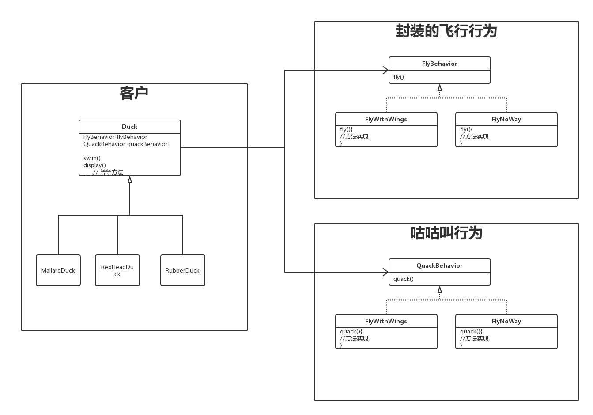

# 综述

三年以上工作经历，常见的设计模式（多说设计模式种类） 最好能说出JDK，Spring、 Tomcat中底层的一些实现用到哪些设计模式

内容基本都是选自《Head First 设计模式》


大致按照模式的应用目标分类，设计模式可以分为创建型模式、结构型模式和行为型模式。 

- 创建型模式，是对对象创建过程的各种问题和解决方案的总结，包括各种工厂模式(Factory、Abstract Factory)、单例模式(Singleton)、构建器模式(Builder)、原型模式(ProtoType )。
- 结构型模式，是针对软件设计结构的总结，关注于类、对象继承、组合方式的实践经验。常见的结构型模式，包括桥接模式(Bridge)、适配器模式(Adapter)、装饰者模式(Decorator)、代理模式(Proxy)、组合模式(Composite)、外观模式(Facade)、享元模式(Flyweight)等。 
- 行为型模式，是从类或对象之间交互、职责划分等角度总结的模式。比较常见的行为型模式有策略模式(Strategy)、解释器模式(Interpreter)、命令模式(Command)、观察者模式(Observer)、迭代器模式(Iterator)、模板方法模式(Template Method)、访问者模式(Visitor)。


# 创建型

对象创建过程的各种问题和解决方案的总结，包括各种工厂模式（Factory、Abstract Factory）、单例模式（Singleton）、构建器模式（Builder）、原型模式（ProtoType）。


## 工厂模式

> ## 简单工厂

这并不是一个真正的模式，他仅仅是把创建部分的代码单独提取出来，放到一个新方法中。


> ## 工厂方法模式

定义了一个创建对象的接口，但由子类决定要实例化的类是哪一个。工厂方法让类把实例化推迟到子类。


> ## 抽象工厂模式

提供一个接口，用于创建相关或依赖对象的家族，而不需要明确指定具体类。


**抽象工厂模式与工厂方法模式的区别**

　　抽象工厂模式是工厂方法模式的升级版，它用来创建一组相关或者相互依赖的对象。

　　它与工厂方法模式的区别在于：工厂方法模式针对的是一个产品等级结构，而抽象工厂模式则是针对的多个产品等级结构。在编程中，通常一个产品等级结构，表现为一个接口或抽象类，也就是说，工厂方法模式提供的所有产品都是衍生自同一个接口或抽象类，而抽象工厂模式所提供的产品则是衍生自不同的接口或抽象类，如上图中的ProductA和ProductB。

　　在抽象工厂模式中，有一个产品族的概念，所谓产品族，是指位于不同产品等级结构中功能相关联的产品组成的家族。抽象工厂模式所提供的一系列产品就组成了一个产品族；而工厂方法提供的一系列产品称为一个等级结构。如上图中的ProductA和ProductB称为两个不同的等级结构，ProductA1和ProductA2属于同一个等级结构，ProductB1和ProductB2属于另一个等级结构，而ProductA1和ProductB1属于同一个产品族，ProductA1和ProductB1同属于一个产品族。

　　如果产品全部属于同一个等级结构（即同一个接口或抽象类），则属于工厂方法模式；如果产品来自多个等级结构（即多个不同的接口或抽象类），则属于抽象工厂模式。


> ## 设计原则

**依赖倒置**—要依赖抽象，不要依赖具体具体类。

不能让高层组件依赖底层组件，而且，不管高层或底层组件，“两者”都应该依赖于抽象。


## 单例模式

确保一个类只有一个实例，并提供一个全局访问点。首先假定不会特地去反射创建对象，并且覆盖了0参数的构造函数。


方1：

```java
public class Singleton {
    private static Singleton uniqueInstance;
    
    public static Singleton getInstance（）{
        if(uniqueInstance == null){
            uniqueInstance = new Singleton();
        }
        
        return uniqueInstance;
    }
}
```

明显，多线程运行时会有问题。而且Java会自动为没有明确声明构造函数的类，定义一个public的无参数的构造函数，所以上面的例子并不能保证额外的对象不被创建出来，别人完全可以直接“new Singleton()”，那我们应该怎么处理呢?


方2：

```java
public class Singleton {
    private static Singleton uniqueInstance;
    
    public static synchronized Singleton getInstance（）{
        if(uniqueInstance == null){
            uniqueInstance = new Singleton();
        }
        
        return uniqueInstance;
    }
}
```

问题两点：

1. 整个方法加了同步，降低性能。
2. 只有第一次new的时候，同步才是有意义的，后续直接取值其实是直接取现有的，是不需要同步的，白白浪费时间。


方3：使用急切模式

```java
public class Singleton {
    private static final Singleton uniqueInstance = new Singleton();
    
    public static synchronized Singleton getInstance（）{
        return uniqueInstance;
    }
}
```


方4：双重检查加锁

```java
public class Singleton {
    private static volatile Singleton uniqueInstance;
    
    public static Singleton getInstance（）{
        if(uniqueInstance == null){
            synchronized(Singleton.class){
                if(uniqueInstance == null){
                        uniqueInstance = new Singleton();
                }
            }
        }
        
        return uniqueInstance;
    }
}
```

在这段代码中，争论较多的是volatile修饰静态变量，当Singleton类本身有多个成员变量时，需要保证初始化过程完成后，才能被get到。 在现代Java中，内存排序模型（JMM）已经非常完善，通过volatile的write或者read，能保证所谓的happen-before，也就是避免常被提到的指令重排。换句话说，构造对象 的store指令能够被保证一定在volatile read之前。


当然，也有一些人推荐利用内部类持有静态对象的方式实现，其理论依据是对象初始化过程中隐含的初始化锁(有兴趣的话你可以参考jls-12.4.2 中对LC的说明)，这种和前面的双 检锁实现都能保证线程安全，不过语法稍显晦涩，未必有特别的优势。

```java
public class Singleton {
  private Singleton(){}
  
	public satic Singleton getSingleton(){
    return Holder.singleton; 
  }
  
  private satic class Holder {
    private static Singleton singleton = new Singleton();
  } 
}
```


上面是比较学究的考察，其实实践中未必需要如此复杂，如果我们看Java核心类库自己的单例实现，比如java.lang.Runtime，你会发现:它并没使用复杂的双检锁之类。 静态实例被声明为final，这是被通常实践忽略的，一定程度保证了实例不被篡改(专栏第6讲介绍过，反射之类可以绕过私有访问限制)，也有有限的保证执行顺序的语义。

```java
private static final Runtime currentRuntime = new Runtime(); 
private static Version version;
//...
public static Runtime getRuntime() {
  return currentRuntime; 
}
/** Don't let anyone else instantiate this class */ 
private Runtime() {}
```


# 结构型

是针对软件设计结构的总结，关注于类、对象继承、组合方式的实践经验。常见的结构型模式，包括桥接模式（Bridge）、适配器模式（Adapter）、装饰者模式 （Decorator）、代理模式（Proxy）、组合模式（Composite）、外观模式（Facade）、享元模式（Flyweight）等。


​	

# 行为型

从类或对象之间交互、职责划分等角度总结的模式。比较常见的行为型模式有策略模式（Strategy）、解释器模式（Interpreter）、命令模式（Command）、 观察者模式（Observer）、迭代器模式（Iterator）、模板方法模式（Template Method）、访问者模式（Visitor）。


## 策略模式

定义了算法族，分别封装起来，让他们之间可以相互替换，此模式让算法的变化独立与使用算法的客户。


>  ## 设计原则

**多用组合，少用继承**



- 在Duck类中，有2个成员变量是接口，在duck类的成员方法中调用这两个接口的方法。
- Duck应该写成一个抽象类会比较好，那2个接口的变量值的注入由子类来实现。
- 这样由于接口的不同实现类，所以调用了同一个方法的不同实现，完全不需要改Duck类代码。
- 需要新增的话也非常简单，由于两边完全解耦，所以代码也可以被其他模块复用。


## 观察者模式

定义了对象之间的一对多依赖，这样一来，当一个对象改变状态时，她的所有依赖者都会收到通知并自动更新。


- 简单来说就是被观察的类里面存一个List<interface>
- 所有的的观察者需要实现这个接口
- 观察着把自己放进被观察者的List里面
- 被观察者的某些方法执行之后，把这个list遍历一遍，调用接口的方法传递消息


> ## JDK

- 在JDK中有一个默认实现在`java.util`包下，但是在jdk9的时候已被废弃。
- 在Swing，java的图形界面中也用了这个模式，按钮之类的。


## 装饰者模式

动态地将责任附加到对象上。若要扩展功能，装饰者提供了比继承更有弹性的替代方案。


> ## 设计原则

**开闭原则—对扩展开放，对修改关闭**


最简单的例子，充分利用多态，用父类对象来接收子类。

```java
public father{
   ……
}

//son1,son2...都是一样的
public class son1 extends father{
    Father father;
    public son1(Father father){
        this.father = father;
    }
}

Father father = new Father();
Father son1 = new Son1();
son1 = new Son2(son1);
son1 = new Son3(son1);
```


> ## JDK

- java I/O。最里面是一个`InputStream`，提供最基本的输入流。
- 封装第一层，`FileInputStram`文件的输入流等等


## 命令模式

Hystrix 

通过HystrixCommand 或者HystrixObservableCommand 将所有的外部系统（或者称为依赖）包装起来，整个包装对象是单独运行在一个线程之中（这是典型的命令模式）。


# JDK中用了哪些设计模式？


1. 装饰器模式

   IO相关类

   

2. 构建器模式(Builder)

   到处都是，`HttpReques reques = HttpReques.newBuilder(new URI(uri))`


# Spring中用了哪些设计模式？                                                                                  

1. 工厂模式

   BeanFactory和ApplicationContext。

   

2. 单例模式、原型

   spring bean的scope属性

   

3. 适配器模式

4. 包装器模式

   

5. 代理模式

   aop切面

   

6. 观察者模式

   定义对象间的一种一对多的依赖关系，当一个对象的状态发生改变时，所有依赖于它的对象都得到通知并被自动更新。
   spring中Observer模式常用的地方是listener的实现。如ApplicationListener。 

   

7. 策略模式

8. 模板方法模式

   JdbcTemplate

   

   [面试官：Spring中用了哪些设计模式？](https://mp.weixin.qq.com/s/iGbwKDqB6A0ktNCY8Wd-XQ)

   

