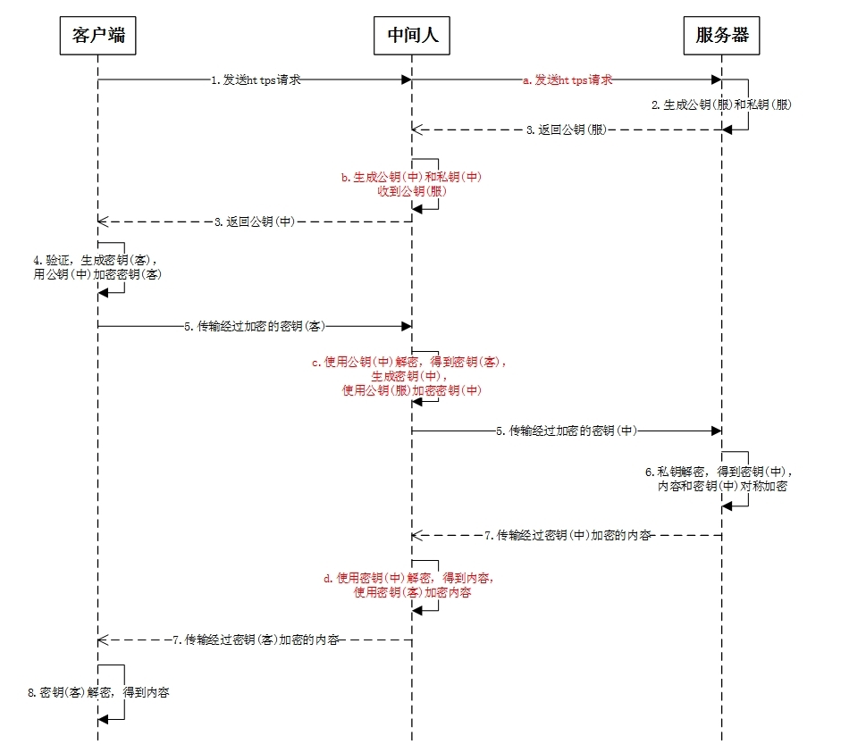

[面试复习整理](https://blog.vioao.site/posts/%E9%9D%A2%E8%AF%95%E5%A4%8D%E4%B9%A0%E6%95%B4%E7%90%86/)

# JDK

> 链表转化成红黑树的阈值怎么算出来的?
> 为什么红黑树缩回链表的阈值和进化的阈值不一样?

```java
 		/**
     * The bin count threshold for using a tree rather than list for a
     * bin.  Bins are converted to trees when adding an element to a
     * bin with at least this many nodes. The value must be greater
     * than 2 and should be at least 8 to mesh with assumptions in
     * tree removal about conversion back to plain bins upon
     * shrinkage.
     */
    static final int TREEIFY_THRESHOLD = 8;

    /**
     * The bin count threshold for untreeifying a (split) bin during a
     * resize operation. Should be less than TREEIFY_THRESHOLD, and at
     * most 6 to mesh with shrinkage detection under removal.
     */
    static final int UNTREEIFY_THRESHOLD = 6;

	/*	 
	 * Because TreeNodes are about twice the size of regular nodes, we
     * use them only when bins contain enough nodes to warrant use
     * (see TREEIFY_THRESHOLD). And when they become too small (due to
     * removal or resizing) they are converted back to plain bins.  In
     * usages with well-distributed user hashCodes, tree bins are
     * rarely used.  Ideally, under random hashCodes, the frequency of
     * nodes in bins follows a Poisson distribution
     * (http://en.wikipedia.org/wiki/Poisson_distribution) with a
     * parameter of about 0.5 on average for the default resizing
     * threshold of 0.75, although with a large variance because of
     * resizing granularity. Ignoring variance, the expected
     * occurrences of list size k are (exp(-0.5) * pow(0.5, k) /
     * factorial(k)). The first values are:
     *
     * 0:    0.60653066
     * 1:    0.30326533
     * 2:    0.07581633
     * 3:    0.01263606
     * 4:    0.00157952
     * 5:    0.00015795
     * 6:    0.00001316
     * 7:    0.00000094
     * 8:    0.00000006
     * more: less than 1 in ten million
		*/
```

TreeNodes占用空间是普通Nodes的两倍（相较于链表结构，链表只有指向下一个节点的指针，二叉树则需要左右指针，分别指向左节点和右节点），所以只有当bin包含足够多的节点时才会转成TreeNodes（考虑到时间和空间的权衡）。

当hashCode离散性很好的时候，树型bin用到的概率非常小，因为数据均匀分布在每个bin中，几乎不会有bin中链表长度会达到阈值。但是在随机hashCode下，离散性可能会变差，然而JDK又不能阻止用户实现这种不好的hash算法，因此就可能导致不均匀的数据分布。不过理想情况下随机hashCode算法下所有bin中节点的分布频率会遵循**泊松分布**，我们可以看到，一个bin中链表长度达到8个元素的概率为0.00000006，几乎是不可能事件。这种不可能事件都发生了，说明bin中的节点数很多，查找起来效率不高。至于7，是为了作为缓冲，可以有效防止链表和树频繁转换。


从另一个角度来说

红黑树的平均查找长度是log(n)，如果长度为8，平均查找长度为log(8)=3，链表的平均查找长度为n/2，当长度为8时，平均查找长度为8/2=4，这才有转换成树的必要；链表长度如果是小于等于6，6/2=3，而log(6)=2.6，虽然速度也很快的，但是转化为树结构和生成树的时间并不会太短。

> [源码分析---HashMap中链表和红黑树的转换阈值](https://blog.csdn.net/cg2258911936/article/details/103402684)


# JVM

> #### 大对象进入老年代,这个大对象是有多大?

-XX:PretenureSizeThreshold

指定大于该数值的对象直接进入老年代，避免在新生代的Eden和两个Survivor区域来回复制，产生大量内存复制操作。

缺点：只对Serial和ParNew两个新生代收集器有用

Minor GC的规则

jdk6_24之前，Minor GC之前先去老年代判断剩余连续内存空间是否大于新生代对象总和，如果大于就进行一次Minor GC；如果小于的话，会去判断你是否打开了分配担保策略，如果打开了就去判断老年代剩余连续内存空间是否大于之前每次Minor GC晋升老年代对象的平均大小，如果大于的话就尝试进行一次Minor GC，如果小于，或者没有打开分配担保策略的话就直接Full GC。

但是jdk6_24之后，就变了，不关心分配担保策略了，如果老年代剩余的连续内存空间大于之前Minor GC晋升老年代对象的平均大小的话，就进行Minor GC，如果小于的话就直接进行Full GC。


作者：Java鹏鹏
链接：https://www.jianshu.com/p/485958b65523
来源：简书
著作权归作者所有。商业转载请联系作者获得授权，非商业转载请注明出处。


> #### 重载和重写在 JVM 层面是怎么鉴别的?

1. 重载（overload）方法
   对重载方法的调用主要看静态类型，静态类型是什么类型，就调用什么类型的参数方法。 
2. 重写（override）方法
   对重写方法的调用主要看实际类型。实际类型如果实现了该方法则直接调用该方法，如果没有实现，则在继承关系中从低到高搜索有无实现。 

字节码的方法调用指令 ：

1. invokestatic：调用静态方法 
2. invokespecial：调用实例构造器方法，私有方法和父类方法。 
3. invokevirtual：调用所有的虚方法。 
4. invokeinterface：调用接口方法，会在运行时再确定一个实现此接口的对象。 
5. invokedynamic：先在运行时动态解析出调用点限定符所引用的方法，然后再执行该方法。 


> #### 永久带会涉及到 GC 回收么?

当永久代满或者超过临界值时，就会触发完全垃圾回收(Full GC)。条件是 ：

1. 该类的实例都被回收。 
2. 加载该类的classLoader已经被回收 
3. 该类不能通过反射访问到其方法，而且该类的java.lang.class没有被引用 

当满足这3个条件时，是可以回收，但回不回收还得看jvm。


# 计算机网络

> #### 你觉得使用了 HTTPS 之后还会出现问题么?出现问题了怎么办?

使用了https后，还有必要对数据进行签名来确保数据没有被篡改吗？ - 车小胖的回答 - 知乎 https://www.zhihu.com/question/52392988/answer/135060120

// todo


> #### Https 中间人劫持




使用中间人攻击手段，必须要让客户端信任中间人的证书，如果客户端不信任，则这种攻击手段也无法发挥作用。


> #### 301 和 302 状态码的区别?

- 301 redirect: 301 代表永久性转移(Permanently Moved)

- 302 redirect: 302 代表暂时性转移(Temporarily Moved )

详细来说，301和302状态码都表示重定向，就是说浏览器在拿到服务器返回的这个状态码后会自动跳转到一个新的URL地址，这个地址可以从响应的Location首部中获取（用户看到的效果就是他输入的地址A瞬间变成了另一个地址B）——这是它们的共同点。

他们的不同在于：

- 301表示旧地址A的资源已经被永久地移除了（这个资源不可访问了），**搜索引擎在抓取新内容的同时也将旧的网址交换为重定向之后的网址**；
- 302表示旧地址A的资源还在（仍然可以访问），这个重定向只是临时地从旧地址A跳转到地址B，**搜索引擎会抓取新的内容而保存旧的网址。**


[HTTP状态码列表](https://www.runoob.com/http/http-status-codes.html)


> #### TCP三次连接，这个listen backLog有什么作用？

创建TCP服务的四个基本步骤：

1. socket – 创建socket套接字。
2. bind – 绑定要监听的IP地址。
3. listen – 开始监听客户端连接请求。
4. accept – 获取TCP握手成功的连接。

其中，第3步，开始监听客户端的连接请求时，需要指定一个backlog的参数：

```cpp
int listen(int sockfd, int backlog);
```

建立TCP连接有一个“三次握手”的过程：

1. 客户端向服务端发起连接请求，发送SYN包。
2. 服务端收到客户端的SYN包后向客户端响应ACK+SYN包，同时在内存中建立一个状态为**SYN-RECEIVED**的连接，将连接放进**incomplete connection queue**。
3. 客户端收到服务端的回包后，向服务发送ACK包。服务端收到ACK后，TCP连接进入**ESTABLISHED**状态，将连接放进**complete connection queue**，等待应用程序进行accept。

- 在Linux内核中，步骤2的未完成TCP连接由一个incomplete connection queue维护，其最大长度为`/proc/sys/net/ipv4/tcp_max_syn_backlog`。
- 步骤3的已完成TCP连接由一个complete connection queue维护，其最大长度为listen函数的参数`backlog`。


作者：linjinhe
链接：https://www.jianshu.com/p/71aba04df492
来源：简书
著作权归作者所有。商业转载请联系作者获得授权，非商业转载请注明出处。


# 场景问题

> #### 100瓶药1毒药

1.如果想从一堆东西中找出一个东西，必须为其做一特殊的标识。
2.100瓶药一瓶毒药，有100种情况，任一一种情况都可能发生。我们需要标识出这100种情况。
3.一只老鼠，生与死两种状态，标识两种情况，n只老鼠标识2^n种情况。
4.100种情况需要2^7 = 128标识。
第K瓶药	相应二进制	相应老鼠
1	0000001	第一支老鼠喝
2	0000010	第二支老鼠喝
3	0000011	第1，2只老鼠喝
100	1100100	第7只第6只第3只喝

1-7只老鼠（k1,k2…k7），死为1，活着为0。
毒药编号：2 ^ k1 + 2 ^ k2 +…+ 2 ^ k7
————————————————
版权声明：本文为CSDN博主「trashW」的原创文章，遵循CC 4.0 BY-SA版权协议，转载请附上原文出处链接及本声明。
原文链接：https://blog.csdn.net/qq_35377699/article/details/99828526


> #### 海量数据中找出前k大数（topk问题）

从20亿个数字的文本中，找出最大的前100个。

解决Top K问题有两种思路，

- 最直观：小顶堆（大顶堆 -> 最小100个数）；
- 较高效：Quick Select算法。
  - Quick Select的目标是找出第k大元素，所以
    - 若切分后的左子数组的长度 > k，则第k大元素必出现在左子数组中；
    - 若切分后的左子数组的长度 = k-1，则第k大元素为pivot；
    - 若上述两个条件均不满足，则第k大元素必出现在右子数组中。


通过一趟快排过后，序列将被分为(比key小的数,key,比key大的数)三部分，那么假设key的下标为i，如果k < i，则第K大的数必然在快排左边的区域；如果k = i，则key就是第k大的数；如果k > i，则k必然在快排的右边的区域。接下来递归即可得到第k大的数。


Quick Select的Java实现如下：

```java
public int findKthLargest(int[] nums, int k) {
  return quickSelect(nums, k, 0, nums.length - 1);
}

 
// quick select to find the kth-largest element
public int quickSelect(int[] arr, int k, int left, int right) {
  if (left == right) return arr[right];
  int index = partition(arr, left, right);
  if (index - left + 1 > k)
    return quickSelect(arr, k, left, index - 1);
  else if (index - left + 1 == k)
    return arr[index];
  else
    return quickSelect(arr, k - index + left - 1, index + 1, right);
}

private int partition(int arr[], int left, int right) {
  int i = left, j = right + 1, pivot = arr[left];
  while (true) {
    while (i < right && arr[++i] > pivot)
      if (i == right) break;
    while (j > left && arr[--j] < pivot)
      if (j == left) break;
    if (i >= j) break;
    swap(arr, i, j);
  }
  swap(arr, left, j);  // swap pivot and a[j]
  return j;
}
```

> [海量数据中找出前k大数（topk问题）](https://www.cnblogs.com/foxy/p/9295289.html)


# 技术方案

微信小程序登录的流程?
JS SDK 登录和后端请求微信服务器登录的区别?


# redis

> #### 在生成 RDB 的过程当中,还能继续进行写入么?

Redis借助了fork命令的copy on write机制。在生成快照时，将当前进程fork出一个子进程，然后在子进程中循环所有的数据，将数据写成为RDB文件。所以是可以的，而且写入的时候也只是写入到缓存中，并不一定是会直接同步到磁盘上。


> #### 为什么 AOF 是数据先落盘再写日志?而数据库是先写日志再落盘?

mysql是WAL，为保证数据库的可恢复性，日志文件能够用来进行事务故障恢复、系统故障恢复，并能够协助后备副本进行介质故障恢复。当数据库文件毁坏后，可重新装入后援副本把数据库恢复到转储结束时刻的正确状态，再利用建立的日志文件，可以把已完成的事务进行重做处理，而对于故障发生时尚未完成的事务则进行撤消处理，这样不用运行应用程序就可把数据库恢复到故障前某一时刻的正确状态。

Redis 的数据是存内存的，断电之后就丢了，也没有类似mysql的事务功能。redis把AOF作为**当前状态**的固化手段。然后考虑写日志的时间开销，如果是后写日志，会有一个缓存，可以成批的写日志效率更高。


> #### 拥塞控制的算法有哪几种？

就是指：

慢开始( slow-start )、拥塞避免( congestion avoidance )、快重传( fast retransmit )和快恢复( fast recovery )。