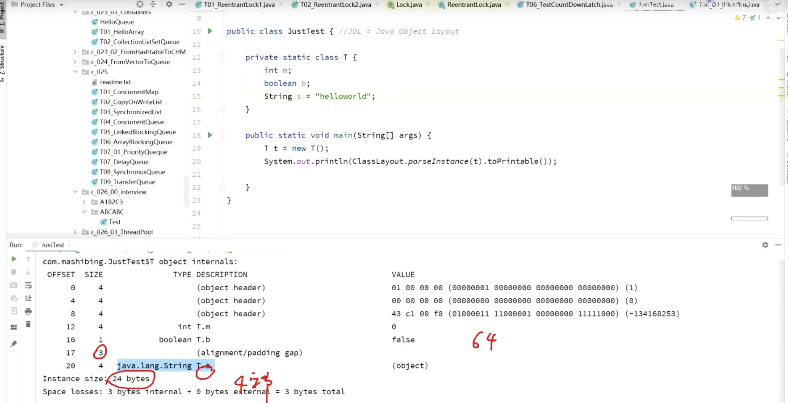
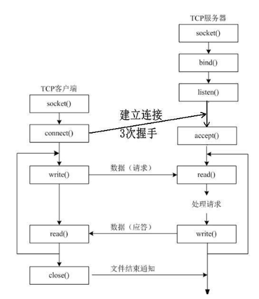
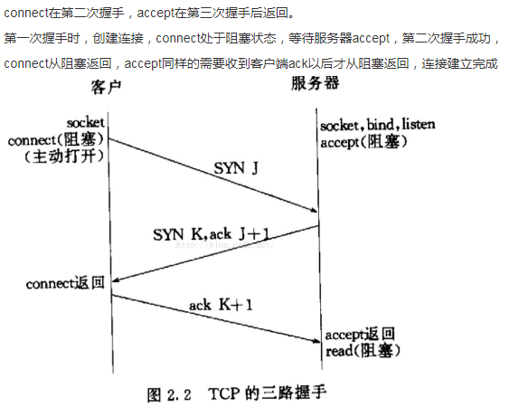

[面试复习整理](https://blog.vioao.site/posts/%E9%9D%A2%E8%AF%95%E5%A4%8D%E4%B9%A0%E6%95%B4%E7%90%86/)

# JDK

> 链表转化成红黑树的阈值怎么算出来的?
> 为什么红黑树缩回链表的阈值和进化的阈值不一样?

```java
 	/**
     * The bin count threshold for using a tree rather than list for a
     * bin.  Bins are converted to trees when adding an element to a
     * bin with at least this many nodes. The value must be greater
     * than 2 and should be at least 8 to mesh with assumptions in
     * tree removal about conversion back to plain bins upon
     * shrinkage.
     */
    static final int TREEIFY_THRESHOLD = 8;

    /**
     * The bin count threshold for untreeifying a (split) bin during a
     * resize operation. Should be less than TREEIFY_THRESHOLD, and at
     * most 6 to mesh with shrinkage detection under removal.
     */
    static final int UNTREEIFY_THRESHOLD = 6;

	/*	 
	 * Because TreeNodes are about twice the size of regular nodes, we
     * use them only when bins contain enough nodes to warrant use
     * (see TREEIFY_THRESHOLD). And when they become too small (due to
     * removal or resizing) they are converted back to plain bins.  In
     * usages with well-distributed user hashCodes, tree bins are
     * rarely used.  Ideally, under random hashCodes, the frequency of
     * nodes in bins follows a Poisson distribution
     * (http://en.wikipedia.org/wiki/Poisson_distribution) with a
     * parameter of about 0.5 on average for the default resizing
     * threshold of 0.75, although with a large variance because of
     * resizing granularity. Ignoring variance, the expected
     * occurrences of list size k are (exp(-0.5) * pow(0.5, k) /
     * factorial(k)). The first values are:
     *
     * 0:    0.60653066
     * 1:    0.30326533
     * 2:    0.07581633
     * 3:    0.01263606
     * 4:    0.00157952
     * 5:    0.00015795
     * 6:    0.00001316
     * 7:    0.00000094
     * 8:    0.00000006
     * more: less than 1 in ten million
		*/
```

TreeNodes占用空间是普通Nodes的两倍（相较于链表结构，链表只有指向下一个节点的指针，二叉树则需要左右指针，分别指向左节点和右节点），所以只有当bin包含足够多的节点时才会转成TreeNodes（考虑到时间和空间的权衡）。

当hashCode离散性很好的时候，树型bin用到的概率非常小，因为数据均匀分布在每个bin中，几乎不会有bin中链表长度会达到阈值。但是在随机hashCode下，离散性可能会变差，然而JDK又不能阻止用户实现这种不好的hash算法，因此就可能导致不均匀的数据分布。不过理想情况下随机hashCode算法下所有bin中节点的分布频率会遵循**泊松分布**，我们可以看到，一个bin中链表长度达到8个元素的概率为0.00000006，几乎是不可能事件。这种不可能事件都发生了，说明bin中的节点数很多，查找起来效率不高。至于7，是为了作为缓冲，可以有效防止链表和树频繁转换。


从另一个角度来说

红黑树的平均查找长度是log(n)，如果长度为8，平均查找长度为log(8)=3，链表的平均查找长度为n/2，当长度为8时，平均查找长度为8/2=4，这才有转换成树的必要；链表长度如果是小于等于6，6/2=3，而log(6)=2.6，虽然速度也很快的，但是转化为树结构和生成树的时间并不会太短。

> [源码分析---HashMap中链表和红黑树的转换阈值](https://blog.csdn.net/cg2258911936/article/details/103402684)


## 序列化的底层怎么实现的

Java序列化是指把Java对象转换为字节序列的过程，而Java反序列化是指把字节序列恢复为Java对象的过程。

- 序列化：对象序列化的最主要的用处就是在传递和保存对象的时候，保证对象的完整性和可传递性。序列化是把**对象转换成有序字节流**，以便在网络上传输或者保存在本地文件中。序列化后的字节流保存了Java对象的状态以及相关的描述信息。序列化机制的核心作用就是对象状态的保存与重建。
- 反序列化：客户端从文件中或网络上获得序列化后的对象字节流后，根据字节流中所保存的对象状态及描述信息，通过反序列化重建对象。


JDK类库中序列化和反序列化API

- java.io.ObjectOutputStream：表示对象输出流；

  它的writeObject(Object obj)方法可以对参数指定的obj对象进行序列化，把得到的字节序列写到一个目标输出流中；- 

- java.io.ObjectInputStream：表示对象输入流；

  它的readObject()方法源输入流中读取字节序列，再把它们反序列化成为一个对象，并将其返回；


## equals、hashcode 与 ==

**==**

java中的数据类型，可分为两类：

1. 基本数据类型，也称原始数据类型

   byte,short,char,int,long,float,double,boolean 他们之间的比较，应用双等号（==）,比较的是他们的值。 

2. 引用类型(类、接口、数组)   

   当他们用（==）进行比较的时候，比较的是他们在内存中的存放地址，所以，除非是同一个new出来的对象，他们的比较后的结果为true，否则比较后结果为false。

   对象是放在堆中的，栈中存放的是对象的引用（地址）。由此可见'=='是对栈中的值进行比较的。如果要比较堆中对象的内容是否相同，那么就要重写equals方法了。 


**equals**

默认情况（**没有覆盖equals方法**）下equals方法都是调用Object类的equals方法，而Object的equals方法主要用于判断对象的内存地址引用是不是同一个地址（是不是同一个对象）。下面是Object类中equals方法：

```java
    public boolean equals(Object obj) {
      return (this == obj);
    }
```


**hashCode**

hashCode()方法返回的就是一个数值，其目的是生成一个hash码。hash码的主要用途就是在对对象进行散列的时候作为key输入，据此很容易推断出，我们需要每个对象的hash码尽可能不同，这样才能保证散列的存取性能。事实上，Object类提供的默认实现确实保证每个对象的hash码不同（在对象的内存地址基础上经过特定算法返回一个hash码）。


**为什么覆盖equals时总要覆盖hashCode？**

如果不这样做的话，就会违反Object.hashCode的通用约定，从而导致该类无法结合所有基于散列的集合一起正常运作，这样的集合包括HashMap、HashSet和Hashtable。 


## int 的范围

前置的计算机组成原理知识：

- **二进制的最高位是符号位（“0”代表正数，“1”代表负数）；**

- **Java中没有无符号数；**

- **在计算机中，数值一律用补码来表示和存储，原因在于，使用补码，可以将符号位和数值域统一处理。同时，加法和减法也可以统一处理。**

- **计算机以整数的补码进行运算；**

  

1. 原码：将一个整数转换成二进制表示

   以 int 类型为例，int类型占4个字节、共32位。例如

   2 的原码为：00000000 00000000 00000000 00000010

   -2的原码为：10000000 00000000 00000000 00000010

2. 反码

   正数的反码：与原码相同

   负数的反码：原码的符号位不变，其他位取反

   例如，-2 的反码为：11111111 11111111 11111111 11111101

3. 补码

   正数的补码：与原码相同

   负数的补码：反码 + 1

   例如，-2 的补码为：11111111 11111111 11111111 11111110


Java中int型数据取值范围是$[-2^{31},2^{31}-1]$。

一个int值占4个字节byte，一个字节是8位bit（即8个二进制位），所以int型占32位。其中第一位是标志位，标志位为0表示正数，标志位为1表示负数，剩余的31位是用来表示数字部分的。

int型数据类型是有符号位的，所以这里拆分为两部分，一部分是正数，一部分是负数进行观察。

- 正数的范围是从1 ~ 2147483647的。

  1的原码为0000 0000 0000 0000 0000 0000 0000 0001。2147483647的原码为0111 1111 1111 1111 1111 1111 1111 1111。所以最大的正整数是2147483647。这里简单计算一下，为什么原码为0111 1111 1111 1111 1111 1111 1111 1111的最大的正整数是2147483647。

  当为1位时0000 0000 0000 0000 0000 0000 0000 0001，最大值的二进制就是1，也就是十进制的1 = 1，也就是2^1 -  1，当为2位时0000 0000 0000 0000 0000 0000 0000 0011，最大值的二进制是11，也就是十进制的1 + 2 = 3，也就是2^2 - 1，同理，8位时0000 0000 0000 0000 0000 0000 1111  1111，最大值的二进制是8个1，也就是1111 1111，算下来的十进制数值就是1 + 2 + 4 + 8 + 16 + 32 + 64 +  128 = 255，也就是2^8 - 1，依此类推即可。

  

- 负数的范围是从-1 ~ -2147483648的。例：

  ```
  -1的
  原码为1000 0000 0000 0000 0000 0000 0000 0001
  反码为1111 1111 1111 1111 1111 1111 1111 1110
  补码为1111 1111 1111 1111 1111 1111 1111 1111
  　　
  -2147483647的
  原码为1111 1111 1111 1111 1111 1111 1111 1111
  反码为1000 0000 0000 0000 0000 0000 0000 0000
  补码为1000 0000 0000 0000 0000 0000 0000 0001
  ```

  那么为什么负数的范围是从-1 ~ 2147483648的。因为要看0了。

  在二进制中，0有两种表方法。

  +0的原码为0000 0000 0000 0000 0000 0000 0000 0000

  -0的原码为1000 0000 0000 0000 0000 0000  0000 0000

  因为0只需要一个，所以把-0拿来当做一个最小的数-2147483648。-2147483648的补码表示为1000 0000 0000 0000 0000 0000 0000 0000，在32位没有原码。由于1000 0000 0000 0000 0000 0000 0000 0000本身代表的是2147483648（即2的32次方-1），再加上最高位为1，那么就是个负数，再加上所有的二进制表示又少了一个，因此，1000 0000 0000 0000 0000 0000 0000 0000就顺理成章的成了-2147483648，当然，1000 0000 0000 0000 0000 0000 0000 0000是补码，它没有原码和反码。

  -2147483648的补码表示为1000 0000 0000 0000 0000 0000 0000 0000，在32位没有原码。注意，这个补码并不是真正的补码，-2147483648真正的补码是1 1000 0000 0000 0000 0000 0000 0000 0000，在Java的int基本数据类型中溢出了。所以带符号32位int类型整数为-2147483648~2147483647


## 主线程的上下文如何传给子线程

主线程的上下文如何传给子线程，不能用传参的方式？

通常在一些常用的业务场景会需要考虑这个问题

1. 分布式链路追踪系统，traceId这种东西怎么往后传递，尤其是中间使用了线程池的情况下。
2. 日志收集记录系统上下文，一般都是异步的进行收集，那么上下文怎么共享。

除了使用静态变量之外，推荐几个jdk自带的类：


**InheritableThreadLocal**

原理：

在 Thead 类中有两个成员变量

```java
public class Thread implements Runnable {
   ......(其他源码)
    /* 
     * 当前线程的ThreadLocalMap，主要存储该线程自身的ThreadLocal
     */
    ThreadLocal.ThreadLocalMap threadLocals = null;

    /*
     * InheritableThreadLocal，自父线程集成而来的ThreadLocalMap，
     * 主要用于父子线程间ThreadLocal变量的传递
     * 本文主要讨论的就是这个ThreadLocalMap
     */
    ThreadLocal.ThreadLocalMap inheritableThreadLocals = null;
    ......(其他源码)
}

    /**
     * 一个线程初始化的使用会调用 init 方法
     * 初始化一个线程.
     * 此函数有两处调用，
     * 1、上面的 init()，不传AccessControlContext，inheritThreadLocals=true
     * 2、传递AccessControlContext，inheritThreadLocals=false
     */
    private void init(ThreadGroup g, Runnable target, String name,
                      long stackSize, AccessControlContext acc,
                      boolean inheritThreadLocals) {
        ......（其他代码）

        if (inheritThreadLocals && parent.inheritableThreadLocals != null)
            this.inheritableThreadLocals =
                ThreadLocal.createInheritedMap(parent.inheritableThreadLocals);

        ......（其他代码）
    }


        /**
         * 构建一个包含所有parentMap中Inheritable ThreadLocals的ThreadLocalMap
         * 该函数只被 createInheritedMap() 调用.
         */
        private ThreadLocalMap(ThreadLocalMap parentMap) {
            Entry[] parentTable = parentMap.table;
            int len = parentTable.length;
            setThreshold(len);
            // ThreadLocalMap 使用 Entry[] table 存储ThreadLocal
            table = new Entry[len];

            // 逐一复制 parentMap 的记录
            for (int j = 0; j < len; j++) {
                Entry e = parentTable[j];
                if (e != null) {
                    @SuppressWarnings("unchecked")
                    ThreadLocal<Object> key = (ThreadLocal<Object>) e.get();
                    if (key != null) {
                        Object value = key.childValue(e.value);
                        Entry c = new Entry(key, value);
                        int h = key.threadLocalHashCode & (len - 1);
                        while (table[h] != null)
                            h = nextIndex(h, len);
                        table[h] = c;
                        size++;
                    }
                }
            }
        }	
```

1. 当创建线程的时候，获取当前线程父线程，其实就是创建这个线程的线程

2. 判断 inheritThreadLocals 是否为true ，同时判断父节点的 inheritableThreadLocals 是否为空， 如果不为空，则把父类的inheritableThreadLocals对象拿出来，作为参数代用 threadLocal 的构造方法，创建子线程的 inheritableThreadLocals 对象。

3. 在这个if里面，针对当前线程做了inheritableThreadLocals的初始化， 把父线程的inheritableThreadLocals值拷贝到本线程的 threadLocal 里面来。

注意：inheritableThreadLocals 只是变量名，他本身是一个 ThreadLocal.ThreadLocalMap 对象。


使用 jdk 提供的 inheritThreadLocals 对象能很好的处理父子线程之间的变量传递，但是如果遇见了线程池，那么使用就会有问题。


**TransmittableThreadLocal**

简介

**TransmittableThreadLocal** 是Alibaba开源的、用于解决 **“在使用线程池等会缓存线程的组件情况下传递ThreadLocal”** 问题的 InheritableThreadLocal 扩展。若希望 TransmittableThreadLocal 在线程池与主线程间传递，需配合 *TtlRunnable* 和 *TtlCallable* 使用。


原理

- 自定义 TtlRunnable 实现 Runnable，TtlRunnable初始化方法中保持当前线程中已有的TransmittableThreadLocal，也就是抓到父类线程中的TransmittableThreadLocal对象。
- **线程池中线程** 调用run方法，执行前先backup holder中所有的TransmittableThreadLocal， copiedRef中不存在，holder存在的，说明是后来加进去的，remove掉holder中的；将copied中的TransmittableThreadLocal set到当前线程中。把父类的内容加载到子类中。
- 执行后再恢复 backup 的数据到 holder 中（backup中不存在，holder中存在的TransmittableThreadLocal，从holder中remove掉），将 backup 中的 TransmittableThreadLocal set到当前线程中。执行完毕后再把父类的删除，恢复子类自己的内容。


> [多线程篇-父子线程的上下文传递](https://zhuanlan.zhihu.com/p/302371055)
>
> [多线程篇-TransmittableThreadLocal解决池化复用线程的传值问题][https://zhuanlan.zhihu.com/p/302371614]
>
> [InheritableThreadLocal详解](https://www.jianshu.com/p/94ba4a918ff5)
>
> [TransmittableThreadLocal详解](https://www.jianshu.com/p/e0774f965aa3)
>
> [ThreadLocal系列（三）-TransmittableThreadLocal的使用及原理解析](https://www.cnblogs.com/hama1993/p/10409740.html)


# JVM

## 大对象进入老年代,这个大对象是有多大?

-XX:PretenureSizeThreshold

指定大于该数值的对象直接进入老年代，避免在新生代的Eden和两个Survivor区域来回复制，产生大量内存复制操作。

缺点：只对Serial和ParNew两个新生代收集器有用

Minor GC的规则

jdk6_24之前，Minor GC之前先去老年代判断剩余连续内存空间是否大于新生代对象总和，如果大于就进行一次Minor GC；如果小于的话，会去判断你是否打开了分配担保策略，如果打开了就去判断老年代剩余连续内存空间是否大于之前每次Minor GC晋升老年代对象的平均大小，如果大于的话就尝试进行一次Minor GC，如果小于，或者没有打开分配担保策略的话就直接Full GC。

但是jdk6_24之后，就变了，不关心分配担保策略了，如果老年代剩余的连续内存空间大于之前Minor GC晋升老年代对象的平均大小的话，就进行Minor GC，如果小于的话就直接进行Full GC。


作者：Java鹏鹏
链接：https://www.jianshu.com/p/485958b65523
来源：简书
著作权归作者所有。商业转载请联系作者获得授权，非商业转载请注明出处。


## 重载和重写在 JVM 层面是怎么鉴别的?

1. 重载（overload）方法
   对重载方法的调用主要看静态类型，静态类型是什么类型，就调用什么类型的参数方法。 
2. 重写（override）方法
   对重写方法的调用主要看实际类型。实际类型如果实现了该方法则直接调用该方法，如果没有实现，则在继承关系中从低到高搜索有无实现。 

字节码的方法调用指令 ：

1. invokestatic：调用静态方法 
2. invokespecial：调用实例构造器方法，私有方法和父类方法。 
3. invokevirtual：调用所有的虚方法。 
4. invokeinterface：调用接口方法，会在运行时再确定一个实现此接口的对象。 
5. invokedynamic：先在运行时动态解析出调用点限定符所引用的方法，然后再执行该方法。 


## 永久带会涉及到 GC 回收么?

当永久代满或者超过临界值时，就会触发完全垃圾回收(Full GC)。条件是 ：

1. 该类的实例都被回收。 
2. 加载该类的classLoader已经被回收 
3. 该类不能通过反射访问到其方法，而且该类的java.lang.class没有被引用 

当满足这3个条件时，是可以回收，但回不回收还得看jvm。


## 内存充裕，为什么会FGC？

old区可能才20%，就发生了FGC，可能原因：

1. 大对象，连续空间不够
2. 方法区空间不足，也会触发FGC
3. system.gc


## 一个对象在内存中占用多少字节？

https://www.bilibili.com/video/BV1hK4y1N7Ky?p=4  34分钟




new 了一个T对象，问这个T对象占多少内存。使用可视化工具后在控制台打印出了偏移量。

1. 对象头中3段，前两段是mark world 共8字节
2. 之后是4个字节的类型指针
3. 然后是T对象内部int类型的m占4个字节
4. T对象内的boolean类型的b占1个字节
5. 后面的3，是为了内存对齐，补齐的偏移，大小需要是8的倍数，方便寻址
6. 后面是引用类型的String，在开启压缩的情况下，64位的虚拟机，引用类型占4个字节，因为里面是存一个指针，指向常量区的helloworld，指针开了压缩是4个字节，不开是8个字节。

所以总的大小是24个字节。


## 美团对象创建相关问题

`Object object = new Object();`

1. 请解释一下对象创建的过程？（半初始化）
2. 加问DCL与volatile问题？（指令重排）
3. 对象在内存中的布局？（对象与数组的存储不同）
4. 对象头具体包括什么？（mark world klasspointer） synchronized锁信息
5. 对象怎么定位（直接、间接）
6. 对象怎么分配？（栈上 - 线程本地 - Eden - Old）
7. `Object object = new Object();`在内存中占用多少字节


## g1怎么计算价值的，怎么知道哪些区值得回收？

card（卡 ）和 card table （卡表）

每个region由若干个Card(512byte，card是堆内存最小可用粒度)构成，一个对象通常会占用一个region的若干个card，GC就是对region的card进行处理。

region的所有card记录在Card Table(byte[])中，通过byte[]下标保存card的地址，每个card默认未被引用，当一个card被引用时，值设为0。
Rset （Remembered Set）

每个Region都有一个Rset纪录其他region对本region的所有引用。通过扫描本region的RSet，来确定对region内的对象进行引用的对象是否存活，进而确定region内对象的存活情况。
Rset底层是Hash table，Key是region的起始地址，Value是Card Table卡表，卡表下标是card卡的地址，存放值为0表示被引用。

G1通过一个增量式的完全标记并发算法，计算region的活跃度，得到准确的region引用信息，不进行整堆扫描（整堆扫描效率低）。

- 写屏障(Write Barrier)
  效果类似AOP的前后置通知（方法增强），eg：写前屏障pre-write barrier 。write barrier通过一定的性能开销来跟踪和记录对象及其引用，批处理更新到Rset中。
- 并发优化线程(Concurrence Refinement Threads)
  写后屏障会将跨region的引用更新加入缓冲区，并发优化线程永远活跃，一旦发现全局列表有记录存在，就开始并发处理。

————————————————
版权声明：本文为CSDN博主「w_rcss」的原创文章，遵循CC 4.0 BY-SA版权协议，转载请附上原文出处链接及本声明。
原文链接：https://blog.csdn.net/w_rcss/article/details/102551289


# 计算机网络

> #### 你觉得使用了 HTTPS 之后还会出现问题么?出现问题了怎么办?

使用了https后，还有必要对数据进行签名来确保数据没有被篡改吗？ - 车小胖的回答 - 知乎 https://www.zhihu.com/question/52392988/answer/135060120

// todo


> #### Https 中间人劫持


使用中间人攻击手段，必须要让客户端信任中间人的证书，如果客户端不信任，则这种攻击手段也无法发挥作用。


> #### 301 和 302 状态码的区别?

- 301 redirect: 301 代表永久性转移(Permanently Moved)

- 302 redirect: 302 代表暂时性转移(Temporarily Moved )

详细来说，301和302状态码都表示重定向，就是说浏览器在拿到服务器返回的这个状态码后会自动跳转到一个新的URL地址，这个地址可以从响应的Location首部中获取（用户看到的效果就是他输入的地址A瞬间变成了另一个地址B）——这是它们的共同点。

他们的不同在于：

- 301表示旧地址A的资源已经被永久地移除了（这个资源不可访问了），**搜索引擎在抓取新内容的同时也将旧的网址交换为重定向之后的网址**；
- 302表示旧地址A的资源还在（仍然可以访问），这个重定向只是临时地从旧地址A跳转到地址B，**搜索引擎会抓取新的内容而保存旧的网址。**


[HTTP状态码列表](https://www.runoob.com/http/http-status-codes.html)


## TCP三次连接，这个listen backLog有什么作用？

创建TCP服务的四个基本步骤：

1. socket – 创建socket套接字。
2. bind – 绑定要监听的IP地址。
3. listen – 开始监听客户端连接请求。
4. accept – 获取TCP握手成功的连接。

其中，第3步，开始监听客户端的连接请求时，需要指定一个backlog的参数：

```cpp
int listen(int sockfd, int backlog);
```

建立TCP连接有一个“三次握手”的过程：

1. 客户端向服务端发起连接请求，发送SYN包。
2. 服务端收到客户端的SYN包后向客户端响应ACK+SYN包，同时在内存中建立一个状态为**SYN-RECEIVED**的连接，将连接放进**incomplete connection queue**。
3. 客户端收到服务端的回包后，向服务发送ACK包。服务端收到ACK后，TCP连接进入**ESTABLISHED**状态，将连接放进**complete connection queue**，等待应用程序进行accept。

- 在Linux内核中，步骤2的未完成TCP连接由一个incomplete connection queue维护，其最大长度为`/proc/sys/net/ipv4/tcp_max_syn_backlog`。
- 步骤3的已完成TCP连接由一个complete connection queue维护，其最大长度为listen函数的参数`backlog`。


作者：linjinhe
链接：https://www.jianshu.com/p/71aba04df492
来源：简书
著作权归作者所有。商业转载请联系作者获得授权，非商业转载请注明出处。


## [TCP三次握手的过程，accept发生在三次握手的哪一个阶段?](https://www.cnblogs.com/wuyepeng/p/9735978.html)

答案是：accept过程发生在三次握手之后，三次握手完成后，客户端和服务器就建立了tcp连接并可以进行数据交互了。这时可以调用accept函数获得此连接。



TCP建立连接的时候connect()函数和accept()函数分别在三次握手第几次后返回？



[TCP三次握手的过程，accept发生在三次握手的哪一个阶段?](https://www.cnblogs.com/wuyepeng/p/9735978.html)


## TCP四次挥手，Time WAIT发生在哪方？两个超时重传时间的作用？大量 TIME_WAIT怎么处理？

一个TCP/IP连接断开以后，会通过TIME_WAIT的状态保留一段时间，时间过了才会释放这个端口，当端口接受的频繁请求数量过多的时候，就会产生大量的TIME_WAIT状态的连接，这些连接占着端口，会消耗大量的资源。面对这种情况，可以通过修改TCP/IP的内核参数，来及时的处理这些状态。

编辑文件/etc/sysctl.conf，加入以下内容：

```
net.ipv4.tcp_syncookies = 1
net.ipv4.tcp_tw_reuse = 1
net.ipv4.tcp_tw_recycle = 1
net.ipv4.tcp_fin_timeout = 30
```

然后执行 /sbin/sysctl -p 让参数生效。


[TCP连接出现大量TIME_WAIT的解决办法](https://blog.csdn.net/u014252478/article/details/94736604)


> #### 拥塞控制的算法有哪几种？

就是指：

慢开始( slow-start )、拥塞避免( congestion avoidance )、快重传( fast retransmit )和快恢复( fast recovery )。


## 粘/拆 包

看了一下网络上的讨论，对粘/拆包的主要理解是，怎么把tcp的数据流划分成有意义的数据包的过程。也就是定义协议对数据流进行编码与解码的过程。


在面向stream的协议基础上实现一个面向message的协议，那么一般来说应用层和底层之间必然存在一个缓冲区和定时器。于是解析的过程就是，从socket中读取一次数据放入缓冲区，并检查目前buffer中内容是否是一个完整的message，如果是，提交给上层并修改队列起始位置，如果不是，不提交数据给上层。


作者：DCjanus
链接：https://www.zhihu.com/question/24598268/answer/625136503
来源：知乎
著作权归作者所有。商业转载请联系作者获得授权，非商业转载请注明出处。


因此，基于TCP的协议的，黏包、分包概念指都是自己业务层逻辑包，与协议本身无关。

至于解析自定义协议，可以看看陈硕老师的[muduo ](https://link.zhihu.com/?target=http%3A//www.cppblog.com/Solstice/category/15951.html)网络库。这个库确实写的挺好。

**针对你问的问题：一句话总结，不合符HTTP协议请求的缓存（到buffer里面）起来，继续接收数据，然后再验证，直到是一个完整的HTTP请求。这种是一个完整HTTP请求或应答数据，分了两次从socket buffer里面读取出来。**


作者：沉默无言
链接：https://www.zhihu.com/question/24598268/answer/431016679
来源：知乎
著作权归作者所有。商业转载请联系作者获得授权，非商业转载请注明出处。


> [解析 http 协议是否要处理粘包？ 是否要考虑到收到的数据包为不符 http 协议格式的数据包的情况?](https://www.zhihu.com/question/24598268)


## https公钥能用公钥解吗？

**公钥和私钥通常有可以互相加解密的特性：**

- 将原始信息用公钥加密后，可以使用私钥解密；

- 将原始信息用私钥加密后，通常可以使用公钥解密。

  

**一般公钥是对所有人公开的，原始数据使用公钥加密后，只有拥有私钥的人才能解密。**

也就是说只有公钥的情况下是无法解开加密的数据的。

而用**私钥加密的场合一般是数字签名，此时作用不是加密原始数据，而是证明该数据确实来自私钥的拥有者，没有被伪造或是篡改**。


## 在客户端抓包，看到的是加密的还是没加密的？

名词概念

- SSL/TLS

  SSL（Secure Sockets Layer）安全套接层。它是在上世纪90年代中期，由网景公司设计的。到了1999年，SSL 因为应用广泛，已经成为互联网上的事实标准。IETF 就在那年把 SSL 标准化。标准化之后的名称改为 TLS（Transport Layer Security），中文叫做传输层安全协议。TLS与SSL在传输层与应用层之间对网络连接进行加密。

- HTTPS

  说白了就是“HTTP 协议”和“SSL/TLS 协议”的组合。你可以把 HTTPS 大致理解为——“HTTP over SSL”或“HTTP over TLS”（反正 SSL 和 TLS 差不多）。

那问题就简单了，由于是在http 与 tcp 之间，抓包抓的是http协议的包，当你抓发送包的时候，还没有加密。抓接受包的时候已经解密了，所以看到的肯定是没加密的明文。


# 场景问题

> #### 100瓶药1毒药

1.如果想从一堆东西中找出一个东西，必须为其做一特殊的标识。
2.100瓶药一瓶毒药，有100种情况，任一一种情况都可能发生。我们需要标识出这100种情况。
3.一只老鼠，生与死两种状态，标识两种情况，n只老鼠标识2^n种情况。
4.100种情况需要2^7 = 128标识。
第K瓶药	相应二进制	相应老鼠
1	0000001	第一支老鼠喝
2	0000010	第二支老鼠喝
3	0000011	第1，2只老鼠喝
100	1100100	第7只第6只第3只喝

1-7只老鼠（k1,k2…k7），死为1，活着为0。
毒药编号：2 ^ k1 + 2 ^ k2 +…+ 2 ^ k7
————————————————
版权声明：本文为CSDN博主「trashW」的原创文章，遵循CC 4.0 BY-SA版权协议，转载请附上原文出处链接及本声明。
原文链接：https://blog.csdn.net/qq_35377699/article/details/99828526


> #### 海量数据中找出前k大数（topk问题）

从20亿个数字的文本中，找出最大的前100个。

解决Top K问题有两种思路，

- 最直观：小顶堆（大顶堆 -> 最小100个数）；
- 较高效：Quick Select算法。
  - Quick Select的目标是找出第k大元素，所以
    - 若切分后的左子数组的长度 > k，则第k大元素必出现在左子数组中；
    - 若切分后的左子数组的长度 = k-1，则第k大元素为pivot；
    - 若上述两个条件均不满足，则第k大元素必出现在右子数组中。


通过一趟快排过后，序列将被分为(比key小的数,key,比key大的数)三部分，那么假设key的下标为i，如果k < i，则第K大的数必然在快排左边的区域；如果k = i，则key就是第k大的数；如果k > i，则k必然在快排的右边的区域。接下来递归即可得到第k大的数。


Quick Select的Java实现如下：

```java
public int findKthLargest(int[] nums, int k) {
  return quickSelect(nums, k, 0, nums.length - 1);
}

 
// quick select to find the kth-largest element
public int quickSelect(int[] arr, int k, int left, int right) {
  if (left == right) return arr[right];
  int index = partition(arr, left, right);
  if (index - left + 1 > k)
    return quickSelect(arr, k, left, index - 1);
  else if (index - left + 1 == k)
    return arr[index];
  else
    return quickSelect(arr, k - index + left - 1, index + 1, right);
}

private int partition(int arr[], int left, int right) {
  int i = left, j = right + 1, pivot = arr[left];
  while (true) {
    while (i < right && arr[++i] > pivot)
      if (i == right) break;
    while (j > left && arr[--j] < pivot)
      if (j == left) break;
    if (i >= j) break;
    swap(arr, i, j);
  }
  swap(arr, left, j);  // swap pivot and a[j]
  return j;
}
```

> [海量数据中找出前k大数（topk问题）](https://www.cnblogs.com/foxy/p/9295289.html)


# 技术方案

微信小程序登录的流程?
JS SDK 登录和后端请求微信服务器登录的区别?


# redis

## 在生成 RDB 的过程当中,还能继续进行写入么?

Redis借助了fork命令的copy on write机制。在生成快照时，将当前进程fork出一个子进程，然后在子进程中循环所有的数据，将数据写成为RDB文件。所以是可以的，而且写入的时候也只是写入到缓存中，并不一定是会直接同步到磁盘上。


> #### 为什么 AOF 是数据先落盘再写日志?而数据库是先写日志再落盘?

mysql是WAL，为保证数据库的可恢复性，日志文件能够用来进行事务故障恢复、系统故障恢复，并能够协助后备副本进行介质故障恢复。当数据库文件毁坏后，可重新装入后援副本把数据库恢复到转储结束时刻的正确状态，再利用建立的日志文件，可以把已完成的事务进行重做处理，而对于故障发生时尚未完成的事务则进行撤消处理，这样不用运行应用程序就可把数据库恢复到故障前某一时刻的正确状态。

Redis 的数据是存内存的，断电之后就丢了，也没有类似mysql的事务功能。redis把AOF作为**当前状态**的固化手段。然后考虑写日志的时间开销，如果是后写日志，会有一个缓存，可以成批的写日志效率更高。


# 智力题

## 给你一个 5L 和 3L 桶，水无限多，怎么到出 4L。

先将 3L 的桶装满水，倒入 5L 的桶里。 再重新将 3L 的桶装满水，倒入 5L 的桶里，把 5 L 的桶装满后，这样 3L 的桶中就剩下 1L 的水了。 然后把 5L 的桶里的水倒掉，把 3L 的桶中剩下的 1L 水倒入 5L 的桶里。 再打满 3L 的水倒入 5L 的桶里，就是 4L 了。


**思维拓展**

- 用 3L 和 5L 的水桶装出 1L 水，可以，3+3-5=1。
- 用 3L 和 5L 的水桶装出 2L 水，可以，5-3=2。
- 用 3L 和 5L 的水桶装出 3L 水，可以，3=3。
- 用 3L 和 5L 的水桶装出 4L 水，可以，3+3-5+3=4。
- 用 3L 和 5L 的水桶装出 5L 水，可以，5=5。
- 用 3L 和 5L 的水桶装出 6L 水，可以，3+3=6。
- 用 3L 和 5L 的水桶装出 7L 水，可以，5+5-3=7。
- 用 3L 和 5L 的水桶装出 8L 水，可以，3+5=8。


[给你一个 5L 和 3L 桶，水无限多，怎么到出 4L。](https://www.cnblogs.com/hgnulb/p/10126951.html)
